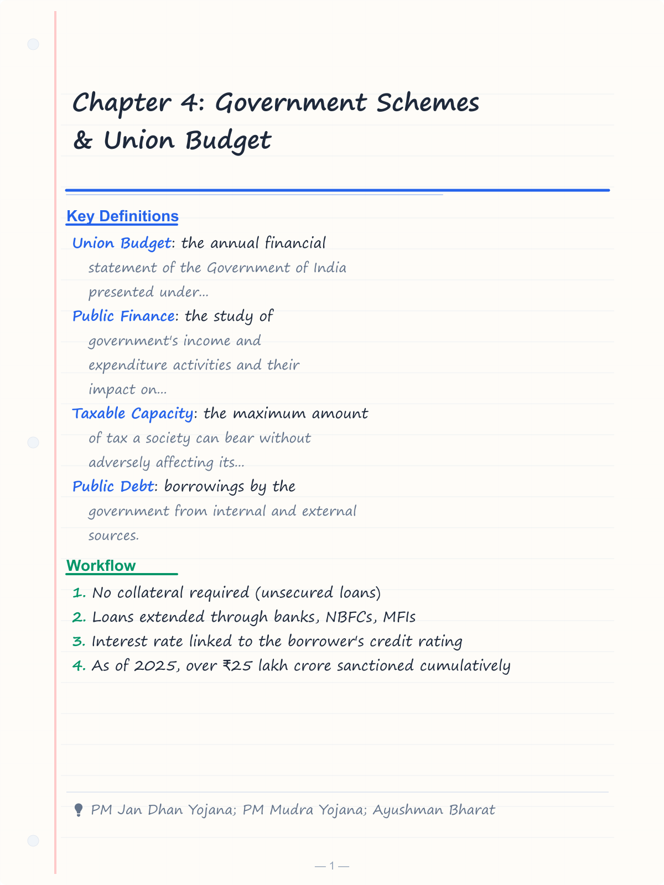
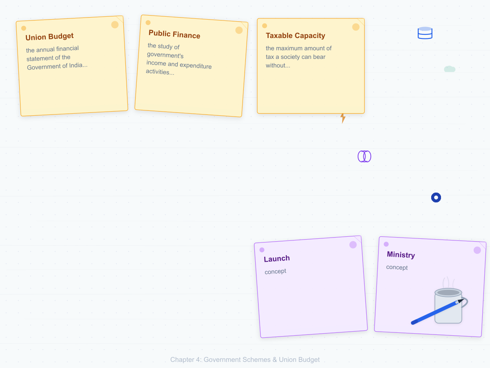
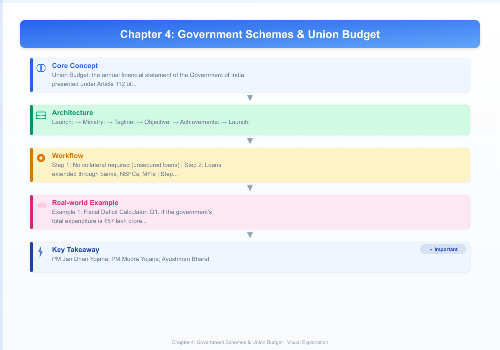
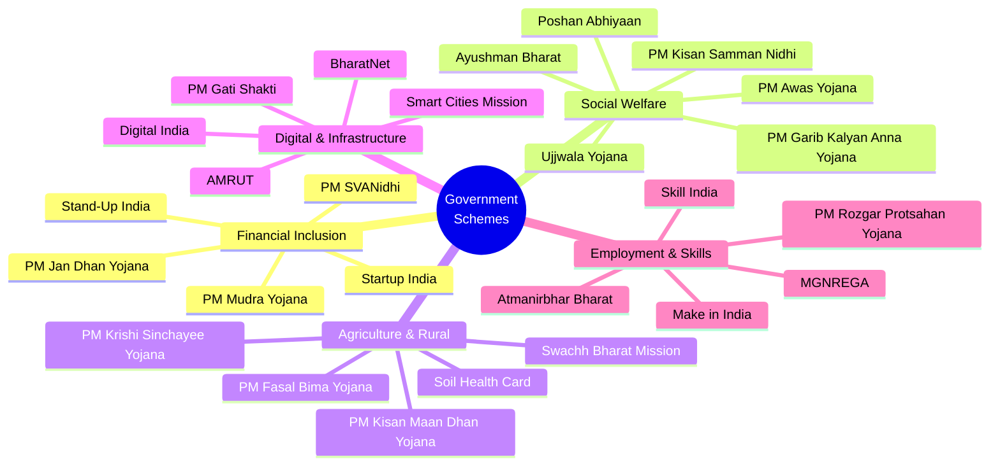
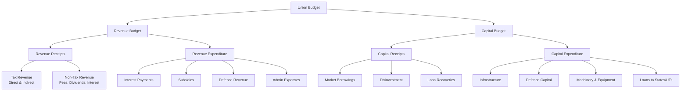
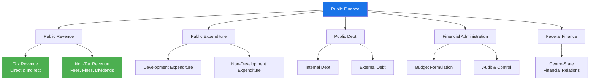
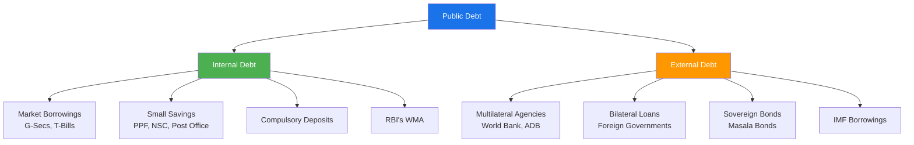
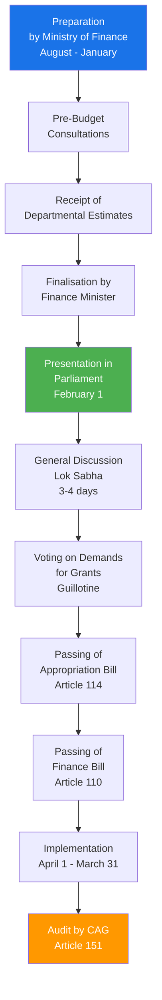

# Chapter 4: Government Schemes & Union Budget

## Learning Objectives

By the end of this chapter, you will be able to:
- Identify and describe major central government schemes across financial inclusion, social welfare, rural development, and infrastructure
- Match each scheme with its implementing ministry and launch year
- Differentiate between revenue and capital expenditure components of the Union Budget
- Calculate fiscal deficit, revenue deficit, and primary deficit
- Explain the FRBM Act and its fiscal consolidation targets
- Distinguish between direct and indirect taxes with examples
- Describe the GST structure (CGST, SGST, IGST) and its rate slabs

<!-- Image Gallery -->
<section class="lesson-visuals" aria-label="Visual learning resources">
  <header><span>VISUAL LEARNING</span><h2>See it. Review it. Remember it.</h2></header>
  <a class="lesson-visual-card" href="../../assets/images/lessons/banking-financial-awareness/04-government-schemes-budget/handwritten-notes.png" target="_blank" rel="noopener">
    
    <span><strong>Handwritten notes</strong>Condensed notes for deliberate review.</span>
  </a>
  <a class="lesson-visual-card" href="../../assets/images/lessons/banking-financial-awareness/04-government-schemes-budget/sticky-notes.png" target="_blank" rel="noopener">
    
    <span><strong>Sticky-note revision</strong>Fast recall prompts for revision.</span>
  </a>
  <a class="lesson-visual-card" href="../../assets/images/lessons/banking-financial-awareness/04-government-schemes-budget/visual-explanation.png" target="_blank" rel="noopener">
    
    <span><strong>Visual concept guide</strong>A connected explanation of the key ideas.</span>
  </a>
</section>
<!-- End Image Gallery -->

---

## Theory

### 4.1 Government Schemes — Overview



### 4.2 Detailed Scheme Descriptions

#### A. Pradhan Mantri Jan Dhan Yojana (PMJDY)

**Launch:** August 28, 2014
**Ministry:** Ministry of Finance
**Tagline:** "Mera Khata — Bhagya Vidhaata"

**Objective:** Ensure access to banking facilities (savings account, need-based credit, insurance, pension) for every household.

| Feature | Details |
|---------|---------|
| Account type | Zero-balance savings account |
| Overdraft limit | ₹10,000 (after 6 months of satisfactory operation) |
| RuPay debit card | Free with inbuilt accident cover of ₹2 lakh |
| Insurance | Life cover of ₹30,000 (for accounts opened before 26.1.2015) |
| Interest rate | 3.5–4% per annum on deposits |
| DBT linkage | Direct Benefit Transfer for subsidies |

**Achievements:** Over 50 crore accounts opened (as of 2025). **Phase I** (2014-15): Household coverage. **Phase II** (2015-onwards): Overdraft facility, insurance, pension linkage.

#### B. Pradhan Mantri Mudra Yojana (PMMY)

**Launch:** April 8, 2015
**Ministry:** Ministry of Finance

**Objective:** Provide loans up to ₹10 lakh to non-corporate, non-farm small/micro enterprises.

**Three categories:**

| Category | Loan Amount | Target |
|----------|-------------|--------|
| **Shishu** | Up to ₹50,000 | Start-ups and early-stage businesses |
| **Kishore** | ₹50,001 to ₹5 lakh | Established small businesses |
| **Tarun** | ₹5,00,001 to ₹10 lakh | Growth-stage businesses |

**Key features:**
- No collateral required (unsecured loans)
- Loans extended through banks, NBFCs, MFIs
- Interest rate linked to the borrower's credit rating
- As of 2025, over ₹25 lakh crore sanctioned cumulatively

#### C. Stand-Up India Scheme

**Launch:** April 5, 2016
**Ministry:** Ministry of Finance (SIDBI is nodal agency)

**Objective:** Promote entrepreneurship among **SC/ST and Women** by providing bank loans.

| Feature | Details |
|---------|---------|
| Target group | SC/ST borrowers and women entrepreneurs |
| Loan amount | ₹10 lakh to ₹1 crore |
| Margin money | Up to 15% (10% for SC/ST category) |
| Repayment | Up to 7 years |
| Number of accounts | At least 2 per bank branch |

#### D. Startup India

**Launch:** January 16, 2016
**Ministry:** Department for Promotion of Industry and Internal Trade (DPIIT)

**Key initiatives:**

| Initiative | Description |
|------------|-------------|
| **Tax exemption** | 3-year income tax holiday for eligible startups |
| **Fund of Funds** | ₹10,000 crore corpus managed by SIDBI |
| **Self-certification** | Compliance under 9 labour and 3 environment laws |
| **Startup India Hub** | Single-point contact for queries and handholding |
| **Patent benefits** | 80% rebate on patent filing fees |
| **Easy winding up** | 90-day exit window (Insolvency and Bankruptcy Code) |

**Definition of startup (DPIIT):** An entity incorporated < 10 years ago with turnover < ₹100 crore, working towards innovation/improvement of products/processes.

#### E. Pradhan Mantri Fasal Bima Yojana (PMFBY)

**Launch:** January 13, 2016
**Ministry:** Ministry of Agriculture & Farmers Welfare

**Objective:** Provide insurance coverage and financial support to farmers in case of crop failure.

| Feature | Details |
|---------|---------|
| Premium (Kharif) | 2% of sum insured for all farmers |
| Premium (Rabi) | 1.5% of sum insured |
| Premium (Commercial/Horticulture) | 5% of sum insured |
| Balance premium | Shared by Centre and State (50:50 for normal states; 90:10 for NE states) |
| Coverage | Yield loss (standing crops), prevented sowing, post-harvest losses, localised calamities |
| Technology | Use of smartphones, drones, remote sensing for yield estimation |

**Implementing agencies:** Empanelled insurance companies (Agriculture Insurance Company of India, private insurers).

#### F. Ayushman Bharat — Pradhan Mantri Jan Arogya Yojana (PM-JAY)

**Launch:** September 23, 2018 (on Dr. B.R. Ambedkar's birth anniversary)
**Ministry:** Ministry of Health & Family Welfare

**Objective:** Provide health insurance cover of ₹5 lakh per family per year for **secondary and tertiary care hospitalisation**.

| Feature | Details |
|---------|---------|
| Coverage | 5 lakh per family per year |
| Beneficiaries | Over 12 crore families (bottom 40% of population) |
| Hospitalisation | Cashless treatment at empanelled hospitals |
| Number of packages | Over 1,600 medical procedures |
| Gender/age | No discrimination; no cap on family size |
| Card | Ayushman Card (national portability) |

**Ayushman Bharat components:**
1. **Health & Wellness Centres (HWCs):** 1.5 lakh centres for primary care
2. **PM-JAY:** Health insurance for secondary/tertiary care

#### G. Pradhan Mantri Awas Yojana (PMAY)

**Launch:** June 25, 2015
**Ministry:** Ministry of Housing & Urban Affairs (PMAY-U) / Ministry of Rural Development (PMAY-G)

**PMAY-Urban (PMAY-U):**

| Component | Details |
|-----------|---------|
| Credit Linked Subsidy (CLS) | Subsidy on home loans for EWS/LIG/MIG |
| Subsidy tenure | Up to 20 years |
| EWS/LIG | Interest subsidy of 6.5% on loan up to ₹6 lakh |
| MIG-I | Interest subsidy of 4% on loan up to ₹9 lakh |
| MIG-II | Interest subsidy of 3% on loan up to ₹12 lakh |

**PMAY-Gramin (PMAY-G):** Provides financial assistance of ₹1.20 lakh in plains and ₹1.30 lakh in hilly/difficult areas for construction of pucca houses.

**Target:** "Housing for All by 2024" (over 3 crore houses sanctioned cumulatively).

#### H. Pradhan Mantri Ujjwala Yojana (PMUY)

**Launch:** May 1, 2016
**Ministry:** Ministry of Petroleum & Natural Gas

**Objective:** Provide free LPG connections to women from **Below Poverty Line (BPL)** households.

| Feature | Details |
|---------|---------|
| Initial target | 5 crore connections (achieved in 2019) |
| Extended target | 10 crore connections (by 2025) |
| Connection cost | Free (including first refill and stove) |
| Eligibility | Adult woman from BPL family |
| Financing | PAHAL (DBT) subsidy for subsequent refills |

#### I. Swachh Bharat Mission (SBM)

**Launch:** October 2, 2014
**Ministry:** Ministry of Jal Shakti (SBM-G) / Ministry of Housing & Urban Affairs (SBM-U)

**Objective:** Eliminate open defecation and improve solid waste management.

| Phase | Rural (SBM-G) | Urban (SBM-U) |
|-------|---------------|---------------|
| **Phase I** (2014-19) | Open Defecation Free (ODF) India | ODF + solid waste management |
| **Phase II** (2020-25) | ODF+ (sustaining ODF status) | ODF++ (faced sludge management) |
| Achievements | Over 10 crore toilets constructed | 100% door-to-door waste collection in wards |

#### J. Digital India

**Launch:** July 1, 2015
**Ministry:** Ministry of Electronics & Information Technology (MeitY)

**Three pillars:**
1. **Digital Infrastructure as a Core Utility to Every Citizen** (Broadband highways, universal mobile connectivity, public internet access)
2. **Governance & Services on Demand** (Integrated services, real-time grievance redressal, digital lockers)
3. **Digital Empowerment of Citizens** (Universal digital literacy, digital resources in Indian languages, collaborative digital platforms)

**Key initiatives under Digital India:**
- Aadhaar (12-digit biometric identity) — over 140 crore enrolments
- DigiLocker — digital document wallet
- UMANG — Unified Mobile Application for New-age Governance
- MyGov — citizen engagement platform
- eSign — online Aadhaar-based electronic signature
- BharatNet — broadband connectivity to all gram panchayats

#### K. Skill India Mission

**Launch:** July 15, 2015
**Ministry:** Ministry of Skill Development & Entrepreneurship

**Key programmes:**

| Programme | Target | Description |
|-----------|--------|-------------|
| **Pradhan Mantri Kaushal Vikas Yojana (PMKVY)** | 1 crore+ youth | Short-term skill training with certification |
| **National Apprenticeship Promotion Scheme (NAPS)** | 50 lakh apprentices | On-the-job training with stipend |
| **Skill Loan Scheme** | ₹5,000 to ₹1.5 lakh | Loan for skill courses |

**Target:** Skill 40 crore people by 2030.

#### L. PM-KISAN (Pradhan Mantri Kisan Samman Nidhi)

**Launch:** February 24, 2019
**Ministry:** Ministry of Agriculture & Farmers Welfare

**Feature:** Income support of ₹6,000 per year to all farmer families (landholding up to 2 hectares), paid in three equal instalments of ₹2,000 each.
- Beneficiaries: Over 10 crore farmers
- Transfer: Direct Benefit Transfer (DBT) to Aadhaar-linked bank accounts

#### M. Atmanirbhar Bharat Abhiyan

**Announced:** May 12, 2020 (during COVID-19)
**Total package:** ₹20 lakh crore (about 10% of GDP)

**Five pillars:**
1. Economy — ₹4.5 lakh crore stimulus
2. Infrastructure — ₹7.5 lakh crore (NIP)
3. System — Technology-driven systems
4. Demography — Skill-based workforce
5. Demand — Consumption boost

**Key components:** Emergency credit line guarantee (ECLGS) for MSMEs, free food grains (PMGKAY), margin money relaxation, TDS/TCS rate reduction.

### 4.3 Union Budget

The **Union Budget** is the annual financial statement of the Government of India presented under **Article 112 of the Constitution**.



#### A. Revenue Budget

**Revenue Receipts:** Non-recurring receipts of the government that do not create a liability or reduce assets.

| Component | Examples | 2025-26 Estimate (approx.) |
|-----------|----------|----------------------------|
| Corporation Tax | Tax on corporate profits | ₹10.2 lakh crore |
| Income Tax | Tax on individual incomes | ₹9.2 lakh crore |
| GST | Goods and Services Tax | ₹8.5 lakh crore |
| Customs | Import duties | ₹2.5 lakh crore |
| Excise | Taxes on manufactured goods | ₹3.5 lakh crore |
| Non-Tax Revenue | Dividends (RBI, PSUs), fees, fines | ₹4.0 lakh crore |

**Revenue Expenditure:** Expenditure that does not create assets (recurring in nature).

| Component | Examples |
|-----------|----------|
| Interest payments | Interest on government debt |
| Subsidies | Food, fertiliser, petroleum |
| Defence revenue | Salaries, maintenance |
| Administrative | Salaries, pensions |
| Grants to states | Central assistance |

#### B. Capital Budget

**Capital Receipts:** Receipts that create liability or reduce government assets.

| Component | Description |
|-----------|-------------|
| Market borrowings | Government borrows from the market (largest component) |
| Disinvestment | Sale of government equity in PSUs |
| Loan recoveries | Repayment of loans given to states/UTs |
| Small savings | PPF, NSC, etc. |

**Capital Expenditure:** Expenditure that creates assets or reduces liabilities.

| Component | Examples |
|-----------|----------|
| Infrastructure | Roads, railways, ports |
| Defence capital | Weapons, aircraft, ships |
| Loans to states & UTs | For capital projects |

#### C. Key Deficit Concepts

| Deficit | Formula | Meaning |
|---------|---------|---------|
| **Revenue Deficit** | Revenue Expenditure — Revenue Receipts | Shortfall in revenue account; indicates consumption beyond income |
| **Fiscal Deficit** | Total Expenditure — Total Receipts (excluding borrowings) | Total borrowing requirement of the government |
| **Primary Deficit** | Fiscal Deficit — Interest Payments | Borrowing excluding interest obligations |
| **Effective Revenue Deficit** | Revenue Deficit — Grants for creation of capital assets | Introduced in 2011-12 budget |

**Fiscal Defict = (Revenue Expenditure + Capital Expenditure) — (Revenue Receipts + Capital Receipts excluding borrowings)**

**Significance of fiscal deficit:**
- Indicates total government borrowing
- High fiscal deficit → government borrows more → higher interest rates → crowding out of private investment
- Financed through market borrowings, external loans, small savings

#### D. FRBM Act (Fiscal Responsibility and Budget Management Act)

**Enacted:** 2003 (came into effect from July 5, 2004)

**Objectives:**
- Ensure fiscal discipline and inter-generational equity
- Reduce fiscal deficit and revenue deficit
- Maintain macroeconomic stability

| Target | Original | Current (as per 2021 amendments) |
|--------|----------|----------------------------------|
| Fiscal Deficit | 3% of GDP | 4.5% of GDP by FY 2025-26 |
| Revenue Deficit | 0% by 2008-09 | Progressive reduction target |
| Debt-to-GDP | 40% (Centre), 20% (States) | 60% combined |

**Escape clause:** The FRBM Act allows the government to exceed deficit targets by up to **0.5% of GDP** in case of:
- National security / war / calamity
- Sharp decline in economic growth (growth falling below 3% below potential for 2 quarters)

**N.K. Singh Committee (2017):** Recommended a revised fiscal consolidation roadmap and debt-targeting framework.

### 4.4 Tax System in India

#### A. Direct Taxes

Taxes where the incidence falls **directly** on the taxpayer and cannot be shifted.

| Tax | Description | Administered by |
|-----|-------------|-----------------|
| **Income Tax** | Tax on individual/HUF/company income | CBDT (Central Board of Direct Taxes) |
| **Corporation Tax** | Tax on corporate profits | CBDT |
| **Capital Gains Tax** | Tax on profits from asset sales | CBDT |
| **Wealth Tax** | Abolished in 2015 | — |
| **Securities Transaction Tax (STT)** | Tax on stock market transactions | CBDT |

**Income tax slabs (New Tax Regime — FY 2025-26):**

| Income Range | Tax Rate |
|--------------|----------|
| Up to ₹3,00,000 | Nil |
| ₹3,00,001 to ₹7,00,000 | 5% |
| ₹7,00,001 to ₹10,00,000 | 10% |
| ₹10,00,001 to ₹12,00,000 | 15% |
| ₹12,00,001 to ₹15,00,000 | 20% |
| Above ₹15,00,000 | 30% |

**Capital Gains Tax (FY 2025-26):**

| Type | Holding Period | Tax Rate |
|------|---------------|----------|
| LTCG (Equity) | > 12 months | 10% above ₹1 lakh |
| STCG (Equity) | ≤ 12 months | 15% |
| LTCG (Debt) | > 36 months | 20% with indexation |
| STCG (Debt) | ≤ 36 months | As per income tax slab |

#### B. Indirect Taxes

Taxes where the incidence can be **shifted** from the seller to the consumer.

**Goods and Services Tax (GST):**
**Launch:** July 1, 2017 (GST Day: July 1)
**Constitutional amendment:** 101st Constitutional Amendment Act, 2016

**GST structure:**

| Component | Collected by | Applies to |
|-----------|-------------|------------|
| **CGST** (Central GST) | Central Government | Intra-state supplies |
| **SGST** (State GST) | State Government | Intra-state supplies |
| **IGST** (Integrated GST) | Central Government | Inter-state supplies + Imports |

**GST rate slabs:**

| Rate | Examples |
|------|----------|
| **0%** (Nil) | Essential items: food grains, milk, eggs, fresh vegetables, education services |
| **5%** | Mass consumption: packaged food items, sugar, tea, coffee, medicines |
| **12%** | Standard: processed food, computers, mobile phones, business class air travel |
| **18%** | Standard: IT services, telecom, restaurant (air-conditioned), hotel rooms (₹2,500+) |
| **28%** | Luxury: automobiles, tobacco, aerated drinks, luxury hotels, casinos |

**GST Council:**
- **Chairperson:** Union Finance Minister
- **Members:** State Finance Ministers, Union Minister of State for Finance
- **Purpose:** Recommend GST rates, exemptions, and policy changes

### 4.5 Other Budget Concepts

| Term | Definition |
|------|------------|
| **Vote on Account** | Interim budget passed before elections (e.g., February 2024) |
| **Interim Budget** | Presented in election year before the full Budget |
| **Outcome Budget** | Links budget allocations to measurable outcomes |
| **Gender Budget** | Allocation for schemes benefiting women |
| **Green Budget** | Environmental expenditure tracking |
| **Zero-Based Budgeting** | Each scheme justified from scratch annually |
| **Tax Buoyancy** | % change in tax revenue / % change in GDP |
| **Tax-GDP Ratio** | Total tax collection as % of GDP (~12% in India) |

---

## Examples with Solved Exercises

### Example 1: Fiscal Deficit Calculator

```typescript
interface FiscalMetrics {
  revenueExpenditure: number;
  capitalExpenditure: number;
  revenueReceipts: number;
  capitalReceiptsExclBorrowings: number;
  interestPayments: number;
  revenueDeficit: number;
  fiscalDeficit: number;
  primaryDeficit: number;
}

function calculateDeficits(
  revExp: number,
  capExp: number,
  revRec: number,
  capRecNoBorrow: number,
  interest: number
): FiscalMetrics {
  const totalExpenditure = revExp + capExp;
  const totalReceipts = revRec + capRecNoBorrow;
  const fiscalDeficit = totalExpenditure - totalReceipts;
  const revenueDeficit = revExp - revRec;
  const primaryDeficit = fiscalDeficit - interest;

  return {
    revenueExpenditure: revExp,
    capitalExpenditure: capExp,
    revenueReceipts: revRec,
    capitalReceiptsExclBorrowings: capRecNoBorrow,
    interestPayments: interest,
    revenueDeficit: Math.round(revenueDeficit),
    fiscalDeficit: Math.round(fiscalDeficit),
    primaryDeficit: Math.round(primaryDeficit),
  };
}

const budget = calculateDeficits(4500000, 1200000, 3800000, 500000, 950000);
console.log(`Fiscal Deficit: ₹${budget.fiscalDeficit} Cr, Rev Deficit: ₹${budget.revenueDeficit} Cr`);
// Output: Fiscal Deficit: ₹1400000 Cr, Rev Deficit: ₹700000 Cr
```

**Q1.** If the government's total expenditure is ₹57 lakh crore and total receipts (excluding borrowings) are ₹43 lakh crore, what is the fiscal deficit?

a) ₹10 lakh crore b) ₹14 lakh crore c) ₹57 lakh crore d) ₹100 lakh crore

<details>
<summary>Answer</summary>
**Answer:** b) ₹14 lakh crore

Fiscal Deficit = Total Expenditure — Total Receipts (excluding borrowings) = ₹57 lakh cr — ₹43 lakh cr = ₹14 lakh cr.
</details>

---

**Q2.** PM Jan Dhan Yojana was launched on which date?

a) August 15, 2014 b) August 28, 2014 c) January 26, 2015 d) October 2, 2014

<details>
<summary>Answer</summary>
**Answer:** b) August 28, 2014

PMJDY was launched on August 28, 2014 by Prime Minister Narendra Modi. It is a flagship financial inclusion scheme providing zero-balance accounts to all households.
</details>

---

**Q3.** Under GST, how many rate slabs are currently in operation?

a) 3 b) 4 c) 5 d) 6

<details>
<summary>Answer</summary>
**Answer:** c) 5 (including 0%)

The GST rate structure has five slabs: 0% (Nil), 5%, 12%, 18%, and 28%. Some items have special rates (e.g., 3% for gold).
</details>

---

### Example 2: GST Calculator

```typescript
interface GSTInvoice {
  basePrice: number;
  gstRate: number;
  cgst: number;
  sgst: number;
  igst: number;
  totalPrice: number;
  supplyType: 'Intra-state' | 'Inter-state';
}

function calculateGST(
  basePrice: number,
  gstRate: number,
  supplyType: 'Intra-state' | 'Inter-state'
): GSTInvoice {
  const gstAmount = basePrice * (gstRate / 100);

  if (supplyType === 'Intra-state') {
    const halfGst = gstAmount / 2;
    return {
      basePrice,
      gstRate,
      cgst: halfGst,
      sgst: halfGst,
      igst: 0,
      totalPrice: basePrice + gstAmount,
      supplyType,
    };
  } else {
    return {
      basePrice,
      gstRate,
      cgst: 0,
      sgst: 0,
      igst: gstAmount,
      totalPrice: basePrice + gstAmount,
      supplyType,
    };
  }
}

const intra = calculateGST(10000, 18, 'Intra-state');
console.log(`CGST: ₹${intra.cgst}, SGST: ₹${intra.sgst}, Total: ₹${intra.totalPrice}`);
// Output: CGST: ₹900, SGST: ₹900, Total: ₹11800

const inter = calculateGST(10000, 18, 'Inter-state');
console.log(`IGST: ₹${inter.igst}, Total: ₹${inter.totalPrice}`);
// Output: IGST: ₹1800, Total: ₹11800
```

**Q4.** The FRBM Act was enacted in which year?

a) 2000 b) 2003 c) 2005 d) 2010

<details>
<summary>Answer</summary>
**Answer:** b) 2003

The Fiscal Responsibility and Budget Management (FRBM) Act was enacted in 2003 and came into effect from July 5, 2004.
</details>

---

**Q5.** Which ministry implements the Skill India Mission?

a) Ministry of Education b) Ministry of Labour & Employment c) Ministry of Skill Development & Entrepreneurship d) Ministry of Finance

<details>
<summary>Answer</summary>
**Answer:** c) Ministry of Skill Development & Entrepreneurship

The Skill India Mission is implemented by the Ministry of Skill Development & Entrepreneurship, established in November 2014.
</details>

---

**Q6.** What is the maximum loan amount under the Mudra Yojana's Tarun category?

a) ₹50,000 b) ₹5 lakh c) ₹10 lakh d) ₹25 lakh

<details>
<summary>Answer</summary>
**Answer:** c) ₹10 lakh

Mudra scheme categories: Shishu (up to ₹50,000), Kishore (₹50,001 to ₹5 lakh), Tarun (₹5,00,001 to ₹10 lakh).
</details>

---

### Example 3: Tax Liability Calculator

```typescript
interface TaxCalculation {
  income: number;
  deductions: number;
  taxableIncome: number;
  taxBeforeCess: number;
  cess: number;
  totalTax: number;
}

function calculateIncomeTax(income: number, deductions: number): TaxCalculation {
  const taxableIncome = Math.max(0, income - deductions);
  let tax = 0;

  // Simplified new regime slabs (FY 2025-26)
  const slabs = [
    { limit: 300000, rate: 0 },
    { limit: 700000, rate: 5 },
    { limit: 1000000, rate: 10 },
    { limit: 1200000, rate: 15 },
    { limit: 1500000, rate: 20 },
    { limit: Infinity, rate: 30 },
  ];

  let remaining = taxableIncome;
  let lowerLimit = 0;

  for (const slab of slabs) {
    if (remaining <= 0) break;
    const taxableInSlab = Math.min(remaining, slab.limit - lowerLimit);
    tax += taxableInSlab * (slab.rate / 100);
    remaining -= taxableInSlab;
    lowerLimit = slab.limit;
  }

  const cess = tax * 0.04; // 4% health & education cess
  return {
    income,
    deductions,
    taxableIncome,
    taxBeforeCess: Math.round(tax),
    cess: Math.round(cess),
    totalTax: Math.round(tax + cess),
  };
}

const taxResult = calculateIncomeTax(1200000, 50000);
console.log(`Taxable Income: ₹${taxResult.taxableIncome}, Total Tax: ₹${taxResult.totalTax}`);
// Output: Taxable Income: ₹1150000, Total Tax: ₹65260
```

**Q7.** What is the health and education cess rate on income tax in India?

a) 2% b) 3% c) 4% d) 5%

<details>
<summary>Answer</summary>
**Answer:** c) 4%

Health and Education Cess is levied at 4% of the total income tax (including surcharge). This replaced the earlier 3% Education Cess in 2018.
</details>

---

**Q8.** Ayushman Bharat PM-JAY provides health insurance cover of:

a) ₹1 lakh per family b) ₹3 lakh per family c) ₹5 lakh per family d) ₹10 lakh per family

<details>
<summary>Answer</summary>
**Answer:** c) ₹5 lakh per family

PM-JAY provides health insurance coverage of ₹5 lakh per family per year for secondary and tertiary care hospitalisation to over 12 crore families (bottom 40% of population).
</details>

---

**Q9.** Which constitutional amendment enabled the introduction of GST in India?

a) 100th Amendment b) 101st Amendment c) 102nd Amendment d) 103rd Amendment

<details>
<summary>Answer</summary>
**Answer:** b) 101st Amendment

The Constitution (101st Amendment) Act, 2016 paved the way for the Goods and Services Tax by empowering both Centre and States to levy GST concurrently.
</details>

---

**Q10.** Under PM Kisan Samman Nidhi, how much financial assistance is provided per year?

a) ₹2,000 b) ₹6,000 c) ₹12,000 d) ₹18,000

<details>
<summary>Answer</summary>
**Answer:** b) ₹6,000

PM-KISAN provides ₹6,000 per year to eligible farmer families in three equal instalments of ₹2,000 each, directly transferred to Aadhaar-linked bank accounts.
</details>

---

### Example 4: Disinvestment Impact

```typescript
interface DisinvestmentAnalysis {
  governmentStakeBefore: number;
  governmentStakeAfter: number;
  sharesSold: number;
  pricePerShare: number;
  totalRealisation: number;
  postSaleGovtValue: number;
}

function analyseDisinvestment(
  totalShares: number,
  govtHoldingPercent: number,
  sharesToSell: number,
  currentPrice: number
): DisinvestmentAnalysis {
  const govtSharesBefore = totalShares * (govtHoldingPercent / 100);
  const govtSharesAfter = govtSharesBefore - sharesToSell;
  const govtStakeAfter = (govtSharesAfter / totalShares) * 100;
  const totalRealisation = sharesToSell * currentPrice;
  const postSaleValue = govtSharesAfter * currentPrice;

  return {
    governmentStakeBefore: govtHoldingPercent,
    governmentStakeAfter: Math.round(govtStakeAfter * 100) / 100,
    sharesSold: sharesToSell,
    pricePerShare: currentPrice,
    totalRealisation,
    postSaleGovtValue: postSaleValue,
  };
}

const dis = analyseDisinvestment(1000000, 75, 50000, 150);
console.log(`Government stake: ${dis.governmentStakeBefore}% → ${dis.governmentStakeAfter}%`);
console.log(`Realisation: ₹${dis.totalRealisation}`);
// Output: Government stake: 75% → 70%
// Output: Realisation: ₹7500000
```

**Q11.** Which of the following is a revenue receipt for the government?

a) Disinvestment proceeds b) Loan from World Bank c) GST collection d) Recovery of loans

<details>
<summary>Answer</summary>
**Answer:** c) GST collection

GST is a tax revenue (revenue receipt). Disinvestment, loans, and loan recoveries are capital receipts because they create liabilities or reduce assets.
</details>

---

**Q12.** The flagship scheme "Stand-Up India" aims to promote entrepreneurship among which groups?

a) Women only b) SC/ST and Women c) All rural youth d) Minorities only

<details>
<summary>Answer</summary>
**Answer:** b) SC/ST and Women

Stand-Up India (2016) provides bank loans from ₹10 lakh to ₹1 crore to at least one SC/ST borrower and one woman borrower per bank branch for setting up greenfield enterprises.
</details>

---

**Q13.** Under PM Awas Yojana (Urban), what is the interest subsidy available for EWS/LIG categories?

a) 3% b) 4% c) 6.5% d) 5%

<details>
<summary>Answer</summary>
**Answer:** c) 6.5%

Under CLSS (Credit Linked Subsidy Scheme) component of PMAY-U, EWS/LIG categories get an interest subsidy of 6.5% on home loans up to ₹6 lakh.
</details>

---

**Q14.** Swachh Bharat Mission was launched on:

a) August 15, 2014 b) October 2, 2014 c) January 26, 2015 d) July 1, 2015

<details>
<summary>Answer</summary>
**Answer:** b) October 2, 2014

Swachh Bharat Mission was launched on Mahatma Gandhi's birth anniversary (October 2, 2014). Phase I targeted ODF India by 2019.
</details>

---

**Q15.** The CGST (Central GST) component applies to:

a) Inter-state supplies b) Intra-state supplies c) Imports d) Exports

<details>
<summary>Answer</summary>
**Answer:** b) Intra-state supplies

CGST + SGST apply to intra-state supplies. IGST applies to inter-state supplies and imports. For intra-state, GST revenue is split equally between Centre and State.
</details>

---

### Example 5: Budget Deficit to GDP Ratio

```typescript
interface DeficitToGDP {
  fiscalDeficit: number;
  gdp: number;
  fdToGdpPercent: number;
  revenueDeficit: number;
  rdToGdpPercent: number;
  frbmTargetMet: boolean;
}

function analyseFiscalHealth(
  fiscalDeficit: number,
  revenueDeficit: number,
  gdp: number,
  frbmTargetPercent: number
): DeficitToGDP {
  const fdToGdp = (fiscalDeficit / gdp) * 100;
  const rdToGdp = (revenueDeficit / gdp) * 100;

  return {
    fiscalDeficit,
    gdp,
    fdToGdpPercent: Math.round(fdToGdp * 100) / 100,
    revenueDeficit,
    rdToGdpPercent: Math.round(rdToGdp * 100) / 100,
    frbmTargetMet: fdToGdp <= frbmTargetPercent,
  };
}

const health = analyseFiscalHealth(1560000, 650000, 35000000, 4.5);
console.log(`FD/GDP: ${health.fdToGdpPercent}% (Target: 4.5%, Met: ${health.frbmTargetMet})`);
// Output: FD/GDP: 4.46% (Target: 4.5%, Met: true)
```

**Q16.** Which of the following is NOT a feature of the PM Mudra Yojana?

a) Loans up to ₹10 lakh b) No collateral required c) Loans only for agricultural activities d) Three categories: Shishu, Kishore, Tarun

<details>
<summary>Answer</summary>
**Answer:** c) Loans only for agricultural activities

PM Mudra Yojana provides loans for **non-corporate, non-farm** small/micro enterprises. Agricultural loans are covered under Kisan Credit Card (KCC) and other schemes.
</details>

---

**Q17.** The N.K. Singh Committee was related to:

a) GST simplification b) Fiscal consolidation roadmap c) Banking reforms d) Education policy

<details>
<summary>Answer</summary>
**Answer:** b) Fiscal consolidation roadmap

The N.K. Singh Committee (2017) was constituted to review the FRBM Act and recommend a revised fiscal consolidation path and debt management framework.
</details>

---

**Q18.** Under the FRBM Act's escape clause, the government can exceed deficit target by:

a) 0.25% of GDP b) 0.5% of GDP c) 1% of GDP d) 2% of GDP

<details>
<summary>Answer</summary>
**Answer:** b) 0.5% of GDP

The FRBM Act allows the government to breach the fiscal deficit target by up to 0.5% of GDP in case of national security, calamity, or severe economic downturn.
</details>

---

**Q19.** What is the GST rate on restaurant services (air-conditioned)?

a) 5% b) 12% c) 18% d) 28%

<details>
<summary>Answer</summary>
**Answer:** c) 18%

AC restaurants attract 18% GST (9% CGST + 9% SGST). Non-AC restaurants are at 12%. Hotels with room tariffs above ₹7,500 attract 18%.
</details>

---

**Q20.** The term "Primary Deficit" is calculated as:

a) Revenue Deficit — Interest Payments b) Fiscal Deficit — Interest Payments c) Total Expenditure — Total Receipts d) Revenue Expenditure — Revenue Receipts

<details>
<summary>Answer</summary>
**Answer:** b) Fiscal Deficit — Interest Payments

Primary Deficit = Fiscal Deficit — Net Interest Payments. It shows the government's borrowing excluding interest obligations on past debt.
</details>

---

## TypeScript Example: Union Budget Analysis Tool

```typescript
interface BudgetAllocation {
  sector: string;
  allocatedAmount: number;
  utilizationPercent: number;
  actualSpent: number;
}

interface BudgetAnalysis {
  totalBudget: number;
  totalUtilized: number;
  overallUtilization: number;
  underutilizedSectors: string[];
  surplusSectors: string[];
}

function analyseBudget(sectors: BudgetAllocation[]): BudgetAnalysis {
  let totalBudget = 0;
  let totalUtilized = 0;
  const underutilizedSectors: string[] = [];
  const surplusSectors: string[] = [];

  for (const sector of sectors) {
    totalBudget += sector.allocatedAmount;
    sector.actualSpent = Math.round(sector.allocatedAmount * (sector.utilizationPercent / 100));
    totalUtilized += sector.actualSpent;

    if (sector.utilizationPercent < 70) {
      underutilizedSectors.push(sector.sector);
    } else if (sector.utilizationPercent > 100) {
      surplusSectors.push(sector.sector);
    }
  }

  return {
    totalBudget: Math.round(totalBudget),
    totalUtilized: Math.round(totalUtilized),
    overallUtilization: Math.round((totalUtilized / totalBudget) * 100),
    underutilizedSectors,
    surplusSectors,
  };
}

const budgetData: BudgetAllocation[] = [
  { sector: "Education", allocatedAmount: 120000, utilizationPercent: 85, actualSpent: 0 },
  { sector: "Health", allocatedAmount: 95000, utilizationPercent: 92, actualSpent: 0 },
  { sector: "Defence", allocatedAmount: 620000, utilizationPercent: 98, actualSpent: 0 },
  { sector: "Infrastructure", allocatedAmount: 280000, utilizationPercent: 65, actualSpent: 0 },
  { sector: "Agriculture", allocatedAmount: 150000, utilizationPercent: 78, actualSpent: 0 },
];

const analysis = analyseBudget(budgetData);
console.log(`Overall Utilization: ${analysis.overallUtilization}%`);
console.log(`Underutilized: ${analysis.underutilizedSectors.join(", ")}`);
// Output: Overall Utilization: 87%
// Output: Underutilized: Infrastructure
```

---

### 4.6 Public Finance — Nature and Scope

**Public Finance** is the study of government's income and expenditure activities and their impact on the economy.

| Aspect | Description |
|--------|-------------|
| **Nature** | Branch of Economics dealing with government revenue, expenditure, and debt management |
| **Scope** | Public revenue, public expenditure, public debt, financial administration, federal finance |
| **Objective** | Efficient allocation of resources, equitable distribution of income, economic stabilisation |
| **Key questions** | What goods should government provide? How to tax? How much to borrow? |

**Scope of Public Finance:**



### 4.7 Canons of Taxation

The **Canons of Taxation** were laid down by **Adam Smith** in his book *"The Wealth of Nations"* (1776). Modern economists have added more canons.

| Canon | Description | Adam Smith's Original |
|-------|-------------|-----------------------|
| **Canon of Equity** | Taxes should be based on ability to pay — rich pay more | Yes |
| **Canon of Certainty** | Taxpayer must know how much, when, and how to pay | Yes |
| **Canon of Convenience** | Method and timing of payment should be convenient | Yes |
| **Canon of Economy** | Cost of collection should be less than revenue collected | Yes |
| **Canon of Productivity** | Tax should yield sufficient revenue | No (added later) |
| **Canon of Elasticity** | Tax revenue should increase automatically with income | No (added later) |
| **Canon of Diversity** | Multiple tax sources reduce dependence on any single tax | No (added later) |
| **Canon of Simplicity** | Tax system should be simple and understandable | No (added later) |

**Mnemonic for Adam Smith's four canons:** **E-C-C-E** (Equity, Certainty, Convenience, Economy)

### 4.8 Taxable Capacity and Tax Incidence

**Taxable Capacity** is the maximum amount of tax a society can bear without adversely affecting its productive capacity and standard of living.

| Type | Definition | Factors |
|------|------------|---------|
| **Absolute Taxable Capacity** | Maximum total tax the nation can pay | National income, per capita income, wealth distribution |
| **Relative Taxable Capacity** | Ability to pay compared to other nations/regions | Tax-to-GDP ratio, per capita tax burden |
| **India's Tax-GDP Ratio** | ~12% (low compared to OECD average of ~34%) | Large informal economy, tax exemptions, low compliance |

**Tax Incidence** refers to who actually bears the burden of a tax.

| Concept | Meaning | Example |
|---------|---------|---------|
| **Impact of Tax** | Who pays the tax initially (point of levy) | GST paid by manufacturer/seller |
| **Incidence of Tax** | Who ultimately bears the burden | GST shifted to final consumer |
| **Shifting of Tax** | Process of transferring tax burden | Manufacturer adds GST to price → consumer pays |
| **Forward Shifting** | Burden shifted forward (supplier → consumer) | Excise duty included in product price |
| **Backward Shifting** | Burden shifted backward (buyer → seller/producer) | Demanding lower price due to tax |

### 4.9 Public Expenditure — Canons and Classification

**Canons of Public Expenditure** (Findlay Shirras):

| Canon | Description |
|-------|-------------|
| **Canon of Benefit** | Expenditure should yield maximum social benefit |
| **Canon of Economy** | No wasteful or extravagant spending |
| **Canon of Sanction** | All expenditure must have proper legal authorisation |
| **Canon of Surplus** | Avoid deficit financing wherever possible |
| **Canon of Elasticity** | Expenditure should be flexible — increase in crises, decrease in normal times |

**Classification of Public Expenditure:**

| Basis | Categories |
|-------|------------|
| **By Function** | Development (infrastructure, education) vs Non-development (defence, interest payments) |
| **By Benefit** | General (national defence) vs Specific (roads, hospitals) |
| **By Impact** | Revenue (consumption, recurring) vs Capital (asset-creating) |
| **By Authority** | Central, State, Local |

### 4.10 Public Debt — Internal vs External

**Public Debt** refers to borrowings by the government from internal and external sources.



| Aspect | Internal Debt | External Debt |
|--------|---------------|---------------|
| **Currency** | Domestic currency (₹) | Foreign currency ($, €, ¥) |
| **Lenders** | Domestic institutions and citizens | Foreign governments, multilateral agencies |
| **Interest outflow** | Within the country (transfer) | Outside the country (drain) |
| **Risk** | No exchange rate risk | Exchange rate risk (depreciation increases burden) |
| **Control** | Government has more control | Subject to external conditions |
| **Examples** | G-Secs, T-Bills, PPF, NSC | World Bank loans, ADB loans, bilateral debt |
| **India's composition** | ~95% of total debt | ~5% of total debt |

**Methods of Debt Redemption:**

| Method | Description |
|--------|-------------|
| **Refunding** | Raising new loans to repay old loans (debt rollover) |
| **Sinking Fund** | Setting aside a fixed sum annually in a separate fund to repay debt at maturity |
| **Conversion** | Changing terms of existing debt (lowering interest rate, extending maturity) |
| **Repudiation** | Government refuses to pay (rare, damages creditworthiness) |
| **Capital Levy** | One-time wealth tax to repay war/post-war debt |
| **Surplus Budgets** | Using revenue surpluses to repay debt |
| **Terminal Annuity** | Repaying principal and interest through equal annual instalments |

**Indian government debt composition:** ~95% internal, ~5% external. Total debt-to-GDP ratio is around 55-60% for the central government.

### 4.11 Budgetary Procedure in India

The Union Budget follows a systematic procedure:



| Stage | Timeline | Description |
|-------|----------|-------------|
| **Preparation** | August - January | Ministry of Finance prepares estimates with inputs from all ministries |
| **Presentation** | February 1 | Finance Minister presents Budget in Lok Sabha (since 2017, advanced from February 28) |
| **General Discussion** | 3-4 days post-presentation | MPs discuss broad principles and policies |
| **Voting on Demands** | March / April | Guillotine — all outstanding demands are voted together without discussion |
| **Appropriation Bill** | Before March 31 | Article 114 — authorises withdrawal of money from Consolidated Fund |
| **Finance Bill** | By March 31 | Article 110 — contains tax proposals |
| **Audit** | After implementation | Comptroller and Auditor General (CAG) audits accounts (Article 151) |

### 4.12 Comparison: Direct vs Indirect Taxes

| Aspect | Direct Tax | Indirect Tax |
|--------|-----------|--------------|
| **Incidence** | Cannot be shifted — paid directly by taxpayer | Can be shifted — ultimately borne by consumer |
| **Examples** | Income Tax, Corporation Tax, Capital Gains Tax | GST, Customs Duty, Excise Duty |
| **Administration** | CBDT (Central Board of Direct Taxes) | CBIC (Central Board of Indirect Taxes and Customs) |
| **Equity** | Progressive — based on ability to pay | Regressive — uniform rate regardless of income |
| **Inflationary impact** | Reduces disposable income (anti-inflationary) | Increases prices (potentially inflationary) |
| **Compliance cost** | Higher — requires detailed record-keeping | Lower — collected at point of sale |
| **Tax evasion** | Higher — under-reporting of income | Lower — embedded in price |
| **Convenience** | Paid annually/lump-sum | Paid in small amounts with each purchase |
| **India's share** | ~55% of total tax revenue | ~45% of total tax revenue |
| **Base** | Income, wealth, profits | Consumption, production, trade |

### 4.13 RBI Grade B / SBI PO / IBPS SO Exam Tips for Budget & Schemes

| Exam | Key Topics | Strategy |
|------|-----------|----------|
| **RBI Grade B** | Fiscal deficit targets, FRBM Act, public debt composition, canons of taxation, GST structure | Focus on fiscal consolidation timeline; understand economic survey analysis of deficits |
| **SBI PO** | Major government schemes (launch year, implementing ministry, features), union budget concepts, direct vs indirect taxes | Create a scheme chart (year + ministry + feature); memorise all FY numbers; practice deficit calculations |
| **IBPS SO** | Tax incidence, taxable capacity, public debt (internal vs external), budget procedure (Appropriation Bill vs Finance Bill) | Master the difference between revenue and capital items; learn the budget timeline stages |
| **Common tips** | Schemes launched between 2014-2025 are most frequently asked; know implementing ministries; understand GST compensation mechanism | Use mnemonics for scheme names; practice quantitative questions on deficits and tax calculations |

---

## TypeScript Example: Public Debt Servicing Calculator

```typescript
interface DebtServicingResult {
  totalDebt: number;
  internalDebt: number;
  externalDebt: number;
  averageInterestRate: number;
  annualInterestOutflow: number;
  debtToGdpRatio: number;
  gdp: number;
  interestToRevenueRatio: number;
  totalRevenue: number;
}

function calculateDebtServicing(
  totalDebt: number,
  internalPercent: number,
  externalPercent: number,
  avgInternalRate: number,
  avgExternalRate: number,
  gdp: number,
  totalRevenue: number
): DebtServicingResult {
  const internalDebt = totalDebt * (internalPercent / 100);
  const externalDebt = totalDebt * (externalPercent / 100);
  const interestOutflow = internalDebt * (avgInternalRate / 100) + externalDebt * (avgExternalRate / 100);
  const avgInterest = (interestOutflow / totalDebt) * 100;
  const debtGdpRatio = (totalDebt / gdp) * 100;
  const interestToRev = (interestOutflow / totalRevenue) * 100;

  return {
    totalDebt: Math.round(totalDebt),
    internalDebt: Math.round(internalDebt),
    externalDebt: Math.round(externalDebt),
    averageInterestRate: Math.round(avgInterest * 100) / 100,
    annualInterestOutflow: Math.round(interestOutflow),
    debtToGdpRatio: Math.round(debtGdpRatio * 100) / 100,
    gdp: Math.round(gdp),
    interestToRevenueRatio: Math.round(interestToRev * 100) / 100,
    totalRevenue: Math.round(totalRevenue),
  };
}

const debt = calculateDebtServicing(15000000, 95, 5, 7.2, 4.5, 35000000, 4200000);
console.log(`Internal: ₹${debt.internalDebt}, External: ₹${debt.externalDebt}`);
console.log(`Interest outflow: ₹${debt.annualInterestOutflow} Cr, Debt/GDP: ${debt.debtToGdpRatio}%`);
// Output: Internal: ₹14250000, External: ₹750000
// Output: Interest outflow: ₹1066500 Cr, Debt/GDP: 42.86%
```

---

## Summary

- **PM Jan Dhan Yojana** (2014) set a Guinness World Record for most bank accounts opened in a week (over 1.5 crore). It remains the world's largest financial inclusion programme.
- **PM Mudra Yojana** (2015) provides collateral-free loans up to ₹10 lakh in three categories: Shishu, Kishore, Tarun.
- **Ayushman Bharat** (2018) is the world's largest health insurance scheme, covering 12 crore+ families with ₹5 lakh cover each.
- **Union Budget** is presented under Article 112. **Fiscal Deficit** = Total Expenditure — Total Receipts (excl. borrowings). **Revenue Deficit** = Revenue Expenditure — Revenue Receipts.
- **FRBM Act (2003)** sets fiscal discipline targets. Current target: Fiscal deficit of 4.5% of GDP by FY 2025-26.
- **Direct taxes** (income tax, corporation tax) are administered by CBDT. **Indirect taxes** (GST, customs) are administered by CBIC.
- **GST (July 1, 2017)** — One nation, one tax. Rate slabs: 0%, 5%, 12%, 18%, 28%. CGST+SGST for intra-state, IGST for inter-state.
- **Swachh Bharat Mission** (2014) achieved ODF India status in 2019. **Digital India** (2015) focuses on digital infrastructure, governance, and empowerment.
- **Primary Deficit** = Fiscal Deficit — Interest Payments. It excludes the interest burden from the deficit calculation.

---

## Practical Takeaways

| Scheme / Concept | Launch / Year | Key Fact | Mnemonic |
|-----------------|---------------|----------|----------|
| PM Jan Dhan Yojana | Aug 28, 2014 | Zero-balance account + ₹10K OD | "Jan = ₹10K OD" |
| PM Mudra Yojana | Apr 8, 2015 | Shishu (50K), Kishore (5L), Tarun (10L) | "S-K-T = Small-Kilo-Ten" |
| Stand-Up India | Apr 5, 2016 | SC/ST + Women, ₹10L-1Cr | "Stand for SC/ST + Woman" |
| Start-up India | Jan 16, 2016 | Tax holiday, Fund of Funds, ≤ 10 yrs old | "16 Jan = New Start" |
| PM Fasal Bima | Jan 13, 2016 | 2% Kharif, 1.5% Rabi, 5% Commercial | "Kharif = 2 (bigger crop)" |
| Ayushman Bharat | Sep 23, 2018 | ₹5L cover, 12 Cr families | "5 lakh per family" |
| PM Awas Yojana | Jun 25, 2015 | CLSS: 6.5% subsidy for EWS/LIG | "Awas = House subsidy 6.5%" |
| Ujjwala Yojana | May 1, 2016 | Free LPG to BPL women | "Ujjwala = LPG for women" |
| GST Launch | July 1, 2017 | 101st Amendment, 5 slabs | "GST = 1-7-2017" |
| FRBM Act | 2003 | FD target 4.5% of GDP by 2025-26 | "FRBM = Fiscal Responsibility" |

---

## Chapter Quiz

**Q1.** Under PM-KISAN, how much annual income support is provided to eligible farmers?

a) ₹2,000 b) ₹4,000 c) ₹6,000 d) ₹12,000

<details>
<summary>Show Answer</summary>

**Answer:** c) ₹6,000

PM-KISAN provides ₹6,000 per year in three equal instalments of ₹2,000 each to farmers with landholding up to 2 hectares.
</details>

---

**Q2.** Fiscal Deficit is calculated as:

a) Revenue Expenditure — Revenue Receipts
b) Total Expenditure — Total Receipts (excluding borrowings)
c) Total Revenue — Total Expenditure
d) Interest Payments + Revenue Deficit

<details>
<summary>Show Answer</summary>

**Answer:** b) Total Expenditure — Total Receipts (excluding borrowings)

Fiscal deficit = Total expenditure — (Revenue receipts + Capital receipts excluding borrowings). It represents the government's total borrowing requirement.
</details>

---

**Q3.** The Primary Deficit equals:

a) Revenue Deficit — Capital Expenditure
b) Fiscal Deficit — Interest Payments
c) Total Expenditure — Interest Payments
d) Revenue Deficit — Interest Payments

<details>
<summary>Show Answer</summary>

**Answer:** b) Fiscal Deficit — Interest Payments

Primary Deficit = Fiscal Deficit — Net Interest Payments. It shows borrowing requirements excluding interest obligations on past debt.
</details>

---

**Q4.** GST was introduced in India on:

a) April 1, 2016 b) July 1, 2017 c) January 1, 2017 d) July 1, 2016

<details>
<summary>Show Answer</summary>

**Answer:** b) July 1, 2017

GST was launched at midnight on June 30/July 1, 2017 in a special session of Parliament. The 101st Constitutional Amendment Act (2016) enabled its introduction.
</details>

---

**Q5.** Which of the following is a capital expenditure item in the Union Budget?

a) Salaries of government employees b) Interest payments c) Construction of a new highway d) Subsidies on food

<details>
<summary>Show Answer</summary>

**Answer:** c) Construction of a new highway

Capital expenditure creates assets (highway, building, machinery). Salaries, interest, and subsidies are revenue expenditure (recurring, no asset creation).
</details>

---

**Q6.** Which of the following is NOT one of Adam Smith's canons of taxation?

a) Canon of Equity
b) Canon of Certainty
c) Canon of Productivity
d) Canon of Economy

<details>
<summary>Show Answer</summary>

**Answer:** c) Canon of Productivity

Adam Smith's four canons are: Equity, Certainty, Convenience, and Economy. Productivity, Elasticity, Diversity, and Simplicity were added by later economists.
</details>

---

**Q7.** Tax incidence refers to:

a) Who pays the tax initially
b) Who ultimately bears the burden of the tax
c) The total tax revenue collected
d) The process of tax collection

<details>
<summary>Show Answer</summary>

**Answer:** b) Who ultimately bears the burden of the tax

Incidence of tax is the final resting point of the tax burden. Impact of tax is who pays it initially (point of levy). Shifting transfers the burden from impact to incidence.
</details>

---

**Q8.** Internal debt differs from external debt in that:

a) Internal debt carries higher interest rates
b) Internal debt is denominated in domestic currency
c) External debt cannot be refinanced
d) Internal debt is always short-term

<details>
<summary>Show Answer</summary>

**Answer:** b) Internal debt is denominated in domestic currency

Internal debt (G-Secs, T-Bills, PPF) is in Indian rupees and owed to domestic lenders. External debt (World Bank, ADB loans) is in foreign currency, carrying exchange rate risk.
</details>

---

**Q9.** The Union Budget is presented in Parliament under which Article of the Constitution?

a) Article 110
b) Article 112
c) Article 114
d) Article 151

<details>
<summary>Answer</summary>

**Answer:** b) Article 112

Article 112 requires the President to cause the Annual Financial Statement (Budget) to be laid before Parliament. Article 114 deals with the Appropriation Bill.
</details>

---

**Q10.** The Comptroller and Auditor General (CAG) audits government accounts under which Article?

a) Article 110
b) Article 112
c) Article 148
d) Article 151

<details>
<summary>Answer</summary>

**Answer:** d) Article 151

CAG submits audit reports to the President under Article 151, which are then placed before Parliament. Article 148 deals with the appointment of CAG.
</details>

---

## Exercises

### Section A: Multiple Choice Questions

1. The Digital India programme was launched on:
   a) August 15, 2014 b) July 1, 2015 c) January 16, 2016 d) October 2, 2014

2. Under PM Mudra Yojana, the Kishore category loan limit is:
   a) Up to ₹50,000 b) ₹50,001 to ₹1 lakh c) ₹50,001 to ₹5 lakh d) ₹5,00,001 to ₹10 lakh

3. The FRBM Act was enacted in which year?
   a) 2000 b) 2003 c) 2010 d) 2015

4. The Swachh Bharat Mission was launched on the birth anniversary of:
   a) Jawaharlal Nehru b) Mahatma Gandhi c) Sardar Patel d) B.R. Ambedkar

5. What is the current fiscal deficit target under the FRBM roadmap for FY 2025-26?
   a) 3% b) 3.5% c) 4.5% d) 5%

6. In GST, the IGST applies to:
   a) Intra-state supplies b) Inter-state supplies c) Local sales d) Export of services

7. Under Stand-Up India, the maximum loan amount is:
   a) ₹5 lakh b) ₹10 lakh c) ₹50 lakh d) ₹1 crore

8. PM Ujjwala Yojana provides free LPG connections to:
   a) All rural households b) Women from BPL families c) All senior citizens d) Farmers only

9. The Ayushman Bharat scheme provides health cover of:
   a) ₹1 lakh b) ₹2 lakh c) ₹3 lakh d) ₹5 lakh

10. Revenue Deficit = ?
    a) Total Expenditure — Total Receipts
    b) Revenue Expenditure — Revenue Receipts
    c) Capital Expenditure — Capital Receipts
    d) Fiscal Deficit — Interest Payments

### Section B: Fill in the Blanks

11. PM Jan Dhan Yojana provides an overdraft facility of up to ₹_________ after 6 months of satisfactory operation.
12. The three categories of Mudra loans are Shishu, _________, and Tarun.
13. Under GST, intrastate supply attracts _________ and SGST components.
14. The Health and Education Cess on income tax is _________%.
15. The N.K. Singh Committee was related to the _________ Act review.
16. PMAY-U provides interest subsidy of _________% to EWS/LIG categories on home loans up to ₹6 lakh.
17. The Skill India Mission was launched on _________ 2015.
18. Atmanirbhar Bharat package was announced in _________ 2020.
19. The PM Kisan Samman Nidhi provides financial benefit of ₹_________ per year.
20. Under the FRBM escape clause, the government can exceed deficit target by _________% of GDP.
21. Adam Smith laid down four canons of taxation: Equity, Certainty, _________, and Economy.
22. The difference between impact of tax and _________ of tax is the process of tax shifting.
23. Internal debt in India accounts for approximately _________% of total public debt.
24. The Union Budget is presented on _________ each year since 2017.
25. The Appropriation Bill is governed by Article _________ of the Constitution.

### Section C: True or False

26. PM Jan Dhan Yojana provides a free accident insurance cover of ₹1 lakh. (True/False)
27. Under GST, the rate for essential food items like milk and eggs is 5%. (True/False)
28. The Mudra Yojana provides collateral-free loans. (True/False)
29. PM Fasal Bima Yojana covers both Kharif and Rabi crops. (True/False)
30. Disinvestment proceeds are classified as revenue receipts. (True/False)
31. PM Awas Yojana has both Urban and Gramin components. (True/False)
32. The CGST rate is always higher than the SGST rate on intrastate supplies. (True/False)
33. Swachh Bharat Mission achieved ODF India status in 2019. (True/False)
34. Primary Deficit = Fiscal Deficit + Interest Payments. (True/False)
35. The 101st Amendment enabled the introduction of GST in India. (True/False)
36. Direct taxes are generally progressive in nature. (True/False)
37. The incidence of indirect taxes falls on the producer. (True/False)
38. Public debt in India is primarily external (~95%). (True/False)
39. A sinking fund is a method of debt redemption. (True/False)
40. The Finance Bill contains the tax proposals of the government. (True/False)

### Answer Key

| Q | Answer | Q | Answer | Q | Answer | Q | Answer | Q | Answer |
|---|--------|---|--------|---|--------|---|--------|---|--------|
| 1 | b (July 1, 2015) | 2 | c (₹50,001 to ₹5 lakh) | 3 | b (2003) | 4 | b (Mahatma Gandhi) | 5 | c (4.5%) |
| 6 | b (Inter-state supplies) | 7 | d (₹1 crore) | 8 | b (Women from BPL families) | 9 | d (₹5 lakh) | 10 | b (Rev Exp — Rev Rec) |
| 11 | ₹10,000 | 12 | Kishore | 13 | CGST | 14 | 4% | 15 | FRBM |
| 16 | 6.5% | 17 | July 15 | 18 | May | 19 | ₹6,000 | 20 | 0.5% |
| 21 | Convenience | 22 | incidence | 23 | 95% | 24 | February 1 | 25 | 114 |
| 26 | False (₹2 lakh) | 27 | False (0% Nil) | 28 | True | 29 | True | 30 | False (capital receipt) |
| 31 | True | 32 | False (equal — CGST = SGST) | 33 | True | 34 | False (Fiscal — Interest) | 35 | True |
| 36 | True | 37 | False (on the consumer) | 38 | False (~95% internal) | 39 | True | 40 | True |

---

*Proceed to Chapter 5 — Banking Terminology & Acts*
