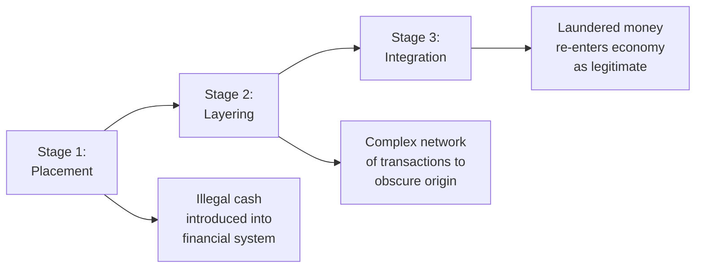
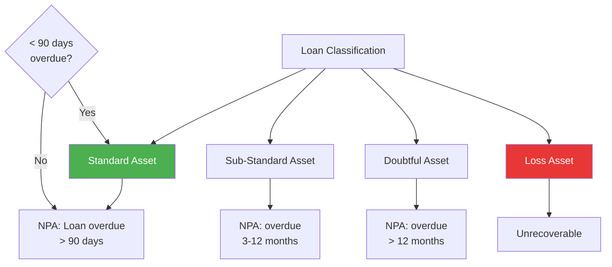
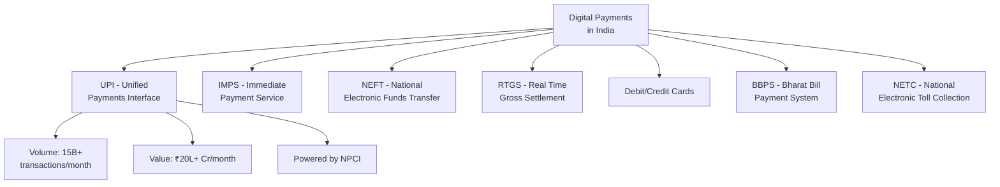
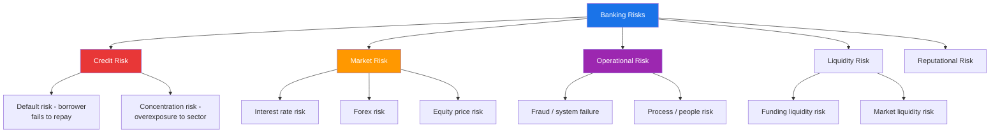
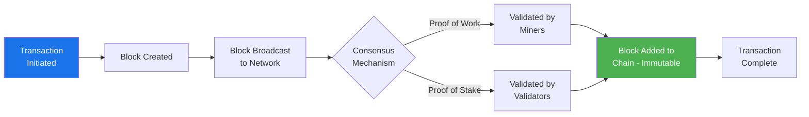

# Chapter 5: Banking Terminology & Acts

## Learning Objectives

By the end of this chapter, you will be able to:
- Explain key provisions of important banking and financial acts: Negotiable Instruments Act, FEMA, PMLA, IBC 2016, and Competition Act
- Define and calculate critical banking terminology: NPA, PCR, CAR, CASA ratio, CD ratio, base rate, BPLR
- Understand AML, KYC, and priority sector lending targets
- Describe recent banking developments including PSB mergers and digital payments growth
- Analyse the NPA classification stages from standard asset to loss asset
- Appreciate financial inclusion initiatives and their impact

---

## Theory

### 5.1 Important Banking and Financial Acts

<a href="../../../assets/images/diagrams/banking-financial-awareness/05-banking-terminology-acts/5-1-important-banking-and-financial-acts-handwritten.svg" target="_blank" rel="noopener">
  
</a>
<a href="../../../assets/images/diagrams/banking-financial-awareness/05-banking-terminology-acts/5-1-important-banking-and-financial-acts-diagram.svg" target="_blank" rel="noopener">
  
</a>
<a href="../../../assets/images/diagrams/banking-financial-awareness/05-banking-terminology-acts/5-1-important-banking-and-financial-acts-sticky.svg" target="_blank" rel="noopener">
  
</a>


#### A. Negotiable Instruments Act, 1881

The **Negotiable Instruments (NI) Act, 1881** governs the use of **promissory notes, bills of exchange, and cheques** in India.

**Key definitions:**

| Term | Definition |
|------|------------|
| **Negotiable Instrument (Section 13)** | A promissory note, bill of exchange, or cheque payable either to order or to bearer |
| **Promissory Note (Section 4)** | An unconditional undertaking in writing to pay a certain sum of money to a person |
| **Bill of Exchange (Section 5)** | An unconditional order in writing to pay a certain sum of money |
| **Cheque (Section 6)** | A bill of exchange drawn on a specified banker, payable on demand |
| **Holder in Due Course (Section 9)** | A person who acquires the instrument for valuable consideration, in good faith, before maturity |

**Key sections for banking exams:**

| Section | Provision | Significance |
|---------|-----------|--------------|
| Section 138 | Dishonour of cheque for insufficiency of funds | **Criminal liability** — punishable with up to 2 years imprisonment or fine (up to twice the cheque amount) or both |
| Section 139 | Presumption in favour of holder | Court **presumes** the cheque was issued for a legally enforceable debt/liability |
| Section 142 | Cognizance of offences | Complaint must be filed within **30 days** of the dishonour notice period expiring |
| Section 143 | Summary trial | Cases under Section 138 to be tried summarily (fast-track) |

**Notice period for cheque dishonour:**
1. Bank returns the cheque with memo (within 3 working days)
2. Payee issues **notice** to drawer within **30 days** of receiving the return memo
3. Drawer must pay within **15 days** of receiving the notice
4. If drawer fails to pay, complaint can be filed within **30 days** of the 15-day period

**Crossing of cheques:**

| Type | Feature |
|------|---------|
| **General crossing** | Two parallel lines on the top-left; payment only through bank account |
| **Special crossing** | Bank name written between the lines; payment only to that bank |
| **Not Negotiable crossing** | "Not Negotiable" written — restricts transferability |
| **Account Payee crossing** | "A/c Payee" — proceeds only to the named payee |

#### B. Foreign Exchange Management Act (FEMA), 1999

**Enacted:** 1999 (replaced FERA, 1973)
**Effective:** June 1, 2000

**Objective:** Consolidate and amend the law relating to **foreign exchange** to facilitate external trade and payments, promote the orderly development of the foreign exchange market in India.

**Key differences: FERA vs FEMA:**

| Aspect | FERA (1973) | FEMA (1999) |
|--------|-------------|-------------|
| Philosophy | **Negative** — Everything prohibited unless permitted | **Positive** — Everything permitted unless restricted |
| Approach | Strict enforcement | Liberalisation and facilitation |
| Presumption of guilt | **Yes** — accused was presumed guilty | **No** — normal criminal law presumption of innocence |
| Penalty | Criminal offence + imprisonment | **Civil offence** — monetary penalty |
| RBI's role | Extensive control | Regulator of current and capital account |

**Key provisions:**

| Section | Provision |
|---------|-----------|
| Section 3 | Restriction on dealing in foreign exchange without authorisation |
| Section 4 | Restrictions on holding foreign exchange |
| Section 5 | Current account transactions — **freely permitted** |
| Section 6 | Capital account transactions — subject to RBI/Government approval |
| Section 7 | Export of goods and services — realisation of foreign exchange |
| Section 8 | Import of goods — payment provisions |
| Section 9 | Realisation and repatriation of foreign exchange |

**FEMA Authorities:**
- **RBI:** Administers FEMA, issues regulations and authorisations
- **Directorate of Enforcement (ED):** Adjudication and enforcement of FEMA violations
- **Adjudicating Authority:** Imposes penalties for contraventions
- **Appellate Tribunal for Foreign Exchange (ATFE):** Appeals against adjudication orders

#### C. Prevention of Money Laundering Act (PMLA), 2002

**Enacted:** 2002 (effective from July 1, 2005)

**Objective:** Prevent money laundering and confiscate property derived from proceeds of crime.

**Three stages of money laundering:**



**Key provisions:**

| Section | Provision |
|---------|-----------|
| Section 3 | Definition of money laundering — directly or indirectly attempts to derive property from proceeds of crime |
| Section 4 | Punishment — rigorous imprisonment for **3 to 7 years** (up to 10 years for certain offences) |
| Section 5 | Attachment of property involved in money laundering |
| Section 8 | Issue of show cause notice before confiscation |
| Section 12 | Obligations of **banking companies, FIs, and intermediaries** to maintain records |
| Section 15 | Maintenance of records of all transactions |
| Section 45 | Offences are **cognizable and non-bailable** |

**Obligations on banks under PMLA:**
- Maintain records of **Cash Transaction Reports (CTRs)** for transactions > ₹10 lakh
- File **Suspicious Transaction Reports (STRs)** with FIU-IND
- Maintain records for **10 years** from the date of transaction
- Appoint a **Principal Officer** for compliance
- Conduct **on-site KYC verification**

**Enforcement agencies:**
- **Financial Intelligence Unit — India (FIU-IND):** Receives, analyses, and disseminates financial intelligence
- **Enforcement Directorate (ED):** Investigates PMLA cases and prosecutes offenders
- **Adjudicating Authority (PMLA):** Adjudicates attachment and confiscation orders

#### D. Insolvency and Bankruptcy Code (IBC), 2016

**Enacted:** 2016 (effective from December 1, 2016)
**Ministry:** Ministry of Corporate Affairs

**Objective:** Consolidate and amend laws relating to **insolvency resolution** of corporate persons, partnership firms, and individuals in a time-bound manner.

```mermaid
flowchart TD
    A[Default occurs<br/>(> ₹1 lakh)] --> B[Financial Creditor /<br/>Operational Creditor /<br/>Corporate Applicant files application]
    B --> C[NCLT Adjudication<br/>90 days to admit/reject]
    C --> D{Admitted?}
    D -->|Yes| E[Moratorium declared<br/>(Section 14)]
    D -->|No| F[Appeal to NCLAT]
    E --> G[Interim Resolution<br/>Professional appointed]
    G --> H[CIRP - 180 days<br/>extendable by 90 days]
    H --> I[Committee of Creditors<br/>approves resolution plan]
    I --> J{NCLT Approval}
    J -->|Yes| K[Resolution implemented]
    J -->|No| L[Liquidation<br/>within 90 days]
    
    style A fill:#e83737,color:#fff
    style K fill:#4CAF50,color:#fff
    style L fill:#ff9800,color:#fff
```

**Key features:**

| Aspect | Details |
|--------|---------|
| **Minimum default threshold** | ₹1 crore (raised from ₹1 lakh in 2020) |
| **CIRP timeline** | 180 days (extendable by 90 days) — total **330 days** including litigation |
| **Timeline for resolution** | Fixed — promotes faster resolution of NPAs |
| **Moratorium (Section 14)** | No legal proceedings, asset transfer, or recovery during CIRP |
| **Committee of Creditors (CoC)** | Makes decisions on resolution plan |
| **Waterfall mechanism** | Section 53 specifies prioritised distribution of proceeds |

**Waterfall distribution (Section 53):**

| Priority | Category |
|----------|----------|
| 1st | Insolvency resolution costs (IRP fees, legal costs) |
| 2nd | Workmen dues (up to 12 months) & secured creditors |
| 3rd | Employees' wages (up to 12 months) |
| 4th | Unsecured creditors (including financial) |
| 5th | Government dues |
| 6th | Remaining secured creditors |
| 7th | Preference shareholders |
| 8th | Equity shareholders |

**Important authorities under IBC:**
- **IBBI (Insolvency and Bankruptcy Board of India):** Regulator
- **NCLT (National Company Law Tribunal):** Adjudicating authority for corporate insolvency
- **NCLAT (National Company Law Appellate Tribunal):** Appellate authority
- **DRT (Debt Recovery Tribunal):** Adjudicating authority for individuals and partnership firms
- **IPAs (Insolvency Professional Agencies):** Registration and regulation of IPs

#### E. Competition Act, 2002

**Enacted:** 2002 (replaced MRTP Act, 1969)
**Effective:** 2009 (fully)

**Objective:** Prevent practices having **adverse effect on competition**, promote and sustain competition in markets, protect consumer interests, and ensure freedom of trade.

**Competition Commission of India (CCI):** 
- Established under Section 7 of the Competition Act
- Headquarters: New Delhi
- Chairperson + 6 members

**Prohibited practices:**

| Practice | Section | Description |
|----------|---------|-------------|
| **Anti-competitive agreements** | Section 3 | Cartels, price-fixing, bid rigging, market allocation |
| **Abuse of dominant position** | Section 4 | Predatory pricing, discriminatory pricing, denial of market access |
| **Combinations regulation** | Sections 5-6 | Merger control — combinations above asset/turnover thresholds require CCI approval |

**Thresholds for merger notification:**
- Combined assets > ₹2,000 crore OR combined turnover > ₹6,000 crore
- For group: Assets > ₹8,000 crore OR turnover > ₹24,000 crore

### 5.2 Banking Terminology

<a href="../../../assets/images/diagrams/banking-financial-awareness/05-banking-terminology-acts/5-2-banking-terminology-handwritten.svg" target="_blank" rel="noopener">
  
</a>
<a href="../../../assets/images/diagrams/banking-financial-awareness/05-banking-terminology-acts/5-2-banking-terminology-diagram.svg" target="_blank" rel="noopener">
  
</a>
<a href="../../../assets/images/diagrams/banking-financial-awareness/05-banking-terminology-acts/5-2-banking-terminology-sticky.svg" target="_blank" rel="noopener">
  
</a>


#### A. Non-Performing Assets (NPA)



| Category | Classification | Provisioning |
|----------|---------------|--------------|
| **Standard Asset** | Not NPA (≤ 90 days overdue) | 0.25% for banks, 0.40% for NBFCs |
| **Standard Asset (Farm)** | Agricultural advances | 0.25% direct, 2.5% indirect |
| **Sub-Standard Asset** | NPA for ≤ 12 months | 15% on secured portion; 25% on unsecured |
| **Sub-Standard (RE)** | Real estate — restructured | Higher provisioning |
| **Doubtful Asset** | NPA for > 12 months | 25% to 100% depending on age (D1, D2, D3) |
| **Doubtful D1** | ≤ 1 year after sub-standard | 25% |
| **Doubtful D2** | 1-3 years | 40% |
| **Doubtful D3** | > 3 years | 100% |
| **Loss Asset** | Identified as unrecoverable | 100% |

**NPA ratios:**

| Ratio | Formula | Meaning |
|-------|---------|---------|
| Gross NPA Ratio | Gross NPAs / Gross Advances | Total NPA exposure |
| Net NPA Ratio | (Gross NPA — Provisions) / (Gross Advances — Provisions) | NPAs net of provisions |
| Provision Coverage Ratio (PCR) | (Total Provisions / Gross NPAs) × 100 | Ability to cover NPAs |

#### B. Capital Adequacy Ratio (CAR)

```
CAR = (Tier 1 Capital + Tier 2 Capital) / Risk-Weighted Assets (RWA)
```

**Components:**
- **Tier 1 Capital:** Core capital (equity, reserves, retained earnings) — absorbs losses without ceasing operations
- **Tier 2 Capital:** Supplementary capital (subordinated debt, revaluation reserves, general provisions)
- **Risk-Weighted Assets:** Assets weighted by credit risk, market risk, and operational risk

#### C. CASA Ratio

```
CASA Ratio = (Current Account + Savings Account Deposits) / Total Deposits
```

- Measures the proportion of **low-cost deposits** (CASA) in total deposits
- Higher CASA → lower cost of funds → better net interest margin (NIM)
- Industry average: 35–45%

#### D. Credit-Deposit (CD) Ratio

```
CD Ratio = Total Advances / Total Deposits
```

- Measures the proportion of deposits deployed as loans
- Higher CD ratio → more aggressive lending (but may indicate liquidity pressure)
- RBI guideline: CD ratio should not exceed 75% for comfortable liquidity

#### E. Base Rate and BPLR

| Term | Full Form | Description |
|------|-----------|-------------|
| **Base Rate** | Minimum lending rate (2010-2016) | Replaced BPLR in July 2010; minimum rate below which banks could not lend |
| **BPLR** | Benchmark Prime Lending Rate | Pre-2010 system; opaque and non-transparent |
| **MCLR** | Marginal Cost of Funds-based Lending Rate | Replaced Base Rate in April 2016 |
| **EBLR** | External Benchmark Lending Rate | From October 2019 — linked to Repo Rate or T-bill yield |

#### F. Other Important Ratios

| Ratio | Formula | Significance |
|-------|---------|--------------|
| **Net Interest Margin (NIM)** | (Interest Earned — Interest Expended) / Average Earning Assets | Profitability measure |
| **Return on Assets (RoA)** | Net Profit / Average Total Assets | Efficiency measure |
| **Return on Equity (RoE)** | Net Profit / Shareholders' Equity | Returns to shareholders |
| **Cost-to-Income Ratio** | Operating Expenses / Net Income + Other Income | Operational efficiency |
| **Provision Coverage Ratio (PCR)** | Provisions / Gross NPAs | NPA coverage strength |

### 5.3 Priority Sector Lending (PSL) Targets

<a href="../../../assets/images/diagrams/banking-financial-awareness/05-banking-terminology-acts/5-3-priority-sector-lending-psl-targets-handwritten.svg" target="_blank" rel="noopener">
  
</a>
<a href="../../../assets/images/diagrams/banking-financial-awareness/05-banking-terminology-acts/5-3-priority-sector-lending-psl-targets-diagram.svg" target="_blank" rel="noopener">
  
</a>
<a href="../../../assets/images/diagrams/banking-financial-awareness/05-banking-terminology-acts/5-3-priority-sector-lending-psl-targets-sticky.svg" target="_blank" rel="noopener">
  
</a>


Banks must lend a specified percentage of Adjusted Net Bank Credit (ANBC) to **priority sectors** as defined by RBI.

**Targets for domestic scheduled commercial banks:**

| Sector | Target (% of ANBC) |
|--------|-------------------|
| **Total Priority Sector** | **40%** |
| Agriculture | 18% (of which 8% to small and marginal farmers) |
| Micro Enterprises | 7.5% |
| Weaker Sections | 10% |
| Education (up to ₹10 lakh) | Within overall 40% |
| Housing (up to ₹35 lakh) | Within overall 40% |
| Social Infrastructure | Within overall 40% |
| Export Credit (up to ₹2 crore) | Within overall 40% |
| Renewable Energy | Within overall 40% |

**Sub-targets for agriculture:**

| Component | Target |
|-----------|--------|
| Direct lending to farmers | 13.5% of ANBC |
| Indirect lending | 4.5% of ANBC |
| Small & marginal farmers | 8% of ANBC |

**Penalty for shortfall:** Banks are required to contribute the shortfall amount to the **Rural Infrastructure Development Fund (RIDF)** established with NABARD, earning interest at prescribed rates.

### 5.4 Recent Banking Developments

<a href="../../../assets/images/diagrams/banking-financial-awareness/05-banking-terminology-acts/5-4-recent-banking-developments-handwritten.svg" target="_blank" rel="noopener">
  
</a>
<a href="../../../assets/images/diagrams/banking-financial-awareness/05-banking-terminology-acts/5-4-recent-banking-developments-diagram.svg" target="_blank" rel="noopener">
  
</a>
<a href="../../../assets/images/diagrams/banking-financial-awareness/05-banking-terminology-acts/5-4-recent-banking-developments-sticky.svg" target="_blank" rel="noopener">
  
</a>


#### A. PSB Mergers (2019-2020)
The government consolidated 10 PSBs into 4:

| Anchor Bank | Banks Merged | New Entity |
|-------------|--------------|------------|
| Punjab National Bank | Oriental Bank of Commerce, United Bank of India | PNB (2nd largest PSB) |
| Canara Bank | Syndicate Bank | Canara Bank |
| Bank of Baroda | Vijaya Bank, Dena Bank | Bank of Baroda (merged in 2019) |
| Indian Bank | Allahabad Bank | Indian Bank |

**Post-merger scenario:** 12 PSBs (reduced from 27 in 2017).

#### B. Digital Payments Growth



| System | Launch | Description | Volume (monthly) |
|--------|--------|-------------|------------------|
| **NEFT** | 2005 | Deferred net settlement (batches 24×7) | ~30 crore |
| **RTGS** | 2004 | Real-time gross settlement (₹2 lakh+) | ~1.5 crore |
| **IMPS** | 2010 | Instant 24×7 interbank transfer | ~5 crore |
| **UPI** | 2016 | Mobile-based instant payment platform | 15+ billion |
| **BBPS** | 2017 | Centralised bill payment system | ~8 crore |

**Other digital payment milestones:**
- **RuPay card:** India's domestic card network (launched by NPCI in 2012)
- **Account Aggregator (AA) framework:** Launched 2021; enables data sharing with consent
- **CBDC (e-Rupee):** RBI's Central Bank Digital Currency — pilot launched 2022
- **Faster Payment System (FPS):** UPI now linked to Singapore's PayNow and the UAE's AANI

#### C. Financial Inclusion Initiatives

| Initiative | Year | Objective |
|------------|------|-----------|
| **PM Jan Dhan Yojana** | 2014 | Universal banking access |
| **PM Mudra Yojana** | 2015 | Credit to non-corporate microenterprises |
| **PM SVANidhi** | 2020 | Working capital loans to street vendors |
| **Digital Saksharta Abhiyan** | 2014 | Digital literacy for rural India |
| **PM Suraksha Bima Yojana** | 2015 | Accident insurance (₹2 lakh) at ₹12/year |
| **PM Jeevan Jyoti Bima Yojana** | 2015 | Life insurance (₹2 lakh) at ₹330/year |
| **PM Fasal Bima Yojana** | 2016 | Crop insurance for farmers |
| **National Pension System (NPS)** | 2004 | Retirement savings — regulated by PFRDA |

#### D. Foreign Trade and Banking

- **Letter of Credit (LC):** Bank's guarantee of payment to exporter
- **Bill of Entry:** Document filed with customs for imports
- **Bill of Lading:** Transport document for goods
- **FIRC (Foreign Inward Remittance Certificate):** Proof of receipt of foreign currency
- **AD (Authorised Dealer):** Banks authorised by RBI to deal in foreign exchange

---

## Examples with Solved Exercises

### Example 1: NPA and Provisioning Calculator

```typescript
interface NPAAnalysis {
  grossAdvances: number;
  grossNPA: number;
  provisions: number;
  netNPA: number;
  grossNPAPercent: number;
  netNPAPercent: number;
  pcrPercent: number;
}

function calculateNPAMetrics(
  grossAdvances: number,
  grossNPA: number,
  provisions: number
): NPAAnalysis {
  const netNPA = grossNPA - provisions;
  const grossNPAPercent = (grossNPA / grossAdvances) * 100;
  const netNPAPercent = (netNPA / (grossAdvances - provisions)) * 100;
  const pcrPercent = (provisions / grossNPA) * 100;

  return {
    grossAdvances,
    grossNPA,
    provisions,
    netNPA: Math.round(netNPA),
    grossNPAPercent: Math.round(grossNPAPercent * 100) / 100,
    netNPAPercent: Math.round(netNPAPercent * 100) / 100,
    pcrPercent: Math.round(pcrPercent * 100) / 100,
  };
}

const npaMetrics = calculateNPAMetrics(1000000, 90000, 55000);
console.log(`Gross NPA: ${npaMetrics.grossNPAPercent}%, Net NPA: ${npaMetrics.netNPAPercent}%, PCR: ${npaMetrics.pcrPercent}%`);
// Output: Gross NPA: 9%, Net NPA: 3.7%, PCR: 61.11%
```

**Q1.** A loan is classified as a Non-Performing Asset (NPA) when the principal or interest remains overdue for:

a) 30 days b) 60 days c) 90 days d) 180 days

<details>
<summary>Answer</summary>
**Answer:** c) 90 days

An asset becomes NPA when the interest and/or principal instalment remains overdue for more than 90 days (for term loans).
</details>

---

**Q2.** Under the Negotiable Instruments Act, what is the notice period for the drawer to pay after receiving a cheque dishonour notice?

a) 7 days b) 10 days c) 15 days d) 30 days

<details>
<summary>Answer</summary>
**Answer:** c) 15 days

After receiving the dishonour notice, the drawer has **15 days** to make payment. If payment is not made within this period, the payee can file a complaint under Section 138 within 30 days thereafter.
</details>

---

**Q3.** FEMA (Foreign Exchange Management Act) replaced FERA in which year?

a) 1991 b) 1999 c) 2000 d) 2005

<details>
<summary>Answer</summary>
**Answer:** b) 1999 (enacted) / 2000 (effective)

FEMA was enacted in 1999 and came into effect on June 1, 2000, replacing the draconian FERA (1973).
</details>

---

### Example 2: CASA Ratio Calculator

```typescript
interface CASAResult {
  currentAccountDeposits: number;
  savingsAccountDeposits: number;
  termDeposits: number;
  totalDeposits: number;
  casaAmount: number;
  casaRatioPercent: number;
  costOfFundsEstimate: number;
}

function calculateCASARatio(
  currentAccount: number,
  savingsAccount: number,
  termDeposits: number
): CASAResult {
  const casaAmount = currentAccount + savingsAccount;
  const totalDeposits = casaAmount + termDeposits;
  const casaRatio = (casaAmount / totalDeposits) * 100;

  // Cost of funds: CASA ~3-4%, term deposits ~7-8%
  const costOfFunds = (casaAmount * 0.035 + termDeposits * 0.075) / totalDeposits * 100;

  return {
    currentAccountDeposits: currentAccount,
    savingsAccountDeposits: savingsAccount,
    termDeposits,
    totalDeposits,
    casaAmount,
    casaRatioPercent: Math.round(casaRatio * 100) / 100,
    costOfFundsEstimate: Math.round(costOfFunds * 100) / 100,
  };
}

const casa = calculateCASARatio(250000, 400000, 650000);
console.log(`CASA Ratio: ${casa.casaRatioPercent}%, Cost of Funds: ${casa.costOfFundsEstimate}%`);
// Output: CASA Ratio: 50%, Cost of Funds: 5.65%
```

**Q4.** Which of the following statements about CASA ratio is correct?

a) Higher CASA ratio increases a bank's cost of funds b) Higher CASA ratio reduces a bank's cost of funds c) CASA ratio has no impact on profitability d) CASA ratio only considers savings accounts

<details>
<summary>Answer</summary>
**Answer:** b) Higher CASA ratio reduces a bank's cost of funds

CASA deposits are low-cost (interest rate ~3-4% on savings, 0% on current). A higher CASA ratio lowers the overall cost of funds, improving Net Interest Margin and profitability.
</details>

---

**Q5.** What does PMLA stand for?

a) Prevention of Money Laundering Act b) Prevention of Monetary Loss Act c) Protection of Money Lending Act d) Prevention of Multi-Level Association

<details>
<summary>Answer</summary>
**Answer:** a) Prevention of Money Laundering Act

The PMLA, 2002 is India's anti-money laundering legislation. It was enacted to prevent money laundering and confiscate property derived from proceeds of crime.
</details>

---

**Q6.** Under IBC 2016, what is the maximum time allowed for the Corporate Insolvency Resolution Process (CIRP)?

a) 180 days b) 270 days c) 330 days d) 365 days

<details>
<summary>Answer</summary>
**Answer:** c) 330 days

The CIRP must be completed within **330 days** (180 days initial + 90 days extension + 60 days for litigation). This includes the timeline for admission, resolution, and any adjudicatory processes.
</details>

---

### Example 3: Cheque Dishonour Timeline

```typescript
interface ChequeDishonourTimeline {
  chequeDate: Date;
  presentationDate: Date;
  dishonourDate: Date;
  noticeDate: Date;
  noticePeriodEnd: Date;
  complaintFilingDeadline: Date;
  legalDaysRemaining: number;
}

function calculateChequeDishonourTimeline(
  chequeDate: Date,
  presentationDate: Date,
  dishonourDate: Date
): ChequeDishonourTimeline {
  // 30 days from dishonour to send notice
  const noticeDate = new Date(dishonourDate);
  noticeDate.setDate(noticeDate.getDate() + 30);

  // 15 days from notice for the drawer to pay
  const noticePeriodEnd = new Date(noticeDate);
  noticePeriodEnd.setDate(noticePeriodEnd.getDate() + 15);

  // 30 days from notice period end to file complaint
  const complaintFilingDeadline = new Date(noticePeriodEnd);
  complaintFilingDeadline.setDate(complaintFilingDeadline.getDate() + 30);

  const now = new Date();
  const diffTime = complaintFilingDeadline.getTime() - now.getTime();
  const legalDaysRemaining = Math.max(0, Math.ceil(diffTime / (1000 * 60 * 60 * 24)));

  return {
    chequeDate,
    presentationDate,
    dishonourDate,
    noticeDate,
    noticePeriodEnd,
    complaintFilingDeadline,
    legalDaysRemaining,
  };
}

const timeline = calculateChequeDishonourTimeline(
  new Date('2026-01-15'),
  new Date('2026-01-20'),
  new Date('2026-01-22')
);
console.log(`Notice must be sent by: ${timeline.noticeDate.toLocaleDateString()}`);
console.log(`Complaint filing deadline: ${timeline.complaintFilingDeadline.toLocaleDateString()}`);
// Output: Notice must be sent by: (date 30 days after dishonour)
// Output: Complaint filing deadline: (75 days after dishonour)
```

**Q7.** Under Section 138 of the NI Act, the maximum punishment for cheque dishonour is:

a) 6 months imprisonment b) 1 year imprisonment c) 2 years imprisonment d) 5 years imprisonment

<details>
<summary>Answer</summary>
**Answer:** c) 2 years imprisonment

Section 138 provides for imprisonment up to 2 years or a fine up to twice the cheque amount, or both.
</details>

---

**Q8.** What is the priority sector lending target for domestic scheduled commercial banks?

a) 30% of ANBC b) 40% of ANBC c) 50% of ANBC d) 60% of ANBC

<details>
<summary>Answer</summary>
**Answer:** b) 40% of ANBC

Domestic scheduled commercial banks must allocate 40% of Adjusted Net Bank Credit (ANBC) to priority sectors including agriculture (18%), micro enterprises (7.5%), and weaker sections (10%).
</details>

---

**Q9.** The Competition Act, 2002 replaced which earlier Act?

a) FERA b) MRTP Act, 1969 c) SICA d) IDRA

<details>
<summary>Answer</summary>
**Answer:** b) MRTP Act, 1969

The Competition Act, 2002 replaced the Monopolies and Restrictive Trade Practices (MRTP) Act, 1969 to make competition regulation more effective in the liberalised economy.
</details>

---

**Q10.** Under the PMLA, Cash Transaction Reports (CTRs) must be filed for transactions above:

a) ₹5 lakh b) ₹10 lakh c) ₹25 lakh d) ₹50 lakh

<details>
<summary>Answer</summary>
**Answer:** b) ₹10 lakh

Banks must report all cash transactions exceeding ₹10 lakh to FIU-IND through Cash Transaction Reports (CTRs) under PMLA rules.
</details>

---

### Example 4: NPA Provisioning Requirements

```typescript
interface ProvisioningResult {
  loanCategory: string;
  outstandingAmount: number;
  provisioningPercent: number;
  provisionRequired: number;
}

function calculateProvisioning(
  category: string,
  outstanding: number,
  isUnsecured: boolean
): ProvisioningResult {
  let provisioningPercent = 0;

  switch (category) {
    case 'Standard': provisioningPercent = 0.25; break;
    case 'Sub-Standard': provisioningPercent = isUnsecured ? 25 : 15; break;
    case 'Doubtful-D1': provisioningPercent = 25; break;
    case 'Doubtful-D2': provisioningPercent = 40; break;
    case 'Doubtful-D3': provisioningPercent = 100; break;
    case 'Loss': provisioningPercent = 100; break;
    default: provisioningPercent = 0;
  }

  return {
    loanCategory: category,
    outstandingAmount: outstanding,
    provisioningPercent,
    provisionRequired: Math.round(outstanding * (provisioningPercent / 100)),
  };
}

const prov = calculateProvisioning('Sub-Standard', 500000, true);
console.log(`Provision required for ${prov.loanCategory} (unsecured): ₹${prov.provisionRequired}`);
// Output: Provision required for Sub-Standard (unsecured): ₹125000
```

**Q11.** A Doubtful Asset is defined as an NPA that has remained in the sub-standard category for:

a) 6 months b) 12 months c) 18 months d) 24 months

<details>
<summary>Answer</summary>
**Answer:** b) 12 months

An asset becomes doubtful when it has remained in the sub-standard category for **12 months** (i.e., NPA for more than 12 months but identifiably doubtful).
</details>

---

**Q12.** What is the minimum default threshold for filing an insolvency application under IBC 2016?

a) ₹1 lakh b) ₹10 lakh c) ₹1 crore d) ₹10 crore

<details>
<summary>Answer</summary>
**Answer:** c) ₹1 crore

The minimum default threshold under IBC was raised from ₹1 lakh to ₹1 crore in 2020 to prevent excessive filings against small borrowers and focus on larger defaults.
</details>

---

**Q13.** What does the acronym PCR stand for in banking?

a) Primary Credit Ratio b) Provision Coverage Ratio c) Profit Capital Ratio d) Priority Credit Rate

<details>
<summary>Answer</summary>
**Answer:** b) Provision Coverage Ratio

Provision Coverage Ratio = (Total Provisions / Gross NPAs) × 100. It measures the extent of NPA coverage through provisions. Higher PCR indicates better risk management.
</details>

---

**Q14.** Under Section 53 of IBC, which class of creditors gets the highest priority in the waterfall distribution?

a) Government dues b) Secured creditors c) Workmen dues d) Insolvency resolution costs

<details>
<summary>Answer</summary>
**Answer:** d) Insolvency resolution costs

The IBC water-fall mechanism (Section 53) prioritises: 1st — Insolvency resolution costs, 2nd — Workmen dues + Secured creditors, then employees, unsecured creditors, government, etc.
</details>

---

**Q15.** Which of the following is a capital account transaction under FEMA?

a) Payment for travel expenses b) Foreign direct investment c) Export of goods d) Payment for education abroad

<details>
<summary>Answer</summary>
**Answer:** b) Foreign direct investment

Capital account transactions affect assets/liabilities (FDI, FPI, external borrowings). Current account transactions are for trade, travel, education, etc. and are freely permitted.
</details>

---

### Example 5: CD Ratio and Liquidity Analysis

```typescript
interface BankLiquidityMetrics {
  totalDeposits: number;
  totalAdvances: number;
  cdRatio: number;
  slrRequirement: number;
  crrRequirement: number;
  liquidAssets: number;
  liquiditySurplus: number;
}

function analyseLiquidity(
  deposits: number,
  advances: number,
  slr: number,
  crr: number,
  otherLiquidAssets: number
): BankLiquidityMetrics {
  const cdRatio = (advances / deposits) * 100;
  const slrAmount = deposits * (slr / 100);
  const crrAmount = deposits * (crr / 100);
  const liquidAssets = slrAmount + otherLiquidAssets;
  const liquiditySurplus = liquidAssets - (advances * 0.1); // Assume 10% of advances need liquidity

  return {
    totalDeposits: deposits,
    totalAdvances: advances,
    cdRatio: Math.round(cdRatio * 100) / 100,
    slrRequirement: slr,
    crrRequirement: crr,
    liquidAssets: Math.round(liquidAssets),
    liquiditySurplus: Math.round(liquiditySurplus),
  };
}

const liquidity = analyseLiquidity(1000000, 780000, 18, 4.5, 50000);
console.log(`CD Ratio: ${liquidity.cdRatio}%, Liquid Assets: ₹${liquidity.liquidAssets}`);
// Output: CD Ratio: 78%, Liquid Assets: ₹230000
```

**Q16.** Which of the following is NOT a negotiable instrument under the NI Act, 1881?

a) Promissory note b) Bill of exchange c) Cheque d) Share certificate

<details>
<summary>Answer</summary>
**Answer:** d) Share certificate

The NI Act recognises three types of negotiable instruments: Promissory notes (Section 4), Bills of exchange (Section 5), and Cheques (Section 6). Share certificates are not negotiable instruments under this Act.
</details>

---

**Q17.** Under the Competition Act, the Competition Commission of India (CCI) was established in which year?

a) 2002 b) 2007 c) 2009 d) 2010

<details>
<summary>Answer</summary>
**Answer:** c) 2009

While the Competition Act was passed in 2002, CCI became fully functional only in 2009 after the establishment of the appellate tribunal (COMPAT).
</details>

---

**Q18.** Which of the following correctly describes a "Holder in Due Course" under the NI Act?

a) A person who steals a negotiable instrument b) A person who acquires the instrument for consideration, in good faith, before maturity c) A person who receives the instrument as a gift d) Any person who presents a cheque for payment

<details>
<summary>Answer</summary>
**Answer:** b) A person who acquires the instrument for consideration, in good faith, before maturity

Section 9 of the NI Act defines a Holder in Due Course as a person who becomes the possessor of the instrument for valuable consideration, in good faith, and before maturity.
</details>

---

**Q19.** What is the provisioning requirement for a Standard Asset under current RBI norms?

a) 0.15% b) 0.25% c) 0.40% d) 1.00%

<details>
<summary>Answer</summary>
**Answer:** b) 0.25%

Standard assets require a general provision of 0.25% (0.40% for NBFCs). Agricultural advances have different provisioning norms (0.25% direct, 2.5% indirect).
</details>

---

**Q20.** What is the RuPay card payment network operated by?

a) RBI b) SBI c) NPCI d) SEBI

<details>
<summary>Answer</summary>
**Answer:** c) NPCI

RuPay is India's domestic card payment network launched by the National Payments Corporation of India (NPCI) in 2012, providing an alternative to Visa and Mastercard.
</details>

---

**Q21.** Under the prudential regulation framework, the minimum Capital Adequacy Ratio (including the capital conservation buffer) for Indian banks is:

a) 9%
b) 10.25%
c) 11.5%
d) 13%

<details>
<summary>Answer</summary>
**Answer:** c) 11.5%

As per Basel III norms implemented in India, the minimum CAR is 11.5% (9% Tier 1 + Tier 2, plus 2.5% Capital Conservation Buffer).
</details>

---

**Q22.** Blockchain technology is best described as:

a) A centralised database managed by RBI
b) A distributed ledger where transactions are recorded in immutable blocks
c) A payment system for cryptocurrency only
d) A cloud storage system for banks

<details>
<summary>Answer</summary>
**Answer:** b) A distributed ledger where transactions are recorded in immutable blocks

Blockchain is a DLT where each block contains a set of transactions, cryptographically linked to the previous block, making the chain immutable and transparent.
</details>

---

**Q23.** The tax rate applicable to cryptocurrency gains in India (as per 2022 Finance Act) is:

a) 15%
b) 20%
c) 30%
d) 40%

<details>
<summary>Answer</summary>
**Answer:** c) 30%

Cryptocurrency gains are taxed at 30% (plus applicable cess and surcharge) under Section 115BBH of the Income Tax Act, introduced in the 2022 Budget.
</details>

---

**Q24.** The e-Rupee (CBDC) retail pilot in India was launched in:

a) November 2021
b) November 2022
c) December 2022
d) January 2023

<details>
<summary>Answer</summary>
**Answer:** c) December 2022

The CBDC-Retail (e₹-R) pilot was launched on December 1, 2022. The wholesale pilot (e₹-W) had been launched earlier in November 2022 for interbank settlement.
</details>

---

**Q25.** Proof of Work (PoW) is a consensus mechanism used by:

a) UPI
b) Bitcoin
c) e-Rupee
d) NEFT

<details>
<summary>Answer</summary>
**Answer:** b) Bitcoin

Bitcoin uses Proof of Work consensus where miners solve complex mathematical puzzles to validate transactions. PoW is energy-intensive but provides high security.
</details>

---

**Q26.** Which of the following is NOT a type of risk regulated under prudential banking norms?

a) Credit risk
b) Market risk
c) Inflation risk
d) Operational risk

<details>
<summary>Answer</summary>
**Answer:** c) Inflation risk

Inflation risk is a macroeconomic risk, not a specific banking risk regulated under prudential norms. Banks must manage credit, market, operational, and liquidity risks.
</details>

---

**Q27.** The TDS rate applicable on cryptocurrency transactions in India is:

a) 0.1%
b) 0.5%
c) 1%
d) 2%

<details>
<summary>Answer</summary>
**Answer:** c) 1%

A 1% TDS (Tax Deducted at Source) is applicable on cryptocurrency transactions above a specified threshold under Section 194S of the Income Tax Act.
</details>

---

**Q28.** Smart contracts in blockchain are:

a) Legal documents signed digitally
b) Self-executing contracts with coded terms and conditions
c) Agreements between banks and regulators
d) Paper contracts stored on blockchain

<details>
<summary>Answer</summary>
**Answer:** b) Self-executing contracts with coded terms and conditions

Smart contracts are programmable contracts that automatically execute when predefined conditions are met, without needing intermediaries. They are used in trade finance, insurance, etc.
</details>

---

**Q29.** Which of the following is a key benefit of blockchain technology in banking?

a) Higher transaction costs
b) Centralised control
c) Immutable audit trail
d) Slower settlement

<details>
<summary>Answer</summary>
**Answer:** c) Immutable audit trail

Blockchain provides an immutable, transparent record of all transactions, making it valuable for audit, compliance, and fraud prevention in banking.
</details>

---

**Q30.** The RBI's position on private cryptocurrencies is best described as:

a) Fully supportive
b) Neutral — no official position
c) Concerned about macroeconomic stability, advocates global regulation
d) Actively promoting cryptocurrency adoption

<details>
<summary>Answer</summary>
**Answer:** c) Concerned about macroeconomic stability, advocates global regulation

RBI has consistently expressed concerns about the risks of private cryptocurrencies to financial stability, capital controls, and monetary policy, while advocating for a globally coordinated regulatory approach.
</details>

---

## TypeScript Example: Banking Health Comprehensive Analyser

```typescript
interface BankSnapshot {
  name: string;
  advances: number;
  deposits: number;
  grossNPA: number;
  provisions: number;
  tier1Capital: number;
  tier2Capital: number;
  riskWeightedAssets: number;
  currentAccount: number;
  savingsAccount: number;
  netProfit: number;
  totalAssets: number;
  shareholdersEquity: number;
}

interface ComprehensiveAnalysis {
  bankName: string;
  car: number;
  grossNPAPercent: number;
  netNPAPercent: number;
  pcr: number;
  casaRatio: number;
  cdRatio: number;
  roa: number;
  roe: number;
  npaCoverageScore: 'Excellent' | 'Good' | 'Adequate' | 'Poor';
  overallScore: number;
}

function comprehensiveAnalysis(data: BankSnapshot): ComprehensiveAnalysis {
  const totalCapital = data.tier1Capital + data.tier2Capital;
  const car = (totalCapital / data.riskWeightedAssets) * 100;
  const grossNpaPct = (data.grossNPA / data.advances) * 100;
  const netNpa = data.grossNPA - data.provisions;
  const netNpaPct = (netNpa / (data.advances - data.provisions)) * 100;
  const pcr = (data.provisions / data.grossNPA) * 100;
  const casaAmount = data.currentAccount + data.savingsAccount;
  const casaRatio = (casaAmount / data.deposits) * 100;
  const cdRatio = (data.advances / data.deposits) * 100;
  const roa = (data.netProfit / data.totalAssets) * 100;
  const roe = (data.netProfit / data.shareholdersEquity) * 100;

  let npaCoverageScore: 'Excellent' | 'Good' | 'Adequate' | 'Poor';
  if (pcr >= 80) npaCoverageScore = 'Excellent';
  else if (pcr >= 65) npaCoverageScore = 'Good';
  else if (pcr >= 50) npaCoverageScore = 'Adequate';
  else npaCoverageScore = 'Poor';

  // Composite score (simplified)
  let score = 0;
  if (car >= 14) score += 30;
  else if (car >= 11.5) score += 20;
  else score += 10;

  if (grossNpaPct <= 3) score += 25;
  else if (grossNpaPct <= 6) score += 18;
  else score += 10;

  if (roa >= 1) score += 25;
  else if (roa >= 0.5) score += 18;
  else score += 8;

  if (casaRatio >= 40) score += 20;
  else if (casaRatio >= 30) score += 14;
  else score += 8;

  return {
    bankName: data.name,
    car: Math.round(car * 100) / 100,
    grossNPAPercent: Math.round(grossNpaPct * 100) / 100,
    netNPAPercent: Math.round(netNpaPct * 100) / 100,
    pcr: Math.round(pcr * 100) / 100,
    casaRatio: Math.round(casaRatio * 100) / 100,
    cdRatio: Math.round(cdRatio * 100) / 100,
    roa: Math.round(roa * 100) / 100,
    roe: Math.round(roe * 100) / 100,
    npaCoverageScore,
    overallScore: score,
  };
}

const bankData: BankSnapshot = {
  name: "Sample Bank",
  advances: 500000,
  deposits: 650000,
  grossNPA: 35000,
  provisions: 22000,
  tier1Capital: 55000,
  tier2Capital: 12000,
  riskWeightedAssets: 420000,
  currentAccount: 85000,
  savingsAccount: 205000,
  netProfit: 6500,
  totalAssets: 750000,
  shareholdersEquity: 60000,
};

const analysis = comprehensiveAnalysis(bankData);
console.log(`CAR: ${analysis.car}%, Gross NPA: ${analysis.grossNPAPercent}%, Net NPA: ${analysis.netNPAPercent}%`);
console.log(`PCR: ${analysis.pcr}%, CASA: ${analysis.casaRatio}%, Score: ${analysis.overallScore}/100`);
console.log(`NPA Coverage: ${analysis.npaCoverageScore}`);
// Output: CAR: 15.95%, Gross NPA: 7%, Net NPA: 2.72%
// Output: PCR: 62.86%, CASA: 44.62%, Score: 52/100
// Output: NPA Coverage: Adequate
```

---

### 5.5 Prudential Regulation in Banking

Prudential regulation refers to the set of rules and standards designed to ensure the **safety and soundness** of banks and the financial system.

| Component | Description | Regulatory Requirement |
|-----------|-------------|----------------------|
| **Capital Adequacy** | Minimum capital to cover risks | CAR ≥ 11.5% (including CCB) |
| **Asset Quality** | Classification and provisioning for NPAs | NPA norms per RBI circulars |
| **Liquidity Standards** | Ensure banks can meet short-term obligations | LCR ≥ 100%, NSFR ≥ 100% |
| **Leverage Ratio** | Limit excessive borrowing | Tier 1 Capital / Total Exposure ≥ 4% |
| **Risk Management** | Systems to identify, measure, and mitigate risks | Board-approved risk policies |
| **Corporate Governance** | Board composition, fit & proper criteria | At least 51% board with special knowledge |
| **Disclosure Requirements** | Transparency through periodic reporting | Pillar 3 disclosures under Basel |

**Types of Risks Regulated:**



**Key regulatory bodies for prudential oversight:**
- **RBI:** Prudential regulation of banks and NBFCs
- **SEBI:** Prudential norms for market intermediaries and mutual funds
- **IRDA:** Solvency and investment norms for insurers
- **PFRDA:** Prudential regulation of pension funds

### 5.6 Technology in Finance — Digital Banking, Blockchain, and Cryptocurrencies

#### A. Digital Banking Evolution

| Era | Period | Key Features |
|-----|--------|--------------|
| **Banking 1.0** | Pre-1980s | Physical branches, manual ledgers, paper-based |
| **Banking 2.0** | 1980s-2000 | Core banking solutions, ATMs, computerisation |
| **Banking 3.0** | 2000-2015 | Internet banking, mobile banking, NEFT/RTGS |
| **Banking 4.0** | 2015-present | UPI, digital-only banks, AI-driven services, open banking, blockchain |

**Key Digital Banking Technologies in India:**

| Technology | Description | Examples |
|------------|-------------|----------|
| **UPI** | Instant mobile payment using virtual payment address | Google Pay, PhonePe, Paytm, BHIM |
| **BBPS** | Centralised bill payment system | Pay bills via any channel |
| **Account Aggregator** | Consent-based financial data sharing | Sahamati network |
| **OCR/ICR** | Automated cheque and document processing | Cheque Truncation System |
| **Video KYC** | Remote identity verification | Aadhaar-based video KYC |
| **AI/ML** | Credit scoring, fraud detection, chatbots | SBI's Intelligent Assistant, ICICI's iMobile |
| **Open Banking** | API-based third-party access to bank data | Account Aggregator framework |

#### B. Blockchain Technology

Blockchain is a **distributed ledger technology (DLT)** where transactions are recorded in blocks that are cryptographically linked and immutable.



| Feature | Description | Significance in Banking |
|---------|-------------|------------------------|
| **Decentralisation** | No central authority; consensus-based validation | Reduces single point of failure |
| **Immutability** | Cannot alter recorded transactions | Prevents fraud and tampering |
| **Transparency** | All participants can view the ledger | Audit trail for all transactions |
| **Smart Contracts** | Self-executing contracts with coded terms | Automates trade finance, insurance claims |
| **Consensus Mechanisms** | PoW, PoS, PBFT, etc. | Ensures agreement on state of ledger |

**Use cases of blockchain in banking:**
1. **Trade Finance:** LETTER OF CREDIT automation using smart contracts
2. **Cross-border Payments:** Faster, cheaper remittances (e.g., JPM Coin, Ripple)
3. **KYC/AML:** Shared KYC registry reduces duplication
4. **Supply Chain Finance:** Track goods and payments in real time
5. **Loyalty Programs:** Token-based interoperable rewards
6. **Digital Identity:** Self-sovereign identity management
7. **Syndicated Loans:** Streamlined settlement among multiple lenders

#### C. Cryptocurrencies and Central Bank Digital Currency (CBDC)

| Aspect | Cryptocurrency | CBDC (e-Rupee) |
|--------|---------------|----------------|
| **Issuer** | Decentralised (no central issuer) | Central Bank (RBI) |
| **Legal Tender** | Not legal tender in India | Yes — equivalent to physical currency |
| **Value Stability** | Highly volatile | Stable — same value as fiat rupee |
| **Anonymity** | Pseudonymous (traceable on blockchain) | Controlled anonymity (RBI can track) |
| **Regulation** | Not regulated in India (taxable but not legal) | Fully regulated by RBI |
| **Technology** | Public blockchain | Permissioned DLT |
| **Examples** | Bitcoin, Ethereum, Ripple | Digital Rupee (e₹) — launched 2022 |

**India's stance on cryptocurrencies:**
- **Supreme Court (2020):** Set aside RBI's 2018 banking ban on crypto
- **Cryptocurrency Tax (2022):** 30% tax on gains + 1% TDS on transactions
- **RBI's position:** "Serious concerns" about macroeconomic stability; advocates for global regulation
- **Current status (2025):** No comprehensive crypto law; crypto assets are taxed but not recognised as legal tender

**e-Rupee (CBDC) — Key Features:**
| Feature | Wholesale (e₹-W) | Retail (e₹-R) |
|---------|-----------------|---------------|
| **Purpose** | Interbank settlement | General public use |
| **Launch** | November 2022 | December 2022 |
| **Technology** | Distributed Ledger Technology | DLT-based |
| **Access** | Banks and financial institutions | General public via banks/wallets |
| **Benefits** | Faster settlement, reduced cost | Offline capability, no bank account needed for basic transactions |

### 5.7 Comparison Table: Key Banking Acts

| Act | Year | Objective | Administered by |
|-----|------|-----------|-----------------|
| **Negotiable Instruments Act** | 1881 | Govern cheques, promissory notes, bills of exchange | Judiciary / RBI |
| **Banking Regulation Act** | 1949 | Regulation of banking companies | RBI |
| **RBI Act** | 1934 | Constitution and functioning of RBI | RBI |
| **FEMA** | 1999 | Foreign exchange management | RBI + ED |
| **PMLA** | 2002 | Anti-money laundering | FIU-IND + ED |
| **IBC** | 2016 | Insolvency resolution | IBBI + NCLT |
| **Competition Act** | 2002 | Prevent anti-competitive practices | CCI |
| **SEBI Act** | 1992 | Securities market regulation | SEBI |
| **IRDA Act** | 1999 | Insurance regulation | IRDA |
| **DICGC Act** | 1961 | Deposit insurance | DICGC |

### 5.8 SBI PO / IBPS SO / RBI Grade B Exam Tips for Banking Acts & Terminology

| Exam | Key Topics | Strategy |
|------|-----------|----------|
| **RBI Grade B** | PMLA provisions (Section 3, 4, 12), FEMA (Section 5 vs 6), IBC waterfall (Section 53), prudential regulation norms | Focus on section numbers; study recent AML/CFT guidelines; understand Basel III implementation details |
| **SBI PO** | NI Act Section 138 (timelines, punishment), priority sector targets, NPA classification and provisioning, CASA/CD/PCR ratios | Practice numerical on NPA ratios and provisioning; memorise all priority sector percentages |
| **IBPS SO** | Competition Act (Sections 3, 4), KYC norms (4 tiers), digital banking, blockchain basics, cryptocurrency taxation | Use comparison tables for acts (year + objective + administering body); understand e-Rupee features |
| **Common tips** | Section 138 timelines are frequently asked; memorise the sequence: 30 days notice → 15 days payment → 30 days complaint; know all important years and section numbers | Create a matrix of acts with years and administering agencies; revise weekly |

---

## TypeScript Example: Cryptocurrency Tax Calculator

```typescript
interface CryptoTaxResult {
  purchasePrice: number;
  salePrice: number;
  quantity: number;
  capitalGains: number;
  taxRate: number;
  taxAmount: number;
  tdsRate: number;
  tdsAmount: number;
  netProceeds: number;
}

function calculateCryptoTax(
  purchasePrice: number,
  salePrice: number,
  quantity: number,
  taxRate: number,
  tdsRate: number
): CryptoTaxResult {
  const totalCost = purchasePrice * quantity;
  const totalSale = salePrice * quantity;
  const capitalGains = totalSale - totalCost;
  const taxAmount = capitalGains > 0 ? capitalGains * (taxRate / 100) : 0;
  const tdsAmount = totalSale * (tdsRate / 100);
  const netProceeds = totalSale - taxAmount - tdsAmount;

  return {
    purchasePrice,
    salePrice,
    quantity,
    capitalGains: Math.round(capitalGains),
    taxRate,
    taxAmount: Math.round(taxAmount),
    tdsRate,
    tdsAmount: Math.round(tdsAmount),
    netProceeds: Math.round(netProceeds),
  };
}

const crypto = calculateCryptoTax(2000000, 3500000, 1, 30, 1);
console.log(`Capital Gains: ₹${crypto.capitalGains}, Tax: ₹${crypto.taxAmount}, TDS: ₹${crypto.tdsAmount}`);
console.log(`Net Proceeds after tax: ₹${crypto.netProceeds}`);
// Output: Capital Gains: ₹1500000, Tax: ₹450000, TDS: ₹35000
// Output: Net Proceeds after tax: ₹3015000
```

---

## Summary

- The **Negotiable Instruments Act, 1881** governs cheques, promissory notes, and bills of exchange. Section 138 deals with cheque dishonour — 30 days to send notice, 15 days to pay, then file complaint within 30 days.
- **FEMA (1999)** replaced FERA (1973) with a liberalised, positive approach to foreign exchange management. Current account transactions are freely permitted; capital account transactions require RBI approval.
- **PMLA (2002)** targets money laundering through three stages: placement, layering, and integration. Banks must file CTRs (> ₹10 lakh) and STRs with FIU-IND. Records must be kept for 10 years.
- **IBC (2016)** provides a time-bound (330 days max) insolvency resolution process. Section 14 imposes a moratorium. Section 53 lays down the waterfall priority for distribution.
- **Competition Act (2002)** replaced MRTP Act and established CCI to prevent anti-competitive agreements, abuse of dominance, and regulate combinations (mergers).
- **NPA classification:** Standard (≤ 90 days overdue) → Sub-Standard (≤ 12 months) → Doubtful (> 12 months) → Loss (unrecoverable). Provisioning increases from 0.25% to 100%.
- **CASA ratio** (Current + Savings / Total deposits) indicates low-cost funding base. **CD ratio** measures lending aggressiveness. **PCR** measures provision coverage.
- **Priority sector lending:** Banks must lend 40% of ANBC to priority sectors (agriculture 18%, micro enterprises 7.5%, weaker sections 10%).
- **PSB mergers (2019-20)** reduced 10 banks to 4. **UPI** processes 15+ billion transactions monthly.
- The **e-Rupee (CBDC)** pilot launched in 2022 marks India's entry into central bank digital currencies.

---

## Practical Takeaways

| Exam Topic | Key Fact | Mnemonic / Tip |
|------------|----------|----------------|
| NI Act Year | 1881 | "NI = 18 (years after 1863 founding of modern banking) + 81" |
| Section 138 | Cheque dishonour: 2 years jail | "138 = 1-3-8 = 1 notice, 3 steps, 8 sections after 130" |
| FEMA Year | 1999 | "FEMA = 1999 (end of 20th century reform)" |
| PMLA CTR Limit | ₹10 lakh cash transaction | "PMLA CTR = 10 lakh" |
| IBC Timeline | 330 days total | "IBC = 330 (think 3-3-0 as max days)" |
| CIRP Failure | Liquidation in 90 days | "90 days to liquidate" |
| NPA Classification | 90 days overdue | "90 = NPA trigger" |
| Sub-Standard vs Doubtful | 12 months dividing line | "Sub ≤ 12 months, Doubtful > 12 months" |
| PSL Target | 40% of ANBC | "PSL = 40 for domestic banks" |
| UPI Launch | 2016 | "UPI = 2016 = 20-16 = same as MCLR year!" |

---

## Chapter Quiz

**Q1.** Under Section 138 of the Negotiable Instruments Act, a complaint for cheque dishonour must be filed within how many days of the expiry of the 15-day payment notice period?

a) 7 days b) 15 days c) 30 days d) 45 days

<details>
<summary>Show Answer</summary>

**Answer:** c) 30 days

The payee must file the complaint within **30 days** from the date on which the 15-day notice period expires. Total timeline: Cheque return → 30 days to send notice → 15 days to pay → 30 days to file complaint.
</details>

---

**Q2.** What is the minimum provisioning requirement for a Standard Asset in commercial banks?

a) 0.10% b) 0.25% c) 0.40% d) 1.00%

<details>
<summary>Show Answer</summary>

**Answer:** b) 0.25%

Standard assets require general provisioning of 0.25% of the outstanding amount. For NBFCs, it is 0.40%.
</details>

---

**Q3.** Under FEMA, which category of transactions is freely permitted without prior RBI approval?

a) Capital account transactions b) Current account transactions c) Foreign direct investment d) External commercial borrowings

<details>
<summary>Show Answer</summary>

**Answer:** b) Current account transactions

Under FEMA, current account transactions (trade, travel, education, medical expenses) are **freely permitted**. Capital account transactions (FDI, FPI, loans) require RBI or government approval.
</details>

---

**Q4.** The IBC 2016 provides for a maximum CIRP timeline of:

a) 180 days b) 270 days c) 330 days d) 450 days

<details>
<summary>Show Answer</summary>

**Answer:** c) 330 days

The CIRP must be completed within **330 days** including the initial 180-day period, a 90-day extension, and 60 days for litigation/adjudication.
</details>

---

**Q5.** Which of the following is given the HIGHEST priority in the IBC waterfall distribution (Section 53)?

a) Secured creditors b) Workmen dues c) Insolvency resolution costs d) Government dues

<details>
<summary>Show Answer</summary>

**Answer:** c) Insolvency resolution costs

The IBC waterfall (Section 53) gives first priority to insolvency resolution costs, second to workmen dues and secured creditors, followed by employees, unsecured creditors, government dues, and equity shareholders.
</details>

---

## Exercises

### Section A: Multiple Choice Questions

1. The Negotiable Instruments Act was enacted in:
   a) 1856 b) 1881 c) 1900 d) 1949

2. Under Section 138 of NI Act, the maximum fine for cheque dishonour is:
   a) Equal to the cheque amount b) Twice the cheque amount c) ₹5 lakh d) ₹10 lakh

3. FERA was replaced by FEMA in:
   a) 1991 b) 1999 c) 2002 d) 2005

4. Under PMLA, banks must maintain transaction records for at least:
   a) 5 years b) 7 years c) 10 years d) 15 years

5. The minimum default threshold for filing an insolvency application under IBC is:
   a) ₹50,000 b) ₹1 lakh c) ₹10 lakh d) ₹1 crore

6. What is the provisioning requirement for a Loss Asset?
   a) 50% b) 75% c) 85% d) 100%

7. Which organisation receives and analyses Suspicious Transaction Reports under PMLA?
   a) RBI b) SEBI c) FIU-IND d) CBI

8. The Competition Act replaced which earlier legislation?
   a) FERA b) IDRA c) MRTP Act d) SICA

9. Under the GST framework, which tax is levied on inter-state supplies?
   a) CGST b) SGST c) IGST d) UTGST

10. Which of the following is a Doubtful Asset classification criterion?
    a) NPA for ≤ 6 months b) NPA for ≤ 12 months c) NPA for > 12 months d) NPA for > 3 years

### Section B: Fill in the Blanks

11. The three stages of money laundering are Placement, _________, and Integration.
12. Under IBC, the _________ is the adjudicating authority for corporate insolvency.
13. The CASA ratio measures the proportion of _________ deposits in total deposits.
14. The full form of PCR is _________.
15. Priority sector lending target for domestic banks is _________% of ANBC.
16. The Competition Commission of India (CCI) was established in the year _________.
17. Under FEMA, _________ account transactions require RBI approval.
18. A cheque that has "_________" written between two parallel lines can only be paid to that specific bank.
19. The UPI system was launched by the _________ in 2016.
20. The _________ Act governs the credit information companies in India.
21. The CBDC retail pilot (e₹-R) was launched in _________ 2022.
22. The TDS rate applicable on cryptocurrency transactions is _________%.
23. _________ is a distributed ledger technology where transactions are recorded in immutable blocks.
24. Self-executing contracts with coded terms on blockchain are called _________.
25. Banking risk arising from borrowers failing to repay is called _________ risk.

### Section C: True or False

26. A standard asset has no overdue amount. (True/False)
27. FERA had a presumption of guilt, while FEMA has a presumption of innocence. (True/False)
28. Money laundering has three stages: Placement, Layering, and Integration. (True/False)
29. Under IBC, the CIRP must be completed within 180 days with no extension. (True/False)
30. CASA ratio includes both current account and savings account deposits. (True/False)
31. The NI Act, 1881 applies only to cheques, not promissory notes. (True/False)
32. A higher CD ratio always indicates better bank performance. (True/False)
33. Crossed cheques can only be paid through a bank account, not across the counter. (True/False)
34. The PMLA is administered by the Ministry of Finance. (True/False)
35. Under the Competition Act, the CCI can regulate mergers and acquisitions above specified thresholds. (True/False)
36. The e-Rupee is a decentralised cryptocurrency like Bitcoin. (True/False)
37. Proof of Work is the consensus mechanism used by Bitcoin. (True/False)
38. Prudential regulation in banking focuses only on profitability targets. (True/False)
39. Cryptocurrency gains in India are taxed at 30%. (True/False)
40. Blockchain provides an immutable record of transactions. (True/False)

### Answer Key

| Q | Answer | Q | Answer | Q | Answer | Q | Answer | Q | Answer |
|---|--------|---|--------|---|--------|---|--------|---|--------|
| 1 | b (1881) | 2 | b (Twice the cheque amount) | 3 | b (1999) | 4 | c (10 years) | 5 | d (₹1 crore) |
| 6 | d (100%) | 7 | c (FIU-IND) | 8 | c (MRTP Act) | 9 | c (IGST) | 10 | c (NPA for > 12 months) |
| 11 | Layering | 12 | NCLT | 13 | low-cost / current and savings | 14 | Provision Coverage Ratio | 15 | 40 |
| 16 | 2009 | 17 | Capital | 18 | special crossing | 19 | NPCI | 20 | Credit Information Companies (Regulation) Act, 2005 / CICRA |
| 21 | December | 22 | 1% | 23 | Blockchain | 24 | Smart contracts | 25 | Credit |
| 26 | False (≤ 90 days overdue) | 27 | True | 28 | True | 29 | False (330 days with extensions) | 30 | True |
| 31 | False (promissory notes, bills of exchange, cheques) | 32 | False (very high CD ratio may indicate liquidity risk) | 33 | True | 34 | True | 35 | True |
| 36 | False (government-issued, permissioned DLT) | 37 | True | 38 | False (safety and soundness, not just profitability) | 39 | True | 40 | True |

---

*Congratulations! You have completed the Banking & Financial Awareness course. Return to the [course index](index.md) to review all chapters.*
