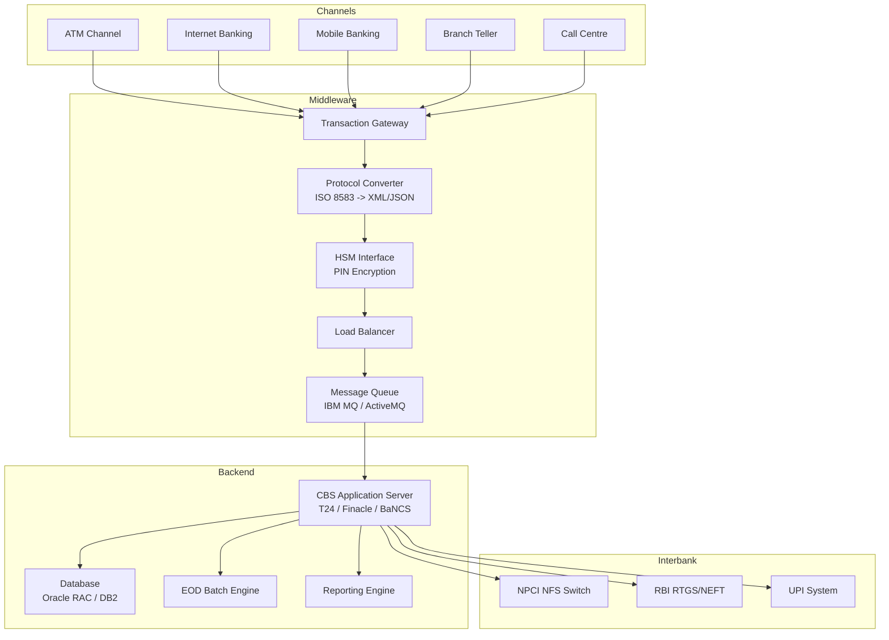
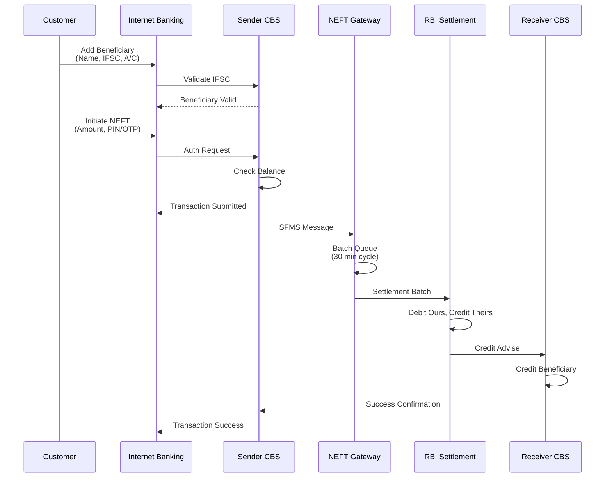

# Chapter 01: Core Banking Solutions (CBS)

## Learning Objectives

By the end of this chapter, you will be able to:

- Explain the three-tier architecture of Core Banking Solutions (CBS)
- Compare leading CBS platforms: T24, Finacle, and BaNCS
- Describe the technical flow of NEFT and RTGS settlement systems
- Understand ATM switch networking and ISO 8583 message standards
- Analyze CBS database design strategies including partitioning and sharding
- Explain Cheque Truncation System (CTS) and MICR/IFSC code structures
- Decode the Indian Financial System Code (IFSC) format and its usage

## Theory

### 1. Introduction to Core Banking Solutions

Core Banking Solution (CBS) is the centralized software platform that enables customers to operate their accounts from any branch of the bank, regardless of where the account was opened. In India, CBS adoption began in the early 2000s under the financial sector reform initiatives led by RBI and IBA.

The fundamental principle of CBS is "Anywhere, Anytime Banking" — a customer walks into Branch A in Mumbai but transacts on an account opened at Branch Z in Delhi. This is made possible by a centralized database and real-time transaction processing.

#### 1.1 Evolution of CBS in India

- **1970s–1980s:** Branch-level standalone accounting systems (manual ledger + batch processing)
- **1990s:** LAN-based branch automation with local databases
- **2000–2005:** Introduction of CBS — centralized systems by Infosys (Finacle), TCS (BaNCS), and Temenos (T24)
- **2006–2010:** Nationwide rollout of CBS across all Public Sector Banks (PSBs)
- **2010–present:** CBS integrated with digital channels — UPI, Internet Banking, Mobile Banking

#### 1.2 Why CBS Matters for IBPS Exams

IBPS SO IT Officer exams test CBS knowledge because it is the backbone of banking operations. Questions cover:
- CBS architecture layers (front-end, middleware, back-end)
- Transaction flow from ATM/Internet Banking to the core system
- CBS database design for high-volume transaction processing
- Interface standards like ISO 8583 for ATM/POS messaging

### 2. CBS Architecture — Three-Tier Model

Most CBS platforms in India follow a three-tier architecture:

```
+------------------------------------------+
|         Front-End / Channel Tier         |
|  ATM  |  Internet Banking  |  Mobile     |
|  POS  |  Branch Teller     |  Call Centre|
+-------------------+----------------------+
                    | HTTPS / MQ / ISO 8583
+-------------------v----------------------+
|         Middleware / Gateway Tier         |
|  Transaction Gateway | Message Queue     |
|  Protocol Converter  | Load Balancer     |
|  ISO 8583 <-> XML    | Auth Gateway      |
+-------------------+----------------------+
                    | JDBC / ODBC / MQ
+-------------------v----------------------+
|         Back-End / Core Tier             |
|  CBS Application Server                  |
|  Account Master | Transaction Engine     |
|  General Ledger | Interest Calculator    |
|  Database (Oracle/DB2)                   |
+------------------------------------------+
```

#### 2.1 Front-End (Channel) Tier

The front-end tier includes all customer-facing and staff-facing interfaces. Each channel uses a different protocol:

| Channel | Protocol | Message Format |
|---------|----------|----------------|
| ATM | TCP/IP + ISO 8583 | ISO 8583 (1987/1993/2003) |
| Internet Banking | HTTPS/REST | JSON/XML |
| Mobile Banking | HTTPS/REST | JSON |
| Branch Teller | LAN/TCP | XML over MQ |
| Call Centre | CTI + Screen Pop | XML |
| POS Terminal | TCP/IP + ISO 8583 | ISO 8583 |

#### 2.2 Middleware (Gateway) Tier

The middleware tier is the brain of the integration layer. It performs:

- **Protocol conversion:** ISO 8583 to XML/Java objects and vice versa
- **Message routing:** Forward transactions to the correct CBS module
- **Load balancing:** Distribute incoming requests across multiple CBS instances
- **Transaction logging:** Maintain audit trails
- **Security:** Encryption/decryption, MAC verification, SSL termination
- **Queue management:** IBM MQ, ActiveMQ, or RabbitMQ for guaranteed message delivery

**Example — ATM Transaction Flow through Middleware:**

1. Customer inserts card at ATM
2. ATM sends ISO 8583 message (0200 financial request) to middleware
3. Middleware decrypts PIN block, validates card via HSM
4. Middleware transforms ISO 8583 to XML/REST call for CBS
5. CBS processes transaction, sends response
6. Middleware transforms response back to ISO 8583
7. ATM dispenses cash/displays result

#### 2.3 Back-End (Core) Tier

The back-end tier contains:

- **CBS Application Server:** Runs core banking logic (account management, interest calculation, limit checking)
- **Database Server:** Oracle, IBM DB2, or PostgreSQL with high-availability clustering (RAC, DataGuard)
- **General Ledger (GL):** Ensures accounting balance across all transactions
- **Transaction Engine:** Processes debits/credits with ACID compliance
- **Batch Processing Engine:** Runs EOD (End of Day), interest postings, standing instructions

### 3. CBS Platforms — T24, Finacle, BaNCS

#### 3.1 Temenos T24 (now Temenos Transact)

T24 is a Swiss-origin CBS platform widely used by private banks in India (HDFC, Kotak, Yes Bank).

**Architecture Highlights:**
- Multi-entity, multi-currency design
- Built on Temenos Application Framework (TAFJ) — Java-based runtime
- OFS (Open Financial System) interface for external integration
- Real-time online processing with end-of-day batch

**Technical Stack:**
- Language: COBOL (legacy) moved to Java (TAFJ)
- Database: Oracle, MSSQL, or DB2
- Platform: Linux, AIX, Solaris
- Messaging: MQ Series, Tuxedo

**T24 Module Structure:**
```
T24 Modules:
├── CUSTOMER (Customer Management)
├── ACCOUNT (Savings/Current/FD/RD)
├── TELLER (Cash/Cheque Transactions)
├── FUNDS (NEFT/RTGS/IMPS)
├── LENDING (Loans/Overdrafts)
├── SECURITIES (Investments)
└── SECURITY (User/Role Management)
```

#### 3.2 Infosys Finacle

Finacle is the most widely deployed CBS in Indian public sector banks (SBI, PNB, BOB, Canara Bank). Built by Infosys.

**Architecture Highlights:**
- Java/J2EE based application server
- Finacle Connect (API gateway) for third-party integration
- Support for both real-time and near-real-time processing
- Built-in analytics and CRM modules

**Technical Stack:**
- Language: Java, C++
- Database: Oracle, DB2
- Application Server: WebSphere, WebLogic
- Platform: AIX, Linux

**Finacle Module Structure:**
```
Finacle Modules:
├── Finacle Core (CBS engine)
├── Finacle Connect (API layer)
├── Finacle CRM (Customer management)
├── Finacle Treasury
├── Finacle Trade Finance
├── Finacle Islamic Banking
└── Finacle Alerts (Notifications)
```

#### 3.3 TCS BaNCS

BaNCS (Banking Network and Channel Systems) is from Tata Consultancy Services. Used by Bank of India, Indian Bank, and many co-operative banks.

**Architecture Highlights:**
- Component-based architecture with SOA
- BaNCSConnect for channel integration
- TCS' Quartz platform for real-time processing
- Multi-entity, multi-currency, multi-language support

**Technical Stack:**
- Language: Java, C++
- Database: Oracle, DB2
- Server: WebLogic, JBoss
- Platform: Linux, AIX

**Platform Comparison Table:**

| Feature | T24 (Temenos) | Finacle (Infosys) | BaNCS (TCS) |
|---------|---------------|-------------------|-------------|
| Language | Java (TAFJ) | Java | Java/C++ |
| DB Support | Oracle, MSSQL | Oracle, DB2 | Oracle, DB2 |
| Primary Banks | HDFC, Kotak | SBI, PNB, BOB | BOI, Indian Bank |
| API Layer | OFS | Finacle Connect | BaNCSConnect |
| Real-time | Yes | Yes | Yes |
| Multi-entity | Yes | Yes | Yes |

### 4. Transaction Processing — NEFT, RTGS, IMPS

#### 4.1 NEFT (National Electronic Funds Transfer)

NEFT is a deferred net settlement (DNS) system — transactions are settled in batches at specific intervals. Operated by RBI.

**Technical Flow:**

```
Sender Bank CBS -> NEFT Gateway (NPCI/RBI) -> Receiver Bank CBS
```

**Step-by-Step (Technical):**

1. Customer initiates NEFT from Internet Banking/Mobile
2. Sender's CBS validates account, balance, and beneficiary IFSC
3. Sender's CBS sends transaction through INFINET (Indian Financial Network)
4. NEFT Service Centre at RBI/NPCI processes the message
5. Settlement batch occurs every 30 minutes (24x7 from Dec 2019)
6. Receiver's CBS credits the beneficiary account
7. Confirmation message sent back to sender

**Message Format:** Structured Financial Messaging System (SFMS) messages based on ISO 8583 variant modified for Indian needs.

**Key Technical Parameters:**
- Settlement type: Deferred Net Settlement (DNS)
- Timing: 24x7x365 (from Dec 2019)
- Batch interval: Every 30 minutes
- Transaction limit: No minimum; maximum varies by bank (typically Rs. 5-10 lakh for retail)
- Availability: 24x7

#### 4.2 RTGS (Real Time Gross Settlement)

RTGS is a real-time settlement system — each transaction is settled individually on a gross basis. Operated by RBI.

**Technical Flow:**

```
Sender Bank -> RTGS System (RBI) -> Receiver Bank
```

**Step-by-Step (Technical):**

1. Sender's CBS prepares RTGS message (SFMS MT103)
2. Message sent to RTGS system via INFINET
3. RTGS system checks sender's settlement account balance at RBI
4. If sufficient balance: transaction settled immediately (gross settlement)
5. Receiver's CBS gets real-time credit notification
6. If insufficient balance: transaction queued (queue management at RBI)

**Queue Management at RTGS:**
- Multiple queues based on priority (Critical, High, Normal)
- By-pass facility for critical transactions
- Auto-collateralization for government securities

**Key Technical Parameters:**
- Settlement type: Real Time Gross Settlement
- Timing: 7:00 AM to 6:00 PM (Mon-Sat, except 2nd/4th Saturday)
- Minimum limit: Rs. 2 lakh (no maximum)
- Processing: Continuous, transaction-by-transaction
- Settlement finality: Irrevocable and unconditional

#### 4.3 NEFT vs RTGS vs IMPS — Technical Comparison

```
+------------------+------------------+------------------+------------------+
|    Parameter     |      NEFT        |      RTGS        |      IMPS        |
+------------------+------------------+------------------+------------------+
| Settlement Type  | Deferred Net     | Real-Time Gross  | Real-Time        |
|                  | Settlement (DNS) | (RTGS)           | (Immediate)      |
| Timing           | 24x7x365         | 7AM-6PM Weekdays | 24x7x365         |
| Transaction Min  | No minimum       | Rs. 2,00,000     | Re. 1            |
| Transaction Max  | Bank-specific    | No upper limit   | Rs. 5,00,000     |
| Settlement       | Every 30 min     | Real-time        | Real-time        |
| Message Format   | SFMS             | SFMS (MT103)     | ISO 8583 / SFMS  |
| Operated By      | RBI/NPCI         | RBI              | NPCI             |
| Channel          | INFINET          | INFINET          | IMPS Switch      |
| Purpose          | Low-value remit  | High-value remit | Mobile Instant   |
+------------------+------------------+------------------+------------------+
```

### 5. ATM Switch Networking

#### 5.1 ATM Switch Architecture

An ATM switch (also called Interchange Switch or EFT Switch) connects multiple ATMs to the CBS and to the interbank network (NPCI/NFS).

```
+----------+    +----------+    +----------+
| ATM A    |    | ATM B    |    | ATM C    |
+-----+----+    +-----+----+    +-----+----+
      |               |               |
      +-------+-------+-------+-------+
              |               |
        +-----v------+  +-----v------+
        | Bank A     |  | Bank B     |
        | ATM Switch |  | ATM Switch |
        +-----+------+  +-----+------+
              |               |
      +-------+-------+-------+
              |               |
        +-----v------+  +-----v------+
        | NPCI NFS   |  | Mastercard |
        | Interchange |  | Cirrus    |
        +-----+------+  +------------+
              |
        +-----v------+
        | CBS of     |
        | Issuing    |
        | Bank       |
        +------------+
```

**ISO 8583 — The ATM Message Standard:**

ISO 8583 defines the message format for all ATM and POS transactions. Key message types:

| MTI | Description |
|-----|-------------|
| 0100 | Authorization Request |
| 0110 | Authorization Response |
| 0200 | Financial Request |
| 0210 | Financial Response |
| 0400 | Reversal Request |
| 0420 | Reversal/Chargeback |
| 0500 | Settlement Request |

**ISO 8583 Message Structure:**
```
Message Length (2 bytes) | MTI (4 digits) | Bitmap (8-16 bytes) | Data Elements (variable)
```

**Critical Data Elements (DE) in ATM Messages:**
- DE 2: PAN (Primary Account Number) — 19 digits max
- DE 3: Processing Code
- DE 4: Amount (Transaction amount in minor units)
- DE 11: STAN (Systems Trace Audit Number)
- DE 12: Local Transaction Time
- DE 13: Local Transaction Date
- DE 32: Acquiring Institution ID
- DE 35: Track 2 Data
- DE 37: Retrieval Reference Number
- DE 39: Response Code (00 = Approved)
- DE 41: Card Acceptor Terminal ID
- DE 52: PIN Data (encrypted PIN block)
- DE 54: Additional Amounts

#### 5.2 National Financial Switch (NFS)

NFS is the domestic interbank ATM network operated by NPCI. It connects over 1.2 lakh ATMs of all member banks.

**How an Interbank ATM Transaction Works:**

1. Customer inserts Card A (Bank A) at ATM of Bank B
2. Bank B's ATM Switch reads card BIN (Bank Identification Number)
3. BIN 'XXXXXX' identifies Bank A as issuer
4. Bank B's Switch sends ISO 8583 0200 message to NFS
5. NFS routes to Bank A's Switch
6. Bank A's Switch forwards to Bank A's CBS
7. CBS validates PIN (via HSM), checks balance, debits account
8. Response: ISO 8583 0210 (Approved/Declined)
9. Bank A's Switch sends response back through NFS to Bank B
10. Bank B's ATM dispenses cash

**HSM (Hardware Security Module) Role:**
- PIN encryption/decryption using LMK (Local Master Key)
- PIN translation between acquirer and issuer keys
- ARQC/ARPC verification for EMV chip cards
- Secure key management (TMK, TAK, ZPK)

### 6. CBS Database Design — Partitioning and Sharding

High-volume CBS databases must handle millions of transactions daily. Key design strategies:

#### 6.1 Partitioning in Oracle/DB2

Partitioning splits a large table into smaller, manageable segments while maintaining logical unity.

**Common CBS Partitioning Schemes:**

```
Transaction Table: TXN_HISTORY
├── Range Partitioning: BY RANGE (TXN_DATE)
│   ├── PARTITION p2024_q1 VALUES LESS THAN ('01-APR-2024')
│   ├── PARTITION p2024_q2 VALUES LESS THAN ('01-JUL-2024')
│   ├── PARTITION p2024_q3 VALUES LESS THAN ('01-OCT-2024')
│   └── PARTITION p2024_q4 VALUES LESS THAN ('01-JAN-2025')
│
├── List Partitioning: BY LIST (BRANCH_CODE)
│   ├── PARTITION north VALUES ('DEL', 'LKO', 'CHD')
│   ├── PARTITION west VALUES ('MUM', 'PUN', 'AHM')
│   └── PARTITION south VALUES ('BEN', 'CHE', 'HYD')
│
└── Hash Partitioning: BY HASH (ACCOUNT_NO) PARTITIONS 16
```

**Benefits for CBS:**
- **Partition Pruning:** Queries with date range only scan relevant partitions
- **Parallel DML:** Operations on different partitions run in parallel
- **Data Lifecycle Management:** Old partitions can be compressed or moved to slower storage
- **Availability:** One partition failure doesn't bring down entire table

#### 6.2 Sharding for Multi-Tenant CBS

Sharding distributes data across multiple database instances/servers. Used by large banks to scale horizontally.

```
CBS Sharding Architecture:

Router/Proxy Layer
├── Shard 1 (Oracle RAC A)
│   ├── Accounts 1-500000
│   └── TXN for these accounts
├── Shard 2 (Oracle RAC B)
│   ├── Accounts 500001-1000000
│   └── TXN for these accounts
├── Shard 3 (Oracle RAC C)
│   ├── Accounts 1000001-1500000
│   └── TXN for these accounts
└── Config Server (Shard Map)
    ├── Shard Key: ACCOUNT_NO
    └── Range: 0000000000-9999999999
```

**Sharding Key Selection:**
- **Account Number:** Most common shard key in CBS
- **Customer ID:** Used when all accounts of a customer should be in same shard
- **Branch Code:** Used for geographically distributed deployments

**Challenges in CBS Sharding:**
- Cross-shard transactions (ACID across shards is complex)
- Distributed joins (customer + account + transaction across shards)
- Resharding when data grows (moving data between shards)

#### 6.3 CBS Database Tables (Critical)

**Account Master Table:**
```
ACCOUNT_MASTER:
├── ACCOUNT_NO (PK, Shard Key)
├── CUSTOMER_ID (FK to CUSTOMER_MASTER)
├── BRANCH_CODE
├── PRODUCT_CODE (SAV/CUR/FD/RD)
├── CURRENT_BALANCE (DECIMAL 18,2)
├── LEDGER_BALANCE (DECIMAL 18,2)
├── STATUS (ACTIVE/DORMANT/CLOSED)
├── OPEN_DATE
├── LAST_TXN_DATE
├── INTEREST_RATE
├── NOMINEE_DETAILS
```

**Transaction Table:**
```
TRANSACTION_LOG:
├── TXN_REF_NO (PK)
├── ACCOUNT_NO (FK, Partition Key)
├── TXN_DATE (Partition Key)
├── TXN_TYPE (DEBIT/CREDIT)
├── TXN_AMOUNT (DECIMAL 18,2)
├── CHANNEL (ATM/IB/MB/BRANCH)
├── TERMINAL_ID
├── REFERENCE_NO
├── NEFT_URN / RTGS_REF_NO
├── RESPONSE_CODE
├── POSTING_DATE
├── VALUE_DATE
```

### 7. Cheque Truncation System (CTS)

#### 7.1 What is CTS?

CTS is a system where cheque images and electronic data are transmitted between banks instead of physically moving paper cheques. Implemented by RBI in 2008 (CTS-2010 standard).

**Before CTS:**
```
Physical cheque movement:
Branch A (Drawer) -> Clearing House (City A) -> Air/Road Transport
-> Clearing House (City B) -> Branch B (Drawee)
Time: 3-14 days
```

**After CTS:**
```
Physical cheque stays at presenting bank:
Branch A (Drawer) -> Scan (Front + Back) -> CTS Grid (NPCI)
-> Presenting Bank -> Drawee Bank
Time: T+1 (1 day)
```

#### 7.2 CTS Technical Flow

```
1. PAYER deposits cheque at PRESENTING BANK
2. Cheque scanned (Front: all details; Back: endorsement)
   ├── Image: Greyscale TIFF, 200 DPI minimum
   ├── MICR Line: Auto-read by scanner
   └── Digital Signature: Using bank's private key
3. Image + data sent to CTS Grid (NPCI)
4. CTS Grid validates:
   ├── Image quality (size: &lt; 200KB per image)
   ├── MICR read vs manual data
   └── Digital signature verification
5. CTS Grid routes to PAYING BANK through INFINET
6. Paying Bank CBS:
   ├── Image displayed to teller (or auto-approval)
   ├── Signature verification
   ├── Funds availability check
   └── Debit decision: Return or Honour
7. Settlement through RBI current account
8. Presenting bank gets credit
```

**CTS-2010 Standards:**
- Image dimensions: 1200 x 650 pixels (front), 900 x 600 pixels (back)
- File format: TIFF with CCITT Group 4 compression
- Minimum DPI: 200
- Grid capture: 300 DPI for MICR
- Encryption: PKI-based digital signatures using licensed Certifying Authorities (CAs)
- Archive period: 10 years

### 8. MICR, IFSC, and Indian Financial System Code

#### 8.1 MICR (Magnetic Ink Character Recognition)

MICR is a 9-digit code printed on cheque leaves using magnetic ink (iron oxide-based). Allows high-speed automated cheque processing.

**MICR Code Structure:**
```
CCCC BBB A
├── CCCC: City Code (4 digits) — First 3 digits = city PIN prefix, 4th = 0
│   Example: 400 for Mumbai, 110 for Delhi, 700 for Kolkata
├── BBB: Bank Code (3 digits) — Assigned by IBA
│   Example: 002 for SBI, 011 for HDFC
└── A: Branch Code (1 digit) — Specific to branch within bank-city
```

**Full Example:** `400002011`
- City: Mumbai (400)
- Bank: SBI (002)
- Branch: 011 (Mumbai Main Branch)

#### 8.2 IFSC (Indian Financial System Code)

IFSC is an 11-character alphanumeric code that uniquely identifies a bank branch for electronic payment systems (NEFT, RTGS, IMPS).

**IFSC Structure:**
```
SBIN0012345
├── SBIN: Bank Code (4 chars) — Alphabetical
│   Example: SBIN for SBI, HDFC for HDFC, ICIC for ICICI
├── 0: Reserved character (5th char) — Always '0' for future use
└── 12345: Branch Code (6 chars) — Alphanumeric, unique within bank
```

**Where IFSC is used:**
- NEFT/RTGS/IMPS beneficiary registration
- UPI transactions (through VPA mapping)
- Tax payments (NSDL/ODSL)
- Mandate registration
- BBPS bill payments

**How CBS Validates IFSC:**
```
1. User enters beneficiary IFSC
2. CBS validates format: ^[A-Z]{4}0[A-Z0-9]{6}$
3. CBS looks up IFSC database (master table)
4. Validates branch exists and is NEFT-enabled
5. Gets MICR code, city, branch name from IFSC master
6. Displays confirmation to user before adding beneficiary
```

#### 8.3 IFSC Database Table Design

```
IFSC_MASTER:
├── IFSC_CODE (PK, VARCHAR2(11))
├── BANK_NAME (VARCHAR2(100))
├── BANK_CODE (VARCHAR2(9))
├── BRANCH_NAME (VARCHAR2(100))
├── ADDRESS (VARCHAR2(500))
├── CITY (VARCHAR2(50))
├── DISTRICT (VARCHAR2(50))
├── STATE (VARCHAR2(50))
├── MICR_CODE (VARCHAR2(9))
├── CONTACT (VARCHAR2(20))
├── NEFT_ENABLED (CHAR1: Y/N)
├── RTGS_ENABLED (CHAR1: Y/N)
├── IMPS_ENABLED (CHAR1: Y/N)
├── LAST_UPDATED (TIMESTAMP)
```

RBI publishes the IFSC master database as a downloadable Excel file, updated periodically. Banks consume this for their CBS IFSC validation tables.

### 9. Architecture Diagrams

#### CBS High-Level Architecture



#### NEFT Transaction Flow



## Examples (Exam-Style MCQs)

**Example 1:**
Which ISO 8583 message type indicates a Financial Request (e.g., ATM cash withdrawal)?

A) 0100
B) 0200
C) 0400
D) 0500

<details>
<summary>Answer</summary>
**Answer: B) 0200**

Explanation: MTI 0200 is the Financial Request message used for ATM cash withdrawals. 0100 is Authorization Request, 0400 is Reversal, and 0500 is Settlement.
</details>

**Example 2:**
Which settlement method is used by NEFT for processing transactions?

A) Real Time Gross Settlement
B) Deferred Net Settlement
C) Immediate Payment Settlement
D) Continuous Linked Settlement

<details>
<summary>Answer</summary>
**Answer: B) Deferred Net Settlement**

Explanation: NEFT operates on DNS, where transactions are batched and settled at 30-minute intervals. RTGS uses RTGS (Real Time Gross Settlement) where each transaction settles individually in real time.
</details>

**Example 3:**
In the IFSC code "SBIN0012345", what does the 5th character '0' represent?

A) Bank Code
B) Reserved for future use
C) Branch Code separator
D) Check digit for validation

<details>
<summary>Answer</summary>
**Answer: B) Reserved for future use**

Explanation: The 5th character of IFSC is always '0', reserved by RBI for future use. The first 4 characters represent the bank, and the last 6 represent the branch.
</details>

**Example 4:**
What is the minimum processing DPI required for MICR reading in CTS-2010 standards?

A) 100 DPI
B) 200 DPI
C) 300 DPI
D) 600 DPI

<details>
<summary>Answer</summary>
**Answer: C) 300 DPI**

Explanation: CTS-2010 specifies 300 DPI for MICR reading to ensure accurate magnetic character recognition. The front image requires 200 DPI minimum but MICR capture is at 300 DPI.
</details>

**Example 5:**
Which component in CBS architecture is responsible for converting ISO 8583 messages to XML/JSON for the core application?

A) HSM
B) Load Balancer
C) Protocol Converter
D) EOD Batch Engine

<details>
<summary>Answer</summary>
**Answer: C) Protocol Converter**

Explanation: The Protocol Converter in the middleware tier handles conversion between channel-specific message formats (ISO 8583 for ATM/POS) and formats understood by the CBS application (XML/JSON).
</details>

## Summary

Core Banking Solution (CBS) is the centralized platform that enables "Anywhere, Anytime" banking. The three-tier architecture consists of the Front-End (Channel) Tier handling diverse channels like ATM, Internet Banking, and Mobile Banking; the Middleware (Gateway) Tier providing protocol conversion, message routing, and security; and the Back-End (Core) Tier running the CBS application and database.

Leading CBS platforms in India are T24 (Temenos — HDFC, Kotak), Finacle (Infosys — SBI, PNB, BOB), and BaNCS (TCS — BOI, Indian Bank). Each has a Java-based application server with multi-entity support and API integration layers.

NEFT operates on Deferred Net Settlement with 30-minute batch cycles (24x7x365), RTGS uses Real-Time Gross Settlement (Rs. 2 lakh minimum), and IMPS provides instant real-time settlement (24x7x365, Re. 1 minimum). ATM switching uses ISO 8583 message standard over the National Financial Switch (NFS) network with HSM for PIN security.

CBS database design employs partitioning (range, list, hash) and sharding for handling high-volume transaction tables. The Cheque Truncation System (CTS-2010) enables image-based cheque clearing with TIFF images at 200 DPI (front) and digital signatures, eliminating physical cheque movement.

MICR codes (9-digit, magnetic ink) and IFSC codes (11-character alphanumeric) are critical identifiers used across all payment systems.

## Practical Takeaways

1. **For CBS Implementation:** Always consider the middleware tier as the critical integration layer — banks that invested in robust middleware (with protocol converters and HSMs) have easier integration with newer channels like UPI.

2. **Database Partitioning Strategy:** In CBS, use RANGE partitioning on transaction date and LIST partitioning on branch codes. Never use hash partitioning on date columns as it defeats partition pruning.

3. **IFSC Validation:** Always validate IFSC format (`^[A-Z]{4}0[A-Z0-9]{6}$`) at the front-end level before making backend CBS calls. This reduces unnecessary load and provides instant feedback to customers.

4. **CTS Readiness:** Ensure cheque scanners support 300 DPI for MICR capture. Lower DPI results in MICR read failures, causing return of cheques.

5. **ATM Switch Design:** Maintain separate queues for interbank (NFS) and on-us transactions. On-us transactions should bypass NFS to reduce latency and NPCI interchange fees.

6. **NEFT/RTGS Queue Management:** For RTGS, implement auto-queue functionality with priority-based queue management to avoid timeouts during high-volume periods.

7. **Sharding Key Selection:** Use ACCOUNT_NO or CUSTOMER_ID as sharding key for CBS. Avoid branch-based sharding as customers may move between branches.

## Chapter Quiz

**Q1:** What is the transaction minimum and maximum limit for RTGS in India?

A) No minimum, Rs. 5 lakh maximum
B) Rs. 2 lakh minimum, no maximum
C) Rs. 1 minimum, Rs. 5 lakh maximum
D) Rs. 10 lakh minimum, Rs. 100 lakh maximum

<details>
<summary>Answer</summary>
**Answer: B) Rs. 2 lakh minimum, no maximum**

RTGS has a minimum transaction value of Rs. 2 lakh. There is no upper limit for RTGS transactions. IMPS has a minimum of Re. 1 and maximum of Rs. 5 lakh.
</details>

**Q2:** Which CBS platform is built by Infosys and used by the largest number of Public Sector Banks in India?

A) T24 (Temenos)
B) Finacle
C) BaNCS
D) SilverLake

<details>
<summary>Answer</summary>
**Answer: B) Finacle**

Finacle by Infosys is the most widely deployed CBS in Indian PSBs including SBI, PNB, BOB, and Canara Bank. T24 is used by private banks like HDFC, and BaNCS by BOI and Indian Bank.
</details>

**Q3:** In ISO 8583 messaging, which Data Element (DE) contains the Primary Account Number?

A) DE 2
B) DE 3
C) DE 4
D) DE 11

<details>
<summary>Answer</summary>
**Answer: A) DE 2**

DE 2 (PAN) contains the Primary Account Number. DE 3 is Processing Code, DE 4 is Transaction Amount, and DE 11 is STAN (Systems Trace Audit Number).
</details>

**Q4:** The Cheque Truncation System (CTS) replaces which of the following in the traditional clearing process?

A) Signature verification
B) Physical movement of cheques
C) MICR code reading
D) Account validation

<details>
<summary>Answer</summary>
**Answer: B) Physical movement of cheques**

CTS replaces the physical movement of paper cheques between banks with electronic image-based clearing. The physical cheque stays at the presenting bank, and only digital images are exchanged through the CTS grid.
</details>

**Q5:** In CBS three-tier architecture, which component performs PIN encryption and verification for ATM transactions?

A) Load Balancer
B) Protocol Converter
C) HSM (Hardware Security Module)
D) Transaction Gateway

<details>
<summary>Answer</summary>
**Answer: C) HSM (Hardware Security Module)**

HSM handles all cryptographic operations including PIN encryption/decryption using LMK, PIN translation between acquirer and issuer keys, and ARQC/ARPC verification for EMV chip cards.
</details>
