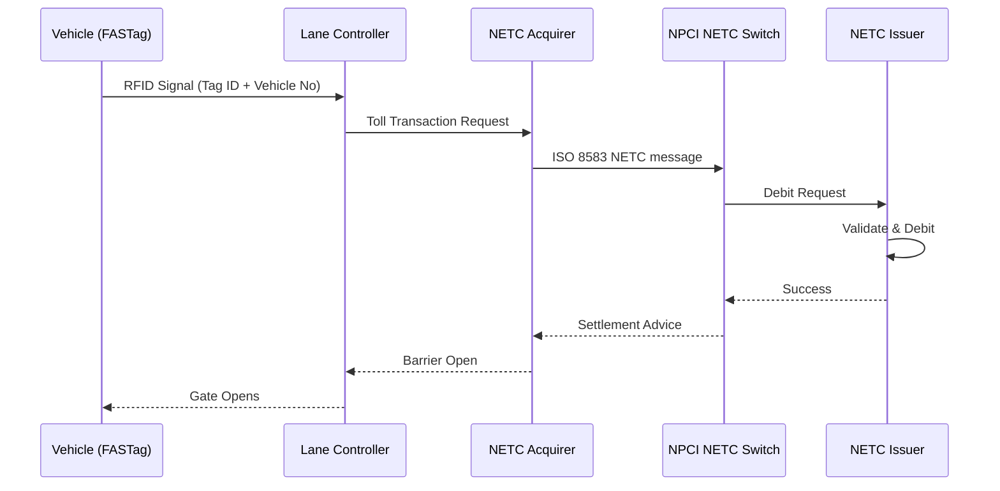
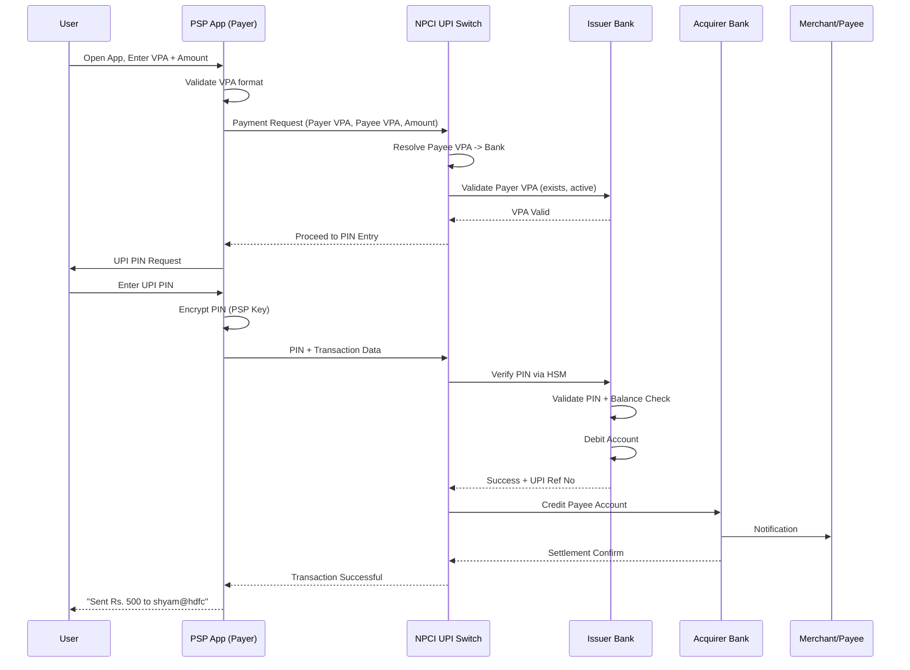

# Chapter 02: Digital Payment Systems

## Learning Objectives

By the end of this chapter, you will be able to:

- Explain UPI architecture including NPCI role, PSPs, issuer/acquirer banks, and the UPI reference number flow
- Compare IMPS, NEFT, and RTGS on settlement type, timing, and transaction limits
- Describe RuPay card processing and how it differs from Visa/Mastercard
- Understand FASTag RFID-based toll collection and the NETC system
- Analyze Aadhaar Payments Bridge System (APBS) and its architecture
- Explain BBPS, AePS, NACH, and tokenization mechanisms
- Describe recurring payments via eMandate, UPI Lite, and UPI123Pay

## Theory

### 1. Introduction to Digital Payment Systems

India's digital payment ecosystem has undergone a paradigm shift since 2016, driven by the Unified Payments Interface (UPI), regulatory support from RBI, and the infrastructure built by NPCI. Digital payments in India are categorized into:

- **Retail Payment Systems:** UPI, IMPS, NEFT, RTGS, BBPS
- **Card Payments:** RuPay, Visa, Mastercard (Contact, Contactless, Tokenized)
- **Aadhaar-based Payments:** AePS, APBS
- **Alternative Channels:** FASTag (NETC), UPI Lite, UPI123Pay

The key driver of this ecosystem is the **National Payments Corporation of India (NPCI)** — an umbrella organization for operating retail payment and settlement systems in India, established by RBI and IBA in 2008.

### 2. UPI Architecture

#### 2.1 UPI Overview

Unified Payments Interface (UPI) is an instant real-time payment system developed by NPCI. It facilitates inter-bank transactions through mobile phones using a Virtual Payment Address (VPA). UPI operates 24x7x365 and processes over 10 billion transactions per month (as of 2025).

**Key Concepts:**

- **VPA (Virtual Payment Address):** Format — `username@bankhandle` (e.g., `ram@sbi`)
- **UPI ID:** Unique identifier for a user's bank account
- **UPI PIN:** 4-6 digit personal identification number set by the user
- **UPI Reference Number:** 12-digit unique transaction identifier

#### 2.2 UPI Architecture — Four-Party Model

```
+------------------+     +------------------+
|   Payer (User A) |     | Payee (User B)   |
|   VPA: ram@sbi   |     | VPA: shyam@hdfc  |
+--------+---------+     +--------+---------+
         |                        |
         | 1. Initiate Payment    | 5. Credit
         | VPA: shyam@hdfc        | Notification
         | Amount: Rs. 500        |
+--------v---------+     +--------v---------+
| Payer's PSP      |     | Payee's PSP      |
| (PhonePe/GPay)   |     | (PhonePe/GPay)   |
| Acquiring side   |     | Issuing side     |
+--------+---------+     +--------+---------+
         | 2. UPI Request        |
         +-----------+-----------+
                     |
            +--------v---------+
            |   NPCI UPI       |
            |   Switch         |
            | (Central System) |
            +--------+---------+
                     |
            +--------v---------+
            |   Payee PSP      |
            | Routes to        |
            | Payee Bank       |
            +--------+---------+
```

**Detailed Transaction Flow (12 steps):**

```
Step 1:  Payer opens PSP app (Google Pay/PhonePe/PayTM)
Step 2:  Payer enters: VPA (shyam@hdfc), Amount (Rs. 500)
Step 3:  PSP (Acquirer) formats UPI request:
         {
           "txnId": "UPI20250706123456",
           "payerVpa": "ram@sbi",
           "payeeVpa": "shyam@hdfc",
           "amount": "500.00",
           "payerAddr": "+919876543210@upi"
         }
Step 4:  PSP sends to NPCI UPI Switch
Step 5:  NPCI validates VPA format, checks blacklist/whitelist
Step 6:  NPCI routes to Payee PSP (based on @hdfc handle)
Step 7:  Payee PSP validates payee VPA exists at HDFC
Step 8:  NPCI sends OTP/PIN request back to Payer PSP
Step 9:  Payer enters UPI PIN
Step 10: PIN encrypted and sent via PSP -> NPCI -> Issuer Bank
Step 11: Issuer Bank (SBI) validates PIN via HSM, debits Rs. 500
Step 12: Credited to payee (HDFC) — UPI Ref No generated
```

#### 2.3 UPI Reference Number (12-digit URN)

The UPI Reference Number (also called UPI Transaction ID or URN) is a 12-digit identifier generated by NPCI for every successful UPI transaction.

**URN Format Breakdown:**
```
XXXXXXXXXXXX (12 digits)
├── First 4 digits: NPCI Institution ID (numeric)
├── Next 4 digits: Date (MMDD format)
└── Last 4 digits: Sequence number (auto-increment)
```

**Example:** `12340706000001`
- `1234` — NPCI Institution ID
- `0706` — July 06
- `000001` — Sequence number (first transaction of the day)

#### 2.4 UPI PIN and Authentication

UPI PIN is a 4-6 digit secret known only to the user. It is set during UPI registration (first-time setup via debit card OTP).

**UPI PIN Authentication Flow:**

```
User enters UPI PIN -> PSP App -> Encrypted with PSP Key
-> NPCI UPI Switch -> Decrypted at Issuer Bank HSM
-> HSM validates PIN against stored PIN offset
-> Response: Success/Failure -> NPCI -> PSP -> User
```

**Security Layers:**
- PIN is NEVER stored in cleartext
- PIN offset stored at issuer bank (salted hash of PIN)
- Transport encryption: TLS 1.2+ between all parties
- Device binding: App is tied to device ID + SIM card
- Transaction signing: Each UPI transaction is digitally signed

#### 2.5 UPI Ecosystem Participants

| Participant | Role | Example |
|-------------|------|---------|
| NPCI | Central switch, clearing, settlement | NPCI |
| Payer PSP | Initiates transaction on payer side | Google Pay, PhonePe |
| Payee PSP | Receives transaction on payee side | PhonePe, PayTM |
| Issuer Bank | Holds payer's account, validates PIN | SBI, HDFC, ICICI |
| Acquirer Bank | Holds payee's account | HDFC for merchant |
| UPI App | Customer-facing application | BHIM, GPay, PhonePe |
| TPAP (Third Party App Provider) | Non-bank PSP (operates under a bank) | Google Pay (under Axis) |
| PPI (Prepaid Payment Instrument) | Wallet issuer | PayTM Wallet |

### 3. IMPS vs NEFT vs RTGS — Technical Comparison

#### 3.1 IMPS (Immediate Payment Service)

IMPS is an instant interbank electronic fund transfer service available 24x7x365. Operated by NPCI. It is the underlying real-time settlement system that also powers UPI.

**Technical Architecture:**

```
Sender -> Sender Bank CBS -> IMPS Switch (NPCI) -> Receiver Bank CBS -> Receiver
```

**Message Formats:**
- ISO 8583 variant for ATM/POS mode
- XML for mobile/internet banking mode
- SFMS for interbank messaging

**Key Features:**
- Settlement: Real-time (immediate)
- Minimum: Re. 1
- Maximum: Rs. 5 lakh (per transaction, increased by RBI in phases)
- Channels: Mobile, Internet Banking, ATM, SMS, USSD (*99#)
- Availability: 24x7x365

**IMPS Modes:**
| Mode | Identifier | Use Case |
|------|-----------|----------|
| P2A (Account + IFSC) | Account No + IFSC | Traditional bank transfer |
| P2M (Mobile + MMID) | Mobile No + MMID | Mobile-first transfers |
| P2P (VPA) | VPA (UPI) | UPI-based transfers (UPI uses IMPS for settlement) |
| Card-based | Card Number | Card-to-account transfers |

#### 3.2 NEFT (National Electronic Funds Transfer)

| Parameter | Value |
|-----------|-------|
| Operator | RBI (via INFINET) |
| Settlement | Deferred Net Settlement (DNS) |
| Batch Interval | Every 30 minutes |
| Minimum | No minimum |
| Maximum | Bank-specific (typically Rs. 5-10 lakh) |
| Availability | 24x7x365 (from Dec 2019) |
| Message | SFMS (ISO 8583 variant) |

#### 3.3 RTGS (Real Time Gross Settlement)

| Parameter | Value |
|-----------|-------|
| Operator | RBI |
| Settlement | Real-time (continuous, individual) |
| Minimum | Rs. 2,00,000 |
| Maximum | No upper limit |
| Availability | 7:00 AM - 6:00 PM (Weekdays, except 2nd/4th Sat) |
| Message | SFMS MT103 |

#### 3.4 Comparison Table

```
+------------------+------------------+------------------+------------------+
|    Feature       |      IMPS        |      NEFT        |      RTGS        |
+------------------+------------------+------------------+------------------+
| Operator         | NPCI             | RBI              | RBI              |
| Settlement       | Real-time        | Deferred Net     | Real-time Gross  |
| Timing           | 24x7x365         | 24x7x365         | 7AM-6PM Mon-Sat  |
| Settlement Speed | Seconds          | Up to 30 min     | Immediate        |
| Min Amount       | Re. 1            | No min           | Rs. 2,00,000     |
| Max Amount       | Rs. 5,00,000     | Bank specific    | No limit         |
| Message Standard | ISO 8583/SFMS    | SFMS             | SFMS (MT103)     |
| Network          | IMPS Switch      | INFINET          | INFINET          |
| Channel          | Mobile/Net/ATM   | Net/Mobile       | Net/Branch       |
| Finality         | Immediate        | Batch end        | Real-time        |
+------------------+------------------+------------------+------------------+
```

### 4. RuPay Card Processing

#### 4.1 RuPay Overview

RuPay is an Indian domestic card payment network launched by NPCI in 2012. It is the most widely used card in India, especially under the Pradhan Mantri Jan Dhan Yojana (PMJDY) and RuPay-Jana Dhan-Aadhaar (JAM) trinity.

**RuPay vs Visa/Mastercard:**

| Feature | RuPay | Visa/Mastercard |
|---------|-------|-----------------|
| Processing | NPCI (domestic) | VisaNet/Mastercard (global) |
| Switch Fees | Lower (domestic routing) | Higher (USD-based) |
| Authorization | NPCI UPI/CBS | Visa/Mastercard global auth |
| Tokenization | RuPay Tokenization | VTS/MDST (Visa/Mastercard) |
| Contactless | RuPay Contactless (NFC) | PayWave/PayPass |
| 3DS | 3D Secure (Rupay Secure) | 3D Secure (Verified by Visa/MC) |
| Acceptance | Mostly India (growing intl) | Global (200+ countries) |
| Security | EMV Chip + PIN mandatory | EMV Chip + PIN |

#### 4.2 RuPay Transaction Flow (POS)

```
1. Customer taps/inserts RuPay card at POS terminal
2. POS reads card data (Track 2 / EMV Data)
3. POS sends ISO 8583 0200 message to Acquirer Bank
4. Acquirer Bank routes to NPCI (RuPay Switch)
5. NPCI validates:
   ├── Card BIN check (RuPay BIN: 60, 65, 81, 82...)
   ├── Card status (active/blocked/hotlisted)
   └── Merchant category check
6. NPCI routes to Issuer Bank
7. Issuer Bank:
   ├── Validates CVV/PIN
   ├── Checks available balance/credit limit
   ├── Generates ARQC (EMV) or online auth
   └── Sends approval/decline
8. Response flows back through NPCI -> Acquirer -> POS
```

**RuPay BIN Range:**
- 60xxxx — RuPay Classic
- 65xxxx — RuPay Platinum
- 81xxxx — RuPay Select
- 82xxxx — RuPay World
- 508xxx — RuPay JCB (International co-badge)

#### 4.3 RuPay Economics for Banks

For Indian banks, RuPay is significantly cheaper than Visa/Mastercard:
- **Issuance fee:** RuPay: Rs. 20-30; Visa/MC: Rs. 100-150 per card
- **Switch fee:** RuPay: ~Rs. 0.50-1 per transaction; Visa/MC: ~Rs. 5-15 (varies with forex)
- **Annual membership:** RuPay: Lower fixed fee; Visa/MC: Higher (USD-denominated)
- **Settlement:** RuPay settles in INR (no forex risk); Visa/MC settles in USD

### 5. FASTag and NETC

#### 5.1 FASTag Overview

FASTag is a RFID-based toll collection system operated by NPCI under the National Electronic Toll Collection (NETC) program. It uses passive RFID tags affixed to vehicle windshields.

**Technical Specifications:**

```
FASTag RFID Tag:
├── Frequency: 865-867 MHz (UHF RFID, as per TRAI)
├── Standard: ISO 18000-6C (EPC Gen2)
├── Read Range: 4-6 meters (booth), 50m+ (free-flow)
├── Memory: 96-512 bits EPC memory
├── Battery: Passive (no battery, powered by reader RF signal)
├── Data Storage: Vehicle Registration No + Tag ID + Wallet Link
└── Tamper: Tamper-evident adhesive (removal destroys tag)
```

**NETC Transaction Flow:**

```
1. Vehicle approaches toll plaza
2. RFID Antenna at lane (boom barrier) emits RF signal
3. FASTag responds with Tag ID + Vehicle Registration No
4. Lane Controller reads tag data
5. Transaction sent to NETC Acquiring Bank (acquirer)
   ├── Vehicle class determination (based on tag type)
   └── Toll amount calculation (based on plaza + vehicle class)
6. Acquirer sends to NPCI NETC Switch
7. NPCI routes to Issuer Bank (where tag is linked)
8. Issuer Bank:
   ├── Validates tag status (active/blacklisted)
   ├── Checks wallet balance / credit limit
   └── Debits toll amount
9. Settlement: NPCI -> Issuer -> Acquirer
10. Lane Controller gets "Success" -> Boom barrier opens
11. SMS/email notification to customer
```

**NETC Clearing Flow:**



#### 5.2 Wallet-Based vs Credit-Based FASTag

| Type | Description | Example |
|------|-------------|---------|
| Wallet FASTag | Prepaid wallet linked to tag | Most common |
| Credit FASTag | Postpaid credit line linked to tag | ICICI, HDFC credit card-linked |
| Savings FASTag | Direct debit from savings account | SBI, some PSBs |

### 6. Aadhaar Payments Bridge System (APBS)

#### 6.1 APBS Architecture

APBS enables the transfer of government subsidies/benefits directly to beneficiaries' bank accounts using Aadhaar as the financial address. Implemented by NPCI under the DBT (Direct Benefit Transfer) program.

```
Central Government (PFMS)
        |
        v
Sponsor Bank (e.g., SBI for PAHAL)
        |
        v
NPCI APBS Gateway
        |
        +---------+---------+
        |                   |
    Canara Bank         PNB
    (Mapper Bank)       (Mapper Bank)
        |                   |
    Aadhaar to A/C     Aadhaar to A/C
    Mapping DB         Mapping DB
```

**Technical Workflow:**

```
Step 1:  Government department sends subsidy file to PFMS
Step 2:  PFMS forwards beneficiary list with Aadhaar to Sponsor Bank
Step 3:  Sponsor Bank sends Aadhaar + Amount to NPCI APBS
Step 4:  NPCI routes to Mapper Bank (where Aadhaar is mapped)
Step 5:  Mapper Bank looks up Aadhaar-to-Account mapping
Step 6:  Validates: Aadhaar is linked, account is active, KYC complete
Step 7:  Transaction sent to Destination Bank CBS
Step 8:  Beneficiary account credited
Step 9:  Response back to NPCI -> Sponsor Bank -> PFMS -> Government
```

**APBS Key Terms:**
- **PFMS:** Public Financial Management System (government's payment platform)
- **Sponsor Bank:** Bank that manages the scheme's funds
- **Mapper Bank:** Bank where beneficiary's Aadhaar is mapped to account
- **Destination Bank:** Bank where beneficiary holds the account

### 7. BBPS (Bharat Bill Payment System)

#### 7.1 BBPS Architecture

BBPS is an integrated bill payment system offering interoperable bill payment services to customers across India. Operated by NPCI.

```
+----------+     +----------+     +----------+
| Customer A|    | Customer B|    | Customer C|
+-----+----+     +-----+----+     +-----+----+
      |                |                |
+-----v----------------v----------------v------+
|          Bill Payment Aggregators            |
|          (PayTM, PhonePe, Google Pay)         |
+------------------+---------------------------+
                   |
+------------------v---------------------------+
|          BBPS Central Unit (NPCI)            |
|          - Transaction Switch                |
|          - Settlement Management             |
|          - Dispute Resolution                |
+----+-------------------+------------------+--+
     |                   |                  |
+----v-------+    +------v-------+   +------v-------+
| Biller Unit |    | Biller Unit  |   |  Biller Unit |
| (Electric)  |    | (Gas)        |   | (Telecom)    |
+-------------+    +--------------+   +--------------+
```

**Three-Tier Model:**
1. **Customer:** Pays bills through any registered channel (web, mobile, agent)
2. **BPU (Bharat Payment Unit):** Operating unit (banks, aggregators, agents) — can be Online Payment Unit (OPU) or offline agent
3. **BBPS Central Unit:** NPCI — clearing, settlement, rules, standards

**Transaction Flow:**
```
Bill Fetch: Customer -> BPU -> BBPS Central -> Biller -> Bill Details -> Back to Customer
Bill Pay: Customer -> BPU -> BBPS Central -> RBI Settlement -> Biller -> Confirmation
```

#### 7.2 BBPS Categories

| Category | Examples |
|----------|----------|
| Electricity | All state electricity boards |
| Telecom | Airtel, Jio, BSNL, VI |
| Gas | Indane, HP Gas, Bharat Gas |
| Water | Municipal corporations |
| DTH | Tata Sky, Dish TV, Airtel DTH |
| Loan Repayment | Banks, NBFCs |
| Education | School/college fees |
| Insurance | Premium payments |
| Credit Card | Bill payment |

### 8. AePS (Aadhaar-enabled Payment System)

#### 8.1 AePS Architecture

AePS allows Aadhaar-based financial transactions using a micro-ATM device. Operated by NPCI.

**Transaction Types:**
- Cash Withdrawal
- Balance Enquiry
- Mini Statement
- Aadhaar to Aadhaar Fund Transfer
- Cash Deposit (added later)

**Technical Flow (Cash Withdrawal):**

```
1. Customer provides: Aadhaar Number + Transaction Type + Amount
2. Micro-ATM captures Aadhaar via biometric scanner
3. UIDAI authentication (fingerprint/iris match)
4. Upon successful authentication:
   ├── Aadhaar Number + Bank IIN + Amount sent to NPCI AePS Switch
   ├── NPCI routes to Issuer Bank (based on Aadhaar mapping)
   ├── Issuer Bank validates account balance
   ├── CBS debits account
   └── Response sent back to micro-ATM via NPCI
5. Micro-ATM dispenses cash
```

**IIN (Issuer Identification Number):** First 6 digits of Aadhaar number indicate the enrolling agency/registrar. Used by AePS to route to the correct bank.

### 9. NACH (National Automated Clearing House)

NACH is a web-based solution to facilitate bulk transactions (salaries, dividends, subsidies). Replaced the legacy ECS (Electronic Clearing Service).

**NACH Types:**

| Type | Direction | Use Case |
|------|-----------|----------|
| NACH Credit | Sponsor -> Destination | Salary, Dividend, Subsidy |
| NACH Debit | Sponsor <- Destination | Loan EMI, SIP, Insurance Premium |

**NACH Technical Flow (Debit):**

```
1. Mandate registered: Customer -> Destination Bank -> NPCI
2. Sponsor (e.g., Mutual Fund) submits debit file to Sponsor Bank
3. Sponsor Bank -> NPCI NACH System
4. NPCI processes in batches (2-3 cycles per day)
5. NPCI routes to Destination Bank CBS
6. Destination Bank debits customer account
7. Settlement: NPCI -> Destination Bank -> Sponsor Bank -> Sponsor
```

**NACH Mandate Lifecycle:**
```
Registration -> Verification (by sponsor) -> Activation -> 
Active Mandate -> Debit Transactions -> 
Modification/Cancellation (if needed) -> Deactivation
```

### 10. Tokenization

Tokenization replaces sensitive card data (Primary Account Number / PAN) with a unique token that can be used for transactions without exposing the actual card number.

#### 10.1 Card-on-File Tokenization (CoFT)

As per RBI's mandate (effective Jan 2022, extended to Mar 2022), no entity other than card issuers can store actual card numbers. Tokenization is mandatory.

**CoFT Flow:**

```
1. Customer enters card details on merchant website
2. Merchant sends PAN to Card Network (token request)
3. Card Network generates TOKEN (16-digit, BIN-preserving)
4. Token stored at merchant (not PAN)
5. Merchant deletes PAN (as per RBI mandate)
6. All future transactions use TOKEN instead of PAN
```

**Token Format:**
```
XXXXXXYYYYYYYYZZ
├── XXXXXX: Same BIN as original card (merchant can identify card type)
├── YYYYYYYY: Tokenized account identifier
└── ZZ: Check digits
```

#### 10.2 Device-Based Tokenization

Used in mobile wallets (Apple Pay, Google Pay, Samsung Pay) where the token is stored in the device's secure element (SE).

- **Token Requestor:** The wallet provider (e.g., Google Pay)
- **Token Service Provider (TSP):** Card network (Visa/Mastercard/RuPay)
- **Domain Restriction:** Token works only on that device + wallet combination
- **Cryptogram:** Dynamic CVV generated per transaction

### 11. Recurring Payments — eMandate

#### 11.1 UPI eMandate

eMandate enables recurring payments (subscriptions, SIPs, insurance premiums) through UPI.

**Technical Flow:**

```
1. Merchant initiates eMandate creation
2. Customer approves via PSP app
3. Mandate details:
   ├── Merchant ID
   ├── Amount (fixed/variable)
   ├── Frequency (daily/weekly/monthly)
   ├── Start date, End date
   └── Maximum number of debits
4. Customer authenticates with UPI PIN
5. Mandate registered at NPCI -> Issuer Bank
6. On recurring date:
   ├── Merchant initiates debit
   ├── NPCI checks mandate validity
   ├── Issuer bank debits without additional PIN
   └── (If exceed limit: customer must approve)
```

**eMandate Limits (RBI):**
| Type | Limit | Authentication |
|------|-------|---------------|
| Small value | Up to Rs. 15,000 per transaction | No additional factor |
| Medium value | Rs. 15,001 - Rs. 1,00,000 | AFA once per mandate + Additional factor on first debit |
| High value | Above Rs. 1,00,000 | AFA on each transaction |

### 12. UPI Lite and UPI123Pay

#### 12.1 UPI Lite

UPI Lite is an on-device wallet for small-value payments (up to Rs. 500 per transaction, Rs. 2,000 total balance). No UPI PIN required for transactions — works on balance stored in mobile app.

**Technical Architecture:**

```
UPI Lite Wallet (in PSP app):
├── Max Balance: Rs. 2,000
├── Per Transaction Limit: Rs. 500
├── Cumulative Daily Limit: Rs. 2,000 (or wallet balance)
├── Authentication: App-level (device unlock / app PIN)
├── No UPI PIN required for payments
├── Settlement: Offline-capable (later sync) -- TBD by NPCI
└── Top-up: From linked bank account via UPI
```

**UPI Lite Flow:**
```
1. Customer loads UPI Lite wallet (from main account via UPI)
2. Payment: Select UPI Lite as source
3. On-device balance check (no network call to bank)
4. Balance deducted from in-app wallet
5. Transaction recorded locally
6. Periodically synced with NPCI (batch)
7. Settlement done at NPCI end
```

#### 12.2 UPI123Pay

UPI123Pay is a feature-phone-based UPI system for users without smartphones. It operates through IVR, app in USSD, proximity voice-based payments, and missed call-based payments.

**Technical Approach:**
```
UPI123Pay Methods:
├── IVR (Interactive Voice Response): Call 08045146000
│   ├── OTP-based authentication
│   └── Follow voice prompts
├── USSD (*99#): Traditional GSM-based
│   ├── No internet required
│   └── Menu-driven on feature phone
├── Proximity Voice: NFC/QR code based
├── Missed Call: Call merchant's number
│   └── Callback with payment link
└── NFC Tags: Tap phone on NFC tag
```

### 13. Architecture Diagrams

#### Complete UPI Transaction Flow



## Examples (Exam-Style MCQs)

**Example 1:**
What is the per-transaction limit for UPI Lite?

A) Rs. 10,000
B) Rs. 5,000
C) Rs. 500
D) Rs. 1,000

<details>
<summary>Answer</summary>
**Answer: C) Rs. 500**

UPI Lite has a per-transaction limit of Rs. 500, with a maximum wallet balance of Rs. 2,000. No UPI PIN is needed for payments, making it ideal for small-value transactions.
</details>

**Example 2:**
Which organization operates the NETC (National Electronic Toll Collection) system?

A) RBI
B) IRDAI
C) NHAI
D) NPCI

<details>
<summary>Answer</summary>
**Answer: D) NPCI**

NPCI operates the NETC program under which FASTag is implemented. NHAI manages the highways but NPCI operates the payment system.
</details>

**Example 3:**
In UPI four-party model, what is the role of the PSP?

A) Settlement of transactions
B) Customer-facing payment application operator
C) Aadhaar authentication provider
D) Merchant onboarding

<details>
<summary>Answer</summary>
**Answer: B) Customer-facing payment application operator**

PSP (Payment Service Provider) operates the customer-facing app (Google Pay, PhonePe, PayTM). PSPs can be banks or non-banks (TPAPs).
</details>

**Example 4:**
How does AePS authenticate a customer's identity?

A) OTP on registered mobile
B) UPI PIN
C) Biometric authentication via Aadhaar (fingerprint/iris)
D) Debit card PIN

<details>
<summary>Answer</summary>
**Answer: C) Biometric authentication via Aadhaar**

AePS uses biometric authentication (fingerprint or iris) through UIDAI's authentication system. The micro-ATM device captures the biometric and sends it to UIDAI for verification.
</details>

**Example 5:**
What is RuPay card's primary advantage for Indian banks compared to Visa/Mastercard?

A) International acceptance
B) Lower transaction processing fees (denominated in INR)
C) Higher credit limits
D) Faster transaction processing

<details>
<summary>Answer</summary>
**Answer: B) Lower transaction processing fees**

RuPay has significantly lower processing fees because it settles in INR domestically, avoiding USD-based interchange fees charged by Visa/Mastercard.
</details>

## Summary

India's digital payment ecosystem is anchored by NPCI-operated systems. UPI uses a four-party model (Payer/Customer, PSP, NPCI Switch, Issuer/Acquirer Bank) with VPA as the financial address and 12-digit URN for transaction tracking. UPI PIN is validated via issuer bank HSM using secure PIN offsets.

IMPS (NPCI, real-time, Rs. 5 lakh max) differs from NEFT (RBI, deferred net settlement, no minimum) and RTGS (RBI, real-time gross, Rs. 2 lakh minimum) in settlement type and timing. RuPay cards process through NPCI's domestic switch with lower fees than Visa/Mastercard.

FASTag uses UHF RFID (ISO 18000-6C, 865-867 MHz) for NETC toll collection. APBS enables Aadhaar-based DBT subsidy transfers. BBPS follows a three-tier model (Customer -> BPU -> BBPS Central). AePS provides Aadhaar biometric-based banking at micro-ATMs. NACH handles bulk credits/debits with mandate lifecycle management.

Tokenization (CoFT and device-based) is mandatory as per RBI, replacing PAN with BIN-preserving tokens. Recurring payments use eMandate with tiered authentication based on value slabs. UPI Lite enables offline-capable small payments (Rs. 500/txn, Rs. 2,000 balance) without UPI PIN.

## Practical Takeaways

1. **UPI Integration:** Always implement VPA validation (regex: `^[a-zA-Z0-9._-]+@[a-zA-Z0-9]+$`) at the UI level before making NPCI API calls to reduce load and improve UX.

2. **Tokenization Implementation:** As per RBI mandate, never store actual card PAN after tokenization. Implement CoFT via card network APIs (Visa TSP, Mastercard MDES, RuPay Tokenization).

3. **FASTag Testing:** When developing NETC systems, test with multiple vehicle classes and toll plazas. The RFID read range varies with tag placement on windshield and antenna alignment.

4. **AePS Security:** Since AePS uses biometrics, ensure micro-ATM devices use secure elements and encrypted communication to UIDAI. Liveness detection is critical to prevent spoofing.

5. **BBPS Integration:** Always implement bill fetch before bill pay to display up-to-date bill amount. Category codes are defined by NPCI and must match exactly.

6. **eMandate Limits:** Follow RBI's three-tier authentication structure strictly. Non-compliance can result in penalties and reversal of transactions.

7. **IMPS vs UPI:** Remember that UPI uses IMPS as its underlying settlement layer. When IMPS is down, UPI also fails. Design fallback to NEFT for critical payments.

## Chapter Quiz

**Q1:** What is the minimum amount that can be transferred via RTGS?

A) Re. 1
B) Rs. 50,000
C) Rs. 2,00,000
D) Rs. 5,00,000

<details>
<summary>Answer</summary>
**Answer: C) Rs. 2,00,000**

RTGS has a minimum transaction amount of Rs. 2 lakh. There is no upper limit. IMPS has Re. 1 minimum and Rs. 5 lakh maximum.
</details>

**Q2:** Which UPI component generates the 12-digit UPI Reference Number (URN)?

A) Payer's PSP
B) Payee's PSP
C) NPCI UPI Switch
D) Issuer Bank

<details>
<summary>Answer</summary>
**Answer: C) NPCI UPI Switch**

The 12-digit URN is generated by NPCI for every successful transaction. It includes NPCI Institution ID, transaction date (MMDD), and a sequence number.
</details>

**Q3:** What type of RFID technology does FASTag use?

A) LF RFID (125 kHz)
B) HF RFID (13.56 MHz)
C) UHF RFID (865-867 MHz)
D) Active RFID (2.4 GHz)

<details>
<summary>Answer</summary>
**Answer: C) UHF RFID (865-867 MHz)**

FASTag uses passive UHF RFID in the 865-867 MHz band as per TRAI guidelines, following the ISO 18000-6C standard. Read range is 4-6m at toll booths.
</details>

**Q4:** In the AePS system, what does IIN stand for and what is its purpose?

A) Issuer Identification Number — identifies the bank for transaction routing
B) Indian Identification Number — Aadhaar reference
C) Interbank Identifier Number — NPCI switch identifier
D) Individual Income Number — tax-related

<details>
<summary>Answer</summary>
**Answer: A) Issuer Identification Number — identifies the bank for routing**

IIN is the first 6 digits of Aadhaar number that identifies the enrolling agency/bank. AePS uses IIN to route transactions to the correct issuer bank.
</details>

**Q5:** As per RBI's card tokenization mandate, which entity is authorized to generate and store tokens?

A) Merchant
B) Payment aggregator
C) Card network (Visa/Mastercard/RuPay)
D) Acquirer bank

<details>
<summary>Answer</summary>
**Answer: C) Card network (Visa/Mastercard/RuPay)**

Only card networks (token service providers) are authorized to generate tokens. Merchants and payment aggregators must use these network-generated tokens and cannot store actual card PAN after tokenization.
</details>
