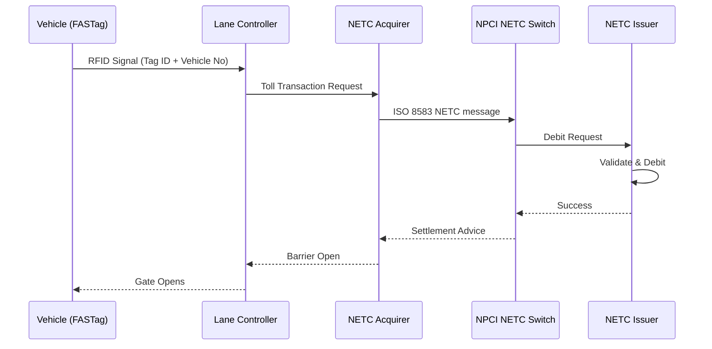
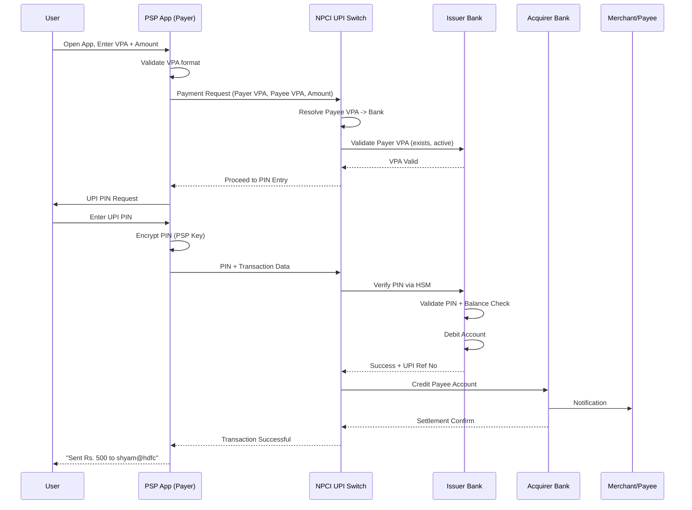
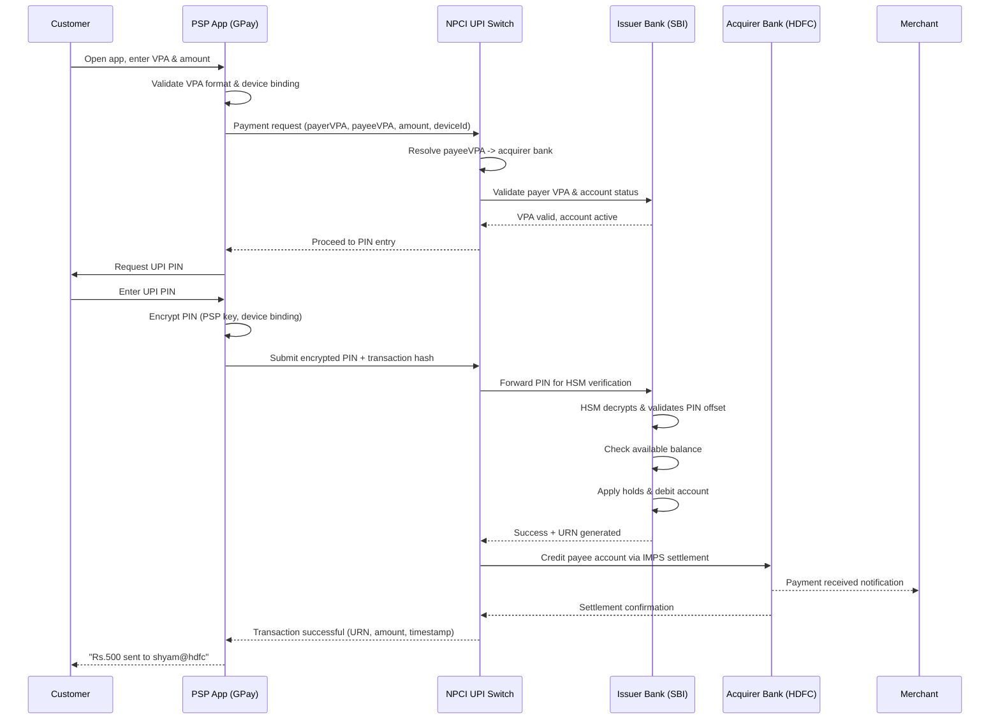
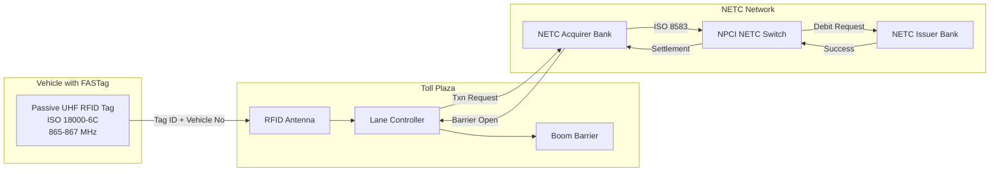

# Chapter 02: Digital Payment Systems

## Learning Objectives

By the end of this chapter, you will be able to:

<!-- Image Gallery -->
<section class="lesson-visuals" aria-label="Visual learning resources">
  <header><span>VISUAL LEARNING</span><h2>See it. Review it. Remember it.</h2></header>
  <a class="lesson-visual-card" href="../../../assets/images/lessons/banking-technology/02-digital-payment-systems/.png" target="_blank" rel="noopener">
    
    <span><strong>Handwritten notes</strong>Condensed notes for deliberate review.</span>
  </a>
  <a class="lesson-visual-card" href="../../../assets/images/lessons/banking-technology/02-digital-payment-systems/.png" target="_blank" rel="noopener">
    
    <span><strong>Sticky-note revision</strong>Fast recall prompts for revision.</span>
  </a>
  <a class="lesson-visual-card" href="../../../assets/images/lessons/banking-technology/02-digital-payment-systems/.png" target="_blank" rel="noopener">
    
    <span><strong>Visual concept guide</strong>A connected explanation of the key ideas.</span>
  </a>
</section>
<!-- End Image Gallery -->

- Explain UPI architecture including NPCI role, PSPs, issuer/acquirer banks, and the UPI reference number flow
- Compare IMPS, NEFT, and RTGS on settlement type, timing, and transaction limits
- Describe RuPay card processing and how it differs from Visa/Mastercard
- Understand FASTag RFID-based toll collection and the NETC system
- Analyze Aadhaar Payments Bridge System (APBS) and its architecture
- Explain BBPS, AePS, NACH, and tokenization mechanisms
- Describe recurring payments via eMandate, UPI Lite, and UPI123Pay

## Theory

### 1. Introduction to Digital Payment Systems

India's digital payment ecosystem has undergone a paradigm shift since 2016, driven by the Unified Payments Interface (UPI), regulatory support from RBI, and the infrastructure built by NPCI. Digital payments in India are categorized into:

- **Retail Payment Systems:** UPI, IMPS, NEFT, RTGS, BBPS
- **Card Payments:** RuPay, Visa, Mastercard (Contact, Contactless, Tokenized)
- **Aadhaar-based Payments:** AePS, APBS
- **Alternative Channels:** FASTag (NETC), UPI Lite, UPI123Pay

The key driver of this ecosystem is the **National Payments Corporation of India (NPCI)** — an umbrella organization for operating retail payment and settlement systems in India, established by RBI and IBA in 2008.

### 2. UPI Architecture

#### 2.1 UPI Overview

Unified Payments Interface (UPI) is an instant real-time payment system developed by NPCI. It facilitates inter-bank transactions through mobile phones using a Virtual Payment Address (VPA). UPI operates 24x7x365 and processes over 10 billion transactions per month (as of 2025).

**Key Concepts:**

- **VPA (Virtual Payment Address):** Format — `username@bankhandle` (e.g., `ram@sbi`)
- **UPI ID:** Unique identifier for a user's bank account
- **UPI PIN:** 4-6 digit personal identification number set by the user
- **UPI Reference Number:** 12-digit unique transaction identifier

#### 2.2 UPI Architecture — Four-Party Model

```
+------------------+     +------------------+
|   Payer (User A) |     | Payee (User B)   |
|   VPA: ram@sbi   |     | VPA: shyam@hdfc  |
+--------+---------+     +--------+---------+
         |                        |
         | 1. Initiate Payment    | 5. Credit
         | VPA: shyam@hdfc        | Notification
         | Amount: Rs. 500        |
+--------v---------+     +--------v---------+
| Payer's PSP      |     | Payee's PSP      |
| (PhonePe/GPay)   |     | (PhonePe/GPay)   |
| Acquiring side   |     | Issuing side     |
+--------+---------+     +--------+---------+
         | 2. UPI Request        |
         +-----------+-----------+
                     |
            +--------v---------+
            |   NPCI UPI       |
            |   Switch         |
            | (Central System) |
            +--------+---------+
                     |
            +--------v---------+
            |   Payee PSP      |
            | Routes to        |
            | Payee Bank       |
            +--------+---------+
```

**Detailed Transaction Flow (12 steps):**

```
Step 1:  Payer opens PSP app (Google Pay/PhonePe/PayTM)
Step 2:  Payer enters: VPA (shyam@hdfc), Amount (Rs. 500)
Step 3:  PSP (Acquirer) formats UPI request:
         {
           "txnId": "UPI20250706123456",
           "payerVpa": "ram@sbi",
           "payeeVpa": "shyam@hdfc",
           "amount": "500.00",
           "payerAddr": "+919876543210@upi"
         }
Step 4:  PSP sends to NPCI UPI Switch
Step 5:  NPCI validates VPA format, checks blacklist/whitelist
Step 6:  NPCI routes to Payee PSP (based on @hdfc handle)
Step 7:  Payee PSP validates payee VPA exists at HDFC
Step 8:  NPCI sends OTP/PIN request back to Payer PSP
Step 9:  Payer enters UPI PIN
Step 10: PIN encrypted and sent via PSP -> NPCI -> Issuer Bank
Step 11: Issuer Bank (SBI) validates PIN via HSM, debits Rs. 500
Step 12: Credited to payee (HDFC) — UPI Ref No generated
```

#### 2.3 UPI Reference Number (12-digit URN)

The UPI Reference Number (also called UPI Transaction ID or URN) is a 12-digit identifier generated by NPCI for every successful UPI transaction.

**URN Format Breakdown:**
```
XXXXXXXXXXXX (12 digits)
├── First 4 digits: NPCI Institution ID (numeric)
├── Next 4 digits: Date (MMDD format)
└── Last 4 digits: Sequence number (auto-increment)
```

**Example:** `12340706000001`
- `1234` — NPCI Institution ID
- `0706` — July 06
- `000001` — Sequence number (first transaction of the day)

#### 2.4 UPI PIN and Authentication

UPI PIN is a 4-6 digit secret known only to the user. It is set during UPI registration (first-time setup via debit card OTP).

**UPI PIN Authentication Flow:**

```
User enters UPI PIN -> PSP App -> Encrypted with PSP Key
-> NPCI UPI Switch -> Decrypted at Issuer Bank HSM
-> HSM validates PIN against stored PIN offset
-> Response: Success/Failure -> NPCI -> PSP -> User
```

**Security Layers:**
- PIN is NEVER stored in cleartext
- PIN offset stored at issuer bank (salted hash of PIN)
- Transport encryption: TLS 1.2+ between all parties
- Device binding: App is tied to device ID + SIM card
- Transaction signing: Each UPI transaction is digitally signed

#### 2.5 UPI Ecosystem Participants

| Participant | Role | Example |
|-------------|------|---------|
| NPCI | Central switch, clearing, settlement | NPCI |
| Payer PSP | Initiates transaction on payer side | Google Pay, PhonePe |
| Payee PSP | Receives transaction on payee side | PhonePe, PayTM |
| Issuer Bank | Holds payer's account, validates PIN | SBI, HDFC, ICICI |
| Acquirer Bank | Holds payee's account | HDFC for merchant |
| UPI App | Customer-facing application | BHIM, GPay, PhonePe |
| TPAP (Third Party App Provider) | Non-bank PSP (operates under a bank) | Google Pay (under Axis) |
| PPI (Prepaid Payment Instrument) | Wallet issuer | PayTM Wallet |

### 3. IMPS vs NEFT vs RTGS — Technical Comparison

#### 3.1 IMPS (Immediate Payment Service)

IMPS is an instant interbank electronic fund transfer service available 24x7x365. Operated by NPCI. It is the underlying real-time settlement system that also powers UPI.

**Technical Architecture:**

```
Sender -> Sender Bank CBS -> IMPS Switch (NPCI) -> Receiver Bank CBS -> Receiver
```

**Message Formats:**
- ISO 8583 variant for ATM/POS mode
- XML for mobile/internet banking mode
- SFMS for interbank messaging

**Key Features:**
- Settlement: Real-time (immediate)
- Minimum: Re. 1
- Maximum: Rs. 5 lakh (per transaction, increased by RBI in phases)
- Channels: Mobile, Internet Banking, ATM, SMS, USSD (*99#)
- Availability: 24x7x365

**IMPS Modes:**
| Mode | Identifier | Use Case |
|------|-----------|----------|
| P2A (Account + IFSC) | Account No + IFSC | Traditional bank transfer |
| P2M (Mobile + MMID) | Mobile No + MMID | Mobile-first transfers |
| P2P (VPA) | VPA (UPI) | UPI-based transfers (UPI uses IMPS for settlement) |
| Card-based | Card Number | Card-to-account transfers |

#### 3.2 NEFT (National Electronic Funds Transfer)

| Parameter | Value |
|-----------|-------|
| Operator | RBI (via INFINET) |
| Settlement | Deferred Net Settlement (DNS) |
| Batch Interval | Every 30 minutes |
| Minimum | No minimum |
| Maximum | Bank-specific (typically Rs. 5-10 lakh) |
| Availability | 24x7x365 (from Dec 2019) |
| Message | SFMS (ISO 8583 variant) |

#### 3.3 RTGS (Real Time Gross Settlement)

| Parameter | Value |
|-----------|-------|
| Operator | RBI |
| Settlement | Real-time (continuous, individual) |
| Minimum | Rs. 2,00,000 |
| Maximum | No upper limit |
| Availability | 7:00 AM - 6:00 PM (Weekdays, except 2nd/4th Sat) |
| Message | SFMS MT103 |

#### 3.4 Comparison Table

```
+------------------+------------------+------------------+------------------+
|    Feature       |      IMPS        |      NEFT        |      RTGS        |
+------------------+------------------+------------------+------------------+
| Operator         | NPCI             | RBI              | RBI              |
| Settlement       | Real-time        | Deferred Net     | Real-time Gross  |
| Timing           | 24x7x365         | 24x7x365         | 7AM-6PM Mon-Sat  |
| Settlement Speed | Seconds          | Up to 30 min     | Immediate        |
| Min Amount       | Re. 1            | No min           | Rs. 2,00,000     |
| Max Amount       | Rs. 5,00,000     | Bank specific    | No limit         |
| Message Standard | ISO 8583/SFMS    | SFMS             | SFMS (MT103)     |
| Network          | IMPS Switch      | INFINET          | INFINET          |
| Channel          | Mobile/Net/ATM   | Net/Mobile       | Net/Branch       |
| Finality         | Immediate        | Batch end        | Real-time        |
+------------------+------------------+------------------+------------------+
```

### 4. RuPay Card Processing

#### 4.1 RuPay Overview

RuPay is an Indian domestic card payment network launched by NPCI in 2012. It is the most widely used card in India, especially under the Pradhan Mantri Jan Dhan Yojana (PMJDY) and RuPay-Jana Dhan-Aadhaar (JAM) trinity.

**RuPay vs Visa/Mastercard:**

| Feature | RuPay | Visa/Mastercard |
|---------|-------|-----------------|
| Processing | NPCI (domestic) | VisaNet/Mastercard (global) |
| Switch Fees | Lower (domestic routing) | Higher (USD-based) |
| Authorization | NPCI UPI/CBS | Visa/Mastercard global auth |
| Tokenization | RuPay Tokenization | VTS/MDST (Visa/Mastercard) |
| Contactless | RuPay Contactless (NFC) | PayWave/PayPass |
| 3DS | 3D Secure (Rupay Secure) | 3D Secure (Verified by Visa/MC) |
| Acceptance | Mostly India (growing intl) | Global (200+ countries) |
| Security | EMV Chip + PIN mandatory | EMV Chip + PIN |

#### 4.2 RuPay Transaction Flow (POS)

```
1. Customer taps/inserts RuPay card at POS terminal
2. POS reads card data (Track 2 / EMV Data)
3. POS sends ISO 8583 0200 message to Acquirer Bank
4. Acquirer Bank routes to NPCI (RuPay Switch)
5. NPCI validates:
   ├── Card BIN check (RuPay BIN: 60, 65, 81, 82...)
   ├── Card status (active/blocked/hotlisted)
   └── Merchant category check
6. NPCI routes to Issuer Bank
7. Issuer Bank:
   ├── Validates CVV/PIN
   ├── Checks available balance/credit limit
   ├── Generates ARQC (EMV) or online auth
   └── Sends approval/decline
8. Response flows back through NPCI -> Acquirer -> POS
```

**RuPay BIN Range:**
- 60xxxx — RuPay Classic
- 65xxxx — RuPay Platinum
- 81xxxx — RuPay Select
- 82xxxx — RuPay World
- 508xxx — RuPay JCB (International co-badge)

#### 4.3 RuPay Economics for Banks

For Indian banks, RuPay is significantly cheaper than Visa/Mastercard:
- **Issuance fee:** RuPay: Rs. 20-30; Visa/MC: Rs. 100-150 per card
- **Switch fee:** RuPay: ~Rs. 0.50-1 per transaction; Visa/MC: ~Rs. 5-15 (varies with forex)
- **Annual membership:** RuPay: Lower fixed fee; Visa/MC: Higher (USD-denominated)
- **Settlement:** RuPay settles in INR (no forex risk); Visa/MC settles in USD

### 5. FASTag and NETC

#### 5.1 FASTag Overview

FASTag is a RFID-based toll collection system operated by NPCI under the National Electronic Toll Collection (NETC) program. It uses passive RFID tags affixed to vehicle windshields.

**Technical Specifications:**

```
FASTag RFID Tag:
├── Frequency: 865-867 MHz (UHF RFID, as per TRAI)
├── Standard: ISO 18000-6C (EPC Gen2)
├── Read Range: 4-6 meters (booth), 50m+ (free-flow)
├── Memory: 96-512 bits EPC memory
├── Battery: Passive (no battery, powered by reader RF signal)
├── Data Storage: Vehicle Registration No + Tag ID + Wallet Link
└── Tamper: Tamper-evident adhesive (removal destroys tag)
```

**NETC Transaction Flow:**

```
1. Vehicle approaches toll plaza
2. RFID Antenna at lane (boom barrier) emits RF signal
3. FASTag responds with Tag ID + Vehicle Registration No
4. Lane Controller reads tag data
5. Transaction sent to NETC Acquiring Bank (acquirer)
   ├── Vehicle class determination (based on tag type)
   └── Toll amount calculation (based on plaza + vehicle class)
6. Acquirer sends to NPCI NETC Switch
7. NPCI routes to Issuer Bank (where tag is linked)
8. Issuer Bank:
   ├── Validates tag status (active/blacklisted)
   ├── Checks wallet balance / credit limit
   └── Debits toll amount
9. Settlement: NPCI -> Issuer -> Acquirer
10. Lane Controller gets "Success" -> Boom barrier opens
11. SMS/email notification to customer
```

**NETC Clearing Flow:**



#### 5.2 Wallet-Based vs Credit-Based FASTag

| Type | Description | Example |
|------|-------------|---------|
| Wallet FASTag | Prepaid wallet linked to tag | Most common |
| Credit FASTag | Postpaid credit line linked to tag | ICICI, HDFC credit card-linked |
| Savings FASTag | Direct debit from savings account | SBI, some PSBs |

### 6. Aadhaar Payments Bridge System (APBS)

#### 6.1 APBS Architecture

APBS enables the transfer of government subsidies/benefits directly to beneficiaries' bank accounts using Aadhaar as the financial address. Implemented by NPCI under the DBT (Direct Benefit Transfer) program.

```
Central Government (PFMS)
        |
        v
Sponsor Bank (e.g., SBI for PAHAL)
        |
        v
NPCI APBS Gateway
        |
        +---------+---------+
        |                   |
    Canara Bank         PNB
    (Mapper Bank)       (Mapper Bank)
        |                   |
    Aadhaar to A/C     Aadhaar to A/C
    Mapping DB         Mapping DB
```

**Technical Workflow:**

```
Step 1:  Government department sends subsidy file to PFMS
Step 2:  PFMS forwards beneficiary list with Aadhaar to Sponsor Bank
Step 3:  Sponsor Bank sends Aadhaar + Amount to NPCI APBS
Step 4:  NPCI routes to Mapper Bank (where Aadhaar is mapped)
Step 5:  Mapper Bank looks up Aadhaar-to-Account mapping
Step 6:  Validates: Aadhaar is linked, account is active, KYC complete
Step 7:  Transaction sent to Destination Bank CBS
Step 8:  Beneficiary account credited
Step 9:  Response back to NPCI -> Sponsor Bank -> PFMS -> Government
```

**APBS Key Terms:**
- **PFMS:** Public Financial Management System (government's payment platform)
- **Sponsor Bank:** Bank that manages the scheme's funds
- **Mapper Bank:** Bank where beneficiary's Aadhaar is mapped to account
- **Destination Bank:** Bank where beneficiary holds the account

### 7. BBPS (Bharat Bill Payment System)

#### 7.1 BBPS Architecture

BBPS is an integrated bill payment system offering interoperable bill payment services to customers across India. Operated by NPCI.

```
+----------+     +----------+     +----------+
| Customer A|    | Customer B|    | Customer C|
+-----+----+     +-----+----+     +-----+----+
      |                |                |
+-----v----------------v----------------v------+
|          Bill Payment Aggregators            |
|          (PayTM, PhonePe, Google Pay)         |
+------------------+---------------------------+
                   |
+------------------v---------------------------+
|          BBPS Central Unit (NPCI)            |
|          - Transaction Switch                |
|          - Settlement Management             |
|          - Dispute Resolution                |
+----+-------------------+------------------+--+
     |                   |                  |
+----v-------+    +------v-------+   +------v-------+
| Biller Unit |    | Biller Unit  |   |  Biller Unit |
| (Electric)  |    | (Gas)        |   | (Telecom)    |
+-------------+    +--------------+   +--------------+
```

**Three-Tier Model:**
1. **Customer:** Pays bills through any registered channel (web, mobile, agent)
2. **BPU (Bharat Payment Unit):** Operating unit (banks, aggregators, agents) — can be Online Payment Unit (OPU) or offline agent
3. **BBPS Central Unit:** NPCI — clearing, settlement, rules, standards

**Transaction Flow:**
```
Bill Fetch: Customer -> BPU -> BBPS Central -> Biller -> Bill Details -> Back to Customer
Bill Pay: Customer -> BPU -> BBPS Central -> RBI Settlement -> Biller -> Confirmation
```

#### 7.2 BBPS Categories

| Category | Examples |
|----------|----------|
| Electricity | All state electricity boards |
| Telecom | Airtel, Jio, BSNL, VI |
| Gas | Indane, HP Gas, Bharat Gas |
| Water | Municipal corporations |
| DTH | Tata Sky, Dish TV, Airtel DTH |
| Loan Repayment | Banks, NBFCs |
| Education | School/college fees |
| Insurance | Premium payments |
| Credit Card | Bill payment |

### 8. AePS (Aadhaar-enabled Payment System)

#### 8.1 AePS Architecture

AePS allows Aadhaar-based financial transactions using a micro-ATM device. Operated by NPCI.

**Transaction Types:**
- Cash Withdrawal
- Balance Enquiry
- Mini Statement
- Aadhaar to Aadhaar Fund Transfer
- Cash Deposit (added later)

**Technical Flow (Cash Withdrawal):**

```
1. Customer provides: Aadhaar Number + Transaction Type + Amount
2. Micro-ATM captures Aadhaar via biometric scanner
3. UIDAI authentication (fingerprint/iris match)
4. Upon successful authentication:
   ├── Aadhaar Number + Bank IIN + Amount sent to NPCI AePS Switch
   ├── NPCI routes to Issuer Bank (based on Aadhaar mapping)
   ├── Issuer Bank validates account balance
   ├── CBS debits account
   └── Response sent back to micro-ATM via NPCI
5. Micro-ATM dispenses cash
```

**IIN (Issuer Identification Number):** First 6 digits of Aadhaar number indicate the enrolling agency/registrar. Used by AePS to route to the correct bank.

### 9. NACH (National Automated Clearing House)

NACH is a web-based solution to facilitate bulk transactions (salaries, dividends, subsidies). Replaced the legacy ECS (Electronic Clearing Service).

**NACH Types:**

| Type | Direction | Use Case |
|------|-----------|----------|
| NACH Credit | Sponsor -> Destination | Salary, Dividend, Subsidy |
| NACH Debit | Sponsor <- Destination | Loan EMI, SIP, Insurance Premium |

**NACH Technical Flow (Debit):**

```
1. Mandate registered: Customer -> Destination Bank -> NPCI
2. Sponsor (e.g., Mutual Fund) submits debit file to Sponsor Bank
3. Sponsor Bank -> NPCI NACH System
4. NPCI processes in batches (2-3 cycles per day)
5. NPCI routes to Destination Bank CBS
6. Destination Bank debits customer account
7. Settlement: NPCI -> Destination Bank -> Sponsor Bank -> Sponsor
```

**NACH Mandate Lifecycle:**
```
Registration -> Verification (by sponsor) -> Activation -> 
Active Mandate -> Debit Transactions -> 
Modification/Cancellation (if needed) -> Deactivation
```

### 10. Tokenization

Tokenization replaces sensitive card data (Primary Account Number / PAN) with a unique token that can be used for transactions without exposing the actual card number.

#### 10.1 Card-on-File Tokenization (CoFT)

As per RBI's mandate (effective Jan 2022, extended to Mar 2022), no entity other than card issuers can store actual card numbers. Tokenization is mandatory.

**CoFT Flow:**

```
1. Customer enters card details on merchant website
2. Merchant sends PAN to Card Network (token request)
3. Card Network generates TOKEN (16-digit, BIN-preserving)
4. Token stored at merchant (not PAN)
5. Merchant deletes PAN (as per RBI mandate)
6. All future transactions use TOKEN instead of PAN
```

**Token Format:**
```
XXXXXXYYYYYYYYZZ
├── XXXXXX: Same BIN as original card (merchant can identify card type)
├── YYYYYYYY: Tokenized account identifier
└── ZZ: Check digits
```

#### 10.2 Device-Based Tokenization

Used in mobile wallets (Apple Pay, Google Pay, Samsung Pay) where the token is stored in the device's secure element (SE).

- **Token Requestor:** The wallet provider (e.g., Google Pay)
- **Token Service Provider (TSP):** Card network (Visa/Mastercard/RuPay)
- **Domain Restriction:** Token works only on that device + wallet combination
- **Cryptogram:** Dynamic CVV generated per transaction

### 11. Recurring Payments — eMandate

#### 11.1 UPI eMandate

eMandate enables recurring payments (subscriptions, SIPs, insurance premiums) through UPI.

**Technical Flow:**

```
1. Merchant initiates eMandate creation
2. Customer approves via PSP app
3. Mandate details:
   ├── Merchant ID
   ├── Amount (fixed/variable)
   ├── Frequency (daily/weekly/monthly)
   ├── Start date, End date
   └── Maximum number of debits
4. Customer authenticates with UPI PIN
5. Mandate registered at NPCI -> Issuer Bank
6. On recurring date:
   ├── Merchant initiates debit
   ├── NPCI checks mandate validity
   ├── Issuer bank debits without additional PIN
   └── (If exceed limit: customer must approve)
```

**eMandate Limits (RBI):**
| Type | Limit | Authentication |
|------|-------|---------------|
| Small value | Up to Rs. 15,000 per transaction | No additional factor |
| Medium value | Rs. 15,001 - Rs. 1,00,000 | AFA once per mandate + Additional factor on first debit |
| High value | Above Rs. 1,00,000 | AFA on each transaction |

### 12. UPI Lite and UPI123Pay

#### 12.1 UPI Lite

UPI Lite is an on-device wallet for small-value payments (up to Rs. 500 per transaction, Rs. 2,000 total balance). No UPI PIN required for transactions — works on balance stored in mobile app.

**Technical Architecture:**

```
UPI Lite Wallet (in PSP app):
├── Max Balance: Rs. 2,000
├── Per Transaction Limit: Rs. 500
├── Cumulative Daily Limit: Rs. 2,000 (or wallet balance)
├── Authentication: App-level (device unlock / app PIN)
├── No UPI PIN required for payments
├── Settlement: Offline-capable (later sync) -- TBD by NPCI
└── Top-up: From linked bank account via UPI
```

**UPI Lite Flow:**
```
1. Customer loads UPI Lite wallet (from main account via UPI)
2. Payment: Select UPI Lite as source
3. On-device balance check (no network call to bank)
4. Balance deducted from in-app wallet
5. Transaction recorded locally
6. Periodically synced with NPCI (batch)
7. Settlement done at NPCI end
```

#### 12.2 UPI123Pay

UPI123Pay is a feature-phone-based UPI system for users without smartphones. It operates through IVR, app in USSD, proximity voice-based payments, and missed call-based payments.

**Technical Approach:**
```
UPI123Pay Methods:
├── IVR (Interactive Voice Response): Call 08045146000
│   ├── OTP-based authentication
│   └── Follow voice prompts
├── USSD (*99#): Traditional GSM-based
│   ├── No internet required
│   └── Menu-driven on feature phone
├── Proximity Voice: NFC/QR code based
├── Missed Call: Call merchant's number
│   └── Callback with payment link
└── NFC Tags: Tap phone on NFC tag
```

### 13. Architecture Diagrams

#### Complete UPI Transaction Flow



## Examples (Exam-Style MCQs)

**Example 1:**
What is the per-transaction limit for UPI Lite?

A) Rs. 10,000
B) Rs. 5,000
C) Rs. 500
D) Rs. 1,000

<details>
<summary>Answer</summary>
**Answer: C) Rs. 500**

UPI Lite has a per-transaction limit of Rs. 500, with a maximum wallet balance of Rs. 2,000. No UPI PIN is needed for payments, making it ideal for small-value transactions.
</details>

**Example 2:**
Which organization operates the NETC (National Electronic Toll Collection) system?

A) RBI
B) IRDAI
C) NHAI
D) NPCI

<details>
<summary>Answer</summary>
**Answer: D) NPCI**

NPCI operates the NETC program under which FASTag is implemented. NHAI manages the highways but NPCI operates the payment system.
</details>

**Example 3:**
In UPI four-party model, what is the role of the PSP?

A) Settlement of transactions
B) Customer-facing payment application operator
C) Aadhaar authentication provider
D) Merchant onboarding

<details>
<summary>Answer</summary>
**Answer: B) Customer-facing payment application operator**

PSP (Payment Service Provider) operates the customer-facing app (Google Pay, PhonePe, PayTM). PSPs can be banks or non-banks (TPAPs).
</details>

**Example 4:**
How does AePS authenticate a customer's identity?

A) OTP on registered mobile
B) UPI PIN
C) Biometric authentication via Aadhaar (fingerprint/iris)
D) Debit card PIN

<details>
<summary>Answer</summary>
**Answer: C) Biometric authentication via Aadhaar**

AePS uses biometric authentication (fingerprint or iris) through UIDAI's authentication system. The micro-ATM device captures the biometric and sends it to UIDAI for verification.
</details>

**Example 5:**
What is RuPay card's primary advantage for Indian banks compared to Visa/Mastercard?

A) International acceptance
B) Lower transaction processing fees (denominated in INR)
C) Higher credit limits
D) Faster transaction processing

<details>
<summary>Answer</summary>
**Answer: B) Lower transaction processing fees**

RuPay has significantly lower processing fees because it settles in INR domestically, avoiding USD-based interchange fees charged by Visa/Mastercard.
</details>

### 14. TypeScript Code Examples

#### 14.1 UPI Payment Flow Simulator

```typescript
interface VPADetails {
  username: string;
  bankHandle: string;
  fullVPA: string;
}

interface UPITransactionRequest {
  txnId: string;
  payerVpa: string;
  payeeVpa: string;
  amount: number;
  payerAddr: string;
  txnNote: string;
  merchantId?: string;
}

interface UPITransactionResponse {
  txnId: string;
  urn: string;
  responseCode: string;
  message: string;
  timestamp: Date;
}

interface UPIPinValidation {
  encryptedPin: string;
  keyIdentifier: string;
  txnId: string;
}

class UPIProcessor {
  private validVPAs: Map&lt;string, { bank: string; active: boolean }&gt; = new Map();
  private processedTxns: Map&lt;string, UPITransactionResponse&gt; = new Map();
  private txnCounter: number = 0;

  constructor() {
    this.seedVPAs();
  }

  private seedVPAs(): void {
    this.validVPAs.set('ram@sbi', { bank: 'SBI', active: true });
    this.validVPAs.set('shyam@hdfc', { bank: 'HDFC', active: true });
    this.validVPAs.set('priya@icici', { bank: 'ICICI', active: true });
    this.validVPAs.set('amit@paytm', { bank: 'Paytm Payments Bank', active: true });
  }

  validateVPA(vpa: string): boolean {
    return /^[a-zA-Z0-9._-]+@[a-zA-Z0-9]+$/.test(vpa);
  }

  resolveVPA(vpa: string): { bank: string; active: boolean } | null {
    const result = this.validVPAs.get(vpa.toLowerCase());
    return result || null;
  }

  generateURN(): string {
    this.txnCounter++;
    const date = new Date();
    const mmdd = `${String(date.getMonth() + 1).padStart(2, '0')}${String(date.getDate()).padStart(2, '0')}`;
    const instId = '1234';
    return `${instId}${mmdd}${String(this.txnCounter).padStart(6, '0')}`;
  }

  initiatePayment(req: UPITransactionRequest): UPITransactionResponse {
    if (!this.validateVPA(req.payerVpa)) {
      return { txnId: req.txnId, urn: '', responseCode: 'U19', message: 'Invalid payer VPA format', timestamp: new Date() };
    }
    if (!this.validateVPA(req.payeeVpa)) {
      return { txnId: req.txnId, urn: '', responseCode: 'U20', message: 'Invalid payee VPA format', timestamp: new Date() };
    }

    const payer = this.resolveVPA(req.payerVpa);
    const payee = this.resolveVPA(req.payeeVpa);

    if (!payer) { return { txnId: req.txnId, urn: '', responseCode: 'U21', message: 'Payer VPA not found', timestamp: new Date() }; }
    if (!payer.active) { return { txnId: req.txnId, urn: '', responseCode: 'U22', message: 'Payer account inactive', timestamp: new Date() }; }
    if (!payee) { return { txnId: req.txnId, urn: '', responseCode: 'U23', message: 'Payee VPA not found', timestamp: new Date() }; }

    const urn = this.generateURN();
    const response: UPITransactionResponse = {
      txnId: req.txnId,
      urn,
      responseCode: '00',
      message: `Successfully sent Rs.${req.amount} to ${req.payeeVpa}`,
      timestamp: new Date(),
    };
    this.processedTxns.set(urn, response);
    return response;
  }

  getTransaction(urn: string): UPITransactionResponse | undefined {
    return this.processedTxns.get(urn);
  }

  processRefund(urn: string): UPITransactionResponse {
    const txn = this.processedTxns.get(urn);
    if (!txn) { throw new Error('Transaction not found'); }
    const refundTxnId = `REF${Date.now()}`;
    const refundURN = this.generateURN();
    const response: UPITransactionResponse = {
      txnId: refundTxnId,
      urn: refundURN,
      responseCode: '00',
      message: `Refund processed for original URN ${urn}`,
      timestamp: new Date(),
    };
    this.processedTxns.set(refundURN, response);
    return response;
  }
}

// Usage
const upi = new UPIProcessor();
const request: UPITransactionRequest = {
  txnId: `UPI${Date.now()}`,
  payerVpa: 'ram@sbi',
  payeeVpa: 'shyam@hdfc',
  amount: 500,
  payerAddr: '+919876543210@upi',
  txnNote: 'Lunch payment',
};
const result = upi.initiatePayment(request);
console.log('UPI Payment Result:', JSON.stringify(result, null, 2));
```

#### 14.2 UPI PIN Verification Module

```typescript
interface PINRecord {
  pinOffset: string;
  salt: string;
  algorithm: 'PBKDF2-HMAC-SHA256' | 'ARGON2';
  iterations: number;
  lastVerified: Date;
  failedAttempts: number;
  locked: boolean;
}

class UPIPinManager {
  private pinStore: Map&lt;string, PINRecord&gt; = new Map();
  private maxFailedAttempts: number = 3;
  private lockDurationMs: number = 30 * 60 * 1000;

  constructor() {
    this.seedPins();
  }

  private seedPins(): void {
    this.pinStore.set('ram@sbi', {
      pinOffset: 'a1b2c3d4e5f6a7b8c9d0e1f2a3b4c5d6e7f8a9b0',
      salt: 'randomsalt123',
      algorithm: 'PBKDF2-HMAC-SHA256',
      iterations: 10000,
      lastVerified: new Date(),
      failedAttempts: 0,
      locked: false,
    });
  }

  private hashPin(pin: string, salt: string, iterations: number): string {
    let hash = salt + pin;
    for (let i = 0; i &lt; iterations; i++) {
      let h = 0;
      for (let j = 0; j &lt; hash.length; j++) {
        h = ((h &lt;&lt; 5) - h) + hash.charCodeAt(j);
        h = h & h;
      }
      hash = Math.abs(h).toString(16);
    }
    return hash;
  }

  validatePin(vpa: string, enteredPin: string): boolean {
    const record = this.pinStore.get(vpa);
    if (!record) { throw new Error('VPA not registered for UPI PIN'); }
    if (record.locked) { throw new Error('UPI PIN is locked. Please reset via debit card.'); }

    const computedHash = this.hashPin(enteredPin, record.salt, record.iterations);
    if (computedHash === record.pinOffset) {
      record.failedAttempts = 0;
      record.lastVerified = new Date();
      return true;
    }

    record.failedAttempts++;
    if (record.failedAttempts >= this.maxFailedAttempts) {
      record.locked = true;
      console.log(`[SECURITY] UPI PIN locked for ${vpa} due to ${record.failedAttempts} failed attempts`);
    }
    return false;
  }

  setPin(vpa: string, newPin: string, oldPin?: string): boolean {
    if (newPin.length &lt; 4 || newPin.length > 6) { throw new Error('UPI PIN must be 4-6 digits'); }
    if (!/^\d{4,6}$/.test(newPin)) { throw new Error('UPI PIN must be numeric'); }

    if (oldPin && !this.validatePin(vpa, oldPin)) { throw new Error('Current PIN is incorrect'); }

    const salt = Math.random().toString(36).substring(2, 12);
    const iterations = 10000 + Math.floor(Math.random() * 5000);
    const offset = this.hashPin(newPin, salt, iterations);

    this.pinStore.set(vpa, {
      pinOffset: offset,
      salt,
      algorithm: 'PBKDF2-HMAC-SHA256',
      iterations,
      lastVerified: new Date(),
      failedAttempts: 0,
      locked: false,
    });
    return true;
  }

  isLocked(vpa: string): boolean {
    return this.pinStore.get(vpa)?.locked || false;
  }

  resetPinViaDebitCard(vpa: string, debitCardLast4: string): boolean {
    if (debitCardLast4.length !== 4 || !/^\d{4}$/.test(debitCardLast4)) {
      throw new Error('Invalid debit card last 4 digits');
    }
    const record = this.pinStore.get(vpa);
    if (!record) { throw new Error('VPA not found'); }
    record.locked = false;
    record.failedAttempts = 0;
    console.log(`[AUDIT] PIN reset initiated for ${vpa} using debit card ending ${debitCardLast4}`);
    return true;
  }
}

// Usage
const pinManager = new UPIPinManager();
try {
  const valid = pinManager.validatePin('ram@sbi', '1234');
  console.log('PIN valid:', valid);
} catch (err) {
  console.error('PIN Error:', (err as Error).message);
}
```

#### 14.3 RuPay Card Transaction Processor

```typescript
type CardBIN = '60' | '65' | '81' | '82' | '508' | '5085';
type CardType = 'CLASSIC' | 'PLATINUM' | 'SELECT' | 'WORLD' | 'JCB';
type TransactionMode = 'CONTACT' | 'CONTACTLESS' | 'ECOMM' | 'MOTO';

interface RuPayCard {
  pan: string;
  bin: string;
  cardType: CardType;
  expiryMonth: number;
  expiryYear: number;
  cardholderName: string;
  active: boolean;
  dailyLimit: number;
  dailySpent: number;
}

class RuPaySwitch {
  private cards: Map&lt;string, RuPayCard&gt; = new Map();
  private binMap: Map&lt;string, CardType&gt; = new Map([
    ['60', 'CLASSIC'], ['65', 'PLATINUM'], ['81', 'SELECT'],
    ['82', 'WORLD'], ['5085', 'JCB'],
  ]);

  constructor() {
    this.seedCards();
  }

  private seedCards(): void {
    this.cards.set('6220180012345678', {
      pan: '6220180012345678', bin: '622018', cardType: 'CLASSIC',
      expiryMonth: 12, expiryYear: 2028, cardholderName: 'RAM SHARMA',
      active: true, dailyLimit: 50000, dailySpent: 0,
    });
  }

  identifyCardType(pan: string): CardType | null {
    for (const [prefix, type] of this.binMap) {
      if (pan.startsWith(prefix)) { return type; }
    }
    return null;
  }

  validateCard(pan: string, cvv: string, expiryMonth: number, expiryYear: number): boolean {
    const card = this.cards.get(pan);
    if (!card) { throw new Error('Card not found'); }
    if (!card.active) { throw new Error('Card is inactive'); }
    if (cvv.length !== 3 || !/^\d{3}$/.test(cvv)) { throw new Error('Invalid CVV'); }

    const now = new Date();
    const cardExpiry = new Date(expiryYear, expiryMonth, 1);
    if (cardExpiry &lt; now) { throw new Error('Card expired'); }
    if (card.expiryMonth !== expiryMonth || card.expiryYear !== expiryYear) {
      throw new Error('Expiry mismatch');
    }
    return true;
  }

  authorizeTransaction(pan: string, amount: number, mode: TransactionMode): boolean {
    const card = this.cards.get(pan);
    if (!card) { throw new Error('Card not found'); }

    const newDaily = card.dailySpent + amount;
    if (newDaily > card.dailyLimit) {
      console.log(`[RuPay] Daily limit exceeded: ${card.dailySpent} + ${amount} > ${card.dailyLimit}`);
      return false;
    }

    card.dailySpent = newDaily;
    console.log(`[RuPay] Authorized: ${mode} Rs.${amount} on card ${pan.slice(-4)} (${card.cardType})`);
    return true;
  }

  processSettlement(pan: string, amount: number): string {
    const ref = `RPS${Date.now()}${Math.floor(Math.random() * 999)}`;
    console.log(`[RuPay Settlement] Ref: ${ref}, Card: ${pan.slice(-4)}, Amount: Rs.${amount}`);
    return ref;
  }
}

// Usage
const rupay = new RuPaySwitch();
try {
  rupay.validateCard('6220180012345678', '123', 12, 2028);
  const approved = rupay.authorizeTransaction('6220180012345678', 1500, 'CONTACTLESS');
  console.log('Transaction approved:', approved);
  if (approved) {
    const ref = rupay.processSettlement('6220180012345678', 1500);
    console.log('Settlement ref:', ref);
  }
} catch (err) {
  console.error('RuPay Error:', (err as Error).message);
}
```

#### 14.4 BBPS Bill Payment Processor

```typescript
interface BBPSBiller {
  billerCode: string;
  category: 'ELECTRICITY' | 'TELECOM' | 'GAS' | 'WATER' | 'DTH' | 'LOAN' | 'EDUCATION' | 'INSURANCE' | 'CREDIT_CARD';
  name: string;
  active: boolean;
}

interface BBPSBillFetch {
  billerCode: string;
  customerId: string;
  amount: number;
  dueDate: Date;
  billNumber: string;
}

interface BBPSPayment {
  transactionId: string;
  billerCode: string;
  customerId: string;
  amount: number;
  status: 'PENDING' | 'SUCCESS' | 'FAILED' | 'REFUNDED';
  bbpsRef: string;
  timestamp: Date;
}

class BBPSProcessor {
  private billers: Map&lt;string, BBPSBiller&gt; = new Map();
  private payments: Map&lt;string, BBPSPayment&gt; = new Map();

  constructor() {
    this.seedBillers();
  }

  private seedBillers(): void {
    const billers: BBPSBiller[] = [
      { billerCode: 'BEST001', category: 'ELECTRICITY', name: 'BEST Mumbai', active: true },
      { billerCode: 'JIO001', category: 'TELECOM', name: 'Reliance Jio', active: true },
      { billerCode: 'IGL001', category: 'GAS', name: 'Indraprastha Gas', active: true },
    ];
    billers.forEach(b => this.billers.set(b.billerCode, b));
  }

  fetchBill(billerCode: string, customerId: string): BBPSBillFetch | null {
    const biller = this.billers.get(billerCode);
    if (!biller || !biller.active) { return null; }

    const bill: BBPSBillFetch = {
      billerCode,
      customerId,
      amount: Math.floor(Math.random() * 5000) + 500,
      dueDate: new Date(Date.now() + 15 * 24 * 60 * 60 * 1000),
      billNumber: `BILL${Date.now()}`,
    };
    return bill;
  }

  payBill(billerCode: string, customerId: string, amount: number): BBPSPayment {
    const biller = this.billers.get(billerCode);
    if (!biller) { throw new Error('Unknown biller'); }
    if (!biller.active) { throw new Error('Biller not accepting payments'); }

    const payment: BBPSPayment = {
      transactionId: `BBPS${Date.now()}`,
      billerCode,
      customerId,
      amount,
      status: 'SUCCESS',
      bbpsRef: `NPCI${Date.now()}${Math.floor(Math.random() * 10000)}`,
      timestamp: new Date(),
    };
    this.payments.set(payment.transactionId, payment);
    return payment;
  }

  getPaymentStatus(txnId: string): BBPSPayment | undefined {
    return this.payments.get(txnId);
  }
}

// Usage
const bbps = new BBPSProcessor();
const bill = bbps.fetchBill('BEST001', 'CUST12345');
if (bill) {
  console.log(`Bill fetched: Rs.${bill.amount}, due ${bill.dueDate.toDateString()}`);
  const payment = bbps.payBill('BEST001', 'CUST12345', bill.amount);
  console.log('Payment:', JSON.stringify(payment, null, 2));
}
```

### 14. Architecture Diagrams — Additional

#### UPI Complete Transaction Sequence (Detailed)



#### FASTag / NETC Toll Collection System



### 15. Latest Developments (2024-2026)

#### 15.1 UPI Growth Statistics (2024-2026)

- **2024:** UPI processed 131 billion transactions worth Rs. 199.6 lakh crore (approx. $2.4 trillion). Monthly volume crossed 13 billion transactions in December 2024.
- **2025:** UPI crossed 15 billion transactions per month mark. Average daily transactions exceeded 500 million. Total value crossed Rs. 300 lakh crore for the year.
- **2026 (projected):** UPI expected to reach 20 billion monthly transactions. NPCI targets 1 billion daily transactions by end of 2026.

#### 15.2 New UPI Features (2024-2026)

- **UPI Circle (2024):** Primary account holder can delegate payment authority to up to 5 family members/friends. The primary sets daily/monthly limits. Delegated users can transact using their own device with their own UPI PIN.
- **UPI Lite X (2025):** Enhanced version of UPI Lite with Rs. 10,000 wallet balance and Rs. 1,000 per transaction limit. Supports offline payments with batch settlement.
- **UPI Credit Line (2024-2025):** Banks can offer pre-sanctioned credit lines through UPI. Customers can transact using credit limit directly from UPI app — no separate credit card needed. RuPay credit cards already integrated with UPI.
- **UPI for Secondary Market (2024):** SEBI permitted UPI for trading in secondary markets (beyond IPOs). Investors can use UPI for stock purchases up to Rs. 5 lakh per transaction.
- **UPI-ATM Worldwide (2025):** NPCI partnered with international ATM networks (JCB, Discover, Pulse) enabling UPI-based cash withdrawals at ATMs in Japan, US, UK, and UAE.
- **UPI for NRI (2024):** NRIs can now use UPI with international mobile numbers (non-Indian SIM). Supported countries: UAE, Singapore, Australia, Canada, UK, USA.

#### 15.3 RuPay Developments

- **2024:** RuPay cards issued crossed 100 crore (1 billion) mark. RuPay is now the most-used card network in India by transaction volume.
- **2025:** RuPay international acceptance expanded — now accepted in UAE, Singapore, Bhutan, Nepal, and 15+ other countries through bilateral agreements. RuPay partners with Discover Financial for global POS acceptance.
- **2026:** RuPay contactless (NFC) transactions grew 300% since 2024. RuPay tokenization adoption reached 95% of all e-commerce transactions.

#### 15.4 Regulatory Changes

- **2024:** RBI increased IMPS limit from Rs. 5 lakh to Rs. 10 lakh per transaction.
- **2025:** RBI mandated all payment aggregators to use mandatory tokenization (no card-on-file storage). Non-compliance penalty: Rs. 1 lakh per day.
- **2025:** UPI transaction charges introduced for high-value UPI transactions (above Rs. 2,000) made through PPIs (Prepaid Payment Instruments). Interchange fee of 1.1% applies.
- **2026:** RBI extended UPI 24x7x365 uptime SLA to 99.99% — NPCI must maintain sub-100ms response time for 99.5% of transactions.
- **2026:** New RBI guidelines for UPI Credit Line — minimum 18% p.a. interest disclosure, credit limit must be clearly shown separately from deposit balance.

## 📝 Solved Examples (20 MCQs)

**1.** What does VPA stand for in the UPI ecosystem?

A) Virtual Payment Address
B) Verified Payment Account
C) Virtual Processing Agent
D) Verified Personal Account

<details>
<summary>Answer</summary>
**Answer: A) Virtual Payment Address**

VPA (Virtual Payment Address) is the unique identifier in UPI format `username@bankhandle`. It serves as the financial address for sending and receiving payments without revealing bank account details.
</details>

**2.** What is the maximum wallet balance allowed for UPI Lite?

A) Rs. 1,000
B) Rs. 2,000
C) Rs. 5,000
D) Rs. 10,000

<details>
<summary>Answer</summary>
**Answer: B) Rs. 2,000**

UPI Lite allows a maximum wallet balance of Rs. 2,000 with per-transaction limit of Rs. 500. No UPI PIN is required for payments from the UPI Lite wallet.
</details>

**3.** Which organization operates the IMPS payment system?

A) RBI
B) SBI
C) NPCI
D) NCPI

<details>
<summary>Answer</summary>
**Answer: C) NPCI**

NPCI (National Payments Corporation of India) operates IMPS. RBI operates NEFT and RTGS. UPI also uses IMPS as its underlying settlement layer.
</details>

**4.** In RuPay card processing, what BIN range indicates a RuPay Classic card?

A) 51xxxx
B) 60xxxx
C) 4xxxxx
D) 37xxxx

<details>
<summary>Answer</summary>
**Answer: B) 60xxxx**

RuPay Classic cards use BIN 60xxxx. Other BINs: 65xxxx (Platinum), 81xxxx (Select), 82xxxx (World), 508xxx (RuPay JCB co-badge).
</details>

**5.** What is the per-transaction limit for UPI123Pay?

A) Rs. 5,000
B) Rs. 10,000
C) Rs. 5,000 per transaction (same as regular UPI)
D) Rs. 1,000

<details>
<summary>Answer</summary>
**Answer: C) Rs. 5,000 per transaction**

UPI123Pay follows the same UPI transaction limits. Per transaction limit is Rs. 5,000 (subject to bank-specific limits). Daily cumulative limit is Rs. 1,00,000.
</details>

**6.** In the UPI four-party model, what is a TPAP?

A) Third Party Application Provider
B) Transaction Processing Authority Partner
C) Technical Payment Access Protocol
D) Total Payment Aggregation Platform

<details>
<summary>Answer</summary>
**Answer: A) Third Party Application Provider**

TPAP (Third Party Application Provider) is a non-bank PSP that operates under a sponsor bank's license. Examples: Google Pay (under Axis Bank), PhonePe (under ICICI Bank).
</details>

**7.** How many bits of EPC memory does a standard FASTag RFID tag have?

A) 64-128 bits
B) 96-512 bits
C) 512-1024 bits
D) 2-4 KB

<details>
<summary>Answer</summary>
**Answer: B) 96-512 bits**

FASTag RFID tags (ISO 18000-6C / EPC Gen2) have 96-512 bits of EPC memory. This stores the Tag ID and Vehicle Registration Number. The tag is passive (no battery).
</details>

**8.** What is the minimum transaction amount for RTGS?

A) Re. 1
B) Rs. 50,000
C) Rs. 2,00,000
D) Rs. 5,00,000

<details>
<summary>Answer</summary>
**Answer: C) Rs. 2,00,000**

RTGS has a minimum transaction amount of Rs. 2,00,000 with no upper limit. IMPS has Re. 1 minimum, NEFT has no minimum.
</details>

**9.** In AePS, what does IIN stand for and how is it determined?

A) Issuer Identification Number — first 6 digits of Aadhaar
B) Indian Identification Number — last 4 digits of Aadhaar
C) Interbank Index Number — NPCI-assigned code
D) Individual Income Number — income tax reference

<details>
<summary>Answer</summary>
**Answer: A) Issuer Identification Number — first 6 digits of Aadhaar**

IIN is the first 6 digits of the Aadhaar number, identifying the enrolling agency/bank. AePS uses IIN to route transactions to the correct issuer bank for Aadhaar-based transactions.
</details>

**10.** What type of authentication does AePS use for customer verification?

A) Debit card PIN
B) UPI PIN
C) Biometric (Aadhaar fingerprint/iris)
D) OTP on mobile

<details>
<summary>Answer</summary>
**Answer: C) Biometric (Aadhaar fingerprint/iris)**

AePS uses Aadhaar biometric authentication (fingerprint or iris) through UIDAI. The micro-ATM captures biometric data and sends it to UIDAI for verification before allowing any transaction.
</details>

**11.** In the BBPS three-tier model, what is a BPU?

A) Bill Payment Unit
B) Bank Processing Unit
C) Bharat Payment Unit
D) Bill Processing Utility

<details>
<summary>Answer</summary>
**Answer: C) Bharat Payment Unit**

BPU (Bharat Payment Unit) is the operating unit in BBPS — can be an OPU (Online Payment Unit) or an offline agent. It sits between the customer and BBPS Central (NPCI).
</details>

**12.** What is the maximum amount for a single UPI transaction (default limit)?

A) Rs. 25,000
B) Rs. 1,00,000
C) Rs. 5,00,000
D) Rs. 10,00,000

<details>
<summary>Answer</summary>
**Answer: B) Rs. 1,00,000**

The default UPI per-transaction limit is Rs. 1,00,000. For certain categories (capital markets, IPOs, tax payments), higher limits up to Rs. 5,00,000 are permitted.
</details>

**13.** Which of the following is NOT a mode of IMPS?

A) P2A (Account + IFSC)
B) P2M (Mobile + MMID)
C) P2P (VPA-based)
D) P2C (Card + CVV)

<details>
<summary>Answer</summary>
**Answer: D) P2C (Card + CVV)**

P2C is not an IMPS mode. The three IMPS modes are P2A (Account + IFSC), P2M (Mobile + MMID), and P2P (VPA/UPI). Card-based transfers use different systems like RuPay/Visa/Mastercard.
</details>

**14.** What is the RFID frequency band used by FASTag as per TRAI?

A) 125 kHz (LF)
B) 13.56 MHz (HF)
C) 865-867 MHz (UHF)
D) 2.4 GHz (Microwave)

<details>
<summary>Answer</summary>
**Answer: C) 865-867 MHz (UHF)**

FASTag uses passive UHF RFID in the 865-867 MHz band as per TRAI (Telecom Regulatory Authority of India) guidelines. Read range is 4-6 meters at toll booths.
</details>

**15.** Under the RBI tokenization mandate, which entity is NOT allowed to store actual card PAN?

A) Card network
B) Issuer bank
C) Merchant / Payment aggregator
D) Token Service Provider

<details>
<summary>Answer</summary>
**Answer: C) Merchant / Payment aggregator**

As per RBI's CoFT mandate, merchants and payment aggregators cannot store actual card PAN after tokenization. Only card networks (as TSPs) and issuer banks may store PAN. Merchants must use tokens.
</details>

**16.** In NACH, which type of mandate is used for loan EMI collections?

A) NACH Credit
B) NACH Debit
C) NACH Transfer
D) NACH Balance

<details>
<summary>Answer</summary>
**Answer: B) NACH Debit**

NACH Debit is used when the sponsor (e.g., bank/NBFC) collects money from the customer's account — used for loan EMIs, SIPs, insurance premiums. NACH Credit is for disbursements (salary, subsidy).
</details>

**17.** What is the maximum per-transaction limit for small-value eMandate without additional factor authentication?

A) Rs. 5,000
B) Rs. 10,000
C) Rs. 15,000
D) Rs. 20,000

<details>
<summary>Answer</summary>
**Answer: C) Rs. 15,000**

As per RBI, eMandate up to Rs. 15,000 per transaction requires no additional factor authentication. Rs. 15,001-1,00,000 requires AFA once per mandate. Above Rs. 1,00,000 requires AFA on each transaction.
</details>

**18.** What does MMID stand for in IMPS?

A) Mobile Money Identifier
B) Mobile Mandate ID
C) Merchant Management ID
D) Mobile MMID Identifier

<details>
<summary>Answer</summary>
**Answer: A) Mobile Money Identifier**

MMID (Mobile Money Identifier) is a 7-digit number assigned by the bank to a customer's mobile number for IMPS transactions. Combined with mobile number, it enables P2M (Person-to-Merchant) transfers.
</details>

**19.** In the UPI reference number (URN), what do the middle 4 digits represent?

A) NPCI Institution ID
B) Date (MMDD format)
C) Sequence number
D) Bank branch code

<details>
<summary>Answer</summary>
**Answer: B) Date (MMDD format)**

URN format: First 4 digits = NPCI Institution ID, Next 4 digits = Transaction date in MMDD format (e.g., 0706 for July 06), Last 4+ digits = Sequence number (auto-increment).
</details>

**20.** What is the underlying settlement system used by UPI for inter-bank transfers?

A) NEFT
B) RTGS
C) IMPS
D) SWIFT

<details>
<summary>Answer</summary>
**Answer: C) IMPS**

UPI uses IMPS as its underlying settlement layer. IMPS provides the real-time inter-bank fund transfer capability that UPI leverages. This is why UPI is also 24x7x365 and real-time.
</details>

## 📖 Exercise Bank (30 Questions)

### Section A: Short Answer (Questions 1-10)

**1.** List the four participants in the UPI four-party model and describe each role.

**2.** What is the format of a UPI Virtual Payment Address (VPA)? Write the validation regex.

**3.** Explain the difference between UPI Lite and regular UPI. When would you use each?

**4.** What are the three IMPS modes? Give an example use case for each.

**5.** Describe the RuPay card BIN ranges and the card type each represents.

**6.** What is the difference between NACH Credit and NACH Debit? Give an example of each.

**7.** Explain the concept of tokenization under RBI's CoFT mandate. What entities are involved?

**8.** What is a UPI eMandate? Describe the three-tier RBI authentication limits.

**9.** How does AePS authenticate a customer? What hardware is used?

**10.** What is the BBPS three-tier model? Name the three layers and their functions.

### Section B: Long Answer (Questions 11-20)

**11.** Draw and explain the complete UPI transaction flow from customer initiating payment to the payee receiving funds. Include all four parties and the role of URN.

**12.** Compare and contrast NEFT, RTGS, and IMPS on operator, settlement type, timing, limits, and message format.

**13.** Describe the RuPay card transaction flow for a POS purchase. Include BIN lookup, authorization, EMV ARQC, and settlement.

**14.** Explain the NETC/FASTag toll collection architecture. Include RFID specifications, transaction flow, and clearing process.

**15.** Describe the APBS architecture for government DBT transfers. Include PFMS, sponsor bank, mapper bank, and destination bank roles.

**16.** Explain the AePS cash withdrawal flow step by step. Include biometric authentication, IIN routing, and CBS debit process.

**17.** Describe the eMandate lifecycle from registration to deactivation. Include mandate creation, approval, recurring debits, and modification.

**18.** How does 3D Secure work for RuPay card e-commerce transactions? Compare with Visa/Mastercard's 3DS implementation.

**19.** Explain the device-based tokenization used in mobile wallets (Apple Pay, Google Pay). Include token requestor, TSP, and domain restriction concepts.

**20.** Compare the economics of RuPay vs Visa/Mastercard for Indian banks. Include issuance fees, switch fees, settlement currency, and annual membership costs.

### Section C: Application / Design (Questions 21-30)

**21.** Write a TypeScript function that validates a VPA and returns the component parts (username and bank handle).

**22.** Design a UPI transaction flow between two banks using TypeScript classes for PayerPSP, NPCI Switch, IssuerBank, and AcquirerBank.

**23.** Implement a RuPay card BIN lookup and card type identification in TypeScript.

**24.** Design a FASTag transaction processor that validates tag ID, calculates toll amount based on vehicle class, and processes the debit.

**25.** Create a BBPS bill fetch and payment integration in TypeScript with multiple biller categories.

**26.** Design an eMandate registration system with proper tier-based authentication limits for recurring payments.

**27.** Implement a card tokenization service (CoFT) that generates BIN-preserving tokens and stores the PAN-token mapping in a secure vault.

**28.** Design a UPI PIN management system with PIN offset storage, failed attempt tracking, and lockout mechanism.

**29.** Build an NACH mandate lifecycle manager that handles registration, activation, debit processing, and cancellation.

**30.** Design an interoperability layer between UPI and RuPay that allows a customer to use a RuPay credit card as a funding source for UPI transactions.

**Answer Key:**

<details>
<summary>Section A Answers (1-10)</summary>

**1.** (i) Payer PSP — initiates transaction on payer side (GPay); (ii) Payee PSP — receives on payee side; (iii) Issuer Bank — holds payer's account, validates PIN; (iv) Acquirer Bank — holds payee/merchant's account.

**2.** Format: `username@bankhandle` (e.g., `ram@sbi`). Regex: `^[a-zA-Z0-9._-]+@[a-zA-Z0-9]+$`

**3.** UPI Lite: on-device wallet, max Rs. 2,000 balance, Rs. 500/txn, no PIN needed — for small offline-capable payments. Regular UPI: bank account-based, UPI PIN required, Rs. 1,00,000/txn limit — for all other payments.

**4.** P2A (Account+IFSC — traditional transfer); P2M (Mobile+MMID — phone-based); P2P (VPA — UPI).

**5.** 60xxxx = Classic, 65xxxx = Platinum, 81xxxx = Select, 82xxxx = World, 508xxx = RuPay JCB.

**6.** NACH Credit = Sponsor sends money to destination (salary, subsidy). NACH Debit = Sponsor collects from destination (loan EMI, SIP).

**7.** RBI mandate (Jan 2022): Merchants cannot store PAN. Card network (Visa/MC/RuPay) generates token. Merchant stores token. Entities: Token Requestor (merchant), TSP (card network), Token Vault.

**8.** eMandate for recurring payments. Limits: up to Rs. 15,000 (no AFA); Rs. 15,001-1,00,000 (AFA once); Above Rs. 1,00,000 (AFA each transaction).

**9.** Biometric (fingerprint/iris) via micro-ATM → UIDAI authentication → transaction proceeds on successful auth.

**10.** Layer 1: Customer (bill payer); Layer 2: BPU (Bharat Payment Unit — aggregator/agent); Layer 3: BBPS Central (NPCI — clearing, settlement).
</details>

<details>
<summary>Section B Answers (11-20)</summary>

**11.** 12-step flow: (1) Payer opens PSP app; (2) Enters VPA+amount; (3) PSP formats UPI request; (4) Sends to NPCI; (5) NPCI validates; (6) Routes to payee PSP; (7) Validates payee VPA; (8) PIN request; (9) Payer enters PIN; (10) PIN encrypted via PSP→NPCI→Issuer; (11) Issuer validates PIN via HSM, debits; (12) Credited to payee, URN generated.

**12.** NEFT: DNS, RBI, 24x7, 30-min batches, no min. RTGS: Real-time gross, RBI, 7AM-6PM, immediate, Rs. 2L min. IMPS: Real-time, NPCI, 24x7, immediate, Re. 1 min, Rs. 5L max.

**13.** Card tapped/inserted → ISO 8583 0200 to acquirer → NPCI RuPay Switch → BIN lookup → Issuer bank → EMV ARQC validation → PIN/balance check → approval/decline → response via NPCI → acquirer → POS.

**14.** RFID tag (ISO 18000-6C, 865-867 MHz) → Lane controller reads Tag ID + Vehicle No → Acquirer bank → NPCI NETC Switch → Issuer bank debits → Settlement → Barrier opens.

**15.** Government → PFMS → Sponsor Bank → NPCI APBS → Mapper Bank (Aadhaar-to-Account lookup) → Destination Bank → Beneficiary credited. Response flows back.

**16.** Customer gives Aadhaar + fingerprint → Micro-ATM captures biometric → UIDAI authentication → If success: Aadhaar+IIN+amount → NPCI AePS → Issuer bank CBS → Debit → Cash dispensed.

**17.** Registration → Customer approves via PSP → Mandate stored at NPCI & Issuer → Active mandate → Recurring debits (automated, no PIN for small amounts) → Modification/cancellation on request → Deactivation on expiry/cancellation.

**18.** RuPay uses 3D Secure (RuPay Secure). Customer redirected to issuer's ACS page → OTP sent → OTP validated → Authorization. RuPay 3DS works similarly to Visa/MC 3D Secure but routes through NPCI.

**19.** Token Requestor (Google Pay) requests token from TSP (Visa/MC/RuPay) → Token stored in device Secure Element → Domain restricted (only that device+wallet combo) → Dynamic CVV generated per transaction.

**20.** RuPay: Rs. 20-30 issuance, ~Rs. 0.50-1 switch fee, INR settlement. Visa/MC: Rs. 100-150 issuance, ~Rs. 5-15 switch fee, USD settlement (forex risk for banks).
</details>

<details>
<summary>Section C Answers (21-30)</summary>

**21.** TypeScript: `function parseVPA(vpa: string): { username: string; bankHandle: string } | null { if (!/^[a-zA-Z0-9._-]+@[a-zA-Z0-9]+$/.test(vpa)) return null; const [u, b] = vpa.split('@'); return { username: u, bankHandle: b }; }`

**22.** Design classes with: PayerPSP(payerVpa, payeeVpa, amount, deviceId) → sendToNPCI(); NPCISwitch() → resolveVPA(), validate(), forwardToIssuer(); IssuerBank() → validatePIN(), checkBalance(), debit(); AcquirerBank() → creditPayee(). All connected via interfaces.

**23.** BIN ranges: '60'→Classic, '65'→Platinum, '81'→Select, '82'→World, '5085'→JCB. Check prefix with startsWith() in order of specificity (longest prefix first).

**24.** FASTagProcessor: validateTag(tagId, vehicleNo) → determineVehicleClass() → calculateToll(plazaId, class) → processDebit(walletId, amount) → return settlementRef.

**25.** BBPSProcessor: map<billerCode, biller>; fetchBill(code, custId) → return bill with amount+dueDate; payBill(code, custId, amount) → generate BBPS ref + status SUCCESS.

**26.** eMandateManager with tiers: (1) &lt;=15000: no AFA; (2) 15001-100000: AFA on mandate creation + first debit; (3) &gt;100000: AFA each debit. Store mandate with frequency, amount, start/end dates.

**27.** TokenVault: Map<token, pan>; generateToken(pan) → BIN-preserving 16-digit token using format-preserving encryption (FF1); storeToken(token, pan) in encrypted vault; detokenize(token) → return original PAN via HSM.

**28.** PINManager: setPin(vpa, pin) → store HMAC(pin, salt) as pinOffset; validatePin(vpa, pin) → compare HMAC; track failed attempts &gt;=3 → lock; reset via debit card OTP verification.

**29.** NACHMandateManager: register(customerId, amount, frequency, sponsorId) → store with status PENDING; verify(destinationBank) → ACTIVATE; processDebit(mandateId) → check active, deduct, log; cancel(mandateId) → DEACTIVATE.

**30.** UPIRuPayBridge: Link RuPay card to UPI → NPCI routes UPI credit card payments to RuPay switch → RuPay authorization (credit limit check) → UPI PIN verification → Settlement through IMPS. Merchant receives payment via normal UPI flow.
</details>

## Summary

India's digital payment ecosystem is anchored by NPCI-operated systems. UPI uses a four-party model (Payer/Customer, PSP, NPCI Switch, Issuer/Acquirer Bank) with VPA as the financial address and 12-digit URN for transaction tracking. UPI PIN is validated via issuer bank HSM using secure PIN offsets.

IMPS (NPCI, real-time, Rs. 5 lakh max) differs from NEFT (RBI, deferred net settlement, no minimum) and RTGS (RBI, real-time gross, Rs. 2 lakh minimum) in settlement type and timing. RuPay cards process through NPCI's domestic switch with lower fees than Visa/Mastercard.

FASTag uses UHF RFID (ISO 18000-6C, 865-867 MHz) for NETC toll collection. APBS enables Aadhaar-based DBT subsidy transfers. BBPS follows a three-tier model (Customer -> BPU -> BBPS Central). AePS provides Aadhaar biometric-based banking at micro-ATMs. NACH handles bulk credits/debits with mandate lifecycle management.

Tokenization (CoFT and device-based) is mandatory as per RBI, replacing PAN with BIN-preserving tokens. Recurring payments use eMandate with tiered authentication based on value slabs. UPI Lite enables offline-capable small payments (Rs. 500/txn, Rs. 2,000 balance) without UPI PIN.

## Practical Takeaways

1. **UPI Integration:** Always implement VPA validation (regex: `^[a-zA-Z0-9._-]+@[a-zA-Z0-9]+$`) at the UI level before making NPCI API calls to reduce load and improve UX.

2. **Tokenization Implementation:** As per RBI mandate, never store actual card PAN after tokenization. Implement CoFT via card network APIs (Visa TSP, Mastercard MDES, RuPay Tokenization).

3. **FASTag Testing:** When developing NETC systems, test with multiple vehicle classes and toll plazas. The RFID read range varies with tag placement on windshield and antenna alignment.

4. **AePS Security:** Since AePS uses biometrics, ensure micro-ATM devices use secure elements and encrypted communication to UIDAI. Liveness detection is critical to prevent spoofing.

5. **BBPS Integration:** Always implement bill fetch before bill pay to display up-to-date bill amount. Category codes are defined by NPCI and must match exactly.

6. **eMandate Limits:** Follow RBI's three-tier authentication structure strictly. Non-compliance can result in penalties and reversal of transactions.

7. **IMPS vs UPI:** Remember that UPI uses IMPS as its underlying settlement layer. When IMPS is down, UPI also fails. Design fallback to NEFT for critical payments.

## Chapter Quiz

**Q1:** What is the minimum amount that can be transferred via RTGS?

A) Re. 1
B) Rs. 50,000
C) Rs. 2,00,000
D) Rs. 5,00,000

<details>
<summary>Answer</summary>
**Answer: C) Rs. 2,00,000**

RTGS has a minimum transaction amount of Rs. 2 lakh. There is no upper limit. IMPS has Re. 1 minimum and Rs. 5 lakh maximum.
</details>

**Q2:** Which UPI component generates the 12-digit UPI Reference Number (URN)?

A) Payer's PSP
B) Payee's PSP
C) NPCI UPI Switch
D) Issuer Bank

<details>
<summary>Answer</summary>
**Answer: C) NPCI UPI Switch**

The 12-digit URN is generated by NPCI for every successful transaction. It includes NPCI Institution ID, transaction date (MMDD), and a sequence number.
</details>

**Q3:** What type of RFID technology does FASTag use?

A) LF RFID (125 kHz)
B) HF RFID (13.56 MHz)
C) UHF RFID (865-867 MHz)
D) Active RFID (2.4 GHz)

<details>
<summary>Answer</summary>
**Answer: C) UHF RFID (865-867 MHz)**

FASTag uses passive UHF RFID in the 865-867 MHz band as per TRAI guidelines, following the ISO 18000-6C standard. Read range is 4-6m at toll booths.
</details>

**Q4:** In the AePS system, what does IIN stand for and what is its purpose?

A) Issuer Identification Number — identifies the bank for transaction routing
B) Indian Identification Number — Aadhaar reference
C) Interbank Identifier Number — NPCI switch identifier
D) Individual Income Number — tax-related

<details>
<summary>Answer</summary>
**Answer: A) Issuer Identification Number — identifies the bank for routing**

IIN is the first 6 digits of Aadhaar number that identifies the enrolling agency/bank. AePS uses IIN to route transactions to the correct issuer bank.
</details>

**Q5:** As per RBI's card tokenization mandate, which entity is authorized to generate and store tokens?

A) Merchant
B) Payment aggregator
C) Card network (Visa/Mastercard/RuPay)
D) Acquirer bank

<details>
<summary>Answer</summary>
**Answer: C) Card network (Visa/Mastercard/RuPay)**

Only card networks (token service providers) are authorized to generate tokens. Merchants and payment aggregators must use these network-generated tokens and cannot store actual card PAN after tokenization.
</details>
