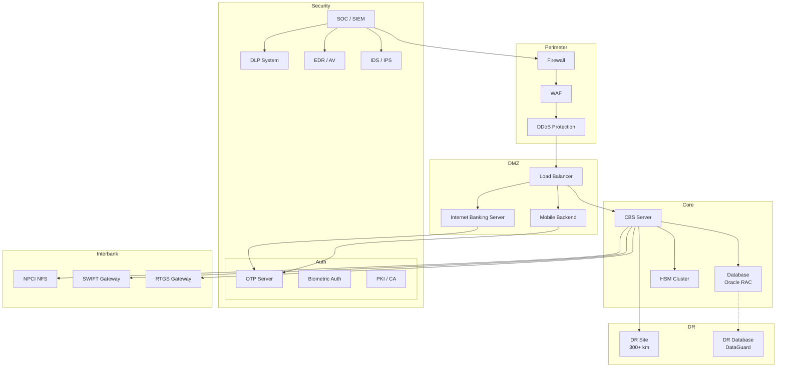

# Chapter 03: Banking Security Guidelines

## Learning Objectives

By the end of this chapter, you will be able to:

- Explain the RBI cybersecurity framework including the 2020 circular and baseline requirements
- Describe the IT Act 2000 and its amendments relevant to banking
- Understand data protection in banking (DSCI, ISO 27001)
- Analyze Basel III technology implications for banking IT
- Explain SWIFT security (CSP program) and its requirements
- Describe BCP/DR planning for banks
- Understand PCI DSS compliance for card data security
- Analyze 2FA in internet banking and OTP generation infrastructure
- Explain CMS security and e-KYC/Aadhaar authentication architecture

## Theory

### 1. Introduction to Banking Security

Banking security is governed by a multi-layered regulatory framework in India. The primary regulators and their guidelines:

- **RBI:** Cybersecurity framework, BASEL implementation, IT governance
- **SEBI:** Securities market security (for bank treasury operations)
- **IRDAI:** Insurance security (for bancassurance)
- **UIDAI:** Aadhaar authentication security
- **NPCI:** Payment system security (UPI, IMPS, RuPay)
- **DSCI (Data Security Council of India):** Data protection guidelines
- **GOI:** IT Act 2000, National Cyber Security Policy

The banking IT security architecture follows the **Defense-in-Depth** model with multiple layers:

```
+--------------------------------------------+
|  Layer 7: Application Security             |
|  (OAuth, 2FA, Session Management)          |
+--------------------------------------------+
|  Layer 6: Data Security                    |
|  (Encryption at rest/in transit, DLP)      |
+--------------------------------------------+
|  Layer 5: Access Control                   |
|  (RBAC, PIM, SSO, Directory Services)      |
+--------------------------------------------+
|  Layer 4: Network Security                 |
|  (Firewall, IDS/IPS, NAC, VPN, DDoS)       |
+--------------------------------------------+
|  Layer 3: Platform Security                |
|  (OS hardening, Patch Mgmt, AV/EDR)        |
+--------------------------------------------+
|  Layer 2: Physical Security                |
|  (Data Center access, CCTV, Biometrics)    |
+--------------------------------------------+
|  Layer 1: Governance & Compliance          |
|  (ISO 27001, BCMS, ISMS, Audit Trails)     |
+--------------------------------------------+
```

### 2. RBI Cybersecurity Framework

#### 2.1 Baseline Requirements (2016 Circular)

RBI's first comprehensive cybersecurity circular (`RBI/2015-16/425 DBR.CIT.No.19/31.02.003/2015-16`) mandated baseline requirements for all scheduled commercial banks.

**Key Requirements:**

| Area | Requirement |
|------|-------------|
| Board-level IS Steering Committee | Quarterly review of cybersecurity |
| CISO | Designated Chief Information Security Officer |
| Cyber Security Policy | Documented and board-approved |
| IS Audit | Independent audit of IT systems |
| Business Continuity Plan | Annual DR drills |
| Incident Reporting | Report to RBI within 2 hours |
| Vendor Risk Assessment | Security assessment of all vendors |
| Penetration Testing | Annual external + internal pen test |
| User Access Review | Quarterly review of privileged access |

#### 2.2 RBI 2020 Cybersecurity Circular

The June 2020 circular (`RBI/2019-20/170 DOR.CFG.No.2/23.04.01/2019-20`) enhanced requirements significantly.

**Key 2020 Enhancements:**

1. **Advanced Persistent Threat (APT) Defense:**
   - Implement network segmentation (DMZ, internal, sensitive zones)
   - Deploy sandboxing for threat analysis
   - Use deception technology (honeypots/honeynets)
   - Implement cyber threat intelligence (CTI) feeds

2. **Data Leak Prevention (DLP):**
   - Deploy DLP solutions for network, endpoint, and storage
   - Implement UEBA (User Entity Behavior Analytics) tools
   - Monitor PII and sensitive data movement

3. **SOC (Security Operations Center):**
   - 24x7 SOC with SIEM (Security Information and Event Management)
   - SOAR (Security Orchestration Automation Response) for automated incident response
   - Use of MITRE ATT&CK framework for threat analysis

4. **Supply Chain Security:**
   - Pre-engagement assessment of all third-party vendors
   - Continuous monitoring of vendor access
   - Data localization compliance for vendors

5. **Cloud Security:**
   - RBI-approved cloud providers only
   - Data classification before cloud migration
   - Encryption key management in HSM (not in cloud)

#### 2.3 Cyber Crisis Management Plan (CCMP)

Banks must maintain a Cyber Crisis Management Plan covering:

```
Cyber Crisis Lifecycle:
1. Detection: SIEM alerts, SOC analysis, external threat feeds
2. Declaration: CISO declares crisis based on severity
3. Containment: Isolate affected systems, network segregation
4. Eradication: Remove malware, patch vulnerability
5. Recovery: Restore from clean backups, DR site activation
6. Post-mortem: Root cause analysis, lessons learned
```

**Crisis Severity Levels:**

| Level | Description | Response Team | Reporting |
|-------|-------------|---------------|-----------|
| L1 | Low (isolated malware) | IT Team | Internal only |
| L2 | Medium (limited data exposure) | CISO + IT | RBI within 2 hours |
| L3 | High (system compromise) | CISO + CEO | RBI, CERT-IN |
| L4 | Critical (multi-system breach) | Board + CISO | RBI, CERT-IN, NCIIPC |

### 3. IT Act 2000 and Amendments

#### 3.1 The Information Technology Act, 2000

The IT Act 2000 is the primary law dealing with cybercrime and electronic commerce in India. Key sections relevant to banking:

**Section 43:** Penalty for unauthorized access to computer systems
**Section 66:** Computer-related offenses (hacking, identity theft)
**Section 66B:** Receiving stolen computer resources
**Section 66C:** Identity theft (punishment: up to 3 years + Rs. 1 lakh fine)
**Section 66D:** Cheating by impersonation using computer
**Section 66E:** Privacy violation (punishment: up to 3 years + Rs. 2 lakh)
**Section 67:** Publishing obscene material electronically
**Section 67A:** Publishing sexually explicit material
**Section 72:** Breach of confidentiality and privacy
**Section 72A:** Disclosure of personal information without consent

#### 3.2 IT (Amendment) Act, 2008

Key amendments relevant to banking:

- **Section 66A:** Offensive messages through communication service (struck down by SC in 2015 — Shreya Singhal vs. Union of India)
- **Section 69:** Government's power to intercept, monitor, or decrypt information
- **Section 69A:** Blocking of websites (by Department of IT)
- **Section 69B:** Monitor network traffic (computer resource)
- **Section 70B:** CERT-IN designated as the national agency for cyber security incident response
- **Section 79:** Safe harbor for intermediaries (conditional exemption from liability)

**Safe Harbor (Section 79):** Intermediaries (ISPs, payment gateways, banks) are not liable for third-party content if:

```
a) The intermediary provides only access (no content creation)
b) The intermediary exercises "due diligence" (published policy, grievance mechanism)
c) The intermediary removes/takes down upon receiving actual knowledge or government notification
```

#### 3.3 Digital Signature and Electronic Records

**Sections 3-15:** Legal recognition of digital signatures using asymmetric cryptosystem
- Hash function + public/private key pair
- Certifying Authorities (CAs) licensed by Controller of Certifying Authorities (CCA)

**Section 4:** Legal recognition of electronic records
**Section 5:** Legal recognition of electronic signatures
**Section 10A:** Validity of contracts formed through electronic means

### 4. Data Protection in Banking

#### 4.1 DSCI (Data Security Council of India) Guidelines

DSCI provides sector-specific data protection frameworks for banking:

**DSCI Privacy Framework for Banks:**
```
1. Notice: Customers must be informed about data collection
2. Purpose: Data collected only for specific, explicit purposes
3. Consent: Prior consent for data usage
4. Collection Limitation: Minimum necessary data only
5. Access & Correction: Customers can view/update their data
6. Security Safeguards: Technical and organizational measures
7. Data Retention: Not longer than necessary (RBI: 10 years for records)
8. Accountability: Data Protection Officer (DPO) appointment
```

**Specific DSCI Recommendations for Banks:**
- Customer data must be stored in India (data localization as per RBI 2018 circular)
- Payment data (card, bank account) cannot be stored abroad
- Cloud storage allowed only with RBI-approved CSPs
- Implement privacy by design in all digital products

#### 4.2 ISO 27001 in Banking

ISO 27001 is the international standard for Information Security Management System (ISMS).

**ISMS Components for Banks:**
```
ISMS Policy -> Scope Definition -> Risk Assessment
-> Control Selection (Annex A: 114 controls in 14 domains)
-> Implementation -> Monitoring -> Internal Audit -> Certification
```

**Key ISO 27001 Controls for Banks (Annex A):**

| Domain | Key Controls for Banking |
|--------|-------------------------|
| A.5 — Information Security Policies | Board-approved IS policy |
| A.6 — Organization of IS | CISO, IS Steering Committee |
| A.7 — Human Resource Security | Background checks, NDAs |
| A.8 — Asset Management | Asset inventory, classification |
| A.9 — Access Control | RBAC, PAM, MFA |
| A.10 — Cryptography | Key management, encryption policies |
| A.11 — Physical Security | Data center security, CCTV |
| A.12 — Operations Security | Change management, backup, malware protection |
| A.13 — Communications Security | Network security, segregation |
| A.14 — System Acquisition & Dev | SDLC security, secure coding |
| A.15 — Supplier Relationships | Vendor risk assessments |
| A.16 — Incident Management | Incident response, reporting |
| A.17 — Business Continuity | BCP, DR testing |
| A.18 — Compliance | IT Act, RBI guidelines, PCI DSS |

### 5. Basel III Technology Implications

#### 5.1 Overview

Basel III is a global regulatory framework for banks, issued by the Basel Committee on Banking Supervision (BCBS). Technology implications are significant.

**Technology Requirements Under Basel III:**

```
Basel III Pillars:
├── Pillar 1: Minimum Capital Requirements
│   ├── Credit Risk: Data aggregation, risk weighting engines
│   ├── Market Risk: VaR computation, trading systems
│   └── Operational Risk: Loss data collection, AMA systems
├── Pillar 2: Supervisory Review
│   ├── ICAAP (Internal Capital Adequacy Assessment Process)
│   ├── Risk appetite framework (automated dashboards)
│   └── Stress testing models (IT infrastructure for simulation)
└── Pillar 3: Market Discipline
    ├── Disclosure requirements (XBRL-based reporting)
    ├── Pillar 3 reports (automated generation)
    └── Public dashboards
```

**IT Systems Required for Basel III:**

1. **Data Warehouse/Lake for Risk Data:**
   - Risk data aggregation capabilities (BCBS 239)
   - Single source of truth for all risk data
   - Automated reconciliation between systems
   - Data lineage tracking

2. **Credit Risk System:**
   - PD, LGD, EAD calculation engines
   - Risk-weighted asset (RWA) computation
   - Credit risk mitigation tracking
   - Counterparty credit risk (CCR) under SA-CCR

3. **Market Risk System:**
   - FRTB (Fundamental Review of Trading Book) implementation
   - VaR (Value at Risk) / Expected Shortfall computation
   - Backtesting and P&L attribution
   - Real-time position and limit monitoring

4. **Operational Risk System:**
   - Loss event database
   - RCSA (Risk Control Self-Assessment) tools
   - Scenario analysis and stress testing
   - AMA (Advanced Measurement Approach) OR models

5. **Liquidity Risk System:**
   - LCR (Liquidity Coverage Ratio) computation
   - NSFR (Net Stable Funding Ratio) tracking
   - Cash flow forecasting
   - Collateral management

#### 5.2 BCBS 239 — Risk Data Aggregation

BCBS 239 (Principles for Effective Risk Data Aggregation and Risk Reporting) is critical for bank IT:

```
Principle 1: Governance — Risk data architecture must have board/management oversight
Principle 2: Data Architecture — Robust infrastructure across the bank
Principle 3: Accuracy — Data must be accurate; automated reconciliation
Principle 4: Completeness — All material risk data must be included
Principle 5: Timeliness — Data available within regulatory timeframes
Principle 6: Adaptation — System must adapt to changing risk profile
Principle 7: Accuracy of Reports — Reports must be accurate and reviewed
Principle 8: Comprehensiveness of Reports — Cover all risk areas
Principle 9: Clear Reports — Reports must be clear and actionable
Principle 10: Frequency — Reports at frequency appropriate for risk type
Principle 11: Distribution — Reports must reach the right stakeholders
```

### 6. SWIFT Security (CSP Program)

SWIFT (Society for Worldwide Interbank Financial Telecommunication) is the global messaging network for cross-border payments. The Customer Security Programme (CSP) was mandated after the Bangladesh Bank heist (2016).

#### 6.1 SWIFT CSP Mandatory Controls

As of 2023, SWIFT CSP has 21 mandatory controls and 12 advisory controls.

**Mandatory Controls (Key Ones):**

| Control ID | Description | Technical Implementation |
|-----------|-------------|------------------------|
| 1.1 | Restrict internet access + protect critical systems | Air-gapped SWIFT environment |
| 1.2 | Operating system privilege control | Least privilege, admin restriction |
| 1.3 | Virtualization platform protection | Secure hypervisor configuration |
| 1.4 | Restrict physical access | Biometric access + CCTV |
| 1.5 | User/entity authentication for non-repudiation | PKI-based authentication |
| 2.1 | Multi-factor authentication for SWIFT admin | Hardware token + biometric |
| 2.2 | Timely clean-up of user accounts | Quarterly access review |
| 2.3 | Physical and logical segregation | SWIFT network separate from all other networks |
| 2.4 | Detect anomalous activity | SIEM, UEBA on SWIFT logs |
| 2.5 | Transaction business controls | Dual authorization, whitelist validation |
| 2.6 | Request validation | Message format validation, screening |
| 2.7 | Operator segregation | Maker-checker (4-eyes principle) |
| 2.8 | New software validation | Change management, testing |
| 2.9 | Cyber incident response | Incident playbook for SWIFT compromise |
| 2.10 | Security training | Annual SWIFT-specific training |

#### 6.2 SWIFT Security Architecture in Indian Banks

```
+------------------+      +-------------------+
|    SWIFT Network |      |    FIREWALL       |
|    (SIB/Alliance)|      |    (Hardened)     |
+--------+---------+      +---------+---------+
         |                          |
         |  Dedicated Leased Line    |  VPN
         |  (No Internet)            |  (Site-to-Site)
+--------v---------+      +---------v---------+
|   SWIFT HSM      |      |   SWIFT Gateway   |
|   (Key Mgmt)     |      |   (Alliance)      |
+--------+---------+      +---------+---------+
         |                          |
+--------v--------------------------v---------+
|              SWIFT Interface                 |
|         (Dual Control Required)             |
+-----------------------+---------------------+
                        |
            +-----------v-----------+
            |    CBS Integration    |
            |    (MT103 / MT202)    |
            +-----------------------+            
```

**Key Security Requirements:**
- SWIFT infrastructure must be logically and physically segregated
- No internet connectivity to SWIFT systems
- Dual control for all SWIFT operations
- Transaction whitelist (only pre-approved counterparties)
- Daily reconciliation of SWIFT messages with CBS entries

### 7. BCP/DR for Banks

#### 7.1 Regulatory Requirements

RBI mandates that all banks maintain a Business Continuity Plan (BCP) and Disaster Recovery (DR) setup.

**Key RBI Directives on BCP/DR:**

| Requirement | Specification |
|-------------|---------------|
| DR Site Location | Minimum 300 km from primary site (different seismic zone) |
| Synchronization | Real-time/synchronous for critical systems (RPO: &lt; 15 minutes) |
| RTO (Recovery Time Objective) | Critical systems: &lt; 2-4 hours |
| RPO (Recovery Point Objective) | Critical systems: &lt; 15 minutes |
| DR Testing | Minimum once per year (full simulated failover) |
| Alternate Channel DR | Internet Banking, ATM switch, UPI — independent DR |
| Live Data Testing | Actual customer data used in DR test (with safeguards) |

#### 7.2 Bank DR Architecture

```
Primary Data Center (PDC)                 Disaster Recovery (DR)
+---------------------------+              +---------------------------+
| Active CBS Cluster       |              | Passive CBS Cluster       |
| Oracle RAC + Application |              | Oracle DataGuard + App    |
+---------------------------+              +---------------------------+
         |   Synchronous Replication               |
         +--- (Fiber Channel / DWDM) -------------+
         |   OR Async (IP-based, &gt; 300 km)         |
+---------------------------+              +---------------------------+
| Active ATM Switch         |              | Standby ATM Switch        |
+---------------------------+              +---------------------------+
         |   Active-Active for UPI                    |
         +-------------------------------------------+
```

**DR Architecture Types in Banks:**

| Type | Description | RPO | RTO | Cost |
|------|-------------|-----|-----|------|
| Active-Active | Both sites serve traffic | zero | minutes | Very High |
| Active-Passive | DR on standby, sync replication | &lt; 15 min | 2-4 hrs | High |
| Active-Standby | DR, async replication | &lt; 1 hr | 4-8 hrs | Medium |
| Warm Standby | DR with partial sync | 4-24 hrs | 24-48 hrs | Low |
| Cold Standby | DR with backup restore | 24+ hrs | 48+ hrs | Minimal |

#### 7.3 RBI Mandated DR Testing

```
DR Test Phases (as per RBI):
├── Phase 1: Table-top exercise (quarterly)
│   ├── Review BCP documentation
│   └── Simulate crisis scenarios
├── Phase 2: Technical DR test (half-yearly)
│   ├── Failover application servers
│   └── Verify data synchronization
├── Phase 3: Full business DR test (annual)
│   ├── Actual failover of production CBS
│   ├── Business operations from DR
│   └── Customer-facing channels tested
└── Phase 4: Independent audit (annual)
    ├── External auditor reviews DR setup
    └── Compliance report to RBI
```

### 8. PCI DSS for Card Data

#### 8.1 PCI DSS Overview

Payment Card Industry Data Security Standard (PCI DSS) applies to all entities that store, process, or transmit cardholder data. Currently version 4.0 (effective March 2024, with v3.2.1 retired).

**PCI DSS 12 Requirements (6 Goals):**

```
Goal 1: Build and Maintain a Secure Network
├── Req 1: Install and maintain firewalls
└── Req 2: Change vendor defaults (passwords, configs)

Goal 2: Protect Cardholder Data
├── Req 3: Protect stored cardholder data
└── Req 4: Encrypt transmission of cardholder data

Goal 3: Maintain Vulnerability Management
├── Req 5: Use anti-malware solutions
└── Req 6: Develop and maintain secure systems

Goal 4: Implement Strong Access Control
├── Req 7: Restrict access to cardholder data
├── Req 8: Identify and authenticate system users
└── Req 9: Restrict physical access

Goal 5: Monitor and Test Networks
├── Req 10: Track and monitor all access
└── Req 11: Test security systems regularly

Goal 6: Maintain Information Security Policy
└── Req 12: Maintain policy for information security
```

#### 8.2 Card Data Storage Requirements

PCI DSS strictly limits storage of card data:

**Permitted Storage (must be protected):**
- Cardholder Name (primary account holder)
- PAN (Primary Account Number) — must be rendered unreadable (tokenized, truncated, hashed, or encrypted)
- Expiration Date

**NEVER Store (prohibited — even if encrypted):**
- Full Track Data (Track 1 and Track 2)
- CVV/CVC (card verification code)
- PIN or PIN Block

**Encryption Requirements:**
- PAN must be encrypted at rest (AES-256) and in transit (TLS 1.2+)
- Encryption keys must be stored in HSM or equivalent
- Key rotation: at least annually

#### 8.3 Tokenization per PCI DSS

As per PCI DSS v4.0, tokenization is recommended to reduce scope:

```
Tokenization Reduces PCI DSS Scope:
├── Token replaces PAN in merchant systems
├── Merchant/PSP only stores token (not in PCI scope)
├── Token stored in merchant database = out of scope
├── Actual PAN stored only at token vault
│   (Token vault is in PCI scope but isolated)
└── Network(s) between token vault and PAN storage must be segmented
```

### 9. 2FA in Internet Banking

#### 9.1 RBI's Two-Factor Authentication Mandate

RBI mandated two-factor authentication (2FA) for all internet banking transactions from 2006.

**Authentication Factors:**
```
Factor 1: Something you KNOW
├── Password / PIN
├── Security questions
└── Transaction password

Factor 2: Something you HAVE
├── OTP on registered mobile/SMS
├── Hardware token (RSA SecurID, Yubico)
├── Software token (authenticator app)
└── Smart card (rare in retail banking)

Factor 3: Something you ARE (biometric)
├── Fingerprint
├── Iris scan
└── Facial recognition
```

**RBI Mandated Levels:**

| Transaction Type | Authentication Required |
|-----------------|------------------------|
| Login (view only) | Single factor (password) |
| View beneficiary list | Single factor (password) |
| Add beneficiary | Two-factor (password + OTP/token) |
| Fund transfer (within bank, own accounts) | Single factor OR 2FA (bank policy) |
| Fund transfer (third-party, &lt; Rs. 5,000) | Two-factor (password + OTP/sms) |
| Fund transfer (third-party, &gt; Rs. 5,000) | Two-factor + transaction signing |
| Card not present (e-commerce) | 3D Secure (OTP-based) |
| Card present (POS/ATM) | Offline/Online PIN + chip |

#### 9.2 OTP Generation Infrastructure

```
+------------------+     +------------------+
| OTP Request      |     | OTP Validation   |
| (from CBS/App)   |     | (from CBS/App)   |
+--------+---------+     +--------+---------+
         |                        |
+--------v------------------------v--------+
|           OTP Management System         |
|  (On-premise or HSM-integrated)         |
+----+-------------------+----------------+
     |                   |
+----v----+       +------v------+
| OTP     |       | OTP Channel |
| Engine  |       | Gateway     |
| (HSM)   |       +------+------+
+----+----+              |
     |              +-----+-----+-----+
     |              |     |     |     |
     |           SMS   Voice  App  Email
     |           GW    GW     Push
+----v------------+
| HSM             |
| (OTP master key)|
| OTP =            |
| HMAC-SHA1/      |
| HOTP/TOTP       |
+-----------------+
```

**OTP Generation Algorithm (HOTP / TOTP):**

```
HOTP (HMAC-based One-Time Password):
  OTP = Truncate(HMAC-SHA1(K, C))
  where K = Secret Key (stored in HSM)
  and C = Moving Factor (event counter, incremented each time)

TOTP (Time-based OTP):
  OTP = Truncate(HMAC-SHA1(K, T))
  where T = floor(Current Unix Time / Time Step)
  Time Step = 30 seconds (standard)
```

**OTP Delivery Channels:**
- **SMS:** Most common; sent through SMS gateways (aggregators)
- **Voice:** IVR call for visually impaired users / feature phones
- **App Push:** In-app notification (faster, cheaper than SMS)
- **Email:** Secondary channel; less secure

### 10. CMS (Cash Management System) Security

#### 10.1 CMS Overview

Cash Management System (CMS) handles cash logistics for banks — CIT (Cash-In-Transit), ATM cash replenishment, cash vaults, and currency verification.

**CMS Architecture:**

```
+------------------+     +------------------+
| Bank CBS         |     | CIT Vendor       |
| (Account Mgmt)   |     | (Cash Logistics) |
+--------+---------+     +--------+---------+
         |                        |
+--------v------------------------v--------+
|           CMS Application                |
|  (Cash forecasting, ATM scheduling,      |
|   Vault management, Reconciliation)       |
+----+-----------+-----------+------------+
     |           |           |
+----v---+ +-----v----+ +---v------+
| ATM     | | Bank     | | Vendor  |
| Module  | | Vault    | | Module  |
+---------+ +----------+ +---------+
```

#### 10.2 CMS Security Controls

| Control | Description |
|---------|-------------|
| User Authentication | Biometric (fingerprint) + smart card for cash handlers |
| Dual Control | Two persons required for vault access |
| GPS Tracking | Real-time GPS on cash vans, geo-fencing |
| Tamper Detection | ATM cassettes with tamper sensors |
| e-KYC Verification | Cash handlers verified through Aadhaar |
| Automated Reconciliation | CBS integration for real-time cash balance |
| Trip Management | Pre-defined routes, no deviations allowed |
| Cash-in-Transit Tracking | Real-time visibility of cash movement |
| Dynamic QR Codes | For cash pick-up authorization |

### 11. e-KYC and Aadhaar Authentication

#### 11.1 Aadhaar Authentication Architecture

Aadhaar authentication is the process by which Aadhaar number + biometric/demographic data is verified against UIDAI's centralized database.

```
+------------------+     +------------------+
| Bank (AUA)       |     | Customer         |
| Aadhaar-         |     | (Aadhaar Number  |
| Enabled System   |     | + Biometric/OTP) |
+--------+---------+     +--------+---------+
         |                        |
         | 1. Authentication       |
         | Request (Aadhaar +      |
         | Biometric/OTP + PID)    |
+--------v------------------------v--------+
|           UIDAI's Authentication         |
|           Gateway (ASA)                  |
|                                          |
|   2. KUA receives, validates, and        |
|      routes to CIDR (Central Identities  |
|      Data Repository)                    |
+------------------+----------------------+
                   |
            +------v------+
            |   CIDR      |
            | (Aadhaar DB)|
            | 3. Match    |
            | Yes/No      |
            +------+------+
                   |
+------------------v----------------------+
|   4. Response (yes/no) + e-KYC data     |
|      (if requested, with consent)       |
+-----------------------------------------+
```

**Key Terms:**

| Acronym | Full Form | Role |
|---------|-----------|------|
| AUA | Authentication User Agency | Bank using Aadhaar auth |
| KUA | KYC User Agency | Bank using Aadhaar e-KYC |
| ASA | Authentication Service Agency | Routing agency (e.g., NPCI) |
| CIDR | Central Identities Data Repository | UIDAI's Aadhaar database |
| PID | Personal Identity Data | Biometric + demographic + OTP |

#### 11.2 Digital e-KYC Flow

**Aadhaar e-KYC (XML-based):**

```
Step 1: Customer provides consent + Aadhaar number
Step 2: Customer authenticates via:
        ├── Biometric (fingerprint at branch/micro-ATM)
        ├── OTP on registered mobile (for non-face-to-face)
        └── Iris (for specialized use cases)
Step 3: Bank (KUA) sends request to UIDAI
Step 4: UIDAI returns XML response with:
        ├── Name
        ├── DOB (Year/Date of Birth)
        ├── Gender
        ├── Address
        └── Photo (base64 encoded)
Step 5: Bank records in CBS as valid KYC
```

**Offline e-KYC (XML/Paper):**

Introduced for privacy — the customer downloads digitally signed XML from UIDAI website and shares with bank. No UIDAI server transaction at the time of KYC.

```
Offline e-KYC:
├── Signed XML (Aadhaar-issued, digitally signed by UIDAI)
├── ZIP file (password-protected, password = last 4 digits + PIN)
├── Tamper-evident (digital signature verification)
└── Valid for: 6 months from download
```

#### 11.3 Aadhaar Authentication Security

```
Security Architecture:
├── Transport Security: TLS 1.2+ (end-to-end)
├── Payload Encryption: XML encrypted with UIDAI public key
├── Session Key: Each request has unique session key
├── Timestamp: All requests timestamped (anti-replay)
├── Licence Key: AUA-specific encryption key (rotated periodically)
├── Biometric Data: Encrypted at device level (PID block)
│   ├── PID block encrypted using UIDAI public key
│   └── Biometric never stored at AUA
└── Logging: All auth attempts logged, reported to UIDAI
```

### 12. Architecture Diagrams

#### Bank Security Layered Architecture



## Examples (Exam-Style MCQs)

**Example 1:**
As per RBI's cybersecurity framework, what is the maximum time allowed for a bank to report a cybersecurity incident to RBI?

A) 6 hours
B) 2 hours
C) 24 hours
D) 1 hour

<details>
<summary>Answer</summary>
**Answer: B) 2 hours**

As per RBI guidelines, cybersecurity incidents must be reported to RBI within 2 hours of detection. This was enhanced in the 2020 circular.
</details>

**Example 2:**
Which section of the IT Act 2000 deals with punishment for identity theft?

A) Section 66
B) Section 66B
C) Section 66C
D) Section 72

<details>
<summary>Answer</summary>
**Answer: C) Section 66C**

Section 66C specifically deals with identity theft (punishment: up to 3 years + Rs. 1 lakh fine). Section 66 covers computer-related offenses, 66B covers receiving stolen resources, and 72 covers breach of confidentiality.
</details>

**Example 3:**
Under PCI DSS, which of the following card data is NEVER allowed to be stored?

A) Cardholder Name
B) Primary Account Number (encrypted)
C) CVV/CVC
D) Expiration Date

<details>
<summary>Answer</summary>
**Answer: C) CVV/CVC**

CVV/CVC must NEVER be stored even if encrypted. Cardholder name, PAN (encrypted), and expiration date may be stored with appropriate protection. Full track data and PIN are also prohibited from storage.
</details>

**Example 4:**
What is the recommended minimum distance between a bank's primary data center and DR site as per RBI?

A) 100 km
B) 200 km
C) 300 km
D) 500 km

<details>
<summary>Answer</summary>
**Answer: C) 300 km**

RBI mandates minimum 300 km distance between primary and DR sites, and they must be in different seismic zones to ensure that a natural disaster does not affect both sites simultaneously.
</details>

**Example 5:**
In the HOTP algorithm used for OTP generation, what does the moving factor "C" represent?

A) Current system time
B) Event counter (incremented on each use)
C) Challenge from server
D) Customer account number

<details>
<summary>Answer</summary>
**Answer: B) Event counter**

HOTP uses an event counter that increments on each OTP generation. TOTP (time-based variant) uses time instead of counter. HOTP = Truncate(HMAC-SHA1(K, C)).
</details>

## Summary

RBI's cybersecurity framework evolved from the 2016 baseline requirements to the enhanced 2020 circular mandating APT defense, DLP, SOC/SIEM, and supply chain security. The Cyber Crisis Management Plan has four severity levels (L1-L4) with specific reporting timelines.

The IT Act 2000 (amended 2008) provides the legal framework for banking cybersecurity through sections covering unauthorized access, identity theft, privacy breach, and safe harbor for intermediaries. Section 79 provides conditional exemption for banks as intermediaries.

Data protection follows DSCI guidelines (data localization, privacy by design) and ISO 27001 ISMS framework. Basel III requires significant IT infrastructure including risk data warehouses, PD/LGD/EAD engines, FRTB systems, and BCBS 239 compliance.

SWIFT CSP has 21 mandatory controls including air-gapped SWIFT environment, dual control, multi-factor authentication, and transaction whitelisting. BCP/DR mandates minimum 300 km separation with RTO of 2-4 hours and RPO of less than 15 minutes.

PCI DSS (v4.0) prohibits storage of CVV and full track data. Tokenization reduces PCI scope. 2FA is mandatory for internet banking with OTP generated via HOTP/TOTP algorithms on HSMs. CMS security involves dual control, GPS tracking, and biometric authentication. e-KYC uses UIDAI's Aadhaar authentication (AUA/KUA/ASA model) with encrypted PID blocks.

## Practical Takeaways

1. **RBI Compliance First:** All banking security implementations must start with RBI circulars. The 2020 cybersecurity circular is the baseline reference for any bank IT project.

2. **SWIFT Air Gap:** Never allow internet connectivity to SWIFT systems. Banks that were breached (Bangladesh Bank) had weak/absent segregation. This is the single most critical SWIFT CSP control.

3. **2FA Design:** For internet banking, implement risk-based authentication — step up authentication only for high-value transactions. Users accept friction better when it is proportional to risk.

4. **PCI DSS Scoping:** Use tokenization to reduce PCI DSS scope. A tokenized merchant environment has significantly fewer requirements than one storing actual PAN.

5. **DR Testing:** Full failover tests must use actual customer data. Table-top exercises are insufficient for validating DR readiness. Run at least one unannounced test per year.

6. **OTP Delivery Diversity:** Do not rely solely on SMS OTP — SMS has latency and SIM swap vulnerabilities. Implement app push OTP and software tokens as alternatives.

7. **e-KYC Encryption:** Always use the latest PID block encryption standards from UIDAI. The encryption key must be rotated per UIDAI schedule. Never store biometric data after authentication.

## Chapter Quiz

**Q1:** How many mandatory controls does the SWIFT Customer Security Programme (CSP) require?

A) 12
B) 15
C) 21
D) 31

<details>
<summary>Answer</summary>
**Answer: C) 21**

SWIFT CSP has 21 mandatory controls (as of current version) and 12 advisory controls. Compliance is attested annually.
</details>

**Q2:** Under the RBI 2020 cybersecurity circular, what is the recommended approach to detect sophisticated threats that evade traditional perimeter defenses?

A) Perimeter firewall upgrade
B) Deception technology (honeypots/honeynets)
C) Annual penetration testing
D) User awareness training

<details>
<summary>Answer</summary>
**Answer: B) Deception technology**

The 2020 circular recommends deception technology (honeypots, honeynets) to detect APTs and sophisticated threats that have bypassed traditional defenses. This provides early warning of active breaches.
</details>

**Q3:** What is the maximum RTO (Recovery Time Objective) that RBI specifies for critical banking systems?

A) 15 minutes
B) 1 hour
C) 2-4 hours
D) 8 hours

<details>
<summary>Answer</summary>
**Answer: C) 2-4 hours**

RBI mandates RTO of 2-4 hours for critical systems with RPO of less than 15 minutes. Less critical systems may have longer RTO.
</details>

**Q4:** In Aadhaar authentication architecture, what is the role of an ASA?

A) Store Aadhaar numbers
B) Route authentication requests between AUA and UIDAI
C) Generate Aadhaar numbers
D) Verify biometric data

<details>
<summary>Answer</summary>
**Answer: B) Route authentication requests between AUA and UIDAI**

ASA (Authentication Service Agency) acts as a routing intermediary between the AUA (bank) and UIDAI's CIDR. NPCI is the largest ASA. ASAs do NOT store Aadhaar data.
</details>

**Q5:** Which section of the IT Act 2000 provides safe harbor protection for intermediaries like banks and payment gateways?

A) Section 66A
B) Section 69
C) Section 79
D) Section 43

<details>
<summary>Answer</summary>
**Answer: C) Section 79**

Section 79 provides safe harbor to intermediaries (including banks) from liability for third-party content, provided they exercise due diligence and take down content upon receiving knowledge of violation.
</details>
