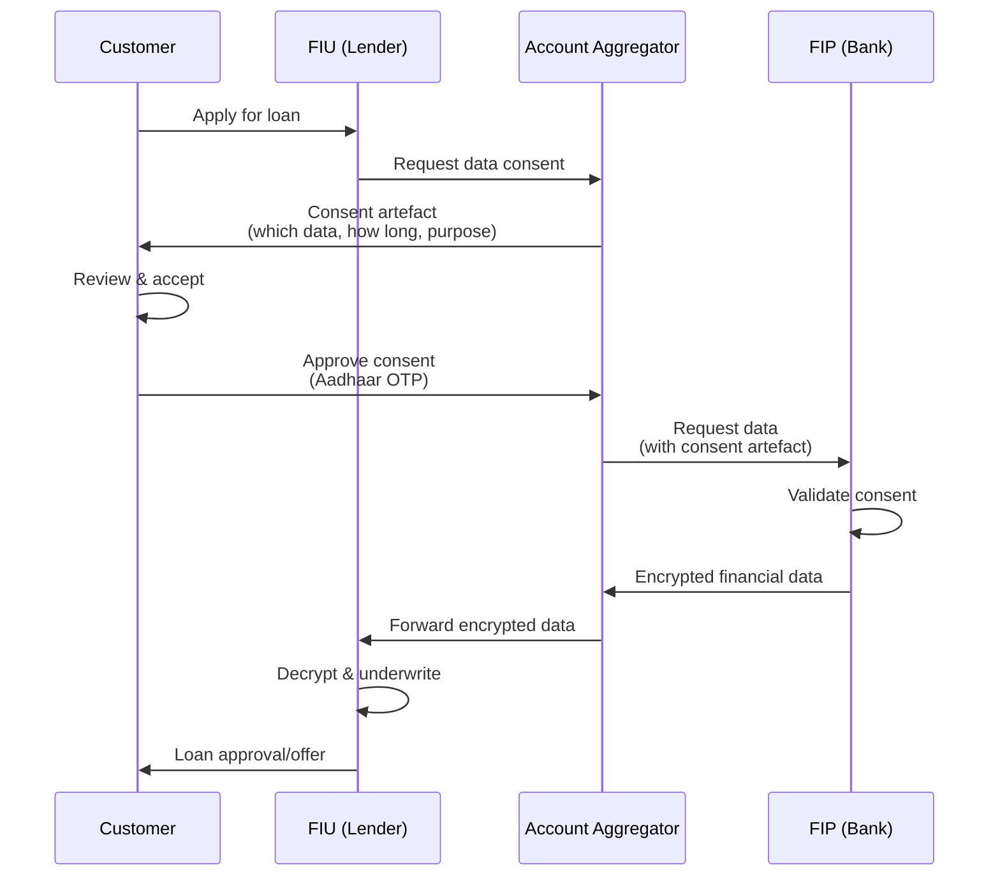
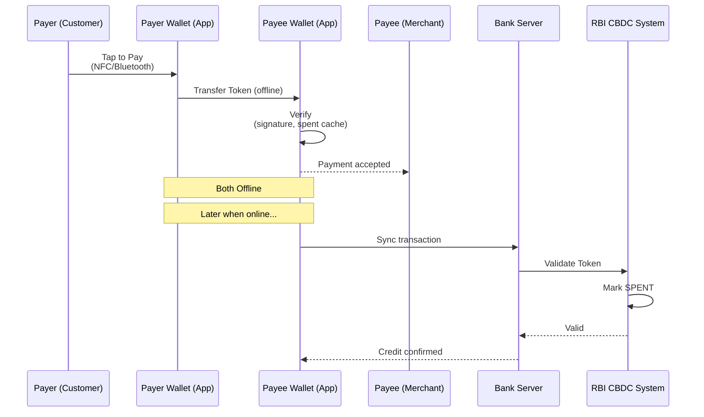
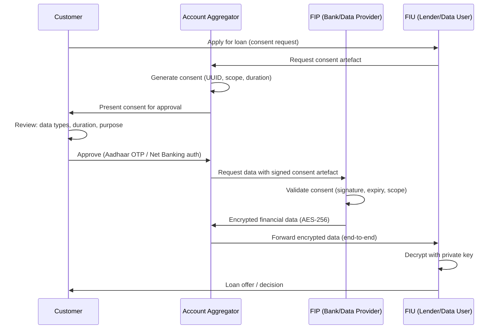
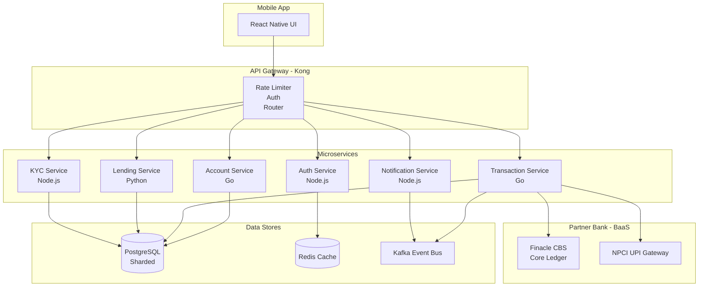
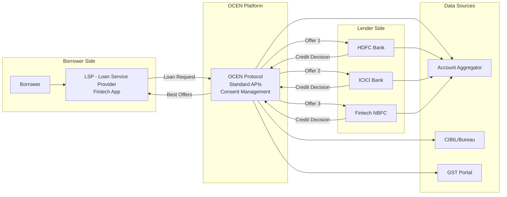

# Chapter 04: Fintech and Emerging Trends

## Learning Objectives

By the end of this chapter, you will be able to:
- Explain the Account Aggregator (AA) framework and its consent artefact mechanism
- Understand Open Banking under NDHP (National Data Health Platform)
- Describe the Digital Rupee (CBDC) architecture — token-based, dual offline, wholesale vs retail
- Analyze RegTech and SupTech developments including RBI's DAKSH platform
- Compare neo bank architecture (Jupiter, Fi) with legacy banks
- Understand lending tech (underwriting engines, credit scoring 2.0)
- Explain blockchain applications in trade finance
- Describe UPI-ATM interoperability and 3D Secure 2.0
- Analyze IoT applications in banking

## Theory

### 1. Account Aggregator (AA) Framework

#### 1.1 Overview

The Account Aggregator (AA) framework is a RBI-licensed data sharing system that enables individuals to securely share their financial data across regulated entities. It follows the concept of "consent-based data sharing without sharing raw data."

The framework was created by RBI under the Master Direction dated September 2, 2016 (updated 2021). The structure involves four key participants:

```
+------------------+     +------------------+
|   FIP (Financial |     |  FIU (Financial  |
|  Information     |     |  Information     |
|  Provider)       |     |  User)           |
|  Bank/MF/Demat   |     |  Lender/Insurer  |
+--------+---------+     +---------+--------+
         |                         |
         | 1. Data via API         | 2. Request Data
         +-------+---------+------+
                 |         |
        +--------v-+   +---v--------+
        |  AA 1    |   |   AA 2     |
        | (RBI     |   |  (RBI      |
        | Licensed)|   |  Licensed) |
        +----+-----+   +-----+------+
             |               |
        +----v---------------v------+
        |       Consent Manager     |
        |  (Consent Artefact Store) |
        +---------------------------+
```

**Key Participants:**

| Participant | Role | Example |
|-------------|------|---------|
| **AA (Account Aggregator)** | Licensed data intermediary (NBFC) | Sahamati, Finvu, CAMS Finserv |
| **FIP (Financial Information Provider)** | Holds user data (banks, MFs, insurers) | SBI, HDFC, ICICI, NSDL, CDSL |
| **FIU (Financial Information User)** | Consumes data (lenders, wealth managers) | Banks, NBFCs, fintechs |
| **Customer** | Data owner — controls consent | Individual user |

#### 1.2 Consent Artefact

The consent artefact is the core technical mechanism of the AA framework — a machine-readable JSON document specifying exactly what data can be shared, for how long, and with whom.

**Consent Artefact Structure (JSON):**

```json
{
  "consentId": "c4a1b2c3-1234-5678-9abc-def012345678",
  "consentStart": "2026-07-06T10:30:00Z",
  "consentEnd": "2026-08-05T10:30:00Z",
  "consentMode": "VIEW",
  "fetchType": "ONETIME",
  "fiTypes": ["DEPOSIT", "RECURRING_DEPOSIT"],
  "dataLife": {
    "unit": "MONTH",
    "value": 6
  },
  "frequency": {
    "unit": "HOUR",
    "value": 4
  },
  "DataConsumer": {
    "id": "FIU@lender.bank",
    "type": "FIU"
  },
  "fiDataRange": {
    "from": "2025-01-01T00:00:00Z",
    "to": "2026-07-06T23:59:59Z"
  },
  "Purpose": {
    "code": "101",
    "text": "Loan underwriting"
  },
  "encryptedDetail": {
    "key": "base64_public_key",
    "keyType": "CERTIFICATE"
  }
}
```

**Consent Artefact Key Parameters:**

| Parameter | Description |
|-----------|-------------|
| consentId | UUID v4 — unique identifier |
| consentStart/End | Validity window for consent |
| fetchType | ONETIME / PERIODIC |
| fiTypes | Account types: DEPOSIT, EQUITY, MUTUAL_FUND, INSURANCE, etc. |
| dataLife | How long FIU can retain data |
| frequency | How often data can be refreshed |
| DataConsumer | FIU identifier (must be registered) |
| Purpose | Reason for data request (101 = lending, 102 = wealth mgmt) |

**Technical Flow:**

```
1. Customer wants a loan from FIU (e.g., a bank)
2. FIU requests data via AA
3. AA generates consent artefact and presents to customer (mobile app)
4. Customer reviews:
   ├── Which data (accounts, transactions, balances)
   ├── How long (30 days, 1 year)
   ├── Purpose (loan underwriting)
   └── Data consumer (the lender)
5. Customer provides Aadhaar OTP / net banking auth to approve
6. Consent artefact is encrypted and stored at AA
7. AA fetches data from FIPs using the consent
8. Data flows from FIP -> AA -> FIU (encrypted end-to-end)
9. FIU uses data for underwriting
```

**Sahamati:** The collective of AA ecosystem participants (industry body). Sahamati sets technical standards, certifies AAs, and maintains the ReBIT specification.

### 2. Open Banking and NDHP (National Data Health Platform)

#### 2.1 Open Banking in Indian Context

Open Banking is the practice of sharing financial data securely through APIs, with customer consent. India's approach combines AA (for data sharing) with UPI (for payment initiation).

**Open Banking Architecture:**

```
+----------------------------------------------+
|           Open Banking Ecosystem             |
+------------------+---------------------------+
|                  |                           |
|   Data Layer    |    Transaction Layer       |
|   (AA Framework) |    (UPI / Payment APIs)   |
|                  |                           |
|  - Account Data  |  - Payment Initiation     |
|  - Transaction   |  - Fund Transfer          |
|  - Balance       |  - Mandate Management     |
|  - Statement     |  - Bill Payments          |
+------------------+---------------------------+
```

**Key Open Banking APIs (developed by ReBIT — Reserve Bank Information Technology):**

| API Category | Description | Standards |
|-------------|-------------|-----------|
| Account Information | Balance, transactions, statement | AA Framework APIs |
| Payment Initiation | UPI / NEFT / IMPS via API | UPI 2.0 APIs |
| Product Information | Loan products, deposit rates | Open API specs |
| KYC Verification | e-KYC, Aadhaar check | UIDAI APIs |
| Credit Information | CIBIL/Bureau data | AA + CIC APIs |

#### 2.2 NDHP (National Data Health Platform)

NDHP (also called **Account Aggregator Network**) is India's federated data-sharing network. It is the largest production deployment of the AA framework globally.

**NDHP Technical Stack:**

```
NDHP Components:
├── Identity Layer: Aadhaar-based consent authentication
├── Consent Layer: Digital consent artefacts (machine-readable)
├── Data Layer: Encrypted data exchange between FIP-FIU
├── Discovery Layer: Find accounts linked to a user
├── Monitoring Layer: Real-time consent tracking
└── Settlement Layer: Fee settlement between AAs, FIPs, FIUs
```

**Current Status (2026):** NDHP has over 100 FIPs (including all major banks), 150+ FIUs, and 10+ licensed AAs. Over 5 crore consented accounts are live.

### 3. Digital Rupee / e-Rupee (CBDC)

#### 3.1 CBDC Overview

Central Bank Digital Currency (CBDC) is a digital form of fiat currency issued by RBI. India's CBDC is called **Digital Rupee** or **e-Rupee** (e₹).

**Two Versions:**

| Type | Symbol | Target | Purpose |
|------|--------|--------|---------|
| e₹-W (Wholesale) | e₹-W | Interbank settlement | Settlement of secondary market transactions in government securities |
| e₹-R (Retail) | e₹-R | General public | Retail transactions, person-to-person, person-to-merchant |

#### 3.2 CBDC Architecture — Token-Based Model

The Digital Rupee uses a token-based model (as opposed to the account-based model of traditional digital payments).

**Token-Based vs Account-Based:**

```
Account-Based (Traditional Banking):
Account X -> Debit -> Credit -> Account Y
├── Identity required to transact
├── Bank maintains ledger
└── Requires internet banking/mobile app

Token-Based (CBDC):
Token (e₹) -> Transfer -> Token (e₹)
├── Token is the money (digital bearer instrument)
├── No identity required for transfer
├── Peer-to-peer (offline capable)
└── Anonymity (for small values)
```

**CBDC Token Structure:**

```
e₹ Token:
├── Token ID: UUID (unique, non-reusable)
├── Denomination: Rs. 10 / 50 / 100 / 200 / 500
├── Issuer: RBI (digital signature)
├── Serial Number: Issuer-specific
├── Issuance Timestamp: When token was minted
└── Status: UNSPENT / SPENT / CANCELLED

Digital Signature (RBI signs each token):
  Sign(SK_RBI, TokenID || Denom || Serial) = TokenSignature
```

#### 3.3 CBDC Technology Stack

```
+------------------------------------------+
|   RBI CBDC Core System (Token Minting)   |
|   - Token generation with RSA/ECC signing |
|   - Token lifecycle management            |
|   - Anti-counterfeit (digital signature)  |
+--------------------+---------------------+
                     |
+--------------------v---------------------+
|   CBDC Distribution Infra (Banks)        |
|   - Token distribution to customer wallets|
|   - Token redemption (Cash <-> CBDC)      |
|   - KYC for wallet (tiered)              |
+--------------------+---------------------+
                     |
+---------+----------+----------+----------+
|         |                     |          |
|  +------v-------+    +-------v------+   |
|  | Retail Wallet|    | Merchant     |   |
|  | (Mobile App) |    | Wallet       |   |
|  | - Token Store|    | (POS + App)  |   |
|  | - Offline TXN|    | - Settlement |   |
|  +------+-------+    +------+-------+   |
|         |                     |          |
|  +------v-----------------------v---+   |
|  |    Dual Offline Transaction       |   |
|  |  (NFC/Bluetooth, no internet)     |   |
|  +-----------------------------------+   |
+------------------------------------------+
```

#### 3.4 Dual Offline CBDC

A key feature of CBDC is the ability to transact without internet connectivity — using NFC or Bluetooth between two devices.

**Dual Offline Technical Flow:**

```
1. Payer and Payee are both offline (no internet)
2. Payer app sends token to Payee app via NFC/Bluetooth
3. Payee app verifies:
   ├── RBI digital signature on token (pre-verified)
   ├── Token not in local spent cache
   └── Amount matches
4. Payee app stores token locally
5. When connectivity is restored:
   ├── Payee app syncs token to bank server
   ├── Bank validates token against RBI
   ├── RBI marks token as SPENT
   └── Payee account credited (or token re-issued)
```

**Offline Limits (RBI proposed):**
- Per transaction: Rs. 500 (offline)
- Cumulative limit: Rs. 2,000 before online sync
- Wallet balance limit: Rs. 10,000 (same as CBDC overall)

#### 3.5 CBDC Comparison with UPI

| Feature | CBDC (e₹) | UPI |
|---------|-----------|-----|
| Issuer | RBI (central bank liability) | NPCI (payment system) |
| Settlement | Final (like cash) | Final after clearing |
| Offline | Yes (dual offline) | No (requires internet) |
| Anonymity | Small value (anonymous) | No (traceable) |
| Intermediary | Not required for P2P | PSP required |
| Programmability | Yes (smart contracts) | Limited |
| Interest | None (like cash) | N/A (payment layer) |
| Wallet | CBDC wallet | Banking app |

### 4. RegTech and SupTech

#### 4.1 RegTech (Regulatory Technology)

RegTech uses technology to manage regulatory compliance processes efficiently.

**RegTech Applications in Banking:**

| Area | Technology | Description |
|------|-----------|-------------|
| AML/CFT | AI/ML transaction monitoring | Real-time suspicious transaction detection |
| KYC | Digital e-KYC, Video KYC | Automated identity verification |
| Regulatory Reporting | XBRL, API-based | Automated filing to RBI |
| Risk Management | AI-based scenario analysis | Automated stress testing |
| Compliance Monitoring | RPA bots | Automated control testing |
| Fraud Detection | ML models | Real-time fraud scoring |
| Trade Surveillance | NLP, graph analytics | Market abuse detection |

**RegTech Architecture:**

```
+----------------+  +----------------+  +----------------+
| Transaction    |  | Customer Data  |  | Market Data    |
| Data (CBS)     |  | (CRM/KYC)      |  | (External feeds)|
+-------+--------+  +-------+--------+  +-------+--------+
        |                   |                   |
+-------v-------------------v-------------------v-------+
|                RegTech Platform                        |
|  +--------------------------------------------------+  |
|  | Rule Engine (Business rules + ML models)         |  |
|  | ├── AML Rules (PEP, Sanctions, High-risk)        |  |
|  | ├── Fraud Rules (velocity, device, geo)          |  |
|  | ├── KYC Rules (document expiry, risk category)    |  |
|  | └── Regulatory Rules (CRAR, LCR, NSFR)           |  |
|  +--------------------------------------------------+  |
|  | Reporting Engine (XBRL/PDF/CSV)                   |  |
+-------+-------------------+---------------------------+
        |                   |
+-------v-------+    +------v--------+
| RBI / Regulator|    | Internal     |
| (AXIS, DAKSH)  |    | Compliance   |
+----------------+    +--------------+
```

#### 4.2 SupTech (Supervisory Technology)

SupTech refers to technology used by regulators (RBI) for supervision. RBI's key SupTech initiatives:

**RBI's DAKSH Platform:**

DAKSH (Data Analytics, Knowledge, and Supervision Hub) is RBI's SupTech platform for data-driven supervision.

```
DAKSH Modules:
├── Data Aggregation: Automated collection from banks via API
│   ├── XBRL-based statutory returns
│   ├── CBS data extracts (daily)
│   └── Real-time transaction monitoring
├── Analytics Engine:
│   ├── Anomaly detection (AI/ML)
│   ├── Peer comparison analytics
│   ├── Off-site surveillance (OSS)
│   └── Trend analysis (NPA, capital, liquidity)
├── Visualization Dashboards:
│   ├── Financial health indicators
│   ├── Cybersecurity posture (color-coded)
│   └── Compliance status tracking
└── Reporting:
    ├── Automated inspection reports
    ├── Risk assessment reports (RAR)
    └── Financial stability reports
```

**Other RBI SupTech Initiatives:**

| Initiative | Description |
|-----------|-------------|
| **CIMS** (Central Information Management System) | Centralized data repository for banks |
| **XBRL Portal** | Standardized regulatory filing |
| **SIMS** (Supervisory Incident Management System) | Cyber incident reporting |
| **E-Kuber** | Government's payment and settlement system |
| **CKT** (Central Know Your Customer) | KYC registry (now merged with CERSAI) |

#### 4.3 Key Regulations Driving RegTech

| Regulation | Requirement | RegTech Solution |
|-----------|-------------|-----------------|
| PMLA Rules 2005 | Customer due diligence, suspicious transaction reporting | Automated AML screening |
| FATF Recommendations | AML/CFT compliance | Transaction monitoring |
| RBI KYC Master Directions | Video KYC, periodic updation | Digital KYC platform |
| FEMA | Foreign exchange reporting | Automated forex compliance |
| Data Localization (RBI 2018) | Payment data must be stored in India | Data residency tracking |
| CIC (Credit Information Companies) Act | Credit data reporting | Automated CIBIL reports |

### 5. Neo Banks

#### 5.1 Neo Bank Model

Neo banks are digital-only banks without physical branches. In India, neo banks partner with licensed banks for the banking license (they operate as "Banking-as-a-Service" or BaaS).

**Key Indian Neo Banks:**

| Neo Bank | Partner Bank | Focus |
|----------|-------------|-------|
| **Jupiter** | SBI, ICICI, Federal | Savings, investments |
| **Fi** (by Epifi) | Federal Bank | Savings, mutual funds, US stocks |
| **Niyo** | RBL, DCB, YES Bank | Salary accounts, forex |
| **Open** | ICICI, Axis | SME/Startup banking |
| **RazorpayX** | RBL, Yes Bank | Business banking |
| **Kotak 811** | Kotak Mahindra | Digital savings (full bank) |

#### 5.2 Neo Bank Architecture vs Legacy Bank

```
Legacy Bank Architecture (Monolithic):
+------------------------------------------+
|      CBS (T24 / Finacle / BaNCS)         |
|  (All modules in one system)              |
| - Customer Management                     |
| - Account Management                      |
| - Transactions                            |
| - Loans                                   |
| - Cards                                   |
| - Reporting                               |
| - All tightly coupled                     |
+------------------------------------------+
         |  Hard to change
         |  Slow to deploy
         v
+------------------------------------------+
|    Channels (Internet, Mobile, Branch)    |
+------------------------------------------+

Neo Bank Architecture (Microservices):
+-------+ +------+ +-------+ +------+ +------+
| Auth  | | Acct | | TXN   | | Lend | | Card |
| Srv   | | Srv  | | Srv   | | Srv  | | Srv  |
+---+---+ +--+---+ +---+---+ +--+---+ +--+---+
    |         |         |         |        |
+---v---------v---------v---------v--------v---+
|            API Gateway / BaaS Layer           |
|         (Kong, Apigee, AWS API GW)            |
+---+---------+---------+---------+--------+---+
    |         |         |         |        |
+---v---------v---------v---------v--------v---+
|    Partner Bank's CBS (Finacle/ BaNCS)        |
|    (Core ledger, GL, settlements)             |
+-----------------------------------------------+
```

**Key Architectural Differences:**

| Aspect | Legacy Bank | Neo Bank |
|--------|-------------|----------|
| Architecture | Monolithic / SOA | Microservices (K8s) |
| Deployment | Quarterly releases | Continuous (daily) |
| Tech Stack | Java/COBOL, Oracle | Go/Node.js, PostgreSQL, Kafka |
| Data | Centralized Oracle RAC | Distributed/Sharded |
| Channels | Integrated in CBS | API-first, headless |
| UX | Transactional | Gamified, engaging |
| Cost to Acquire | Rs. 500-1000 per customer | Rs. 50-100 per customer |
| Product Launch | 3-6 months | 2-4 weeks |

#### 5.3 Fi Banking App Technical Stack (Example)

```
Fi Tech Stack (Representative):
├── Frontend: React Native (iOS + Android)
├── Backend: Go microservices on Kubernetes
├── Database: PostgreSQL (sharded by customer_id)
├── Queue: Apache Kafka for event streaming
├── Cache: Redis for session + rate limiting
├── Partner Integration: Federal Bank CBS (Finacle) via APIs
├── AA Integration: For account aggregation
├── UPI: NPCI UPI APIs through partner bank
├── Security: Aadhaar e-KYC, device binding, biometric auth
└── Analytics: Apache Spark, Redshift for real-time analytics
```

### 6. Lending Technology

#### 6.1 Underwriting Engines

Modern lending tech replaces manual underwriting with automated decision engines that process 100+ data points in seconds.

**Underwriting Engine Architecture:**

```
Data Inputs:
├── Credit Bureau: CIBIL/Experian/Equifax (credit score + history)
├── Bank Statements: via AA (6-12 months)
├── Income Proof: Salary slips, IT returns (OCR + AI validation)
├── GST Data: GST returns (for businesses)
├── Demographic Data: Age, location, occupation
├── Digital Footprint: e-commerce data, social media (optional)
├── Device Data: Device fingerprint, location consistency
└── Employment Data: Employment verification APIs

Underwriting Engine (Rules + ML):
├── Rule Engine: Pre-qualification rules (age, bureau score min)
├── ML Score: Custom credit scoring model
│   ├── XGBoost / LightGBM on 500+ features
│   ├── Model trained on historical repayment data
│   └── Output: Probability of Default (PD)
├── Affordability Calculator: DTI (Debt-to-Income) ratio
├── Fraud Detection: ML-based anomaly detection
└── Policy Engine: Risk segment -> product/rate offered

Output:
├── Approved: Loan amount, interest rate, tenure
├── Referred: Manual underwriting review
└── Rejected: Decline reason (mandatory)
```

#### 6.2 Credit Scoring 2.0

Traditional credit scoring (CIBIL 300-900) relies on credit history. Credit Scoring 2.0 uses alternative data.

**Traditional vs Alternative Credit Scoring:**

```
Traditional Credit Score:
├── Factors: Payment history (35%), Credit utilization (30%),
│            Credit age (15%), Credit mix (10%), New inquiries (10%)
├── Coverage: ~40% of Indian adults (with formal credit history)
└── Limitations: Excludes new-to-credit, gig workers, rural

Alternative Credit Score (2.0):
├── Data Sources:
│   ├── UPI transaction history
│   ├── Recharge and bill payment patterns
│   ├── GST data (business cash flows)
│   ├── E-commerce purchase patterns
│   ├── Telecom data (bill payment, recharge regularity)
│   └── Social media signals (optional, consent-based)
├── Coverage: ~80% of Indian adults
└── Example: Experian Boost, OneScore
```

**Alternative Scoring Model (Example):**

```
Feature Engineering for UPI-based Score:
├── Transaction volume (monthly average)
├── Income inflow patterns (regular salary credits)
├── Expense categories (% on food, travel, utilities)
├── Savings behaviour (periodic transfers to FD/savings)
├── Repayment behaviour (SIPs, insurance premiums paid on time)
├── Transaction velocity (high velocity = potential stress)
└── Peer group comparison (similar demographics)
```

### 7. Blockchain in Trade Finance

#### 7.1 Traditional vs Blockchain Trade Finance

Trade finance involves multiple parties (importer, exporter, banks, customs, shipping) with significant paperwork. Blockchain provides a shared, immutable ledger.

```
Traditional Trade Finance:
├── Paper: 20+ documents for a single transaction
├── Time: 5-10 days for document processing
├── Fraud: Invoice fraud, double financing
├── Cost: 3-5% of transaction value
└── Participants: Disconnected systems

Blockchain Trade Finance:
├── Digital: Smart contracts for LC (Letter of Credit)
├── Time: Minutes to hours
├── Trust: Immutable record, fraud-resistant
├── Cost: &lt; 1% of transaction value
└── Participants: Shared ledger, real-time updates
```

#### 7.2 How Blockchain Trade Finance Works

```
1. Exporter and Importer agree on terms
2. Smart contract created on blockchain:
   ├── LC terms (amount, shipping date, quality specs)
   ├── Conditional: Payment released on proof of shipment
   └── Multi-signature: Requires bank + customs + shipping approval

3. Importer's Bank issues LC on blockchain
   └── Smart contract records LC as a digital asset

4. Exporter ships goods
   ├── Shipping company records Bill of Lading on blockchain
   └── GPS tracking data fed into smart contract

5. Customs verification
   └── Customs officer digitally signs on blockchain

6. Automatic Payment Release
   ├── Smart contract verifies all conditions met
   ├── Payment released from Importer's bank to Exporter's bank
   └── All parties have immutable audit trail
```

**Blockchain Platforms Used by Indian Banks:**

| Platform | Banks | Use Case |
|----------|-------|----------|
| **InTrade** (Infosys) | SBI, ICICI, Axis | Trade finance network |
| **Corda** (R3) | HDFC, Yes Bank | LC, supply chain finance |
| **Hyperledger Fabric** | Multiple PSBs | Trade finance, remittances |
| **IBA Trade Platform** | 15+ banks | Invoice financing, bill discounting |

### 8. UPI-ATM Interoperability

#### 8.1 Cardless Cash Withdrawal via UPI

RBI and NPCI have enabled UPI-based ATM withdrawals — customers can withdraw cash without a physical debit card.

**Technical Flow:**

```
1. Customer selects "UPI ATM" on ATM screen
2. ATM displays QR code on screen
3. Customer scans QR code with UPI app (GPay/PhonePe/PayTM)
4. UPI app validates ATM location, amount
5. Customer enters UPI PIN
6. Transaction flows:
   ├── UPI App -> PSP -> NPCI UPI -> Issuer Bank
   ├── Issuer bank debits savings account
   └── UPI Ref No generated
7. ATM receives approval signal
8. ATM dispenses cash
9. Customer gets UPI confirmation on phone
```

**Key Technical Changes:**
- ATM software updated to display QR code
- ATM connected to UPI switch (via NPCI)
- No card reader dependency
- No PIN entry on ATM keypad
- Transaction limit: Rs. 5,000 per transaction (UPI rules apply)

#### 8.2 Interoperability Benefits

| Aspect | Traditional ATM | UPI-ATM |
|--------|---------------|---------|
| Authentication | Physical card + PIN | Phone + UPI PIN |
| Forgery Risk | Card skimming, PIN theft | No card, device auth |
| International | Works with cards | Works with UPI (domestic) |
| Cost to Bank | Card cost (Rs. 30-150) | Zero (digital) |
| Accessibility | Anyone with card | Anyone with UPI app |

### 9. 3D Secure 2.0

#### 9.1 Overview

3D Secure 2.0 (3DS 2.0) is the latest version of the authentication protocol for card-not-present (CNP) transactions — online payments.

**3DS 1.0 vs 2.0:**

| Feature | 3DS 1.0 | 3DS 2.0 |
|---------|---------|---------|
| User Experience | Redirect to ACS page | Frictionless (in-app) |
| Data Shared | Only card number | 150+ data points |
| Auth Method | Static password/OTP | Risk-based (biometric, OTP, or none) |
| Mobile Support | Poor (redirect) | Excellent (native SDK) |
| Transaction Time | 20-40 seconds | 2-5 seconds |
| Conversion Rate | 60-70% (drop-offs) | 90-95% |
| Message Format | XML (SOAP) | JSON (REST) |

**Data Points in 3DS 2.0:**

```
3DS Server collects 150+ data points:
├── Cardholder Account Info
│   ├── Account age, password changes, transaction history
│   └── Device registration date
├── Device Info
│   ├── Device fingerprint (screen, OS, browser)
│   ├── IP address, geolocation
│   └── Device language, timezone
├── Transaction Info
│   ├── Amount, currency, merchant category
│   ├── Shipping address match
│   └── Items in cart (digital/physical)
└── Behavioral Biometrics
    ├── Typing speed
    ├── Mouse movement patterns
    └── Touch pressure (mobile)
```

**3DS 2.0 Flow (Frictionless):**

```
1. Customer initiates payment at merchant
2. Merchant sends payment + 150+ data points to Acquirer
3. Acquirer sends to Directory Server (card network)
4. Directory Server routes to Issuer's ACS (Access Control Server)
5. ACS runs risk engine on 150+ data points
6. If low risk -> Frictionless (no challenge, customer not interrupted)
7. If medium risk -> Challenge (biometric/OTP)
8. If high risk -> Transaction declined
9. Result sent back through network
```

### 10. IoT in Banking

#### 10.1 IoT Applications

Internet of Things (IoT) in banking enables physical devices to interact with banking systems.

| Application | IoT Device | Banking Interface |
|-------------|-----------|-------------------|
| ATM Predictive Maintenance | Vibration sensors | CMS (replenishment scheduling) |
| Branch Energy Management | Smart meters, occupancy sensors | Energy cost optimization |
| Fleet Management (Cash Vans) | GPS trackers, fuel sensors | CMS (trip monitoring) |
| Wearable Payments | Smartwatch, fitness band | Tokenized card (NFC) |
| Beacon-based Offers | BLE beacons in branches | CRM (personalized offers) |
| Smart ATMs | Camera, proximity sensors | CBS (personalized welcome) |
| Inventory Management | RFID on locker keys | Branch operations |
| Connected Car Payments | In-dash NFC | Fuel, toll, parking payments |

**IoT Architecture for Banking:**

```
+----------------+     +----------------+
| IoT Devices    |     | Edge Gateway   |
| (Sensors, GPS, |     | (Protocol      |
| Cameras, RFID) |     |  Converter)    |
+-------+--------+     +-------+--------+
        |                       |
        | MQTT / CoAP / HTTP    | TLS 1.2+
+-------v-----------------------v--------+
|            IoT Platform                |
|   (AWS IoT / Azure IoT / On-prem)      |
|   - Device Registry                    |
|   - Data Ingestion (Kafka)             |
|   - Rule Engine                        |
|   - Event Processing                   |
|   - Device Management (OTA updates)    |
+------------------+--------------------+
                   |
+------------------v--------------------+
|            Banking Integration         |
|   - CBS (account updates)              |
|   - CMS (cash management)             |
|   - CRM (customer alerts)             |
|   - Risk (anomaly detection)          |
+---------------------------------------+
```

#### 10.2 IoT Security in Banking

```
IoT Security Considerations:
├── Device Authentication: PKI certificates per device
├── Secure Boot: TPM (Trusted Platform Module) on gateways
├── Encrypted Communication: TLS / DTLS for all device traffic
├── Firmware Signing: Only signed firmware can be installed
├── Device Lifecycle: Decommission process for retired devices
├── Data Minimization: Only necessary data collected
└── Network Segmentation: IoT devices in separate VLAN
```

### 11. Architecture Diagrams

#### Account Aggregator Consent Flow



#### CBDC Dual Offline Transaction



## Examples (Exam-Style MCQs)

**Example 1:**
In the Account Aggregator framework, which entity is licensed by RBI as the data intermediary?

A) FIP
B) FIU
C) AA
D) Sahamati

<details>
<summary>Answer</summary>
**Answer: C) AA**

Account Aggregators (AAs) are RBI-licensed NBFCs that act as consent-based data intermediaries between FIPs (data providers) and FIUs (data users). Sahamati is the industry body, not a licensed AA.
</details>

**Example 2:**
What is the key difference between wholesale (e₹-W) and retail (e₹-R) CBDC?

A) e₹-W uses blockchain, e₹-R uses centralized database
B) e₹-W is for interbank settlement, e₹-R is for public transactions
C) e₹-W has offline capability, e₹-R does not
D) e₹-W is token-based, e₹-R is account-based

<details>
<summary>Answer</summary>
**Answer: B) e₹-W is for interbank settlement, e₹-R is for public transactions**

e₹-W (Wholesale) is used for interbank settlement of government securities. e₹-R (Retail) is for the general public. Both are token-based and both have offline capability in the roadmap.
</details>

**Example 3:**
What is RBI's DAKSH platform primarily used for?

A) Retail payment processing
B) Data-driven supervisory technology (SupTech)
C) Customer complaint resolution
D) Aadhaar authentication

<details>
<summary>Answer</summary>
**Answer: B) Data-driven supervisory technology (SupTech)**

DAKSH (Data Analytics, Knowledge, and Supervision Hub) is RBI's SupTech platform for data-driven supervision of banks through automated data collection, analytics, and visualization.
</details>

**Example 4:**
Which data sharing protocol does 3D Secure 2.0 use?

A) XML (SOAP)
B) JSON (REST)
C) ISO 8583
D) Apache Thrift

<details>
<summary>Answer</summary>
**Answer: B) JSON (REST)**

3DS 2.0 uses JSON (REST) messaging — a significant upgrade from 3DS 1.0's XML (SOAP). This enables faster, lighter-weight communication between merchant, ACS, and issuer.
</details>

**Example 5:**
In the AA framework, what does a consent artefact with fetchType "PERIODIC" and frequency "4 HOURS" allow?

A) One-time data fetch
B) Data refresh every 4 hours within the consent period
C) Data access for exactly 4 hours total
D) Data access for 4 different FIUs

<details>
<summary>Answer</summary>
**Answer: B) Data refresh every 4 hours**

Periodic fetch with a frequency of 4 hours means the FIU can refresh data from the FIP every 4 hours during the consent validity period. This is used for monitoring loan accounts or portfolio tracking.
</details>

### 12. TypeScript Code Examples

#### 12.1 CBDC Wallet Simulator (Token-Based Digital Rupee)

```typescript
interface CBDCToken {
  tokenId: string;
  denomination: number;
  issuer: string;
  serialNumber: string;
  issuedAt: Date;
  status: 'UNSPENT' | 'SPENT' | 'CANCELLED';
  signature: string;
}

interface CBDCTransaction {
  txnId: string;
  tokenId: string;
  fromWallet: string;
  toWallet: string;
  amount: number;
  mode: 'ONLINE' | 'OFFLINE_NFC' | 'OFFLINE_BT';
  timestamp: Date;
  syncedAt?: Date;
}

class CBDCWallet {
  private tokens: Map&lt;string, CBDCToken&gt; = new Map();
  private spentCache: Set&lt;string&gt; = new Set();
  private transactions: CBDCTransaction[] = [];
  private readonly MAX_BALANCE: number = 10000;
  private readonly MAX_OFFLINE_CUMULATIVE: number = 2000;
  private offlineSpentTotal: number = 0;

  constructor(public walletId: string, public ownerName: string) {}

  private generateTokenId(): string {
    return `eINR-${Date.now()}-${Math.random().toString(36).substring(2, 8).toUpperCase()}`;
  }

  private signToken(tokenId: string, denom: number, serial: string): string {
    const data = tokenId + denom + serial + 'RBI-MASTER-KEY';
    let hash = 0;
    for (let i = 0; i &lt; data.length; i++) {
      hash = ((hash &lt;&lt; 5) - hash) + data.charCodeAt(i);
      hash = hash & hash;
    }
    return `RBI-SIG-${Math.abs(hash).toString(16).toUpperCase().padStart(32, '0')}`;
  }

  mintTokens(amount: number): CBDCToken[] {
    if (amount > this.MAX_BALANCE) { throw new Error('Exceeds max wallet balance'); }

    const denominations = [500, 200, 100, 50, 20, 10];
    const minted: CBDCToken[] = [];
    let remaining = amount;

    for (const denom of denominations) {
      while (remaining >= denom) {
        const serial = `RBI${Date.now()}${minted.length}`;
        const tokenId = this.generateTokenId();
        const token: CBDCToken = {
          tokenId, denomination: denom, issuer: 'RBI',
          serialNumber: serial, issuedAt: new Date(),
          status: 'UNSPENT', signature: this.signToken(tokenId, denom, serial),
        };
        this.tokens.set(tokenId, token);
        minted.push(token);
        remaining -= denom;
      }
    }
    console.log(`[CBDC] Minted ${minted.length} tokens worth Rs.${amount} to wallet ${this.walletId}`);
    return minted;
  }

  getBalance(): number {
    let balance = 0;
    for (const token of this.tokens.values()) {
      if (token.status === 'UNSPENT') { balance += token.denomination; }
    }
    return balance;
  }

  verifyTokenSignature(token: CBDCToken): boolean {
    const expectedSig = this.signToken(token.tokenId, token.denomination, token.serialNumber);
    return token.signature === expectedSig;
  }

  sendToken(tokenId: string, toWalletId: string, mode: CBDCTransaction['mode']): CBDCTransaction {
    const token = this.tokens.get(tokenId);
    if (!token) { throw new Error('Token not found'); }
    if (token.status !== 'UNSPENT') { throw new Error('Token already spent'); }
    if (!this.verifyTokenSignature(token)) { throw new Error('Token signature invalid - counterfeit detected'); }

    token.status = 'SPENT';
    const txn: CBDCTransaction = {
      txnId: `CBDC-${Date.now()}`,
      tokenId, fromWallet: this.walletId, toWallet: toWalletId,
      amount: token.denomination, mode,
      timestamp: new Date(),
      syncedAt: mode === 'ONLINE' ? new Date() : undefined,
    };

    if (mode !== 'ONLINE') {
      this.spentCache.add(tokenId);
      this.offlineSpentTotal += token.denomination;
      if (this.offlineSpentTotal > this.MAX_OFFLINE_CUMULATIVE) {
        throw new Error('Offline cumulative limit exceeded - please sync online');
      }
    }

    this.transactions.push(txn);
    console.log(`[CBDC] ${mode} transfer: Rs.${token.denomination} to ${toWalletId}`);
    return txn;
  }

  syncOnline(pendingTxns: CBDCTransaction[]): void {
    for (const txn of pendingTxns) {
      txn.syncedAt = new Date();
    }
    this.spentCache.clear();
    this.offlineSpentTotal = 0;
    console.log(`[CBDC] Synced ${pendingTxns.length} offline transactions`);
  }

  getTransactionHistory(): CBDCTransaction[] {
    return [...this.transactions];
  }
}

// Usage
const aliceWallet = new CBDCWallet('WALLET-ALICE-001', 'Alice Sharma');
const bobWallet = new CBDCWallet('WALLET-BOB-001', 'Bob Verma');

aliceWallet.mintTokens(1000);
console.log('Alice balance:', aliceWallet.getBalance());

const txn = aliceWallet.sendToken('eINR-1746547200000-A1B2C3D4', bobWallet.walletId, 'ONLINE');
console.log('CBDC Transaction:', JSON.stringify(txn, null, 2));
```

#### 12.2 Account Aggregator Consent Flow

```typescript
interface ConsentArtefact {
  consentId: string;
  consentStart: Date;
  consentEnd: Date;
  consentMode: 'VIEW' | 'STORE' | 'QUERY';
  fetchType: 'ONETIME' | 'PERIODIC';
  fiTypes: string[];
  dataLife: { unit: 'MONTH' | 'DAY' | 'YEAR'; value: number };
  frequency: { unit: 'HOUR' | 'DAY' | 'WEEK'; value: number };
  dataConsumer: { id: string; type: 'FIU' };
  fiDataRange: { from: string; to: string };
  purpose: { code: string; text: string };
}

interface FinancialData {
  accountNumber: string;
  accountType: string;
  balance: number;
  transactions: Array&lt;{ date: Date; description: string; amount: number; type: 'DEBIT' | 'CREDIT' }&gt;;
}

class AccountAggregator {
  private fiData: Map&lt;string, FinancialData[]&gt; = new Map();
  private consents: Map&lt;string, ConsentArtefact&gt; = new Map();

  constructor() {
    this.seedData();
  }

  private seedData(): void {
    this.fiData.set('CUST001', [{
      accountNumber: 'SBIN1001001', accountType: 'SAVINGS', balance: 125000,
      transactions: [
        { date: new Date('2026-07-01'), description: 'Salary credit', amount: 75000, type: 'CREDIT' },
        { date: new Date('2026-07-02'), description: 'Rent payment', amount: 25000, type: 'DEBIT' },
      ],
    }]);
  }

  createConsent(customerId: string, fiuId: string, fiTypes: string[], purpose: string): ConsentArtefact {
    const consent: ConsentArtefact = {
      consentId: crypto.randomUUID ? crypto.randomUUID() : `CONSENT-${Date.now()}`,
      consentStart: new Date(),
      consentEnd: new Date(Date.now() + 30 * 24 * 60 * 60 * 1000),
      consentMode: 'VIEW',
      fetchType: 'ONETIME',
      fiTypes,
      dataLife: { unit: 'MONTH', value: 6 },
      frequency: { unit: 'HOUR', value: 4 },
      dataConsumer: { id: fiuId, type: 'FIU' },
      fiDataRange: { from: '2026-01-01T00:00:00Z', to: '2026-07-06T23:59:59Z' },
      purpose: { code: '101', text: purpose },
    };
    this.consents.set(consent.consentId, consent);
    console.log(`[AA] Consent created: ${consent.consentId} for customer ${customerId}`);
    return consent;
  }

  approveConsent(consentId: string, otpVerified: boolean): boolean {
    if (!otpVerified) { throw new Error('OTP verification failed'); }
    console.log(`[AA] Consent approved: ${consentId}`);
    return true;
  }

  fetchData(customerId: string, consentId: string): FinancialData[] | null {
    const consent = this.consents.get(consentId);
    if (!consent) { throw new Error('Consent not found'); }
    if (new Date() > consent.consentEnd) { throw new Error('Consent expired'); }

    const data = this.fiData.get(customerId);
    if (!data) { return null; }

    const filtered = data.map(acct => ({
      ...acct,
      transactions: acct.transactions.filter(t =>
        t.date >= new Date(consent.fiDataRange.from) &&
        t.date &lt;= new Date(consent.fiDataRange.to)
      ),
    }));

    console.log(`[AA] Data fetched for customer ${customerId} using consent ${consentId}`);
    return filtered;
  }

  revokeConsent(consentId: string): boolean {
    const consent = this.consents.get(consentId);
    if (!consent) { throw new Error('Consent not found'); }
    consent.consentEnd = new Date();
    console.log(`[AA] Consent revoked: ${consentId}`);
    return true;
  }
}

// Usage
const aa = new AccountAggregator();
const consent = aa.createConsent('CUST001', 'FIU-LENDER-001', ['DEPOSIT'], 'Loan underwriting');
aa.approveConsent(consent.consentId, true);
const data = aa.fetchData('CUST001', consent.consentId);
console.log('AA data:', JSON.stringify(data, null, 2));
```

#### 12.3 OCEN (Open Credit Enablement Network) Flow Simulator

```typescript
interface LoanRequest {
  requestId: string;
  borrowerId: string;
  amount: number;
  tenureMonths: number;
  purpose: string;
  monthlyIncome: number;
  creditScore: number;
}

interface LoanOffer {
  offerId: string;
  lenderId: string;
  approvedAmount: number;
  interestRate: number;
  tenureMonths: number;
  emiAmount: number;
  processingFee: number;
}

class OCENPlatform {
  private lenders: Map&lt;string, { name: string; minScore: number; maxRate: number }&gt; = new Map();
  private requests: Map&lt;string, LoanRequest&gt; = new Map();

  constructor() {
    this.lenders.set('LENDER-HDFC', { name: 'HDFC Bank', minScore: 650, maxRate: 12 });
    this.lenders.set('LENDER-AXIS', { name: 'Axis Bank', minScore: 600, maxRate: 14 });
    this.lenders.set('LENDER-FINTECH', { name: 'FinTech Lending Co', minScore: 550, maxRate: 18 });
  }

  submitRequest(req: LoanRequest): LoanOffer[] {
    this.requests.set(req.requestId, req);
    const offers: LoanOffer[] = [];

    for (const [id, lender] of this.lenders) {
      if (req.creditScore >= lender.minScore) {
        const interestRate = Math.min(lender.maxRate, 8 + (750 - req.creditScore) * 0.02);
        const monthlyRate = interestRate / 12 / 100;
        const emi = req.amount * monthlyRate * Math.pow(1 + monthlyRate, req.tenureMonths) /
          (Math.pow(1 + monthlyRate, req.tenureMonths) - 1);

        offers.push({
          offerId: `OFFER-${id}-${Date.now()}`,
          lenderId: id,
          approvedAmount: req.amount,
          interestRate: Math.round(interestRate * 100) / 100,
          tenureMonths: req.tenureMonths,
          emiAmount: Math.round(emi),
          processingFee: Math.round(req.amount * 0.01),
        });
      }
    }

    console.log(`[OCEN] ${offers.length} offers generated for request ${req.requestId}`);
    return offers.sort((a, b) => a.interestRate - b.interestRate);
  }

  acceptOffer(offer: LoanOffer): string {
    const loanId = `LOAN-${Date.now()}`;
    console.log(`[OCEN] Loan ${loanId} disbursed: Rs.${offer.approvedAmount} at ${offer.interestRate}% by ${offer.lenderId}`);
    return loanId;
  }
}

// Usage
const ocen = new OCENPlatform();
const req: LoanRequest = {
  requestId: `REQ-${Date.now()}`, borrowerId: 'BORROWER-001',
  amount: 500000, tenureMonths: 60, purpose: 'Home renovation',
  monthlyIncome: 120000, creditScore: 720,
};
const offers = ocen.submitRequest(req);
console.log('Best offer:', JSON.stringify(offers[0], null, 2));
```

#### 12.4 Neo Bank Microservices Architecture Simulator

```typescript
interface Customer {
  customerId: string;
  name: string;
  email: string;
  phone: string;
  kycStatus: 'PENDING' | 'VERIFIED' | 'REJECTED';
  deviceId: string;
}

interface Account {
  accountId: string;
  customerId: string;
  ifsc: string;
  balance: number;
  productType: 'SAVINGS' | 'CURRENT' | 'FIXED_DEPOSIT';
}

interface TransactionEvent {
  eventId: string;
  eventType: 'ACCOUNT_CREATED' | 'DEPOSIT' | 'WITHDRAWAL' | 'TRANSFER';
  accountId: string;
  amount: number;
  timestamp: Date;
}

class NeoBankAPI {
  private customers: Map&lt;string, Customer&gt; = new Map();
  private accounts: Map&lt;string, Account&gt; = new Map();
  private events: TransactionEvent[] = [];

  async onboardCustomer(name: string, email: string, phone: string): Promise&lt;Customer&gt; {
    const kycResult = await this.simulateEkyc(name, email);
    const customer: Customer = {
      customerId: `NEO-${Date.now()}`,
      name, email, phone,
      kycStatus: kycResult ? 'VERIFIED' : 'PENDING',
      deviceId: Math.random().toString(36).substring(2, 15),
    };
    this.customers.set(customer.customerId, customer);

    if (customer.kycStatus === 'VERIFIED') {
      const account = await this.openAccount(customer.customerId);
      console.log(`[NeoBank] Customer ${customer.name} onboarded with account ${account.accountId}`);
    }
    return customer;
  }

  private async simulateEkyc(name: string, email: string): Promise&lt;boolean&gt; {
    await new Promise(resolve =&gt; setTimeout(resolve, 100));
    return name.length > 0 && email.includes('@');
  }

  async openAccount(customerId: string): Promise&lt;Account&gt; {
    const customer = this.customers.get(customerId);
    if (!customer) { throw new Error('Customer not found'); }
    if (customer.kycStatus !== 'VERIFIED') { throw new Error('KYC not verified'); }

    const account: Account = {
      accountId: `ACC${Date.now()}`,
      customerId,
      ifsc: 'NEOB0001234',
      balance: 0,
      productType: 'SAVINGS',
    };
    this.accounts.set(account.accountId, account);

    this.events.push({
      eventId: `EVT-${Date.now()}`, eventType: 'ACCOUNT_CREATED',
      accountId: account.accountId, amount: 0, timestamp: new Date(),
    });
    return account;
  }

  async processTransfer(fromAccountId: string, toAccountId: string, amount: number): Promise&lt;TransactionEvent&gt; {
    const from = this.accounts.get(fromAccountId);
    const to = this.accounts.get(toAccountId);
    if (!from || !to) { throw new Error('Account not found'); }
    if (from.balance &lt; amount) { throw new Error('Insufficient balance'); }

    from.balance -= amount;
    to.balance += amount;

    const event: TransactionEvent = {
      eventId: `EVT-${Date.now()}`, eventType: 'TRANSFER',
      accountId: fromAccountId, amount, timestamp: new Date(),
    };
    this.events.push(event);

    console.log(`[NeoBank] Transfer: Rs.${amount} from ${fromAccountId} to ${toAccountId}`);
    return event;
  }

  getAccountStatement(accountId: string): TransactionEvent[] {
    return this.events.filter(e =&gt; e.accountId === accountId);
  }
}

// Usage
const neo = new NeoBankAPI();
neo.onboardCustomer('Ravi Kumar', 'ravi@email.com', '9876543210').then(async (customer) =&gt; {
  const accounts = Array.from(neo['accounts'].values()).filter(a =&gt; a.customerId === customer.customerId);
  if (accounts.length > 0) {
    console.log('Account opened:', accounts[0].accountId);
  }
});
```

### 13. Architecture Diagrams — Additional

#### Account Aggregator Consent Flow with Encryption



#### Neo Bank Microservices Architecture



#### OCEN - Open Credit Enablement Network



### 14. Latest Developments (2024-2026)

#### 14.1 Account Aggregator Growth

- **2024:** AA network crossed 50 million consented accounts. Sahamati reported 100+ FIPs and 150+ FIUs live. Average consent artefact creation time: under 30 seconds.
- **2025:** RBI mandated AA integration for all scheduled commercial banks (deadline: Dec 2025). AA used for 40% of all new loan originations in India.
- **2026:** AA network now covers 200+ million consented accounts. Cross-border AA pilots launched (Singapore-India data flow). New FI types include insurance policies, mutual funds, and pension accounts.

#### 14.2 CBDC / e-Rupee Developments

- **2024:** RBI expanded e₹-R pilot to 50+ cities with 15 banks. Daily transaction volume crossed 1 million. Interoperability with UPI QR codes launched — merchants can accept CBDC using existing UPI QR.
- **2025:** e₹-W (Wholesale) used for clearing of government securities — reduced settlement time from T+1 to T+0. RBI proposed programmability features (CBDC for specific use cases like fertilizer subsidy, education).
- **2026:** Full-scale CBDC rollout expected. Dual-offline feature launched in 10 cities (hill stations, remote areas). CBDC-UPI bridge enables seamless transfer between CBDC wallets and bank accounts. RBI considering limited anonymity up to Rs. 50,000.

#### 14.3 Neo Bank and Fintech Developments

- **2024:** Jupiter acquired 4 million+ customers. Fi reached 3 million users. Kotak 811 crossed 10 million digital accounts. RBI issued stricter norms for neo banks — mandatory physical presence for certain operations.
- **2025:** Open (RazorpayX) launched full-stack business banking (current accounts, credit cards, working capital). Niyo launched global accounts for students/workers. Fintech funding recovered after 2023 winter.
- **2026:** Neo banks pivoted to profitability focus. Jupiter turned EBITDA positive. New BaaS entrants (Setu, Decentro) enabling smaller fintechs. RBI introduced "Digital Banking Unit" license framework for fully digital banks.

#### 14.4 OCEN (Open Credit Enablement Network)

- **2024:** OCEN v4.0 launched with standard APIs for credit product discovery, application, underwriting, and disbursement. 50+ lenders and 100+ LSPs live.
- **2025:** OCEN integrated with AA framework — lenders get real-time financial data for underwriting. First OCEN-based micro-credit products launched (Rs. 10,000-50,000 loans in under 5 minutes).
- **2026:** OCEN expanded to agri-credit and MSME supply chain financing. Millet-based credit scoring (alt data from UPI, GST, telecom) enabled sub-500 CIBIL score borrowers to access credit.

#### 14.5 RegTech and SupTech Updates

- **2024:** RBI DAKSH 2.0 launched with AI-based anomaly detection across all regulated entities. Real-time data ingestion from 200+ banks. Machine learning models for early warning signals of financial stress.
- **2025:** RBI mandated API-based regulatory reporting for all banks (replacing XBRL upload). Real-time CRAR, NPA, and LCR monitoring. Automated breach alerts generated.
- **2026:** SupTech integrated with AA network — RBI can view aggregate credit exposure across the banking system in real-time. AI-based supervisory assessment models deployed.

#### 14.6 3D Secure 2.0 Adoption

- **2024:** All Indian card issuers completed 3DS 2.0 migration. Frictionless rate reached 70% for domestic transactions.
- **2025:** Biometric in-app authentication (fingerprint/face) became primary 3DS 2.0 method for mobile transactions. Frictionless rate exceeded 85%.
- **2026:** Behavioral biometrics (typing pattern, device handling) integrated with 3DS 2.0 risk engines. Average authentication time: 0.8 seconds.

#### 14.7 UPI-ATM Global Expansion

- **2024:** UPI-ATM withdrawals launched at 50,000+ ATMs across India. NPCI reported 1 million+ UPI ATM transactions monthly.
- **2025:** UPI-ATM enabled in UAE (through NPCI-NPCI International), Singapore (through PayNow-UPI linkage), and Japan (through JCB partnership).
- **2026:** Global UPI-ATM coverage expanded to 20+ countries. NRIs can use Indian UPI app for cash withdrawals abroad. Daily limit of Rs. 25,000 for international UPI-ATM.

## 📝 Solved Examples (20 MCQs)

**1.** In the Account Aggregator framework, which entity is licensed by RBI to act as a data intermediary?

A) FIP (Financial Information Provider)
B) FIU (Financial Information User)
C) AA (Account Aggregator)
D) Sahamati

<details>
<summary>Answer</summary>
**Answer: C) AA (Account Aggregator)**

Account Aggregators are RBI-licensed NBFCs that act as consent-based intermediaries. FIPs provide data, FIUs consume data. Sahamati is the industry body, not a licensed entity.
</details>

**2.** What is the maximum wallet balance allowed for CBDC retail (e₹-R)?

A) Rs. 5,000
B) Rs. 10,000
C) Rs. 25,000
D) Rs. 50,000

<details>
<summary>Answer</summary>
**Answer: B) Rs. 10,000**

CBDC retail wallets have a maximum balance limit of Rs. 10,000. Per transaction limit for offline mode is Rs. 500 with cumulative offline limit of Rs. 2,000 before mandatory online sync.
</details>

**3.** In the AA consent artefact, what does the purpose code "101" represent?

A) Wealth management
B) Loan underwriting
C) Account aggregation
D) Insurance claim

<details>
<summary>Answer</summary>
**Answer: B) Loan underwriting**

Purpose code 101 = Loan underwriting. Code 102 = Wealth management. Codes are standardized by Sahamati/ReBIT to ensure consistent interpretation of data usage intent across the AA ecosystem.
</details>

**4.** What is the key difference between CBDC token-based model and account-based model?

A) Token-based requires internet, account-based does not
B) Token is a bearer instrument (no identity needed for transfer), account requires identity
C) Token is for wholesale only, account is for retail
D) Token uses blockchain, account uses centralized database

<details>
<summary>Answer</summary>
**Answer: B) Token is a bearer instrument (no identity needed for transfer), account requires identity**

In CBDC's token-based model, the token itself is the money (like a digital banknote). Transfer does not require identity verification — the token is just passed from one wallet to another. Account-based models require identity for every transaction.
</details>

**5.** Which technology architecture do neo banks use to enable rapid feature deployment?

A) Monolithic SOA
B) Mainframe with COBOL
C) Microservices on Kubernetes
D) Peer-to-peer network

<details>
<summary>Answer</summary>
**Answer: C) Microservices on Kubernetes**

Neo banks use microservices architecture (Go/Node.js on Kubernetes) for continuous deployment, independent service scaling, and rapid feature releases (daily deployments vs quarterly for legacy banks).
</details>

**6.** What is the purpose of the "dataLife" parameter in an AA consent artefact?

A) How long the consent is valid for fetching data
B) How long the FIU can retain the fetched data
C) How long the AA stores the consent artefact
D) How long before the consent expires

<details>
<summary>Answer</summary>
**Answer: B) How long the FIU can retain the fetched data**

The dataLife parameter specifies how long the FIU can retain the financial data after fetching it. After this period, the FIU must delete the data. This is independent of the consent validity period.
</details>

**7.** In neo bank architecture, what is BaaS (Banking-as-a-Service)?

A) A standalone banking license for digital banks
B) Partnership model where neo banks use licensed banks' CBS infrastructure
C) A cloud platform for banking
D) A type of payment system

<details>
<summary>Answer</summary>
**Answer: B) Partnership model where neo banks use licensed banks' CBS infrastructure**

BaaS allows neo banks (Jupiter, Fi) to offer banking services by partnering with licensed banks (SBI, Federal Bank). The licensed bank provides CBS, UPI connectivity, and regulatory compliance while the neo bank provides the tech front-end and UX.
</details>

**8.** Under the dual offline CBDC model, what is the cumulative limit before mandatory online sync?

A) Rs. 500
B) Rs. 1,000
C) Rs. 2,000
D) Rs. 5,000

<details>
<summary>Answer</summary>
**Answer: C) Rs. 2,000**

The cumulative limit for dual offline CBDC transactions is Rs. 2,000. Per transaction limit is Rs. 500. After reaching Rs. 2,000 in offline transactions, the wallet must sync online before making more offline payments.
</details>

**9.** What is Sahamati in the context of the AA framework?

A) The first licensed Account Aggregator
B) The industry collective that sets AA technical standards
C) RBI's technology partner for AA
D) A type of consent artefact

<details>
<summary>Answer</summary>
**Answer: B) The industry collective that sets AA technical standards**

Sahamati is a not-for-profit industry collective of AA ecosystem participants. It sets technical standards, certifies AAs, maintains the ReBIT specification, and promotes AA adoption. It is NOT a licensed AA itself.
</details>

**10.** What is the primary use case for e₹-W (Wholesale CBDC)?

A) Person-to-person retail payments
B) Merchant payments
C) Interbank settlement of government securities
D) Cross-border remittances

<details>
<summary>Answer</summary>
**Answer: C) Interbank settlement of government securities**

e₹-W (Wholesale) is used for interbank settlement, specifically for secondary market transactions in government securities. It reduced settlement time from T+1 to T+0. e₹-R (Retail) is for public transactions.
</details>

**11.** In the AA framework, who generates the consent artefact?

A) The customer
B) The FIP (data provider)
C) The AA (Account Aggregator)
D) The FIU (data user)

<details>
<summary>Answer</summary>
**Answer: C) The AA (Account Aggregator)**

The AA generates the consent artefact based on the FIU's data request. The customer reviews and approves it. The AA then presents it to the FIP to fetch data. The AA never sees the actual data (end-to-end encryption).
</details>

**12.** What is the main advantage of 3DS 2.0 over 3DS 1.0?

A) Lower transaction fees
B) Frictionless authentication using 150+ data points
C) Faster settlement
D) Support for international cards only

<details>
<summary>Answer</summary>
**Answer: B) Frictionless authentication using 150+ data points**

3DS 2.0 uses 150+ data points (device, behavior, transaction context) for risk-based authentication. Low-risk transactions proceed frictionlessly without user challenge, improving conversion rates from 60-70% (3DS 1.0) to 90-95%.
</details>

**13.** Under Credit Scoring 2.0, what alternative data source is commonly used?

A) Social media posts
B) UPI transaction history
C) Internet browsing history
D) Fitness tracker data

<details>
<summary>Answer</summary>
**Answer: B) UPI transaction history**

UPI transaction history is a primary alternative data source for Credit Scoring 2.0. Other sources include bill payments, GST data, and telecom data. This helps cover the ~60% of Indian adults without traditional credit history.
</details>

**14.** What does OCEN stand for?

A) Open Credit Exchange Network
B) Open Credit Enablement Network
C) Online Credit Eligibility Network
D) Open Commerce Enterprise Network

<details>
<summary>Answer</summary>
**Answer: B) Open Credit Enablement Network**

OCEN (Open Credit Enablement Network) is a set of standard APIs and protocols for digital credit. It connects LSPs (Loan Service Providers) with lenders, enabling seamless credit discovery, underwriting, and disbursement.
</details>

**15.** In the AA framework, what does fetchType "PERIODIC" with frequency "4 HOURS" allow?

A) One-time data access
B) Data refresh every 4 hours within consent period
C) Data access for exactly 4 hours
D) Data sharing with 4 different FIUs

<details>
<summary>Answer</summary>
**Answer: B) Data refresh every 4 hours within consent period**

Periodic fetch with frequency 4 hours means the FIU can refresh data from FIP every 4 hours during the consent validity. Used for ongoing monitoring of loan accounts, portfolio tracking, or credit line reviews.
</details>

**16.** Which blockchain platform is used by SBI and ICICI for trade finance?

A) Hyperledger Fabric
B) InTrade (Infosys)
C) Corda (R3)
D) Ethereum

<details>
<summary>Answer</summary>
**Answer: B) InTrade (Infosys)**

InTrade (by Infosys) is the blockchain trade finance network used by SBI, ICICI, and Axis Bank. Corda is used by HDFC and Yes Bank. Hyperledger Fabric is used by multiple PSBs under the IBA Trade Platform.
</details>

**17.** What is the maximum per-transaction limit for UPI-ATM cash withdrawal?

A) Rs. 2,000
B) Rs. 5,000
C) Rs. 10,000
D) Rs. 25,000

<details>
<summary>Answer</summary>
**Answer: B) Rs. 5,000**

UPI-ATM cash withdrawal has a per-transaction limit of Rs. 5,000 (standard UPI transaction limit). No physical card is required — the ATM displays a QR code, and the customer scans it with the UPI app to authenticate and withdraw cash.
</details>

**18.** In the neo bank vs legacy bank comparison, what is the approximate cost to acquire a customer for neo banks?

A) Rs. 500-1000
B) Rs. 50-100
C) Rs. 2000-3000
D) Rs. 10-20

<details>
<summary>Answer</summary>
**Answer: B) Rs. 50-100**

Neo banks have significantly lower customer acquisition costs (Rs. 50-100) compared to legacy banks (Rs. 500-1000). This is due to digital-only onboarding, viral referral programs, and lower branch infrastructure costs.
</details>

**19.** What is the RBI's DAKSH platform primarily used for?

A) Retail payment processing
B) Data-driven supervisory technology (SupTech)
C) Customer complaint resolution
D) Aadhaar authentication

<details>
<summary>Answer</summary>
**Answer: B) Data-driven supervisory technology (SupTech)**

DAKSH (Data Analytics, Knowledge, and Supervision Hub) is RBI's SupTech platform for data-driven supervision. It includes automated data collection, AI/ML analytics, anomaly detection, peer comparison, and real-time visualization of bank health indicators.
</details>

**20.** In the CBDC token structure, what prevents counterfeiting of digital rupees?

A) Blockchain proof-of-work
B) RBI's digital signature on each token
C) TPMS (Token Protection Module)
D) Two-factor authentication

<details>
<summary>Answer</summary>
**Answer: B) RBI's digital signature on each token**

Each CBDC token is digitally signed by RBI (Sign(SK_RBI, TokenID || Denom || Serial) = TokenSignature). This signature is verified by wallets before accepting tokens. Combined with the spent cache, this prevents double-spending and counterfeiting.
</details>

## 📖 Exercise Bank (30 Questions)

### Section A: Short Answer (Questions 1-10)

**1.** List the four participants in the Account Aggregator framework and describe each role.

**2.** What are the two versions of CBDC (Digital Rupee)? Describe the target users for each.

**3.** Explain the difference between token-based and account-based digital currency models.

**4.** What is a consent artefact? List five key parameters it contains.

**5.** List three Indian neo banks and their partner banks.

**6.** What is the dual offline feature of CBDC? What are the transaction and cumulative limits?

**7.** Explain OCEN and its role in digital lending. What are LSPs?

**8.** What is RegTech? List four RegTech applications in banking.

**9.** Compare traditional credit scoring with Credit Scoring 2.0. What alternative data sources are used?

**10.** What is the difference between UPI and CBDC? List at least three differences.

### Section B: Long Answer (Questions 11-20)

**11.** Describe the Account Aggregator consent flow step by step. Include consent artefact creation, customer approval, FIP data fetch, and FIU data consumption.

**12.** Explain the CBDC token-based architecture. Describe token structure, digital signature, minting, transfer, and redemption lifecycle.

**13.** Compare neo bank architecture with legacy bank architecture. Include microservices vs monolithic, deployment frequency, tech stack, and cost to acquire customers.

**14.** Describe the OCEN lending flow. Include borrower request, LSP onboarding, lender offers, consent via AA, underwriting, and disbursement.

**15.** Explain the underwriting engine architecture for modern lending platforms. Include data inputs, rule engine, ML model, and decision outputs.

**16.** Describe how blockchain is used in trade finance. Compare traditional LC process with blockchain-based smart contract LC.

**17.** Explain the UPI-ATM interoperability technical flow. Include QR code generation, UPI app scanning, PIN authentication, and cash dispensation.

**18.** Describe the 3D Secure 2.0 authentication flow. List the 150+ data points collected and how frictionless authentication works.

**19.** Compare the AA framework with open banking models in other countries (UK, EU PSD2, Australia CDR).

**20.** Explain IoT applications in banking. Describe the IoT architecture used for ATM predictive maintenance and cash van tracking.

### Section C: Application / Design (Questions 21-30)

**21.** Write a TypeScript class for an AA consent artefact generator that creates machine-readable JSON consent with proper parameters.

**22.** Design a CBDC token transfer system that handles online and dual-offline transactions with spent-cache verification.

**23.** Implement a neo bank onboarding flow in TypeScript with e-KYC verification, account creation, and UPI setup.

**24.** Design an OCEN loan marketplace with multiple lenders, credit score-based matching, and best-offer selection.

**25.** Create a credit scoring 2.0 model using UPI transaction data (frequency, regularity, savings behavior, bill payments).

**26.** Design a blockchain trade finance smart contract for Letter of Credit (LC) with multi-signature approval.

**27.** Implement a 3DS 2.0 risk engine that evaluates 150+ data points and returns frictionless/challenge/decline decisions.

**28.** Design a neo bank transaction processing system that posts to partner bank CBS via BaaS API while maintaining local state.

**29.** Build a UPI-ATM integration layer that handles QR code generation, session management, and cash dispensation commands.

**30.** Design an IoT-based ATM cash replenishment system with real-time sensor monitoring, predictive maintenance, and trip optimization.

**Answer Key:**

<details>
<summary>Section A Answers (1-10)</summary>

**1.** AA (Account Aggregator) — RBI-licensed data intermediary. FIP (Financial Information Provider) — holds user data (banks, MFs). FIU (Financial Information User) — consumes data (lenders). Customer — data owner who controls consent.

**2.** e₹-W (Wholesale) — for interbank settlement of government securities. e₹-R (Retail) — for general public transactions (P2P, P2M).

**3.** Token-based: the token itself is money (digital bearer instrument), no identity required for transfer, offline capable. Account-based: requires identity and account, must be online, bank maintains ledger.

**4.** Consent artefact: consentId (UUID), consentStart/End (validity), fetchType (ONETIME/PERIODIC), fiTypes (account types), dataLife (retention period), frequency (refresh rate), purpose (reason code).

**5.** Jupiter (SBI/ICICI/Federal), Fi (Federal Bank), Niyo (RBL/DCB/YES Bank), Open (ICICI/Axis), RazorpayX (RBL/Yes Bank).

**6.** Dual offline: transact via NFC/Bluetooth without internet. Per transaction: Rs. 500. Cumulative: Rs. 2,000 before sync.

**7.** OCEN is a set of standard APIs for digital credit. LSPs (Loan Service Providers) are fintech apps that connect borrowers to lenders through OCEN protocols.

**8.** RegTech: technology for regulatory compliance. Applications: AML/CFT transaction monitoring, digital e-KYC, regulatory reporting (XBRL), risk management, fraud detection.

**9.** Traditional: CIBIL score (300-900), covers 40% adults, relies on credit history. Credit 2.0: uses alternate data (UPI transactions, bill payments, GST, telecom), covers 80% adults.

**10.** (1) CBDC is RBI liability (like cash), UPI is a payment system; (2) CBDC works offline, UPI requires internet; (3) CBDC offers anonymity for small values, UPI is fully traceable.
</details>

<details>
<summary>Section B Answers (11-20)</summary>

**11.** FIU requests data from AA → AA generates consent artefact → AA presents to customer → Customer reviews (data, duration, purpose) → Customer approves (Aadhaar OTP) → AA sends consent to FIP → FIP validates & sends encrypted data → AA forwards to FIU (end-to-end encrypted) → FIU decrypts and uses for underwriting.

**12.** Token struct: {TokenID, Denomination, Issuer=RBI, SerialNo, Timestamp, Status, Signature}. Minting: RBI signs with private key. Transfer: wallet validates signature, checks spent cache, sends token. Redemption: bank validates token against RBI, marks SPENT, credits account.

**13.** Legacy: monolithic CBS (T24/Finacle), quarterly releases, Java/COBOL+Oracle, Rs. 500-1000 acquisition cost. Neo: microservices on K8s, daily releases, Go/Node.js+PostgreSQL+Kafka, Rs. 50-100 acquisition cost, API-first, BaaS partnership for core ledger.

**14.** Borrower → LSP (fintech app) → OCEN generates loan request → OCEN broadcasts to lenders → Lenders pull AA data (consent-based) → Lenders run underwriting → Offers returned via OCEN → LSP shows best offers → Borrower accepts → Disbursement via OCEN.

**15.** Inputs: credit bureau, AA bank statements, income proof, GST, demographic, digital footprint, device data. Engine: rules (pre-qualification), ML (XGBoost on 500+ features → PD score), affordability (DTI ratio), fraud detection. Output: approved with terms/referred/rejected.

**16.** Traditional LC: 20+ documents, 5-10 days, paper-based, disconnected systems. Blockchain: Smart contract with LC terms, multi-signature (bank+customs+shipping), automatic payment on condition fulfillment, immutable audit trail, minutes to hours.

**17.** ATM displays QR → Customer scans with UPI app → App validates ATM location → Customer enters UPI PIN → Transaction: UPI app → PSP → NPCI → Issuer bank debits → ATM receives approval signal → Cash dispensed → UPI confirmation on phone.

**18.** 150+ data points: cardholder account info (age, history), device info (fingerprint, IP, geo), transaction info (amount, merchant, items), behavioral biometrics (typing, mouse). ACS risk engine evaluates → low risk = frictionless (no challenge), medium = challenge (biometric/OTP), high = decline.

**19.** India AA: consent-based data sharing, Aadhaar auth, Sahamati standards, NPCI for payments. UK Open Banking: CMA-regulated, API standards by OBIE, screen scraping banned. EU PSD2: mandatory API access, SCA requirements. Australia CDR: consumer data right, accreditation scheme.

**20.** IoT in banking: ATM sensors (vibration, temperature) → IoT platform (AWS IoT, Kafka) → CMS integration → predictive maintenance alerts. GPS trackers on cash vans → real-time tracking → geo-fencing → route optimization → Bank CBS for reconciliation.
</details>

<details>
<summary>Section C Answers (21-30)</summary>

**21.** TypeScript: ConsentArtefactGenerator with createConsent(fiuId, fiTypes, purpose, duration) → returns ConsentArtefact object with UUID, timestamps, scope, encryptedDetail. Validate with JSON schema before sending to customer.

**22.** CBDCTransferSystem: Online = validate token, check signature, update status, notify receiver. Offline = validate locally (signature + spent cache), store pending, sync later. SpentCache prevents double-spending offline.

**23.** NeoBankOnboarding: Step 1 — e-KYC via Aadhaar OTP/Video KYC; Step 2 — Customer record created in local DB; Step 3 — Account opened via Partner Bank BaaS API; Step 4 — UPI handle created; Step 5 — Virtual debit card issued; Step 6 — Welcome notification sent.

**24.** OCENMarketplace: LoanRequest → Query lenders (filter by credit score, amount, tenure) → Generate offers (interest rate, EMI, fees) → Sort by best terms → Present to borrower → Accept → Disburse via NEFT/IMPS.

**25.** UPI-based score: features = monthly transaction count, income credits regularity (std dev of inter-arrival times), savings ratio, bill payment timeliness, merchant vs P2P ratio, ATM usage frequency. Model: gradient boosting on labeled repayment data.

**26.** Smart contract LC: conditions = shipment proof (Bill of Lading hash), inspection cert, customs clearance. Signers = importer bank, exporter, shipping co. On all conditions met + multi-sig, auto-release payment from importer to exporter.

**27.** 3DS2 Risk Engine: Input device fingerprinter, IP geo-location, account age, transaction amount, merchant category, item type. Score 0-100: 0-30 = frictionless (no challenge), 31-70 = challenge (biometric/OTP), 71-100 = decline. Response in under 1 second.

**28.** Neo Tx Processor: Receive from user → Apply business rules (limits, fraud check) → Update local state (optimistic) → Call BaaS API on partner bank CBS → On success: commit local state; On failure: rollback, notify user. Kafka for event log.

**29.** UPI-ATM: ATM generates unique session QR (expires 60s) → UPI app reads QR → Creates UPI payment request to ATM's merchant VPA → NPCI processes → ATM listens for success webhook → Dispense cash → Close session. All encrypted.

**30.** IoT ATM Monitoring: Vibration sensors (motor health), temperature (cash jam risk), cash cassette weight sensors. ML predicts replenishment need 24hrs in advance. Optimizes CIT routes using GPS data. Alerts on tamper/offline status.
</details>

## Summary

The Account Aggregator framework is India's consent-based data sharing system with four participants: AA (RBI-licensed intermediary), FIP (data provider), FIU (data user), and Customer (data owner). The consent artefact is a machine-readable JSON document specifying data scope, duration, purpose, and fetch frequency.

NDHP (National Data Health Platform) is the production AA network with over 100 FIPs. The Digital Rupee (CBDC) uses a token-based model (digital bearer instrument) with dual offline transaction capability via NFC. Wholesale (e₹-W) targets interbank settlement while Retail (e₹-R) targets public transactions.

RegTech uses AI/ML for automated compliance (AML, KYC, reporting). RBI's DAKSH platform is the SupTech system for data-driven supervision. Neo banks (Jupiter, Fi) use microservices architecture on Kubernetes with BaaS partnerships, while legacy banks use monolithic CBS. Underwriting engines use ML models (XGBoost) with alternative data for Credit Scoring 2.0, covering 80% of Indian adults.

Blockchain in trade finance (InTrade, Corda, Hyperledger Fabric) enables smart contract-based LC with reduced costs and fraud. UPI-ATM interoperability enables cardless cash withdrawal via QR code and UPI PIN. 3DS 2.0 uses 150+ data points for risk-based authentication (frictionless or challenge). IoT in banking includes ATM monitoring, wearable payments, and connected car payments.

## Practical Takeaways

1. **AA Integration:** Build AA API integration early — it is becoming mandatory for all banks (RBI directive). Implement the consent artefact lifecycle correctly (create -> approve -> fetch -> revoke).

2. **CBDC Wallet Security:** Since CBDC tokens are bearer instruments, wallet security is critical. Implement hardware-backed key storage (SE/TEE) on mobile devices. Lost phone = lost tokens if not backed up.

3. **Neo Bank Architecture:** Use the strangler fig pattern when migrating from legacy CBS to microservices. Don't attempt big-bang replacement of Finacle/T24 — build BaaS layer incrementally.

4. **Credit Scoring 2.0:** Start with UPI transaction data as an alternative data source. Analyze transaction regularity, income patterns, and bill payments. Monitor model drift — alternative data models degrade faster than traditional ones.

5. **3DS 2.0 Frictionless Rate:** Aim for 80%+ frictionless rate by sending all 150+ data points to the ACS. The more data you send, the less likely the issuer is to challenge the transaction.

6. **Blockchain Trade Finance:** Start with invoice financing (simpler use case) before moving to LC. Ensure all participants have node access — a consortium blockchain is only useful if all parties are connected.

7. **UPI-ATM Deployment:** ATM software upgrade is the critical path. Work with ATM switch vendors (Diebold NCR, Hitachi) to enable QR code display and UPI transaction support.

## Chapter Quiz

**Q1:** What is the maximum per-transaction and cumulative balance limit for CBDC dual-offline transactions?

A) Rs. 200 per txn, Rs. 1000 cumulative
B) Rs. 500 per txn, Rs. 2000 cumulative
C) Rs. 1000 per txn, Rs. 5000 cumulative
D) Rs. 2000 per txn, Rs. 10000 cumulative

<details>
<summary>Answer</summary>
**Answer: B) Rs. 500 per txn, Rs. 2000 cumulative**

RBI proposed Rs. 500 per transaction and Rs. 2,000 cumulative offline limit for CBDC dual-offline. After reaching the cumulative limit, the wallet must sync online before more offline transactions can be processed.
</details>

**Q2:** In the Account Aggregator framework, which organization develops the technical standards and certifies AAs?

A) RBI
B) NPCI
C) Sahamati
D) ReBIT

<details>
<summary>Answer</summary>
**Answer: C) Sahamati**

Sahamati is the industry collective (not-for-profit) that sets technical standards, certifies AAs, and maintains the ReBIT-developed AA specification. RBI licenses AAs, Sahamati sets standards.
</details>

**Q3:** Which technology architecture do neo banks predominantly use to enable rapid feature deployment?

A) Monolithic SOA
B) Mainframe with COBOL
C) Microservices on Kubernetes
D) Peer-to-peer network

<details>
<summary>Answer</summary>
**Answer: C) Microservices on Kubernetes**

Neo banks use microservices architecture (Go/Node.js on Kubernetes) for continuous deployment, scalability, and rapid feature releases. Legacy banks use monolithic SOA/mainframe systems.
</details>

**Q4:** What is the purpose of the "dataLife" parameter in an AA consent artefact?

A) How long the consent is valid for fetching data
B) How long the FIU can retain the fetched data
C) How long the AA stores the consent artefact
D) How long before the consent expires without use

<details>
<summary>Answer</summary>
**Answer: B) How long the FIU can retain the fetched data**

The "dataLife" parameter specifies how long the FIU (data consumer) can retain the financial data after fetching it. This is independent of the consent validity period ("consentEnd"). Data must be deleted after the dataLife period.
</details>

**Q5:** Which 3DS 2.0 authentication outcome occurs when the issuer's risk engine determines the transaction is low-risk?

A) Challenge (biometric/OTP required)
B) Frictionless (no user interaction)
C) Decoupled authentication
D) Transaction declined

<details>
<summary>Answer</summary>
**Answer: B) Frictionless (no user interaction)**

When the issuer's ACS (Access Control Server) determines the transaction is low-risk based on the 150+ data points, it returns a "Frictionless" result — the transaction proceeds without any additional authentication challenge to the customer.
</details>
