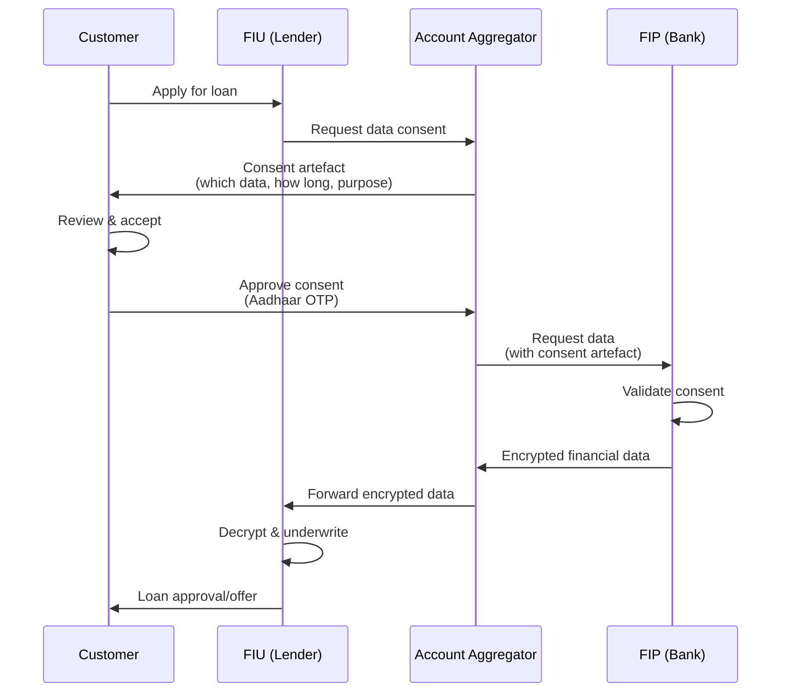
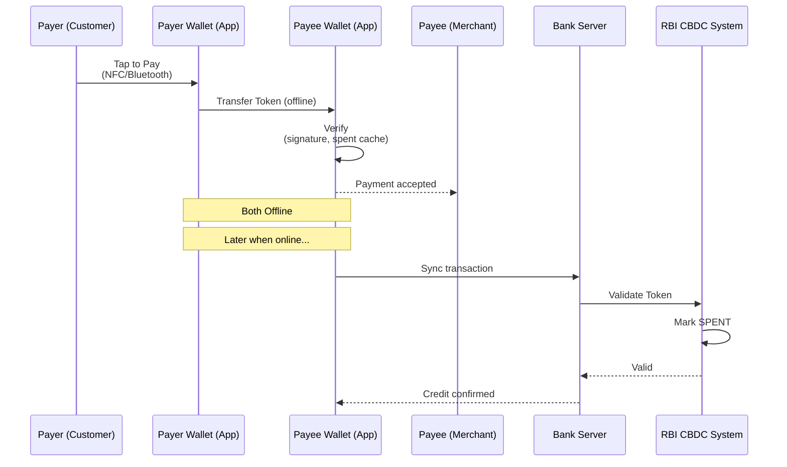

# Chapter 04: Fintech and Emerging Trends

## Learning Objectives

By the end of this chapter, you will be able to:

- Explain the Account Aggregator (AA) framework and its consent artefact mechanism
- Understand Open Banking under NDHP (National Data Health Platform)
- Describe the Digital Rupee (CBDC) architecture — token-based, dual offline, wholesale vs retail
- Analyze RegTech and SupTech developments including RBI's DAKSH platform
- Compare neo bank architecture (Jupiter, Fi) with legacy banks
- Understand lending tech (underwriting engines, credit scoring 2.0)
- Explain blockchain applications in trade finance
- Describe UPI-ATM interoperability and 3D Secure 2.0
- Analyze IoT applications in banking

## Theory

### 1. Account Aggregator (AA) Framework

#### 1.1 Overview

The Account Aggregator (AA) framework is a RBI-licensed data sharing system that enables individuals to securely share their financial data across regulated entities. It follows the concept of "consent-based data sharing without sharing raw data."

The framework was created by RBI under the Master Direction dated September 2, 2016 (updated 2021). The structure involves four key participants:

```
+------------------+     +------------------+
|   FIP (Financial |     |  FIU (Financial  |
|  Information     |     |  Information     |
|  Provider)       |     |  User)           |
|  Bank/MF/Demat   |     |  Lender/Insurer  |
+--------+---------+     +---------+--------+
         |                         |
         | 1. Data via API         | 2. Request Data
         +-------+---------+------+
                 |         |
        +--------v-+   +---v--------+
        |  AA 1    |   |   AA 2     |
        | (RBI     |   |  (RBI      |
        | Licensed)|   |  Licensed) |
        +----+-----+   +-----+------+
             |               |
        +----v---------------v------+
        |       Consent Manager     |
        |  (Consent Artefact Store) |
        +---------------------------+
```

**Key Participants:**

| Participant | Role | Example |
|-------------|------|---------|
| **AA (Account Aggregator)** | Licensed data intermediary (NBFC) | Sahamati, Finvu, CAMS Finserv |
| **FIP (Financial Information Provider)** | Holds user data (banks, MFs, insurers) | SBI, HDFC, ICICI, NSDL, CDSL |
| **FIU (Financial Information User)** | Consumes data (lenders, wealth managers) | Banks, NBFCs, fintechs |
| **Customer** | Data owner — controls consent | Individual user |

#### 1.2 Consent Artefact

The consent artefact is the core technical mechanism of the AA framework — a machine-readable JSON document specifying exactly what data can be shared, for how long, and with whom.

**Consent Artefact Structure (JSON):**

```json
{
  "consentId": "c4a1b2c3-1234-5678-9abc-def012345678",
  "consentStart": "2026-07-06T10:30:00Z",
  "consentEnd": "2026-08-05T10:30:00Z",
  "consentMode": "VIEW",
  "fetchType": "ONETIME",
  "fiTypes": ["DEPOSIT", "RECURRING_DEPOSIT"],
  "dataLife": {
    "unit": "MONTH",
    "value": 6
  },
  "frequency": {
    "unit": "HOUR",
    "value": 4
  },
  "DataConsumer": {
    "id": "FIU@lender.bank",
    "type": "FIU"
  },
  "fiDataRange": {
    "from": "2025-01-01T00:00:00Z",
    "to": "2026-07-06T23:59:59Z"
  },
  "Purpose": {
    "code": "101",
    "text": "Loan underwriting"
  },
  "encryptedDetail": {
    "key": "base64_public_key",
    "keyType": "CERTIFICATE"
  }
}
```

**Consent Artefact Key Parameters:**

| Parameter | Description |
|-----------|-------------|
| consentId | UUID v4 — unique identifier |
| consentStart/End | Validity window for consent |
| fetchType | ONETIME / PERIODIC |
| fiTypes | Account types: DEPOSIT, EQUITY, MUTUAL_FUND, INSURANCE, etc. |
| dataLife | How long FIU can retain data |
| frequency | How often data can be refreshed |
| DataConsumer | FIU identifier (must be registered) |
| Purpose | Reason for data request (101 = lending, 102 = wealth mgmt) |

**Technical Flow:**

```
1. Customer wants a loan from FIU (e.g., a bank)
2. FIU requests data via AA
3. AA generates consent artefact and presents to customer (mobile app)
4. Customer reviews:
   ├── Which data (accounts, transactions, balances)
   ├── How long (30 days, 1 year)
   ├── Purpose (loan underwriting)
   └── Data consumer (the lender)
5. Customer provides Aadhaar OTP / net banking auth to approve
6. Consent artefact is encrypted and stored at AA
7. AA fetches data from FIPs using the consent
8. Data flows from FIP -> AA -> FIU (encrypted end-to-end)
9. FIU uses data for underwriting
```

**Sahamati:** The collective of AA ecosystem participants (industry body). Sahamati sets technical standards, certifies AAs, and maintains the ReBIT specification.

### 2. Open Banking and NDHP (National Data Health Platform)

#### 2.1 Open Banking in Indian Context

Open Banking is the practice of sharing financial data securely through APIs, with customer consent. India's approach combines AA (for data sharing) with UPI (for payment initiation).

**Open Banking Architecture:**

```
+----------------------------------------------+
|           Open Banking Ecosystem             |
+------------------+---------------------------+
|                  |                           |
|   Data Layer    |    Transaction Layer       |
|   (AA Framework) |    (UPI / Payment APIs)   |
|                  |                           |
|  - Account Data  |  - Payment Initiation     |
|  - Transaction   |  - Fund Transfer          |
|  - Balance       |  - Mandate Management     |
|  - Statement     |  - Bill Payments          |
+------------------+---------------------------+
```

**Key Open Banking APIs (developed by ReBIT — Reserve Bank Information Technology):**

| API Category | Description | Standards |
|-------------|-------------|-----------|
| Account Information | Balance, transactions, statement | AA Framework APIs |
| Payment Initiation | UPI / NEFT / IMPS via API | UPI 2.0 APIs |
| Product Information | Loan products, deposit rates | Open API specs |
| KYC Verification | e-KYC, Aadhaar check | UIDAI APIs |
| Credit Information | CIBIL/Bureau data | AA + CIC APIs |

#### 2.2 NDHP (National Data Health Platform)

NDHP (also called **Account Aggregator Network**) is India's federated data-sharing network. It is the largest production deployment of the AA framework globally.

**NDHP Technical Stack:**

```
NDHP Components:
├── Identity Layer: Aadhaar-based consent authentication
├── Consent Layer: Digital consent artefacts (machine-readable)
├── Data Layer: Encrypted data exchange between FIP-FIU
├── Discovery Layer: Find accounts linked to a user
├── Monitoring Layer: Real-time consent tracking
└── Settlement Layer: Fee settlement between AAs, FIPs, FIUs
```

**Current Status (2026):** NDHP has over 100 FIPs (including all major banks), 150+ FIUs, and 10+ licensed AAs. Over 5 crore consented accounts are live.

### 3. Digital Rupee / e-Rupee (CBDC)

#### 3.1 CBDC Overview

Central Bank Digital Currency (CBDC) is a digital form of fiat currency issued by RBI. India's CBDC is called **Digital Rupee** or **e-Rupee** (e₹).

**Two Versions:**

| Type | Symbol | Target | Purpose |
|------|--------|--------|---------|
| e₹-W (Wholesale) | e₹-W | Interbank settlement | Settlement of secondary market transactions in government securities |
| e₹-R (Retail) | e₹-R | General public | Retail transactions, person-to-person, person-to-merchant |

#### 3.2 CBDC Architecture — Token-Based Model

The Digital Rupee uses a token-based model (as opposed to the account-based model of traditional digital payments).

**Token-Based vs Account-Based:**

```
Account-Based (Traditional Banking):
Account X -> Debit -> Credit -> Account Y
├── Identity required to transact
├── Bank maintains ledger
└── Requires internet banking/mobile app

Token-Based (CBDC):
Token (e₹) -> Transfer -> Token (e₹)
├── Token is the money (digital bearer instrument)
├── No identity required for transfer
├── Peer-to-peer (offline capable)
└── Anonymity (for small values)
```

**CBDC Token Structure:**

```
e₹ Token:
├── Token ID: UUID (unique, non-reusable)
├── Denomination: Rs. 10 / 50 / 100 / 200 / 500
├── Issuer: RBI (digital signature)
├── Serial Number: Issuer-specific
├── Issuance Timestamp: When token was minted
└── Status: UNSPENT / SPENT / CANCELLED

Digital Signature (RBI signs each token):
  Sign(SK_RBI, TokenID || Denom || Serial) = TokenSignature
```

#### 3.3 CBDC Technology Stack

```
+------------------------------------------+
|   RBI CBDC Core System (Token Minting)   |
|   - Token generation with RSA/ECC signing |
|   - Token lifecycle management            |
|   - Anti-counterfeit (digital signature)  |
+--------------------+---------------------+
                     |
+--------------------v---------------------+
|   CBDC Distribution Infra (Banks)        |
|   - Token distribution to customer wallets|
|   - Token redemption (Cash <-> CBDC)      |
|   - KYC for wallet (tiered)              |
+--------------------+---------------------+
                     |
+---------+----------+----------+----------+
|         |                     |          |
|  +------v-------+    +-------v------+   |
|  | Retail Wallet|    | Merchant     |   |
|  | (Mobile App) |    | Wallet       |   |
|  | - Token Store|    | (POS + App)  |   |
|  | - Offline TXN|    | - Settlement |   |
|  +------+-------+    +------+-------+   |
|         |                     |          |
|  +------v-----------------------v---+   |
|  |    Dual Offline Transaction       |   |
|  |  (NFC/Bluetooth, no internet)     |   |
|  +-----------------------------------+   |
+------------------------------------------+
```

#### 3.4 Dual Offline CBDC

A key feature of CBDC is the ability to transact without internet connectivity — using NFC or Bluetooth between two devices.

**Dual Offline Technical Flow:**

```
1. Payer and Payee are both offline (no internet)
2. Payer app sends token to Payee app via NFC/Bluetooth
3. Payee app verifies:
   ├── RBI digital signature on token (pre-verified)
   ├── Token not in local spent cache
   └── Amount matches
4. Payee app stores token locally
5. When connectivity is restored:
   ├── Payee app syncs token to bank server
   ├── Bank validates token against RBI
   ├── RBI marks token as SPENT
   └── Payee account credited (or token re-issued)
```

**Offline Limits (RBI proposed):**
- Per transaction: Rs. 500 (offline)
- Cumulative limit: Rs. 2,000 before online sync
- Wallet balance limit: Rs. 10,000 (same as CBDC overall)

#### 3.5 CBDC Comparison with UPI

| Feature | CBDC (e₹) | UPI |
|---------|-----------|-----|
| Issuer | RBI (central bank liability) | NPCI (payment system) |
| Settlement | Final (like cash) | Final after clearing |
| Offline | Yes (dual offline) | No (requires internet) |
| Anonymity | Small value (anonymous) | No (traceable) |
| Intermediary | Not required for P2P | PSP required |
| Programmability | Yes (smart contracts) | Limited |
| Interest | None (like cash) | N/A (payment layer) |
| Wallet | CBDC wallet | Banking app |

### 4. RegTech and SupTech

#### 4.1 RegTech (Regulatory Technology)

RegTech uses technology to manage regulatory compliance processes efficiently.

**RegTech Applications in Banking:**

| Area | Technology | Description |
|------|-----------|-------------|
| AML/CFT | AI/ML transaction monitoring | Real-time suspicious transaction detection |
| KYC | Digital e-KYC, Video KYC | Automated identity verification |
| Regulatory Reporting | XBRL, API-based | Automated filing to RBI |
| Risk Management | AI-based scenario analysis | Automated stress testing |
| Compliance Monitoring | RPA bots | Automated control testing |
| Fraud Detection | ML models | Real-time fraud scoring |
| Trade Surveillance | NLP, graph analytics | Market abuse detection |

**RegTech Architecture:**

```
+----------------+  +----------------+  +----------------+
| Transaction    |  | Customer Data  |  | Market Data    |
| Data (CBS)     |  | (CRM/KYC)      |  | (External feeds)|
+-------+--------+  +-------+--------+  +-------+--------+
        |                   |                   |
+-------v-------------------v-------------------v-------+
|                RegTech Platform                        |
|  +--------------------------------------------------+  |
|  | Rule Engine (Business rules + ML models)         |  |
|  | ├── AML Rules (PEP, Sanctions, High-risk)        |  |
|  | ├── Fraud Rules (velocity, device, geo)          |  |
|  | ├── KYC Rules (document expiry, risk category)    |  |
|  | └── Regulatory Rules (CRAR, LCR, NSFR)           |  |
|  +--------------------------------------------------+  |
|  | Reporting Engine (XBRL/PDF/CSV)                   |  |
+-------+-------------------+---------------------------+
        |                   |
+-------v-------+    +------v--------+
| RBI / Regulator|    | Internal     |
| (AXIS, DAKSH)  |    | Compliance   |
+----------------+    +--------------+
```

#### 4.2 SupTech (Supervisory Technology)

SupTech refers to technology used by regulators (RBI) for supervision. RBI's key SupTech initiatives:

**RBI's DAKSH Platform:**

DAKSH (Data Analytics, Knowledge, and Supervision Hub) is RBI's SupTech platform for data-driven supervision.

```
DAKSH Modules:
├── Data Aggregation: Automated collection from banks via API
│   ├── XBRL-based statutory returns
│   ├── CBS data extracts (daily)
│   └── Real-time transaction monitoring
├── Analytics Engine:
│   ├── Anomaly detection (AI/ML)
│   ├── Peer comparison analytics
│   ├── Off-site surveillance (OSS)
│   └── Trend analysis (NPA, capital, liquidity)
├── Visualization Dashboards:
│   ├── Financial health indicators
│   ├── Cybersecurity posture (color-coded)
│   └── Compliance status tracking
└── Reporting:
    ├── Automated inspection reports
    ├── Risk assessment reports (RAR)
    └── Financial stability reports
```

**Other RBI SupTech Initiatives:**

| Initiative | Description |
|-----------|-------------|
| **CIMS** (Central Information Management System) | Centralized data repository for banks |
| **XBRL Portal** | Standardized regulatory filing |
| **SIMS** (Supervisory Incident Management System) | Cyber incident reporting |
| **E-Kuber** | Government's payment and settlement system |
| **CKT** (Central Know Your Customer) | KYC registry (now merged with CERSAI) |

#### 4.3 Key Regulations Driving RegTech

| Regulation | Requirement | RegTech Solution |
|-----------|-------------|-----------------|
| PMLA Rules 2005 | Customer due diligence, suspicious transaction reporting | Automated AML screening |
| FATF Recommendations | AML/CFT compliance | Transaction monitoring |
| RBI KYC Master Directions | Video KYC, periodic updation | Digital KYC platform |
| FEMA | Foreign exchange reporting | Automated forex compliance |
| Data Localization (RBI 2018) | Payment data must be stored in India | Data residency tracking |
| CIC (Credit Information Companies) Act | Credit data reporting | Automated CIBIL reports |

### 5. Neo Banks

#### 5.1 Neo Bank Model

Neo banks are digital-only banks without physical branches. In India, neo banks partner with licensed banks for the banking license (they operate as "Banking-as-a-Service" or BaaS).

**Key Indian Neo Banks:**

| Neo Bank | Partner Bank | Focus |
|----------|-------------|-------|
| **Jupiter** | SBI, ICICI, Federal | Savings, investments |
| **Fi** (by Epifi) | Federal Bank | Savings, mutual funds, US stocks |
| **Niyo** | RBL, DCB, YES Bank | Salary accounts, forex |
| **Open** | ICICI, Axis | SME/Startup banking |
| **RazorpayX** | RBL, Yes Bank | Business banking |
| **Kotak 811** | Kotak Mahindra | Digital savings (full bank) |

#### 5.2 Neo Bank Architecture vs Legacy Bank

```
Legacy Bank Architecture (Monolithic):
+------------------------------------------+
|      CBS (T24 / Finacle / BaNCS)         |
|  (All modules in one system)              |
| - Customer Management                     |
| - Account Management                      |
| - Transactions                            |
| - Loans                                   |
| - Cards                                   |
| - Reporting                               |
| - All tightly coupled                     |
+------------------------------------------+
         |  Hard to change
         |  Slow to deploy
         v
+------------------------------------------+
|    Channels (Internet, Mobile, Branch)    |
+------------------------------------------+

Neo Bank Architecture (Microservices):
+-------+ +------+ +-------+ +------+ +------+
| Auth  | | Acct | | TXN   | | Lend | | Card |
| Srv   | | Srv  | | Srv   | | Srv  | | Srv  |
+---+---+ +--+---+ +---+---+ +--+---+ +--+---+
    |         |         |         |        |
+---v---------v---------v---------v--------v---+
|            API Gateway / BaaS Layer           |
|         (Kong, Apigee, AWS API GW)            |
+---+---------+---------+---------+--------+---+
    |         |         |         |        |
+---v---------v---------v---------v--------v---+
|    Partner Bank's CBS (Finacle/ BaNCS)        |
|    (Core ledger, GL, settlements)             |
+-----------------------------------------------+
```

**Key Architectural Differences:**

| Aspect | Legacy Bank | Neo Bank |
|--------|-------------|----------|
| Architecture | Monolithic / SOA | Microservices (K8s) |
| Deployment | Quarterly releases | Continuous (daily) |
| Tech Stack | Java/COBOL, Oracle | Go/Node.js, PostgreSQL, Kafka |
| Data | Centralized Oracle RAC | Distributed/Sharded |
| Channels | Integrated in CBS | API-first, headless |
| UX | Transactional | Gamified, engaging |
| Cost to Acquire | Rs. 500-1000 per customer | Rs. 50-100 per customer |
| Product Launch | 3-6 months | 2-4 weeks |

#### 5.3 Fi Banking App Technical Stack (Example)

```
Fi Tech Stack (Representative):
├── Frontend: React Native (iOS + Android)
├── Backend: Go microservices on Kubernetes
├── Database: PostgreSQL (sharded by customer_id)
├── Queue: Apache Kafka for event streaming
├── Cache: Redis for session + rate limiting
├── Partner Integration: Federal Bank CBS (Finacle) via APIs
├── AA Integration: For account aggregation
├── UPI: NPCI UPI APIs through partner bank
├── Security: Aadhaar e-KYC, device binding, biometric auth
└── Analytics: Apache Spark, Redshift for real-time analytics
```

### 6. Lending Technology

#### 6.1 Underwriting Engines

Modern lending tech replaces manual underwriting with automated decision engines that process 100+ data points in seconds.

**Underwriting Engine Architecture:**

```
Data Inputs:
├── Credit Bureau: CIBIL/Experian/Equifax (credit score + history)
├── Bank Statements: via AA (6-12 months)
├── Income Proof: Salary slips, IT returns (OCR + AI validation)
├── GST Data: GST returns (for businesses)
├── Demographic Data: Age, location, occupation
├── Digital Footprint: e-commerce data, social media (optional)
├── Device Data: Device fingerprint, location consistency
└── Employment Data: Employment verification APIs

Underwriting Engine (Rules + ML):
├── Rule Engine: Pre-qualification rules (age, bureau score min)
├── ML Score: Custom credit scoring model
│   ├── XGBoost / LightGBM on 500+ features
│   ├── Model trained on historical repayment data
│   └── Output: Probability of Default (PD)
├── Affordability Calculator: DTI (Debt-to-Income) ratio
├── Fraud Detection: ML-based anomaly detection
└── Policy Engine: Risk segment -> product/rate offered

Output:
├── Approved: Loan amount, interest rate, tenure
├── Referred: Manual underwriting review
└── Rejected: Decline reason (mandatory)
```

#### 6.2 Credit Scoring 2.0

Traditional credit scoring (CIBIL 300-900) relies on credit history. Credit Scoring 2.0 uses alternative data.

**Traditional vs Alternative Credit Scoring:**

```
Traditional Credit Score:
├── Factors: Payment history (35%), Credit utilization (30%),
│            Credit age (15%), Credit mix (10%), New inquiries (10%)
├── Coverage: ~40% of Indian adults (with formal credit history)
└── Limitations: Excludes new-to-credit, gig workers, rural

Alternative Credit Score (2.0):
├── Data Sources:
│   ├── UPI transaction history
│   ├── Recharge and bill payment patterns
│   ├── GST data (business cash flows)
│   ├── E-commerce purchase patterns
│   ├── Telecom data (bill payment, recharge regularity)
│   └── Social media signals (optional, consent-based)
├── Coverage: ~80% of Indian adults
└── Example: Experian Boost, OneScore
```

**Alternative Scoring Model (Example):**

```
Feature Engineering for UPI-based Score:
├── Transaction volume (monthly average)
├── Income inflow patterns (regular salary credits)
├── Expense categories (% on food, travel, utilities)
├── Savings behaviour (periodic transfers to FD/savings)
├── Repayment behaviour (SIPs, insurance premiums paid on time)
├── Transaction velocity (high velocity = potential stress)
└── Peer group comparison (similar demographics)
```

### 7. Blockchain in Trade Finance

#### 7.1 Traditional vs Blockchain Trade Finance

Trade finance involves multiple parties (importer, exporter, banks, customs, shipping) with significant paperwork. Blockchain provides a shared, immutable ledger.

```
Traditional Trade Finance:
├── Paper: 20+ documents for a single transaction
├── Time: 5-10 days for document processing
├── Fraud: Invoice fraud, double financing
├── Cost: 3-5% of transaction value
└── Participants: Disconnected systems

Blockchain Trade Finance:
├── Digital: Smart contracts for LC (Letter of Credit)
├── Time: Minutes to hours
├── Trust: Immutable record, fraud-resistant
├── Cost: &lt; 1% of transaction value
└── Participants: Shared ledger, real-time updates
```

#### 7.2 How Blockchain Trade Finance Works

```
1. Exporter and Importer agree on terms
2. Smart contract created on blockchain:
   ├── LC terms (amount, shipping date, quality specs)
   ├── Conditional: Payment released on proof of shipment
   └── Multi-signature: Requires bank + customs + shipping approval

3. Importer's Bank issues LC on blockchain
   └── Smart contract records LC as a digital asset

4. Exporter ships goods
   ├── Shipping company records Bill of Lading on blockchain
   └── GPS tracking data fed into smart contract

5. Customs verification
   └── Customs officer digitally signs on blockchain

6. Automatic Payment Release
   ├── Smart contract verifies all conditions met
   ├── Payment released from Importer's bank to Exporter's bank
   └── All parties have immutable audit trail
```

**Blockchain Platforms Used by Indian Banks:**

| Platform | Banks | Use Case |
|----------|-------|----------|
| **InTrade** (Infosys) | SBI, ICICI, Axis | Trade finance network |
| **Corda** (R3) | HDFC, Yes Bank | LC, supply chain finance |
| **Hyperledger Fabric** | Multiple PSBs | Trade finance, remittances |
| **IBA Trade Platform** | 15+ banks | Invoice financing, bill discounting |

### 8. UPI-ATM Interoperability

#### 8.1 Cardless Cash Withdrawal via UPI

RBI and NPCI have enabled UPI-based ATM withdrawals — customers can withdraw cash without a physical debit card.

**Technical Flow:**

```
1. Customer selects "UPI ATM" on ATM screen
2. ATM displays QR code on screen
3. Customer scans QR code with UPI app (GPay/PhonePe/PayTM)
4. UPI app validates ATM location, amount
5. Customer enters UPI PIN
6. Transaction flows:
   ├── UPI App -> PSP -> NPCI UPI -> Issuer Bank
   ├── Issuer bank debits savings account
   └── UPI Ref No generated
7. ATM receives approval signal
8. ATM dispenses cash
9. Customer gets UPI confirmation on phone
```

**Key Technical Changes:**
- ATM software updated to display QR code
- ATM connected to UPI switch (via NPCI)
- No card reader dependency
- No PIN entry on ATM keypad
- Transaction limit: Rs. 5,000 per transaction (UPI rules apply)

#### 8.2 Interoperability Benefits

| Aspect | Traditional ATM | UPI-ATM |
|--------|---------------|---------|
| Authentication | Physical card + PIN | Phone + UPI PIN |
| Forgery Risk | Card skimming, PIN theft | No card, device auth |
| International | Works with cards | Works with UPI (domestic) |
| Cost to Bank | Card cost (Rs. 30-150) | Zero (digital) |
| Accessibility | Anyone with card | Anyone with UPI app |

### 9. 3D Secure 2.0

#### 9.1 Overview

3D Secure 2.0 (3DS 2.0) is the latest version of the authentication protocol for card-not-present (CNP) transactions — online payments.

**3DS 1.0 vs 2.0:**

| Feature | 3DS 1.0 | 3DS 2.0 |
|---------|---------|---------|
| User Experience | Redirect to ACS page | Frictionless (in-app) |
| Data Shared | Only card number | 150+ data points |
| Auth Method | Static password/OTP | Risk-based (biometric, OTP, or none) |
| Mobile Support | Poor (redirect) | Excellent (native SDK) |
| Transaction Time | 20-40 seconds | 2-5 seconds |
| Conversion Rate | 60-70% (drop-offs) | 90-95% |
| Message Format | XML (SOAP) | JSON (REST) |

**Data Points in 3DS 2.0:**

```
3DS Server collects 150+ data points:
├── Cardholder Account Info
│   ├── Account age, password changes, transaction history
│   └── Device registration date
├── Device Info
│   ├── Device fingerprint (screen, OS, browser)
│   ├── IP address, geolocation
│   └── Device language, timezone
├── Transaction Info
│   ├── Amount, currency, merchant category
│   ├── Shipping address match
│   └── Items in cart (digital/physical)
└── Behavioral Biometrics
    ├── Typing speed
    ├── Mouse movement patterns
    └── Touch pressure (mobile)
```

**3DS 2.0 Flow (Frictionless):**

```
1. Customer initiates payment at merchant
2. Merchant sends payment + 150+ data points to Acquirer
3. Acquirer sends to Directory Server (card network)
4. Directory Server routes to Issuer's ACS (Access Control Server)
5. ACS runs risk engine on 150+ data points
6. If low risk -> Frictionless (no challenge, customer not interrupted)
7. If medium risk -> Challenge (biometric/OTP)
8. If high risk -> Transaction declined
9. Result sent back through network
```

### 10. IoT in Banking

#### 10.1 IoT Applications

Internet of Things (IoT) in banking enables physical devices to interact with banking systems.

| Application | IoT Device | Banking Interface |
|-------------|-----------|-------------------|
| ATM Predictive Maintenance | Vibration sensors | CMS (replenishment scheduling) |
| Branch Energy Management | Smart meters, occupancy sensors | Energy cost optimization |
| Fleet Management (Cash Vans) | GPS trackers, fuel sensors | CMS (trip monitoring) |
| Wearable Payments | Smartwatch, fitness band | Tokenized card (NFC) |
| Beacon-based Offers | BLE beacons in branches | CRM (personalized offers) |
| Smart ATMs | Camera, proximity sensors | CBS (personalized welcome) |
| Inventory Management | RFID on locker keys | Branch operations |
| Connected Car Payments | In-dash NFC | Fuel, toll, parking payments |

**IoT Architecture for Banking:**

```
+----------------+     +----------------+
| IoT Devices    |     | Edge Gateway   |
| (Sensors, GPS, |     | (Protocol      |
| Cameras, RFID) |     |  Converter)    |
+-------+--------+     +-------+--------+
        |                       |
        | MQTT / CoAP / HTTP    | TLS 1.2+
+-------v-----------------------v--------+
|            IoT Platform                |
|   (AWS IoT / Azure IoT / On-prem)      |
|   - Device Registry                    |
|   - Data Ingestion (Kafka)             |
|   - Rule Engine                        |
|   - Event Processing                   |
|   - Device Management (OTA updates)    |
+------------------+--------------------+
                   |
+------------------v--------------------+
|            Banking Integration         |
|   - CBS (account updates)              |
|   - CMS (cash management)             |
|   - CRM (customer alerts)             |
|   - Risk (anomaly detection)          |
+---------------------------------------+
```

#### 10.2 IoT Security in Banking

```
IoT Security Considerations:
├── Device Authentication: PKI certificates per device
├── Secure Boot: TPM (Trusted Platform Module) on gateways
├── Encrypted Communication: TLS / DTLS for all device traffic
├── Firmware Signing: Only signed firmware can be installed
├── Device Lifecycle: Decommission process for retired devices
├── Data Minimization: Only necessary data collected
└── Network Segmentation: IoT devices in separate VLAN
```

### 11. Architecture Diagrams

#### Account Aggregator Consent Flow



#### CBDC Dual Offline Transaction



## Examples (Exam-Style MCQs)

**Example 1:**
In the Account Aggregator framework, which entity is licensed by RBI as the data intermediary?

A) FIP
B) FIU
C) AA
D) Sahamati

<details>
<summary>Answer</summary>
**Answer: C) AA**

Account Aggregators (AAs) are RBI-licensed NBFCs that act as consent-based data intermediaries between FIPs (data providers) and FIUs (data users). Sahamati is the industry body, not a licensed AA.
</details>

**Example 2:**
What is the key difference between wholesale (e₹-W) and retail (e₹-R) CBDC?

A) e₹-W uses blockchain, e₹-R uses centralized database
B) e₹-W is for interbank settlement, e₹-R is for public transactions
C) e₹-W has offline capability, e₹-R does not
D) e₹-W is token-based, e₹-R is account-based

<details>
<summary>Answer</summary>
**Answer: B) e₹-W is for interbank settlement, e₹-R is for public transactions**

e₹-W (Wholesale) is used for interbank settlement of government securities. e₹-R (Retail) is for the general public. Both are token-based and both have offline capability in the roadmap.
</details>

**Example 3:**
What is RBI's DAKSH platform primarily used for?

A) Retail payment processing
B) Data-driven supervisory technology (SupTech)
C) Customer complaint resolution
D) Aadhaar authentication

<details>
<summary>Answer</summary>
**Answer: B) Data-driven supervisory technology (SupTech)**

DAKSH (Data Analytics, Knowledge, and Supervision Hub) is RBI's SupTech platform for data-driven supervision of banks through automated data collection, analytics, and visualization.
</details>

**Example 4:**
Which data sharing protocol does 3D Secure 2.0 use?

A) XML (SOAP)
B) JSON (REST)
C) ISO 8583
D) Apache Thrift

<details>
<summary>Answer</summary>
**Answer: B) JSON (REST)**

3DS 2.0 uses JSON (REST) messaging — a significant upgrade from 3DS 1.0's XML (SOAP). This enables faster, lighter-weight communication between merchant, ACS, and issuer.
</details>

**Example 5:**
In the AA framework, what does a consent artefact with fetchType "PERIODIC" and frequency "4 HOURS" allow?

A) One-time data fetch
B) Data refresh every 4 hours within the consent period
C) Data access for exactly 4 hours total
D) Data access for 4 different FIUs

<details>
<summary>Answer</summary>
**Answer: B) Data refresh every 4 hours**

Periodic fetch with a frequency of 4 hours means the FIU can refresh data from the FIP every 4 hours during the consent validity period. This is used for monitoring loan accounts or portfolio tracking.
</details>

## Summary

The Account Aggregator framework is India's consent-based data sharing system with four participants: AA (RBI-licensed intermediary), FIP (data provider), FIU (data user), and Customer (data owner). The consent artefact is a machine-readable JSON document specifying data scope, duration, purpose, and fetch frequency.

NDHP (National Data Health Platform) is the production AA network with over 100 FIPs. The Digital Rupee (CBDC) uses a token-based model (digital bearer instrument) with dual offline transaction capability via NFC. Wholesale (e₹-W) targets interbank settlement while Retail (e₹-R) targets public transactions.

RegTech uses AI/ML for automated compliance (AML, KYC, reporting). RBI's DAKSH platform is the SupTech system for data-driven supervision. Neo banks (Jupiter, Fi) use microservices architecture on Kubernetes with BaaS partnerships, while legacy banks use monolithic CBS. Underwriting engines use ML models (XGBoost) with alternative data for Credit Scoring 2.0, covering 80% of Indian adults.

Blockchain in trade finance (InTrade, Corda, Hyperledger Fabric) enables smart contract-based LC with reduced costs and fraud. UPI-ATM interoperability enables cardless cash withdrawal via QR code and UPI PIN. 3DS 2.0 uses 150+ data points for risk-based authentication (frictionless or challenge). IoT in banking includes ATM monitoring, wearable payments, and connected car payments.

## Practical Takeaways

1. **AA Integration:** Build AA API integration early — it is becoming mandatory for all banks (RBI directive). Implement the consent artefact lifecycle correctly (create -> approve -> fetch -> revoke).

2. **CBDC Wallet Security:** Since CBDC tokens are bearer instruments, wallet security is critical. Implement hardware-backed key storage (SE/TEE) on mobile devices. Lost phone = lost tokens if not backed up.

3. **Neo Bank Architecture:** Use the strangler fig pattern when migrating from legacy CBS to microservices. Don't attempt big-bang replacement of Finacle/T24 — build BaaS layer incrementally.

4. **Credit Scoring 2.0:** Start with UPI transaction data as an alternative data source. Analyze transaction regularity, income patterns, and bill payments. Monitor model drift — alternative data models degrade faster than traditional ones.

5. **3DS 2.0 Frictionless Rate:** Aim for 80%+ frictionless rate by sending all 150+ data points to the ACS. The more data you send, the less likely the issuer is to challenge the transaction.

6. **Blockchain Trade Finance:** Start with invoice financing (simpler use case) before moving to LC. Ensure all participants have node access — a consortium blockchain is only useful if all parties are connected.

7. **UPI-ATM Deployment:** ATM software upgrade is the critical path. Work with ATM switch vendors (Diebold NCR, Hitachi) to enable QR code display and UPI transaction support.

## Chapter Quiz

**Q1:** What is the maximum per-transaction and cumulative balance limit for CBDC dual-offline transactions?

A) Rs. 200 per txn, Rs. 1000 cumulative
B) Rs. 500 per txn, Rs. 2000 cumulative
C) Rs. 1000 per txn, Rs. 5000 cumulative
D) Rs. 2000 per txn, Rs. 10000 cumulative

<details>
<summary>Answer</summary>
**Answer: B) Rs. 500 per txn, Rs. 2000 cumulative**

RBI proposed Rs. 500 per transaction and Rs. 2,000 cumulative offline limit for CBDC dual-offline. After reaching the cumulative limit, the wallet must sync online before more offline transactions can be processed.
</details>

**Q2:** In the Account Aggregator framework, which organization develops the technical standards and certifies AAs?

A) RBI
B) NPCI
C) Sahamati
D) ReBIT

<details>
<summary>Answer</summary>
**Answer: C) Sahamati**

Sahamati is the industry collective (not-for-profit) that sets technical standards, certifies AAs, and maintains the ReBIT-developed AA specification. RBI licenses AAs, Sahamati sets standards.
</details>

**Q3:** Which technology architecture do neo banks predominantly use to enable rapid feature deployment?

A) Monolithic SOA
B) Mainframe with COBOL
C) Microservices on Kubernetes
D) Peer-to-peer network

<details>
<summary>Answer</summary>
**Answer: C) Microservices on Kubernetes**

Neo banks use microservices architecture (Go/Node.js on Kubernetes) for continuous deployment, scalability, and rapid feature releases. Legacy banks use monolithic SOA/mainframe systems.
</details>

**Q4:** What is the purpose of the "dataLife" parameter in an AA consent artefact?

A) How long the consent is valid for fetching data
B) How long the FIU can retain the fetched data
C) How long the AA stores the consent artefact
D) How long before the consent expires without use

<details>
<summary>Answer</summary>
**Answer: B) How long the FIU can retain the fetched data**

The "dataLife" parameter specifies how long the FIU (data consumer) can retain the financial data after fetching it. This is independent of the consent validity period ("consentEnd"). Data must be deleted after the dataLife period.
</details>

**Q5:** Which 3DS 2.0 authentication outcome occurs when the issuer's risk engine determines the transaction is low-risk?

A) Challenge (biometric/OTP required)
B) Frictionless (no user interaction)
C) Decoupled authentication
D) Transaction declined

<details>
<summary>Answer</summary>
**Answer: B) Frictionless (no user interaction)**

When the issuer's ACS (Access Control Server) determines the transaction is low-risk based on the 150+ data points, it returns a "Frictionless" result — the transaction proceeds without any additional authentication challenge to the customer.
</details>
