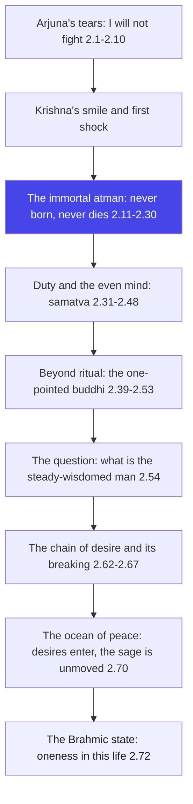
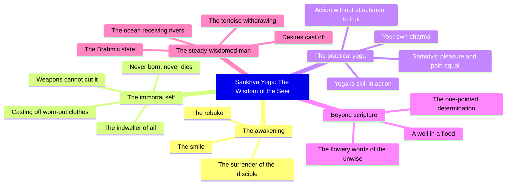

# Chapter 2: Sankhya Yoga — The Wisdom of the Seer

> "Krishna begins where all real teaching begins: not with comfort, but with the truth that you have never died."
> — The Osho Way

---

Arjuna sits on the floor of the chariot, weaponless, tearful, finished. And Krishna — the friend, the charioteer, the whole of the Gita in human form — begins to speak. He does not begin with a consolation. He begins with a shock: "You grieve for those who should not be grieved for, yet you speak words of wisdom." In one line, Krishna does what no therapist would dare: he refuses the tears. Not because the tears are wrong, but because they are aimed at the wrong target. Arjuna is weeping over bodies; the teaching will show him that the body was never the point.

This chapter is called Sankhya Yoga — the wisdom of the seer, the path of knowledge. It is the philosophical bedrock of the whole Gita: the teaching of the immortal self, the atman that was never born and will never die, the body that changes like clothes and seasons, the witness who watches it all. Then Krishna turns from the eternal to the practical: a warrior has a duty, a field has a purpose, and the one who stands balanced in pleasure and pain, gain and loss, victory and defeat, has already begun to be free. The chapter ends with the portrait of the sthitaprajna — the man of steady wisdom — whose mind is like the deep ocean, unmoved by the rivers of desire that flow into it.

Osho reads this chapter as the first real taste of meditation in the Gita. The atman is not a dogma to be believed; it is a dimension to be discovered. When Krishna says "the wise grieve not," he is not scolding — he is pointing. Grief is identification with the form; freedom is the discovery of the formless. And the famous command — "you have a right to action alone, never to its fruits" — is not a morality lesson; it is a method of living that burns the ego from inside. Do the act fully, and let the result fall where it may. That is the whole of karma yoga, and it is born in this chapter of wisdom.

## Learning Objectives

After completing this chapter you will be able to:

1. **Trace the shift from crisis to teaching** — understand how Krishna's first shock ("you speak words of wisdom yet you grieve") breaks Arjuna's identification with grief.
2. **Grasp the core of Sankhya wisdom** — explain the immortality of the atman, the metaphor of changing clothes, and why the wise grieve neither for the living nor the dead.
3. **Understand samatva, the even mind** — explain why balance in pleasure and pain, gain and loss, victory and defeat is called yoga, and why it frees action from bondage.
4. **Portray the sthitaprajna** — describe the man of steady wisdom from shlokas 2.54–2.72: his desires, his senses, his peace, and his presence.
5. **Distinguish knowing from hearsay** — see why Krishna rejects flowery ritualism and borrowed knowledge, and why the seer "knows" rather than "believes."
6. **Build a TypeScript tool** — create the Samatva Monitor, a runnable program that scores daily events as pleasure or pain events and computes your evenness of mind.

---

## Sankhya Yoga at a Glance

### The scene and the speakers

We are still on the field of Kurukshetra, still between the armies, with Sanjaya narrating to the blind king. The speakers are Krishna and Arjuna — and this chapter marks the moment the dialogue becomes a teaching. In the first chapter Arjuna spoke almost continuously; in this chapter, from shloka 2.11 onward, Krishna speaks without interruption for dozens of verses. The master has taken over. Sanjaya frames the conversation at 2.1, 2.9 and 2.10 — the smile of Krishna, the silence of Arjuna — and then the voice of the charioteer becomes the voice of the Gita.

### The Osho lens

Osho reads Sankhya Yoga as the awakening of the witness. Krishna's first word is not "believe" but "see": see the immortal in the mortal, the unchanging in the changing, the witness in the experiencer. The teaching moves in three layers: first the eternal (the atman that was never born), then the practical (duty, balance, skill in action), then the realised (the portrait of the sthitaprajna). Osho emphasises that Krishna is not arguing a philosophy so much as offering a transformation: every metaphor — clothes, the tortoise, the ocean — is an invitation to shift your centre from the body to the witness. Grief, says Krishna, is a case of mistaken identity.

### The structure of the chapter

This chapter of 72 shlokas moves in four movements:

1. **Movement 1: 2.1–2.10 — The rebuke and the surrender.** Krishna refuses the tears, Arjuna confesses confusion and asks to be taught, and Krishna smiles. The teaching can begin because the student has become empty.
2. **Movement 2: 2.11–2.30 — The immortal self.** The first discourse on the atman: no one was ever born, no one will ever die, the body is a garment, and weapons, fire, water and wind cannot touch the self.
3. **Movement 3: 2.31–2.53 — Duty, balance, and the one-pointed buddhi.** The warrior's dharma, the evenness of mind called yoga, the rejection of flowery ritualism, and the intellect that becomes immovable in the Self.
4. **Movement 4: 2.54–2.72 — The man of steady wisdom.** Arjuna asks the question every seeker asks — "what is the man of steady wisdom like?" — and Krishna paints the portrait: desireless, balanced, withdrawn like the tortoise, still like the ocean, and free in this very life.

### The three-framework note

In this chapter the three great paths of the Gita are born at once. The first movement plants Jnana Yoga — the knowledge of the atman. The third movement plants Karma Yoga — action without attachment, samatva in victory and defeat. And the closing portrait of the sthitaprajna — the man absorbed in the Self, free of craving — is the fruit of Bhakti, the love that has become total absorption. Osho's note: the Gita does not divide these paths into stages; it shows them as one movement of the same awakening, each supporting the others from the first chapter to the last.

## Traditional Reading vs Osho-Style Reading

| Dimension | Traditional reading | Osho-style reading |
|--------|---------------------|--------------------|
| Krishna's first rebuke | A correction of Arjuna's error, the start of doctrine | A shock designed to break identification with grief and open the door of seeing |
| The immortal atman | A metaphysical truth to be believed on scripture's authority | A dimension to be discovered in meditation; the witness inside you is it |
| Grief and the wise | The wise do not grieve because they know the Self | Grief is mistaken identity; the moment the witness wakes, the tears lose their object |
| Samatva (evenness) | A virtue and a duty of the disciplined man | The very definition of yoga — the skill of living with the ego removed |
| Ritual and the Vedas | Lower than knowledge, to be transcended in time | A warning that borrowed beliefs are worthless; only direct knowing frees |
| The sthitaprajna | The ideal sage described for imitation | A mirror held up so that you can recognise the depth already inside you |

## The Complete Text — All 72 Shlokas

### Shloka 2.1 — Krishna Sees the Tears

> सञ्जय उवाच |
> तं तथा कृपयाविष्टमश्रुपूर्णाकुलेक्षणम् |
> विषीदन्तमिदं वाक्यमुवाच मधुसूदनः

**Transliteration:** sañjaya uvāca . taṃ tathā kṛpayāviṣṭamaśrupūrṇākulekṣaṇam . viṣīdantamidaṃ vākyamuvāca madhusūdanaḥ

**Translation:** Sanjaya said: To him thus overcome with pity, his eyes full of tears and agitation, despondent, Madhusudana spoke these words.

**Osho Darshan:** The first sentence of the teaching names the student's condition with total clarity: tears, agitation, despondency. Osho says a master always begins by seeing exactly where you are — he does not begin from his own wisdom but from your condition. Krishna sees the tears and does not flinch; he has been waiting for this moment through the whole of the first chapter. The charioteer knows that the man is finally ready, and the first teaching is about to be spoken.

### Shloka 2.2 — Whence This Weakness?

> श्रीभगवानुवाच |
> कुतस्त्वा कश्मलमिदं विषमे समुपस्थितम् |
> अनार्यजुष्टमस्वर्ग्यमकीर्तिकरमर्जुन

**Transliteration:** śrībhagavānuvāca . kutastvā kaśmalamidaṃ viṣame samupasthitam . anāryajuṣṭamasvargyamakīrtikaramarjuna

**Translation:** The Blessed Lord said: Whence has this weakness come upon you in this moment of crisis, O Arjuna — this dejection unworthy of a noble soul, excluding heaven, productive of infamy?

**Osho Darshan:** "Whence?" — the master's first question is not a scolding but an inquiry. Krishna asks Arjuna to trace his weakness to its source, and in that tracing the weakness begins to dissolve. Osho says this is the whole method of awareness: never fight a state of mind, only investigate it. And notice the honesty of the rebuke: Krishna names the dejection "unworthy of a noble soul" — not to shame Arjuna, but to remind him of the height he is capable of. The master sees the peak even when the disciple sees only the mud.

### Shloka 2.3 — Do Not Yield to Impotence

> क्लैब्यं मा स्म गमः पार्थ नैतत्त्वय्युपपद्यते |
> क्षुद्रं हृदयदौर्बल्यं त्यक्त्वोत्तिष्ठ परन्तप

**Transliteration:** klaibyaṃ mā sma gamaḥ pārtha naitattvayyupapadyate . kṣudraṃ hṛdayadaurbalyaṃ tyaktvottiṣṭha parantapa

**Translation:** Do not yield to impotence, O Partha — it does not become you. Cast off this mean weakness of the heart and stand up, O scorcher of enemies.

**Osho Darshan:** "Stand up" — the first command of the Gita is not a philosophy but a posture. Osho says the body and the mind move together: the man who slumps will think slumped thoughts, and the man who stands begins to stand in his being. Krishna is not heartless; he is calling the heart back to its own strength. And the word "impotence" is chosen with care — this weakness is a refusal of power, a refusal of the very energy that Arjuna carries. The master refuses to let the student shrink.

### Shloka 2.4 — How Can I Fight Bhishma and Drona?

> अर्जुन उवाच |
> कथं भीष्ममहं सङ्ख्ये द्रोणं च मधुसूदन |
> इषुभिः प्रतियोत्स्यामि पूजार्हावरिसूदन

**Transliteration:** arjuna uvāca . kathaṃ bhīṣmamahaṃ saṅkhye droṇaṃ ca madhusūdana . iṣubhiḥ pratiyotsyāmi pūjārhāvarisūdana

**Translation:** Arjuna said: How, O Madhusudana, shall I fight in battle with arrows against Bhishma and Drona — both worthy of worship, O slayer of enemies?

**Osho Darshan:** Arjuna's objection is precise and human: you do not shoot arrows at the people you worship. Bhishma taught him, Drona trained him; they are fathers of his skill. Osho says this is the deepest riddle of the Gita: the ones who shaped you may be the ones you must surpass — and sometimes the surpassing feels like betrayal. But the teaching will not let Arjuna off with sentiment. Love that clings is not love; worship that prevents your growth is not worship. Krishna will take this very objection and turn it into the door.

### Shloka 2.5 — Alms Are Better Than Slaying Teachers

> गुरूनहत्वा हि महानुभावान्
> श्रेयो भोक्तुं भैक्ष्यमपीह लोके |
> हत्वार्थकामांस्तु गुरूनिहैव
> भुञ्जीय भोगान् रुधिरप्रदिग्धान्

**Transliteration:** gurūnahatvā hi mahānubhāvān śreyo bhoktuṃ bhaikṣyamapīha loke . hatvārthakāmāṃstu gurūnihaiva bhuñjīya bhogān rudhirapradigdhān

**Translation:** It is better, indeed, to eat even the food of alms in this world than to slay the most noble teachers. For having slain these teachers who seek wealth and pleasure, I would only enjoy enjoyments stained with blood.

**Osho Darshan:** The warrior would rather beg than kill his gurus — a confession that turns the whole scale of values upside down. Osho says there is something majestic here: the man who has known greatness refuses to buy his prosperity with the blood of greatness. And yet the teaching will go deeper: the true guru is not outside you; he is the inner light. The day you kill the outer guru by transcending him, the inner guru is born. Arjuna is still worshipping the statue; Krishna will show him the light that carved it.

### Shloka 2.6 — We Do Not Know Which Is Better

> न चैतद्विद्मः कतरन्नो गरीयो
> यद्वा जयेम यदि वा नो जयेयुः |
> यानेव हत्वा न जिजीविषामस्-
> तेऽवस्थिताः प्रमुखे धार्तराष्ट्राः

**Transliteration:** na caitadvidmaḥ kataranno garīyo yadvā jayema yadi vā no jayeyuḥ . yāneva hatvā na jijīviṣāmaḥ te.avasthitāḥ pramukhe dhārtarāṣṭrāḥ

**Translation:** We do not know which is better for us — whether we should conquer them, or they should conquer us. Those very sons of Dhritarashtra, after killing whom we would not wish to live, stand facing us.

**Osho Darshan:** "We do not know" — the confession of ignorance is Arjuna's first genuine philosophical act. Osho says the man who knows he does not know has already begun to know; the whole of science and the whole of meditation begin with this admission. And the tragedy is perfectly formed: the enemy is the one without whom life is not worth living — so victory and defeat are both losses. The intellect has reached its wall. Beyond that wall, only a different kind of knowing can speak.

### Shloka 2.7 — I Am Your Disciple; Teach Me

> कार्पण्यदोषोपहतस्वभावः
> पृच्छामि त्वां धर्मसम्मूढचेताः |
> यच्छ्रेयः स्यान्निश्चितं ब्रूहि तन्मे
> शिष्यस्तेऽहं शाधि मां त्वां प्रपन्नम्

**Transliteration:** kārpaṇyadoṣopahatasvabhāvaḥ pṛcchāmi tvāṃ dharmasammūḍhacetāḥ . yacchreyaḥ syānniścitaṃ brūhi tanme śiṣyaste.ahaṃ śādhi māṃ tvāṃ prapannam

**Translation:** My nature is overpowered by the taint of weakness; my mind is confused about dharma. I ask you: tell me decisively what is good for me. I am your disciple — instruct me, who have taken refuge in you.

**Osho Darshan:** This is the moment the Gita has been waiting for: the warrior becomes the disciple. Osho says the whole of the teaching depends on this single gesture — the surrender of the ego that thinks it knows. Arjuna has tried arguments, sentiment, sociology, fear; all have failed, and in the failure he does the only thing left: he asks. "I am your disciple" — the sentence is worth more than all the philosophy of the first chapter. The master can now speak, because the student has stopped pretending.

### Shloka 2.8 — No Kingdom Can Remove This Sorrow

> न हि प्रपश्यामि ममापनुद्याद्
> यच्छोकमुच्छोषणमिन्द्रियाणाम् |
> अवाप्य भूमावसपत्नमृद्धं
> राज्यं सुराणामपि चाधिपत्यम्

**Transliteration:** na hi prapaśyāmi mamāpanudyād yacchokamucchoṣaṇamindriyāṇām . avāpya bhūmāvasapatnamṛddhaṃ rājyaṃ surāṇāmapi cādhipatyam

**Translation:** I do not see that anything would remove this sorrow that burns up my senses — not even the attainment of an unrivalled, prosperous dominion on earth, or even lordship over the gods.

**Osho Darshan:** The insight here is worth a lifetime of philosophy: no outer attainment can cure an inner condition. Arjuna has discovered that the sorrow is not in the situation but in himself, and that the situation can be exchanged for the greatest prize in the universe without touching the sorrow. Osho says this discovery is the beginning of the spiritual search — the moment you know that pleasure and power are anaesthetics, not cures, the search turns inward. The symptom is incurable from outside; the cure is inside.

### Shloka 2.9 — I Will Not Fight

> सञ्जय उवाच |
> एवमुक्त्वा हृषीकेशं गुडाकेशः परन्तप |
> न योत्स्य इति गोविन्दमुक्त्वा तूष्णीं बभूव ह

**Transliteration:** sañjaya uvāca . evamuktvā hṛṣīkeśaṃ guḍākeśaḥ parantapaḥ . na yotsya iti govindamuktvā tūṣṇīṃ babhūva ha

**Translation:** Sanjaya said: Having spoken thus to Hrishikesha, Gudakesha, the scorcher of enemies, said to Govinda, "I will not fight" — and became silent.

**Osho Darshan:** The sentence is final and the silence that follows is total. Osho says the "I will not" of Arjuna is the negative that prepares the positive: the man who has said no to the old world has made room for the new. And the silence is important — a master can work with a silent disciple; the chattering mind cannot be taught. Arjuna has stopped arguing, stopped explaining, stopped defending. The silence after "I will not fight" is the silence in which the whole Gita will be spoken.

### Shloka 2.10 — Krishna Smiles

> तमुवाच हृषीकेशः प्रहसन्निव भारत |
> सेनयोरुभयोर्मध्ये विषीदन्तमिदं वचः

**Transliteration:** tamuvāca hṛṣīkeśaḥ prahasanniva bhārata . senayorubhayormadhye viṣīdantamidaṃ vacaḥ

**Translation:** To him, despondent in the middle of the two armies, Hrishikesha, smiling as it were, O Bharata, spoke these words.

**Osho Darshan:** Krishna smiles — and that smile is itself a teaching. Osho says the master is never disturbed by the disciple's crisis, because he sees what the disciple cannot yet see: that this very crisis is the birth canal. The smile is not mockery; it is the laughter of one who sees the whole play, who knows that the breakdown is the breakthrough. In the middle of the two armies, in the deepest crisis of Arjuna's life, the charioteer smiles. That smile is the first taste of the freedom the teaching will offer.

### Shloka 2.11 — You Grieve for What Should Not Be Grieved

> श्रीभगवानुवाच |
> अशोच्यानन्वशोचस्त्वं प्रज्ञावादांश्च भाषसे |
> गतासूनगतासूंश्च नानुशोचन्ति पण्डिताः

**Transliteration:** śrībhagavānuvāca . aśocyānanvaśocastvaṃ prajñāvādāṃśca bhāṣase . gatāsūnagatāsūṃśca nānuśocanti paṇḍitāḥ

**Translation:** The Blessed Lord said: You grieve for those who should not be grieved for, and yet you speak words of wisdom. The wise grieve neither for the living nor for the dead.

**Osho Darshan:** Here the philosophy of the Gita begins, with a single cutting insight: your grief is aimed at the wrong target. Osho says the wise man's difference is not that he feels less but that he sees more — he sees that the living and the dead are names for the same reality wearing different clothes. The grief of Arjuna is real, but its object is unreal; he is weeping over garments while the wearer stands untouched. The whole teaching of the atman will now unfold from this single perception: the seer knows that death is a change of clothes.

### Shloka 2.12 — Never Was There a Time When I Was Not

> न त्वेवाहं जातु नासं न त्वं नेमे जनाधिपाः |
> न चैव न भविष्यामः सर्वे वयमतः परम्

**Transliteration:** na tvevāhaṃ jātu nāsaṃ na tvaṃ neme janādhipāḥ . na caiva na bhaviṣyāmaḥ sarve vayamataḥ param

**Translation:** Never was there a time when I was not, nor you, nor these rulers of men; nor will there ever be a time when we shall all cease to be.

**Osho Darshan:** The first statement of the atman is given in the most personal grammar possible: I, you, we. Krishna does not speak of a remote metaphysical principle; he speaks of the very beings standing on the field. Osho says this is the shocking intimacy of the Gita — the eternal is not far away, it is the nearest thing, your own consciousness. The statement cannot be proven by argument; it can only be verified by going inward. Until then it remains a hypothesis; after the glimpse, it becomes the only fact that matters.

### Shloka 2.13 — Childhood, Youth, Old Age, and Another Body

> देहिनोऽस्मिन्यथा देहे कौमारं यौवनं जरा |
> तथा देहान्तरप्राप्तिर्धीरस्तत्र न मुह्यति

**Transliteration:** dehino.asminyathā dehe kaumāraṃ yauvanaṃ jarā . tathā dehāntaraprāptirdhīrastatra na muhyati

**Translation:** Just as the embodied self passes through childhood, youth and old age in this body, so it passes into another body; the wise man is not deluded by this.

**Osho Darshan:** The argument is stunning in its simplicity: you have already changed bodies many times without dying. The body of your childhood is dead; the man you were at ten no longer exists, and yet you did not grieve. Osho says the continuity you feel through every change is the atman — the one who watched the child, the youth, and now the man. Death is only the largest of the changes you have been making all along. The wise man sees the whole series of changes and remains untouched, like the screen behind a film.

### Shloka 2.14 — Heat and Cold, Pleasure and Pain

> मात्रास्पर्शास्तु कौन्तेय शीतोष्णसुखदुःखदाः |
> आगमापायिनोऽनित्यास्तांस्तितिक्षस्व भारत

**Transliteration:** mātrāsparśāstu kaunteya śītoṣṇasukhaduḥkhadāḥ . āgamāpāyino.anityāstāṃstitikṣasva bhārata

**Translation:** The contacts of the senses with their objects, O son of Kunti, give heat and cold, pleasure and pain. They have a beginning and an end; they are impermanent. Endure them, O Bharata.

**Osho Darshan:** The teaching now touches daily life: pleasure and pain are weather, not climate. Osho says the whole art of meditation is contained in this word — titiksha, endurance — not the endurance of the gritted teeth, but the endurance of the witness, who knows that the storm will pass because all storms pass. The senses knock at the door with their news of heat and cold, and the wise man lets them come and go without hiring them. Impermanence is not a tragedy; it is the very structure that makes the witness visible.

### Shloka 2.15 — Fit for Immortality

> यं हि न व्यथयन्त्येते पुरुषं पुरुषर्षभ |
> समदुःखसुखं धीरं सोऽमृतत्वाय कल्पते

**Transliteration:** yaṃ hi na vyathayantyete puruṣaṃ puruṣarṣabha . samaduḥkhasukhaṃ dhīraṃ so.amṛtatvāya kalpate

**Translation:** That firm man, O chief of men, whom these do not afflict, to whom pleasure and pain are the same — he is fit for immortality.

**Osho Darshan:** The reward is announced: the man to whom pleasure and pain are the same becomes fit for amritatva, the deathless. Osho says this is not a moral promise but a psychological law: the one who stops trembling before the pairs of opposites has stepped out of the machinery that manufactures death. Death lives in the identification with pleasure and pain; when the identification drops, what is there to die? The balanced man does not achieve immortality — he discovers that he was never mortal.

### Shloka 2.16 — The Unreal Has No Being

> नासतो विद्यते भावो नाभावो विद्यते सतः |
> उभयोरपि दृष्टोऽन्तस्त्वनयोस्तत्त्वदर्शिभिः

**Transliteration:** nāsato vidyate bhāvo nābhāvo vidyate sataḥ . ubhayorapi dṛṣṭo.antastvanayostattvadarśibhiḥ

**Translation:** Of the unreal there is no being; of the real there is no non-being. The truth of both has been seen by the seers of the essence.

**Osho Darshan:** This is the deepest metaphysics of the chapter, and Osho translates it into an experience: that which changes is not real in the ultimate sense, and that which is real never changes. The seers did not deduce this; they saw it — dṛṣṭo, seen. Osho says philosophy remains opinion until it becomes sight; the tattvadarshi is not a believer but a seer. What changes — the body, the mind, the moods — borrows its reality from what never changes, the witness. When the seer looks at both, the illusion of the changing drops like a veil.

### Shloka 2.17 — Know That Which Pervades All as Indestructible

> अविनाशि तु तद्विद्धि येन सर्वमिदं ततम् |
> विनाशमव्ययस्यास्य न कश्चित्कर्तुमर्हति

**Transliteration:** avināśi tu tadviddhi yena sarvamidaṃ tatam . vināśamavyayasyāsya na kaścitkartumarhati

**Translation:** Know that to be indestructible by which all this is pervaded; no one can bring about the destruction of that which is imperishable.

**Osho Darshan:** The metaphor is of space: the pot breaks, the space within the pot is not broken. Osho says the atman pervades everything the way space pervades everything — and no pot has ever destroyed space. Destruction applies to forms, never to the formless. The body you love is a pot; the consciousness inside it is the space. When you grieve for a body, you are grieving for a pot — while the space, which is you, remains untouched. This seeing, not believing, is the beginning of the wisdom of the seer.

### Shloka 2.18 — The Bodies Have an End; Fight

> अन्तवन्त इमे देहा नित्यस्योक्ताः शरीरिणः |
> अनाशिनोऽप्रमेयस्य तस्माद्युध्यस्व भारत

**Transliteration:** antavanta ime dehā nityasyoktāḥ śarīriṇaḥ . anāśino.aprameyasya tasmādyudhyasva bhārata

**Translation:** These bodies of the embodied one — eternal, indestructible, immeasurable — are said to have an end. Therefore, O Bharata, fight.

**Osho Darshan:** The conclusion is startling: because bodies die, fight. Osho says Krishna has turned the argument on its head — the immortality of the self does not lead to inaction; it leads to fearlessness in action. If you cannot be killed, what is there to fear in battle? The warrior who knows he cannot die fights with a purity impossible to the man who clings to his life. This is the secret of the Gita's teaching: the knowledge of the eternal is not an escape from action — it is the foundation of total action.

### Shloka 2.19 — The Self Neither Kills Nor Is Killed

> य एनं वेत्ति हन्तारं यश्चैनं मन्यते हतम् |
> उभौ तौ न विजानीतो नायं हन्ति न हन्यते

**Transliteration:** ya enaṃ vetti hantāraṃ yaścainaṃ manyate hatam ubhau tau na vijānīto nāyaṃ hanti na hanyate

**Translation:** He who thinks the self kills, and he who thinks the self is killed — neither of them knows. It neither kills nor is killed.

**Osho Darshan:** Both the killer and the killed are deluded, because both imagine the self to be an object among objects. Osho says this is the deepest egalitarianism possible: the murderer and the murdered are equally mistaken about what they are. The self is not an actor in the drama; it is the screen. When the drama ends, the screen remains. When the ego says "I kill," it claims what it cannot do; when the body says "I die," it claims what it cannot undergo. Only the forms change; the formless was never touched.

### Shloka 2.20 — Not Born, Not Dying, Ancient and Eternal

> न जायते म्रियते वा कदाचिन्
> नायं भूत्वा भविता वा न भूयः |
> अजो नित्यः शाश्वतोऽयं पुराणो
> न हन्यते हन्यमाने शरीरे

**Transliteration:** na jāyate mriyate vā kadācin nāyaṃ bhūtvā bhavitā vā na bhūyaḥ . ajo nityaḥ śāśvato.ayaṃ purāṇo na hanyate hanyamāne śarīre

**Translation:** It is never born and it never dies; having been, it does not cease to be again. Unborn, eternal, everlasting, ancient — it is not killed when the body is killed.

**Osho Darshan:** The language reaches its highest pitch: unborn, eternal, changeless, ancient — and yet, paradoxically, ever-fresh, the most ancient and the newest thing there is. Osho says the atman is not a thing you possess; it is the possessor of everything. When the body is killed, the seer is not killed — the one who watched the body die has watched a thousand bodies die before, in every night's sleep. Every night you practise dying, and every morning you are reborn, and the watcher never blinks. This is the evidence available to everyone, every single day.

### Shloka 2.21 — How Can He Kill, Who Knows?

> वेदाविनाशिनं नित्यं य एनमजमव्ययम् |
> कथं स पुरुषः पार्थ कं घातयति हन्ति कम्

**Transliteration:** vedāvināśinaṃ nityaṃ ya enamajamavyayam . kathaṃ sa puruṣaḥ pārtha kaṃ ghātayati hanti kam

**Translation:** He who knows this self to be indestructible, eternal, unborn and inexhaustible — how, O Partha, can that man kill, or cause another to be killed?

**Osho Darshan:** The question is rhetorical and devastating: the man who knows cannot kill, because there is nothing to kill. Osho says this is the true non-violence — not the non-violence of policy but the non-violence of insight; the man who sees through the forms cannot hate the forms. Krishna is preparing the deepest paradox of the Gita: Arjuna will fight, and yet not a single being will be killed — because the fighter who fights with full awareness is no longer the killer; he is the instrument. The knowledge of the eternal is the only possible ground for perfect action.

### Shloka 2.22 — As a Man Casts Off Worn-Out Clothes

> वासांसि जीर्णानि यथा विहाय
> नवानि गृह्णाति नरोऽपराणि |
> तथा शरीराणि विहाय जीर्णा-
> न्यन्यानि संयाति नवानि देही

**Transliteration:** vāsāṃsi jīrṇāni yathā vihāya navāni gṛhṇāti naro.aparāṇi . tathā śarīrāṇi vihāya jīrṇāni anyāni saṃyāti navāni dehī

**Translation:** Just as a man casts off worn-out clothes and puts on new ones, so the embodied self casts off worn-out bodies and enters new ones.

**Osho Darshan:** The most famous metaphor of the Gita, and Osho says its beauty is that it makes death ordinary: changing bodies is as unremarkable as changing clothes. You do not weep when a shirt wears out; you buy another. The difficulty is that you have forgotten who the wearer is. The whole practice of meditation is the recovery of this memory — the memory of the wearer behind every garment. The day you remember, death loses its sting, because you see that the wardrobe was always going to change.

### Shloka 2.23 — Weapons, Fire, Water, Wind

> नैनं छिन्दन्ति शस्त्राणि नैनं दहति पावकः |
> न चैनं क्लेदयन्त्यापो न शोषयति मारुतः

**Transliteration:** nainaṃ chindanti śastrāṇi nainaṃ dahati pāvakaḥ . na cainaṃ kledayantyāpo na śoṣayati mārutaḥ

**Translation:** Weapons do not cut it, fire does not burn it, waters do not wet it, wind does not dry it.

**Osho Darshan:** The four elements — earth's metal, fire, water, air — all the powers of the material world are powerless against the self. Osho says this is not a miracle but a category difference: the material can act only on the material. You cannot wet a thought, cannot burn a song, cannot cut a memory — and the atman is subtler than all of these. Every attempt to destroy the witness by destroying the body is like trying to break the mirror by smashing the reflection. The physical world owns the physical; the consciousness owns itself.

### Shloka 2.24 — Eternal, All-Pervading, Immovable

> अच्छेद्योऽयमदाह्योऽयमक्लेद्योऽशोष्य एव च |
> नित्यः सर्वगतः स्थाणुरचलोऽयं सनातनः

**Transliteration:** acchedyo.ayamadāhyo.ayamakledyo.aśoṣya eva ca . nityaḥ sarvagataḥ sthāṇuracalo.ayaṃ sanātanaḥ

**Translation:** It cannot be cut, burnt, wetted, or dried. It is eternal, all-pervading, stable, immovable, and everlasting.

**Osho Darshan:** The negatives become a portrait: nothing touches it, so it is eternal; nothing limits it, so it is all-pervading; nothing moves it, so it is immovable. Osho says every adjective here is a doorway into meditation. Sit and feel: the one who is aware of thoughts is not the thoughts; the one who watches the body is not the body. What remains when all that is watched drops away — that remainder is the atman, closer than your breath. The verse is not information about a distant reality; it is a description of your own depth.

### Shloka 2.25 — Unmanifest, Unthinkable, Unchangeable

> अव्यक्तोऽयमचिन्त्योऽयमविकार्योऽयमुच्यते |
> तस्मादेवं विदित्वैनं नानुशोचितुमर्हसि

**Transliteration:** avyakto.ayamacintyo.ayamavikāryo.ayamucyate . tasmādevaṃ viditvainaṃ nānuśocitumarhasi

**Translation:** This self is said to be unmanifest, unthinkable and unchangeable. Therefore, knowing it thus, you should not grieve.

**Osho Darshan:** The self cannot be seen, cannot be thought, cannot be changed — and yet, paradoxically, it can be known. Osho says this is the difference between knowledge and knowing: thought can never grasp the atman, because thought is a movement and the atman is the stillness behind all movement. You cannot think your way to it, but you can be it. And the practical fruit of this knowledge is stated in the simplest terms: knowing it thus, you do not grieve. Grief is a case of forgetting; knowledge is a case of remembering. The Gita is a method of remembrance.

### Shloka 2.26 — Even If It Were Born and Died

> अथ चैनं नित्यजातं नित्यं वा मन्यसे मृतम् |
> तथापि त्वं महाबाहो नैवं शोचितुमर्हसि

**Transliteration:** atha cainaṃ nityajātaṃ nityaṃ vā manyase mṛtam . tathāpi tvaṃ mahābāho naivaṃ śocitumarhasi

**Translation:** And even if you think of it as being perpetually born and perpetually dying, O mighty-armed one, even then you should not grieve.

**Osho Darshan:** Krishna argues in layers, and this is the second layer: even granting the sceptic's position — that birth and death are real — the conclusion is the same. Osho says this is the mark of the true master: he does not need your belief; he can meet you on your own ground and still show you the exit. The teaching is not fragile, dependent on one doctrine; it is a lens you can hold at any angle. Grief is never necessary, whatever your metaphysics — that is the constant in every layer of the argument.

### Shloka 2.27 — Death Is Certain for the Born

> जातस्य हि ध्रुवो मृत्युर्ध्रुवं जन्म मृतस्य च |
> तस्मादपरिहार्येऽर्थे न त्वं शोचितुमर्हसि

**Transliteration:** jātasya hi dhruvo mṛtyurdhruvaṃ janma mṛtasya ca . tasmādaparihārye.arthe na tvaṃ śocitumarhasi

**Translation:** For death is certain for the born, and birth is certain for the dead. Therefore, over what cannot be avoided, you should not grieve.

**Osho Darshan:** The logic is iron: the unavoidable is not worth grieving over. Osho says this is the sheer commonsense of the Gita — you do not weep because the sun sets, because the seasons change; the laws of existence are simply there. Death is the sun setting on a body; it was written into the contract the moment the body was born. The wise man's energy is not spent mourning the inevitable but flowing into the one thing that is in his hands — his own awareness. Grief is always a misuse of energy on what you cannot change.

### Shloka 2.28 — Unmanifest Before and After

> अव्यक्तादीनि भूतानि व्यक्तमध्यानि भारत |
> अव्यक्तनिधनान्येव तत्र का परिदेवना

**Transliteration:** avyaktādīni bhūtāni vyaktamadhyāni bhārata . avyaktanidhanānyeva tatra kā paridevanā

**Translation:** All beings are unmanifest before birth, manifest in the middle, and unmanifest again at the end, O Bharata. What is there to lament?

**Osho Darshan:** The arithmetic of existence: invisible, visible, invisible — the visible portion is only the middle. Osho says the movie is the perfect image: the hero is not born when the film begins, nor dies when it ends; he exists only in the middle, on the screen. The one who was not there before and will not be there after is a passing wave — and the ocean, which is the reality, was there before and remains after. Lamentation, then, is a mistake of attention: we cry over the wave and forget the ocean.

### Shloka 2.29 — One Sees It as a Wonder

> आश्चर्यवत्पश्यति कश्चिदेन-
> माश्चर्यवद्वदति तथैव चान्यः |
> आश्चर्यवच्चैनमन्यः शृणोति
> श्रुत्वाप्येनं वेद न चैव कश्चित्

**Transliteration:** āścaryavatpaśyati kaścidenam āścaryavadvadati tathaiva cānyaḥ . āścaryavaccainamanyaḥ śṛṇoti śrutvāpyenaṃ veda na caiva kaścit

**Translation:** One sees this self as a wonder; another speaks of it as a wonder; another hears of it as a wonder — and yet, having heard, no one truly knows it.

**Osho Darshan:** The atman remains a wonder to the end — the most heard-about and the least known thing in the universe. Osho says this is the honesty of the Gita: it does not promise that hearing will be enough. Millions have heard the sermon, few have seen the self. The seer is rare, the speaker rarer, the knower rarest of all. And the wonder is not an obstacle — it is the invitation. What cannot be grasped by the mind can only be entered by meditation; the wonder is the door of the mystery.

### Shloka 2.30 — The Indweller Is Ever Indestructible

> देही नित्यमवध्योऽयं देहे सर्वस्य भारत |
> तस्मात्सर्वाणि भूतानि न त्वं शोचितुमर्हसि

**Transliteration:** dehī nityamavadhyo.ayaṃ dehe sarvasya bhārata . tasmātsarvāṇi bhūtāni na tvaṃ śocitumarhasi

**Translation:** This indweller in the body of everyone is ever indestructible, O Bharata. Therefore you should not grieve for any creature.

**Osho Darshan:** The horizon of the teaching widens: not only for Arjuna's family, but for every creature — the indweller in all bodies is indestructible. Osho says this is where compassion and wisdom meet: the wise man's love is not less but greater, because it sees the same self in every form. You cannot truly grieve for a creature you recognise as yourself; the heart that sees the indweller everywhere cannot hate, cannot despair, cannot kill. The knowledge of the atman is the only foundation for a love that includes everything.

### Shloka 2.31 — Your Own Dharma

> स्वधर्ममपि चावेक्ष्य न विकम्पितुमर्हसि |
> धर्म्याद्धि युद्धाच्छ्रेयोऽन्यत्क्षत्रियस्य न विद्यते

**Transliteration:** svadharmamapi cāvekṣya na vikampitumarhasi . dharmyāddhi yuddhācchreyo.anyatkṣatriyasya na vidyate

**Translation:** And looking to your own dharma, you should not waver — for there is nothing better for a kshatriya than a righteous war.

**Osho Darshan:** The teaching turns from the eternal to the personal: your own dharma, your own nature, your own path. Osho says dharma is not a duty imposed from outside; it is the law of your own being, the shape of the wave that you are. A warrior's dharma is not a social costume but his deepest grain. And the Gita will keep this insight through all its teaching: the path to the universal goes through the individual; you cannot become universal by denying your particular nature. Arjuna's war is the shape of his dharma.

### Shloka 2.32 — An Open Door to Heaven

> यदृच्छया चोपपन्नं स्वर्गद्वारमपावृतम् |
> सुखिनः क्षत्रियाः पार्थ लभन्ते युद्धमीदृशम्

**Transliteration:** yadṛcchayā copapannaṃ svargadvāramapāvṛtam . sukhinaḥ kṣatriyāḥ pārtha labhante yuddhamīdṛśam

**Translation:** Happy are the kshatriyas, O Partha, who obtain such a war — a war that comes of itself, an open door to heaven.

**Osho Darshan:** "Comes of itself" — the phrase Osho would underline: the war was not manufactured by Arjuna; it arrived at his door like a guest. The Gita's teaching is not to seek out confrontation but to meet what life presents with total presence. The door of heaven is not in the victory; it is in the meeting — the moment of total engagement with what is. A man who lives in full response to what life brings is always standing at an open door; the heaven is not elsewhere, it is the intensity of the meeting itself.

### Shloka 2.33 — If You Refuse the Righteous War

> अथ चेत्त्वमिमं धर्म्यं संग्रामं न करिष्यसि |
> ततः स्वधर्मं कीर्तिं च हित्वा पापमवाप्स्यसि

**Transliteration:** atha cettvamimaṃ dharmyaṃ saṃgrāmaṃ na kariṣyasi . tataḥ svadharmaṃ kīrtiṃ ca hitvā pāpamavāpsyasi

**Translation:** But if you will not fight this righteous war, then, abandoning your own dharma and your fame, you will incur sin.

**Osho Darshan:** Sin, here, is psychological truth: the man who refuses his own dharma carries a wound that no peace can heal. Osho says the deepest guilt is not the guilt of actions done but the guilt of the life not lived, the wave that refused its own height. Krishna is not threatening Arjuna with an external judge; he is warning him of an internal one. The man who runs from his own nature will hear the question everywhere: what did you do with the wave you were given? That echo is the sin.

### Shloka 2.34 — Dishonour Is Worse Than Death

> अकीर्तिं चापि भूतानि कथयिष्यन्ति तेऽव्ययाम् |
> सम्भावितस्य चाकीर्तिर्मरणादतिरिच्यते

**Transliteration:** akīrtiṃ cāpi bhūtāni kathayiṣyanti te.avyayām . sambhāvitasya cākīrtirmaraṇādatiricyate

**Translation:** And the world will speak forever of your dishonour; and for one who has been honoured, dishonour is worse than death.

**Osho Darshan:** For the honoured man, dishonour is a living death — the soul-level of a man who lived by reputation is destroyed by the loss of reputation. Osho says this is both a truth and a trap: the Gita names the social cost of refusal, then will spend the rest of the chapter freeing Arjuna from dependence on all reputations. The man of steady wisdom is beyond praise and blame; but Arjuna is not there yet, and Krishna is honest about the road. First the honour must be understood, then it can be transcended.

### Shloka 2.35 — They Will Think You Withdrew in Fear

> भयाद्रणादुपरतं मंस्यन्ते त्वां महारथाः |
> येषां च त्वं बहुमतो भूत्वा यास्यसि लाघवम्

**Transliteration:** bhayādraṇāduparataṃ maṃsyante tvāṃ mahārathāḥ . yeṣāṃ ca tvaṃ bahumato bhūtvā yāsyasi lāghavam

**Translation:** The great warriors will think you withdrew from battle through fear; and you, who were held in high esteem, will fall in their eyes.

**Osho Darshan:** The social mirror is cruel: the very men who honoured Arjuna will be the men who dismiss him. Osho says this is the arithmetic of the crowd — respect is borrowed and can be recalled at any moment. And there is a deeper point: the warriors will not know the truth of Arjuna's inner conflict; they will read only the outer withdrawal and call it fear. This is the tragedy of living for the mirror of others. The Gita's whole direction is to move the mirror inside — where the only true witness is your own awareness.

### Shloka 2.36 — They Will Speak Unutterable Words

> अवाच्यवादांश्च बहून्वदिष्यन्ति तवाहिताः |
> निन्दन्तस्तव सामर्थ्यं ततो दुःखतरं नु किम्

**Transliteration:** avācyavādāṃśca bahūnvadiṣyanti tavāhitāḥ . nindantastava sāmarthyaṃ tato duḥkhataraṃ nu kim

**Translation:** Your enemies will speak many unutterable words against you, mocking your strength. What could be more painful than this?

**Osho Darshan:** Mockery — the weapon of those who cannot fight — will be aimed at the greatest warrior of his age. Osho says every man who has ever stood for something has tasted this: the laughter of the small at the great, the mockery of those who never risked anything. And the Gita's question cuts deep: what is more painful? The answer the teaching will unfold is that no external pain can compare with the internal pain of betraying your own dharma. The mockery of enemies is weather; the judgment of your own betrayed being is climate.

### Shloka 2.37 — Slain, Heaven; Victorious, the Earth

> हतो वा प्राप्स्यसि स्वर्गं जित्वा वा भोक्ष्यसे महीम् |
> तस्मादुत्तिष्ठ कौन्तेय युद्धाय कृतनिश्चयः

**Transliteration:** hato vā prāpsyasi svargaṃ jitvā vā bhokṣyase mahīm . tasmāduttiṣṭha kaunteya yuddhāya kṛtaniścayaḥ

**Translation:** Slain, you will gain heaven; victorious, you will enjoy the earth. Therefore, O son of Kunti, stand up with determination for battle.

**Osho Darshan:** Win or lose, the result is given: both doors are open, so the decision becomes pure action. Osho says this is the master's way of dissolving the fear of results — he shows that every outcome is acceptable, and in that showing, action becomes free. The man who fights because both outcomes are gifts fights with a totality impossible to the one who must win. The word "stand up" returns like a refrain: the teaching is not for the seated and the weeping but for the one who rises and acts.

### Shloka 2.38 — Make Pleasure and Pain the Same

> सुखदुःखे समे कृत्वा लाभालाभौ जयाजयौ |
> ततो युद्धाय युज्यस्व नैवं पापमवाप्स्यसि

**Transliteration:** sukhaduḥkhe same kṛtvā lābhālābhau jayājayau . tato yuddhāya yujyasva naivaṃ pāpamavāpsyasi

**Translation:** Making pleasure and pain, gain and loss, victory and defeat the same, engage in battle for battle's sake — thus you will not incur sin.

**Osho Darshan:** Here is the practical yoga of the chapter: samatva, evenness of mind, in the four pairs that define human life. Osho says this is not the numbness of indifference but the aliveness of the witness — feeling fully, acting fully, while no result owns you. "For battle's sake" — the phrase is the seed of karma yoga: the act is its own meaning, its own reward. The man who acts for the act itself is not bound by the act, because there is no ego left to be bound. This is the freedom Krishna offers.

### Shloka 2.39 — The Wisdom of Sankhya and the Wisdom of Yoga

> एषा तेऽभिहिता साङ्ख्ये बुद्धिर्योगे त्विमां शृणु |
> बुद्ध्या युक्तो यया पार्थ कर्मबन्धं प्रहास्यसि

**Transliteration:** eṣā te.abhihitā sāṅkhye buddhiryoge tvimāṃ śṛṇu . buddhyā yukto yayā pārtha karmabandhaṃ prahāsyasi

**Translation:** This wisdom has been spoken to you in the Sankhya; now hear it in the Yoga. Endowed with this understanding, O Partha, you will cast off the bonds of action.

**Osho Darshan:** The chapter now turns from knowledge to method: having seen the truth, you still need the way to live it. Osho says this is the genius of the Gita — it never leaves you with a vision you cannot practice; the vision is followed by the technique. The bonds of action are not broken by renouncing action but by understanding action from the witness. This is the turning of the chapter: from the eternal to the everyday, from the seer to the yogi, from Sankhya to karma yoga.

### Shloka 2.40 — No Effort Is Lost on This Path

> नेहाभिक्रमनाशोऽस्ति प्रत्यवायो न विद्यते |
> स्वल्पमप्यस्य धर्मस्य त्रायते महतो भयात्

**Transliteration:** nehābhikramanāśo.asti pratyavāyo na vidyate . svalpamapyasya dharmasya trāyate mahato bhayāt

**Translation:** On this path there is no loss of effort and no adverse result; even a little of this dharma protects one from great fear.

**Osho Darshan:** The most encouraging verse in the Gita: on this path, nothing is wasted. Osho says ordinary efforts are arithmetic — partial effort, partial result; this path is different in kind. Even a single step toward awareness is irreversible; even one moment of real seeing changes the direction of a life. The dharma of the witness protects from the great fear — the fear of death, of meaninglessness, of the abyss. A little light is still light; a small taste of the atman is already a new life.

### Shloka 2.41 — One-Pointed Determination

> व्यवसायात्मिका बुद्धिरेकेह कुरुनन्दन |
> बहुशाखा ह्यनन्ताश्च बुद्धयोऽव्यवसायिनाम्

**Transliteration:** vyavasāyātmikā buddhirekeha kurunandana . bahuśākhā hyanantāśca buddhayo.avyavasāyinām

**Translation:** Here there is but one single one-pointed determination, O joy of the Kurus; but many-branched and endless are the thoughts of the irresolute.

**Osho Darshan:** The mind of the seeker narrows to a point; the mind of the uncommitted branches into infinity. Osho says the trees of indecision — the endless calculations of the irresolute mind — are the real forest in which most lives are lost. One-pointedness is not a narrowing of vision but the collection of all scattered light into a single flame. The man who has found his centre has found the only thing worth having; everything else is branches. The whole of meditation is the gathering of the scattered mind.

### Shloka 2.42 — The Flowery Words of the Unwise

> यामिमां पुष्पितां वाचं प्रवदन्त्यविपश्चितः |
> वेदवादरताः पार्थ नान्यदस्तीति वादिनः

**Transliteration:** yāmimāṃ puṣpitāṃ vācaṃ pravadantyavipaścitaḥ . vedavādaratāḥ pārtha nānyadastīti vādinaḥ

**Translation:** Flowery speech is uttered by the unwise who delight in the words of the Vedas, O Partha, declaring, "there is nothing else."

**Osho Darshan:** The Gita now attacks its own scripture's shopkeepers: those who turn the Vedas into a bazaar of promises. Osho says every tradition has its literalists who sell paradise for rituals and comfort the crowd with fine words; and every true scripture must eventually turn against them. The flower — puspita — is the false promise, beautiful and empty. The teaching is radical: no text, no tradition, no priest can be a substitute for your own seeing. Even the Veda must be transcended when it becomes a substitute for awareness.

### Shloka 2.43 — Full of Desires, Heaven-Bound

> कामात्मानः स्वर्गपरा जन्मकर्मफलप्रदाम् |
> क्रियाविशेषबहुलां भोगैश्वर्यगतिं प्रति

**Transliteration:** kāmātmānaḥ svargaparā janmakarmaphalapradām . kriyāviśeṣabahulāṃ bhogaiśvaryagatiṃ prati

**Translation:** Full of desires, with heaven as their highest goal, they speak of many specific rites and rituals that lead to pleasure and power, producing rebirth as their fruit.

**Osho Darshan:** The promised heaven of the ritualists is still a marketplace — you do this, you get that, and the transaction binds you to another birth. Osho says the whole economy of reward and punishment is the wheel itself: desire, ritual, fruit, rebirth — the loop never ends. The teaching points beyond the loop: not to a better deal in heaven but to the end of all bargaining. The man who wants heaven is still a merchant; the seeker wants the end of wanting. The Gita will show the door out of the bazaar.

### Shloka 2.44 — No Firm Reason in the Attached

> भोगैश्वर्यप्रसक्तानां तयापहृतचेतसाम् |
> व्यवसायात्मिका बुद्धिः समाधौ न विधीयते

**Transliteration:** bhogaiśvaryaprasaktānāṃ tayāpahṛtacetasām . vyavasāyātmikā buddhiḥ samādhau na vidhīyate

**Translation:** For those attached to pleasure and power, whose minds are carried away by such talk, the one-pointed determination for samadhi is not established.

**Osho Darshan:** The diagnosis is precise: attachment to pleasure and power is incompatible with samadhi, the settled state. Osho says you cannot serve two masters — the mind that is rented to enjoyment cannot be surrendered to being. This is not a moral judgment but a mechanical law: the river of craving carries the mind downstream; samadhi requires the mind to become a lake. The choice is not between sin and virtue but between distraction and depth. Every desire is a current; the one-pointed buddhi is the still centre.

### Shloka 2.45 — Beyond the Three Gunas

> त्रैगुण्यविषया वेदा निस्त्रैगुण्यो भवार्जुन |
> निर्द्वन्द्वो नित्यसत्त्वस्थो निर्योगक्षेम आत्मवान्

**Transliteration:** traiguṇyaviṣayā vedā nistraiguṇyo bhavārjuna . nirdvandvo nityasattvastho niryogakṣema ātmavān

**Translation:** The Vedas deal with the three gunas; be beyond the three gunas, O Arjuna — free from the pairs of opposites, ever established in sattva, free from the anxiety of gain and preservation, possessed of your self.

**Osho Darshan:** The instruction reaches beyond all texts: even the scriptures live in the world of the gunas — the play of light, energy and inertia — and you are to live beyond them. Osho says the gunas are the three colours of the wheel; the seeker is to be the axle. And the practical notes are beautiful: free from the anxiety of acquisition and preservation — not renouncing the world but renouncing the fever. The man established in his own being does not chase and does not cling; he simply is.

### Shloka 2.46 — As Much Use as a Well in a Flood

> यावानर्थ उदपाने सर्वतः सम्प्लुतोदके |
> तावान्सर्वेषु वेदेषु ब्राह्मणस्य विजानतः

**Transliteration:** yāvānartha udapāne sarvataḥ samplutodake . tāvānsarveṣu vedeṣu brāhmaṇasya vijānataḥ

**Translation:** To the brahmana who has known the self, all the Vedas are of as much use as a small well when the whole land is flooded with water.

**Osho Darshan:** The metaphor is hilarious and liberating: the scriptures are a well — useful when you are thirsty in a dry land; the man who knows the self is a man standing in an ocean of water, and a well is no longer necessary. Osho says this is the final word on texts: they are for the thirsty, not for the fulfilled. The purpose of every scripture is to make itself unnecessary — like the raft that is crossed and then left behind. When the flood of knowing has come, the well of the Vedas is a memory.

### Shloka 2.47 — Your Right Is to Action Alone

> कर्मण्येवाधिकारस्ते मा फलेषु कदाचन |
> मा कर्मफलहेतुर्भूर्मा ते सङ्गोऽस्त्वकर्मणि

**Transliteration:** karmaṇyevādhikāraste mā phaleṣu kadācana . mā karmaphalaheturbhūrmā te saṅgo.astvakarmaṇi

**Translation:** Your right is to action alone, never to its fruits. Let not the fruits of action be your motive, and let there be no attachment in you to inaction.

**Osho Darshan:** The most famous verse of the Gita — and Osho says its beauty is in the last clause, which everyone forgets: "and let there be no attachment to inaction." The teaching is not laziness dressed as wisdom; it is full-blooded action without the fever of results. You are the master of the act, not of the outcome — the outcome belongs to the whole. Do the act with total energy and total relaxation, and the fruit falls where it belongs. This one verse is the whole of karma yoga compressed into a breath.

### Shloka 2.48 — Evenness of Mind Is Called Yoga

> योगस्थः कुरु कर्माणि सङ्गं त्यक्त्वा धनञ्जय |
> सिद्ध्यसिद्ध्योः समो भूत्वा समत्वं योग उच्यते

**Transliteration:** yogasthaḥ kuru karmāṇi saṅgaṃ tyaktvā dhanañjaya . siddhyasiddhyoḥ samo bhūtvā samatvaṃ yoga ucyate

**Translation:** Established in yoga, O Dhananjaya, perform actions, abandoning attachment, balanced in success and failure. Evenness of mind is called yoga.

**Osho Darshan:** The definition is given in a single word: samatva — yoga. Osho says yoga is not standing on your head or holding your breath; it is the balance of the mind in the winds of success and failure. The tree remains the same in summer and winter; the yogi remains the same in victory and defeat. And this balance is not indifference — it is the highest sensitivity, the witness present in every weather. The man who has found samatva has found the centre around which the whole storm of life turns without touching him.

### Shloka 2.49 — Action Is Far Lower Than the Yoga of Wisdom

> दूरेण ह्यवरं कर्म बुद्धियोगाद्धनञ्जय |
> बुद्धौ शरणमन्विच्छ कृपणाः फलहेतवः

**Transliteration:** dūreṇa hyavaraṃ karma buddhiyogāddhanañjaya . buddhau śaraṇamanviccha kṛpaṇāḥ phalahetavaḥ

**Translation:** Action is far inferior to the yoga of wisdom, O Dhananjaya. Seek refuge in wisdom — for wretched are those whose motive is the fruit.

**Osho Darshan:** "Wretched are those whose motive is the fruit" — the word kripana, miser, is chosen with care: the man who lives for results is a miser with his own life, hoarding outcomes and losing action itself. Osho says the fruit-mind is always poor, because it can never be sure; it is the gambler's mind. Seek refuge in wisdom — the buddhi that sees the act as its own fulfilment. The seeker of refuge in buddhi is rich beyond any fruit, because he has found the one treasure that cannot be lost: his own balance.

### Shloka 2.50 — Yoga Is Skill in Action

> बुद्धियुक्तो जहातीह उभे सुकृतदुष्कृते |
> तस्माद्योगाय युज्यस्व योगः कर्मसु कौशलम्

**Transliteration:** buddhiyukto jahātīha ubhe sukṛtaduṣkṛte . tasmādyogāya yujyasva yogaḥ karmasu kauśalam

**Translation:** Endowed with wisdom, one casts off in this very life both good and evil deeds. Therefore devote yourself to yoga — yoga is skill in action.

**Osho Darshan:** "Yoga is skill in action" — one of the most quoted lines in the world, and Osho says its meaning is usually flattened. The skill is not efficiency; it is the artistry of the actor who is fully present in the act and absent from the outcome. The balanced man is not bound even by his good deeds, because he never claimed them; the river of karma flows through him without leaving a sediment. This is the skill of living: action so total that no residue remains, no ego to be rewarded or punished.

### Shloka 2.51 — The Wise Abandon the Fruits

> कर्मजं बुद्धियुक्ता हि फलं त्यक्त्वा मनीषिणः |
> जन्मबन्धविनिर्मुक्ताः पदं गच्छन्त्यनामयम्

**Transliteration:** karmajaṃ buddhiyuktā hi phalaṃ tyaktvā manīṣiṇaḥ . janmabandhavinirmuktāḥ padaṃ gacchantyanāmayam

**Translation:** The wise, endowed with understanding, having abandoned the fruits of their actions and freed from the bonds of birth, go to the abode that is free from all affliction.

**Osho Darshan:** The destination is named: the anamaya pada, the place beyond affliction — and the route is one word: tyaktva, having abandoned. Osho says the fruit is the hook of the wheel; abandon the fruit and the wheel has nothing to catch. The wise do not stop acting — they stop harvesting. The tree gives fruit and asks nothing back; the man of wisdom gives his action to the whole and the whole gives him freedom. What is bound to the result must be reborn; what is offered to the whole is released.

### Shloka 2.52 — Beyond the Mire of Delusion

> यदा ते मोहकलिलं बुद्धिर्व्यतितरिष्यति |
> तदा गन्तासि निर्वेदं श्रोतव्यस्य श्रुतस्य च

**Transliteration:** yadā te mohakalilaṃ buddhirvyatitariṣyati . tadā gantāsi nirvedaṃ śrotavyasya śrutasya ca

**Translation:** When your intellect crosses beyond the mire of delusion, then you will attain indifference to what has been heard and what is yet to be heard.

**Osho Darshan:** The sign of real knowing is a new indifference — not to life but to the chatter about life. Osho says the man who knows no longer collects opinions; he has heard enough, and the Vedas and the commentaries are all waves on the same ocean he has tasted. This nirveda is not boredom but fulfilment — the fullness that no longer needs the menu because it has eaten the meal. When the intellect crosses the mire of delusion, the mind falls silent, and in that silence the truth is no longer heard — it is lived.

### Shloka 2.53 — Steady in the Self

> श्रुतिविप्रतिपन्ना ते यदा स्थास्यति निश्चला |
> समाधावचला बुद्धिस्तदा योगमवाप्स्यसि

**Transliteration:** śrutivipratipannā te yadā sthāsyati niścalā . samādhāvacalā buddhistadā yogamavāpsyasi

**Translation:** When your intellect, tossed by the conflicting voices of scripture, stands immovable and steady in the Self, then you will attain yoga.

**Osho Darshan:** The intellect is described as tossed — shakens by the conflicting voices of all the teachers, all the texts, all the opinions. Osho says this is the seeker's real condition: not too little information but too much. The attainment comes when the tossing stops — when the intellect, exhausted by its searches, settles in the Self like a needle finding north. Yoga is not one more opinion added to the pile; it is the end of opinion. The immovable buddhi is the point where knowing stops being about something and becomes being itself.

### Shloka 2.54 — What Is the Steady-Wisdomed Man Like?

> अर्जुन उवाच |
> स्थितप्रज्ञस्य का भाषा समाधिस्थस्य केशव |
> स्थितधीः किं प्रभाषेत किमासीत व्रजेत किम्

**Transliteration:** arjuna uvāca . sthitaprajñasya kā bhāṣā samādhisthasya keśava . sthitadhīḥ kiṃ prabhāṣeta kimāsīta vrajeta kim

**Translation:** Arjuna said: What is the mark of the man of steady wisdom, established in samadhi, O Kesava? How does the steady-minded one speak? How does he sit? How does he walk?

**Osho Darshan:** The disciple asks the perfect question: give me a portrait of the realised man. Osho says this question reveals the whole human longing — we want to see what the free man looks like, because the seeing itself is a map. Arjuna asks in the grammar of behaviour — speaks, sits, walks — because he knows, without yet knowing it, that freedom must show in the smallest gestures. The answer will come in the next eighteen shlokas: the portrait of the sthitaprajna, the man who has come home.

### Shloka 2.55 — Satisfied in the Self

> श्रीभगवानुवाच |
> प्रजहाति यदा कामान्सर्वान्पार्थ मनोगतान् |
> आत्मन्येवात्मना तुष्टः स्थितप्रज्ञस्तदोच्यते

**Transliteration:** śrībhagavānuvāca . prajahāti yadā kāmānsarvānpārtha manogatān . ātmanyevātmanā tuṣṭaḥ sthitaprajñastadocyate

**Translation:** The Blessed Lord said: When a man casts off all the desires that have lodged in his mind, O Partha, and is satisfied in the Self by the Self alone — then he is called the man of steady wisdom.

**Osho Darshan:** The first mark is negative and the second positive: all desires cast off, and satisfaction in the Self alone. Osho says the first is not a war against desire but an understanding that dissolves desire — you do not kill cravings by fighting them; you see that they promise what only the Self can deliver, and the seeing ends the begging. And the positive is decisive: tusta, satisfied — the man of wisdom is not grim but fulfilled. The word "alone" is the secret: the Self is enough, because the Self is everything.

### Shloka 2.56 — Unshaken in Adversity, Unhankering in Joy

> दुःखेष्वनुद्विग्नमनाः सुखेषु विगतस्पृहः |
> वीतरागभयक्रोधः स्थितधीर्मुनिरुच्यते

**Transliteration:** duḥkheṣvanudvignamanāḥ sukheṣu vigataspṛhaḥ . vītarāgabhayakrodhaḥ sthitadhīrmunirucyate

**Translation:** He whose mind is not agitated in sorrow, who has no craving in pleasure, and is free from attachment, fear and anger — he is called the sage of steady wisdom.

**Osho Darshan:** The weather report of the realised man: not agitated in sorrow, not craving in joy. Osho says the ordinary mind is a weathercock — turned by every wind; the sthitadhī is the mountain — the same in sun and storm. And the three great fires are named: attachment, fear, anger — the triangle that burns most lives. Freedom is not the absence of events but the absence of these three reactions; the sage is not immune to life but immune to its fever. He has become fireproof.

### Shloka 2.57 — Without Attachment Everywhere

> यः सर्वत्रानभिस्नेहस्तत्तत्प्राप्य शुभाशुभम् |
> नाभिनन्दति न द्वेष्टि तस्य प्रज्ञा प्रतिष्ठिता

**Transliteration:** yaḥ sarvatrānabhisnehastattatprāpya śubhāśubham . nābhinandati na dveṣṭi tasya prajñā pratiṣṭhitā

**Translation:** He who is without attachment everywhere, meeting good and evil alike, neither rejoices nor hates — his wisdom is established.

**Osho Darshan:** The description is exquisitely balanced: neither rejoicing nor hating — the two directions of the mind neutralised. Osho says the good and the evil arrive as events, and the sage meets them with the same even attention, because his centre is elsewhere. This is not the dullness of the stone but the transparency of the witness — the mirror reflects beauty and ugliness without being changed by either. His wisdom is pratiṣṭhitā, established, founded — not floating on the waves of liking and disliking but grounded in being.

### Shloka 2.58 — Like the Tortoise Withdrawing Its Limbs

> यदा संहरते चायं कूर्मोऽङ्गानीव सर्वशः |
> इन्द्रियाणीन्द्रियार्थेभ्यस्तस्य प्रज्ञा प्रतिष्ठिता

**Transliteration:** yadā saṃharate cāyaṃ kūrmo.aṅgānīva sarvaśaḥ . indriyāṇīndriyārthebhyastasya prajñā pratiṣṭhitā

**Translation:** When, like the tortoise withdrawing its limbs from all sides, he withdraws his senses from their objects, his wisdom is established.

**Osho Darshan:** The tortoise is the ancient symbol of pratyahara, the turning inward of the senses. Osho says the senses are not enemies to be amputated but limbs to be withdrawn — the same eyes see, the same ears hear, but the centre is no longer dragged out by them. The tortoise does not destroy its limbs; it knows when to withdraw. This withdrawal is the practice of meditation itself: the sense doors close from inside while the body remains in the world. The wisdom is established when the senses no longer command the self.

### Shloka 2.59 — The Taste Departs on Seeing the Supreme

> विषया विनिवर्तन्ते निराहारस्य देहिनः |
> रसवर्जं रसोऽप्यस्य परं दृष्ट्वा निवर्तते

**Transliteration:** viṣayā vinivartante nirāhārasya dehinaḥ . rasavarjaṃ raso.apyasya paraṃ dṛṣṭvā nivartate

**Translation:** The objects turn away from the abstinent man, but the taste remains; that taste too departs for him who has seen the Supreme.

**Osho Darshan:** The verse distinguishes two levels of renunciation: the man who fasts loses the objects but keeps the taste — the subtle craving survives the discipline; only the one who has seen the Supreme loses even the taste. Osho says this is the deepest teaching of the chapter: suppression is not liberation. You can starve the senses for a lifetime and still carry the hunger; the hunger ends only when something higher is seen. Real renunciation is not giving up the world — it is finding the Supreme, after which the world loses its spice by itself.

### Shloka 2.60 — The Turbulent Senses Carry Away the Mind

> यततो ह्यपि कौन्तेय पुरुषस्य विपश्चितः |
> इन्द्रियाणि प्रमाथीनि हरन्ति प्रसभं मनः

**Transliteration:** yatato hyapi kaunteya puruṣasya vipaścitaḥ . indriyāṇi pramāthīni haranti prasabhaṃ manaḥ

**Translation:** Even for a wise man striving with effort, O son of Kunti, the turbulent senses carry away the mind by force.

**Osho Darshan:** The honest confession of the teaching: the senses are stronger than resolution. Osho says this is the failure every meditator knows — the mind that was centred for an hour is kidnapped by a sound, a memory, a hunger within a second. The Gita does not pretend the path is easy; it names the turbulence honestly. And in the naming there is hope: the wise man too is carried away — the difference is that he knows it, and the knowing is the seed of the return. The unaware man is carried away and does not even notice.

### Shloka 2.61 — Restrained Senses, Intent on Me

> तानि सर्वाणि संयम्य युक्त आसीत मत्परः |
> वशे हि यस्येन्द्रियाणि तस्य प्रज्ञा प्रतिष्ठिता

**Transliteration:** tāni sarvāṇi saṃyamya yukta āsīta matparaḥ . vaśe hi yasyendriyāṇi tasya prajñā pratiṣṭhitā

**Translation:** Having restrained them all, he should sit in yoga, intent on Me; for whose senses are under control, his wisdom is established.

**Osho Darshan:** The method follows the warning: restrain, sit, be intent. Osho says the restraint is not a clamp but a turning — matpara, intent on Me, the whole energy of the senses redirected to the one who sees. The senses are horses, and the teaching has been clear from the beginning: the problem is not the horses but the driver. When the mind is anchored in the witnessing consciousness, the senses fall into their natural place — instruments, not masters. Wisdom is not the absence of senses but the presence of the one who commands them.

### Shloka 2.62 — From Thinking of Objects Comes Attachment

> ध्यायतो विषयान्पुंसः सङ्गस्तेषूपजायते |
> सङ्गात्सञ्जायते कामः कामात्क्रोधोऽभिजायते

**Transliteration:** dhyāyato viṣayānpuṃsaḥ saṅgasteṣūpajāyate . saṅgātsañjāyate kāmaḥ kāmātkrodho.abhijāyate

**Translation:** For a man dwelling on sense objects, attachment to them arises; from attachment is born desire; from desire arises anger.

**Osho Darshan:** The chain of bondage is spelled out, and it begins with a single innocent-seeming act: dhyāyato, dwelling on, brooding over. Osho says the battle is lost in the brooding, not in the act — thought is the original action. Dwell on an object and attachment grows; attachment becomes craving; craving, when blocked, becomes anger. The whole catastrophe of human life — war, murder, hatred — begins as a private daydream. The teaching of meditation is the teaching of the first link: watch the brooding, and the chain cannot form.

### Shloka 2.63 — From Anger, Delusion; From Delusion, Ruin

> क्रोधाद्भवति सम्मोहः सम्मोहात्स्मृतिविभ्रमः |
> स्मृतिभ्रंशाद् बुद्धिनाशो बुद्धिनाशात्प्रणश्यति

**Transliteration:** krodhādbhavati sammohaḥ sammohātsmṛtivibhramaḥ . smṛtibhraṃśād buddhināśo buddhināśātpraṇaśyati

**Translation:** From anger arises delusion; from delusion, loss of memory; from loss of memory, destruction of discrimination; and from destruction of discrimination, a man perishes.

**Osho Darshan:** The chain completes itself: anger clouds the mind, the clouded mind forgets, the forgetful man loses judgment, and the man without judgment destroys himself. Osho says this is the psychology of every fall — no one falls in a moment; every fall is a chain reaction that began with a brooding thought. The whole chain is avoidable at the first link, but once anger has arrived, the destruction runs its course. This is why awareness is the supreme practice: it watches the first link and breaks the chain at the source.

### Shloka 2.64 — Free from Attraction and Repulsion

> रागद्वेषविमुक्तैस्तु विषयानिन्द्रियैश्चरन् | (or वियुक्तैस्तु)
> आत्मवश्यैर्विधेयात्मा प्रसादमधिगच्छति

**Transliteration:** rāgadveṣavimuktaistu viṣayānindriyaiścaran . orviyuktaistu ātmavaśyairvidheyātmā prasādamadhigacchati

**Translation:** But the self-controlled man, moving among the objects with senses free from attraction and repulsion, disciplined by the self, attains to peace.

**Osho Darshan:** The great surprise of the Gita: the liberated man is not the man who left the world but the man who moves through it free. Osho says the world is not the problem — the problem is attraction and repulsion, the two hooks. The vidheyatma, the disciplined self, walks among pleasures and pains and remains free, because the hooks have been removed. And the reward is named: prasada, grace, serenity — not a distant heaven but a state reached here, in the midst of the market, the field, the family.

### Shloka 2.65 — In That Peace All Sorrow Ends

> प्रसादे सर्वदुःखानां हानिरस्योपजायते |
> प्रसन्नचेतसो ह्याशु बुद्धिः पर्यवतिष्ठते

**Transliteration:** prasāde sarvaduḥkhānāṃ hānirasyopajāyate . prasannacetaso hyāśu buddhiḥ paryavatiṣṭhate

**Translation:** In that serenity all his sorrows are destroyed; for the intellect of the serene-minded soon becomes firmly established.

**Osho Darshan:** Serenity is not the absence of sorrow but the furnace in which sorrow is burned. Osho says the sorrows are destroyed not by escape but by the steady radiance of the settled mind — like frost under the morning sun. And the causality runs both ways: the serene mind becomes steady, and the steady mind becomes serene — a circle that, once entered at either point, spirals upward. The teaching is practical: cultivate one hour of true serenity and the sorrows of the day lose their teeth. The peace is not passive; it is a power.

### Shloka 2.66 — No Wisdom Without Yoga

> नास्ति बुद्धिरयुक्तस्य न चायुक्तस्य भावना |
> न चाभावयतः शान्तिरशान्तस्य कुतः सुखम्

**Transliteration:** nāsti buddhirayuktasya na cāyuktasya bhāvanā . na cābhāvayataḥ śāntiraśāntasya kutaḥ sukham

**Translation:** There is no wisdom for the unsteady, and no meditation for the unsteady; without meditation there is no peace, and without peace, where is happiness?

**Osho Darshan:** The logic is relentless and beautiful: no integration, no meditation; no meditation, no peace; no peace, no happiness. Osho says happiness is not found by chasing happiness; it is the by-product of a chain that begins with inner unity. The scattered man searches everywhere for joy and never finds it, because joy is the fruit of the whole chain he refuses to walk. The teaching is a ladder: steady the mind, then meditate; meditate, then peace; peace, then happiness — every rung requires the one below it.

### Shloka 2.67 — The Wind Carries Away the Boat

> इन्द्रियाणां हि चरतां यन्मनोऽनुविधीयते |
> तदस्य हरति प्रज्ञां वायुर्नावमिवाम्भसि

**Transliteration:** indriyāṇāṃ hi caratāṃ yanmano.anuvidhīyate . tadasya harati prajñāṃ vāyurnāvamivāmbhasi

**Translation:** For the mind that follows the wandering senses carries away his discrimination, as the wind carries away a boat on the waters.

**Osho Darshan:** The image is of the boat and the wind: the mind that follows the senses is a boat whose sail follows every gust, and the wind carries it anywhere except its destination. Osho says the wandering senses are not the wind — the mind's own following is the wind; the senses only suggest, the mind obeys. The discrimination, prajna, is the steering; and the boat that never steers never arrives. Every life is a boat; the question is only whether it is steered by awareness or blown by every passing desire.

### Shloka 2.68 — Whose Senses Are Restrained, His Wisdom Is Steady

> तस्माद्यस्य महाबाहो निगृहीतानि सर्वशः |
> इन्द्रियाणीन्द्रियार्थेभ्यस्तस्य प्रज्ञा प्रतिष्ठिता

**Transliteration:** tasmādyasya mahābāho nigṛhītāni sarvaśaḥ . indriyāṇīndriyārthebhyastasya prajñā pratiṣṭhitā

**Translation:** Therefore, O mighty-armed one, his wisdom is established whose senses are completely restrained from their objects.

**Osho Darshan:** The refrain returns like a drumbeat: the senses restrained, the wisdom established. Osho says the word "completely" is the key — partial restraint still leaves a crack through which the storm enters. The completion is not a lifelong fight but a single insight that rearranges everything: once you see that the senses are instruments and you are the one who uses them, the control is no longer a struggle — it is a recognition. The master does not fight his hands; he simply knows whose hands they are.

### Shloka 2.69 — What Is Night for All Beings

> या निशा सर्वभूतानां तस्यां जागर्ति संयमी |
> यस्यां जाग्रति भूतानि सा निशा पश्यतो मुनेः

**Transliteration:** yā niśā sarvabhūtānāṃ tasyāṃ jāgarti saṃyamī . yasyāṃ jāgrati bhūtāni sā niśā paśyato muneḥ

**Translation:** That which is night for all beings, in that the self-controlled man is awake; and that in which all beings are awake is night for the seeing sage.

**Osho Darshan:** The ultimate paradox of the chapter: the day of the world is the night of the sage, and the night of the world is his day. Osho says the ordinary mind sleeps while it thinks it is awake — lost in desires, plans, and memories; and the awakened man is wide awake in what looks like sleep to the world — the inner silence, the witnessing. The man who craves is asleep at noon; the man who watches is awake at midnight. The only question that matters: are you awake, or merely dreaming that you are?

### Shloka 2.70 — The Ocean and the Rivers

> आपूर्यमाणमचलप्रतिष्ठं
> समुद्रमापः प्रविशन्ति यद्वत् |
> तद्वत्कामा यं प्रविशन्ति सर्वे
> स शान्तिमाप्नोति न कामकामी

**Transliteration:** āpūryamāṇamacalapratiṣṭhaṃ samudramāpaḥ praviśanti yadvat . tadvatkāmā yaṃ praviśanti sarve sa śāntimāpnoti na kāmakāmī

**Translation:** As the waters enter the ocean, which is filled from all sides yet remains unmoved, so do all desires enter the man who attains peace — but not the man who hankers after desires.

**Osho Darshan:** The ocean is the perfect symbol of the fulfilled man: rivers pour into it constantly, and it does not rise, does not stir, does not overflow. Osho says desires will keep arriving — that is not the problem; the problem is whether the sea of your being can receive them without disturbance. The shallow pond is churned by one bucket; the ocean is not moved by a river. The man of peace receives desire without becoming desire. And the last clause cuts: the kama-kami, the man who desires desires, will never taste this peace — because his thirst is the thirst itself.

### Shloka 2.71 — Abandoning All Desires

> विहाय कामान्यः सर्वान्पुमांश्चरति निःस्पृहः |
> निर्ममो निरहङ्कारः स शान्तिमधिगच्छति

**Transliteration:** vihāya kāmānyaḥ sarvānpumāṃścarati niḥspṛhaḥ . nirmamo nirahaṅkāraḥ sa śāntimadhigacchati

**Translation:** The man who, abandoning all desires, moves about free from longing, without the sense of "mine" and without egoism — he attains peace.

**Osho Darshan:** The negative defines the peace: no longing, no mine, no ego. Osho says these three are one — the "mine" is the ego's claim, and the longing is the ego's hunger; kill the claim and the hunger dies. And notice the verb: charati, he moves about — the free man is not in a cave; he walks through the same streets, the same marketplace, the same family. The difference is invisible from outside and total from inside: he owns nothing and lacks nothing. That poverty is the wealth of the Gita.

### Shloka 2.72 — This Is the Brahmic State

> एषा ब्राह्मी स्थितिः पार्थ नैनां प्राप्य विमुह्यति |
> स्थित्वास्यामन्तकालेऽपि ब्रह्मनिर्वाणमृच्छति

**Transliteration:** eṣā brāhmī sthitiḥ pārtha naināṃ prāpya vimuhyati . sthitvāsyāmantakāle.api brahmanirvāṇamṛcchati

**Translation:** This is the Brahmic state, O Partha. Attaining it, one is never deluded; and being established in it even at the end of life, one attains oneness with Brahman.

**Osho Darshan:** The chapter ends where it began — in the Brahmic state, the state of the Brahman, the ultimate. Osho says the whole chapter has been the map to this single destination: from the tears of the chariot to the oneness of Brahman in seventy-two steps. And the closing promise is tender: even at the end of life, even in the last hour, entering this state is enough — the door is open until the very last breath. The Gita never gives up on anyone; the Brahmic state is available at any moment, even the final one.

## Key Themes

| Theme | Shlokas | Osho-style insight |
|-------|---------|--------------------|
| The rebuke that awakens | 2.1–2.10 | Krishna refuses the tears; the smile and the silence prepare the empty student |
| The immortal self | 2.11–2.30 | The atman is not a doctrine but the witness discovered in meditation; grief is mistaken identity |
| Dharma and the pairs of opposites | 2.31–2.38 | Samatva, evenness in pleasure and pain, is the practical secret of freedom |
| The one-pointed buddhi | 2.39–2.53 | Beyond flowery ritual and borrowed belief; yoga is skill in action, the act for its own sake |
| The chain of bondage | 2.60–2.67 | Brooding on objects grows attachment, craving, anger, delusion, ruin — watch the first link |
| The sthitaprajna | 2.54–2.72 | The tortoise, the ocean, the balanced sage — the portrait of the man who has come home |

## The Inner Journey



## A Mind Map



## Summary

- The chapter opens with Krishna's rebuke of Arjuna's tears and ends with the portrait of the man established in Brahman.
- The core teaching is the atman: never born, never dying, unthinkable, unmanifest, and untouched by weapons, fire, water or wind.
- Grief is mistaken identity — the wise grieve neither for the living nor for the dead, because the body is only a garment.
- The practical turn: dharma, samatva, and action without attachment to fruit — yoga is skill in action.
- The flowery promises of ritualism are rejected; even the Vedas become useless to the man who has known the Self.
- The chain of bondage — brooding, attachment, craving, anger, delusion, ruin — is broken by watching the first link.
- The chapter ends with the sthitaprajna: the tortoise, the ocean, the balanced sage who attains peace even in this life.
- The Brahmic state is available to anyone, even in the last hour — the door never closes.

## Practical Takeaways

- When you feel grief or fear, ask the question of 2.11: what am I actually grieving for — a form that changes, or the formless that never changes?
- Do your work fully and let the result fall where it may (2.47) — the act is yours, the fruit belongs to the whole.
- Watch your brooding (2.62): the moment you notice yourself dwelling on an object, the chain of craving is still breakable at the first link.
- Treat praise and blame, success and failure, as weather (2.48) — be the mountain, not the weathercock.
- Sit for a few minutes daily with the tortoise image (2.58): close the sense doors from inside, withdraw the limbs into the centre.
- Let desires come and go like rivers into the ocean (2.70): receive them without being stirred.

## Chapter Quiz

**Q1. What is Krishna's very first response to Arjuna's grief in this chapter?**

- a. He comforts Arjuna and tells him the war can be postponed
- b. He asks Sanjaya to end the narration
- c. He rebukes him: "you grieve for those who should not be grieved for, yet you speak words of wisdom"
- d. He offers Arjuna a choice of weapons

<details class="tp-qa-card" data-qid="bg2-q1"><summary>Show Answer</summary>

**Answer: c.** Krishna's first teaching is the rebuke of 2.11: the grief is aimed at the wrong target.
</details>

**Q2. According to shloka 2.22, the relation between the self and the body is like...**

- a. A boat and the sea
- b. A man casting off worn-out clothes and putting on new ones
- c. A fire and its smoke
- d. A king and his kingdom

<details class="tp-qa-card" data-qid="bg2-q2"><summary>Show Answer</summary>

**Answer: b.** The embodied self casts off worn-out bodies as a man casts off worn-out clothes.
</details>

**Q3. What does shloka 2.47 say about action and its fruits?**

- a. Your right is to the fruits, so act only when reward is assured
- b. Renounce all action and meditate instead
- c. Your right is to action alone, never to its fruits, with no attachment to inaction
- d. Action and inaction are equally wrong

<details class="tp-qa-card" data-qid="bg2-q3"><summary>Show Answer</summary>

**Answer: c.** Karmanyevadhikaraste — action alone is yours; the fruit is not, and inaction must not attract you either.
</details>

**Q4. Which verse defines yoga in a single word?**

- a. 2.39 — "wisdom concerning Sankhya"
- b. 2.48 — "evenness of mind is called yoga"
- c. 2.50 — "yoga is skill in action"
- d. Both b and c

<details class="tp-qa-card" data-qid="bg2-q4"><summary>Show Answer</summary>

**Answer: d.** 2.48 calls samatva (evenness) yoga, and 2.50 calls yoga skill in action — both are central.
</details>

**Q5. In shlokas 2.62–2.63, what is the chain of bondage that begins with dwelling on objects?**

- a. Dwelling, attachment, desire, anger, delusion, loss of memory, ruin
- b. Desire, anger, greed, violence
- c. Attachment, possession, fear, envy
- d. Pleasure, craving, disappointment, sorrow

<details class="tp-qa-card" data-qid="bg2-q5"><summary>Show Answer</summary>

**Answer: a.** Dwelling on objects grows attachment; attachment grows desire; desire grows anger; anger grows delusion; delusion destroys memory, discrimination, and finally the man.
</details>

**Q6. What is the final promise of the chapter in shloka 2.72?**

- a. The wise will live a thousand years
- b. Established in the Brahmic state even at the end of life, one attains oneness with Brahman
- c. The Pandavas will win the war
- d. Arjuna will never feel sorrow again

<details class="tp-qa-card" data-qid="bg2-q6"><summary>Show Answer</summary>

**Answer: b.** The Brahmic state brings freedom from delusion, and even the last hour is not too late to enter it.
</details>

## Exercises

1. **The garment meditation:** For one week, each time you notice grief or fear about a changing situation, write it down and then ask: "What is the form here, and who is the witness of the form?" — apply the teaching of 2.22 and 2.13 to your own life.
2. **The chain-watch journal:** Keep a log of your brooding moments (2.62). When you catch yourself dwelling on an object or person, mark the moment and the first stirring of attachment. Notice how early in the chain you can observe yourself.
3. **TypeScript exercise:** Extend the Samatva Monitor — add a "desire-river" tracker that logs the desires that arrive during the day (2.70) and reports how many stirred you versus how many passed through you like rivers through an ocean.

## TypeScript Tool: Samatva Monitor

```typescript
/*
 * Samatva Monitor
 * Based on Sankhya Yoga (Gita 2.14, 2.38, 2.48): the wise
 * remain even in pleasure and pain, gain and loss, victory
 * and defeat. This tool scores daily events on four pairs
 * and reports your samatva — your evenness of mind.
 */

interface LifeEvent {
  date: string;
  event: string;
  tone: 'pleasure' | 'pain' | 'gain' | 'loss' | 'victory' | 'defeat';
  reactionStrength: number; // 0-10, how strongly you reacted
  witnessed: boolean;       // were you aware of the reaction?
}

interface PairScore {
  pair: string;
  events: number;
  totalReaction: number;
  witnessedCount: number;
  samatva: number; // 0-10, higher is more even
}

interface SamatvaReport {
  eventsAnalyzed: number;
  overallSamatva: number;
  pairs: PairScore[];
  verdict: string;
}

const PAIRS: Array<[string, LifeEvent['tone'][]]> = [
  ['pleasure-pain', ['pleasure', 'pain']],
  ['gain-loss', ['gain', 'loss']],
  ['victory-defeat', ['victory', 'defeat']]
];

function computePair(events: LifeEvent[], tones: LifeEvent['tone'][]): PairScore {
  const relevant = events.filter((e) => tones.includes(e.tone));
  const totalReaction = relevant.reduce((sum, e) => sum + e.reactionStrength, 0);
  const witnessedCount = relevant.filter((e) => e.witnessed).length;
  const avgReaction = relevant.length === 0 ? 0 : totalReaction / relevant.length;
  const witnessFactor = relevant.length === 0 ? 1 : witnessedCount / relevant.length;
  const samatva = Math.max(0, Math.min(10, Math.round((10 - avgReaction) * (0.5 + 0.5 * witnessFactor))));
  return { pair: tones.join('/'), events: relevant.length, totalReaction, witnessedCount, samatva };
}

function analyze(events: LifeEvent[]): SamatvaReport {
  const pairs: PairScore[] = PAIRS.map(([name, tones]) => computePair(events, tones));
  const overallSamatva = Math.round(pairs.reduce((sum, p) => sum + p.samatva, 0) / pairs.length);
  const verdict = overallSamatva >= 7
    ? 'The ocean is unmoved: desires enter you without stirring the waters. Samatva holds.'
    : overallSamatva >= 4
    ? 'The rivers are many but the sea is learning stillness. Increase your witnessing.'
    : 'The weathercock is turning with every wind. Return to 2.48: balance is yoga, and it is built one moment at a time.';
  return { eventsAnalyzed: events.length, overallSamatva, pairs, verdict };
}

const week: LifeEvent[] = [
  { date: '2026-08-12', event: 'promotion confirmed', tone: 'victory', reactionStrength: 9, witnessed: false },
  { date: '2026-08-13', event: 'friend cancelled plans', tone: 'loss', reactionStrength: 4, witnessed: true },
  { date: '2026-08-14', event: 'saw a beautiful sunset', tone: 'pleasure', reactionStrength: 3, witnessed: true },
  { date: '2026-08-15', event: 'argued at work', tone: 'pain', reactionStrength: 7, witnessed: false },
  { date: '2026-08-16', event: 'won a small bet', tone: 'victory', reactionStrength: 2, witnessed: true },
  { date: '2026-08-17', event: 'missed the deadline', tone: 'defeat', reactionStrength: 6, witnessed: true }
];

const report = analyze(week);
console.log('=== Samatva Monitor ===');
console.log(`Events analyzed: ${report.eventsAnalyzed}`);
console.log(`Overall samatva: ${report.overallSamatva}/10`);
for (const p of report.pairs) {
  console.log(`- ${p.pair}: events ${p.events}, reaction ${p.totalReaction}, witnessed ${p.witnessedCount}, samatva ${p.samatva}/10`);
}
console.log(`Verdict: ${report.verdict}`);
```