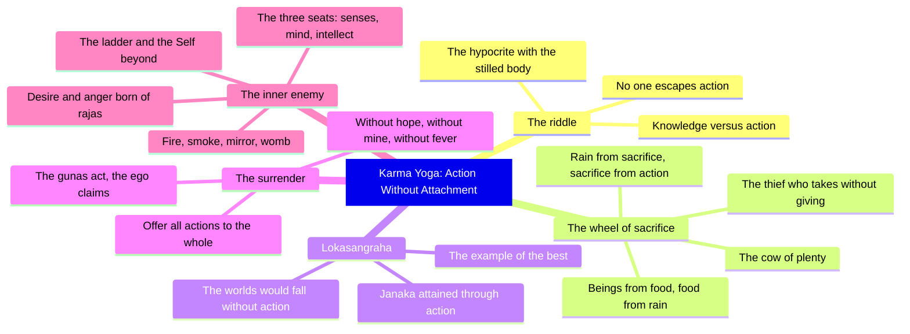

# Chapter 3: Karma Yoga — Action Without Attachment

> "The world is bound by action, except when action is performed as sacrifice."
> — The Osho Way

---

Chapter 2 ended with the portrait of the sthitaprajna, the man of steady wisdom. Arjuna has heard the whole theory of the immortal self and the even mind. Now he asks the question that every listener asks at this point: if wisdom is so great, why does the teaching keep pushing me toward war? Chapter 3, Karma Yoga, is Krishna's full answer — the yoga of action. It is the chapter that rescues the seeker from the temptation of withdrawal and places him back in the world with a new way of acting: act, fully and completely, but with the knot of "mine" untied from the act. This chapter is the bridge from the theory of the self (Sankhya) to the practice of living (Karma Yoga), and it contains some of the most practical verses in the entire Gita.

## Learning Objectives

After studying this chapter, you will be able to:

1. Explain why no one can remain without action for even a moment, and why renouncing action is not renunciation at all.
2. Describe the distinction between the two paths — jnana yoga for the contemplative, karma yoga for the active — and why Krishna places Arjuna in the second.
3. Interpret the "wheel of sacrifice" — the cosmic cycle in which every act feeds the whole, and how the greedy thief breaks it.
4. Understand lokasangraha, the holding together of the world, and why the wise act not for themselves but for the whole.
5. Trace the inner enemy — kama, desire — from its seat in the senses, mind and buddhi, and learn how the ladder of 3.42 is climbed.
6. Build a TypeScript tool that logs daily desires and reactions, mirroring the chain of 3.37 and the offering of actions to the whole in 3.30.

## Karma Yoga at a Glance

### The scene and the speakers

Arjuna is no longer weeping. The battle line is drawn, the chariot stands between the two armies, and Arjuna has asked the sharpest question in the Gita so far: "If you say knowledge is superior to action, then why are you pushing me into this dreadful work?" (3.1). Krishna answers with a smile that never leaves his voice: it is impossible for a human being to be without action, because the gunas — the forces of nature herself — carry everyone into activity (3.5). The only question is how you act. This chapter is the teaching of how.

### The Osho lens

Osho reads Karma Yoga as the end of the false dilemma between the world and the spirit. The escapist who flees to the mountains is still bound — his mind carries the marketplace inside it. The real renunciation happens in the marketplace itself: action done with awareness, without the ego's claim on the result, is the highest prayer. The "renouncer" who sits with folded hands while the world burns is the truest miser. The Gita, Osho insists, is a song of action — the action of the fully awake man who acts because the whole flows through him.

### The structure of the chapter

The chapter moves in three movements. The first (3.1–3.9) dissolves the riddle of renunciation versus action: no one escapes action, and the man who suppresses the senses while dreaming of their objects is a hypocrite. The second (3.10–3.26) reveals the cosmic framework: the wheel of sacrifice that keeps the world alive, and lokasangraha — the wise man's reason for action. The third (3.27–3.43) turns inward: the gunas act, not the ego; the inner enemy is desire, and the ladder of liberation climbs from the senses through the mind to the buddhi, and beyond the buddhi to the Self.

### The three-framework note

Keep the three lenses together as you read. The Sankhya framework of chapter 2 gives the eternal truth of the self. The Karma framework of this chapter gives the eternal truth of action. The union of the two is the Gita's full teaching: the self is untouched by action, and action, offered to the whole, is untouched by the self. Chapter 3 is where the two truths are married.

## Traditional Reading vs Osho-Style Reading

| Aspect | Traditional reading | Osho-style reading |
|--------|---------------------|--------------------|
| Renunciation | Giving up worldly action for a holy life | Dropping the ego's grip, not the world; the mountain monk can be the most worldly man |
| Sacrifice (yajna) | Ritual offering to the gods | The model of all action — you act, the whole receives, the whole returns |
| The "greedy thief" | One who eats without offering to the gods | Anyone who takes from the whole without giving anything back |
| Lokasangraha | Protecting society through duty | The sensitive man's natural mode: he cannot act for himself alone |
| The inner enemy | A demon to be fought | A chain reaction of unawareness — watch the first link, the brooding |
| The ladder of 3.42 | Senses below mind, mind below buddhi, buddhi below the Self | A map of consciousness: the witness is higher than all instruments |

## The Complete Text — All 43 Shlokas

### Shloka 3.1 — Why Do You Push Me Into This Dreadful Work?

> अर्जुन उवाच |
> ज्यायसी चेत्कर्मणस्ते मता बुद्धिर्जनार्दन |
> तत्किं कर्मणि घोरे मां नियोजयसि केशव

**Transliteration:** arjuna uvāca . jyāyasī cetkarmaṇaste matā buddhirjanārdana . tatkiṃ karmaṇi ghore māṃ niyojayasi keśava

**Translation:** Arjuna said: If you consider understanding to be superior to action, O Janardana, then why do you engage me in this dreadful action, O Kesava?

**Osho Darshan:** The disciple has listened carefully, and his question is the question of every intelligent student: you teach me that knowledge is supreme, then you order me into war. Osho says this is the moment every master loves — the moment the student catches the teacher in the apparent contradiction, because the contradiction is the door to the deeper teaching. Krishna has not contradicted himself; he is about to show that wisdom and action are not rivals but partners. The question, far from being a problem, is the bridge to the whole of Karma Yoga.

### Shloka 3.2 — Tell Me One Way, Clearly

> व्यामिश्रेणेव वाक्येन बुद्धिं मोहयसीव मे |
> तदेकं वद निश्चित्य येन श्रेयोऽहमाप्नुयाम्

**Transliteration:** vyāmiśreṇeva vākyena buddhiṃ mohayasīva me . tadekaṃ vada niścitya yena śreyo.ahamāpnuyām

**Translation:** With words that seem mixed and ambiguous you seem to confuse my understanding. Therefore tell me one thing, with certainty, by which I may attain the highest good.

**Osho Darshan:** Arjuna asks for one thing, with certainty — and Osho says this is the cry of the whole human being: we are tired of the thousand opinions, we want the one path that works. The master never answers such a cry with a doctrine; he answers with a direction. Krishna will not give Arjuna one of two paths; he will give him the reconciliation of both. The unity the student seeks cannot be handed over as a formula — it is found in the action done without attachment, which is the one path this chapter will open.

### Shloka 3.3 — The Two-Fold Path

> श्रीभगवानुवाच |
> लोकेऽस्मिन्द्विविधा निष्ठा पुरा प्रोक्ता मयानघ |
> ज्ञानयोगेन साङ्ख्यानां कर्मयोगेन योगिनाम्

**Transliteration:** śrībhagavānuvāca . loke.asmindvividhā niṣṭhā purā proktā mayānagha . jñānayogena sāṅkhyānāṃ karmayogena yoginām

**Translation:** The Blessed Lord said: In this world, O sinless one, a two-fold path was taught by me in ancient times — the yoga of knowledge for the contemplative, and the yoga of action for the active.

**Osho Darshan:** Krishna finally names the structure of all paths: knowledge for the contemplative temperament, action for the active temperament. Osho says this is the great respect of the Gita for individuality — there is no single path for everyone, because there is no single man. The contemplative climbs through seeing; the active climbs through doing; both are climbing the same mountain from different faces. And the master's genius is the next move: he will not give Arjuna a choice between the two, because Arjuna is a warrior — his nature is action, and his action will carry the seeing inside it.

### Shloka 3.4 — Not by Not Acting

> न कर्मणामनारम्भान्नैष्कर्म्यं पुरुषोऽश्नुते |
> न च संन्यसनादेव सिद्धिं समधिगच्छति

**Transliteration:** na karmaṇāmanārambhānnaiṣkarmyaṃ puruṣo.aśnute . na ca saṃnyasanādeva siddhiṃ samadhigacchati

**Translation:** Not by abstaining from action does a man attain freedom from action, nor by mere renunciation does he attain perfection.

**Osho Darshan:** The first myth is exploded: renunciation of action is not freedom from action. Osho says the man who runs from the world is still full of it — his running is itself an action, and a fearful one at that. Naishkarmya, the state beyond action, is not reached by stopping; it is reached by transcending from inside. The idea that "I will become free by not doing" is the subtlest bondage, because the ego loves the costume of the renouncer. The Gita's revolution: the same hands that fight can be free, and the same hands that fold in prayer can be bound.

### Shloka 3.5 — No One Can Sit Still Even for a Moment

> न हि कश्चित्क्षणमपि जातु तिष्ठत्यकर्मकृत् |
> कार्यते ह्यवशः कर्म सर्वः प्रकृतिजैर्गुणैः

**Transliteration:** na hi kaścitkṣaṇamapi jātu tiṣṭhatyakarmakṛt . kāryate hyavaśaḥ karma sarvaḥ prakṛtijairguṇaiḥ

**Translation:** For no one can remain without action even for a moment; everyone is driven to action, helpless, by the gunas born of nature.

**Osho Darshan:** The biological argument: even the man who vows not to act — his heart beats, his breath flows, his food digests. Osho says action is not something you choose; it is your very substance, the whole universe is a verb. The attempt to "stop acting" is like a wave trying to stop being wet. The choice is never between action and inaction; the choice is only between acting unconsciously, driven by the gunas, and acting consciously, as the witness of the gunas. The helplessness of 3.5 is precisely what freedom will transcend.

### Shloka 3.6 — The Hypocrite With the Restrained Senses

> कर्मेन्द्रियाणि संयम्य य आस्ते मनसा स्मरन् |
> इन्द्रियार्थान्विमूढात्मा मिथ्याचारः स उच्यते

**Transliteration:** karmendriyāṇi saṃyamya ya āste manasā smaran . indriyārthānvimūḍhātmā mithyācāraḥ sa ucyate

**Translation:** He who restrains the organs of action while his mind dwells on sense objects — that deluded man is called a hypocrite.

**Osho Darshan:** The sharpest verse of the chapter: the man with the frozen body and the burning mind is a mithyacara, a counterfeit. Osho says the tradition has always loved this hypocrisy — the stilled hands and the churning heart, the public renouncer and the private dreamer. The Gita calls it by its true name. Suppression is not renunciation; it is a postponement with a costume. The body sitting still means nothing while the mind gallops through the bazaar. The only real restraint is the restraint that begins in the mind, in awareness itself.

### Shloka 3.7 — The Superior Man Who Acts With Restrained Mind

> यस्त्विन्द्रियाणि मनसा नियम्यारभतेऽर्जुन |
> कर्मेन्द्रियैः कर्मयोगमसक्तः स विशिष्यते

**Transliteration:** yastvindriyāṇi manasā niyamyārabhate.arjuna . karmendriyaiḥ karmayogamasaktaḥ sa viśiṣyate

**Translation:** But he who, controlling the senses with the mind, O Arjuna, engages in Karma Yoga with the organs of action, unattached — he excels.

**Osho Darshan:** The positive portrait follows the negative: the mind restrains the senses, and the body acts — fully, freely, unattached. Osho says this is the true synthesis: no suppression, no escape, the whole being in the act. The hands fight, the feet walk, the voice speaks — and the mind, like a good king, commands the senses instead of being commanded by them. The word "unattached" is the crown: the action is total, and the ego's grip on it is gone. This man excels — not above the world but at the heart of it.

### Shloka 3.8 — Do Your Prescribed Work

> नियतं कुरु कर्म त्वं कर्म ज्यायो ह्यकर्मणः |
> शरीरयात्रापि च ते न प्रसिद्ध्येदकर्मणः

**Transliteration:** niyataṃ kuru karma tvaṃ karma jyāyo hyakarmaṇaḥ . śarīrayātrāpi ca te na prasiddhyedakarmaṇaḥ

**Translation:** Do your prescribed work, for action is superior to inaction; and even the maintenance of your body would not be possible without action.

**Osho Darshan:** The argument descends to the very practical floor: without action, you could not even keep the body alive. Osho says the Gita is the most life-affirming scripture in the world — it begins with the necessity of the body, not the denial of it. And "your prescribed work" — niyata karma — is the work that belongs to your nature, your situation, your dharma. Not the world's agenda but your own. The man who does his own work with full presence is already a yogi; the man who does another's work even perfectly is a servant.

### Shloka 3.9 — The World Is Bound by Action, Except Sacrifice

> यज्ञार्थात्कर्मणोऽन्यत्र लोकोऽयं कर्मबन्धनः |
> तदर्थं कर्म कौन्तेय मुक्तसङ्गः समाचर

**Transliteration:** yajñārthātkarmaṇo.anyatra loko.ayaṃ karmabandhanaḥ . tadarthaṃ karma kaunteya muktasangaḥ samācara

**Translation:** The world is bound by action, except when action is done for the sake of sacrifice; therefore, O son of Kunti, perform action for that sake, free from attachment.

**Osho Darshan:** The central definition of Karma Yoga is given in a single sentence: action done as sacrifice binds nothing; all other action binds. Osho says the difference is not in the action — a meal cooked for hunger and a meal cooked as offering are the same meal; the difference is the direction of the ego. Yajna-artha — for the sake of the whole — the act becomes a gift, and the giver is not bound by the gift. The Gita's radical claim: you can do everything you did, but if the ego's name is crossed off the action, the chain falls away.

### Shloka 3.10 — The Wheel of Creation

> सहयज्ञाः प्रजाः सृष्ट्वा पुरोवाच प्रजापतिः |
> अनेन प्रसविष्यध्वमेष वोऽस्त्विष्टकामधुक्

**Transliteration:** sahayajñāḥ prajāḥ sṛṣṭvā purovāca prajāpatiḥ . anena prasaviṣyadhvameṣa vo.astviṣṭakāmadhuk

**Translation:** Having created mankind along with sacrifice, the Creator of old said: by this shall you multiply; let this be the cow of plenty granting all your desires.

**Osho Darshan:** The cosmos itself is pictured as a wheel of giving: the Creator placed sacrifice at the very foundation of creation, and called it the cow of plenty. Osho says this is the deepest ecology of the Gita — existence is a mutual gift, and the human being is the creature who can consciously return the gift. The cow of plenty is not a myth to be milked; it is the whole in which you live, which nourishes you the moment you nourish it. Desire is not denied here; it is fulfilled — by participation instead of grasping.

### Shloka 3.11 — Nourish the Gods, and They Nourish You

> देवान्भावयतानेन ते देवा भावयन्तु वः |
> परस्परं भावयन्तः श्रेयः परमवाप्स्यथ

**Transliteration:** devānbhāvayatānena te devā bhāvayantu vaḥ . parasparaṃ bhāvayantaḥ śreyaḥ paramavāpsyatha

**Translation:** Nourish the gods with this, and let the gods nourish you; nourishing each other, you shall attain the highest good.

**Osho Darshan:** The relationship of the world and the individual is mutual nourishment, paraspara — each other. Osho says this is the family model of existence: parents and children, field and farmer, society and individual — everything feeds everything. The man who understands this lives in gratitude; the man who misses it lives in a hostile universe of rivals. The highest good, shreya paramam, is not a prize at the end; it is the quality of the mutual giving itself. Heavens are not places; they are relationships of nourishment.

### Shloka 3.12 — The Thief Who Takes Without Giving

> इष्टान्भोगान्हि वो देवा दास्यन्ते यज्ञभाविताः |
> तैर्दत्तानप्रदायैभ्यो यो भुङ्क्ते स्तेन एव सः

**Transliteration:** iṣṭānbhogānhi vo devā dāsyante yajñabhāvitāḥ . tairdattānapradāyaibhyo yo bhuṅkte stena eva saḥ

**Translation:** Nourished by sacrifice, the gods will give you the joys you desire; but he who enjoys what is given without offering back to them is a thief, indeed.

**Osho Darshan:** The word falls like a hammer: stena, thief. Osho says the definition of the thief is universalised — not the man who steals another's purse, but the man who takes from the whole without ever giving back. The air you breathe, the food you eat, the love that raised you — all are loans from the universe; the man who takes them all and gives nothing is the subtlest thief, and he lives in fear of the police he has invented. The giving is not charity; it is the repayment of the loan of existence — the honest man's natural response.

### Shloka 3.13 — Released From All Sins

> यज्ञशिष्टाशिनः सन्तो मुच्यन्ते सर्वकिल्बिषैः |
> भुञ्जते ते त्वघं पापा ये पचन्त्यात्मकारणात्

**Transliteration:** yajñaśiṣṭāśinaḥ santo mucyante sarvakilbiṣaiḥ . bhuñjate te tvaghaṃ pāpā ye pacantyātmakāraṇāt

**Translation:** The good, who eat the remnants of the sacrifice, are released from all sins; but the wicked, who cook for their own sake, eat only sin.

**Osho Darshan:** The same food, two different kitchens: the remnant of the offering frees, the meal cooked only for the self binds. Osho says the moral of the verse is not about menus but about motives — the act cooked in the ego's pot always carries the poison of the ego. And the two words for eaters are chosen with care: the good man eats the remnant, the gift's leftover; the selfish man eats agha, sin itself — the very thing he sought to avoid in the meal. Every act returns to its cook; cook for the whole, and the whole feeds you.

### Shloka 3.14 — From Food, Beings; From Sacrifice, Rain

> अन्नाद्भवन्ति भूतानि पर्जन्यादन्नसम्भवः |
> यज्ञाद्भवति पर्जन्यो यज्ञः कर्मसमुद्भवः

**Transliteration:** annādbhavanti bhūtāni parjanyādannasambhavaḥ . yajñādbhavati parjanyo yajñaḥ karmasamudbhavaḥ

**Translation:** From food all beings are born; from rain comes food; from sacrifice comes rain; and sacrifice is born of action.

**Osho Darshan:** The wheel of life is drawn in four spokes: beings from food, food from rain, rain from sacrifice, sacrifice from action. Osho says this is the ancient ecology written as poetry — and the human being stands at the centre of the wheel, because action is the spoke that turns everything. The verse's hidden genius is in the word "sacrifice is born of action": your daily work is the very engine of the cosmos. The cook, the farmer, the engineer, the nurse — each act done as offering keeps the wheel of the universe turning.

### Shloka 3.15 — Action Is Born of Brahman

> कर्म ब्रह्मोद्भवं विद्धि ब्रह्माक्षरसमुद्भवम् |
> तस्मात्सर्वगतं ब्रह्म नित्यं यज्ञे प्रतिष्ठितम्

**Transliteration:** karma brahmodbhavaṃ viddhi brahmākṣarasamudbhavam . tasmātsarvagataṃ brahma nityaṃ yajñe pratiṣṭhitam

**Translation:** Know action to be born of Brahman, and Brahman to be born of the Imperishable; therefore the all-pervading Brahman is eternally established in sacrifice.

**Osho Darshan:** The wheel is traced to its origin: action arises from the Veda, the Veda from the Imperishable — so the whole chain of work is sacred, grounded in the eternal. Osho says this is the ultimate dignity of the worker: your hands are not dirty and holy only at the altar; the act itself, however small, is Brahman in motion. The whole chain — the Imperishable, the Veda, sacrifice, action, rain, food, beings — is one continuous act of the divine. The man who works with this knowledge works in a cathedral, whatever the building.

### Shloka 3.16 — He Who Does Not Turn the Wheel Lives in Vain

> एवं प्रवर्तितं चक्रं नानुवर्तयतीह यः |
> अघायुरिन्द्रियारामो मोघं पार्थ स जीवति

**Transliteration:** evaṃ pravartitaṃ cakraṃ nānuvartayatīha yaḥ . aghāyurindriyārāmo moghaṃ pārtha sa jīvati

**Translation:** He who does not follow the wheel thus set in motion, living in vain, delighting in the senses — he lives in vain, O Partha.

**Osho Darshan:** The verdict is absolute: the man who refuses the wheel lives a wasted life. Osho says the word aghayu is powerful — the life of sin, the life that accrues a debt; and the description of it is exact: indriyarama, delighting in the senses alone. The man who reduces existence to his own pleasures is not sinful by law but futile by fact — he is the wheel's broken spoke. The teaching is not a threat but a description: the life that gives nothing to the whole is a life that never really starts. The wheel moves; only the watcher of his own appetite stands still.

### Shloka 3.17 — The Man Who Is Satisfied in the Self

> यस्त्वात्मरतिरेव स्यादात्मतृप्तश्च मानवः |
> आत्मन्येव च सन्तुष्टस्तस्य कार्यं न विद्यते

**Transliteration:** yastvātmaratireva syādātmatṛptaśca mānavaḥ . ātmanyeva ca santuṣṭastasya kāryaṃ na vidyate

**Translation:** But the man who delights in the Self alone, is satisfied in the Self, and is content in the Self alone — for him there is nothing left to do.

**Osho Darshan:** Here the exception appears: the man who has found the Self has no compulsion left — not no action, but no drivenness. Osho says the difference is the difference between a running engine and a still centre: the realised man may act, but nothing "must" be done; the doer has dissolved. This is not laziness — the fulfilled man is often the most active man, like the sun which gives without effort. But his activity is a song, not a contract. The word santushta, content, is the key: the man who is complete has no tasks, only movements of joy.

### Shloka 3.18 — Nothing Done, Nothing Not Done

> नैव तस्य कृतेनार्थो नाकृतेनेह कश्चन |
> न चास्य सर्वभूतेषु कश्चिदर्थव्यपाश्रयः

**Transliteration:** naiva tasya kṛtenārtho nākṛteneha kaścana . na cāsya sarvabhūteṣu kaścidarthavyapāśrayaḥ

**Translation:** For him there is no purpose in anything done, and none in anything left undone; nor does he depend on any being for any purpose.

**Osho Darshan:** The freedom of the fulfilled man is total: no act is needed to complete him, and no act's omission can diminish him. Osho says the ordinary man lives in the economy of need — he acts to get, and his getting depends on others; the realised man lives in the economy of being — he acts because he is, and no one's response can touch him. The verse describes the state, not a formula; it is the horizon toward which the whole path moves. The man who needs nothing and nobody has become the whole — and the whole is what he shares.

### Shloka 3.19 — Action Performed Without Attachment

> तस्मादसक्तः सततं कार्यं कर्म समाचर |
> असक्तो ह्याचरन्कर्म परमाप्नोति पूरुषः

**Transliteration:** tasmādasaktaḥ satataṃ kāryaṃ karma samācara . asakto hyācaran karma paramāpnoti pūruṣaḥ

**Translation:** Therefore, without attachment, perform always the work that must be done; for the man who performs action without attachment attains the Supreme.

**Osho Darshan:** The refrain of the chapter returns, now with the prize named: unattached action attains the Supreme itself. Osho says this is the great reversal of all worldly wisdom — the world teaches that you need attachment to do great things; the Gita teaches that attachment is precisely what cripples you. The unattached man is not careless; he is weightless — he can act with a totality impossible to the loaded man. The word asakta, unattached, is not coldness; it is the warmth of the sun, which gives all its light and asks nothing back.

### Shloka 3.20 — Janaka and the Holding Together of the World

> कर्मणैव हि संसिद्धिमास्थिता जनकादयः |
> लोकसंग्रहमेवापि सम्पश्यन्कर्तुमर्हसि

**Transliteration:** karmaṇaiva hi saṃsiddhimāsthita janakādayaḥ . lokasaṃgrahamevāpi sampraśyankartumarhasi

**Translation:** Even Janaka and others attained perfection through action alone; therefore, seeing the holding together of the world, you too should act.

**Osho Darshan:** The proof is historical: Janaka, the king who was also a seer, attained perfection through action — he reigned, ruled, fought, and was free. Osho says the Gita offers the highest precedent: not the monk but the king is the model. And the reason for action is named with the most beautiful word of the chapter: lokasangraha — the holding together of the world. The wise man does not act because he needs; he acts because his action is the thread that holds the fabric of the whole. The world is not saved by withdrawal but by participation.

### Shloka 3.21 — As the Best Do, So Do Others

> यद्यदाचरति श्रेष्ठस्तत्तदेवेतरो जनः |
> स यत्प्रमाणं कुरुते लोकस्तदनुवर्तते

**Transliteration:** yadyadācarati śreṣṭhastattadevetaro janaḥ . sa yatpramāṇaṃ kurute lokastadanuvartate

**Translation:** Whatever the best man does, that the ordinary man follows; and whatever standard he sets, the world walks after it.

**Osho Darshan:** The psychology of leadership is drawn in one verse: the world imitates the best. Osho says this is why the wise man cannot stop acting — his inaction would be the world's curriculum. The people do not follow your sermons; they follow your example, your breakfast, your anger, your silence. This is both a responsibility and a freedom: you do not need to teach; you need to be. The man who is genuinely centred teaches the whole world with a single gesture. Every life is a standard; the question is only which standard.

### Shloka 3.22 — Nothing to Gain, Yet Still Acting

> न मे पार्थास्ति कर्तव्यं त्रिषु लोकेषु किञ्चन |
> नानवाप्तमवाप्तव्यं वर्त एव च कर्मणि

**Transliteration:** na me pārthāsti kartavyaṃ triṣu lokeṣu kiñcana . nānavāptamavāptavyaṃ varta eva ca karmaṇi

**Translation:** There is nothing, O Partha, that I need to do in the three worlds, nothing unattained that I need to attain; yet I continue to act.

**Osho Darshan:** The master gives his own testimony: I have nothing to gain, and I still act. Osho says this is the mystery of the divine — the God of the Gita is not a retired monarch but an eternal worker. Krishna rules, guides, fights, teaches — and not one act binds him, because no act is a transaction. This is the state of pure action: acting because the whole flows, like the river which does not plan to flow but cannot stop. The seeker's ultimate goal is this grace: to act without any need behind the act, and thus never to act at all.

### Shloka 3.23 — If I Ceased to Act

> यदि ह्यहं न वर्तेयं जातु कर्मण्यतन्द्रितः |
> मम वर्त्मानुवर्तन्ते मनुष्याः पार्थ सर्वशः

**Transliteration:** yadi hyahaṃ na varteyaṃ jātu karmaṇyatandritaḥ . mama vartmānuvartante manuṣyāḥ pārtha sarvaśaḥ

**Translation:** If I did not act, tirelessly, at any time, O Partha, all men would follow my path.

**Osho Darshan:** The argument of example is completed: if the divine stopped acting, the whole world would learn to stop. Osho says the universe is the divine's action — stars, seasons, birth, death, all is his tireless work; and the human being is the creature who can either follow this current or resist it. The teaching is not "act because you must" but "act because acting is the divine's own way." The man who sits still while the cosmos moves has chosen the one movement that is not divine. The universe is a workshop, and idleness is the only heresy.

### Shloka 3.24 — The Worlds Would Fall

> उत्सीदेयुरिमे लोका न कुर्यां कर्म चेदहम् |
> सङ्करस्य च कर्ता स्यामुपहन्यामिमाः प्रजाः

**Transliteration:** utsīdeyurime lokā na kuryāṃ karma cedaham . saṅkarasya ca kartā syāmupahanyāmimāḥ prajāḥ

**Translation:** These worlds would perish if I did not perform action; I would be the cause of confusion and would destroy these beings.

**Osho Darshan:** The consequence of divine inaction is named with frightening clarity: the worlds would fall, and the destroyer would be the one who did nothing. Osho says this is the profound teaching about evil: the greatest evil is not the violent act but the refused act — the man who could hold the world and folded his hands. Sankara, the confusion of the castes and the orders, is the natural result of universal inaction. The chapter's urgency is real: the world is held together by the actions of the few who act for the whole. Do not be the gap in the web.

### Shloka 3.25 — As the Ignorant Act, the Wise Act Too

> सक्ताः कर्मण्यविद्वांसो यथा कुर्वन्ति भारत |
> कुर्याद्विद्वांस्तथासक्तश्चिकीर्षुर्लोकसंग्रहम्

**Transliteration:** saktāḥ karmaṇyavidvāṃso yathā kurvanti bhārata . kuryādvidvāṃstathāsaktaścikīrṣurlokasaṃgraham

**Translation:** As the ignorant act, attached to their work, O Bharata, so should the wise act, unattached, wishing to hold the world together.

**Osho Darshan:** The surface is identical, the depth opposite: the ignorant act with attachment, the wise act without — and the world cannot tell the two apart. Osho says this is the invisible difference of the Gita: the same plough, the same sword, the same bread; the difference is only in the consciousness behind the act. The wise man is not distinguished by a different job but by a different inside. And the wise man's motive is named again: lokasangraha, the holding together of the world — the concern that has grown larger than his own skin.

### Shloka 3.26 — Do Not Confuse the Ignorant

> न बुद्धिभेदं जनयेदज्ञानां कर्मसङ्गिनाम् |
> योजयेत्सर्वकर्माणि विद्वान्युक्तः समाचरन्

**Transliteration:** na buddhibhedaṃ janayedajñānāṃ karmasaṅginām . yojayetsarvakarmāṇi vidvānyuktaḥ samācaran

**Translation:** The wise should not create confusion in the minds of the ignorant who are attached to action; performing all actions with devotion, he should let them act.

**Osho Darshan:** The wise man's compassion has a strange form: he does not preach to the attached, he lets them work. Osho says the teacher who shatters the beliefs of the unprepared is a criminal — the student needs his next step, not his doubt. The wise man acts, and his action is the teaching; those attached to their work learn not from arguments but from the sight of a man who works without grasping. The word yojayet, let them engage, is tender: the world needs its attachments as scaffolding, until the building can stand on its own.

### Shloka 3.27 — The Gunas Act, the Ego Claims

> प्रकृतेः क्रियमाणानि गुणैः कर्माणि सर्वशः |
> अहङ्कारविमूढात्मा कर्ताहमिति मन्यते

**Transliteration:** prakṛteḥ kriyamāṇāni guṇaiḥ karmāṇi sarvaśaḥ . ahaṅkāravimūḍhātmā kartāhamiti manyate

**Translation:** All actions are performed by the gunas of nature; but the deluded man, blinded by egoism, thinks, "I am the doer."

**Osho Darshan:** The deepest diagnosis of the chapter: actions happen through you, the gunas do the doing, and the ego claims the authorship. Osho says the ego is the forger of the universe — it signs its name to actions it never performed, like a crow claiming the flight of the wind. The whole Karma Yoga is contained in this correction: loosen the claim "I did it," and the chain of bondage is broken at its root. The ego is not destroyed by fighting; it is seen through. The moment you watch an action arising and passing, the forger is exposed.

### Shloka 3.28 — The Knower of the Gunas Does Not Get Attached

> तत्त्ववित्तु महाबाहो गुणकर्मविभागयोः |
> गुणा गुणेषु वर्तन्त इति मत्वा न सज्जते

**Transliteration:** tattvavittu mahābāho guṇakarmavibhāgayoḥ . guṇā guṇeṣu vartanta iti matvā na sajjate

**Translation:** But the knower of truth, O mighty-armed one, aware of the distinction between the gunas and their actions, knowing that the gunas act upon the gunas, does not get attached.

**Osho Darshan:** The knowledge that frees is precise: the gunas act upon the gunas — one quality meets another quality, and no self is involved anywhere. Osho says this is the great emptying: anger is an energy arising in the field of the mind; the wise man sees anger arise, sees it spend itself, and is not angry — he knows the gunas act upon the gunas. The self is not the actor of the storm but the sky that contains it. This seeing is not denial; it is the accurate science of the inner world, and accuracy is freedom.

### Shloka 3.29 — The Deluded Are Attached to the Gunas

> प्रकृतेर्गुणसम्मूढाः सज्जन्ते गुणकर्मसु |
> तानकृत्स्नविदो मन्दान्कृत्स्नविन्न विचालयेत्

**Transliteration:** prakṛterguṇasammūḍhāḥ sajjante guṇakarmasu . tānakṛtsnavido mandānkṛtsnavinna vicālayet

**Translation:** Deluded by the gunas of nature, the ignorant are attached to the actions of the gunas; the wise should not disturb these dull ones who do not know the whole.

**Osho Darshan:** Compassion returns in its strange form again: the wise man leaves the attached to their attachments. Osho says the man who knows the whole does not tear the partial truths of others — the partial truth is the only truth they can hold, and it is the step they stand on. The dull one's attachment is his medicine, not his disease; take away the medicine too early and you kill the patient. The wise man's path is not to destroy the world's illusions but to outgrow them himself — and to shine, so that those who can see may find their own way.

### Shloka 3.30 — Surrender All Actions to Me

> मयि सर्वाणि कर्माणि संन्यस्याध्यात्मचेतसा |
> निराशीर्निर्ममो भूत्वा युध्यस्व विगतज्वरः

**Transliteration:** mayi sarvāṇi karmāṇi saṃnyasyādhyātmacetasā . nirāśīrnirmamo bhūtvā yudhyasva vigatajvaraḥ

**Translation:** Surrendering all actions to Me, with your mind fixed on the Self, free from hope and from possessiveness, freed from fever, fight.

**Osho Darshan:** The command of the chapter is spoken in one breath: offer all actions to the whole, empty of hope, empty of mine, without fever — fight. Osho says the fever, jvara, is the trembling of the ego about results; the man who has offered his action is cool — not cold but feverless. And the wonder of the verse: the surrender does not reduce the action; the battle is still to be fought, the bow still drawn. The offering does not change the work; it changes the worker. The surrendered fighter is the most dangerous and the most peaceful man on the field.

### Shloka 3.31 — Those Who Follow This Teaching

> ये मे मतमिदं नित्यमनुतिष्ठन्ति मानवाः |
> श्रद्धावन्तोऽनसूयन्तो मुच्यन्ते तेऽपि कर्मभिः

**Transliteration:** ye me matamidaṃ nityamanutiṣṭhanti mānavāḥ . śraddhāvanto.anasūyanto mucyante te.api karmabhiḥ

**Translation:** Those humans who, with faith and without envy, follow this teaching of mine continually — they too are released from the bonds of action.

**Osho Darshan:** The promise is given to the faithful: those who follow the teaching with shraddha, trust, are released even as they act. Osho says faith is not belief against evidence; it is the trust that lets you walk the path before you can see the end — the bridge between the first step and the first seeing. And the condition "without envy" is subtle: envy of the realised man's freedom is the poison that prevents the freedom. Trust the path, do not envy the traveller ahead; your own feet will cover the same road.

### Shloka 3.32 — Those Who Reject This Teaching

> ये त्वेतदभ्यसूयन्तो नानुतिष्ठन्ति मे मतम् |
> सर्वज्ञानविमूढांस्तान्विद्धि नष्टानचेतसः

**Transliteration:** ye tvetadabhyasūyanto nānutiṣṭhanti me matam . sarvajñānavimūḍhāṃstānviddhi naṣṭānacetasaḥ

**Translation:** But those who, carping at this teaching of mine, do not follow it — know them to be deluded in all knowledge, lost and senseless.

**Osho Darshan:** The warning is for a precise type: not the ignorant, but the carping — those who object from the comfort of the armchair. Osho says the critic who has never practised is the true lost man, because he is deluded in all knowledge — the knowledge itself becomes the fog. The verse is not a curse but a description: the man who argues against the path without walking it cannot be helped by any teaching, because his objection is not a question but a defence. The door stays open; the carper stands before it, explaining why it cannot be opened.

### Shloka 3.33 — Even the Wise Act According to Their Nature

> सदृशं चेष्टते स्वस्याः प्रकृतेर्ज्ञानवानपि |
> प्रकृतिं यान्ति भूतानि निग्रहः किं करिष्यति

**Transliteration:** sadṛśaṃ ceṣṭate svasyāḥ prakṛterjñānavānapi . prakṛtiṃ yānti bhūtāni nigrahaḥ kiṃ kariṣyati

**Translation:** Even the wise act according to their own nature; beings follow their nature — what will restraint accomplish?

**Osho Darshan:** The Gita's realism is stark: even the wise swim in the currents of their nature. Osho says you cannot fight your nature and win; you can only understand it, and in the understanding, transcend it from within. The question "what will restraint accomplish?" is the Gita's deepest challenge to the suppressors — the man who clamps his nature in a vice will find the vice empty and the nature escaped. The wise do not fight the river; they learn the river, and then they are no longer the leaf but the river itself. Nature is not the enemy; the ignorance of nature is.

### Shloka 3.34 — Attraction and Repulsion, the Two Enemies

> इन्द्रियस्येन्द्रियस्यार्थे रागद्वेषौ व्यवस्थितौ |
> तयोर्न वशमागच्छेत्तौ ह्यस्य परिपन्थिनौ

**Transliteration:** indriyasyendriyasyārthe rāgadveṣau vyavasthitau . tayorna vaśamāgacchettau hyasya paripanthinau

**Translation:** In the object of every sense, attraction and repulsion are inherent; let no one fall under their power — for they are the two enemies on the path.

**Osho Darshan:** The landscape of the inner world is mapped: in every object, the two robbers wait — attraction and repulsion. Osho says the pair is a single energy with two faces; the man who hates the world is as bound as the man who loves it, because both stand in relation to objects. The freedom of the Gita is not the choice of the better face but the exit from both. "Let no one come under their power" — the warning is precise, because the path is narrow between the two robbers. The witness walks between the armies of liking and disliking without joining either.

### Shloka 3.35 — One's Own Dharma, Though Imperfect

> श्रेयान्स्वधर्मो विगुणः परधर्मात्स्वनुष्ठितात् |
> स्वधर्मे निधनं श्रेयः परधर्मो भयावहः

**Transliteration:** śreyānsvadharmo viguṇaḥ paradharmātsvanuṣṭhitāt . svadharme nidhanaṃ śreyaḥ paradharmo bhayāvahaḥ

**Translation:** One's own dharma, though imperfect, is better than another's dharma, however well performed; death in one's own dharma is better — another's dharma is fraught with fear.

**Osho Darshan:** The most quoted verse of the chapter: your own imperfect path is better than another's perfect path. Osho says the Gita here is radical in its respect for individuality — there is no universal formula for the human being; there is only your formula, found in your own nature. The man who lives another's life, however brilliant, lives in permanent fear — the fear of being caught in the borrowed costume. And death in one's own dharma is better: the wave that breaks on its own shore has fulfilled its shape. Authenticity is the only safety.

### Shloka 3.36 — What Drives a Man to Sin?

> अर्जुन उवाच |
> अथ केन प्रयुक्तोऽयं पापं चरति पूरुषः |
> अनिच्छन्नपि वार्ष्णेय बलादिव नियोजितः

**Transliteration:** arjuna uvāca . atha kena prayukto.ayaṃ pāpaṃ carati pūruṣaḥ . anicchannapi vārṣṇeya balādiva niyojitaḥ

**Translation:** Arjuna said: By what is a man driven to commit sin, O Varshneya, unwilling, as if compelled by force?

**Osho Darshan:** The disciple asks the question of human darkness itself: why do we do what we do not want to do? Osho says this is the confession of every human being — the man who harms, who betrays, who explodes, who fails, and who cannot stop himself. The words "as if compelled by force" describe the experience exactly: the action is mine and not mine, chosen and forced. Arjuna has reached the deepest layer of psychology; the answer of the next shlokas will name the force — and with the naming, the possibility of freedom will open.

### Shloka 3.37 — Desire and Anger, the All-Devouring Enemy

> श्रीभगवानुवाच |
> काम एष क्रोध एष रजोगुणसमुद्भवः |
> महाशनो महापाप्मा विद्ध्येनमिह वैरिणम्

**Transliteration:** śrībhagavānuvāca . kāma eṣa krodha eṣa rajoguṇasamudbhavaḥ . mahāśano mahāpāpmā viddhyenamiha vairiṇam

**Translation:** The Blessed Lord said: It is desire, it is anger, born of the rajas guna — all-devouring, all-sinful; know this to be the enemy here.

**Osho Darshan:** The name is spoken: kama, desire — and its twin, krodha, anger, born of the same fire. Osho says desire is the root; anger is only desire that was blocked — the same energy, the same face, two masks. The enemy is named with terrible adjectives: all-devouring, all-sinful — the hunger that swallows everything and is never full. And the phrase "here" is important: this is the enemy in this world, on this field — not a devil in some other realm but the force that rides your own breath. Naming it is the first act of the war against it.

### Shloka 3.38 — Smoke, Mirror, Womb: The Three Covers

> धूमेनाव्रियते वह्निर्यथादर्शो मलेन च |
> यथोल्बेनावृतो गर्भस्तथा तेनेदमावृतम्

**Transliteration:** dhūmenāvriyate vahniryathādarśo malena ca . yatholbenāvṛto garbhastathā tenedamāvṛtam

**Translation:** As fire is covered by smoke, as a mirror by dust, as an embryo by the womb, so is this covered by that.

**Osho Darshan:** Three images of the cover: fire under smoke, mirror under dust, embryo in the womb. Osho says the three are the degrees of the veiling — the fire under smoke is still visible in its glow, the mirror under dust needs a wipe, the embryo is wholly hidden. Desire covers knowledge in all these ways — sometimes half-visible, sometimes obscured, sometimes buried deep. The teaching is hopeful: under every cover, the fire still burns; the mirror still reflects; the embryo is still alive. The cover is real but not final; the light is intact beneath it.

### Shloka 3.39 — The Eternal Enemy in the Form of Desire

> आवृतं ज्ञानमेतेन ज्ञानिनो नित्यवैरिणा |
> कामरूपेण कौन्तेय दुष्पूरेणानलेन च

**Transliteration:** āvṛtaṃ jñānametena jñānino nityavairiṇā . kāmarūpeṇa kaunteya duṣpūreṇānalena ca

**Translation:** Knowledge is covered by this eternal enemy of the wise, O son of Kunti, in the form of desire — the insatiable fire.

**Osho Darshan:** The tragedy is named with precision: desire is the eternal enemy of the wise — not of the ignorant, who never had the knowledge to be covered, but of the wise. Osho says the last step is the hardest, because the subtlest desires survive the longest; the fire is insatiable — duṣpūra, impossible to fill. The image of the fire is the final truth about desire: it burns everything and is never satisfied with any fuel. The enemy of the wise is not sin but the leftover hunger in the mind that has already seen much — and the fire must be seen, not fed.

### Shloka 3.40 — The Seat of the Enemy

> इन्द्रियाणि मनो बुद्धिरस्याधिष्ठानमुच्यते |
> एतैर्विमोहयत्येष ज्ञानमावृत्य देहिनम्

**Transliteration:** indriyāṇi mano buddhirasyādhiṣṭhānamucyate . etairvimohayatyeṣa jñānamāvṛtya dehinam

**Translation:** The senses, the mind and the intellect are said to be its seat; with these it covers knowledge and deludes the embodied one.

**Osho Darshan:** The geography of the enemy is disclosed: it does not sit outside the fort — it sits in the senses, the mind and the intellect, the three floors of the inner house. Osho says the battle is therefore the strangest of wars: the enemy is inside the walls, using the very instruments of the self. The mind that should see becomes the veil; the intellect that should discriminate becomes the advocate of the desire. The knowledge is covered by the knowing — the lamp is hidden by its own room. The strategy of the Gita will follow: find the one thing in the fort that the enemy has not occupied.

### Shloka 3.41 — Slay the Sinner, Source of All Ill

> तस्मात्त्वमिन्द्रियाण्यादौ नियम्य भरतर्षभ |
> पाप्मानं प्रजहि ह्येनं ज्ञानविज्ञाननाशनम्

**Transliteration:** tasmāttvamindriyāṇyādau niyamya bharatarṣabha . pāpmānaṃ prajahi hyenaṃ jñānavijñānanāśanam

**Translation:** Therefore, O best of the Bharatas, restraining the senses first, slay this sinner, the destroyer of knowledge and wisdom.

**Osho Darshan:** The war strategy is given: first the senses — the outer walls — then the enemy itself. Osho says this is the ancient science of the inner war: you cannot defeat desire in its deepest chamber while the senses keep reporting to it, feeding it. The restraining is not killing the senses; it is closing the gate the enemy supplies through. And the target is named: the destroyer of jnana and vijnana — of knowledge and of lived wisdom; the enemy destroys both the map and the walking. Slay the desire, and both are restored at once.

### Shloka 3.42 — The Ladder: Senses, Mind, Intellect, and Beyond

> इन्द्रियाणि पराण्याहुरिन्द्रियेभ्यः परं मनः |
> मनसस्तु परा बुद्धिर्यो बुद्धेः परतस्तु सः

**Transliteration:** indriyāṇi parāṇyāhurindriyebhyaḥ paraṃ manaḥ . manasastu parā buddhiryo buddheḥ paratastu saḥ

**Translation:** They say the senses are superior; superior to the senses is the mind; superior to the mind is the intellect; and that which is beyond the intellect — is He.

**Osho Darshan:** The ladder of being is drawn in four rungs: senses, mind, intellect, and beyond the intellect — the Self. Osho says this is the map of the inner ascent — every level sees the levels below it, and the enemy lives on the lower floors. The senses propose, the mind imagines, the intellect judges; and the Self witnesses them all. The climb of yoga is the climb of attention up this ladder: from the object, to the thought, to the thought about the thought, to the one who never enters any thought. The rungs are not to be destroyed but to be climbed.

### Shloka 3.43 — Knowing That Beyond the Intellect

> एवं बुद्धेः परं बुद्ध्वा संस्तभ्यात्मानमात्मना |
> जघन्यं शत्रुं महावाहो कामरूपं दुरासदम्

**Transliteration:** evaṃ buddheḥ paraṃ buddhvā saṃstabhyātmānamātmanā . jaghanyaṃ śatruṃ mahābāho kāmarūpaṃ durāsadam

**Translation:** Thus, knowing that which is beyond the intellect, and steadying the self by the self, slay the hard-to-conquer enemy in the form of desire, O mighty-armed one.

**Osho Darshan:** The chapter closes with the strategy complete: knowing the witness beyond the intellect, steady the self by the self, and slay the enemy. Osho says the weapons are two — the knowledge of the witness and the self's own steadiness; the enemy is conquered from above, not fought from beside. The enemy is hard to conquer from the same level; it is conquered only from the height of the witness. And the final note is the whole teaching in miniature: Arjuna, the mighty-armed, is told to slay desire — not with his bow but with his own being. The Gita's war is won by the seer.

## Key Themes

| Theme | Shlokas | Osho-style insight |
|-------|---------|--------------------|
| The riddle of renunciation | 3.1–3.9 | No one escapes action; suppression is hypocrisy; the restrained mind acting is superior |
| The wheel of sacrifice | 3.10–3.15 | Existence is mutual nourishment; the greedy taker is a thief; action is born of the Imperishable |
| Lokasangraha | 3.16–3.26 | The wise act to hold the world together; the example of the best is the world's curriculum |
| The gunas and the ego | 3.27–3.29 | The gunas act; the ego claims authorship; the knower of the distinction is not attached |
| The surrender of action | 3.30 | Offer all actions to the whole, free from hope and possession, without fever |
| The inner enemy | 3.36–3.43 | Desire and anger, born of rajas, cover knowledge; the ladder climbs senses, mind, intellect, and beyond to the Self |

## The Inner Journey

```mermaid
flowchart TB
    A["Arjuna's question: why push me into action if knowledge is higher 3.1-3.2"]
    B["The two-fold path: jnana for the contemplative, karma for the active 3.3"]
    C["No one escapes action; the hypocrite sits still and dreams 3.5-3.6"]
    D["The wheel of sacrifice: beings, food, rain, action, the Imperishable 3.10-3.15"]
    E["Lokasangraha: the wise act to hold the world together 3.20-3.26"]
    F["The gunas act; the ego claims; surrender all actions without fever 3.27-3.30"]
    G["Desire and anger: the all-devouring enemy in the three seats 3.37-3.40"]
    H["The ladder: senses, mind, intellect, and the Self beyond 3.42"]
    I["Slay desire from the height of the witness 3.43"]
    style D fill:#4446e8,color:#fff
    style I fill:#eef0ff,color:#1a1b23
```



## A Mind Map



## Summary

- The chapter opens with Arjuna's question about the apparent contradiction between knowledge and action, and closes with the command to slay desire from the height of the witness.
- No one can remain without action even for a moment; the gunas of nature drive everyone, so the choice is never action versus inaction.
- The man who restrains his body while his mind dwells on objects is a hypocrite; the superior man controls the senses with the mind and acts unattached.
- The world is bound by action except action done as sacrifice; the cosmos is a wheel of mutual nourishment in which the greedy taker is a thief.
- The wise act for lokasangraha, the holding together of the world; their example is the curriculum of the world.
- The gunas perform all actions; the ego merely claims authorship; the knower of the distinction is free.
- The inner enemy is desire, born of rajas, covering knowledge like smoke over fire; its seats are the senses, the mind and the intellect.
- The ladder of ascent runs from the senses through the mind and intellect to the Self beyond them; knowing the Self, the seeker steadies himself and slays desire.

## Practical Takeaways

- When you feel the urge to escape into inaction, remember 3.5: no one escapes action — the only freedom is the quality of your acting.
- Check yourself for the hypocrisy of 3.6: is your body still while your mind gallops? The restraint must begin in the mind.
- Before an act, ask the question of 3.9: is this done as an offering to the whole, or for the ego alone? That question is the whole of Karma Yoga.
- Look for your "thief" moments (3.12): moments when you take from the whole — attention, love, resources — without giving back.
- Watch the ego's claim (3.27): when you feel "I am the doer," step back and watch the act arising through you.
- Use the ladder of 3.42: when desire rises, climb — from the object, to the thought, to the witness of the thought.

## Chapter Quiz

**Q1. Why does Krishna say no one can remain without action, not even for a moment?**

- a. Because the body must be fed
- b. Because everyone is driven to action, helpless, by the gunas born of nature
- c. Because the law punishes idleness
- d. Because the gods demand it

<details class="tp-qa-card" data-qid="bg3-q1"><summary>Show Answer</summary>

**Answer: b.** The gunas of prakriti drive everyone to action, so the question is only how you act — not whether.
</details>

**Q2. What does Krishna call the man who restrains his organs of action while his mind dwells on sense objects?**

- a. A sage
- b. A renouncer
- c. A hypocrite
- d. A yogi

<details class="tp-qa-card" data-qid="bg3-q2"><summary>Show Answer</summary>

**Answer: c.** Mithyacara — a counterfeit — because suppression is not renunciation; the mind carries the bazaar inside it.
</details>

**Q3. According to shloka 3.12, what is the man who enjoys what is given without offering back to the whole?**

- a. A miser
- b. A thief
- c. An ascetic
- d. A renouncer

<details class="tp-qa-card" data-qid="bg3-q3"><summary>Show Answer</summary>

**Answer: b.** Stena — a thief — because he takes from the whole without returning the gift of existence.
</details>

**Q4. What is lokasangraha?**

- a. The renunciation of all action
- b. The holding together of the world through action
- c. The accumulation of wealth
- d. The study of the Vedas

<details class="tp-qa-card" data-qid="bg3-q4"><summary>Show Answer</summary>

**Answer: b.** Lokasangraha is the wise man's reason for action: acting to hold the fabric of the world together, as Janaka did.
</details>

**Q5. What is the chain by which the inner enemy works, according to shloka 3.37?**

- a. Fear leads to anger, anger to hatred
- b. Desire and anger, born of the rajas guna, cover knowledge and act as the enemy
- c. Ignorance leads to greed, greed to violence
- d. The senses overpower the mind directly

<details class="tp-qa-card" data-qid="bg3-q5"><summary>Show Answer</summary>

**Answer: b.** Kama (desire) and krodha (anger) are the two faces of one fire born of rajas; desire covered by nothing, knowledge covered by it — the all-devouring enemy.
</details>

**Q6. In the ladder of shloka 3.42, what is superior to the intellect?**

- a. The mind
- b. The senses
- c. That which is beyond the intellect — the Self
- d. Nothing

<details class="tp-qa-card" data-qid="bg3-q6"><summary>Show Answer</summary>

**Answer: c.** Beyond the buddhi is the Self, the witness; knowing it, the seeker steadies himself and slays desire from above.
</details>

## Exercises

1. **The offering experiment:** For one week, take one daily task and consciously perform it as an offering to the whole (3.9, 3.30) — not for any result, not for yourself. At the end of each day, note whether the quality of the act changed, and whether the fever of expectation dropped.
2. **The ladder climb:** When you feel desire or anger rising (3.37), practise the climb of 3.42 in the moment: feel the sensation (senses), watch the thought about it (mind), question the thought (intellect), and rest in the witness of all three (the Self beyond).
3. **TypeScript exercise:** Extend the Desire Logger — add a "sacrifice score" for each day (3.9–3.13): count acts done for the whole versus acts done for the ego alone, and report the daily ratio.

## TypeScript Tool: Desire Logger

```typescript
/*
 * Desire Logger
 * Based on Karma Yoga (Gita 3.37, 3.40, 3.42): the inner enemy
 * is desire, seated in the senses, the mind and the intellect.
 * The ladder of ascent climbs to the Self beyond the intellect.
 * This tool logs desires as they arise and tracks at which
 * level of the ladder you caught them.
 */

type Seat = 'senses' | 'mind' | 'intellect' | 'witness';

interface DesireEvent {
  date: string;
  desire: string;
  seat: Seat;        // where you first noticed it
  followed: boolean; // did you act on it?
  caught: boolean;   // did awareness catch it before action?
}

interface DesireStats {
  total: number;
  bySeat: Record<Seat, number>;
  followedCount: number;
  caughtCount: number;
  catchRate: number;
  witnessCount: number;
}

interface DesireReport {
  stats: DesireStats;
  ladderProgress: string;
  verdict: string;
}

const SEATS: Seat[] = ['senses', 'mind', 'intellect', 'witness'];

function analyze(events: DesireEvent[]): DesireReport {
  const total = events.length;
  const bySeat: Record<Seat, number> = { senses: 0, mind: 0, intellect: 0, witness: 0 };
  events.forEach((e) => bySeat[e.seat]++);
  const followedCount = events.filter((e) => e.followed).length;
  const caughtCount = events.filter((e) => e.caught).length;
  const witnessCount = events.filter((e) => e.seat === 'witness').length;
  const catchRate = total === 0 ? 0 : Math.round((caughtCount / total) * 100);

  let verdict: string;
  if (witnessCount > 0 && catchRate >= 70) {
    verdict = 'The witness is awake: desires are caught at the highest rung. The enemy loses its strength.';
  } else if (catchRate >= 50) {
    verdict = 'The ladder is being climbed: most desires are caught before action. Keep ascending.';
  } else {
    verdict = 'Desires are still reaching the hands. Return to 3.42 and practise the climb: senses, mind, intellect, witness.';
  }

  const ladderProgress = bySeat.senses > bySeat.mind && bySeat.mind > bySeat.intellect
    ? 'Desires are seen earliest at the senses and latest at the intellect — the normal descending order.'
    : 'The seat of first noticing is shifting upward — awareness is taking the higher rungs.';

  return {
    stats: { total, bySeat, followedCount, caughtCount, catchRate, witnessCount },
    ladderProgress,
    verdict
  };
}

const day: DesireEvent[] = [
  { date: '2026-08-18', desire: 'sugar', seat: 'senses', followed: false, caught: true },
  { date: '2026-08-18', desire: 'revenge on a rude email', seat: 'mind', followed: false, caught: true },
  { date: '2026-08-18', desire: 'praise from the manager', seat: 'intellect', followed: false, caught: false },
  { date: '2026-08-19', desire: 'one more episode', seat: 'senses', followed: true, caught: false },
  { date: '2026-08-19', desire: 'being seen as generous', seat: 'witness', followed: false, caught: true }
];

const report = analyze(day);
console.log('=== Desire Logger ===');
console.log(`Desires logged: ${report.stats.total}`);
console.log(`By seat: senses ${report.stats.bySeat.senses}, mind ${report.stats.bySeat.mind}, intellect ${report.stats.bySeat.intellect}, witness ${report.stats.bySeat.witness}`);
console.log(`Followed: ${report.stats.followedCount} | Caught: ${report.stats.caughtCount} | Catch rate: ${report.stats.catchRate}%`);
console.log(`Ladder: ${report.ladderProgress}`);
console.log(`Verdict: ${report.verdict}`);
```

