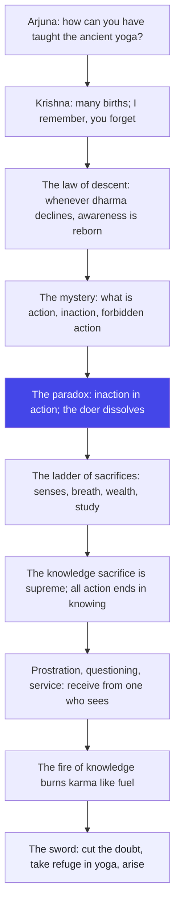

# Chapter 4: Jnana-Karma-Sanyasa Yoga — The Fire of Knowledge Burns Action into Freedom

> "You are not asked to leave action behind. You are asked to light a fire inside action — the fire of knowledge."
> — The Osho Way

---

Krishna has stopped arguing about whether Arjuna should fight. Now he opens the deepest door: what is action, really? He tells Arjuna that this yoga is ancient — it passed from the sun to Manu to Ikshvaku, through a chain of masters and disciples, and it has been lost in the world because people kept the technique and dropped the transmission. And then Krishna says something that turns the whole Gita on its head: whenever dharma declines, he is born again. Not as a theology lesson about incarnations, but as a living law of inner life — whenever your inner dharma declines, awareness is born again in you.

The chapter is called Jnana-Karma-Sanyasa Yoga, the yoga of knowledge, action, and renunciation. Notice the strange joining of three words that seem to contradict each other. Renunciation says leave everything. Action says do everything. Knowledge says understand everything. Krishna's answer is that these three are not three roads but one journey. You do not renounce action by running away from it; you renounce it by seeing through it. And seeing is the fire that burns action — not to destroy it, but to release its smoke of anxiety and leave behind pure energy.

Osho reads this chapter as the death certificate of the ego-doer. The doer inside you is the one who sighs, "I did this, and I deserve that result." That doer is the smoke. The fire of knowledge burns the doer, and what remains is action without the actor — inaction in action. That is why Krishna calls action a mystery that even the wise are confused about. It is the deepest paradox of inner life: you can be completely engaged and completely free at the same moment. The crisis of the doer is the door to the witness.

This chapter is where Krishna begins to reveal himself — the avatara, the descent. Osho insists you do not need to believe in a historical incarnation to taste this. The avatar is not a past event; it is a present possibility. Every time your greed, your anger, your unconsciousness push dharma down inside you, something in you descends again. That something is what this chapter invites you to meet: the one who acts without being touched, the one who knows without accumulating, the one who is born in every age — including this one, in you.

## Learning Objectives

After completing this chapter you will be able to:

1. **Trace the transmission** — understand why Krishna calls this yoga ancient and why it was lost, and what the guru-parampara means for your own learning.
2. **Meet the avatara within** — read the "descent" of the divine not as mythology but as a law of inner awareness that re-arises whenever your dharma declines.
3. **Untangle action, inaction, and forbidden action** — grasp the paradox of inaction in action and action in inaction, the chapter's core insight.
4. **Distinguish the many sacrifices** — recognize the whole ladder of inner offerings, from ritual gifts to the knowledge sacrifice where the giver, the gift, and the fire are one.
5. **Use doubt and knowledge correctly** — understand why doubt destroys and knowledge liberates, and how to cut the knot of doubt with the sword of knowing.
6. **Build a TypeScript tool** — a Karma Binding Analyzer that scores your daily actions for the binding forces of ego and expectation, and reports your jnana-fire index.

---

## Jnana-Karma-Sanyasa Yoga at a Glance

### The scene and the speakers

We are still on the field of Kurukshetra, the great plain where two armies wait, and Krishna is the charioteer speaking to Arjuna, the archer who refused to fight. This chapter follows the previous teaching on karma yoga: Krishna has told Arjuna to act without attachment. Now Arjuna's deeper question surfaces — if action is so dangerous, why not renounce it altogether? Krishna answers with a history lesson, a cosmology, and a psychology all at once. He reveals that this yoga is not his invention; it is the oldest teaching, passed from the sun-god Vivasvan to Manu, the first human lawgiver, and from Manu to Ikshvaku, ancestor of the solar dynasty of kings. The transmission is a line of royal sages — kings who meditated, rulers who were seers. That is the Mahabharata context: this knowledge was never meant for hermits only. It was meant for people with kingdoms to run and battles to fight.

### The Osho lens

Osho refuses to let this chapter become theology. He reads the avatara not as a supernatural intervention in history but as a law of consciousness: whenever truth declines, truth descends. The same law works in your life. When your honesty declines, honesty is born again in you as unease. When your love declines, love is born again as longing. The descent of the divine is the re-birth of awareness in an unconscious mind. And the fourfold order Krishna describes is not a social caste system — it is a psychology of the gunas, the three qualities of nature. Every person carries all four varnas inside: the brahmin who sees, the kshatriya who acts, the vaishya who trades, the shudra who serves. The chapter becomes a mirror, not a mandate.

### The structure of the chapter

The 42 shlokas move in four waves:

1. **Movement 1: 4.1–4.15 — The ancient transmission.** Krishna speaks of the lost yoga, his own births, the law of descent, and why he is untouched by action. This is the ground: the divine doer as non-doer.
2. **Movement 2: 4.16–4.24 — The mystery of action.** What is action, what is inaction, what is forbidden action? The paradox of inaction in action, the wise one whose undertakings are desireless, and the vision where the whole act becomes Brahman.
3. **Movement 3: 4.25–4.33 — The many sacrifices.** A vast inventory of offerings — to gods, to the senses, to breath, to knowledge — all forms of one fire, with the knowledge sacrifice crowned as supreme.
4. **Movement 4: 4.34–4.42 — The fire of knowledge and the sword.** How to receive knowledge from one who sees, how knowledge burns karma like fire burns fuel, and the final call: cut the doubt in your heart with the sword of knowledge, and arise.

### The three-framework note

The Gita's three great paths — karma (action), bhakti (love), jnana (knowledge) — are all alive in this chapter, and Krishna holds them as one. Karma appears as work done without craving for fruit. Bhakti appears in 4.11, where the divine responds to each person in the way they approach — love answers love in its own language. Jnana appears as the supreme sacrifice, the fire in which all other fires end. Osho's note: these are not successive rungs where you leave one behind. Knowledge without action is head-only; action without knowledge is blind; love without both is sentiment. The chapter is the place where the three threads are first woven together — the famous braiding that the rest of the Gita will keep tightening.

## Traditional Reading vs Osho-Style Reading

| Dimension | Traditional reading | Osho-style reading |
|--------|---------------------|--------------------|
| **The avatara (4.7-8)** | A historical incarnation of Vishnu in a particular age of decline | A law of consciousness: awareness is born again in you whenever your inner dharma falls |
| **The fourfold order (4.13)** | The social caste system created by God, duties fixed by birth | A psychology of the gunas — every person carries the seer, the warrior, the trader, and the servant inside |
| **Renunciation of action (4.20)** | Giving up desire for results so the soul is not tainted | The death of the ego-doer — action continues, only the actor evaporates |
| **Knowledge as fire (4.37)** | A metaphysical power that burns accumulated karma | The light of awareness that dissolves identification — you stop claiming your deeds as "mine" |
| **Doubt (4.40)** | Spiritual ignorance that bars the path to liberation | The refusal to take the inner leap — doubt as the intellect protecting its own throne |
| **Guru and questioning (4.34)** | Surrender to a realized teacher, obedience to tradition | Prostration, questioning, and service as three dimensions of real listening — the teacher is a mirror, not an authority |

## The Complete Text — All 42 Shlokas

### Shloka 4.1 — The Ancient Teaching

> श्रीभगवानुवाच |
> इमं विवस्वते योगं प्रोक्तवानहमव्ययम् |
> विवस्वान्मनवे प्राह मनुरिक्ष्वाकवेऽब्रवीत्

**Transliteration:** śrībhagavānuvāca . imaṃ vivasvate yogaṃ proktavānahamavyayam . vivasvānmanave prāha manurikṣvākave.abravīt

**Translation:** The Blessed Lord said: I taught this imperishable yoga to Vivasvan, the sun; Vivasvan told it to Manu, and Manu proclaimed it to Ikshvaku.

**Osho Darshan:** Even the first verse is a secret. The sun does not learn — the sun is the source of light. And yet the teaching flows from the sun to Manu to Ikshvaku, a chain of handing over. Osho says: truth is not something you invent; it is something that has always been traveling toward you through living hands. A book cannot carry it. Only one person to another, eye to eye, breath to breath, can the transmission survive. When you read these lines today, you are standing at the end of that chain — and the question is whether the chain stops at you or continues through you.

### Shloka 4.2 — The Lost Yoga

> एवं परम्पराप्राप्तिमं राजर्षयो विदुः |
> स कालेनेह महता योगो नष्टः परन्तप

**Transliteration:** evaṃ paramparāprāptamimaṃ rājarṣayo viduḥ . sa kāleneha mahatā yogo naṣṭaḥ parantapa

**Translation:** Thus handed down in an unbroken succession, the royal sages knew this yoga. But in the long course of time, O scorcher of foes, that yoga has been lost here on earth.

**Osho Darshan:** The technique never dies; the transmission dies. Rituals can be repeated for ten thousand years and still be empty, because no living heart passes through them. That is what Krishna means when he says the yoga was lost — it was still being practiced, but the fire in it had gone out. Osho invites you to feel the weight of this: you can memorize this entire chapter and still miss it, unless something in you catches fire. The difference between a dead tradition and a living one is a single person who has truly seen.

### Shloka 4.3 — The Supreme Secret

> स एवायं मया तेऽद्य योगः प्रोक्तः पुरातनः |
> भक्तोऽसि मे सखा चेति रहस्यं ह्येतदुत्तमम्

**Transliteration:** sa evāyaṃ mayā te.adya yogaḥ proktaḥ purātanaḥ . bhakto.asi me sakhā ceti rahasyaṃ hyetaduttamam

**Translation:** That same ancient yoga I have now taught to you, because you are my devotee and my friend — this is the supreme secret.

**Osho Darshan:** Notice why Krishna gives the secret: not because Arjuna is intelligent, not because he deserves it by rank, but because he is a lover and a friend. Osho says the deepest truths are never given to the clever — they are given to the devoted, because only love has the patience to hold a mystery without crushing it into information. The head wants to dissect; the heart wants to sit beside. Knowledge that comes through love is the only knowledge that transforms.

### Shloka 4.4 — Arjuna's Honest Doubt

> अर्जुन उवाच |
> अपरं भवतो जन्म परं जन्म विवस्वतः |
> कथमेतद्विजानीयां त्वमादौ प्रोक्तवानिति

**Transliteration:** arjuna uvāca . aparaṃ bhavato janma paraṃ janma vivasvataḥ . kathametadvijānīyāṃ tvamādau proktavāniti

**Translation:** Arjuna said: Your birth came later, and the birth of Vivasvan came earlier. How am I to understand that you taught this yoga at the beginning of time?

**Osho Darshan:** Arjuna asks the question every honest student must ask: the teacher standing before him is younger than the teaching he claims to have given. Osho loves this doubt — it is the first sign that Arjuna is not a parrot. He will not swallow the story whole; he wants to understand. Doubt is not the enemy of the path; borrowed belief is. A doubt that is honestly voiced is already half a question that can become knowing, while a belief that is never examined stays forever a stranger inside you.

### Shloka 4.5 — The Many Births

> श्रीभगवानुवाच |
> बहूनि मे व्यतीतानि जन्मानि तव चार्जुन |
> तान्यहं वेद सर्वाणि न त्वं वेत्थ परन्तप

**Transliteration:** śrībhagavānuvāca . bahūni me vyatītāni janmāni tava cārjuna . tānyahaṃ veda sarvāṇi na tvaṃ vettha parantapa

**Translation:** The Blessed Lord said: Many births of mine have passed, and of yours too, O Arjuna. I remember them all; you remember none, O scorcher of foes.

**Osho Darshan:** Krishna's answer is a riddle about memory and identity. You have been here before — in this body, in other bodies, in other roles — but you do not remember, because your memory is tied to your mask. Osho says: awareness is memory without the mask. The witness remembers what the doer forgets. You have also lived many small births in this single life — every time an old identity died and a new one was born. And each time, you forgot the lesson of the previous life of that identity.

### Shloka 4.6 — The Unborn Is Born

> अजोऽपि सन्नव्ययात्मा भूतानामीश्वरोऽपि सन् |
> प्रकृतिं स्वामधिष्ठाय सम्भवाम्यात्ममायया

**Transliteration:** ajo.api sannavyayātmā bhūtānāmīśvaro.api san . prakṛtiṃ svāmadhiṣṭhāya sambhavāmyātmamāyayā

**Translation:** Though I am unborn, of imperishable nature, and the Lord of all beings, still I take birth by my own maya, governing my own nature.

**Osho Darshan:** Here is the first great paradox: the unborn is born, the Lord becomes a servant in a chariot. Osho reads maya not as illusion to be condemned but as the power of self-forgetting through which the whole play of existence becomes possible. The divine descends into form out of love — and that is exactly what you do every morning when you step into your role of worker, parent, friend. The art is to remember, even while wearing the mask, that you are not the mask. To be born by your own maya is to enter the game knowingly.

### Shloka 4.7 — Whenever Dharma Declines

> यदा यदा हि धर्मस्य ग्लानिर्भवति भारत |
> अभ्युत्थानमधर्मस्य तदात्मानं सृजाम्यहम्

**Transliteration:** yadā yadā hi dharmasya glānirbhavati bhārata . abhyutthānamadharmasya tadātmānaṃ sṛjāmyaham

**Translation:** Whenever there is a decline of dharma, O Bharata, and a rise of adharma, then I manifest myself.

**Osho Darshan:** The most quoted verse of the Gita, and the most misunderstood. Osho does not ask you to believe in a god who patrols history. He asks you to watch your own inner history: whenever truth declines in you, truth descends in you — as a question, as a restlessness, as a knock that will not stop. The avatara is not a visit from above; it is the re-birth of your own awareness. When your greed becomes so loud that you begin to feel ashamed, that shame is the descent. Listen to it; it is the divine arriving in you.

### Shloka 4.8 — Born Age After Age

> परित्राणाय साधूनां विनाशाय च दुष्कृताम् |
> धर्मसंस्थापनार्थाय सम्भवामि युगे युगे

**Transliteration:** paritrāṇāya sādhūnāṃ vināśāya ca duṣkṛtām . dharmasaṃsthāpanārthāya sambhavāmi yuge yuge

**Translation:** For the protection of the good, for the destruction of the wicked, and for the establishment of dharma, I am born in every age.

**Osho Darshan:** Read this verse on the inner plane and it becomes a law of life: whenever you act to protect what is true in you, to dissolve what is cruel in you, and to re-establish your inner order, you are acting as the avatara. Osho adds a warning — do not appoint yourself the destroyer of others' wickedness. The destruction Krishna speaks of is first of all the destruction of the dushkrit inside you: the wicked deeds you keep rehearsing in your mind. Protect the good in you, dissolve the evil in you, and the age is already being redeemed.

### Shloka 4.9 — Knowing the Divine Birth and Action

> जन्म कर्म च मे दिव्यमेवं यो वेत्ति तत्त्वतः |
> त्यक्त्वा देहं पुनर्जन्म नैति मामेति सोऽर्जुन

**Transliteration:** janma karma ca me divyamevaṃ yo vetti tattvataḥ . tyaktvā dehaṃ punarjanma naiti māmeti so.arjuna

**Translation:** He who knows in truth my divine birth and action, having left the body, is not born again — he comes to me, O Arjuna.

**Osho Darshan:** "Divine birth and action" — not events to be believed, but a way of seeing your own life. The birth that matters is not your birthday; it is the moment you realize you are not the body, and every action done from that realization is divine action. Osho says: he who knows his own birth as consciousness and his own action as play has nothing more to be born into — because the whole cycle of becoming was a search for a home, and he has found it. Not born again means: no longer forced to return as a stranger to himself.

### Shloka 4.10 — The Many Who Have Crossed

> वीतरागभयक्रोधा मन्मया मामुपाश्रिताः |
> बहवो ज्ञानतपसा पूता मद्भावमागताः

**Transliteration:** vītarāgabhayakrodhā manmayā māmupāśritāḥ . bahavo jñānatapasā pūtā madbhāvamāgatāḥ

**Translation:** Freed from attachment, fear, and anger, absorbed in me, taking refuge in me, purified by the fire of knowledge, many have come to my very being.

**Osho Darshan:** Mark the three enemies named here: attachment, fear, anger. They are not three separate demons — they are one river flowing through three channels. Attachment is the hand that grabs, fear is the hand that trembles at losing what it grabbed, and anger is the hand that strikes when the loss happens. The fire of knowledge burns the whole river. Osho says you do not fight these three; you see them. Seeing is the tapas — the heat — that purifies. "Many have crossed" — the path is ancient, crowded, and ordinary. You are not the first, and you will not be the last.

### Shloka 4.11 — As You Come, So You Are Met

> ये यथा मां प्रपद्यन्ते तांस्तथैव भजाम्यहम् |
> मम वर्त्मानुवर्तन्ते मनुष्याः पार्थ सर्वशः

**Transliteration:** ye yathā māṃ prapadyante tāṃstathaiva bhajāmyaham . mama vartmānuvartante manuṣyāḥ pārtha sarvaśaḥ

**Translation:** In whatever way people approach me, in that same way I respond to them. All people follow my path, O Partha, in every way.

**Osho Darshan:** This is the verse of infinite hospitality. The divine does not demand one road; every road that leads toward truth is welcomed and answered in its own language. Osho says this is the test of a real religion: it does not say "only my path," it says "come, however you are coming." The greedy one comes with greed and is met; the lover comes with love and is met; the skeptic comes with doubt and is met. God is not a gatekeeper — God is a mirror. Whatever you bring, you receive back, refined, until one day you bring yourself and receive yourself.

### Shloka 4.12 — The Quick Fruits of Desire

> काङ्क्षन्तः कर्मणां सिद्धिं यजन्त इह देवताः |
> क्षिप्रं हि मानुषे लोके सिद्धिर्भवति कर्मजा

**Transliteration:** kāṅkṣantaḥ karmaṇāṃ siddhiṃ yajanta iha devatāḥ . kṣipraṃ hi mānuṣe loke siddhirbhavati karmajā

**Translation:** Those who long for success in action worship the gods here on earth, for success born of action comes quickly in the human world.

**Osho Darshan:** Honest economics: if you want quick results, do not wait for the slow alchemy of knowledge. The world runs on exchange — you give effort, you get fruit, fast. Osho is not against this; he only asks you to see what you are actually buying. Success born of action is real and swift, but it is a loan that comes with interest: the more you need it, the more you need it. The devatas you worship may be a god, a boss, a market, a trend — all of them can deliver quick fruits. But the fruit of knowledge ripens on a different tree.

### Shloka 4.13 — The Fourfold Order and the Non-Doer

> चातुर्वर्ण्यं मया सृष्टं गुणकर्मविभागशः |
> तस्य कर्तारमपि मां विद्ध्यकर्तारमव्ययम्

**Transliteration:** cāturvarṇyaṃ mayā sṛṣṭaṃ guṇakarmavibhāgaśaḥ . tasya kartāramapi māṃ viddhyakartāramavyayam

**Translation:** The fourfold order was created by me, divided according to guna and karma. Know me, who am its author, as the non-doer and the immutable.

**Osho Darshan:** This verse has been used to imprison people in a caste born of their parents — which is exactly what Krishna does not say. He says the division is by guna and karma: your qualities and your actions, not your family. Osho reads the four varnas as four inner functions present in every human being — the seer (brahmin), the protector (kshatriya), the trader (vaishya), the server (shudra). And the deepest line is the last: I am the author, yet the non-doer. The creator of the system stands outside the system. Never worship the machine; meet the one who is untouched by it.

### Shloka 4.14 — Untainted by Action

> न मां कर्माणि लिम्पन्ति न मे कर्मफले स्पृहा |
> इति मां योऽभिजानाति कर्मभिर्न स बध्यते

**Transliteration:** na māṃ karmāṇi limpanti na me karmaphale spṛhā . iti māṃ yo.abhijānāti karmabhirna sa badhyate

**Translation:** Actions do not taint me, nor do I crave their fruits. He who knows me thus is not bound by action either.

**Osho Darshan:** What makes an action stick to you like mud? Two things: the thought "I am doing this" and the thought "I want that result." Remove both, and the mud cannot stick — this is physics, not morality. Osho says the divine is not holy because it does good deeds; it is holy because it does not claim them. You can taste that holiness today: do one small thing completely, forget to file the result under your name, and feel how light the hand is. That lightness is what Krishna calls not being bound.

### Shloka 4.15 — The Ancient Seekers Acted

> एवं ज्ञात्वा कृतं कर्म पूर्वैरपि मुमुक्षुभिः |
> कुरु कर्मैव तस्मात्त्वं पूर्वैः पूर्वतरं कृतम्

**Transliteration:** evaṃ jñātvā kṛtaṃ karma pūrvairapi mumukṣubhiḥ . kuru karmaiva tasmāttvaṃ pūrvaiḥ pūrvataraṃ kṛtam

**Translation:** Having known this, even the ancient seekers of freedom performed action. Therefore do you also perform action, as the ancients did long ago.

**Osho Darshan:** The seekers of freedom worked. This shatters the lazy fantasy that liberation means sitting with closed eyes while life passes. Osho insists: the people who burned for moksha did not drop the world; they dropped the clutching of the world. Janaka the king, the Gita will remind you, ruled a kingdom and was liberated. So do not wait to be free before you act — act your way into freedom. The door does not open for those who stop walking; it opens for those who walk without grasping.

### Shloka 4.16 — Even the Wise Are Confused

> किं कर्म किमकर्मेति कवयोऽप्यत्र मोहिताः |
> तत्ते कर्म प्रवक्ष्यामि यज्ज्ञात्वा मोक्ष्यसेऽशुभात्

**Transliteration:** kiṃ karma kimakarmeti kavayo.apyatra mohitāḥ . tatte karma pravakṣyāmi yajjñātvā mokṣyase.aśubhāt

**Translation:** What is action? What is inaction? Even the wise are confused about this. I will teach you this action, knowing which you shall be released from what is inauspicious.

**Osho Darshan:** Now the chapter reaches its core question, and Krishna admits that even the clever stumble here. Osho says the confusion is built in, because the question itself comes from the wrong place: the doer asks "what should I do?" while the witness asks "who is doing?" You cannot solve the mystery of action with more action, any more than you can see your own face with your hands. You need a mirror. That mirror is what Krishna hands over in the next verses — and it is not a new technique, it is a new seat: the seat of the witness.

### Shloka 4.17 — The Three Kinds of Karma

> कर्मणो ह्यपि बोद्धव्यं बोद्धव्यं च विकर्मणः |
> अकर्मणश्च बोद्धव्यं गहना कर्मणो गतिः

**Transliteration:** karmaṇo hyapi boddhavyaṃ boddhavyaṃ ca vikarmaṇaḥ . akarmaṇaśca boddhavyaṃ gahanā karmaṇo gatiḥ

**Translation:** The nature of action must be understood, and also of forbidden action, and of inaction. Deep and hard to fathom is the path of action.

**Osho Darshan:** Three doors: karma, vikarma, akarma. Action is the work done; forbidden action is the work that injures — including the inner sabotage you do to yourself; inaction is the stillness that is not laziness. Osho points to the trap: the lazy man calls his laziness inaction, and the frantic man calls his running action. Both are wrong, and both are entangled. The path of action is gahana — a dark forest. The only lantern that can pass through it is awareness, because in that forest the same gesture can be a cage or a door.

### Shloka 4.18 — Inaction in Action

> कर्मण्यकर्म यः पश्येदकर्मणि च कर्म यः |
> स बुद्धिमान्मनुष्येषु स युक्तः कृत्स्नकर्मकृत्

**Transliteration:** karmaṇyakarma yaḥ paśyedakarmaṇi ca karma yaḥ . sa buddhimānmanuṣyeṣu sa yuktaḥ kṛtsnakarmakṛt

**Translation:** He who sees inaction in action and action in inaction is wise among people; he is united in yoga and performs all actions.

**Osho Darshan:** The most explosive verse of the chapter. Krishna says: the doer who is awake within his doing is actually doing nothing — and the idler who dreams of doing, sits in a storm of inner action. Osho says this is the whole science of witnessing in a single couplet. Your body can be fully engaged — hands moving, voice speaking, feet walking — while your inner being remains as still as a lamp in a windless room. And your body can be perfectly still while your mind runs a thousand races. Watch which one you actually live in. The wise are known not by what they do but by where they stand.

### Shloka 4.19 — The Sage of Burnt Undertakings

> यस्य सर्वे समारम्भाः कामसङ्कल्पवर्जिताः |
> ज्ञानाग्निदग्धकर्माणं तमाहुः पण्डितं बुधाः

**Transliteration:** yasya sarve samārambhāḥ kāmasaṅkalpavarjitāḥ . jñānāgnidagdhakarmāṇaṃ tamāhuḥ paṇḍitaṃ budhāḥ

**Translation:** He whose undertakings are free of desire and personal designs, whose actions are burnt by the fire of knowledge — the wise call him a sage.

**Osho Darshan:** Note the two words that vanish in the sage: kama, desire, and sankalpa, the private plan. Most of your activity is really a deal you have made with the future: I will do this so that I get that. The sage's undertakings have no hidden clause. Osho says the fire of knowledge does not burn the deed — it burns the seed of the deed, the wanting inside it. A deed that comes from want creates a chain; a deed that comes from fullness ends at its own moment. The sage's actions leave no footprints because nothing was ever claimed.

### Shloka 4.20 — Ever Content, Depending on Nothing

> त्यक्त्वा कर्मफलासङ्गं नित्यतृप्तो निराश्रयः |
> कर्मण्यभिप्रवृत्तोऽपि नैव किञ्चित्करोति सः

**Transliteration:** tyaktvā karmaphalāsaṅgaṃ nityatṛpto nirāśrayaḥ . karmaṇyabhipravṛtto.api naiva kiñcitkaroti saḥ

**Translation:** Having abandoned attachment to the fruits of action, ever content, resting on nothing — though engaged in activity, he really does nothing at all.

**Osho Darshan:** Three marks of the free worker: no attachment to results, eternal contentment, and dependence on nothing. Osho loves the word nirashraya — leaning on nothing. Your whole life is a series of crutches: results, opinions, applause, possessions. The free one has thrown away the crutches and discovers that the skeleton can stand — more, that it was never the skeleton standing, but the life within it. Contentment is not a mood that visits; it is the home he lives in, and work flows from that home like water from a spring.

### Shloka 4.21 — The Body Acts, the Self Does Not

> निराशीर्यतचित्तात्मा त्यक्तसर्वपरिग्रहः |
> शारीरं केवलं कर्म कुर्वन्नाप्नोति किल्बिषम्

**Transliteration:** nirāśīryatacittātmā tyaktasarvaparigrahaḥ . śārīraṃ kevalaṃ karma kurvannāpnoti kilbiṣam

**Translation:** Without hope, with mind and self controlled, having abandoned all possessiveness, doing only bodily action, he incurs no stain.

**Osho Darshan:** There is a beautiful humility in this verse: the free one does not pretend his hands are not moving. He does sharira karma, bodily action, and nothing more — no inner commentary, no bargaining. Osho says the stain of action comes from the commentary track running inside your head: "I am doing this, this is mine, I deserve credit." When the commentary stops, the gesture becomes pure — like a dancer's foot or a musician's breath. The body dances; nobody claims the dance. That nobody is the clean one.

### Shloka 4.22 — Even in Success and Failure

> यदृच्छालाभसन्तुष्टो द्वन्द्वातीतो विमत्सरः |
> समः सिद्धावसिद्धौ च कृत्वापि न निबध्यते

**Transliteration:** yadṛcchālābhasantuṣṭo dvandvātīto vimatsaraḥ . samaḥ siddhāvasiddhau ca kṛtvāpi na nibadhyate

**Translation:** Content with whatever comes of its own accord, beyond the pairs of opposites, free of envy, equal in success and failure — though acting, he is not bound.

**Osho Darshan:** The pairs of opposites are the two sides of one trap: success and failure, praise and blame, gain and loss. Osho says most people do not want success — they want the privilege of fearing failure, because fear gives life its urgency. The free one has walked out of the whole arena. Whatever comes, comes; whatever goes, goes. He is sama — equal — in both, and equality is not indifference. It is the warm presence of someone who knows the tide is not the sea. Test it on your next small failure: does the wave own you, or do you watch it?

### Shloka 4.23 — Actions That Dissolve

> गतसङ्गस्य मुक्तस्य ज्ञानावस्थितचेतसः |
> यज्ञायाचरतः कर्म समग्रं प्रविलीयते

**Transliteration:** gatasaṅgasya muktasya jñānāvasthitacetasaḥ . yajñāyācarataḥ karma samagraṃ pravilīyate

**Translation:** For one free of attachment, liberated, whose mind is established in knowledge, working for the sake of sacrifice — the whole of action dissolves.

**Osho Darshan:** A new word enters: yajna — sacrifice, offering. The free one does not work for himself, for his family, for his reputation; he works as an offering, like a flower placed at a shrine. And the miracle: the offering dissolves the offering. Osho says this is the alchemy of gratitude — when your work is given away at the moment it is done, nothing accumulates, nothing rots, nothing weighs. You do not become a saint by renouncing the world; you become a saint by giving the world your work as a gift.

### Shloka 4.24 — All Is Brahman

> ब्रह्मार्पणं ब्रह्म हविर्ब्रह्माग्नौ ब्रह्मणा हुतम् |
> ब्रह्मैव तेन गन्तव्यं ब्रह्मकर्मसमाधिना

**Transliteration:** brahmārpaṇaṃ brahma havirbrahmāgnau brahmaṇā hutam . brahmaiva tena gantavyaṃ brahmakarmasamādhinā

**Translation:** Brahman is the offering, Brahman is the oblation, poured by Brahman into the fire of Brahman. Brahman alone is reached by him who is absorbed in action as Brahman.

**Osho Darshan:** The last separation dies here. The giver, the gift, the fire, the act of giving — all one. Osho calls this the end of the arithmetic of religion: you stop counting what you give and what you will get, because there is only one substance everywhere. When you can look at your work, your anger, your love, your body, and your death and see the same one substance in all of them, then action has become samadhi. Not a posture — the whole of life standing in the sacred fire without being burnt.

### Shloka 4.25 — Two Kinds of Offering

> दैवमेवापरे यज्ञं योगिनः पर्युपासते |
> ब्रह्माग्नावपरे यज्ञं यज्ञेनैवोपजुह्वति

**Transliteration:** daivamevāpare yajñaṃ yoginaḥ paryupāsate . brahmāgnāvapare yajñaṃ yajñenaivopajuhvati

**Translation:** Some yogis worship the sacrifice to the gods; others offer sacrifice itself as the offering in the fire of Brahman.

**Osho Darshan:** Two altitudes of worship: some offer to the gods — to the powers of nature, the forces of life — and this is real and ancient and good. Others go deeper: they offer the offering itself. The first path works with the world; the second works with the very structure of giving. Osho says both are true, but the second is the fuller truth — because when you can offer your offering, you have understood that even your worship was not yours. All devotion ends in the discovery that the devotee, too, is being offered.

### Shloka 4.26 — Senses and Sense-Objects as Sacrifice

> श्रोत्रादीनीन्द्रियाण्यन्ये संयमाग्निषु जुह्वति |
> शब्दादीन्विषयानन्य इन्द्रियाग्निषु जुह्वति

**Transliteration:** śrotrādīnīndriyāṇyanye saṃyamāgniṣu juhvati . śabdādīnviṣayānanya indriyāgniṣu juhvati

**Translation:** Some offer the hearing and other senses into the fire of restraint; others offer sound and the other sense-objects into the fire of the senses.

**Osho Darshan:** The inventory of inner offerings begins. Two movements: some burn the senses themselves — they starve the organs of their wandering; others burn the objects — they stop chasing sounds, sights, tastes. Osho says both are real fires but one is more mature: you cannot burn a sense by strangling it. What you can burn is the fascination. The ear remains, the sound remains, but the grabbing is gone. That is the difference between suppression, which makes you dead, and sacrifice, which makes you spacious.

### Shloka 4.27 — All Functions Offered

> सर्वाणीन्द्रियकर्माणि प्राणकर्माणि चापरे |
> आत्मसंयमयोगाग्नौ जुह्वति ज्ञानदीपिते

**Transliteration:** sarvāṇīndriyakarmāṇi prāṇakarmāṇi cāpare . ātmasaṃyamayogāgnau juhvati jñānadīpite

**Translation:** Others offer all the functions of the senses and of the breath into the fire of self-restraint, kindled by knowledge.

**Osho Darshan:** Now even the breath becomes an offering — the in-breath and the out-breath are poured into the fire of self-discipline. Osho says this is where meditation becomes scientific: when you watch your breathing, you are not doing breathing exercises, you are offering the breath into the fire of awareness. The fire is lit by knowledge — by the understanding of what you are doing. Without that understanding, breath control is gymnastics; with it, every breath is worship. The one who breathes is not you; the one who watches the breathing is the sacrifice.

### Shloka 4.28 — Wealth, Austerity, Study as Sacrifice

> द्रव्ययज्ञास्तपोयज्ञा योगयज्ञास्तथापरे |
> स्वाध्यायज्ञानयज्ञाश्च यतयः संशितव्रताः

**Transliteration:** dravyayajñāstapoyajñā yogayajñāstathāpare . svādhyāyajñānayajñāśca yatayaḥ saṃśitavratāḥ

**Translation:** Others offer wealth as sacrifice, others austerity, others yoga, and the disciplined ones of firm vows offer study of scripture and knowledge.

**Osho Darshan:** The catalogue widens: money can be an offering, discipline can be an offering, practice can be an offering, even study can be an offering. Osho notes that everything depends on the fire, not on the fuel. Money given with a tight heart is commerce; money given freely is sacrifice. The same is true of your knowledge — you can hoard what you know like a miser, or pour it out like a lamp. The vow that matters is the one you make to keep the fire burning: that whatever you have, you give.

### Shloka 4.29 — Breath in Breath

> अपाने जुह्वति प्राणं प्राणेऽपानं तथापरे |
> प्राणापानगती रुद्ध्वा प्राणायामपरायणाः

**Transliteration:** apāne juhvati prāṇaṃ prāṇe.apānaṃ tathāpare . prāṇāpānagatī ruddhvā prāṇāyāmaparāyaṇāḥ

**Translation:** Others offer the in-breath into the out-breath and the out-breath into the in-breath, restraining the two currents, devoted to the control of prana.

**Osho Darshan:** The science of pranayama appears inside the list of sacrifices — breath offered into breath, a self-consuming fire that needs no fuel but itself. Osho says this is the most intimate sacrifice available to you: you can practice it at a traffic light, in a meeting, before sleep. The mind and the breath are one river; slow the breath and the mind begins to slow, the thoughts begin to dissolve. And the deepest point: when both currents are held in balance, you touch the still point between them — the witness who is neither in-breath nor out-breath.

### Shloka 4.30 — Regulated Food, Offering to Offerings

> अपरे नियताहाराः प्राणान्प्राणेषु जुह्वति |
> सर्वेऽप्येते यज्ञविदो यज्ञक्षपितकल्मषाः

**Transliteration:** apare niyatāhārāḥ prāṇānprāṇeṣu juhvati . sarve.apyete yajñavido yajñakṣapitakalmaṣāḥ

**Translation:** Others of regulated diet offer their life-breaths into the life-breaths. All these are knowers of sacrifice, whose stains are burnt away by sacrifice.

**Osho Darshan:** Even eating becomes part of the sacrifice — regulated food, food eaten with awareness, is breath offered into breath. Osho says the body is a fire, and food is its fuel; eat unconsciously and the fire smokes, eat with gratitude and the fire becomes clean. And then the great reassurance: all these — the giver, the breather, the faster, the student — are knowers of sacrifice. There is no one path, only one fire with many fuels. Whatever your temperament, you can find your way into the fire. The only sin is to stay outside it, cold and unoffered.

### Shloka 4.31 — The Nectar of the Remnant

> यज्ञशिष्टामृतभुजो यान्ति ब्रह्म सनातनम् |
> नायं लोकोऽस्त्ययज्ञस्य कुतोऽन्यः कुरुसत्तम

**Transliteration:** yajñaśiṣṭāmṛtabhujo yānti brahma sanātanam . nāyaṃ loko.astyayajñasya kuto.anyaḥ kurusattama

**Translation:** Those who eat the nectar of the remnant of sacrifice go to the eternal Brahman. There is no world even for the one who does not sacrifice — how then the other, O best of the Kurus?

**Osho Darshan:** After the fire, what remains is amrita — nectar, the blessed remainder. Osho says life becomes a feast only when you stop grabbing at it and start receiving what the fire leaves behind. And the warning is blunt: the person who never offers anything has no world — he is always eating, never tasting; always accumulating, never receiving. Watch a miser eat; watch a lover eat. The difference is the remnant. The lover is fed by what is left over; the miser is starved by everything he keeps.

### Shloka 4.32 — Born of Action, Know Them All

> एवं बहुविधा यज्ञा वितता ब्रह्मणो मुखे |
> कर्मजान्विद्धि तान्सर्वानेवं ज्ञात्वा विमोक्ष्यसे

**Transliteration:** evaṃ bahuvidhā yajñā vitatā brahmaṇo mukhe . karmajānviddhi tānsarvānevaṃ jñātvā vimokṣyase

**Translation:** Thus many sacrifices are spread before the mouth of Brahman. Know them all as born of action — and knowing this, you shall be liberated.

**Osho Darshan:** The whole festival of sacrifices is a celebration of action — even renunciation is born of action, even knowledge is an act. Osho says this is the Gita's genius: it never lets you escape into passivity. The point is not to stop acting but to act in such a way that the action completes itself and dies at the moment of completion. When you know that every yajna is karmaja — born of action — you stop despising action and stop being enslaved by it. Both hatred and addiction fall away, and that double freedom is moksha.

### Shloka 4.33 — Knowledge Surpasses All Sacrifices

> श्रेयान्द्रव्यमयाद्यज्ञाज्ज्ञानयज्ञः परन्तप |
> सर्वं कर्माखिलं पार्थ ज्ञाने परिसमाप्यते

**Transliteration:** śreyāndravyamayādyajñājjñānayajñaḥ parantapa . sarvaṃ karmākhilaṃ pārtha jñāne parisamāpyate

**Translation:** The sacrifice of knowledge is greater than sacrifice with material objects, O scorcher of foes. All action, in its entirety, O Partha, culminates in knowledge.

**Osho Darshan:** The crown of the inventory: jnana-yajna, the knowledge sacrifice, is supreme. Why? Because material sacrifice changes the outer world, while knowledge changes the inner one — and every other sacrifice, if followed to its end, terminates in knowing. Osho says all action is a long staircase, and the top step is understanding. A man can give away his whole fortune and still be a fool; but the moment understanding dawns, even the fool's silence is a festival. Do not stop at giving; grow until you know what the giving was for.

### Shloka 4.34 — Prostration, Question, Service

> तद्विद्धि प्रणिपातेन परिप्रश्नेन सेवया |
> उपदेक्ष्यन्ति ते ज्ञानं ज्ञानिनस्तत्त्वदर्शिनः

**Transliteration:** tadviddhi praṇipātena paripraśnena sevayā . upadekṣyanti te jñānaṃ jñāninastattvadarśinaḥ

**Translation:** Know that truth by prostration, by questioning, and by service — the wise who have seen the truth will teach you that knowledge.

**Osho Darshan:** Three keys to receiving: prostrate — surrender your knowing, question — bring your full doubt, serve — stand near the fire long enough to catch warmth. Osho says the teacher worth having is the one who has seen, not the one who has read — and you can tell the difference by the light, not by the certificates. But remember: prostration without questioning is slavery, and questioning without service is cleverness. All three together open the door. The teacher is a door, not a destination — enter and walk on, grateful.

### Shloka 4.35 — No More Delusion

> यज्ज्ञात्वा न पुनर्मोहमेवं यास्यसि पाण्डव |
> येन भूतान्यशेषेण द्रक्ष्यस्यात्मन्यथो मयि

**Transliteration:** yajjñātvā na punarmohamevaṃ yāsyasi pāṇḍava . yena bhūtānyaśeṣāṇi drakṣyasyātmanyatho mayi

**Translation:** Knowing which, O Pandava, you shall not fall into this delusion again; and by it you shall see all beings in your Self, and also in me.

**Osho Darshan:** The promise is not a better theory — it is the end of delusion itself, because delusion is not a mistake of information; it is the fog of the separate self. When you see all beings in your Self, the fog has lifted. Osho says this seeing is not poetry; it is the most practical of all perceptions. The person who sees others in himself cannot exploit, cannot deceive, cannot kill — not because of a commandment, but because the separation that made cruelty possible has dissolved. This is the only peace treaty that has ever worked.

### Shloka 4.36 — The Raft of Knowledge

> अपि चेदसि पापेभ्यः सर्वेभ्यः पापकृत्तमः |
> सर्वं ज्ञानप्लवेनैव वृजिनं सन्तरिष्यसि

**Transliteration:** api cedasi pāpebhyaḥ sarvebhyaḥ pāpakṛttamaḥ . sarvaṃ jñānaplavenaiva vṛjinaṃ santariṣyasi

**Translation:** Even if you are the worst sinner of all sinners, you shall cross all that is crooked by the raft of knowledge alone.

**Osho Darshan:** No theology of punishment here — only an ocean and a raft. Osho says guilt is the favorite hiding place of the ego: as long as you are the greatest sinner, you are still somebody. The raft of knowledge cuts through both pride of virtue and pride of sin. Nothing is asked of you but to see. Not to deserve, not to prove, not to weep longer. Just to look with open eyes at what you have done and what you are — and the looking itself carries you across. The worst sinner has the shortest distance: he has the least illusion left.

### Shloka 4.37 — Fire Burns Fuel

> यथैधांसि समिद्धोऽग्निर्भस्मसात्कुरुतेऽर्जुन |
> ज्ञानाग्निः सर्वकर्माणि भस्मसात्कुरुते तथा

**Transliteration:** yathaidhāṃsi samiddho.agnirbhasmasātkurute.arjuna . jñānāgniḥ sarvakarmāṇi bhasmasātkurute tathā

**Translation:** As a blazing fire turns fuel to ashes, O Arjuna, so the fire of knowledge turns all actions to ashes.

**Osho Darshan:** The most famous image of the chapter: knowledge as fire, karma as fuel. Osho says the fire does not refuse the fuel — it burns it and is freed. Your past, your accumulated deeds, your old wounds — they are all fuel, and they are precious only as fuel. You have been carrying this wood on your back for years, believing it was your life. Knowledge is the discovery that the wood was always meant for burning, and the burning is the light. Let the whole stack go up. What remains is not ash — it is warmth, and in the warmth, freedom.

### Shloka 4.38 — Nothing Purer Than Knowledge

> न हि ज्ञानेन सदृशं पवित्रमिह विद्यते |
> तत्स्वयं योगसंसिद्धः कालेनात्मनि विन्दति

**Transliteration:** na hi jñānena sadṛśaṃ pavitramiha vidyate . tatsvayaṃ yogasaṃsiddhaḥ kālenātmani vindati

**Translation:** Verily, there is nothing here as purifying as knowledge. He who is perfected in yoga finds it in himself in due time.

**Osho Darshan:** Water cleans the body, ritual cleans the society, but only knowledge cleans consciousness. And note where it is found: in the Self, in due time. Osho says you cannot go to the market and buy this purity, and you cannot steal it from a guru. It ripens — like a fruit, like a season. The yogi who keeps practicing, keeps sitting, keeps watching, will find knowledge flowering inside his own being one day, as naturally as a tree keeps its appointment with spring. Patience is not a virtue here; it is the very method.

### Shloka 4.39 — Faith, Devotion, Restraint

> श्रद्धावाँल्लभते ज्ञानं तत्परः संयतेन्द्रियः |
> ज्ञानं लब्ध्वा परां शान्तिमचिरेणाधिगच्छति

**Transliteration:** śraddhāvā.Nllabhate jñānaṃ tatparaḥ saṃyatendriyaḥ . jñānaṃ labdhvā parāṃ śāntimacireṇādhigacchati

**Translation:** The one full of faith, devoted to it, with senses restrained, obtains knowledge; and having obtained knowledge, he quickly attains supreme peace.

**Osho Darshan:** Three conditions for the dawn: shraddha — trust that the path is real; tatpara — absorption, being utterly with the work; and restraint of the senses — not killing them, but giving them the day off. Osho says faith here is not belief in a dogma; it is the trust of a child walking into a dark room with a hand held out. Without that trust, you keep testing the water and the water keeps flowing. And the sequence is crucial: knowledge first, then peace. Peace is not the reward for knowing — it is what knowing feels like from inside.

### Shloka 4.40 — The Doubting Soul Is Lost

> अज्ञश्चाश्रद्दधानश्च संशयात्मा विनश्यति |
> नायं लोकोऽस्ति न परो न सुखं संशयात्मनः

**Transliteration:** ajñaścāśraddadhānaśca saṃśayātmā vinaśyati . nāyaṃ loko.asti na paro na sukhaṃ saṃśayātmanaḥ

**Translation:** The ignorant, the faithless, the doubting self goes to ruin. There is no this world, no other world, no happiness for the doubting soul.

**Osho Darshan:** This verse is the twin of 4.4 — and the difference is everything. Arjuna's doubt was a living question that knocked on the door; the doubt condemned here is doubt as a residence, a soul that lives permanently in the hallway between yes and no. Osho says the double-minded man is truly the most miserable: he never tastes the sweetness of commitment, never enjoys the release of trust, and even his pleasures are undermined by suspicion. He is not destroyed by the gods but by the eternal maybe. Come out of the hallway. Knock once, then choose.

### Shloka 4.41 — The Self-Possessed Are Not Bound

> योगसंन्यस्तकर्माणं ज्ञानसञ्छिन्नसंशयम् |
> आत्मवन्तं न कर्माणि निबध्नन्ति धनञ्जय

**Transliteration:** yogasaṃnyastakarmāṇaṃ jñānasañchinnasaṃśayam . ātmavantaṃ na karmāṇi nibadhnanti dhanañjaya

**Translation:** For him who has renounced actions through yoga, whose doubt is cut asunder by knowledge, who is self-possessed — actions do not bind him, O Dhananjaya.

**Osho Darshan:** The chapter's two medicines appear in one verse: yoga for renouncing action, knowledge for cutting doubt. Osho notes the quiet word at the center: atmavant — self-possessed, dwelling in the self. The bound man is always somewhere else — in the past, in the future, in others' opinions. The free man is at home in himself, and from that home even the heaviest work is light. Actions come to him like waves to a rock: they touch, they break, they dissolve. They do not bind, because he is not made of sand.

### Shloka 4.42 — The Sword of Knowledge

> तस्मादज्ञानसम्भूतं हृत्स्थं ज्ञानासिनात्मनः |
> छित्त्वैनं संशयं योगमातिष्ठोत्तिष्ठ भारत

**Transliteration:** tasmādajñānasambhūtaṃ hṛtsthaṃ jñānāsinātmanaḥ . chittvainaṃ saṃśayaṃ yogamātiṣṭhottiṣṭha bhārata

**Translation:** Therefore, having cut with the sword of knowledge the doubt born of ignorance that dwells in your heart, take refuge in yoga — arise, O Bharata!

**Osho Darshan:** The chapter ends where every inner teaching must end: not in conclusion but in command. Cut the doubt — not with more thinking, but with the sword of knowing. Then take refuge in yoga — in action, in union, in the practice. And then the smallest, largest word of all: uttishtha — arise! Osho says the whole Gita is in that word. The sitting, the thinking, the doubting must all end in standing up. Knowledge that does not make you stand is decoration. Arise, and act — the fire is lit, the fuel is ready, and the one who burns is already free.

## Key Themes

| Theme | Shlokas | Osho-style insight |
|-------|---------|--------------------|
| **The living transmission** | 4.1-4.3 | Truth passes hand to hand, not book to book; the technique survives, the fire is lost and must be re-lit |
| **The descent of awareness** | 4.5-4.9 | The avatara is a law of consciousness — awareness is born again in you whenever inner dharma declines |
| **The mystery of action** | 4.16-4.20 | Inaction in action: the witness is the only lantern in the dark forest of karma |
| **The death of the doer** | 4.20-4.24 | Drop the claim and the karma; the gesture remains pure when no one claims it |
| **The inventory of sacrifice** | 4.25-4.33 | Every offering is born of action; all rivers end in the ocean of knowledge |
| **Doubt, faith, and the sword** | 4.34-4.42 | Doubt as residence ruins; doubt as a question opens; knowledge cuts the knot, then you arise |

## The Inner Journey



## A Mind Map

```mermaid
mindmap
  root[(Jnana-Karma-Sanyasa Yoga)]
    The transmission
      Sun to Manu to Ikshvaku
      Lost in time
      Given to the devoted friend
    The descent
      The unborn is born
      Dharma declines, awareness descends
      Known in truth, no rebirth
    The mystery of action
      Inaction in action
      Desires and designs burnt
      Ever content, depending on nothing
    The sacrifices
      Senses in restraint
      Breath in breath
      Wealth, study, austerity
      Knowledge sacrifice supreme
    The fire and the sword
      Raft of knowledge
      Fire burns fuel
      Faith, devotion, restraint
      Cut doubt, arise
```

## Summary

- The chapter opens with the ancient lineage of the yoga and closes with a sword — it is a transmission, not an essay.
- Krishna reveals the law of the avatara: when dharma declines, awareness descends; read it as your own inner history.
- The core paradox is inaction in action: the doer can dissolve while the work continues, and the idler can be churning inside.
- The many sacrifices form one ladder — senses, breath, wealth, study — all culminating in the knowledge sacrifice.
- Knowledge is fire: it burns the binding power of karma while leaving the act itself free and luminous.
- Faith, absorption, and restraint prepare the ground; doubt as a home destroys; doubt as a question opens the way.
- The chapter ends standing: cut the doubt, take refuge in yoga, and arise.

## Practical Takeaways

- **Track the doer, not the deed** — before acting today, ask: am I working for the work or for the claim on the result? Notice how the claim creates anxiety.
- **Use the fourfold mirror** — in every task you have a seer, a warrior, a trader, and a servant inside; let the right one lead, whatever your family or job title says.
- **Make one thing an offering** — choose one daily action (your coffee, your email, your commute) and do it as a complete gift, with nothing to collect from it.
- **Breathe as sacrifice** — a minute of watching the breath is a yajna available in any meeting, queue, or traffic jam; it burns small anxieties like fuel.
- **Let the fire burn your past** — write down one old deed you keep carrying, then read 4.37 slowly; see the wood for what it is — fuel, not identity.
- **Ask one honest question** — like Arjuna, refuse borrowed belief: question your teacher, your path, yourself; a living doubt is already half the sword.

## Chapter Quiz

**Q1. According to Shloka 4.2, why was the ancient yoga lost?**

- a. Because the scriptures were burned
- b. Because the transmission through living teachers broke over time
- c. Because kings stopped practicing it
- d. Because it was never written down

<details class="tp-qa-card" data-qid="bg4-q1"><summary>Show Answer</summary>

**Answer: b.**
</details>

**Q2. In Shloka 4.7, Krishna says he manifests himself whenever —**

- a. A great sage is born
- b. A temple is consecrated
- c. Dharma declines and adharma rises
- d. A new yuga begins

<details class="tp-qa-card" data-qid="bg4-q2"><summary>Show Answer</summary>

**Answer: c.**
</details>

**Q3. What is the core paradox taught in Shloka 4.18?**

- a. Action is always better than inaction
- b. One can see inaction in action and action in inaction
- c. Inaction is never possible for humans
- d. The wise perform only mental actions

<details class="tp-qa-card" data-qid="bg4-q3"><summary>Show Answer</summary>

**Answer: b.**
</details>

**Q4. Which sacrifice does Krishna call supreme in Shloka 4.33?**

- a. The sacrifice of wealth
- b. The sacrifice of austerity
- c. The sacrifice of knowledge
- d. The sacrifice of study only

<details class="tp-qa-card" data-qid="bg4-q4"><summary>Show Answer</summary>

**Answer: c.**
</details>

**Q5. In Shloka 4.37, what happens to actions in the fire of knowledge?**

- a. They are stored for a later life
- b. They are turned to ashes, like fuel in a blazing fire
- c. They are carried forward into the next birth
- d. They become divine and are recorded in heaven

<details class="tp-qa-card" data-qid="bg4-q5"><summary>Show Answer</summary>

**Answer: b.**
</details>

**Q6. What does Krishna command Arjuna to do with the doubt born of ignorance in Shloka 4.42?**

- a. Meditate on it until it dissolves by itself
- b. Ask the sages to explain it again
- c. Cut it with the sword of knowledge, take refuge in yoga, and arise
- d. Surrender it to the gods in sacrifice

<details class="tp-qa-card" data-qid="bg4-q6"><summary>Show Answer</summary>

**Answer: c.**
</details>

## Exercises

1. **The transmission audit (reflection):** Write down the five most important truths you live by, and beside each one, name the living person — teacher, parent, friend — through whom it reached you. Reflect: are you a terminal point of that transmission, or does it continue through you to others?
2. **The inaction-in-action experiment (analysis):** For one day, split your activities into three columns: actions done with the doer (claiming and expecting), actions done without the doer (flowing), and inner action hidden in outer stillness (worry while idle). Count the hours in each column and study the result — where does your binding energy actually live?
3. **Extend the tool (TypeScript):** Take the Karma Binding Analyzer below and add a new field, `offeringScore`, that measures how many daily actions you performed as gifts. Plot the week and check whether offering and binding move in opposite directions.

## TypeScript Tool: Karma Binding Analyzer

```typescript
/*
 * Karma Binding Analyzer
 * Based on Jnana-Karma-Sanyasa Yoga (Chapter 4 of the Bhagavad Gita):
 * actions bind when the doer claims them; the fire of knowledge
 * burns the claim and leaves the action free.
 * Osho's lens: watch the doer, not the deed.
 */

interface DailyAction {
  date: string;
  name: string;
  expectationOfResult: number; // 0-10
  egoInvolvement: number;      // 0-10
  fearOfFailure: number;       // 0-10
  awarenessLevel: number;      // 0-10
}

interface BindingReport {
  totalActions: number;
  averageBinding: number;       // 0-100
  jnanaFireScore: number;       // 0-100
  status: string;
  oshoGuidance: string;
}

const BINDING_WEIGHTS = { expectation: 0.4, ego: 0.35, fear: 0.25 };

function bindingScore(action: DailyAction): number {
  const raw =
    action.expectationOfResult * BINDING_WEIGHTS.expectation +
    action.egoInvolvement * BINDING_WEIGHTS.ego +
    action.fearOfFailure * BINDING_WEIGHTS.fear;
  return Math.min(100, Math.round(raw * 10));
}

function jnanaFire(binding: number, awareness: number): number {
  return Math.max(0, Math.min(100, Math.round(awareness * 10 - binding * 0.5)));
}

function analyzeBindings(actions: DailyAction[]): BindingReport {
  const totalActions = actions.length;
  const avgBinding = Math.round(actions.reduce((s, a) => s + bindingScore(a), 0) / totalActions);
  const avgAwareness = actions.reduce((s, a) => s + a.awarenessLevel, 0) / totalActions;
  const jnanaFireScore = jnanaFire(avgBinding, avgAwareness);

  let status = 'bound';
  let oshoGuidance =
    'The doer is loud in you. Watch the claiming hand; do not argue with it, just see it.';
  if (jnanaFireScore >= 70) {
    status = 'burning bright';
    oshoGuidance = 'Your fire is lit. Act, but do not collect. The work itself is the worship.';
  } else if (jnanaFireScore >= 40) {
    status = 'kindling';
    oshoGuidance = 'The wood is gathered. Increase awareness; drop one expectation a day.';
  }

  return { totalActions, averageBinding: avgBinding, jnanaFireScore, status, oshoGuidance };
}

function runDemo(): void {
  const week: DailyAction[] = [
    { date: '2026-08-18', name: 'Project review', expectationOfResult: 8, egoInvolvement: 7, fearOfFailure: 5, awarenessLevel: 4 },
    { date: '2026-08-18', name: 'Morning tea', expectationOfResult: 1, egoInvolvement: 0, fearOfFailure: 0, awarenessLevel: 9 },
    { date: '2026-08-19', name: 'Interview prep', expectationOfResult: 9, egoInvolvement: 8, fearOfFailure: 8, awarenessLevel: 5 }
  ];

  const report = analyzeBindings(week);
  console.log('=== Karma Binding Analyzer ===');
  console.log(`Actions analyzed: ${report.totalActions}`);
  console.log(`Average binding: ${report.averageBinding}/100`);
  console.log(`Jnana fire score: ${report.jnanaFireScore}/100`);
  console.log(`Status: ${report.status}`);
  console.log(`Osho guidance: ${report.oshoGuidance}`);
}

runDemo();
```
