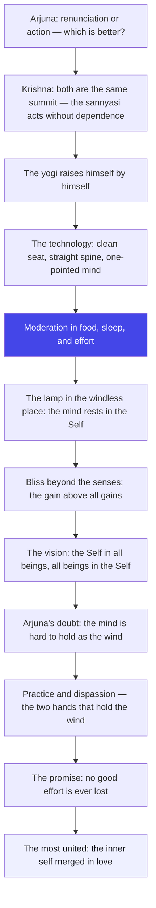

# Chapter 6: Dhyana Yoga — The Art of Meditation

> "The mind is a lamp; meditation is the windless place. Nothing needs to be added to the flame — only the wind must leave."
> — The Osho Way

---

After five chapters of preparation, the Gita now teaches the inner art itself. Chapter 5 ended with a promise — the sage sits, the breath is leveled, the gaze rests between the brows. Now Chapter 6 opens the door: this is dhyana, meditation, the direct meeting of the mind with the Self. And the first surprise is how practical Krishna is. He does not speak of mystical trances or impossible feats. He speaks of the seat, the posture, the food you eat, the hours you sleep, the thoughts you rehearse. Meditation, in this chapter, is not a miracle; it is a science of daily living with a lamp inside.

The central image of the chapter is the lamp in the windless place — nivatastha dipa. A flame is always the same flame; its flickering is not the flame's fault but the wind's. The mind is the lamp; the world is the wind. The flame does not need a new flame; it needs shelter. Osho reads this as the whole teaching of meditation in one picture: you do not become peaceful by adding peace to yourself, but by removing the winds of craving, comparison, and hurry that make you flicker. The stillness was always there underneath. Meditation is not producing it; it is returning to it.

Arjuna, with his usual honesty, asks the question every beginner carries: this mind is restless, turbulent, strong, obstinate — holding it is like holding the wind. And Krishna agrees! There is no denial, no scolding. Yes, the mind is hard to hold. But it is held by abhyasa and vairagya — practice and dispassion — the two hands that together grasp the wind. Osho stresses that these two are a pair: practice without dispassion becomes struggle, and dispassion without practice becomes fantasy. The wind is not grasped by force; it is grasped by familiarity — the repeated return, the repeated letting go.

And the chapter closes with the gentlest answer in the Gita to the fear of failure. Arjuna asks: what happens to the one who falls from the path? And Krishna says: nothing is lost. No one who does good ever comes to grief; the work of one life is carried like a seed into the next, and even a simple seeker outshines the ritualist. The yogi who falls is still a yogi — the fall is part of the climb. Osho calls this the compassion at the heart of the teaching: meditation is the only path where there is no real failure, because every sincere step is already arrival in slow motion.

## Learning Objectives

After completing this chapter you will be able to:

1. **Understand dhyana as inner science** — see meditation not as a miracle but as a disciplined art of seat, posture, food, and sleep.
2. **Hear the two answers** — grasp why Krishna first praises the sannyasi and then reveals that the true yogi is the one who acts without dependence.
3. **Practice the lamp-posture** — use the nivatastha dipa image and the abhyasa-vairagya pair to steady a restless mind.
4. **Meet the equal mind** — explore the samatva that treats a clod, a stone, and gold alike, and the same Self in friend, foe, and righteous alike.
5. **Answer the fear of failure** — understand the yogabhrashta's fate: no good work is ever lost, and the seeker outshines the ritualist.
6. **Build a TypeScript tool** — a Still-Lamp Meditation Logger that tracks daily sittings, wandering episodes, and your steadiness index.

---

## Dhyana Yoga at a Glance

### The scene and the speakers

Arjuna asks nothing small: of renunciation and action, which is better — and Krishna's answer is the hinge of the whole teaching. The true sannyasi and the true yogi are the same person: the one who acts without leaning on the fruit. Then the chapter moves from the outer to the inner — from the seat and posture to the one-pointed mind, from the steady practice to the steady vision, until the yogi sees the Self in all beings and all beings in the Self. The chapter ends with Arjuna's two honest doubts: can this restless mind ever be held, and what happens to the one who falls? Krishna answers both with the same medicine — practice, dispassion, and the promise that no good effort is ever wasted.

### The Osho lens

Osho calls this the most practical chapter of the Gita — and the most tender. It gives instructions anyone can follow today: sit still, straighten the spine, watch the breath, return the mind again and again. No temples, no rites, no qualifications. And at the same time it answers the beginner's deepest fear — "What if I fail?" — with the most forgiving sentence in the scripture: no one who does good ever comes to grief. Osho emphasizes the pair that no technique can replace: abhyasa and vairagya, the constant return and the deep letting go. Neither is difficult alone; together they are unstoppable. The wind is held by two hands.

### The structure of the chapter

The 47 shlokas move in four movements:

1. **Movement 1: 6.1–6.9 — Who is the true yogi.** The sannyasi and the yogi are one; yoga is renunciation of thoughts; the yogi is raised by himself, balanced in cold and heat, clod and gold alike.
2. **Movement 2: 6.10–6.19 — The technology of meditation.** Solitude, the firm seat, the erect posture, the one-pointed mind, moderation in food and sleep — and the lamp in the windless place.
3. **Movement 3: 6.20–6.32 — The fruits of meditation.** The bliss beyond the senses, the gain above all gains, the severance from pain, the Self in all beings, the highest yogi who feels others' pleasure and pain as his own.
4. **Movement 4: 6.33–6.47 — The two doubts and the promise.** Arjuna's fear of the restless mind, Krishna's abhyasa-vairagya medicine, the fate of the fallen yogi, and the final verse: the most united is the one who worships with the inner self merged.

### The three-framework note

Karma, jnana, bhakti — all three merge in this chapter like rivers. Karma appears in the preparation: action first, stillness after (6.3), the moderation of food and work (6.16-17). Jnana appears in the vision: seeing the Self in all beings (6.29), the equality of the clod and gold (6.8). Bhakti crowns the chapter in the final verse: among all yogis, the one who worships with faith and an inner self merged in the divine is the most united (6.47). Osho's reading: meditation is the crossroads where all three paths meet. Work disciplines the energy, knowledge opens the eyes, and love completes the meeting — the meditator who ends in love has traveled the whole Gita.

## Traditional Reading vs Osho-Style Reading

| Dimension | Traditional reading | Osho-style reading |
|--------|---------------------|--------------------|
| **The true sannyasi (6.1)** | One who has renounced rituals and fire | One who acts without depending on fruit — renunciation is a relationship with action |
| **The lamp in a windless place (6.19)** | A simile for perfect concentration | The whole science of meditation: the flame was always steady; only the wind needs to leave |
| **The seat and posture (6.11-13)** | Prescribed external arrangements for ascetics | Any clean spot, any firm seat, any human spine — the instructions are invitations, not admissions tests |
| **Solitude (6.10)** | A cave in the mountains | The inner solitude of one-pointedness — crowded streets become caves for the practiced mind |
| **Restraint of the mind (6.26)** | Dragging the mind back like a bull by force | The gentle return — each wandering is not a failure but another repetition of practice |
| **The fallen yogi (6.40-44)** | A theological scheme of rebirth and merit | The compassion at the heart of the path: no sincere effort is ever lost; the seed carries itself |
| **The most united (6.47)** | Bhakti as the highest among yogas | The inner self merged in the whole — meditation ripens into love, the deepest steadiness of all |

## The Complete Text — All 47 Shlokas

### Shloka 6.1 — The Doer Without Dependency

> श्रीभगवानुवाच |
> अनाश्रितः कर्मफलं कार्यं कर्म करोति यः |
> स संन्यासी च योगी च न निरग्निर्न चाक्रियः

**Transliteration:** śrībhagavānuvāca . anāśritaḥ karmaphalaṃ kāryaṃ karma karoti yaḥ . sa saṃnyāsī ca yogī ca na niragnirna cākriyaḥ

**Translation:** The Blessed Lord said: He who performs his bounden duty without depending on the fruits of his actions — he is a Sannyasi and a Yogi; not he who is without fire and without action.

**Osho Darshan:** The one who merely abandons the rituals — the fire, the ceremonies, the outer forms — is not the sannyasi. The sannyasi is the one who acts fully while depending on nothing. Osho says this verse kills the escape fantasy at birth: you cannot leave the world to become free, because freedom is not in the leaving. It is in the working without leaning. The man who works and claims nothing is carrying both the world and the sky at once. You are not asked to put out the fire; you are asked to stop burning your hand on it.

### Shloka 6.2 — Yoga Is Renunciation of Thoughts

> यं संन्यासमिति प्राहुर्योगं तं विद्धि पाण्डव |
> न ह्यसंन्यस्तसङ्कल्पो योगी भवति कश्चन

**Transliteration:** yaṃ saṃnyāsamiti prāhuryogaṃ taṃ viddhi pāṇḍava . na hyasaṃnyastasaṅkalpo yogī bhavati kaścana

**Translation:** Do you, O Arjuna, know Yoga to be that which they call renunciation; no one verily becomes a Yogi who has not renounced thoughts.

**Osho Darshan:** The word sankalpa means the planning mind — the imagination that rehearses the future and clings to its own schemes. Yoga, says Krishna, is the renunciation of that planning. Osho points out the radical claim: the mind that is always arranging tomorrow can never be a yogi, because yoga is presence and planning is absence. You do not renounce action; you renounce the thought-stream that precedes and follows action. Watch your own mind for five minutes and count the plans — that arithmetic is your distance from yoga. The renounced mind is not empty; it is simply free of tomorrow.

### Shloka 6.3 — Action First, Stillness After

> आरुरुक्षोर्मुनेर्योगं कर्म कारणमुच्यते |
> योगारूढस्य तस्यैव शमः कारणमुच्यते

**Transliteration:** ārurukṣormuneryogaṃ karma kāraṇamucyate . yogārūḍhasya tasyaiva śamaḥ kāraṇamucyate

**Translation:** For a sage who wishes to attain to Yoga, action is said to be the means; for the same sage who has attained to Yoga, inaction is said to be the means.

**Osho Darshan:** The same person needs opposite medicines at opposite stages: climbing the mountain, use your hands; standing on the summit, rest. Osho says the tragedy of spiritual life is taking the medicine of one stage into another. Beginners who sit in premature stillness are avoiding, not climbing; adepts who keep busy after arrival are clinging, not living. The verse is a mirror: where are you right now? If action feels like a burden, you have not yet climbed enough; if stillness feels like a threat, you have not yet arrived enough. Ask the question honestly — the answer tells you the medicine.

### Shloka 6.4 — Attached to Neither — Yoga Attained

> यदा हि नेन्द्रियार्थेषु न कर्मस्वनुषज्जते |
> सर्वसङ्कल्पसंन्यासी योगारूढस्तदोच्यते

**Transliteration:** yadā hi nendriyārtheṣu na karmasvanuṣajjate . sarvasaṅkalpasaṃnyāsī yogārūḍhastadocyate

**Translation:** When a man is not attached to the sense-objects or to actions, having renounced all thoughts, then he is said to have attained to Yoga.

**Osho Darshan:** The test of attainment is a double negative: not attached to objects, not attached to actions. The mind has stopped gluing itself to either the world outside or the work of the hands. Osho says this is the sign of the enthroned one — yogarudha — he sits in the seat of himself. Most people live glued, like a stamp to a letter: glued to a pleasure, glued to a project, glued to an identity. The enthroned one is like a king on a throne: the court moves, the visitors come and go, and the king does not rise for every guest. The world still visits; it no longer rules.

### Shloka 6.5 — Raise Yourself by Yourself

> उद्धरेदात्मनात्मानं नात्मानमवसादयेत् |
> आत्मैव ह्यात्मनो बन्धुरात्मैव रिपुरात्मनः

**Transliteration:** uddharedātmanātmānaṃ nātmānamavasādayet . ātmaiva hyātmano bandhurātmaiva ripurātmanaḥ

**Translation:** One should raise oneself by one's Self alone; let not one lower oneself; for the Self alone is the friend of oneself, and the Self alone is the enemy of oneself.

**Osho Darshan:** No one can pull you up but you, and no one can pull you down but you. Osho says this is the loneliest and most liberating verse in the Gita: the ladder has no other climbers on it. Teachers can point, books can describe, friends can clap — but the lifting is done by the inner hand. And the same hand can be your enemy — when it clings, when it procrastinates, when it whispers that tomorrow will do. The battle is not against the world; it is between two voices inside you. Choose which voice you feed, and the choice itself is the lift.

### Shloka 6.6 — The Self as Friend and Foe

> बन्धुरात्मात्मनस्तस्य येनात्मैवात्मना जितः |
> अनात्मनस्तु शत्रुत्वे वर्तेतात्मैव शत्रुवत्

**Transliteration:** bandhurātmātmanastasya yenātmaivātmanā jitaḥ . anātmanastu śatrutve vartetātmaiva śatruvat

**Translation:** The Self is the friend of the self of him by whom the self has been conquered by the Self, but to the unconquered self, this Self stands in the position of an enemy, like an external foe.

**Osho Darshan:** The higher and the lower — the watcher and the wanderer — and the relationship between them decides your whole life. When the watcher rules, the wanderer becomes a servant and the Self becomes a friend. When the wanderer rules, the same Self turns enemy. Osho says the inner war has no casualties if fought rightly: you do not destroy the lower mind, you employ it. The conquered mind is not dead — it is a disciplined horse, all its strength now pulling in one direction. The unconquered mind is the same horse running wild. Same power, opposite destination.

### Shloka 6.7 — Balanced in Cold and Heat

> जितात्मनः प्रशान्तस्य परमात्मा समाहितः |
> शीतोष्णसुखदुःखेषु तथा मानापमानयोः

**Transliteration:** jitātmanaḥ praśāntasya paramātmā samāhitaḥ . śītoṣṇasukhaduḥkheṣu tathā mānāpamānayoḥ

**Translation:** The Supreme Self of him who is self-controlled and peaceful is balanced in cold and heat, pleasure and pain, as also in honour and dishonour.

**Osho Darshan:** The verse lists the four weathers of a life: temperature, feeling, reputation, and their opposites. The self-controlled one does not refuse the weather; he is samahita — collected, gathered, centered — in all of it. Osho says honor and dishonor are the subtlest pair, because they are administered by others: praise lifts you, blame drops you. The balanced one has stopped accepting delivery. The applause and the booing arrive at the address, but no one at home signs for them. Cold and heat pass over the body; praise and blame pass over the name; the gathered one watches both pass.

### Shloka 6.8 — The Clod, the Stone, and Gold

> ज्ञानविज्ञानतृप्तात्मा कूटस्थो विजितेन्द्रियः |
> युक्त इत्युच्यते योगी समलोष्टाश्मकाञ्चनः

**Transliteration:** jñānavijñānatṛptātmā kūṭastho vijitendriyaḥ . yukta ityucyate yogī samaloṣṭāśmakāñcanaḥ

**Translation:** The Yogi who is satisfied with the knowledge and the wisdom of the Self, who has conquered the senses, and to whom a clod of earth, a piece of stone, and gold are the same, is said to be united.

**Osho Darshan:** Kutastha — the anvil: hammers of every shape strike it, and it stays unchanged. Gold and a clod of earth are the same to the anvil, because the anvil is not buying anything. Osho says this equality is not contempt for gold — the yogi is not pretending wealth is worthless. He has simply lost the craving that gives gold its pull. The stone and the gold both become objects; only the starving see food where the satisfied see a plate. The satisfied one is full — jnana-vijnana-tripta — full of knowing. The full do not grab.

### Shloka 6.9 — The Same Mind to All

> सुहृन्मित्रार्युदासीनमध्यस्थद्वेष्यबन्धुषु |
> साधुष्वपि च पापेषु समबुद्धिर्विशिष्यते

**Transliteration:** suhṛnmitrāryudāsīnamadhyasthadveṣyabandhuṣu . sādhuṣvapi ca pāpeṣu samabuddhirviśiṣyate

**Translation:** He who is of the same mind to the good-hearted, friends, enemies, the indifferent, the neutral, the hateful, the relatives, the righteous, and the unrighteous — he excels.

**Osho Darshan:** Nine kinds of people, one mind. Osho says the list is exhaustive on purpose: it covers everyone you can ever meet — the helper, the friend, the foe, the stranger, the sitter-on-the-fence, the hater, the family, the saint, the sinner. Nine doors, one visitor. The equal mind does not see them as the same; it sees them all as the same Self in different costumes. And note the last pair — the righteous and the unrighteous — the hardest equality, because it offends your sense of justice. The equal mind does not cancel justice; it stops needing enemies to feel moral.

### Shloka 6.10 — Solitude of the Single One

> योगी युञ्जीत सततमात्मानं रहसि स्थितः |
> एकाकी यतचित्तात्मा निराशीरपरिग्रहः

**Transliteration:** yogī yuñjīta satatamātmānaṃ rahasi sthitaḥ . ekākī yatacittātmā nirāśīraparigrahaḥ

**Translation:** Let the Yogi try constantly to keep the mind steady, remaining in solitude, alone, with the mind and the body controlled, and free from hope and covetousness.

**Osho Darshan:** The recipe has five ingredients: constantly, alone, in solitude, free of hope, free of possession. Osho says the deepest ingredient is hope — nirashi, the hope-less one — because hope is the mind's favorite future drug. The meditator sits with what is, not with what might be. And ekaki, alone: not lonely — single. The single one carries no crowd inside; he does not need the room to be empty, because his inner room is already cleared. The crowds you fear most are the ones you carry. This verse asks you to set them down at the door.

### Shloka 6.11 — The Firm Seat

> शुचौ देशे प्रतिष्ठाप्य स्थिरमासनमात्मनः |
> नात्युच्छ्रितं नातिनीचं चैलाजिनकुशोत्तरम्

**Transliteration:** śucau deśe pratiṣṭhāpya sthiramāsanamātmanaḥ . nātyucchritaṃ nātinīcaṃ cailājinakuśottaram

**Translation:** In a clean spot, having established a firm seat of his own, neither too high nor too low, made of a cloth, a skin, and Kusa-grass, one over the other.

**Osho Darshan:** The Gita gives a building permit for the inner temple: clean ground, firm seat, moderate height. Osho says the details are less important than the principle behind them — the seat is the body's home for the sitting, and the body must trust it. A swaying chair and a restless cushion are the first enemies of meditation, more effective than any worldly noise. The cloth, the skin, the grass: simple materials, layered with care. Notice the Gita does not say "the most expensive cushion" — it says firm, clean, and not extreme. Simplicity itself is a meditation.

### Shloka 6.12 — The One-Pointed Mind

> तत्रैकाग्रं मनः कृत्वा यतचित्तेन्द्रियक्रियः |
> उपविश्यासने युञ्ज्याद्योगमात्मविशुद्धये

**Transliteration:** tatraikāgraṃ manaḥ kṛtvā yatacittendriyakriyaḥ . upaviśyāsane yuñjyādyogamātmaviśuddhaye

**Translation:** There, having made the mind one-pointed, with the actions of the mind and the senses controlled, let him, seated on the seat, practise Yoga for the purification of the self.

**Osho Darshan:** Ekagra — one-pointed — the whole technology of meditation in one word. The scattered mind is a flashlight; the gathered mind is a laser. Osho says the word "purification" here is important: meditation does not add anything to you; it washes what is already yours. The dust is on the mirror, not in the mirror. And note the sequence — first the seat, then the one-pointing, then the practice. Arrangement before effort. If you begin the effort before the arrangement, the effort leaks. Prepare your space, your body, your schedule — then sit.

### Shloka 6.13 — The Erect Posture

> समं कायशिरोग्रीवं धारयन्नचलं स्थिरः |
> सम्प्रेक्ष्य नासिकाग्रं स्वं दिशश्चानवलोकयन्

**Transliteration:** samaṃ kāyaśirogrīvaṃ dhārayannacalaṃ sthiraḥ . samprekṣya nāsikāgraṃ svaṃ diśaścānavalokayan

**Translation:** Let him firmly hold his body, head, and neck erect and still, gazing at the tip of his nose, without looking around.

**Osho Darshan:** The spine is the telegraph line of the body, and the Gita asks it to stand straight: body, head, neck in one line, and the gaze settled at the nose-tip. Osho says the posture is not a punishment — it is an economy. A crooked spine leaks energy in a hundred small bends; a straight spine lets the current run from the root to the crown. And the gaze is the mind's parking brake: when the eyes stop roaming, the mind loses its driver. Still body, still eyes, still mind — the chain works from the outside in.

### Shloka 6.14 — Serene, Fearless, Firm

> प्रशान्तात्मा विगतभीर्ब्रह्मचारिव्रते स्थितः |
> मनः संयम्य मच्चित्तो युक्त आसीत मत्परः

**Transliteration:** praśāntātmā vigatabhīrbrahmacārivrate sthitaḥ . manaḥ saṃyamya maccitto yukta āsīta matparaḥ

**Translation:** Serene-minded, fearless, firm in the vow of a Brahmachari, having controlled the mind, thinking of Me and balanced in mind, let him sit, having Me as his supreme goal.

**Osho Darshan:** Fearlessness is named before all else — because fear is the mind's oldest noise, the fear that the sitting will fail, that time is wasted, that the world will run away without you. Osho says the meditator must settle this at the door: nothing will be lost by sitting still. The vow of brahmacharya here is not a rule against the body but a vow of energy-conservation — spend your force where you mean to. And the last phrase gives the direction: matpara, with the divine as the supreme goal. The mind needs not only stillness but a destination.

### Shloka 6.15 — Peace That Ends in Liberation

> युञ्जन्नेवं सदात्मानं योगी नियतमानसः |
> शान्तिं निर्वाणपरमां मत्संस्थामधिगच्छति

**Transliteration:** yuñjannevaṃ sadātmānaṃ yogī niyatamānasaḥ . śāntiṃ nirvāṇaparamāṃ matsaṃsthāmadhigacchati

**Translation:** Thus always keeping the mind balanced, the Yogi, with the mind controlled, attains to the peace abiding in Me, which culminates in liberation.

**Osho Darshan:** The grammar of the verse is a promise: always balancing, the yogi attains the peace that ends in liberation. Osho says peace is not the reward for long sitting — it is the direction of practice itself. Each sitting is a fraction of that peace, like each drop of water is a fraction of the river. And note the word sadā — always. Not the morning-only yogi, not the retreat-only yogi. The one who keeps the balance through traffic and meetings as well as silence — that one drinks the river, not the drops.

### Shloka 6.16 — Neither Starving Nor Stuffed

> नात्यश्नतस्तु योगोऽस्ति न चैकान्तमनश्नतः |
> न चातिस्वप्नशीलस्य जाग्रतो नैव चार्जुन

**Transliteration:** nātyaśnatastu yogo.asti na caikāntamanaśnataḥ . na cātisvapnaśīlasya jāgrato naiva cārjuna

**Translation:** Verily Yoga is not possible for him who eats too much, nor for him who does not eat at all, nor for him who sleeps too much, nor for him who is always awake, O Arjuna.

**Osho Darshan:** Four extremes, and Yoga is not possible in any of them: too full, too empty, too asleep, too awake. Osho says this verse is the Gita's anti-fanaticism clause — the spiritual path is not the path of exaggeration. The man who starves himself is as far from meditation as the man who stuffs himself, because both are obsessed with food; the obsession is the distance. The body is the instrument, and instruments need tuning, not punishment. Moderation is not mediocrity; it is the fine-tuning that makes the note possible at all.

### Shloka 6.17 — The Golden Mean Destroys Pain

> युक्ताहारविहारस्य युक्तचेष्टस्य कर्मसु |
> युक्तस्वप्नावबोधस्य योगो भवति दुःखहा

**Transliteration:** yuktāhāravihārasya yuktaceṣṭasya karmasu . yuktasvapnāvabodhasya yogo bhavati duḥkhahā

**Translation:** Yoga becomes the destroyer of pain for him who is moderate in eating and recreation, who is moderate in exertion in actions, who is moderate in sleep and wakefulness.

**Osho Darshan:** Four moderations — food, leisure, effort, sleep — and the reward is that Yoga itself becomes the killer of pain. Osho says Buddha walked this exact road: he tried the extremes of fasting and found them useless, and the middle way became his teaching. Moderation in leisure is the forgotten item: the modern mind is immoderate in entertainment, drowning in screens until the inner voice cannot be heard. The verse is a four-part prescription for a balanced body, and the balanced body is the soil in which the stillness grows. Yoke the daily habits, and the pain dies of starvation.

### Shloka 6.18 — The Mind Resting in the Self

> यदा विनियतं चित्तमात्मन्येवावतिष्ठते |
> निःस्पृहः सर्वकामेभ्यो युक्त इत्युच्यते तदा

**Transliteration:** yadā viniyataṃ cittamātmanyevāvatiṣṭhate . niḥspṛhaḥ sarvakāmebhyo yukta ityucyate tadā

**Translation:** When the perfectly controlled mind rests in the Self only, free from longing for all the objects of desires, then it is said, "He is united."

**Osho Darshan:** The definition of the united one is one sentence: the mind rests in the Self, and the longing has left. Osho says longing and resting cannot share a room — the moment you truly rest, the longing is gone, not by force but by fulfillment. You cannot kill desire by fighting it; you can only become so full inside that desire finds no vacancy. The mind resting in the Self is like a guest who has finally reached home after years of hotel-hopping. The united one is not the one who won a war with desire — he is the one who came home.

### Shloka 6.19 — The Lamp in the Windless Place

> यथा दीपो निवातस्थो नेङ्गते सोपमा स्मृता |
> योगिनो यतचित्तस्य युञ्जतो योगमात्मनः

**Transliteration:** yathā dīpo nivātastho neṅgate sopamā smṛtā . yogino yatacittasya yuñjato yogamātmanaḥ

**Translation:** As a lamp placed in a windless spot does not flicker — to such is compared the Yogi of controlled mind, practising Yoga in the Self.

**Osho Darshan:** The most famous image of the Gita: the lamp in the windless place. Osho says this simile is the entire science of meditation in miniature. The flame does not learn to be still; stillness is its nature. What is removed is the wind. You are not asked to become peaceful — you were born peaceful. You are asked to remove the winds: the wind of craving, the wind of hurry, the wind of comparison, the wind of the to-do list. The meditator is not a flame-maker; he is a windbreaker. Shelter is the only art. The flame does the rest by itself.

### Shloka 6.20 — Seeing the Self by the Self

> यत्रोपरमते चित्तं निरुद्धं योगसेवया |
> यत्र चैवात्मनात्मानं पश्यन्नात्मनि तुष्यति

**Transliteration:** yatroparamate cittaṃ niruddhaṃ yogasevayā . yatra caivātmanātmānaṃ paśyannātmani tuṣyati

**Translation:** When the mind, restrained by the practice of Yoga, attains to quietude, and when, seeing the Self by the self, he is satisfied in his own Self.

**Osho Darshan:** A strange grammar: the Self sees the Self through the self. Osho says this is the moment meditation completes itself — the seer, the seeing, and the seen become one thing. Before this, you see the world; at this point, you see the seer. And the word is tuṣyati — he is satisfied, content, full. Not ecstatic, not celebrating — satisfied, the way a river is satisfied with the sea. The search ends not with an answer but with a fullness. The quiet mind sees its own face, and the face is enough.

### Shloka 6.21 — The Bliss Beyond the Senses

> सुखमात्यन्तिकं यत्तद् बुद्धिग्राह्यमतीन्द्रियम् |
> वेत्ति यत्र न चैवायं स्थितश्चलति तत्त्वतः

**Transliteration:** sukhamātyantikaṃ yattad buddhigrāhyamatīndriyam . vetti yatra na caivāyaṃ sthitaścalati tattvataḥ

**Translation:** When he feels that Infinite Bliss which can be grasped by the pure intellect and which transcends the senses, and established wherein he never moves from the Reality.

**Osho Darshan:** The bliss is atyantika — without end — and atindriya — beyond the reach of the senses. Osho says this is the crucial distinction: every pleasure the senses deliver is on loan, with interest. This bliss is not delivered by any organ; it is recognized by the pure intelligence itself, the way light is recognized by an eye that was always light. And the seal of the experience: established in it, you do not move from the Reality. Not that you refuse to move — you simply find that movement was an illusion of someone who had not yet arrived.

### Shloka 6.22 — The Gain Above All Gains

> यं लब्ध्वा चापरं लाभं मन्यते नाधिकं ततः |
> यस्मिन्स्थितो न दुःखेन गुरुणापि विचाल्यते

**Transliteration:** yaṃ labdhvā cāparaṃ lābhaṃ manyate nādhikaṃ tataḥ . yasminsthito na duḥkhena guruṇāpi vicālyate

**Translation:** Which, having obtained, he thinks there is no other gain superior to it; wherein established, he is not moved even by heavy sorrow.

**Osho Darshan:** Two signatures of the true gain: it outranks every other acquisition in your private ledger, and it makes you unshakable even under heavy sorrow. Osho says most of life is collecting gains that raise your status and lower your freedom. This gain does the opposite. And the test is beautiful — not ecstasy, but sorrow: guru duhkha, the heaviest grief, arrives and finds a man still standing. Whatever is lost when grief comes was never really yours; whatever remains when grief goes — that was the gain. The verse gives you a lifetime test for every acquisition.

### Shloka 6.23 — Severance from Pain

> तं विद्याद् दुःखसंयोगवियोगं योगसंज्ञितम् |
> स निश्चयेन योक्तव्यो योगोऽनिर्विण्णचेतसा

**Transliteration:** taṃ vidyād duḥkhasaṃyogaviyogaṃ yogasaṃjñitam . sa niścayena yoktavyo yogo.anirviṇṇacetasā

**Translation:** Let that be known by the name of Yoga, the severance from union with pain. This Yoga should be practised with determination and with an undesponding mind.

**Osho Darshan:** Yoga is defined in one stroke: the severance of the union with pain. Pain knocks on everyone's door; the difference is the union — the identification that makes the knock an occupation. Osho says the practice requires two qualities: nishchaya, determination, and anirvinnacetas, a mind that does not get dejected. The path of meditation is not a single victory but a series of returns, and the despondent mind counts the failures while the determined mind counts the returns. Every return is a repetition of practice — and repetition, not perfection, is the whole method.

### Shloka 6.24 — Desires Released Without Reserve

> सङ्कल्पप्रभवान्कामांस्त्यक्त्वा सर्वानशेषतः |
> मनसैवेन्द्रियग्रामं विनियम्य समन्ततः

**Transliteration:** saṅkalpaprabhavānkāmāṃstyaktvā sarvānaśeṣataḥ . manasaivendriyagrāmaṃ viniyamya samantataḥ

**Translation:** Abandoning without reserve all desires born of thought and imagination, and completely restraining the whole group of the senses by the mind from all sides.

**Osho Darshan:** Two surgical strokes: desires are released without reserve — no kept-back favorites — and the senses are restrained from all sides. Osho says the "without reserve" is the honest part: most people abandon desires the way they clean a cupboard — keeping the expensive ones at the back. The verse asks for total clearing, because the kept-back desire is the one that will open the cupboard at midnight. And the instrument is the mind itself: mana eva, by the mind alone. No external law, no whip, no shame — just the inner hand, which is the only hand that can reach the inner shelf.

### Shloka 6.25 — Little by Little

> शनैः शनैरुपरमेद् बुद्ध्या धृतिगृहीतया |
> आत्मसंस्थं मनः कृत्वा न किञ्चिदपि चिन्तयेत्

**Transliteration:** śanaiḥ śanairuparamed buddhyā dhṛtigṛhītayā . ātmasaṃsthaṃ manaḥ kṛtvā na kiñcidapi cintayet

**Translation:** Little by little let him attain to quietude by the intellect held firmly; having made the mind establish itself in the Self, let him not think of anything.

**Osho Darshan:** The method is spelled out in its rhythm: shanaih shanaih — slowly, slowly. Osho says this is the most practical sentence in the chapter — stillness is not achieved in a single heroic sitting but in a thousand small surrenders. The intellect held with firmness does not mean thinking hard; it means holding the direction, like a hand holding a lantern on a windy night. And the final instruction is paradoxical: having made the mind rest, let him not think of anything — including the effort itself. The last thing to drop is the trying.

### Shloka 6.26 — The Bull Called Mind

> यतो यतो निश्चरति मनश्चञ्चलमस्थिरम् |
> ततस्ततो नियम्यैतदात्मन्येव वशं नयेत्

**Transliteration:** yato yato niścarati manaścañcalamasthiram . tatastato niyamyaitadātmanyeva vaśaṃ nayet

**Translation:** From whatever cause the restless and unsteady mind wanders away, from that let him restrain it and bring it under the control of the Self alone.

**Osho Darshan:** The repetition is the teaching: from wherever — wherever — the mind wanders, from there bring it back. Osho says this verse is the meditator's daily bread: you will bring the mind back ten thousand times, and each bringing-back is not a failure of meditation but the meditation itself. The wandering is guaranteed; the returning is the practice. Like a cowherd who does not rage at the wandering bull but simply walks after it, again and again, with endless patience. The cowherd never wins a single fight — he wins the whole field.

### Shloka 6.27 — Supreme Bliss Comes to the Serene

> प्रशान्तमनसं ह्येनं योगिनं सुखमुत्तमम् |
> उपैति शान्तरजसं ब्रह्मभूतमकल्मषम्

**Transliteration:** praśāntamanasaṃ hyenaṃ yoginaṃ sukhamuttamam . upaiti śāntarajasaṃ brahmabhūtamakalmaṣam

**Translation:** Supreme Bliss verily comes to this Yogi whose mind is quite peaceful, whose passion is quieted, who has become Brahman and who is free from sin.

**Osho Darshan:** Notice the direction: the bliss comes to the yogi; the yogi does not chase it. Osho says bliss is like a butterfly — chase it and it escapes, sit still and it lands. The verse lists the sitting conditions: quieted passion, taintless heart, peaceful mind, and the final transformation — brahma-bhuta, become Brahman. Bliss is not awarded for these conditions; it is the natural temperature of them. When the fire of restlessness cools, the warmth that remains is not a different warmth — it is the same warmth that was always under the fire.

### Shloka 6.28 — The Infinite Joy of Contact

> युञ्जन्नेवं सदात्मानं योगी विगतकल्मषः |
> सुखेन ब्रह्मसंस्पर्शमत्यन्तं सुखमश्नुते

**Transliteration:** yuñjannevaṃ sadātmānaṃ yogī vigatakalmaṣaḥ . sukhena brahmasaṃsparśamatyantaṃ sukhamaśnute

**Translation:** The Yogi, always engaging the mind thus in the practice of Yoga, freed from sins, easily enjoys the Infinite Bliss of contact with Brahman.

**Osho Darshan:** The verse says it happens sukhena — easily. After the practice ripens, the contact with Brahman is not a struggle but a relaxation. Osho says this is the sign that meditation has matured: effort falls away, and the infinite joy comes as easily as breathing. The word is sparsha — contact, touch. The yogi touches the infinite the way water touches water, with no seam left between. And note the whole arc: the one who practiced slowly, slowly (6.25) now enjoys infinitely, easily. The labor of the beginning is paid in this currency.

### Shloka 6.29 — All Beings in the Self

> सर्वभूतस्थमात्मानं सर्वभूतानि चात्मनि |
> ईक्षते योगयुक्तात्मा सर्वत्र समदर्शनः

**Transliteration:** sarvabhūtasthamātmānaṃ sarvabhūtāni cātmani . īkṣate yogayuktātmā sarvatra samadarśanaḥ

**Translation:** With the mind harmonised by Yoga he sees the Self abiding in all beings and all beings in the Self; he sees the same everywhere.

**Osho Darshan:** The vision has two directions, and both are needed: the Self in all beings, and all beings in the Self. Osho says this is not poetry — it is the natural sight of a mind no longer looking through the narrow window of "I" and "mine." When the window is gone, the room and the world are one space. The seer of sameness does not see creatures as the same size or shape or worth — he sees them as the same presence wearing different forms, the way one actor plays every role in the play. The curtain is up; the actor is one.

### Shloka 6.30 — Never Lost to Each Other

> यो मां पश्यति सर्वत्र सर्वं च मयि पश्यति |
> तस्याहं न प्रणश्यामि स च मे न प्रणश्यति

**Transliteration:** yo māṃ paśyati sarvatra sarvaṃ ca mayi paśyati . tasyāhaṃ na praṇaśyāmi sa ca me na praṇaśyati

**Translation:** He who sees Me everywhere and sees everything in Me, he never becomes separated from Me, nor do I become separated from him.

**Osho Darshan:** The most intimate verse in the chapter: a mutual promise of non-loss. Osho says this is what the whole search has been circling — the discovery that you were never separate, and therefore can never be lost. Separation was the dream; this verse is the waking. The one who sees the divine everywhere loses the divine nowhere: the market is a temple, the enemy is a mirror, the ordinary day is full of the extraordinary. And the promise is mutual — the divine does not disappear from his sight, and he does not disappear from the divine's care. The two halves of the circle close.

### Shloka 6.31 — Abiding in Me Whatever He Does

> सर्वभूतस्थितं यो मां भजत्येकत्वमास्थितः |
> सर्वथा वर्तमानोऽपि स योगी मयि वर्तते

**Transliteration:** sarvabhūtasthitaṃ yo māṃ bhajatyekatvamāsthitaḥ . sarvathā vartamāno.api sa yogī mayi vartate

**Translation:** He who, being established in unity, worships Me who dwells in all beings, that Yogi abides in Me, whatever may be his mode of living.

**Osho Darshan:** The most liberating phrase: sarvathā vartamānaḥ — whatever may be his mode of living. Osho says this verse frees the yogi from every costume: you do not need to look like a meditator, dress like a renunciate, or live like an ascetic. The butcher and the king can both be yogis if the inner abiding is real. The world judges by the mode of living; the verse judges by the mode of being. The one established in unity carries the abiding like a heartbeat — it continues through the shop, the kitchen, the battlefield. The outer life becomes a costume; the inner life becomes the actor.

### Shloka 6.32 — The Highest Yogi

> आत्मौपम्येन सर्वत्र समं पश्यति योऽर्जुन |
> सुखं वा यदि वा दुःखं स योगी परमो मतः

**Transliteration:** ātmaupamyena sarvatra samaṃ paśyati yo.arjuna . sukhaṃ vā yadi vā duḥkhaṃ sa yogī paramo mataḥ

**Translation:** He who, through the likeness of the Self, O Arjuna, sees equality everywhere, be it pleasure or pain, he is regarded as the highest Yogi.

**Osho Darshan:** The golden rule, inner version: through the likeness of the Self — because I feel my own pleasure and pain, I know every being feels theirs. Osho says this is not sympathy; it is identity. The highest yogi does not merely feel for others; he feels as others, because the wall between self and other has dissolved. Do not do to others what would hurt you — this is the verse's practical translation. But the deeper translation is: there are no others. The pleasure and pain of all beings are his own senses, and he does not harm his own senses. That is the paramo yogi.

### Shloka 6.33 — The Mind Is Restless

> अर्जुन उवाच |
> योऽयं योगस्त्वया प्रोक्तः साम्येन मधुसूदन |
> एतस्याहं न पश्यामि चञ्चलत्वात्स्थितिं स्थिराम्

**Transliteration:** arjuna uvāca . yo.ayaṃ yogastvayā proktaḥ sāmyena madhusūdana . etasyāhaṃ na paśyāmi cañcalatvātsthitiṃ sthirām

**Translation:** Arjuna said: This Yoga of equanimity taught by You, O Krishna, I do not see its steady continuance, because of the restlessness of the mind.

**Osho Darshan:** Arjuna speaks for every meditator who has ever sat down: the teaching is beautiful, but I cannot see it holding — this mind will not stay. Osho says this confession is the beginning of real meditation, because only the honest beginner can be taught. The mind that admits it cannot sit is already more seated than the mind that poses in perfect stillness. Arjuna does not deny the teaching; he doubts his equipment. And that doubt, brought into the open, is exactly the question Krishna was waiting for. The path opens for the honest doubter.

### Shloka 6.34 — Hard to Hold as the Wind

> चञ्चलं हि मनः कृष्ण प्रमाथि बलवद् दृढम् |
> तस्याहं निग्रहं मन्ये वायोरिव सुदुष्करम्

**Transliteration:** cañcalaṃ hi manaḥ kṛṣṇa pramāthi balavad dṛḍham . tasyāhaṃ nigrahaṃ manye vāyoriva suduṣkaram

**Translation:** The mind verily is restless, turbulent, strong, and unyielding, O Krishna: I deem it as difficult to control it as to control the wind.

**Osho Darshan:** Four adjectives, each heavier than the last: restless, turbulent, strong, unyielding. Arjuna calls the mind harder to hold than the wind. Osho says the description is accurate — and that is exactly why the method must not be holding. You cannot hold the wind; you can only stand inside it or build a wall against it. Krishna's method will not grab the wind; it will practice and dispassion it. The admission of the difficulty is the first step of the solution, because the person who thinks the mind is easy to control has never really tried. Arjuna has tried. Now he can be taught.

### Shloka 6.35 — Practice and Dispassion

> श्रीभगवानुवाच |
> असंशयं महाबाहो मनो दुर्निग्रहं चलम् |
> अभ्यासेन तु कौन्तेय वैराग्येण च गृह्यते

**Transliteration:** śrībhagavānuvāca . asaṃśayaṃ mahābāho mano durnigrahaṃ calam . abhyāsena tu kaunteya vairāgyeṇa ca gṛhyate

**Translation:** The Blessed Lord said: Undoubtedly, O mighty-armed Arjuna, the mind is difficult to control and restless; but by practice and by dispassion it may be restrained.

**Osho Darshan:** Krishna agrees completely — no consolation, no contradiction: the mind is hard to hold, no doubt. But it is held — by abhyasa and vairagya, practice and dispassion. Osho says these are the two hands that together grasp the wind: practice gives you the grip, dispassion gives you the ease. Practice alone becomes obsession; dispassion alone becomes fantasy. The restless mind is not conquered by force — force feeds the restlessness. It is held the way a kite is held: string in one hand, slack in the other. Pull too hard and it snaps; let go entirely and it escapes. The two hands are the whole art.

### Shloka 6.36 — The Self-Controlled One Attains

> असंयतात्मना योगो दुष्प्राप इति मे मतिः |
> वश्यात्मना तु यतता शक्योऽवाप्तुमुपायतः

**Transliteration:** asaṃyatātmanā yogo duṣprāpa iti me matiḥ . vaśyātmānā tu yatatā śakyo.avāptumupāyataḥ

**Translation:** I think Yoga is hard to be attained by one of uncontrolled self, but the self-controlled and striving one can attain to it by the proper means.

**Osho Darshan:** The verse draws the line that settles every despairing meditator: uncontrolled — hard; self-controlled and striving — attainable, by the proper means. Osho says the key phrase is upayatah — by the means, not by wishing. The means are the daily practice, the repeated return, the moderated life. And note the two qualities: vaśya — self-controlled — and yatatā — striving. Control without striving becomes complacency; striving without control becomes strain. The attainable Yoga asks for the exact balance: discipline holding the reins, enthusiasm holding the whip — but never both at the same time.

### Shloka 6.37 — The Fallen Striver's Question

> अर्जुन उवाच |
> अयतिः श्रद्धयोपेतो योगाच्चलितमानसः |
> अप्राप्य योगसंसिद्धिं कां गतिं कृष्ण गच्छति

**Transliteration:** arjuna uvāca . ayatiḥ śraddhayopeto yogāccalitamānasaḥ . aprāpya yogasaṃsiddhiṃ kāṃ gatiṃ kṛṣṇa gacchati

**Translation:** Arjuna said: He who is unable to control himself though he has the faith, and whose mind wanders away from Yoga, what end does he, having failed to attain perfection in Yoga, meet, O Krishna?

**Osho Darshan:** The question every sincere failure carries: I have faith, I have tried, and I have slipped — what happens to me? Osho says this is the question that separates the compassionate teaching from the cruel one. The cruel teaching says: you failed, now you pay. The compassionate teaching says: you tried, nothing is lost. Arjuna names the condition precisely — ayatih, unable to control himself, though filled with shraddha, faith. The tragedy he fears is not punishment but waste: the effort was real, and was it all thrown away? Krishna's answer will be the most healing sentence in the Gita.

### Shloka 6.38 — Not Torn Apart Like a Cloud

> कच्चिन्नोभयविभ्रष्टश्छिन्नाभ्रमिव नश्यति |
> अप्रतिष्ठो महाबाहो विमूढो ब्रह्मणः पथि

**Transliteration:** kaccinnobhayavibhraṣṭaśchinnābhramiva naśyati . apratiṣṭho mahābāho vimūḍho brahmaṇaḥ pathi

**Translation:** Does he not, fallen from both, perish like a torn cloud, O mighty-armed one, without support and deluded on the path of Brahman?

**Osho Darshan:** The fear in its rawest image: a cloud torn away from the sky, belonging neither to earth nor to heaven, dissolving into nothing. Osho says this image is the secret terror of every spiritual beginner — the fear that leaving the world without reaching the goal leaves you nowhere, neither worldly nor free, a citizen of no country. Arjuna is asking Krishna to look at the man who has one foot on the path and one foot off it. The answer of the next verse is the Gita's guarantee: no one is a torn cloud, because no effort is ever a cloud. Effort is seed.

### Shloka 6.39 — Only You Can Cut This Doubt

> एतन्मे संशयं कृष्ण छेत्तुमर्हस्यशेषतः |
> त्वदन्यः संशयस्यास्य छेत्ता न ह्युपपद्यते

**Transliteration:** etanme saṃśayaṃ kṛṣṇa chettumarhasyaśeṣataḥ . tvadanyaḥ saṃśayasyāsya chettā na hyupapadyate

**Translation:** This doubt of mine, O Krishna, do You dispel completely; because it is not possible for any but You to dispel this doubt.

**Osho Darshan:** Arjuna names the qualification of the true teacher: only one who knows can cut the knot of the doubter. Osho says this verse is about the need for a living answer — the doubt about failure is not a book-doubt; it is a heart-doubt, and only a living teacher can cut it. Krishna answers not with a doctrine but with a presence: the answer itself is an act of friendship. And there is a quieter teaching here: bring your real questions, the ones you are ashamed of, to the one who can hold them. The doubt that is spoken is already half-dissolved; the doubt that is hidden hardens.

### Shloka 6.40 — No Destruction for the Good

> श्रीभगवानुवाच |
> पार्थ नैवेह नामुत्र विनाशस्तस्य विद्यते |
> न हि कल्याणकृत्कश्चिद् दुर्गतिं तात गच्छति

**Transliteration:** śrībhagavānuvāca . pārtha naiveha nāmutra vināśastasya vidyate . na hi kalyāṇakṛtkaścid durgatiṃ tāta gacchati

**Translation:** The Blessed Lord said: O Arjuna, neither in this world nor in the next world is there destruction for him; none, verily, who does good, O My son, ever comes to grief.

**Osho Darshan:** The healing sentence, spoken with the tenderness of a father: tāta, my son. Neither here nor there is destruction for the one who has done good. Osho says this is the Gita's most compassionate arithmetic — the ledger of the universe does not cancel sincere effort. The word is kalyāṇakṛt — the doer of good, the one whose intention was true. The man who slipped did not slip in intention; his direction was right, his footing was unsure. The universe keeps the direction, not the stumbles. Nothing good is ever unaccounted for. The torn cloud fear is answered: you are not a cloud. You are a seed.

### Shloka 6.41 — Reborn in a Pure House

> प्राप्य पुण्यकृतां लोकानुषित्वा शाश्वतीः समाः |
> शुचीनां श्रीमतां गेहे योगभ्रष्टोऽभिजायते

**Transliteration:** prāpya puṇyakṛtāṃ lokānuṣitvā śāśvatīḥ samāḥ . śucīnāṃ śrīmatāṃ gehe yogabhraṣṭo.abhijāyate

**Translation:** Having attained to the worlds of the righteous and having dwelt there for everlasting years, he who fell from Yoga is born in a house of the pure and wealthy.

**Osho Darshan:** The fallen yogi is not punished; he is re-seated — in a house of the pure and the prosperous. Osho says the verse is a promise about conditions: the one who sought the inner life will not have to fight for outer survival again. The pure home gives him the atmosphere, the prosperous home gives him the leisure — both are scaffolding for the inner work to continue. The universe does not waste a sincere seeker; it redeploys him in better terrain. Whatever life you are in now, if the pull toward the inner was real, you are already in the redeployment.

### Shloka 6.42 — The Family of Yogis

> अथवा योगिनामेव कुले भवति धीमताम् |
> एतद्धि दुर्लभतरं लोके जन्म यदीदृशम्

**Transliteration:** athavā yogināmeva kule bhavati dhīmatām . etaddhi durlabhataraṃ loke janma yadīdṛśam

**Translation:** Or he is born in a family of even the wise Yogis; verily a birth like this is very difficult to obtain in this world.

**Osho Darshan:** The better lottery ticket: a birth among the wise yogis — a family where meditation is the air the child breathes. Osho says this is the rarest luck in the world, because spiritual nourishment is caught before it is taught. A child in such a home does not have to rediscover the inner world; it is the water around him. And the verse is a hidden kindness to parents: the atmosphere you build in the home is a birth — not the one you give, but the one you prepare. The seeker who cannot find a family of yogis can still build one — the sitting room is a womb.

### Shloka 6.43 — The Knowledge Carried Over

> तत्र तं बुद्धिसंयोगं लभते पौर्वदेहिकम् |
> यतते च ततो भूयः संसिद्धौ कुरुनन्दन

**Transliteration:** tatra taṃ buddhisaṃyogaṃ labhate paurvadehikam . yatate ca tato bhūyaḥ saṃsiddhau kurunandana

**Translation:** There he comes in touch with the knowledge acquired in his former body and strives more than before for perfection, O Arjuna.

**Osho Darshan:** The seed theory of effort: the knowledge from the former body is not lost — it is reacquired with a shock of recognition. Osho says this is why some people feel meditation familiar at the first sitting, like a song heard in childhood. The verse says such a one strives bhūyaḥ — more — than before: the remembering itself becomes fuel. Nothing you have practiced is wasted; it waits like capital in a bank that pays interest in recognition. The moment the inner world touches you and feels like home, you are not beginning — you are continuing.

### Shloka 6.44 — Borne On by Former Practice

> पूर्वाभ्यासेन तेनैव ह्रियते ह्यवशोऽपि सः |
> जिज्ञासुरपि योगस्य शब्दब्रह्मातिवर्तते

**Transliteration:** pūrvābhyāsena tenaiva hriyate hyavaśo.api saḥ . jijñāsurapi yogasya śabdabrahmātivartate

**Translation:** By that very former practice he is borne on in spite of himself. Even he who merely wishes to know Yoga goes beyond the Brahmic word.

**Osho Darshan:** The most liberating clause: avaśo.api — even against his own will, he is carried. Osho says the practice has become a current; once you have swum in it, it carries you even when you stop swimming. And the second sentence raises the stakes beautifully: even the jijñāsu — the one who merely asks, merely wonders about Yoga — already surpasses the ritualist who performs all the outer forms. The question itself outranks the ceremony. Osho calls this the Gita's highest compliment to sincerity: you do not need to finish the path to outgrow the starting village. Asking is already leaving.

### Shloka 6.45 — The Long Road of Many Births

> प्रयत्नाद्यतमानस्तु योगी संशुद्धकिल्बिषः |
> अनेकजन्मसंसिद्धस्ततो याति परां गतिम्

**Transliteration:** prayatnādyatamānastu yogī saṃśuddhakilbiṣaḥ . anekajanmasaṃsiddhastato yāti parāṃ gatim

**Translation:** But the Yogi who strives with assiduity, purified of sins and perfected gradually through many births, reaches the highest goal.

**Osho Darshan:** The long view: perfected gradually — aneka-janma — through many births. Osho says this verse is the antidote to impatience: the tree does not hurry through its seasons, and neither does the inner life. The word is saṃśuddhakilbiṣaḥ — cleansed of impurities — and the cleansing is gradual, layer by layer, life by life. You are not falling behind because you have not finished; you are exactly where the many-births road is today. The only real failure is the one who stops striving — prayatnād yatamānaḥ, striving with assiduity — and even he, says the next verse's logic, is carried.

### Shloka 6.46 — Be a Yogi, Arjuna

> तपस्विभ्योऽधिको योगी ज्ञानिभ्योऽपि मतोऽधिकः |
> कर्मिभ्यश्चाधिको योगी तस्माद्योगी भवार्जुन

**Transliteration:** tapasvibhyo.adhiko yogī jñānibhyo.api mato.adhikaḥ . karmibhyaścādhiko yogī tasmādyogī bhavārjuna

**Translation:** The Yogi is thought to be superior to the ascetics and even superior to men of knowledge; he is also superior to men of action; therefore be a Yogi, O Arjuna.

**Osho Darshan:** Three comparisons, one verdict: the yogi outranks the ascetic, the scholar, and the ritualist. Osho says the ranking is not a competition between schools but a measure of contact: the ascetic disciplines the body, the scholar knows the texts, the ritualist performs the forms — but the yogi touches the thing itself. The ascetic's austerity, the scholar's knowledge, the ritualist's ceremony: all are roads, and the yogi is the one who has walked to the end of the road and stands on the ground. Tasmāt yogī bhava — therefore be a yogi. Not "admire the yogi" — be the yogi. The Gita's imperative has one target: you.

### Shloka 6.47 — The Most United of All

> योगिनामपि सर्वेषां मद्गतेनान्तरात्मना |
> श्रद्धावान्भजते यो मां स मे युक्ततमो मतः

**Transliteration:** yogināmapi sarveṣāṃ madgatenāntarātmanā . śraddhāvānbhajate yo māṃ sa me yuktatamo mataḥ

**Translation:** And among all the Yogis he who, full of faith and with his inner self merged in Me, worships Me — he is deemed by Me to be the most united.

**Osho Darshan:** The chapter crowns itself with love: the highest of the high is the one whose inner self is merged — madgatena antaratmana — and who worships with faith. Osho says this is where meditation naturally ripens: the stillness you practice finally meets the love you are. The merged one does not worship a distant god; he worships the presence he has become continuous with, the way a river worships the sea by arriving. The whole chapter — the seat, the posture, the breath, the returns, the moderation — was all preparation for this final word: the most united yogi is not the most technically perfect; he is the one who has let the inner self fall into love. The lamp finds its windless place; the flame rests; and in that rest, the flame discovers it was never a flame at all — it was the light itself.

## Key Themes

| Theme | Shlokas | Osho-style insight |
|-------|---------|--------------------|
| **The true sannyasi** | 6.1-6.6 | Not the one without fire, but the one who acts without dependence; the inner hand lifts and drops |
| **The equal mind** | 6.7-6.9 | Balanced in cold and heat, clod and gold alike; nine kinds of people, one Self |
| **The technology of sitting** | 6.10-6.17 | Clean seat, straight spine, one-pointed mind, moderation in food and sleep |
| **The lamp in the windless place** | 6.18-6.23 | The flame was always steady; only the wind must leave; yoga is severance from pain |
| **The method of the return** | 6.24-6.26 | Slowly, slowly — bring the wandering mind home ten thousand times; each return is the practice |
| **The fruits of the vision** | 6.27-6.32 | Supreme bliss, the Self in all beings, the mutual promise of non-loss, the highest yogi |
| **The two doubts and the promise** | 6.33-6.45 | The wind-mind is held by practice and dispassion; the fallen yogi is never lost — effort is seed |
| **The crown of love** | 6.46-6.47 | Be a yogi; and among yogis, the most united is the one whose inner self merges in love |

## The Inner Journey



## A Mind Map

```mermaid
mindmap
  root[(Dhyana Yoga)]
    Who is the yogi
      Acts without dependence
      Renounces thoughts
      Raises himself by himself
      Equal mind to all
    The technology
      Solitude and the single one
      The firm seat
      The erect posture
      Moderation in food and sleep
    The method
      One-pointed mind
      The lamp in the windless place
      Little by little
      The repeated return
    The fruits
      The gain above all gains
      Severance from pain
      The Self in all beings
      The mutual promise
    The two doubts
      The mind like the wind
      Practice and dispassion
      The fallen yogi is never lost
      Effort is seed
    The crown
      Be a yogi, Arjuna
      The most united is the lover
```

## Summary

- Chapter 6 is the inner science: after five chapters of preparation, the Gita teaches meditation itself — seat, posture, moderation, and the one-pointed mind.
- The sannyasi and the yogi are one: the one who acts without depending on the fruit; yoga is renunciation of thoughts, not of life.
- The lamp in the windless place is the whole art: the flame was always steady — only the winds of craving and hurry must leave.
- The method is the repeated return: slowly, slowly, the wandering mind is brought home ten thousand times, and each return is the practice.
- Arjuna's doubt about the wind-like mind is answered with the two hands: abhyasa and vairagya — practice and dispassion — which together hold even the wind.
- The fear of failure is dissolved: no good effort is ever lost; the fallen yogi is a seed, not a torn cloud, and is carried even against his own will.
- The chapter crowns in love: among all yogis, the most united is the one whose inner self merges in faith — meditation ripens into the deepest love.

## Practical Takeaways

- **Build your windless place daily** — sit in the same clean corner, same time, same firm seat; the flame steadies faster where the winds are already known.
- **Level the four moderations** — food, sleep, effort, recreation: pick one that is currently immoderate and bring it to the middle this week; the body's balance is the mind's soil.
- **Count the returns, not the failures** — in each sitting, note how many times the mind wandered and came home; that count is your practice, not your defeat.
- **Use the two hands** — when the mind fights, alternate: one sitting of firm abhyasa (return the mind relentlessly), one sitting of soft vairagya (let the thoughts pass without grabbing).
- **Feel others through the likeness of the Self** — before judging anyone today, ask: how would this feel in my own skin? That question is the highest yogi's daily bread.
- **Remember the seed** — whenever the inner work feels wasted, recall 6.40-6.44: no sincere effort is ever lost; you are being carried even when you cannot feel the current.

## Chapter Quiz

**Q1. In Shloka 6.1, who is the true Sannyasi?**

- a. The one who has given up fire and rituals
- b. The one who has left home
- c. The one who performs his duty without depending on the fruit
- d. The one who wears the ochre robe

<details class="tp-qa-card" data-qid="bg6-q1"><summary>Show Answer</summary>

**Answer: c.**
</details>

**Q2. To what is the Yogi of controlled mind compared in Shloka 6.19?**

- a. A river in spate
- b. A lamp in a windless place
- c. A tree rooted in the earth
- d. A mountain in a storm

<details class="tp-qa-card" data-qid="bg6-q2"><summary>Show Answer</summary>

**Answer: b.**
</details>

**Q3. According to Shloka 6.35, by what two means is the restless mind restrained?**

- a. Fasting and silence
- b. Practice and dispassion
- c. Ritual and pilgrimage
- d. Fear and discipline

<details class="tp-qa-card" data-qid="bg6-q3"><summary>Show Answer</summary>

**Answer: b.**
</details>

**Q4. In Shloka 6.16, Yoga is said to be impossible for which of these?**

- a. One who eats too much
- b. One who does not eat at all
- c. One who sleeps too much
- d. All of the above

<details class="tp-qa-card" data-qid="bg6-q4"><summary>Show Answer</summary>

**Answer: d.**
</details>

**Q5. What does Krishna say about the one who falls from Yoga (Shlokas 6.40-6.44)?**

- a. He is destroyed like a torn cloud
- b. Nothing good is lost; he is carried on by his former practice
- c. He must start again from the very beginning
- d. He is banished from the path forever

<details class="tp-qa-card" data-qid="bg6-q5"><summary>Show Answer</summary>

**Answer: b.**
</details>

**Q6. According to Shloka 6.47, who is the most united among all Yogis?**

- a. The one who can sit the longest
- b. The one who knows all the scriptures
- c. The one who, full of faith, worships with the inner self merged
- d. The one who performs the most austerities

<details class="tp-qa-card" data-qid="bg6-q6"><summary>Show Answer</summary>

**Answer: c.**
</details>

## Exercises

1. **The wind-inventory (reflection):** List the five winds that make your inner lamp flicker — the cravings, comparisons, urgencies, and rehearsals that pull you out of presence. Rank them by how often they blow, and design one small windbreak for each (a habit, a boundary, a reminder).
2. **The return-counter (analysis):** For seven days, sit for ten minutes daily and count every time the mind wanders away and you bring it back. Keep a daily tally and plot the trend. Reflect with 6.26: which of those returns felt like failure — and which were, in fact, the practice itself?
3. **Extend the tool (TypeScript):** Build on the Still-Lamp Logger below by adding a `vairagyaScore` — a daily dispassion rating (0-10) for how easily you released attachments — and a `twoHandsReport` that combines practice consistency with dispassion, testing Krishna's claim in 6.35 that both hands together hold the mind.

## TypeScript Tool: Still-Lamp Meditation Logger

```typescript
/*
 * Still-Lamp Meditation Logger
 * Based on Dhyana Yoga (Chapter 6 of the Bhagavad Gita):
 * the mind is a lamp, meditation is the windless place —
 * the flame is steady by nature, only the winds must leave.
 * Tracks daily sittings and wanderings, then reports your
 * steadiness index. Osho's lens: count the returns, not the failures.
 */

interface Sitting {
  date: string;
  durationMinutes: number;
  wanders: number;      // how many times the mind wandered away
  returns: number;      // how many times you brought it home
  windLevel: number;    // 0-10, how stormy the mind felt
  moderated: boolean;   // was food/sleep/effort kept in the middle today?
}

interface SteadinessReport {
  sittings: number;
  totalMinutes: number;
  totalReturns: number;
  returnRate: number;       // returns per wandering
  averageWind: number;      // 0-10
  steadinessIndex: number;  // 0-100
  verdict: string;
}

const MAX_WIND = 10;

function sittingSteadiness(s: Sitting): number {
  const returnFactor = s.returns > 0 ? Math.min(1, s.returns / Math.max(1, s.wanders)) : 0;
  const windFactor = 1 - s.windLevel / MAX_WIND;
  const moderationBonus = s.moderated ? 0.1 : 0;
  const raw = (0.5 * returnFactor + 0.4 * windFactor + moderationBonus) * 100;
  return Math.max(0, Math.min(100, Math.round(raw)));
}

function analyzeWeek(sittings: Sitting[]): SteadinessReport {
  const total = sittings.length;
  const totalMinutes = sittings.reduce((s, x) => s + x.durationMinutes, 0);
  const totalReturns = sittings.reduce((s, x) => s + x.returns, 0);
  const totalWanders = sittings.reduce((s, x) => s + x.wanders, 0);
  const avgWind = sittings.reduce((s, x) => s + x.windLevel, 0) / total;
  const index = Math.round(sittings.reduce((s, x) => s + sittingSteadiness(x), 0) / total);

  let verdict = 'windy: the flame flickers, and that is only the weather, not the lamp.';
  if (index >= 75) verdict = 'windless: the lamp rests in its own shelter.';
  else if (index >= 50) verdict = 'half-sheltered: the flame steadies, but the winds still visit.';

  return {
    sittings: total,
    totalMinutes,
    totalReturns,
    returnRate: totalWanders > 0 ? Math.round((totalReturns / totalWanders) * 100) / 100 : 0,
    averageWind: Math.round(avgWind * 10) / 10,
    steadinessIndex: index,
    verdict
  };
}

function runDemo(): void {
  const week: Sitting[] = [
    { date: '2026-08-20', durationMinutes: 10, wanders: 12, returns: 11, windLevel: 6, moderated: true },
    { date: '2026-08-21', durationMinutes: 12, wanders: 9, returns: 9, windLevel: 4, moderated: true },
    { date: '2026-08-22', durationMinutes: 8, wanders: 14, returns: 12, windLevel: 7, moderated: false },
    { date: '2026-08-23', durationMinutes: 15, wanders: 8, returns: 8, windLevel: 3, moderated: true }
  ];

  const report = analyzeWeek(week);
  console.log('=== Still-Lamp Meditation Logger ===');
  console.log(`Sittings: ${report.sittings}`);
  console.log(`Total minutes: ${report.totalMinutes}`);
  console.log(`Total returns: ${report.totalReturns}`);
  console.log(`Return rate: ${report.returnRate} returns per wander`);
  console.log(`Average wind: ${report.averageWind}/10`);
  console.log(`Steadiness index: ${report.steadinessIndex}/100`);
  console.log(`Verdict: ${report.verdict}`);
}

runDemo();
```
