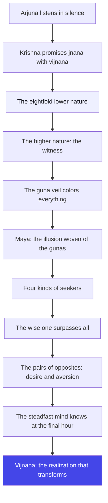
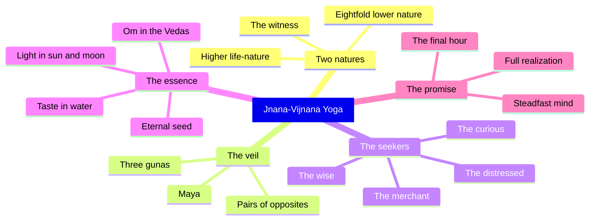

# Chapter 7: Jnana-Vijnana Yoga — Knowing and Realizing

> "Knowledge is a map; realization is the mountain itself. You can study the map your whole life and still never climb a single step."
> — The Osho Way

---

The war is about to begin, and yet the real battle has moved inside. Krishna has spent six chapters clearing the ground: act without attachment, meditate without clinging, make your whole life a yoga. Now, without Arjuna even asking, Krishna opens the deepest door. That is the first surprise of this chapter — no question from Arjuna, no crisis, no protest. The disciple is silent, and in that silence the master speaks. The deepest truths never come to those who demand them; they come to those who have become still enough to receive them.

The name of the chapter is a pairing: jnana and vijnana. Jnana is knowledge, the way the head knows — the map, the theory, the scripture. Vijnana is realization, the way your whole being knows — the walking, the tasting, the living. Most people stop at jnana and think they have arrived. They can quote the Gita, they can lecture on the gunas, they can argue about maya — and their lives remain untouched. Krishna is not interested in that kind of student. He offers knowledge that comes with realization, savijnanam — because only that changes a man.

Osho reads this chapter as an inner geography lesson. Krishna describes two natures: the lower eightfold nature of earth, water, fire, air, ether, mind, intellect and ego — and the higher nature, the life-element, the witnessing presence by which the whole world is upheld. This is not cosmology; it is the map of your own being. Your body-mind is the lower nature, and the awareness that watches it is the higher. Between the two lies the veil of the three gunas — the smoke through which you see everything colored. And beyond the veil waits the question the whole chapter circles: do you know, or have you realized?

The chapter ends with a strange promise: those who know the Lord as adhibhuta, adhidaiva and adhiyajna know Him even at the hour of death. Osho's twist is this — how you live is how you die. The last thought is never an accident; it is the summary of a lifetime. If your days are spent reaching, grasping, fearing, then your final hour will be a fist. But if your days are spent watching, loving, offering — then death itself becomes a door, not a wall. This is the vijnana this chapter is preparing you for.

## Learning Objectives

After completing this chapter you will be able to:

1. **Distinguish jnana from vijnana** — knowing about the divine versus realizing it, and why Krishna insists on knowledge "combined with realization" (7.2).
2. **Map the two natures** — the eightfold lower prakriti (7.4) and the higher life-nature (7.5), and locate both inside your own experience.
3. **Name the veil** — how the three gunas delude the world (7.13), what maya is, and why taking refuge is the way across (7.14).
4. **Compare the four kinds of worshippers** — the distressed, the seeker, the wealth-seeker and the wise (7.16-7.18), and see all four in your own journey.
5. **Apply the final-hour teaching** — why knowing the Lord in the three modes (7.30) is really about how you live every ordinary hour.
6. **Build a TypeScript Vijnana Realization Checker** — a tool that separates borrowed knowledge from lived realization in your own study log.

---

## Jnana-Vijnana Yoga at a Glance

### The scene and the speakers

Krishna alone speaks all thirty verses of this chapter. Arjuna does not ask a single question — and that silence matters. In the earlier chapters Arjuna was the doubter, the fighter, the one who collapsed at the brink. Now, for the first time, he simply listens. The Mahabharata context: the armies stand ready at Kurukshetra, but the Gita is not a battlefield manual. Krishna's teaching has moved from the outer war to the inner war, and this chapter begins the second great movement of the Gita — the turn from karma to bhakti, from doing to loving, from the map to the mountain.

### The Osho lens

Osho reads this chapter as the moment the teacher stops giving instructions and starts giving himself. Everything Krishna describes — the two natures, the gunas, maya, the four kinds of seekers — is a mirror held up to the listener. Osho insists the chapter is not theology: the eightfold nature is your own body-mind machinery; the higher nature is your own witnessing; maya is the projection of your own desire-clouded mind. The question is never "Is God real?" The question is "Are you real — or are you still a projection?"

### The structure of the chapter

The chapter moves in three movements:

1. **Movement 1: 7.1–7.14 — The two natures and the veil.** Krishna promises jnana with vijnana, describes the lower and higher prakritis, and explains how the gunas veil the immutable Lord.
2. **Movement 2: 7.15–7.23 — The seekers and their fruits.** Four kinds of worshippers, lesser deities and finite rewards, and why small minds get small fruits.
3. **Movement 3: 7.24–7.30 — The hidden Lord and the final hour.** The unmanifest in the manifest, the pairs of opposites, and the promise that those who know the Lord in the three modes know Him at death.

### The three-framework note

The Gita's three great paths are karma, bhakti and jnana. The first six chapters were karma yoga — action, actionless action, meditation. Now, from this chapter through chapter 12, bhakti dominates: devotion, love, surrender. But notice how Krishna keeps jnana alive inside bhakti — the wise one is still declared the best of devotees (7.17). Osho's point: the paths are not rivals; they are one road seen from three windows. The gunas (sattva, rajas, tamas) are the lens; love is the eye; knowledge is the light.

## Traditional Reading vs Osho-Style Reading

| Dimension | Traditional reading | Osho-style reading |
|--------|---------------------|--------------------|
| **The two prakritis (7.4-7.5)** | Cosmology: God's lower material nature and higher spiritual nature that upholds creation | Inner geography: the body-mind machine you identify with, and the witnessing awareness that upholds it |
| **Maya (7.14)** | A divine illusion created by God, crossed only by taking refuge in God | The projection of your desire-clouded mind; crossing it means becoming the witness of your own projections |
| **The gunas (7.13)** | Three cosmic qualities that delude beings into forgetting God | The smoke inside your head; every judgment, like and dislike, is colored by this smoke |
| **Four kinds of worshippers (7.16)** | A graded ladder of devotion, with the wise at the top | Four stages of every seeker: you begin distressed, become curious, want rewards, and finally flower into wisdom |
| **"I am not in them" (7.12)** | A theological paradox about God's transcendence | The witness is never contained by what it sees; the wave never contains the ocean |
| **Knowing Me at death (7.30)** | A promise of liberation to the devoted | How you live is how you die; the last thought is the summary of a life, not a lottery ticket |

## The Complete Text — All 30 Shlokas

### Shloka 7.1 — The Promise of Full Knowledge

> श्रीभगवानुवाच |
> मय्यासक्तमनाः पार्थ योगं युञ्जन्मदाश्रयः |
> असंशयं समग्रं मां यथा ज्ञास्यसि तच्छृणु

**Transliteration:** śrībhagavānuvāca . mayyāsaktamanāḥ pārtha yogaṃ yuñjanmadāśrayaḥ . asaṃśayaṃ samagraṃ māṃ yathā jñāsyasi tacchṛṇu

**Translation:** The Blessed Lord said: O Arjuna, hear how you will know Me completely, without any doubt — with your mind absorbed in Me, practicing yoga, and taking refuge in Me.

**Osho Darshan:** Notice the sequence: first the mind becomes absorbed, then the practice happens, then refuge is taken — and only then does knowledge come. Krishna is not giving information; he is describing a transformation. You cannot know the divine the way you know a fact. Facts are known by the head; the divine is known by the whole being, and the whole being is known only when it has become one-pointed. Doubt dissolves not through more answers, but through more absorption.

### Shloka 7.2 — Knowledge With Realization

> ज्ञानं तेऽहं सविज्ञानमिदं वक्ष्याम्यशेषतः |
> यज्ज्ञात्वा नेह भूयोऽन्यज्ज्ञातव्यमवशिष्यते

**Transliteration:** jñānaṃ te.ahaṃ savijñānamidaṃ vakṣyāmyaśeṣataḥ . yajjñātvā neha bhūyo.anyajjñātavyamavaśiṣyate

**Translation:** I will declare to you, in full, this knowledge together with realization; having known it, nothing else here remains to be known.

**Osho Darshan:** Here is the whole teaching in one breath: knowledge alone leaves something unknown, realization leaves nothing. You can read a hundred books on love and still be a stranger to love; one genuine meeting, and the books become irrelevant. That is why Krishna says "nothing remains to be known" — not because the universe is small, but because when you have realized the one, you have touched the source from which the many flow. The map of every river is contained in the spring.

### Shloka 7.3 — The Rarity of True Seekers

> मनुष्याणां सहस्रेषु कश्चिद्यतति सिद्धये |
> यततामपि सिद्धानां कश्चिन्मां वेत्ति तत्त्वतः

**Transliteration:** manuṣyāṇāṃ sahasreṣu kaścidyatati siddhaye . yatatāmapi siddhānāṃ kaścinmāṃ vetti tattvataḥ

**Translation:** Among thousands of people, perhaps one strives for perfection; and even among those who strive and succeed, perhaps one knows Me in essence.

**Osho Darshan:** Do not be discouraged — be honest. Out of a thousand people, most are asleep; they live by imitation, habit, and borrowed opinions. One wakes and begins to strive. But even among the strivers, most are striving for something — power, peace, status, a certificate of enlightenment. The final step is not a striving; it is a dropping. The one who knows in essence is the one who has stopped trying to become and simply is. Be that one. The door is narrow because it is a needle's eye: you must pass through it empty.

### Shloka 7.4 — The Eightfold Lower Nature

> भूमिरापोऽनलो वायुः खं मनो बुद्धिरेव च |
> अहंकार इतीयं मे भिन्ना प्रकृतिरष्टधा

**Transliteration:** bhūmirāpo.analo vāyuḥ khaṃ mano buddhireva ca . ahaṃkāra itīyaṃ me bhinnā prakṛtiraṣṭadhā

**Translation:** Earth, water, fire, air, ether, mind, intellect and egoism — thus is My nature divided eightfold.

**Osho Darshan:** Look at the list: the five elements that make up your body, and then mind, intellect and ego — the three that make up your inner machinery. This is the whole apparatus of your personality, and Krishna calls it the lower nature. Not "lower" as in inferior — "lower" as in the ground floor. You live in this building, but the building is not you. When you say "I am angry, I am confused, I am successful," you are pointing at the ground floor. The higher nature is the one who can point at all of it.

### Shloka 7.5 — The Higher Nature: The Life-Element

> अपरेयमितस्त्वन्यां प्रकृतिं विद्धि मे पराम् |
> जीवभूतां महाबाहो ययेदं धार्यते जगत्

**Transliteration:** apareyamitastvanyāṃ prakṛtiṃ viddhi me parām . jīvabhūtāṃ mahābāho yayedaṃ dhāryate jagat

**Translation:** This is the lower nature, O mighty-armed; but know My higher nature as different from it — the life-element itself, by which this whole world is upheld.

**Osho Darshan:** The higher nature is not something you go looking for in the sky; it is the aliveness by which you are reading this sentence. The body is lower nature, the breath is lower nature — but the one who knows the breath moves, that is higher nature. The world is upheld by it the way a dream is upheld by the dreamer. You cannot see the dreamer inside the dream, yet without the dreamer there is no dream. Realization is not discovering something new; it is discovering the discoverer.

### Shloka 7.6 — The Source and the Dissolution

> एतद्योनीनि भूतानि सर्वाणीत्युपधारय |
> अहं कृत्स्नस्य जगतः प्रभवः प्रलयस्तथा

**Transliteration:** etadyonīni bhūtāni sarvāṇītyupadhāraya . ahaṃ kṛtsnasya jagataḥ prabhavaḥ pralayastathā

**Translation:** Know that all beings are born from these two natures; I am the source of the whole universe and also its dissolution.

**Osho Darshan:** The two natures are the womb, and the womb itself is born of the un-begotten. Every wave is born of the ocean, and the ocean is born of no one. Osho loves this paradox: the source is not a thing among things, so it cannot be pointed at — yet everything points at it. When you watch a thought arise and dissolve, you are watching the microcosm of this very verse. Thoughts arise from the mind and dissolve into the mind; the watcher is neither. Find the watcher, and you have found the source of both.

### Shloka 7.7 — The Thread and the Jewels

> मत्तः परतरं नान्यत्किञ्चिदस्ति धनञ्जय |
> मयि सर्वमिदं प्रोतं सूत्रे मणिगणा इव

**Transliteration:** mattaḥ parataraṃ nānyatkiñcidasti dhanañjaya . mayi sarvamidaṃ protaṃ sūtre maṇigaṇā iva

**Translation:** Nothing exists higher than Me, O Dhananjaya; all this is strung upon Me, like clusters of gems upon a thread.

**Osho Darshan:** The gems are visible, glittering, countable — and the thread is invisible. Without the thread, the necklace falls into a heap of stones. The world is the necklace; awareness is the thread. You have spent your life counting gems — degrees, achievements, relationships, possessions — and never once noticed the thread. And the thread is the only thing you actually are. When the thread breaks, the gems scatter. The wise string their lives on the invisible, not on the visible.

### Shloka 7.8 — The Taste in Water

> रसोऽहमप्सु कौन्तेय प्रभास्मि शशिसूर्ययोः |
> प्रणवः सर्ववेदेषु शब्दः खे पौरुषं नृषु

**Transliteration:** raso.ahamapsu kaunteya prabhāsmi śaśisūryayoḥ . praṇavaḥ sarvavedeṣu śabdaḥ khe pauruṣaṃ nṛṣu

**Translation:** I am the taste in water, O Kaunteya; I am the light in the moon and the sun; I am the syllable Om in all the Vedas, sound in ether, and manhood in men.

**Osho Darshan:** Krishna is teaching you how to find the divine without leaving the ordinary. The taste in water — not the water, but the tasting; the light in the moon — not the moon, but the shining; the sound in the sky — not the object, but the essence. This is meditation in everyday life: when you drink, taste the tasting; when you see, see the seeing. The essence is everywhere, disguised as things. Once you can find the taste in water, you no longer need a temple. The whole world becomes the temple.

### Shloka 7.9 — The Fragrance of the Earth

> पुण्यो गन्धः पृथिव्यां च तेजश्चास्मि विभावसौ |
> जीवनं सर्वभूतेषु तपश्चास्मि तपस्विषु

**Transliteration:** puṇyo gandhaḥ pṛthivyāṃ ca tejaścāsmi vibhāvasau . jīvanaṃ sarvabhūteṣu tapaścāsmi tapasviṣu

**Translation:** I am the pure fragrance of the earth and the brilliance in fire; I am the life in all beings and the austerity in those who practice austerity.

**Osho Darshan:** Notice that Krishna claims even the austerity of the ascetic. The ascetic thinks his tapas is his own achievement, his discipline, his victory over the flesh — and Krishna says: even that is Me. This is the deepest humbling of the ego: whatever you are proud of, whatever you think you have earned, the very energy of it is borrowed from the source. The fragrance is not the flower's; the flower is a vehicle. Your meditation, your discipline, your virtue — all of it is the divine passing through you. That is why pride is so absurd: the river boasting about its flood, when the rain is the giver.

### Shloka 7.10 — The Eternal Seed

> बीजं मां सर्वभूतानां विद्धि पार्थ सनातनम् |
> बुद्धिर्बुद्धिमतामस्मि तेजस्तेजस्विनामहम्

**Transliteration:** bījaṃ māṃ sarvabhūtānāṃ viddhi pārtha sanātanam . buddhirbuddhimatāmasmi tejastejasvināmaham

**Translation:** Know Me, O Partha, as the eternal seed of all beings; I am the intelligence of the intelligent and the splendor of the splendid.

**Osho Darshan:** The seed is a beautiful mystery: it contains the whole tree, yet it is the smallest thing in the forest. The eternal seed of all beings is the same — the source is not the biggest, it is the subtlest. And here is the twist for your intellect: your cleverness, your sharp mind, your brilliance in an interview — Krishna says the intelligence of the intelligent is Me. So do not worship your intellect; it is a borrowed lamp. And do not despise it either. The lamp can be a light on the path, as long as you remember it is not the sun.

### Shloka 7.11 — Strength Without Lust

> बलं बलवतां चाहं कामरागविवर्जितम् |
> धर्माविरुद्धो भूतेषु कामोऽस्मि भरतर्षभ

**Transliteration:** balaṃ balavatāṃ cāhaṃ kāmarāgavivarjitam . dharmāviruddho bhūteṣu kāmo.asmi bharatarṣabha

**Translation:** Of the strong, I am the strength that is free from desire and attachment; and in all beings, I am the desire that is not opposed to dharma, O best of the Bharatas.

**Osho Darshan:** Krishna separates strength from lust. Strength filled with desire is a chain; strength free from desire is a wing. And the second half is even more radical: he claims even desire — the very thing you have been taught to crush — as his own, when it flows with dharma. Osho's reading: desire is not the enemy; grasping is. The flame of wanting to grow, to love, to create, is divine. It is the smoke of possessiveness that poisons the flame. Do not kill your desire; purify it of its clutching.

### Shloka 7.12 — The Gunas and the Uncontained

> ये चैव सात्त्विका भावा राजसास्तामसाश्च ये |
> मत्त एवेति तान्विद्धि न त्वहं तेषु ते मयि

**Transliteration:** ye caiva sāttvikā bhāvā rājasāstāmasāśca ye . matta eveti tānviddhi na tvahaṃ teṣu te mayi

**Translation:** Whatever states are sattvic, rajasic or tamasic, know that they all proceed from Me; yet I am not in them — they are in Me.

**Osho Darshan:** All three gunas — the luminous, the passionate, the sluggish — come from the same source. Do not despise your tamasic laziness and do not worship your sattvic purity; both are weather, and the sky is neither. The sky contains the storm, the sunshine and the fog — and is untouched by all three. This is the teaching of the witness in one line: they are in Me, I am not in them. Your moods move inside you like weather inside a sky. Remember the sky, and no mood can own you.

### Shloka 7.13 — The Veil of the Three Gunas

> त्रिभिर्गुणमयैर्भावैरेभिः सर्वमिदं जगत् |
> मोहितं नाभिजानाति मामेभ्यः परमव्ययम्

**Transliteration:** tribhirguṇamayairbhāvairebhiḥ sarvamidaṃ jagat . mohitaṃ nābhijānāti māmebhyaḥ paramavyayam

**Translation:** Deluded by these states composed of the three gunas, this whole world does not know Me, who am beyond them and immutable.

**Osho Darshan:** The world is not deluded because truth is far away; it is deluded because the veil is so close — the veil is made of your own likes, dislikes, habits, ambitions. You look through the gunas the way you look through colored glass, and you think the color is the world. That is why Krishna says the wise know him "beyond these" — not by adding more knowledge, but by seeing the glass itself. The first step of meditation is to catch the glass. The second is to watch it color everything. The third — the veil simply drops, and what remains is not an object but you.

### Shloka 7.14 — Maya: The Divine Illusion

> दैवी ह्येषा गुणमयी मम माया दुरत्यया |
> मामेव ये प्रपद्यन्ते मायामेतां तरन्ति ते

**Transliteration:** daivī hyeṣā guṇamayī mama māyā duratyayā . māmeva ye prapadyante māyāmetāṃ taranti te

**Translation:** Verily, this divine maya of Mine, woven of the gunas, is hard to cross; but those who take refuge in Me alone cross over this maya.

**Osho Darshan:** Maya is called divine because it is not an enemy — it is a game the divine plays with itself. The world is real enough while you are in it; the illusion is in thinking this is all there is. And Osho's insight: you cannot fight maya, because the fighter is part of the game. Your ego fighting the illusion is like a character in a dream fighting the dream. The only way across is surrender — drop the fighter. Taking refuge is not cowardice; it is the most intelligent act of a being who has realized the fight is rigged.

### Shloka 7.15 — The Four That Do Not Come

> न मां दुष्कृतिनो मूढाः प्रपद्यन्ते नराधमाः |
> माययापहृतज्ञाना आसुरं भावमाश्रिताः

**Transliteration:** na māṃ duṣkṛtino mūḍhāḥ prapadyante narādhamāḥ . māyayāpahṛtajñānā āsuraṃ bhāvamāśritāḥ

**Translation:** The evil-doers, the deluded, the lowest of men, whose knowledge is stolen by maya and who follow the demonic way, do not seek Me.

**Osho Darshan:** Do not read this as a judgment list of sinners; read it as a clinical description of the closed mind. The evil-doer is busy justifying; the deluded is busy pretending; the lowest is busy despising; and the demonic is busy taking. All four have one thing in common — their door faces outward, so nothing can enter. The Gita does not say these people are damned; it says they do not seek. The moment any of them turns even a little, the whole journey begins. Nobody is excluded from the path; the path only excludes those who never turn.

### Shloka 7.16 — The Four Kinds of Worshippers

> चतुर्विधा भजन्ते मां जनाः सुकृतिनोऽर्जुन |
> आर्तो जिज्ञासुरर्थार्थी ज्ञानी च भरतर्षभ

**Transliteration:** caturvidhā bhajante māṃ janāḥ sukṛtino.arjuna . ārto jijñāsurarthārthī jñānī ca bharatarṣabha

**Translation:** Four kinds of virtuous people worship Me, O Arjuna: the distressed, the seeker of knowledge, the seeker of wealth, and the wise — O best of the Bharatas.

**Osho Darshan:** Notice how generous this list is. The distressed one is worshipping out of pain — fine. The curious one is worshipping out of hunger for answers — fine. The merchant is worshipping for profit — fine. Krishna does not despise any door through which a person walks toward the divine. Osho says: do not wait until you are wise to begin. Begin where you are — in your pain, in your curiosity, even in your greed. The road itself will purify you. The worst prayer is the one never prayed because it was not pure enough.

### Shloka 7.17 — The Wise One Excels

> तेषां ज्ञानी नित्ययुक्त एकभक्तिर्विशिष्यते |
> प्रियो हि ज्ञानिनोऽत्यर्थमहं स च मम प्रियः

**Transliteration:** teṣāṃ jñānī nityayukta ekabhaktirviśiṣyate . priyo hi jñānino.atyarthamahaṃ sa ca mama priyaḥ

**Translation:** Of them, the wise one — ever steadfast, devoted to the One — excels; for I am exceedingly dear to the wise, and he is dear to Me.

**Osho Darshan:** The wise one is not the one who knows more; he is the one who is ever united, whose devotion has become single. And then comes the most intimate line in the chapter: I am dear to him, and he is dear to Me. Osho reads this as love, not theology — the devotee and the divine meet not as servant and master, but as two who have recognized each other. This is what makes bhakti different from duty: duty is one-directional, love is a circle. The wise one has stopped worshipping a distant God and started loving a presence that is already here.

### Shloka 7.18 — The Wise One Is My Self

> उदाराः सर्व एवैते ज्ञानी त्वात्मैव मे मतम् |
> आस्थितः स हि युक्तात्मा मामेवानुत्तमां गतिम्

**Transliteration:** udārāḥ sarva evaite jñānī tvātmaiva me matam . āsthitaḥ sa hi yuktātmā māmevānuttamāṃ gatim

**Translation:** Noble indeed are all these; but the wise one, I deem, is My very Self — for, steadfast in mind, he is established in Me alone as the supreme goal.

**Osho Darshan:** This is the climax of the inner journey: the wise one is not merely near the divine — he is the divine, seen from the divine side. The drop has disappeared into the ocean, and the ocean says: this drop was always me. Osho insists this is not blasphemy; it is the whole point of the Gita. The separation between you and the source is an illusion maintained by the ego. When the ego relaxes, the separation dissolves. The goal is not to reach God; the goal is to realize you never left. The journey was a homecoming in disguise.

### Shloka 7.19 — At the End of Many Births

> बहूनां जन्मनामन्ते ज्ञानवान्मां प्रपद्यते |
> वासुदेवः सर्वमिति स महात्मा सुदुर्लभः

**Transliteration:** bahūnāṃ janmanāmante jñānavānmāṃ prapadyate . vāsudevaḥ sarvamiti sa mahātmā sudurlabhaḥ

**Translation:** At the end of many births, the wise one comes to Me, realizing that all this is Vasudeva; such a great soul is very hard to find.

**Osho Darshan:** Do not let "many births" discourage you — each of your days is a birth, each of your nights a death. You have already lived thousands of these small lives, and each one has been a school. The realization "all this is Vasudeva" — everything, without exception, is the divine — cannot be taught; it has to ripen. And when it ripens, the seeker disappears into the sought. This mahatma, the great soul, is rare not because the path is reserved for the elite, but because most people stop halfway — satisfied with the map, when the mountain was the destination all along.

### Shloka 7.20 — The Stolen Wisdom of Desires

> कामैस्तैस्तैर्हृतज्ञानाः प्रपद्यन्तेऽन्यदेवताः |
> तं तं नियममास्थाय प्रकृत्या नियताः स्वया

**Transliteration:** kāmaistaistairhṛtajñānāḥ prapadyante.anyadevatāḥ . taṃ taṃ niyamamāsthāya prakṛtyā niyatāḥ svayā

**Translation:** Those whose wisdom is carried away by this or that desire go to other gods, following this or that rite, driven by their own nature.

**Osho Darshan:** The "other gods" are not only statues — they are money, approval, career, comfort, the little altars of ambition. Whenever a desire grabs you, it carries away a piece of your wisdom and leaves you kneeling at a smaller shrine. Osho's diagnosis: the problem is not desire but being driven by it — niyatah, pushed by your own nature like a leaf in a storm. The moment you can watch a desire instead of being pushed by it, you have stepped out of the crowd of driven ones. You do not need to renounce the altars; you need to stop being their slave.

### Shloka 7.21 — Faith Is Given, Not Taken

> यो यो यां यां तनुं भक्तः श्रद्धयार्चितुमिच्छति |
> तस्य तस्याचलां श्रद्धां तामेव विदधाम्यहम्

**Transliteration:** yo yo yāṃ yāṃ tanuṃ bhaktaḥ śraddhayārcitumicchati . tasya tasyācalāṃ śraddhāṃ tāmeva vidadhāmyaham

**Translation:** Whatever form any devotee desires to worship with faith, I make that very faith of his firm and unwavering.

**Osho Darshan:** This verse dissolves every quarrel between religions. The Christian's Christ, the Muslim's Allah, the Hindu's Shiva — each receives the devotee's faith, and the source honors that faith and makes it steady. Osho's reading: God does not care about the label on the bottle; he cares that you are drinking. Faith is the real offering; the form is the container. So do not waste your life mocking the other person's shrine. The enemy of the divine is not another god — it is doubt. And doubt is cured not by arguing, but by drinking deeply from whatever cup you hold.

### Shloka 7.22 — The Granted Desire

> स तया श्रद्धया युक्तस्तस्याराधनमीहते |
> लभते च ततः कामान्मयैव विहितान्हि तान्

**Transliteration:** sa tayā śraddhayā yuktastasyārādhanamīhate . labhate ca tataḥ kāmānmayaivavihitānhi tān

**Translation:** Endowed with that faith, he engages in the worship of that form, and from it he obtains his desires — which are, verily, ordained by Me alone.

**Osho Darshan:** Even the fulfillment of a small prayer is the source's work — the universe is not indifferent; it answers, always, at the right address. But watch the economy of this: you may receive the desired job, the desired house, the desired person — and then the desire moves, and you want more. This is the divine's compassion and the divine's lesson at once. The granting of small desires is training wheels. The day your faith matures, you stop asking for the bicycle and start asking for the road.

### Shloka 7.23 — Small Minds, Small Fruits

> अन्तवत्तु फलं तेषां तद्भवत्यल्पमेधसाम् |
> देवान्देवयजो यान्ति मद्भक्ता यान्ति मामपि

**Transliteration:** antavattu phalaṃ teṣāṃ tadbhavatyalpamedhasām . devāndevayajo yānti madbhaktā yānti māmapi

**Translation:** But the fruit of those of small intelligence is finite; the worshippers of the gods go to the gods, while My devotees come to Me.

**Osho Darshan:** Everything finite ends — that is its definition. A promotion ends, a diploma fades, a reputation evaporates; none of these are sins, but all of them are small. The tragedy of the small mind is not that it worships small things — it is that it does not know anything larger exists. Osho says: enlarge your asking. Do not pray for a bigger cage; pray for wings. The devotee who asks for the source gets the source, and with it, everything the small mind was chasing — given freely, without the cage.

### Shloka 7.24 — The Unmanifest in the Manifest

> अव्यक्तं व्यक्तिमापन्नं मन्यन्ते मामबुद्धयः |
> परं भावमजानन्तो ममाव्ययमनुत्तमम्

**Transliteration:** avyaktaṃ vyaktimāpannaṃ manyante māmabuddhayaḥ . paraṃ bhāvamajānanto mamāvyayamanuttamam

**Translation:** The foolish think of Me, the Unmanifest, as having come into manifestation — not knowing My higher, immutable and most excellent nature.

**Osho Darshan:** People see Krishna as a man, a historical figure, a charming prince — and they miss the point entirely. The unmanifest is never contained by the manifest; the ocean is never contained by a wave. This is also true of you: you see yourself as a body born on a certain date, and you miss your own unmanifest nature. The foolishness here is not stupidity — it is looking only at the surface. The whole of meditation is learning to see the unmanifest in the manifest: the silence behind the sound, the space behind the object, the witness behind the thought.

### Shloka 7.25 — Veiled by Yoga-Maya

> नाहं प्रकाशः सर्वस्य योगमायासमावृतः |
> मूढोऽयं नाभिजानाति लोको मामजमव्ययम्

**Transliteration:** nāhaṃ prakāśaḥ sarvasya yogamāyāsamāvṛtaḥ . mūḍho.ayaṃ nābhijānāti loko māmajamavyayam

**Translation:** I am not manifest to all, veiled as I am by yoga-maya; this deluded world does not know Me, the unborn and imperishable.

**Osho Darshan:** The sun does not hide — the cloud does the hiding. Yoga-maya is the divine's own veil, and the veil has a purpose: what is too bright cannot be seen directly. You must grow eyes before you can look at the sun. Osho's reading: the divine hides not out of jealousy but out of love — the seed is hidden in the earth so it can become a tree. Do not curse the veil; ripen under it. The day you are ready, the veil is not removed — it is seen through, and what was hidden was never separate from you.

### Shloka 7.26 — I Know All; No One Knows Me

> वेदाहं समतीतानि वर्तमानानि चार्जुन |
> भविष्याणि च भूतानि मां तु वेद न कश्चन

**Transliteration:** vedāhaṃ samatītāni vartamānāni cārjuna . bhaviṣyāṇi ca bhūtāni māṃ tu veda na kaścana

**Translation:** I know, O Arjuna, all beings — the past, the present and the future; but no one knows Me.

**Osho Darshan:** You cannot know the divine the way you know an object — because the knower and the known are one. You can know your thoughts, because you are not your thoughts; you can know your body, because you are not your body. But the witness cannot be witnessed as an object; it can only be realized as subject. That is why "no one knows Me" is not a complaint — it is a definition. The eye does not see itself; it sees everything else. Become the seeing, and the mystery is not solved — it is dissolved, and you are it.

### Shloka 7.27 — The Delusion of the Pairs

> इच्छाद्वेषसमुत्थेन द्वन्द्वमोहेन भारत |
> सर्वभूतानि सम्मोहं सर्गे यान्ति परन्तप

**Transliteration:** icchādveṣasamutthena dvandvamohena bhārata . sarvabhūtāni sammohaṃ sarge yānti parantapa

**Translation:** By the delusion of the pairs of opposites, arising from desire and aversion, O Bharata, all beings are thrown into confusion at birth, O Parantapa.

**Osho Darshan:** Here is the mechanism of bondage, laid bare: desire and aversion — I want this, I don't want that — and between the two poles, the mind swings forever. The swing is the delusion. You cannot live without likes and dislikes, but you can live without being owned by them. Osho's advice: notice the swing. When pleasure comes, watch; when pain comes, watch. The swinging mind is the confusion; the watcher of the swing is the clarity. You were born into this pendulum world — but you were not born to be the pendulum.

### Shloka 7.28 — Sins Ended, Vows Firm

> येषां त्वन्तगतं पापं जनानां पुण्यकर्मणाम् |
> ते द्वन्द्वमोहनिर्मुक्ता भजन्ते मां दृढव्रताः

**Transliteration:** yeṣāṃ tvantagataṃ pāpaṃ janānāṃ puṇyakarmaṇām . te dvandvamohanirmuktā bhajante māṃ dṛḍhavratāḥ

**Translation:** But those people of virtuous deeds whose sins have come to an end, freed from the delusion of the pairs of opposites, worship Me, steadfast in their vows.

**Osho Darshan:** "Sins have come to an end" — do not hear this as a ledger being balanced. The sin here is the forgetting of your own nature, and it ends when it is seen through. These people are not sinless saints; they are people whose confusion has matured into clarity. And then the fruit: firm vows. When the pairs no longer swing you, your word becomes your word, your yes becomes yes, your no becomes no. A man free from the pendulum is the most reliable being on earth — that is the dharma of the realized. Their firmness is not stubbornness; it is the stillness of having found the center.

### Shloka 7.29 — Freedom From Old Age and Death

> जरामरणमोक्षाय मामाश्रित्य यतन्ति ये |
> ते ब्रह्म तद्विदुः कृत्स्नमध्यात्मं कर्म चाखिलम्

**Transliteration:** jarāmaraṇamokṣāya māmāśritya yatanti ye . te brahma tadviduḥ kṛtsnamadhyātmaṃ karma cākhilam

**Translation:** Those who strive for liberation from old age and death, taking refuge in Me, know in full that Brahman, the whole knowledge of the Self, and all action.

**Osho Darshan:** Old age and death are not the enemies — the fear of them is. The body will age; that is its nature. But the one who takes refuge discovers something in himself that was never born and will never die, and that discovery changes the meaning of aging. Osho's beautiful insight: it is not that the realized person escapes death — it is that death becomes just another change, like sleep. And notice the reward: knowing Brahman, knowing the Self, knowing all action — one realization, three doors. All of them open from the same key: refuge.

### Shloka 7.30 — Knowing Me at the Final Hour

> साधिभूताधिदैवं मां साधियज्ञं च ये विदुः |
> प्रयाणकालेऽपि च मां ते विदुर्युक्तचेतसः

**Transliteration:** sādhibhūtādhidaivaṃ māṃ sādhiyajñaṃ ca ye viduḥ . prayāṇakāle.api ca māṃ te viduryuktacetasaḥ

**Translation:** Those who know Me together with adhibhuta, adhidaiva and adhiyajna — with a steadfast mind, they know Me even at the time of departure.

**Osho Darshan:** The chapter closes on the final hour — not to frighten you, but to awaken you. If you have practiced knowing the divine in the elements (adhibhuta), in the shining ones (adhidaiva), and in every offering (adhiyajna), then the last moment is not a stranger; it is the same visitor you have been meeting all along. Osho's promise: death is not a punctuation mark at the end of life; it is the whole life's meaning rising to the surface. The steadfast mind at death was never built at death — it was built in the thousands of ordinary moments you chose to remember what you are.

## Key Themes

| Theme | Shlokas | Osho-style insight |
|-------|---------|--------------------|
| **Jnana and vijnana** | 7.1-7.2 | The map and the mountain: realization, not information, changes a man |
| **The two natures** | 7.4-7.5 | Your body-mind is the ground floor; your witnessing is the higher nature |
| **The thread of the world** | 7.6-7.10 | Everything visible is strung on the invisible; find the taste, the light, the seed |
| **The guna veil and maya** | 7.12-7.14 | You cannot fight the illusion with the ego; surrender is the way across |
| **The four seekers** | 7.16-7.19 | The distressed, the curious, the merchant, the wise — four stages of one journey |
| **Small gods, small fruits** | 7.20-7.23 | Asking for a bigger cage, when wings are on offer |
| **The pairs of opposites** | 7.27-7.28 | Desire and aversion swing the mind; the witness is the center that never swings |
| **The final hour** | 7.29-7.30 | How you live is how you die; the last thought is the summary of a life |

## The Inner Journey



## A Mind Map



## Summary

- Krishna opens the second movement of the Gita: knowledge (jnana) must be completed by realization (vijnana) — 7.1-7.2.
- The eightfold lower nature (elements, mind, intellect, ego) and the higher life-nature together uphold the world — 7.4-7.5.
- The divine is the essence within everything: taste, light, fragrance, life, seed — 7.8-7.10.
- The three gunas veil the immutable Lord, and maya is crossed only through refuge, never through fighting — 7.13-7.14.
- Four kinds of worshippers walk the same road; the wise one, ever steadfast and single-hearted, excels — 7.16-7.18.
- Small minds worship small gods and reap finite fruits; devotees of the source reach the source — 7.20-7.23.
- Desire and aversion, the pairs of opposites, swing the deluded world; freedom comes with the end of that confusion — 7.27-7.28.
- Those who know the Lord in the three modes know Him even at death — the last thought is the summary of a life — 7.30.

## Practical Takeaways

- When you study anything — scripture, code, science — ask yourself: do I know this, or have I realized it? Practice until the answer changes.
- Find the essence in the ordinary today: the taste in water, the light on leaves, the fragrance of earth. This is meditation without a cushion.
- When a mood owns you, remember the guna veil: the weather is not the sky. Watch the mood move.
- Before you pray for a reward, ask: am I asking for a bigger cage or for wings?
- Notice your desires and aversions today; watch them swing. The one who watches does not swing.
- End each day with one moment of stillness, so that if it were your final hour, the thought you meet would be the one you practiced.

## Chapter Quiz

**Q1. In 7.1, what does Krishna say will let Arjuna know Him completely, without doubt?**
- a. Fighting the war bravely
- b. A mind absorbed in Me, practicing yoga, taking refuge in Me
- c. Reciting the Vedas daily
- d. Renouncing all action

<details class="tp-qa-card" data-qid="bg7-q1"><summary>Show Answer</summary>

**Answer: b.** The mind absorbed, the practice, and the refuge — 7.1.
</details>

**Q2. According to 7.3, how rare is true knowledge of the Lord?**
- a. One in a thousand strives; among strivers, one knows in essence
- b. Everyone who tries succeeds
- c. Half of humanity knows
- d. Only kings can know

<details class="tp-qa-card" data-qid="bg7-q2"><summary>Show Answer</summary>

**Answer: a.** Among thousands one strives; among strivers, one knows Me in essence — 7.3.
</details>

**Q3. Which of the following makes up the eightfold lower nature in 7.4?**
- a. Earth, water, fire, air, ether, mind, intellect and egoism
- b. The five senses, the body, the breath and the soul
- c. The four Vedas and the four goals of life
- d. Sattva, rajas, tamas and their five modifications

<details class="tp-qa-card" data-qid="bg7-q3"><summary>Show Answer</summary>

**Answer: a.** Earth, water, fire, air, ether, mind, intellect and egoism — 7.4.
</details>

**Q4. How is maya described in 7.14, and how is it crossed?**
- a. It is weak and dissolves by logic
- b. Divine, woven of the gunas, hard to cross; crossed by those who take refuge in Me alone
- c. It ends automatically at death
- d. It is crossed by accumulating merit

<details class="tp-qa-card" data-qid="bg7-q4"><summary>Show Answer</summary>

**Answer: b.** Maya is divine and gunamayi, hard to cross; those who take refuge cross it — 7.14.
</details>

**Q5. Who are the four kinds of virtuous worshippers named in 7.16?**
- a. The distressed, the seeker of knowledge, the seeker of wealth, the wise
- b. The king, the merchant, the priest and the warrior
- c. The young, the old, the sick and the dying
- d. The renunciate, the householder, the student and the hermit

<details class="tp-qa-card" data-qid="bg7-q5"><summary>Show Answer</summary>

**Answer: a.** The distressed, the seeker of knowledge, the seeker of wealth, and the wise — 7.16.
</details>

**Q6. What does 7.30 promise about those who know the Lord with adhibhuta, adhidaiva and adhiyajna?**
- a. They will never grow old
- b. With steadfast mind, they know Me even at the time of departure
- c. They will rule the heavens
- d. They will be reborn among the wise

<details class="tp-qa-card" data-qid="bg7-q6"><summary>Show Answer</summary>

**Answer: b.** Steadfast in mind, they know Me even at the final hour — 7.30.
</details>

## Exercises

1. **The map and the mountain:** Pick one topic you "know" — meditation, coding, a language, a skill. Write down what you know about it from books. Then write down what you have realized by practicing it. Compare the two lists honestly: which one is longer?
2. **The guna watch:** For one day, catch yourself in three moods — one sattvic (calm), one rajasic (driven), one tamasic (dull). After each one, note: what was I seeing through? This is watching the veil instead of being the veil.
3. **The final-hour practice:** Extend the Vijnana Realization Checker below — add a "lastThought" field to the study log and have the tool forecast which topic would dominate your final hour if you stopped practicing today. Let the forecast guide your next week of practice.

## TypeScript Tool: Vijnana Realization Checker

```typescript
/*
 * Vijnana Realization Checker
 * Based on Chapter 7 (Jnana-Vijnana Yoga).
 * Jnana is knowing about something; vijnana is realizing it.
 * The tool scans a learner's study log and separates borrowed
 * knowledge (jnana) from lived realization (vijnana),
 * following Krishna's promise in 7.1-7.3: among thousands
 * who study, one strives; among strivers, one realizes.
 */

interface StudyLogEntry {
  topic: string;
  studyHours: number;
  practiceSessions: number;
  daysSincePractice: number;
}

interface RealizationReport {
  topic: string;
  kind: 'jnana' | 'vijnana';
  reason: string;
}

const PRACTICE_THRESHOLD = 5;
const RECENCY_LIMIT_DAYS = 7;

function classify(entry: StudyLogEntry): RealizationReport {
  const practiced = entry.practiceSessions >= PRACTICE_THRESHOLD;
  const stillFresh = entry.daysSincePractice <= RECENCY_LIMIT_DAYS;
  if (practiced && stillFresh) {
    return {
      topic: entry.topic,
      kind: 'vijnana',
      reason: 'You have practiced this recently; it lives in your hands, not just in your head.'
    };
  }
  return {
    topic: entry.topic,
    kind: 'jnana',
    reason: 'You know about it, but realization needs recent practice. The map is not the mountain.'
  };
}

function summarize(entries: StudyLogEntry[]): void {
  const reports = entries.map(classify);
  const realized = reports.filter(r => r.kind === 'vijnana').length;
  console.log('=== Vijnana Realization Checker ===');
  console.log(`Topics analyzed: ${reports.length}`);
  console.log(`Realized (vijnana): ${realized}`);
  console.log(`Known only (jnana): ${reports.length - realized}`);
  console.log('');
  for (const report of reports) {
    console.log(`[${report.kind.toUpperCase()}] ${report.topic}`);
    console.log(`   ${report.reason}`);
  }
  console.log('');
  console.log(realized === 0
    ? 'Among thousands who study, one strives; among strivers, one realizes. Be that one.'
    : 'What you have realized cannot be taken from you. It is the eternal seed.');
}

function runDemo(): void {
  const log: StudyLogEntry[] = [
    { topic: 'Non-attachment', studyHours: 12, practiceSessions: 8, daysSincePractice: 2 },
    { topic: 'The witness (sakshi)', studyHours: 20, practiceSessions: 3, daysSincePractice: 40 },
    { topic: 'Breath awareness', studyHours: 6, practiceSessions: 30, daysSincePractice: 0 },
    { topic: 'The gunas', studyHours: 15, practiceSessions: 2, daysSincePractice: 25 }
  ];
  summarize(log);
}

runDemo();
```