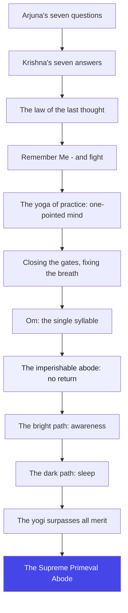
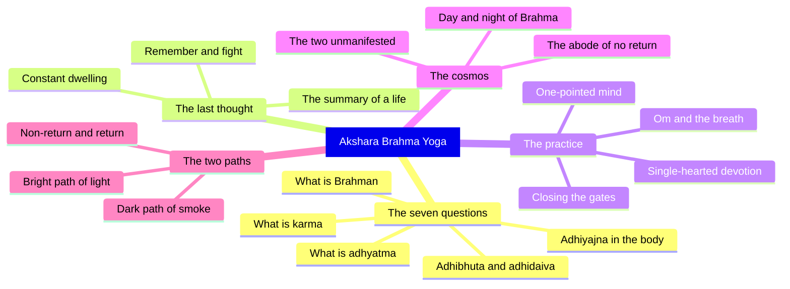

# Chapter 8: Akshara Brahma Yoga — The Imperishable Absolute

> "Death is not the end of life; it is the truth of life surfacing. The question is not whether you will die — it is which thought you will be wearing when you arrive."
> — The Osho Way

---

For the first time in this middle stretch of the Gita, Arjuna speaks — and he asks seven questions in two verses. What is Brahman? What is adhyatma? What is karma? What is adhibhuta? What is adhidaiva? Who is adhiyajna in this body? And how are You to be known at the hour of departure? Osho reads these as the questions of a man who has suddenly understood that the war he is about to fight will not be the last battle. Arjuna is asking about the final battle — the one every human being fights alone, at the end. This chapter is the Gita's great teaching on death.

And yet the chapter is not about dying. That is the Osho twist: a chapter that appears to be about the last hour is really about the first hour — the hour you spend right now. The law Krishna states in the middle of the chapter is deceptively simple: whatever state you constantly dwell in, that state you will meet at the end. The last thought is never a lottery; it is the summary of a life. If you want to know how you will die, look at how you are living. The dying is only the harvest.

The chapter's name, Akshara Brahma Yoga, names the destination: the imperishable, the syllable that cannot be destroyed. Krishna describes a universe that breathes in vast cycles — the day and night of Brahma, a thousand yugas each — and behind that breathing, an eternal unmanifested that is never destroyed. But the chapter never lets the vastness become an excuse for distance. The imperishable is not far away; it is attainable by single-hearted devotion, and it is as close as the one who remembers while the body works, who utters Om while the breath flows, who fights while the mind rests in the divine.

The chapter closes with the two paths: the bright path of fire, light, day, the bright fortnight, the northern course — the path of non-return; and the dark path of smoke, night, the dark fortnight, the southern course — the path of return. Osho refuses to make these cosmic addresses. They are two ways of living, walked every day: the way of awareness and the way of sleep. The yogi who knows the paths is never deluded, and knowing them is not difficult — it is the work of a lifetime, done one breath at a time.

## Learning Objectives

After completing this chapter you will be able to:

1. **Answer the seven questions** — state Krishna's definitions of Brahman, adhyatma, karma, adhibhuta, adhidaiva, adhiyajna, and knowing at death (8.1-8.4).
2. **Apply the law of the last thought** — explain why the state you constantly dwell in becomes your final state, and why "remember Me and fight" is the union of action and remembrance (8.5-8.7).
3. **Practice one-pointed meditation** — describe abhyasa yoga, the closing of the gates, and the single syllable Om as the vehicle to the Supreme Person (8.8-8.14).
4. **Map the cosmic day and night** — contrast the perishable and the imperishable, the worlds that return and the abode of no return (8.15-8.22).
5. **Choose between the two paths** — distinguish the bright path of non-return from the dark path of return, and locate both in daily living (8.23-8.28).
6. **Build a TypeScript Last Thought Forecaster** — a tool that logs your dominant thoughts and forecasts which one you are rehearsing for your final hour.

---

## Akshara Brahma Yoga at a Glance

### The scene and the speakers

Arjuna opens the chapter with a rapid-fire series of questions — seven in all, compressed into two verses. This is the only time in the middle section of the Gita that the disciple's questions structure the entire teaching. Krishna answers directly and then, without waiting for the next question, expands the answers into a full teaching on practice, on remembrance, and on death. The Mahabharata context: the armies wait at Kurukshetra, and a warrior about to fight a war asks about the last war. The battlefield has become the symbol of every human life: action on the outside, eternity on the inside.

### The Osho lens

Osho reads this chapter as a mirror held over the final hour — not to frighten you, but to awaken you. The seven questions are the seven doors of the whole spiritual search: what is real, what is mine, what is action, what is the world, what is the divine, what is sacrifice, what is the end. And the answers are all one answer: the imperishable. Osho's emphasis: do not postpone. The man who waits until his deathbed to remember the divine will find that he has spent his whole life forgetting. Practice is not preparation for death; practice is the way of living that makes death a door instead of a wall.

### The structure of the chapter

The chapter moves in three movements:

1. **Movement 1: 8.1–8.7 — The seven questions and the law of the last thought.** Krishna defines the terms, then delivers the pivot: whatever you constantly dwell in, you become; therefore remember and fight.
2. **Movement 2: 8.8–8.14 — The practice of remembrance.** One-pointed meditation, the closing of the gates, Om, and the Lord who is easily attainable by the ever-steadfast.
3. **Movement 3: 8.15–8.28 — The worlds and the paths.** No return, the day and night of Brahma, the imperishable abode, the bright path and the dark path, and the yogi who surpasses all merit.

### The three-framework note

This chapter is where the three paths braid together. Abhyasa — constant practice — is karma yoga, the discipline of action. Remembrance — smarana, bhakti — is the heart of devotion. And the knowledge of the imperishable, the akshara — that is jnana. Krishna does not offer three roads; he offers one road with three lanes. The gunas also appear implicitly: the bright path is the path of sattva, of light and awareness; the dark path is the path of rajas and tamas, of smoke and sleep. Your daily choice of lane is your daily choice of guna.

## Traditional Reading vs Osho-Style Reading

| Dimension | Traditional reading | Osho-style reading |
|--------|---------------------|--------------------|
| **The last thought (8.5-8.6)** | Doctrine of rebirth: the final thought determines the next birth | The last thought is not a verdict from a single moment; it is the summary of a whole life's habit — you are revealed, not condemned |
| **"Remember Me and fight" (8.7)** | Dual duty: worship the Lord and perform your caste duty | The marriage of inner remembrance and outer action — you do not leave the world to find the divine; you find the divine inside the action |
| **Day and night of Brahma (8.17-8.18)** | Cosmic time-scale: a thousand yugas per day and per night | The universe breathes in you: every exhale is a night, every inhale a day — eternity is not a number, it is this breath |
| **Bright and dark paths (8.24-8.26)** | Devayana and Pitriyana: two post-death journeys | Two ways of living, walked daily: the way of awareness and the way of sleep |
| **Om at the end (8.13)** | Deathbed mantra practice for liberation | If Om is your habit in life, it will naturally be your last breath — practice is not for the last moment, it is the last moment's preparation |
| **Yoga and kshema (8.22)** | Devotion as the means to reach the Supreme Person | Single-hearted devotion is just attention that has become total — and total attention is the definition of love |

## The Complete Text — All 28 Shlokas

### Shloka 8.1 — Arjuna's Seven Questions

> अर्जुन उवाच |
> किं तद् ब्रह्म किमध्यात्मं किं कर्म पुरुषोत्तम |
> अधिभूतं च किं प्रोक्तमधिदैवं किमुच्यते

**Transliteration:** arjuna uvāca . kiṃ tad brahma kimadhyātmaṃ kiṃ karma puruṣottama . adhibhūtaṃ ca kiṃ proktamadhidaivaṃ kimucyate

**Translation:** Arjuna said: O Purushottama, what is that Brahman? What is adhyatma? What is karma, O Supreme Person? And what is called adhibhuta, and what is spoken of as adhidaiva?

**Osho Darshan:** Arjuna is not collecting definitions for an examination; he is a man on the edge of a war asking what will survive the war. Osho says: these are the questions that arise when the ordinary answers have failed. You can live a long time without asking what is real — until something shakes the ground, and then the questions come all at once. Do not be afraid of the questions; be afraid of the day they stop. A man who still asks is still alive. The imperishable is found by the one who asks what perishes.

### Shloka 8.2 — And How Are You Known at the End?

> अधियज्ञः कथं कोऽत्र देहेऽस्मिन्मधुसूदन |
> प्रयाणकाले च कथं ज्ञेयोऽसि नियतात्मभिः

**Transliteration:** adhiyajñaḥ kathaṃ ko.atra dehe.asminmadhusūdana . prayāṇakāle ca kathaṃ jñeyo.asi niyatātmabhiḥ

**Translation:** Who is adhiyajna here in this body, O Madhusudana, and how does he dwell? And how are You to be known at the time of departure by the self-controlled?

**Osho Darshan:** The last question is the sharpest: how is the imperishable known at the moment of departure, when the mind is scattered and the body is failing? Krishna will answer with a paradox — it is known by the one who has been knowing it all along. You cannot learn to swim at the moment of drowning; you cannot learn remembrance at the moment of death. The self-controlled — niyatatma — are those whose control was built in ordinary days. The final hour tests nothing; it only reveals the practice.

### Shloka 8.3 — The Imperishable Brahman

> श्रीभगवानुवाच |
> अक्षरं ब्रह्म परमं स्वभावोऽध्यात्ममुच्यते |
> भूतभावोद्भवकरो विसर्गः कर्मसंज्ञितः

**Transliteration:** śrībhagavānuvāca . akṣaraṃ brahma paramaṃ svabhāvo.adhyātmamucyate . bhūtabhāvodbhavakaro visargaḥ karmasaṃjñitaḥ

**Translation:** The Blessed Lord said: Brahman is the imperishable Supreme; its essential nature is called adhyatma; the creative offering that brings beings into existence and sustains them is called karma.

**Osho Darshan:** The first answer sets the tone: Brahman is akshara — the syllable that cannot be cut, the imperishable. It is not a thing among things; it is the essential nature of everything. And note the answer for adhyatma: your own innermost nature is nothing other than that imperishable. Osho's point is that Krishna never separates the divine from the self — the highest is your own essence seen without the masks. Karma, the third answer, is the creative force that keeps the world alive. Three answers, one reality, three windows.

### Shloka 8.4 — The Perishable, the Person, and the Sacrifice

> अधिभूतं क्षरो भावः पुरुषश्चाधिदैवतम् |
> अधियज्ञोऽहमेवात्र देहे देहभृतां वर

**Transliteration:** adhibhūtaṃ kṣaro bhāvaḥ puruṣaścādhidaivatam . adhiyajño.ahamevātra dehe dehabhṛtāṃ vara

**Translation:** Adhibhuta is the perishable nature; the Purusha is adhidaiva; and I alone am adhiyajna here in this body, O best of the embodied.

**Osho Darshan:** Notice the final answer: the Lord is not only in temples and scriptures — he is the adhiyajna, the presiding presence of every offering, here in this body. The body itself is the altar. Osho reads this as the end of all pilgrimage: you can spend a lifetime walking to a holy place, and the holy place is where you stand. The perishable nature is what you see; the Purusha is what sees; and the sacrifice is the seeing itself. All three live in one body. The whole cosmos is not far away — it is between your two ears and behind your two eyes.

### Shloka 8.5 — The Last Remembrance

> अन्तकाले च मामेव स्मरन्मुक्त्वा कलेवरम् |
> यः प्रयाति स मद्भावं याति नास्त्यत्र संशयः

**Transliteration:** antakāle ca māmeva smaranmuktvā kalevaram . yaḥ prayāti sa madbhāvaṃ yāti nāstyatra saṃśayaḥ

**Translation:** And whoever, leaving the body, departs remembering Me alone at the end — he attains My being; there is no doubt about this.

**Osho Darshan:** Krishna makes a bold promise and adds "there is no doubt" — as if to preempt the doubter. But Osho hears the condition inside the promise: remember Me alone. That "alone" is the whole practice. You cannot make the last thought a stranger; you can only make it a friend by constant company. The man who remembers the divine only at death is like a man who shakes hands with a stranger and expects to be recognized. Intimacy is built in life, not at the gate.

### Shloka 8.6 — What You Think, You Become

> यं यं वापि स्मरन्भावं त्यजत्यन्ते कलेवरम् |
> तं तमेवैति कौन्तेय सदा तद्भावभावितः

**Transliteration:** yaṃ yaṃ vāpi smaranbhāvaṃ tyajatyante kalevaram . taṃ tamevaiti kaunteya sadā tadbhāvabhāvitaḥ

**Translation:** Whatever state one remembers while leaving the body at the end, to that state one goes, O Kaunteya — because one was constantly immersed in that state.

**Osho Darshan:** Here is the psychological law of the whole chapter: the last thought is not a random visitor; it is the one who lived with you. You have been choosing your final thought all your life — every hour spent in worry rehearses worry, every hour in love rehearses love. Osho's invitation: do not wait for the deathbed; the deathbed is being built today. What do you dwell in? That is the real biography. Change the dwelling, and you change the departure — and more importantly, you change the arrival.

### Shloka 8.7 — Remember Me — and Fight

> तस्मात्सर्वेषु कालेषु मामनुस्मर युध्य च |
> मय्यर्पितमनोबुद्धिर्मामेवैष्यस्यसंशयः (orसंशयम्)

**Transliteration:** tasmātsarveṣu kāleṣu māmanusmara yudhya ca . mayyarpitamanobuddhirmāmevaiṣyasyasaṃśayaḥ

**Translation:** Therefore, at all times, remember Me and fight. With your mind and intellect offered to Me, you will come to Me alone, without doubt.

**Osho Darshan:** This is the Gita's genius in two words: remember and fight. The world is not to be abandoned; the war is to be fought — but with the mind offered elsewhere. Osho calls this the art of doing without being done by. You act, you fight, you work, you love — and inside, a still flame of remembrance never goes out. The ordinary man is consumed by action; the renunciate escapes from action; the yogi of this verse does both — total action outside, total stillness inside. That is the whole balance of the Gita in a single line.

### Shloka 8.8 — The Mind That Does Not Wander

> अभ्यासयोगयुक्तेन चेतसा नान्यगामिना |
> परमं पुरुषं दिव्यं याति पार्थानुचिन्तयन्

**Transliteration:** orsaṃśayama abhyāsayogayuktena cetasā nānyagāminā . paramaṃ puruṣaṃ divyaṃ yāti pārthānucintayan

**Translation:** With a mind made steadfast by the yoga of practice, wandering to nothing else, constantly contemplating, one reaches the Supreme Divine Person, O Partha.

**Osho Darshan:** The word to underline is ananyagamini — the mind that does not go elsewhere. Osho compares the untrained mind to a leaf in the wind: it is blown by every sensation, every memory, every desire. The yoga of practice is not fighting the wind; it is giving the mind one home. When the mind has one home, it stops wandering — not because it is forced, but because it has found where it belongs. A mind that has found home is no longer a tourist of thoughts; it is a resident of awareness.

### Shloka 8.9 — Meditating on the Minutest

> कविं पुराणमनुशासितार-
> मणोरणीयंसमनुस्मरेद्यः |
> सर्वस्य धातारमचिन्त्यरूप-
> मादित्यवर्णं तमसः परस्तात्

**Transliteration:** kaviṃ purāṇamanuśāsitāraṃ aṇoraṇīyaṃsamanusmaredyaḥ . sarvasya dhātāramacintyarūpaṃ ādityavarṇaṃ tamasaḥ parastāt

**Translation:** Whoever meditates on the omniscient, the ancient, the ruler of all, minuter than an atom, the supporter of all, of inconceivable form, radiant like the sun, beyond the darkness —

**Osho Darshan:** Here is the object of meditation, described in a cascade of paradoxes: ancient yet minuter than an atom; ruler of all yet inconceivable; radiant as the sun yet beyond all darkness. Osho says the paradoxes are deliberate — they break the habit of the mind that wants everything defined. You cannot picture the formless, so the meditation becomes a letting-go rather than a grasping. The sun-bright one beyond darkness is not a place to look at; it is the looking itself. The meditation ripens when the meditator disappears.

### Shloka 8.10 — Between the Brows

> प्रयाणकाले मनसाऽचलेन
> भक्त्या युक्तो योगबलेन चैव |
> भ्रुवोर्मध्ये प्राणमावेश्य सम्यक्
> स तं परं पुरुषमुपैति दिव्यम्

**Transliteration:** prayāṇakāle manasā.acalena bhaktyā yukto yogabalena caiva . bhruvormadhye prāṇamāveśya samyak sa taṃ paraṃ puruṣamupaiti divyam

**Translation:** At the time of departure, with a steady mind, filled with devotion and the power of yoga, placing the life-breath between the brows, one reaches that Supreme Divine Person.

**Osho Darshan:** The description is technical — the breath between the brows, the steady mind, the power of yoga — but the heart of the verse is bhakti: devotion. Osho's reading: technique without love is a car without fuel. You can master all the postures of concentration and remain empty; the moment devotion enters, the technique becomes a vehicle. And do not postpone this to the deathbed. The breath between the brows is a practice for life — a daily meeting with the one you will meet at the end. Meet him now, and the last meeting is a reunion.

### Shloka 8.11 — The Goal of All Austerity

> यदक्षरं वेदविदो वदन्ति
> विशन्ति यद्यतयो वीतरागाः |
> यदिच्छन्तो ब्रह्मचर्यं चरन्ति
> तत्ते पदं संग्रहेण प्रवक्ष्ये

**Transliteration:** yadakṣaraṃ vedavido vadanti viśanti yadyatayo vītarāgāḥ . yadicchanto brahmacaryaṃ caranti tatte padaṃ saṃgraheṇa pravakṣye

**Translation:** That which the knowers of the Vedas call the imperishable, which the passion-free ascetics enter, desiring which people practice celibacy — that goal I will declare to you in brief.

**Osho Darshan:** All the roads point to one destination: the Vedas study it, the renunciates enter it, the celibate yearn for it. Osho's observation: the seekers who seem most different — the scholar and the renunciate — are secretly walking the same road. And Krishna promises to declare the goal in brief. The brief declaration comes in the next verses: Om. The whole search of the ages is compressed into one syllable. The vast is not found in the vast; it is found in the uttermost simplicity.

### Shloka 8.12 — All Gates Closed

> सर्वद्वाराणि संयम्य मनो हृदि निरुध्य च |
> मूध्न्यार्धायात्मनः प्राणमास्थितो योगधारणाम्

**Transliteration:** sarvadvārāṇi saṃyamya mano hṛdi nirudhya ca . mūdhnyā^^rdhāyātmanaḥ prāṇamāsthito yogadhāraṇām

**Translation:** Having closed all the gates, confined the mind in the heart, and fixed the life-breath in the head, established in the discipline of yoga —

**Osho Darshan:** The gates are the senses — the doors through which the world pours in and the mind leaks out. Closing them is not suppression; it is the natural result of finding something more interesting inside. When a man is absorbed in what he loves, the telephone does not ring for him. Osho says: do not fight the senses; simply give the mind a home in the heart. The breath rising to the head is the symbol of the whole energy turning inward and upward — the same energy that was leaking out of the gates now flows to the source.

### Shloka 8.13 — The Single Syllable Om

> ओमित्येकाक्षरं ब्रह्म व्याहरन्मामनुस्मरन् |
> यः प्रयाति त्यजन्देहं स याति परमां गतिम्

**Transliteration:** omityekākṣaraṃ brahma vyāharanmāmanusmaran . yaḥ prayāti tyajandehaṃ sa yāti paramāṃ gatim

**Translation:** Uttering the single syllable Om — the Brahman — and remembering Me, whoever departs, leaving the body, reaches the supreme goal.

**Osho Darshan:** Om is the sound of the source — not a word with a meaning, but the meaning behind all words. Osho describes it as the sigh of the cosmos, the sound the universe makes when it is alone with itself. The practice is simple and total: utter it, and remember. The uttering carries the breath; the remembering carries the heart. And again the secret: this is not a deathbed technique. If Om becomes the background music of your life — while walking, while working, while waiting — then the last breath will naturally hum it. The last breath is always in tune with the life's song.

### Shloka 8.14 — Easily Attainable

> अनन्यचेताः सततं यो मां स्मरति नित्यशः |
> तस्याहं सुलभः पार्थ नित्ययुक्तस्य योगिनः

**Transliteration:** ananyacetāḥ satataṃ yo māṃ smarati nityaśaḥ . tasyāhaṃ sulabhaḥ pārtha nityayuktasya yoginaḥ

**Translation:** I am easily attainable, O Partha, for that ever-steadfast yogi who remembers Me constantly, with a mind turned to nothing else.

**Osho Darshan:** The most astonishing word here is sulabhah — easily attainable. Not after a thousand births, not by the elite, not through terrible austerities — easily, by the one who simply keeps remembering. Osho says: the divine is not stingy; it is more available than the air. What is rare is not the attainment but the continuity — satatam, constantly. One hour of devotion a week is a visit; the whole life is a residence. The easily attainable becomes difficult only when you visit instead of dwell.

### Shloka 8.15 — No Return

> मामुपेत्य पुनर्जन्म दुःखालयमशाश्वतम् |
> नाप्नुवन्ति महात्मानः संसिद्धिं परमां गताः

**Transliteration:** māmupetya punarjanma duḥkhālayamaśāśvatam . nāpnuvanti mahātmānaḥ saṃsiddhiṃ paramāṃ gatāḥ

**Translation:** Having reached Me, the great souls do not come again to this birth, which is a home of pain and is impermanent — they have reached the highest perfection.

**Osho Darshan:** Do not read "home of pain" as pessimism — read it as diagnosis. Birth is a home where pain is a resident, because every possession carries its loss inside it. The great souls are not escaping a punishment; they are completing a school. Osho's insight: the same energy that keeps you chained to the cycle becomes the energy of freedom when it is no longer spent on grasping. Reaching Me is not traveling somewhere; it is arriving where you always were — and that arrival is called perfection, the end of the home of pain.

### Shloka 8.16 — Even Brahma's World Returns

> आब्रह्मभुवनाल्लोकाः पुनरावर्तिनोऽर्जुन |
> मामुपेत्य तु कौन्तेय पुनर्जन्म न विद्यते

**Transliteration:** ābrahmabhuvanāllokāḥ punarāvartino.arjuna . māmupetya tu kaunteya punarjanma na vidyate

**Translation:** All the worlds, up to the world of Brahma itself, are subject to return, O Arjuna; but having reached Me, O Kaunteya, there is no rebirth.

**Osho Darshan:** The most generous address in the cosmos is still a hotel: even the world of Brahma has a checkout time. Osho loves this radical leveling — there is no address within the universe from which you are not eventually evicted. Every destination inside the manifest is a return ticket. The only place of no return is the unmanifest source itself. This is why the Gita keeps redirecting ambition: heaven is a promotion, not a homecoming. The devotee does not aim at the best room in the hotel; he aims at the place where hotels do not exist.

### Shloka 8.17 — The Day and Night of Brahma

> सहस्रयुगपर्यन्तमहर्यद् ब्रह्मणो विदुः |
> रात्रिं युगसहस्रान्तां तेऽहोरात्रविदो जनाः

**Transliteration:** sahasrayugaparyantama haryad brahmaṇo viduḥ . rātriṃ yugasahasrāntāṃ te.ahorātravido janāḥ

**Translation:** Those who know the day of Brahma, which lasts a thousand yugas, and the night which ends after a thousand yugas — they truly know day and night.

**Osho Darshan:** The numbers are staggering — a thousand ages for a single day — and Osho says the numbers are bait for the finite mind, to crack it open toward the infinite. But the real teaching hides in the middle: if a thousand yugas are one day, then your seventy years are a blink. The ego's complaint that "I don't have time" is the universe laughing. Those who know the day and night of Brahma have stopped measuring their lives in blinks; they have started living in the rhythm of the whole. And that rhythm is simple: breathe in, breathe out.

### Shloka 8.18 — The Unmanifested Breathes

> अव्यक्ताद् व्यक्तयः सर्वाः प्रभवन्त्यहरागमे |
> रात्र्यागमे प्रलीयन्ते तत्रैवाव्यक्तसंज्ञके

**Transliteration:** avyaktād vyaktayaḥ sarvāḥ prabhavantyaharāgame . rātryāgame pralīyante tatraivāvyaktasaṃjñake

**Translation:** From the unmanifested all the manifested proceed at the coming of day; at the coming of night they dissolve into that same unmanifested.

**Osho Darshan:** The universe is not a finished building; it is a breathing — a day of manifestation, a night of dissolving, endlessly. Osho draws the parallel to your own breath: the world appears and disappears with every inhale and exhale, because the world you know is a world you are creating and dissolving constantly. The unmanifested is not far away at the edge of time; it is the pause at the end of each exhale. The night of Brahma and your nightly sleep are the same event at different scales. The one who watches both is beyond both.

### Shloka 8.19 — The Helpless Multitude

> भूतग्रामः स एवायं भूत्वा भूत्वा प्रलीयते |
> रात्र्यागमेऽवशः पार्थ प्रभवत्यहरागमे

**Transliteration:** bhūtagrāmaḥ sa evāyaṃ bhūtvā bhūtvā pralīyate . rātryāgame.avaśaḥ pārtha prabhavatyaharāgame

**Translation:** This same multitude of beings, being born again and again, dissolves helplessly, O Partha, at the coming of night, and comes forth at the coming of day.

**Osho Darshan:** The heaviest word in this verse is avashah — helpless. The beings come and go not by choice but by momentum, like the tide. Osho says: the wheel turns by your own habits — desire creates action, action creates desire, and the circle closes. But helplessness is not destiny; it is only the state of those who have never looked at the wheel. The moment you watch your own desire-action machine, a crack opens in the circle. The day of Brahma brings you forth; awareness brings you out. The difference is not in the tide — it is in the seeing.

### Shloka 8.20 — The Other, Higher Unmanifested

> परस्तस्मात्तु भावोऽन्योऽव्यक्तोऽव्यक्तात्सनातनः |
> यः स सर्वेषु भूतेषु नश्यत्सु न विनश्यति

**Transliteration:** parastasmāttu bhāvo.anyo.avyakto.avyaktātsanātanaḥ . yaḥ sa sarveṣu bhūteṣu naśyatsu na vinaśyati

**Translation:** But beyond that unmanifested there exists another, higher, eternal unmanifested — which is not destroyed when all beings are destroyed.

**Osho Darshan:** There are two unmanifested: the primal nature that dissolves and reappears, and the eternal one that is never touched. The first is the seed of the world; the second is the seed of the seed. Osho says this distinction is the Gita's way of saying: do not mistake the deep sleep for the eternal. The world disappears in sleep, but sleep itself comes and goes. Beyond the disappearances there is one who watches even the night of Brahma — and that watcher is what you are. Not the being who dies, not the nature that dissolves — the seeing that survives both.

### Shloka 8.21 — My Highest Abode

> अव्यक्तोऽक्षर इत्युक्तस्तमाहुः परमां गतिम् |
> यं प्राप्य न निवर्तन्ते तद्धाम परमं मम

**Transliteration:** avyakto.akṣara ityuktastamāhuḥ paramāṃ gatim . yaṃ prāpya na nivartante taddhāma paramaṃ mama

**Translation:** That which is called the unmanifested and the imperishable — that they call the highest goal; reaching which, they do not return — that is My highest abode.

**Osho Darshan:** Krishna gives his own address: not a kingdom, not a heaven, but a state — the imperishable unmanifested. And the sign of arriving is negative: no return. Osho says: every place you have ever reached made you come back — the new job, the new love, the new insight all faded into routine. This is the first destination that does not fade, because it is not a place at all; it is the end of traveling. You do not arrive at it; you recognize it as the one who has been arriving all along.

### Shloka 8.22 — Attainable by Single Devotion

> पुरुषः स परः पार्थ भक्त्या लभ्यस्त्वनन्यया |
> यस्यान्तःस्थानि भूतानि येन सर्वमिदं ततम्

**Transliteration:** puruṣaḥ sa paraḥ pārtha bhaktyā labhyastvananyayā . yasyāntaḥsthāni bhūtāni yena sarvamidaṃ tatam

**Translation:** That Supreme Person, O Partha, in whom all beings dwell and by whom all this is pervaded — he is attainable by single-hearted devotion alone.

**Osho Darshan:** The technique of the earlier verses — breath, gates, Om — now reveals its soul: devotion. Ananyaya — with nothing else — is the key. Osho says: the divine cannot be caught by effort, because effort is the ego pretending to reach; it can only be met by love, because love drops the ego at the door. The Supreme Person in whom all beings dwell is not an object to be grasped; he is the subject to be met. And the meeting is not negotiation — it is surrender, the total attention that is the only door wide enough.

### Shloka 8.23 — The Two Departure Times

> यत्र काले त्वनावृत्तिमावृत्तिं चैव योगिनः |
> प्रयाता यान्ति तं कालं वक्ष्यामि भरतर्षभ

**Transliteration:** yatra kāle tvanāvṛttimāvṛttiṃ caiva yoginaḥ . prayātā yānti taṃ kālaṃ vakṣyāmi bharatarṣabha

**Translation:** Now I will tell you, O best of the Bharatas, the times at which departing yogis go without return, and the times at which they return.

**Osho Darshan:** Krishna is about to draw the map of the two paths — and Osho says the map is not for after death only. Every day you depart from sleep into waking; every night you depart from waking into sleep. The same law applies: the state you dwell in determines the state you return to. The two times of departure are really two ways of living. The verse is an invitation to read your own life as the geography of your destiny — and to change the geography before the final departure.

### Shloka 8.24 — The Bright Path

> अग्निर्जोतिरहः शुक्लः षण्मासा उत्तरायणम् |
> तत्र प्रयाता गच्छन्ति ब्रह्म ब्रह्मविदो जनाः

**Transliteration:** agnirjotirahaḥ śuklaḥ ṣaṇmāsā uttarāyaṇam . tatra prayātā gacchanti brahma brahmavido janāḥ

**Translation:** Fire, light, day, the bright fortnight, the six months of the northern path — departing by these, the knowers of Brahman go to Brahman.

**Osho Darshan:** The bright path is a ladder of increasing light: fire, light, day, the bright half, the northern course. Osho reads each rung as a quality of awareness — the fire that burns the dross, the light that sees, the day that is awake, the waxing that grows, the northward that rises. The knowers of Brahman do not die into this path; they live along it. Their whole life is an ascent through brightness, and death simply finds them already on the stairs. The path of light is not a route at the end; it is a direction taken every morning.

### Shloka 8.25 — The Dark Path

> धूमो रात्रिस्तथा कृष्णः षण्मासा दक्षिणायनम् |
> तत्र चान्द्रमसं ज्योतिर्योगी प्राप्य निवर्तते

**Transliteration:** dhūmo rātristathā kṛṣṇaḥ ṣaṇmāsā dakṣiṇāyanam . tatra cāndramasaṃ jyotiryogī prāpya nivartate

**Translation:** Smoke, night, the dark fortnight, the six months of the southern path — attaining the lunar light by these, the yogi returns.

**Osho Darshan:** The dark path descends by degrees: smoke, night, the dark half, the southward course. Osho says these are not punishments — they are descriptions of unconsciousness. Smoke is clarity obscured; night is awareness asleep; the dark half is the waning of the light within; the southward course is the falling energy. And notice the destination: the lunar light — beautiful, silvery, reflected. The dark path ends not in misery but in reflected light: borrowed, changing, dependent on the sun. The yogi who lives by reflected light will always return — because the moon always waits for the sun.

### Shloka 8.26 — The Two Eternal Paths

> शुक्लकृष्णे गती ह्येते जगतः शाश्वते मते |
> एकया यात्यनावृत्तिमन्ययावर्तते पुनः

**Transliteration:** śuklakṛṣṇe gatī hyete jagataḥ śāśvate mate . ekayā yātyanāvṛttimanyayāvartate punaḥ

**Translation:** These two paths of the world — the bright and the dark — are considered eternal; by one, one goes to non-return; by the other, one returns again.

**Osho Darshan:** The two paths are eternal — they have always been there, for every human being, every era. Osho says: the choice was never absent, so no one can plead innocence. Every moment you choose: awareness or sleep, light or smoke, ascent or descent. The paths are not reserved for saints and sinners; they are the two directions of every human energy. The one who goes to non-return is not the one who never stumbles — he is the one who keeps choosing the bright direction even after stumbling. Eternity is decided by direction, not by perfection.

### Shloka 8.27 — No Yogi Is Deluded

> नैते सृती पार्थ जानन्योगी मुह्यति कश्चन |
> तस्मात्सर्वेषु कालेषु योगयुक्तो भवार्जुन

**Transliteration:** naite sṛtī pārtha jānanyogī muhyati kaścana . tasmātsarveṣu kāleṣu yogayukto bhavārjuna

**Translation:** Knowing these two paths, O Partha, no yogi is ever deluded; therefore, at all times, be steadfast in yoga, O Arjuna.

**Osho Darshan:** Knowledge of the paths is freedom from delusion — not because knowledge changes the road, but because the knower is no longer lost. The man who knows the map of the mountain does not panic in the fog. And the conclusion is a command in the present tense: at all times, be steadfast. Osho says: the Gita never asks for a perfect life; it asks for an alert life. The yogi is not the one who has arrived; he is the one who never stops walking the bright direction — in the office, in the kitchen, in the war. Delusion ends where alertness begins.

### Shloka 8.28 — Beyond All Merit

> वेदेषु यज्ञेषु तपःसु चैव
> दानेषु यत्पुण्यफलं प्रदिष्टम् |
> अत्येति तत्सर्वमिदं विदित्वा
> योगी परं स्थानमुपैति चाद्यम्

**Transliteration:** vedeṣu yajñeṣu tapaḥsu caiva dāneṣu yatpuṇyaphalaṃ pradiṣṭam . atyeti tatsarvamidaṃ viditvā yogī paraṃ sthānamupaiti cādyam

**Translation:** Whatever fruit of merit is declared for the study of the Vedas, the sacrifices, the austerities and the gifts — the yogi who knows all this surpasses it all and attains the Supreme Primeval Abode.

**Osho Darshan:** The chapter ends with a radical leveling: all the merit earned by scripture, ritual, austerity and charity is surpassed by the yogi who knows. Not despised — surpassed. The ladder is real but the climb ends; the yogi does not reject the ladder, he finishes it. Osho says: the highest merit is still a currency, and the kingdom is not bought with currency — it is recognized by vision. The Supreme Primeval Abode was never for sale. It is the home you never left, and the whole journey — scriptures, sacrifices, gifts — was the long way of remembering the address.

## Key Themes

| Theme | Shlokas | Osho-style insight |
|-------|---------|--------------------|
| **The seven answers** | 8.1-8.4 | Brahman, adhyatma, karma, adhibhuta, adhidaiva, adhiyajna — six doors, one room |
| **The law of the last thought** | 8.5-8.6 | You do not meet death; you meet your life's dominant thought |
| **Remember and fight** | 8.7 | Total action outside, total stillness inside — the Gita's balance in one line |
| **One-pointed practice** | 8.8-8.14 | The mind with one home stops wandering; Om is the home's address |
| **The easily attainable** | 8.14 | The divine is not stingy; continuity is the only difficulty |
| **No return** | 8.15-8.16 | Even heaven is a hotel; the imperishable is home |
| **The breathing cosmos** | 8.17-8.19 | The universe breathes in days of Brahma; you breathe in seconds — same breath, same source |
| **The two paths** | 8.23-8.28 | The bright path and the dark path are directions of daily living, not just addresses after death |

> **Science Note — Terror Management Theory and Mindfulness of Death**
>
> Chapter 8 is the Gita's teaching on death — not as a distant event but as a lens for living. **Terror management theory** (Greenberg, Pyszczynski & Solomon, 1986) shows that awareness of mortality shapes behavior: when reminded of death, people cling to worldviews and self-esteem structures. Krishna's teaching reverses this — instead of clinging, he teaches acceptance through daily practice (8.5-8.7). The "last thought" is not a deathbed accident but the accumulated result of how you spent your attention.
>
> | Gita Concept | Modern Science | Key Insight |
> |-------------|---------------|-------------|
> | The law of the last thought (8.6) | Cognitive rehearsal (Ericsson, 1993) | What you practice most becomes automatic at the end. Expert performance research shows that peak behavior is the summary of years of practice — the Gita applies this to death |
> | Remember Me and fight (8.7) | Mindfulness-Based Stress Reduction (Kabat-Zinn, 1990) | Combining present-moment awareness with action is the same formula MBSR teaches — awareness during activity, not just during meditation |
> | The bright path vs. dark path (8.24-8.26) | Approach vs. avoidance motivation (Elliot, 2006) | The two paths map to two fundamental motivational systems: approaching growth (bright) or avoiding discomfort (dark). The direction you face in life determines where you end |
> | The imperishable (8.3) | Post-traumatic growth (Tedeschi & Calhoun, 2004) | Those who integrate death awareness into daily life report higher well-being, not lower — the Gita's death meditation produces growth, not fear |
>
> **Try This:** Write one sentence about how you spent today. Then ask: if this were the last thought I ever had, would it be enough? Not as guilt — as data. The answer tells you where to redirect attention tomorrow.

**Cross-Reference:** The "last thought" of 8.5-8.7 connects directly to the desire-ladder of 3.42 and the DMN suppression of Chapter 6. What you dwell on (8.6) is what you practise (6.35), and what you practise shapes the ladder you climb (3.42).

## The Inner Journey



## A Mind Map



## Summary

- Arjuna asks seven questions; Krishna answers them as seven windows on one imperishable reality — 8.1-8.4.
- The law of the last thought: whatever you constantly dwell in becomes your final state; therefore remember Me and fight — 8.5-8.7.
- The practice: a mind that does not wander, closed gates, the breath between the brows, and Om — 8.8-8.13.
- The Lord is easily attainable by the ever-steadfast; reaching Him means no return to the home of pain — 8.14-8.16.
- The universe breathes in days and nights of Brahma; beyond both lies the higher, eternal unmanifested — 8.17-8.21.
- The Supreme Person is attainable by single-hearted devotion alone — 8.22.
- Two paths: the bright path of light leads to non-return; the dark path of smoke leads back — 8.23-8.27.
- The knowing yogi surpasses all merit of Vedas, sacrifices, austerities and gifts, and attains the Supreme Primeval Abode — 8.28.

## Practical Takeaways

- End each evening by naming your dominant thought of the day. That is the sentence your life is writing; read it before you sleep.
- Practice one-pointedness daily: five minutes with the mind given one home — the breath — and watch the wandering calm down.
- Let Om or a word of remembrance ride your breathing while walking or waiting; the last breath inherits the habit.
- When the day feels overwhelming, remember the balance: act fully outside, stay still inside — remember and fight.
- Read your moods as paths: bright moments of awareness are the path of light; smoky hours of sleep are the path of return. Choose direction, not perfection.
- Give one action today as an offering — not for a result, just for the practice — and notice how the chain loosens.

## Chapter Quiz

**Q1. Krishna says "whatever state you constantly dwell in, that you shall meet at the hour of death" (8.6). How does this map onto cognitive science research on expertise and peak performance?**

- a. It doesn't — death is unrelated to skill
- b. Ericsson's research (1993) shows that expert performance is the automatic expression of years of practice — the "last thought" is the mind's automatic state, shaped by what you rehearsed most. The dying brain executes its strongest neural pattern
- c. It means only meditation counts as practice
- d. It is a religious claim with no scientific parallel

<details class="tp-qa-card" data-qid="bg8-q1"><summary>Show Answer</summary>

**Answer: b.** Ericsson's deliberate practice research shows that peak performance is the automatic expression of deeply rehearsed patterns. The Gita's "last thought" is the same principle applied to death: the mind's dominant pattern — shaped by how you spent your attention — becomes automatic when the body fails. This is why 8.7 says "remember Me at all times" — the practice must be continuous, not last-minute.
</details>

**Q2. The two paths of 8.24-8.26 — the bright path of fire/light/day and the dark path of smoke/night — map onto two fundamental motivational systems in psychology. What are they?**

- a. Fear and greed
- b. Approach motivation (toward growth) and avoidance motivation (away from discomfort) — the direction you face in life determines which path you walk
- c. Introversion and extroversion
- d. Conscious and unconscious

<details class="tp-qa-card" data-qid="bg8-q2"><summary>Show Answer</summary>

**Answer: b.** Elliot (2006) distinguishes approach motivation (moving toward goals, growth, learning) from avoidance motivation (moving away from threats, discomfort, failure). The bright path (fire, light, day) is approach — moving toward awareness. The dark path (smoke, night) is avoidance — moving away from discomfort. The Gita's teaching: the direction you face in daily life determines where you end.
</details>

**Q3. According to 8.6, what determines the state one reaches at death?**
- a. The rites performed at the funeral
- b. The time of death
- c. The state one constantly dwelt in and remembers
- d. The number of sacrifices offered

<details class="tp-qa-card" data-qid="bg8-q3"><summary>Show Answer</summary>

**Answer: c.** To the state one constantly dwells in, one goes — 8.6.
</details>

**Q4. What does Krishna command in 8.7?**
- A. Renounce the war and meditate
- B. Remember Me at all times and fight
- C. Pray only at sunrise
- D. Teach the Vedas to others

<details class="tp-qa-card" data-qid="bg8-q4"><summary>Show Answer</summary>

**Answer: b.** Remember Me at all times and fight, with mind and intellect offered to Me — 8.7.
</details>

**Q5. Which path leads to non-return, per 8.24-8.26?**
- a. The path of smoke and night
- b. The path of fire, light, day, the bright fortnight, the northern course
- c. The lunar path
- d. Both paths equally

<details class="tp-qa-card" data-qid="bg8-q5"><summary>Show Answer</summary>

**Answer: b.** The bright path — fire, light, day, the bright fortnight, the northern path — leads to non-return — 8.24-8.26.
</details>

**Q6. What does the knowing yogi surpass in 8.28, and what does he attain?**
- a. All merit of Vedas, sacrifices, austerities and gifts; the Supreme Primeval Abode
- b. The gods of the elements; heaven
- c. The sages; the world of Brahma
- d. All of his karma; immediate death

<details class="tp-qa-card" data-qid="bg8-q6"><summary>Show Answer</summary>

**Answer: a.** He surpasses all declared merit and attains the Supreme Primeval Abode — 8.28.
</details>

## Exercises

1. **The biography of your thoughts:** For three days, at the end of each day, write the single thought that dominated the day. On the fourth day, read the three lines and ask: if this were my last thought, where would it take me? This is the exercise of 8.5-8.6 applied to your own life.
2. **The two paths in one week:** For one week, note each morning which direction you set: the bright path (awareness, presence, gratitude) or the dark path (worry, sleepwalking, escape). Count them honestly — the count is your current latitude.
3. **Extend the Last Thought Forecaster:** Add a `goalThought` to the tool below and have it compute how many minutes per week of practice you would need to make your goal thought overtake the dominant one within thirty days.

### For the Engineer

- **The last thought in architecture:** The system you build under time pressure reveals what you truly value — speed, correctness, beauty, or simplicity. The "last thought" of your architecture is the trade-off you make when the deadline is tomorrow.
- **Mindfulness in incident response:** "Remember Me and fight" (8.7) is the formula for on-call: stay aware (remember) while acting (fight). Panic is the dark path; calm action is the bright path.
- **The two paths in career choices:** Every career decision is a step on either the bright path (learning, growth, challenge) or the dark path (comfort, avoidance, easy money). The direction compounds over years.

## TypeScript Tool: Last Thought Forecaster

```typescript
/**
 * Last Thought Forecaster — Terror Management Edition
 * Based on Akshara Brahma Yoga (Gita 8.5-8.7) and terror
 * management theory (Greenberg, 1986): awareness of mortality
 * shapes behavior. The "last thought" is not a deathbed
 * accident but the accumulated result of daily attention.
 * Forecasts which mental pattern you are rehearsing.
 *
 * Run: npx ts-node last-thought-forecaster.ts
 */

interface ThoughtLogEntry {
  date: string;
  thought: string;
  minutes: number;
  isApproach: boolean;   // bright path: moving toward growth
  isAvoidance: boolean;  // dark path: moving away from discomfort
}

interface ThoughtStat {
  thought: string;
  totalMinutes: number;
  share: number;
  path: 'bright' | 'dark';
}

interface Forecast {
  likelyLastThought: string;
  share: number;
  path: 'bright' | 'dark';
  mortalityIntegration: number;  // 0–10: how well death awareness is woven into daily life
  message: string;
}

function aggregate(entries: ThoughtLogEntry[]): ThoughtStat[] {
  const totals = new Map<string, { minutes: number; path: 'bright' | 'dark' }>();
  for (const e of entries) {
    const prev = totals.get(e.thought) ?? { minutes: 0, path: 'bright' };
    totals.set(e.thought, {
      minutes: prev.minutes + e.minutes,
      path: e.isAvoidance ? 'dark' : 'bright'
    });
  }
  const total = [...totals.values()].reduce((s, v) => s + v.minutes, 0);
  return [...totals.entries()]
    .map(([thought, v]) => ({
      thought,
      totalMinutes: v.minutes,
      share: v.minutes / total,
      path: v.path
    }))
    .sort((a, b) => b.totalMinutes - a.totalMinutes);
}

function forecast(stats: ThoughtStat[], dailyMindfulnessMin: number): Forecast {
  const dominant = stats[0];
  // Mortality integration: combining daily awareness practice with approach motivation
  const mindfulnessScore = Math.min(10, Math.round(dailyMindfulnessMin / 3));
  const approachShare = stats.filter((s) => s.path === 'bright').reduce((s, v) => s + v.share, 0);
  const mortalityIntegration = Math.round((mindfulnessScore * 0.6 + approachShare * 10 * 0.4));

  return {
    likelyLastThought: dominant.thought,
    share: Math.round(dominant.share * 100),
    path: dominant.path,
    mortalityIntegration,
    message: dominant.path === 'bright'
      ? `You are rehearsing the bright path. Death awareness at ${mortalityIntegration}/10 — your practice is integrating. (8.24)`
      : `This thought is rehearsing your return. Increase mindfulness minutes to integrate death awareness into daily life. (8.6)`
  };
}

const log: ThoughtLogEntry[] = [
  { date: '2026-08-18', thought: 'worry about the interview', minutes: 120, isApproach: false, isAvoidance: true },
  { date: '2026-08-18', thought: 'breath awareness', minutes: 30, isApproach: true, isAvoidance: false },
  { date: '2026-08-19', thought: 'fear of failure', minutes: 90, isApproach: false, isAvoidance: true },
  { date: '2026-08-19', thought: 'love for family', minutes: 45, isApproach: true, isAvoidance: false },
  { date: '2026-08-20', thought: 'worry about the interview', minutes: 150, isApproach: false, isAvoidance: true }
];

const stats = aggregate(log);
const result = forecast(stats, 10);

console.log('=== Last Thought Forecaster ===');
console.log(`Thoughts analyzed: ${stats.length}`);
for (const s of stats) {
  console.log(`  ${s.path === 'bright' ? '[BRIGHT]' : '[DARK]  '} ${s.thought} | ${s.totalMinutes} min | ${Math.round(s.share * 100)}%`);
}
console.log('');
console.log(`Likely last thought: "${result.likelyLastThought}" (${result.share}%)`);
console.log(`Path: ${result.path === 'bright' ? 'Bright — no return (8.24)' : 'Dark — return (8.26)'}`);
console.log(`Mortality integration: ${result.mortalityIntegration}/10`);
console.log(result.message);
```