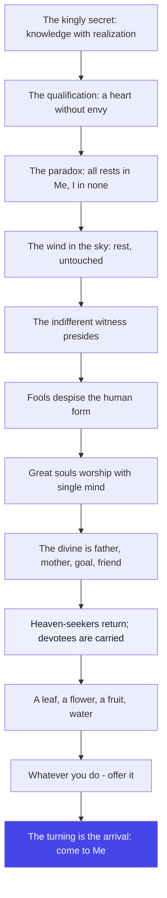
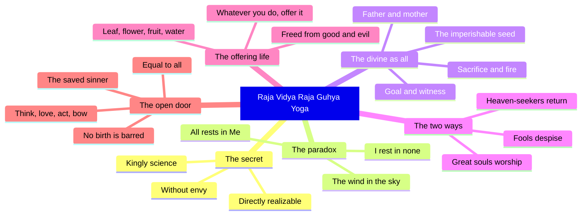

# Chapter 9: Raja Vidya Raja Guhya Yoga — The Royal Secret

> "The greatest secret is not a secret at all. It is the one truth so obvious that you have been overlooking it your whole life: everything is divine."
> — The Osho Way

---

Krishna now speaks the most intimate chapter of the Gita. He calls it the kingly science and the kingly secret — the greatest of secrets — and he speaks it not to a crowd, not to a priest, but to one man who has stopped envying and started listening. The Sanskrit word for the qualification is anasuyave: to the one who does not cavil, who does not find fault. Osho says: the deepest truth cannot be received by a jealous heart. The door to the royal secret is not intelligence — it is a certain generosity of spirit, a readiness to be amazed.

The chapter's geography is breathtaking. Krishna declares that all beings rest in him, and that he rests in none of them — a paradox he asks Arjuna to behold as his divine yoga. The wind rests in the sky; beings rest in the divine. He is the father, the mother, the grandfather; he is the goal, the witness, the friend, the seed. And then the teaching turns startlingly personal: offer me a leaf, a flower, a fruit, water — and I accept it. Whatever you do, whatever you eat, whatever you give, whatever you endure — make it an offering. The royal secret turns out to be disarmingly simple: love everything, offer everything.

Osho reads this chapter as the Gita's love letter. The earlier chapters disciplined the warrior; this chapter melts him. The law of karma is not abolished — it is outgrown. The heaven-seekers still go to heaven and return; the merchant-devotees still bargain; but the one who offers everything, with nothing held back, is carried by the divine itself — yoga-kshema, the securing and preserving of all that is needed. Even the worst of sinners, the verse says, becomes righteous the moment he turns with single heart. Osho's twist: there are no outcasts in love. The royal secret is that love is the only aristocracy.

The chapter ends where it began, with the same fourfold command: be of My mind, be My devotee, worship Me, bow to Me — and you shall come to Me. This is the whole Gita in four words: think, love, act, bow. The deepest teaching of the kingly science is not a doctrine to memorize but a life to become. And the secret is royal because it belongs to everyone — the low-born and the high-born, the sinner and the saint — anyone who stops defending and starts offering.

## Learning Objectives

After completing this chapter you will be able to:

1. **Receive the royal secret** — explain why Krishna calls this the kingly science and the kingly secret, and why non-envy is its entry qualification (9.1-9.3).
2. **Hold the great paradox** — understand how all beings rest in the divine while the divine rests in none, using the wind-in-the-sky simile (9.4-9.6).
3. **Map the divine as everything** — identify Krishna as father, mother, goal, witness, friend, seed, and as the one who upholds all sacrifice (9.16-9.19).
4. **Contrast the bargainers and the devotees** — explain why heaven-seekers return, why the devoted are carried, and why other gods are worship without the proper way (9.20-9.25).
5. **Practice the offering life** — apply the leaf-flower-fruit-water teaching and the "whatever you do, offer it" command to daily life (9.26-9.28).
6. **Build a TypeScript Offering Ledger** — a tool that logs actions and computes how free you are from the bonds of their results.

---

## Raja Vidya Raja Guhya Yoga at a Glance

### The scene and the speakers

Krishna alone speaks all thirty-four verses of this chapter. There is no question, no interruption — this is the master's longest continuous disclosure in the middle of the Gita. The scene is still the battlefield, but the teaching has left the battlefield entirely; it ranges from the cosmic (creation and dissolution of the kalpas) to the domestic (a leaf, a flower, a fruit, water). The Mahabharata context: the armies wait, but the real conversation has become a confession of love. The warrior who could not fight in chapter one is now being taught how to fight with everything offered — the war has become worship.

### The Osho lens

Osho reads this chapter as the Gita's heart — the place where Krishna stops teaching and starts loving. The royal secret is not a new information; it is a new way of relating: everything you do can become an offering, and an offering is the one thing the divine cannot resist. Osho's emphasis is on the word "anyone": the chapter repeatedly throws the door open — the sinful, the low-born, the stranger to the Vedas — anyone who turns with a single heart. The royal secret has no guards, no dress code, no exam. Its only requirement is that you stop holding back.

### The structure of the chapter

The chapter moves in three movements:

1. **Movement 1: 9.1–9.10 — The secret revealed: the divine as the support of all.** The kingly science, the paradox of resting in the divine, the wind in the sky, and the cycles of creation presided over by the indifferent witness.
2. **Movement 2: 9.11–9.25 — The two ways of seeing.** The fools who despise the human form, the great souls who worship with single mind, the divine as all — father, mother, sacrifice, goal — and the contrast between the heaven-seekers and the devoted.
3. **Movement 3: 9.26–9.34 — The offering life and the open door.** A leaf, a flower, a fruit, water; whatever you do, offer it; the equal Lord, the saved sinner, the low-born welcomed, and the fourfold command to think, love, act and bow.

### The three-framework note

This chapter is the crown of the bhakti movement of the Gita (chapters 7-12), but it gathers all three paths. Jnana appears as the kingly science and the knowledge of the divine as all; karma appears as the offering of every action — the whole of life turned into sacrifice; bhakti appears as the single-hearted devotion that carries the devotee. The gunas also reappear: the demonic nature of the despisers (9.12) versus the divine nature of the great souls (9.13). Osho's note: the three paths converge here — the offering life is karma, the remembrance is bhakti, the seeing is jnana, and they are one movement.

## Traditional Reading vs Osho-Style Reading

| Dimension | Traditional reading | Osho-style reading |
|--------|---------------------|--------------------|
| **The royal secret (9.1-9.2)** | The most confidential knowledge of God, revealed only to the worthy | The secret is that there is no secret: everything is divine, and the only requirement is a heart without envy |
| **"They rest in Me, I rest not in them" (9.4-9.5)** | A theological paradox about God's transcendence and immanence | The sky holds the wind without being touched by it; be the sky, not the weather |
| **Fools despise the human form (9.11)** | Sinners who fail to recognize God's incarnation | The ego cannot recognize the divine in the ordinary; it is always looking for the spectacular |
| **Heaven and return (9.20-9.21)** | The merit of Vedic ritual exhausts and rebirth follows | Bargaining with the divine is a return ticket; love alone is a one-way journey |
| **The leaf, flower, fruit, water (9.26)** | Symbolic offerings accepted by the Lord | The divine does not want your wealth; it wants your attention — the smallest thing offered totally outweighs the biggest thing hoarded |
| **Even the worst sinner (9.30-9.31)** | The boundless mercy of God toward repentant sinners | The past is dust the moment the direction changes; the divine does not keep records — the turning is the arrival |

## The Complete Text — All 34 Shlokas

### Shloka 9.1 — The Greatest Secret

> श्रीभगवानुवाच |
> इदं तु ते गुह्यतमं प्रवक्ष्याम्यनसूयवे |
> ज्ञानं विज्ञानसहितं यज्ज्ञात्वा मोक्ष्यसेऽशुभात्

**Transliteration:** śrībhagavānuvāca . idaṃ tu te guhyatamaṃ pravakṣyāmyanasūyave . jñānaṃ vijñānasahitaṃ yajjñātvā mokṣyase.aśubhāt

**Translation:** The Blessed Lord said: To you, who do not cavil, I will declare this greatest of secrets — this knowledge together with realization — knowing which you will be freed from evil.

**Osho Darshan:** Notice the qualification: anasuyave — to the one without envy. The secret is not for the clever; it is for the generous. A jealous heart filters everything through comparison and finds fault everywhere, and a fault-finder cannot receive. Osho says: envy is the hardest door to close, because it feels so reasonable. But the door to the greatest secret opens only when you can hear another man's truth without wanting to correct it. The teaching is also a promise: this knowledge frees you from evil — not by punishing evil, but by outgrowing it.

### Shloka 9.2 — The Kingly Science

> राजविद्या राजगुह्यं पवित्रमिदमुत्तमम् |
> प्रत्यक्षावगमं धर्म्यं सुसुखं कर्तुमव्ययम्

**Transliteration:** rājavidyā rājaguhyaṃ pavitramidamuttamam . pratyakṣāvagamaṃ dharmyaṃ susukhaṃ kartumavyayam

**Translation:** This is the kingly science, the kingly secret, the supreme purifier; it is directly realizable, in accord with dharma, very easy to practice, and imperishable.

**Osho Darshan:** Five adjectives, and each one overturns an assumption. It is royal — not reserved, but ruling over all other knowledge. It is directly realizable — pratyaksha, experienced here and now, not a promise for after death. It is easy — susukham, so easy you will suspect it. And it is imperishable — the one treasure that cannot be stolen. Osho says: the divine has hidden the greatest treasure where you never think to look — in the simplest of all acts, the offering of what you already have. The difficulty is not in the practice; it is in believing that it is this easy.

### Shloka 9.3 — The Faithless Return

> अश्रद्दधानाः पुरुषा धर्मस्यास्य परन्तप |
> अप्राप्य मां निवर्तन्ते मृत्युसंसारवर्त्मनि

**Transliteration:** aśraddadhānāḥ puruṣā dharmasyāsya parantapa . aprāpya māṃ nivartante mṛtyusaṃsāravartmani

**Translation:** Those who have no faith in this dharma, O Parantapa, do not attain Me; they return to the path of the world of death.

**Osho Darshan:** The word is shraddha — faith — and Osho insists it is not belief. Belief is borrowed; faith is the trust that arises from your own glimpse. The faithless do not return because they are punished; they return because the road of death is the only road they can see. The Gita is not threatening — it is describing optics: without trust, the door of this dharma simply does not appear on your map. And the cure for faithlessness is not argument; it is experiment. Try the offering life for a week, and let the taste decide.

### Shloka 9.4 — Pervaded, Yet Not Dwelled In

> मया ततमिदं सर्वं जगदव्यक्तमूर्तिना |
> मत्स्थानि सर्वभूतानि न चाहं तेष्ववस्थितः

**Transliteration:** mayā tatamidaṃ sarvaṃ jagadavyaktamūrtinā . matsthāni sarvabhūtāni na cāhaṃ teṣvavasthitaḥ

**Translation:** All this world is pervaded by Me in My unmanifest form; all beings rest in Me, yet I do not dwell in them.

**Osho Darshan:** Here is the paradox that breaks the mind open: everything rests in the divine, and the divine is contained by nothing. The clay pervades the pot, but the pot does not contain the clay in any way the pot can point to. Osho says: your life is like that — the source pervades every moment of it, yet no moment can claim to hold the source. Do not try to solve this paradox with logic; live it. Watch a thought arise: it rests in awareness, yet awareness is never trapped in the thought. The whole universe is your body; you are the pervading, not the pervaded.

### Shloka 9.5 — The Divine Mystery

> न च मत्स्थानि भूतानि पश्य मे योगमैश्वरम् |
> भूतभृन्न च भूतस्थो ममात्मा भूतभावनः

**Transliteration:** na ca matsthāni bhūtāni paśya me yogamaiśvaram . bhūtabhṛnna ca bhūtastho mamātmā bhūtabhāvanaḥ

**Translation:** Nor do beings rest in Me — behold My divine yoga: supporting all beings, yet not dwelling in them, My Self brings all beings forth.

**Osho Darshan:** Krishna doubles the paradox: first they rest in Me, now they do not. And he asks Arjuna to behold this as his divine yoga — not to understand it, but to wonder at it. Osho says: the truth is not a puzzle to solve but a mystery to enter. The divine supports everything the way space supports everything — holding, allowing, touching nothing. This is the model of your own witnessing: you can support your whole life — its joys, its pains, its people — and be touched by none of it. That is the divine yoga, available in every ordinary moment.

### Shloka 9.6 — The Wind in the Sky

> यथाकाशस्थितो नित्यं वायुः सर्वत्रगो महान् |
> तथा सर्वाणि भूतानि मत्स्थानीत्युपधारय

**Transliteration:** yathākāśasthito nityaṃ vāyuḥ sarvatrago mahān . tathā sarvāṇi bhūtāni matsthānītyupadhāraya

**Translation:** As the great wind, moving everywhere, rests always in the sky, so know that all beings rest in Me.

**Osho Darshan:** The simile is perfect: the wind is everywhere — in the forest, on the sea, around your face — and the sky is never dirtied by it. Osho's invitation: watch your weather. Storms of anger pass, gusts of desire pass, the still air of peace comes and goes — and the sky of awareness holds all of it, untouched. The wind never asks the sky for permission, and the sky never asks the wind to leave. This is non-attachment in its most beautiful form: not indifference, but a holding so vast that nothing can stain it. Rest in the sky, not in the weather.

### Shloka 9.7 — The Breathing of the Kalpa

> सर्वभूतानि कौन्तेय प्रकृतिं यान्ति मामिकाम् |
> कल्पक्षये पुनस्तानि कल्पादौ विसृजाम्यहम्

**Transliteration:** sarvabhūtāni kaunteya prakṛtiṃ yānti māmikām . kalpakṣaye punastāni kalpādau visṛjāmyaham

**Translation:** All beings, O Kaunteya, go into My nature at the end of a kalpa; and at the beginning of the next, I send them forth again.

**Osho Darshan:** The universe is not a one-time creation; it is a rhythm — an inhale of manifestation, an exhale of dissolving, endless. Osho says: do not file this away as astronomy; feel it in your own breath. Each night your whole world dissolves into sleep; each morning it is sent forth again. The kalpa is a day of Brahma, and your sleep is a night of Brahma in miniature. The same rhythm that breathes the galaxies breathes you. Knowing the rhythm, you can stop fearing the endings — every ending is an exhale, and the exhale is followed by the inhale.

### Shloka 9.8 — Again and Again

> प्रकृतिं स्वामवष्टभ्य विसृजामि पुनः पुनः |
> भूतग्राममिमं कृत्स्नमवशं प्रकृतेर्वशात्

**Transliteration:** prakṛtiṃ svāmavaṣṭabhya visṛjāmi punaḥ punaḥ . bhūtagrāmamimaṃ kṛtsnamavaśaṃ prakṛtervaśāt

**Translation:** Animating My nature, I send forth again and again this whole multitude of beings, helpless under the sway of nature.

**Osho Darshan:** The key phrase is punah punah — again and again. The world repeats because it is driven by nature's momentum, and beings are avashah — helpless — because they have not woken to the driver within. Osho says: the repetition is not a curse; it is a school. The universe repeats until you learn the lesson, like a teacher repeating the same example. And the lesson is always the same: you are not the momentum. The moment you witness the repetition instead of being it, the wheel loses its grip. The again-and-again is only for those who have not yet noticed.

### Shloka 9.9 — The Indifferent Witness

> न च मां तानि कर्माणि निबध्नन्ति धनञ्जय |
> उदासीनवदासीनमसक्तं तेषु कर्मसु

**Transliteration:** na ca māṃ tāni karmāṇi nibadhnanti dhanañjaya . udāsīnavadāsīnamasaktaṃ teṣu karmasu

**Translation:** These actions do not bind Me, O Dhananjaya — for I sit like one indifferent, unattached to those actions.

**Osho Darshan:** The divine does the work of creation and stays free — udasinavat, like a spectator. Osho says: this is the model of actionless action made cosmic. You can be in the middle of your own creation — your career, your family, your projects — and sit within it like an indifferent spectator, untouched. Indifferent does not mean careless; it means unattached to the outcome. The referee in a match runs the whole game and never wins or loses. Act like the referee of your own life: fully engaged, never owned.

### Shloka 9.10 — Nature Works, I Watch

> मयाध्यक्षेण प्रकृतिः सूयते सचराचरम् |
> हेतुनानेन कौन्तेय जगद्विपरिवर्तते

**Transliteration:** mayādhyakṣeṇa prakṛtiḥ sūyate sacarācaram . hetunānena kaunteya jagadviparivartate

**Translation:** Under Me as supervisor, nature gives birth to the moving and the unmoving; and because of this, O Kaunteya, the world revolves.

**Osho Darshan:** The word adhyaksha — supervisor, presiding witness — is the whole teaching in a seed. Nature does the work; the witness presides. The sun does not push the seasons; it presides, and the seasons turn. Osho says: you do not need to be the doer to be the presence. The moment you drop the claim "I am doing this," the doing continues — often better — and the doer rests in the witness. This is the end of anxiety: not the end of work, but the end of the illusion that the work is yours.

### Shloka 9.11 — The Fool's Contempt

> अवजानन्ति मां मूढा मानुषीं तनुमाश्रितम् |
> परं भावमजानन्तो मम भूतमहेश्वरम्

**Transliteration:** avajānanti māṃ mūḍhā mānuṣīṃ tanumāśritam . paraṃ bhāvamajānanto mama bhūtamaheśvaram

**Translation:** Fools despise Me, dwelling as I do in a human form, not knowing My higher nature as the great Lord of all beings.

**Osho Darshan:** The fools are not stupid people — they are the ones who can only respect the spectacular. A God in the sky, in a temple, in a book — fine. A God in a human form, eating, walking, laughing — impossible. Osho says: the ego always despises the ordinary, because the ordinary is where the ego does not rule. And the deeper reading is about you: the divine dwells in your own human form, and you despise it — you criticize your body, your life, your ordinariness. Stop despising the human form; it is the temple the great Lord chose.

### Shloka 9.12 — Vain Hopes, Vain Works

> मोघाशा मोघकर्माणो मोघज्ञाना विचेतसः |
> राक्षसीमासुरीं चैव प्रकृतिं मोहिनीं श्रिताः

**Transliteration:** moghāśā moghakarmāṇo moghajñānā vicetasaḥ . rākṣasīmāsurīṃ caiva prakṛtiṃ mohinīṃ śritāḥ

**Translation:** Of vain hopes, vain works and vain knowledge, senseless — they take to the deceitful nature of demons and the undivine.

**Osho Darshan:** Three times the word "vain" — mogha — strikes like a bell. Hopes aimed at the perishable are vain, because the target dissolves. Works done for applause are vain, because the applause evaporates. Knowledge that never becomes living is vain, because it changes nothing. Osho says: the demonic nature is not evil — it is deceitful, most of all toward itself. It works, hopes and studies, and never asks: what is this for? The cure is not more hope, more work, more knowledge — it is the turning of the direction. Ask once, honestly, and the vain becomes the true.

### Shloka 9.13 — The Great Souls

> महात्मानस्तु मां पार्थ दैवीं प्रकृतिमाश्रिताः |
> भजन्त्यनन्यमनसो ज्ञात्वा भूतादिमव्ययम्

**Transliteration:** mahātmānastu māṃ pārtha daivīṃ prakṛtimāśritāḥ . bhajantyananyamanaso jñātvā bhūtādimavyayam

**Translation:** But the great souls, O Partha, taking refuge in the divine nature, worship Me with a single mind, knowing Me as the imperishable source of all beings.

**Osho Darshan:** The great soul is not defined by birth, wealth or learning — but by one thing: a mind that has become single, ananyamanas. Osho says: most minds are crowds — a parliament of voices, each demanding the floor. The great soul is not the one who silenced the crowd by force; he is the one whose attention found one direction and the crowd naturally stilled. And what makes the mind single is not effort but knowing — knowing the source as imperishable. The mind cannot be single about trivia; it becomes single about the eternal.

### Shloka 9.14 — Always Glorifying

> सततं कीर्तयन्तो मां यतन्तश्च दृढव्रताः |
> नमस्यन्तश्च मां भक्त्या नित्ययुक्ता उपासते

**Transliteration:** satataṃ kīrtayanto māṃ yatantaśca dṛḍhavratāḥ . namasyantaśca māṃ bhaktyā nityayuktā upāsate

**Translation:** Always glorifying Me, striving, firm in vows, bowing down to Me with devotion, they worship Me, ever steadfast.

**Osho Darshan:** The great souls have four habits: they praise, they strive, they bow, they stay. Osho reads the list as a complete technology of the heart. Praise turns the mind toward the beloved; striving keeps the energy alive; bowing dissolves the ego's stiffness — you cannot bow and remain arrogant; and steadfastness makes it all a river instead of a splash. None of the four is difficult; together they are a life. The worship is not a ritual performed at dawn; it is the flavor of every hour, the background of every act.

### Shloka 9.15 — The Wisdom-Sacrifice

> ज्ञानयज्ञेन चाप्यन्ये यजन्तो मामुपासते |
> एकत्वेन पृथक्त्वेन बहुधा विश्वतोमुखम्

**Transliteration:** jñānayajñena cāpyanye yajanto māmupāsate . ekatvena pṛthaktvena bahudhā viśvatomukham

**Translation:** Others, sacrificing with the wisdom-sacrifice, worship Me — the all-faced — as one, as distinct, and as manifold.

**Osho Darshan:** Krishna honors every way of approaching: as one, as distinct, as manifold. The non-dualist sees only the one; the dualist loves the distinct Lord; the worshipper of forms sees the divine everywhere. Osho says: do not argue about which lens is correct — all lenses see the same sun. The wisdom-sacrifice is the offering of understanding itself: every insight, every realization, offered back to the source of understanding. Your thinking is the sacrifice; the thinker is the altar; the known is the fire. Be generous with your mind, and it becomes worship.

### Shloka 9.16 — I Am the Sacrifice

> अहं क्रतुरहं यज्ञः स्वधाहमहमौषधम् |
> मन्त्रोऽहमहमेवाज्यमहमग्निरहं हुतम्

**Transliteration:** ahaṃ kraturahaṃ yajñaḥ svadhāhamahamauṣadham . mantro.ahamahamevājyamahamagnirahaṃ hutam

**Translation:** I am the rite and I am the sacrifice; I am the offering to the ancestors and the healing herb; I am the mantra, the clarified butter, the fire, and the oblation.

**Osho Darshan:** The altar collapses into the divine: the ritual, the fire, the butter, the chanted word, the offering — all are one. Osho says: when you truly worship, the division between worshipper and worshipped dissolves, and what remains is one flowing. The verse is also an invitation to see your own work this way: the writer, the writing and the written; the cook, the cooking and the meal. When you can say "I am the offering" — not the one who makes an offering — your whole life has become a yajna. Nothing is left outside; everything burns in the one fire.

### Shloka 9.17 — Father, Mother, Grandfather

> पिताहमस्य जगतो माता धाता पितामहः |
> वेद्यं पवित्रमोंकार ऋक्साम यजुरेव च

**Transliteration:** pitāhamasya jagato mātā dhātā pitāmahaḥ . vedyaṃ pavitramoṃkāra ṛksāma yajureva ca

**Translation:** I am the father of this world, the mother, the dispenser, the grandfather; I am the knowable, the purifier, the syllable Om, and the Rik, Sama and Yajur Vedas.

**Osho Darshan:** The divine claims every relation — father, mother, dispenser, grandfather — so that no one can say "I am an orphan of the divine." Osho says: whichever word your heart can pronounce — father, mother, friend — that is the correct address. And the list ends with the knowable and the purifier: the divine is not only the one who loves you; it is also the one who washes you. The same presence that mothers you also burns your impurities. Do not ask it to be only gentle; the purifier must be allowed to burn what is impure, and the burning is love too.

### Shloka 9.18 — The Twelve Names

> गतिर्भर्ता प्रभुः साक्षी निवासः शरणं सुहृत् |
> प्रभवः प्रलयः स्थानं निधानं बीजमव्ययम्

**Transliteration:** gatirbhartā prabhuḥ sākṣī nivāsaḥ śaraṇaṃ suhṛt . prabhavaḥ pralayaḥ sthānaṃ nidhānaṃ bījamavyayam

**Translation:** I am the goal, the supporter, the Lord, the witness, the abode, the shelter, the friend; I am the origin, the dissolution, the foundation, the treasure-house, and the imperishable seed.

**Osho Darshan:** Twelve names, and Osho says: this is not a list — it is a mirror. Whichever direction you are facing in your life, one of these names is facing you. Seeking? I am the goal. Weary? I am the shelter. Lonely? I am the friend. Lost? I am the abode. Dying? I am the imperishable seed. The divine has a name for every human door, and no door is unopened. The tragedy is not that people lack the divine; it is that they knock at every door of the world and never notice that the one they are looking for is the knocker.

### Shloka 9.19 — I Am the Heat and the Rain

> तपाम्यहमहं वर्षं निगृह्णाम्युत्सृजामि च |
> अमृतं चैव मृत्युश्च सदसच्चाहमर्जुन

**Transliteration:** tapāmyahamahaṃ varṣaṃ nigṛhṇāmyutsṛjāmi ca . amṛtaṃ caiva mṛtyuśca sadasaccāhamarjuna

**Translation:** I give heat; I withhold and release the rain; I am immortality and death; I am existence and non-existence, O Arjuna.

**Osho Darshan:** The most shocking line in the chapter: I am death. Not only immortality — death too. Osho says: if the divine is only the comfortable half of reality, it is an idol, not the truth. The truth includes the heat that burns and the rain that floods; it includes the ending of everything you love. And that is the deepest comfort: nothing you face is outside the divine. The death you fear is not an enemy invading the creation — it is the creator's own face. When you can bow to death as you bow to life, fear has nowhere left to stand.

### Shloka 9.20 — The Heaven-Seekers

> त्रैविद्या मां सोमपाः पूतपापा
> यज्ञैरिष्ट्वा स्वर्गतिं प्रार्थयन्ते |
> ते पुण्यमासाद्य सुरेन्द्रलोक-
> मश्नन्ति दिव्यान्दिवि देवभोगान्

**Transliteration:** traividyā māṃ somapāḥ pūtapāpā yajñairiṣṭvā svargatiṃ prārthayante . te puṇyamāsādya surendralokaṃ aśnanti divyāndivi devabhogān

**Translation:** The knowers of the three Vedas, drinking soma, purified of sin, worship Me through sacrifices and pray for the way to heaven; reaching the world of the Lord of the gods, they enjoy divine pleasures in heaven.

**Osho Darshan:** These are not sinners — they are the meritorious, the purified, the ritual masters. And they pray for heaven. Osho says: heaven is the highest desire of the worldly mind, and that is exactly its ceiling. The man who prays for heaven is still praying for a room in the hotel; the devotee prays for the owner. The tragedy of the heaven-seekers is not that they are wicked — it is that they are excellent, and their excellence is spent on a return ticket. The ladder of merit is real; it just ends. Notice where your prayers are aimed, and ask: room or owner?

### Shloka 9.21 — The Exhausted Merit

> ते तं भुक्त्वा स्वर्गलोकं विशालं
> क्षीणे पुण्ये मर्त्यलोकं विशन्ति |
> एवं त्रयीधर्ममनुप्रपन्ना
> गतागतं कामकामा लभन्ते

**Transliteration:** te taṃ bhuktvā svargalokaṃ viśālaṃ kṣīṇe puṇye martyalokaṃ viśanti . evaṃ trayīdharmamanuprapannā gatāgataṃ kāmakāmā labhante

**Translation:** Having enjoyed the vast heaven, when their merit is exhausted they enter the world of mortals; thus, following the dharma of the three Vedas and desiring desires, they attain the state of going and returning.

**Osho Darshan:** The verdict on the bargain is delivered in one phrase: kama-kamah — the desirers of desires. They do not want the divine; they want the fulfillment of wanting. And wanting, however high it reaches, is a cycle — it always returns to the earth of wanting again. Osho says: the credit of merit runs out because it is still credit. The devotee's treasure does not run out because it is not a transaction — it is a transformation. Do not trade with the divine; merge with it. The going and returning is for those who keep a separate account.

### Shloka 9.22 — I Carry Their Yoga and Kshema

> अनन्याश्चिन्तयन्तो मां ये जनाः पर्युपासते |
> तेषां नित्याभियुक्तानां योगक्षेमं वहाम्यहम्

**Transliteration:** ananyāścintayanto māṃ ye janāḥ paryupāsate . teṣāṃ nityābhiyuktānāṃ yogakṣemaṃ vahāmyaham

**Translation:** For those who worship Me alone, thinking of nothing else, ever united — for them, I Myself carry the securing of what is needed and the preserving of what is theirs.

**Osho Darshan:** This is the most famous promise of the chapter — and the most misunderstood. People hear it as a guarantee of salary and safety. Osho says: the promise is simpler and deeper — the one who offers everything no longer needs to scheme for anything. The divine does not run errands; the offering mind stops needing errands. Yoga-kshema, the gain and its keeping, is not a magic bank; it is the freedom of the man who has stopped storing. Need will be met because the need itself has been offered. The devotee is carried because he has stopped demanding to walk his own way.

### Shloka 9.23 — Even the Worshippers of Other Gods

> येऽप्यन्यदेवता भक्ता यजन्ते श्रद्धयान्विताः |
> तेऽपि मामेव कौन्तेय यजन्त्यविधिपूर्वकम्

**Transliteration:** ye.apyanyadevatābhaktā yajante śraddhayānvitāḥ . te.api māmeva kaunteya yajantyavidhipūrvakam

**Translation:** Even those devotees who, endowed with faith, worship other gods — they worship Me alone, O Kaunteya, though by the wrong method.

**Osho Darshan:** The inclusiveness is absolute: even the worshipper at another shrine is worshipping the one — only the address is wrong. Osho says: the divine is not jealous; the divine is the only one there is, so every prayer lands on the same doorstep. But the method matters, avidhipurvakam — improperly. The wrong method is not about which god; it is about which direction: outward, toward an object, instead of inward, toward the source. The other gods are real enough as symbols; the mistake is stopping at the symbol. Every religion's temple is a signpost. Do not live at the signpost; travel to the destination.

### Shloka 9.24 — The Enjoyer of All Sacrifices

> अहं हि सर्वयज्ञानां भोक्ता च प्रभुरेव च |
> न तु मामभिजानन्ति तत्त्वेनातश्च्यवन्ति ते

**Transliteration:** ahaṃ hi sarvayajñānāṃ bhoktā ca prabhureva ca . na tu māmabhijānanti tattvenātaścyavanti te

**Translation:** For I alone am the enjoyer and the Lord of all sacrifices; but they do not know Me in essence, and therefore they fall.

**Osho Darshan:** Every offering, everywhere, is finally tasted by the one — the way every river, by whatever name, reaches the same sea. The falling happens not because the divine rejects other worship, but because the worshipper never learns the essence: that the taster and the tasted are one. Osho says: an offering made to a statue, without the knowledge of the indweller, is a gift mailed to the postman. The remedy is not to abandon the statue — it is to look past it, to the presence that receives every gift. Know the taster, and no offering is ever lost.

### Shloka 9.25 — You Become What You Worship

> यान्ति देवव्रता देवान्पितॄन्यान्ति पितृव्रताः |
> भूतानि यान्ति भूतेज्या यान्ति मद्याजिनोऽपि माम्

**Transliteration:** yānti devavratā devānpitṝnyānti pitṛvratāḥ . bhūtāni yānti bhūtejyā yānti madyājino.api mām

**Translation:** The worshippers of the gods go to the gods; the worshippers of the ancestors go to the ancestors; the worshippers of the elemental spirits go to them; and My worshippers come to Me.

**Osho Darshan:** This is the law of identity in one verse: you become what you love. The worshipper of money becomes money-shaped; the worshipper of status becomes a status; the worshipper of worry becomes a walking worry. Osho says: watch what you worship, because it is not a metaphor — it is a becoming. The good news is in the last clause: the one who worships the source becomes the source-shaped, and the source-shaped cannot die. Choose your worship carefully; it is the sculptor of your final form.

### Shloka 9.26 — A Leaf, a Flower, a Fruit, Water

> पत्रं पुष्पं फलं तोयं यो मे भक्त्या प्रयच्छति |
> तदहं भक्त्युपहृतमश्नामि प्रयतात्मनः

**Transliteration:** patraṃ puṣpaṃ phalaṃ toyaṃ yo me bhaktyā prayacchati . tadahaṃ bhaktyupahṛtamaśnāmi prayatātmanaḥ

**Translation:** Whoever offers Me with devotion a leaf, a flower, a fruit or water — that offering of the pure-hearted one, made with devotion, I accept.

**Osho Darshan:** The royal secret in four small things: a leaf, a flower, a fruit, water. Osho says: the divine does not need your wealth — it needs your attention. The smallest thing, offered totally, outweighs the greatest thing, offered distractedly. A leaf held with a full heart is heavier than a mountain held with an empty one. And the word prayatatmanah — of the pure-hearted — completes the law: the offering is not measured by its size but by the purity of the giver. You cannot buy this purity; you can only practice it, one small offering at a time.

### Shloka 9.27 — Whatever You Do, Offer It

> यत्करोषि यदश्नासि यज्जुहोषि ददासि यत् |
> यत्तपस्यसि कौन्तेय तत्कुरुष्व मदर्पणम्

**Transliteration:** yatkaroṣi yadaśnāsi yajjuhoṣi dadāsi yat . yattapasyasi kaunteya tatkuruṣva madarpaṇam

**Translation:** Whatever you do, whatever you eat, whatever you offer in sacrifice, whatever you give, whatever austerity you practice, O Kaunteya — make all of it an offering to Me.

**Osho Darshan:** Here is the whole Gita distilled into one command: make it an offering — madarpanam. Not "renounce it," not "abandon it," not "hate it" — offer it. The eating becomes an offering; the working becomes an offering; even the austerity becomes an offering. Osho says: the offering life does not subtract anything from your life; it adds meaning to everything. The same breakfast, the same job, the same body — but now each is a gift, and a gift cannot bind. The chain of karma is broken not by doing less, but by giving more.

### Shloka 9.28 — Freed From Good and Evil

> शुभाशुभफलैरेवं मोक्ष्यसे कर्मबन्धनैः |
> संन्यासयोगयुक्तात्मा विमुक्तो मामुपैष्यसि

**Transliteration:** śubhāśubhaphalairevaṃ mokṣyase karmabandhanaiḥ . saṃnyāsayogayukttmā vimukto māmupaiṣyasi

**Translation:** Thus, you will be freed from the bonds of action and their good and evil fruits; with your mind steadfast in the yoga of renunciation, liberated, you will come to Me.

**Osho Darshan:** Notice what is promised: freedom from good fruits too — not only from evil. Osho says: the good fruits are the subtler chain, because they feel like freedom. The man addicted to appreciation is as chained as the man addicted to escape; he has just decorated the chain. The offering life breaks both: when everything is given, nothing is owed, and the ledger closes. The renunciation here is not giving up things — it is giving up the accounting. The liberated one does not keep score, and a life without scorekeeping is a life that has come home.

### Shloka 9.29 — Equal to All

> समोऽहं सर्वभूतेषु न मे द्वेष्योऽस्ति न प्रियः |
> ये भजन्ति तु मां भक्त्या मयि ते तेषु चाप्यहम्

**Transliteration:** samo.ahaṃ sarvabhūteṣu na me dveṣyo.asti na priyaḥ . ye bhajanti tu māṃ bhaktyā mayi te teṣu cāpyaham

**Translation:** I am the same to all beings; there is none hateful or dear to Me. But those who worship Me with devotion are in Me, and I am in them.

**Osho Darshan:** Here is the divine's equality, and Osho says it is the hardest thing for the ego to hear: no favorites. The sun does not love the garden more than the desert; it shines on both, and only the garden can use the light. The equality of the divine is not indifference — it is the physics of love: the same grace falls everywhere, and what differs is only the receiving. The devotee does not become dear because the divine changed; the devotee opened. The verse ends with the deepest intimacy: they in Me, I in them. Equality outside; intimacy inside. The door is not the divine's — it is yours.

### Shloka 9.30 — Even the Worst of Sinners

> अपि चेत्सुदुराचारो भजते मामनन्यभाक् |
> साधुरेव स मन्तव्यः सम्यग्व्यवसितो हि सः

**Transliteration:** api cetsudurācāro bhajate māmananyabhāk . sādhureva sa mantavyaḥ samyagvyavasito hi saḥ

**Translation:** Even if the most sinful worships Me with devotion to none else, he must be regarded as righteous — for he has rightly resolved.

**Osho Darshan:** The royal secret opens to the worst of sinners — and not grudgingly, but with the word sādhuh: righteous. Osho says: the divine does not read your past; it reads your direction. A man who has spent his life going east and turns west is, from that instant, a western traveler — the east is behind him. The verdict "righteous" is not about the record; it is about the resolution — samyak vyavasita, the rightly turned will. Do not let your past write your identity. One true turning outweighs ten thousand wanderings. The Gita's grace is this simple: the direction is everything.

### Shloka 9.31 — My Devotee Never Perishes

> क्षिप्रं भवति धर्मात्मा शश्वच्छान्तिं निगच्छति |
> कौन्तेय प्रतिजानीहि न मे भक्तः प्रणश्यति

**Transliteration:** kṣipraṃ bhavati dharmātmā śaśvacchāntiṃ nigacchati . kaunteya pratijānīhi na me bhaktaḥ praṇaśyati

**Translation:** Soon he becomes righteous and attains everlasting peace; O Kaunteya, declare it for certain — My devotee never perishes.

**Osho Darshan:** The word is kshipram — soon. The transformation of the sinner is not a lifetime project; it begins at the instant of the turning. And then Krishna makes Arjuna a herald: pratijanihi, declare it. Osho says: the Gita wants this news announced, not whispered — that the devotee never perishes. Not because the devotee is protected from storms, but because the devotee has found the imperishable within the storms. The one who loves the source is anchored in the source. Perishing belongs to the surface; the depth never perishes. Declare it: you cannot lose what you have offered.

### Shloka 9.32 — No Sinful Birth Can Bar

> मां हि पार्थ व्यपाश्रित्य येऽपि स्युः पापयोनयः |
> स्त्रियो वैश्यास्तथा शूद्रास्तेऽपि यान्ति परां गतिम्

**Transliteration:** māṃ hi pārtha vyapāśritya ye.api syuḥ pāpayonayaḥ . striyo vaiśyāstathā śūdrāste.api yānti parāṃ gatim

**Translation:** For, taking refuge in Me, O Partha, even those born in sinful wombs — women, vaishyas and shudras — they too attain the supreme goal.

**Osho Darshan:** This verse was a revolution in its time, and it is still a revolution. Krishna throws the door open to everyone the society had locked out. Osho says: the divine is the great equalizer — birth, gender, caste, occupation: none of it matters at the gate, because the gate is inside. The supreme goal is not a prize for the high-born; it is the birthright of anyone who takes refuge. If you have ever felt unqualified for the spiritual — too young, too old, too busy, too fallen — this verse is addressed to you. The only qualification is taking refuge.

### Shloka 9.33 — This Impermanent World

> किं पुनर्ब्राह्मणाः पुण्या भक्ता राजर्षयस्तथा |
> अनित्यमसुखं लोकमिमं प्राप्य भजस्व माम्

**Transliteration:** kiṃ punarbrāhmaṇāḥ puṇyā bhaktā rājarṣayastathā . anityamasukhaṃ lokamimaṃ prāpya bhajasva mām

**Translation:** How much more easily, then, do the holy brahmins and the devoted royal sages attain the goal! Having come to this impermanent and unhappy world, worship Me.

**Osho Darshan:** The argument runs upward: if the low-born reach the goal, how much more the already-devoted? And then the teaching turns personal: you are here, in this impermanent world — anityam, asukham — so worship. Osho says: do not wait for the world to become permanent and happy before you start; it never will, and that is exactly the point. The impermanence is the argument for the eternal. The world's discomfort is the prod toward the source. The boat that keeps leaking is the one that teaches you to swim. Worship now, in the leaky boat — not later, on the finished shore.

### Shloka 9.34 — Fix Your Mind on Me

> मन्मना भव मद्भक्तो मद्याजी मां नमस्कुरु |
> मामेवैष्यसि युक्त्वैवमात्मानं मत्परायणः

**Transliteration:** manmanā bhava madbhakto madyājī māṃ namaskuru . māmevaiṣyasi yuktvaivamātmānaṃ matparāyaṇaḥ

**Translation:** Be of My mind; be My devotee; worship Me; bow down to Me. Having thus united your self to Me, making Me your supreme goal, you shall come to Me.

**Osho Darshan:** The chapter closes with the fourfold command, and Osho says each word is a complete path: manmana — think of Me, the path of meditation; madbhakta — love Me, the path of devotion; madyaji — act for Me, the path of action; namaskuru — bow to Me, the path of surrender. And the promise: you shall come to Me. Not after death — the coming begins now, with every thought, every act, every bow. The royal secret ends where it began: the whole of the Gita in four words, and the whole of practice in this breath. Make Me your goal, and the journey is already the arrival.

## Key Themes

| Theme | Shlokas | Osho-style insight |
|-------|---------|--------------------|
| **The kingly science** | 9.1-9.3 | The secret is that there is no secret: everything is divine, and the door is a heart without envy |
| **The great paradox** | 9.4-9.6 | All rests in the divine; the divine rests in none — the sky holds the wind, untouched |
| **The indifferent witness** | 9.9-9.10 | Nature does the work; the witness presides — be the referee of your own life |
| **Two ways of seeing** | 9.11-9.15 | The ego despises the ordinary; the great soul sees the imperishable source in all |
| **The divine as everything** | 9.16-9.19 | Father, mother, sacrifice, goal, friend — and death too; nothing is outside the one |
| **Heaven and return** | 9.20-9.25 | Bargaining with the divine is a return ticket; you become what you worship |
| **The offering life** | 9.26-9.28 | A leaf offered totally outweighs a mountain hoarded; give everything, owe nothing |
| **The open door** | 9.29-9.34 | Equal to all, intimate with the devoted; the turning is the arrival, for anyone |

## The Inner Journey



## A Mind Map



## Summary

- Krishna declares the greatest secret: knowledge with realization, which frees from evil; its gate is a heart without envy — 9.1-9.3.
- All beings rest in the divine, yet the divine rests in none — the wind rests in the sky, untouched — 9.4-9.6.
- The divine presides as the indifferent witness while nature creates and dissolves, again and again — 9.7-9.10.
- The fools despise the human form; the great souls worship with a single mind, knowing the imperishable source — 9.11-9.15.
- The divine is father, mother, goal, witness, friend, sacrifice, seed — and death itself — 9.16-9.19.
- The heaven-seekers return when merit is exhausted; the ever-united are carried — 9.20-9.25.
- A leaf, a flower, a fruit, water — the smallest offering, given with devotion, is accepted; whatever you do, offer it — 9.26-9.28.
- The Lord is equal to all and intimate with the devoted; even the worst sinner, the low-born, turns and arrives — 9.29-9.34.

## Practical Takeaways

- Practice the small offering: today, give one thing you usually hoard — time, attention, a cup of tea made carefully — as an offering, and notice the difference in the giver.
- When work feels heavy, recite silently: whatever you do, offer it. The heaviness belongs to the doer; the offering is light.
- Catch your prayer direction: are you asking for a room in heaven or for the owner? Notice, and gently turn.
- When a mistake or a past failure haunts you, remember the turning: the direction is everything, and one true turning outweighs ten thousand wanderings.
- Be the referee of your own life: engage fully, and let the outcomes win or lose without you.
- Each morning, choose one name of the divine that fits the day — goal, shelter, friend — and carry it like a coin in your pocket.

## Chapter Quiz

**Q1. What does Krishna call this knowledge in 9.1-9.2, and to whom does he declare it?**
- a. The knowledge of the Vedas, to all priests
- b. The kingly science and kingly secret, to one who does not cavil
- c. The science of war, to the army
- d. The secret of karma, to the renunciates

<details class="tp-qa-card" data-qid="bg9-q1"><summary>Show Answer</summary>

**Answer: b.** The kingly science, the kingly secret, declared to the one who does not cavil — 9.1-9.2.
</details>

**Q2. What paradox does Krishna state in 9.4-9.5?**
- a. All beings rest in Me, yet I do not dwell in them
- b. I am far away, yet I am near
- c. The world is real, yet unreal
- d. I create, yet I do not create

<details class="tp-qa-card" data-qid="bg9-q2"><summary>Show Answer</summary>

**Answer: a.** All beings rest in Me, yet I do not dwell in them — 9.4-9.5.
</details>

**Q3. Which of the following is NOT named as Krishna in 9.16-9.19?**
- a. The fire and the oblation
- b. The witness and the friend
- c. The worshipper
- d. Immortality and death

<details class="tp-qa-card" data-qid="bg9-q3"><summary>Show Answer</summary>

**Answer: c.** The worshipper is not named; Krishna is the rite, the fire, the oblation, the goal, the witness, the friend, immortality and death — 9.16-9.19.
</details>

**Q4. What happens to the heaven-seekers in 9.20-9.21?**
- a. They stay in heaven forever
- b. They return to the world of mortals when their merit is exhausted
- c. They become gods
- d. They merge with Brahman

<details class="tp-qa-card" data-qid="bg9-q4"><summary>Show Answer</summary>

**Answer: b.** Enjoying the vast heaven, they return when merit is exhausted — 9.20-9.21.
</details>

**Q5. What does Krishna accept in 9.26, and from whom?**
- a. Gold and jewels, from the wealthy
- b. A leaf, a flower, a fruit or water, offered with devotion by the pure-hearted
- c. Great sacrifices, from kings
- d. Fasting, from ascetics

<details class="tp-qa-card" data-qid="bg9-q5"><summary>Show Answer</summary>

**Answer: b.** A leaf, a flower, a fruit or water, offered with devotion by the pure-hearted — 9.26.
</details>

**Q6. According to 9.30-9.32, what happens to the worst sinner who worships with single devotion, and who else can attain the supreme goal?**
- a. He is punished slowly; only the high-born can attain
- b. He is regarded as righteous and never perishes; even the low-born attain the supreme goal
- c. He must be reborn; only sages can attain
- d. He is forgiven but loses his place; only kings can attain

<details class="tp-qa-card" data-qid="bg9-q6"><summary>Show Answer</summary>

**Answer: b.** He is regarded as righteous and never perishes; even those of sinful birth attain the supreme goal — 9.30-9.32.
</details>

## Exercises

1. **The offering audit:** List everything you did yesterday — work, meals, conversations, waiting. Mark each one: was it held or offered? Rewrite the list as if every item were offered, and notice what changes in your feeling of the day.
2. **The small offering practice:** For one week, once a day, offer something small and total — a leaf found on a walk, a glass of water placed with attention, a flower. Do not tell anyone. Watch how the small practice changes the size of your attention.
3. **Extend the Offering Ledger:** Add a `dailyGoal` field to the tool below that counts how many consecutive days you have reached the threshold of offered actions, and have it print a "turning streak" — the Gita says the turning is soon (kshipram); let the tool show you your own.

## TypeScript Tool: Offering Ledger

```typescript
/*
 * Offering Ledger
 * Based on Chapter 9 (Raja Vidya Raja Guhya Yoga).
 * Shloka 9.27: whatever you do, whatever you eat, whatever
 * you give - make it an offering. This ledger logs daily
 * actions and computes how free you are from the bonds of
 * their results, following the promise of 9.28.
 */

interface ActionEntry {
  date: string;
  action: string;
  attached: boolean; // done for a reward
  offered: boolean;  // done as an offering
}

interface DaySummary {
  date: string;
  totalActions: number;
  offeredActions: number;
  attachmentScore: number; // 0-10, how tightly results are held
}

interface FreedomReport {
  daysAnalyzed: number;
  overallAttachmentScore: number;
  isFree: boolean;
  message: string;
}

function summarizeDay(entries: ActionEntry[]): DaySummary | null {
  if (entries.length === 0) return null;
  const date = entries[0].date;
  const offeredActions = entries.filter(e => e.offered).length;
  const attachedActions = entries.filter(e => e.attached).length;
  const attachmentScore = Math.round((attachedActions / entries.length) * 10);
  return { date, totalActions: entries.length, offeredActions, attachmentScore };
}

function analyze(entries: ActionEntry[]): FreedomReport {
  const byDate = new Map<string, ActionEntry[]>();
  for (const entry of entries) {
    const list = byDate.get(entry.date) ?? [];
    list.push(entry);
    byDate.set(entry.date, list);
  }
  const days = [...byDate.values()].map(summarizeDay).filter((d): d is DaySummary => d !== null);
  const overall = Math.round(
    days.reduce((sum, d) => sum + d.attachmentScore, 0) / Math.max(1, days.length)
  );
  const isFree = overall <= 3;
  return {
    daysAnalyzed: days.length,
    overallAttachmentScore: overall,
    isFree,
    message: isFree
      ? 'You have loosened the bonds of good and evil fruits. The offering life is carrying you now.'
      : 'The ledger still shows grasping. Offer the same actions, and the chain will loosen - soon (kshipram).'
  };
}

function runDemo(): void {
  const log: ActionEntry[] = [
    { date: '2026-08-17', action: 'prepared breakfast', attached: false, offered: true },
    { date: '2026-08-17', action: 'wrote report for boss', attached: true, offered: false },
    { date: '2026-08-17', action: 'phoned mother', attached: false, offered: true },
    { date: '2026-08-18', action: 'cleaned the room', attached: false, offered: true },
    { date: '2026-08-18', action: 'practiced meditation', attached: false, offered: true }
  ];
  const report = analyze(log);
  console.log('=== Offering Ledger ===');
  console.log(`Days analyzed: ${report.daysAnalyzed}`);
  console.log(`Overall attachment score: ${report.overallAttachmentScore}/10`);
  console.log(`Status: ${report.isFree ? 'liberated from results' : 'still bound to results'}`);
  console.log('');
  console.log(`Osho: ${report.message}`);
}

runDemo();
```