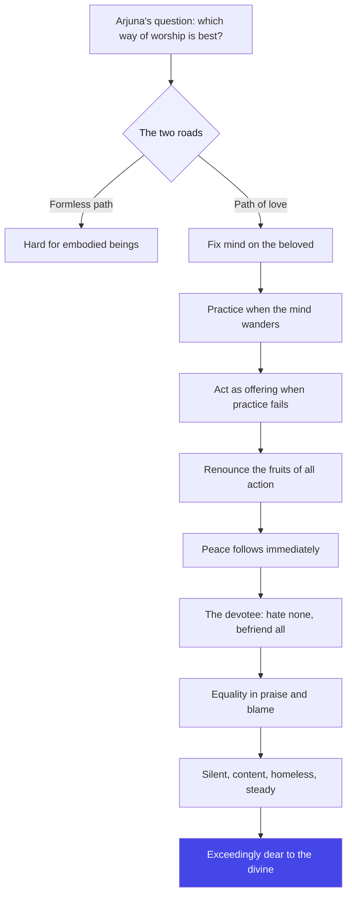
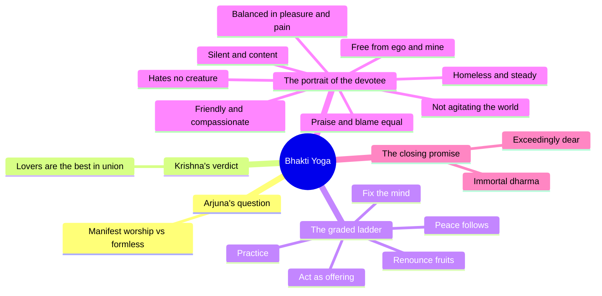

# Chapter 12: Bhakti Yoga — Love Is the Shortest Way Home

> "You do not need to become perfect before you love. Love is not the reward at the end of the road — love is the road itself."
> — The Osho Way

---

The battlefield has gone quiet. Krishna has spoken eleven chapters of fire: about duty, about the deathless Self, about the vision of cosmic form that made Arjuna's hair stand on end. And now, after all that thunder, Arjuna asks a simple question. Not about philosophy, not about strategy. He asks: "Which is the better Yogi — the one who worships You with love, or the one who meditates on the formless, the invisible, the unmanifested?" (12.1)

Notice what Arjuna is really asking. He is not asking which path is *correct*. He is asking which path is *for him*. Krishna has been pushing him toward the absolute — a teacher's privilege — but the disciple wants to know: can I get there through love alone? Can the heart do what the mind cannot? This is the chapter where the Gita finally becomes personal, where the divine stops being an idea and starts being a relationship.

Osho reads this chapter as the Gita's quiet revolution. Until now Krishna spoke of discipline, knowledge, renunciation, duty — all of it necessary, all of it scaffolding. But scaffolding is not the building. In Chapter 12 Krishna climbs down from the heights of philosophy and says: love me. Not "understand me," not "calculate me," not "master me" — love me. For Osho this is the deepest teaching of the Gita: the ultimate cannot be reached by effort, it can only be received. And the only way to receive is to open — which is what love is, the full opening of the heart.

And then comes the second half of the chapter, which Osho calls the real secret. After asking for love, Krishna describes what a true devotee looks like — and the list has nothing to do with temples or rituals. It is about a man who hates no one, who is friendly and compassionate, who is free from "I" and "mine," who is balanced in pleasure and pain, forgiving, content, silent, homeless in spirit. In other words: love, when it is real, transforms your whole way of being. The devotee is not the one who chants the most; the devotee is the one who has become love. That is the secret this chapter carries — the heart's path leads to the same freedom the intellect seeks, but it gets there faster, because love does not argue; it surrenders.

## Learning Objectives

After completing this chapter you will be able to:

1. **Place Bhakti Yoga in the Gita** — understand why Chapter 12 sits at the exact center of the 18-chapter arc, and why the heart's path comes after the mind's path has been exhausted.
2. **Explain the graded path of devotion** — describe Krishna's five-step ladder in 12.8–12.12 (fix the mind, practice, act for the divine, renounce fruits, attain peace) and why each step is an act of love, not a demand.
3. **Profile the ideal devotee** — name the qualities of the beloved devotee in 12.13–12.20 and show that every one of them is a quality of inner freedom, not of religiosity.
4. **Distinguish Bhakti from both Karma and Jnana** — use the three-framework note (Karma/Bhakti/Jnana) to see how devotion synthesizes the earlier teachings without discarding them.
5. **Read the chapter through the Osho lens** — articulate why love, surrender, and the witness are one movement, and why "the crisis of not loving" is the only real crisis.
6. **Build a TypeScript tool** — create a "Devotion Ladder" analyzer that maps a modern seeker's practice level onto Krishna's graded path and returns an Osho-style nudge for the next step.

---

## Bhakti Yoga at a Glance

### The scene and the speakers

We are still on the chariot at Kurukshetra, but the battle is now a backdrop. Arjuna has recovered enough from his collapse to ask a *discriminating* question — he wants to know which style of worship reaches the highest. Krishna answers him directly, and the chapter moves in three pulses: first a comparison of the two worship styles (12.1–12.5), then the graded ladder of practice for those who cannot go all the way at once (12.6–12.12), and finally the portrait of the one who has become love itself (12.13–12.20). In the Mahabharata context this is the quiet middle of the Gita — after the cosmic vision, before the knowledge chapters — the calm of the heart between two storms of the mind.

### The Osho lens

Osho refuses to read Bhakti Yoga as religion. For him this chapter is a psychology of transformation: the formless absolute is beyond the mind's reach, so Krishna, the great strategist, offers the heart a road. Where knowledge wants to *climb*, love wants to *fall* — and falling into the divine is the only way to reach it. The devotee Krishna describes at the end of the chapter is not a churchgoer; he is a man so alive, so silent, so free that the world cannot disturb him. That, says Osho, is the real fruit of love — not heaven, but freedom here and now.

### The structure of the chapter

- **Movement 1: 12.1–12.5 — Two ways of worship.** Arjuna's question, and Krishna's answer: devotion to the manifest is best, and the unmanifested path is steep with trouble for those still in bodies.
- **Movement 2: 12.6–12.12 — The graded ladder.** Renounce all in the divine, and the divine lifts you; then the five rungs: steady mind, practice, action for the divine, renunciation of fruits, and the peace that follows.
- **Movement 3: 12.13–12.20 — The portrait of the beloved.** Nineteen virtues of the devotee — the Amritashtakam — ending with the declaration that those who live this immortal dharma are exceedingly dear.

### The three-framework note

The Gita's own architecture gives this chapter its weight. Chapters 1–6 are the way of action (Karma Yoga): learn to act without attachment. Chapters 7–12 are the way of devotion (Bhakti Yoga): learn to act for love. Chapters 13–18 are the way of knowledge (Jnana Yoga): learn to see who is acting. Osho's key insight is that these are not three separate roads but one road seen from three angles — and that Chapter 12 is the bridge, because love is the only energy that can carry action into knowledge without destroying either. Bhakti is not the opposite of the other two; it is their meeting point in the heart.

## Traditional Reading vs Osho-Style Reading

| Dimension | Traditional reading | Osho-style reading |
|--------|---------------------|--------------------|
| **The object of devotion** | A personal God with attributes, worthy of ritual worship | The beloved as a doorway — love itself is the path, the goal is freedom |
| **Worship styles (12.1–12.5)** | Devotees of the manifest and meditators of the unmanifest both reach liberation; the first is easier | The unmanifest is hard for body-bound minds, so love is offered as the compassionate shortcut — not a compromise but a shortcut |
| **The graded ladder (12.8–12.12)** | A scale of spiritual advancement from weak to strong | A scale of honesty — each rung accepts you exactly where you are; no rung is inferior, every rung is a confession of the truth |
| **The ideal devotee (12.13–12.20)** | The saint to be imitated and revered | The portrait of a free human being — love that has become silence, gratitude that has become being |
| **Surrender** | Giving oneself to God's will, a virtue of humility | The dropping of the false "I" — the one who surrenders finds the real self for the first time |
| **Chapter's place in the Gita** | The central chapter on devotion between the paths of action and knowledge | The heart of the Gita — the point where the teaching stops being instruction and becomes invitation |

## The Complete Text — All 20 Shlokas

### Shloka 12.1 — The Question That Comes from the Heart

> अर्जुन उवाच |
> एवं सततयुक्ता ये भक्तास्त्वां पर्युपासते |
> ये चाप्यक्षरमव्यक्तं तेषां के योगवित्तमाः |

**Transliteration:** arjuna uvāca . evaṃ satatayuktā ye bhaktāstvāṃ paryupāsate . ye cāpyakṣaramavyaktaṃ teṣāṃ ke yogavittamāḥ

**Translation:** Arjuna said: "Those devotees who, ever steadfast, worship You in this way — and those others who worship the imperishable, the unmanifested — which of them are better versed in the way of union?"

**Osho Darshan:** Look at the question — Arjuna is not asking which path is true; he is asking which path is for *him*. Every seeker reaches this moment: you have heard about the formless absolute, and still your heart wants to kneel before something you can love. Osho says: never apologize for that. The heart is not a lower organ — it is the deeper one. The question itself is the first act of bhakti, because it is honest. And honesty, not theology, is where all transformation begins.

### Shloka 12.2 — The Best in Union Are the Lovers

> श्रीभगवानुवाच |
> मय्यावेश्य मनो ये मां नित्ययुक्ता उपासते |
> श्रद्धया परयोपेताः ते मे युक्ततमा मताः |

**Transliteration:** śrībhagavānuvāca . mayyāveśya mano ye māṃ nityayuktā upāsate . śraddhayā parayopetāḥ te me yuktatamā matāḥ

**Translation:** The Blessed Lord said: "Those who, fixing their minds on Me, worship Me, ever steadfast and filled with supreme faith — those, in My opinion, are the best in union."

**Osho Darshan:** Krishna answers without hesitation: the lovers are the highest. Why? Because when you fix your mind on the beloved, concentration happens without effort — the mind does what it could never do by force. Osho points to the word *shraddha*: not "belief" but trust, the quality of a heart that has fallen in love and does not need proof. The meditator struggles to still the mind; the lover finds the mind stilled by the very joy of the beloved. That is why love outruns effort — it runs with the energy of the whole being.

### Shloka 12.3 — The Unmanifested That Cannot Be Pointed To

> ये त्वक्षरमनिर्देश्यमव्यक्तं पर्युपासते |
> सर्वत्रगमचिन्त्यञ्च कूटस्थमचलन्ध्रुवम् |

**Transliteration:** ye tvakṣaramanirdeśyamavyaktaṃ paryupāsate . sarvatragamacintyañca kūṭasthamacalandhruvam

**Translation:** "But those who worship the imperishable, the indefinable, the unmanifested — present everywhere, unthinkable, unmoving, firm and eternal —"

**Osho Darshan:** Here Krishna sketches the other path: the absolute that cannot be described, that cannot be thought, that stands like a mountain peak beyond all mental maps. Osho's reading: this is the path of the intellect pushed to its limit — and its limit is silence, because the unmanifested cannot be captured in any concept. The verse is a description of a mystery, not a description of a doctrine. To worship the unthinkable you must, finally, stop thinking. And that stopping is itself a kind of love — the love of the unknown.

### Shloka 12.4 — Restrained Senses, Even Mind, Welfare of All

> सन्नियम्येन्द्रियग्रामं सर्वत्र समबुद्धयः |
> ते प्राप्नुवन्ति मामेव सर्वभूतहिते रताः |

**Transliteration:** sanniyamyendriyagrāmaṃ sarvatra samabuddhayaḥ . te prāpnuvanti māmeva sarvabhūtahite ratāḥ

**Translation:** "Restraining the whole array of senses, even-minded everywhere, rejoicing in the welfare of all beings — they too verily come to Me."

**Osho Darshan:** Watch the three disciplines in this verse: the senses reined in, the mind balanced, and the heart turned toward the welfare of all. Osho says these three are one discipline seen from outside, inside, and beyond — control of the senses, equality of the mind, and compassion in action are the same energy flowing outward. Notice that even the abstract meditator is defined here by what he *does*: the welfare of beings. Contemplation is not escape; it is the preparation for a deeper engagement with life. The witness and the servant are one person.

### Shloka 12.5 — The Hard Road of the Formless

> क्लेशोऽधिकतरस्तेषामव्यक्तासक्तचेतसाम् |
> अव्यक्ता हि गतिर्दुःखं देहवद्भिरवाप्यते |

**Transliteration:** kleśo.adhikatarasteṣāmavyaktāsaktacetasām || avyaktā hi gatirduḥkhaṃ dehavadbhiravāpyate

**Translation:** "Greater is the trouble of those whose minds are attached to the unmanifested; for the goal of the unmanifested is attained with great difficulty by embodied beings."

**Osho Darshan:** This is the Gita's most compassionate confession: the formless path is hard for those who live in bodies. Osho calls this the supreme wisdom of Krishna the strategist — he is not saying the abstract path is wrong; he is saying it is *steep*. You have a body, a heart, a hunger for relationship; pretending otherwise is the hardest yoga of all. The verse is an invitation to stop fighting your own nature. If you are embodied, love like an embodied being. Use the body as the bridge, not as the obstacle.

### Shloka 12.6 — Renouncing All in Me, Meditating With One Point

> ये तु सर्वाणि कर्माणि मयि संन्यस्य मत्परः |
> अनन्येनैव योगेन मां ध्यायन्त उपासते |

**Transliteration:** ye tu sarvāṇi karmāṇi mayi saṃnyasya matparaḥ . ananyenaiva yogena māṃ dhyāyanta upāsate

**Translation:** "But those who renounce all actions in Me, regarding Me as their supreme goal, meditating on Me with the yoga of single-pointed devotion, and worshipping Me —"

**Osho Darshan:** The turning point of the chapter. Now Krishna prescribes the path of the heart directly: renounce your actions *into* the beloved, and let the whole life become one-pointed. Osho's insight: "renouncing all actions in Me" is not a withdrawal from the world — it is a change of direction. The same hands, the same work, but no longer "my" hands and "my" work. When action is offered, the doer dissolves. This is not passivity; it is the end of anxiety, because there is no longer anyone left to succeed or fail.

### Shloka 12.7 — The Beloved Lifts You From the Ocean

> तेषामहं समुद्धर्ता मृत्युसंसारसागरात् |
> भवामि नचिरात्पार्थ मय्यावेशितचेतसाम् |

**Transliteration:** teṣāmahaṃ samuddhartā mṛtyusaṃsārasāgarāt . bhavāmi nacirātpārtha mayyāveśitacetasām

**Translation:** "For those whose minds are absorbed in Me, O Arjuna, I soon become the deliverer from the ocean of death and worldly existence."

**Osho Darshan:** Here is the promise of bhakti: you do not climb out of the ocean alone — love pulls you out. Osho reads this as a law of energy: a heart completely given creates a current that returns as grace. The "deliverer" is not a man above; it is the answering tide of the beloved who is also your own deepest self. And note the word *soon*. When the mind is wholly absorbed, the crossing does not take lifetimes — the ocean is not vast; your resistance was. Give completely, and the shore comes to you.

### Shloka 12.8 — Fix the Mind, Dwell in Me

> मय्येव मन आधत्स्व मयि बुद्धिं निवेशय |
> निवसिष्यसि मय्येव अत ऊर्ध्वं न संशयः |

**Transliteration:** mayyeva mana ādhatsva mayi buddhiṃ niveśaya . nivasiṣyasi mayyeva ata ūrdhvaṃ na saṃśayaḥ

**Translation:** "Fix your mind in Me alone; place your intellect in Me. Then you shall dwell in Me alone hereafter — of this there is no doubt."

**Osho Darshan:** The first rung of the ladder, and the highest: mind and intellect both surrendered to the beloved. Osho points out the promise — "you shall dwell in Me" — is not a reward after death; it is the natural result of this very absorption. Whatever you give your deepest attention to, you become. Fix your consciousness on the divine and the dwelling is immediate; the doubt exists only in the mind, and the mind has just been handed over. This is not a metaphor about the afterlife; it is a description of where your life is already living.

### Shloka 12.9 — If You Cannot, Practice

> अथ चित्तं समाधातुं न शक्नोषि मयि स्थिरम् |
> अभ्यासयोगेन ततो मामिच्छाप्तुं धनञ्जय |

**Transliteration:** atha cittaṃ samādhātuṃ na śaknoṣi mayi sthiram . abhyāsayogena tato māmicchāptuṃ dhanañjaya

**Translation:** "If you are unable to fix your mind steadily on Me, then, O Dhananjaya, seek to reach Me through the yoga of constant practice."

**Osho Darshan:** Krishna is the only teacher who says "if you cannot" — and means it without disappointment. The second rung is practice: the mind wanders, so you bring it back, a thousand times, without anger. Osho loves this verse because it is so human — the mind is not the enemy, it is a puppy; it must be trained with patience, not beaten. He also notes that Krishna calls Arjuna "Dhananjaya," the winner of wealth, here: the mind is a treasure you must win, and practice is the only honest way to win it. Every return of the wandering mind is a step up the ladder.

### Shloka 12.10 — If Not Even Practice, Act for Me

> अभ्यासेऽप्यसमर्थोऽसि मत्कर्मपरमो भव |
> मदर्थमपि कर्माणि कुर्वन्सिद्धिमवाप्स्यसि |

**Transliteration:** abhyāse.apyasamartho.asi matkarmaparamo bhava . madarthamapi karmāṇi kurvansiddhimavāpsyasi

**Translation:** "If you are unable even to practice, then be intent on doing actions for My sake; doing actions for My sake alone, you shall attain perfection."

**Osho Darshan:** The third rung is the great democratization of the path: cannot meditate, cannot practice — then work, but work as offering. Osho sees this as the Gita's gift to the modern world: most people will never sit in caves, but everyone works. The secret is not the work but the direction of the gift. Work done as an offering loses its poison of ego and gains the perfume of devotion. And perfection comes anyway — not through the excellence of the act, but through the purity of the heart that offers it. The cook and the contemplative can reach the same flame.

### Shloka 12.11 — The Easiest: Renounce the Fruits

> अथैतदप्यशक्तोऽसि कर्तुं मद्योगमाश्रितः |
> सर्वकर्मफलत्यागं ततः कुरु यतात्मवान् |

**Transliteration:** athaitadapyaśakto.asi kartuṃ madyogamāśritaḥ . sarvakarmaphalatyāgaṃ tataḥ kuru yatātmavān

**Translation:** "If you are unable to do even this, then, taking refuge in My yoga and mastering yourself, renounce the fruits of all actions."

**Osho Darshan:** The fourth rung is the most practical teaching ever given to a working human being: do what you must, but let go of the result. Osho says this is the real liberation — not renouncing the world, but renouncing the *demand* the world makes on you: the demand for a guaranteed outcome. When the fruits are renounced, desire loses its handle on the mind, and the mind, no longer bribed or threatened, becomes calm of its own accord. Note the order of the ladder: even the highest meditation is finally served by this simple, radical letting-go of results.

### Shloka 12.12 — Knowledge, Then Meditation, Then Renunciation, Then Peace

> श्रेयो हि ज्ञानमभ्यासाज्ज्ञानाद्ध्यानं विशिष्यते |
> ध्यानात्कर्मफलत्यागस्त्यागाच्छान्तिरनन्तरम् |

**Transliteration:** śreyo hi jñānamabhyāsājjñānāddhyānaṃ viśiṣyate . dhyānātkarmaphalatyāgastyāgācchāntiranantaram

**Translation:** "Better indeed is knowledge than practice; better than knowledge is meditation; better than meditation is the renunciation of the fruits of action — from renunciation, peace follows immediately."

**Osho Darshan:** This verse is the summit of the ladder — and it is a paradox, because the lowest rung is crowned as the highest. Osho explains: renunciation of fruits is not an act you do; it is a state you *are*. Practice and meditation are efforts; renunciation is the effortlessness at their end. The verse is not ranking activities but dissolving them — knowledge, practice, meditation all finally flower into the one who is not grasping, and that one is peace itself. Peace follows renunciation not as a reward but as its shadow: drop the hand that clutches, and stillness is already there. This is the verse that makes the ladder vanish into freedom.

### Shloka 12.13 — He Who Hates No Creature

> अद्वेष्टा सर्वभूतानां मैत्रः करुण एव च |
> निर्ममो निरहङ्कारः समदुःखसुखः क्षमी |

**Transliteration:** adveṣṭā sarvabhūtānāṃ maitraḥ karuṇa eva ca . nirmamo nirahaṅkāraḥ samaduḥkhasukhaḥ kṣamī

**Translation:** "He who hates no creature, who is friendly and compassionate to all, who is free from possessiveness and egoism, balanced in pleasure and pain, and forgiving —"

**Osho Darshan:** The portrait of the devotee begins — and it begins not with worship but with the quality of his presence: no hatred, friendliness, compassion, no "mine," no ego, equality in pleasure and pain, forgiveness. Osho notes that these are not moral commandments; they are the *automatic* flowers of a heart that has fallen in love with the whole. You cannot command yourself to be forgiving; you can only love so deeply that forgiveness becomes your nature. The devotee here is not practicing virtue — he is breathing it, because he no longer has an ego to defend.

### Shloka 12.14 — Content, Steady, Dedicated

> सन्तुष्टः सततं योगी यतात्मा दृढनिश्चयः |
> मय्यर्पितमनोबुद्धिर्यो मद्भक्तः स मे प्रियः |

**Transliteration:** santuṣṭaḥ satataṃ yogī yatātmā dṛḍhaniścayaḥ . mayyarpitamanobuddhiryo madbhaktaḥ sa me priyaḥ

**Translation:** "Ever content, a steady yogi, self-controlled, firm in conviction, with mind and intellect offered to Me — that devotee of Mine is dear to Me."

**Osho Darshan:** Contentment is the test, not intensity. Osho says the devotee's contentment is not resignation but fullness — the ocean is content because it is already full; it does not run after the rivers. The mind and intellect are "offered," which means they are no longer prisoners of worry; they are given to the beloved and therefore free. And the verse ends with the refrain that will repeat like a heartbeat through the rest of the chapter: *he is dear to Me*. Not "he is rewarded" — he is dear. Love answers love; that is the whole transaction of bhakti.

### Shloka 12.15 — Neither Agitating Nor Agitated

> यस्मान्नोद्विजते लोको लोकान्नोद्विजते च यः |
> हर्षामर्षभयोद्वेगैर्मुक्तो यः स च मे प्रियः |

**Transliteration:** yasmānnodvijate loko lokānnodvijate ca yaḥ . harṣāmarṣabhayodvegairmukto yaḥ sa ca me priyaḥ

**Translation:** "He by whom the world is not agitated, and who is not agitated by the world, who is freed from elation, resentment, fear and anxiety — that man is dear to Me."

**Osho Darshan:** A remarkable double condition: the devotee does not disturb the world, and the world does not disturb him. Osho sees this as the definition of true harmlessness — it is not merely that you refrain from hurting; it is that your very presence gives rest, because you are no longer vibrating with demand. And because he is free from the four waves — elation, resentment, fear, worry — the world's praise and blame wash over him like weather over a mountain. The mountain is not indifferent; it is simply too deep to be moved by storms. That is the peace of the one who is dear.

### Shloka 12.16 — Wantless, Pure, Expert, Unconcerned

> अनपेक्षः शुचिर्दक्ष उदासीनो गतव्यथः |
> सर्वारम्भपरित्यागी यो मद्भक्तः स मे प्रियः |

**Transliteration:** anapekṣaḥ śucirdakṣa udāsīno gatavyathaḥ . sarvārambhaparityāgī yo madbhaktaḥ sa me priyaḥ

**Translation:** "He who is free from wants, pure, skilled, unconcerned, free from pain, renouncing all new undertakings — that devotee of Mine who is thus, is dear to Me."

**Osho Darshan:** Notice the beautiful paradox Osho draws from this verse: the devotee is *daksha* — skilled, expert, efficient — and yet renounces all new undertakings. He is not lazy; he is finished with the *need* to begin. The skilled person who has no personal agenda acts with the perfection of a river: it does not try to flow, it flows. Wants have fallen away, so his purity is not scrubbed-on virtue but a natural cleanliness. The world asks such a person for nothing, because he asks the world for nothing — and that rare freedom is dear to the divine.

### Shloka 12.17 — Beyond Joy, Hate, Grief, Desire

> यो न हृष्यति न द्वेष्टि न शोचति न काङ्क्षति |
> शुभाशुभपरित्यागी भक्तिमान्यः स मे प्रियः |

**Transliteration:** yo na hṛṣyati na dveṣṭi na śocati na kāṅkṣati . śubhāśubhaparityāgī bhaktimānyaḥ sa me priyaḥ

**Translation:** "He who neither rejoices nor hates nor grieves nor desires, who renounces good and evil, and who is full of devotion — that man is dear to Me."

**Osho Darshan:** The four negations describe a mind that has stopped swinging — no elation at the pleasant, no hatred of the unpleasant, no grief over loss, no craving for the absent. Osho warns against mistaking this for dullness: this is not a man who feels nothing; this is a man who feels *reality* and has stopped feeling the imaginary. "Renouncing good and evil" is the deepest cut — it means even the moral accounting is surrendered; the devotee no longer keeps score, because the one who kept score has dissolved into love. What remains is devotion without an owner — and that is dear.

### Shloka 12.18 — Equal to Friend and Foe

> समः शत्रौ च मित्रे च तथा मानापमानयोः |
> शीतोष्णसुखदुःखेषु समः सङ्गविवर्जितः |

**Transliteration:** samaḥ śatrau ca mitre ca tathā mānāpamānayoḥ . śītoṣṇasukhaduḥkheṣu samaḥ saṅgavivarjitaḥ

**Translation:** "Equal to friend and foe, and likewise to honor and dishonor; equal in cold and heat, pleasure and pain; free from attachment —"

**Osho Darshan:** The pairs keep multiplying — friend/foe, honor/dishonor, cold/heat, pleasure/pain — and Osho says that is the point: the world is made of pairs, and the devotee has stepped behind the pair-maker. Equality here is not indifference; it is a deeper taste, the taste of the witness who knows both flavors of the same salt. "Free from attachment" — *sanga-vivarjita* — is the secret of the equality: you can remain equal to the pairs only when nothing of yours is invested in either side. Unattached, nothing can buy you; nothing can insult you; the world has lost its power to hook.

### Shloka 12.19 — Silence, Contentment, the Homeless Heart

> तुल्यनिन्दास्तुतिर्मौनी सन्तुष्टो येन केनचित् |
> अनिकेतः स्थिरमतिर्भक्तिमान्मे प्रियो नरः |

**Transliteration:** tulyanindāstutirmaunī santuṣṭo yena kenacit . aniketaḥ sthiramatirbhaktimānme priyo naraḥ

**Translation:** "He to whom praise and blame are equal, who is silent, content with whatever comes, homeless, of steady mind, full of devotion — that man is dear to Me."

**Osho Darshan:** Praise and blame are equal, and the mouth becomes *mauni* — silent — because there is no longer anyone to be praised or defended. Osho calls the next word the most radical in the verse: *aniketa*, homeless. The devotee's home is no longer a place or a role — it is presence itself. He is content with whatever arrives, because nothing arrives to a homeless heart except life. The steady mind that follows is the reward of having no address: nothing can evict the one who lives in the whole. Such a person is dear — for the simple reason that he is finally *available* to love, without reservations.

### Shloka 12.20 — The Immortal Dharma and Its Followers

> ये तु धर्म्यामृतमिदं यथोक्तं पर्युपासते |
> श्रद्दधाना मत्परमा भक्तास्तेऽतीव मे प्रियाः |

**Transliteration:** ye tu dharmyāmṛtamidaṃ yathoktaṃ paryupāsate . śraddadhānā matparamā bhaktāste.atīva me priyāḥ

**Translation:** "Those devotees who, endowed with faith, regarding Me as their supreme goal, follow this immortal, righteous teaching as described — they are exceedingly dear to Me."

**Osho Darshan:** The chapter closes with a signature. The teaching is called *amrita* — nectar, immortal — not because it is old, but because it does not die: love as a way of being cannot decay the way doctrines do. Osho notes the word *shraddadhana* — trusting — and the phrase "as described": the whole portrait of the devotee, from the man who hates no one to the man who is homeless, is the living scripture. And the ending is "exceedingly dear." Not graded, not rewarded — dear. The Gita's deepest statement about the divine is finally not a philosophy but a feeling: the divine loves the one who loves the whole.

## Key Themes

| Theme | Shlokas | Osho-style insight |
|-------|---------|--------------------|
| **Two ways of worship** | 12.1–12.5 | The formless path is steep for embodied beings; love of the manifest is the compassionate shortcut, not a compromise |
| **The lifting promise** | 12.6–12.7 | Renounce all actions in the beloved, and you are lifted from the ocean — grace is the current that answers complete giving |
| **The graded ladder** | 12.8–12.12 | Fix the mind, practice, act as offering, renounce fruits — every rung is a confession of honesty, and renunciation of fruits brings peace immediately |
| **The devotee's portrait** | 12.13–12.14 | No hatred, friendliness, compassion, no "mine," no ego — love has become the whole nature |
| **The unagitated one** | 12.15–12.17 | Free from elation, resentment, fear, worry — the devotee is a mountain that storms cannot move |
| **Equality and homelessness** | 12.18–12.19 | Equal to friend and foe, honor and dishonor; silent, content, homeless — the one who lives in the whole cannot be evicted |
| **The closing signature** | 12.20 | This dharma is nectar — it cannot decay — and its followers are "exceedingly dear": the divine's final word is a feeling, not a doctrine |

## The Inner Journey



## A Mind Map



## Summary

- Chapter 12 is the heart of the Gita: after six chapters of action and the cosmic vision, the teaching becomes personal — the divine asks for love, not mastery.
- Krishna's verdict is immediate: devotees who worship with supreme faith are the best in union; the unmanifested path is steep for embodied beings.
- The ladder of 12.8–12.12 meets every seeker exactly where they are: fix the mind, practice, act as offering, renounce fruits — and peace follows renunciation immediately.
- The portrait of the devotee (12.13–12.20) describes freedom in human form: no hatred, no ego, no agitation, equality in the pairs, silence, contentment, homelessness of spirit.
- Osho's lens: bhakti is not religion but transformation — love is the energy that carries action into knowledge, and surrender of the false "I" reveals the real one.
- The chapter ends on a feeling, not a doctrine: those who live this immortal dharma are "exceedingly dear." Love is the shortest way home.

## Practical Takeaways

- **Judge your love by your being, not your rituals.** If your devotion does not make you more forgiving, more silent, and less demanding, it is still theater. The devotee's portrait in 12.13–12.20 is your mirror.
- **Use the ladder honestly.** Cannot meditate? Practice. Cannot practice? Work as an offering. Cannot even do that? Renounce the fruits. Wherever you are, there is a next rung — and the ladder ends in peace, not in effort.
- **Let go of one result today.** Pick one action you will do with full care and zero demand on the outcome. Watch how the anxiety drains out of it; that is renunciation of fruits in daily practice.
- **Stop keeping score with the world.** The devotee renounces good and evil accounting — try a day without judging anyone's behavior as "deserved" or "undeserved." The relief is immediate.
- **Practice the equality of pairs.** Next time praise or blame arrives, breathe once and notice: both are weather. The mountain does not argue with the storm.
- **Make your work an offering.** Before your next study session, presentation, or exam, offer it — not to be rewarded, but because the giving itself is the worship. Perfection follows the pure heart, not the other way around.

## Chapter Quiz

**Q1. According to Krishna, which of the following are the best in union (yuktatama)?**
- a. Those who perform great sacrifices
- b. Those who fix their minds on Him and worship with supreme faith
- c. Those who worship the unmanifested alone
- d. Those who renounce the world and become monks

<details class="tp-qa-card" data-qid="bg12-q1"><summary>Show Answer</summary>

**Answer: b.**
</details>

**Q2. Why does Krishna call the unmanifested path harder for embodied beings (12.5)?**
- a. Because the unmanifested is forbidden by the scriptures
- b. Because it requires many lifetimes of ritual
- c. Because the goal of the unmanifested is attained with great difficulty by embodied beings
- d. Because embodied beings are too impure for it

<details class="tp-qa-card" data-qid="bg12-q2"><summary>Show Answer</summary>

**Answer: c.**
</details>

**Q3. Which verse promises "peace follows immediately" after a certain practice?**
- a. 12.8 — fixing the mind
- b. 12.12 — renunciation of the fruits of action
- c. 12.15 — not agitating the world
- d. 12.20 — following the immortal dharma

<details class="tp-qa-card" data-qid="bg12-q3"><summary>Show Answer</summary>

**Answer: b.**
</details>

**Q4. In the portrait of the devotee (12.13–12.20), which pair of qualities appears FIRST?**
- a. Silence and contentment
- b. Praise and blame held equal
- c. Hating no creature, being friendly and compassionate
- d. Homelessness and steady mind

<details class="tp-qa-card" data-qid="bg12-q4"><summary>Show Answer</summary>

**Answer: c.**
</details>

**Q5. What does the word "aniketa" (homeless) signify in 12.19, in the Osho reading?**
- a. That the devotee must wander as a beggar
- b. That the devotee's home is presence itself, not a place or role
- c. That the devotee has been exiled from his kingdom
- d. That the devotee avoids all human contact

<details class="tp-qa-card" data-qid="bg12-q5"><summary>Show Answer</summary>

**Answer: b.**
</details>

**Q6. How does the chapter describe the followers of the immortal dharma at its close (12.20)?**
- a. They are the most learned scholars
- b. They are exceedingly dear to the divine
- c. They will be reborn as kings
- d. They must renounce all action forever

<details class="tp-qa-card" data-qid="bg12-q6"><summary>Show Answer</summary>

**Answer: b.**
</details>

## Exercises

1. **Reflection exercise.** Write one paragraph about your own "formless vs. personal" dilemma: do you relate to the divine (or to your deepest values) more through meditation on the abstract, or through relationship and love? Use 12.1–12.5 to examine which road you have been forcing yourself down, and what it would mean to take the other one.
2. **Analysis exercise.** Take Krishna's five-rung ladder (12.8–12.12) and map each rung to a concrete activity in your current life: fixing the mind (deep work), practice (daily discipline), action as offering (service work), renouncing fruits (letting go of grades or outcomes), peace (the state that follows). Identify which rung is your default, and which rung you avoid.
3. **TypeScript exercise.** Extend the tool below so that each of the three "if you cannot" rungs (practice, offering, renunciation) accepts a list of personal excuses, and the tool gently turns each excuse into an Osho-style reframe instead of a verdict.

## TypeScript Tool: Devotion Ladder

```typescript
/**
 * Devotion Ladder — Chapter 12, Bhakti Yoga
 *
 * Krishna's graded path (12.8-12.12) says: if you cannot fix the mind,
 * practice; if not practice, act as offering; if not even that, renounce
 * the fruits. This tool takes a modern seeker's confession of current
 * practice and returns the next honest rung, in the spirit of the chapter:
 * no judgement, only the next step toward peace.
 */

interface PracticeProfile {
  name: string;
  canStillMind: boolean;   // 12.8 — can you rest the mind in the beloved?
  canPractice: boolean;    // 12.9 — can you practice daily, however weakly?
  canOfferWork: boolean;   // 12.10 — can you act as if work is an offering?
  canDropFruits: boolean;  // 12.11 — can you renounce the results of action?
}

interface LadderRung {
  shloka: string;
  title: string;
  instruction: string;
  oshoNudge: string;
}

const LADDER: LadderRung[] = [
  {
    shloka: "12.8",
    title: "Fix the mind",
    instruction: "Place mind and intellect in the beloved alone.",
    oshoNudge: "No effort here, only love. Ask: who am I thinking for?"
  },
  {
    shloka: "12.9",
    title: "Constant practice",
    instruction: "Bring the wandering mind back, a thousand times.",
    oshoNudge: "The mind is a puppy, not an enemy. Patience is the yoga."
  },
  {
    shloka: "12.10",
    title: "Action as offering",
    instruction: "Do your work as a gift, not as a contract.",
    oshoNudge: "You cannot always meditate, but you always work. Offer it."
  },
  {
    shloka: "12.11",
    title: "Renounce the fruits",
    instruction: "Act with full care and zero demand on the outcome.",
    oshoNudge: "Letting go of the result is the easiest rung — and the one that brings peace at once."
  }
];

function nextRung(profile: PracticeProfile): LadderRung {
  if (profile.canStillMind) return LADDER[0];
  if (profile.canPractice) return LADDER[1];
  if (profile.canOfferWork) return LADDER[2];
  return LADDER[3];
}

function showPath(profile: PracticeProfile): string[] {
  const start = LADDER.indexOf(nextRung(profile));
  const lines: string[] = [];
  for (let i = start; i < LADDER.length; i++) {
    lines.push(`${LADDER[i].shloka} ${LADDER[i].title} — ${LADDER[i].instruction}`);
  }
  return lines;
}

const arjuna: PracticeProfile = {
  name: "Modern Arjuna",
  canStillMind: false,
  canPractice: false,
  canOfferWork: true,
  canDropFruits: false,
};

console.log(`Next rung for ${arjuna.name}: ${nextRung(arjuna).shloka} — ${nextRung(arjuna).title}`);
console.log(nextRung(arjuna).oshoNudge);
console.log("Full path from here:", showPath(arjuna).join(" | "));
```
