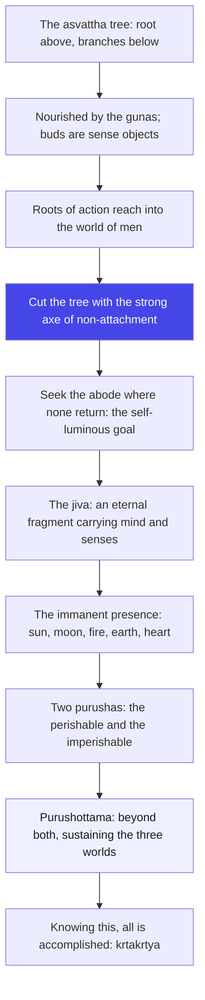
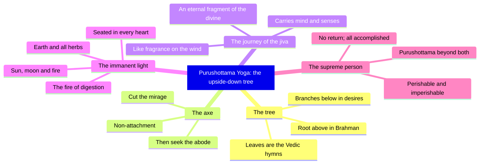

# Chapter 15: Purushottama Yoga — Cut the Tree, Then Climb the Sky

> "The tree of life grows upside down. Climb it and you fall; cut it, and you are already at the top."
> — The Osho Way

---

This is Krishna's most mysterious teaching, and Osho reads it as his most intimate one. In the fourteenth chapter Krishna described the three gunas that weave the mind. Now he lifts the curtain on the whole show: the entire universe, he says, is a giant inverted peepul tree — its root above, its branches below, its leaves the Vedic hymns. Traditional theology would call this cosmology. Osho calls it a mirror. Look into it and you will not see galaxies; you will see the root system of your own desires, growing upward into the sky of the divine and downward into the soil of your habits.

The tree is samsara, the world of becoming. Its branches spread below and above, nourished by the very gunas the last chapter described; its buds are the objects of the senses; and its secondary roots reach down into the human world, binding through action. The mind lives inside this tree, moving from bud to bud, branch to branch, believing it is climbing. Osho's radical suggestion: there is no way out of the tree by climbing. The only way out is the axe — and the axe is asanga, non-attachment. Not renunciation of the world, but release from the world's claim on you. Cut the tree, and the sky is not above you anymore; it is where you stand.

Then the chapter performs a quiet ascent. First the abode of no return (15.6), where neither sun nor moon nor fire need to shine because it is self-luminous. Then the traveler: the jiva, an eternal fragment of the divine, carrying its mind and senses from body to body like wind carrying fragrance (15.7–15.11). Then the immanence of the divine in everything we touch — the light in the sun, the sap in the herbs, the fire that digests your meal, the presence seated in every heart (15.12–15.15). Osho loves this turn: you do not need to go anywhere to find the divine; it is in the last meal you digested and in the next breath you take.

And then the summit. Two purushas stand in the world — the perishable, which is all beings, and the imperishable, the unchanging Kutastha — and beyond both stands a third: Purushottama, the Supreme Person, who pervades the three worlds and sustains them while remaining untouched (15.16–15.18). Osho's warning at this peak: even your idea of the "inner witness" must be dropped. The supreme is beyond both the changing and the changeless, beyond every position you can take. The final verse declares this the most secret teaching — and knowing it, one becomes wise, krtakrtya, everything accomplished. Osho's gloss: the secret is not hidden. It is secret the way the sun is secret to a closed eye. Open, and there is nothing to know — there is only you, known.

## Learning Objectives

After completing this chapter you will be able to:

1. **Describe the inverted tree** — the asvattha of samsara with its root above, branches below, gunas as nourishment, sense objects as buds, and karma as its downward roots (15.1–15.2).
2. **Name the axe and the goal** — non-attachment (asanga) as the only weapon that cuts the tree, and the self-luminous abode from which none return (15.3–15.6).
3. **Trace the journey of the jiva** — the eternal fragment that carries mind and senses between bodies as wind carries fragrance, seen only by the eye of knowledge (15.7–15.11).
4. **Recognize the immanent divine** — the one light in sun, moon and fire; the presence that permeates the earth, nourishes herbs, digests food and sits in every heart (15.12–15.15).
5. **Distinguish the two purushas from the Supreme Person** — the perishable, the imperishable, and Purushottama who transcends and sustains both (15.16–15.20).
6. **Build a TypeScript tool** — a Purushottama Path Tracker that maps a week of daily observations onto the tree of samsara and reports which stage of the journey your attention is standing at.

---

## Purushottama Yoga at a Glance

### The scene and the speakers

Krishna speaks the entire chapter; Arjuna does not interrupt even once. After the psychology of the gunas in chapter 14, the field of vision widens to the whole universe and then narrows to a single point: the Supreme Person. The chapter is the crown of the Gita's middle section and the hinge into its final wisdom — it ends with Krishna saying that knowing this teaching, "all duties are accomplished" (15.20). In eighteen chapters, no other chapter ends with such a seal.

### The Osho lens

Osho reads the inverted tree as the single most important image in the Gita. All other trees grow from root to fruit; this one grows from fruit to root — because the world of desire is a mirror-world, where everything is reversed. Inside it, you believe you are climbing when you are only circling; you believe you are gaining when you are only being held. The axe of asanga cuts not the world but the belief. And Osho reads the final ascent — kshara, akshara, Purushottama — as the Gita's highest peak: beyond the changing, beyond the changeless, beyond every position, including the position of "beyondness". The Supreme Person is not an object of worship; it is the end of all objects.

### The structure of the chapter

- **Movement 1: 15.1–15.5 — The tree and the cutting.** The inverted asvattha is described, its formlessness confessed, and the axe of non-attachment given; then the goal is pointed at and the seekers who reach it are characterized.
- **Movement 2: 15.6–15.11 — The abode and the traveler.** The self-luminous abode of no return; then the jiva's long journey — a fragment of the divine carrying mind and senses, seen by the wise and missed by the deluded.
- **Movement 3: 15.12–15.15 — The immanent presence.** The divine as the light of sun, moon and fire; as the energy in the earth, the sap in the herbs, the fire of digestion, and the presence seated in every heart.
- **Movement 4: 15.16–15.20 — The Supreme Person.** The two purushas, perishable and imperishable, and the third who transcends both; the name Purushottama; and the seal: knowing this, everything is accomplished.

### The three-framework note

The three yogas braid together in this short chapter more tightly than anywhere else. Karma appears as asanga — action without attachment, the axe against the tree's karma-roots. Bhakti appears as the fragment remembering its source and as whole-hearted worship of the Supreme Person (15.19). Jnana appears as the eye of knowledge (15.10) and the recognition of Purushottama beyond the perishable and the imperishable. Osho's reading: the tree has one root above, one direction — karma purifies the hand, bhakti purifies the heart, jnana purifies the eye, and all three meet in the same upward gaze.

## Traditional Reading vs Osho-Style Reading

| Dimension | Traditional reading | Osho-style reading |
|-----------|--------------------|--------------------|
| The asvattha tree | A symbol of the eternal universe rooted in Brahman | A mirror of the mind's desire-system; it grows where attention goes |
| The axe of asanga | Renunciation of the world and its pleasures | Release from the world's claim on you — you can live in the world and not be hooked by it |
| The abode of no return | A heavenly realm beyond the sun and moon | The self-luminous consciousness you never actually left |
| The jiva's journey | The soul traveling through bodies and wombs | The wave remembering the ocean; you carry your inner weather everywhere |
| The immanent divine | God pervading sun, moon, fire, earth and hearts | The one light in every lamp — including the lamp of your awareness |
| Purushottama | The Supreme Person above all beings | Beyond both the changing and the changeless — beyond every position, even yours |

## The Complete Text — All 20 Shlokas

### Shloka 15.1 — The Inverted Tree

> श्रीभगवानुवाच |
> ऊर्ध्वमूलमधःशाखमश्वत्थं प्राहुरव्ययम् |
> छन्दांसि यस्य पर्णानि यस्तं वेद स वेदवित्

**Transliteration:** śrībhagavānuvāca . ūrdhvamūlamadhaḥśākhamaśvatthaṃ prāhuravyayam . chandāṃsi yasya parṇāni yastaṃ veda sa vedavit

**Translation:** The Blessed Lord said: They speak of the imperishable asvattha, the peepul tree with its root above and branches below, whose leaves are the Vedic hymns; he who knows it is a knower of the Vedas.

**Osho Darshan:** All ordinary trees grow from root to fruit; this one grows from fruit to root, because samsara is a mirror-world and everything inside it is reversed. The root is above, in Brahman; the branches dangle below, in desires. Osho's provocation: you have been living your whole life inside a tree that is upside down, and calling the upside-down position "reality". The man who knows this tree knows the Vedas — because knowing the illusion is the beginning of knowing the real. The tree is not false; its direction is wrong, and your attention is the one who can turn it.

### Shloka 15.2 — Branches of Desire, Roots of Action

> अधश्चोर्ध्वं प्रसृतास्तस्य शाखा
> गुणप्रवृद्धा विषयप्रवालाः |
> अधश्च मूलान्यनुसन्ततानि
> कर्मानुबन्धीनि मनुष्यलोके

**Transliteration:** adhaścordhvaṃ prasṛtāstasya śākhā guṇapravṛddhā viṣayapravālāḥ . adhaśca mūlānyanusantatāni karmānubandhīni manuṣyaloke

**Translation:** Its branches spread below and above, nourished by the gunas, with sense objects as their buds; and downward in the world of men stretch the roots that bind through action.

**Osho Darshan:** Read the image carefully — desires are buds, not fruits. They never fulfill; they only promise. And below, in the world of men, the secondary roots of karma keep reaching into the same soil: every unexamined habit plants a new root, every craving pushes out a new bud. Osho's observation: most people spend their lives pruning buds and feeding roots at the same time. The tree gets greener, the branches heavier, and the climbing never ends. Change the soil of your attention, and the tree changes with it.

### Shloka 15.3 — Cut It with the Axe of Non-Attachment

> न रूपमस्येह तथोपलभ्यते
> नान्तो न चादिर्न च सम्प्रतिष्ठा |
> अश्वत्थमेनं सुविरूढमूलं
> असङ्गशस्त्रेण दृढेन छित्त्वा

**Transliteration:** na rūpamasyeha tathopalabhyate nānto na cādirna ca sampratiṣṭhā . aśvatthamenaṃ suvirūḍhamūlaṃ asaṅgaśastreṇa dṛḍhena chittvā

**Translation:** Its form is not perceived here as such — neither its end, nor its beginning, nor its foundation. Cut this firmly rooted asvattha with the strong axe of non-attachment.

**Osho Darshan:** The tree has no foundation because it is built of memory and anticipation — it exists only while you climb it. You cannot saw through a mirage; you can only stop believing it. That stopping is asanga, and it is not running away from the world; it is refusing to be hooked by it. Osho's sharp word: the axe is not against life. The axe is against the illusion that life is a ladder. Cut the ladder, and the ground you were climbing toward is the ground you are standing on.

### Shloka 15.4 — Seek the Goal Where None Return

> ततः पदं तत्परिमार्गितव्यं
> यस्मिन्गता न निवर्तन्ति भूयः |
> तमेव चाद्यं पुरुषं प्रपद्ये |
> यतः प्रवृत्तिः प्रसृता पुराणी

**Transliteration:** tataḥ padaṃ tatparimārgitavyaṃ yasmingatā na nivartanti bhūyaḥ . tameva cādyaṃ puruṣaṃ prapadye . yataḥ pravṛttiḥ prasṛtā purāṇī

**Translation:** Then seek that goal where, having gone, none returns; take refuge in that primeval Person from whom the ancient stream of activity flowed forth.

**Osho Darshan:** "None returns" — because you never actually left. The goal is not a destination; it is a recognition, and recognition has no return ticket. And notice the path: refuge, surrender — not to a king in the sky, but to the primeval source from which the whole stream flows. Osho's image: the stream appears to flow outward from the source, but it is always flowing back to it. To take refuge is simply to stop swimming against the current of your own being.

### Shloka 15.5 — The Undeluded Reach the Eternal Goal

> निर्मानमोहा जितसङ्गदोषा
> अध्यात्मनित्या विनिवृत्तकामाः |
> द्वन्द्वैर्विमुक्ताः सुखदुःखसंज्ञैर्-
> गच्छन्त्यमूढाः पदमव्ययं तत्

**Transliteration:** nirmānamohā jitasaṅgadoṣā adhyātmanityā vinivṛttakāmāḥ . dvandvairvimuktāḥ sukhaduḥkhasaṃjñaira- gacchantyamūḍhāḥ padamavyayaṃ tat

**Translation:** Free from pride and delusion, victorious over the evil of attachment, dwelling constantly in the self, desires turned away, released from the pairs of pleasure and pain — the undeluded reach that eternal goal.

**Osho Darshan:** Notice the first item on the list: pride. Ego is the first root of the tree, and it must be seen before any branch can fall. Then notice what the undeluded are not: they are not emotionless — they are desireless, which is different. Their desires have turned around and become love; their pleasure and pain have become equal, not because they feel less, but because they are deep water where both waves are surface. Osho's test: deep water does not lose its depth when a wave passes; it lets the wave be a wave.

### Shloka 15.6 — The Light No Sun Can Illuminate

> न तद्भासयते सूर्यो न शशाङ्को न पावकः |
> यद्गत्वा न निवर्तन्ते तद्धाम परमं मम

**Transliteration:** na tadbhāsayate sūryo na śaśāṅko na pāvakaḥ . yadgatvā na nivartante taddhāma paramaṃ mama

**Translation:** Neither the sun illumines that place, nor the moon, nor fire; having gone there none return — that is my supreme abode.

**Osho Darshan:** The highest light is not an object that can be seen; it is the seeing itself. Sunlight makes things visible; this light is the visibility of everything, including the sun. Osho's pointer: do not seek this abode as a place in the sky. Recognize it as the consciousness reading these words right now — that which never rises and never sets, before which even the sun is a candle. Having gone there none return, because no one has ever been anywhere else.

### Shloka 15.7 — An Eternal Fragment in the World of Life

> ममैवांशो जीवलोके जीवभूतः सनातनः |
> मनःषष्ठानीन्द्रियाणि प्रकृतिस्थानि कर्षति

**Transliteration:** mamaivāṃśo jīvaloke jīvabhūtaḥ sanātanaḥ . manaḥṣaṣṭhānīndriyāṇi prakṛtisthāni karṣati

**Translation:** An eternal portion of myself, become a living soul in the world of life, draws to itself the senses with the mind as the sixth, abiding in Nature.

**Osho Darshan:** You are not a stranger in existence; you are a fragment of it — the same ocean in a single wave. But the fragment forgets its source and starts collecting toys, drawing the mind and the senses to itself as if they could fill it. Osho's image: the wave that forgets the ocean spends its whole life afraid of the shore, while the wave that remembers dances toward it. The fragment is eternal; only its forgetfulness is passing. Remember the ocean, and the wave can dance without fear.

### Shloka 15.8 — Carried Like Scent on the Wind

> शरीरं यदवाप्नोति यच्चाप्युत्क्रामतीश्वरः |
> गृहीत्वैतानि संयाति वायुर्गन्धानिवाशयात्

**Transliteration:** śarīraṃ yadavāpnoti yaccāpyutkrāmatīśvaraḥ . gṛhītvaitāni saṃyāti vāyurgandhānivāśayāt

**Translation:** When the Lord takes a body and when he leaves it, he carries these with him and goes, as the wind carries fragrance from its seat in the flowers.

**Osho Darshan:** You carry your inner world wherever you go — that is the law of transfer stated in one image. The wind takes the fragrance from the flower, not the flower; the soul takes the mind and senses, not the body. Osho's practical application: you cannot leave your restlessness behind by changing cities, jobs, or partners; the fragrance travels with the flower. Change the flower, not the city. Every departure is an opportunity to notice what you carried with you — that noticing is the beginning of carrying nothing.

### Shloka 15.9 — Enjoying Through the Gates of Sense

> श्रोत्रं चक्षुः स्पर्शनं च रसनं घ्राणमेव च |
> अधिष्ठाय मनश्चायं विषयानुपसेवते

**Transliteration:** śrotraṃ cakṣuḥ sparśanaṃ ca rasanaṃ ghrāṇameva ca . adhiṣṭhāya manaścāyaṃ viṣayānupasevate

**Translation:** Presiding over the ear, the eye, touch, taste and smell, and over the mind, he enjoys the objects of the senses.

**Osho Darshan:** This is the daily journey you make without noticing: the soul travels through five windows every moment — sound, sight, touch, taste, smell — with the mind as the doorkeeper. Osho's experiment: can you taste without the "I" grabbing the taste? Can you hear without the owner's claim rising? The enjoyment is not the problem; the claim is the only theft. When the doorkeeper stays alert, the house enjoys the world, but the house is not sold to it.

### Shloka 15.10 — The Eye of Knowledge Sees What the Deluded Miss

> उत्क्रामन्तं स्थितं वापि भुञ्जानं वा गुणान्वितम् |
> विमूढा नानुपश्यन्ति पश्यन्ति ज्ञानचक्षुषः

**Transliteration:** utkrāmantaṃ sthitaṃ vāpi bhuñjānaṃ vā guṇānvitam . vimūḍhā nānupaśyanti paśyanti jñānacakṣuṣaḥ

**Translation:** The deluded do not see him as he departs, stays or enjoys, being joined with the gunas; but those with the eye of knowledge behold him.

**Osho Darshan:** The soul does everything yet remains invisible — like the screen behind a movie, present in every frame and seen in none. The deluded watch only the movie; the wise watch the screen and the movie together. Osho's point: the eye of knowledge is not a special gift; it is attention turned back on itself. Seeing the seer is the second birth — the first birth gave you a body; the second gives you the one who wears it.

> **For the Engineer:** The invisible actor is the operating system: it runs every process but appears in none of them. The deluded developer watches only the application; the wise architect watches the application and the infrastructure together. Seeing the infrastructure is the "second birth" of engineering maturity — you stop seeing features and start seeing systems.

### Shloka 15.11 — Striving Yogis See; the Unrefined Do Not

> यतन्तो योगिनश्चैनं पश्यन्त्यात्मन्यवस्थितम् |
> यतन्तोऽप्यकृतात्मानो नैनं पश्यन्त्यचेतसः

**Transliteration:** yatanto yoginaścainaṃ paśyantyātmanyavasthitam . yatanto.apyakṛtātmāno nainaṃ paśyantyacetasaḥ

**Translation:** Striving yogis see him dwelling in the self; but even striving, the unrefined and unintelligent do not see him.

**Osho Darshan:** Effort alone is not enough — the effort must be pointed in the right direction, inward. You can struggle your whole life outward and see nothing, because the treasure was never out there. Osho's correction: the difference between the yogi and the unrefined is not intelligence; it is direction. The unrefined mind is like a mirror covered with dust — it works hard reflecting the outside and never notices itself. Wipe the mirror inward, and the one who was always there appears.

### Shloka 15.12 — The Light in Sun, Moon and Fire

> यदादित्यगतं तेजो जगद्भासयतेऽखिलम् |
> यच्चन्द्रमसि यच्चाग्नौ तत्तेजो विद्धि मामकम्

**Transliteration:** yadādityagataṃ tejo jagadbhāsayate.akhilam . yaccandramasi yaccāgnau tattejo viddhi māmakam

**Translation:** The light that dwells in the sun and illumines the whole world, the light in the moon and the light in fire — know that light as mine.

**Osho Darshan:** One sun, many flames. Every lamp in the world burns the same fire; the light in your consciousness is the same light that powers the sun. Osho's practice: when you look at the moon tonight, do not look at the moon — look for the source of its light inside your own seeing. The moon shines, the fire burns, the mind knows — and all of it is one luminosity wearing three costumes. When you see the light instead of the lamps, you have touched the first rung of the chapter's ladder.

### Shloka 15.13 — Permeating Earth, Nourishing Herbs

> गामाविश्य च भूतानि धारयाम्यहमोजसा |
> पुष्णामि चौषधीः सर्वाः सोमो भूत्वा रसात्मकः

**Transliteration:** gāmāviśya ca bhūtāni dhārayāmyahamojasā . puṣṇāmi cauṣadhīḥ sarvāḥ somo bhūtvā rasātmakaḥ

**Translation:** Entering the earth I support all beings by my energy; and becoming the watery moon, I nourish all herbs.

**Osho Darshan:** The divine is not distant — it is the very sap in the plant, the very gravity in the ground. There is nothing in existence that is not nourishing or being nourished by that one presence. Osho's delight: when you eat a meal, you are tasting the same presence that tastes through you; the eater and the eaten are one energy introduced to itself. The chapter is quietly dismantling the boundary between the sacred and the ordinary — and after this verse, no meal, no seed, no soil is ever ordinary again.

### Shloka 15.14 — The Fire That Digests Fourfold Food

> अहं वैश्वानरो भूत्वा प्राणिनां देहमाश्रितः |
> प्राणापानसमायुक्तः पचाम्यन्नं चतुर्विधम्

**Transliteration:** ahaṃ vaiśvānaro bhūtvā prāṇināṃ dehamāśritaḥ . prāṇāpānasamāyuktaḥ pacāmyannaṃ caturvidham

**Translation:** Becoming the fire Vaisvanara, I abide in the bodies of living beings and, joined with prana and apana, digest the fourfold food.

**Osho Darshan:** Even your digestion is the divine at work — there is no gap between the sacred and the mundane; the stomach is a temple too, and the whole body is a field of the divine's labor. Osho loves this descent: from the root of the universe to the fire in your belly in four verses. The teaching is not climbing away from life; it is finding the divine at the bottom of life, in the very process of being fed. When the highest is recognized in the humblest act, worship is no longer something you do — it is something you are.

> **Practical Bridge:** This verse has a direct implication for engineering practice: the divine is not only in the architecture but in the debugging, the testing, the refactoring. When you recognize that the same intelligence that runs the cosmos also runs your ability to trace a bug, the mundane act of debugging becomes sacred. This is not metaphor; it is a shift in attention that changes the quality of the work itself.

### Shloka 15.15 — Seated in Every Heart

> सर्वस्य चाहं हृदि सन्निविष्टो
> मत्तः स्मृतिर्ज्ञानमपोहनञ्च |
> वेदैश्च सर्वैरहमेव वेद्यो
> वेदान्तकृद्वेदविदेव चाहम्

**Transliteration:** sarvasya cāhaṃ hṛdi sanniviṣṭo mattaḥ smṛtirjñānamapohanañca . vedaiśca sarvairahameva vedyo vedāntakṛdvedavideva cāham

**Translation:** And I am seated in the hearts of all; from me come memory, knowledge and their loss. I am that which is to be known through all the Vedas; I am the author of the Vedanta, and the knower of the Vedas am I.

**Osho Darshan:** Memory and forgetfulness both come from the same source — even your losses are the divine's poetry. Osho's radical point: do not divide existence into god and not-god; the forgetting is as divine as the remembering, the error as sacred as the insight, because the one seated in the heart presides over all of it. And the scriptures are not the goal; the one they point to is the goal, and he points to the heart. The Vedas end where the heart begins — which is why the Vedanta ends in silence, and why this chapter's last word is about the most secret thing.

### Shloka 15.16 — Two Purushas: Perishable and Imperishable

> द्वाविमौ पुरुषौ लोके क्षरश्चाक्षर एव च |
> क्षरः सर्वाणि भूतानि कूटस्थोऽक्षर उच्यते

**Transliteration:** dvāvimau puruṣau loke kṣaraścākṣara eva ca . kṣaraḥ sarvāṇi bhūtāni kūṭastho.akṣara ucyate

**Translation:** Two persons there are in this world — the perishable and the imperishable. All beings are the perishable; the unchanging Kutastha is called the imperishable.

**Osho Darshan:** Here Krishna introduces a duality only to demolish it. The perishable is the tree — everything that changes, including your body, your thoughts, your moods. The imperishable is the seed, the unchanging Kutastha that stands like an anvil under the hammer of time. But Osho's observation: the seed and the tree are still one tree. Change and changelessness are two poles of the same world — both are still positions, still objects of thought. The chapter is about to step past both, into the third that is neither.

### Shloka 15.17 — The Supreme Person Who Sustains the Three Worlds

> उत्तमः पुरुषस्त्वन्यः परमात्मेत्युधाहृतः |
> यो लोकत्रयमाविश्य बिभर्त्यव्यय ईश्वरः

**Transliteration:** uttamaḥ puruṣastvanyaḥ paramātmetyudhāhṛtaḥ . yo lokatrayamāviśya bibhartyavyaya īśvaraḥ

**Translation:** But distinct is the supreme Person, spoken of as the highest Self — the imperishable Lord who, pervading the three worlds, sustains them.

**Osho Darshan:** "Pervades and sustains yet remains untouched" — like water rolling off a lotus leaf, like space holding the clouds without being stained by them. The supreme is not another object among objects; it is the holding of all objects. Osho's pointer: you cannot add the supreme to your list of things known, because the supreme is the list's ground. When you see the support of the support — the one holding up even your idea of the inner self — you are near the peak of the chapter, and of the whole Gita.

### Shloka 15.18 — Declared Purushottama in World and Veda

> यस्मात्क्षरमतीतोऽहमक्षरादपि चोत्तमः |
> अतोऽस्मि लोके वेदे च प्रथितः पुरुषोत्तमः

**Transliteration:** yasmātkṣaramatīto.ahamakṣarādapi cottamaḥ . ato.asmi loke vedeca prathitaḥ puruṣottamaḥ

**Translation:** Because I transcend the perishable and am higher even than the imperishable, I am proclaimed Purushottama, the Supreme Person, in the world and in the Vedas.

**Osho Darshan:** This is the Gita's most compressed statement of the highest truth: the divine is not the changing nor the unchanging but the consciousness that witnesses both. Osho would say: you are not the body (perishable), not the soul (imperishable), but the awareness that sees both — and that awareness is what the Gita calls Purushottama. It is not far away; it is the nearest of the near, closer than your own breath. The name "Supreme Person" is a finger pointing at the moon: do not worship the finger.

**Osho Darshan:** The third is not a bigger version of the two; it is the transcending itself. Purushottama is not a title you add to the collection; it is the word for what remains when every name has been dropped — including the name "beyond". Osho's warning at this peak: even your finest concepts — the witness, the changeless, the inner self — are rungs of the ladder, not the roof. Use them to climb, then leave them on the ground. The name Purushottama points past every position, including this very sentence.

### Shloka 15.19 — Knowing All, Worshipping with One's Whole Being

> यो मामेवमसम्मूढो जानाति पुरुषोत्तमम् |
> स सर्वविद्भजति मां सर्वभावेन भारत

**Transliteration:** yo māmevamasammūḍho jānāti puruṣottamam . sa sarvavidbhajati māṃ sarvabhāvena bhārata

**Translation:** He who, undeluded, knows me as the Supreme Person, knowing all, worships me with his whole being, O Bharata.

**Osho Darshan:** "Knowing all" — because the source known, everything derived from it is known; the tree's whole anatomy is in the seed. And "worship with the whole being" does not mean part-time prayer; it means a life lived as love, with nothing held back. Osho's distinction: most worship is a transaction — a coin of prayer for a coin of protection. The undeluded worship with the whole being because there is no one left to bargain. The supreme person is known only when the whole being bows — and the bow is not submission; it is recognition.

### Shloka 15.20 — The Most Secret Teaching: Wisdom Completed

> इति गुह्यतमं शास्त्रमिदमुक्तं मयानघ |
> एतद्बुद्ध्वा बुद्धिमान्स्यात्कृतकृत्यश्च भारत

**Transliteration:** iti guhyatamaṃ śāstramidamuktaṃ mayānagha . etadbuddhvā buddhimānsyātkṛtakṛtyaśca bhārata

**Translation:** Thus this most secret teaching has been spoken by me, O sinless one; knowing it, one becomes wise, and all one's duties are accomplished, O Bharata.

**Osho Darshan:** The chapter ends with "done" — not "you will be done later", but the knowing itself is the completion. Krtakrtya: what had to be done is done, what had to be known is known, because the knower has finally met the known. Osho's closing gloss on "most secret": the teaching is not hidden like a treasure; it is secret the way the sun is secret to a closed eye. Most people are still busy climbing the upside-down tree, so the sky remains a rumor. The moment you stop climbing, there is nothing left to accomplish — the whole journey was one long forgetting, and this knowing is the remembering.

## Key Themes

| Theme | Shlokas | Osho-style insight |
|-------|---------|--------------------|
| The inverted tree | 15.1–15.2 | Samsara as a mirror-tree: desires are buds, karma is roots, and you have been upside down without knowing it |
| The axe of asanga | 15.3–15.4 | Non-attachment cuts the mirage; refuge in the primeval source is the path after the cut |
| The undeluded seekers | 15.5 | Pride is the first root to see; desirelessness is not numbness but deep water |
| The abode of no return | 15.6 | The self-luminous goal: no sun needed, because it is the seeing itself |
| The jiva as fragment | 15.7–15.11 | The wave remembering the ocean; you carry your inner fragrance everywhere |
| The immanent divine | 15.12–15.15 | One light in sun, moon and fire; one presence in earth, sap, digestion and every heart |
| Two purushas | 15.16 | The changing and the changeless — both still below the peak |
| Purushottama | 15.17–15.20 | The transcending itself; known, everything is accomplished — krtakrtya |

> **Science Note — Acceptance and Commitment Therapy and Non-Attachment**
>
> Chapter 15's central image is the inverted tree (15.1) — samsara — cut by the axe of non-attachment (asanga-shastra, 15.3). **Acceptance and Commitment Therapy** (ACT, Hayes et al., 1993) is built on the same principle: psychological suffering comes not from pain itself but from attachment to thoughts and feelings. ACT teaches psychological flexibility — the ability to hold thoughts lightly while acting according to values.
>
> | Gita Concept | Modern Science | Key Insight |
> |-------------|---------------|-------------|
> | The inverted tree (15.1) | Experiential avoidance (Hayes et al., 1996) | The tree's downward branches represent the mind's tendency to avoid discomfort — the root system of desires growing upward into avoidance |
> | The axe of non-attachment (15.3) | Cognitive defusion (Hayes et al., 2006) | Non-attachment is not detachment but holding thoughts lightly — the axe cuts the tree's claim on you, not your engagement with life |
> | The abode of no return (15.6) | Values-based living (Wilson & DuFrene, 2009) | The "abode" is not a place but a mode of living — when you act from values rather than avoidance, you stop the cycle of return |
> | The jiva carries mind and senses (15.7-15.11) | Habit formation (Wood & Neal, 2007) | The "carrying from body to body" maps to habit loops that persist across contexts — the same habit pattern expressed in different life situations |
> | Purushottama — beyond both (15.16-15.18) | Self-as-context (Hayes et al., 2006) | ACT's "self-as-context" is the observing self that is neither the changing thoughts nor the fixed identity — the same as Purushottama, beyond both perishable and imperishable |
> | The purifying contact with the self (15.12-15.15) | Insight meditation (Lutz et al., 2004) | Contact with the self "within the cave" (15.11) maps to the focus/open-monitoring meditation cycle — sustained attention creates the conditions for insight into the nature of awareness itself |
>
> **Try This:** For one week, practice the ACT "leaves on a stream" exercise: when a thought arises, imagine placing it on a leaf and watching it float down a stream. Do not push the thought away; do not cling to it. Just watch. This is the axe of non-attachment in action.
>
> **Practical Bridge:** In engineering, the inverted tree maps to legacy code that grows downward into technical debt. The "root in heaven" (15.1) is the original clean architecture; the "branches below" are the hacks, workarounds, and copy-pasted patches that have accumulated. The axe of non-attachment is not deleting the code but changing your relationship to it — watching the anxiety it produces without being driven by it. This is cognitive defusion applied to codebase management.

**Cross-Reference:** The inverted tree of Chapter 15 connects to Chapter 2's description of the self as unborn and eternal (2.20) — the "abode" beyond the tree is the same unchanging awareness. Chapter 7's knowledge of the field (7.1-7.6) is the intellectual recognition of the tree; Chapter 15 is the experiential practice of cutting it.

**Cross-Reference:** The non-attachment of Chapter 15 (15.3) is the same practice described in Chapter 2 as sthitaprajna (2.54-2.72), Chapter 5 as the lotus leaf (5.10), and Chapter 6 as the windless lamp (6.18-6.23). Each chapter gives a different metaphor for the same psychological skill. The "Purushottama" (15.16-15.18) is the same "Supreme Self" described in Chapter 7 as the source of all (7.12) and in Chapter 9 as the secret knowledge (9.1-9.4). Chapter 15 is where the Gita names what all chapters point to. The naming is not the thing — the axe is not the tree, the image is not the territory — but without the name, the seeker cannot find the territory. This is the Gita's paradox: use the map, but do not mistake it for the land.

> **Why This Matters:** Chapter 15 gives the Gita its most powerful image — the upside-down tree — and its most practical tool — the axe of non-attachment. The inverted tree maps to every system that grows in the wrong direction: legacy code, bad habits, dysfunctional organizations. The axe is not destruction but a change in relationship to the system. This is the Gita's contribution to modern psychology: you do not need to destroy the pattern; you need to stop identifying with it.

## The Inner Journey



## A Mind Map



## Summary

- The universe is an inverted asvattha tree: root above in Brahman, branches below, leaves the Vedic hymns (15.1).
- Its branches are nourished by the gunas; sense objects are its buds; its secondary roots are karma in the world of men (15.2).
- The tree has no perceivable form or foundation — the strong axe of non-attachment cuts it, and then the goal where none return is sought (15.3–15.4).
- The undeluded — free from pride, victorious over attachment, beyond the pairs — reach that eternal goal, which neither sun nor moon nor fire illumines (15.5–15.6).
- The jiva is an eternal fragment of the divine, carrying mind and senses between bodies as wind carries fragrance; the deluded miss it, the eye of knowledge sees it (15.7–15.11).
- The divine is immanent: the light in sun, moon and fire; the energy in the earth; the sap in herbs; the fire of digestion; the presence seated in every heart (15.12–15.15).
- Two purushas stand in the world — the perishable and the imperishable — and Purushottama, the Supreme Person, transcends and sustains both (15.16–15.18).
- Knowing this most secret teaching, one becomes wise and krtakrtya — everything is accomplished (15.20).

## Practical Takeaways

- Watch your cravings today and name them "buds" — every unfulfilled desire is a promise, and naming it loosens its hold on you.
- Practice one act of asanga daily: do something for someone with no return expected. That is the axe in miniature.
- When you move to a new place or role, notice what you carried with you — the inner fragrance proves the law of transfer; change the flower, not the city.
- During a meal, pause once and sense the Vaisvanara: the same fire that digests you is the fire that lights the sun. Eat with that awareness and eating becomes worship.
- When pride rises, remember it is the first root of the tree (15.5); the deepest cut begins with the ego.
- Rest in the distinction: thoughts change (kshara), awareness is constant (akshara), and there is something that watches both — Purushottama. End each day by watching the watcher for one minute.
- Close your day with one line of surrender: "I take refuge in the primeval Person" (15.4) — refuge is not submission; it is remembering where you come from.

## Chapter Quiz

**Q1. What is the inverted tree described in 15.1?**

- a. The universe's root system, with its root above and branches below
- b. A symbol of the earth's mountains
- c. The tree of heaven, with roots below
- d. A fig tree planted by Arjuna

<details class="tp-qa-card" data-qid="bg15-q1"><summary>Show Answer</summary>

**Answer: a.** 15.1 — the imperishable asvattha with its root above and branches below, whose leaves are the Vedic hymns.
</details>

**Q2. What weapon cuts the firmly rooted asvattha tree?**

- a. The sword of knowledge
- b. The strong axe of non-attachment
- c. The fire of austerity
- d. The chariot of Arjuna

<details class="tp-qa-card" data-qid="bg15-q2"><summary>Show Answer</summary>

**Answer: b.** 15.3 — "Cut this firmly rooted asvattha with the strong axe of non-attachment" (asanga-shastra).
</details>

**Q3. The axe of non-attachment (15.3) cuts the tree of samsara. How does this relate to Acceptance and Commitment Therapy (ACT, Hayes et al., 1993)?**

- a. It doesn't — ACT is a modern therapy with no ancient parallel
- b. ACT teaches psychological flexibility — holding thoughts lightly while acting according to values. Non-attachment is not detachment but holding thoughts without being controlled by them — the same axe
- c. ACT says attachment is good
- d. Non-attachment means not caring about anything

<details class="tp-qa-card" data-qid="bg15-q3"><summary>Show Answer</summary>

**Answer: b.** Hayes et al. (1993) developed ACT on the principle that psychological suffering comes from experiential avoidance — trying to suppress unwanted thoughts. The axe of non-attachment (15.3) cuts the tree's claim on you, not your engagement with life. Both ACT and the Gita teach: you cannot stop thoughts from arising, but you can change your relationship to them.
</details>

**Q5. Krishna describes the "jiva" carrying mind and senses from body to body "as the wind carries fragrance" (15.8). How does this map onto habit formation research (Wood & Neal, 2007)?**

- a. It doesn't — habits die with the body
- b. Habit research shows that behavioral patterns persist across contexts — the same habit loop (cue-routine-reward) expresses itself in different life situations, just as the jiva carries its patterns from body to body
- c. The jiva is the soul, not habits
- d. Habits are only physical, not carried across contexts

<details class="tp-qa-card" data-qid="bg15-q5"><summary>Show Answer</summary>

**Answer: b.** Wood & Neal (2007) show that habits are context-dependent cue-triggered behaviors that persist until deliberately changed. The "jiva carrying mind and senses" (15.8) is the same phenomenon described metaphorically — the habit patterns you build in one context carry into the next, creating what the Gita calls "birth after birth" of the same patterns.
</details>

**Q6. Why is Krishna proclaimed Purushottama, the Supreme Person?**

- a. Because he won the battle of Kurukshetra
- b. Because he transcends the perishable and is higher even than the imperishable
- c. Because he is the eldest of the Yadavas
- d. Because he knows all the Vedas by heart

<details class="tp-qa-card" data-qid="bg15-q6"><summary>Show Answer</summary>

**Answer: b.** 15.18 — "Because I transcend the perishable and am higher even than the imperishable, I am proclaimed Purushottama in the world and in the Vedas."
</details>

## Exercises

1. **The tree sketch:** Draw the asvattha tree as described in 15.1–15.2 — root above, branches below, buds of desire, roots of karma. Then, on the same page, draw your own week: which buds kept promising? Which roots kept repeating? Write three lines on what the axe of asanga would cut in your week.
2. **The fragrance experiment:** For three days, whenever you arrive somewhere new — a room, a meeting, a city — pause and sense what you carried in with you (restlessness, fear, gratitude). Write down what traveled with you; this is the law of 15.8 made visible.
3. **Extend the TypeScript tool:** Add a third function to the Purushottama Path Tracker that computes the "Purushottama index" — the ratio of abode-glimpses (witnessing) to bud-signals (craving) in a week — and prints a verdict: tree-climber, axe-bearer, or dweller of the abode. Run it on two honest weeks and compare.

### For the Engineer

- **The inverted tree in codebases:** Your codebase is an inverted tree — the root (architecture decisions) is hidden above, the branches (features) grow downward into the soil of user needs. Cut the wrong root (bad architecture) and the whole tree falls. The axe of non-attachment means being willing to rewrite the root without clinging to the original design.
- **Habit loops in debugging (15.8):** The same debugging patterns carry from project to project — "the wind carries fragrance." When you notice the same bug type appearing across different codebases, you are seeing the jiva's habit patterns. Breaking the loop requires the axe of conscious attention.
- **Purushottama in system design (15.16-15.18):** Beyond the changing code (perishable) and the stable architecture (imperishable) stands the system's purpose — Purushottama. Designing from purpose, not from pattern, produces systems that endure.

## TypeScript Tool: Purushottama Path Tracker

```typescript
/**
 * Purushottama Path Tracker — ACT & Habit Research Edition
 * Based on Purushottama Yoga (Gita 15.1-15.20) and ACT
 * (Hayes et al., 1993): the axe of non-attachment cuts the
 * tree of samsara — not by force but by changing your
 * relationship to thoughts. The inverted tree maps to
 * habit loops that persist across contexts (Wood & Neal, 2007).
 *
 * Run: npx ts-node purushottama-path-tracker.ts
 */

interface DayObservation {
  date: string;
  note: string;
}

interface TreePart {
  part: 'bud' | 'root' | 'branch' | 'leaf' | 'axe' | 'abode';
  keywords: string[];
  meaning: string;
  actParallel: string;
}

interface PathReport {
  counts: Record<string, number>;
  dominantPart: string;
  axeCount: number;
  abodeCount: number;
  purushottamaIndex: number; // ratio of witnessing to craving
  message: string;
}

const treeParts: TreePart[] = [
  { part: 'bud', keywords: ['crave', 'must have', 'lust', 'obsess'], meaning: 'A bud of desire: promising, never fulfilling.', actParallel: 'Experiential avoidance — trying to satisfy cravings that never satisfy (Hayes et al., 1996)' },
  { part: 'root', keywords: ['same habit', 'automatic', 'routine', 'pattern'], meaning: 'A root of karma in the world of action.', actParallel: 'Habit loops that persist across contexts (Wood & Neal, 2007)' },
  { part: 'branch', keywords: ['angry', 'greedy', 'sleepy', 'restless'], meaning: 'A branch nourished by the gunas.', actParallel: 'Emotional responses conditioned by past learning (Hayes et al., 2006)' },
  { part: 'leaf', keywords: ['read', 'study', 'learned', 'verses'], meaning: 'A leaf: scripture and study — useful, not the tree.', actParallel: 'Cognitive content — thoughts about thoughts (defusion target)' },
  { part: 'axe', keywords: ['let go', 'detached', 'released', 'refused'], meaning: 'The axe of non-attachment: the cut that matters.', actParallel: 'Cognitive defusion — holding thoughts lightly (Hayes et al., 2006)' },
  { part: 'abode', keywords: ['witness', 'inner calm', 'beyond', 'still'], meaning: 'A glimpse of the abode where none return.', actParallel: 'Self-as-context — the observing self beyond thoughts (Hayes et al., 2006)' }
];

function classifyNote(note: string): TreePart {
  const line = note.toLowerCase();
  let best = treeParts[0];
  for (const part of treeParts) {
    if (part.keywords.some((k) => line.includes(k))) best = part;
  }
  return best;
}

function buildReport(week: DayObservation[]): PathReport {
  const counts: Record<string, number> = {};
  for (const part of treeParts) counts[part.part] = 0;
  for (const day of week) {
    const part = classifyNote(day.note);
    counts[part.part]++;
  }
  const dominantPart = Object.entries(counts).sort((a, b) => b[1] - a[1])[0][0];
  const totalCraving = (counts['bud'] ?? 0) + (counts['root'] ?? 0) + (counts['branch'] ?? 0);
  const totalWitnessing = (counts['axe'] ?? 0) + (counts['abode'] ?? 0);
  const purushottamaIndex = totalCraving > 0
    ? Math.round((totalWitnessing / (totalWitnessing + totalCraving)) * 100)
    : 100;

  const messages: Record<string, string> = {
    abode: 'You have touched the abode where none return. The tree no longer owns you. (15.6)',
    axe: 'The axe is in your hand. Cut once more, and the tree falls on its own. (15.3)',
    bud: 'Still climbing the upside-down tree. The buds promise but never fulfill. (15.1)',
    root: 'Habit roots run deep — the same patterns across contexts. The axe cuts here. (15.8)',
    branch: 'The gunas nourish the branches. Watch them without feeding them. (15.2)',
    leaf: 'Scripture is the leaf, not the tree. Use it, but do not mistake it for the source. (15.1)'
  };

  return {
    counts,
    dominantPart,
    axeCount: counts['axe'] ?? 0,
    abodeCount: counts['abode'] ?? 0,
    purushottamaIndex,
    message: messages[dominantPart] ?? 'The tree is vast. Start watching.'
  };
}

const week: DayObservation[] = [
  { date: 'Mon', note: 'Craved junk food the whole day; obsessed about a gadget.' },
  { date: 'Tue', note: 'Same old routine, automatic; repeated the same mistake.' },
  { date: 'Wed', note: 'Read the Gita chapter; the verses felt clear.' },
  { date: 'Thu', note: 'Let go of a grudge; refused to argue; felt detached and free.' },
  { date: 'Fri', note: 'Witnessed my anger rising and passing; inner calm all evening.' }
];

const report = buildReport(week);

console.log('=== Purushottama Path Tracker ===');
console.log(`Buds: ${report.counts['bud']} | Roots: ${report.counts['root']} | Branches: ${report.counts['branch']}`);
console.log(`Leaves: ${report.counts['leaf']} | Axe: ${report.axeCount} | Abode: ${report.abodeCount}`);
console.log(`Dominant: ${report.dominantPart} | Purushottama index: ${report.purushottamaIndex}%`);
console.log(report.message);
```