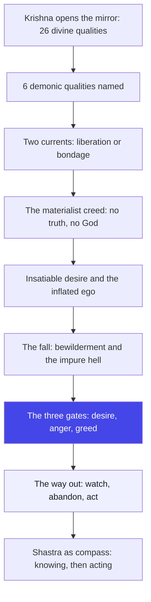
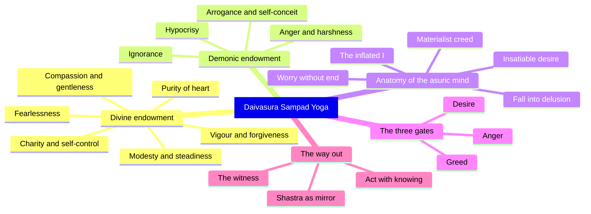

# Chapter 16: Daivasura Sampad Yoga — Your nature is not a verdict; it is a mirror you can turn

> "Do not ask whether you are divine or demonic. Ask what you are feeding — because that is what you will become."
> — The Osho Way

---

The chariot stands still between two armies, and Krishna, having spoken of the divine and the perishable in the fifteenth chapter, now does something unexpected: he gives Arjuna a list. Twenty-six qualities that belong to a divine endowment, and six that belong to a demonic one. On the surface it looks like a moral catalogue, the kind of thing a schoolmaster would write on a blackboard. But look again. Krishna is not teaching Arjuna what is good and what is bad — Arjuna, a prince raised in the royal court, knows that perfectly well. Krishna is showing Arjuna what is alive and what is dead in him. The Gita has moved from cosmology to psychology. Chapter sixteen is not theology; it is the anatomy of your own mind.

Osho reads this chapter as a series of mirrors, not a set of verdicts. The divine qualities — fearlessness, purity, forgiveness, gentleness — are not badges to collect; they are the fragrance of an awareness that has begun to watch itself. And the demonic qualities — pride, hypocrisy, arrogance, cruelty — are not monsters that live in other people; they are what happens to desire when it is never looked at. The demonic is not the opposite of the divine. The demonic is the divine forgotten. Every quality Krishna names is a state of your own inner weather, and the whole chapter is an invitation to become the witness of that weather instead of its victim.

There is one verse in this chapter that Osho loves above the rest: "Grieve not, O Pandava, you are born with the divine endowment" (16.5). Traditional commentators read it as Krishna's reassurance that Arjuna is a good man. Osho reads it as something far more dangerous and more alive: a challenge. Do not settle for the self-image that you are good. The divine endowment is not a certificate of birth; it is a possibility of becoming. The moment you believe you are good, you stop looking, and the demonic grows quietly in the unexamined corner. The divine and the demonic are not two races of souls. They are two currents in every person, and the battle between them is fought exactly where you are standing right now.

Why is this chapter placed here, at the end of the Gita, just before the great closing movement? Because the whole teaching of eighteen chapters would be useless if you could not see yourself. Krishna has given karma yoga, bhakti yoga, jnana yoga, the three gunas, the tree of samsara — and now he says, in effect: all of this is wasted unless you can read your own face in the mirror. This is the chapter of honesty. It is not comfortable, and it is not meant to be. It is meant to wake you up.

## Learning Objectives

After completing this chapter you will be able to:

1. **Distinguish the two endowments** — identify the twenty-six divine qualities (16.1–16.3) and the six demonic qualities (16.4) in yourself, not just in others.
2. **Read the chapter psychologically** — see the list as a mirror of inner states and energy currents (sattva, rajas, tamas) rather than a moral grading sheet or a theology of hell.
3. **Analyze the asuric mindset** — trace the chain from the materialist worldview (16.8) through insatiable desire (16.10–16.15) to self-destruction, and recognize each link in daily life.
4. **Work with the three gates** — practice the abandonment of desire, anger and greed (16.21) as an everyday discipline, with the sakshi (witness) as your tool.
5. **Understand the place of shastra** — interpret 16.23–16.24 as the need for a discriminating inner compass, without turning scripture into blind fundamentalism.
6. **Build a self-observation tool** — a TypeScript **Daivi-Asuri Profiler** that scores a week of your own observations against both lists and returns Osho-style guidance.

---

## Daivasura Sampad Yoga at a Glance

### The scene and the speakers

It is the battlefield of Kurukshetra, the eve of the great war, and Krishna is speaking from the chariot to Arjuna. The conversation has reached its final movement. Chapter fifteen described the world as the inverted tree of samsara and introduced Purushottama, the Supreme Person beyond the perishable and the imperishable. Now Krishna turns from the structure of the cosmos to the structure of the person. In the Mahabharata, this teaching comes just before the war reaches its climax — a moment when Arjuna will face not only armies but the darkest souls of his own family, Duryodhana and Dushasana. Krishna is preparing him to recognize what he is fighting: not merely armed men, but the asuric principle they serve, a principle that can live in any man — including Arjuna himself.

### The Osho lens

Osho refuses to read this chapter as a census of humanity — some people born divine, some born demonic, a cosmic sorting of souls. For him the two sampads are two psychologies, two ways of living with desire and the ego. The daivi person is not necessarily saintly in the conventional sense; he is awake. His qualities — fearlessness, purity, compassion — are not achievements of willpower but consequences of awareness. The asuri person is not necessarily criminal; he is asleep. His qualities — pride, hypocrisy, cruelty — are the ways the ego protects itself when it is never examined. The demonic, in Osho's reading, is not evil; it is unconsciousness. And the whole point of the chapter is that you can move from one to the other in a single instant — the instant you begin to watch.

### The structure of the chapter

This short chapter of twenty-four shlokas moves in three clear movements:

1. **Movement 1: 16.1–16.5** — The two lists. Twenty-six divine qualities, six demonic ones, and the declaration of their two destinations: liberation and bondage. Krishna closes the movement with the astonishing reassurance: "Grieve not, you are born with the divine endowment."
2. **Movement 2: 16.6–16.20** — The anatomy of the asuric mind. Krishna describes the demonic worldview (the universe without truth, without basis, without God), then traces its fruits: insatiable desire, worry, hoarding, the inflated ego that says "I am the lord," and the fall that follows.
3. **Movement 3: 16.21–16.24** — The way out. The three gates of hell — desire, anger, greed — must be abandoned, and the discriminating intelligence of shastra becomes the compass for right action.

### The three-framework note

This chapter is a practical bridge between the gunas of chapter fourteen and the faith of chapter seventeen. The divine endowment is a sattva-dominant nature expressing itself in action; the demonic endowment is rajas and tamas in their raw, unexamined forms. Notice also the thread of the karma-bhakti-jnana frame: the daivi qualities make karma yoga possible (you act without craving), they open the heart for bhakti (freedom from fear is the beginning of love), and they clear the mirror for jnana (purity of heart precedes the vision of the Self). Chapter sixteen is where the whole Gita becomes personal: it asks, not "what is the truth?" but "what is happening in you?"

## Traditional Reading vs Osho-Style Reading

| Dimension | Traditional reading | Osho-style reading |
|--------|---------------------|--------------------|
| **The two lists (16.1–16.4)** | A moral classification of souls — the godly and the demonic born with fixed natures | Two currents in every mind — awareness produces the divine qualities; unexamined desire produces the demonic ones |
| **"Grieve not, you are divine-born" (16.5)** | Reassurance that Arjuna's caste and past guarantee his liberation | A dare to keep watching — the moment you believe you are good, the demonic grows in the unexamined corner |
| **The asuric description (16.7–16.20)** | Portraits of evil men out there, enemies of the world | A mirror for your own moods — pride, worry, hoarding and boasting are states you know intimately |
| **Hell and the fall (16.16, 16.21)** | Literal hell after death, foul wombs of demons | The living hell of a desire-driven life — the self that is destroyed here and now by its own cravings |
| **Shastra as authority (16.24)** | Scripture as law, to be obeyed without question | Shastra as a discriminating mirror — not a master to obey blindly but a lens to see your conditioning clearly |

## The Complete Text — All 24 Shlokas

### Shloka 16.1 — The Twenty-Six Graces

> श्रीभगवानुवाच |
> अभयं सत्त्वसंशुद्धिर्ज्ञानयोगव्यवस्थितिः |
> दानं दमश्च यज्ञश्च स्वाध्यायस्तप आर्जवम्

**Transliteration:** śrībhagavānuvāca | abhayaṃ sattvasaṃśuddhirjñānayogavyavasthitiḥ | dānaṃ damaśca yajñaśca svādhyāyastapa ārjavam

**Translation:** The Blessed Lord said: Fearlessness, purity of heart, steadfastness in the yoga of knowledge, charity, self-control, sacrifice, study of the scriptures, austerity and straightforwardness — these are the first strokes of the divine portrait.

**Osho Darshan:** Notice what the list begins with: fearlessness. Not virtue, not morality — fearlessness. Because fear is the root of every poison in the mind; a frightened man cannot be honest, cannot be generous, cannot be clean. And then come the rest, almost casually: purity, steadfastness, giving, restraint, sacrifice, study, austerity, straightforwardness. Krishna is not ordering a man to become these things. He is describing what a man becomes when the fear at his center dissolves. You cannot imitate these qualities; you can only remove the fear that blocks them. That is why meditation comes first and morality follows — morality is a by-product, never a goal.

### Shloka 16.2 — The Quiet Virtues

> अहिंसा सत्यमक्रोधस्त्यागः शान्तिरपैशुनम् |
> दया भूतेष्वलोलुप्त्वं मार्दवं ह्रीरचापलम्

**Transliteration:** ahiṃsā satyamakrodhastyāgaḥ śāntirapaiśunam | dayā bhūteṣvaloluptvaṃ mārdavaṃ hrīracāpalam

**Translation:** Harmlessness, truthfulness, freedom from anger, renunciation, peacefulness, absence of slander, compassion toward all beings, non-covetousness, gentleness, modesty and steadiness of mind — these too belong to the divine endowment.

**Osho Darshan:** Half of this list is about the negative — non-violence, non-anger, non-covetousness — and Osho would point out how revealing that is. The divine person is not a person who has conquered the world; he is a person in whom the inner noisemakers have fallen silent. Truthfulness here is not the blunt "I always speak my mind"; it is a truth that does not wound — the absence of slander is listed right beside it. Gentleness and modesty are the qualities of a man who no longer needs to prove anything. When the ego is not hungry, it can afford to be soft. The whole list is a description of emptiness, and emptiness is the door of awareness.

### Shloka 16.3 — The Crown of the Divine

> तेजः क्षमा धृतिः शौचमद्रोहो नातिमानिता |
> भवन्ति सम्पदं दैवीमभिजातस्य भारत

**Transliteration:** tejaḥ kṣamā dhṛtiḥ śaucamadroho nātimānitā | bhavanti sampadaṃ daivīmabhijātasya bhārata

**Translation:** Vigour, forgiveness, fortitude, purity, absence of malice and absence of overbearing pride — these complete the divine endowment, O Bharata, for one who is born to it.

**Osho Darshan:** Here is the paradox Krishna loves: vigour and forgiveness in the same sentence. The world believes these exclude each other — the strong forgive, the weak resent, and the frightened are arrogant. Osho would say: forgiveness is not a weakness of the soft; it is the luxury of the strong. Only a man who has seen the other as himself can forgive, because there is no longer an enemy to punish. Fortitude holds the body steady when the mind is shaken. And the crown of the whole list is absence of over-pride — not humility as an act, but the simple fact that a man who has seen the infinite no longer has room for the inflation of the little self. All twenty-six qualities are one quality: seeing clearly.

### Shloka 16.4 — The Six Demons

> दम्भो दर्पोऽभिमानश्च क्रोधः पारुष्यमेव च |
> अज्ञानं चाभिजातस्य पार्थ सम्पदमासुरीम्

**Transliteration:** dambho darpo.abhimānaśca krodhaḥ pāruṣyameva ca | ajñānaṃ cābhijātasya pārtha sampadamāsurīm

**Translation:** Hypocrisy, arrogance, self-conceit, anger, harshness and ignorance — these belong to the demonic endowment, O Partha.

**Osho Darshan:** Six against twenty-six — and look at the asymmetry, because it is the whole teaching. The divine needs twenty-six qualities to describe it because the awakened life is infinitely varied; the demonic needs only six because unconsciousness is monotonous. Every demonic quality is a form of self-deception: hypocrisy is pretending to be what you are not, arrogance is claiming what you do not have, self-conceit is refusing to see yourself. Anger and harshness are the violence of a self that feels threatened, and ignorance is not lack of information — it is the refusal to look. Osho would say the demonic is not glamorous; it is simply boring. Hell is a repetition of the same six postures forever.

### Shloka 16.5 — The Two Roads and a Reassurance

> दैवी सम्पद्विमोक्षाय निबन्धायासुरी मता |
> मा शुचः सम्पदं दैवीमभिजातोऽसि पाण्डव

**Transliteration:** daivī sampadvimokṣāya nibandhāyāsurī matā | mā śucaḥ sampadaṃ daivīmabhijāto.asi pāṇḍava

**Translation:** The divine endowment leads to liberation; the demonic leads to bondage. Grieve not, O Pandava — you are born with the divine endowment.

**Osho Darshan:** Two roads, two destinations — but do not mistake this for a doctrine of predestination. Krishna says "grieve not" because Arjuna has been sitting in grief since chapter one, and the first thing a frightened man needs is not a lecture but a hand. Yet Osho would turn the reassurance into a razor: you are born with the divine endowment — now prove it by living it. A seed is born with the endowment of a tree, but it must grow, and growth is effort, and effort is yours. The divine endowment is not a medal; it is a beginning. Every moment you choose awareness over sleep, you are born again into it. Every moment you choose the unexamined desire, you are born again into the other.

### Shloka 16.6 — Two Currents in Creation

> द्वौ भूतसर्गौ लोकेऽस्मिन्दैव आसुर एव च |
> दैवो विस्तरशः प्रोक्त आसुरं पार्थ मे शृणु

**Transliteration:** dvau bhūtasargau loke.asmindaiva āsura eva ca | daivo vistaraśaḥ prokta āsuraṃ pārtha me śṛṇu

**Translation:** There are two orders of beings in this world: the divine and the demonic. The divine has been described at length; now hear from Me, O Partha, of the demonic.

**Osho Darshan:** Notice the pivot of the chapter. The divine took three verses; the demonic will take fifteen. Why so much space for darkness? Because, Osho would say, darkness is what you have; light is what you can become. You do not need a long map of the mountaintop — you need a precise map of the swamp you are standing in. Krishna describes the demonic in such detail because it is the psychology you carry, and you cannot leave a psychology you have not recognized. There are two currents in creation — but they are not two kinds of people. They are two directions of attention in every person. The whole war of Kurukshetra is the war between these two currents in Arjuna, and in you.

### Shloka 16.7 — Blindness to Action and Inaction

> प्रवृत्तिं च निवृत्तिं च जना न विदुरासुराः |
> न शौचं नापि चाचारो न सत्यं तेषु विद्यते

**Transliteration:** pravṛttiṃ ca nivṛttiṃ ca janā na vidurāsurāḥ | na śaucaṃ nāpi cācāro na satyaṃ teṣu vidyate

**Translation:** The demonic do not know what to do and what to refrain from. Neither purity, nor right conduct, nor truth is found in them.

**Osho Darshan:** The first sentence is the whole diagnosis: the asuric man does not know when to act and when to stop. He is a machine of reaction — stimulus, response, craving, consumption — and because he has never paused, he has never seen the difference between movement and stillness. Purity, conduct and truth are not found in him, not because he is born evil, but because they cannot grow in a mind that never watches. Osho would say: the practice of pravritti and nivritti is the practice of the pause. Before you act, pause. Before you refuse, pause. In that pause, awareness is born, and with awareness, the whole divine list begins to bloom on its own.

### Shloka 16.8 — The Atheist's Creed

> असत्यमप्रतिष्ठं ते जगदाहुरनीश्वरम् |
> अपरस्परसम्भूतं किमन्यत्कामहैतुकम्

**Transliteration:** asatyamapratiṣṭhaṃ te jagadāhuranīśvaram | aparasparasambhūtaṃ kimanyatkāmahaitukam

**Translation:** They say: "This universe is without truth, without moral foundation, without God. It arises from the union of male and female — what else but desire could be its cause?"

**Osho Darshan:** Krishna quotes the demonic creed with perfect accuracy, and Osho would say: this is not the creed of a monster — this is the creed of a disappointed man. The asuric mind has not found truth, so it declares truth does not exist; it has not found love, so it declares the universe is only sex; it has not found meaning, so it declares meaning is a delusion. This worldview is a defense mechanism, not a discovery. And here is the subtle point: the asuric man is half right. The universe as the ego perceives it is indeed without foundation — because the ego cannot perceive the foundation. The remedy is not argument; you cannot argue a man into God. The remedy is to see that your own disappointment is not evidence about the cosmos; it is evidence about your own unexamined eyes.

### Shloka 16.9 — The Logic That Destroys

> एतां दृष्टिमवष्टभ्य नष्टात्मानोऽल्पबुद्धयः |
> प्रभवन्त्युग्रकर्माणः क्षयाय जगतोऽहिताः |

**Transliteration:** etāṃ dṛṣṭimavaṣṭabhya naṣṭātmāno.alpabuddhayaḥ | prabhavantyugrakarmāṇaḥ kṣayāya jagato.ahitāḥ

**Translation:** Holding this view, these ruined souls of small intelligence, of fierce deeds, rise as enemies of the world for its destruction.

**Osho Darshan:** The creed produces the cruelty, not the other way round. First you decide the world is meaningless; then it costs you nothing to smash it. Osho would point out that the most destructive people in history were not the stupid — they were the convinced. Once a man is certain there is no God, no truth, no foundation, his own greed becomes his only god, and no crime is too large for a god. "Small intelligence" does not mean low IQ; it means an intelligence that never once turned its gaze inward. The ruined soul is not the soul that has sinned; it is the soul that has stopped asking. As long as the question is alive, the man is alive.

### Shloka 16.10 — Insatiable Desire

> काममाश्रित्य दुष्पूरं दम्भमानमदान्विताः |
> मोहाद्गृहीत्वासद्ग्राहान्प्रवर्तन्तेऽशुचिव्रताः |

**Transliteration:** kāmamāśritya duṣpūraṃ dambhamānamadānvitāḥ | mohādgṛhītvāsadgrāhānpravartante.aśucivratāḥ

**Translation:** Abiding in desire that is never filled, filled with hypocrisy, pride and intoxication, holding false doctrines through delusion, they act with impure resolutions.

**Osho Darshan:** "Desire that is never filled" — the phrase is the biography of millions. Osho would say: desire is the only fire that consumes its own fuel; the more you feed it, the hungrier it grows, because its hunger is not for objects but for being. No object can fill a bottomless pit. The asuric man mistakes the craving of the Self for a craving of the senses, and so he runs from one object to the next, and the pit remains. Hypocrisy and pride are the decorations of this running — a man who cannot be still must at least look important while he runs. And the impure resolutions are the natural fruit: when the center is hollow, every plan you make will be crooked.

### Shloka 16.11 — Cares That End Only With Death

> चिन्तामपरिमेयां च प्रलयान्तामुपाश्रिताः |
> कामोपभोगपरमा एतावदिति निश्चिताः

**Transliteration:** cintāmaparimeyāṃ ca pralayāntāmupāśritāḥ | kāmopabhogaparamā etāvaditi niścitāḥ

**Translation:** Devoted to cares without measure that end only with death, making sensual enjoyment their highest goal, they are certain that this is all there is.

**Osho Darshan:** Here is the living hell — not a fire below the earth but a mind that cannot stop worrying. The cares end only with death because the cares are not about things; they are about the self, and the self, as long as it is identified with the body, is never safe. Osho would say: the asuric man has a short happiness and a long worry — the happiness of getting, and the worry of keeping. "This is all" is the creed of the closed mind; it closes the door on the infinite and calls the tiny room a palace. The moment you see that this is not all, that desire is only the shadow of a longing for the eternal, your cares begin to lose their grip.

### Shloka 16.12 — Hopes as Chains

> आशापाशशतैर्बद्धाः कामक्रोधपरायणाः |
> ईहन्ते कामभोगार्थमन्यायेनार्थसञ्चयान् |

**Transliteration:** āśāpāśaśatairbaddhāḥ kāmakrodhaparāyaṇāḥ | īhante kāmabhogārthamanyāyenārthasañcayān

**Translation:** Bound by a hundred ties of hope, devoted to desire and anger, they strain to hoard wealth by unlawful means for the sake of sensual enjoyment.

**Osho Darshan:** Hope as a chain — the phrase wounds, because hope is so often called holy. Osho would distinguish: hope is not faith. Faith says, "I am in the hands of the whole"; hope says, "I must have that object to be happy." Hope is desire wearing a mask. A hundred ties of hope: the promotion, the house, the approval, the revenge — each tie is a leash around the neck, and the asuric man pulls in a hundred directions, which is why he is always in pain. Anger is hope frustrated; that is the whole equation. And the hoarding — wealth gathered by wrong means — is what happens when a man trusts objects more than he trusts his own being. He is building a fortress of things against a fear no fortress can stop.

### Shloka 16.13 — The Inventory of Mine

> इदमद्य मया लब्धमिमं प्राप्स्ये मनोरथम् |
> इदमस्तीदमपि मे भविष्यति पुनर्धनम् |

**Transliteration:** idamadya mayā labdhamimaṃ prāpsye manoratham | idamastīdamapi me bhaviṣyati punardhanam

**Translation:** "This I have gained today; this desire I shall fulfill; this wealth is mine, and more wealth will be mine in the future."

**Osho Darshan:** Listen to the grammar of the demonic mind: it lives only in the past and the future. "This I have gained" — a photograph of the past; "this shall be mine" — a film of the future; and the present, the only moment that is real, is nowhere in the sentence. Osho would say: the ego cannot live in the present because the present does not need the ego — in the present, there is only witnessing, and the ego cannot survive witnessing. So the ego builds its castle of "mine": my wealth, my plan, my future, my fame. Every "mine" is a prison wall. And notice: this verse is not about villains; it is about the quiet arithmetic of every possessive mind. Watch your own sentence today: how many times does "I" and "mine" appear in your inner monologue?

### Shloka 16.14 — The Little God

> असौ मया हतः शत्रुर्हनिष्ये चापरानपि |
> ईश्वरोऽहमहं भोगी सिद्धोऽहं बलवान्सुखी

**Transliteration:** asau mayā hataḥ śatrurhaniṣye cāparānapi | īśvaro.ahamahaṃ bhogī siddho.ahaṃ balavānsukhī

**Translation:** "That enemy has been slain by me, and I will slay the others too. I am the lord. I am the enjoyer. I am accomplished, powerful and happy."

**Osho Darshan:** The ego at full inflation: "I am the lord." And Osho would laugh with the compassion of the awakened: the most demonic sentence in the Gita is spoken by the most impoverished mind in the Gita. A man who says "I am the lord" is a man who has never once been still enough to feel the vastness that he is not. The true lords of the earth — the Buddhas, the Krishnas — never need to announce their lordship; it radiates without words. And observe the sequence: "I am the lord, I am the enjoyer, I am accomplished, powerful, happy." The four claims are four holes in the bucket — because each claim must be repeated, and a real joy never needs to be announced. The quieter the ego, the louder the being.

### Shloka 16.15 — The Wealthy Boast

> आढ्योऽभिजनवानस्मि कोऽन्योऽस्ति सदृशो मया |
> यक्ष्ये दास्यामि मोदिष्य इत्यज्ञानविमोहिताः |

**Transliteration:** āḍhyo.abhijanavānasmi ko.anyo.asti sadṛśo mayā | yakṣye dāsyāmi modiṣya ityajñānavimohitāḥ

**Translation:** "I am rich, I am well-born. Who else is my equal? I will perform sacrifices, I will give in charity, I will rejoice" — thus they are deluded by ignorance.

**Osho Darshan:** Even the charity of the ego is an advertisement. "I will give" — but the giving is announced in the same breath as the boasting, and Osho would say: a gift that is advertised is a purchase, not a gift. The sacrifice becomes a stage, the charity becomes a banner, and the rejoicing becomes a performance. The demonic mind cannot even do good without turning the good into a mirror for its own face. But notice the deeper delusion: the man says "who is my equal?" and has already confessed that he compares himself with everyone — a man who is truly rich does not know the word equal, because he does not see rivals, only fellow beings. Ignorance, not cruelty, is the root. The cruelty is only the blossom.

### Shloka 16.16 — Falling Into the Foul Hell

> अनेकचित्तविभ्रान्ता मोहजालसमावृताः |
> प्रसक्ताः कामभोगेषु पतन्ति नरकेऽशुचौ |

**Transliteration:** anekacittavibhrāntā mohajālasamāvṛtāḥ | prasaktāḥ kāmabhogeṣu patanti narake.aśucau

**Translation:** Bewildered by a hundred fancies, wrapped in the net of delusion, addicted to the enjoyment of desires, they fall into an impure hell.

**Osho Darshan:** "Bewildered by a hundred fancies" — the mind scattered into a thousand directions, each fancy a thread of the net, and the net is woven by the man's own wandering attention. Nobody throws this net over you; you weave it every time you let your mind chase a whim. And the hell is described as impure — because the fall is not a punishment sent from above; it is the natural consequence of addiction. Osho would say: the demonic man does not fall into hell at death; he falls into it every morning, the moment his mind grips its first desire and refuses to let go. Hell is a state, not a place, and it is made of your own habits of grasping.

### Shloka 16.17 — Sacrifice as Theatre

> आत्मसम्भाविताः स्तब्धा धनमानमदान्विताः |
> यजन्ते नामयज्ञैस्ते दम्भेनाविधिपूर्वकम् |

**Transliteration:** ātmasambhāvitāḥ stabdhā dhanamānamadānvitāḥ | yajante nāmayajñaiste dambhenāvidhipūrvakam

**Translation:** Self-conceited, stubborn, intoxicated with wealth and honor, they perform sacrifices in name only, out of ostentation and contrary to the prescribed rite.

**Osho Darshan:** "Sacrifices in name only" — religion itself becomes the stage of the ego. Osho would say: when a man performs a ritual and his attention is on the audience, the ritual is dead, and the man is an actor, not a worshipper. The asuric man uses God as a backdrop for his own portrait. He is stubborn — the closed mind cannot be bent by any truth — and he is drunk on wealth and honor, the two drinks that make a man believe he is standing when he has long since fallen. The rite performed without inwardness is worse than no rite, because it inoculates the man against the real thing. Watch your own worship: when you bow, are you bowing, or are you being seen bowing?

### Shloka 16.18 — Hatred in the Name of the Self

> अहंकारं बलं दर्पं कामं क्रोधं च संश्रिताः |
> मामात्मपरदेहेषु प्रद्विषन्तोऽभ्यसूयकाः |

**Transliteration:** ahaṃkāraṃ balaṃ darpaṃ kāmaṃ krodhaṃ ca saṃśritāḥ | māmātmaparadeheṣu pradviṣanto.abhyasūyakāḥ

**Translation:** Given over to egoism, power, arrogance, desire and anger, they hate Me dwelling in their own bodies and in those of others — these malicious ones.

**Osho Darshan:** Here is the deepest wound of the asuric mind: it hates the divine in its own body and in every other. Because the divine is the silent witness, and the witness is the death of the ego — so the ego hates it. Osho would say: this is why the demonic man is restless in silence, why he must always be occupied, why he cannot sit with himself for ten minutes — the witness inside him is the enemy he cannot kill. And he hates the divine in others, which is why the company of an awakened man is unbearable to him; the stillness of the one reminds the many of what they have lost. Malice is the signature: when you see a man who cannot tolerate peace in others, you are seeing the asuric pattern in its clearest form.

### Shloka 16.19 — The Womb of the Cruel

> तानहं द्विषतः क्रुरान्संसारेषु नराधमान् |
> क्षिपाम्यजस्रमशुभानासुरीष्वेव योनिषु |

**Transliteration:** tānahaṃ dviṣataḥ krurānsaṃsāreṣu narādhamān | kṣipāmyajasramaśubhānāsurīṣveva yoniṣu

**Translation:** These haters, cruel, the worst among men — I hurl them, ever again, into the wombs of the demonic, these evil-doers.

**Osho Darshan:** The traditional reading hears a sentence of punishment: God throws the wicked into demonic wombs. Osho reads the same sentence as the law of consequences, and the law is gentler and more terrifying at once: nobody is thrown anywhere — the asuric mind, by its own momentum, keeps choosing what it already is. A mind of cruelty cannot rest in kindness; it finds its way back to cruelty the way a river finds its way to the sea. "I hurl" means: the universe is a mirror that gives you exactly the shape you bring to it. The good news is hidden in the same law — because if momentum can carry you down, it can also carry you up, and every moment of awareness is a seed of a new birth.

### Shloka 16.20 — Birth After Birth, Farther and Farther

> आसुरीं योनिमापन्ना मूढा जन्मनि जन्मनि |
> मामप्राप्यैव कौन्तेय ततो यान्त्यधमां गतिम् |

**Transliteration:** āsurīṃ yonimāpannā mūḍhā janmani janmani | māmaprāpyaiva kaunteya tato yāntyadhamāṃ gatim

**Translation:** Entering the demonic wombs, deluded birth after birth, without attaining Me, they fall, O Kaunteya, into a condition still lower.

**Osho Darshan:** "Birth after birth" — the asuric mind is a circle, and circles never arrive. Osho would say: you do not need to believe in reincarnation to feel the truth of this verse; you can watch it in a single day. The same anger is born in you, lives, dies — and is born again tomorrow, just as deluded, just as convinced it is new. Without attaining Me — and what is "attaining Me"? It is the moment when the watcher wakes inside you and the circle is broken. The lowest condition is not a place; it is the repetition itself. The only way out of the circle is not to fight the demonic but to stop being the doer of it — to become the witness, and let the whole drama dissolve in the light of watching.

### Shloka 16.21 — The Three Gates

> त्रिविधं नरकस्येदं द्वारं नाशनमात्मनः |
> कामः क्रोधस्तथा लोभस्तस्मादेतत्त्रयं त्यजेत्

**Transliteration:** trividhaṃ narakasyedaṃ dvāraṃ nāśanamātmanaḥ | kāmaḥ krodhastathā lobhastasmādetattrayaṃ tyajet

**Translation:** There are three gates to this hell, destructive of the self: desire, anger and greed. Therefore one should abandon these three.

**Osho Darshan:** After fifteen verses of anatomy, Krishna points to the three arteries: desire, anger, greed. And Osho would say: these are not three separate enemies; they are one enemy wearing three masks. Desire is the craving; anger is the craving blocked; greed is the craving accumulated. They are called gates to hell because they lead outward — out of your own center, into the objects, into the drama, into the sleep. But do not try to kill them with willpower; the fire you fight with fire only grows. The only abandonment that works is the abandonment of watching: when desire arises, watch it; when anger flares, watch it; when greed whispers, watch it. What is seen burns out like a flame without fuel. The three gates become three doors of freedom.

### Shloka 16.22 — Walking Out of the Gates

> एतैर्विमुक्तः कौन्तेय तमोद्वारैस्त्रिभिर्नरः |
> आचरत्यात्मनः श्रेयस्ततो याति परां गतिम् |

**Transliteration:** etairvimuktaḥ kaunteya tamodvāraistribhirnaraḥ | ācaratyātmanaḥ śreyastato yāti parāṃ gatim

**Translation:** A man freed from these three gates of darkness, O Kaunteya, practices what is good for himself and so attains the supreme goal.

**Osho Darshan:** Freedom is the prerequisite of goodness — notice the order. The man freed from the three gates does not first become good and then become free; he becomes free, and goodness follows him like a shadow. Osho would say: morality that comes from fear is a cage; the goodness of a free man is a fragrance. "Practices what is good for himself" — and here is the subtle teaching: your own good and the good of all are the same thing, because you are not separate. A man who has walked out of desire, anger and greed cannot harm anyone, because there is no craving left in him to justify the harm. The supreme goal is not far away; it is simply this freedom, lived for one full breath at a time.

### Shloka 16.23 — Desire Without a Compass

> यः शास्त्रविधिमुत्सृज्य वर्तते कामकारतः |
> न स सिद्धिमवाप्नोति न सुखं न परां गतिम् |

**Transliteration:** yaḥ śāstravidhimutsṛjya vartate kāmakārataḥ | na sa siddhimavāpnoti na sukhaṃ na parāṃ gatim

**Translation:** He who, setting aside the ordinance of the scripture, acts according to the impulse of desire — he attains neither perfection, nor happiness, nor the supreme goal.

**Osho Darshan:** "Acts according to the impulse of desire" — the life of reaction, one reflex after another, is described here as a life that never arrives. And Osho would say the verse is not about obeying a book; it is about the difference between a compass and a whim. The shastra, read rightly, is not a list of orders; it is the accumulated insight of those who have walked the path before you, a map drawn by awakened eyes. When you discard the map because it is old, you are not being free — you are being a leaf in the wind, and the wind is your own unexamined craving. Perfection, happiness and the goal all wait at one address: the center where you watch, and the watcher needs no book but his own silence.

### Shloka 16.24 — The Scripture as Mirror

> तस्माच्छास्त्रं प्रमाणं ते कार्याकार्यव्यवस्थितौ |
> ज्ञात्वा शास्त्रविधानोक्तं कर्म कर्तुमिहार्हसि |

**Transliteration:** tasmācchāstraṃ pramāṇaṃ te kāryākāryavyavasthitau | jñātvā śāstravidhānoktaṃ karma kartumihārhasi

**Translation:** Therefore let the scripture be your authority in determining what is to be done and what is not to be done; having known what the ordinance of the scripture teaches, you should act here in this world.

**Osho Darshan:** The chapter ends on the word "act" — the Gita never ends in withdrawal. And Osho would insist: shastra as pramana, as authority, does not mean surrender of your intelligence; it means you do not reinvent the wheel of awareness every morning. The scripture is a mirror that shows you your own conditioning — use it to see, not to obey. The final sentence is the whole teaching: having known, act. Knowing without acting is fantasy; acting without knowing is reaction. Krishna sends Arjuna back into the world — the same world, the same war — but now with eyes. That is liberation: not leaving the battlefield, but standing on it as a witness, doing what must be done, and never being touched by it again.

## Key Themes

| Theme | Shlokas | Osho-style insight |
|-------|---------|--------------------|
| **The two endowments** | 16.1–16.5 | The divine and the demonic are two currents in every mind, not two races of souls — awareness births the divine, sleep births the demonic |
| **Fearlessness as the root** | 16.1 | Fear is the root of every poison; the divine list begins where fear ends |
| **The materialist creed** | 16.8–16.9 | The asuric worldview is a defense of the disappointed ego, not a discovery — and it ends in destruction |
| **The psychology of desire** | 16.10–16.16 | Desire is a bottomless pit; the ego lives in past and future, never in the present, and calls its chains "hope" |
| **The inflated ego** | 16.13–16.17 | "I am the lord" is spoken by the most impoverished mind; even worship becomes a stage for the ego |
| **The three gates** | 16.21–16.22 | Desire, anger and greed are one enemy in three masks — the only abandonment that works is watching |
| **Shastra as mirror** | 16.23–16.24 | Scripture is a lens for seeing your conditioning, and the teaching ends in action, not withdrawal |

## The Inner Journey



## A Mind Map



## Summary

- Chapter sixteen gives the Gita its mirror: twenty-six divine qualities and six demonic ones, two currents running through every human mind.
- The divine endowment is not a moral checklist but the fragrance of awareness — fearlessness first, because fear is the root of every poison.
- The demonic endowment is not a race of monsters but the psychology of the unexamined ego: the materialist creed, insatiable desire, the inflated "I", and the fall.
- The asuric man mistakes craving for freedom, hope for faith, and performance for worship — even his charity is an advertisement.
- The three gates of hell — desire, anger, greed — are one enemy in three masks, and the only abandonment that works is the witness.
- The chapter ends by returning you to action: knowing the teaching, you act — the battlefield stays, but your eyes change.

## Practical Takeaways

- **Start with fearlessness**: each morning, name one fear you carried yesterday; watch it instead of obeying it — fear dissolves under attention.
- **Use the lists as a mirror, not a report card**: pick one divine quality for the week (say, gentleness) and observe how often your inner monologue contradicts it.
- **Catch your own "I am the lord" moments**: notice when your inner voice boasts, compares, or announces — the quieter the ego, the louder the being.
- **Name your three gates**: keep a small log of one desire, one anger, one greed episode per day; the naming is the watching.
- **Check your giving**: before your next act of charity or help, ask — am I giving, or am I being seen giving?
- **Act from knowing**: before a difficult decision, pause for one breath and ask what the witness in you recommends — then act fully.
- **Return to the world**: do not mistake awareness for withdrawal; the liberated act on the same battlefield with different eyes.

## Chapter Quiz

**Q1. How many divine qualities does Krishna list in shlokas 16.1–16.3?**
- a. 6
- b. 18
- c. 26
- d. 32

<details class="tp-qa-card" data-qid="bg16-q1"><summary>Show Answer</summary>

**Answer: c.** Twenty-six divine qualities are listed across 16.1–16.3.
</details>

**Q2. What worldview do the demonic hold in shloka 16.8?**
- a. The universe is created by God and sustained by dharma
- b. The universe is without truth, without moral basis, without God, born of desire
- c. The universe is a dream of the Self
- d. The universe is eternal and unchanging

<details class="tp-qa-card" data-qid="bg16-q2"><summary>Show Answer</summary>

**Answer: b.** They declare the world asatya (without truth), apratishtha (without basis), anishvara (without God), born of mutual union and desire.
</details>

**Q3. What are the three gates of hell named in shloka 16.21?**
- a. Pride, envy, sloth
- b. Lust, anger, greed
- c. Fear, doubt, hatred
- d. Sleep, food, gossip

<details class="tp-qa-card" data-qid="bg16-q3"><summary>Show Answer</summary>

**Answer: b.** Kama (desire), krodha (anger) and lobha (greed) are the three gates destructive of the self.
</details>

**Q4. How does the Osho-style reading interpret the demonic endowment?**
- a. As a fixed race of evil souls
- b. As unexamined patterns of the ego present in every mind
- c. As a punishment from God
- d. As the karma of past lives only

<details class="tp-qa-card" data-qid="bg16-q4"><summary>Show Answer</summary>

**Answer: b.** The demonic is the psychology of unconsciousness — what happens to desire when it is never looked at; it is a current in every person.
</details>

**Q5. What does Krishna tell Arjuna in shloka 16.5?**
- a. That he is doomed by his doubts
- b. That he is born with the divine endowment and should not grieve
- c. That he must leave the battlefield
- d. That he will lose the war

<details class="tp-qa-card" data-qid="bg16-q5"><summary>Show Answer</summary>

**Answer: b.** "Ma shuchah" — grieve not; you are born with the divine endowment, which leads to liberation.
</details>

**Q6. What role does the shastra play in shloka 16.24?**
- a. It is an object of blind worship
- b. It is the authority for distinguishing right from wrong action, to be known and then acted on
- c. It is only for monks and renunciates
- d. It replaces one's own intelligence entirely

<details class="tp-qa-card" data-qid="bg16-q6"><summary>Show Answer</summary>

**Answer: b.** Shastra is pramana (authority) in determining karya and akarya; knowing it, you act — it is a mirror for the witness, not a master for the blind.
</details>

## Exercises

1. **The seven-day mirror**: keep a daily log of one daivi and one asuri tendency you observed in yourself. At week's end, feed the log into the Daivi-Asuri Profiler below and read your own pattern.
2. **The three-gates watch**: for three days, note every moment desire, anger or greed arose — not to suppress them, but to watch them. Write what you saw in each episode.
3. **TypeScript exercise**: extend the Profiler with a `trend()` method that compares two weeks of scores and reports whether the daivi score is rising, and add a `qualityOfDay()` suggestion based on the dominant asuri pattern.

## TypeScript Tool: Daivi-Asuri Profiler

```typescript
/*
 * Daivi-Asuri Profiler
 * Chapter 16, Bhagavad Gita: Daivasura Sampad Yoga
 * Scores a week of self-observations against the 26 divine and
 * 6 demonic endowments (16.1-16.4).
 * Osho lens: neither list is a verdict; both are mirrors.
 */

interface Quality {
  key: string;
  label: string;
  kind: 'daivi' | 'asuri';
}

interface DailyObservation {
  date: string;
  daiviKeys: string[];
  asuriKeys: string[];
}

interface ProfileResult {
  days: number;
  daiviScore: number;
  asuriScore: number;
  dominant: 'daivi' | 'asuri' | 'balanced';
  strongestDaivi: string;
  strongestAsuri: string;
  oshoNote: string;
}

const QUALITIES: Quality[] = [
  { key: 'fearlessness', label: 'Fearlessness', kind: 'daivi' },
  { key: 'purity', label: 'Purity of heart', kind: 'daivi' },
  { key: 'steadfastness', label: 'Steadfastness in knowledge', kind: 'daivi' },
  { key: 'charity', label: 'Charity', kind: 'daivi' },
  { key: 'selfControl', label: 'Self-control', kind: 'daivi' },
  { key: 'sacrifice', label: 'Sacrifice', kind: 'daivi' },
  { key: 'study', label: 'Study of scriptures', kind: 'daivi' },
  { key: 'austerity', label: 'Austerity', kind: 'daivi' },
  { key: 'straightforwardness', label: 'Straightforwardness', kind: 'daivi' },
  { key: 'ahimsa', label: 'Non-violence', kind: 'daivi' },
  { key: 'truth', label: 'Truthfulness', kind: 'daivi' },
  { key: 'noAnger', label: 'Freedom from anger', kind: 'daivi' },
  { key: 'renunciation', label: 'Renunciation', kind: 'daivi' },
  { key: 'peace', label: 'Peacefulness', kind: 'daivi' },
  { key: 'noSlander', label: 'Absence of slander', kind: 'daivi' },
  { key: 'compassion', label: 'Compassion', kind: 'daivi' },
  { key: 'nonCovetousness', label: 'Non-covetousness', kind: 'daivi' },
  { key: 'gentleness', label: 'Gentleness', kind: 'daivi' },
  { key: 'modesty', label: 'Modesty', kind: 'daivi' },
  { key: 'steadiness', label: 'Steadiness of mind', kind: 'daivi' },
  { key: 'vigour', label: 'Vigour', kind: 'daivi' },
  { key: 'forgiveness', label: 'Forgiveness', kind: 'daivi' },
  { key: 'fortitude', label: 'Fortitude', kind: 'daivi' },
  { key: 'cleanliness', label: 'Purity of body and mind', kind: 'daivi' },
  { key: 'noMalice', label: 'Absence of malice', kind: 'daivi' },
  { key: 'noPride', label: 'Absence of over-pride', kind: 'daivi' },
  { key: 'hypocrisy', label: 'Hypocrisy', kind: 'asuri' },
  { key: 'arrogance', label: 'Arrogance', kind: 'asuri' },
  { key: 'conceit', label: 'Self-conceit', kind: 'asuri' },
  { key: 'anger', label: 'Anger', kind: 'asuri' },
  { key: 'harshness', label: 'Harshness', kind: 'asuri' },
  { key: 'ignorance', label: 'Ignorance', kind: 'asuri' }
];

function scoreWeek(observations: DailyObservation[]): ProfileResult {
  const daiviCount = new Map<string, number>();
  const asuriCount = new Map<string, number>();
  for (const day of observations) {
    for (const key of day.daiviKeys) daiviCount.set(key, (daiviCount.get(key) ?? 0) + 1);
    for (const key of day.asuriKeys) asuriCount.set(key, (asuriCount.get(key) ?? 0) + 1);
  }
  const daiviScore = [...daiviCount.values()].reduce((a, b) => a + b, 0);
  const asuriScore = [...asuriCount.values()].reduce((a, b) => a + b, 0);
  const strongestDaivi = labelOf(maxKey(daiviCount));
  const strongestAsuri = labelOf(maxKey(asuriCount));
  const dominant: ProfileResult['dominant'] =
    daiviScore > asuriScore ? 'daivi' : daiviScore < asuriScore ? 'asuri' : 'balanced';
  const oshoNote =
    dominant === 'asuri'
      ? 'Your demonic current is loud this week. Do not fight it; watch it. What is seen burns out.'
      : dominant === 'daivi'
        ? 'Awareness is rising. Remember: the moment you believe you are good, the demonic grows in the unexamined corner. Keep watching.'
        : 'A knife-edge balance. One honest hour of witnessing will tip it toward light.';
  return { days: observations.length, daiviScore, asuriScore, dominant, strongestDaivi, strongestAsuri, oshoNote };

  function maxKey(map: Map<string, number>): string {
    let best = ''; let bestCount = 0;
    for (const [k, v] of map) if (v > bestCount) { best = k; bestCount = v; }
    return best;
  }
  function labelOf(key: string): string {
    return QUALITIES.find((q) => q.key === key)?.label ?? 'none observed';
  }
}

const week: DailyObservation[] = [
  { date: '2026-08-18', daiviKeys: ['fearlessness', 'truth'], asuriKeys: ['arrogance'] },
  { date: '2026-08-19', daiviKeys: ['compassion', 'noAnger'], asuriKeys: ['anger'] },
  { date: '2026-08-20', daiviKeys: ['fortitude'], asuriKeys: ['conceit', 'ignorance'] }
];

const report = scoreWeek(week);
console.log('=== Daivi-Asuri Profiler ===');
console.log(`Days observed: ${report.days}`);
console.log(`Daivi score: ${report.daiviScore} | Asuri score: ${report.asuriScore}`);
console.log(`Strongest divine trace: ${report.strongestDaivi}`);
console.log(`Strongest demonic trace: ${report.strongestAsuri}`);
console.log(`Dominant current: ${report.dominant}`);
console.log(`Osho: ${report.oshoNote}`);
```
