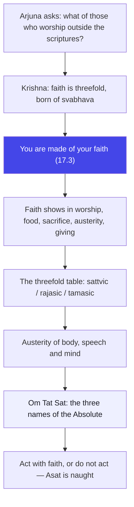
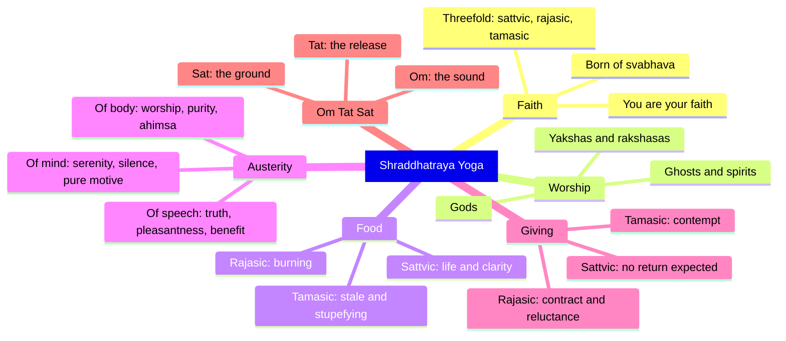

# Chapter 17: Shraddhatraya Yoga — You are made of what you trust, and your trust is born of your own nature

> "Your faith is not only in your temple. It is in your belly, your tongue, your work, your gifts. Show me those, and I will show you who you are."
> — The Osho Way

---

Arjuna has just been told, at the end of chapter sixteen, that scripture is the authority for action. Now he asks the question that follows inevitably, the question every honest mind must ask: what about the man who does not know the scriptures, who acts from faith alone — where does his faith stand? Is it sattvic, rajasic or tamasic? (17.1) It is a beautiful question, because it is asked on behalf of every ordinary human being who has never studied philosophy but who worships, gives, fasts and prays with a full heart. Krishna answers by turning the question inside out: faith is not a quality you add to yourself; faith is the substance you are made of.

Osho reads this chapter as the Gita's most personal psychology. Chapter sixteen gave you the mirror of qualities; chapter seventeen asks you to look at the root of all qualities — shraddha, faith, trust, the deepest leaning of your being. And Krishna's answer is radical: "As a man's faith is, so is he" (17.3). You are not what you think, not what you do, not what you say — you are what you trust, and everything else follows. The chapter then takes the most concrete possible turn: faith shows itself in your food, your sacrifice, your austerity, your giving. The spirit is tested not in the temple but in the kitchen, the workplace, the hand that gives.

Osho's special delight in this chapter is its refusal to spiritualize everything. When Krishna classifies food — sattvic food that increases life and clarity, rajasic food that burns, tamasic food that stupefies — Osho takes it both literally and metaphorically at once. Literally, because the body and mind are not separate; what you eat is what you feel. And metaphorically, because you also consume beliefs, news, conversation, entertainment — and these are food too. The question of this chapter is not what you eat with your mouth only; it is what you feed the inner man every hour.

The chapter ends with the most powerful mantra in the tradition: Om Tat Sat — the three names of the Absolute, the three syllables that sanctify every act. And its last verse is the sharpest: anything done without faith is Asat — it is naught here and naught hereafter. Faith, in this chapter, is not belief in doctrines; it is the aliveness of the doer. A gift without faith is a stone; a fast without faith is hunger; a ritual without faith is theatre. This is the chapter that tells you, in the simplest language: whatever you do, do it with your whole heart — or do not do it at all.

## Learning Objectives

After completing this chapter you will be able to:

1. **Define shraddha psychologically** — understand faith as the deepest trust of your being, born of your svabhava (nature), and the foundation of character: "as a man's faith is, so is he" (17.3).
2. **Apply the threefold classification** — classify faith, worship, food, sacrifice, austerity and giving into sattvic, rajasic and tamasic forms, and locate your own patterns.
3. **Read the food verses practically** — connect the three kinds of food (17.8–17.10) to body, mind and the media you consume, not only to diet.
4. **Practice the three austerities** — work with austerity of body, speech and mind (17.14–17.16) as a daily discipline of awareness rather than self-torture.
5. **Use Om Tat Sat as an inner technology** — understand the three names of the Absolute (17.23–17.27) as a way of dedicating action and dissolving the ego of the doer.
6. **Build a TypeScript tool** — a **Shraddha Classifier** that evaluates everyday behaviors and returns the guna of your faith with Osho-style guidance.

---

## Shraddhatraya Yoga at a Glance

### The scene and the speakers

Krishna is still speaking on the chariot at Kurukshetra, and Arjuna interrupts the flow of instruction with a question — the last time in the Gita that Arjuna speaks before the great closing dialogue of chapter eighteen. His question concerns those who worship and perform sacrifice "setting aside the ordinances of the scriptures" (17.1): ordinary people, unlettered devotees, villagers and householders whose faith is simple and whose scripture is their heart. In the Mahabharata context this question is a quiet plea: Krishna, you have spoken of shastra as authority — but what of the millions who will never open a scripture? Krishna answers with a teaching far more democratic than the question expects: every human being has faith, and its quality does not depend on scholarship.

### The Osho lens

Osho sees this chapter as the destruction of the "religious expert." Faith is not given by scriptures or gurus; it grows from your own nature like a tree from its seed. The guru can only help you find the seed. And the three gunas are not three moral grades — they are three levels of energy in which faith operates: sattvic faith is trust in the whole without bargaining; rajasic faith is the eager bargain — "I give, You owe me"; tamasic faith is the faith of inertia, worship without understanding, ritual without aliveness. Osho's invitation: look at your own faith honestly, without shame. Whatever its current guna, it is yours, and it can be refined — because faith is not static; it is the most dynamic force in you.

### The structure of the chapter

The chapter of twenty-eight shlokas moves in four clear movements:

1. **Movement 1: 17.1–17.6** — Faith itself: its threefold nature, its root in svabhava, its expression in worship, and the false austerity that betrays a demonic resolve.
2. **Movement 2: 17.7–17.13** — The concrete tests: food (three kinds), sacrifice (three kinds), and the beginning of austerity.
3. **Movement 3: 17.14–17.22** — The triple austerity of body, speech and mind, followed by the triple giving.
4. **Movement 4: 17.23–17.28** — Om Tat Sat: the three names of the Absolute, and the final verdict on faithlessness — Asat.

### The three-framework note

This chapter is the bridge between the gunas (chapter fourteen) and right action (chapter eighteen). Each guna produces its own faith, and each faith produces its own conduct — so the gunas are not abstract categories but the engine of your daily choices. Notice also the karma-bhakti frame: the sattvic sacrifice, austerity and giving are karma yoga in action (without desire for fruit); the sattvic worship of the gods is bhakti; and the closing meditation on Om Tat Sat is jnana — the knowledge that all action belongs to the One. One chapter, three yogas, one teaching: do everything with total faith and no bargaining.

## Traditional Reading vs Osho-Style Reading

| Dimension | Traditional reading | Osho-style reading |
|--------|---------------------|--------------------|
| **Faith (shraddha)** | Belief in the Vedas, God and the scriptures — a religious virtue | The deepest trust of your being; the substance you are made of — everyone has it, scholar or villager |
| **"As is your faith, so are you" (17.3)** | A doctrine of reward — good faith earns good birth | A psychological law — your character is the fingerprint of your trust; change the trust, change the man |
| **The three foods (17.8–17.10)** | Dietary rules for purity | A science of body-mind: you are what you absorb — food, news, company, entertainment |
| **Austerity (17.14–17.19)** | Penance, fasting, self-torture to gain merit | Disciplines of awareness: the body, the word and the mind polished, never tortured |
| **Om Tat Sat (17.23)** | A sacred formula for ritual correctness | An inner technology of dedication — a way to dissolve the ego of the doer in every act |

## The Complete Text — All 28 Shlokas

### Shloka 17.1 — The Question About the Unschooled Believer

> अर्जुन उवाच |
> ये शास्त्रविधिमुत्सृज्य यजन्ते श्रद्धयान्विताः |
> तेषां निष्ठा तु का कृष्ण सत्त्वमाहो रजस्तमः

**Transliteration:** arjuna uvāca | ye śāstravidhimutsṛjya yajante śraddhayānvitāḥ | teṣāṃ niṣṭhā tu kā kṛṣṇa sattvamāho rajastamaḥ

**Translation:** Arjuna said: Those who, setting aside the ordinances of the scriptures, worship with faith — what is their standing, O Krishna? Is it sattva, rajas or tamas?

**Osho Darshan:** Notice who is asking: not a skeptic, but a sincere man asking on behalf of the unlettered. Osho would say this is the question of the humble heart — "what about those who cannot read the map but walk the road?" And Krishna's answer will be the great democratization: the road does not require the map. Faith itself, not scholarship, is the foundation. Arjuna's question also reveals his own conditioning — he still thinks standing is decided by rules. Krishna will teach him that standing is decided by the quality of trust, and trust is decided by nothing but the depth of your own nature.

### Shloka 17.2 — Faith Born of Nature

> श्रीभगवानुवाच |
> त्रिविधा भवति श्रद्धा देहिनां सा स्वभावजा |
> सात्त्विकी राजसी चैव तामसी चेति तां शृणु

**Transliteration:** śrībhagavānuvāca | trividhā bhavati śraddhā dehināṃ sā svabhāvajā | sāttvikī rājasī caiva tāmasī ceti tāṃ śṛṇu

**Translation:** The Blessed Lord said: Threefold is the faith of the embodied — sattvic, rajasic and tamasic — and it is born of each one's own nature. Hear of it.

**Osho Darshan:** "Born of svabhava" — this is the sentence that frees you from imitation. Osho would say: your faith cannot be borrowed; it must grow from your own soil. A man who imitates another's faith is a man wearing a borrowed coat — it fits nobody. The threefold division is not a judgment; it is a map of energies. Sattvic faith is transparent trust; rajasic faith is passionate bargaining; tamasic faith is blind habit. And because faith is born of nature, nature can be cultivated — water the seed of awareness, and the faith that grows tomorrow will be more transparent than the faith of today.

### Shloka 17.3 — You Are Your Faith

> सत्त्वानुरूपा सर्वस्य श्रद्धा भवति भारत |
> श्रद्धामयोऽयं पुरुषो यो यच्छ्रद्धः स एव सः

**Transliteration:** sattvānurūpā sarvasya śraddhā bhavati bhārata | śraddhāmayo.ayaṃ puruṣo yo yacchraddhaḥ sa eva saḥ

**Translation:** The faith of every person is in accordance with his own nature, O Bharata. Man is made of faith; as a man's faith is, so is he.

**Osho Darshan:** Here is the most radical psychological statement in the Gita: "shraddhamayo ayam purushah" — this person is made of faith. Osho would say: science studies the body, psychology studies the mind, but neither has seen that the deepest stratum of the person is trust. Your politics, your relationships, your work — all are your faith expressing itself. The miser's faith is scarcity; the lover's faith is abundance; the sage's faith is existence itself. Change the faith, and the whole man changes — because the man is not a machine that has beliefs; he is the belief that has a body. Watch what you trust today, and you will see your whole biography in it.

### Shloka 17.4 — What You Worship Reveals You

> यजन्ते सात्त्विका देवान्यक्षरक्षांसि राजसाः |
> प्रेतान्भूतगणांश्चान्ये यजन्ते तामसा जनाः

**Transliteration:** yajante sāttvikā devānyakṣarakṣāṃsi rājasāḥ | pretānbhūtagaṇāṃścānye yajante tāmasā janāḥ

**Translation:** The sattvic worship the gods; the rajasic worship the yakshas and rakshasas; the tamasic worship ghosts and hosts of spirits.

**Osho Darshan:** The objects of your worship are your mirrors. Osho would say: do not ask a man what he believes — ask him what he fears, what he covets, what he reveres in silence, and you will know his faith. The sattvic man trusts the light and worships the gods — beings of clarity. The rajasic man worships power and wealth — yakshas guard treasure, rakshasas are force. The tamasic man worships ghosts — the dead past, superstition, habit. And none of this is about ancient deities only: today, the sattvic worship truth and beauty; the rajasic worship money and fame; the tamasic worship their own screens and the noise of their own unexamined fears.

### Shloka 17.5 — Austerity as Spectacle

> अशास्त्रविहितं घोरं तप्यन्ते ये तपो जनाः |
> दम्भाहंकारसंयुक्ताः कामरागबलान्विताः |

**Transliteration:** aśāstravihitaṃ ghoraṃ tapyante ye tapo janāḥ | dambhāhaṃkārasaṃyuktāḥ kāmarāgabalānvitāḥ

**Translation:** Those men who practice terrible austerities not enjoined by scripture, filled with hypocrisy and egoism, driven by desire and attachment —

**Osho Darshan:** The sentence is deliberately left unfinished — Krishna cannot even complete the description of such self-torture; the next shloka completes it. Osho would say: the moment austerity becomes a spectacle, it has inverted itself. The man who stands on one leg for years to be seen is not an ascetic; he is an actor whose audience is his own ego. The word for the disease is dambha — hypocrisy — and the treatment is awareness. Real austerity is invisible; it does not exhibit itself because it has nothing to prove. Watch for the show of renunciation — the loud fast, the public prayer, the visible simplicity. Whenever the ego needs an audience, the spirit is absent.

### Shloka 17.6 — Torturing the Guest Within

> कर्षयन्तः शरीरस्थं भूतग्राममचेतसः |
> मां चैवान्तःशरीरस्थं तान्विद्ध्यासुरनिश्चयान् |

**Transliteration:** karṣayantaḥ śarīrasthaṃ bhūtagrāmamacetasaḥ | māṃ caivāntaḥśarīrasthaṃ tānviddhyāsuraniścayān

**Translation:** Senseless, torturing the elements in their own body and Me who dwell within the body — know these to be of demonic resolve.

**Osho Darshan:** Here is the theology of cruelty in one line: the body is the dwelling of the divine, and to torture the dwelling is to torture the guest. Osho would say: the body is not your enemy; it is the temple where awareness has chosen to stay. The demonic resolve is not the resolve of the wicked only — it is the resolve of anyone who hates his own body, starves it for applause, flogs it for merit. The divine dwells within; the first act of reverence is to treat the body with love. Austerity should lighten the body into health, never crush it into display. When self-torture becomes spirituality, the demonic has dressed itself in the robes of the saint.

### Shloka 17.7 — The Triple Table of Life

> आहारस्त्वपि सर्वस्य त्रिविधो भवति प्रियः |
> यज्ञस्तपस्तथा दानं तेषां भेदमिमं शृणु |

**Transliteration:** āhārastvapi sarvasya trividho bhavati priyaḥ | yajñastapastathā dānaṃ teṣāṃ bhedamimaṃ śṛṇu

**Translation:** Food also, dear to everyone, is threefold — and so are sacrifice, austerity and giving. Hear the distinction of these.

**Osho Darshan:** Krishna now brings the eternal down to the dinner table. Osho loves this descent: if you cannot recognize your faith in your food, your scripture has not touched you yet. The fourfold list — food, sacrifice, austerity, giving — is the whole of ordinary life: what you take in, what you offer, what you endure, what you give away. Everything in life is either intake, offering, discipline or generosity — and every one of them carries the signature of your guna. The beauty of this chapter is that you do not need to go anywhere to test yourself; your last meal, your last gift, your last promise are already a confession.

### Shloka 17.8 — Food That Brings Life

> आयुःसत्त्वबलारोग्यसुखप्रीतिविवर्धनाः |
> रस्याः स्निग्धाः स्थिरा हृद्या आहाराः सात्त्विकप्रियाः |

**Transliteration:** āyuḥsattvabalārogyasukhaprītivivardhanāḥ | rasyāḥ snigdhāḥ sthirā hṛdyā āhārāḥ sāttvikapriyāḥ

**Translation:** Foods that increase life, clarity, strength, health, joy and good cheer — savoury, nourishing, wholesome and agreeable — these are dear to the sattvic.

**Osho Darshan:** Read the list of what sattvic food increases: life, clarity, strength, health, joy, cheerfulness. Not weight, not pleasure alone, not intoxication — life itself. Osho would say: the body is the instrument of the soul's journey, and the sattvic man feeds his instrument the way a musician tunes his instrument — for resonance, not for excess. And then extend the metaphor: what you feed your mind must also increase clarity and joy. The sattvic news is true news; the sattvic company is company that leaves you lighter. You are the sum of what you absorb, and the sattvic palate — of the tongue and of the mind — chooses what increases aliveness.

### Shloka 17.9 — Food That Burns

> कट्वम्ललवणात्युष्णतीक्ष्णरूक्षविदाहिनः |
> आहारा राजसस्येष्टा दुःखशोकामयप्रदाः |

**Transliteration:** kaṭvamlalavaṇātyuṣṇatīkṣṇarūkṣavidāhinaḥ | āhārā rājasasyeṣṭā duḥkhaśokāmayapradāḥ

**Translation:** Bitter, sour, salty, excessively hot, pungent, dry and burning — such foods are dear to the rajasic, and they bring pain, grief and disease.

**Osho Darshan:** The rajasic palate wants to be burned awake — too much spice, too much salt, too much heat. Osho would say: this is the taste of the restless mind, which cannot feel itself alive unless something burns. And the rajasic diet of the mind is the same: sensational news, outrage, gossip that stings, arguments that scald. Such food produces pain, grief and disease — not as punishment, but as chemistry. The rajasic man complains of restlessness and continues to feed it. The remedy is not a moral rule but a preference: the moment you taste the quiet joy of the sattvic, the burning loses its charm, because no fire can compete with inner peace.

### Shloka 17.10 — Food That Stupefies

> यातयामं गतरसं पूति पर्युषितं च यत् |
> उच्छिष्टमपि चामेध्यं भोजनं तामसप्रियम् |

**Transliteration:** yātayāmaṃ gatarasaṃ pūti paryuṣitaṃ ca yat | ucchiṣṭamapi cāmedhyaṃ bhojanaṃ tāmasapriyam

**Translation:** Stale, tasteless, putrid, rotten and impure food — and the leavings of others — is dear to the tamasic.

**Osho Darshan:** The tamasic man does not choose food; he falls into it — whatever is stale, whatever is left over, whatever has lost its life. Osho would say: this is the food of the unawake, and the mind has its own stale diet: hours of dead scrolling, entertainment that leaves nothing, conversation that nourishes nobody. The tamasic palate cannot even taste — it has forgotten the difference between nourishment and filling. And the tragedy is invisible: such food does not hurt dramatically; it simply dims. Life becomes grey, energy becomes low, and the man wonders why he feels dead while doing nothing in particular. The first step out of tamas is taste — genuine taste for the alive.

### Shloka 17.11 — Sacrifice Without a Price Tag

> अफलाङ्क्षिभिर्यज्ञो विधिदृष्टो य इज्यते |
> यष्टव्यमेवेति मनः समाधाय स सात्त्विकः |

**Transliteration:** aphalāṅkṣibhiryajño vidhidṛṣṭo ya ijyate | yaṣṭavyameveti manaḥ samādhāya sa sāttvikaḥ

**Translation:** The sacrifice offered without desire for fruit, according to the ordinance, with the mind settled in the conviction that it must be done — that sacrifice is sattvic.

**Osho Darshan:** The sattvic sacrifice has one signature: it is offered because it is right, not because it pays. Osho would say: the word "yajna" in its widest sense means any act done with total attention and no bargaining — the work you do because it is yours, the help you give because the other is you, the ritual you perform because the heart insists. Notice the condition: "with the mind settled" — the mind must be collected, not distracted. A sacrifice done while thinking of the reward is a transaction; a sacrifice done with a scattered mind is a gesture. The sattvic act is the act of a person who is wholly present in it.

### Shloka 17.12 — Sacrifice as Advertisement

> अभिसन्धाय तु फलं दम्भार्थमपि चैव यत् |
> इज्यते भरतश्रेष्ठ तं यज्ञं विद्धि राजसम् |

**Transliteration:** abhisandhāya tu phalaṃ dambhārthamapi caiva yat | ijyate bharataśreṣṭha taṃ yajñaṃ viddhi rājasam

**Translation:** But the sacrifice offered for a reward and for ostentation — know that sacrifice, O best of Bharatas, to be rajasic.

**Osho Darshan:** Two motives, one disease: the reward and the audience. Osho would say the rajasic sacrifice is the commonest religion of the successful — it is performed with one eye on heaven and one eye on the gallery. The reward may be a better life, a better job, a blessing for the child; the ostentation may be the announcement, the photograph, the whispered humility that is really a trumpet. Both are the ego extending its empire through religion itself. And the tragedy: the reward destroys the act's power. A sacrifice done for a prize can never yield the one prize worth having — the purification of the doer.

### Shloka 17.13 — The Empty Ritual

> विधिहीनमसृष्टान्नं मन्त्रहीनमदक्षिणम् |
> श्रद्धाविरहितं यज्ञं तामसं परिचक्षते |

**Transliteration:** vidhihīnamasṛṣṭānnaṃ mantrahīnamadakṣiṇam | śraddhāvirahitaṃ yajñaṃ tāmasaṃ paricakṣate

**Translation:** The sacrifice without the ordinance, without food distribution, without mantras, without gifts, and without faith — they declare that to be tamasic.

**Osho Darshan:** The tamasic ritual is the mechanical act — performed because "it is always done this way," with no faith, no attention, no gift, no life. Osho would say: this is the religion of habit, the deadliest form of piety, because it gives the appearance of worship to the absence of worship. The man who performs it goes home feeling religious and has felt nothing. The mark of tamasic ritual is that it changes nothing — not the doer, not the world, not the moment. The remedy is the opposite of more ritual: fewer acts, but each one alive. Better one act with total faith than a thousand gestures with a dead heart.

### Shloka 17.14 — Austerity of the Body

> देवद्विजगुरुप्राज्ञपूजनं शौचमार्जवम् |
> ब्रह्मचर्यमहिंसा च शारीरं तप उच्यते |

**Transliteration:** devadvijaguruprājñapūjanaṃ śaucamārjavam | brahmacaryamahiṃsā ca śārīraṃ tapa ucyate

**Translation:** Worship of the divine, of the twice-born, of teachers and the wise; purity, straightforwardness, continence and non-violence — this is called the austerity of the body.

**Osho Darshan:** Now austerity is redefined — it is not self-torture; it is self-polish. Osho would say: the austerity of the body is how you treat what is lower with reverence: respect for the teacher, cleanliness of the instrument, straightness of the manner, restraint of the energy, and above all ahimsa — the refusal to hurt. Notice what is missing: not a single flogging, not a single fast to be seen. The body's austerity is a discipline of love, not a punishment of guilt. The body is the horse you ride on the journey of life; austerity is the grooming, the feeding, the gentle rein — never the whip.

### Shloka 17.15 — Austerity of the Word

> अनुद्वेगकरं वाक्यं सत्यं प्रियहितं च यत् |
> स्वाध्यायाभ्यसनं चैव वाङ्मयं तप उच्यते |

**Transliteration:** anudvegakaraṃ vākyaṃ satyaṃ priyahitaṃ ca yat | svādhyāyābhyasanaṃ caiva vāṅmayaṃ tapa ucyate

**Translation:** Speech that causes no agitation, that is true, pleasant and beneficial, and the practice of self-study — this is called the austerity of speech.

**Osho Darshan:** Here is the fourfold test of the word: does it agitate? is it true? is it pleasant? is it beneficial? Osho would say: most speech fails at least one test — the truth that wounds, the pleasantness that lies, the chatter that is neither. The austerity of speech is the hardest of the three, because the tongue moves faster than awareness. The practice is simple and merciless: before you speak, pass the word through the four gates. And the second half of the verse is the secret: self-study — svadhyaya — which in its deepest sense is the study of yourself, the listening to your own inner chatter. He who studies himself soon finds his speech becoming an austerity without effort.

### Shloka 17.16 — Austerity of the Mind

> मनः प्रसादः सौम्यत्वं मौनमात्मविनिग्रहः |
> भावसंशुद्धिरित्येतत्तपो मानसमुच्यते |

**Transliteration:** manaḥ prasādaḥ saumyatvaṃ maunamātmavinigrahaḥ | bhāvasaṃśuddhirityetattapo mānasamucyate

**Translation:** Serenity of mind, gentleness, silence, self-restraint and purity of motive — this is called the austerity of the mind.

**Osho Darshan:** The mind's austerity is not thinking hard; it is thinking clearly — serenity instead of anxiety, gentleness instead of judgment, silence instead of constant commentary. Osho would say: the modern mind is a radio that cannot be switched off; it plays the same stations — worry, plan, regret — all day. The austerity of the mind is the switch. Purity of motive is the crown: not what you do, but why you do it. Two men give the same coin; one gives to be seen, the other gives because the seeing has ended. The same act, two different universes. The mind's austerity polishes the motive until the act and the awareness become one.

### Shloka 17.17 — The Highest Threefold Austerity

> श्रद्धया परया तप्तं तपस्तत्त्रिविधं नरैः |
> अफलाकाङ्क्षिभिर्युक्तैः सात्त्विकं परिचक्षते |

**Transliteration:** śraddhayā parayā taptaṃ tapastattrividhaṃ naraiḥ | aphalākāṅkṣibhiryuktaiḥ sāttvikaṃ paricakṣate

**Translation:** This threefold austerity, practiced by steadfast people with supreme faith and without desire for fruit, is declared sattvic.

**Osho Darshan:** The three austerities — body, word, mind — become one when they are done with supreme faith and no bargaining. Osho would say: this is the definition of the integrated man — his body, his speech and his mind all move in the same direction, the direction of awareness. Such a man is "yukta" — united, disciplined, in accord. And the faith is supreme — not faith in a reward, but faith in the rightness of the discipline itself. The sattvic austerity is its own fruit; it needs no future prize because its present is already fulfilled. Watch: any discipline that makes you anxious for its result is still rajasic; the sattvic discipline is its own quiet joy.

### Shloka 17.18 — Austerity as Theatre

> सत्कारमानपूजार्थं तपो दम्भेन चैव यत् |
> क्रियते तदिह प्रोक्तं राजसं चलमध्रुवम् |

**Transliteration:** satkāramānapūjārthaṃ tapo dambhena caiva yat | kriyate tadiha proktaṃ rājasaṃ calamadhruvam

**Translation:** The austerity practiced for honor, reverence and worship, with hypocrisy — that is declared rajasic here, unstable and transitory.

**Osho Darshan:** The rajasic austerity is a performance with three possible audiences: honor (people praise you), reverence (people bow to you), worship (people put garlands on you). Osho would say: the moment discipline becomes a costume, it is already ruined — and the verse adds the verdict: "calam adhruvam" — unstable, transitory. It cannot last because it is not rooted in being; it is rooted in applause, and applause is a weather that changes. The man who fasts for fame must keep fasting for fame, and the fame is never enough. The real austerity is invisible — nobody applauds it, nobody knows it, and so nothing can take it away.

### Shloka 17.19 — Austerity That Destroys

> मूढग्राहेणात्मनो यत्पीडया क्रियते तपः |
> परस्योत्सादनार्थं वा तत्तामसमुदाहृतम् |

**Transliteration:** mūḍhagrāheṇātmano yatpīḍayā kriyate tapaḥ | parasyotsādanārthaṃ vā tattāmasamudāhṛtam

**Translation:** The austerity practiced from foolish stubbornness, with self-torture, or for the destruction of another — that is declared tamasic.

**Osho Darshan:** Two marks of the tamasic austerity: it tortures the self without reason, and it wishes harm to another. Osho would say: this is austerity as violence — against oneself and against the world. The man who tortures his body in the name of God is torturing God's dwelling; the man who fasts or prays "for the ruin of my enemy" is praying with a dagger hidden in the prayer. Both are mūḍha — foolish — because neither understands what austerity is for. Austerity exists to refine awareness, not to wound. If your discipline makes you harder, harsher, prouder — stop it. It is not discipline; it is tamas wearing the mask of sacrifice.

### Shloka 17.20 — The Gift That Asks Nothing Back

> दातव्यमिति यद्दानं दीयतेऽनुपकारिणे |
> देशे काले च पात्रे च तद्दानं सात्त्विकं स्मृतम् |

**Transliteration:** dātavyamiti yaddānaṃ dīyate.anupakāriṇe | deśe kāle ca pātre ca taddānaṃ sāttvikaṃ smṛtam

**Translation:** The gift given because it ought to be given, to one who cannot return the favor, at the right place and time and to a worthy person — that gift is held to be sattvic.

**Osho Darshan:** The sattvic gift has three conditions: it is given because it is right, it expects no return — indeed, it is given to one who cannot repay — and it is timely. Osho would say: the sattvic giver disappears into his gift; there is no giver left to boast. Notice the beautiful detail "to one who cannot return" — because the moment return is possible, the gift becomes an investment. And the gift is timely: help given a month late is a memory, help given at the moment is a blessing. The sattvic giving is not an event; it is the natural overflow of a heart that knows there is only one — and when there is only one, giving and receiving are the same gesture.

### Shloka 17.21 — The Gift That Waits for Change

> यत्तु प्रत्युपकारार्थं फलमुद्दिश्य वा पुनः |
> दीयते च परिक्लिष्टं तद्दानं राजसं स्मृतम् |

**Transliteration:** yattu pratyupakārārthaṃ phalamuddiśya vā punaḥ | dīyate ca parikliṣṭaṃ taddānaṃ rājasaṃ smṛtam

**Translation:** But the gift given expecting something in return, or aiming at a result, or given reluctantly — that gift is declared rajasic.

**Osho Darshan:** Three poisons in one verse: the expected return, the aimed-at result, the reluctance. Osho would say: the rajasic gift is a contract disguised as kindness — "I gave, so you owe" — and the contract is written in invisible ink that the giver reads aloud later. And the reluctance is the confession: the hand gives, but the heart is still clutching. Such a gift leaves both parties poor — the receiver feels the price, the giver feels the loss. The remedy is not to stop giving but to give less and give better: give only what you can give without a ledger, and give it before the heart hesitates.

### Shloka 17.22 — The Gift With a Curl of the Lip

> अदेशकाले यद्दानमपात्रेभ्यश्च दीयते |
> असत्कृतमवज्ञातं तत्तामसमुदाहृतम् |

**Transliteration:** adeśakāle yaddānamapātrebhyaśca dīyate | asatkṛtamavajñātaṃ tattāmasamudāhṛtam

**Translation:** The gift given at the wrong place and time, to unworthy persons, without respect and with contempt — that is declared tamasic.

**Osho Darshan:** The tamasic gift is the insult: thrown down, not offered; with contempt in the eyes and a sermon on the lips. Osho would say: this is charity as a weapon — the rich man who gives so that he can feel rich, the powerful who gives so that the poor feel small. The verse is not a judgment of the receiver but of the giver: when the gift carries disrespect, it is no gift; it is a stone wrapped in a paper. And the deeper teaching: the worthiness is in the giving, not in the gift. Before you give, check your heart's posture — if you cannot give with reverence, do not give yet. First learn that the other is you.

### Shloka 17.23 — Om Tat Sat: The Three Names of the Absolute

> ॐतत्सदिति निर्देशो ब्रह्मणस्त्रिविधः स्मृतः |
> ब्राह्मणास्तेन वेदाश्च यज्ञाश्च विहिताः पुरा |

**Transliteration:** OMtatsaditi nirdeśo brahmaṇastrividhaḥ smṛtaḥ | brāhmaṇāstena vedāśca yajñāśca vihitāḥ purā

**Translation:** "Om Tat Sat" — this is the threefold designation of Brahman. By it were ordained in ancient times the brahmanas, the Vedas and the sacrifices.

**Osho Darshan:** The chapter now ascends from the kitchen to the Absolute. Om Tat Sat — three names of the One: Om, the primordial sound; Tat, That which cannot be pointed at; Sat, the Being that is. Osho would say: the whole tradition is founded on the soundless sound — the Vedas, the priests, the sacrifices all begin from this threefold name, which is not a name at all but a gesture of silence. Om is the vibration; Tat is the pointing; Sat is the fact. When you act with these three, your act is lifted out of the small self — it becomes the act of the whole, done by the whole. The ritual is not the point; the remembrance is.

### Shloka 17.24 — Beginning With Om

> तस्मादोमित्युदाहृत्य यज्ञदानतपःक्रियाः |
> प्रवर्तन्ते विधानोक्ताः सततं ब्रह्मवादिनाम् |

**Transliteration:** tasmādomityudāhṛtya yajñadānatapaḥkriyāḥ | pravartante vidhānoktāḥ satataṃ brahmavādinām

**Translation:** Therefore, uttering Om, the acts of sacrifice, giving and austerity prescribed by the ordinance are always begun by those who speak of Brahman.

**Osho Darshan:** Every act of the knowers begins with Om — not as a superstition but as a tuning. Osho would say: Om is the harmonizing of the instrument before the music; it brings the scattered mind into one resonance, and only a resonant mind can offer anything. Watch a musician before a concert: the tuning is not separate from the playing. Likewise, the man who begins his work with a moment of collectedness — a breath, a silence, a small prayer — does the same work differently: the work itself is the offering. You need no temple for this; you need only to begin consciously. The quality of the beginning decides the quality of the whole.

### Shloka 17.25 — Tat: The Reminder of That

> तदित्यनभिसन्धाय फलं यज्ञतपःक्रियाः |
> दानक्रियाश्च विविधाः क्रियन्ते मोक्षकाङ्क्षिभिः |

**Transliteration:** tadityanabhisandhāya phalaṃ yajñatapaḥkriyāḥ | dānakriyāśca vividhāḥ kriyante mokṣakāṅkṣibhiḥ

**Translation:** Uttering Tat, without aiming at any fruit, the seekers of liberation perform the acts of sacrifice, austerity and the various acts of giving.

**Osho Darshan:** "Tat" — That — is the word of release. Osho would say: the seeker of liberation performs the same acts as the businessman of merit, but with one difference — the seeker says Tat, meaning "this belongs to That; I am not the owner of the act or its fruit." The act is done, and in the same breath it is offered away. This is the art of the Gita in one syllable: act totally, and release the act. The fruit is not abandoned in the future — it is released at the moment of the act itself, and a released act leaves no residue. The seeker of moksha does not do less; he does everything with the word Tat burning in the heart: nothing is mine.

### Shloka 17.26 — Sat: What Is Real, What Is Good

> सद्भावे साधुभावे च सदित्येतत्प्रयुज्यते |
> प्रशस्ते कर्मणि तथा सच्छब्दः पार्थ युज्यते |

**Transliteration:** sadbhāve sādhubhāve ca sadityetatprayujyate | praśaste karmaṇi tathā sacchabdaḥ pārtha yujyate

**Translation:** The word Sat is used in the sense of reality and of goodness; and, O Partha, the word Sat is used of an auspicious act.

**Osho Darshan:** Sat means being, and being means good — the language itself confesses the identity of reality and goodness. Osho would say: that which truly is, is good; only the unreal needs to be wicked. The lie, the pretense, the violence — all belong to the shadow-world; the real needs no aggression. And so the word Sat is spoken over auspicious acts — a birth, a marriage, a beginning — because every true beginning is a touch of the real. When you act with Sat in your heart, you are aligning your small act with the great Being; the act becomes auspicious not because of the occasion but because of the awareness.

### Shloka 17.27 — Steadfastness That Is Sat

> यज्ञे तपसि दाने च स्थितिः सदिति चोच्यते |
> कर्म चैव तदर्थीयं सदित्येवाभिधीयते |

**Transliteration:** yajñe tapasi dāne ca sthitiḥ saditi cocyate | karma caiva tadarthīyaṃ sadityevābhidhīyate

**Translation:** Steadfastness in sacrifice, austerity and giving is also called Sat; and action done for the sake of That is likewise called Sat.

**Osho Darshan:** The chapter's deepest syllable now: Sat is not only reality and goodness — Sat is steadfastness, and Sat is action done for the sake of That. Osho would say: the whole spiritual life is contained in these two: steadiness and dedication. A man who is steady in his discipline — through success and failure, praise and blame — has already tasted Sat; his steadiness is not stubbornness but trust. And the action done for the sake of That — not for the self, not for the fruit, but for the whole — is Sat in motion. Such action cannot bind; it liberates in the doing. The three names are one: Om is the sound, Tat is the gift, Sat is the ground.

### Shloka 17.28 — Faithlessness: The Asat

> अश्रद्धया हुतं दत्तं तपस्तप्तं कृतं च यत् |
> असदित्युच्यते पार्थ न च तत्प्रेत्य नो इह |

**Transliteration:** aśraddhayā hutaṃ dattaṃ tapastaptaṃ kṛtaṃ ca yat | asadityucyate pārtha na ca tatprepya no iha

**Translation:** Whatever is offered, given, practiced or performed without faith — that is called Asat, O Partha; it is naught here and naught hereafter.

**Osho Darshan:** The chapter ends with the verdict on the faithless act: it is Asat — unreal — and it is naught here and naught hereafter. Osho would say: this is not a threat; it is a law of energy. An act without faith is an act without life — it changes nothing because it carries nothing. You can perform a thousand rituals while your heart sleeps, and they will be like writing on water. But the same law holds the good news: the smallest act done with total faith — a glass of water given with the whole heart — is Sat, and it changes the giver utterly. Faith is not a quantity of belief; it is a quality of presence. Be present, and your smallest act becomes sacred; absent, and your largest is dust.

## Key Themes

| Theme | Shlokas | Osho-style insight |
|-------|---------|--------------------|
| **Faith as the substance of the person** | 17.1–17.3 | You are not a body with beliefs; you are a trust with a body — as your faith is, so are you |
| **Worship as a mirror** | 17.4 | What you revere reveals your guna: gods, power or ghosts — even today, money and fame are the yakshas |
| **Austerity redefined** | 17.5–17.6, 17.14–17.19 | Austerity polishes body, word and mind; self-torture is tamas wearing the mask of sacrifice |
| **Food of body and mind** | 17.7–17.10 | You are what you absorb — cuisine, news, company, entertainment all carry a guna |
| **The threefold giving** | 17.20–17.22 | Sattvic giving disappears into the gift; rajasic giving contracts; tamasic giving insults |
| **Om Tat Sat** | 17.23–17.27 | The three names of the Absolute are an inner technology: Om tunes, Tat releases, Sat grounds |
| **Faithlessness is Asat** | 17.28 | An act without faith is unreal — it is naught here and naught hereafter; presence is the whole secret |

> **Science Note — Placebo Research and Belief Updating**
>
> Chapter 17 teaches that faith (shraddha) shapes the quality of every action — worship, food, giving, austerity. **Placebo research** (Wager et al., 2004) confirms this: beliefs about a treatment produce measurable physiological changes, independent of the treatment's active ingredient. Faith is not just spiritual — it is neurochemical.
>
> | Gita Concept | Modern Science | Key Insight |
> |-------------|---------------|-------------|
> | Faith as the substance of the person (17.3) | Placebo effect (Wager et al., 2004) | Beliefs about a treatment produce real physiological changes — the person literally becomes their faith |
> | Three kinds of faith (17.1-17.3) | Expectation theory (Kirsch, 1985) | Faith shapes expectation, which shapes perception, which shapes behavior — a self-fulfilling prophecy at every level |
> | Sattvic, rajasic, tamasic food (17.7-17.10) | Nutritional neuroscience (Sarris et al., 2015) | Diet affects brain chemistry: fresh, whole foods support cognitive function (sattva); processed, stimulant-heavy foods increase anxiety (rajas); stale, processed foods reduce alertness (tamas) |
> | Om Tat Sat (17.23-17.27) | Intention setting (Shambo et al., 2006) | Ritualistic intention-setting before an activity activates the brain's goal-directed systems — Om tunes the intention, Tat releases the attachment, Sat grounds the action |
> | Faithlessness is Asat (17.28) | Belief updating (Sharot et al., 2011) | The brain updates beliefs asymmetrically — it weights positive information more heavily. Faith is the brain's optimistic bias, and it is adaptive |
>
> **Try This:** For one week, set a clear intention (Om Tat Sat) before each meal, each meeting, each task. Notice whether the quality of attention changes when the intention is explicit. This is the placebo effect applied to daily life.

**Cross-Reference:** Chapter 17's faith-based framework connects to Chapter 9's offering life (9.26-9.28) — the leaf, flower, fruit, water are offered with faith, and the quality of the faith determines the quality of the offering. It also connects to Chapter 3's yajna (3.10-3.16) — the sacrifice works because of faith, not because of the ritual.

## The Inner Journey



## A Mind Map



## Summary

- Chapter seventeen answers Arjuna's question about faith with the most democratic teaching in the Gita: everyone has faith, and its quality grows from one's own nature.
- "As a man's faith is, so is he" — the person is not a container of beliefs but the belief itself; change the trust, change the man.
- Faith reveals itself concretely: in worship, in food, in sacrifice, in austerity, in giving — each exists in three forms, one per guna.
- Austerity is redefined as the polishing of body, speech and mind — never self-torture, which is tamas wearing the robe of sacrifice.
- Om Tat Sat is the inner technology of dedication: Om tunes the doer, Tat releases the fruit, Sat grounds the act in Being.
- The final verdict: any act without faith is Asat — unreal, changing nothing. Presence, not volume of ritual, is the whole secret.

## Practical Takeaways

- **Test your trust**: this week, notice what you actually rely on when anxious — money, approval, escape, silence? That reliance is your faith; look at it without shame.
- **Audit your intake**: for three days, note the guna of your food, your news, your entertainment and your company — and notice how the tamasic items leave you feeling.
- **Practice the four gates of speech**: before speaking, ask — does it agitate? is it true? is it pleasant? is it beneficial? Even one gated sentence a day changes the mouth.
- **Give one invisible gift**: give something real to someone who can never repay and never know — and watch how the giving itself becomes the reward.
- **Begin with Om**: before your most important daily task, take one breath and one silent syllable — the tuning changes the whole performance.
- **Make one act total**: choose one small act each day — washing a cup, writing an email — and do it with complete presence; that act is your yajna.
- **Drop one dead ritual**: find one habit done without faith and stop it; the space it leaves will be filled by aliveness.

## Chapter Quiz

**Q1. According to shloka 17.3, what is a person made of?**
- a. His body
- b. His karma
- c. His faith (shraddha)
- d. His thoughts

<details class="tp-qa-card" data-qid="bg17-q1"><summary>Show Answer</summary>

**Answer: c.** "Shraddhamayo ayam purushah" — this person is made of faith; as a man's faith is, so is he.
</details>

**Q2. How many kinds of food are described, and which guna does each belong to?**
- a. Two — pure and impure
- b. Three — sattvic, rajasic and tamasic
- c. Four — by taste, smell, color and texture
- d. One — whatever nourishes

<details class="tp-qa-card" data-qid="bg17-q2"><summary>Show Answer</summary>

**Answer: b.** Food is threefold (17.7–17.10): sattvic increases life and clarity, rajasic burns, tamasic is stale and stupefying.
</details>

**Q3. Which of the following belongs to the austerity of the mind (17.16)?**
- a. Fasting
- b. Worship of the wise
- c. Serenity of mind, gentleness, silence and purity of motive
- d. Speaking only what is true

<details class="tp-qa-card" data-qid="bg17-q3"><summary>Show Answer</summary>

**Answer: c.** Mental austerity is manaḥ prasādaḥ (serenity), saumyatva (gentleness), mauna (silence), ātmavinigraha (self-restraint) and bhāvaśuddhi (purity of motive).
</details>

**Q4. The three kinds of food — sattvic (clarifying), rajasic (stimulating), tamasic (stupefying) — map onto modern nutritional neuroscience. How does diet affect brain function?**

- a. Diet has no effect on the brain
- b. Sattvic foods (fresh, whole, moderate) support cognitive function; rajasic foods (caffeine, sugar, spice) increase anxiety and restlessness; tamasic foods (processed, stale, overcooked) reduce alertness — the Gita's food classification predicts modern findings (Sarris et al., 2015)
- c. Only protein matters for the brain
- d. The gunas are spiritual, not dietary

<details class="tp-qa-card" data-qid="bg17-q4"><summary>Show Answer</summary>

**Answer: b.** Sarris et al. (2015) showed that whole-food, Mediterranean-style diets (sattvic) reduce depression and anxiety; stimulant-heavy diets (rajasic) increase cortisol and arousal; processed-food diets (tamasic) impair cognitive function. The Gita's 2,500-year-old food classification predicts modern nutritional neuroscience.
</details>

**Q5. "An act without faith is Asat" (17.28). How does placebo research (Wager et al., 2004) explain why this is physiologically true?**

- a. Placebo effects are imaginary
- b. Placebo research shows that beliefs about a treatment produce measurable physiological changes — pain reduction, immune activation, dopamine release. Faith literally changes the body's chemistry, independent of the treatment's active ingredient
- c. Only medication affects physiology
- d. Faith is a psychological delusion with no physical effect

<details class="tp-qa-card" data-qid="bg17-q5"><summary>Show Answer</summary>

**Answer: b.** Wager et al. (2004) used fMRI to show that placebo analgesia reduces pain-related brain activity in the anterior cingulate cortex and insula — the brain literally changes its pain processing based on belief. The Gita's claim that faithless action is "Asat" (unreal) is physiologically accurate: without faith (belief in the action), the brain does not activate its healing and engagement pathways.
</details>

**Q6. From what is a person's faith born, according to shloka 17.2?**
- a. From the scriptures
- b. From the guru
- c. From one's own nature (svabhava)
- d. From the family tradition

<details class="tp-qa-card" data-qid="bg17-q6"><summary>Show Answer</summary>

**Answer: c.** Faith is svabhāvajā — born of each one's own nature — and it is threefold: sattvic, rajasic and tamasic.
</details>

## Exercises

1. **The faith audit**: for one week, log every act of worship, giving, eating and speaking that carried real presence — and every one performed mechanically. Compare the two lists and write what each reveals about your current guna.
2. **The four gates of speech**: practice for three days: before any important utterance, silently pass it through the four tests of 17.15. Note which test you fail most often — and why.
3. **TypeScript exercise**: extend the Shraddha Classifier with a `faithTrend()` function that tracks a month of classifications and predicts whether your dominant guna is moving toward sattva, and add a `dailySuggestion()` based on the lowest-scoring domain.

### For the Engineer

**Faith is the placebo effect in action.** Chapter 17's central claim — that faith shapes the quality of every action — is validated by placebo research (Wager et al., 2004). In engineering, this translates to a practical principle: belief in a system's reliability increases actual reliability through the team's behavior. Teams that believe their monitoring works will respond to alerts faster; teams that believe their tests are flaky will stop fixing failures.

The three kinds of food — sattvic (clarifying), rajasic (stimulating), tamasic (stupefying) — also apply to information diet. Fresh, well-researched documentation (sattva) clarifies; caffeine-fueled late-night coding sessions (rajas) produce anxious code; copy-pasted Stack Overflow answers (tamas) stupefy the codebase.

**Practical bridge:** Before your next sprint planning, set a clear intention (Om Tat Sat) — what the team is here to accomplish and why it matters. This is the placebo effect applied to agile ceremonies: intention changes the team's neurochemistry, and the quality of attention changes the outcome.

## TypeScript Tool: Shraddha Classifier

```typescript
/**
 * Shraddha Classifier - Placebo & Belief Updating Edition
 * Based on Shraddhatraya Yoga (Gita 17.1-17.28) and placebo
 * research (Wager et al., 2004): faith literally changes the
 * brain chemistry. Three gunas of faith: sattvic (transparent),
 * rajasic (bargaining), tamasic (mechanical). Five domains:
 * worship, food, sacrifice, austerity, giving.
 *
 * Run: npx ts-node shraddha-classifier.ts
 */

type Guna = 'sattvic' | 'rajasic' | 'tamasic';

type Domain = 'worship' | 'food' | 'sacrifice' | 'austerity' | 'giving';

interface BehaviorSample {
  domain: Domain;
  behavior: string;
  expectsReturn: boolean;
  doneForAudience: boolean;
  doneWithPresence: boolean;
  harmsSelfOrOther: boolean;
}

interface DomainVerdict {
  domain: Domain;
  guna: Guna;
  reason: string;
  placeboEffect: string;
}

interface FaithProfile {
  verdicts: DomainVerdict[];
  dominantGuna: Guna;
  sattvicCount: number;
  rajasicCount: number;
  tamasicCount: number;
  placeboIndex: number;
  message: string;
}

function classifySample(sample: BehaviorSample): DomainVerdict {
  const pe: Record<Guna, string> = {
    sattvic: 'Presence activates reward pathways - real neurochemical change (Wager et al., 2004)',
    rajasic: 'Expectation activates dopamine but bargaining undermines sustained engagement',
    tamasic: 'Mechanical repetition without faith produces no neurochemical change (17.28)'
  };
  if (sample.harmsSelfOrOther) {
    return { domain: sample.domain, guna: 'tamasic', reason: 'Austerity or sacrifice that wounds is tamas, not tapas (17.19).', placeboEffect: pe.tamasic };
  }
  if (!sample.expectsReturn && !sample.doneForAudience && sample.doneWithPresence) {
    return { domain: sample.domain, guna: 'sattvic', reason: 'Done for its own sake, without bargaining, with presence (17.11, 17.20).', placeboEffect: pe.sattvic };
  }
  if (sample.expectsReturn || sample.doneForAudience) {
    return { domain: sample.domain, guna: 'rajasic', reason: 'The act waits for a reward or an audience; it is a contract (17.12, 17.21).', placeboEffect: pe.rajasic };
  }
  return { domain: sample.domain, guna: 'tamasic', reason: 'Performed mechanically, without faith - it is Asat (17.28).', placeboEffect: pe.tamasic };
}

function buildProfile(samples: BehaviorSample[]): FaithProfile {
  const verdicts = samples.map(classifySample);
  const count = (g: Guna) => verdicts.filter((v) => v.guna === g).length;
  const sattvicCount = count('sattvic');
  const rajasicCount = count('rajasic');
  const tamasicCount = count('tamasic');
  const dominantGuna: Guna =
    sattvicCount >= rajasicCount && sattvicCount >= tamasicCount
      ? 'sattvic'
      : rajasicCount >= tamasicCount
        ? 'rajasic'
        : 'tamasic';
  const placeboIndex = Math.round((sattvicCount / Math.max(sattvicCount + rajasicCount + tamasicCount, 1)) * 100);
  const messages: Record<Guna, string> = {
    sattvic: 'Your trust is transparent. The placebo pathways are active - presence changes your neurochemistry.',
    rajasic: 'Your faith bargains. The dopamine hit is real but temporary. Stop bargaining, and the effect deepens.',
    tamasic: 'Much of your doing is mechanical. The healing pathways are dormant. Add presence, not effort.'
  };
  return { verdicts, dominantGuna, sattvicCount, rajasicCount, tamasicCount, placeboIndex, message: messages[dominantGuna] };
}

function renderReport(profile: FaithProfile): void {
  console.log('=== Shraddha Classifier ===');
  for (const v of profile.verdicts) {
    console.log(`${v.domain.padEnd(10)} -> ${v.guna.padEnd(8)} : ${v.reason}`);
  }
  console.log(`\nCounts  sattvic: ${profile.sattvicCount}  rajasic: ${profile.rajasicCount}  tamasic: ${profile.tamasicCount}`);
  console.log(`Placebo index: ${profile.placeboIndex}/100`);
  console.log(`Dominant: ${profile.dominantGuna}`);
  console.log(profile.message);
}

const weekSamples: BehaviorSample[] = [
  { domain: 'worship', behavior: 'Morning prayer while checking phone', expectsReturn: false, doneForAudience: false, doneWithPresence: false, harmsSelfOrOther: false },
  { domain: 'food', behavior: 'Slow, mindful meal, grateful and light', expectsReturn: false, doneForAudience: false, doneWithPresence: true, harmsSelfOrOther: false },
  { domain: 'giving', behavior: 'Donation posted on social media', expectsReturn: true, doneForAudience: true, doneWithPresence: false, harmsSelfOrOther: false },
  { domain: 'austerity', behavior: 'Public fast announced as a vow', expectsReturn: false, doneForAudience: true, doneWithPresence: false, harmsSelfOrOther: false },
  { domain: 'sacrifice', behavior: 'Work offered silently, fruit released', expectsReturn: false, doneForAudience: false, doneWithPresence: true, harmsSelfOrOther: false }
];

renderReport(buildProfile(weekSamples));
```
