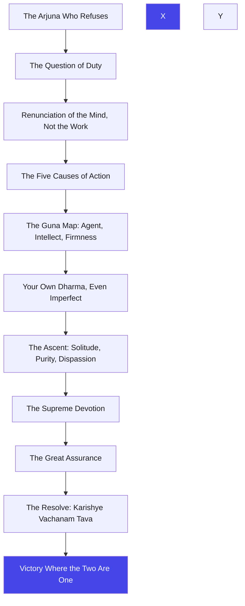
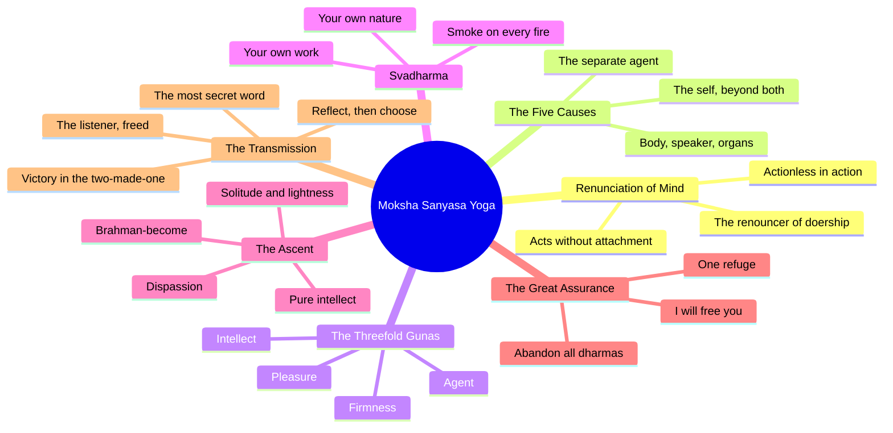

# Chapter 18: Moksha Sanyasa Yoga — Drop the doer, keep the work, and freedom finds you

> "The Gita does not end with a theory. It ends with a bow: do your duty, drop your doer, and let the whole move through you."
> — The Osho Way

---

Seventeen chapters have been spoken. The bow has been strung, the question asked, the mirror held, the faith classified — and now, in the eighteenth chapter, Krishna gathers the whole teaching and gives it one final turn. Arjuna's last question is about the two great words of the spiritual life: sannyasa and tyaga — renunciation and abandonment. Are they the same? Must a man leave the world to be free? The question is the last veil, and Krishna tears it with the answer that is the heartbeat of the whole Gita: you do not renounce action; you renounce the attachment to its fruit. The world is not your prison; your possessiveness is.

This is the summary chapter, and Osho reads it as the Gita's own meditation on its message. Everything returns here: the three gunas (now applied to knowledge, action, agent, intellect, firmness and happiness), karma yoga (the five causes of action, the svadharma of the four natures), bhakti yoga (the refuge, the devotion, the supreme word), and jnana yoga (the purity of intellect that ends in Brahman). The chapter is a cathedral in which every arch of the previous seventeen finds its keystone. But it is not a textbook summary — it is a farewell. Krishna is about to stop speaking, and he wants every word to land.

Osho's favorite irony in this chapter is the place of renunciation in it. Krishna says: renunciation is threefold — tamasic renunciation abandons duty out of delusion, rajasic renunciation abandons work because it is painful, and sattvic renunciation abandons nothing but the clinging. The true sannyasi, the truly free man, is not the one who has left the battlefield — it is the one who stands on the battlefield and is no longer the doer. "He who is free from the egoistic notion, though he slays these people, slays not, nor is he bound" (18.17). Freedom is not a geography; it is an inward emptiness through which action flows without a trace.

And the chapter ends as all great farewells end — with the personal. Krishna says: "Fix your mind on Me, be My devotee, bow to Me — you shall come to Me, truly I promise you, for you are dear to Me" (18.65), and then the most famous verse in the Gita: "Abandoning all dharmas, come to Me as your only refuge; I will free you from all sins — grieve not" (18.66). Arjuna's answer is the completion of the whole book: "My delusion is destroyed; I stand free of doubt; I will act according to Your word" (18.73). And Sanjaya's witness, and the last verse: wherever there is Krishna and Arjuna, there is victory. Osho would say: the whole Gita is one movement from Arjuna's "I will not fight" to Arjuna's "I will act" — and the only thing that changed between the two was not the world, but the seeing. That change is the whole teaching, and it is available to you in this very moment.

## Learning Objectives

After completing this chapter you will be able to:

1. **Distinguish sannyasa from tyaga** — understand renunciation of desire-laden actions versus abandonment of the fruits of all actions (18.2), and the threefold classification of tyaga (18.4–18.9).
2. **Apply the five causes of action** — analyze any action through the five factors of 18.13–18.15 and dissolve the false sense of doership that binds.
3. **Classify by guna across life** — evaluate knowledge, action, agent, intellect, firmness and happiness as sattvic, rajasic or tamasic, and locate your own mix (18.19–18.39).
4. **Live your svadharma** — understand the four natures (18.41–18.48) as temperaments of guna, not birth certificates, and the law that your own flawed duty is better than another's perfect one.
5. **Walk the path to liberation** — follow the sequence from purity of intellect and solitude through devotion to surrender (18.49–18.66), and hear the supreme promise of 18.66.
6. **Build a TypeScript tool** — a **Karma Action Analyzer** that models the five causes of action and classifies any action and agent by guna.

---

## Moksha Sanyasa Yoga at a Glance

### The scene and the speakers

This is the final teaching of Krishna on the chariot at Kurukshetra. Arjuna asks the last question of the Gita — about the truth of sannyasa and tyaga (18.1) — and Krishna answers with the longest single teaching of the book: seventy-eight shlokas that compress the entire message of the eighteen chapters. After this, Arjuna declares his delusion destroyed (18.73), and the narration returns to Sanjaya, who describes the dialogue to Dhritarashtra and closes the Gita with the famous verses of victory (18.74–18.78). The Mahabharata context is essential: this conversation happens in the middle of the war, between battles, and the final word of the Gita is not "renounce" but "act."

### The Osho lens

Osho reads chapter eighteen as the Gita's last joke on the spiritual seeker. The seeker thinks liberation is a leaving — of the world, of action, of life. Krishna says: liberation is a seeing. The threefold renunciation is not about what you abandon but about how you hold it: from delusion (tamas), from pain (rajas), or from clarity (sattva). The truly free man does everything and is touched by nothing, because the doer has dissolved. And the climax — "abandon all dharmas, take refuge in Me" — is not a command to surrender your intelligence; it is the last step of the witness: even your ideas about being good must be released into the whole. Freedom is not something you achieve; it is something you allow.

### The structure of the chapter

The longest chapter of the Gita moves in six clear movements:

1. **Movement 1: 18.1–18.12** — Sannyasa and tyaga: their difference, the threefold renunciation, and the freedom of the true tyagi.
2. **Movement 2: 18.13–18.17** — The five causes of every action and the dissolution of doership.
3. **Movement 3: 18.18–18.39** — Knowledge, action, agent, intellect, firmness and happiness — each threefold by guna.
4. **Movement 4: 18.40–18.48** — No being escapes the gunas; the four natures and their svadharma; the superiority of one's own duty.
5. **Movement 5: 18.49–18.66** — The path to Brahman: purity, solitude, renunciation of ego, devotion, surrender, and the supreme promise.
6. **Movement 6: 18.67–18.78** — Who may receive the teaching, the merit of teaching it, Arjuna's transformation, and Sanjaya's closing witness.

### The three-framework note

Chapter eighteen is the synthesis of the three yogas. Karma yoga: the five causes, the svadharma, the sattvic action without attachment. Bhakti yoga: devotion as the means of knowing (18.55), the refuge (18.62), the supreme word and the promise (18.65–18.66). Jnana yoga: the pure intellect (18.51), the dissolution of doership, the becoming of Brahman (18.54). And over all three sits the final frame of the gunas — the reminder of chapter fourteen that everything in the play of nature is threefold, and freedom lies in transcending the three. The Gita closes its circle: it began with a warrior who would not act, and it ends with a warrior who will act without a doer.

## Traditional Reading vs Osho-Style Reading

| Dimension | Traditional reading | Osho-style reading |
|--------|---------------------|--------------------|
| **Sannyasa vs tyaga (18.2)** | Two technical stages of the monastic path | Two inner gestures — sannyasa lets go of craving, tyaga lets go of the fruits; both can happen inside a householder's day |
| **Renunciation (18.4–18.9)** | Leaving action as the highest virtue | The highest is sattvic tyaga: dropping attachment, not dropping work; freedom in action, not freedom from action |
| **The five causes (18.13–18.17)** | A metaphysical explanation of karma | A psychological mirror: when you see all the causes, the "I" that claims doership is exposed as fiction |
| **Varna and svadharma (18.41–18.48)** | Caste duties fixed by birth | Temperaments of guna; your own flawed nature-dharma is better than an imitated perfection |
| **"Abandon all dharmas" (18.66)** | A final surrender to Krishna as God | The last step of the witness: release even your self-image, and let the whole act through you |

## The Complete Text — All 78 Shlokas

### Shloka 18.1 — The Last Question

> अर्जुन उवाच |
> संन्यासस्य महाबाहो तत्त्वमिच्छामि वेदितुम् |
> त्यागस्य च हृषीकेश पृथक्केशिनिषूदन

**Transliteration:** arjuna uvāca | saṃnyāsasya mahābāho tattvamicchāmi veditum | tyāgasya ca hṛṣīkeśa pṛthakkeśiniṣūdana

**Translation:** Arjuna said: I wish to know the essence of renunciation, O mighty-armed, and of abandonment, O Hrishikesha, O slayer of Kesi — separately.

**Osho Darshan:** The last question of the disciple is about leaving. Osho would say: it is the eternal question — "must I renounce the world?" — and every seeker asks it sooner or later. But notice the words Arjuna uses: he wants the tattva, the essence, of the two words separately. He suspects they are not the same, and he is right. The Gita is about to draw the finest line in the spiritual life: the line between leaving the world and leaving the clinging. Arjuna still thinks in terms of geography — this side or that side. Krishna will teach him that freedom has no address.

### Shloka 18.2 — Two Words, One Freedom

> श्रीभगवानुवाच |
> काम्यानां कर्मणां न्यासं संन्यासं कवयो विदुः |
> सर्वकर्मफलत्यागं प्राहुस्त्यागं विचक्षणाः

**Transliteration:** śrībhagavānuvāca | kāmyānāṃ karmaṇāṃ nyāsaṃ saṃnyāsaṃ kavayo viduḥ | sarvakarmaphalatyāgaṃ prāhustyāgaṃ vicakṣaṇāḥ

**Translation:** The Blessed Lord said: The sages understand sannyasa as the renunciation of actions done for desire; the wise declare tyaga to be the abandonment of the fruits of all actions.

**Osho Darshan:** The two words are one freedom viewed from two sides. Sannyasa gives up the actions that desire commands; tyaga gives up the fruits that action produces. Osho would say: the first is the letting-go of craving, the second is the letting-go of expectation — and between them they dissolve the whole mechanism of bondage. You do not need to leave your home to practice either. The householder who works without craving and without claiming the fruit is a sannyasi of the highest order, though he never changes his clothes. Renunciation is not an outer event; it is an inner chemistry.

### Shloka 18.3 — The Philosophers Disagree

> त्याज्यं दोषवदित्येके कर्म प्राहुर्मनीषिणः |
> यज्ञदानतपःकर्म न त्याज्यमिति चापरे

**Transliteration:** tyājyaṃ doṣavadityeke karma prāhurmanīṣiṇaḥ | yajñadānatapaḥkarma na tyājyamiti cāpare

**Translation:** Some philosophers declare that action should be abandoned as an evil; others declare that acts of sacrifice, giving and austerity should never be abandoned.

**Osho Darshan:** The philosophers have always disagreed — some say all action is bondage, others say good action is liberation. Osho would say: both are half-right and both are half-asleep. Action is not bondage, and action is not liberation; attachment is bondage, and clarity is liberation. The Gita refuses both camps and offers the third way: act, but act without the doer. The debate about renunciation is the oldest philosophical furniture, and Krishna sweeps it aside in one line. The question is never whether to act; the question is who acts — and whether a witness or a greedy ghost sits at the wheel.

### Shloka 18.4 — The Threefold Renunciation

> निश्चयं शृणु मे तत्र त्यागे भरतसत्तम |
> त्यागो हि पुरुषव्याघ्र त्रिविधः सम्प्रकीर्तितः

**Transliteration:** niścayaṃ śṛṇu me tatra tyāge bharatasattama | tyāgo hi puruṣavyāghra trividhaḥ samprakīrtitaḥ

**Translation:** Hear from Me the conclusion on this abandonment, O best of the Bharatas; for renunciation, O best of men, is declared to be threefold.

**Osho Darshan:** Krishna does what only a master can do: he ends the philosophers' debate with a verdict. Renunciation is threefold — and the three kinds are not three actions but three motivations. Osho would say: the same act of leaving can be born of delusion, of pain, or of clarity, and the act takes its character from its birth. A man can leave his job, his city, even his family from any of the three — and the leaving itself tells you nothing; only the inner direction does. Before you ever judge an act of renunciation, ask what the renouncer is running from — and what he is running toward.

### Shloka 18.5 — The Purifying Three

> यज्ञदानतपःकर्म न त्याज्यं कार्यमेव तत् |
> यज्ञो दानं तपश्चैव पावनानि मनीषिणाम्

**Transliteration:** yajñadānatapaḥkarma na tyājyaṃ kāryameva tat | yajño dānaṃ tapaścaiva pāvanāni manīṣiṇām

**Translation:** Acts of sacrifice, giving and austerity are not to be abandoned; they must be performed. Sacrifice, giving and austerity purify even the wise.

**Osho Darshan:** The verdict is blunt: do not abandon the purifying three. Osho would say: sacrifice, giving and austerity are not debts to the past; they are the polishing of the present. They purify — not because the universe keeps accounts, but because they turn the doer outward and upward: the sacrifice breaks your grip on things, the giving breaks your grip on accumulation, the austerity breaks your grip on comfort. A man who abandons these in the name of renunciation has renounced the wrong things. Keep the three acts; drop only the greed that can attach itself to them.

### Shloka 18.6 — Perform, Without the Price

> एतान्यपि तु कर्माणि सङ्गं त्यक्त्वा फलानि च |
> कर्तव्यानीति मे पार्थ निश्चितं मतमुत्तमम्

**Transliteration:** etānyapi tu karmāṇi saṅgaṃ tyaktvā phalāni ca | kartavyānīti me pārtha niścitaṃ matamuttamam

**Translation:** But even these actions should be performed, O Partha, leaving aside attachment and the fruits — this is My certain and best conviction.

**Osho Darshan:** The whole of karma yoga in one sentence: act, and leave the attachment with the act. Osho would say: the world's tragedy is that most people act without acting — they are possessed by the act, not present in it — and the renouncer's tragedy is that he stops acting altogether. The Gita's way is the narrow ridge between the two: total action with zero attachment. The sacrifice is offered and forgotten; the gift is given and released; the austerity is done and dissolved. What remains is not a ledger but a clarity. This "certain and best conviction" is the axis on which the whole Gita turns.

### Shloka 18.7 — The Tamasic Abandonment

> नियतस्य तु संन्यासः कर्मणो नोपपद्यते |
> मोहात्तस्य परित्यागस्तामसः परिकीर्तितः

**Transliteration:** niyatasya tu saṃnyāsaḥ karmaṇo nopapadyate | mohāttasya parityāgastāmasaḥ parikīrtitaḥ

**Translation:** The renunciation of obligatory action is not proper; its abandonment from delusion is declared tamasic.

**Osho Darshan:** To drop what must be done, out of delusion, is not renunciation — it is sleep disguised as spirituality. Osho would say: the man who abandons his duty because he has convinced himself that "worldly work is bondage" is usually abandoning the very ground of his growth. The delusion is the belief that escape is freedom. You can escape your office and still carry your whole inner machinery with you — the same ambitions, the same fears, a new address. The tamasic abandonment is the most comfortable lie of the spiritual marketplace: renunciation as an excuse. The first test of any renunciation: is it running from work, or releasing the grip on fruit?

### Shloka 18.8 — The Rajasic Abandonment

> दुःखमित्येव यत्कर्म कायक्लेशभयात्त्यजेत् |
> स कृत्वा राजसं त्यागं नैव त्यागफलं लभेत्

**Transliteration:** duḥkhamityeva yatkarma kāyakleśabhayāttyajet | sa kṛtvā rājasaṃ tyāgaṃ naiva tyāgaphalaṃ labhet

**Translation:** He who abandons action because it is painful, out of fear of bodily trouble — performing such rajasic renunciation, he never gains the fruit of renunciation.

**Osho Darshan:** The second kind of renunciation is the quitting of the weary: "this work is painful, I will leave it." Osho would say: the rajasic renouncer is not a seeker; he is a tired man who has given his fatigue a holy name. He abandons the work — and the fruit of renunciation eludes him, because he has renounced the work, not the clinging. He will carry the clinging into the next work, and the next. The test is simple: if your renunciation is a relief from effort, it is rajasic. The sattvic renunciation is not a relief from effort; it is a relief from grasping — the work continues, the effort continues, only the suffering stops.

### Shloka 18.9 — The Sattvic Abandonment

> कार्यमित्येव यत्कर्म नियतं क्रियतेऽर्जुन |
> सङ्गं त्यक्त्वा फलं चैव स त्यागः सात्त्विको मतः

**Transliteration:** kāryamityeva yatkarma niyataṃ kriyate.arjuna | saṅgaṃ tyaktvā phalaṃ caiva sa tyāgaḥ sāttviko mataḥ

**Translation:** Whatever obligatory action is done, O Arjuna, simply because it ought to be done — abandoning attachment and fruit — that abandonment is regarded as sattvic.

**Osho Darshan:** The sattvic renunciation is invisible: nothing is dropped except clinging. Osho would say: here is the Gita's portrait of the free man — he does what must be done because it must be done; the act is its own meaning; no reward waits in his imagination, no fear pulls his hand. His renunciation is not an event; it is the climate of his whole life. He renounces the fruit, not the field. And because nothing is claimed, nothing can bind. This is the deepest secret of action: the act performed without the doer and without the fruit leaves no footprint — and the man who leaves no footprint is everywhere free.

### Shloka 18.10 — The Tyrant-Free Doer

> न द्वेष्ट्यकुशलं कर्म कुशले नानुषज्जते |
> त्यागी सत्त्वसमाविष्टो मेधावी छिन्नसंशयः

**Transliteration:** na dveṣṭyakuśalaṃ karma kuśale nānuṣajjate | tyāgī sattvasamāviṣṭo medhāvī chinnasaṃśayaḥ

**Translation:** He who hates no disagreeable work and is attached to no agreeable one — that renouncer, suffused with sattva, intelligent, his doubts cut asunder —

**Osho Darshan:** The verse is a portrait in the negative: the free man is described by what he does not feel. No hatred for the unpleasant, no attachment to the pleasant. Osho would say: you can measure a man's freedom by his reaction to a dull task — the bound man resents it, the free man simply does it. His doubts are cut asunder not because he has found the perfect doctrine but because he has stopped asking the world to justify his work. His intelligence is not cleverness; it is the clarity of a man who is no longer in the grip of like and dislike. He has become pure capacity — and the whole work moves through him.

### Shloka 18.11 — No Escape From Action

> न हि देहभृता शक्यं त्यक्तुं कर्माण्यशेषतः |
> यस्तु कर्मफलत्यागी स त्यागीत्यभिधीयते

**Transliteration:** na hi dehabhṛtā śakyaṃ tyaktuṃ karmāṇyaśeṣataḥ | yastu karmaphalatyāgī sa tyāgītyabhidhīyate

**Translation:** Verily, no embodied being can abandon actions entirely; but he who abandons the fruits of actions is truly called a renouncer.

**Osho Darshan:** The final argument against escapism: you cannot stop acting — breathing is action, digesting is action, thinking is action. Osho would say: the dream of total inaction is the fantasy of the tired, and it is physiologically impossible. Even the man in the cave breathes, and the breath is an act. So the Gita changes the whole question: since you must act, renounce the only thing that can be renounced — the claim on the fruit. The true tyagi is not the idle man but the man whose work leaves him untouched. Freedom is not the end of action; it is the end of the actor's anxiety.

### Shloka 18.12 — Fruit for the Non-Abandoner

> अनिष्टमिष्टं मिश्रं च त्रिविधं कर्मणः फलम् |
> भवत्यत्यागिनां प्रेत्य न तु संन्यासिनां क्वचित्

**Transliteration:** aniṣṭamiṣṭaṃ miśraṃ ca trividhaṃ karmaṇaḥ phalam | bhavatyatyāgināṃ pretya na tu saṃnyāsināṃ kvacit

**Translation:** The threefold fruit of action — unwished, wished and mixed — accrues after death to the non-abandoners, but never to the renouncers.

**Osho Darshan:** The fruit — good, bad, mixed — belongs to those who claim the work; the renouncer's work leaves no residue. Osho would say: think of karma as a ledger. The man who acts with the "I" and the "mine" writes every act into the ledger, and the ledger follows him like a shadow. The renouncer acts and does not write; his acts exist and vanish like ripples — movement without record. This is not a doctrine of bookkeeping in heaven; it is the psychology of attention. What you claim, you carry. Drop the claim, and the carrying ends — here and now, not only after death.

### Shloka 18.13 — The Five Causes

> पञ्चैतानि महाबाहो कारणानि निबोध मे |
> साङ्ख्ये कृतान्ते प्रोक्तानि सिद्धये सर्वकर्मणाम्

**Transliteration:** pañcaitāni mahābāho kāraṇāni nibodha me | sāṅkhye kṛtānte proktāni siddhaye sarvakarmaṇām

**Translation:** Learn from Me, O mighty-armed, these five causes, declared in the Sankhya system, for the accomplishment of all actions.

**Osho Darshan:** Now Krishna gives the deepest analysis of action in the Gita: every act has five causes, and the ego is not among them. Osho would say: this is the philosophical demolition of the "I." When you examine any action honestly — your promotion, your quarrel, your prayer — you find the body, the senses, the mind, the circumstances, the unseen. Where in the assembly is the "I" that takes all the credit? It appears only after the fact, claiming a throne it never occupied. The five causes are the Gita's gift to the psychologist: an anatomy of action that leaves the ego without a corner to stand in.

### Shloka 18.14 — The Five Named

> अधिष्ठानं तथा कर्ता करणं च पृथग्विधम् |
> विविधाश्च पृथक्चेष्टा दैवं चैवात्र पञ्चमम्

**Transliteration:** adhiṣṭhānaṃ tathā kartā karaṇaṃ ca pṛthagvidham | vividhāśca pṛthakceṣṭā daivaṃ caivātra pañcamam

**Translation:** The seat, the doer, the various instruments, the many distinct functions, and the divine destiny as the fifth.

**Osho Darshan:** The five causes, named: the body that hosts the act, the doer that animates it, the senses that serve it, the varied efforts that shape it, and daiva — the invisible factor, the whole's permission. Osho would say: notice what the list does not contain — no independent, free-floating ego. The "doer" here is the animating presence, not the self-congratulating ghost. And daiva is the Gita's humility: even the most willful act rides on circumstances you did not create. The five causes are a meditation: sit with any act of your past and try to find the moment when "you" alone decided it. You will not find it.

### Shloka 18.15 — Whatever You Do With Body, Speech, Mind

> शरीरवाङ्मनोभिर्यत्कर्म प्रारभते नरः |
> न्याय्यं वा विपरीतं वा पञ्चैते तस्य हेतवः

**Transliteration:** śarīravāṅmanobhiryatkarma prārabhate naraḥ | nyāyyaṃ vā viparītaṃ vā pañcaite tasya hetavaḥ

**Translation:** Whatever action a man undertakes with body, speech or mind — whether right or the reverse — these five are its causes.

**Osho Darshan:** The five causes govern every act — good and bad alike — so the verdict is universal: no act has a single author. Osho would say: this is not a philosophy of fate but a philosophy of freedom. If you are the sole author, you are trapped in the consequences; if the act is a fivefold play, you can step out of the authorial chair and watch. The man who sees the five causes is no longer the proud doer and no longer the guilty doer — he becomes the witness of the doer. And in that witnessing, the chain of karma loses its last link: the conviction that "I did this."

### Shloka 18.16 — The Man Who Sees Wrongly

> तत्रैवं सति कर्तारमात्मानं केवलं तु यः |
> पश्यत्यकृतबुद्धित्वान्न स पश्यति दुर्मतिः

**Transliteration:** tatraivaṃ sati kartāramātmānaṃ kevalaṃ tu yaḥ | paśyatyakṛtabuddhitvānna sa paśyati durmatiḥ

**Translation:** This being so, he who — through untrained understanding — sees the isolated Self as the sole agent, that man of perverted intelligence does not see.

**Osho Darshan:** The wrong vision is defined: seeing the pure Self as the doer of actions. Osho would say: this is the birth of all guilt and all pride — the mistaken identification of the watcher with the worker. The Self is the seer, never the doer; action belongs to the machinery of nature. The man of untrained understanding looks at his achievement and says "I did this" — and the "I" that claims is the fiction that karma binds. The correction is not philosophical gymnastics; it is simple watching: do a task and observe — the thoughts rise, the hands move, and the witness never lifted a finger. Train that sight, and doership dissolves.

### Shloka 18.17 — The One Who Kills Yet Kills Not

> यस्य नाहंकृतो भावो बुद्धिर्यस्य न लिप्यते |
> हत्वाऽपि स इमाँल्लोकान्न हन्ति न निबध्यते

**Transliteration:** yasya nāhaṃkṛto bhāvo buddhiryasya na lipyate | hatvā.api sa imā.Nllokānna hanti na nibadhyate

**Translation:** He who is free of the egoistic notion, whose intelligence is not tainted — though he slay these people, he slays not, nor is he bound.

**Osho Darshan:** The most dangerous verse in the Gita — and the most liberating. Osho would say: this is not a license for murder; it is a declaration that the ego, not the act, is what binds. The executioner who hangs a criminal acts for the state; the surgeon who cuts a body acts for health; both are untouched because neither acts for the "I." The ego-less act is not an act at all — it is the whole moving through an empty channel. But beware: this verse is a mirror, not a shield. Only the man whose buddhi is actually untainted can read it without harm. The rest of us must first become that man — and the way is watching.

### Shloka 18.18 — The Triad of Knowledge

> ज्ञानं ज्ञेयं परिज्ञाता त्रिविधा कर्मचोदना |
> करणं कर्म कर्तेति त्रिविधः कर्मसंग्रहः

**Transliteration:** jñānaṃ jñeyaṃ parijñātā trividhā karmacodanā | karaṇaṃ karma karteti trividhaḥ karmasaṃgrahaḥ

**Translation:** Knowledge, the knowable and the knower form the threefold impulse to action; the instrument, the act and the agent form the threefold basis of action.

**Osho Darshan:** The triad of knowing — knower, knowing, known — and the triad of doing — agent, instrument, act. Osho would say: the Gita now lays bare the grammar of experience: every moment of consciousness is a triangle, and the triangle collapses when the witness awakens. The whole drama of the world is these two triads interlocking — and the ego lives on the myth that it is the fixed knower and the fixed agent. But watch: the knower changes with every object, the agent with every act. There is no fixed "I" in either triad; only the empty witnessing that holds the triads together. That emptiness is your freedom.

### Shloka 18.19 — Gunas Sort Everything

> ज्ञानं कर्म च कर्ताच त्रिधैव गुणभेदतः |
> प्रोच्यते गुणसङ्ख्याने यथावच्छृणु तान्यपि

**Transliteration:** jñānaṃ karma ca kartāca tridhaiva guṇabhedataḥ | procyate guṇasaṅkhyāne yathāvacchṛṇu tānyapi

**Translation:** Knowledge, action and agent are declared in the science of the gunas to be threefold only, according to their distinction by the gunas. Hear them duly.

**Osho Darshan:** The great classification now unfolds: even knowledge itself is threefold — because knowledge is not a picture of the world but a tinted glass, and the tint is the guna. Osho would say: two men watch the same sunset; one feels reverence, one feels hunger for ownership, one feels nothing. The world is one; the seeing is three. The gunas do not divide the world; they divide the eyes. This is the most radical relativism the Gita offers — not the relativism that says truth does not exist, but the relativism that says truth is seen through a lens, and the lens can be polished. Sattva is the polish.

### Shloka 18.20 — Knowledge That Sees One

> सर्वभूतेषु येनैकं भावमव्ययमीक्षते |
> अविभक्तं विभक्तेषु तज्ज्ञानं विद्धि सात्त्विकम्

**Transliteration:** sarvabhūteṣu yenaikaṃ bhāvamavyayamīkṣate | avibhaktaṃ vibhakteṣu tajjñānaṃ viddhi sāttvikam

**Translation:** That by which one sees the one indestructible reality in all beings — undivided in the divided — know that knowledge to be sattvic.

**Osho Darshan:** The sattvic knowledge sees one being in the many. Osho would say: this is not a mystical claim reserved for sages; it is the natural vision of a quiet mind. When the inner noise falls, the boundary between yourself and the other begins to soften — you feel the stranger's hunger as a distant echo, the tree's sway as a cousin motion. The undivided in the divided is not a theory; it is a taste. And it is the end of all cruelty, because no one harms an "other" once the one is seen. The sattvic knowledge is the only knowledge that changes the knower — all other knowledge only changes his resume.

### Shloka 18.21 — Knowledge That Sees Many

> पृथक्त्वेन तु यज्ज्ञानं नानाभावान्पृथग्विधान् |
> वेत्ति सर्वेषु भूतेषु तज्ज्ञानं विद्धि राजसम्

**Transliteration:** pṛthaktvena tu yajjñānaṃ nānābhāvānpṛthagvidhān | vetti sarveṣu bhūteṣu tajjñānaṃ viddhi rājasam

**Translation:** But that knowledge which sees in all beings entities of distinct kinds, separate from one another — know that knowledge to be rajasic.

**Osho Darshan:** The rajasic knowledge sees the many and only the many — and, Osho would say, it is the knowledge of the marketplace: mine and yours, higher and lower, friend and foe. It is not false knowledge; it is partial knowledge, knowledge at the service of separation. It classifies, competes, compares — it is the knowledge that builds careers and wars. The tragedy is not that it sees differences (differences are real enough in the marketplace) but that it never looks past them. The rajasic mind is brilliant at the parts and blind to the whole. It is the knowledge of the analyst who has dissected the bird and wonders why it no longer sings.

### Shloka 18.22 — Knowledge That Clings

> यत्तु कृत्स्नवदेकस्मिन्कार्ये सक्तमहैतुकम् |
> अतत्त्वार्थवदल्पं च तत्तामसमुदाहृतम्

**Transliteration:** yattu kṛtsnavadekasminkārye saktamahaitukam | atattvārthavadalpaṃ ca tattāmasamudāhṛtam

**Translation:** But that which clings to one single effect as if it were the whole — without reason, without foundation in truth, and trivial — that is declared tamasic.

**Osho Darshan:** The tamasic knowledge grabs one thing — a body, a doctrine, an idol — and shouts "this is all!" Osho would say: this is the knowledge of the fundamentalist of every kind: the body-identified man, the ritual-obsessed man, the man who mistakes his little creed for the cosmos. It is clinging without reason — ahtaitukam — and it is alpa, small, because it makes the world smaller than it is. The tamasic mind shrinks reality to fit its grip. And here is the practical test: knowledge that makes you smaller, harder, more certain and less kind is tamasic, whatever its source; knowledge that makes you lighter, more seeing and more tender is sattvic.

### Shloka 18.23 — Sattvic Action

> नियतं सङ्गरहितमरागद्वेषतः कृतम् |
> अफलप्रेप्सुना कर्म यत्तत्सात्त्विकमुच्यते

**Transliteration:** niyataṃ saṅgarahitamarāgadveṣataḥ kṛtam | aphalaprepsunā karma yattatsāttvikamucyate

**Translation:** The action that is ordained, free from attachment, done without love or hatred, by one who desires no fruit — that action is declared sattvic.

**Osho Darshan:** The sattvic action has three marks: it is appropriate to the moment, it is free of attachment, and the doer does not crave the result. Osho would say: notice that love and hatred are both absent — the sattvic doer does not act because he loves the task or hates the alternative; he acts because the act is right. He is not a passionless stone; he is a man whose passions have dissolved into clarity. The sattvic action is the action of a whole person: no inner conflict, no second thoughts, no bargaining. It is done — and in its doing, the doer is healed.

### Shloka 18.24 — Rajasic Action

> यत्तु कामेप्सुना कर्म साहंकारेण वा पुनः |
> क्रियते बहुलायासं तद्राजसमुदाहृतम्

**Transliteration:** yattu kāmepsunā karma sāhaṃkāreṇa vā punaḥ | kriyate bahulāyāsaṃ tadrājasamudāhṛtam

**Translation:** But the action done by one longing for desires, or with egoism, with great strain and effort — that is declared rajasic.

**Osho Darshan:** The rajasic action is the labor of the hungry: done for a desire, inflated by the ego, and marked by bahula-ayasa — great effort, strain, exhaustion. Osho would say: watch the rajasic worker — he is always busy and always tired, because his effort is doubled: the effort of doing and the effort of wanting. The sattvic doer spends one unit of energy on the act; the rajasic doer spends three — the act, the ambition, and the anxiety. His work succeeds often, but it never satisfies, because no amount of success can fill a desire. The rajasic man is the hero of the office and the prisoner of his own drive.

### Shloka 18.25 — Tamasic Action

> अनुबन्धं क्षयं हिंसामनपेक्ष्य च पौरुषम् |
> मोहादारभ्यते कर्म यत्तत्तामसमुच्यते

**Transliteration:** anubandhaṃ kṣayaṃ hiṃsāmanapekṣya ca pauruṣam | mohādārabhyate karma yattattāmasamucyate

**Translation:** The action undertaken from delusion, without regard for its consequences, its cost, its harm, or one's own capacity — that is declared tamasic.

**Osho Darshan:** The tamasic action is the leap without looking: no thought of consequences, no count of the cost, no care for the harm, no measure of one's own strength. Osho would say: this is the action of the drunk — drunk not only on alcohol but on anger, on gambling, on impulse. It is the impulsive email sent at midnight, the loan taken in desperation, the promise made in rage. The tamasic doer is not evil by choice; he is blind by habit. The remedy is the pause — the single breath between impulse and act, in which the consequences, the cost, the harm and the capacity all become visible. One pause can save a lifetime.

### Shloka 18.26 — The Sattvic Agent

> मुक्तसङ्गोऽनहंवादी धृत्युत्साहसमन्वितः |
> सिद्ध्यसिद्ध्योर्निर्विकारः कर्ता सात्त्विक उच्यते

**Transliteration:** muktasaṅgo.anahaṃvādī dhṛtyutsāhasamanvitaḥ | siddhyasiddhyornirvikāraḥ kartā sāttvika ucyate

**Translation:** The agent who is free from attachment, non-egoistic, endowed with firmness and enthusiasm, and unmoved by success and failure — he is called sattvic.

**Osho Darshan:** Here is the portrait of the sattvic agent — and note the beautiful combination: he is non-egoistic, yet full of enthusiasm; he claims nothing, yet he works with fire. Osho would say: this is the paradox of the awakened worker — total commitment without attachment. His enthusiasm is not ambition; it is aliveness itself. And he is unmoved by success and failure — not because he is cold, but because his center is elsewhere: in the doing, not in the score. The sattvic agent is the rare person who works like a master and remains like a child — absorbed, surrendered, and completely free.

### Shloka 18.27 — The Rajasic Agent

> रागी कर्मफलप्रेप्सुर्लुब्धो हिंसात्मकोऽशुचिः |
> हर्षशोकान्वितः कर्ता राजसः परिकीर्तितः

**Transliteration:** rāgī karmaphalaprepsurlubdho hiṃsātmako.aśuciḥ | harṣaśokānvitaḥ kartā rājasaḥ parikīrtitaḥ

**Translation:** Passionate, desiring the fruit of action, greedy, cruel, impure, moved by joy and sorrow — such an agent is declared rajasic.

**Osho Darshan:** The rajasic agent is the weather of his own desires: elated by success, shattered by failure, greedy for more, quick to harm what blocks him. Osho would say: he is not a villain; he is a man whose center is outside himself — in the result — and a man whose center is outside is a leaf in any wind. His joy and his sorrow are both borrowed from events. The purification that frees him is not moral scolding but centering: daily practice of watching the breath, the thought, the desire — until the watcher grows stronger than the weather. The rajasic agent is the most hopeful figure in the Gita, because his energy is enormous; it only needs a center.

### Shloka 18.28 — The Tamasic Agent

> अयुक्तः प्राकृतः स्तब्धः शठो नैष्कृतिकोऽलसः |
> विषादी दीर्घसूत्री च कर्ता तामस उच्यते

**Transliteration:** ayuktaḥ prākṛtaḥ stabdhaḥ śaṭho naiṣkṛtiko.alasaḥ | viṣādī dīrghasūtrī ca kartā tāmasa ucyate

**Translation:** Unsteady, vulgar, stubborn, deceitful, malicious, lazy, despondent and procrastinating — such an agent is called tamasic.

**Osho Darshan:** Eight adjectives, one portrait: the man who cannot begin, cannot finish, cannot be trusted, and cannot even enjoy his own failure — he is despondent and procrastinating, the two partners of the unawake. Osho would say: the tamasic agent is not evil; he is absent. His body is present, but his attention is elsewhere, so nothing he does is real. The Gita's remedy for tamas is not willpower but presence — small, honest tasks done with full attention until attention becomes a habit. The tamasic agent is the man who has never once been whole in an act. The first whole act is his liberation.

### Shloka 18.29 — Intellect and Firmness

> बुद्धेर्भेदं धृतेश्चैव गुणतस्त्रिविधं शृणु |
> प्रोच्यमानमशेषेण पृथक्त्वेन धनञ्जय

**Transliteration:** buddherbhedaṃ dhṛteścaiva guṇatastrividhaṃ śṛṇu | procyamānamaśeṣeṇa pṛthaktvena dhanañjaya

**Translation:** Hear the threefold division of intellect and of firmness according to the gunas, as I declare them fully and distinctly, O Dhananjaya.

**Osho Darshan:** Krishna now turns from the hands to the head and the spine: intellect and firmness — the power to discriminate and the power to stand. Osho would say: these are the two pillars of the inner man. Intelligence without firmness is a flame in the wind; firmness without intelligence is a stone on the road. The Gita will now classify both — because even the pillars are threefold, and you must know which pillar you are building with. The work of meditation is precisely this: to make the intellect discriminating and the firmness unshakeable — a clear eye and a steady hand.

### Shloka 18.30 — The Sattvic Intellect

> प्रवृत्तिं च निवृत्तिं च कार्याकार्ये भयाभये |
> बन्धं मोक्षं च या वेत्ति बुद्धिः सा पार्थ सात्त्विकी

**Transliteration:** pravṛttiṃ ca nivṛttiṃ ca kāryākārye bhayābhaye | bandhaṃ mokṣaṃ ca yā vetti buddhiḥ sā pārtha sāttvikī

**Translation:** The intellect which knows the path of action and the path of renunciation, what is to be done and what is not, fear and fearlessness, bondage and liberation — that intellect, O Partha, is sattvic.

**Osho Darshan:** The sattvic intellect knows the map: when to move and when to stop, what is called for and what is not, what is fear and what is freedom. Osho would say: most people live with a rajasic intellect — it knows only action, never rest — or a tamasic one, which knows neither. The sattvic intellect holds the two in balance, like a rider who knows when to press and when to rein. And notice the deepest item: it knows bondage and liberation — not as doctrines but as states it can taste in itself. The sattvic intellect is the inner compass; it does not need the world to tell it where north is.

### Shloka 18.31 — The Rajasic Intellect

> यया धर्ममधर्मं च कार्यं चाकार्यमेव च |
> अयथावत्प्रजानाति बुद्धिः सा पार्थ राजसी

**Transliteration:** yayā dharmamadharmaṃ ca kāryaṃ cākāryameva ca | ayathāvatprajānāti buddhiḥ sā pārtha rājasī

**Translation:** That by which one understands dharma and adharma, what is to be done and what is not, wrongly and not as they are — that intellect, O Partha, is rajasic.

**Osho Darshan:** The rajasic intellect knows the words — dharma, adharma, duty, prohibition — but knows them wrongly, distorted by desire. Osho would say: this is the intellect of the rationalizer, the most dangerous instrument in the world. It is never short of arguments; it can justify anything because it does not serve truth — it serves the desire of the moment. The same intellect that quotes the scripture in the morning can break it by evening, with perfect logic. The mark of the rajasic intellect is that its conclusions always arrive conveniently. The remedy is not more argument but honesty — the willingness to watch what your reasoning is protecting.

### Shloka 18.32 — The Tamasic Intellect

> अधर्मं धर्ममिति या मन्यते तमसावृता |
> सर्वार्थान्विपरीतांश्च बुद्धिः सा पार्थ तामसी

**Transliteration:** adharmaṃ dharmamiti yā manyate tamasāvṛtā | sarvārthānviparītāṃśca buddhiḥ sā pārtha tāmasī

**Translation:** The intellect which, wrapped in darkness, takes adharma to be dharma and sees all things upside down — that intellect, O Partha, is tamasic.

**Osho Darshan:** The tamasic intellect has the map upside down: wrong looks right, cruelty looks duty, greed looks wisdom. Osho would say: this is the intellect of the asleep — and the tragedy is that it is perfectly confident. The man with the inverted intellect is not in doubt; that is the danger. He has seen the world through a mirror and calls the reflection the original. He cannot be argued with, because his premises are inverted. He can only be reached through a shock — a crisis that cracks the mirror. And that is the secret mercy of every crisis: it is the tamasic intellect's only doorway.

### Shloka 18.33 — The Sattvic Firmness

> धृत्या यया धारयते मनःप्राणेन्द्रियक्रियाः |
> योगेनाव्यभिचारिण्या धृतिः सा पार्थ सात्त्विकी

**Transliteration:** dhṛtyā yayā dhārayate manaḥprāṇendriyakriyāḥ | yogenāvyabhicāriṇyā dhṛtiḥ sā pārtha sāttvikī

**Translation:** The unwavering firmness by which, through yoga, one holds the functions of mind, life-force and senses — that firmness, O Partha, is sattvic.

**Osho Darshan:** The sattvic firmness is not stubbornness; it is the quiet steadiness that holds the inner horses — mind, breath, senses — without a whip. Osho would say: the word is yoga — union — because this firmness does not crush the energies; it collects them. The sattvic man does not fight his mind; he gathers it, again and again, with patience. This is the firmness of the meditator: the spine that sits, the attention that returns, the heart that is not shaken by any news. It is unswerving — avyabhicarini — because it is not rooted in results but in the practice itself.

### Shloka 18.34 — The Rajasic Firmness

> यया तु धर्मकामार्थान्धृत्या धारयतेऽर्जुन |
> प्रसङ्गेन फलाकाङ्क्षी धृतिः सा पार्थ राजसी

**Transliteration:** yayā tu dharmakāmārthāndhṛtyā dhārayate.arjuna | prasaṅgena phalākāṅkṣī dhṛtiḥ sā pārtha rājasī

**Translation:** But the firmness by which one holds fast, from attachment and desire for fruit, to duty, pleasure and wealth — that firmness, O Partha, is rajasic.

**Osho Darshan:** The rajasic firmness is the grip of the determined — it holds on to duty, pleasure and wealth, and it holds on because it is attached. Osho would say: this firmness is real — the rajasic man can be immensely persistent — but its roots are in prasanga, clinging, and phala-akanksha, hunger for fruit. It is the firmness of the climber who will not let go of the rope even to rest. And because it is rooted in attachment, it always ends in anxiety: hold on as you may, the rope will wear. The rajasic firmness is the strength of the clenched fist; the sattvic is the strength of the open hand that contains everything.

### Shloka 18.35 — The Tamasic Firmness

> यया स्वप्नं भयं शोकं विषादं मदमेव च |
> न विमुञ्चति दुर्मेधा धृतिः सा पार्थ तामसी

**Transliteration:** yayā svapnaṃ bhayaṃ śokaṃ viṣādaṃ madameva ca | na vimuñcati durmedhā dhṛtiḥ sā pārtha tāmasī

**Translation:** The firmness by which a dull man does not abandon sleep, fear, grief, despair and conceit — that firmness, O Partha, is tamasic.

**Osho Darshan:** The tamasic firmness is a strange steadfastness: the man is immovably attached to his own sleep, his own fear, his own grief and his own conceit. Osho would say: this is the firmness of the rut — the man who is determined not to change, who holds his misery as if it were a treasure. He will fight for his right to be hopeless. It is the darkest sentence of the chapter: even despair has its stubbornness. And the liberation from it is not effort but seeing — because the moment the man sees that he is clinging to his own chains, the clinging loosens. Awareness is the only force tamas cannot resist.

### Shloka 18.36 — The Threefold Pleasure

> सुखं त्विदानीं त्रिविधं शृणु मे भरतर्षभ |
> अभ्यासाद्रमते यत्र दुःखान्तं च निगच्छति

**Transliteration:** sukhaṃ tvidānīṃ trividhaṃ śṛṇu me bharatarṣabha | abhyāsādramate yatra duḥkhāntaṃ ca nigacchati

**Translation:** And now hear from Me, O lord of the Bharatas, of the threefold pleasure — in which one rejoices by practice and reaches the end of pain.

**Osho Darshan:** The classification ends where life actually happens — in pleasure. Osho would say: the Gita is ruthlessly practical; it knows that every human being is a pursuit of happiness, and it refuses to condemn the pursuit — it only maps it. There is pleasure that leads to the end of pain, and pleasure that leads to more pain, and pleasure that is delusion at both ends. The teaching is not "abandon pleasure" but "know which pleasure you are feeding." The map of pleasure is the last and most intimate test of your gunas, because nobody lies to himself so fluently as the pleasure-seeker.

### Shloka 18.37 — Poison First, Nectar Last

> यत्तदग्रे विषमिव परिणामेऽमृतोपमम् |
> तत्सुखं सात्त्विकं प्रोक्तमात्मबुद्धिप्रसादजम्

**Transliteration:** yattadagre viṣamiva pariṇāme.amṛtopamam | tatsukhaṃ sāttvikaṃ proktamātmabuddhiprasādajam

**Translation:** That which is like poison at first but like nectar in the end — that happiness, born of the clarity of one's own inner intelligence, is declared sattvic.

**Osho Darshan:** The sattvic pleasure is the inverted feast: bitter at the first sip, nectar at the end. Osho would say: this is the pleasure of discipline — the first week of meditation is hard, the first honest look at yourself is painful, the first silent sitting feels like poison. But the man who persists drinks nectar — the calm that no object can give, the clarity that no acquisition can match. It is born of atma-buddhi-prasada — the grace of your own quiet understanding. The world will never advertise this pleasure, because it cannot be sold. It can only be practiced.

### Shloka 18.38 — Nectar First, Poison Last

> विषयेन्द्रियसंयोगाद्यत्तदग्रेऽमृतोपमम् |
> परिणामे विषमिव तत्सुखं राजसं स्मृतम्

**Transliteration:** viṣayendriyasaṃyogādyattadagre.amṛtopamam | pariṇāme viṣamiva tatsukhaṃ rājasaṃ smṛtam

**Translation:** That happiness born of the contact of the senses with their objects, which is like nectar at first and like poison in the end — that is declared rajasic.

**Osho Darshan:** The rajasic pleasure is the advertisement of the senses: nectar on the tongue, poison in the digestion. Osho would say: every sensual delight — the extra glass, the purchased thrill, the orgasm of acquisition — is nectar at the moment of contact and poison in its aftermath: the hangover, the emptiness, the craving for more. The rajasic pleasure is not wrong; it is simply a loan that is repaid with interest. The wise man does not become an enemy of the senses; he becomes a connoisseur of consequences. He tastes the first sip of nectar — and remembers the last taste of the poison.

### Shloka 18.39 — Delusion at Both Ends

> यदग्रे चानुबन्धे च सुखं मोहनमात्मनः |
> निद्रालस्यप्रमादोत्थं तत्तामसमुदाहृतम्

**Transliteration:** yadagre cānubandhe ca sukhaṃ mohanamātmanaḥ | nidrālasyapramādotthaṃ tattāmasamudāhṛtam

**Translation:** The happiness that deludes the self at first and in the end, arising from sleep, indolence and heedlessness — that is declared tamasic.

**Osho Darshan:** The tamasic pleasure is delusion at both ends — the stupor of sleep, the comfort of laziness, the drift of carelessness. Osho would say: this is the pleasure of the closed eyes — the snooze button, the endless scroll, the day that dissolves without a single wakeful act. It is sweet while it lasts and emptier after, and its signature is that it leaves the self more deluded: heavier, duller, farther from its own depth. The tamasic pleasure is not attacked by the Gita; it is simply exposed — the way light exposes dust. The first step out is one honest question: is this delighting me, or is it anesthetizing me?

### Shloka 18.40 — No One Escapes the Gunas

> न तदस्ति पृथिव्यां वा दिवि देवेषु वा पुनः |
> सत्त्वं प्रकृतिजैर्मुक्तं यदेभिः स्यात्त्रिभिर्गुणैः

**Transliteration:** na tadasti pṛthivyāṃ vā divi deveṣu vā punaḥ | sattvaṃ prakṛtijairmuktaṃ yadebhiḥ syāttribhirguṇaiḥ

**Translation:** There is no being on earth, nor again in heaven among the gods, that is free from the three gunas born of nature.

**Osho Darshan:** The universality of the gunas: no one — not the gods themselves — stands outside the three. Osho would say: this is the great leveling. The saint and the sinner, the god and the demon, all breathe the same three winds; the difference is not which winds blow but how the man stands in them. Heaven and earth are the same school. This verse destroys spiritual snobbery: you cannot buy a guna-free existence, and nobody can sell you one. What you can do is know the gunas as the weather of nature — and find the witness that is prior to the weather. The witness is the only thing not in the list.

### Shloka 18.41 — Duties by Nature, Not by Birth Certificate

> ब्राह्मणक्षत्रियविशां शूद्राणां च परन्तप |
> कर्माणि प्रविभक्तानि स्वभावप्रभवैर्गुणैः

**Transliteration:** brāhmaṇakṣatriyaviśāṃ śūdrāṇāṃ ca parantapa | karmāṇi pravibhaktāni svabhāvaprabhavairguṇaiḥ

**Translation:** The duties of brahmanas, kshatriyas, vaishyas and shudras are distributed, O Parantapa, according to the gunas born of their own nature.

**Osho Darshan:** The most controversial verse of the Gita — and the most misunderstood. Osho would say: the word is svabhava — nature — not birth. The four orders are four temperaments, four kinds of inner equipment: the contemplative, the warrior, the trader, the servant. Every human being has one dominant temperament, and the Gita's whole point is that you must live your own nature, not imitate another's. The verse is not a caste certificate; it is a psychology of calling. The man who tries to be what he is not loses both worlds: he fails at the imitation and betrays his own gift.

### Shloka 18.42 — The Brahmin's Nature

> शमो दमस्तपः शौचं क्षान्तिरार्जवमेव च |
> ज्ञानं विज्ञानमास्तिक्यं ब्रह्मकर्म स्वभावजम्

**Transliteration:** śamo damastapaḥ śaucaṃ kṣāntirārjavameva ca | jñānaṃ vijñānamāstikyaṃ brahmakarma svabhāvajam

**Translation:** Serenity, self-restraint, austerity, purity, forgiveness, uprightness, knowledge, realization and faith — these are the brahmin's nature-born work.

**Osho Darshan:** The brahmin's nature is the inner life: serenity of mind, restraint of the senses, the discipline of austerity, purity, forgiveness, straightness, knowledge and its realization, and trust. Osho would say: the brahmin is not a priest — priesthood is only its shadow — he is the human being whose native ground is consciousness. Every one of the nine qualities is a form of inwardness. And the Gita says these are svabhava-jam — born of nature — so no one can wear them like a uniform. The true brahmin is not born in a family; he is born in himself, the moment his serenity outgrows his noise.

### Shloka 18.43 — The Warrior's Nature

> शौर्यं तेजो धृतिर्दाक्ष्यं युद्धे चाप्यपलायनम् |
> दानमीश्वरभावश्च क्षात्रं कर्म स्वभावजम्

**Transliteration:** śauryaṃ tejo dhṛtirdākṣyaṃ yuddhe cāpyapalāyanam | dānamīśvarabhāvaśca kṣātraṃ karma svabhāvajam

**Translation:** Valour, splendour, firmness, dexterity, not fleeing from battle, generosity and lordship — these are the kshatriya's nature-born work.

**Osho Darshan:** The kshatriya nature is the life of energy turned outward: courage, radiance, firmness, skill, the refusal to run, generosity and the bearing of a leader. Osho would say: the warrior is not only the soldier — he is the entrepreneur, the surgeon, the activist, anyone whose gift is action in the face of danger. And notice the two beautiful entries: dana, generosity — the warrior gives because he is not afraid of loss — and ishvara-bhava, the lordliness that protects rather than oppresses. The true kshatriya's power is a shield for others, never a sword for his own ego.

### Shloka 18.44 — The Merchant and the Servant

> कृषिगौरक्ष्यवाणिज्यं वैश्यकर्म स्वभावजम् |
> परिचर्यात्मकं कर्म शूद्रस्यापि स्वभावजम्

**Transliteration:** kṛṣigaurakṣyavāṇijyaṃ vaiśyakarma svabhāvajam | paricaryātmakaṃ karma śūdrasyāpi svabhāvajam

**Translation:** Agriculture, cattle-rearing and trade are the vaishya's nature-born work; and the work of service is the shudra's, also born of nature.

**Osho Darshan:** The vaishya nature creates and circulates wealth — the farmer, the producer, the merchant; the shudra nature serves — the helper, the craftsman of care, the one whose joy is in making others' lives work. Osho would say: both are holy, because both are nature-born. The Gita's radicalism is hidden here: it refuses to rank the temperaments. The merchant who trades with integrity and the servant who serves with love are walking the same path as the sage — each through his own nature. The only dishonor in the Gita is one thing: to live a borrowed nature.

### Shloka 18.45 — Perfection Through Your Own Work

> स्वे स्वे कर्मण्यभिरतः संसिद्धिं लभते नरः |
> स्वकर्मनिरतः सिद्धिं यथा विन्दति तच्छृणु

**Transliteration:** sve sve karmaṇyabhirataḥ saṃsiddhiṃ labhate naraḥ | svakarmanirataḥ siddhiṃ yathā vindati tacchṛṇu

**Translation:** Devoted to his own work, a man attains perfection. How he who is absorbed in his own work attains perfection — hear that.

**Osho Darshan:** Perfection is not a distant summit reserved for renunciates; it is the fruit of your own work, done with devotion. Osho would say: "sve sve karmani" — in one's own work — is the most democratic sentence in the Gita. The cook perfects himself through cooking, the coder through code, the mother through mothering. No work is too small; only absence is too small. The man who is abhirata — delighting — in his work is already at the gate of perfection, because delight is the sign that the doer and the deed have begun to merge. And the next verse explains the mechanism: the work itself becomes the worship.

### Shloka 18.46 — Worship Through Duty

> यतः प्रवृत्तिर्भूतानां येन सर्वमिदं ततम् |
> स्वकर्मणा तमभ्यर्च्य सिद्धिं विन्दति मानवः

**Transliteration:** yataḥ pravṛttirbhūtānāṃ yena sarvamidaṃ tatam | svakarmaṇā tamabhyarcya siddhiṃ vindati mānavaḥ

**Translation:** He from whom all beings arise and by whom all this is pervaded — worshipping Him through his own work, a man attains perfection.

**Osho Darshan:** Here is the mechanism made visible: your work is your worship. Osho would say: the Gita rejects both the monk who worships without working and the worker who works without worship — it offers the third way: work so fully that the work itself becomes an offering to the source. The mechanic who tunes an engine as a prayer, the nurse who washes a patient as a ritual — such a man attains perfection not despite his work but through it. The altar is not in the temple; it is wherever your hands are whole. The whole of karma yoga is one line: let every act be an abhyarchana — a worship.

### Shloka 18.47 — Your Own Dharma, Even Flawed

> श्रेयान्स्वधर्मो विगुणः परधर्मात्स्वनुष्ठितात् |
> स्वभावनियतं कर्म कुर्वन्नाप्नोति किल्बिषम्

**Transliteration:** śreyānsvadharmo viguṇaḥ paradharmātsvanuṣṭhitāt | svabhāvaniyataṃ karma kurvannāpnoti kilbiṣam

**Translation:** Better is one's own dharma, though flawed, than another's dharma, however well performed. Doing the work ordained by his own nature, a man incurs no sin.

**Osho Darshan:** One of the most healing verses ever spoken: your own flawed path is better than another's perfect path. Osho would say: the imitated life is the only truly sinful life — sin here is not breaking a rule but betraying your nature. The man who spends forty years climbing a ladder he never chose is the man this verse pities. Your svadharma may be humble, irregular, without applause — but it is yours, and it will ripen. Another's dharma, however brilliantly performed, is a borrowed garment that can never fit. Do your own work with your whole heart; the rest will follow of itself.

### Shloka 18.48 — Smoke on Every Fire

> सहजं कर्म कौन्तेय सदोषमपि न त्यजेत् |
> सर्वारम्भा हि दोषेण धूमेनाग्निरिवावृताः

**Transliteration:** sahajaṃ karma kaunteya sadoṣamapi na tyajet | sarvārambhā hi doṣeṇa dhūmenāgnirivāvṛtāḥ

**Translation:** One should not abandon one's inborn work, O Kaunteya, even though it has faults; for all undertakings are enveloped by fault, as fire by smoke.

**Osho Darshan:** Every fire has its smoke — every vocation has its shadow: the teacher's paperwork, the artist's poverty, the doctor's exhaustion. Osho would say: the man who abandons his calling because of its faults is abandoning fire because of smoke. No undertaking is pure; wait for the flawless work and you will never begin. The Gita's realism is tender here: it does not ask you to pretend your work is perfect; it asks you to endure its smoke because its fire is yours. The smoke is the price of the light — and the light is worth it.

### Shloka 18.49 — Freedom From Action Through Renunciation

> असक्तबुद्धिः सर्वत्र जितात्मा विगतस्पृहः |
> नैष्कर्म्यसिद्धिं परमां संन्यासेनाधिगच्छति

**Transliteration:** asaktabuddhiḥ sarvatra jitātmā vigataspṛhaḥ | naiṣkarmyasiddhiṃ paramāṃ saṃnyāsenādhigacchati

**Translation:** He whose intellect is unattached everywhere, who has subdued his self and from whom desire has fled — he attains the supreme perfection of freedom from action through renunciation.

**Osho Darshan:** The supreme state is named: naishkarmya-siddhi — the perfection of actionless action, activity without the actor. Osho would say: this is the paradox at the heart of the Gita — total action and total inaction in the same moment. The man who has reached it has not stopped working; he has stopped clinging, and so his work leaves no trace on him, the way a bird's flight leaves no mark on the sky. The three conditions are inner: an unattached intellect, a subdued self, a desireless heart. Not one of them requires you to leave your office. They require you to leave the clinging — and the clinging leaves when you watch it.

### Shloka 18.50 — How the Perfected Reach Brahman

> सिद्धिं प्राप्तो यथा ब्रह्म तथाप्नोति निबोध मे |
> समासेनैव कौन्तेय निष्ठा ज्ञानस्य या परा

**Transliteration:** siddhiṃ prāpto yathā brahma tathāpnoti nibodha me | samāsenaiva kaunteya niṣṭhā jñānasya yā parā

**Translation:** Learn from Me, in brief, O Kaunteya, how he who has attained perfection reaches Brahman — that supreme consummation of knowledge.

**Osho Darshan:** The final ascent is announced — and Krishna warns it will be brief, because the last steps cannot be described, only pointed to. Osho would say: words can take you to the gate of the temple, but the last step must be silent. The path from perfection to Brahman is the path from the polished mirror to the face it reflects. What follows — the next sixteen verses — is the Gita's most condensed instruction on the inner journey: purity of intellect, solitude, renunciation of the ego, and the devotion that ends in identity. Read them as directions, not as descriptions.

### Shloka 18.51 — The Clean Intellect

> बुद्ध्या विशुद्धया युक्तो धृत्यात्मानं नियम्य च |
> शब्दादीन्विषयांस्त्यक्त्वा रागद्वेषौ व्युदस्य च

**Transliteration:** buddhyā viśuddhayā yukto dhṛtyātmānaṃ niyamya ca | śabdādīnviṣayāṃstyaktvā rāgadveṣau vyudasya ca

**Translation:** Endowed with a pure intellect, restraining the self with firmness, renouncing sound and other sense-objects, and casting aside attraction and hatred —

**Osho Darshan:** The ascent begins with the instrument: the intellect must be clean — vishuddha — not clever, not learned, but clear. Osho would say: a clean intellect is not one that knows many things but one that is not tinted by desire; it sees what is, not what it wants. Then firmness holds the self, the senses withdraw from their objects, and attraction and hatred are both set aside — because the two are one pair of scales, and you cannot drop one without dropping the other. The first step of the ascent is not a technique; it is a renunciation of the two poisons of perception: like and dislike.

### Shloka 18.52 — Solitude and Lightness

> विविक्तसेवी लघ्वाशी यतवाक्कायमानसः |
> ध्यानयोगपरो नित्यं वैराग्यं समुपाश्रितः

**Transliteration:** viviktasevī laghvāśī yatavākkāyamānasaḥ | dhyānayogaparo nityaṃ vairāgyaṃ samupāśritaḥ

**Translation:** Dwelling in solitude, eating little, with speech, body and mind subdued, always devoted to the yoga of meditation, taking refuge in dispassion —

**Osho Darshan:** The outer conditions of the ascent: solitude, lightness, restraint, meditation, dispassion. Osho would say: none of these is an end — solitude is not freedom, lightness is not freedom, they are the conditions in which freedom can grow. And they are gentler than they sound: solitude can be an hour in the morning, lightness can be one skipped excess, restraint can be one day of truth-telling. The Gita does not ask you to become a monk tomorrow; it asks you to give the inner journey room — a little space, a little light — and to visit it daily. The mountain is climbed one quiet day at a time.

### Shloka 18.53 — Dropping the Last Weight

> अहंकारं बलं दर्पं कामं क्रोधं परिग्रहम् |
> विमुच्य निर्ममः शान्तो ब्रह्मभूयाय कल्पते

**Transliteration:** ahaṃkāraṃ balaṃ darpaṃ kāmaṃ krodhaṃ parigraham | vimucya nirmamaḥ śānto brahmabhūyāya kalpate

**Translation:** Casting off egoism, force, arrogance, desire, anger and possessiveness, free from the sense of mine, tranquil — he becomes fit for becoming Brahman.

**Osho Darshan:** The six weights are named and dropped: egoism, force, arrogance, desire, anger, possessiveness — and then the lightest step: nirmama, the sense of "mine" gone. Osho would say: the last weight is always "mine" — my family, my reputation, my opinions, my meditation. Drop the six and you are still carrying the seventh, the owner. The Gita names it and dissolves it in the same breath: become tranquil, and ownership becomes irrelevant, the way labels become irrelevant in the fire. Brahma-bhuya — the becoming of Brahman — is not achieved; it is arrived at by laying down.

### Shloka 18.54 — The Brahman-Become, Serene

> ब्रह्मभूतः प्रसन्नात्मा न शोचति न काङ्क्षति |
> समः सर्वेषु भूतेषु मद्भक्तिं लभते पराम्

**Transliteration:** brahmabhūtaḥ prasannātmā na śocati na kāṅkṣati | samaḥ sarveṣu bhūteṣu madbhaktiṃ labhate parām

**Translation:** Identified with Brahman, serene in himself, he neither grieves nor desires; the same toward all beings — he attains supreme devotion to Me.

**Osho Darshan:** The Brahman-become is described with the negative of craving and the positive of sameness: no more grief, no more desire, equal to all beings — and then the surprise: he attains supreme devotion. Osho would say: the Gita's last secret is that the climax of knowledge is not knowledge but love. The man who has become Brahman does not sit in proud indifference; he falls into the deepest devotion — because the one who has seen the whole cannot help loving the whole. Union and worship are the same sun seen through two windows. The journey ends not in a doctrine but in a heart.

### Shloka 18.55 — Knowing Through Devotion

> भक्त्या मामभिजानाति यावान्यश्चास्मि तत्त्वतः |
> ततो मां तत्त्वतो ज्ञात्वा विशते तदनन्तरम्

**Transliteration:** bhaktyā māmabhijānāti yāvānyaścāsmi tattvataḥ | tato māṃ tattvato jñātvā viśate tadanantaram

**Translation:** By devotion he knows Me in truth — how great I am and who I am. Then, having known Me in truth, he enters into Me immediately.

**Osho Darshan:** The final verse of knowledge: devotion is the only doorway through which the real knowing enters — and then the knowing itself becomes entry. Osho would say: the Gita's genius is that it refuses the usual hierarchy — first knowledge, then love. No: bhaktya abhijanati — by devotion he knows. Love is not the reward of understanding; it is the organ of understanding. You cannot know the depth of a person by analysis; you know it only by love. And the fruit of that knowing is not information but entrance: he enters, immediately. Knowledge that does not become entry is still memory.

### Shloka 18.56 — All Actions, One Refuge

> सर्वकर्माण्यपि सदा कुर्वाणो मद्व्यपाश्रयः |
> मत्प्रसादादवाप्नोति शाश्वतं पदमव्ययम्

**Transliteration:** sarvakarmāṇyapi sadā kurvāṇo madvyapāśrayaḥ | matprasādādavāpnoti śāśvataṃ padamavyayam

**Translation:** Even performing all actions always, taking refuge in Me, he attains through My grace the eternal and imperishable abode.

**Osho Darshan:** The Gita's practical climax: he keeps doing all his work — the office, the kitchen, the road — while his refuge has moved. Osho would say: this is the whole genius of Krishna's synthesis — no one is asked to stop acting; only the refuge changes. The tree of action remains, but its roots are transplanted from the ego to the whole. And the attainment is by grace — prasad — because the last step is not earned; it is received. When the doer has been given to the whole, the whole completes him. Action ends not in exhaustion but in the eternal abode.

### Shloka 18.57 — Surrender in the Mind

> चेतसा सर्वकर्माणि मयि संन्यस्य मत्परः |
> बुद्धियोगमुपाश्रित्य मच्चित्तः सततं भव

**Transliteration:** cetasā sarvakarmāṇi mayi saṃnyasya matparaḥ | buddhiyogamupāśritya maccittaḥ satataṃ bhava

**Translation:** Renouncing all actions in Me in your mind, devoted to Me, resorting to the yoga of intelligence, fix your mind on Me always.

**Osho Darshan:** Now the imperative tense arrives: renounce all actions in the mind — the mind, not the body, is the renouncer — and become always Me-minded. Osho would say: this is the inner renunciation: the body still does, the mind no longer claims. The surrender Krishna asks for is not passive; it is a buddhi-yoga, a yoga of intelligence — the will that keeps pointing the mind home, again and again, until home becomes the default. Satatam — always. Not in the temple hour, but in the traffic, the meeting, the dishwashing. The mind that is settled in the whole while the hands are in the world — that is the life this verse blesses.

### Shloka 18.58 — The Bridge of Grace

> मच्चित्तः सर्वदुर्गाणि मत्प्रसादात्तरिष्यसि |
> अथ चेत्त्वमहंकारान्न श्रोष्यसि विनङ्क्ष्यसि

**Transliteration:** maccittaḥ sarvadurgāṇi matprasādāttariṣyasi | atha cettvamahaṃkārānna śroṣyasi vinaṅkṣyasi

**Translation:** With your mind fixed on Me, you will cross all difficulties through My grace; but if, from egoism, you will not listen, you will perish.

**Osho Darshan:** The fork is laid bare: the Me-minded man crosses every fortress — sarva-durgani — and the ego-minded man perishes. Osho would say: "perish" here is not a threat from a jealous god; it is a law of physics. The ego is the only ship that sinks in calm water, because it steers by its own reflection. Every difficulty that arrives in life is a fortress only for the man who is separate from the whole; for the surrendered, the fortress becomes a passage. The verse does not command; it invites: come through the bridge of grace, or walk the long way around.

### Shloka 18.59 — Nature Will Have Its Way

> यदहंकारमाश्रित्य न योत्स्य इति मन्यसे |
> मिथ्यैष व्यवसायस्ते प्रकृतिस्त्वां नियोक्ष्यति

**Transliteration:** yadahaṃkāramāśritya na yotsya iti manyase | mithyaiṣa vyavasāyaste prakṛtistvāṃ niyokṣyati

**Translation:** If, resting on egoism, you think, "I will not fight" — that resolve of yours is false; your nature will compel you.

**Osho Darshan:** The Gita's sharpest psychological insight: you cannot refuse your own nature by an act of ego. Osho would say: the man who says "I will not fight" out of egoism is still in the grip of the same force — he is fighting about not fighting. The ego can only choose one pole of a magnet. Arjuna's resistance is his rajasic nature pushing against its own current; sooner or later, the river takes him — and wasted resistance only exhausts him first. The false resolve is the decision made from the shallow self. The only real choice is not between fight and flight but between ego and the whole.

### Shloka 18.60 — Bound by Your Own Becoming

> स्वभावजेन कौन्तेय निबद्धः स्वेन कर्मणा |
> कर्तुं नेच्छसि यन्मोहात्करिष्यस्यवशोपि तत्

**Transliteration:** svabhāvajena kaunteya nibaddhaḥ svena karmaṇā | kartuṃ necchasi yanmohātkariṣyasyavaśopi tat

**Translation:** Bound by your own nature-born action, O Kaunteya, what you do not wish to do from delusion — that you will do even against your will.

**Osho Darshan:** The freedom of the ego is an illusion; its choices are made in the delusion of the moment and executed by nature. Osho would say: every man who says "I would never do that" has already done it or will — not because he is weak but because the refusal was made from the surface while the action was driven from the depth. The Gita is not mocking; it is liberating: if the ego cannot choose anyway, then the ego is not where choice lives. The real freedom begins where the ego ends — in the witnessing depth that can, for the first time, actually steer.

### Shloka 18.61 — The Driver Within the Machine

> ईश्वरः सर्वभूतानां हृद्देशेऽर्जुन तिष्ठति |
> भ्रामयन्सर्वभूतानि यन्त्रारूढानि मायया

**Transliteration:** īśvaraḥ sarvabhūtānāṃ hṛddeśe.arjuna tiṣṭhati | bhrāmayansarvabhūtāni yantrārūḍhāni māyayā

**Translation:** The Lord dwells in the heart of all beings, O Arjuna, spinning them on the wheel of maya, as if mounted on a machine.

**Osho Darshan:** The most cosmic verse of the chapter: the Lord sits in every heart, and all beings are yantra-arudhani — mounted on machines — turned by maya. Osho would say: first this seems like fate, a puppeteer — but the Gita means the opposite: the driver is within you, not above you; the machine is your own becoming. The man who knows the driver stops fighting the machine and learns its rhythm — and then, in that knowledge, he steps out of it. The wheel turns you until you look back at the hand that turns it. The look back is the whole journey.

### Shloka 18.62 — Fly to Him With All Your Being

> तमेव शरणं गच्छ सर्वभावेन भारत |
> तत्प्रसादात्परां शान्तिं स्थानं प्राप्स्यसि शाश्वतम्

**Transliteration:** tameva śaraṇaṃ gaccha sarvabhāvena bhārata | tatprasādātparāṃ śāntiṃ sthānaṃ prāpsyasi śāśvatam

**Translation:** Go to Him alone for refuge, with all your being, O Bharata; through His grace you will attain supreme peace and the eternal abode.

**Osho Darshan:** The command becomes an invitation: sarvabhavena — with all your being — take refuge in the indweller. Osho would say: refuge is not kneeling; it is the soul's homecoming. You have been flying with one wing — the ego; refuge is the second wing, the whole. And the fruit is prasad — grace — supreme peace, the eternal station. Notice the Gita's gentleness at the summit: it does not say "achieve," it says "go to" — because the last journey is not effort but acceptance. The bird does not learn to fly by force; it drops into the air and the air holds it.

### Shloka 18.63 — Reflect, Then Choose

> इति ते ज्ञानमाख्यातं गुह्याद्गुह्यतरं मया |
> विमृश्यैतदशेषेण यथेच्छसि तथा कुरु

**Transliteration:** iti te jñānamākhyātaṃ guhyādguhyataraṃ mayā | vimṛśyaitadaśeṣeṇa yathecchasi tathā kuru

**Translation:** Thus has this knowledge, more secret than all secrets, been declared to you by Me. Reflect on it fully, and then do as you will.

**Osho Darshan:** The Gita's greatest gift of freedom: Krishna does not end with a command but with a hand-off. Osho would say: this is the signature of the true master — the guru who wants disciples, not followers. He gives the whole map, then says: "Now think it through completely — and do as you choose." No threat, no insistence, no hook. The teaching is complete only when the student becomes free of the teacher. Vimrishya — reflect — is the last instruction, because a truth that has not been chewed is still someone else's. Then the choice is truly yours.

### Shloka 18.64 — The Most Secret Word

> सर्वगुह्यतमं भूयः शृणु मे परमं वचः |
> इष्टोऽसि मे दृढमिति ततो वक्ष्यामि ते हितम्

**Transliteration:** sarvaguhyatamaṃ bhūyaḥ śṛṇu me paramaṃ vacaḥ | iṣṭo.asi me dṛḍhamiti tato vakṣyāmi te hitam

**Translation:** Hear again My supreme word, the most secret of all: you are deeply dear to Me, therefore I will speak to you what is good for you.

**Osho Darshan:** The teacher's heart opens: "you are deeply dear to me — ishto 'si me dridham — therefore I tell you the greatest secret." Osho would say: love is the only qualification for the final teaching. Not intelligence, not discipline, not even faith — belovedness. The most secret word is spoken only where there is intimacy, because it is not information but a transmission that can only travel through love. And the secret itself, about to be spoken, is the shortest verse in the whole Gita: one line that is the key to all the rest.

### Shloka 18.65 — The Four-Pointed Arrow

> मन्मना भव मद्भक्तो मद्याजी मां नमस्कुरु |
> मामेवैष्यसि सत्यं ते प्रतिजाने प्रियोऽसि मे

**Transliteration:** manmanā bhava madbhakto madyājī māṃ namaskuru | māmevaiṣyasi satyaṃ te pratijāne priyo.asi me

**Translation:** Fix your mind on Me; be devoted to Me; sacrifice to Me; bow to Me. You shall come to Me alone — this I promise you in truth, for you are dear to Me.

**Osho Darshan:** The four-pointed arrow of the final teaching: manmana — mind on Him; madbhakta — love for Him; madyaji — all acts an offering to Him; namaskuru — bowing, the ego's last posture gone. Osho would say: four words, one arrow — and the promise: mam eva eshyasi, you will come to Me alone, "I promise you in truth, for you are dear to Me." The whole Gita reduces to this one verse: whole heart, whole act, whole surrender — and the destination is guaranteed, not by your effort but by your belovedness. The secret of the Gita is that it is love that carries you across.

### Shloka 18.66 — The Great Assurance

> सर्वधर्मान्परित्यज्य मामेकं शरणं व्रज |
> अहं त्वा सर्वपापेभ्यो मोक्षयिष्यामि मा शुचः

**Transliteration:** sarvadharmānparityajya māmekaṃ śaraṇaṃ vraja | ahaṃ tvāṃ sarvapāpebhyo mokṣyayiṣyāmi mā śucaḥ

**Translation:** Abandon all dharmas and come to Me alone as refuge. I will liberate you from all sins — do not grieve.

**Osho Darshan:** The single most quoted verse of the Gita — and its ultimate word: abandon all dharmas, every system, every code, and let the one refuge hold you. Osho would say: "sarvadharman parityajya" is not a license for immorality; it is the end of moral anxiety — the moment the bridge is crossed, the scaffolding is dropped. The man who is held by the whole is no longer run by the rules; he is run by the belovedness itself. And the promise is total: mokshayishyami — I will free you — ma shuchah — do not grieve. The Gita's last word to the weeping heart is not a command; it is a hand held out.

### Shloka 18.67 — Not for the Faithless

> इदं ते नातपस्काय नाभक्ताय कदाचन |
> न चाशुश्रूषवे वाच्यं न च मां योऽभ्यसूयति

**Transliteration:** idaṃ te nātapaskāya nābhaktāya kadācana | na cāśuśrūṣave vācyaṃ na ca māṃ yo.abhyasūyati

**Translation:** This is never to be spoken to one who is without austerity, nor to one without devotion, nor to one who does not serve — nor to one who reviles Me.

**Osho Darshan:** The teaching is guarded — not out of secrecy but out of respect for the truth and the listener. Osho would say: a seed is not stingy when it refuses to sprout on a stone; it is wise. The truth that falls on a cynical ear becomes another joke; on a casual ear, another doctrine. The Gita asks for three receptions: tapas — the discipline of transformation; bhakti — the warmth of love; shushrusha — the humility of listening. The truth is not elitist; it is precise. It goes where it can grow. And it waits, without hurry, for the right soil.

### Shloka 18.68 — The Teacher Who Reaches Me

> य इदं परमं गुह्यं मद्भक्तेष्वभिधास्यति |
> भक्तिं मयि परां कृत्वा मामेवैष्यत्यसंशयः

**Transliteration:** ya idaṃ paramaṃ guhyaṃ madbhakteṣvabhidhāsyati | bhaktiṃ mayi parāṃ kṛtvā māmevaiṣyatyasaṃśayaḥ

**Translation:** Whoever declares this supreme secret to My devotees, having done the highest devotion to Me — he shall come to Me alone, without doubt.

**Osho Darshan:** The teaching completes a circle: the one who receives the secret becomes the one who gives it. Osho would say: the Gita is a river, not a well — it asks you to pass it on, and the passing on is part of the perfection. The teacher of this truth does not teach from authority but from bhakti — he has done the highest devotion simply by sharing the belovedness. And the promise is repeated, asanshayah — without doubt: he comes to Me alone. Every genuine sharing of the inner secret is already a step inward. The gift is the path.

### Shloka 18.69 — No Service Dearer

> न च तस्मान्मनुष्येषु कश्चिन्मे प्रियकृत्तमः |
> भविता न च मे तस्मादन्यः प्रियतरो भुवि

**Transliteration:** na ca tasmānmanuṣyeṣu kaścinme priyakṛttamaḥ | bhavitā na ca me tasmādanyaḥ priyataro bhuvi

**Translation:** Among men, none does what is dearest to Me, nor shall any be dearer to Me on earth, than he.

**Osho Darshan:** The Gita's unashamed favoritism: of all men, the sharer of this secret is the dearest. Osho would say: this is the mathematics of love — the whole cannot help loving what points to the whole. The man who carries the lamp of this teaching to others becomes, in that act, transparent to the light; and the transparent ones are naturally dear. There is no pride here — only belonging. The teacher of the inner life is not above his listeners; he is simply the one in whom the fire has caught, and his dearness to the whole is the fire's own warmth.

### Shloka 18.70 — The Dialogue as Sacrifice

> अध्येष्यते च य इमं धर्म्यं संवादमावयोः |
> ज्ञानयज्ञेन तेनाहमिष्टः स्यामिति मे मतिः

**Transliteration:** adhyeṣyate ca ya imaṃ dharmyaṃ saṃvādamāvayoḥ | jñānayajñena tenāhamiṣṭaḥ syāmiti me matiḥ

**Translation:** And whoever will study this sacred dialogue of ours — by him I shall be worshipped with the sacrifice of knowledge. This is My conviction.

**Osho Darshan:** The study of the dialogue itself is declared a sacrifice — jnana-yajna, the offering of understanding. Osho would say: the Gita is not a book to be worshipped on a shelf; it is a fire to be tended. Every time a man reads it with attention, asks it a question, argues with it in his heart, the fire burns and the offering is made. Krishna says "iti me matih" — this is My conviction — as if the truth itself is completed by its readers. A scripture is alive only while it is being chewed. The reader who studies deeply is not a student; he is the priest of his own transformation.

### Shloka 18.71 — The Listener, Freed

> श्रद्धावाननसूयश्च शृणुयादपि यो नरः |
> सोऽपि मुक्तः शुभाँल्लोकान्प्राप्नुयात्पुण्यकर्मणाम्

**Transliteration:** śraddhāvānanasūyaśca śṛṇuyādapi yo naraḥ | so.api muktaḥ śubhā.Nllokānprāpnuyātpuṇyakarmaṇām

**Translation:** Even the man who listens with faith and without malice — he too, being freed, attains the auspicious worlds of the doers of good deeds.

**Osho Darshan:** The doors widen: even the listener — not the teacher, not the philosopher, just the man who listens with shraddha and without envy — is freed. Osho would say: listening is not passive; to listen with faith is a high art, because it requires the dropping of the argumentative ego. Anasuyati — without malice, without the reflex of finding fault — the listener lets the river in. Such listening is already a purification. The Gita's generosity here is complete: you do not have to understand everything; you have only to receive it without obstruction. The rest happens on its own, in the deep soil of a receptive heart.

### Shloka 18.72 — Did It Reach You?

> कच्चिदेतच्छ्रुतं पार्थ त्वयैकाग्रेण चेतसा |
> कच्चिदज्ञानसम्मोहः प्रनष्टस्ते धनञ्जय

**Transliteration:** kaccidetacchrutaṃ pārtha tvayaikāgreṇa cetasā | kaccidajñānasammohaḥ pranaṣṭaste dhanañjaya

**Translation:** Has this been heard by you, O Partha, with an undivided mind? Has the delusion of ignorance been destroyed, O Dhananjaya?

**Osho Darshan:** The teacher turns examiner: "Did it reach you? Is the delusion gone?" Osho would say: this is the master's final test — not memory but dissolution. Krishna is not asking if Arjuna can repeat the verses; he is asking if the verses have done their work. The teaching is a surgery, not a lecture: the question is whether the tumor of ignorance has been removed. And every reader of the Gita must hear the same question at the end of every chapter: has this chapter changed something in you, or has it merely added to your information? The Gita is a dialogue — it demands an answer.

### Shloka 18.73 — The Delusion Is Destroyed

> अर्जुन उवाच |
> नष्टो मोहः स्मृतिर्लब्धा त्वत्प्रसादान्मयाच्युत |
> स्थितोऽस्मि गतसन्देहः करिष्ये वचनं तव

**Transliteration:** arjuna uvāca | naṣṭo mohaḥ smṛtirlabdhā tvatprasādānmayācyuta | sthito.asmi gatasandehaḥ kariṣye vacanaṃ tava

**Translation:** Destroyed is my delusion; memory has been regained through Your grace, O Achyuta. I stand firm, my doubt gone; I will do Your word.

**Osho Darshan:** The student answers: naṣṭo mohaḥ — the delusion is destroyed — smṛtir labdhā — memory regained — gata-sandehah — doubt gone — karishye vacanam tava — I will do Your word. Osho would say: this is the perfect completion of the dialogue — the teacher who gives everything and the student who gives himself. And notice the medium of the miracle: tvat-prasadat — through Your grace. The delusion is not destroyed by argument; it is dissolved by grace, which is the meeting of the teacher's gift and the student's surrender. Arjuna's "I will do Your word" is not obedience; it is the natural falling of a leaf that has seen the sun. The whole war, the whole Gita, ends here — and every ending of every teaching is this: the inner vow to act from the new sight.

### Shloka 18.74 — Sanjaya's Hair Rises

> सञ्जय उवाच |
> इत्यहं वासुदेवस्य पार्थस्य च महात्मनः |
> संवादमिममश्रौषमद्भुतं रोमहर्षणम्

**Transliteration:** sañjaya uvāca | ityahaṃ vāsudevasya pārthasya ca mahātmanaḥ | saṃvādamimamaśrauṣamadbhutaṃ romaharṣaṇam

**Translation:** Sanjaya said: Thus I have heard this wonderful and hair-raising dialogue between Vasudeva and the great-souled Partha.

**Osho Darshan:** The narrator returns, and the frame of the Gita closes around the dialogue: even the far-off witness was shaken — roma-harshanam, the hair rising on the skin. Osho would say: the truth is contagious even at a distance. Sanjaya was not in the chariot; he was in a palace in Hastinapura, and still the shivers ran through him. The Gita is not an argument that persuades; it is a transmission that touches — and the touched cannot remain still. The dialogue that began as a private conversation between a bewildered archer and his charioteer has become, through the witness, the scripture of millions. Every witness of truth becomes a Sanjaya.

### Shloka 18.75 — Heard Direct From the Source

> व्यासप्रसादाच्छ्रुतवानेतद्गुह्यमहं परम् |
> योगं योगेश्वरात्कृष्णात्साक्षात्कथयतः स्वयम्

**Transliteration:** vyāsaprasādācchrutavānetadguhyamahaṃ param | yogaṃ yogeśvarātkṛṣṇātsākṣātkathayataḥ svayam

**Translation:** Through the grace of Vyasa I have heard this supreme and secret yoga directly from Krishna, the Lord of Yoga, as He Himself spoke it.

**Osho Darshan:** Sanjaya confesses the miracle of his hearing: through the grace of Vyasa, he heard the secret yoga directly from Krishna as it was being spoken. Osho would say: the Gita is not history; it is an eternal present — every reader is the Sanjaya, every reading is the sakshat, the direct hearing. The grace of Vyasa is the grace of the transmitter: the one who composes the scripture in such a way that the reader is no longer reading about the dialogue but standing inside it. When the scripture says "this is a secret," the door opens — not to a fact but to a presence. The hearing is direct because the heart is the receiver.

### Shloka 18.76 — Remembering Again and Again

> राजन्संस्मृत्य संस्मृत्य संवादमिममद्भुतम् |
> केशवार्जुनयोः पुण्यं हृष्यामि च मुहुर्मुहुः

**Transliteration:** rājansaṃsmṛtya saṃsmṛtya saṃvādamimamadbhutam | keśavārjunayoḥ puṇyaṃ hṛṣyāmi ca muhurmuhuḥ

**Translation:** O King, remembering again and again this wonderful and holy dialogue of Keshava and Arjuna, I rejoice again and again.

**Osho Darshan:** The witness's testimony: remembering it again and again, I rejoice again and again. Osho would say: this is the true mark of the sacred — it is not exhausted by repetition; it deepens. A novel is read once, a scripture a thousand times, and each time it is new — because the scripture is a mirror, and the mirror grows clearer with polishing. Sanjaya's harsha — his delight — is not nostalgia for a past event; it is the joy of contact with a living presence, renewed muhur-muhuh, again and again. The Gita has been this for two thousand years: a dialogue that never finishes, a feast that never empties.

### Shloka 18.77 — Wonder Upon Wonder

> तच्च संस्मृत्य संस्मृत्य रूपमत्यद्भुतं हरेः |
> विस्मयो मे महान् राजन्हृष्यामि च पुनः पुनः

**Transliteration:** tacca saṃsmṛtya saṃsmṛtya rūpamatyadbhutaṃ hareḥ | vismayo me mahān rājanhṛṣyāmi ca punaḥ punaḥ

**Translation:** And remembering again and again that supremely wonderful form of Hari, great is my wonder, O King — and I rejoice again and again.

**Osho Darshan:** The second memory is even deeper: the form — rupa — the vision of the cosmic Hari, remembered, stills him into wonder beyond joy. Osho would say: the dialogue delights, but the vision astonishes. There is a difference: joy is the emotion of the heart, wonder is the silence of the mind — the state where the mind stops explaining and simply stands. Sanjaya, like all who have glimpsed the whole, is left in vismaya — the Sanskrit root of "amazement," literally "the absence of the sense of me." Where the self is absent, wonder is present. The Gita ends by pointing beyond itself: to the vision that words can only remember.

### Shloka 18.78 — Where Krishna Is, Victory Is

> यत्र योगेश्वरः कृष्णो यत्र पार्थो धनुर्धरः |
> तत्र श्रीर्विजयो भूतिर्ध्रुवा नीतिर्मतिर्मम

**Transliteration:** yatra yogeśvaraḥ kṛṣṇo yatra pārtho dhanurdharaḥ | tatra śrīrvijayo bhūtirdhruvā nītirmatirmama

**Translation:** Where there is Krishna, the Lord of Yoga, and where there is Partha, the archer — there are prosperity, victory, abundance and steadfast wisdom. That is My conviction.

**Osho Darshan:** The last verse is the last teaching: where the charioteer of the whole and the archer of action are together — there are shri, victory, abundance and dhruva-niti, the unwavering way. Osho would say: Krishna alone is emptiness without the archer; the archer alone is energy without direction; together they are invincible. The Gita is the story of that marriage — the inner whole joined to the outer doer — and its last word is that this marriage is the only victory that cannot be lost. Where the two are one, nothing external can defeat the man. The Gita ends, and the war is still to be fought — but the man who goes to it with the whole in his heart carries the victory within him already. That is the teaching's final conviction.

## Key Themes

| Theme | Shloka Range | Essence |
|-------|-------------|---------|
| Renunciation of Action vs. Action Itself | 18.1–18.11 | Renunciation is not leaving action but leaving attachment; actionless in the midst of action |
| The Five Causes and the True Doer | 18.12–18.18 | The full analysis of action — five causes, and the self that neither slays nor is slain |
| The Threefold Agent, Intellect and Firmness | 18.19–18.35 | The gunas at work in the doer, the discriminator and the stand of the inner man |
| The Threefold Pleasure | 18.36–18.39 | Poison-first or nectar-first — the map of delight and its consequences |
| Duty and the Four Natures | 18.40–18.48 | Svabhava becomes svadharma; your own flawed work is better than another's perfect one |
| The Ascent to Brahman | 18.49–18.55 | The inner climb — purity, solitude, dispassion, and the devotion that becomes entry |
| The Final Surrender | 18.56–18.66 | All action given to the whole; the great assurance: "I will free you — do not grieve" |
| The Transmission | 18.67–18.78 | The secret shared, the listener freed, the witness shaken — and victory where the two are one |

> **Science Note — Eudaimonic Well-Being and Post-Conventional Morality**
>
> Chapter 18 is the Gita's culmination — the full teaching compressed into its essence. The central promise is liberation (moksha) through action without attachment. **Eudaimonic well-being research** (Deci & Ryan, 1985) shows that well-being comes not from pleasure but from autonomous action aligned with one's deepest values — the same formula the Gita teaches.
>
> | Gita Concept | Modern Science | Key Insight |
> |-------------|---------------|-------------|
> | Renunciation of attachment, not action (18.1-18.11) | Self-determination theory (Deci & Ryan, 1985) | Well-being comes from autonomous action — freely chosen, not driven by external pressure or internal compulsion. This is the Gita's "renounce attachment" |
> | Svadharma — one's own duty (18.45-18.48) | Optimal functioning (Maslow, 1968) | Self-actualization comes from aligning work with one's nature — the same as svadharma. Your own flawed dharma is better than another's perfect one |
> | The five causes of action (18.14-18.15) | Systems thinking (Senge, 1990) | The five causes map to a systems view of action — body, agent, organs, divine, and the interaction between them. No single cause is the "doer" |
> | The final surrender (18.66) | Post-conventional morality (Kohlberg, 1981) | The highest moral stage — universal ethical principles — transcends rules and roles. The Gita's surrender to the divine is the same transcendence of conventional morality |
> | "I will free you — do not grieve" (18.66) | Secure attachment (Bowlby, 1969) | The divine's promise maps to the secure attachment figure's guarantee: "I am here; you are safe." This security enables autonomous action |
>
> **Try This:** For one day, practice "satatam" (18.58) — keep the mind pointed at the whole while the hands do their usual work. At the end of the day, note whether effort, tiredness, and worry have changed. This is the Gita's final experiment.

**Cross-Reference:** Chapter 18 synthesizes the entire Gita — the action-yoga of Chapter 3, the knowledge-yoga of Chapter 4, the renunciation-yoga of Chapter 5, the meditation-yoga of Chapter 6, the devotion-yoga of Chapter 12, and the surrender of Chapter 9. The final verse (18.78) declares that where Krishna and Arjuna are together, there is victory — the inner whole joined to the outer doer.

## The Inner Journey



## A Mind Map



## Summary

- Moksha Sanyasa Yoga is the final teaching: renunciation of the mind, not of the work — the whole Gita distilled into the art of acting without the actor.
- The sannyasin of the Gita works with every hand and owns nothing; his action is complete, his claim is gone. 18.1–18.11.
- Every action rests on five causes — body, speaker, the organs, the separate doer, and the divine — and the knower who sees this never sees himself as the slayer. 18.12–18.18.
- The threefold map of the inner life: sattvic, rajasic and tamasic agents, intellects and firmnesses — the tools of transformation, not the verdicts of destiny. 18.19–18.35.
- Pleasure too is threefold: poison first, nectar last; nectar first, poison last; and the delusion at both ends. 18.36–18.39.
- Duty is distributed by nature, not by birth certificate: the contemplative, the warrior, the producer and the servant each perfect themselves through their own work. 18.40–18.48.
- The ascent to Brahman is the descent into the self: pure intellect, solitude, lightness, dispassion — and its summit is not knowledge but supreme devotion. 18.49–18.55.
- The final surrender is total and practical: keep all your actions, give the refuge of the mind to the whole, and cross every difficulty through grace. 18.56–18.58.
- The Lord is the driver within the machine of the world; the free man is the one who sees the driver and flies to Him with all his being. 18.59–18.62.
- The teaching closes with freedom: reflect, then choose. And the great assurance — "I will free you from all sins; do not grieve." 18.63–18.66.
- The secret is to be shared only with the faithful, and the sharer is dearest of all; even the listener is freed. 18.67–18.71.
- The dialogue ends where it began — with the student restored: delusion destroyed, doubt gone, the vow spoken. And the witness remembers with rising hair. 18.72–18.78.

## Practical Takeaways

1. Renunciation is not quitting; it is giving the mind to the work while giving the doership to the whole. Try it this week: do one complete task — a report, a meal, a repair — with total attention and zero claim on the praise afterward.
2. When your action fails or succeeds, run the five causes quietly in your mind: body, speech, organs, the doer, and the beyond. The moment the doer dissolves into the list, the sting of both results softens.
3. Map yourself honestly in the threefold chart: are your intelligence and firmness sattvic, rajasic or tamasic? Choose one rajasic habit (desire-driven persistence) and consciously re-root it in practice rather than in fruit.
4. Name your own svadharma — the work that is native to your nature — and this week, do one act of it with the devotion you would give a temple ritual. Your own imperfect work is your fastest road.
5. Do the small ascents daily: one hour of solitude, one meal of lightness, one hour of silence in speech, body and mind. The mountain of Brahman is climbed in quiet days.
6. Memorize 18.66 — the great assurance — and when anxiety comes, repeat it as your refuge: abandon all dharmas, one refuge, no grief.

## Chapter Quiz

**Q1. According to 18.6, the Gita declares even obligatory work may be performed — but by whom, and how?**
- a. By the householder, for the prosperity of the family
- b. By the renouncer who has abandoned attachment and the sense of ownership, as worship
- c. By the king, for the security of the kingdom
- d. By the sannyasin who has left all action behind

<details class="tp-qa-card" data-qid="bg18-q1"><summary>Show Answer</summary>

**Answer: b.** Renunciation is inner: the renouncer of mind performs obligatory work without attachment and without ownership, as worship.
</details>

**Q2. According to 18.14–18.15, what are the five causes of every action?**
- a. Desire, anger, greed, delusion and fear
- b. The body, the speaker, the organs, the separate agent and the divine
- c. Earth, water, fire, air and space
- d. Knowledge, action, agent, intellect and firmness

<details class="tp-qa-card" data-qid="bg18-q2"><summary>Show Answer</summary>

**Answer: b.** The five causes are the body (adhiṣṭhāna), the agent (kartā), the various organs, the separate agent, and the divine (daivam).
</details>

**Q3. In 18.47, why is one's own dharma, though flawed, better than another's dharma, however well performed?**
- a. Because one's own dharma always leads to wealth
- b. Because the flaw makes the work more meritorious
- c. Because it is born of one's own nature, and doing it one incurs no sin
- d. Because another's dharma is always forbidden

<details class="tp-qa-card" data-qid="bg18-q3"><summary>Show Answer</summary>

**Answer: c.** Work ordained by one's own nature (svabhāva) brings no kilbiṣa — no sin — while imitating another's dharma betrays one's nature.
</details>

**Q4. The sattvic pleasure is "like poison at first, like nectar at the end" (18.37). This maps directly onto which well-being framework?**

- a. The hedonic treadmill
- b. Eudaimonic well-being (Deci & Ryan, 1985) — autonomous action aligned with one's deepest values feels difficult at first (discipline, delayed gratification) but produces lasting fulfillment, unlike hedonic pleasure which fades
- c. The peak-end rule
- d. Positive psychology's broaden-and-build theory

<details class="tp-qa-card" data-qid="bg18-q4"><summary>Show Answer</summary>

**Answer: b.** Deci & Ryan's self-determination theory distinguishes hedonic pleasure (short-term, external rewards) from eudaimonic well-being (long-term, autonomous alignment with values). The Gita's sattvic pleasure — poison first (discipline), nectar later (fulfillment) — is the eudaimonic path. Hedonic pleasure (like nectar first, poison later — 18.38) is the rajasic and tamasic trap.
</details>

**Q5. "I will liberate you from all sins — do not grieve" (18.66) is the Gita's final promise. How does this map onto secure attachment theory (Bowlby, 1969)?**

- a. It doesn't — religion and psychology are separate
- b. Secure attachment provides a "safe base" from which to explore autonomously. The divine's promise ("I will free you") functions as the secure base — knowing you are held allows you to act without fear, which is exactly what the Gita teaches
- c. It is only a psychological安慰剂
- d. Attachment theory is about childhood, not spirituality

<details class="tp-qa-card" data-qid="bg18-q5"><summary>Show Answer</summary>

**Answer: b.** Bowlby (1969) showed that secure attachment provides a "safe base" for autonomous exploration. The divine's promise — "I will free you" — is the ultimate secure base. When you know you are held by something larger, you can act freely without fear of failure. This is the Gita's entire teaching compressed into one verse: surrender to the whole, and action becomes effortless.
</details>

**Q6. How does Arjuna's last line (18.73) describe his state after the teaching?**
- a. He is still uncertain but willing to fight
- b. Delusion destroyed, memory regained, doubt gone — "I will do Your word"
- c. He asks for more time to think
- d. He requests a proof of the divine form

<details class="tp-qa-card" data-qid="bg18-q6"><summary>Show Answer</summary>

**Answer: b.** "Naṣṭo mohaḥ smṛtir labdhā… kariṣye vacanaṁ tava" — the delusion is destroyed, memory regained, doubt gone; he stands firm and will act.
</details>
## Exercises

1. Write your own five-causes meditation: take one significant action from last week — a decision, a confrontation, a gift — and write it down under the five causes. Where was the separate doer? Where was the divine? What changes when the doer is seen as one of five?
2. Build your personal svadharma map: list the work you do in a typical week; beside each, mark whether it arises from your own nature or from borrowed expectation. Choose one borrowed work and consciously offer it back this week — either by declining it or by re-doing it from your own center.
3. Hold a full day of satatam practice: one day in which the mind is deliberately kept pointed at the whole while the hands do all their usual work — and record the difference in your experience of effort, tiredness and worry at the end of the day.

### For the Engineer

**Svadharma is your engineering identity.** Chapter 18's central teaching — "one's own dharma, though flawed, is better than another's dharma, however well performed" (18.47) — is the Gita's answer to imposter syndrome. You are not meant to be a copy of someone else's engineering path. Your svadharma is your unique combination of skills, temperament, and interest.

The five causes of action (18.14-18.15) — body, agent, organs, divine, interaction — are a systems-level view of software development. No single person is "the doer" of a feature; the codebase, the team, the infrastructure, the user, and the context all contribute. Seeing this dissolves the ego's claim to credit and blame.

The final surrender (18.66) — "I will free you" — maps to the engineering principle of graceful degradation: when you cannot control everything, you design for resilience. The Gita's surrender is not passivity but the ultimate resilience strategy: align with the whole, and the whole carries you.

**Practical bridge:** This week, try the five-causes meditation on one engineering decision. List the five causes — your body (health, energy), your agent (intention), your organs (skills, tools), the divine (context, luck), and the interaction (team, codebase). Notice how the "doer" dissolves into a system. This is the Gita's final teaching applied to engineering practice.

## TypeScript Tool: Karma Action Analyzer

```typescript
/**
 * Karma Action Analyzer - Eudaimonic Well-Being Edition
 * Based on Moksha Sanyasa Yoga (Gita 18.1-18.78) and
 * self-determination theory (Deci & Ryan, 1985): well-being
 * comes from autonomous action aligned with values, not from
 * pleasure or external rewards. The five causes (18.14) map
 * to a systems view of action. Svadharma (18.45-18.48) is
 * the engineering of optimal functioning.
 *
 * Run: npx ts-node karma-action-analyzer.ts
 */

interface FiveCauses {
  body: string;      // adhisthana - the seat of the action
  speaker: string;   // karta - the one who performs
  organs: string[];  // karana - the instruments used
  agent: string;     // the separate, egoic doer
  divine: string;    // daivam - the larger current
}

interface ActionReport {
  name: string;
  causes: FiveCauses;
  guna: "sattvic" | "rajasic" | "tamasic";
  attachment: number;
  eudaimonicIndex: number; // 0-100, higher = more autonomous alignment
  verdict: string;
}

type GunaKey = ActionReport["guna"];

const GunaTraits: Record<GunaKey, string[]> = {
  sattvic: ["non-egoistic", "enthusiastic", "steady in success and failure", "skilful"],
  rajasic: ["passionate", "greedy for fruit", "elated and grieved by turns", "cruel when blocked"],
  tamasic: ["unsteady", "stubborn", "deceitful", "lazy and procrastinating"],
};

function classifyAgent(drive: string, fruit: number, steadiness: number): GunaKey {
  const ego = drive === "duty" ? 0 : drive === "result" ? 1 : 2;
  const score = ego + fruit * 0.5 + steadiness;
  return score < 2.5 ? "sattvic" : score < 5 ? "rajasic" : "tamasic";
}

function analyze(name: string, causes: FiveCauses, drive: string, fruit: number, steadiness: number): ActionReport {
  const guna = classifyAgent(drive, fruit, steadiness);
  const attachment = fruit;
  const eudaimonicIndex = Math.round(
    (guna === "sattvic" ? 70 : guna === "rajasic" ? 40 : 10) +
    (drive === "duty" ? 30 : drive === "result" ? 10 : 0) -
    (attachment * 3)
  );
  const verdict =
    guna === "sattvic" && attachment === 0
      ? "Nishkama karma: actionless in the midst of action - the fire without smoke. Eudaimonic peak."
      : guna === "tamasic"
        ? "Bondage: the action is run by the sleep of the agent. Begin with one small, whole act."
        : "Partial freedom: keep the work, drop the fruit - renounce in the mind, not in the act.";
  return { name, causes, guna, attachment, eudaimonicIndex, verdict };
}

function printReport(report: ActionReport): void {
  console.log(`Action: ${report.name}`);
  console.log(`Five causes -> body: ${report.causes.body} | doer: ${report.causes.speaker} | instruments: ${report.causes.organs.join(", ")}`);
  console.log(`Separate agent: ${report.causes.agent} | divine: ${report.causes.divine}`);
  console.log(`Guna: ${report.guna} (traits: ${GunaTraits[report.guna].join("; ")})`);
  console.log(`Attachment: ${report.attachment}/10 | Eudaimonic index: ${report.eudaimonicIndex}/100`);
  console.log(`Verdict: ${report.verdict}`);
  console.log("-".repeat(72));
}

const examples: ActionReport[] = [
  analyze(
    "Serving patients at a night clinic",
    { body: "hands and attention", speaker: "the nurse", organs: ["stethoscope", "routine", "empathy"], agent: "a helper who claims nothing", divine: "the healing current of the whole" },
    "duty", 0, 0,
  ),
  analyze(
    "Building a startup for early exit",
    { body: "long nights", speaker: "the founder", organs: ["code", "fundraising", "pitch decks"], agent: "an ego hungry for the score", divine: "the market tide beyond control" },
    "result", 8, 3,
  ),
  analyze(
    "Procrastinating a promised submission",
    { body: "bed and phone", speaker: "the postponer", organs: ["alarm clock", "social feed"], agent: "an absent one", divine: "time, quietly flowing" },
    "comfort", 1, 9,
  ),
];

examples.forEach(printReport);
```
