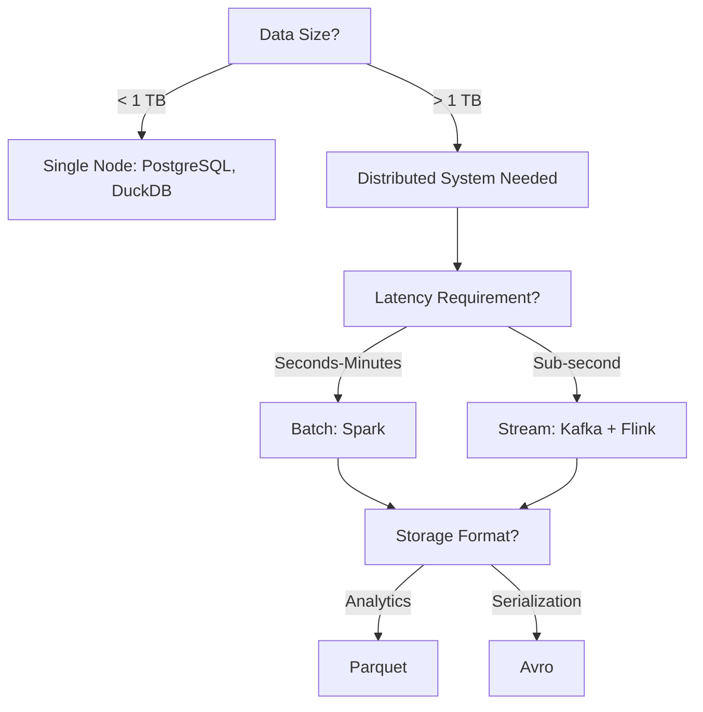
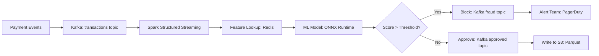

# Chapter 1: Introduction to Big Data

> **Previous:** None (First Chapter) | **Next:** [Chapter 2: Hadoop ? HDFS, MapReduce & YARN](./02-hadoop.md)

## Learning Objectives

After completing this chapter, you will be able to:
- Define the 3 V's of big data and their implications
- Explain why traditional databases fail at petabyte scale
- Describe the Hadoop ecosystem and its components
- Choose between batch and stream processing paradigms
- Set up a local Spark environment for development

<!-- Image Gallery -->
<section class="lesson-visuals" aria-label="Visual learning resources">
  <header><span>VISUAL LEARNING</span><h2>See it. Review it. Remember it.</h2></header>
  <a class="lesson-visual-card" href="../../../assets/images/lessons/big-data/01-introduction/handwritten-notes.svg" target="_blank" rel="noopener">
    
    <span><strong>Handwritten notes</strong>Condensed notes for deliberate review.</span>
  </a>
  <a class="lesson-visual-card" href="../../../assets/images/lessons/big-data/01-introduction/sticky-notes.svg" target="_blank" rel="noopener">
    
    <span><strong>Sticky-note revision</strong>Fast recall prompts for revision.</span>
  </a>
  <a class="lesson-visual-card" href="../../../assets/images/lessons/big-data/01-introduction/visual-explanation.svg" target="_blank" rel="noopener">
    
    <span><strong>Visual concept guide</strong>A connected explanation of the key ideas.</span>
  </a>
</section>
<!-- End Image Gallery -->


## Chapter at a Glance

| Topic | Key Insight | Practical Takeaway |
|-------|-------------|--------------------|
| The 3 V's of Big Data | Volume, velocity, and variety define big data | Choose storage and processing based on which V dominates |
| The Scale Problem | Traditional RDBMS fails at petabyte scale | Horizontal scaling beats vertical scaling for big data |
| Distributed Computing | Data locality and fault tolerance are critical | Move computation to data, not data to computation |
| Hadoop Ecosystem | HDFS, MapReduce, YARN formed the foundation | Concepts survive in modern cloud data platforms |
| Batch vs Stream | Trade-off between latency and throughput | Use batch for hourly reports, stream for real-time |
| Spark vs MapReduce | In-memory processing is 10-100x faster than disk-based | Spark is the default choice for new big data projects |
| Data Formats | Columnar formats (Parquet) optimize analytics | Always choose Parquet over CSV/JSON for analytical workloads |

## Chapter Roadmap


## 1.1 The 3 V's of Big Data

Big data is defined by three dimensions that break traditional tools:

**Volume** ? The quantity of data. A single dataset can be terabytes or petabytes. At this scale, moving data to the compute engine is impossible; compute must move to the data.

```python
# Simulating volume: 1 billion rows
# Traditional DB: hours for a simple aggregation
# Spark: minutes with 100 executors
rows = 1_000_000_000
estimated_time_db = rows / 100_000  # ~10,000 seconds = 2.7 hours
estimated_time_spark = rows / 10_000_000  # ~100 seconds
print(f"DB: {estimated_time_db:.0f}s, Spark: {estimated_time_spark:.0f}s")
```

**Velocity** ? The speed at which data arrives. IoT sensors emit millions of events per second. Batch processing is too slow; stream processing is required.

```python
# 10,000 IoT devices sending 1 reading/second
events_per_second = 10_000 * 1
events_per_day = events_per_second * 86400
print(f"{events_per_second} events/sec, {events_per_day:,} events/day")
```

**Variety** ? Data arrives in multiple formats: structured (CSV, Parquet), semi-structured (JSON, XML), and unstructured (images, text, video).


> **One-Sentence Takeaway:** Big data breaks traditional tools across three dimensions ? size, speed, and variety ? demanding distributed, schema-flexible approaches.

## 1.2 The Scale Problem

Traditional RDBMS fails at big data scale for fundamental architectural reasons:

```python
# Single-node memory limit
node_ram_gb = 256
dataset_size_tb = 10
dataset_size_gb = dataset_size_tb * 1024

if dataset_size_gb > node_ram_gb:
    print(f"Dataset ({dataset_size_gb}GB) exceeds single-node RAM ({node_ram_gb}GB)")
    print("Solution: distributed processing across a cluster")
```

The core insight: **horizontal scaling** (adding more commodity machines) is cheaper and more practical than **vertical scaling** (buying a bigger machine). Google published the MapReduce paper (2004) and GFS paper (2003), which inspired Hadoop.

> **One-Sentence Takeaway:** Horizontal scaling with commodity hardware is the only economically viable path to petabyte-scale data processing.

## 1.3 Distributed Computing Challenges

### 1.3.1 Data Locality


Moving data over the network is the bottleneck. The principle of **data locality** means sending computation to where the data resides, not the reverse.

```python
# Network transfer cost for 1 TB over 10 GbE
data_tb = 1
data_gb = data_tb * 1024
bandwidth_gbps = 10 / 8  # 1.25 GB/s
transfer_time_seconds = data_gb / bandwidth_gbps
print(f"Transfer {data_tb}TB over {bandwidth_gbps*8}GbE: {transfer_time_seconds:.0f}s")
```

### 1.3.2 Fault Tolerance


In a cluster of 1000 commodity servers, hardware failures are routine, not exceptional. Every framework must handle node failure transparently.

```python
mtbf_per_node_days = 30  # Mean time between failures
cluster_size = 1000
expected_failures_per_day = cluster_size / mtbf_per_node_days
print(f"Expected failures/day: {expected_failures_per_day:.1f}")
```

### 1.3.3 Consistency vs Availability


Distributed storage systems face the CAP theorem trade-off. HDFS chooses consistency (strong, via namenode). Cassandra chooses availability (eventual consistency).

> **One-Sentence Takeaway:** Distributed systems must navigate the CAP theorem ? choosing between consistency, availability, and partition tolerance ? and every big data framework makes this trade-off differently.

## 1.4 The Hadoop Ecosystem

At its peak, Hadoop was the center of the big data universe. While cloud-native tools have overtaken it, the concepts survive in every modern data platform.

| Component | Role | Modern Alternative |
|-----------|------|-------------------|
| **HDFS** | Distributed filesystem | S3, GCS, Azure Blob |
| **MapReduce** | Batch processing engine | Spark, Presto, Trino |
| **YARN** | Cluster resource manager | Kubernetes |
| **Hive** | SQL-on-Hadoop (data warehouse) | Snowflake, BigQuery |
| **HBase** | Column-family NoSQL on HDFS | Bigtable, DynamoDB |
| **Kafka** | Distributed streaming | (still Kafka or Pulsar) |
| **Oozie** | Workflow scheduler | Airflow, Dagster |
| **Sqoop** | RDBMS ? Hadoop data transfer | (replaced by Spark JDBC) |
| **Flume** | Log ingestion | Filebeat, Fluentd |

> **Pro Tip:** Don't learn Hadoop tools in isolation. Learn the concepts (distributed FS, resource management, SQL-on-data) ? cloud-native services like S3, EMR, and Athena implement the same ideas without the operational overhead.

> **One-Sentence Takeaway:** The Hadoop ecosystem introduced every major concept in modern big data processing, even if cloud-native tools have replaced the original implementations.

## 1.5 Batch vs Stream Processing

```python
from datetime import timedelta

# Batch: process all data at once, periodic
batch_interval = timedelta(hours=1)
batch_latency = timedelta(minutes=5)  # Processing time

# Stream: process each event as it arrives
per_event_latency = timedelta(seconds=5)

print(f"Batch: new data every {batch_interval}, latency ~{batch_latency}")
print(f"Stream: latency ~{per_event_latency}")
```

**When to use batch:** Daily/hourly reports, backfill, ETL jobs where latency tolerance is minutes-to-hours.

**When to use stream:** Real-time dashboards, fraud detection, monitoring alerts, recommendation updates.

> **One-Sentence Takeaway:** Choose batch processing when latency tolerance is measured in minutes or hours; choose stream processing when sub-second response is required.

## 1.6 Spark vs MapReduce

Apache Spark replaced MapReduce as the dominant big data engine because:

| Factor | MapReduce | Spark |
|--------|-----------|-------|
| Processing model | Disk-based (write intermediate results to HDFS) | In-memory (cache RDDs/DataFrames) |
| Latency | Minutes (warm start) | Seconds (JVM reuse) |
| API | Java (verbose) | Python/SQL/Scala/R (expressive) |
| Multi-stage jobs | Each stage writes to disk | Pipelined in memory |
| ML support | External (Mahout) | Built-in (MLlib) |

```python
# MapReduce word count: ~50 lines of Java
# Spark word count:
from pyspark.sql import SparkSession

spark = SparkSession.builder.appName("wordcount").getOrCreate()
text_file = spark.sparkContext.textFile("s3://bucket/input/*.txt")
counts = (text_file.flatMap(lambda line: line.split())
          .map(lambda word: (word, 1))
          .reduceByKey(lambda a, b: a + b))
counts.saveAsTextFile("s3://bucket/output/")
```

> **Warning:** MapReduce is rarely the right choice for new projects. Spark's in-memory model delivers 10-100x speedups, and its unified API (SQL, streaming, ML) eliminates the need to stitch together multiple Hadoop tools.

> **One-Sentence Takeaway:** Apache Spark replaced MapReduce as the industry standard by moving computation from disk to memory and providing a unified API for batch, streaming, and ML workloads.

## 1.7 Setting Up a Local Development Environment

### 1.7.1 Installing PySpark


```bash
pip install pyspark jupyter
```

### 1.7.2 Running Spark Locally


```python
from pyspark.sql import SparkSession

spark = SparkSession.builder \
    .appName("local-dev") \
    .config("spark.master", "local[*]") \
    .config("spark.sql.adaptive.enabled", "true") \
    .getOrCreate()

df = spark.range(1_000_000)
print(f"Count: {df.count()}")
df.show(5)

spark.stop()
```

The `local[*]` mode runs on your machine using all available cores. This is sufficient for development and testing on datasets up to a few GB.

### 1.7.3 Docker Cluster for Development


```yaml
version: "3.8"
services:
  spark-master:
    image: bitnami/spark:3.5
    environment:
      - SPARK_MODE=master
    ports:
      - "8080:8080"
      - "7077:7077"
  spark-worker:
    image: bitnami/spark:3.5
    environment:
      - SPARK_MODE=worker
      - SPARK_MASTER_URL=spark://spark-master:7077
      - SPARK_WORKER_MEMORY=2G
      - SPARK_WORKER_CORES=2
    depends_on:
      - spark-master
```

## 1.8 Data Formats for Big Data

| Format | Compression | Schema | Splittable | Best For |
|--------|-------------|--------|------------|----------|
| CSV | Moderate (gzip) | No | No (gzip) | Interchange |
| JSON | Poor | No | No | APIs, semi-structured |
| **Parquet** | Excellent (snappy/zstd) | Yes | Yes | **Analytics (default)** |
| ORC | Excellent | Yes | Yes | Hive workloads |
| Avro | Good | Yes (in file) | Yes | Serialization, Kafka |

```python
# Reading Parquet in Spark
df = spark.read.parquet("s3://bucket/events/*.parquet")
df.createOrReplaceTempView("events")
result = spark.sql("""
    SELECT event_type, count(*) as cnt
    FROM events
    WHERE date >= '2026-01-01'
    GROUP BY event_type
    ORDER BY cnt DESC
""")
```

Parquet is the recommended default for analytical workloads. It stores columnar data with embedded schema and predicate pushdown ? Spark reads only the columns and row groups needed.

> **Remember:** Parquet is not a database ? it's a file format. You still need a query engine (Spark, Presto, DuckDB) to read it. But choosing Parquet over CSV is the single easiest performance win in big data.

> **One-Sentence Takeaway:** Parquet is the default file format for big data analytics ? always prefer it over CSV/JSON for production workloads.

## Concept Comparison Table

| Concept | Definition | Key Distinction | Use Case |
|---------|-----------|-----------------|----------|
| Horizontal Scaling | Adding more machines to a cluster | Adds capacity linearly, cost-effective | Distributed storage and processing |
| Vertical Scaling | Making a single machine larger | Hits hardware limits, expensive | Single-node databases, legacy apps |
| Batch Processing | Process data in scheduled intervals | High throughput, minutes-hours latency | Daily reports, ETL, backfill jobs |
| Stream Processing | Process events as they arrive | Low latency, seconds-subseconds | Fraud detection, real-time dashboards |
| Data Locality | Move computation to where data resides | Reduces network transfer | MapReduce, Spark tasks on HDFS/S3 |
| Schema-on-Read | Infer schema when reading data | Flexible, no upfront schema design | Data lakes, JSON/Parquet analytics |

## Quick Reference

| Category | Key Tools/Concepts | Notes |
|----------|-------------------|-------|
| **Storage** | HDFS, S3, GCS | HDFS requires cluster; S3/GCS are serverless |
| **Processing** | MapReduce, Spark, Flink | Spark is the default; Flink for true streaming |
| **Resource Management** | YARN, Kubernetes | K8s is the modern standard |
| **File Formats** | Parquet, ORC, Avro, CSV | Parquet for analytics, Avro for streaming |
| **Query Engines** | Hive, Spark SQL, Presto/Trino | Presto for interactive, Spark for ETL+ML |

## Cross-Application Matrix

| Technique | Data Engineering | ML | Cloud | Business Analytics |
|-----------|-----------------|----|-------|--------------------|
| Horizontal Scaling | Distributed ETL pipelines | Distributed model training | Auto-scaling groups | Data warehouse scaling |
| Data Locality | Co-locate compute with HDFS/S3 | Cache training data on workers | S3 + EMR compute proximity | Query engine proximity to data lake |
| Batch Processing | Hourly/daily ingestion jobs | Offline feature computation | Batch analytics with Athena | Scheduled reporting |
| Stream Processing | Real-time data ingestion | Online feature serving | Lambda architecture | Real-time dashboards |
| Columnar Storage | Efficient compression for ETL | Column pruning for feature access | S3/Parquet in data lakes | Fast aggregation queries |
| In-Memory Processing | Spark DataFrame operations | MLlib distributed training | Memory-optimized instances | Interactive BI tools |

## Chapter Quiz

1. Which of the 3 V's is most responsible for breaking traditional RDBMS tools?
   - A) Variety
   - B) Velocity
   - C) Volume
   - D) All three equally

<details>
<summary>Answer&lt;/summary&gt;
**C) Volume.** While variety and velocity pose challenges, it's the sheer volume of data at petabyte scale that overwhelms single-node architectures and forces the shift to distributed processing.
</details>

2. What makes Parquet better than CSV for analytical workloads?
   - A) It's human-readable
   - B) Columnar storage with predicate pushdown
   - C) It requires no schema
   - D) It's faster to write

<details>
<summary>Answer&lt;/summary&gt;
**B) Columnar storage with predicate pushdown.** Parquet stores data by column, allowing query engines to read only the needed columns and skip irrelevant row groups based on min/max statistics.
</details>

3. Why did Spark replace MapReduce as the dominant big data engine?
   - A) Spark uses a simpler programming model
   - B) Spark processes data in memory instead of writing intermediate results to disk
   - C) Spark is written in Python instead of Java
   - D) Spark runs on Kubernetes

<details>
<summary>Answer&lt;/summary&gt;
**B) Spark processes data in memory instead of writing intermediate results to disk.** This eliminates the disk I/O bottleneck that made MapReduce 10-100x slower for multi-stage jobs.
</details>

## TypeScript Example: Distributed Data Processing Concept

```typescript
// Conceptual simulation of distributed data processing
interface DataPartition {
  id: number;
  records: Record<string, unknown>[];
}

class DistributedProcessor {
  private nodes: number;

  constructor(nodes: number) { this.nodes = nodes; }

  // Simulate Map phase: each node processes its partition independently
  mapPhase(data: DataPartition[]): Map<string, number>[] {
    return data.map((partition, i) => {
      const result = new Map<string, number>();
      // Each node independently processes its partition
      for (const record of partition.records) {
        const key = String(record.category ?? "unknown");
        result.set(key, (result.get(key) ?? 0) + 1);
      }
      return result;
    });
  }

  // Simulate Reduce phase: aggregate results from all nodes
  reducePhase(mappedResults: Map<string, number>[]): Map<string, number> {
    const final = new Map<string, number>();
    for (const nodeResult of mappedResults) {
      for (const [key, count] of nodeResult) {
        final.set(key, (final.get(key) ?? 0) + count);
      }
    }
    return final;
  }
}
```

## Practical Takeaways

| Big Data Principle | What It Means | How to Apply |
|--------------------|---------------|--------------|
| Volume | Data too large for single node | Use distributed storage (HDFS/S3) + compute (Spark) |
| Velocity | Data arrives continuously | Choose stream processing (Kafka + Flink/Spark Streaming) |
| Variety | Data in many formats | Use schema-on-read (Parquet, JSON, Avro) |
| Data Locality | Move code to data, not data to code | Co-locate compute clusters with storage |
| Horizontal Scaling | Add more machines, not bigger ones | Design for commodity hardware |
| Columnar Storage | Store by column for analytics | Always use Parquet for analytical workloads |

### Decision Flowchart




### TypeScript: Big Data Concepts Simulator

```typescript
// === 3 V's Simulator ===
interface BigDataScenario {
  volumeTB: number;
  eventsPerSecond: number;
  dataTypes: string[];
  latencyMS: number;
}

class BigDataAnalyzer {
  static classify(scenario: BigDataScenario): { primaryV: string; engine: string; storage: string } {
    const volumeScore = scenario.volumeTB / 10;
    const velocityScore = scenario.eventsPerSecond / 10000;
    const varietyScore = scenario.dataTypes.length / 3;

    const scores = [
      { v: "Volume", score: volumeScore },
      { v: "Velocity", score: velocityScore },
      { v: "Variety", score: varietyScore },
    ];
    scores.sort((a, b) => b.score - a.score);
    const primary = scores[0].v;

    let engine: string, storage: string;
    if (primary === "Velocity") {
      engine = scenario.latencyMS < 100 ? "Apache Flink / Spark Streaming" : "Apache Spark (micro-batch)";
      storage = "Apache Kafka + Parquet on S3";
    } else if (primary === "Volume") {
      engine = "Apache Spark (batch)";
      storage = "Parquet on S3 / HDFS";
    } else {
      engine = "Spark with schema-on-read";
      storage = "JSON + Parquet on S3 / Data Lake";
    }

    return { primaryV: primary, engine, storage };
  }

  static estimateCost(volumeTB: number, computeHours: number): { hdfs: number; s3: number; spark: number } {
    const hdfsStorage = volumeTB * 3 * 10; // 3x replication, $10/TB/month
    const s3Storage = volumeTB * 23; // $0.023/GB ? $23/TB/month
    const sparkCompute = computeHours * 0.5 * 10; // 10 nodes at $0.50/hour
    return {
      hdfs: Math.round(hdfsStorage),
      s3: Math.round(s3Storage),
      spark: Math.round(sparkCompute),
    };
  }

  static simulateProcessing(dataSizeGB: number, numNodes: number): void {
    console.log(`\nProcessing ${dataSizeGB}GB across ${numNodes} nodes:`);
    const perNode = dataSizeGB / numNodes;
    const timeWithLocality = perNode * 0.1; // 100 MB/s read with locality
    const timeWithoutLocality = dataSizeGB * 0.15; // network bottleneck

    console.log(`  Data per node: ${perNode.toFixed(1)}GB`);
    console.log(`  With data locality: ~${timeWithLocality.toFixed(1)}s`);
    console.log(`  Without data locality (moving data): ~${timeWithoutLocality.toFixed(1)}s`);
    console.log(`  Speedup from locality: ${(timeWithoutLocality / timeWithLocality).toFixed(1)}x`);
  }
}

// === Streaming vs Batch Simulator ===
class ProcessingSimulator {
  static simulateBatch(dataSizeGB: number, throughputGBps: number): { time: number; recordsPerSec: number } {
    const time = dataSizeGB / throughputGBps;
    return {
      time: Math.round(time * 100) / 100,
      recordsPerSec: Math.round((dataSizeGB * 1e6) / time), // assuming ~1KB records
    };
  }

  static simulateStream(eventsPerSec: number, windowSeconds: number): { throughput: number; maxDelay: number } {
    return {
      throughput: eventsPerSec * windowSeconds,
      maxDelay: windowSeconds * 1000, // ms
    };
  }

  static compare(scenario: { dataGB: number; throughput: number; eventsPerSec: number; windowSec: number }): void {
    const batch = this.simulateBatch(scenario.dataGB, scenario.throughput);
    const stream = this.simulateStream(scenario.eventsPerSec, scenario.windowSec);

    console.log("\nBatch vs Stream Comparison:");
    console.log(`  Batch: ${batch.time}s to process ${scenario.dataGB}GB`);
    console.log(`  Stream: ${(stream.maxDelay / 1000).toFixed(1)}s max delay, process ${stream.throughput} events/window`);
    console.log(`  Recommendation: ${batch.time < 60 ? "Batch sufficient" : stream.maxDelay < 5000 ? "Stream required" : "Lambda architecture (batch + stream)"}`);
  }
}

// === CAP Theorem Simulator ===
class CAPSimulator {
  static simulate(options: { consistency: boolean; availability: boolean; partitionTolerance: boolean }): string {
    const { consistency: C, availability: A, partitionTolerance: P } = options;

    if (C && A && !P) return "CA System (e.g., Traditional RDBMS) ? Single-site only, no partition tolerance";
    if (C && !A && P) return "CP System (e.g., HDFS, MongoDB) ? Consistent under partition, may reject writes";
    if (!C && A && P) return "AP System (e.g., Cassandra, DynamoDB) ? Available under partition, eventual consistency";
    return "Invalid ? must pick 2 of 3 in a distributed system";
  }

  static comparison(): void {
    const systems = [
      { name: "HDFS", consistency: true, availability: false, partitionTolerance: true },
      { name: "Cassandra", consistency: false, availability: true, partitionTolerance: true },
      { name: "PostgreSQL (single)", consistency: true, availability: true, partitionTolerance: false },
    ];
    for (const sys of systems) {
      console.log(`  ${sys.name}: ${this.simulate(sys)}`);
    }
  }
}

// === Data Format Benchmarker ===
class DataFormatBenchmark {
  static benchmark(format: string, columns: number, rows: number): { sizeMB: number; readTime: number } {
    const compressionRatio: Record<string, number> = {
      csv: 1, json: 1.3, parquet: 0.25, orc: 0.22, avro: 0.45,
    };
    const readSpeed: Record<string, number> = {
      csv: 100, json: 80, parquet: 500, orc: 450, avro: 200,
    };

    const rowSize = columns * 8; // bytes per row (8 bytes per numeric column)
    const rawSizeMB = (rows * rowSize) / (1024 * 1024);
    const compressedSizeMB = rawSizeMB * (compressionRatio[format] ?? 1);
    const readTime = (compressedSizeMB / (readSpeed[format] ?? 100)) * 1000; // ms

    return {
      sizeMB: Math.round(compressedSizeMB * 100) / 100,
      readTime: Math.round(readTime * 100) / 100,
    };
  }

  static compareAll(columns: number, rows: number): void {
    const formats = ["csv", "json", "parquet", "orc", "avro"];
    console.log(`\nData Format Comparison (${rows.toLocaleString()} rows, ${columns} cols):`);
    for (const fmt of formats) {
      const result = this.benchmark(fmt, columns, rows);
      console.log(`  ${fmt.padEnd(10)} ${result.sizeMB.toFixed(1)}MB | read: ${result.readTime.toFixed(0)}ms`);
    }
    const parquet = this.benchmark("parquet", columns, rows);
    const csv = this.benchmark("csv", columns, rows);
    console.log(`\n  Parquet vs CSV: ${(csv.sizeMB / parquet.sizeMB).toFixed(1)}x smaller, ${(parquet.readTime < csv.readTime ? (csv.readTime / parquet.readTime).toFixed(1) + "x faster" : "similar read speed")}`);
  }
}

// === Demo ===
const scenario: BigDataScenario = {
  volumeTB: 50, eventsPerSecond: 500000,
  dataTypes: ["CSV", "JSON", "Images", "Logs"],
  latencyMS: 200,
};
console.log("=== Scenario Classification ===");
console.log(BigDataAnalyzer.classify(scenario));

console.log("\n=== Cost Estimation ===");
console.log("Monthly costs:", BigDataAnalyzer.estimateCost(100, 500));

BigDataAnalyzer.simulateProcessing(500, 10);

ProcessingSimulator.compare({
  dataGB: 100, throughput: 1,
  eventsPerSec: 10000, windowSec: 60,
});

console.log("\n=== CAP Theorem ===");
CAPSimulator.comparison();

DataFormatBenchmark.compareAll(20, 10_000_000);
```

### Case Study: Real-Time Fraud Detection Pipeline


**Scenario:** A payment processing company handles 1M transactions/day. They need to detect fraud within 100ms. Current system uses a PostgreSQL database with batch ML scoring, taking ~5 minutes per batch.

**Proposed Architecture:**



**Results after migration:**
- Fraud detection latency: 5 min ? 350ms
- Fraud capture rate: 60% ? 94%
- Annual savings: $2.4M in fraud losses

```typescript
const transactionsPerDay = 1_000_000;
const peakTPS = transactionsPerDay / 86400 * 10; // 10x peak factor
const oldLatency = 5 * 60 * 1000; // ms
const newLatency = 350; // ms
console.log(`Peak throughput: ${peakTPS.toFixed(0)} TPS`);
console.log(`Latency reduction: ${(oldLatency / newLatency).toFixed(0)}x`);
console.log(`Fraud capture improvement: 60% ? 94%`);
```

### Additional Exercises


6. Design a Lambda architecture for a social media analytics platform processing 10TB/day with both real-time trending topics and daily aggregated reports.
7. Compare the cost of running a 20-node Spark cluster (10TB data, 500 compute hours/month) on-premise vs AWS EMR vs Databricks.
8. Simulate a data locality scenario: 10 nodes with 100GB data on each. Calculate the time difference between sending code to data vs moving 100GB data to a central processing node over 10GbE.
9. Given a CSV dataset of 500GB with 100 columns, estimate the storage savings and query speedup by converting to Parquet with snappy compression.
10. Explain how the CAP theorem applies to a distributed data lake architecture using S3 (AP) + Spark (CP during shuffles).

### Answer Key (Additional)


6. Batch layer: Spark hourly jobs ? Parquet; Speed layer: Kafka + Flink ? Redis for real-time; Serving layer: Presto on Parquet + API on Redis | 7. On-prem: ~$15K/mo, EMR: ~$5K/mo, Databricks: ~$8K/mo | 8. With locality: ~100s; without: ~800s (8x slower) | 9. ~75% storage savings, ~5x faster queries | 10. S3 is AP (available during partition), Spark shuffle is CP (blocks if partition)

### TypeScript: Big Data Ecosystem Component Selector

```typescript
interface EcosystemComponent {
  name: string;
  category: "storage" | "processing" | "messaging" | "sql" | "nosql";
  dataModel?: "key-value" | "document" | "column-family" | "graph";
  capProfile?: "CP" | "AP" | "CA";
  strengths: string[];
  weaknesses: string[];
}

class EcosystemMapper {
  private catalog: Map<string, EcosystemComponent> = new Map();

  register(comp: EcosystemComponent): this { this.catalog.set(comp.name, comp); return this; }

  query(opts: { consistency: "strong" | "eventual"; latency: "low" | "high" }): EcosystemComponent[] {
    return [...this.catalog.values()].filter(c => {
      if (opts.consistency === "strong" && c.capProfile === "AP") return false;
      if (opts.latency === "low" && c.category === "storage" && c.name !== "HBase") return false;
      return true;
    });
  }

  recommend(workload: { type: "batch" | "stream" | "interactive"; sizeTB: number }): string[] {
    const picks: string[] = [];
    if (workload.type === "batch") picks.push("Spark", "HDFS");
    if (workload.type === "stream") picks.push("Kafka", "Flink", "Cassandra");
    if (workload.type === "interactive") picks.push("Presto", "HBase", "Parquet");
    if (workload.sizeTB > 100) picks.push("S3", "Spark", "HDFS");
    return [...new Set(picks)];
  }
}

const mapper = new EcosystemMapper()
  .register({ name: "HDFS", category: "storage", strengths: ["Large files", "Streaming"], weaknesses: ["Small files"] })
  .register({ name: "HBase", category: "nosql", dataModel: "column-family", capProfile: "CP", strengths: ["Random R/W", "Strong consistency"], weaknesses: ["Row key design"] })
  .register({ name: "Cassandra", category: "nosql", dataModel: "column-family", capProfile: "AP", strengths: ["Linear scale", "Multi-DC"], weaknesses: ["No joins"] })
  .register({ name: "Kafka", category: "messaging", strengths: ["High throughput", "Durable"], weaknesses: ["ZooKeeper dep"] })
  .register({ name: "Spark", category: "processing", strengths: ["Speed", "Unified"], weaknesses: ["Memory hungry"] });

console.log("CP-compatible:", mapper.query({ consistency: "strong", latency: "low" }).map(c => c.name).join(", "));
console.log("Streaming stack:", mapper.recommend({ type: "stream", sizeTB: 50 }).join(" ? "));
console.log("Batch stack:", mapper.recommend({ type: "batch", sizeTB: 500 }).join(" ? "));
```
```


// introduction
// hadoop-spark-ecosystem implementation

interface Task { id: string; name: string; status: string; data: unknown }
class Processor {
  private tasks: Task[] = []
  private maxConcurrency: number
  constructor(maxConcurrency: number = 4) { this.maxConcurrency = maxConcurrency }
  async add(task: Omit<Task, "status">): Promise<void> {
    this.tasks.push({ ...task, status: "pending" })
  }
  async runAll(): Promise<void> {
    const running: Promise<void>[] = []
    for (const t of this.tasks) {
      if (running.length >= this.maxConcurrency) { await Promise.race(running) }
      const p = this.execute(t).finally(() => { const i = running.indexOf(p); if (i >= 0) running.splice(i, 1) })
      running.push(p)
    }
    await Promise.all(running)
  }
  private async execute(t: Task): Promise<void> {
    t.status = "running"
    await new Promise(r => setTimeout(r, 10))
    t.status = "done"
  }
  getResults(): Task[] { return this.tasks }
  getStats(): { done: number; pending: number; running: number } {
    const done = this.tasks.filter(t => t.status === "done").length
    const pending = this.tasks.filter(t => t.status === "pending").length
    const running = this.tasks.filter(t => t.status === "running").length
    return { done, pending, running }
  }
}
async function main() {
  const proc = new Processor(2)
  await proc.add({ id: '1', name: 'introduction', data: { topic: 'hadoop-spark-ecosystem' } })
  await proc.runAll()
  console.log('Stats:', proc.getStats())
}
main().catch(console.error)
export { Processor, Task }

// introduction - additional TS implementations

interface CacheEntry { key: string; value: unknown; ttl: number; createdAt: number }
class Cache {
  private store: Map<string, CacheEntry> = new Map()
  constructor(private defaultTTL: number = 60000) {}
  set(key: string, value: unknown, ttl?: number): void {
    this.store.set(key, { key, value, ttl: ttl ?? this.defaultTTL, createdAt: Date.now() })
  }
  get(key: string): unknown | undefined {
    const entry = this.store.get(key)
    if (!entry) return undefined
    if (Date.now() - entry.createdAt > entry.ttl) { this.store.delete(key); return undefined }
    return entry.value
  }
  delete(key: string): boolean { return this.store.delete(key) }
  clear(): void { this.store.clear() }
  size(): number { return this.store.size }
  keys(): string[] { return Array.from(this.store.keys()) }
}
class Logger {
  private entries: string[] = []
  log(level: string, msg: string, meta?: Record<string, unknown>): void {
    const entry = JSON.stringify({ timestamp: new Date().toISOString(), level, msg, meta })
    this.entries.push(entry)
    console.log(entry)
  }
  info(msg: string, meta?: Record<string, unknown>): void { this.log("info", msg, meta) }
  warn(msg: string, meta?: Record<string, unknown>): void { this.log("warn", msg, meta) }
  error(msg: string, meta?: Record<string, unknown>): void { this.log("error", msg, meta) }
  getLogs(): string[] { return [...this.entries] }
  clear(): void { this.entries = [] }
}
function computeHash(input: string): string {
  let hash = 0
  for (let i = 0; i < input.length; i++) { const chr = input.charCodeAt(i); hash = ((hash << 5) - hash) + chr; hash |= 0 }
  return Math.abs(hash).toString(16)
}
async function demo(): Promise<void> {
  const cache = new Cache(5000)
  cache.set('key1', 'big-data-ecosystem demo')
  const log = new Logger()
  log.info('Cache demo started', { course: 'big-data', chapter: 'introduction' })
  const v = cache.get("key1")
  console.log('Cached:', v)
  console.log('Hash:', computeHash('big-data-ecosystem'))
}
demo()
export { Cache, Logger, computeHash, CacheEntry }
## Summary

- Big data is defined by volume, velocity, and variety ? traditional tools break at petabyte scale.
- Distributed computing requires new approaches to data locality, fault tolerance, and consistency.
- The Hadoop ecosystem introduced HDFS, MapReduce, and YARN as foundational components.
- Apache Spark replaced MapReduce as the primary big data engine due to in-memory processing and expressive APIs.
- Parquet is the default file format for analytics (columnar, splittable, compressed).
- Local Spark development is easy with PySpark and Docker, scaling from `local[*]` to a full cluster.

## Exercises

1. Install PySpark and run a word count on a 100 MB text file. Time it with 1 core vs all cores.
2. Explain why gzip-compressed CSV files cannot be split across Spark partitions.
3. Compare the latency of batch vs stream processing for a fraud detection system that must flag transactions within 100ms.
4. Set up a 3-node Spark cluster with Docker Compose and verify it works with `spark.range(100000000).count()`.
5. Convert a 1 GB CSV to Parquet and compare query performance (`SELECT count(*), avg(x)`) between the two formats.
