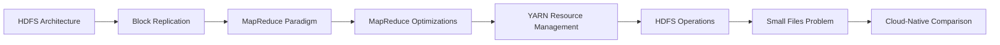

# Chapter 2: Hadoop — HDFS, MapReduce & YARN

> **Previous:** [Chapter 1: Introduction to Big Data](./01-introduction.md) | **Next:** [Chapter 3: Apache Spark Basics](./03-spark-basics.md)

## Learning Objectives

After completing this chapter, you will be able to:
- Explain HDFS architecture: namenode, datanodes, block replication
- Write and run MapReduce jobs (conceptually and with Python)
- Describe YARN resource management and container scheduling
- Configure a Hadoop cluster for development
- Compare Hadoop with cloud-native alternatives

## Chapter at a Glance

| Topic | Key Insight | Practical Takeaway |
|-------|-------------|--------------------|
| HDFS Architecture | Single namenode + multiple datanodes with block replication | The namenode is a single point of failure — monitor it closely |
| Block Replication | 128 MB blocks, 3x replication with rack awareness | Rack-aware placement survives full rack failures |
| MapReduce | Two-phase (map-reduce) model with automatic parallelization | Hadoop Streaming lets you write mappers/reducers in Python |
| YARN | Separates resource management from processing framework | YARN enables Spark, MapReduce, Tez to share the same cluster |
| Small Files Problem | HDFS is optimized for large files | Keep files close to 128 MB block size |
| Cloud-Native Comparison | S3 + Spark is replacing on-premise Hadoop | Learn concepts, not tools — cloud services implement the same ideas |

## Chapter Roadmap



## 2.1 HDFS Architecture

HDFS (Hadoop Distributed File System) is a fault-tolerant, high-throughput distributed filesystem designed for commodity hardware.

### 2.1.1 Core Components

**Namenode (NN):** The single master. Stores the filesystem tree and metadata for all files and directories (inode → block list mapping). Acts as the "directory" of the filesystem.

**Datanodes (DN):** One per cluster node. Store the actual block data. Report block health via heartbeats to the namenode.

```python
# Conceptual HDFS block distribution
blocks_per_file = 10  # 10 blocks of 128 MB each = 1.28 GB
replication_factor = 3
datanodes = 5

total_block_replicas = blocks_per_file * replication_factor
blocks_per_node = total_block_replicas // datanodes
print(f"Total replicas: {total_block_replicas}")
print(f"Blocks per datanode (avg): {blocks_per_node}")
```

### 2.1.2 Block Replication

Each file is split into blocks (default 128 MB). Each block is replicated across multiple datanodes (default 3 replicas). The replication strategy places the first replica on the writer's node, the second on a rack-different node, and the third on a same-rack different node.

```python
replication = 3
rack1_nodes = 2
rack2_nodes = 3

# Rack-aware replica placement
print("Replica 1: Writer node (rack 1)")
print("Replica 2: Random node in different rack (rack 2)")
print("Replica 3: Different node in same rack as replica 2")
```

This rack-aware placement ensures that a full rack failure or a single node failure does not cause data loss.

> **One-Sentence Takeaway:** HDFS achieves fault tolerance through block replication with rack-aware placement, ensuring data survives multiple concurrent node and rack failures.

### 2.1.3 Heartbeats & Block Reports

Datanodes send heartbeats every 3 seconds to the namenode. If the namenode does not receive a heartbeat for 10 minutes (default), it marks the datanode as dead and re-replicates its blocks.

```python
heartbeat_interval = 3  # seconds
timeout = 10 * 60  # seconds
max_missed = timeout // heartbeat_interval

print(f"Namenode waits {timeout}s ({max_missed} heartbeats) before declaring DN dead")
```


### 2.1.4 HDFS CLI

```bash
# HDFS command-line operations
hdfs dfs -mkdir /user/myuser
hdfs dfs -put data.csv /user/myuser/
hdfs dfs -ls /user/myuser/
hdfs dfs -cat /user/myuser/data.csv | head

# Check filesystem health
hdfs fsck /user/myuser/data.csv -files -blocks

# Set replication factor
hdfs dfs -setrep -w 3 /user/myuser/data.csv
```

## 2.2 MapReduce Paradigm

MapReduce is a programming model for distributed data processing. It consists of two phases: Map (transform/filter) and Reduce (aggregate/summarize).

### 2.2.1 How MapReduce Works


### 2.2.2 Word Count in MapReduce (Python)

```python
# mapper.py
import sys

for line in sys.stdin:
    line = line.strip()
    words = line.split()
    for word in words:
        print(f"{word}\t1")
```

```python
# reducer.py
import sys

current_word = None
current_count = 0

for line in sys.stdin:
    word, count_str = line.strip().split("\t", 1)
    count = int(count_str)

    if word == current_word:
        current_count += count
    else:
        if current_word:
            print(f"{current_word}\t{current_count}")
        current_word = word
        current_count = count

if current_word == current_word:
    print(f"{current_word}\t{current_count}")
```

### 2.2.3 Running a MapReduce Job

```bash
hadoop jar /path/to/hadoop-streaming.jar \
  -input /user/myuser/input \
  -output /user/myuser/output \
  -mapper mapper.py \
  -reducer reducer.py \
  -file mapper.py \
  -file reducer.py
```

Hadoop Streaming allows any executable (Python, Perl, Ruby) to serve as mapper and reducer. The `-file` flag distributes the scripts to all nodes.

> **One-Sentence Takeaway:** MapReduce automatically parallelizes data processing across a cluster by splitting work into map (transform) and reduce (aggregate) phases, with optional combiners for network optimization.

### 2.2.4 MapReduce Optimizations

**Combiner:** A mini-reducer that runs on the mapper node, reducing data transferred over the network. For word count, the combiner is identical to the reducer.

```python
# Set combiner class (Java API)
# job.setCombinerClass(IntSumReducer.class);
# Combiner reduces map output before shuffle:
# mapper output: ("the", 1), ("the", 1), ("the", 1)
# combiner output: ("the", 3)  -- 3x less data to shuffle
```

**Speculative execution:** If a node is slow (straggler), Hadoop launches a duplicate task on another node and uses whichever finishes first.

> **Pro Tip:** Always use a Combiner when the reduce function is associative and commutative (e.g., sum, max, count). It can reduce network shuffle data by 3-10x at no extra code cost.

> **One-Sentence Takeaway:** Combiners and speculative execution are key MapReduce optimizations — combiners reduce network traffic and speculative execution mitigates straggler nodes.

## 2.3 YARN (Yet Another Resource Negotiator)

YARN separates cluster resource management from the processing framework. This allows Spark, MapReduce, Tez, and others to share the same cluster.

### 2.3.1 YARN Components

| Component | Role |
|-----------|------|
| **ResourceManager (RM)** | Master — allocates resources, arbitrates contention |
| **NodeManager (NM)** | Per-node agent — monitors containers, reports health |
| **ApplicationMaster (AM)** | Per-job coordinator — negotiates resources, manages tasks |
| **Container** | Isolated execution environment (CPU + memory) |

### 2.3.2 YARN Scheduling Flow

```python
# Conceptual flow
def yarn_job_submission():
    # 1. Client submits application to ResourceManager
    rm = ResourceManager()
    app_id = rm.submit_application("wordcount.jar")

    # 2. RM asks a NodeManager to launch an ApplicationMaster
    container = rm.allocate_container(memory="2GB", vcores=1)
    am = ApplicationMaster(app_id, container)

    # 3. AM requests containers from RM
    resources = rm.request_resources(
        n_containers=10,
        memory_per="4GB",
        vcores_per=2
    )

    # 4. AM launches mappers/reducers in allocated containers
    for mapper in range(10):
        am.launch_task(mapper, container=resources[mapper])

    # 5. AM reports progress to RM; RM shows progress to client
    while not am.is_done():
        print(f"Progress: {am.get_progress():.0%}")
        time.sleep(5)
```

### 2.3.3 YARN Schedulers

| Scheduler | Behavior | Use Case |
|-----------|----------|----------|
| FIFO | First-in-first-out, single queue | Dev/testing, small teams |
| Capacity | Guaranteed capacity per queue, elastic sharing | Multi-tenant production |
| Fair | Equal resource distribution over time | Ad-hoc queries, mixed workloads |

> **One-Sentence Takeaway:** YARN decouples resource management from the processing framework, allowing multiple compute engines to share a single cluster through pluggable scheduling policies.

## 2.4 HDFS Operations in Python

```python
import subprocess

def hdfs_ls(path: str) -> list:
    result = subprocess.run(
        ["hdfs", "dfs", "-ls", path],
        capture_output=True, text=True
    )
    return [line.split()[-1] for line in result.stdout.strip().split("\n")[1:]]

def hdfs_read(path: str) -> str:
    result = subprocess.run(
        ["hdfs", "dfs", "-cat", path],
        capture_output=True, text=True
    )
    return result.stdout

def hdfs_write(path: str, content: str) -> None:
    proc = subprocess.Popen(
        ["hdfs", "dfs", "-put", "-", path],
        stdin=subprocess.PIPE
    )
    proc.communicate(content.encode())

files = hdfs_ls("/user/myuser/")
print(files)
```

## 2.5 The Small Files Problem

HDFS is designed for large files. Each file, directory, and block consumes ~150 bytes in namenode memory. With 10 million files, that is 1.5 GB of heap for metadata alone.

```python
namenode_heap_gb = 64
bytes_per_inode = 150
max_inodes = (namenode_heap_gb * 1024**3) // bytes_per_inode
print(f"Max inodes with {namenode_heap_gb}GB heap: {max_inodes:,}")

# If average file size is 1 MB, and block size is 128 MB:
avg_file_mb = 1
block_mb = 128
small_file_waste = 100 * (1 - avg_file_mb / block_mb)
print(f"Storage waste for {avg_file_mb}MB files: {small_file_waste:.0f}%")
```

**Solutions:** Combine small files into sequence files, use HBase, or switch to an object store (S3).

> **Warning:** The small files problem is one of the most common real-world HDFS failures. A directory with millions of tiny (1 KB) files can crash the namenode by exhausting its heap. Always batch small files before ingesting into HDFS.

> **One-Sentence Takeaway:** HDFS is designed for large files — small files waste namenode memory and storage efficiency, requiring batching strategies or object store alternatives.

## 2.6 Hadoop vs Cloud-Native

| Capability | Hadoop (HDFS + YARN) | Cloud-Native (S3 + EMR/Spark) |
|------------|----------------------|-------------------------------|
| Storage | HDFS (limited by cluster disk) | S3/GCS (unlimited, pay-per-GB) |
| Compute | Fixed pool (cluster) | Elastic (auto-scale, spot instances) |
| Data access | Requires cluster to be up | Accessible from anywhere |
| Cost | Upfront hardware + maintenance | Pay-per-use, no idle cost |
| Durability | 3x replication (200% overhead) | 11 9's (erasure coding) |
| Performance | Better for shuffle-heavy workloads | Better for storage-compute separation |

The industry trend is toward **storage-compute separation** (S3 + Spark/EMR), but HDFS concepts are still tested in interviews and used in on-premise deployments.

> **Remember:** Every cloud object store (S3, GCS, Azure Blob) borrows concepts from HDFS — block storage, replication, and metadata management. Understanding HDFS gives you a mental model for all distributed storage.

## Concept Comparison Table

| Concept | Definition | Key Distinction | Use Case |
|---------|-----------|-----------------|----------|
| HDFS | Distributed filesystem with single namenode | Strong consistency, write-once-read-many | Batch storage of large files |
| MapReduce | Two-phase distributed processing | Disk-based intermediate writes | Legacy batch ETL |
| YARN | Cluster resource manager | Separates resource mgmt from compute | Multi-engine cluster sharing |
| HDFS Block | 128 MB data unit with 3x replication | Large block size reduces metadata overhead | Distributed file storage |
| MapReduce Combiner | Mini-reducer on mapper node | Reduces network shuffle by local aggregation | Word count, sum, max |
| Cloud Storage | S3/GCS with 11 9's durability | Storage-compute separation, pay-per-GB | Modern data lakes |

## Quick Reference

| Category | Key Concepts | Notes |
|----------|-------------|-------|
| **HDFS Commands** | dfs -put, -get, -ls, -cat, -setrep | Always use `-setrep -w` to wait for replication |
| **MapReduce Phases** | Map → Shuffle/Sort → Reduce | Combiner runs during shuffle output |
| **YARN Components** | RM, NM, AM, Container | AM per job negotiates with RM |
| **HDFS Tuning** | dfs.blocksize, replication.factor, heartbeat.interval | 128 MB default; 3x replication |
| **Key Metrics** | namenode heap, block count, DN heartbeats | 150 bytes/inode in namenode memory |

## Cross-Application Matrix

| Technique | Data Engineering | ML | Cloud | Business Analytics |
|-----------|-----------------|----|-------|--------------------|
| HDFS Block Replication | Reliable data ingestion | Store training datasets | S3 replication config | Data lake durability |
| MapReduce | Batch ETL pipelines | Feature extraction | EMR/DataProc jobs | Historical reporting |
| YARN Resource Mgmt | Multi-tenant cluster sharing | GPU-enabled executors | K8s resource quotas | Query queue management |
| Combiner Optimization | Reduce shuffle in aggregations | Local gradient accumulation | Cost reduction in data transfer | Faster aggregation queries |
| Small Files Handling | Batch compaction jobs | Merge small feature files | S3 lifecycle policies | Compress small fact tables |
| Rack-Aware Placement | Optimize data locality | Affinity for training nodes | AZ-aware deployment | Geographically distributed queries |

## Chapter Quiz

1. What happens in HDFS if a datanode fails?
   - A) The namenode goes into safe mode
   - B) The namenode re-replicates the blocks from the dead node to other datanodes
   - C) The datanode's blocks are permanently lost
   - D) The cluster stops accepting writes

<details>
<summary>Answer</summary>
**B) The namenode re-replicates the blocks from the dead node to other datanodes.** After 10 minutes of missed heartbeats, the namenode marks the node dead and replicates its blocks (which still exist on other nodes due to 3x replication) to maintain the target replication factor.
</details>

2. What is the purpose of a Combiner in MapReduce?
   - A) To combine multiple MapReduce jobs into one
   - B) To perform local aggregation on the mapper node before shuffling
   - C) To combine the outputs of multiple reducers
   - D) To merge input files before mapping

<details>
<summary>Answer</summary>
**B) To perform local aggregation on the mapper node before shuffling.** The combiner reduces the amount of data transferred over the network during the shuffle phase, significantly speeding up jobs with associative operations.
</details>

3. Why does HDFS have a 128 MB default block size?
   - A) To match disk sector sizes
   - B) To reduce the number of metadata entries in the namenode
   - C) To improve network transfer speeds
   - D) To make files compatible with HBase

<details>
<summary>Answer</summary>
**B) To reduce the number of metadata entries in the namenode.** Large blocks mean fewer blocks per file, which reduces the memory pressure on the namenode (which stores all metadata in RAM).
</details>

## Practical Takeaways

| Hadoop Component | Role | Modern Alternative | Key Concept |
|------------------|------|-------------------|-------------|
| HDFS | Distributed storage | S3, GCS, Azure Blob | Block replication, rack awareness |
| MapReduce | Batch processing | Spark, EMR, Dataproc | Map → Shuffle → Reduce |
| YARN | Resource management | Kubernetes | Separates compute from scheduling |
| HDFS CLI | File operations | AWS CLI, gsutil | `dfs -put/get/ls/cat` |

### Hadoop Troubleshooting Quick Reference

- **Namenode out of memory:** Too many files (reduce file count, increase heap)
- **Slow MapReduce jobs:** Not enough reducers, data skew, too many small files
- **Datanode failures:** Check heartbeats, disk space, network connectivity
- **Rack awareness not working:** Verify topology script is configured correctly
- **HDFS safe mode:** Namenode starting up or recovering — wait or manually leave safe mode

## Summary

- HDFS provides fault-tolerant distributed storage with block replication, rack awareness, and a single namenode.
- MapReduce is a two-phase (map-reduce) programming model with automatic parallelization, fault tolerance, and data locality.
- YARN manages cluster resources via ResourceManager, NodeManager, and per-job ApplicationMasters.
- The small files problem degrades HDFS performance — keep files close to the block size (128 MB).
- Cloud-native architectures (S3 + Spark) are replacing on-premise Hadoop, but the concepts remain foundational.

## Exercises

1. Start a 3-node HDFS cluster with Docker and upload a 500 MB file. Verify block distribution across datanodes.
2. Write a Python MapReduce job (mapper + reducer) to find the top 10 most frequent words in a book. Run it with Hadoop Streaming.
3. Explain what happens in YARN when a NodeManager fails during a running MapReduce job. Trace the recovery path.
4. Calculate the namenode memory required for a cluster storing 100 million files of average 10 MB each.
5. Compare the cost of storing 100 TB on HDFS (3x replication, 100 nodes × 10 TB disk) vs S3 standard tier.
