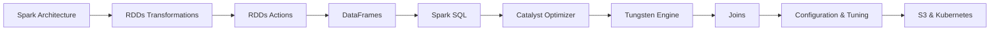
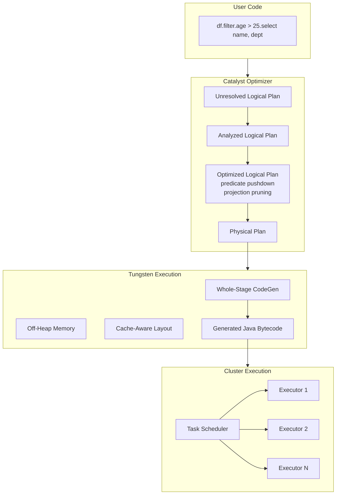
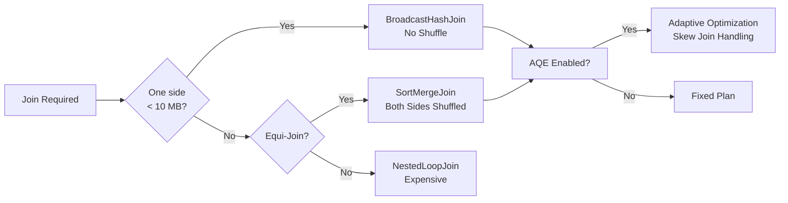

# Chapter 3: Apache Spark Basics

> **Previous:** [Chapter 2: Hadoop ? HDFS, MapReduce & YARN](./02-hadoop.md) | **Next:** [Chapter 4: Spark MLlib](./04-spark-mllib.md)

## Learning Objectives

After completing this chapter, you will be able to:
- Create and manipulate RDDs and DataFrames
- Write Spark SQL queries and optimize them
- Understand Catalyst optimizer and Tungsten execution engine
- Configure Spark applications for performance
- Read and write data from S3, HDFS, and local files

## Chapter at a Glance

| Topic | Key Insight | Practical Takeaway |
|-------|-------------|--------------------|
| Spark Architecture | Driver schedules tasks on distributed executors | Configure executor count, cores, and memory for performance |
| RDDs | Immutable, partitioned collections processed in parallel | Use DataFrames over RDDs for production code |
| DataFrames | RDDs with schema, optimized via Catalyst | Higher-level API with automatic query optimization |
| Spark SQL | SQL queries run through Catalyst optimizer | Write SQL for readability, DataFrame API for programmatic access |
| Catalyst Optimizer | Transforms queries into efficient physical plans | Use `.explain()` to verify optimization |
| Tungsten Engine | Off-heap memory, cache-aware, code generation | Enable whole-stage codegen for 2-5x speedup |
| Joins | Broadcast for small tables, sort-merge for large | Know when each join strategy applies |

## Chapter Roadmap



## 3.1 Spark Architecture

Spark has a master/worker architecture. The **driver** runs the user's main program and schedules tasks on **executors** running on worker nodes.


[//]: # "Spark Execution Flow"


```python
from pyspark.sql import SparkSession

spark = SparkSession.builder \
    .appName("architecture-demo") \
    .config("spark.executor.instances", 4) \
    .config("spark.executor.cores", 4) \
    .config("spark.executor.memory", "8g") \
    .config("spark.driver.memory", "4g") \
    .getOrCreate()

# Each executor = 4 cores ? 8 GB memory
# Total cluster resources: 4 executors ? 4 cores = 16 cores
#                           4 executors ? 8 GB = 32 GB memory
print(f"Total cores: {spark.sparkContext.defaultParallelism}")
spark.stop()
```

> **One-Sentence Takeaway:** Spark's master/worker architecture runs a driver that schedules parallel tasks on distributed executors, with resource allocation configurable per application.

## 3.2 RDDs (Resilient Distributed Datasets)

RDDs are the fundamental data structure in Spark: an immutable, partitioned collection of records that can be processed in parallel.

### 3.2.1 Creating RDDs


```python
from pyspark.sql import SparkSession

spark = SparkSession.builder.appName("rdd-demo").getOrCreate()
sc = spark.sparkContext

# From a Python list
rdd = sc.parallelize([1, 2, 3, 4, 5, 6, 7, 8, 9, 10])
print(f"Partitions: {rdd.getNumPartitions()}")
print(f"Data: {rdd.collect()}")

# From a file
log_rdd = sc.textFile("s3://bucket/logs/*.log")
print(f"Lines: {log_rdd.count()}")

# With custom partition count
rdd_8 = sc.parallelize(range(1000), numSlices=8)
print(f"Partitions: {rdd_8.getNumPartitions()}")
```

### 3.2.2 RDD Transformations (Lazy)


```python
# Transformations are lazy ? nothing happens until an action is called
rdd = sc.parallelize(range(1, 1001))

# map: apply function to each element
squares = rdd.map(lambda x: x * x)

# filter: keep elements matching predicate
evens = rdd.filter(lambda x: x % 2 == 0)

# flatMap: each input produces 0 or more outputs
words = sc.parallelize(["hello world", "spark is fast"])
word_list = words.flatMap(lambda line: line.split())
print(word_list.collect())

# reduceByKey: aggregate by key
pairs = sc.parallelize([("a", 1), ("b", 2), ("a", 3), ("b", 4)])
sum_by_key = pairs.reduceByKey(lambda a, b: a + b)
print(sum_by_key.collect())  # [("a", 4), ("b", 6)]

# sortBy: order by key/value
sorted_pairs = sum_by_key.sortBy(lambda x: x[1], ascending=False)
print(sorted_pairs.collect())
```

### 3.2.3 RDD Actions (Eager)


```python
# Actions trigger computation and return results
rdd = sc.parallelize(range(1, 1001))

# collect: return all elements to driver (dangerous for large datasets)
small_sample = sc.parallelize(range(10))
print(small_sample.collect())

# take: return first N elements
print(rdd.take(5))

# count: total elements
print(f"Count: {rdd.count()}")

# reduce: aggregate elements
total = rdd.reduce(lambda a, b: a + b)
print(f"Sum: {total}")

# foreach: execute side-effecting function on each element
rdd.foreach(lambda x: x * x)  # No return value

# saveAsTextFile: write to disk
rdd.filter(lambda x: x % 2 == 0).saveAsTextFile("output/evens")
```

> **One-Sentence Takeaway:** RDDs are lazy-evaluated immutable collections ? transformations build a DAG and actions trigger execution, enabling fault-tolerant distributed computation.

## 3.3 DataFrames

DataFrames are RDDs with a schema. They provide a higher-level API with better optimization through the Catalyst optimizer.

### 3.3.1 Creating DataFrames


```python
from pyspark.sql import SparkSession
from pyspark.sql.types import StructType, StructField, StringType, IntegerType

spark = SparkSession.builder.appName("df-demo").getOrCreate()

# From a list of dicts
data = [{"name": "Alice", "age": 30}, {"name": "Bob", "age": 25}]
df = spark.createDataFrame(data)
df.show()

# With explicit schema
schema = StructType([
    StructField("id", IntegerType(), nullable=False),
    StructField("name", StringType(), nullable=True),
])
df2 = spark.createDataFrame([(1, "Alice"), (2, "Bob")], schema)
df2.printSchema()

# From CSV
df_csv = spark.read \
    .option("header", "true") \
    .option("inferSchema", "true") \
    .csv("data/*.csv")

# From Parquet (preferred)
df_parquet = spark.read.parquet("data/*.parquet")
```

### 3.3.2 DataFrame Operations


```python
df = spark.createDataFrame([
    ("Alice", 30, "Engineering"),
    ("Bob", 25, "Sales"),
    ("Charlie", 35, "Engineering"),
    ("Diana", 28, "Marketing"),
], ["name", "age", "dept"])

# Select columns
df.select("name", "age").show()

# Filter rows
df.filter(df.age > 28).show()

# Add column
df.withColumn("age_next_year", df.age + 1).show()

# Group by aggregation
df.groupBy("dept").agg(
    {"age": "avg", "name": "count"}
).show()

# Order by
df.orderBy(df.age.desc()).show()

# Multiple aggregations
from pyspark.sql import functions as F
df.groupBy("dept").agg(
    F.avg("age").alias("avg_age"),
    F.count("*").alias("employee_count"),
    F.max("age").alias("oldest")
).show()
```

### 3.3.3 User-Defined Functions (UDFs)


```python
from pyspark.sql.functions import udf
from pyspark.sql.types import StringType

def age_category(age: int) -> str:
    if age < 25:
        return "junior"
    elif age < 35:
        return "mid"
    else:
        return "senior"

age_category_udf = udf(age_category, StringType())

df.withColumn("level", age_category_udf(df.age)).show()

# Pandas UDF (vectorized, much faster)
import pandas as pd
from pyspark.sql.functions import pandas_udf

@pandas_udf(StringType())
def age_category_pandas(ages: pd.Series) -> pd.Series:
    return ages.apply(lambda a: "junior" if a < 25 else "mid" if a < 35 else "senior")

df.withColumn("level", age_category_pandas(df.age)).show()
```

Pandas UDFs are 10-100x faster than row-based UDFs because they operate on batches (Arrow serialization) instead of individual rows.

> **Pro Tip:** Always prefer Pandas UDFs over regular UDFs. The Arrow-based batch processing makes them 10-100x faster. For simple transformations, try to express the logic using built-in Spark SQL functions first ? they're optimized by Catalyst.

> **One-Sentence Takeaway:** DataFrames provide a schema-aware, optimizer-driven API ? use them over RDDs for 95% of Spark workloads.

## 3.4 Spark SQL

```python
df.createOrReplaceTempView("employees")

result = spark.sql("""
    SELECT dept,
           avg(age) as avg_age,
           count(*) as employee_count,
           collect_list(name) as names
    FROM employees
    WHERE age > 25
    GROUP BY dept
    HAVING count(*) > 1
    ORDER BY avg_age DESC
""")
result.show()
```

Spark SQL supports all standard SQL: JOINs, subqueries, window functions, CTEs, and set operations.

> **One-Sentence Takeaway:** Spark SQL unifies programmatic DataFrame operations with ANSI SQL, allowing teams to choose the interface that suits their skills while sharing the same optimized execution engine.

## 3.5 Catalyst Optimizer

Spark SQL uses the Catalyst optimizer to transform queries into efficient execution plans.

```python
# View the optimized physical plan
df = spark.read.parquet("data/*.parquet")
df_filtered = df.filter(df.age > 25).select("name", "dept")
df_filtered.explain("cost")     # Cost-based optimization
df_filtered.explain("extended") # Full logical and physical plan

# Catalyst applies:
# 1. Predicate pushdown (filter before join)
# 2. Projection pruning (select only needed columns)
# 3. Constant folding (evaluate constant expressions at compile time)
# 4. Join reordering (smaller tables first)
```

Example of Catalyst optimization:

```sql
-- Your query:
SELECT name FROM employees WHERE age > 25 AND dept = 'Engineering'

-- After predicate pushdown (filter applied at Parquet scan level):
-- ParquetScan [name, age, dept] - Only reads 3 columns (projection pruning)
--   + Filter (age > 25 AND dept = 'Engineering') - Applied during scan
```

> **One-Sentence Takeaway:** Catalyst optimizes Spark SQL through predicate pushdown, projection pruning, constant folding, and join reordering ? always use `.explain("extended")` to verify your query plan.

## 3.6 Tungsten Execution Engine

Tungsten improves performance through three mechanisms:

**1. Off-heap memory:** Bypasses JVM garbage collection overhead for intermediate data.

**2. Cache-aware computation:** Data structures optimized for CPU cache lines.

**3. Code generation:** Generates optimized Java bytecode at runtime.

```python
# Tungsten settings
spark.conf.set("spark.sql.codegen.wholeStage", "true")  # Default: true
spark.conf.set("spark.memory.offHeap.enabled", "true")
spark.conf.set("spark.memory.offHeap.size", "4g")
```

## 3.7 Joins in Spark

```python
df1 = spark.createDataFrame([(1, "Alice"), (2, "Bob")], ["id", "name"])
df2 = spark.createDataFrame([(1, "Engineering"), (2, "Sales")], ["id", "dept"])

# Broadcast join (for small tables ? avoids shuffle)
from pyspark.sql.functions import broadcast
joined = df1.join(broadcast(df2), "id")
joined.explain()
# Result: BroadcastHashJoin ? no shuffle, df2 sent to all executors

# Sort-merge join (for large tables ? default)
joined_large = large_df1.join(large_df2, "id")
joined_large.explain()
# Result: SortMergeJoin ? both sides sorted by key, then merged

# Shuffle hash join (for partitioned data)
spark.conf.set("spark.sql.adaptive.enabled", "true")
# AQE will automatically choose the best join strategy
```

**Join strategy selection:**

| Strategy | When | Shuffle |
|----------|------|---------|
| BroadcastHashJoin | One side &lt; 10 MB (default threshold) | None |
| SortMergeJoin | Both sides large, equi-join | Both sides |
| ShuffledHashJoin | One side much smaller than the other | Both sides |

> **Pro Tip:** Use `broadcast()` hint for dimension tables under 10 MB. This eliminates the shuffle entirely. For large fact-to-fact joins, Adaptive Query Execution (AQE) automatically selects the best join strategy ? enable it with `spark.sql.adaptive.enabled=true`.

> **One-Sentence Takeaway:** Spark join strategy selection is critical ? broadcast joins avoid shuffles for small tables, while sort-merge joins handle large equi-joins with AQE automatically choosing the optimal strategy.

## 3.8 Spark Configuration & Tuning

### 3.8.1 Key Configuration Parameters


```python
spark = SparkSession.builder \
    .appName("tuned-app") \
    .config("spark.sql.adaptive.enabled", "true") \
    .config("spark.sql.adaptive.coalescePartitions.enabled", "true") \
    .config("spark.sql.adaptive.skewJoin.enabled", "true") \
    .config("spark.sql.shuffle.partitions", 200) \
    .config("spark.executor.memory", "8g") \
    .config("spark.executor.cores", 4) \
    .config("spark.dynamicAllocation.enabled", "true") \
    .config("spark.dynamicAllocation.maxExecutors", 50) \
    .config("spark.serializer", "org.apache.spark.serializer.KryoSerializer") \
    .getOrCreate()
```

### 3.8.2 Partition Size Rule


Aim for 100-200 MB per partition after shuffles:

```python
# Adjust shuffle partitions based on data size
total_data_gb = 200
target_mb_per_partition = 128
ideal_partitions = (total_data_gb * 1024) // target_mb_per_partition
print(f"Ideal shuffle partitions: {ideal_partitions}")
spark.conf.set("spark.sql.shuffle.partitions", ideal_partitions)

# Repartition and coalesce
df = spark.read.parquet("data/*.parquet")

# Coalesce (no shuffle) ? reduce partitions
df_coalesced = df.coalesce(10)

# Repartition (with shuffle) ? increase or redistribute
df_repartitioned = df.repartition(100, "dept")
```

### 3.8.3 Caching & Persistence


```python
from pyspark.storagelevel import StorageLevel

# Cache in memory (default)
df_cached = df.cache()
df_cached.count()  # Materializes the cache

# Explicit persistence levels
df.persist(StorageLevel.MEMORY_ONLY)          # Default
df.persist(StorageLevel.MEMORY_AND_DISK)      # Spill to disk if too large
df.persist(StorageLevel.DISK_ONLY)            # Always disk (for large datasets)

# Unpersist when done
df.unpersist()

# Check what is cached
print(spark.catalog.listTables())
```

## 3.9 Reading from S3

```python
spark = SparkSession.builder \
    .appName("s3-demo") \
    .config("spark.hadoop.fs.s3a.impl", "org.apache.hadoop.fs.s3a.S3AFileSystem") \
    .config("spark.hadoop.fs.s3a.access.key", os.getenv("AWS_ACCESS_KEY_ID")) \
    .config("spark.hadoop.fs.s3a.secret.key", os.getenv("AWS_SECRET_ACCESS_KEY")) \
    .config("spark.hadoop.fs.s3a.endus", "s3.amazonaws.com") \
    .getOrCreate()

df = spark.read.parquet("s3a://my-bucket/analytics/*.parquet")
df.write.mode("overwrite").parquet("s3a://my-bucket/output/")
```

## 3.10 Spark on Kubernetes

```yaml
# spark-submit to Kubernetes
# spark-submit \
#   --master k8s://https://<k8s-api>:6443 \
#   --deploy-mode cluster \
#   --conf spark.kubernetes.container.image=bitnami/spark:3.5 \
#   --conf spark.kubernetes.authenticate.driver.serviceAccountName=spark \
#   --conf spark.executor.instances=5 \
#   local:///app/my-job.py
```

## Concept Comparison Table

| Concept | Definition | Key Distinction | Use Case |
|---------|-----------|-----------------|----------|
| RDD | Immutable, partitioned collection | Low-level API, no schema optimization | Custom transformations, legacy code |
| DataFrame | RDD with schema + Catalyst optimization | High-level API, query optimizer | 95% of Spark production code |
| Catalyst Optimizer | Query plan optimizer | Rule-based + cost-based optimization | All Spark SQL and DataFrame queries |
| Tungsten Engine | Physical execution engine | Off-heap memory, code generation | In-memory processing acceleration |
| Broadcast Join | Small table sent to all executors | No shuffle, fast for small dimension tables | Star schema joins |
| Sort-Merge Join | Both sides sorted and merged | Handles large tables, requires shuffle | Fact-to-fact equi-joins |

## Quick Reference

| Category | Key Concepts | Notes |
|----------|-------------|-------|
| **RDD Operations** | map, filter, flatMap, reduceByKey (transformations); collect, take, count (actions) | Lazy evaluation ? nothing runs until an action |
| **DataFrame API** | select, filter, withColumn, groupBy, agg, join, orderBy | Use `F.col()` for column references |
| **Spark Config** | shuffle.partitions, executor.memory, adaptive.enabled | Prefer AQE defaults, tune partition count |
| **Join Types** | broadcast (hint), sort-merge (default), shuffled-hash | Check with `.explain()` |
| **Persistence** | cache(), persist(MEMORY_AND_DISK), unpersist() | Cache datasets reused across multiple actions |
| **Performance** | 100-200 MB/partition after shuffle, enable AQE | Too many partitions = scheduling overhead |

## Cross-Application Matrix

| Technique | Data Engineering | ML | Cloud | Business Analytics |
|-----------|-----------------|----|-------|--------------------|
| RDD Transformations | Custom ETL logic | Feature engineering pipelines | S3 file processing | Data cleansing |
| DataFrames | Structured ETL | ML pipeline input preparation | Parquet/S3 analytics | BI data preparation |
| Catalyst Optimizer | Automatic query tuning | Feature column pruning | Cost-based execution planning | Predicate pushdown for fast queries |
| Broadcast Join | Dimension table lookups | Feature-key joins | Small config table joins | Lookup table enrichment |
| Tungsten | Fast serialization | Efficient shuffle for training | Reduced GC overhead | Faster aggregation execution |
| AQE (Adaptive) | Dynamic partition coalescing | Skew join handling | Auto-scaling query plans | Skewed data handling in reports |

## Chapter Quiz

1. What is the key difference between a Spark transformation and an action?
   - A) Transformations return DataFrames; actions return RDDs
   - B) Transformations are lazily evaluated; actions trigger computation
   - C) Actions are faster than transformations
   - D) There is no difference

<details>
<summary>Answer&lt;/summary&gt;
**B) Transformations are lazily evaluated; actions trigger computation.** Transformations build a DAG of operations, but nothing executes until an action (like `count()`, `collect()`, or `save()`) is called.
</details>

2. When should you use a broadcast join in Spark?
   - A) When both tables are large and need shuffling
   - B) When one table is small enough to fit in each executor's memory (< 10 MB default)
   - C) When joining on non-key columns
   - D) When the data is sorted

<details>
<summary>Answer&lt;/summary&gt;
**B) When one table is small enough to fit in each executor's memory.** Spark sends the small table to every executor, avoiding an expensive shuffle. The threshold is configurable via `spark.sql.autoBroadcastJoinThreshold`.
</details>

3. What does Catalyst's projection pruning optimize?
   - A) It removes unused columns from the scan
   - B) It prunes partitions from the filesystem
   - C) It removes duplicate rows
   - D) It compresses intermediate data

<details>
<summary>Answer&lt;/summary&gt;
**A) It removes unused columns from the scan.** If a query only needs 3 of 100 columns, Catalyst ensures only those 3 columns are read from the data source, dramatically reducing I/O.
</details>

## 3.11 Spark Execution Plan Visualization



## 3.12 Join Strategy Decision Flow



## 3.13 TypeScript Spark Simulator

The following TypeScript classes simulate core Spark concepts ? DAG building, lazy evaluation, partition-aware execution ? to deepen understanding without a cluster.

### SparkSession Builder


```typescript
interface SparkConfig {
  appName: string;
  executorInstances: number;
  executorCores: number;
  executorMemory: string;
  driverMemory: string;
}

class SparkSession {
  private config: SparkConfig;
  private constructor(config: SparkConfig) { this.config = config; }

  static builder() {
    return new (class Builder {
      private cfg: Partial<SparkConfig> = {};
      appName(n: string) { this.cfg.appName = n; return this; }
      config(k: string, v: unknown) {
        if (k === "spark.executor.instances") this.cfg.executorInstances = v as number;
        if (k === "spark.executor.cores") this.cfg.executorCores = v as number;
        if (k === "spark.executor.memory") this.cfg.executorMemory = v as string;
        if (k === "spark.driver.memory") this.cfg.driverMemory = v as string;
        return this;
      }
      getOrCreate() {
        return new SparkSession(this.cfg as SparkConfig);
      }
    })();
  }

  get totalCores() {
    return (this.config.executorInstances ?? 1) * (this.config.executorCores ?? 1);
  }

  get totalMemoryGB() {
    const parseGB = (s: string) => parseInt(s) || 1;
    return (this.config.executorInstances ?? 1) * parseGB(this.config.executorMemory ?? "1g");
  }

  status() {
    return {
      appName: this.config.appName,
      totalCores: this.totalCores,
      totalMemoryGB: this.totalMemoryGB,
    };
  }
}

// Demo
const spark = SparkSession.builder()
  .appName("architecture-demo")
  .config("spark.executor.instances", 4)
  .config("spark.executor.cores", 4)
  .config("spark.executor.memory", "8g")
  .config("spark.driver.memory", "4g")
  .getOrCreate();

console.log(spark.status());
// { appName: "architecture-demo", totalCores: 16, totalMemoryGB: 32 }
```

### RDD Simulator with Lazy DAG


```typescript
type TransformFn<T, U> = (x: T) => U;
type Predicate<T> = (x: T) => boolean;
type ReduceFn<T> = (a: T, b: T) => T;

class RDD<T> {
  private partitions: T[][];
  private lineage: string[] = [];

  constructor(data: T[], numPartitions = 2) {
    const size = Math.ceil(data.length / numPartitions);
    this.partitions = [];
    for (let i = 0; i < numPartitions; i++) {
      this.partitions.push(data.slice(i * size, (i + 1) * size));
    }
    this.lineage.push(`Parallelize(${data.length} items, ${numPartitions} parts)`);
  }

  private fromParts(parts: T[][], desc: string): RDD<T> {
    const rdd = new RDD<T>([]);
    rdd.partitions = parts;
    rdd.lineage = [...this.lineage, desc];
    return rdd;
  }

  // Transformation: map (lazy)
  map<U>(fn: TransformFn<T, U>): RDD<U> {
    const rdd = new RDD<U>([]);
    rdd.partitions = this.partitions.map(p => p.map(fn));
    rdd.lineage = [...this.lineage, `Map`];
    return rdd;
  }

  // Transformation: filter (lazy)
  filter(pred: Predicate<T>): RDD<T> {
    return this.fromParts(
      this.partitions.map(p => p.filter(pred)),
      `Filter`
    );
  }

  // Transformation: flatMap (lazy)
  flatMap<U>(fn: (x: T) => U[]): RDD<U> {
    const rdd = new RDD<U>([]);
    rdd.partitions = this.partitions.map(p => p.flatMap(fn));
    rdd.lineage = [...this.lineage, `FlatMap`];
    return rdd;
  }

  // Transformation: reduceByKey (simulated for pair RDDs)
  reduceByKey(fn: ReduceFn<number>): RDD<[string, number]> {
    const reduced = this.partitions.map(p => {
      const map = new Map<string, number>();
      for (const [k, v] of p as unknown as [string, number][]) {
        map.set(k, (map.get(k) ?? 0) + v);
      }
      return Array.from(map.entries());
    });
    const rdd = new RDD<[string, number]>([]);
    rdd.partitions = reduced;
    rdd.lineage = [...this.lineage, `ReduceByKey`];
    return rdd;
  }

  // Action: collect (eager ? triggers computation)
  collect(): T[] {
    console.log(`Collect triggered. Lineage: ${this.lineage.join(" ? ")}`);
    return this.partitions.flat();
  }

  // Action: count
  count(): number {
    const n = this.partitions.reduce((s, p) => s + p.length, 0);
    console.log(`Count: ${n}`);
    return n;
  }

  // Action: take
  take(n: number): T[] {
    const result: T[] = [];
    for (const p of this.partitions) {
      for (const item of p) {
        if (result.length >= n) return result;
        result.push(item);
      }
    }
    return result;
  }

  // Action: reduce
  reduce(fn: ReduceFn<T>): T | undefined {
    const all = this.collect();
    if (all.length === 0) return undefined;
    return all.reduce(fn);
  }

  getNumPartitions() { return this.partitions.length; }
  getLineage() { return this.lineage; }
}

// Demo: Word Count
const lines = new RDD(["hello world", "spark is fast", "hello spark"]);
const words = lines.flatMap(line => line.split(" "));
const pairs = words.map(w => [w, 1] as [string, number]);
const counts = pairs.reduceByKey((a, b) => a + b);
const sorted = counts
  .map(([w, c]) => ({ word: w, count: c }))
  .collect()
  .sort((a, b) => b.count - a.count);

console.table(sorted);
// +--------------------------+
// ? (index) ?  word  ? count ?
// +---------+--------+-------?
// ?    0    ? hello  ?   2   ?
// ?    1    ? spark  ?   2   ?
// ?    2    ?  world ?   1   ?
// ?    3    ?   is   ?   1   ?
// ?    4    ?  fast  ?   1   ?
// +--------------------------+
```

### DataFrame Operation Simulator


```typescript
type Row = Record<string, unknown>;

class DataFrame {
  private rows: Row[];

  constructor(rows: Row[]) { this.rows = rows; }

  select(...cols: string[]): DataFrame {
    return new DataFrame(this.rows.map(r => {
      const selected: Row = {};
      for (const c of cols) selected[c] = r[c];
      return selected;
    }));
  }

  filter(pred: (r: Row) => boolean): DataFrame {
    return new DataFrame(this.rows.filter(pred));
  }

  withColumn(name: string, fn: (r: Row) => unknown): DataFrame {
    return new DataFrame(this.rows.map(r => ({ ...r, [name]: fn(r) })));
  }

  groupBy(col: string): GroupedData {
    return new GroupedData(this.rows, col);
  }

  orderBy(col: string, desc = false): DataFrame {
    const sorted = [...this.rows].sort((a, b) => {
      const va = a[col] as number, vb = b[col] as number;
      return desc ? vb - va : va - vb;
    });
    return new DataFrame(sorted);
  }

  join(other: DataFrame, on: string): DataFrame {
    const joined: Row[] = [];
    for (const r1 of this.rows) {
      for (const r2 of other.rows) {
        if (r1[on] === r2[on]) {
          joined.push({ ...r1, ...r2 });
        }
      }
    }
    return new DataFrame(joined);
  }

  show() { console.table(this.rows); }
  count() { return this.rows.length; }
}

class GroupedData {
  constructor(private rows: Row[], private col: string) {}

  agg(aggregations: Record<string, string>): DataFrame {
    const groups = new Map<string, Row[]>();
    for (const r of this.rows) {
      const key = String(r[this.col]);
      if (!groups.has(key)) groups.set(key, []);
      groups.get(key)!.push(r);
    }
    const result: Row[] = [];
    for (const [key, group] of groups) {
      const entry: Row = { [this.col]: key };
      for (const [targetCol, op] of Object.entries(aggregations)) {
        if (op === "count") entry[`count_${targetCol}`] = group.length;
        if (op === "avg") entry[`avg_${targetCol}`] = group.reduce((s, r) => s + (r[targetCol] as number), 0) / group.length;
        if (op === "max") entry[`max_${targetCol}`] = Math.max(...group.map(r => r[targetCol] as number));
      }
      result.push(entry);
    }
    return new DataFrame(result);
  }
}

// Demo
const df = new DataFrame([
  { name: "Alice", age: 30, dept: "Engineering" },
  { name: "Bob", age: 25, dept: "Sales" },
  { name: "Charlie", age: 35, dept: "Engineering" },
  { name: "Diana", age: 28, dept: "Marketing" },
]);

df.filter(r => (r.age as number) > 28).select("name", "age").show();
// +-------------------------+
// ? (index) ?  name   ? age ?
// +---------+---------+-----?
// ?    0    ? Alice   ? 30  ?
// ?    1    ? Charlie ? 35  ?
// +-------------------------+

df.groupBy("dept").agg({ age: "avg", name: "count" }).show();
// +--------------------------------------+
// ?   dept      ? avg_age  ? count_name  ?
// +-------------+----------+-------------?
// ? Engineering ?   32.5   ?      2      ?
// ?   Sales     ?   25.0   ?      1      ?
// ?  Marketing  ?   28.0   ?      1      ?
// +--------------------------------------+
```

### Partition Tuning Worked Example


```typescript
function optimalPartitions(dataSizeGB: number, targetMBPerPartition = 128) {
  const partitions = Math.ceil((dataSizeGB * 1024) / targetMBPerPartition);
  const schedulingOverhead = partitions * 0.005; // 5ms scheduling per partition
  const ioTimePerPartition = targetMBPerPartition / 200; // 200 MB/s read
  const totalTime = schedulingOverhead + partitions * ioTimePerPartition;
  return { partitions, estimatedTimeMinutes: (totalTime / 60).toFixed(2) };
}

console.log(optimalPartitions(200));   // ~1600 partitions, ~10.67 min
console.log(optimalPartitions(50));    // ~400 partitions, ~2.67 min
console.log(optimalPartitions(1024));  // ~8192 partitions, ~54.62 min
```

> **Key Insight:** Too few partitions wastes cluster parallelism; too many adds scheduling overhead. The 100-200 MB/partition rule balances both.

### TypeScript: Spark Lineage DAG Builder & Join Strategy Advisor

```typescript
type JoinType = "broadcast" | "sort-merge" | "shuffle-hash";
type StorageLevel = "MEMORY_ONLY" | "MEMORY_AND_DISK" | "DISK_ONLY";

interface LineageNode {
  id: string; operation: string; parents: string[]; estimatedSizeGB: number; storageLevel?: StorageLevel;
}

class LineageDAG {
  private nodes: Map<string, LineageNode> = new Map();

  add(id: string, op: string, parents: string[], sizeGB: number, storage?: StorageLevel): void {
    this.nodes.set(id, { id, operation: op, parents, estimatedSizeGB: sizeGB, storageLevel: storage });
  }

  recommendJoin(leftSizeGB: number, rightSizeGB: number, broadcastThresholdGB: number = 10): JoinType {
    if (Math.min(leftSizeGB, rightSizeGB) <= broadcastThresholdGB) return "broadcast";
    return "sort-merge";
  }

  estimateShuffleSizeGB(): number {
    let total = 0;
    this.nodes.forEach(n => {
      if (["groupBy", "reduceByKey", "join", "repartition"].some(op => n.operation.includes(op))) {
        total += n.estimatedSizeGB;
      }
    });
    return Math.round(total * 100) / 100;
  }

  lineage(id: string, depth: number = 0): string {
    const node = this.nodes.get(id); if (!node) return "";
    const indent = "  ".repeat(depth);
    const storage = node.storageLevel ? ` [${node.storageLevel}]` : "";
    let result = `${indent}${node.id}: ${node.operation} (${node.estimatedSizeGB}GB)${storage}\n`;
    node.parents.forEach(p => result += this.lineage(p, depth + 1));
    return result;
  }
}

const dag = new LineageDAG();
dag.add("1", "read.parquet(path=transactions)", [], 200);
dag.add("2", "filter(status=completed)", ["1"], 150);
dag.add("3", "groupBy(category).count()", ["2"], 5);
dag.add("4", "read.parquet(path=customers)", [], 2);
dag.add("5", "join(customerId)", ["3", "4"], 5.1);

console.log("Lineage DAG:\n" + dag.lineage("5"));
console.log("Join (5GB vs 2GB):", dag.recommendJoin(5, 2)); // broadcast
console.log("Join (200GB vs 150GB):", dag.recommendJoin(200, 150)); // sort-merge
console.log("Estimated shuffle:", dag.estimateShuffleSizeGB(), "GB");
```
```


// spark basics
// hadoop-spark-ecosystem implementation

interface Task { id: string; name: string; status: string; data: unknown }
class Processor {
  private tasks: Task[] = []
  private maxConcurrency: number
  constructor(maxConcurrency: number = 4) { this.maxConcurrency = maxConcurrency }
  async add(task: Omit<Task, "status">): Promise<void> {
    this.tasks.push({ ...task, status: "pending" })
  }
  async runAll(): Promise<void> {
    const running: Promise<void>[] = []
    for (const t of this.tasks) {
      if (running.length >= this.maxConcurrency) { await Promise.race(running) }
      const p = this.execute(t).finally(() => { const i = running.indexOf(p); if (i >= 0) running.splice(i, 1) })
      running.push(p)
    }
    await Promise.all(running)
  }
  private async execute(t: Task): Promise<void> {
    t.status = "running"
    await new Promise(r => setTimeout(r, 10))
    t.status = "done"
  }
  getResults(): Task[] { return this.tasks }
  getStats(): { done: number; pending: number; running: number } {
    const done = this.tasks.filter(t => t.status === "done").length
    const pending = this.tasks.filter(t => t.status === "pending").length
    const running = this.tasks.filter(t => t.status === "running").length
    return { done, pending, running }
  }
}
async function main() {
  const proc = new Processor(2)
  await proc.add({ id: '1', name: 'spark basics', data: { topic: 'hadoop-spark-ecosystem' } })
  await proc.runAll()
  console.log('Stats:', proc.getStats())
}
main().catch(console.error)
export { Processor, Task }

// spark basics - additional TS implementations

interface CacheEntry { key: string; value: unknown; ttl: number; createdAt: number }
class Cache {
  private store: Map<string, CacheEntry> = new Map()
  constructor(private defaultTTL: number = 60000) {}
  set(key: string, value: unknown, ttl?: number): void {
    this.store.set(key, { key, value, ttl: ttl ?? this.defaultTTL, createdAt: Date.now() })
  }
  get(key: string): unknown | undefined {
    const entry = this.store.get(key)
    if (!entry) return undefined
    if (Date.now() - entry.createdAt > entry.ttl) { this.store.delete(key); return undefined }
    return entry.value
  }
  delete(key: string): boolean { return this.store.delete(key) }
  clear(): void { this.store.clear() }
  size(): number { return this.store.size }
  keys(): string[] { return Array.from(this.store.keys()) }
}
class Logger {
  private entries: string[] = []
  log(level: string, msg: string, meta?: Record<string, unknown>): void {
    const entry = JSON.stringify({ timestamp: new Date().toISOString(), level, msg, meta })
    this.entries.push(entry)
    console.log(entry)
  }
  info(msg: string, meta?: Record<string, unknown>): void { this.log("info", msg, meta) }
  warn(msg: string, meta?: Record<string, unknown>): void { this.log("warn", msg, meta) }
  error(msg: string, meta?: Record<string, unknown>): void { this.log("error", msg, meta) }
  getLogs(): string[] { return [...this.entries] }
  clear(): void { this.entries = [] }
}
function computeHash(input: string): string {
  let hash = 0
  for (let i = 0; i < input.length; i++) { const chr = input.charCodeAt(i); hash = ((hash << 5) - hash) + chr; hash |= 0 }
  return Math.abs(hash).toString(16)
}
async function demo(): Promise<void> {
  const cache = new Cache(5000)
  cache.set('key1', 'big-data-ecosystem demo')
  const log = new Logger()
  log.info('Cache demo started', { course: 'big-data', chapter: 'spark basics' })
  const v = cache.get("key1")
  console.log('Cached:', v)
  console.log('Hash:', computeHash('big-data-ecosystem'))
}
demo()
export { Cache, Logger, computeHash, CacheEntry }
## Summary

- RDDs are the low-level building block; DataFrames provide a higher-level, optimized API.
- Catalyst optimizer converts SQL/DataFrame operations into efficient physical plans.
- Tungsten engine uses off-heap memory, cache-aware computation, and code generation.
- Choose join strategies carefully: broadcast for small tables, sort-merge for large equi-joins.
- Aim for 100-200 MB per partition and cache datasets reused across multiple queries.
- Spark runs on YARN, Kubernetes, or standalone ? config is key for performance.

## Exercises

1. Create a DataFrame from 1 billion synthetic rows and measure the time for `groupBy().count()`. Optimize with partitioning and caching.
2. Compare the performance of a broadcast join vs sort-merge join for a 1 GB table joining a 10 MB table.
3. Use `df.explain("extended")` to trace Catalyst optimizations for a query with filter, join, and aggregation.
4. Write a PySpark job that reads 100 GB of Parquet from S3, filters to the last 7 days, and writes the result partitioned by date.
5. Configure a Spark cluster on Kubernetes and run a word count job. Tune executor memory, cores, and parallelism for optimal throughput.
6. Extend the TypeScript `RDD` class with a `distinct()` transformation that removes duplicates across partitions, then test it on `[1,1,2,3,3,4,5,5]`.
7. Use the `DataFrame` simulator to join two tables (orders and customers) on `customerId`, filter orders above $100, and display the result.
8. Implement a `coalesce` method in the TypeScript `RDD` class that merges partitions without a full shuffle (just concatenates adjacent partitions).
9. Write a function that calculates the ideal number of shuffle partitions for a 500 GB dataset with 200 executors (4 cores each), targeting 128 MB/partition.
10. Using the `SparkSession` builder, configure a cluster with 100 executors (8 GB, 4 cores each) and compute total cluster memory and cores.
