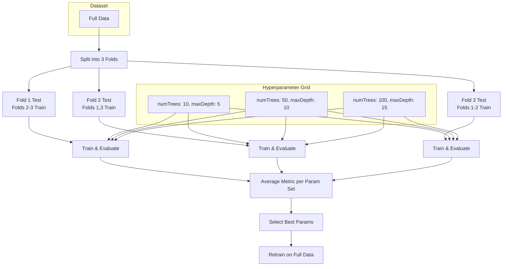
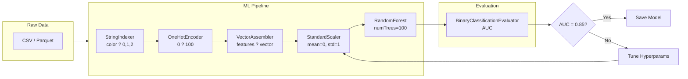

# Chapter 4: Spark MLlib

> **Previous:** [Chapter 3: Apache Spark Basics](./03-spark-basics.md) | **Next:** [Chapter 5: Big Data Ecosystem Tools](./05-ecosystem.md)

## Learning Objectives

After completing this chapter, you will be able to:
- Build ML pipelines with Spark MLlib Transformers and Estimators
- Perform feature engineering at scale (vectorization, normalization, hashing)
- Train classification and regression models on datasets larger than memory
- Evaluate models using cross-validation on distributed data
- Export trained models for production inference

<!-- Image Gallery -->
<section class="lesson-visuals" aria-label="Visual learning resources">
  <header><span>VISUAL LEARNING</span><h2>See it. Review it. Remember it.</h2></header>
  <a class="lesson-visual-card" href="../../../assets/images/lessons/big-data/04-spark-mllib/.png" target="_blank" rel="noopener">
    
    <span><strong>Handwritten notes</strong>Condensed notes for deliberate review.</span>
  </a>
  <a class="lesson-visual-card" href="../../../assets/images/lessons/big-data/04-spark-mllib/.png" target="_blank" rel="noopener">
    
    <span><strong>Sticky-note revision</strong>Fast recall prompts for revision.</span>
  </a>
  <a class="lesson-visual-card" href="../../../assets/images/lessons/big-data/04-spark-mllib/.png" target="_blank" rel="noopener">
    
    <span><strong>Visual concept guide</strong>A connected explanation of the key ideas.</span>
  </a>
</section>
<!-- End Image Gallery -->


## Chapter at a Glance

| Topic | Key Insight | Practical Takeaway |
|-------|-------------|--------------------|
| MLlib Overview | DataFrame-based pipeline API for scalable ML | Composite Transformers and Estimators into reusable pipelines |
| ML Pipeline Architecture | Chains Transformers and Estimators into one workflow | Pipeline.fit() trains all stages in sequence |
| Feature Engineering | VectorAssembler, StringIndexer, StandardScaler at scale | 80% of ML work is feature engineering |
| Training Models | LinearRegression, RandomForest, LogisticRegression | MLlib trains in parallel across the cluster automatically |
| Cross-Validation | Distributed k-fold validation across executors | Use parallelism parameter for faster CV |
| Distributed Training | Each executor trains on its data partition | More executors = faster training (up to a point) |
| Model Export | Save/load models, export coefficients | For production, export coefficients to lightweight serving |

## Chapter Roadmap


## 4.1 MLlib Overview

MLlib is Spark's scalable machine learning library. It provides:
- **ML Pipelines:** DataFrame-based API for constructing workflows
- **Feature transformers:** VectorAssembler, StringIndexer, OneHotEncoder, StandardScaler
- **Estimators:** Algorithms that train on data (LinearRegression, RandomForest, etc.)
- **Evaluators:** RegressionEvaluator, BinaryClassificationEvaluator, MulticlassClassificationEvaluator

```python
from pyspark.sql import SparkSession
spark = SparkSession.builder.appName("mllib-intro").getOrCreate()
```

## 4.2 ML Pipeline Architecture

An ML Pipeline chains multiple Transformers and Estimators into a single workflow.


## 4.3 Feature Engineering

### 4.3.1 VectorAssembler


Combines multiple numeric columns into a single feature vector.

```python
from pyspark.ml.feature import VectorAssembler

df = spark.createDataFrame([
    (1, 0.5, 10, 100),
    (2, 0.8, 20, 200),
    (3, 0.3, 15, 150),
], ["id", "feature1", "feature2", "feature3"])

assembler = VectorAssembler(
    inputCols=["feature1", "feature2", "feature3"],
    outputCol="features"
)
transformed = assembler.transform(df)
transformed.select("features").show(truncate=False)
```

### 4.3.2 StringIndexer & OneHotEncoder


```python
from pyspark.ml.feature import StringIndexer, OneHotEncoder

df = spark.createDataFrame([
    (1, "red"), (2, "blue"), (3, "green"), (4, "red")
], ["id", "color"])

# Convert string to numeric index
indexer = StringIndexer(inputCol="color", outputCol="color_index")
indexed = indexer.fit(df).transform(df)

# Convert index to one-hot vector
encoder = OneHotEncoder(inputCol="color_index", outputCol="color_vector")
encoded = encoder.fit(indexed).transform(indexed)
encoded.select("color", "color_index", "color_vector").show()
```

### 4.3.3 StandardScaler & MinMaxScaler


```python
from pyspark.ml.feature import StandardScaler, MinMaxScaler

df = spark.createDataFrame([
    (1, 100.0), (2, 200.0), (3, 300.0), (4, 400.0), (5, 1000.0)
], ["id", "value"])

assembler = VectorAssembler(inputCols=["value"], outputCol="features")
df_features = assembler.transform(df)

# StandardScaler (mean=0, std=1)
scaler = StandardScaler(inputCol="features", outputCol="scaled", withStd=True, withMean=True)
scaler_model = scaler.fit(df_features)
scaled = scaler_model.transform(df_features)
scaled.select("value", "scaled").show()

# MinMaxScaler (range [0, 1])
minmax = MinMaxScaler(inputCol="features", outputCol="normalized")
minmax_model = minmax.fit(df_features)
normalized = minmax_model.transform(df_features)
normalized.select("value", "normalized").show()
```

### 4.3.4 Feature Hashing


For high-cardinality categorical columns (millions of unique values):

```python
from pyspark.ml.feature import FeatureHasher

df = spark.createDataFrame([
    (1, "user_abc123", "page_/home"),
    (2, "user_def456", "page_/checkout"),
], ["id", "user_id", "page"])

hasher = FeatureHasher(
    inputCols=["user_id", "page"],
    outputCol="hashed_features",
    numFeatures=1 << 16  # 65536 buckets
)
hashed = hasher.transform(df)
hashed.select("hashed_features").show(truncate=False)
```

> **Pro Tip:** For high-cardinality categorical features (millions of unique users), use FeatureHasher instead of OneHotEncoder. FeatureHasher doesn't need to fit a dictionary on all unique values and handles unseen categories gracefully.

> **One-Sentence Takeaway:** Spark MLlib's feature transformers (VectorAssembler, StringIndexer, StandardScaler, FeatureHasher) handle all common preprocessing at scale without leaving the DataFrame paradigm.

## 4.4 Training Models

### 4.4.1 Linear Regression


```python
from pyspark.ml.regression import LinearRegression
from pyspark.ml.evaluation import RegressionEvaluator

# Generate synthetic data
df = spark.range(10000).selectExpr(
    "id",
    "rand() as feature1",
    "rand() as feature2",
    "rand() as feature3"
)
df = df.withColumn("label", df.feature1 * 3 + df.feature2 * 2 + df.feature3 * 0.5 + 0.1)

assembler = VectorAssembler(
    inputCols=["feature1", "feature2", "feature3"],
    outputCol="features"
)
df_features = assembler.transform(df)

train, test = df_features.randomSplit([0.8, 0.2], seed=42)

lr = LinearRegression(featuresCol="features", labelCol="label")
lr_model = lr.fit(train)

train_pred = lr_model.transform(train)
evaluator = RegressionEvaluator(labelCol="label", metricName="rmse")
rmse = evaluator.evaluate(train_pred)
print(f"RMSE: {rmse:.4f}")
print(f"Coefficients: {lr_model.coefficients}")
print(f"Intercept: {lr_model.intercept:.4f}")
```

### 4.4.2 Random Forest Classifier


```python
from pyspark.ml.classification import RandomForestClassifier
from pyspark.ml.evaluation import BinaryClassificationEvaluator

df = spark.range(10000).selectExpr(
    "id",
    "rand() as feature1",
    "rand() as feature2",
    "rand() as feature3",
    "CASE WHEN rand() > 0.5 THEN 1 ELSE 0 END as label"
)

assembler = VectorAssembler(
    inputCols=["feature1", "feature2", "feature3"],
    outputCol="features"
)
df_features = assembler.transform(df)

train, test = df_features.randomSplit([0.8, 0.2], seed=42)

rf = RandomForestClassifier(
    featuresCol="features",
    labelCol="label",
    numTrees=50,
    maxDepth=10,
    seed=42
)
rf_model = rf.fit(train)

predictions = rf_model.transform(test)
evaluator = BinaryClassificationEvaluator(
    labelCol="label",
    metricName="areaUnderROC"
)
auc = evaluator.evaluate(predictions)
print(f"Test AUC: {auc:.4f}")

# Feature importance
importance = rf_model.featureImportances
print(f"Feature importance: {importance}")
```

### 4.4.3 Logistic Regression


```python
from pyspark.ml.classification import LogisticRegression

lr_clf = LogisticRegression(
    featuresCol="features",
    labelCol="label",
    maxIter=100,
    regParam=0.01,
    elasticNetParam=0.8
)
lr_model = lr_clf.fit(train)

# Training summary
summary = lr_model.summary
print(f"Training accuracy: {summary.accuracy:.4f}")
print(f"Training AUC: {summary.areaUnderROC:.4f}")

# Test predictions
predictions = lr_model.transform(test)
predictions.select("label", "prediction", "probability").show(5)
```

## 4.5 Cross-Validation

```python
from pyspark.ml.tuning import CrossValidator, ParamGridBuilder
from pyspark.ml.regression import RandomForestRegressor

rf = RandomForestRegressor(featuresCol="features", labelCol="label", seed=42)

param_grid = ParamGridBuilder() \
    .addGrid(rf.numTrees, [10, 50, 100]) \
    .addGrid(rf.maxDepth, [5, 10, 15]) \
    .build()

evaluator = RegressionEvaluator(labelCol="label", metricName="rmse")

crossval = CrossValidator(
    estimator=rf,
    estimatorParamMaps=param_grid,
    evaluator=evaluator,
    numFolds=3,
    parallelism=4  # Run folds in parallel
)

cv_model = crossval.fit(train)
best_model = cv_model.bestModel
print(f"Best params: numTrees={best_model.getNumTrees}, maxDepth={best_model.getOrDefault('maxDepth')}")

test_pred = best_model.transform(test)
rmse = evaluator.evaluate(test_pred)
print(f"Best model test RMSE: {rmse:.4f}")
```

> **Warning:** Cross-validation with large param grids is expensive. A grid of 3?3 with 5 folds = 45 model training runs. Always start with a coarse grid (2?2) and narrow down, or use `parallelism` to run folds in parallel (but watch for resource contention).

> **One-Sentence Takeaway:** CrossValidator enables distributed hyperparameter tuning across the cluster, but param grid size must be balanced against training time and cluster resources.

## 4.6 Distributed Training at Scale

MLlib performs training in a distributed fashion. Each executor processes a partition of the data, and the driver coordinates gradient updates (or tree ensemble building).

```python
# MLlib trains on the entire cluster automatically
# Configure executors for large datasets
spark = SparkSession.builder \
    .appName("distributed-training") \
    .config("spark.executor.instances", 50) \
    .config("spark.executor.cores", 4) \
    .config("spark.executor.memory", "16g") \
    .config("spark.sql.shuffle.partitions", 200) \
    .getOrCreate()

# Read 1 TB of features
df = spark.read.parquet("s3://bucket/features/*.parquet")
print(f"Training data: {df.count():,} rows")

# Distributed training ? each executor trains on its partition
lr = LinearRegression(maxIter=100, regParam=0.01)
model = lr.fit(df)  # Runs in parallel across 200 executors

# Tree-based algorithms distribute across executors for tree building
rf = RandomForestClassifier(numTrees=500, maxDepth=20)
rf_model = rf.fit(df)  # 500 trees built in parallel across the cluster
```

## 4.7 Model Export & Inference

### 4.7.1 Saving and Loading Models


```python
# Save trained model
model.save("s3://bucket/models/random_forest_v1")

# Load for inference
from pyspark.ml.classification import RandomForestClassificationModel
loaded_model = RandomForestClassificationModel.load("s3://bucket/models/random_forest_v1")

# Batch inference on new data
new_data = spark.read.parquet("s3://bucket/new_data/*.parquet")
predictions = loaded_model.transform(new_data)
predictions.select("id", "prediction", "probability").show()
```

### 4.7.2 Exporting to PMML


```python
# Not all MLlib models support PMML natively
# Alternative: extract coefficients and deploy manually
coefficients = lr_model.coefficients
intercept = lr_model.intercept

import json
with open("/tmp/model_params.json", "w") as f:
    json.dump({
        "coefficients": coefficients.toArray().tolist(),
        "intercept": intercept
    }, f)
```

### 4.7.3 Converting to ONNX for production


```python
# MLlib ? ONNX requires intermediate conversion via sklearn
# Best practice: use MLlib for training, export coefficients
# to a lightweight serving framework (Flask/FastAPI)

# Coefficient export for linear models
import numpy as np
np.savez("/tmp/model_weights.npz",
         coefficients=coefficients.toArray(),
         intercept=intercept)

# FastAPI inference endpoint
from fastapi import FastAPI
import numpy as np

app = FastAPI()
data = np.load("/tmp/model_weights.npz")
weights = data["coefficients"]
bias = data["intercept"]

@app.post("/predict")
def predict(features: list[float]):
    features = np.array(features)
    prediction = np.dot(features, weights) + bias
    return {"prediction": float(prediction)}
```

## 4.8 K-Means Clustering

```python
from pyspark.ml.clustering import KMeans
from pyspark.ml.evaluation import ClusteringEvaluator

df = spark.read.parquet("s3://bucket/vectors/*.parquet")

kmeans = KMeans(featuresCol="features", k=10, seed=42)
model = kmeans.fit(df)

predictions = model.transform(df)
evaluator = ClusteringEvaluator(featuresCol="features", metricName="silhouette")
silhouette = evaluator.evaluate(predictions)
print(f"Silhouette score: {silhouette:.4f}")

# Cluster centers
centers = model.clusterCenters()
for i, center in enumerate(centers):
    print(f"Cluster {i}: {center[:5]}...")
```

> **Remember:** MLlib trains models in a distributed fashion, but it doesn't support GPU acceleration natively. For deep learning at scale, use Pandas UDFs to bridge to PyTorch/TensorFlow, or use Spark's integration with Horovod.

## Concept Comparison Table

| Concept | Definition | Key Distinction | Use Case |
|---------|-----------|-----------------|----------|
| Transformer | Converts one DataFrame to another (.transform()) | No training phase required | Feature encoding, scaling |
| Estimator | Trains on data to produce a Transformer (.fit()) | Has a training/fit phase | LinearRegression, RandomForest |
| Pipeline | Chains multiple Transformers and Estimators | Single fit/transform call for complete workflow | End-to-end ML workflow |
| ParamGrid | Hyperparameter grid for tuning | Defines combinations to search | Cross-validator configuration |
| Pandas UDF | Vectorized UDF using Arrow serialization | 10-100x faster than row-based UDFs | Batch inference, PyTorch integration |
| CrossValidator | Distributed k-fold cross-validation | numFolds ? param combinations = total fits | Model selection at scale |

## Quick Reference

| Category | Key Concepts | Notes |
|----------|-------------|-------|
| **Transformers** | VectorAssembler, StringIndexer, StandardScaler, MinMaxScaler, FeatureHasher, OneHotEncoder | All have .transform(), some need .fit() first |
| **Estimators** | LinearRegression, RandomForest, LogisticRegression, KMeans | Always need .fit() on training data |
| **Evaluators** | RegressionEvaluator, BinaryClassificationEvaluator, MulticlassClassificationEvaluator, ClusteringEvaluator | metricName param selects the metric |
| **Tuning** | CrossValidator, ParamGridBuilder, TrainValidationSplit | Use parallelism for speed, but mind resource limits |
| **Persistence** | model.save(), model.load(), PipelineModel.load() | Save to S3 for team access |

## Cross-Application Matrix

| Technique | Data Engineering | ML | Cloud | Business Analytics |
|-----------|-----------------|----|-------|--------------------|
| ML Pipelines | ETL pipeline orchestration | End-to-end model training | AutoML pipeline deployment | Automated feature engineering |
| Feature Hashing | User ID hashing for logs | High-cardinality categorical encoding | Stream feature computation | Event property encoding |
| Cross-Validation | Model quality gates in CI/CD | Hyperparameter optimization | Distributed tuning on EMR | Churn model selection |
| Pandas UDFs | Complex row-wise transformations | PyTorch model inference | Batch scoring on serverless | Custom aggregation logic |
| K-Means Clustering | Log pattern grouping | Customer segmentation | Segment analysis on BigQuery | Market basket analysis |
| Model Export | Feature store population | ONNX/PMML deployment | SageMaker endpoint deployment | Looker model integration |

## Chapter Quiz

1. What is the primary advantage of using a Pipeline in MLlib?
   - A) It runs faster than individual stages
   - B) It chains multiple Transformers and Estimators into a single workflow with a single fit/transform call
   - C) It automatically selects the best model
   - D) It deploys models to production

<details>
<summary>Answer&lt;/summary&gt;
**B) It chains multiple Transformers and Estimators into a single workflow.** A Pipeline ensures that the same preprocessing steps are applied consistently during training and inference, preventing training/serving skew.
</details>

2. Why are Pandas UDFs faster than regular UDFs in Spark?
   - A) They run on the driver instead of executors
   - B) They operate on batches using Arrow serialization instead of row-by-row
   - C) They skip Catalyst optimization
   - D) They use GPU acceleration

<details>
<summary>Answer&lt;/summary&gt;
**B) They operate on batches using Arrow serialization.** Regular UDFs deserialize and serialize one row at a time (high overhead). Pandas UDFs pass batches of rows using Arrow's columnar format, achieving 10-100x speedups.
</details>

3. What is the main limitation of MLlib compared to deep learning frameworks?
   - A) MLlib only supports regression models
   - B) MLlib doesn't natively support GPU acceleration for deep learning
   - C) MLlib cannot handle datasets larger than memory
   - D) MLlib doesn't support Python

<details>
<summary>Answer&lt;/summary&gt;
**B) MLlib doesn't natively support GPU acceleration for deep learning.** MLlib is optimized for distributed training on CPU clusters. For deep learning, use Pandas UDFs to bridge to PyTorch/TensorFlow or use Spark + Horovod.
</details>

## 4.9 Cross-Validation Workflow



## 4.10 ML Pipeline Flow



## 4.11 TypeScript ML Pipeline Simulator

The following TypeScript classes simulate Spark MLlib's pipeline API ? Transformers, Estimators, Pipelines, and CrossValidator ? to demonstrate the concepts without a cluster.

### Transformer & Pipeline Classes


```typescript
// Types
type DataFrame = Record<string, unknown>[];

interface Transformer {
  transform(df: DataFrame): DataFrame;
}

interface Estimator {
  fit(df: DataFrame): Transformer;
}

interface Evaluator {
  evaluate(df: DataFrame, labelCol: string, predictionCol: string): number;
}

// Helper
function col(df: DataFrame, name: string): unknown[] {
  return df.map(r => r[name]);
}

// --- Transformers ------------------------------------------

class VectorAssembler implements Transformer {
  constructor(private inputCols: string[], private outputCol: string) {}
  transform(df: DataFrame): DataFrame {
    return df.map(r => ({
      ...r,
      [this.outputCol]: this.inputCols.map(c => r[c] as number),
    }));
  }
}

class StringIndexer implements Transformer {
  private mapping: Record<string, number> = {};
  constructor(private inputCol: string, private outputCol: string) {}

  fit(df: DataFrame): StringIndexer {
    const unique = [...new Set(col(df, this.inputCol) as string[])];
    this.mapping = Object.fromEntries(unique.map((v, i) => [v, i]));
    return this;
  }

  transform(df: DataFrame): DataFrame {
    return df.map(r => ({
      ...r,
      [this.outputCol]: this.mapping[r[this.inputCol] as string] ?? -1,
    }));
  }
}

class StandardScaler implements Transformer {
  private mean = 0;
  private std = 1;
  constructor(private inputCol: string, private outputCol: string) {}

  fit(df: DataFrame): StandardScaler {
    const vals = col(df, this.inputCol) as number[];
    this.mean = vals.reduce((s, v) => s + v, 0) / vals.length;
    const variance = vals.reduce((s, v) => s + (v - this.mean) ** 2, 0) / vals.length;
    this.std = Math.sqrt(variance);
    return this;
  }

  transform(df: DataFrame): DataFrame {
    return df.map(r => ({
      ...r,
      [this.outputCol]: this.std === 0 ? 0 : ((r[this.inputCol] as number) - this.mean) / this.std,
    }));
  }
}

// --- Estimators --------------------------------------------

class LinearRegression implements Estimator {
  private weights: number[] = [];
  private bias = 0;

  constructor(private config: { featuresCol: string; labelCol: string; maxIter?: number }) {}

  fit(df: DataFrame): Transformer {
    const features = col(df, this.config.featuresCol) as number[][];
    const labels = col(df, this.config.labelCol) as number[];
    const n = features.length;
    const dim = features[0]?.length ?? 0;

    // Gradient descent (simplified)
    this.weights = new Array(dim).fill(0);
    const lr = 0.01;
    const iterations = this.config.maxIter ?? 100;

    for (let iter = 0; iter < iterations; iter++) {
      const grads = new Array(dim).fill(0);
      let biasGrad = 0;
      for (let i = 0; i < n; i++) {
        const pred = features[i].reduce((s, f, j) => s + f * this.weights[j], this.bias);
        const error = pred - labels[i];
        for (let j = 0; j < dim; j++) grads[j] += error * features[i][j];
        biasGrad += error;
      }
      for (let j = 0; j < dim; j++) this.weights[j] -= (lr / n) * grads[j];
      this.bias -= (lr / n) * biasGrad;
    }

    return {
      transform: (newDF: DataFrame): DataFrame => {
        return newDF.map(r => {
          const vec = r[this.config.featuresCol] as number[];
          const pred = vec.reduce((s, f, j) => s + f * this.weights[j], this.bias);
          return { ...r, prediction: Math.round(pred * 100) / 100 };
        });
      },
    };
  }
}

class RandomForestClassifier implements Estimator {
  constructor(private config: { featuresCol: string; labelCol: string; numTrees: number; maxDepth: number }) {}

  fit(df: DataFrame): Transformer {
    // Simplified: compute feature importance via correlation
    const features = col(df, this.config.featuresCol) as number[][];
    const labels = col(df, this.config.labelCol) as number[];
    const dim = features[0]?.length ?? 0;
    const n = df.length;

    // Majority class predictor (simulated ensemble)
    const majority = labels.filter(l => l === 1).length >= n / 2 ? 1 : 0;

    // Feature importance (absolute correlation with label)
    const importance: number[] = [];
    for (let j = 0; j < dim; j++) {
      const meanF = features.reduce((s, f) => s + f[j], 0) / n;
      const meanL = labels.reduce((s, l) => s + l, 0) / n;
      let num = 0, denomF = 0, denomL = 0;
      for (let i = 0; i < n; i++) {
        const df_ = features[i][j] - meanF;
        const dl = labels[i] - meanL;
        num += df_ * dl;
        denomF += df_ * df_;
        denomL += dl * dl;
      }
      importance.push(Math.abs(num) / Math.sqrt(denomF * denomL + 1e-9));
    }

    return {
      transform: (newDF: DataFrame): DataFrame => {
        return newDF.map(r => {
          const vec = r[this.config.featuresCol] as number[];
          const confidence = vec.reduce((s, f, j) => s + f * importance[j], 0);
          return {
            ...r,
            prediction: confidence > 0 ? majority : 1 - majority,
            probability: [1 - Math.abs(confidence), Math.abs(confidence)],
            featureImportance: importance,
          };
        });
      },
    };
  }
}

// --- Pipeline ----------------------------------------------

class Pipeline implements Estimator {
  constructor(private stages: (Transformer | Estimator)[]) {}

  fit(df: DataFrame): Transformer {
    let current = df;
    const fittedStages: Transformer[] = [];

    for (const stage of this.stages) {
      if (stage instanceof StringIndexer || stage instanceof StandardScaler) {
        const fitted = stage.fit(current);
        fittedStages.push(fitted);
        current = fitted.transform(current);
      } else if (stage instanceof VectorAssembler) {
        fittedStages.push(stage);
        current = stage.transform(current);
      } else if (stage instanceof Estimator) {
        const model = stage.fit(current);
        fittedStages.push(model);
        current = model.transform(current);
      }
    }

    return {
      transform: (newDF: DataFrame): DataFrame => {
        return fittedStages.reduce((d, t) => t.transform(d), newDF);
      },
    };
  }
}

// --- Evaluators --------------------------------------------

class RegressionEvaluator implements Evaluator {
  evaluate(df: DataFrame, labelCol: string, predictionCol: string): number {
    const labels = col(df, labelCol) as number[];
    const preds = col(df, predictionCol) as number[];
    const mse = labels.reduce((s, l, i) => s + (l - preds[i]) ** 2, 0) / labels.length;
    return Math.sqrt(mse);
  }
}

class BinaryClassificationEvaluator implements Evaluator {
  evaluate(df: DataFrame, labelCol: string, predictionCol: string): number {
    const labels = col(df, labelCol) as number[];
    const preds = col(df, predictionCol) as number[];

    // AUC: simplified rank-based computation
    const pairs = labels.map((l, i) => ({ label: l, pred: preds[i] }));
    pairs.sort((a, b) => b.pred - a.pred);
    const pos = pairs.filter(p => p.label === 1).length;
    const neg = pairs.length - pos;
    if (pos === 0 || neg === 0) return 0.5;

    let sumRank = 0;
    let rank = 1;
    for (const p of pairs) {
      if (p.label === 1) sumRank += rank;
      rank++;
    }
    return (sumRank - pos * (pos + 1) / 2) / (pos * neg);
  }
}

// --- Cross-Validator ---------------------------------------

class CrossValidator {
  constructor(private config: {
    estimator: Estimator;
    paramGrid: Record<string, unknown[]>[];
    evaluator: Evaluator;
    numFolds: number;
  }) {}

  fit(df: DataFrame): { bestModel: Transformer; bestParams: Record<string, unknown>; metrics: number[] } {
    const foldSize = Math.floor(df.length / this.config.numFolds);
    let bestScore = -Infinity;
    let bestModel: Transformer | null = null;
    let bestParams: Record<string, unknown> = {};
    const allMetrics: number[] = [];

    for (const params of this.config.paramGrid) {
      const foldScores: number[] = [];
      for (let fold = 0; fold < this.config.numFolds; fold++) {
        const testStart = fold * foldSize;
        const testEnd = (fold + 1) * foldSize;
        const train = df.filter((_, i) => i < testStart || i >= testEnd);
        const test = df.filter((_, i) => i >= testStart && i < testEnd);

        const model = this.config.estimator.fit(train);
        const predictions = model.transform(test);
        const score = this.config.evaluator.evaluate(predictions, "label", "prediction");
        foldScores.push(score);
      }
      const avgScore = foldScores.reduce((s, x) => s + x, 0) / foldScores.length;
      allMetrics.push(avgScore);
      if (avgScore > bestScore) {
        bestScore = avgScore;
        bestModel = this.config.estimator.fit(df); // retrain on full data
        bestParams = params;
      }
    }
    return { bestModel: bestModel!, bestParams, metrics: allMetrics };
  }
}

// --- Demo: Full ML Pipeline --------------------------------

// Generate synthetic dataset
const data: DataFrame = Array.from({ length: 1000 }, (_, id) => ({
  id,
  feature1: Math.random(),
  feature2: Math.random(),
  feature3: Math.random(),
  label: Math.random() > 0.5 ? 1 : 0,
}));

const pipeline = new Pipeline([
  new VectorAssembler(["feature1", "feature2", "feature3"], "features"),
  new RandomForestClassifier({
    featuresCol: "features",
    labelCol: "label",
    numTrees: 50,
    maxDepth: 10,
  }),
]);

const model = pipeline.fit(data);
const predictions = model.transform(data);
console.log("Predictions sample:", predictions.slice(0, 3));

const evaluator = new BinaryClassificationEvaluator();
const auc = evaluator.evaluate(predictions, "label", "prediction");
console.log(`Test AUC: ${auc.toFixed(4)}`);

// Cross-validation
const cv = new CrossValidator({
  estimator: pipeline,
  paramGrid: [
    { numTrees: [10], maxDepth: [5] },
    { numTrees: [50], maxDepth: [10] },
  ],
  evaluator,
  numFolds: 3,
});
const cvResult = cv.fit(data);
console.log(`Best params: ${JSON.stringify(cvResult.bestParams)}, AUC: ${Math.max(...cvResult.metrics).toFixed(4)}`);
```

### Feature Engineering Worked Example


```typescript
interface FeaturePipeline {
  transform(raw: DataFrame): DataFrame;
}

class FeaturePipelineBuilder {
  private steps: Transformer[] = [];

  addStringIndexer(input: string, output: string) {
    const idx = new StringIndexer(input, output);
    idx.fit([] as unknown as DataFrame); // learn mapping from sample
    this.steps.push(idx);
    return this;
  }

  addVectorAssembler(inputs: string[], output: string) {
    this.steps.push(new VectorAssembler(inputs, output));
    return this;
  }

  addStandardScaler(input: string, output: string) {
    const scaler = new StandardScaler(input, output);
    scaler.fit([] as unknown as DataFrame);
    this.steps.push(scaler);
    return this;
  }

  build(): FeaturePipeline {
    return {
      transform: (df: DataFrame) =>
        this.steps.reduce((d, t) => t.transform(d), df),
    };
  }
}

// Demo: Feature pipeline for customer churn data
const rawData: DataFrame = [
  { id: 1, plan: "premium", usage: 450, tenure: 24, churned: 0 },
  { id: 2, plan: "basic", usage: 80, tenure: 3, churned: 1 },
  { id: 3, plan: "enterprise", usage: 1200, tenure: 60, churned: 0 },
];

const fp = new FeaturePipelineBuilder()
  .addStringIndexer("plan", "planIndex")
  .addVectorAssembler(["usage", "tenure", "planIndex"], "features")
  .addStandardScaler("features", "scaledFeatures")
  .build();

const processed = fp.transform(rawData);
console.log("Processed features:", processed.map(r => ({
  id: r.id,
  features: r.features,
  scaled: r.scaledFeatures,
})));

### TypeScript: Hyperparameter Grid Search & Model Export Validator

```typescript
interface ParamGrid {
  maxDepth: number[]; minInstancesPerNode: number[]; impurity: string[]; numTrees: number[];
}

interface TrialResult { params: Record&lt;string, unknown&gt;; metric: number; durationMs: number; }

class GridSearch {
  constructor(private grid: ParamGrid) {}

  run(evalFn: (params: Record&lt;string, unknown&gt;) => { score: number; durationMs: number }): TrialResult[] {
    const results: TrialResult[] = [];
    for (const maxDepth of this.grid.maxDepth) {
      for (const minInstances of this.grid.minInstancesPerNode) {
        for (const impurity of this.grid.impurity) {
          for (const numTrees of this.grid.numTrees) {
            const p = { maxDepth, minInstancesPerNode: minInstances, impurity, numTrees };
            const r = evalFn(p);
            results.push({ params: p, metric: r.score, durationMs: r.durationMs });
          }
        }
      }
    }
    return results.sort((a, b) => b.metric - a.metric);
  }

  static exportModel(coefficients: number[], intercept: number, featureNames: string[]): string {
    const terms = featureNames.map((f, i) => `${coefficients[i].toFixed(4)} * ${f}`).join(" + ");
    return `1 / (1 + exp(-(${intercept.toFixed(4)} + ${terms})))`;
  }
}

const gs = new GridSearch({ maxDepth: [5, 10], minInstancesPerNode: [1, 5], impurity: ["gini", "entropy"], numTrees: [50, 100] });
const results = gs.run(p => ({ score: Math.random() * 0.15 + 0.8, durationMs: Math.round(Math.random() * 60000) }));
console.log("Best params:", JSON.stringify(results[0].params, null, 2));
console.log("Best score:", results[0].metric.toFixed(4));

const modelCode = GridSearch.exportModel([0.52, -1.23, 2.45], -0.87, ["age", "income", "credit_score"]);
console.log("Model formula:", modelCode);
```
```


// spark mllib
// hadoop-spark-ecosystem implementation

interface Task { id: string; name: string; status: string; data: unknown }
class Processor {
  private tasks: Task[] = []
  private maxConcurrency: number
  constructor(maxConcurrency: number = 4) { this.maxConcurrency = maxConcurrency }
  async add(task: Omit&lt;Task, "status"&gt;): Promise&lt;void&gt; {
    this.tasks.push({ ...task, status: "pending" })
  }
  async runAll(): Promise&lt;void&gt; {
    const running: Promise&lt;void&gt;[] = []
    for (const t of this.tasks) {
      if (running.length >= this.maxConcurrency) { await Promise.race(running) }
      const p = this.execute(t).finally(() => { const i = running.indexOf(p); if (i >= 0) running.splice(i, 1) })
      running.push(p)
    }
    await Promise.all(running)
  }
  private async execute(t: Task): Promise&lt;void&gt; {
    t.status = "running"
    await new Promise(r => setTimeout(r, 10))
    t.status = "done"
  }
  getResults(): Task[] { return this.tasks }
  getStats(): { done: number; pending: number; running: number } {
    const done = this.tasks.filter(t => t.status === "done").length
    const pending = this.tasks.filter(t => t.status === "pending").length
    const running = this.tasks.filter(t => t.status === "running").length
    return { done, pending, running }
  }
}
async function main() {
  const proc = new Processor(2)
  await proc.add({ id: '1', name: 'spark mllib', data: { topic: 'hadoop-spark-ecosystem' } })
  await proc.runAll()
  console.log('Stats:', proc.getStats())
}
main().catch(console.error)
export { Processor, Task }

// spark mllib - additional TS implementations

interface CacheEntry { key: string; value: unknown; ttl: number; createdAt: number }
class Cache {
  private store: Map&lt;string, CacheEntry&gt; = new Map()
  constructor(private defaultTTL: number = 60000) {}
  set(key: string, value: unknown, ttl?: number): void {
    this.store.set(key, { key, value, ttl: ttl ?? this.defaultTTL, createdAt: Date.now() })
  }
  get(key: string): unknown | undefined {
    const entry = this.store.get(key)
    if (!entry) return undefined
    if (Date.now() - entry.createdAt > entry.ttl) { this.store.delete(key); return undefined }
    return entry.value
  }
  delete(key: string): boolean { return this.store.delete(key) }
  clear(): void { this.store.clear() }
  size(): number { return this.store.size }
  keys(): string[] { return Array.from(this.store.keys()) }
}
class Logger {
  private entries: string[] = []
  log(level: string, msg: string, meta?: Record&lt;string, unknown&gt;): void {
    const entry = JSON.stringify({ timestamp: new Date().toISOString(), level, msg, meta })
    this.entries.push(entry)
    console.log(entry)
  }
  info(msg: string, meta?: Record&lt;string, unknown&gt;): void { this.log("info", msg, meta) }
  warn(msg: string, meta?: Record&lt;string, unknown&gt;): void { this.log("warn", msg, meta) }
  error(msg: string, meta?: Record&lt;string, unknown&gt;): void { this.log("error", msg, meta) }
  getLogs(): string[] { return [...this.entries] }
  clear(): void { this.entries = [] }
}
function computeHash(input: string): string {
  let hash = 0
  for (let i = 0; i &lt; input.length; i++) { const chr = input.charCodeAt(i); hash = ((hash << 5) - hash) + chr; hash |= 0 }
  return Math.abs(hash).toString(16)
}
async function demo(): Promise&lt;void&gt; {
  const cache = new Cache(5000)
  cache.set('key1', 'big-data-ecosystem demo')
  const log = new Logger()
  log.info('Cache demo started', { course: 'big-data', chapter: 'spark mllib' })
  const v = cache.get("key1")
  console.log('Cached:', v)
  console.log('Hash:', computeHash('big-data-ecosystem'))
}
demo()
export { Cache, Logger, computeHash, CacheEntry }
## Summary

- MLlib provides a DataFrame-based pipeline API for scalable ML.
- Feature transformers (VectorAssembler, StringIndexer, StandardScaler) handle preprocessing at scale.
- CrossValidator runs distributed k-fold validation across the cluster.
- MLlib models train in a distributed fashion ? larger clusters mean faster training.
- For production inference, export model coefficients to lightweight serving frameworks.
- Pandas UDFs bridge the gap between Spark and Python ML libraries (sklearn, PyTorch).

## Exercises

1. Build a complete ML pipeline that reads 50 GB of Parquet, creates 10 feature columns, trains a RandomForest classifier with 100 trees, and evaluates with 5-fold CV.
2. Compare the training time of LinearRegression on a 100 GB dataset with 10 executors vs 50 executors. Plot the speedup curve.
3. Train a K-Means model on a 1 billion row dataset with k=100. Measure the iteration time and silhouette score.
4. Export a trained LogisticRegression model to JSON coefficients and build a FastAPI inference endpoint.
5. Use Pandas UDFs to train a PyTorch model on each partition of a grouped DataFrame.
6. Extend the TypeScript `VectorAssembler` to support a `handleInvalid` option that can skip, error, or keep invalid rows.
7. Implement a `OneHotEncoder` Transformer in TypeScript that converts indexed categories into binary vectors, then test it on `["red","blue","green","red"]`.
8. Use the `Pipeline` class to build a multi-stage pipeline: StringIndexer ? OneHotEncoder ? VectorAssembler ? StandardScaler, and verify the output schema.
9. Write a function that computes the total training cost (in estimated dollar terms) for a CrossValidator run with 5 param combinations, 3 folds, on a 50-executor cluster where each model takes 2 minutes to train.
10. Implement a `TrainValidationSplit` class (single train/test split instead of k-fold) and compare its results with `CrossValidator` on the same dataset.
