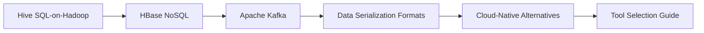

# Chapter 5: Big Data Ecosystem Tools

> **Previous:** [Chapter 4: Spark MLlib](./04-spark-mllib.md) | **Next:** None (Last Chapter)

## Learning Objectives

After completing this chapter, you will be able to:
- Describe Hive, HBase, Kafka, and their roles in the ecosystem
- Choose between SQL-on-Hadoop tools (Hive vs Presto vs Spark SQL)
- Explain when to use column-family stores (HBase) vs columnar formats (Parquet)
- Set up and use Kafka for streaming data ingestion
- Compare legacy Hadoop tools with modern cloud-native alternatives

## Chapter at a Glance

| Topic | Key Insight | Practical Takeaway |
|-------|-------------|--------------------|
| Hive — SQL-on-Hadoop | Translates HiveQL into MapReduce/Tez jobs | Being replaced by Spark SQL and Presto for most use cases |
| HBase — Column-Family NoSQL | Low-latency random read/write on HDFS | Row key design is critical — avoid monotonically increasing keys |
| Apache Kafka | Distributed streaming platform | The de-facto standard for data ingestion and event-driven architecture |
| Data Serialization | Parquet for analytics, Avro for streaming | Choosing the right format is a 10x performance decision |
| Cloud-Native Alternatives | S3 + Spark + Kafka MSK replaces Hadoop ecosystem | Learn concepts, not specific tools |

## Chapter Roadmap




## 5.1 Hive — SQL-on-Hadoop

Apache Hive provides a SQL interface to data stored in HDFS. It translates HiveQL queries into MapReduce (or Tez/Spark) jobs.

### 5.1.1 Hive Architecture

```sql
-- Create a Hive table backed by HDFS
CREATE EXTERNAL TABLE logs (
    log_ts TIMESTAMP,
    level STRING,
    message STRING
)
ROW FORMAT DELIMITED
FIELDS TERMINATED BY ","
LOCATION "/data/logs/";

-- Query (translated to MapReduce/Tez)
SELECT level, count(*) as cnt
FROM logs
WHERE log_ts >= "2026-01-01"
GROUP BY level
ORDER BY cnt DESC;
```

### 5.1.2 Hive vs Spark SQL vs Presto

| Feature | Hive | Spark SQL | Presto/Trino |
|---------|------|-----------|--------------|
| Engine | MapReduce/Tez | Spark | Custom MPP |
| Latency | Minutes | Seconds | Seconds |
| ANSI SQL | Partial | Good | Excellent |
| UDFs | Java/Python | Python/SQL/Java | Java |
| ACID | Yes (Transactions) | No | No |
| Best for | Batch ETL, legacy pipelines | Unified batch+ML | Ad-hoc interactive queries |

> **One-Sentence Takeaway:** Hive provides SQL access to HDFS data but is being outpaced by Spark SQL (for batch) and Presto/Trino (for interactive queries) — choose the engine based on latency requirements.

## 5.2 HBase — Column-Family NoSQL

Apache HBase is a distributed, column-oriented NoSQL database modeled after Google Bigtable. It runs on top of HDFS.

### 5.2.1 HBase Data Model

```
Table: events
Row Key         | Column Family: meta          | Column Family: payload
----------------|------------------------------|------------------------------
user_001_ts_abc | meta:user_id = "001"         | payload:event_type = "click"
                | meta:timestamp = 1700000000  | payload:page_url = "/home"

user_001_ts_abd | meta:user_id = "001"         | payload:event_type = "purchase"
                | meta:timestamp = 1700000005  | payload:amount = 29.99
```

### 5.2.2 HBase Operations

```bash
# HBase shell
hbase shell

# Create table
create "events", "meta", "payload"

# Insert
put "events", "row1", "meta:user_id", "001"
put "events", "row1", "payload:event_type", "click"

# Scan with filter
scan "events", {LIMIT => 10}

# Get single row
get "events", "row1"
```

### 5.2.3 HBase Row Key Design

Row key design is critical for performance. Monotonically increasing keys cause hot spotting on a single region server.

```python
import hashlib

# Bad: timestamp prefix causes hot spotting
bad_key = f"2026-06-12T10:30:00_user_001"

# Good: salted key distributes writes
salt = hashlib.md5(b"user_001").hexdigest()[:2]
good_key = f"{salt}_2026-06-12T10:30:00_user_001"
print(f"Bad: {bad_key}")
print(f"Good: {good_key}")
```

> **Warning:** Row key design is the #1 cause of HBase performance problems in production. Monotonically increasing keys (like timestamps) create hot spots on a single region server. Always salt or hash the key prefix to distribute write load across all region servers.

> **One-Sentence Takeaway:** HBase offers low-latency random access on HDFS, but row key design (salted, not monotonically increasing) determines whether it performs well or collapses under load.

## 5.3 Apache Kafka

Kafka is a distributed streaming platform used for building real-time data pipelines and streaming applications.

### 5.3.1 Kafka Core Concepts

| Concept | Description |
|---------|-------------|
| **Topic** | A category/feed name to which records are published |
| **Partition** | A topic is split into ordered, immutable sequences |
| **Broker** | A Kafka server that stores data and serves clients |
| **Producer** | Publishes records to a topic |
| **Consumer** | Subscribes to topics and processes records |
| **Consumer Group** | Multiple consumers that divide partitions |

### 5.3.2 Kafka CLI

```bash
# Start Kafka (with ZooKeeper)
bin/zookeeper-server-start.sh config/zookeeper.properties
bin/kafka-server-start.sh config/server.properties

# Create a topic
bin/kafka-topics.sh --create \
  --topic events \
  --partitions 10 \
  --replication-factor 3 \
  --bootstrap-server localhost:9092

# Produce messages
bin/kafka-console-producer.sh \
  --topic events \
  --bootstrap-server localhost:9092

# Consume messages
bin/kafka-console-consumer.sh \
  --topic events \
  --from-beginning \
  --bootstrap-server localhost:9092
```

### 5.3.3 Kafka with Python

```python
from kafka import KafkaProducer, KafkaConsumer
import json

# Producer
producer = KafkaProducer(
    bootstrap_servers=["localhost:9092"],
    value_serializer=lambda v: json.dumps(v).encode()
)

for i in range(100):
    producer.send("events", {"id": i, "value": i * 2})
producer.flush()

# Consumer (with auto-commit)
consumer = KafkaConsumer(
    "events",
    bootstrap_servers=["localhost:9092"],
    auto_offset_reset="earliest",
    group_id="my-group",
    value_deserializer=lambda v: json.loads(v.decode())
)

for message in consumer:
    print(f"Partition: {message.partition}, Offset: {message.offset}, Value: {message.value}")
    if message.offset >= 10:
        break

consumer.close()
```

### 5.3.4 Kafka + Spark Streaming

```python
from pyspark.sql import SparkSession
from pyspark.sql.functions import from_json, col
from pyspark.sql.types import StructType, StringType, IntegerType

spark = SparkSession.builder \
    .appName("kafka-streaming") \
    .config("spark.sql.streaming.checkpointLocation", "/tmp/checkpoint") \
    .getOrCreate()

schema = StructType() \
    .add("id", IntegerType()) \
    .add("value", IntegerType())

df = spark \
    .readStream \
    .format("kafka") \
    .option("kafka.bootstrap.servers", "localhost:9092") \
    .option("subscribe", "events") \
    .load()

parsed = df.select(from_json(col("value").cast("string"), schema).alias("data")) \
    .select("data.*")

query = parsed.writeStream \
    .outputMode("append") \
    .format("console") \
    .trigger(processingTime="5 seconds") \
    .start()

query.awaitTermination()
```

> **Pro Tip:** For Kafka consumers, set `auto_offset_reset` to `"earliest"` in development (to replay all data) and `"latest"` in production (to avoid reprocessing old messages). Always set a `group_id` — it's what enables checkpoint-based recovery after a consumer restart.

> **One-Sentence Takeaway:** Kafka is the industry standard for streaming data ingestion, providing durable, ordered, partitioned message queues that integrate natively with Spark Streaming for real-time processing.

## 5.4 Data Serialization Formats

### 5.4.1 Parquet (Analytics)

Columnar storage with predicate pushdown and schema enforcement.

```python
# Spark reads only the columns and row groups needed
df = spark.read.parquet("data/*.parquet")
df.filter(df.year == 2026).select("month", "revenue").show()
# Parquet's min/max stats skip irrelevant row groups
```

### 5.4.2 Avro (Serialization)

Row-oriented format with embedded schema, ideal for Kafka and streaming.

```python
import fastavro

schema = {
    "type": "record",
    "name": "Event",
    "fields": [
        {"name": "id", "type": "int"},
        {"name": "timestamp", "type": "long"},
        {"name": "payload", "type": "string"}
    ]
}

records = [
    {"id": 1, "timestamp": 1700000000, "payload": "login"},
    {"id": 2, "timestamp": 1700000001, "payload": "click"},
]

with open("events.avro", "wb") as f:
    fastavro.writer(f, schema, records)
```

## 5.5 Cloud-Native Alternatives

| Hadoop Tool | Cloud Alternative | Why |
|-------------|------------------|-----|
| HDFS | S3 / GCS / Azure Blob | Pay-per-GB, infinite scale, 11 9's durability |
| MapReduce | EMR / Dataproc / HDInsight (Spark) | 10-100x faster, SQL API |
| Hive | Athena / BigQuery / Redshift | Serverless, zero ops |
| HBase | DynamoDB / Bigtable / Cosmos DB | Managed, auto-scaling |
| Kafka | MSK / Confluent Cloud / PubSub | Managed brokers, no ZooKeeper |
| Oozie | Airflow / Dagster / Prefect | Modern DAGs, Python-native |

## 5.6 When to Use Each Tool

```python
decision = {
    "Need interactive SQL on data lake": "Presto / Trino",
    "Need batch ETL with ML": "Spark",
    "Need real-time stream processing": "Spark Streaming / Flink",
    "Need low-latency key-value lookup": "HBase / DynamoDB / Bigtable",
    "Need reliable message queue": "Kafka",
    "Need data warehouse with ACID": "Hive (ACID) / Snowflake / Redshift",
}
```

> **Remember:** The right tool depends on the workload pattern — there is no one-size-fits-all in the big data ecosystem. Interactive SQL needs Presto, batch ETL needs Spark, streaming needs Kafka/Flink, and low-latency KV stores need HBase/DynamoDB.

## Concept Comparison Table

| Concept | Definition | Key Distinction | Use Case |
|---------|-----------|-----------------|----------|
| Hive | SQL-on-Hadoop with MapReduce/Tez engine | Batch-oriented, ACID support | Legacy ETL pipelines |
| HBase | Column-family NoSQL on HDFS | Random read/write, low latency | Real-time lookups, time-series |
| Kafka | Distributed streaming platform | Durable, ordered message log | Event ingestion, streaming pipelines |
| Parquet | Columnar storage format | Schema embedded, predicate pushdown | Analytical queries |
| Avro | Row-oriented serialization format | Schema embedded in each file | Kafka messages, streaming data |
| Presto/Trino | Distributed SQL query engine | MPP architecture, sub-second latency | Interactive ad-hoc queries |

## Quick Reference

| Category | Key Tools | Notes |
|----------|-----------|-------|
| **SQL-on-Hadoop** | Hive, Spark SQL, Presto/Trino | Hive for batch, Presto for interactive, Spark for unified |
| **NoSQL** | HBase, Cassandra, DynamoDB | HBase on HDFS; Cassandra for multi-DC |
| **Streaming** | Kafka, Spark Streaming, Flink | Kafka for transport; Flink = true streaming |
| **Formats** | Parquet (analytics), Avro (streaming), ORC (Hive) | Never CSV/JSON for production |
| **Cloud Migration** | S3 → HDFS, EMR → MapReduce, Athena → Hive | Every Hadoop tool has a cloud-native equivalent |

## Cross-Application Matrix

| Technique | Data Engineering | ML | Cloud | Business Analytics |
|-----------|-----------------|----|-------|--------------------|
| Hive SQL | Batch ELT transformations | Feature extraction queries | Athena/Glue ETL | Historical reporting |
| HBase | Real-time event storage | Feature store serving | DynamoDB/Bigtable | User profile lookups |
| Kafka | Event data pipeline | Online feature computation | MSK/Confluent Cloud | Real-time dashboards |
| Parquet/Avro | Optimized ETL output | Training data format | S3/Data Lake storage | BI data format |
| Kafka + Spark | Streaming ETL | Real-time feature engineering | Serverless streaming | Real-time analytics |
| Cloud-Native | S3 + EMR pipelines | SageMaker + EMR | Multi-cloud data mesh | Redshift/BigQuery |

## Chapter Quiz

1. Why is Parquet preferred over CSV for analytical workloads in big data?
   - A) Parquet is human-readable
   - B) Parquet stores data column-wise with predicate pushdown and schema
   - C) Parquet is faster to write than CSV
   - D) Parquet supports ACID transactions

<details>
<summary>Answer</summary>
**B) Parquet stores data column-wise with predicate pushdown and schema.** Columnar storage allows query engines to read only the needed columns and skip irrelevant row groups based on statistics, dramatically reducing I/O.
</details>

2. What is the primary role of ZooKeeper in a Kafka cluster?
   - A) To store messages
   - B) To manage cluster metadata, leader election, and consumer group coordination
   - C) To compress message data
   - D) To provide SQL access to Kafka topics

<details>
<summary>Answer</summary>
**B) To manage cluster metadata, leader election, and consumer group coordination.** ZooKeeper maintains the cluster state, tracks broker membership, and manages partition leader elections (though newer Kafka versions use KRaft instead).
</details>

3. What makes HBase row key design critical for performance?
   - A) Row keys are encrypted
   - B) Monotonically increasing keys cause hot spotting on a single region server
   - C) Row keys must be exactly 16 bytes
   - D) Row keys cannot contain numbers

<details>
<summary>Answer</summary>
**B) Monotonically increasing keys cause hot spotting on a single region server.** Sequential keys (like timestamps) route all writes to one region, creating a bottleneck. Salting or hashing the key prefix distributes writes across all region servers.
</details>

## Summary

- Hive provides SQL-on-HDFS but is being replaced by Spark SQL and Presto for most use cases.
- HBase offers low-latency random read/write access on HDFS with careful row key design.
- Kafka is the de-facto standard for streaming data ingestion and event-driven architectures.
- Parquet is the default analytical storage format; Avro is preferred for streaming serialization.
- The trend is cloud-native: S3 + Spark + Kafka MSK replaces most of the Hadoop ecosystem.

## Exercises

1. Set up a Kafka cluster with 3 brokers and create a topic with 6 partitions. Produce 1M messages and consume them with a consumer group of 3 instances.
2. Write a Spark Structured Streaming job that reads from Kafka, aggregates event counts per minute, and writes to Parquet.
3. Compare the read performance of Parquet vs Avro vs CSV for a 10 GB dataset with a selective column query.
4. Design a HBase row key strategy for a time-series table receiving 100K writes/second from 1000 sensors.
5. Translate a legacy Hive ETL pipeline (3 HiveQL queries, 2 intermediate tables) into a Spark SQL job.
