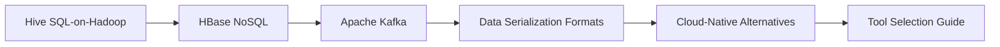
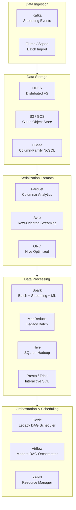
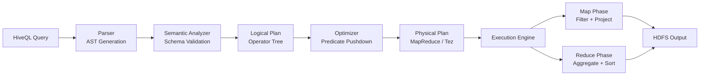
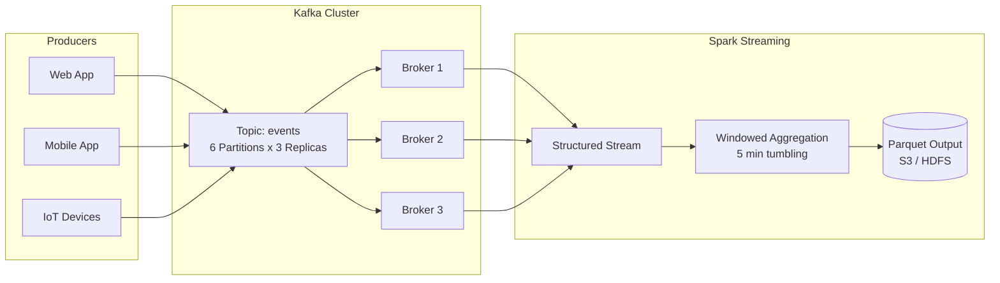
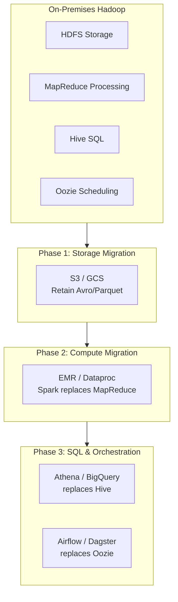

# Chapter 5: Big Data Ecosystem Tools

> **Previous:** [Chapter 4: Spark MLlib](./04-spark-mllib.md) | **Next:** None (Last Chapter)

## Learning Objectives

After completing this chapter, you will be able to:
- Describe Hive, HBase, Kafka, and their roles in the ecosystem
- Choose between SQL-on-Hadoop tools (Hive vs Presto vs Spark SQL)
- Explain when to use column-family stores (HBase) vs columnar formats (Parquet)
- Set up and use Kafka for streaming data ingestion
- Compare legacy Hadoop tools with modern cloud-native alternatives

## Chapter at a Glance

| Topic | Key Insight | Practical Takeaway |
|-------|-------------|--------------------|
| Hive ? SQL-on-Hadoop | Translates HiveQL into MapReduce/Tez jobs | Being replaced by Spark SQL and Presto for most use cases |
| HBase ? Column-Family NoSQL | Low-latency random read/write on HDFS | Row key design is critical ? avoid monotonically increasing keys |
| Apache Kafka | Distributed streaming platform | The de-facto standard for data ingestion and event-driven architecture |
| Data Serialization | Parquet for analytics, Avro for streaming | Choosing the right format is a 10x performance decision |
| Cloud-Native Alternatives | S3 + Spark + Kafka MSK replaces Hadoop ecosystem | Learn concepts, not specific tools |

## Chapter Roadmap




## 5.1 Hive ? SQL-on-Hadoop

Apache Hive provides a SQL interface to data stored in HDFS. It translates HiveQL queries into MapReduce (or Tez/Spark) jobs.

### 5.1.1 Hive Architecture

<a href="../../../assets/images/diagrams/big-data/05-ecosystem/5-1-1-hive-architecture-handwritten.svg" target="_blank" rel="noopener">
  
</a>
<a href="../../../assets/images/diagrams/big-data/05-ecosystem/5-1-1-hive-architecture-diagram.svg" target="_blank" rel="noopener">
  
</a>
<a href="../../../assets/images/diagrams/big-data/05-ecosystem/5-1-1-hive-architecture-sticky.svg" target="_blank" rel="noopener">
  
</a>


```sql
-- Create a Hive table backed by HDFS
CREATE EXTERNAL TABLE logs (
    log_ts TIMESTAMP,
    level STRING,
    message STRING
)
ROW FORMAT DELIMITED
FIELDS TERMINATED BY ","
LOCATION "/data/logs/";

-- Query (translated to MapReduce/Tez)
SELECT level, count(*) as cnt
FROM logs
WHERE log_ts >= "2026-01-01"
GROUP BY level
ORDER BY cnt DESC;
```

### 5.1.2 Hive vs Spark SQL vs Presto

<a href="../../../assets/images/diagrams/big-data/05-ecosystem/5-1-2-hive-vs-spark-sql-vs-presto-handwritten.svg" target="_blank" rel="noopener">
  
</a>
<a href="../../../assets/images/diagrams/big-data/05-ecosystem/5-1-2-hive-vs-spark-sql-vs-presto-diagram.svg" target="_blank" rel="noopener">
  
</a>
<a href="../../../assets/images/diagrams/big-data/05-ecosystem/5-1-2-hive-vs-spark-sql-vs-presto-sticky.svg" target="_blank" rel="noopener">
  
</a>


| Feature | Hive | Spark SQL | Presto/Trino |
|---------|------|-----------|--------------|
| Engine | MapReduce/Tez | Spark | Custom MPP |
| Latency | Minutes | Seconds | Seconds |
| ANSI SQL | Partial | Good | Excellent |
| UDFs | Java/Python | Python/SQL/Java | Java |
| ACID | Yes (Transactions) | No | No |
| Best for | Batch ETL, legacy pipelines | Unified batch+ML | Ad-hoc interactive queries |

> **One-Sentence Takeaway:** Hive provides SQL access to HDFS data but is being outpaced by Spark SQL (for batch) and Presto/Trino (for interactive queries) ? choose the engine based on latency requirements.

## 5.2 HBase ? Column-Family NoSQL

Apache HBase is a distributed, column-oriented NoSQL database modeled after Google Bigtable. It runs on top of HDFS.

### 5.2.1 HBase Data Model

<a href="../../../assets/images/diagrams/big-data/05-ecosystem/5-2-1-hbase-data-model-handwritten.svg" target="_blank" rel="noopener">
  
</a>
<a href="../../../assets/images/diagrams/big-data/05-ecosystem/5-2-1-hbase-data-model-diagram.svg" target="_blank" rel="noopener">
  
</a>
<a href="../../../assets/images/diagrams/big-data/05-ecosystem/5-2-1-hbase-data-model-sticky.svg" target="_blank" rel="noopener">
  
</a>


```
Table: events
Row Key         | Column Family: meta          | Column Family: payload
----------------|------------------------------|------------------------------
user_001_ts_abc | meta:user_id = "001"         | payload:event_type = "click"
                | meta:timestamp = 1700000000  | payload:page_url = "/home"

user_001_ts_abd | meta:user_id = "001"         | payload:event_type = "purchase"
                | meta:timestamp = 1700000005  | payload:amount = 29.99
```

### 5.2.2 HBase Operations

<a href="../../../assets/images/diagrams/big-data/05-ecosystem/5-2-2-hbase-operations-handwritten.svg" target="_blank" rel="noopener">
  
</a>
<a href="../../../assets/images/diagrams/big-data/05-ecosystem/5-2-2-hbase-operations-diagram.svg" target="_blank" rel="noopener">
  
</a>
<a href="../../../assets/images/diagrams/big-data/05-ecosystem/5-2-2-hbase-operations-sticky.svg" target="_blank" rel="noopener">
  
</a>


```bash
# HBase shell
hbase shell

# Create table
create "events", "meta", "payload"

# Insert
put "events", "row1", "meta:user_id", "001"
put "events", "row1", "payload:event_type", "click"

# Scan with filter
scan "events", {LIMIT => 10}

# Get single row
get "events", "row1"
```

### 5.2.3 HBase Row Key Design

<a href="../../../assets/images/diagrams/big-data/05-ecosystem/5-2-3-hbase-row-key-design-handwritten.svg" target="_blank" rel="noopener">
  
</a>
<a href="../../../assets/images/diagrams/big-data/05-ecosystem/5-2-3-hbase-row-key-design-diagram.svg" target="_blank" rel="noopener">
  
</a>
<a href="../../../assets/images/diagrams/big-data/05-ecosystem/5-2-3-hbase-row-key-design-sticky.svg" target="_blank" rel="noopener">
  
</a>


Row key design is critical for performance. Monotonically increasing keys cause hot spotting on a single region server.

```python
import hashlib

# Bad: timestamp prefix causes hot spotting
bad_key = f"2026-06-12T10:30:00_user_001"

# Good: salted key distributes writes
salt = hashlib.md5(b"user_001").hexdigest()[:2]
good_key = f"{salt}_2026-06-12T10:30:00_user_001"
print(f"Bad: {bad_key}")
print(f"Good: {good_key}")
```

> **Warning:** Row key design is the #1 cause of HBase performance problems in production. Monotonically increasing keys (like timestamps) create hot spots on a single region server. Always salt or hash the key prefix to distribute write load across all region servers.

> **One-Sentence Takeaway:** HBase offers low-latency random access on HDFS, but row key design (salted, not monotonically increasing) determines whether it performs well or collapses under load.

## 5.3 Apache Kafka

Kafka is a distributed streaming platform used for building real-time data pipelines and streaming applications.

### 5.3.1 Kafka Core Concepts

<a href="../../../assets/images/diagrams/big-data/05-ecosystem/5-3-1-kafka-core-concepts-handwritten.svg" target="_blank" rel="noopener">
  
</a>
<a href="../../../assets/images/diagrams/big-data/05-ecosystem/5-3-1-kafka-core-concepts-diagram.svg" target="_blank" rel="noopener">
  
</a>
<a href="../../../assets/images/diagrams/big-data/05-ecosystem/5-3-1-kafka-core-concepts-sticky.svg" target="_blank" rel="noopener">
  
</a>


| Concept | Description |
|---------|-------------|
| **Topic** | A category/feed name to which records are published |
| **Partition** | A topic is split into ordered, immutable sequences |
| **Broker** | A Kafka server that stores data and serves clients |
| **Producer** | Publishes records to a topic |
| **Consumer** | Subscribes to topics and processes records |
| **Consumer Group** | Multiple consumers that divide partitions |

### 5.3.2 Kafka CLI

<a href="../../../assets/images/diagrams/big-data/05-ecosystem/5-3-2-kafka-cli-handwritten.svg" target="_blank" rel="noopener">
  
</a>
<a href="../../../assets/images/diagrams/big-data/05-ecosystem/5-3-2-kafka-cli-diagram.svg" target="_blank" rel="noopener">
  
</a>
<a href="../../../assets/images/diagrams/big-data/05-ecosystem/5-3-2-kafka-cli-sticky.svg" target="_blank" rel="noopener">
  
</a>


```bash
# Start Kafka (with ZooKeeper)
bin/zookeeper-server-start.sh config/zookeeper.properties
bin/kafka-server-start.sh config/server.properties

# Create a topic
bin/kafka-topics.sh --create \
  --topic events \
  --partitions 10 \
  --replication-factor 3 \
  --bootstrap-server localhost:9092

# Produce messages
bin/kafka-console-producer.sh \
  --topic events \
  --bootstrap-server localhost:9092

# Consume messages
bin/kafka-console-consumer.sh \
  --topic events \
  --from-beginning \
  --bootstrap-server localhost:9092
```

### 5.3.3 Kafka with Python

<a href="../../../assets/images/diagrams/big-data/05-ecosystem/5-3-3-kafka-with-python-handwritten.svg" target="_blank" rel="noopener">
  
</a>
<a href="../../../assets/images/diagrams/big-data/05-ecosystem/5-3-3-kafka-with-python-diagram.svg" target="_blank" rel="noopener">
  
</a>
<a href="../../../assets/images/diagrams/big-data/05-ecosystem/5-3-3-kafka-with-python-sticky.svg" target="_blank" rel="noopener">
  
</a>


```python
from kafka import KafkaProducer, KafkaConsumer
import json

# Producer
producer = KafkaProducer(
    bootstrap_servers=["localhost:9092"],
    value_serializer=lambda v: json.dumps(v).encode()
)

for i in range(100):
    producer.send("events", {"id": i, "value": i * 2})
producer.flush()

# Consumer (with auto-commit)
consumer = KafkaConsumer(
    "events",
    bootstrap_servers=["localhost:9092"],
    auto_offset_reset="earliest",
    group_id="my-group",
    value_deserializer=lambda v: json.loads(v.decode())
)

for message in consumer:
    print(f"Partition: {message.partition}, Offset: {message.offset}, Value: {message.value}")
    if message.offset >= 10:
        break

consumer.close()
```

### 5.3.4 Kafka + Spark Streaming

<a href="../../../assets/images/diagrams/big-data/05-ecosystem/5-3-4-kafka-spark-streaming-handwritten.svg" target="_blank" rel="noopener">
  
</a>
<a href="../../../assets/images/diagrams/big-data/05-ecosystem/5-3-4-kafka-spark-streaming-diagram.svg" target="_blank" rel="noopener">
  
</a>
<a href="../../../assets/images/diagrams/big-data/05-ecosystem/5-3-4-kafka-spark-streaming-sticky.svg" target="_blank" rel="noopener">
  
</a>


```python
from pyspark.sql import SparkSession
from pyspark.sql.functions import from_json, col
from pyspark.sql.types import StructType, StringType, IntegerType

spark = SparkSession.builder \
    .appName("kafka-streaming") \
    .config("spark.sql.streaming.checkpointLocation", "/tmp/checkpoint") \
    .getOrCreate()

schema = StructType() \
    .add("id", IntegerType()) \
    .add("value", IntegerType())

df = spark \
    .readStream \
    .format("kafka") \
    .option("kafka.bootstrap.servers", "localhost:9092") \
    .option("subscribe", "events") \
    .load()

parsed = df.select(from_json(col("value").cast("string"), schema).alias("data")) \
    .select("data.*")

query = parsed.writeStream \
    .outputMode("append") \
    .format("console") \
    .trigger(processingTime="5 seconds") \
    .start()

query.awaitTermination()
```

> **Pro Tip:** For Kafka consumers, set `auto_offset_reset` to `"earliest"` in development (to replay all data) and `"latest"` in production (to avoid reprocessing old messages). Always set a `group_id` ? it's what enables checkpoint-based recovery after a consumer restart.

> **One-Sentence Takeaway:** Kafka is the industry standard for streaming data ingestion, providing durable, ordered, partitioned message queues that integrate natively with Spark Streaming for real-time processing.

## 5.4 Data Serialization Formats

### 5.4.1 Parquet (Analytics)

<a href="../../../assets/images/diagrams/big-data/05-ecosystem/5-4-1-parquet-analytics-handwritten.svg" target="_blank" rel="noopener">
  
</a>
<a href="../../../assets/images/diagrams/big-data/05-ecosystem/5-4-1-parquet-analytics-diagram.svg" target="_blank" rel="noopener">
  
</a>
<a href="../../../assets/images/diagrams/big-data/05-ecosystem/5-4-1-parquet-analytics-sticky.svg" target="_blank" rel="noopener">
  
</a>


Columnar storage with predicate pushdown and schema enforcement.

```python
# Spark reads only the columns and row groups needed
df = spark.read.parquet("data/*.parquet")
df.filter(df.year == 2026).select("month", "revenue").show()
# Parquet's min/max stats skip irrelevant row groups
```

### 5.4.2 Avro (Serialization)

<a href="../../../assets/images/diagrams/big-data/05-ecosystem/5-4-2-avro-serialization-handwritten.svg" target="_blank" rel="noopener">
  
</a>
<a href="../../../assets/images/diagrams/big-data/05-ecosystem/5-4-2-avro-serialization-diagram.svg" target="_blank" rel="noopener">
  
</a>
<a href="../../../assets/images/diagrams/big-data/05-ecosystem/5-4-2-avro-serialization-sticky.svg" target="_blank" rel="noopener">
  
</a>


Row-oriented format with embedded schema, ideal for Kafka and streaming.

```python
import fastavro

schema = {
    "type": "record",
    "name": "Event",
    "fields": [
        {"name": "id", "type": "int"},
        {"name": "timestamp", "type": "long"},
        {"name": "payload", "type": "string"}
    ]
}

records = [
    {"id": 1, "timestamp": 1700000000, "payload": "login"},
    {"id": 2, "timestamp": 1700000001, "payload": "click"},
]

with open("events.avro", "wb") as f:
    fastavro.writer(f, schema, records)
```

## 5.5 Cloud-Native Alternatives

| Hadoop Tool | Cloud Alternative | Why |
|-------------|------------------|-----|
| HDFS | S3 / GCS / Azure Blob | Pay-per-GB, infinite scale, 11 9's durability |
| MapReduce | EMR / Dataproc / HDInsight (Spark) | 10-100x faster, SQL API |
| Hive | Athena / BigQuery / Redshift | Serverless, zero ops |
| HBase | DynamoDB / Bigtable / Cosmos DB | Managed, auto-scaling |
| Kafka | MSK / Confluent Cloud / PubSub | Managed brokers, no ZooKeeper |
| Oozie | Airflow / Dagster / Prefect | Modern DAGs, Python-native |

## 5.6 When to Use Each Tool

```python
decision = {
    "Need interactive SQL on data lake": "Presto / Trino",
    "Need batch ETL with ML": "Spark",
    "Need real-time stream processing": "Spark Streaming / Flink",
    "Need low-latency key-value lookup": "HBase / DynamoDB / Bigtable",
    "Need reliable message queue": "Kafka",
    "Need data warehouse with ACID": "Hive (ACID) / Snowflake / Redshift",
}
```

> **Remember:** The right tool depends on the workload pattern ? there is no one-size-fits-all in the big data ecosystem. Interactive SQL needs Presto, batch ETL needs Spark, streaming needs Kafka/Flink, and low-latency KV stores need HBase/DynamoDB.

## Concept Comparison Table

| Concept | Definition | Key Distinction | Use Case |
|---------|-----------|-----------------|----------|
| Hive | SQL-on-Hadoop with MapReduce/Tez engine | Batch-oriented, ACID support | Legacy ETL pipelines |
| HBase | Column-family NoSQL on HDFS | Random read/write, low latency | Real-time lookups, time-series |
| Kafka | Distributed streaming platform | Durable, ordered message log | Event ingestion, streaming pipelines |
| Parquet | Columnar storage format | Schema embedded, predicate pushdown | Analytical queries |
| Avro | Row-oriented serialization format | Schema embedded in each file | Kafka messages, streaming data |
| Presto/Trino | Distributed SQL query engine | MPP architecture, sub-second latency | Interactive ad-hoc queries |

## Quick Reference

| Category | Key Tools | Notes |
|----------|-----------|-------|
| **SQL-on-Hadoop** | Hive, Spark SQL, Presto/Trino | Hive for batch, Presto for interactive, Spark for unified |
| **NoSQL** | HBase, Cassandra, DynamoDB | HBase on HDFS; Cassandra for multi-DC |
| **Streaming** | Kafka, Spark Streaming, Flink | Kafka for transport; Flink = true streaming |
| **Formats** | Parquet (analytics), Avro (streaming), ORC (Hive) | Never CSV/JSON for production |
| **Cloud Migration** | S3 ? HDFS, EMR ? MapReduce, Athena ? Hive | Every Hadoop tool has a cloud-native equivalent |

## Cross-Application Matrix

| Technique | Data Engineering | ML | Cloud | Business Analytics |
|-----------|-----------------|----|-------|--------------------|
| Hive SQL | Batch ELT transformations | Feature extraction queries | Athena/Glue ETL | Historical reporting |
| HBase | Real-time event storage | Feature store serving | DynamoDB/Bigtable | User profile lookups |
| Kafka | Event data pipeline | Online feature computation | MSK/Confluent Cloud | Real-time dashboards |
| Parquet/Avro | Optimized ETL output | Training data format | S3/Data Lake storage | BI data format |
| Kafka + Spark | Streaming ETL | Real-time feature engineering | Serverless streaming | Real-time analytics |
| Cloud-Native | S3 + EMR pipelines | SageMaker + EMR | Multi-cloud data mesh | Redshift/BigQuery |

## Chapter Quiz

1. Why is Parquet preferred over CSV for analytical workloads in big data?
   - A) Parquet is human-readable
   - B) Parquet stores data column-wise with predicate pushdown and schema
   - C) Parquet is faster to write than CSV
   - D) Parquet supports ACID transactions

<details>
<summary>Answer&lt;/summary&gt;
**B) Parquet stores data column-wise with predicate pushdown and schema.** Columnar storage allows query engines to read only the needed columns and skip irrelevant row groups based on statistics, dramatically reducing I/O.
</details>

2. What is the primary role of ZooKeeper in a Kafka cluster?
   - A) To store messages
   - B) To manage cluster metadata, leader election, and consumer group coordination
   - C) To compress message data
   - D) To provide SQL access to Kafka topics

<details>
<summary>Answer&lt;/summary&gt;
**B) To manage cluster metadata, leader election, and consumer group coordination.** ZooKeeper maintains the cluster state, tracks broker membership, and manages partition leader elections (though newer Kafka versions use KRaft instead).
</details>

3. What makes HBase row key design critical for performance?
   - A) Row keys are encrypted
   - B) Monotonically increasing keys cause hot spotting on a single region server
   - C) Row keys must be exactly 16 bytes
   - D) Row keys cannot contain numbers

<details>
<summary>Answer&lt;/summary&gt;
**B) Monotonically increasing keys cause hot spotting on a single region server.** Sequential keys (like timestamps) route all writes to one region, creating a bottleneck. Salting or hashing the key prefix distributes writes across all region servers.
</details>

## Practical Takeaways

| Tool | When to Use | When NOT to Use |
|------|-------------|-----------------|
| Hive | Legacy batch ETL on HDFS, ACID requirements | Interactive queries, ML workloads |
| HBase | Low-latency KV lookups, time-series (salted keys) | Full-table scans, complex joins |
| Kafka | Event ingestion, streaming pipeline, decoupling microservices | Simple point-to-point messaging |
| Spark SQL | Unified batch + streaming + ML | Pure SQL (use Presto), low-latency KV (use HBase/DynamoDB) |
| Presto/Trino | Interactive ad-hoc SQL on data lake | Heavy ETL, long-running batch jobs |

### Cloud Migration Decision Guide

<a href="../../../assets/images/diagrams/big-data/05-ecosystem/cloud-migration-decision-guide-handwritten.svg" target="_blank" rel="noopener">
  
</a>
<a href="../../../assets/images/diagrams/big-data/05-ecosystem/cloud-migration-decision-guide-diagram.svg" target="_blank" rel="noopener">
  
</a>
<a href="../../../assets/images/diagrams/big-data/05-ecosystem/cloud-migration-decision-guide-sticky.svg" target="_blank" rel="noopener">
  
</a>


1. **Start small:** Migrate one pipeline at a time (Hive ? Spark SQL)
2. **Storage first:** Move HDFS to S3/GCS (retain data format)
3. **Compute second:** Replace MapReduce with Spark (EMR/Dataproc)
4. **Streaming:** Keep Kafka or use managed MSK/Confluent
5. **SQL layer:** Replace Hive with Athena/Presto for interactive queries

## 5.7 Ecosystem Architecture Overview



## 5.8 Hive Query Execution Flow



## 5.9 Kafka Producer-Consumer TypeScript Simulator

```typescript
// --- Kafka Topic & Partition Simulator ---------------------

interface KafkaMessage {
  key: string;
  value: unknown;
  partition: number;
  offset: number;
  timestamp: number;
}

class TopicPartition {
  private messages: KafkaMessage[] = [];
  private currentOffset = 0;

  constructor(readonly id: number) {}

  append(key: string, value: unknown): KafkaMessage {
    const msg: KafkaMessage = {
      key,
      value,
      partition: this.id,
      offset: this.currentOffset++,
      timestamp: Date.now(),
    };
    this.messages.push(msg);
    return msg;
  }

  read(fromOffset: number, maxCount: number): KafkaMessage[] {
    return this.messages.slice(fromOffset, fromOffset + maxCount);
  }

  get endOffset() { return this.messages.length; }
}

class KafkaTopic {
  private partitions: TopicPartition[] = [];

  constructor(readonly name: string, numPartitions: number) {
    for (let i = 0; i < numPartitions; i++) {
      this.partitions.push(new TopicPartition(i));
    }
  }

  getPartition(key: string): TopicPartition {
    const hash = [...key].reduce((h, c) => h * 31 + c.charCodeAt(0), 0);
    return this.partitions[Math.abs(hash) % this.partitions.length];
  }

  produce(key: string, value: unknown): KafkaMessage {
    const part = this.getPartition(key);
    return part.append(key, value);
  }

  getPartitions() { return this.partitions; }
}

// --- Kafka Producer ----------------------------------------

class KafkaProducer {
  constructor(private topic: KafkaTopic) {}

  send(key: string, value: unknown): KafkaMessage {
    const msg = this.topic.produce(key, value);
    console.log(`Produced [p${msg.partition}@o${msg.offset}]: ${JSON.stringify(value)}`);
    return msg;
  }

  sendBatch(records: { key: string; value: unknown }[]): KafkaMessage[] {
    return records.map(r => this.send(r.key, r.value));
  }
}

// --- Kafka Consumer ----------------------------------------

class KafkaConsumer {
  private offsets: number[] = [];
  private groupId: string;

  constructor(private topic: KafkaTopic, groupId: string) {
    this.offsets = topic.getPartitions().map(() => 0);
    this.groupId = groupId;
  }

  poll(maxMessages = 10): KafkaMessage[] {
    const messages: KafkaMessage[] = [];
    for (const [i, part] of this.topic.getPartitions().entries()) {
      const batch = part.read(this.offsets[i], maxMessages);
      messages.push(...batch);
      this.offsets[i] += batch.length;
    }
    return messages.sort((a, b) => a.timestamp - b.timestamp).slice(0, maxMessages);
  }

  commit() {
    console.log(`[${this.groupId}] Committed offsets: ${this.offsets}`);
  }

  seek(partition: number, offset: number) {
    this.offsets[partition] = offset;
  }
}

// --- Demo --------------------------------------------------

const topic = new KafkaTopic("events", 3);
const producer = new KafkaProducer(topic);

producer.sendBatch([
  { key: "user_001", value: { event: "page_view", page: "/home" } },
  { key: "user_002", value: { event: "purchase", amount: 29.99 } },
  { key: "user_001", value: { event: "click", element: "signup" } },
  { key: "user_003", value: { event: "login" } },
  { key: "user_002", value: { event: "logout" } },
]);

const consumer = new KafkaConsumer(topic, "analytics-group");
const batch = consumer.poll(10);
console.log(`\nConsumer got ${batch.length} messages:`);
batch.forEach(m => {
  console.log(`  [p${m.partition}@o${m.offset}] ${JSON.stringify(m.value)}`);
});
consumer.commit();
```

### Kafka + Spark Streaming Data Flow

<a href="../../../assets/images/diagrams/big-data/05-ecosystem/kafka-spark-streaming-data-flow-handwritten.svg" target="_blank" rel="noopener">
  
</a>
<a href="../../../assets/images/diagrams/big-data/05-ecosystem/kafka-spark-streaming-data-flow-diagram.svg" target="_blank" rel="noopener">
  
</a>
<a href="../../../assets/images/diagrams/big-data/05-ecosystem/kafka-spark-streaming-data-flow-sticky.svg" target="_blank" rel="noopener">
  
</a>




## 5.10 HBase Column-Family TypeScript Simulator

```typescript
// --- HBase Column-Family Store Simulator -------------------

type ColumnFamily = Map<string, unknown>;
type HBaseRow = Map<string, ColumnFamily>;

class HBaseTable {
  private rows = new Map<string, HBaseRow>();

  constructor(
    readonly tableName: string,
    readonly columnFamilies: string[]
  ) {}

  // Row key design: salted prefix to avoid hot spotting
  static saltKey(key: string, saltChars = 2): string {
    let hash = 0;
    for (const ch of key) hash = hash * 31 + ch.charCodeAt(0);
    const salt = Math.abs(hash % 256).toString(16).padStart(saltChars, "0");
    return `${salt}_${key}`;
  }

  put(rowKey: string, family: string, qualifier: string, value: unknown) {
    if (!this.columnFamilies.includes(family)) {
      throw new Error(`Column family '${family}' not in table schema`);
    }
    const saltedKey = HBaseTable.saltKey(rowKey);
    if (!this.rows.has(saltedKey)) {
      this.rows.set(saltedKey, new Map());
    }
    const row = this.rows.get(saltedKey)!;
    if (!row.has(family)) row.set(family, new Map());
    const cf = row.get(family)! as Map<string, unknown>;
    cf.set(qualifier, value);
    console.log(`Put: ${saltedKey} | ${family}:${qualifier} = ${JSON.stringify(value)}`);
  }

  get(rowKey: string, family?: string, qualifier?: string): unknown {
    const saltedKey = HBaseTable.saltKey(rowKey);
    const row = this.rows.get(saltedKey);
    if (!row) return null;

    if (!family) {
      // Return all families
      const result: Record<string, Record<string, unknown>> = {};
      for (const [cfName, cf] of row) {
        result[cfName] = Object.fromEntries(cf);
      }
      return result;
    }

    const cf = row.get(family);
    if (!cf) return null;

    if (!qualifier) return Object.fromEntries(cf);
    return (cf as Map<string, unknown>).get(qualifier) ?? null;
  }

  scan(limit = 10): { rowKey: string; data: Record<string, Record<string, unknown>> }[] {
    const results: { rowKey: string; data: Record<string, Record<string, unknown>> }[] = [];
    for (const [saltedKey, row] of this.rows) {
      if (results.length >= limit) break;
      const data: Record<string, Record<string, unknown>> = {};
      for (const [cfName, cf] of row) {
        data[cfName] = Object.fromEntries(cf);
      }
      results.push({ rowKey: saltedKey, data });
    }
    return results;
  }

  get stats() {
    return {
      table: this.tableName,
      rowCount: this.rows.size,
      columnFamilies: this.columnFamilies,
    };
  }
}

// --- Demo --------------------------------------------------

const events = new HBaseTable("events", ["meta", "payload"]);

// Timestamp-based keys (with salt to distribute writes)
const t1 = "2026-06-24T10:00:00Z";
const t2 = "2026-06-24T10:00:01Z";

events.put("sensor_001", "meta", "timestamp", t1);
events.put("sensor_001", "payload", "temperature", 22.5);
events.put("sensor_001", "payload", "humidity", 65);

events.put("sensor_002", "meta", "timestamp", t2);
events.put("sensor_002", "payload", "temperature", 18.3);
events.put("sensor_002", "payload", "pressure", 1013);

console.log("\nRow scan:", JSON.stringify(events.scan(), null, 2));
console.log("\nSingle get:", events.get("sensor_001", "payload", "temperature"));
console.log("\nTable stats:", events.stats);
```

### Row Key Design Comparison

<a href="../../../assets/images/diagrams/big-data/05-ecosystem/row-key-design-comparison-handwritten.svg" target="_blank" rel="noopener">
  
</a>
<a href="../../../assets/images/diagrams/big-data/05-ecosystem/row-key-design-comparison-diagram.svg" target="_blank" rel="noopener">
  
</a>
<a href="../../../assets/images/diagrams/big-data/05-ecosystem/row-key-design-comparison-sticky.svg" target="_blank" rel="noopener">
  
</a>


```typescript
function simulateWriteDistribution(numWrites: number): void {
  const badKeys = new Map<string, number>();
  const goodKeys = new Map<string, number>();

  for (let i = 0; i < numWrites; i++) {
    const ts = new Date(Date.now() + i * 1000).toISOString();
    const userId = `user_${String(i % 100).padStart(3, "0")}`;

    // Bad: timestamp prefix
    const badKey = `${ts}_${userId}`;
    badKeys.set("single-region", (badKeys.get("single-region") ?? 0) + 1);

    // Good: salted prefix
    const salt = HBaseTable.saltKey(userId);
    const goodKey = `${salt}_${ts}_${userId}`;
    const region = salt.split("_")[0];
    goodKeys.set(region, (goodKeys.get(region) ?? 0) + 1);
  }

  console.log("Bad key design (timestamp prefix):");
  console.log(`  All writes to 1 region: ${badKeys.get("single-region")}`);

  console.log("Good key design (salted prefix):");
  console.log(`  Writes distributed across ${goodKeys.size} regions:`);
  for (const [region, count] of goodKeys) {
    console.log(`    Region ${region}: ${count} writes`);
  }
}

simulateWriteDistribution(1000);
```

## 5.11 Data Format Benchmark Simulator

```typescript
interface FormatBenchmark {
  name: string;
  readTimeMs: number;
  storageGB: number;
  supportsPredicatePushdown: boolean;
  supportsSchema: boolean;
}

function benchmarkFormats(dataSizeGB: number, selectColumns: number, totalColumns: number): FormatBenchmark[] {
  const formats: FormatBenchmark[] = [
    {
      name: "CSV",
      readTimeMs: dataSizeGB * 1200,  // reads all columns, no pushdown
      storageGB: dataSizeGB,
      supportsPredicatePushdown: false,
      supportsSchema: false,
    },
    {
      name: "JSON",
      readTimeMs: dataSizeGB * 1500,  // slower parsing
      storageGB: dataSizeGB * 1.3,    // verbose format
      supportsPredicatePushdown: false,
      supportsSchema: false,
    },
    {
      name: "Avro",
      readTimeMs: dataSizeGB * 800,   // row-oriented, fast serialization
      storageGB: dataSizeGB * 0.6,    // compact binary
      supportsPredicatePushdown: false,
      supportsSchema: true,
    },
    {
      name: "Parquet",
      readTimeMs: dataSizeGB * 200 * (selectColumns / totalColumns), // column pruning
      storageGB: dataSizeGB * 0.4,    // columnar compression
      supportsPredicatePushdown: true,
      supportsSchema: true,
    },
    {
      name: "ORC",
      readTimeMs: dataSizeGB * 180 * (selectColumns / totalColumns),
      storageGB: dataSizeGB * 0.35,
      supportsPredicatePushdown: true,
      supportsSchema: true,
    },
  ];

  return formats.sort((a, b) => a.readTimeMs - b.readTimeMs);
}

const results = benchmarkFormats(100, 3, 20);
console.log("Data format benchmark (100 GB, 3 of 20 columns selected):");
console.table(results.map(r => ({
  format: r.name,
  "readTime (s)": (r.readTimeMs / 1000).toFixed(1),
  "storage (GB)": r.storageGB.toFixed(1),
  pushdown: r.supportsPredicatePushdown ? "yes" : "no",
  schema: r.supportsSchema ? "yes" : "no",
})));
// +-----------------------------------------------------------+
// ?  format  ? readTime (s) ? storage (GB) ? pushdown ? schema?
// +----------+--------------+--------------+----------+-------?
// ?  ORC     ?     2.7      ?    35.0      ?   yes    ?  yes  ?
// ? Parquet  ?     3.0      ?    40.0      ?   yes    ?  yes  ?
// ?  Avro    ?    80.0      ?    60.0      ?    no    ?  yes  ?
// ?  CSV     ?   120.0      ?   100.0      ?    no    ?  no   ?
// ?  JSON    ?   150.0      ?   130.0      ?    no    ?  no   ?
// +-----------------------------------------------------------+
```

> **Key Insight:** With column pruning, Parquet reads only 3 of 20 columns ? a 6.7x I/O reduction versus CSV. For analytical queries over wide tables, columnar formats deliver 10-50x performance gains.

## 5.12 Cloud Migration Strategy Flow



### TypeScript: Kafka Consumer Group Balancer & HBase Schema Designer

```typescript
interface PartitionAssignment { consumerId: string; partitions: number[]; }

class ConsumerGroupBalancer {
  balance(consumers: string[], totalPartitions: number): PartitionAssignment[] {
    const perConsumer = Math.floor(totalPartitions / consumers.length);
    const remainder = totalPartitions % consumers.length;
    const assignments: PartitionAssignment[] = [];
    let start = 0;
    for (let i = 0; i < consumers.length; i++) {
      const count = perConsumer + (i < remainder ? 1 : 0);
      const partitions = Array.from({ length: count }, (_, j) => start + j);
      assignments.push({ consumerId: consumers[i], partitions });
      start += count;
    }
    return assignments;
  }

  rebalanceOnFailure(assignments: PartitionAssignment[], failedConsumer: string, newConsumer: string): PartitionAssignment[] {
    return assignments.map(a =>
      a.consumerId === failedConsumer
        ? { consumerId: newConsumer, partitions: a.partitions }
        : a
    );
  }
}

class HBaseSchemaDesigner {
  designTimeSeries(prefix: string, sensors: number, payloadBytes: number): { rowKey: string; columnFamily: string; estimatedRowSize: number; regions: number } {
    const rowKey = `${prefix}_${"{sensorId}"}_${"{timestamp}"}`;
    const estimatedRowSize = 8 + payloadBytes + 16; // key + value + metadata
    const regions = Math.max(1, Math.ceil((sensors * estimatedRowSize * 86400) / (256 * 1024 * 1024 * 1024)));
    return { rowKey, columnFamily: "cf", estimatedRowSize, regions };
  }
}

const balancer = new ConsumerGroupBalancer();
const assigned = balancer.balance(["consumer-1", "consumer-2", "consumer-3"], 12);
console.log("Partition assignments:", JSON.stringify(assigned, null, 2));

const rebalanced = balancer.rebalanceOnFailure(assigned, "consumer-2", "consumer-4");
console.log("After failure:", JSON.stringify(rebalanced, null, 2));

const schema = new HBaseSchemaDesigner();
const tsSchema = schema.designTimeSeries("iot", 1000, 64);
console.log("Time-series schema:", tsSchema);
```
```


// ecosystem
// hadoop-spark-ecosystem implementation

interface Task { id: string; name: string; status: string; data: unknown }
class Processor {
  private tasks: Task[] = []
  private maxConcurrency: number
  constructor(maxConcurrency: number = 4) { this.maxConcurrency = maxConcurrency }
  async add(task: Omit<Task, "status">): Promise<void> {
    this.tasks.push({ ...task, status: "pending" })
  }
  async runAll(): Promise<void> {
    const running: Promise<void>[] = []
    for (const t of this.tasks) {
      if (running.length >= this.maxConcurrency) { await Promise.race(running) }
      const p = this.execute(t).finally(() => { const i = running.indexOf(p); if (i >= 0) running.splice(i, 1) })
      running.push(p)
    }
    await Promise.all(running)
  }
  private async execute(t: Task): Promise<void> {
    t.status = "running"
    await new Promise(r => setTimeout(r, 10))
    t.status = "done"
  }
  getResults(): Task[] { return this.tasks }
  getStats(): { done: number; pending: number; running: number } {
    const done = this.tasks.filter(t => t.status === "done").length
    const pending = this.tasks.filter(t => t.status === "pending").length
    const running = this.tasks.filter(t => t.status === "running").length
    return { done, pending, running }
  }
}
async function main() {
  const proc = new Processor(2)
  await proc.add({ id: '1', name: 'ecosystem', data: { topic: 'hadoop-spark-ecosystem' } })
  await proc.runAll()
  console.log('Stats:', proc.getStats())
}
main().catch(console.error)
export { Processor, Task }

// ecosystem - additional TS implementations

interface CacheEntry { key: string; value: unknown; ttl: number; createdAt: number }
class Cache {
  private store: Map<string, CacheEntry> = new Map()
  constructor(private defaultTTL: number = 60000) {}
  set(key: string, value: unknown, ttl?: number): void {
    this.store.set(key, { key, value, ttl: ttl ?? this.defaultTTL, createdAt: Date.now() })
  }
  get(key: string): unknown | undefined {
    const entry = this.store.get(key)
    if (!entry) return undefined
    if (Date.now() - entry.createdAt > entry.ttl) { this.store.delete(key); return undefined }
    return entry.value
  }
  delete(key: string): boolean { return this.store.delete(key) }
  clear(): void { this.store.clear() }
  size(): number { return this.store.size }
  keys(): string[] { return Array.from(this.store.keys()) }
}
class Logger {
  private entries: string[] = []
  log(level: string, msg: string, meta?: Record<string, unknown>): void {
    const entry = JSON.stringify({ timestamp: new Date().toISOString(), level, msg, meta })
    this.entries.push(entry)
    console.log(entry)
  }
  info(msg: string, meta?: Record<string, unknown>): void { this.log("info", msg, meta) }
  warn(msg: string, meta?: Record<string, unknown>): void { this.log("warn", msg, meta) }
  error(msg: string, meta?: Record<string, unknown>): void { this.log("error", msg, meta) }
  getLogs(): string[] { return [...this.entries] }
  clear(): void { this.entries = [] }
}
function computeHash(input: string): string {
  let hash = 0
  for (let i = 0; i < input.length; i++) { const chr = input.charCodeAt(i); hash = ((hash << 5) - hash) + chr; hash |= 0 }
  return Math.abs(hash).toString(16)
}
async function demo(): Promise<void> {
  const cache = new Cache(5000)
  cache.set('key1', 'big-data-ecosystem demo')
  const log = new Logger()
  log.info('Cache demo started', { course: 'big-data', chapter: 'ecosystem' })
  const v = cache.get("key1")
  console.log('Cached:', v)
  console.log('Hash:', computeHash('big-data-ecosystem'))
}
demo()
export { Cache, Logger, computeHash, CacheEntry }
## Summary

- Hive provides SQL-on-HDFS but is being replaced by Spark SQL and Presto for most use cases.
- HBase offers low-latency random read/write access on HDFS with careful row key design.
- Kafka is the de-facto standard for streaming data ingestion and event-driven architectures.
- Parquet is the default analytical storage format; Avro is preferred for streaming serialization.
- The trend is cloud-native: S3 + Spark + Kafka MSK replaces most of the Hadoop ecosystem.

## Exercises

1. Set up a Kafka cluster with 3 brokers and create a topic with 6 partitions. Produce 1M messages and consume them with a consumer group of 3 instances.
2. Write a Spark Structured Streaming job that reads from Kafka, aggregates event counts per minute, and writes to Parquet.
3. Compare the read performance of Parquet vs Avro vs CSV for a 10 GB dataset with a selective column query.
4. Design a HBase row key strategy for a time-series table receiving 100K writes/second from 1000 sensors.
5. Translate a legacy Hive ETL pipeline (3 HiveQL queries, 2 intermediate tables) into a Spark SQL job.
6. Extend the TypeScript `KafkaTopic` class to support `replicationFactor` ? simulate broker failure and verify that messages are still readable from replicas.
7. Use the `HBaseTable` simulator to design a time-series schema for 1000 IoT sensors writing temperature every second, and verify the salted key distribution.
8. Implement a `KafkaConsumerGroup` class that distributes partitions across multiple consumer instances (round-robin), then test with 3 consumers and 6 partitions.
9. Write a function that benchmarks Parquet vs Avro vs CSV for a 50 GB dataset with 50 columns, selecting 2 columns, and report estimated read times.
10. Build a TypeScript `SchemaRegistry` class that stores Avro schemas by subject and validates messages against their schema before producing to Kafka.
