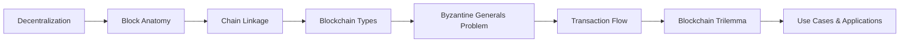
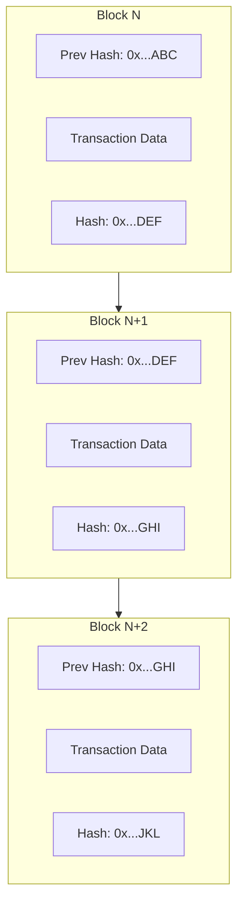
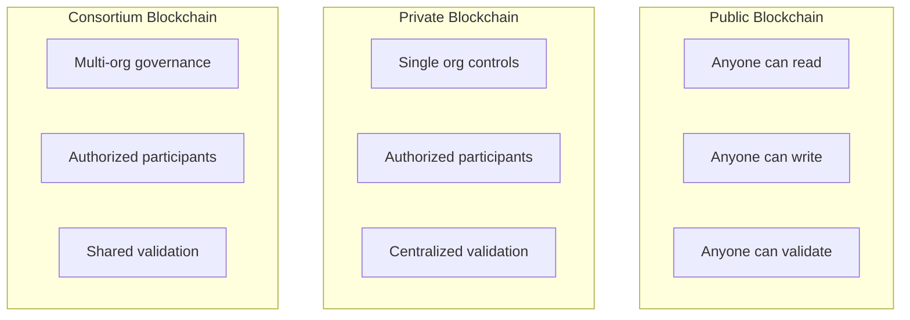
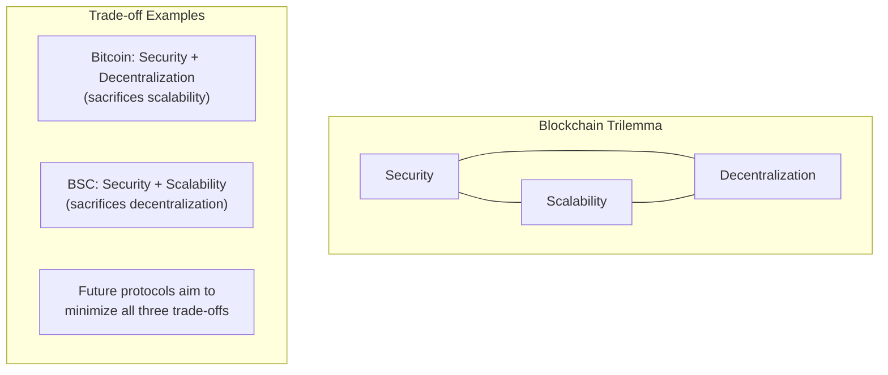
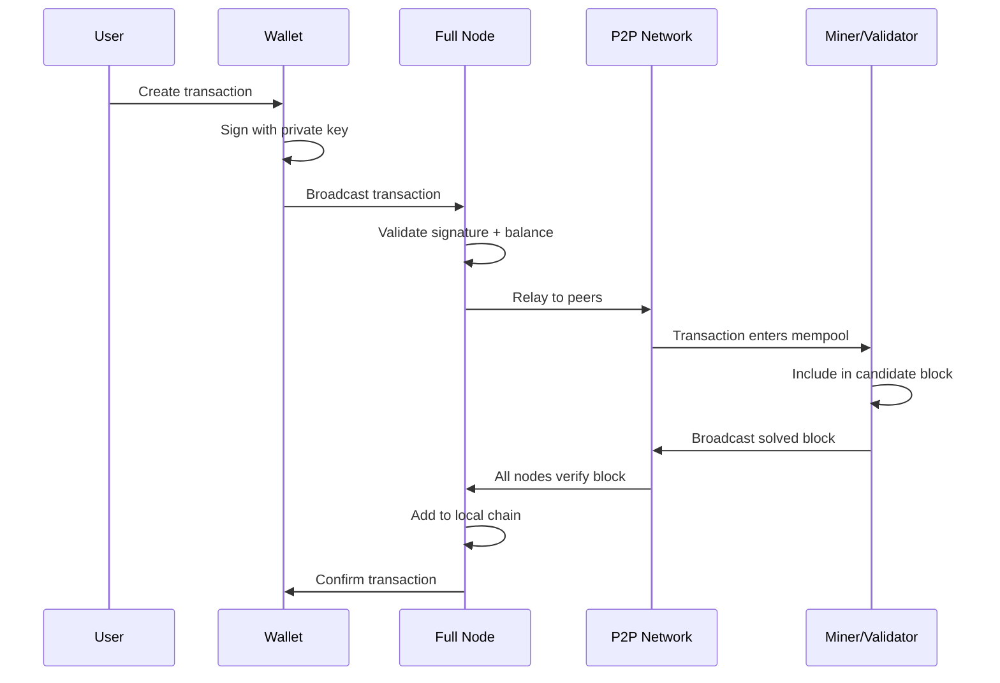
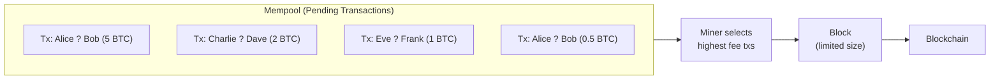

# Chapter 1: Introduction to Blockchain

> **Previous:** None (First Chapter) | **Next:** [Chapter 2: Cryptography for Blockchain](./02-cryptography.md)

---

## Learning Objectives

- Define blockchain technology and its core components
- Explain the historical evolution from centralized to decentralized systems
- Distinguish between public, private, and permissioned blockchains
- Describe the Byzantine Generals Problem and its relevance to distributed systems
- Identify the Blockchain Trilemma and its implications for network design
- Analyze the CAP theorem in the context of blockchain versus traditional databases
- Recognize industry use cases for blockchain across finance, supply chain, healthcare, and more

<!-- Image Gallery -->
<div style="display:flex;flex-wrap:wrap;gap:4px;margin:16px 0;padding:12px;background:#f8fafc;border-radius:8px;border:1px solid #e2e8f0;">
<a href="../../../assets/images/lessons/blockchain/01-introduction/hero.svg" target="_blank" rel="noopener">
  
</a>
<a href="../../../assets/images/lessons/blockchain/01-introduction/handwritten-notes.svg" target="_blank" rel="noopener">
  
</a>
<a href="../../../assets/images/lessons/blockchain/01-introduction/sticky-notes.svg" target="_blank" rel="noopener">
  
</a>
<a href="../../../assets/images/lessons/blockchain/01-introduction/visual-explanation.svg" target="_blank" rel="noopener">
  
</a>
<a href="../../../assets/images/lessons/blockchain/01-introduction/architecture.svg" target="_blank" rel="noopener">
  
</a>
<a href="../../../assets/images/lessons/blockchain/01-introduction/workflow.svg" target="_blank" rel="noopener">
  
</a>
<a href="../../../assets/images/lessons/blockchain/01-introduction/mindmap.svg" target="_blank" rel="noopener">
  
</a>
<a href="../../../assets/images/lessons/blockchain/01-introduction/comparison.svg" target="_blank" rel="noopener">
  
</a>
<a href="../../../assets/images/lessons/blockchain/01-introduction/cheatsheet.svg" target="_blank" rel="noopener">
  
</a>
<a href="../../../assets/images/lessons/blockchain/01-introduction/interview-quiz.svg" target="_blank" rel="noopener">
  
</a>
<a href="../../../assets/images/lessons/blockchain/01-introduction/social-card.svg" target="_blank" rel="noopener">
  
</a>
</div>
<!-- End Image Gallery -->


## Chapter at a Glance

| Topic | Key Insight | Practical Takeaway |
|-------|-------------|--------------------|
| Decentralization | Shifts trust from intermediaries to protocol and consensus | No single point of failure or control |
| Block Anatomy | Header (metadata + prev hash) + body (transactions) | Chain integrity depends on cryptographic linking |
| Blockchain Types | Public, private, consortium — different access models | Choose based on trust assumptions and privacy needs |
| Transaction Flow | Request ? Broadcast ? Validation ? Mining ? Confirmation | Every full node validates every transaction |
| Blockchain Trilemma | Trade-off between security, scalability, decentralization | No blockchain optimizes all three simultaneously |
| Byzantine Generals Problem | Distributed agreement despite faulty actors | Consensus mechanisms solve this fundamental problem |

## Chapter Roadmap



---

## Theory

### Conceptual Overview

A blockchain is a distributed, immutable ledger that records transactions across a network of computers. Unlike traditional databases managed by a central authority (e.g., a bank or a government), a blockchain operates on a peer-to-peer (P2P) architecture where every participant (node) maintains a copy of the ledger. The ledger grows as blocks are appended through a consensus mechanism that all participants agree upon.

The term "blockchain" describes the core data structure: blocks of transactions linked together in chronological order using cryptographic hashes. Each block contains a reference to the previous block's hash, forming an unbroken chain from the genesis block to the latest block.

### Centralization vs. Decentralization

<a href="../../../assets/images/diagrams/blockchain/01-introduction/centralization-vs-decentralization-handwritten.svg" target="_blank" rel="noopener">
  
</a>
<a href="../../../assets/images/diagrams/blockchain/01-introduction/centralization-vs-decentralization-diagram.svg" target="_blank" rel="noopener">
  
</a>
<a href="../../../assets/images/diagrams/blockchain/01-introduction/centralization-vs-decentralization-sticky.svg" target="_blank" rel="noopener">
  
</a>


<a href="../../../assets/images/diagrams/blockchain/01-introduction/centralization-vs-decentralization-handwritten.svg" target="_blank" rel="noopener">
  
</a>
<a href="../../../assets/images/diagrams/blockchain/01-introduction/centralization-vs-decentralization-diagram.svg" target="_blank" rel="noopener">
  
</a>
<a href="../../../assets/images/diagrams/blockchain/01-introduction/centralization-vs-decentralization-sticky.svg" target="_blank" rel="noopener">
  
</a>


<a href="../../../assets/images/diagrams/blockchain/01-introduction/centralization-vs-decentralization-handwritten.svg" target="_blank" rel="noopener">
  
</a>
<a href="../../../assets/images/diagrams/blockchain/01-introduction/centralization-vs-decentralization-diagram.svg" target="_blank" rel="noopener">
  
</a>
<a href="../../../assets/images/diagrams/blockchain/01-introduction/centralization-vs-decentralization-sticky.svg" target="_blank" rel="noopener">
  
</a>


Traditional systems rely on trusted intermediaries. In a centralized system, the central node is a single point of failure and control. Decentralization redistributes this authority across a network of peers.

| Property | Centralized System | Decentralized System |
|----------|-------------------|---------------------|
| Control | Single entity | Distributed among participants |
| Trust Model | Trust the central authority | Trust the protocol and cryptography |
| Single Point of Failure | Yes | No |
| Performance | High throughput | Lower throughput (consensus overhead) |
| Censorship Resistance | Low (authority can block) | High (no single blocker) |
| Data Visibility | Controlled by authority | Transparent to all participants |

### The Anatomy of a Block

<a href="../../../assets/images/diagrams/blockchain/01-introduction/the-anatomy-of-a-block-handwritten.svg" target="_blank" rel="noopener">
  
</a>
<a href="../../../assets/images/diagrams/blockchain/01-introduction/the-anatomy-of-a-block-diagram.svg" target="_blank" rel="noopener">
  
</a>
<a href="../../../assets/images/diagrams/blockchain/01-introduction/the-anatomy-of-a-block-sticky.svg" target="_blank" rel="noopener">
  
</a>


<a href="../../../assets/images/diagrams/blockchain/01-introduction/the-anatomy-of-a-block-handwritten.svg" target="_blank" rel="noopener">
  
</a>
<a href="../../../assets/images/diagrams/blockchain/01-introduction/the-anatomy-of-a-block-diagram.svg" target="_blank" rel="noopener">
  
</a>
<a href="../../../assets/images/diagrams/blockchain/01-introduction/the-anatomy-of-a-block-sticky.svg" target="_blank" rel="noopener">
  
</a>


<a href="../../../assets/images/diagrams/blockchain/01-introduction/the-anatomy-of-a-block-handwritten.svg" target="_blank" rel="noopener">
  
</a>
<a href="../../../assets/images/diagrams/blockchain/01-introduction/the-anatomy-of-a-block-diagram.svg" target="_blank" rel="noopener">
  
</a>
<a href="../../../assets/images/diagrams/blockchain/01-introduction/the-anatomy-of-a-block-sticky.svg" target="_blank" rel="noopener">
  
</a>


Each block typically consists of:

1. **Header:** Contains metadata:
   - **Timestamp:** When the block was created
   - **Version:** Which protocol version was used
   - **Previous Block Hash:** The hash of the parent block (creates the chain)
   - **Merkle Root:** A single hash representing all transactions in the block
   - **Nonce:** A number used in Proof of Work mining
   - **Difficulty Target:** The mining difficulty threshold
2. **Body:** A list of validated transactions (the actual data being recorded)

The "chain" is formed by each block header including the cryptographic hash of the previous block's header. This chaining mechanism makes it computationally infeasible to alter any historical block without also altering every subsequent block.



### Types of Blockchains

<a href="../../../assets/images/diagrams/blockchain/01-introduction/types-of-blockchains-handwritten.svg" target="_blank" rel="noopener">
  
</a>
<a href="../../../assets/images/diagrams/blockchain/01-introduction/types-of-blockchains-diagram.svg" target="_blank" rel="noopener">
  
</a>
<a href="../../../assets/images/diagrams/blockchain/01-introduction/types-of-blockchains-sticky.svg" target="_blank" rel="noopener">
  
</a>


<a href="../../../assets/images/diagrams/blockchain/01-introduction/types-of-blockchains-handwritten.svg" target="_blank" rel="noopener">
  
</a>
<a href="../../../assets/images/diagrams/blockchain/01-introduction/types-of-blockchains-diagram.svg" target="_blank" rel="noopener">
  
</a>
<a href="../../../assets/images/diagrams/blockchain/01-introduction/types-of-blockchains-sticky.svg" target="_blank" rel="noopener">
  
</a>


<a href="../../../assets/images/diagrams/blockchain/01-introduction/types-of-blockchains-handwritten.svg" target="_blank" rel="noopener">
  
</a>
<a href="../../../assets/images/diagrams/blockchain/01-introduction/types-of-blockchains-diagram.svg" target="_blank" rel="noopener">
  
</a>
<a href="../../../assets/images/diagrams/blockchain/01-introduction/types-of-blockchains-sticky.svg" target="_blank" rel="noopener">
  
</a>


1. **Public (Permissionless):** Anyone can join, read, write, and participate in consensus. Examples: Bitcoin, Ethereum. Fully transparent and censorship-resistant but limited in throughput.

2. **Private (Permissioned):** Controlled by a single organization. Only authorized participants can join. Offers high throughput and privacy but sacrifices decentralization. Useful for internal enterprise use cases.

3. **Consortium (Permissioned):** Controlled by a group of organizations. Combines elements of public and private blockchains. Multiple organizations share governance while restricting access to authorized participants. Hyperledger Fabric is a common framework.



### The Byzantine Generals Problem

<a href="../../../assets/images/diagrams/blockchain/01-introduction/the-byzantine-generals-problem-handwritten.svg" target="_blank" rel="noopener">
  
</a>
<a href="../../../assets/images/diagrams/blockchain/01-introduction/the-byzantine-generals-problem-diagram.svg" target="_blank" rel="noopener">
  
</a>
<a href="../../../assets/images/diagrams/blockchain/01-introduction/the-byzantine-generals-problem-sticky.svg" target="_blank" rel="noopener">
  
</a>


<a href="../../../assets/images/diagrams/blockchain/01-introduction/the-byzantine-generals-problem-handwritten.svg" target="_blank" rel="noopener">
  
</a>
<a href="../../../assets/images/diagrams/blockchain/01-introduction/the-byzantine-generals-problem-diagram.svg" target="_blank" rel="noopener">
  
</a>
<a href="../../../assets/images/diagrams/blockchain/01-introduction/the-byzantine-generals-problem-sticky.svg" target="_blank" rel="noopener">
  
</a>


<a href="../../../assets/images/diagrams/blockchain/01-introduction/the-byzantine-generals-problem-handwritten.svg" target="_blank" rel="noopener">
  
</a>
<a href="../../../assets/images/diagrams/blockchain/01-introduction/the-byzantine-generals-problem-diagram.svg" target="_blank" rel="noopener">
  
</a>
<a href="../../../assets/images/diagrams/blockchain/01-introduction/the-byzantine-generals-problem-sticky.svg" target="_blank" rel="noopener">
  
</a>


The Byzantine Generals Problem is a classic problem in distributed computing. Imagine several divisions of the Byzantine army camped outside an enemy city, each commanded by a general. The generals must agree on a common battle plan: either Attack or Retreat. They communicate only via messengers. Some generals may be traitors who send conflicting messages to cause confusion.

A solution must satisfy:
1. **All loyal generals agree on the same plan**
2. **The plan is reasonable (not based on traitors' messages)**

In blockchain terms, the generals are network nodes, the battle plan is the next block, and the traitors are malicious nodes attempting to disrupt consensus. Consensus algorithms like Proof of Work and Proof of Stake are solutions to the Byzantine Generals Problem in an open, permissionless environment.

For a system with `n` total nodes, Byzantine Fault Tolerance typically requires that no more than `n/3` nodes are faulty (`n > 3f` where `f` is the number of faulty nodes).

### CAP Theorem in Blockchain Context

<a href="../../../assets/images/diagrams/blockchain/01-introduction/cap-theorem-in-blockchain-context-handwritten.svg" target="_blank" rel="noopener">
  
</a>
<a href="../../../assets/images/diagrams/blockchain/01-introduction/cap-theorem-in-blockchain-context-diagram.svg" target="_blank" rel="noopener">
  
</a>
<a href="../../../assets/images/diagrams/blockchain/01-introduction/cap-theorem-in-blockchain-context-sticky.svg" target="_blank" rel="noopener">
  
</a>


<a href="../../../assets/images/diagrams/blockchain/01-introduction/cap-theorem-in-blockchain-context-handwritten.svg" target="_blank" rel="noopener">
  
</a>
<a href="../../../assets/images/diagrams/blockchain/01-introduction/cap-theorem-in-blockchain-context-diagram.svg" target="_blank" rel="noopener">
  
</a>
<a href="../../../assets/images/diagrams/blockchain/01-introduction/cap-theorem-in-blockchain-context-sticky.svg" target="_blank" rel="noopener">
  
</a>


<a href="../../../assets/images/diagrams/blockchain/01-introduction/cap-theorem-in-blockchain-context-handwritten.svg" target="_blank" rel="noopener">
  
</a>
<a href="../../../assets/images/diagrams/blockchain/01-introduction/cap-theorem-in-blockchain-context-diagram.svg" target="_blank" rel="noopener">
  
</a>
<a href="../../../assets/images/diagrams/blockchain/01-introduction/cap-theorem-in-blockchain-context-sticky.svg" target="_blank" rel="noopener">
  
</a>


The CAP theorem states that a distributed data store can only provide two of three guarantees:
- **Consistency:** Every read receives the most recent write
- **Availability:** Every request receives a response
- **Partition Tolerance:** The system continues operating despite network partitions

Blockchains typically prioritize Partition Tolerance and Consistency over Availability. During a network partition, a blockchain may halt rather than risk inconsistency. Bitcoin, for example, can experience temporary forks during partitions but eventually converges on a single chain through the longest-chain rule.

| System | C | A | P | Notes |
|--------|---|---|---|-------|
| Traditional RDBMS | ? | ? | ? | Not partition-tolerant by design |
| Cassandra | ? | ? | ? | Eventual consistency |
| Bitcoin | ? | ? | ? | May halt during partition |
| Ethereum | ? | ? | ? | Similar to Bitcoin |

### The Blockchain Trilemma

<a href="../../../assets/images/diagrams/blockchain/01-introduction/the-blockchain-trilemma-handwritten.svg" target="_blank" rel="noopener">
  
</a>
<a href="../../../assets/images/diagrams/blockchain/01-introduction/the-blockchain-trilemma-diagram.svg" target="_blank" rel="noopener">
  
</a>
<a href="../../../assets/images/diagrams/blockchain/01-introduction/the-blockchain-trilemma-sticky.svg" target="_blank" rel="noopener">
  
</a>


<a href="../../../assets/images/diagrams/blockchain/01-introduction/the-blockchain-trilemma-handwritten.svg" target="_blank" rel="noopener">
  
</a>
<a href="../../../assets/images/diagrams/blockchain/01-introduction/the-blockchain-trilemma-diagram.svg" target="_blank" rel="noopener">
  
</a>
<a href="../../../assets/images/diagrams/blockchain/01-introduction/the-blockchain-trilemma-sticky.svg" target="_blank" rel="noopener">
  
</a>


<a href="../../../assets/images/diagrams/blockchain/01-introduction/the-blockchain-trilemma-handwritten.svg" target="_blank" rel="noopener">
  
</a>
<a href="../../../assets/images/diagrams/blockchain/01-introduction/the-blockchain-trilemma-diagram.svg" target="_blank" rel="noopener">
  
</a>
<a href="../../../assets/images/diagrams/blockchain/01-introduction/the-blockchain-trilemma-sticky.svg" target="_blank" rel="noopener">
  
</a>


Proposed by Vitalik Buterin, the Blockchain Trilemma suggests that blockchain systems can only achieve two of three properties:

1. **Security:** Resistance to attacks (51% attacks, double-spending, etc.)
2. **Scalability:** High transaction throughput and low latency
3. **Decentralization:** No single entity controls the network



**Real-world examples:**
- **Bitcoin (Security + Decentralization):** ~7 TPS, highly decentralized, extremely secure
- **Solana (Scalability + Security):** ~65,000 TPS, but fewer validators (lower decentralization)
- **EOS (Scalability + Decentralization):** High throughput with DPoS, but security concerns due to fewer block producers

### Transaction Lifecycle

<a href="../../../assets/images/diagrams/blockchain/01-introduction/transaction-lifecycle-handwritten.svg" target="_blank" rel="noopener">
  
</a>
<a href="../../../assets/images/diagrams/blockchain/01-introduction/transaction-lifecycle-diagram.svg" target="_blank" rel="noopener">
  
</a>
<a href="../../../assets/images/diagrams/blockchain/01-introduction/transaction-lifecycle-sticky.svg" target="_blank" rel="noopener">
  
</a>


<a href="../../../assets/images/diagrams/blockchain/01-introduction/transaction-lifecycle-handwritten.svg" target="_blank" rel="noopener">
  
</a>
<a href="../../../assets/images/diagrams/blockchain/01-introduction/transaction-lifecycle-diagram.svg" target="_blank" rel="noopener">
  
</a>
<a href="../../../assets/images/diagrams/blockchain/01-introduction/transaction-lifecycle-sticky.svg" target="_blank" rel="noopener">
  
</a>


<a href="../../../assets/images/diagrams/blockchain/01-introduction/transaction-lifecycle-handwritten.svg" target="_blank" rel="noopener">
  
</a>
<a href="../../../assets/images/diagrams/blockchain/01-introduction/transaction-lifecycle-diagram.svg" target="_blank" rel="noopener">
  
</a>
<a href="../../../assets/images/diagrams/blockchain/01-introduction/transaction-lifecycle-sticky.svg" target="_blank" rel="noopener">
  
</a>


The full lifecycle of a blockchain transaction follows these steps:



### Real-World Use Cases

<a href="../../../assets/images/diagrams/blockchain/01-introduction/real-world-use-cases-handwritten.svg" target="_blank" rel="noopener">
  
</a>
<a href="../../../assets/images/diagrams/blockchain/01-introduction/real-world-use-cases-diagram.svg" target="_blank" rel="noopener">
  
</a>
<a href="../../../assets/images/diagrams/blockchain/01-introduction/real-world-use-cases-sticky.svg" target="_blank" rel="noopener">
  
</a>


<a href="../../../assets/images/diagrams/blockchain/01-introduction/real-world-use-cases-handwritten.svg" target="_blank" rel="noopener">
  
</a>
<a href="../../../assets/images/diagrams/blockchain/01-introduction/real-world-use-cases-diagram.svg" target="_blank" rel="noopener">
  
</a>
<a href="../../../assets/images/diagrams/blockchain/01-introduction/real-world-use-cases-sticky.svg" target="_blank" rel="noopener">
  
</a>


<a href="../../../assets/images/diagrams/blockchain/01-introduction/real-world-use-cases-handwritten.svg" target="_blank" rel="noopener">
  
</a>
<a href="../../../assets/images/diagrams/blockchain/01-introduction/real-world-use-cases-diagram.svg" target="_blank" rel="noopener">
  
</a>
<a href="../../../assets/images/diagrams/blockchain/01-introduction/real-world-use-cases-sticky.svg" target="_blank" rel="noopener">
  
</a>


| Industry | Use Case | Benefit | Example |
|----------|----------|---------|---------|
| Finance | Cross-border payments | 24/7 settlement, lower fees | Ripple, Stellar |
| Supply Chain | Product traceability | End-to-end visibility | IBM Food Trust |
| Healthcare | Patient records | Interoperable, patient-controlled | Medicalchain |
| Real Estate | Property titles | Fraud reduction, faster transfers | Propy |
| Gaming | In-game assets | Player ownership, cross-game | Axie Infinity, Enjin |
| Voting | Electronic voting | Tamper-proof, verifiable | Voatz, follow-my-vote |
| Identity | Self-sovereign identity | User-controlled credentials | uPort, Sovrin |
| Energy | Peer-to-peer energy trading | Decentralized grid management | Power Ledger |
| Intellectual Property | Copyright registration | Timestamped proof of creation | Binded, Po.et |
| Insurance | Claims processing | Automated settlement via smart contracts | Etherisc |

### History of Blockchain

<a href="../../../assets/images/diagrams/blockchain/01-introduction/history-of-blockchain-handwritten.svg" target="_blank" rel="noopener">
  
</a>
<a href="../../../assets/images/diagrams/blockchain/01-introduction/history-of-blockchain-diagram.svg" target="_blank" rel="noopener">
  
</a>
<a href="../../../assets/images/diagrams/blockchain/01-introduction/history-of-blockchain-sticky.svg" target="_blank" rel="noopener">
  
</a>


<a href="../../../assets/images/diagrams/blockchain/01-introduction/history-of-blockchain-handwritten.svg" target="_blank" rel="noopener">
  
</a>
<a href="../../../assets/images/diagrams/blockchain/01-introduction/history-of-blockchain-diagram.svg" target="_blank" rel="noopener">
  
</a>
<a href="../../../assets/images/diagrams/blockchain/01-introduction/history-of-blockchain-sticky.svg" target="_blank" rel="noopener">
  
</a>


<a href="../../../assets/images/diagrams/blockchain/01-introduction/history-of-blockchain-handwritten.svg" target="_blank" rel="noopener">
  
</a>
<a href="../../../assets/images/diagrams/blockchain/01-introduction/history-of-blockchain-diagram.svg" target="_blank" rel="noopener">
  
</a>
<a href="../../../assets/images/diagrams/blockchain/01-introduction/history-of-blockchain-sticky.svg" target="_blank" rel="noopener">
  
</a>


| Year | Milestone | Significance |
|------|-----------|-------------|
| 1991 | Haber & Stornetta propose timestamping | First concept of cryptographically linked blocks |
| 2004 | Hal Finney develops RPoW | Reusable Proof of Work (early precursor) |
| 2008 | Satoshi Nakamoto publishes Bitcoin whitepaper | First practical blockchain solution |
| 2009 | Bitcoin genesis block mined | Blockchain goes live for the first time |
| 2013 | Vitalik Buterin proposes Ethereum | Smart contracts and Turing-complete blockchain |
| 2015 | Ethereum mainnet launches | Programmable blockchain era begins |
| 2017 | CryptoKitties congests Ethereum | First mainstream dApp; scaling becomes urgent |
| 2020 | DeFi Summer | Explosive growth of decentralized finance |
| 2022 | Ethereum Merge (PoS transition) | 99.9% energy reduction for Ethereum |
| 2024 | EIP-4844 (Proto-Danksharding) | Blob transactions reduce L2 fees significantly |

---

## Examples

### Example 1: Visualizing the Chain Linkage

Imagine three blocks: A, B, and C.

- Block A has Hash `0x123`.
- Block B includes `0x123` in its header. Block B's own Hash is `0x456`.
- Block C includes `0x456` in its header.

If an attacker changes a transaction in Block A, its Hash changes to `0x999`. Because Block B expects `0x123`, the link breaks, and all subsequent blocks become invalid. This demonstrates **immutability**.

```typescript
interface Block {
    index: number;
    timestamp: number;
    data: string;
    previousHash: string;
    hash: string;
    nonce: number;
}

function calculateHash(
    index: number,
    previousHash: string,
    timestamp: number,
    data: string,
    nonce: number
): string {
    // Simplified hash computation (actual SHA-256 used in reality)
    const input = `${index}${previousHash}${timestamp}${data}${nonce}`;
    // In real blockchain, this would be SHA-256(input)
    return `hash_${input}`;
}

function createGenesisBlock(): Block {
    return {
        index: 0,
        timestamp: Date.now(),
        data: "Genesis Block",
        previousHash: "0",
        hash: "0x123",
        nonce: 0,
    };
}

function createNextBlock(
    previousBlock: Block,
    data: string
): Block {
    const index = previousBlock.index + 1;
    const timestamp = Date.now();
    const hash = calculateHash(index, previousBlock.hash, timestamp, data, 0);
    return {
        index,
        timestamp,
        data,
        previousHash: previousBlock.hash,
        hash,
        nonce: 0,
    };
}
```

### Example 2: Simple Transaction Flow

1. **Request:** Alice wants to send 5 BTC to Bob.
2. **Broadcast:** The transaction is broadcast to the P2P network.
3. **Validation:** Nodes verify Alice has sufficient funds using digital signatures.
4. **Verification:** Miners/Validators bundle the transaction into a block.
5. **Commit:** The block is added to the chain, and Bob receives the funds.

### Example 3: Mempool Visualization



> **Pro Tip:** When evaluating a blockchain platform, always identify which two corners of the trilemma it sacrifices. No project delivers all three — if they claim otherwise, they're likely compromising on decentralization (fewer nodes) or security (weaker consensus).

---

## Concept Comparison Table

| Concept | Definition | Key Distinction | Use Case |
|---------|-----------|-----------------|----------|
| Centralized Database | Single authority controls data | Fast, high throughput, single point of failure | Banking ledgers, inventory systems |
| Distributed Database | Multiple nodes, single authority | Better availability, still trusted | Cloud DB replicas |
| Blockchain | Multiple nodes, no central authority | Trustless, immutable, decentralized | Cryptocurrency, supply chain |
| Public Blockchain | Anyone can participate | Open, permissionless | Bitcoin, Ethereum |
| Private Blockchain | Known participants only | Faster, controlled access | Enterprise supply chain |
| Consortium Blockchain | Multiple organizations govern | Shared control, privacy | Trade finance, healthcare |

## Distributed Ledger vs Traditional Database

| Feature | Traditional Database | Distributed Ledger (Blockchain) |
|---------|---------------------|--------------------------------|
| Data Model | Tables, rows, columns | Chain of blocks |
| Control | Centralized administrator | Decentralized consensus |
| Trust Model | Trust the administrator | Trust the protocol |
| Immutability | Possible to alter/delete | Practically immutable |
| Throughput | High (thousands of TPS) | Low to moderate (7-1000+ TPS) |
| Latency | Milliseconds | Seconds to minutes |
| Cost per transaction | Very low | Moderate to high (gas) |
| Transparency | Limited by access controls | Full transparency by default |
| Identity | Username/password | Cryptographic keys |
| Audit trail | Log-based, alterable | Built-in, immutable |
| Recovery | Backups and replication | Automatic (full history available) |

## Quick Reference

| Category | Key Concepts | Notes |
|----------|-------------|-------|
| **Block Header Fields** | Timestamp, version, prev hash, Merkle root, nonce | Every field has a specific security purpose |
| **Blockchain Types** | Public, Private, Consortium | Determines trust model and performance |
| **Key Properties** | Immutability, Decentralization, Transparency | Achieved through cryptography + consensus |
| **Trilemma Corners** | Security, Scalability, Decentralization | Pick two — the third is sacrificed |
| **Consensus** | PoW, PoS, BFT, DPoS | Each has different trade-offs |
| **Byzantine Fault Tolerance** | n > 3f | f = number of faulty nodes |

## Cross-Application Matrix

| Technique | DeFi | Smart Contracts | Enterprise Blockchain | Research |
|-----------|------|-----------------|----------------------|----------|
| Decentralization | Trustless trading | Autonomous execution | Consortium governance | Node distribution studies |
| Chain Linkage | Transaction history | Contract state chain | Audit trail | Data immutability research |
| Consensus Types | PoW/PoS security | Validator selection | BFT voting | New consensus algorithms |
| Transaction Flow | Payment settlement | Contract invocation | Asset transfer | Performance benchmarking |
| Block Structure | Transaction batching | State updates | Channel data | Storage optimization |
| Byzantine Fault Tolerance | Consensus security | Cross-chain atomicity | Orderer fault tolerance | BFT protocol research |

## Chapter Quiz

1. What would happen if a block's previous hash were altered in a blockchain?
   - A) Only that block would be affected
   - B) All subsequent blocks would become invalid because their hashes depend on the altered block
   - C) The network would automatically recalculate the hashes
   - D) Nothing — hashes are just metadata

<details>
<summary>Answer&lt;/summary&gt;
**B) All subsequent blocks would become invalid.** Each block header contains the hash of the previous block, creating a chain. Changing any block requires recalculating all subsequent hashes, making tampering computationally detectable.
</details>

2. Which blockchain type is most suitable for a consortium of competing banks?
   - A) Public blockchain
   - B) Private blockchain controlled by one bank
   - C) Consortium (permissioned) blockchain
   - D) A centralized database

<details>
<summary>Answer&lt;/summary&gt;
**C) Consortium (permissioned) blockchain.** Multiple competing organizations need shared control without a single authority. Consortium chains distribute governance among members while restricting access to authorized participants.
</details>

3. What does the Blockchain Trilemma state?
   - A) Blockchain is three times more secure than traditional databases
   - B) A blockchain can only optimize two of three properties: security, scalability, and decentralization
   - C) There are only three types of blockchains
   - D) Blockchain transactions take three seconds to confirm

<details>
<summary>Answer&lt;/summary&gt;
**B) A blockchain can only optimize two of three properties: security, scalability, and decentralization.** This fundamental trade-off drives most design decisions in blockchain protocol development.
</details>

4. In the Byzantine Generals Problem, what is the maximum fraction of traitors a BFT system can typically tolerate?
   - A) 1/4
   - B) 1/3
   - C) 1/2
   - D) 2/3

<details>
<summary>Answer&lt;/summary&gt;
**B) 1/3.** Byzantine Fault Tolerance systems typically require n > 3f, meaning up to one-third of participants can be faulty or malicious while the system still reaches correct consensus.
</details>

5. According to the CAP theorem, which two properties do blockchains typically prioritize?
   - A) Consistency and Availability
   - B) Consistency and Partition Tolerance
   - C) Availability and Partition Tolerance
   - D) Consistency and Speed

<details>
<summary>Answer&lt;/summary&gt;
**B) Consistency and Partition Tolerance.** Blockchains prioritize consistency (all nodes see the same state) and partition tolerance (network continues during splits). Availability may be temporarily sacrificed during network partitions or reorgs.
</details>

### TypeScript: Simple Blockchain

```typescript
import { createHash } from "node:crypto";

class Block {
  public hash: string;
  constructor(
    public index: number,
    public timestamp: number,
    public data: string,
    public previousHash: string,
    public nonce = 0
  ) {
    this.hash = this.computeHash();
  }

  computeHash(): string {
    return createHash("sha256")
      .update(this.index + this.timestamp + this.data + this.previousHash + this.nonce)
      .digest("hex");
  }

  mine(difficulty: number): void {
    while (this.hash.substring(0, difficulty) !== "0".repeat(difficulty)) {
      this.nonce++;
      this.hash = this.computeHash();
    }
  }
}

class Blockchain {
  chain: Block[] = [];

  constructor() { this.chain.push(this.genesis()); }

  genesis(): Block {
    return new Block(0, Date.now(), "Genesis Block", "0");
  }

  latest(): Block { return this.chain[this.chain.length - 1]; }

  addBlock(data: string, difficulty = 4): void {
    const block = new Block(
      this.latest().index + 1, Date.now(), data, this.latest().hash
    );
    block.mine(difficulty);
    this.chain.push(block);
  }

  isValid(): boolean {
    for (let i = 1; i < this.chain.length; i++) {
      const cur = this.chain[i];
      const prev = this.chain[i - 1];
      if (cur.hash !== cur.computeHash()) return false;
      if (cur.previousHash !== prev.hash) return false;
    }
    return true;
  }
}
// const bc = new Blockchain();
// bc.addBlock("Tx1");
// bc.addBlock("Tx2");
// console.log(bc.isValid()); // true
// bc.chain[1].data = "Tampered";
// console.log(bc.isValid()); // false
```

### TypeScript: Merkle Tree

```typescript
import { createHash } from "node:crypto";

const sha256 = (d: string): string =>
  createHash("sha256").update(d).digest("hex");

class MerkleNode {
  constructor(
    public left: MerkleNode | null,
    public right: MerkleNode | null,
    public hash: string
  ) {}
}

class MerkleTree {
  private root: MerkleNode | null = null;
  build(transactions: string[]): void {
    if (!transactions.length) throw new Error("No transactions");
    let nodes = transactions.map(tx => new MerkleNode(null, null, sha256(tx)));
    while (nodes.length > 1) {
      const next: MerkleNode[] = [];
      for (let i = 0; i < nodes.length; i += 2) {
        const l = nodes[i];
        const r = i + 1 < nodes.length ? nodes[i + 1] : l;
        next.push(new MerkleNode(l, r, sha256(l.hash + r.hash)));
      }
      nodes = next;
    }
    this.root = nodes[0];
  }
  getRoot(): string {
    if (!this.root) throw new Error("Tree not built");
    return this.root.hash;
  }
  getProof(tx: string): { hash: string; left: boolean }[] {
    const target = sha256(tx);
    const proof: { hash: string; left: boolean }[] = [];
    this.findProof(this.root, target, proof);
    return proof;
  }
  private findProof(
    node: MerkleNode | null,
    target: string,
    proof: { hash: string; left: boolean }[]
  ): boolean {
    if (!node) return false;
    if (!node.left && !node.right) return node.hash === target;
    if (this.findProof(node.left, target, proof)) {
      if (node.right) proof.push({ hash: node.right.hash, left: false });
      return true;
    }
    if (this.findProof(node.right, target, proof)) {
      if (node.left) proof.push({ hash: node.left.hash, left: true });
      return true;
    }
    return false;
  }
  static verifyProof(
    rootHash: string,
    tx: string,
    proof: { hash: string; left: boolean }[]
  ): boolean {
    let cur = sha256(tx);
    for (const s of proof) cur = sha256(s.left ? s.hash + cur : cur + s.hash);
    return cur === rootHash;
  }
}
```

### TypeScript: UTXO Tracking Blockchain with Transaction Validation

```typescript
import { createHash } from "node:crypto";

const sha256 = (d: string): string => createHash("sha256").update(d).digest("hex");

interface UTXO {
  txid: string; outIndex: number; amount: number; owner: string;
}

class Transaction {
  constructor(
    public inputs: { txid: string; outIndex: number; sig: string }[],
    public outputs: { amount: number; owner: string }[],
    public id: string = ""
  ) {
    this.id = id || sha256(JSON.stringify(inputs) + JSON.stringify(outputs));
  }
}

class UTXOBlockchain {
  chain: { index: number; hash: string; prevHash: string; txs: Transaction[]; nonce: number }[] = [];
  utxoSet: Map<string, UTXO> = new Map();

  constructor() { this.genesis(); }

  private genesis() {
    const coinbase = new Transaction([], [{ amount: 50, owner: "miner" }]);
    this.chain.push({ index: 0, hash: "0".repeat(64), prevHash: "", txs: [coinbase], nonce: 0 });
    coinbase.outputs.forEach((o, i) => this.utxoSet.set(`0:${i}`, { txid: "0", outIndex: i, amount: o.amount, owner: o.owner }));
  }

  addBlock(txs: Transaction[], difficulty = 3): Transaction[] {
    const valid: Transaction[] = [];
    for (const tx of txs) {
      if (this.validateTx(tx)) {
        this.applyTx(tx); valid.push(tx);
      }
    }
    const prev = this.chain[this.chain.length - 1];
    let nonce = 0, hash = "";
    do { hash = sha256(prev.hash + JSON.stringify(valid) + nonce++); }
    while (!hash.startsWith("0".repeat(difficulty)));
    this.chain.push({ index: prev.index + 1, hash, prevHash: prev.hash, txs: valid, nonce });
    return valid;
  }

  validateTx(tx: Transaction): boolean {
    if (tx.inputs.length === 0) return true;
    let totalIn = 0, totalOut = tx.outputs.reduce((s, o) => s + o.amount, 0);
    for (const inp of tx.inputs) {
      const key = `${inp.txid}:${inp.outIndex}`;
      const utxo = this.utxoSet.get(key);
      if (!utxo) return false;
      totalIn += utxo.amount;
    }
    return totalIn >= totalOut;
  }

  private applyTx(tx: Transaction): void {
    for (const inp of tx.inputs) this.utxoSet.delete(`${inp.txid}:${inp.outIndex}`);
    tx.outputs.forEach((o, i) => this.utxoSet.set(`${tx.id}:${i}`, { txid: tx.id, outIndex: i, amount: o.amount, owner: o.owner }));
  }

  balance(owner: string): number {
    let bal = 0;
    for (const utxo of this.utxoSet.values()) if (utxo.owner === owner) bal += utxo.amount;
    return bal;
  }
}
// const bc = new UTXOBlockchain();
// const tx = new Transaction([], [{ amount: 10, owner: "alice" }]);
// bc.addBlock([tx]);
// console.log(bc.balance("alice")); // 10
```

## TypeScript Implementations

```typescript
// === Block Explorer ===
interface BlockData { index: number; hash: string; prevHash: string; timestamp: number; txs: string[]; nonce: number; }
class BlockExplorer {
    private blocks: BlockData[] = [];
    addBlock(txs: string[], prevHash: string, nonce: number): BlockData {
        const block: BlockData = {
            index: this.blocks.length, hash: this.simpleHash(`${prevHash}${JSON.stringify(txs)}${nonce}`),
            prevHash, timestamp: Date.now(), txs, nonce,
        };
        this.blocks.push(block);
        return block;
    }
    private simpleHash(s: string): string {
        let h = 0;
        for (let i = 0; i < s.length; i++) { h = ((h << 5) - h) + s.charCodeAt(i); h |= 0; }
        return Math.abs(h).toString(16).padStart(8, '0');
    }
    getBlock(index: number): BlockData | undefined { return this.blocks[index]; }
    validateChain(): boolean {
        for (let i = 1; i < this.blocks.length; i++) {
            const prev = this.blocks[i - 1], curr = this.blocks[i];
            if (curr.prevHash !== prev.hash) return false;
        }
        return true;
    }
    printChain(): void { this.blocks.forEach(b => console.log(`Block ${b.index}: ${b.hash} (prev: ${b.prevHash.slice(0, 8)}...)`)); }
}

// === Simple Transaction ===
interface TxInput { txid: string; vout: number; sig: string; }
interface TxOutput { address: string; amount: number; }
function createCoinbaseTx(amount: number, addr: string): { inputs: TxInput[]; outputs: TxOutput[] } {
    return { inputs: [{ txid: '0'.repeat(64), vout: 0, sig: 'coinbase' }], outputs: [{ address: addr, amount }] };
}

// === Genesis Block Generator ===
function createGenesisBlock(timestamp: number, coinbaseAddr: string): BlockData {
    const explorer = new BlockExplorer();
    const coinbaseTx = `coinbase:${coinbaseAddr}:50`;
    return explorer.addBlock([coinbaseTx], '0'.repeat(64), 0);
}

// === Simple PoW Checker ===
function checkPoW(blockHash: string, target: number): boolean {
    const prefix = '0'.repeat(target);
    return blockHash.startsWith(prefix);
}

// === Address Generator (simplified) ===
function generateAddress(seed: string): string {
    let h = 0;
    for (let i = 0; i < seed.length; i++) { h = ((h << 5) - h) + seed.charCodeAt(i); h |= 0; }
    return `0x${Math.abs(h).toString(16).padStart(40, '0')}`;
}

// === Demo ===
const exp = new BlockExplorer();
exp.addBlock(['tx1:alice->bob:10'], '0'.repeat(64), 0);
exp.addBlock(['tx2:bob->carol:5'], exp.getBlock(0)!.hash, 1);
exp.addBlock(['tx3:carol->dave:2'], exp.getBlock(1)!.hash, 2);
exp.printChain();
console.log(`Chain valid: ${exp.validateChain()}`);

const genesis = createGenesisBlock(1680000000, 'alice');
console.log(`Genesis hash: ${genesis.hash}`);
console.log(`PoW check (target=2): ${checkPoW(genesis.hash, 2)}`);
console.log(`Generated address: ${generateAddress('alice')}`);
```


// introduction
// distributed-ledger-crypto implementation

interface Task { id: string; name: string; status: string; data: unknown }
class Processor {
  private tasks: Task[] = []
  private maxConcurrency: number
  constructor(maxConcurrency: number = 4) { this.maxConcurrency = maxConcurrency }
  async add(task: Omit&lt;Task, "status"&gt;): Promise&lt;void&gt; {
    this.tasks.push({ ...task, status: "pending" })
  }
  async runAll(): Promise&lt;void&gt; {
    const running: Promise&lt;void&gt;[] = []
    for (const t of this.tasks) {
      if (running.length >= this.maxConcurrency) { await Promise.race(running) }
      const p = this.execute(t).finally(() => { const i = running.indexOf(p); if (i >= 0) running.splice(i, 1) })
      running.push(p)
    }
    await Promise.all(running)
  }
  private async execute(t: Task): Promise&lt;void&gt; {
    t.status = "running"
    await new Promise(r => setTimeout(r, 10))
    t.status = "done"
  }
  getResults(): Task[] { return this.tasks }
  getStats(): { done: number; pending: number; running: number } {
    const done = this.tasks.filter(t => t.status === "done").length
    const pending = this.tasks.filter(t => t.status === "pending").length
    const running = this.tasks.filter(t => t.status === "running").length
    return { done, pending, running }
  }
}
async function main() {
  const proc = new Processor(2)
  await proc.add({ id: '1', name: 'introduction', data: { topic: 'distributed-ledger-crypto' } })
  await proc.runAll()
  console.log('Stats:', proc.getStats())
}
main().catch(console.error)
export { Processor, Task }
## Summary

- Blockchain is a decentralized, distributed ledger technology ensuring data integrity without central authority.
- The transition from centralized to decentralized systems reduces single points of failure.
- Blocks are linked via cryptographic hashes, creating an immutable record of history.
- Public blockchains allow open participation, while private and consortium chains restrict access.
- The Blockchain Trilemma suggests a trade-off between security, scalability, and decentralization.
- The Byzantine Generals Problem frames the fundamental challenge that consensus mechanisms solve.
- The CAP theorem provides a lens for understanding blockchain trade-offs versus traditional databases.
- Blockchain applications span finance, supply chain, healthcare, identity, and many other industries.

## Practical Takeaways

1. Choose your blockchain type (public/private/consortium) based on your trust model and privacy requirements.
2. Understand that all blockchains make trade-offs — there is no perfect solution for every use case.
3. Immutability is probabilistic, not absolute — it depends on the amount of hashing power or stake securing the chain.
4. Transaction costs and throughput vary dramatically between blockchain types and consensus mechanisms.
5. Always evaluate the governance model before committing to a blockchain platform.

---

## Exercises

### Review Questions

1. What is the primary role of the "Previous Block Hash" in a block header?
2. Explain the difference between a distributed database and a blockchain.
3. Why is immutability considered a "probabilistic" feature in some public blockchains?
4. Define the role of a "node" in a blockchain network.
5. What is the Byzantine Generals Problem and why does it matter for blockchain?

### Application Problems

1. Compare the trust models of a traditional bank transfer versus a Bitcoin transaction.
2. If a network has 10,000 nodes and 51% are compromised, explain the impact on the ledger's integrity.
3. Design a use case where a private blockchain is superior to a public one.
4. Explain how the CAP theorem applies to a public blockchain versus a traditional SQL database.

### Challenge Problem

1. Analyze how the removal of the "timestamp" field in a block header would affect the network's ability to maintain a consistent chronological order of events.
2. Research and compare the governance models of Bitcoin (BIP process), Ethereum (EIP process), and a consortium blockchain like Hyperledger. How does each model affect upgrade adoption?
