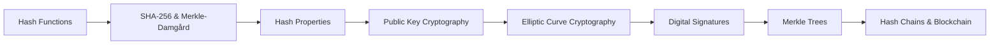
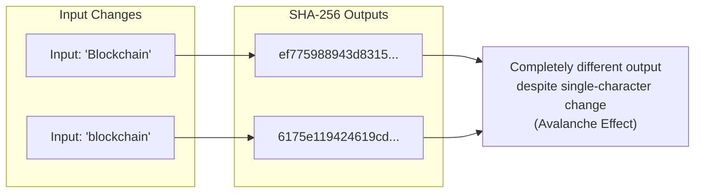
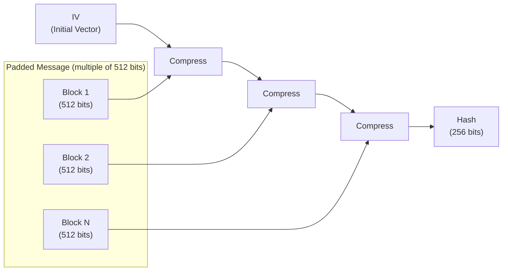
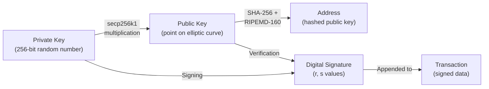
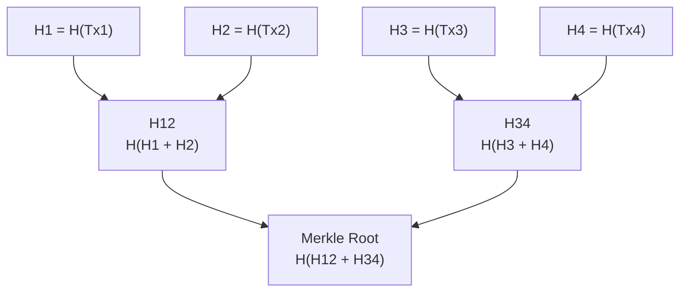
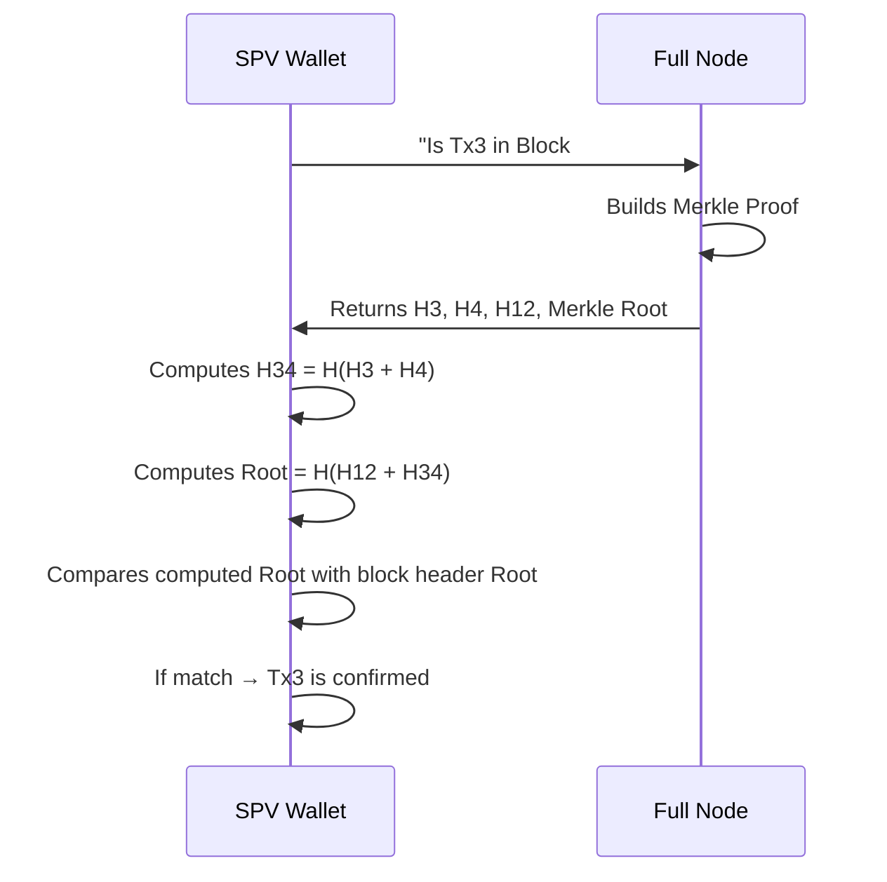
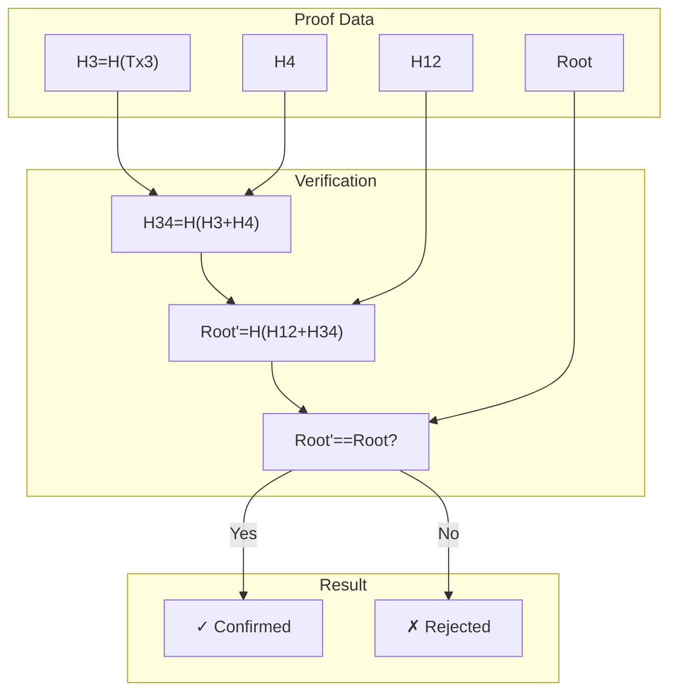
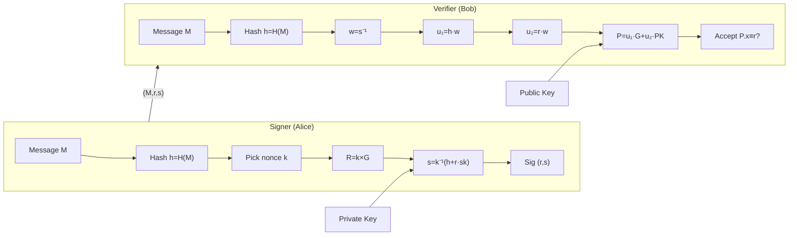

# Chapter 2: Cryptography for Blockchain

> **Previous:** [Chapter 1: Introduction to Blockchain](./01-introduction.md) | **Next:** [Chapter 3: Consensus Mechanisms](./03-consensus.md)

---

## Learning Objectives

- Explain the properties of cryptographic hash functions including preimage resistance and collision resistance
- Understand the Merkle-Damgård construction used in SHA-256
- Describe the role of Public Key Infrastructure (PKI) and Digital Signatures (ECDSA)
- Construct and verify a Merkle Tree from a set of transactions
- Explain the mathematics behind elliptic curve cryptography at a conceptual level
- Compare digital signature schemes (ECDSA, Schnorr, BLS)
- Describe how hash chains are used in blockchain data structures

## Chapter at a Glance

| Topic | Key Insight | Practical Takeaway |
|-------|-------------|--------------------|
| Hash Functions | Deterministic, preimage resistant, collision resistant | Foundation of blockchain immutability |
| Merkle-Damgård | Construction pattern for SHA-256 | Enables streaming hash of arbitrary-length input |
| Public Key Cryptography | Asymmetric keys for identity and ownership | Private key signs, public key verifies |
| Digital Signatures | Authentication, non-repudiation, integrity | Mathematical proof of ownership without revealing the key |
| Merkle Trees | Binary tree of hashes summarizes all transactions | Enables SPV — verify a transaction without downloading the full chain |
| ECC | Elliptic curve math for key generation | Smaller keys than RSA for equivalent security |
| Hash Chains | Sequential hashing links blocks | Immutable history, tamper evidence |

## Chapter Roadmap



---

## Theory

### Cryptographic Hash Functions

A hash function maps an input of arbitrary size to a fixed-size string of characters. For blockchain, hash functions must satisfy four key properties:

1. **Deterministic:** The same input always yields the same output. Without this property, the system would have no way to verify data integrity.

2. **Preimage Resistant:** Given an output `y = H(x)`, it is computationally infeasible to find any `x` that produces `y`. This means you cannot reverse a hash to find the original input. This protects the privacy of data stored on-chain.

3. **Second Preimage Resistant:** Given an input `x1`, it is computationally infeasible to find another input `x2` such that `H(x1) = H(x2)`. This prevents an attacker from substituting one piece of data for another with the same hash.

4. **Collision Resistant:** It is computationally infeasible to find any two distinct inputs `x1` and `x2` such that `H(x1) = H(x2)`. This is stronger than second-preimage resistance. The birthday paradox means that for an `n`-bit hash, a collision can be found in approximately `2^(n/2)` attempts.

5. **Avalanche Effect:** A small change in input (even one bit) leads to a drastically different output (approximately 50% of bits change). This makes it impossible to predict how changes propagate.



### SHA-256 and the Merkle-Damgård Construction

SHA-256 (Secure Hash Algorithm 256-bit) is the primary hash function used in Bitcoin and many other blockchains. It belongs to the SHA-2 family and produces a 256-bit (32-byte) output.

SHA-256 uses the **Merkle-Damgård construction**, which works as follows:

1. **Padding:** The input message is padded to a multiple of 512 bits.
2. **Block Processing:** The padded message is divided into 512-bit blocks.
3. **Compression Function:** Each block is processed through a compression function along with the previous output (chaining value).
4. **Initialization Vector (IV):** The first block uses a fixed IV as its previous output.
5. **Final Output:** After all blocks are processed, the final chaining value is the hash.



This construction is important because it allows hashing of arbitrary-length inputs using a fixed-size compression function. It also makes SHA-256 vulnerable to length-extension attacks (which is why Bitcoin uses `H(H(m))` or SHA-256d in some contexts).

### Hash Chains

A hash chain is created by repeatedly applying a hash function to a value:
`H(H(H(...H(initial_value)...)))`

In blockchain, hash chains are used in two key ways:

1. **Block Chain Linking:** Each block header contains the hash of the previous block header, creating a chain of hashes that protects the entire history.

2. **Proof of Work:** Miners iterate through nonce values, computing `SHA-256(SHA-256(block_header || nonce))` until they find a hash below the target threshold.

```typescript
function hashChain(seed: string, length: number): string[] {
    const chain: string[] = [seed];
    for (let i = 1; i <= length; i++) {
        // In practice this would be SHA-256
        const previousHash = chain[i - 1];
        const nextHash = `H(${previousHash})`;
        chain.push(nextHash);
    }
    return chain;
}
// Example output chain:
// ["seed", "H(seed)", "H(H(seed))", "H(H(H(seed)))", ...]
```

### Public Key Cryptography (Asymmetric)

Blockchain uses asymmetric cryptography for identity and ownership.

- **Private Key:** A secret (random) number used to sign transactions. Typically 256 bits for ECDSA on the secp256k1 curve.
- **Public Key:** Derived from the private key using elliptic curve multiplication. Cannot be reversed to find the private key.
- **Address:** A hashed version of the public key (usually through RIPEMD-160 of SHA-256), acting as the user's "account number."



### Elliptic Curve Cryptography (ECC)

Bitcoin and Ethereum use ECC with the secp256k1 curve. The core math is:

- The private key is a random integer `k` (256 bits).
- The public key is a point on the elliptic curve: `K = k * G`, where `G` is a fixed generator point and `*` represents elliptic curve scalar multiplication.

The security of ECC relies on the **Elliptic Curve Discrete Logarithm Problem (ECDLP)**: given `K` and `G`, it is computationally infeasible to find `k` such that `K = k * G`.

ECC at 256 bits provides equivalent security to:
- RSA with 3072-bit keys
- Symmetric encryption with 128-bit keys

This smaller key size makes ECC ideal for blockchain, where storage and bandwidth efficiency matter.

### Digital Signatures

A digital signature (e.g., ECDSA — Elliptic Curve Digital Signature Algorithm) provides:

1. **Authentication:** Proves the transaction came from the owner of the private key.
2. **Non-repudiation:** The signer cannot deny signing the transaction.
3. **Integrity:** Proves the transaction was not altered after signing.

The ECDSA signing process:
1. Hash the transaction data.
2. Generate a random nonce `k`.
3. Compute the curve point `(x1, y1) = k * G`.
4. Compute `r = x1 mod n`.
5. Compute `s = k^(-1) * (hash + r * privateKey) mod n`.
6. The signature is the pair `(r, s)`.

Verification uses the public key to confirm the signature was created by the corresponding private key.

### Signature Scheme Comparison

| Scheme | Key Size | Sig Size | Batch Verification | Advantages | Used By |
|--------|----------|----------|-------------------|------------|---------|
| ECDSA (secp256k1) | 32 bytes | 64-72 bytes | No | Simple, widely deployed | Bitcoin, Ethereum |
| Schnorr (secp256k1) | 32 bytes | 64 bytes | Yes | Signature aggregation (MuSig) | Bitcoin Taproot |
| BLS | 48 bytes | 48 bytes | Yes | Very compact, efficient | Ethereum 2.0 |
| EdDSA (Ed25519) | 32 bytes | 64 bytes | No | Fast, constant-time | Solana, Cardano |

**Schnorr signatures** were introduced to Bitcoin via the Taproot upgrade (2021). Their key advantage is **signature aggregation** — multiple signatures can be combined into one, reducing transaction size and improving privacy.

**BLS signatures** (Boneh-Lynn-Shacham) are used in Ethereum 2.0 for the beacon chain. They allow aggregation of thousands of validator signatures into a single 48-byte signature, enabling efficient consensus with 100,000+ validators.

### Merkle Trees

A Merkle Tree is a binary tree of hashes. Each leaf node is the hash of a transaction, and each non-leaf node is the hash of its children concatenated. The **Merkle Root** summarizes all transactions in a block into a single hash.



This allows for **SPV (Simplified Payment Verification)** — a light client can prove a transaction is included in a block by providing only `log2(n)` hashes (a Merkle proof), rather than downloading all `n` transactions.



### Merkle Proof Verification

```typescript
interface MerkleProof {
    leafHash: string;
    merkleRoot: string;
    siblings: string[];
    positions: boolean[]; // true = right sibling, false = left sibling
}

function verifyMerkleProof(proof: MerkleProof): boolean {
    let currentHash = proof.leafHash;
    
    for (let i = 0; i < proof.siblings.length; i++) {
        const sibling = proof.siblings[i];
        const isRightSibling = proof.positions[i];
        
        if (isRightSibling) {
            // Current hash is left, sibling is right
            currentHash = hashPair(currentHash, sibling);
        } else {
            // Sibling is left, current hash is right
            currentHash = hashPair(sibling, currentHash);
        }
    }
    
    return currentHash === proof.merkleRoot;
}

function hashPair(left: string, right: string): string {
    // In reality: SHA-256(concat(hexToBytes(left), hexToBytes(right)))
    return `H(${left}+${right})`;
}

// Example: Verifying Tx3 is in block with Merkle root R
const proof: MerkleProof = {
    leafHash: "H3",
    merkleRoot: "R",
    siblings: ["H4", "H12"],
    positions: [true, true], // H3 is left of H4, H12 is left of root
};

console.log(verifyMerkleProof(proof)); // true
```

> **One-Sentence Takeaway:** Cryptographic hash functions are the glue that makes blockchain tamper-evident — any change to any transaction propagates up the Merkle tree to change the Merkle root, which changes the block hash, breaking the chain.

---

## Examples

### Example 1: Hashing with SHA-256

Input: `Blockchain`
Output: `ef775988943d8315185d11019672d4b971552a926d5c644d673f8502f6764585`

Input: `blockchain`
Output: `6175e119424619cd30a383d09a06709d43d31ac9979c3d0c2e3995f745d4704e`

Note how changing the first letter to lowercase completely changes the hash (avalanche effect).

### Example 2: Constructing a Merkle Root for 6 Transactions

For an odd number of leaves, the last leaf is duplicated:

```text
Transactions: [Tx1, Tx2, Tx3, Tx4, Tx5, Tx6]

Level 0 (Leaves):      H1    H2    H3    H4    H5    H6
Level 1:              H12          H34        H55 (H5+H5)
Level 2:            H1234                    H5555
Level 3 (Root):                H_root = H(H1234 + H5555)
```

### Example 3: ECDSA Signing and Verification

```typescript
// Conceptual representation (not actual secp256k1 implementation)
interface Signature {
    r: bigint;
    s: bigint;
}

function signMessage(
    privateKey: bigint,
    message: string
): Signature {
    const hash = sha256(message);
    const k = generateRandomNonce(); // Must be unique per signature!
    const r = computeRFromNonce(k);
    const s = (modInverse(k, n) * (hash + r * privateKey)) % n;
    return { r, s };
}

function verifySignature(
    publicKey: Point,
    message: string,
    signature: Signature
): boolean {
    const hash = sha256(message);
    const w = modInverse(signature.s, n);
    const u1 = (hash * w) % n;
    const u2 = (signature.r * w) % n;
    const point = u1.multiply(G).add(u2.multiply(publicKey));
    return point.x === signature.r;
}
```

> **Warning:** A SHA-256 hash collision would be catastrophic for blockchain — it would allow an attacker to create a different input with the same hash, breaking the chain's integrity. This is why SHA-256's collision resistance is constantly monitored by the cryptographic community.

> **Pro Tip:** Never share your private key with anyone — it is the sole proof of ownership of blockchain assets. Hardware wallets keep private keys offline and are the gold standard for security. For ECDSA specifically, never reuse a nonce `k` — it leaks the private key.

---

## Concept Comparison Table

| Concept | Definition | Key Distinction | Use Case |
|---------|-----------|-----------------|----------|
| Hashing | One-way function producing fixed-size output | Irreversible, deterministic | Block linking, Merkle trees |
| Encryption | Two-way encoding with decryption | Reversible with key | Data privacy (not used in Bitcoin core) |
| Digital Signature | Proves authenticity of a message | Binds identity to data | Transaction authorization |
| Public Key | Derived from private key, shared openly | Cannot derive private key from it | Address generation, signature verification |
| Private Key | Secret number controlling ownership | Must never be shared | Signing transactions |
| Merkle Proof | Path of hashes from leaf to root | Logarithmic proof size | SPV wallets, light clients |
| ECDSA | Elliptic Curve Digital Signature Algorithm | Most common blockchain signature scheme | Bitcoin, Ethereum |
| Schnorr | Alternative signature scheme | Enables signature aggregation | Bitcoin Taproot |
| Hash Chain | Sequential hash application | Links blocks together | Blockchain data structure |

## Quick Reference

| Category | Key Concepts | Notes |
|----------|-------------|-------|
| **Hash Properties** | Deterministic, Preimage resistant, Collision resistant, Avalanche effect | SHA-256 is the blockchain standard |
| **Key Pair** | Private key → Public key → Address | Each transformation is one-way |
| **Signature Scheme** | ECDSA (Bitcoin), secp256k1 curve | Schnorr signatures (Taproot) are newer |
| **Merkle Tree** | Leaf = tx hash, Root = Merkle root | Proof requires only log2(n) hashes |
| **ECC Security** | 256-bit ECC ≈ 3072-bit RSA | Smaller keys, faster operations |
| **SHA-256** | 256-bit output, 64 rounds | Part of SHA-2 family |
| **Block Cipher** | AES is used in some L2 protocols | Not typically used in L1 |

## Cross-Application Matrix

| Technique | DeFi | Smart Contracts | Enterprise Blockchain | Research |
|-----------|------|-----------------|----------------------|----------|
| SHA-256 Hashing | Transaction IDs | State root computation | Channel data hashing | Collision resistance studies |
| ECDSA Signatures | Transaction authorization | Contract function calls | Identity certificates | Post-quantum crypto research |
| Merkle Trees | UTXO set verification | State tree (storage) | World state hashing | Merkle tree variants |
| SPV Proofs | Light wallet verification | Event log proofs | Audit verification | Zero-knowledge proofs |
| Key Derivation | HD wallet paths | Contract address derivation | MSP certificates | BIP32/39 improvements |
| Schnorr Signatures | Atomic swaps | Multi-sig contracts | Aggregate signatures | MuSig research |
| BLS Signatures | Cross-chain | Consensus finality | Validator set aggregation | Threshold signatures |

## Chapter Quiz

1. Which property of hash functions prevents an attacker from finding two different inputs that produce the same hash?
   - A) Preimage resistance
   - B) Collision resistance
   - C) Determinism
   - D) Avalanche effect

<details>
<summary>Answer</summary>
**B) Collision resistance.** Collision resistance guarantees it is computationally infeasible to find two different inputs that hash to the same output. This prevents attackers from substituting one transaction for another while maintaining the same hash.
</details>

2. How does a Merkle tree enable Simplified Payment Verification (SPV)?
   - A) By storing all transactions in a single hash
   - B) By providing a logarithmic-sized proof that a transaction is included in a block
   - C) By encrypting the transaction data
   - D) By removing old transactions

<details>
<summary>Answer</summary>
**B) By providing a logarithmic-sized proof that a transaction is included in a block.** An SPV wallet only needs to download block headers and a Merkle proof (log2(n) hashes) to verify a transaction, instead of downloading all transactions.
</details>

3. In ECDSA, what information is required to verify a digital signature?
   - A) The private key and the message
   - B) The public key, the message, and the signature
   - C) Only the signature
   - D) The private key and the signature

<details>
<summary>Answer</summary>
**B) The public key, the message, and the signature.** Anyone can verify a signature using the signer's public key, the original message, and the signature itself. The private key is never needed for verification.
</details>

4. What makes the Merkle-Damgård construction important for SHA-256?
   - A) It makes SHA-256 quantum-resistant
   - B) It allows hashing arbitrary-length inputs using a fixed-size compression function
   - C) It makes SHA-256 reversible
   - D) It eliminates the need for padding

<details>
<summary>Answer</summary>
**B) It allows hashing arbitrary-length inputs using a fixed-size compression function.** The Merkle-Damgård construction pads the input to a multiple of the block size and processes it through iterative applications of the compression function.
</details>

5. What is the key advantage of Schnorr signatures over ECDSA?
   - A) They are harder to forge
   - B) They support signature aggregation (multiple signatures into one)
   - C) They use longer keys
   - D) They are older and more tested

<details>
<summary>Answer</summary>
**B) They support signature aggregation.** Schnorr signatures allow multiple signatures from different participants to be combined into a single signature, reducing transaction size and improving privacy. This was a key feature of the Bitcoin Taproot upgrade.
</details>

### TypeScript: Digital Signature with ECDSA

```typescript
import { createSign, createVerify, generateKeyPairSync } from "node:crypto";

class Wallet {
  public publicKey: string;
  private privateKey: string;

  constructor() {
    const { publicKey, privateKey } = generateKeyPairSync("ec", {
      namedCurve: "prime256v1",
      publicKeyEncoding: { type: "spki", format: "pem" },
      privateKeyEncoding: { type: "pkcs8", format: "pem" },
    });
    this.publicKey = publicKey;
    this.privateKey = privateKey;
  }

  sign(data: string): string {
    const sign = createSign("sha256");
    sign.update(data);
    return sign.sign(this.privateKey, "hex");
  }

  static verify(data: string, signature: string, publicKey: string): boolean {
    const verify = createVerify("sha256");
    verify.update(data);
    return verify.verify(publicKey, signature, "hex");
  }
}

interface Transaction {
  from: string;
  to: string;
  amount: number;
  signature: string;
}

function createTransaction(from: Wallet, toPubKey: string, amount: number): Transaction {
  const data = `${from.publicKey}${toPubKey}${amount}`;
  return { from: from.publicKey, to: toPubKey, amount, signature: from.sign(data) };
}

function verifyTransaction(tx: Transaction): boolean {
  const data = `${tx.from}${tx.to}${tx.amount}`;
  return Wallet.verify(data, tx.signature, tx.from);
}

// const alice = new Wallet(), bob = new Wallet();
// const tx = createTransaction(alice, bob.publicKey, 10);
// console.log(verifyTransaction(tx)); // true
```

### Merkle Tree Verification Process

A Merkle proof allows a light client to verify that a transaction belongs in a block by reconstructing the Merkle root from the leaf upward using only ~log₂(n) sibling hashes instead of downloading all transactions.



### Digital Signature Sign and Verify Flow

Elliptic curve digital signatures bind a signer's public key to a message. The private key produces the signature; the public key verifies it — without the private key ever being transmitted.



This flow ensures the private key never leaves the signer's device, yet any network participant can independently verify the signature without trusting a third party.

## Summary

- Cryptographic hash functions are the "glue" that keeps the blockchain immutable.
- Public key cryptography enables secure ownership without revealing secrets.
- Digital signatures ensure that only the rightful owner can authorize a transaction.
- Merkle Trees provide an efficient way to verify transaction inclusion in a block.
- Cryptography replaces the need for a central trusted authority with mathematical certainty.
- ECC provides strong security with smaller key sizes than RSA.
- SHA-256 uses the Merkle-Damgård construction to process arbitrary-length inputs.
- Different signature schemes (ECDSA, Schnorr, BLS) offer different trade-offs between size, speed, and aggregation capability.

## Practical Takeaways

1. Always use a hardware wallet to keep private keys offline and secure.
2. SPV wallets are the practical way to interact with blockchains from mobile devices.
3. Never reuse an ECDSA nonce — doing so reveals the private key.
4. For multi-sig or threshold applications, prefer Schnorr or BLS signatures for efficiency.
5. Verify Merkle proofs rather than trusting full nodes with transaction inclusion.

---

## Exercises

### Review Questions

1. Define "collision resistance" in the context of SHA-256.
2. Why can't we derive a private key from a public key?
3. What is the benefit of using a Merkle Tree instead of a simple list of hashes?
4. Explain the difference between encryption and hashing.
5. What is the birthday paradox and how does it affect hash function security?

### Application Problems

1. Calculate the Merkle Root for three transactions (A, B, C). Note: For odd numbers, the last leaf is often duplicated.
2. Demonstrate how a "man-in-the-middle" attack is prevented by digital signatures in a P2P network.
3. If an attacker finds a way to reverse SHA-256, what specific parts of the Bitcoin protocol would fail?
4. Compare the proof size (in hashes) needed to prove transaction inclusion in a block of 1,000 transactions using a Merkle tree versus using a simple concatenation of all hashes.

### Challenge Problem

1. Research the "Short Signature" problem and explain why Bitcoin uses SECP256K1 specifically for its elliptic curve cryptography.
2. Analyze the computational overhead of verifying a BLS signature aggregate from 10,000 Ethereum validators versus verifying each signature individually. Why does this matter for the Ethereum beacon chain?

BLS aggregation reduces 10,000 individual signature verifications (10,000 pairings) to a single aggregated verification (3 pairings + 1 exponentiation), which is essential for beacon chain scalability.
