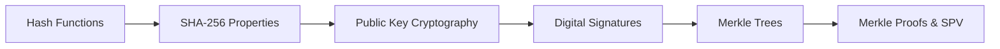

# Chapter 2: Cryptography for Blockchain

> **Previous:** [Chapter 1: Introduction to Blockchain](./01-introduction.md) | **Next:** [Chapter 3: Consensus Mechanisms](./03-consensus.md)

---

## Learning Objectives

- Explain the properties of cryptographic hash functions (SHA-256)
- Understand the role of Public Key Infrastructure (PKI) and Digital Signatures (ECDSA)
- Construct and verify a Merkle Tree from a set of transactions
- Describe the relationship between private keys, public keys, and blockchain addresses
- Explain how cryptographic proofs ensure data integrity

## Chapter at a Glance

| Topic | Key Insight | Practical Takeaway |
|-------|-------------|--------------------|
| Hash Functions | Deterministic, pre-image resistant, collision resistant | Foundation of blockchain immutability |
| Public Key Cryptography | Asymmetric keys for identity and ownership | Private key signs, public key verifies |
| Digital Signatures | Authentication, non-repudiation, integrity | Mathematical proof of ownership without revealing the key |
| Merkle Trees | Binary tree of hashes summarizes all transactions | Enables SPV — verify a transaction without downloading the full chain |

## Chapter Roadmap

---

## Theory

### Cryptographic Hash Functions
A hash function maps an input of arbitrary size to a fixed-size string of characters. For blockchain, hash functions must be:
1. **Deterministic:** Same input always yields same output.
2. **Pre-image Resistant:** Impossible to determine input from output.
3. **Collision Resistant:** Impossible to find two different inputs with the same output.
4. **Avalanche Effect:** Small change in input leads to drastic change in output.

### Public Key Cryptography (Asymmetric)
Blockchain uses asymmetric cryptography for identity and ownership.
- **Private Key:** A secret number used to sign transactions.
- **Public Key:** Derived from the private key; used by the network to verify the signature.
- **Address:** A hashed version of the public key, acting as the user's "account number."

### Digital Signatures
A digital signature (e.g., ECDSA) provides:
1. **Authentication:** Proves the transaction came from the owner of the private key.
2. **Non-repudiation:** The signer cannot deny signing the transaction.
3. **Integrity:** Proves the transaction was not altered after signing.

### Merkle Trees
A Merkle Tree is a binary tree of hashes. Each leaf node is the hash of a transaction, and each non-leaf node is the hash of its children. The **Merkle Root** summarizes all transactions in a block into a single hash. This allows for **SPV (Simplified Payment Verification)** by providing a Merkle Proof.

> **One-Sentence Takeaway:** Cryptographic hash functions are the glue that makes blockchain tamper-evident — any change to any transaction propagates up the Merkle tree to change the Merkle root.

---

## Examples

### Example 1: Hashing with SHA-256
Input: `Blockchain`
Output: `ef775988943d8315185d11019672d4b971552a926d5c644d673f8502f6764585`

Input: `blockchain`
Output: `6175e119424619cd30a383d09a06709d43d31ac9979c3d0c2e3995f745d4704e`

Note how changing the first letter to lowercase completely changes the hash.

### Example 2: Constructing a Merkle Root
Assume 4 transactions: $T_1, T_2, T_3, T_4$.
1. Compute leaf hashes: $H_1=Hash(T_1), H_2=Hash(T_2), H_3=Hash(T_3), H_4=Hash(T_4)$.
2. Compute parent hashes: $H_{12}=Hash(H_1 + H_2), H_{34}=Hash(H_3 + H_4)$.
3. Compute Merkle Root: $Root=Hash(H_{12} + H_{34})$.
If $T_2$ is altered, $H_2$ changes, which changes $H_{12}$, which changes the $Root$.

> **Warning:** A SHA-256 hash collision would be catastrophic for blockchain — it would allow an attacker to create a different input with the same hash, breaking the chain's integrity. This is why SHA-256's collision resistance is constantly monitored by the cryptographic community.

> **Pro Tip:** Never share your private key with anyone — it is the sole proof of ownership of blockchain assets. Hardware wallets keep private keys offline and are the gold standard for security.

---

## Concept Comparison Table

| Concept | Definition | Key Distinction | Use Case |
|---------|-----------|-----------------|----------|
| Hashing | One-way function producing fixed-size output | Irreversible, deterministic | Block linking, Merkle trees |
| Encryption | Two-way encoding with decryption | Reversible with key | Data privacy (not used in Bitcoin core) |
| Digital Signature | Proves authenticity of a message | Binds identity to data | Transaction authorization |
| Public Key | Derived from private key, shared openly | Cannot derive private key from it | Address generation, signature verification |
| Private Key | Secret number controlling ownership | Must never be shared | Signing transactions |
| Merkle Proof | Path of hashes from leaf to root | Logarithmic proof size | SPV wallets, light clients |

## Quick Reference

| Category | Key Concepts | Notes |
|----------|-------------|-------|
| **Hash Properties** | Deterministic, Pre-image resistant, Collision resistant, Avalanche effect | SHA-256 is the blockchain standard |
| **Key Pair** | Private key → Public key → Address | Each transformation is one-way |
| **Signature Scheme** | ECDSA (Bitcoin), secp256k1 curve | Schnorr signatures (Taproot) are newer |
| **Merkle Tree** | Leaf = tx hash, Root = Merkle root | Proof requires only log₂(n) hashes |

## Cross-Application Matrix

| Technique | DeFi | Smart Contracts | Enterprise Blockchain | Research |
|-----------|------|-----------------|----------------------|----------|
| SHA-256 Hashing | Transaction IDs | State root computation | Channel data hashing | Collision resistance studies |
| ECDSA Signatures | Transaction authorization | Contract function calls | Identity certificates | Post-quantum crypto research |
| Merkle Trees | UTXO set verification | State tree (storage) | World state hashing | Merkle tree variants |
| SPV Proofs | Light wallet verification | Event log proofs | Audit verification | Zero-knowledge proofs |
| Key Derivation | HD wallet paths | Contract address derivation | MSP certificates | BIP32/39 improvements |

## Chapter Quiz

1. Which property of hash functions prevents an attacker from finding two different inputs that produce the same hash?
   - A) Pre-image resistance
   - B) Collision resistance
   - C) Determinism
   - D) Avalanche effect

Answer

**B) Collision resistance.** Collision resistance guarantees it is computationally infeasible to find two different inputs that hash to the same output. This prevents attackers from substituting one transaction for another while maintaining the same hash.

2. How does a Merkle tree enable Simplified Payment Verification (SPV)?
   - A) By storing all transactions in a single hash
   - B) By providing a logarithmic-sized proof that a transaction is included in a block
   - C) By encrypting the transaction data
   - D) By removing old transactions

Answer

**B) By providing a logarithmic-sized proof that a transaction is included in a block.** An SPV wallet only needs to download block headers and a Merkle proof (log₂(n) hashes) to verify a transaction, instead of downloading all transactions.

3. In ECDSA, what information is required to verify a digital signature?
   - A) The private key and the message
   - B) The public key, the message, and the signature
   - C) Only the signature
   - D) The private key and the signature

Answer

**B) The public key, the message, and the signature.** Anyone can verify a signature using the signer's public key, the original message, and the signature itself. The private key is never needed for verification.

## Summary

- Cryptographic hash functions are the "glue" that keeps the blockchain immutable.
- Public key cryptography enables secure ownership without revealing secrets.
- Digital signatures ensure that only the rightful owner can authorize a transaction.
- Merkle Trees provide an efficient way to verify transaction inclusion in a block.
- Cryptography replaces the need for a central trusted authority with mathematical certainty.

---

## Exercises

### Review Questions
1. Define "collision resistance" in the context of SHA-256.
2. Why can't we derive a private key from a public key?
3. What is the benefit of using a Merkle Tree instead of a simple list of hashes?
4. Explain the difference between encryption and hashing.

### Application Problems
1. Calculate the Merkle Root for three transactions (A, B, C). Note: For odd numbers, the last leaf is often duplicated.
2. Demonstrate how a "man-in-the-middle" attack is prevented by digital signatures in a P2P network.
3. If an attacker finds a way to reverse SHA-256, what specific parts of the Bitcoin protocol would fail?

### Challenge Problem
1. Research the "Short Signature" problem and explain why Bitcoin uses SECP256K1 specifically for its elliptic curve cryptography.
