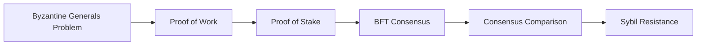

# Chapter 3: Consensus Mechanisms

> **Previous:** [Chapter 2: Cryptography for Blockchain](./02-cryptography.md) | **Next:** [Chapter 4: The Bitcoin Network](./04-bitcoin.md)

---

## Learning Objectives

- Explain the Byzantine Generals' Problem and its relevance to distributed systems
- Describe the Proof of Work (PoW) mechanism and the concept of "difficulty"
- Analyze the Proof of Stake (PoS) mechanism and its variations (DPoS)
- Compare BFT-based consensus (PBFT) with lottery-based consensus (PoW/PoS)
- Understand the trade-offs between energy consumption, security, and decentralization

## Chapter at a Glance

| Topic | Key Insight | Practical Takeaway |
|-------|-------------|--------------------|
| Byzantine Generals Problem | Distributed nodes must agree despite faulty/malicious actors | Consensus mechanisms solve this fundamental problem |
| Proof of Work (PoW) | Solve computational puzzles to propose blocks | Energy-intensive but proven secure over 15+ years |
| Proof of Stake (PoS) | Validators stake tokens as economic collateral | 99%+ energy reduction vs PoW, with slashing for misbehavior |
| BFT Consensus | Voting-based finality among known validators | Near-instant finality, suited for permissioned networks |
| Difficulty Adjustment | Network adjusts target to maintain consistent block time | Self-regulating — more miners = harder puzzles |

## Chapter Roadmap

---

## Theory

### The Byzantine Generals' Problem
A classic problem in distributed computing where multiple generals must agree on a common battle plan (Attack or Retreat). Some generals might be traitors (malicious nodes). A consensus mechanism must ensure that all loyal generals reach the same decision even if a certain percentage of the network is faulty or malicious.

### Proof of Work (PoW)
Nodes (miners) compete to solve a computationally intensive puzzle.
- **Mechanism:** Find a value (nonce) such that $Hash(BlockHeader + Nonce) < Target$.
- **Security:** Requires enormous energy/hardware investment. An attacker must control 51% of the network's hash rate.
- **Incentive:** Block rewards and transaction fees.

### Proof of Stake (PoS)
Validators are chosen based on the amount of cryptocurrency they "stake" (lock up).
- **Mechanism:** Selection is often proportional to the stake size and age.
- **Security:** Slashing (losing stake) discourages malicious behavior. No 51% hash rate attack, but "nothing at stake" and "long-range" attacks are concerns.
- **Efficiency:** Drastically lower energy consumption compared to PoW.

### Byzantine Fault Tolerance (BFT)
BFT protocols (like PBFT) involve multiple rounds of voting among a fixed set of validators.
- **Requirement:** Typically requires $n > 3f$ nodes to tolerate $f$ traitors.
- **Speed:** High throughput and instant finality, but less scalable in terms of node count.

---

## Examples

### Example 1: PoW Difficulty Adjustment
Bitcoin aims for a 10-minute block time. If miners solve blocks too fast (e.g., every 8 minutes), the network increases the **Difficulty**.
- **Calculation:** The "Target" is lowered. A lower target means it is harder to find a hash that is smaller than it.
- **Output:** Miners must now perform more hashes on average to find a valid block.

### Example 2: PoS Validator Selection
Imagine a network where:
- Alice stakes 1,000 Tokens.
- Bob stakes 500 Tokens.
In a simple PoS model, Alice is twice as likely as Bob to be chosen to propose the next block. If Alice proposes an invalid block, the network "slashes" her 1,000 tokens, providing a strong economic deterrent.

> **Pro Tip:** When evaluating a PoS blockchain, check the slashing conditions carefully. Some protocols slash for going offline (inactive), while others only slash for equivocation (double-signing). The severity of slashing directly impacts validator behavior and decentralization.

> **Warning:** The "nothing at stake" problem in pure PoS means validators might vote on every chain fork with no cost. Modern PoS (like Ethereum's Casper) solves this by penalizing validators who vote on conflicting chains.

---

## Concept Comparison Table

| Concept | Definition | Key Distinction | Use Case |
|---------|-----------|-----------------|----------|
| PoW | Compute puzzle to propose next block | Energy-intensive, proven security | Bitcoin, Litecoin |
| PoS | Economic stake determines validator | Energy-efficient, slashing risk | Ethereum 2.0, Cardano |
| PBFT | Voting-based Byzantine agreement | Instant finality, node count limited | Hyperledger Fabric |
| DPoS | Delegated voting for block producers | Faster than PoW, semi-centralized | EOS, Tron |
| Difficulty | Target value for PoW puzzle | Self-adjusting every 2016 blocks (Bitcoin) | Consistent block timing |
| Slashing | Penalty for PoS misbehavior | Economic deterrent | Validator accountability |

## Quick Reference

| Category | Key Concepts | Notes |
|----------|-------------|-------|
| **PoW Security** | 51% attack cost = hardware + electricity | Higher hash rate = more secure |
| **PoS Security** | 1/3 stake attack, long-range attack | Slashing is the deterrent |
| **BFT Requirements** | n > 3f for PBFT | 4 nodes tolerate 1 fault |
| **Finality** | Probabilistic (PoW) vs Instant (BFT) | PoW: wait for 6+ confirmations |
| **Energy** | PoW = country-scale, PoS = negligible | Ethereum switch saved ~99.9% energy |

## Cross-Application Matrix

| Technique | DeFi | Smart Contracts | Enterprise Blockchain | Research |
|-----------|------|-----------------|----------------------|----------|
| PoW | Bitcoin settlement | Chain security | Not typically used | ASIC resistance |
| PoS | ETH staking, Lido | Validator set | Private PoS variants | Finality gadgets |
| PBFT | Not common | Not common | Hyperledger ordering | Consensus theory |
| DPoS | EOS DeFi | Block producer voting | Delegated governance | Voting mechanism design |
| Difficulty Adj | Mining profitability | N/A | N/A | Network stability |

## Chapter Quiz

1. How does Proof of Work achieve Sybil resistance?
   - A) By requiring validators to hold tokens
   - B) By requiring computational work (hash power) to participate in block creation
   - C) By limiting the number of nodes
   - D) By using trusted hardware

Answer

**B) By requiring computational work (hash power) to participate in block creation.** An attacker would need to control more than 50% of the network's total hash rate, which requires enormous hardware and electricity investment — impractical for most adversaries.

2. What is the key economic difference between PoW and PoS security?
   - A) PoW costs external energy; PoS risks locked capital
   - B) PoS is free to attack
   - C) PoW is more centralized
   - D) There is no difference

Answer

**A) PoW costs external energy; PoS risks locked capital.** In PoW, the cost of attack is buying hardware and electricity. In PoS, the cost is the slashed stake. Both create economic disincentives but through different mechanisms.

3. In PBFT, how many total nodes are needed to tolerate 2 faulty nodes?
   - A) 4
   - B) 5
   - C) 6
   - D) 7

Answer

**D) 7.** PBFT requires n > 3f, so for f=2: n > 6, meaning at least 7 nodes are needed.

## Summary

- Consensus mechanisms enable distributed nodes to agree on the state of a ledger.
- PoW uses computational power to secure the network but consumes significant energy.
- PoS uses economic stake to secure the network, offering better scalability and efficiency.
- BFT protocols are suitable for permissioned environments where the set of validators is known.
- Sybil resistance is a core requirement, ensuring an attacker cannot easily create many identities to manipulate consensus.

---

## Exercises

### Review Questions
1. Why is a consensus mechanism needed in a decentralized network but not in a centralized one?
2. Explain the "51% Attack" in a PoW network.
3. What is "Slashing" in Proof of Stake?
4. How does PBFT differ from PoW in terms of "finality"?

### Application Problems
1. If the current Target is `0x0000FFFF...` and the network wants to double the difficulty, what should the new Target be?
2. Calculate the minimum number of nodes required in a PBFT system to tolerate 5 malicious nodes.
3. Compare the "Cost of Attack" for a PoW network with $100M in hardware versus a PoS network with $100M in staked value.

### Challenge Problem
1. Evaluate the "Nothing at Stake" problem in PoS and discuss how modern protocols like Ethereum 2.0 (Casper) attempt to solve it.
