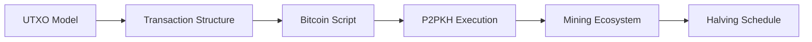

# Chapter 4: The Bitcoin Network

> **Previous:** [Chapter 3: Consensus Mechanisms](./03-consensus.md) | **Next:** [Chapter 5: Ethereum and Smart Contracts](./05-ethereum.md)

---

## Learning Objectives

- Describe the architecture of the Bitcoin network and the role of different node types
- Understand the UTXO (Unspent Transaction Output) model vs. Account model
- Explain the life cycle of a Bitcoin transaction from broadcast to confirmation
- Analyze the Bitcoin script language and its limited expressiveness
- Understand the concept of "Mining" and the halving mechanism

## Chapter at a Glance

| Topic | Key Insight | Practical Takeaway |
|-------|-------------|--------------------|
| UTXO Model | No balances — only unspent transaction outputs | Your "balance" is the sum of UTXOs you can unlock |
| Transaction Structure | Inputs (reference UTXOs) + Outputs (new UTXOs) | Every transaction consumes and creates UTXOs |
| Bitcoin Script | Stack-based, non-Turing complete language | Intentionally limited to prevent DoS attacks |
| Mining | Hash power secures the network + new coin issuance | Halving every 4 years enforces 21M supply cap |
| P2PKH | Standard Pay-to-Public-Key-Hash script | The most common Bitcoin transaction type |

## Chapter Roadmap

---

## Theory

### The UTXO Model
Bitcoin does not use "accounts" or "balances" in the way a bank does. Instead, it tracks **UTXOs**.
- Every transaction consumes one or more existing UTXOs as **Inputs**.
- Every transaction creates one or more new UTXOs as **Outputs**.
- Your "balance" is simply the sum of all UTXOs associated with your addresses.

### Transaction Structure
A Bitcoin transaction consists of:
1. **Metadata:** Version, Locktime.
2. **Inputs:** References to previous UTXOs and a `scriptSig` (unlocking script).
3. **Outputs:** Value (in Satoshis) and a `scriptPubKey` (locking script).

### Bitcoin Script
Bitcoin uses a stack-based, non-Turing complete language called **Script**. It is intentionally limited to prevent infinite loops (denial of service). Most transactions use **P2PKH (Pay-to-Public-Key-Hash)** scripts.

### The Mining Ecosystem
Miners play two roles:
1. **Security:** Providing hash rate to secure the history.
2. **Issuance:** Releasing new BTC into circulation via the **Coinbase Transaction**.
The **Halving** occurs every 210,000 blocks (roughly 4 years), cutting the block reward in half to enforce scarcity (21 million total supply).

---

## Examples

### Example 1: UTXO Consolidation
Alice has three UTXOs:
- UTXO A: 0.5 BTC
- UTXO B: 1.2 BTC
- UTXO C: 0.3 BTC
Alice wants to buy a motorcycle for 1.8 BTC.
- **Input:** Alice provides A, B, and C (Total 2.0 BTC).
- **Output 1:** 1.8 BTC to the Dealer.
- **Output 2 (Change):** 0.19 BTC back to Alice.
- **Fee:** 0.01 BTC remains unallocated; it is collected by the miner.

### Example 2: P2PKH Script Execution
Locking Script (`scriptPubKey`): `OP_DUP OP_HASH160 <PubKHash> OP_EQUALVERIFY OP_CHECKSIG`
Unlocking Script (`scriptSig`): `<Signature> <PublicKey>`
1. `<Signature>` and `<PublicKey>` are pushed to the stack.
2. `OP_DUP` duplicates `<PublicKey>`.
3. `OP_HASH160` hashes it.
4. `OP_EQUALVERIFY` checks if it matches `<PubKHash>`.
5. `OP_CHECKSIG` verifies `<Signature>` using `<PublicKey>`.
If the result is `True`, the transaction is valid.

> **One-Sentence Takeaway:** Bitcoin's UTXO model treats every transaction as a set of consumed and created outputs, making it possible to parallelize validation but requiring users to manage multiple UTXOs as their "balance."

> **Pro Tip:** Bitcoin transaction fees increase with transaction size (in bytes), not transaction value. To save on fees, consolidate many small UTXOs into one larger UTXO during low-fee periods.

> **Warning:** If you lose your private keys, your Bitcoin is gone forever. There is no "forgot password" or customer support — Bitcoin's security model means you are solely responsible for key custody. Use hierarchical deterministic (HD) wallets with BIP39 seed phrases backed up offline.

---

## Concept Comparison Table

| Concept | Definition | Key Distinction | Use Case |
|---------|-----------|-----------------|----------|
| UTXO Model | Tracks unspent transaction outputs | No account balances, parallelizable | Bitcoin, Litecoin |
| Account Model | Tracks account balances directly | Simpler, sequential nonces | Ethereum, most smart contract chains |
| Bitcoin Script | Stack-based scripting language | Non-Turing complete (intentionally) | Basic conditions, multisig |
| Coinbase Transaction | First transaction in a block (miner reward) | Creates new BTC from nothing | Miner compensation |
| P2PKH | Standard payment script | Hash of public key, not the key itself | Most Bitcoin transactions |

## Quick Reference

| Category | Key Concepts | Notes |
|----------|-------------|-------|
| **UTXO Terms** | Inputs, Outputs, Change, Fee | Change goes back to you |
| **Script Ops** | OP_DUP, OP_HASH160, OP_EQUALVERIFY, OP_CHECKSIG | P2PKH uses these 4 in sequence |
| **Mining** | Hash rate, Difficulty, Block reward, Halving | Reward halves every 210K blocks |
| **Supply** | 21M total, ~19.5M mined (2026) | Last Bitcoin mined ~2140 |
| **Transaction** | Version, Inputs, Outputs, Locktime | Locktime enables time-locked transactions |

## Cross-Application Matrix

| Technique | DeFi | Smart Contracts | Enterprise Blockchain | Research |
|-----------|------|-----------------|----------------------|----------|
| UTXO Model | Atomic swaps | Not typical | Hyperledger Fabric uses similar | UTXO vs account scalability |
| Bitcoin Script | Multisig vaults | Simple conditions | Time-locked escrow | Script extension proposals |
| P2PKH | Standard payments | Address derivation | Identity wallets | Taproot/Schnorr |
| Halving Schedule | Supply prediction | Tokenomics design | N/A | Scarcity models |
| Mining | Hash rate markets | PoW security analysis | Not enterprise-relevant | Energy consumption studies |

## Chapter Quiz

1. What happens to Bitcoin transaction fees when there are many small UTXOs being consumed?
   - A) The fee decreases
   - B) The fee increases because the transaction is larger (more inputs)
   - C) The fee stays the same regardless of UTXO count
   - D) The fee is a percentage of the transaction value

Answer

**B) The fee increases because the transaction is larger (more inputs).** Bitcoin fees are based on transaction size in bytes. Each additional UTXO input adds ~150 bytes, so consolidating UTXOs during low-fee periods saves money.

2. What prevents Bitcoin Script from being used for infinite loops?
   - A) It has no looping constructs — it's intentionally non-Turing complete
   - B) It has a maximum gas limit
   - C) It times out after 10 minutes
   - D) It requires user confirmation for each operation

Answer

**A) It has no looping constructs — it's intentionally non-Turing complete.** Satoshi deliberately omitted loops and jumps to prevent denial-of-service attacks where scripts could run indefinitely.

3. Why does Bitcoin's block reward halve approximately every 4 years?
   - A) To fix a bug in the original code
   - B) To enforce the 21 million supply cap through disinflation
   - C) To make mining more profitable
   - D) To reduce transaction fees

Answer

**B) To enforce the 21 million supply cap through disinflation.** The halving reduces new supply by 50% every 210,000 blocks (~4 years), asymptotically approaching the 21 million limit. This programmed scarcity is central to Bitcoin's value proposition.

## Summary

- Bitcoin is a P2P electronic cash system based on the UTXO model.
- Transactions are valid only if they correctly "unlock" previous outputs.
- Bitcoin Script allows for basic conditional payments without the complexity of a full VM.
- Mining ensures network security and regulates the supply of BTC.
- Hardcoded scarcity (21M limit) and the halving mechanism are central to Bitcoin's value proposition.

---

## Exercises

### Review Questions
1. What is a "Coinbase Transaction"?
2. Why does Bitcoin use a stack-based language?
3. Explain why there are no "balances" stored on the Bitcoin blockchain.
4. What happens to the remaining value in a transaction if the sum of inputs exceeds the sum of outputs?

### Application Problems
1. Design a 2-of-3 Multisig script structure at a high level.
2. If Alice sends 1 BTC to Bob, but Bob never spends it, what happens to that UTXO in the long term?
3. Calculate the total number of Bitcoins that will ever be mined, assuming a starting reward of 50 BTC and halving every 210,000 blocks.

### Challenge Problem
1. Analyze the "Stacking" attack in Script and explain how `OP_RETURN` is used to store arbitrary data without bloating the UTXO set.
