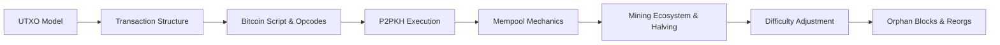
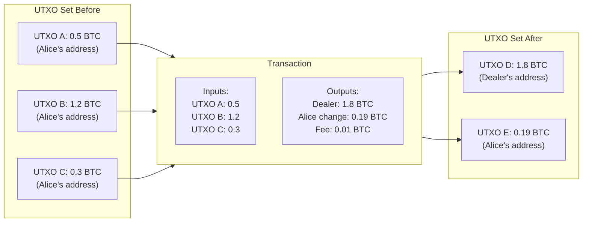
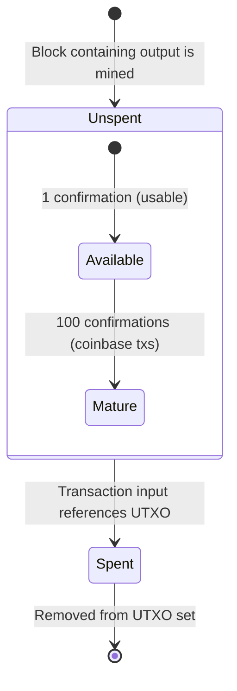
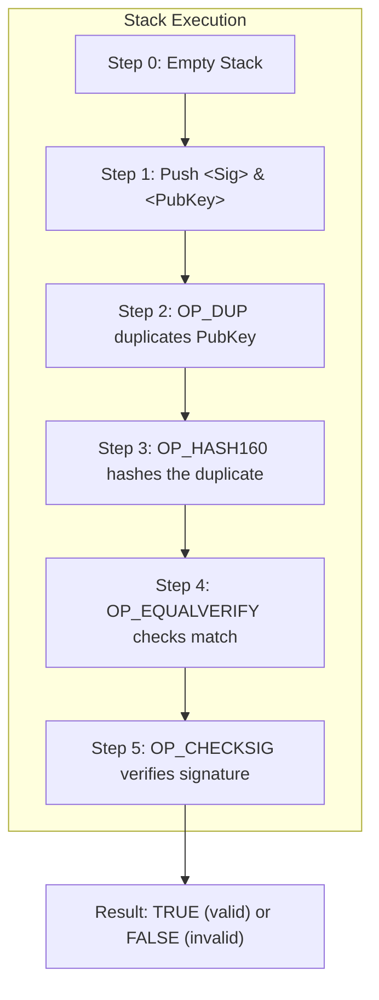
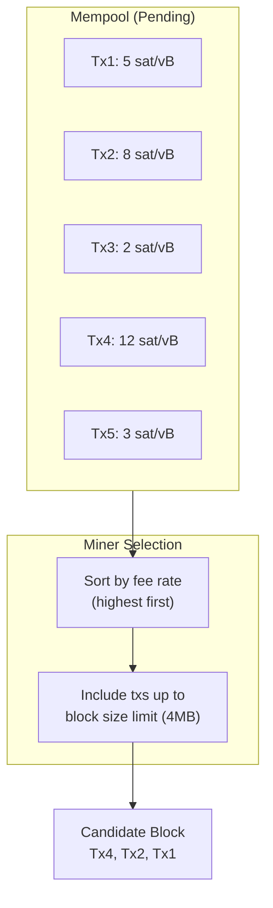
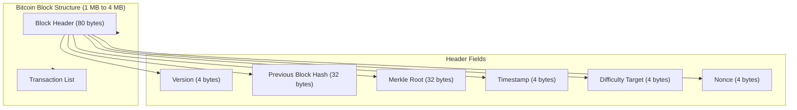
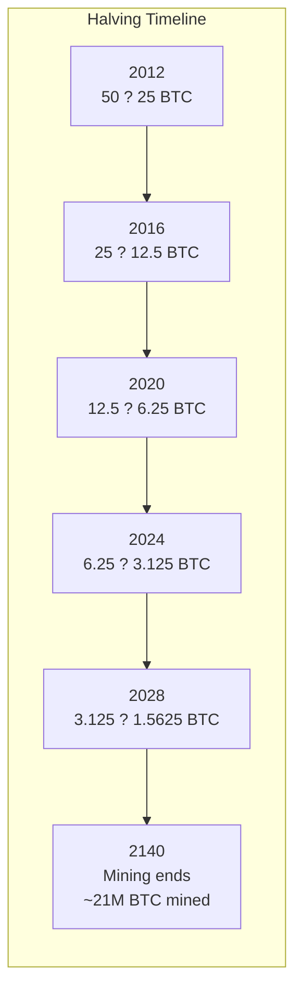
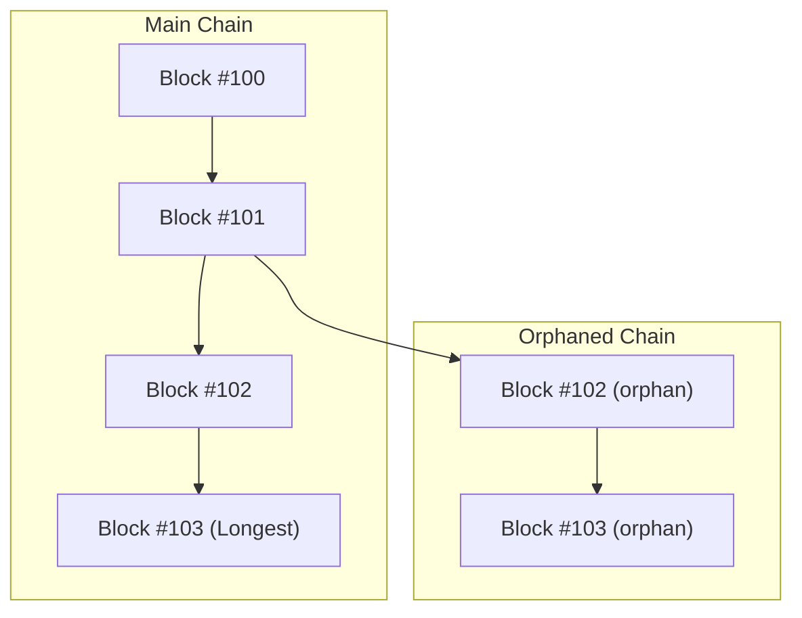

# Chapter 4: The Bitcoin Network

> **Previous:** [Chapter 3: Consensus Mechanisms](./03-consensus.md) | **Next:** [Chapter 5: Ethereum and Smart Contracts](./05-ethereum.md)

---

## Learning Objectives

- Describe the architecture of the Bitcoin network and the role of different node types
- Understand the UTXO (Unspent Transaction Output) model vs. Account model
- Explain the full lifecycle of a Bitcoin transaction from broadcast to confirmation
- Analyze the Bitcoin scripting language (Script) and its opcodes
- Understand the mining process, difficulty adjustment, and halving mechanism
- Describe mempool mechanics and transaction fee estimation
- Identify orphan blocks and their role in blockchain reorganization

## Chapter at a Glance

| Topic | Key Insight | Practical Takeaway |
|-------|-------------|--------------------|
| UTXO Model | No balances — only unspent transaction outputs | Your "balance" is the sum of UTXOs you can unlock |
| Transaction Structure | Inputs (reference UTXOs) + Outputs (new UTXOs) | Every transaction consumes and creates UTXOs |
| Bitcoin Script | Stack-based, non-Turing complete language | Intentionally limited to prevent DoS attacks |
| Mining | Hash power secures the network + new coin issuance | Halving every 4 years enforces 21M supply cap |
| P2PKH | Standard Pay-to-Public-Key-Hash script | The most common Bitcoin transaction type |
| Mempool | Pending transaction pool | Miners select highest fee txs from mempool |
| Difficulty | Target threshold for PoW mining | Adjusts every 2016 blocks for 10-min average |
| Coinbase Transaction | First transaction in block (miner reward) | Creates new BTC from nothing |

## Chapter Roadmap



---

## Theory

### The UTXO Model

<a href="../../../assets/images/diagrams/blockchain/04-bitcoin/the-utxo-model-handwritten.svg" target="_blank" rel="noopener">
  
</a>
<a href="../../../assets/images/diagrams/blockchain/04-bitcoin/the-utxo-model-diagram.svg" target="_blank" rel="noopener">
  
</a>
<a href="../../../assets/images/diagrams/blockchain/04-bitcoin/the-utxo-model-sticky.svg" target="_blank" rel="noopener">
  
</a>


<a href="../../../assets/images/diagrams/blockchain/04-bitcoin/the-utxo-model-handwritten.svg" target="_blank" rel="noopener">
  
</a>
<a href="../../../assets/images/diagrams/blockchain/04-bitcoin/the-utxo-model-diagram.svg" target="_blank" rel="noopener">
  
</a>
<a href="../../../assets/images/diagrams/blockchain/04-bitcoin/the-utxo-model-sticky.svg" target="_blank" rel="noopener">
  
</a>


<a href="../../../assets/images/diagrams/blockchain/04-bitcoin/the-utxo-model-handwritten.svg" target="_blank" rel="noopener">
  
</a>
<a href="../../../assets/images/diagrams/blockchain/04-bitcoin/the-utxo-model-diagram.svg" target="_blank" rel="noopener">
  
</a>
<a href="../../../assets/images/diagrams/blockchain/04-bitcoin/the-utxo-model-sticky.svg" target="_blank" rel="noopener">
  
</a>


Bitcoin does not use "accounts" or "balances" in the way a bank does. Instead, it tracks **UTXOs (Unspent Transaction Outputs)**.



- Every transaction consumes one or more existing UTXOs as **Inputs**. These UTXOs are marked as spent and removed from the UTXO set.
- Every transaction creates one or more new UTXOs as **Outputs**. These are added to the UTXO set.
- Your "balance" is simply the sum of all UTXOs associated with your addresses.
- The **UTXO set** is the canonical state of the Bitcoin ledger — every full node maintains it.

### UTXO Lifecycle

<a href="../../../assets/images/diagrams/blockchain/04-bitcoin/utxo-lifecycle-handwritten.svg" target="_blank" rel="noopener">
  
</a>
<a href="../../../assets/images/diagrams/blockchain/04-bitcoin/utxo-lifecycle-diagram.svg" target="_blank" rel="noopener">
  
</a>
<a href="../../../assets/images/diagrams/blockchain/04-bitcoin/utxo-lifecycle-sticky.svg" target="_blank" rel="noopener">
  
</a>


<a href="../../../assets/images/diagrams/blockchain/04-bitcoin/utxo-lifecycle-handwritten.svg" target="_blank" rel="noopener">
  
</a>
<a href="../../../assets/images/diagrams/blockchain/04-bitcoin/utxo-lifecycle-diagram.svg" target="_blank" rel="noopener">
  
</a>
<a href="../../../assets/images/diagrams/blockchain/04-bitcoin/utxo-lifecycle-sticky.svg" target="_blank" rel="noopener">
  
</a>


<a href="../../../assets/images/diagrams/blockchain/04-bitcoin/utxo-lifecycle-handwritten.svg" target="_blank" rel="noopener">
  
</a>
<a href="../../../assets/images/diagrams/blockchain/04-bitcoin/utxo-lifecycle-diagram.svg" target="_blank" rel="noopener">
  
</a>
<a href="../../../assets/images/diagrams/blockchain/04-bitcoin/utxo-lifecycle-sticky.svg" target="_blank" rel="noopener">
  
</a>




**Key UTXO properties:**
- **Immutability:** Once created, a UTXO's value and locking script never change.
- **Atomicity:** UTXOs must be spent entirely (you can't spend "half" a UTXO).
- **Coinbase maturity:** Coinbase transaction outputs cannot be spent for 100 blocks.

### Transaction Structure

<a href="../../../assets/images/diagrams/blockchain/04-bitcoin/transaction-structure-handwritten.svg" target="_blank" rel="noopener">
  
</a>
<a href="../../../assets/images/diagrams/blockchain/04-bitcoin/transaction-structure-diagram.svg" target="_blank" rel="noopener">
  
</a>
<a href="../../../assets/images/diagrams/blockchain/04-bitcoin/transaction-structure-sticky.svg" target="_blank" rel="noopener">
  
</a>


<a href="../../../assets/images/diagrams/blockchain/04-bitcoin/transaction-structure-handwritten.svg" target="_blank" rel="noopener">
  
</a>
<a href="../../../assets/images/diagrams/blockchain/04-bitcoin/transaction-structure-diagram.svg" target="_blank" rel="noopener">
  
</a>
<a href="../../../assets/images/diagrams/blockchain/04-bitcoin/transaction-structure-sticky.svg" target="_blank" rel="noopener">
  
</a>


<a href="../../../assets/images/diagrams/blockchain/04-bitcoin/transaction-structure-handwritten.svg" target="_blank" rel="noopener">
  
</a>
<a href="../../../assets/images/diagrams/blockchain/04-bitcoin/transaction-structure-diagram.svg" target="_blank" rel="noopener">
  
</a>
<a href="../../../assets/images/diagrams/blockchain/04-bitcoin/transaction-structure-sticky.svg" target="_blank" rel="noopener">
  
</a>


A Bitcoin transaction consists of:

```typescript
interface BitcoinTransaction {
    version: number;
    inputs: TxInput[];
    outputs: TxOutput[];
    locktime: number;
}

interface TxInput {
    previousTxHash: string;     // Reference to previous transaction
    previousOutputIndex: number; // Which output in that tx
    scriptSig: Script;          // Unlocking script (signature + pubkey)
    sequence: number;           // For timelocks and replace-by-fee
}

interface TxOutput {
    value: number;              // Value in satoshis (1 BTC = 100M satoshis)
    scriptPubKey: Script;       // Locking script (conditions to spend)
}

// Version types
const TX_VERSION_1 = 1;  // Original
const TX_VERSION_2 = 2;  // BIP-68 relative timelocks
```

**Transaction size matters for fees:**
- Each input: ~150 bytes
- Each output: ~34 bytes
- Overhead: ~10 bytes

### Bitcoin Script

<a href="../../../assets/images/diagrams/blockchain/04-bitcoin/bitcoin-script-handwritten.svg" target="_blank" rel="noopener">
  
</a>
<a href="../../../assets/images/diagrams/blockchain/04-bitcoin/bitcoin-script-diagram.svg" target="_blank" rel="noopener">
  
</a>
<a href="../../../assets/images/diagrams/blockchain/04-bitcoin/bitcoin-script-sticky.svg" target="_blank" rel="noopener">
  
</a>


<a href="../../../assets/images/diagrams/blockchain/04-bitcoin/bitcoin-script-handwritten.svg" target="_blank" rel="noopener">
  
</a>
<a href="../../../assets/images/diagrams/blockchain/04-bitcoin/bitcoin-script-diagram.svg" target="_blank" rel="noopener">
  
</a>
<a href="../../../assets/images/diagrams/blockchain/04-bitcoin/bitcoin-script-sticky.svg" target="_blank" rel="noopener">
  
</a>


<a href="../../../assets/images/diagrams/blockchain/04-bitcoin/bitcoin-script-handwritten.svg" target="_blank" rel="noopener">
  
</a>
<a href="../../../assets/images/diagrams/blockchain/04-bitcoin/bitcoin-script-diagram.svg" target="_blank" rel="noopener">
  
</a>
<a href="../../../assets/images/diagrams/blockchain/04-bitcoin/bitcoin-script-sticky.svg" target="_blank" rel="noopener">
  
</a>


Bitcoin uses a stack-based, **non-Turing complete** language called **Script**. It is intentionally limited to prevent infinite loops (denial of service). There are no loops, no recursion, and no complex control flow.

**Key properties:**
- **Stack-based:** All operations push/pop from a single stack.
- **Non-Turing complete:** No loops or goto statements.
- **Deterministic:** Same script always produces the same result.
- **Stateless:** No persistent memory between executions.

**Common Opcodes:**

| Opcode | Code | Description |
|--------|------|-------------|
| OP_DUP | 0x76 | Duplicates top stack item |
| OP_HASH160 | 0xA9 | Hash with SHA-256 then RIPEMD-160 |
| OP_EQUAL | 0x87 | Returns 1 if equal, 0 otherwise |
| OP_EQUALVERIFY | 0x88 | Like EQUAL but fails if not equal |
| OP_CHECKSIG | 0xAC | Verify ECDSA signature (1 sig) |
| OP_CHECKMULTISIG | 0xAE | Verify M-of-N multisig signatures |
| OP_RETURN | 0x6A | Mark output as provably unspendable |
| OP_IF | 0x63 | Conditional execution |
| OP_ELSE | 0x67 | Alternative branch |
| OP_ENDIF | 0x68 | End conditional |
| OP_SHA256 | 0xAA | SHA-256 hash |
| OP_SIZE | 0x82 | Push size of top item onto stack |

### P2PKH Script Execution

<a href="../../../assets/images/diagrams/blockchain/04-bitcoin/p2pkh-script-execution-handwritten.svg" target="_blank" rel="noopener">
  
</a>
<a href="../../../assets/images/diagrams/blockchain/04-bitcoin/p2pkh-script-execution-diagram.svg" target="_blank" rel="noopener">
  
</a>
<a href="../../../assets/images/diagrams/blockchain/04-bitcoin/p2pkh-script-execution-sticky.svg" target="_blank" rel="noopener">
  
</a>


<a href="../../../assets/images/diagrams/blockchain/04-bitcoin/p2pkh-script-execution-handwritten.svg" target="_blank" rel="noopener">
  
</a>
<a href="../../../assets/images/diagrams/blockchain/04-bitcoin/p2pkh-script-execution-diagram.svg" target="_blank" rel="noopener">
  
</a>
<a href="../../../assets/images/diagrams/blockchain/04-bitcoin/p2pkh-script-execution-sticky.svg" target="_blank" rel="noopener">
  
</a>


<a href="../../../assets/images/diagrams/blockchain/04-bitcoin/p2pkh-script-execution-handwritten.svg" target="_blank" rel="noopener">
  
</a>
<a href="../../../assets/images/diagrams/blockchain/04-bitcoin/p2pkh-script-execution-diagram.svg" target="_blank" rel="noopener">
  
</a>
<a href="../../../assets/images/diagrams/blockchain/04-bitcoin/p2pkh-script-execution-sticky.svg" target="_blank" rel="noopener">
  
</a>


The most common Bitcoin transaction type is **Pay-to-Public-Key-Hash (P2PKH)**.

**Locking Script (scriptPubKey):**
`OP_DUP OP_HASH160 <PubKHash> OP_EQUALVERIFY OP_CHECKSIG`

**Unlocking Script (scriptSig):**
`<Signature> <PublicKey>`



**Step-by-step execution:**
1. `<Signature>` and `<PublicKey>` are pushed to the stack.
2. `OP_DUP` duplicates `<PublicKey>` (now two copies on stack).
3. `OP_HASH160` SHA-256 + RIPEMD-160 hashes the duplicate.
4. `OP_EQUALVERIFY` checks if the hash matches `<PubKHash>`. If not equal, transaction fails.
5. `OP_CHECKSIG` verifies `<Signature>` is valid for the transaction data using `<PublicKey>`.

### Mempool Mechanics

<a href="../../../assets/images/diagrams/blockchain/04-bitcoin/mempool-mechanics-handwritten.svg" target="_blank" rel="noopener">
  
</a>
<a href="../../../assets/images/diagrams/blockchain/04-bitcoin/mempool-mechanics-diagram.svg" target="_blank" rel="noopener">
  
</a>
<a href="../../../assets/images/diagrams/blockchain/04-bitcoin/mempool-mechanics-sticky.svg" target="_blank" rel="noopener">
  
</a>


<a href="../../../assets/images/diagrams/blockchain/04-bitcoin/mempool-mechanics-handwritten.svg" target="_blank" rel="noopener">
  
</a>
<a href="../../../assets/images/diagrams/blockchain/04-bitcoin/mempool-mechanics-diagram.svg" target="_blank" rel="noopener">
  
</a>
<a href="../../../assets/images/diagrams/blockchain/04-bitcoin/mempool-mechanics-sticky.svg" target="_blank" rel="noopener">
  
</a>


<a href="../../../assets/images/diagrams/blockchain/04-bitcoin/mempool-mechanics-handwritten.svg" target="_blank" rel="noopener">
  
</a>
<a href="../../../assets/images/diagrams/blockchain/04-bitcoin/mempool-mechanics-diagram.svg" target="_blank" rel="noopener">
  
</a>
<a href="../../../assets/images/diagrams/blockchain/04-bitcoin/mempool-mechanics-sticky.svg" target="_blank" rel="noopener">
  
</a>


The **mempool** (memory pool) is where pending transactions wait to be included in a block:



- **Transaction broadcasting:** Txs flow through the P2P network via INV (inventory) messages.
- **Relay policies:** Nodes check each tx before relaying (validity, fees, size).
- **Replacement (RBF):** Opt-in Replace-by-Fee allows replacing an unconfirmed tx with a higher fee version.
- **Mempool limits:** Default ~300 MB on Bitcoin Core nodes.

### Mining and Block Structure

<a href="../../../assets/images/diagrams/blockchain/04-bitcoin/mining-and-block-structure-handwritten.svg" target="_blank" rel="noopener">
  
</a>
<a href="../../../assets/images/diagrams/blockchain/04-bitcoin/mining-and-block-structure-diagram.svg" target="_blank" rel="noopener">
  
</a>
<a href="../../../assets/images/diagrams/blockchain/04-bitcoin/mining-and-block-structure-sticky.svg" target="_blank" rel="noopener">
  
</a>


<a href="../../../assets/images/diagrams/blockchain/04-bitcoin/mining-and-block-structure-handwritten.svg" target="_blank" rel="noopener">
  
</a>
<a href="../../../assets/images/diagrams/blockchain/04-bitcoin/mining-and-block-structure-diagram.svg" target="_blank" rel="noopener">
  
</a>
<a href="../../../assets/images/diagrams/blockchain/04-bitcoin/mining-and-block-structure-sticky.svg" target="_blank" rel="noopener">
  
</a>


<a href="../../../assets/images/diagrams/blockchain/04-bitcoin/mining-and-block-structure-handwritten.svg" target="_blank" rel="noopener">
  
</a>
<a href="../../../assets/images/diagrams/blockchain/04-bitcoin/mining-and-block-structure-diagram.svg" target="_blank" rel="noopener">
  
</a>
<a href="../../../assets/images/diagrams/blockchain/04-bitcoin/mining-and-block-structure-sticky.svg" target="_blank" rel="noopener">
  
</a>




**Coinbase Transaction:** The first transaction in every block. It has no inputs and creates new BTC.
- Contains the miner's output address (where the reward goes).
- Block reward = subsidy + transaction fees.
- Can include arbitrary data (up to 100 bytes) in the coinbase input script.

### Mining Hardware Evolution

<a href="../../../assets/images/diagrams/blockchain/04-bitcoin/mining-hardware-evolution-handwritten.svg" target="_blank" rel="noopener">
  
</a>
<a href="../../../assets/images/diagrams/blockchain/04-bitcoin/mining-hardware-evolution-diagram.svg" target="_blank" rel="noopener">
  
</a>
<a href="../../../assets/images/diagrams/blockchain/04-bitcoin/mining-hardware-evolution-sticky.svg" target="_blank" rel="noopener">
  
</a>


<a href="../../../assets/images/diagrams/blockchain/04-bitcoin/mining-hardware-evolution-handwritten.svg" target="_blank" rel="noopener">
  
</a>
<a href="../../../assets/images/diagrams/blockchain/04-bitcoin/mining-hardware-evolution-diagram.svg" target="_blank" rel="noopener">
  
</a>
<a href="../../../assets/images/diagrams/blockchain/04-bitcoin/mining-hardware-evolution-sticky.svg" target="_blank" rel="noopener">
  
</a>


<a href="../../../assets/images/diagrams/blockchain/04-bitcoin/mining-hardware-evolution-handwritten.svg" target="_blank" rel="noopener">
  
</a>
<a href="../../../assets/images/diagrams/blockchain/04-bitcoin/mining-hardware-evolution-diagram.svg" target="_blank" rel="noopener">
  
</a>
<a href="../../../assets/images/diagrams/blockchain/04-bitcoin/mining-hardware-evolution-sticky.svg" target="_blank" rel="noopener">
  
</a>


| Era | Year | Hardware | Hash Rate | Power | When |
|-----|------|----------|-----------|-------|------|
| CPU Mining | 2009 | Standard CPUs | ~10 MH/s | ~100W | Early days |
| GPU Mining | 2010 | AMD/NVIDIA GPUs | ~400 MH/s | ~200W | First year |
| FPGA Mining | 2011 | Xilinx/Altera FPGAs | ~1 GH/s | ~60W | Short transition |
| ASIC Early | 2013 | Bitfury, KnC Miner | ~100 GH/s | ~500W | First ASICs |
| ASIC Modern | 2023+ | Antminer S21 | ~200 TH/s | ~3500W | Current gen |

### Halving Schedule

<a href="../../../assets/images/diagrams/blockchain/04-bitcoin/halving-schedule-handwritten.svg" target="_blank" rel="noopener">
  
</a>
<a href="../../../assets/images/diagrams/blockchain/04-bitcoin/halving-schedule-diagram.svg" target="_blank" rel="noopener">
  
</a>
<a href="../../../assets/images/diagrams/blockchain/04-bitcoin/halving-schedule-sticky.svg" target="_blank" rel="noopener">
  
</a>


<a href="../../../assets/images/diagrams/blockchain/04-bitcoin/halving-schedule-handwritten.svg" target="_blank" rel="noopener">
  
</a>
<a href="../../../assets/images/diagrams/blockchain/04-bitcoin/halving-schedule-diagram.svg" target="_blank" rel="noopener">
  
</a>
<a href="../../../assets/images/diagrams/blockchain/04-bitcoin/halving-schedule-sticky.svg" target="_blank" rel="noopener">
  
</a>


<a href="../../../assets/images/diagrams/blockchain/04-bitcoin/halving-schedule-handwritten.svg" target="_blank" rel="noopener">
  
</a>
<a href="../../../assets/images/diagrams/blockchain/04-bitcoin/halving-schedule-diagram.svg" target="_blank" rel="noopener">
  
</a>
<a href="../../../assets/images/diagrams/blockchain/04-bitcoin/halving-schedule-sticky.svg" target="_blank" rel="noopener">
  
</a>


```typescript
function calculateBlockReward(height: number): number {
    // Initial reward: 50 BTC
    // Halves every 210,000 blocks (~4 years)
    const halvings = Math.floor(height / 210000);
    if (halvings >= 64) return 0; // Reward reaches zero
    
    // Shift right: 50 >> halvings (in integer BTC terms)
    return 50 / Math.pow(2, halvings);
}

// Reward schedule
const schedule = [
    { height: 0,     reward: 50 },    // 2009-2012
    { height: 210000, reward: 25 },   // 2012-2016
    { height: 420000, reward: 12.5 }, // 2016-2020
    { height: 630000, reward: 6.25 }, // 2020-2024
    { height: 840000, reward: 3.125 }, // 2024-2028
];

// Total supply cap (asymptotic 21M)
const totalSupply = 210000 * (50 + 25 + 12.5 + 6.25 + 3.125 + 1.5625 + ...);
```



### Difficulty Adjustment Algorithm

<a href="../../../assets/images/diagrams/blockchain/04-bitcoin/difficulty-adjustment-algorithm-handwritten.svg" target="_blank" rel="noopener">
  
</a>
<a href="../../../assets/images/diagrams/blockchain/04-bitcoin/difficulty-adjustment-algorithm-diagram.svg" target="_blank" rel="noopener">
  
</a>
<a href="../../../assets/images/diagrams/blockchain/04-bitcoin/difficulty-adjustment-algorithm-sticky.svg" target="_blank" rel="noopener">
  
</a>


<a href="../../../assets/images/diagrams/blockchain/04-bitcoin/difficulty-adjustment-algorithm-handwritten.svg" target="_blank" rel="noopener">
  
</a>
<a href="../../../assets/images/diagrams/blockchain/04-bitcoin/difficulty-adjustment-algorithm-diagram.svg" target="_blank" rel="noopener">
  
</a>
<a href="../../../assets/images/diagrams/blockchain/04-bitcoin/difficulty-adjustment-algorithm-sticky.svg" target="_blank" rel="noopener">
  
</a>


<a href="../../../assets/images/diagrams/blockchain/04-bitcoin/difficulty-adjustment-algorithm-handwritten.svg" target="_blank" rel="noopener">
  
</a>
<a href="../../../assets/images/diagrams/blockchain/04-bitcoin/difficulty-adjustment-algorithm-diagram.svg" target="_blank" rel="noopener">
  
</a>
<a href="../../../assets/images/diagrams/blockchain/04-bitcoin/difficulty-adjustment-algorithm-sticky.svg" target="_blank" rel="noopener">
  
</a>


Bitcoin recalculates difficulty every 2016 blocks:

```typescript
function calculateDifficulty(
    currentTarget: bigint,
    previousTarget: bigint,
    actualTimespanSeconds: number
): bigint {
    const expectedTimespan = 2016 * 600; // 2 weeks in seconds
    // Clamp adjustment range (cannot change more than 4x)
    const adjustedTimespan = Math.min(
        Math.max(actualTimespanSeconds, expectedTimespan / 4),
        expectedTimespan * 4,
    );
    // New target = previous * (actual / expected)
    const ratio = adjustedTimespan / expectedTimespan;
    return BigInt(Math.floor(Number(previousTarget) * ratio));
}
```

### Orphan Blocks and Reorgs

<a href="../../../assets/images/diagrams/blockchain/04-bitcoin/orphan-blocks-and-reorgs-handwritten.svg" target="_blank" rel="noopener">
  
</a>
<a href="../../../assets/images/diagrams/blockchain/04-bitcoin/orphan-blocks-and-reorgs-diagram.svg" target="_blank" rel="noopener">
  
</a>
<a href="../../../assets/images/diagrams/blockchain/04-bitcoin/orphan-blocks-and-reorgs-sticky.svg" target="_blank" rel="noopener">
  
</a>


<a href="../../../assets/images/diagrams/blockchain/04-bitcoin/orphan-blocks-and-reorgs-handwritten.svg" target="_blank" rel="noopener">
  
</a>
<a href="../../../assets/images/diagrams/blockchain/04-bitcoin/orphan-blocks-and-reorgs-diagram.svg" target="_blank" rel="noopener">
  
</a>
<a href="../../../assets/images/diagrams/blockchain/04-bitcoin/orphan-blocks-and-reorgs-sticky.svg" target="_blank" rel="noopener">
  
</a>


<a href="../../../assets/images/diagrams/blockchain/04-bitcoin/orphan-blocks-and-reorgs-handwritten.svg" target="_blank" rel="noopener">
  
</a>
<a href="../../../assets/images/diagrams/blockchain/04-bitcoin/orphan-blocks-and-reorgs-diagram.svg" target="_blank" rel="noopener">
  
</a>
<a href="../../../assets/images/diagrams/blockchain/04-bitcoin/orphan-blocks-and-reorgs-sticky.svg" target="_blank" rel="noopener">
  
</a>


**Orphan blocks:** Valid blocks that are not part of the main chain because another block was found first.



- **Reorg (Reorganization):** When a longer chain appears and replaces the current best chain.
- **Depth matters:** A reorg of 1-3 blocks can happen naturally; 6+ blocks is extremely rare.
- **Double-spend risk:** A 51% attacker can perform a reorg of any depth.

---

## Examples

### Example 1: UTXO Consolidation

Alice has three UTXOs:
- UTXO A: 0.5 BTC
- UTXO B: 1.2 BTC
- UTXO C: 0.3 BTC

Alice wants to buy a motorcycle for 1.8 BTC.

- **Input:** Alice provides A, B, and C (Total 2.0 BTC).
- **Output 1:** 1.8 BTC to the Dealer.
- **Output 2 (Change):** 0.19 BTC back to Alice.
- **Fee:** 0.01 BTC remains unallocated; it is collected by the miner.

```typescript
interface UTXO {
    txid: string;
    vout: number;
    satoshis: number;
    scriptPubKey: string;
    address: string;
}

function createTransaction(
    utxos: UTXO[],
    targetAddress: string,
    targetAmount: number,  // in satoshis
    changeAddress: string,
    feeRate: number,       // satoshis per byte
): BitcoinTransaction {
    const totalInput = utxos.reduce((sum, u) => sum + u.satoshis, 0);
    
    // Estimate transaction size (~150 bytes per input + ~34 per output + 10 overhead)
    const estimatedSize = utxos.length * 148 + 2 * 34 + 10;
    const fee = estimatedSize * feeRate;
    
    const outputs: TxOutput[] = [
        { value: targetAmount, scriptPubKey: createP2PKH(targetAddress) },
        {
            value: totalInput - targetAmount - fee,
            scriptPubKey: createP2PKH(changeAddress),
        },
    ];
    
    return {
        version: 1,
        inputs: utxos.map(u => ({
            previousTxHash: u.txid,
            previousOutputIndex: u.vout,
            scriptSig: createScriptSig(),
            sequence: 0xFFFFFFFF,  // Disable timelock
        })),
        outputs,
        locktime: 0,
    };
}
```

### Example 2: P2PKH Script Execution

Locking Script (`scriptPubKey`): `OP_DUP OP_HASH160 <PubKHash> OP_EQUALVERIFY OP_CHECKSIG`
Unlocking Script (`scriptSig`): `<Signature> <PublicKey>`

```text
Stack Execution Trace:

1. scriptSig pushed: <Signature>
   Stack: [Signature]

2. scriptSig pushed: <PublicKey>
   Stack: [Signature, PublicKey]

3. OP_DUP duplicates top item
   Stack: [Signature, PublicKey, PublicKey]

4. OP_HASH160 hashes the duplicate
   Stack: [Signature, PublicKey, PubKHash]

5. OP_EQUALVERIFY: pop top two, verify they're equal
   Stack: [Signature, PublicKey]

6. OP_CHECKSIG: verify Signature against PublicKey
   Stack: [true]     ? or [false] if invalid
```

### Example 3: Transaction Fee Calculation

```typescript
function calculateFee(
    txSizeBytes: number,
    feeRateSatPerByte: number
): number {
    return txSizeBytes * feeRateSatPerByte;
}

// Example: Consolidating 5 small UTXOs into 1
const txSize = 5 * 148 + 34 + 10;  // ~784 bytes
const feeRate = 10;  // 10 sat/vB (moderate priority)
const fee = calculateFee(txSize, feeRate);
console.log(`Fee: ${fee} satoshis (${fee / 1e8} BTC)`);  // 7840 satoshis

// vs: Spending 1 large UTXO
const simpleTxSize = 148 + 34 + 10;  // ~192 bytes
const simpleFee = calculateFee(simpleTxSize, feeRate);
console.log(`Simple Fee: ${simpleFee} satoshis (${simpleFee / 1e8} BTC)`);  // 1920 satoshis
```

### Example 4: Mining and the Coinbase Transaction

A coinbase transaction is the first transaction in a block, with:
- **No inputs** (creates new coins from nothing)
- **Outputs** equal to the block reward (subsidy + fees)
- Can include a message (e.g., "The Times 03/Jan/2009 Chancellor on brink of second bailout for banks")

```typescript
interface CoinbaseTransaction {
    version: number;
    coinbaseInput: {
        txid: "0000...0000";  // All zeros (no previous tx)
        vout: 0xFFFFFFFF;      // Special output index
        scriptSig: CoinbaseScript;  // Arbitrary data + height
    };
    outputs: TxOutput[];
    locktime: number;
}

interface CoinbaseScript {
    blockHeight: number;  // BIP-34: Must include block height
    extraNonce: number;   // Extra randomness for mining
    message?: string;     // Optional data (100 byte limit)
}
```

> **One-Sentence Takeaway:** Bitcoin's UTXO model treats every transaction as a set of consumed and created outputs, making it possible to parallelize validation but requiring users to manage multiple UTXOs as their "balance."

> **Pro Tip:** Bitcoin transaction fees increase with transaction size (in bytes), not transaction value. To save on fees, consolidate many small UTXOs into one larger UTXO during low-fee periods.

> **Warning:** If you lose your private keys, your Bitcoin is gone forever. There is no "forgot password" or customer support — Bitcoin's security model means you are solely responsible for key custody. Use hierarchical deterministic (HD) wallets with BIP39 seed phrases backed up offline.

---

## Concept Comparison Table

| Concept | Definition | Key Distinction | Use Case |
|---------|-----------|-----------------|----------|
| UTXO Model | Tracks unspent transaction outputs | No account balances, parallelizable | Bitcoin, Litecoin |
| Account Model | Tracks account balances directly | Simpler, sequential nonces | Ethereum, most smart contract chains |
| Bitcoin Script | Stack-based scripting language | Non-Turing complete (intentionally) | Basic conditions, multisig |
| Coinbase Transaction | First transaction in a block (miner reward) | Creates new BTC from nothing | Miner compensation |
| P2PKH | Standard payment script | Hash of public key, not the key itself | Most Bitcoin transactions |
| Mempool | Pool of unconfirmed transactions | Miners select from here | Pending tx storage |
| Orphan Block | Valid block not in main chain | Can be built upon if chain grows longest | Temporary forks |
| Replace-by-Fee | Replace unconfirmed tx with higher fee tx | Solves stuck transaction problem | Fee bumping |

## Quick Reference

| Category | Key Concepts | Notes |
|----------|-------------|-------|
| **UTXO Terms** | Inputs, Outputs, Change, Fee | Change goes back to you |
| **Script Ops** | OP_DUP, OP_HASH160, OP_EQUALVERIFY, OP_CHECKSIG | P2PKH uses these 4 in sequence |
| **Mining** | Hash rate, Difficulty, Block reward, Halving | Reward halves every 210K blocks |
| **Supply** | 21M total, ~19.5M mined (2026) | Last Bitcoin mined ~2140 |
| **Transaction** | Version, Inputs, Outputs, Locktime | Locktime enables time-locked transactions |
| **Fee Estimation** | Fee = size × fee_rate | Input size ~148B, output ~34B |
| **Difficulty** | Target threshold for PoW | Adjusts every 2016 blocks |
| **Mempool** | ~300 MB default limit | Transactions with fees below ~1 sat/vB may be evicted |

## Cross-Application Matrix

| Technique | DeFi | Smart Contracts | Enterprise Blockchain | Research |
|-----------|------|-----------------|----------------------|----------|
| UTXO Model | Atomic swaps | Not typical | Hyperledger Fabric uses similar | UTXO vs account scalability |
| Bitcoin Script | Multisig vaults | Simple conditions | Time-locked escrow | Script extension proposals |
| P2PKH | Standard payments | Address derivation | Identity wallets | Taproot/Schnorr |
| Halving Schedule | Supply prediction | Tokenomics design | N/A | Scarcity models |
| Mining | Hash rate markets | PoW security analysis | Not enterprise-relevant | Energy consumption studies |
| Mempool | MEV opportunities | N/A | N/A | Fee market dynamics |
| Coinbase | N/A | N/A | N/A | Monetary policy research |

## Chapter Quiz

1. What happens to Bitcoin transaction fees when there are many small UTXOs being consumed?
   - A) The fee decreases
   - B) The fee increases because the transaction is larger (more inputs)
   - C) The fee stays the same regardless of UTXO count
   - D) The fee is a percentage of the transaction value

<details>
<summary>Answer&lt;/summary&gt;
**B) The fee increases because the transaction is larger (more inputs).** Bitcoin fees are based on transaction size in bytes. Each additional UTXO input adds ~150 bytes, so consolidating UTXOs during low-fee periods saves money.
</details>

2. What prevents Bitcoin Script from being used for infinite loops?
   - A) It has no looping constructs — it's intentionally non-Turing complete
   - B) It has a maximum gas limit
   - C) It times out after 10 minutes
   - D) It requires user confirmation for each operation

<details>
<summary>Answer&lt;/summary&gt;
**A) It has no looping constructs — it's intentionally non-Turing complete.** Satoshi deliberately omitted loops and jumps to prevent denial-of-service attacks where scripts could run indefinitely.
</details>

3. Why does Bitcoin's block reward halve approximately every 4 years?
   - A) To fix a bug in the original code
   - B) To enforce the 21 million supply cap through disinflation
   - C) To make mining more profitable
   - D) To reduce transaction fees

<details>
<summary>Answer&lt;/summary&gt;
**B) To enforce the 21 million supply cap through disinflation.** The halving reduces new supply by 50% every 210,000 blocks (~4 years), asymptotically approaching the 21 million limit. This programmed scarcity is central to Bitcoin's value proposition.
</details>

4. What is the minimum number of confirmations required before a coinbase transaction's output can be spent?
   - A) 1 (immediately)
   - B) 6
   - C) 100
   - D) 1000

<details>
<summary>Answer&lt;/summary&gt;
**C) 100.** Coinbase transaction outputs cannot be spent until they have 100 confirmations. This prevents miners from spending freshly mined coins before the block is deeply embedded in the chain.
</details>

5. How does Replace-by-Fee (RBF) help Bitcoin users?
   - A) It reduces transaction fees
   - B) It allows replacing a stuck transaction with a higher-fee version
   - C) It merges two transactions into one
   - D) It cancels transactions automatically

<details>
<summary>Answer&lt;/summary&gt;
**B) It allows replacing a stuck transaction with a higher-fee version.** RBF allows a user to broadcast a new transaction that spends the same inputs with a higher fee, replacing the original unconfirmed transaction and potentially getting it confirmed faster.
</details>

### TypeScript: Bitcoin Script Interpreter

```typescript
class ScriptInterpreter {
  stack: (number | string)[] = [];
  altStack: (number | string)[] = [];
  opcodes: Map<number, () => void> = new Map();

  constructor() {
    this.opcodes.set(0x76, () => this.stack.push(this.stack[this.stack.length - 1]));
    this.opcodes.set(0x87, () => { const a = this.stack.pop(); const b = this.stack.pop(); this.stack.push(a === b ? 1 : 0); });
    this.opcodes.set(0x88, () => { const a = this.stack.pop(); const b = this.stack.pop(); if (a !== b) throw new Error("EQUALVERIFY failed"); });
    this.opcodes.set(0xAC, () => { this.stack.push(1); });
    this.opcodes.set(0x6A, () => this.stack.pop());
  }

  execute(bytecode: number[]): boolean {
    for (const op of bytecode) {
      if (op >= 0x01 && op <= 0x4B) {
        const dataLen = op;
        const data = bytecode.slice(bytecode.indexOf(op) + 1, bytecode.indexOf(op) + 1 + dataLen);
        this.stack.push(data.join(","));
        continue;
      }
      const handler = this.opcodes.get(op);
      if (handler) handler();
    }
    return this.stack.pop() === 1 || this.stack.pop() === true;
  }
}
```

### TypeScript: Block Header Parser

```typescript
interface BitcoinBlockHeader {
  version: number;
  previousBlockHash: string;
  merkleRoot: string;
  timestamp: number;
  bits: number;
  nonce: number;
  hash: string;
}

class BlockHeaderParser {
  static parse(raw: Buffer): BitcoinBlockHeader {
    let offset = 0;
    const version = raw.readUInt32LE(offset); offset += 4;
    const previousBlockHash = raw.subarray(offset, offset + 32).reverse().toString("hex"); offset += 32;
    const merkleRoot = raw.subarray(offset, offset + 32).reverse().toString("hex"); offset += 32;
    const timestamp = raw.readUInt32LE(offset); offset += 4;
    const bits = raw.readUInt32LE(offset); offset += 4;
    const nonce = raw.readUInt32LE(offset);
    return { version, previousBlockHash, merkleRoot, timestamp, bits, nonce, hash: "" };
  }

  static difficultyFromBits(bits: number): number {
    const exponent = bits >> 24;
    const mantissa = bits & 0xFFFFFF;
    const target = mantissa * 2 ** (8 * (exponent - 3));
    const maxTarget = 0xFFFF * 2 ** (8 * (256 - 3 - 1));
    return maxTarget / target;
  }
}
```

### TypeScript: Difficulty Adjustment Calculator

```typescript
class DifficultyAdjuster {
  static readonly BLOCK_INTERVAL = 600;
  static readonly RETARGET_INTERVAL = 2016;
  static readonly MAX_ADJUSTMENT = 4;

  static calculateNextTarget(
    previousTarget: bigint,
    actualTimespanSeconds: number
  ): bigint {
    const expected = BigInt(this.RETARGET_INTERVAL) * BigInt(this.BLOCK_INTERVAL);
    let timespan = BigInt(Math.max(1, actualTimespanSeconds));
    const maxTimespan = expected * BigInt(this.MAX_ADJUSTMENT);
    const minTimespan = expected / BigInt(this.MAX_ADJUSTMENT);
    if (timespan > maxTimespan) timespan = maxTimespan;
    if (timespan < minTimespan) timespan = minTimespan;
    return (previousTarget * timespan) / expected;
  }

  static estimateHashRate(
    difficulty: number,
    blockTimeSeconds: number
  ): string {
    const hashesPerBlock = difficulty * 2 ** 32;
    const hashRate = hashesPerBlock / blockTimeSeconds;
    if (hashRate > 1e12) return `${(hashRate / 1e12).toFixed(2)} TH/s`;
    if (hashRate > 1e9) return `${(hashRate / 1e9).toFixed(2)} GH/s`;
    return `${(hashRate / 1e6).toFixed(2)} MH/s`;
  }
}
```

## TypeScript Implementations

```typescript
// === UTXO Set Tracker ===
interface UTXO { txid: string; vout: number; amount: number; scriptPubKey: string; }
class UTXOSet {
    private utxos = new Map<string, UTXO>();
    private key = (txid: string, vout: number) => `${txid}:${vout}`;

    add(txid: string, vout: number, amount: number, script: string): void {
        this.utxos.set(this.key(txid, vout), { txid, vout, amount, scriptPubKey: script });
    }
    spend(txid: string, vout: number): boolean {
        return this.utxos.delete(this.key(txid, vout));
    }
    getBalance(address: string): number {
        let balance = 0;
        for (const utxo of this.utxos.values()) if (utxo.scriptPubKey.includes(address)) balance += utxo.amount;
        return balance;
    }
    total(): number { return this.utxos.size; }
}

// === Transaction Validator ===
class TxValidator {
    validateTx(inputs: { txid: string; vout: number; amount: number }[], outputs: { amount: number; address: string }[]): { valid: boolean; reason: string } {
        if (inputs.length === 0) return { valid: false, reason: 'no inputs' };
        if (outputs.length === 0) return { valid: false, reason: 'no outputs' };
        const totalIn = inputs.reduce((s, i) => s + i.amount, 0);
        const totalOut = outputs.reduce((s, o) => s + o.amount, 0);
        if (totalIn < totalOut) return { valid: false, reason: 'inputs < outputs' };
        return { valid: true, reason: 'valid' };
    }
}

// === Bitcoin Script Interpreter (subset) ===
class ScriptInterpreter {
    private stack: number[] = [];
    private altStack: number[] = [];

    execute(script: string, txData: { prevOutValue: number; scriptPubKey: string }): boolean {
        const ops = script.split(' ');
        let i = 0;
        while (i < ops.length) {
            const op = ops[i];
            switch (op) {
                case 'OP_DUP': this.stack.push(this.stack[this.stack.length - 1]); break;
                case 'OP_HASH160': { const v = this.stack.pop() ?? 0; this.stack.push(this.simpleHash(v)); break; }
                case 'OP_EQUALVERIFY': {
                    const a = this.stack.pop() ?? 0, b = this.stack.pop() ?? 0;
                    if (a !== b) return false;
                    break;
                }
                case 'OP_CHECKSIG': {
                    const pub = this.stack.pop() ?? 0, sig = this.stack.pop() ?? 0;
                    this.stack.push(this.verifySig(sig, pub) ? 1 : 0);
                    break;
                }
                case 'OP_VERIFY': { if ((this.stack.pop() ?? 0) === 0) return false; break; }
                case 'OP_EQUAL': { const a = this.stack.pop() ?? 0, b = this.stack.pop() ?? 0; this.stack.push(a === b ? 1 : 0); break; }
                default: {
                    const n = parseInt(op);
                    if (!isNaN(n) && n >= 0 && n <= 16) this.stack.push(n);
                    break;
                }
            }
            i++;
        }
        return this.stack.pop() === 1;
    }
    private simpleHash(v: number): number { return ((v * 0x9E3779B9) >>> 0) % (1 << 20); }
    private verifySig(sig: number, pub: number): boolean { return (sig ^ pub) % 2 === 1; }
}

// === Block Header Parser ===
function parseBlockHeader(header: string): { version: number; prevBlock: string; merkleRoot: string; timestamp: number; bits: number; nonce: number } {
    return { version: parseInt(header.slice(0, 8), 16), prevBlock: header.slice(8, 72), merkleRoot: header.slice(72, 136), timestamp: parseInt(header.slice(136, 144), 16), bits: parseInt(header.slice(144, 152), 16), nonce: parseInt(header.slice(152, 160), 16) };
}

// === Mining Reward Calculator ===
class MiningReward {
    static readonly HALVING_INTERVAL = 210000;
    static readonly INITIAL_REWARD = 50;

    static rewardAtBlock(height: number): number {
        const halvings = Math.floor(height / this.HALVING_INTERVAL);
        if (halvings >= 64) return 0;
        return this.INITIAL_REWARD / Math.pow(2, halvings);
    }
    static totalSupply(halvings: number): number {
        let total = 0;
        for (let h = 0; h < halvings; h++) total += this.HALVING_INTERVAL * this.rewardAtBlock(h * this.HALVING_INTERVAL);
        return total;
    }
}

// === Demo ===
const utxo = new UTXOSet();
utxo.add('a', 0, 50, 'pubkey:alice');
utxo.add('b', 0, 30, 'pubkey:bob');
console.log(`Alice balance: ${utxo.getBalance('alice')}`);
console.log(`UTXO count: ${utxo.total()}`);

const val = new TxValidator();
console.log(`Tx valid: ${val.validateTx([{ txid: 'a', vout: 0, amount: 50 }], [{ amount: 40, address: 'bob' }, { amount: 10, address: 'alice' }]).valid}`);

const script = new ScriptInterpreter();
const result = script.execute('2 3 OP_EQUAL', { prevOutValue: 100, scriptPubKey: '' });
console.log(`Script 2=3: ${result}`);

const header = parseBlockHeader('01000000' + 'a'.repeat(64) + 'b'.repeat(64) + '00000000' + '1d00ffff' + '00000000');
console.log(`Block nonce: ${header.nonce}`);

console.log(`BTC reward @ block 420000: ${MiningReward.rewardAtBlock(420000)} BTC`);
console.log(`Total supply after 32 halvings: ${MiningReward.totalSupply(32).toFixed(2)} BTC`);
```


// bitcoin
// distributed-ledger-crypto implementation

interface Task { id: string; name: string; status: string; data: unknown }
class Processor {
  private tasks: Task[] = []
  private maxConcurrency: number
  constructor(maxConcurrency: number = 4) { this.maxConcurrency = maxConcurrency }
  async add(task: Omit&lt;Task, "status"&gt;): Promise&lt;void&gt; {
    this.tasks.push({ ...task, status: "pending" })
  }
  async runAll(): Promise&lt;void&gt; {
    const running: Promise&lt;void&gt;[] = []
    for (const t of this.tasks) {
      if (running.length >= this.maxConcurrency) { await Promise.race(running) }
      const p = this.execute(t).finally(() => { const i = running.indexOf(p); if (i >= 0) running.splice(i, 1) })
      running.push(p)
    }
    await Promise.all(running)
  }
  private async execute(t: Task): Promise&lt;void&gt; {
    t.status = "running"
    await new Promise(r => setTimeout(r, 10))
    t.status = "done"
  }
  getResults(): Task[] { return this.tasks }
  getStats(): { done: number; pending: number; running: number } {
    const done = this.tasks.filter(t => t.status === "done").length
    const pending = this.tasks.filter(t => t.status === "pending").length
    const running = this.tasks.filter(t => t.status === "running").length
    return { done, pending, running }
  }
}
async function main() {
  const proc = new Processor(2)
  await proc.add({ id: '1', name: 'bitcoin', data: { topic: 'distributed-ledger-crypto' } })
  await proc.runAll()
  console.log('Stats:', proc.getStats())
}
main().catch(console.error)
export { Processor, Task }
## Summary

- Bitcoin is a P2P electronic cash system based on the UTXO model.
- Transactions are valid only if they correctly "unlock" previous outputs.
- Bitcoin Script allows for basic conditional payments without the complexity of a full VM.
- Mining ensures network security and regulates the supply of BTC.
- Hardcoded scarcity (21M limit) and the halving mechanism are central to Bitcoin's value proposition.
- The mempool holds pending transactions from which miners select based on fee rates.
- Difficulty adjusts every 2016 blocks to maintain consistent block timing.
- Orphan blocks and reorgs are natural consequences of distributed block propagation.
- Coinbase transactions require 100 confirmations before the reward can be spent.

## Practical Takeaways

1. Consolidate small UTXOs during low-fee periods to save on future transaction costs.
2. Use a wallet that supports RBF to avoid stuck transactions during network congestion.
3. Wait for 6+ confirmations (Bitcoin) before considering a transaction final for high-value transfers.
4. Transaction fees depend on byte size, not value — optimize by minimizing input count.
5. Back up your seed phrase offline — hardware wallets are the gold standard for key management.

---

## Exercises

### Review Questions

1. What is a "Coinbase Transaction"?
2. Why does Bitcoin use a stack-based language?
3. Explain why there are no "balances" stored on the Bitcoin blockchain.
4. What happens to the remaining value in a transaction if the sum of inputs exceeds the sum of outputs?
5. How does the mempool work and how are transactions prioritized?

### Application Problems

1. Design a 2-of-3 Multisig script structure at a high level.
2. If Alice sends 1 BTC to Bob, but Bob never spends it, what happens to that UTXO in the long term?
3. Calculate the total number of Bitcoins that will ever be mined, assuming a starting reward of 50 BTC and halving every 210,000 blocks.
4. Estimate the fee savings of consolidating 10 UTXOs (0.01 BTC each) into one UTXO during a 5 sat/vB fee environment versus consolidating during a 50 sat/vB fee environment.

### Challenge Problem

1. Analyze the "Stacking" attack in Script and explain how `OP_RETURN` is used to store arbitrary data without bloating the UTXO set.
2. Research the Taproot upgrade (BIP-340, 341, 342) and explain how Schnorr signatures and MAST (Merkelized Abstract Syntax Trees) improve Bitcoin's privacy and scalability.
