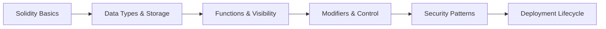

# Chapter 6: Smart Contract Development

> **Previous:** [Chapter 5: Ethereum and Smart Contracts](./05-ethereum.md) | **Next:** [Chapter 7: Decentralized Applications (dApps)](./07-dapps.md)

---

## Learning Objectives

- Identify the syntax and structure of the Solidity programming language
- Understand the concept of "State Variables" vs. "Local Variables"
- Explain function visibility (public, private, external, internal) and modifiers
- Describe common security pitfalls and best practices in contract design
- Understand the compilation and deployment lifecycle

## Chapter at a Glance

| Topic | Key Insight | Practical Takeaway |
|-------|-------------|--------------------|
| Solidity Language | Object-oriented, EVM-targeted language | Influenced by C++, Python, JavaScript |
| Storage vs Memory | Storage persists on-chain (expensive) | Minimize storage writes to save gas |
| Function Visibility | public, private, external, internal | Controls who can call each function |
| Modifiers | Reusable function guards | Declarative access control patterns |
| Security Patterns | Check-Effects-Interactions | Always update state before external calls |

## Chapter Roadmap



---

## Theory

### Solidity Overview
Solidity is a high-level, object-oriented language for writing smart contracts. It is influenced by C++, Python, and JavaScript.

### Data Types and Storage
- **Value Types:** `uint`, `int`, `bool`, `address`.
- **Reference Types:** `string`, `struct`, `mapping`, `array`.
- **Storage:** Data that is permanently stored on the blockchain (Expensive).
- **Memory:** Temporary data used during execution (Cheaper).
- **Stack:** Local variables (Cheapest).


### Functions and Control
- **Visibility:** Defines who can call the function.
- **View/Pure:** Functions that do not modify state (`view`) or do not even read state (`pure`).
- **Payable:** Functions that can receive Ether.
- **Modifiers:** Reusable code blocks that run before/after a function (e.g., `onlyOwner`).

### Security Patterns
Contracts handle money, making them high-value targets.
- **Check-Effects-Interactions:** Always update internal state before calling external contracts.
- **Pull over Push:** Let users "withdraw" funds instead of "sending" them automatically.

---

## Examples

### Example 1: A "Voting" Contract Structure
```solidity
// SPDX-License-Identifier: MIT
pragma solidity ^0.8.0;

contract SimpleVoting {
    mapping(address => bool) public hasVoted;
    uint256 public voteCount;

    function vote() public {
        require(!hasVoted[msg.sender], "Already voted.");
        hasVoted[msg.sender] = true;
        voteCount++;
    }
}
```
- **State Variables:** `hasVoted` and `voteCount`.
- **Logic:** The `require` statement acts as a guard. If it fails, the transaction reverts.

### Example 2: Access Control Modifier
```solidity
contract Guarded {
    address public owner;

    constructor() {
        owner = msg.sender;
    }

    modifier onlyOwner() {
        require(msg.sender == owner, "Not owner");
        _; // This is where the function body is inserted
    }

    function restrictedAction() public onlyOwner {
        // Logic only the owner can trigger
    }
}
```
The `onlyOwner` modifier ensures that only the account that deployed the contract can call `restrictedAction`.

> **One-Sentence Takeaway:** Every storage write costs 5,000–20,000 gas while memory operations cost ~3 gas — the biggest optimization in Solidity is minimizing what you store on the blockchain.

> **Pro Tip:** Use `calldata` instead of `memory` for read-only function parameters. It's cheaper than `memory` and avoids unnecessary data copying.

> **Warning:** The `tx.origin` global should never be used for authentication — it returns the original sender of the transaction, which can be a malicious contract. Always use `msg.sender` for access control.

---

## Concept Comparison Table

| Concept | Definition | Key Distinction | Use Case |
|---------|-----------|-----------------|----------|
| storage | Persistent on-chain data | Expensive (20K gas write), permanent | State variables, balances |
| memory | Temporary during execution | Cheap, forgotten after execution | Function-local arrays |
| calldata | Read-only input data | Cheapest, non-modifiable | External function parameters |
| stack | Local variables on EVM stack | Free but limited (16 variables) | Loop counters, temporaries |
| mapping | Key-value store | No iteration possible | Token balances, allowance |
| struct | Custom data type | Group related fields | User profiles, orders |

## Quick Reference

| Category | Key Concepts | Notes |
|----------|-------------|-------|
| **Visibility** | public, private, internal, external | external is cheaper than public for functions |
| **Modifiers** | onlyOwner, whenNotPaused, nonReentrant | Reusable security guards |
| **Data Location** | storage, memory, calldata | calldata is read-only and cheapest |
| **Globals** | msg.sender, msg.value, block.timestamp | block.timestamp can be manipulated by miners |
| **Gas Ops** | ADD: 3, SSTORE: 20K/5K, SLOAD: 2100 | Storage is the dominant cost |

## Cross-Application Matrix

| Technique | DeFi | Smart Contracts | Enterprise Blockchain | Research |
|-----------|------|-----------------|----------------------|----------|
| Storage Layout | Token balance tracking | Contract state | Asset ledger | Storage optimization |
| Function Visibility | Pool withdrawal (public) | Oracle callback (external) | Chaincode invoke (public) | Proxy patterns |
| Modifiers | onlyOwner admin | Reentrancy guard | Access control lists | Composable modifiers |
| Check-Effects | Flash loan safety | Withdrawal pattern | Escrow settlement | Formal verification |
| Events | Swap logging | Transfer tracking | Audit trail | Event indexing |

## Chapter Quiz

1. Which data location is cheapest for read-only function parameters in Solidity?
   - A) storage
   - B) memory
   - C) calldata
   - D) stack

<details>
<summary>Answer</summary>
**C) calldata.** Calldata is a read-only, non-modifiable location that avoids copying data. It's cheaper than memory for function parameters that don't need modification.
</details>

2. What does the `_;` symbol represent in a Solidity modifier?
   - A) A semicolon
   - B) The insertion point where the function body executes
   - C) A loop continuation
   - D) A require statement

<details>
<summary>Answer</summary>
**B) The insertion point where the function body executes.** In a modifier, `_;` is replaced by the function body at runtime. Code before `_;` runs before the function, and code after runs after.
</details>

3. Why is `tx.origin` dangerous for authentication?
   - A) It returns the wrong address
   - B) It can be the address of an attacker's contract, not the intended user
   - C) It costs more gas
   - D) It only works on testnets

<details>
<summary>Answer</summary>
**B) It can be the address of an attacker's contract, not the intended user.** `tx.origin` returns the original EOA that initiated the transaction chain, which an intermediate malicious contract can exploit to impersonate a user. Always use `msg.sender`.
</details>

## Summary

## Summary

- Solidity is the most widely used language for EVM-compatible smart contracts.
- Efficient use of `storage` vs. `memory` is critical for gas optimization.
- Function modifiers and visibility levels provide robust control over contract behavior.
- Security must be designed into the contract from the beginning using established patterns.
- Tools like Hardhat and Foundry are used for compiling, testing, and deploying contracts.

---

## Exercises

### Review Questions
1. What is the purpose of the `mapping` data type?
2. Explain the difference between `external` and `public` visibility.
3. Why is it important to use `view` or `pure` when possible?
4. What does the `msg.sender` global variable represent?

### Application Problems
1. Write a function `add(uint a, uint b)` that returns the sum but fails if the result exceeds $2^{256}-1$.
2. Design a `mapping` that stores the balance of different tokens for different users.
3. Create a modifier `costs(uint amount)` that requires the caller to send at least `amount` Wei.

### Challenge Problem
1. Analyze the "DAO Hack" and explain why updating the state *after* an external call led to a catastrophic failure.
