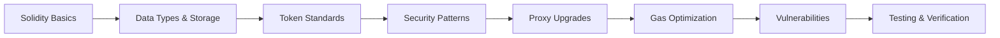
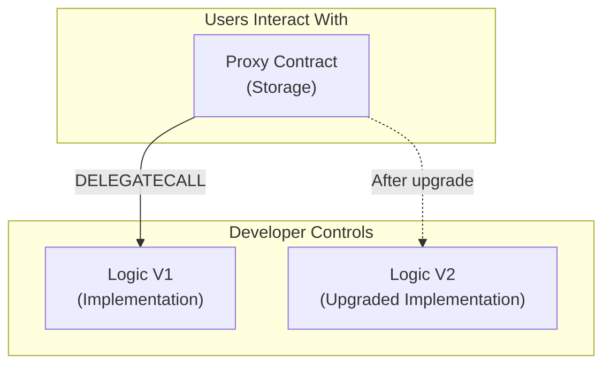
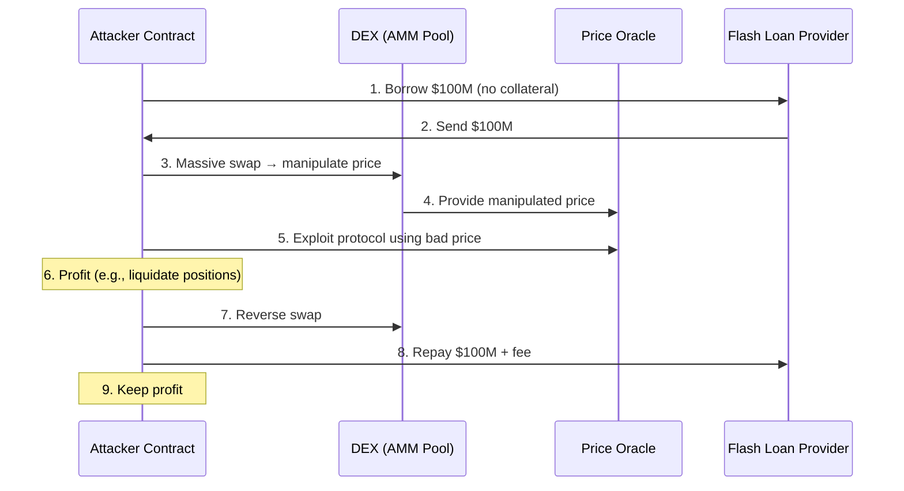

# Chapter 6: Smart Contract Development

> **Previous:** [Chapter 5: Ethereum and Smart Contracts](./05-ethereum.md) | **Next:** [Chapter 7: Decentralized Applications (dApps)](./07-dapps.md)

---

## Learning Objectives

- Understand Solidity syntax, data types, and storage semantics
- Implement ERC-20, ERC-721, and ERC-1155 token standards
- Write secure smart contracts using established security patterns
- Implement proxy-based upgradeable contracts
- Identify and mitigate common vulnerabilities (reentrancy, overflow, front-running)
- Use gas optimization techniques effectively
- Understand formal verification concepts for smart contracts
- Deploy and test contracts with Hardhat/Foundry

## Chapter at a Glance

| Topic | Key Insight | Practical Takeaway |
|-------|-------------|--------------------|
| Solidity Language | Object-oriented, EVM-targeted language | Influenced by C++, Python, JavaScript |
| Storage vs Memory | Storage persists on-chain (expensive) | Minimize storage writes to save gas |
| Token Standards | ERC-20 (fungible), ERC-721 (NFT), ERC-1155 (multi-token) | Each standard enables specific use cases |
| Security Patterns | Check-Effects-Interactions, Pull over Push | Always update state before external calls |
| Proxy Pattern | Delegatecall-based upgrades | Separate logic from storage for upgradeability |
| Gas Optimization | Calldata, packing, unchecked math | Up to 10x gas savings |
| Formal Verification | Mathematical proofs of contract correctness | Prevents bugs that audits might miss |
| Common Vulnerabilities | Reentrancy, overflow, front-running, flash loan attacks | Cause billions in losses |

## Chapter Roadmap



---

## Theory

### Solidity Overview

Solidity is a high-level, object-oriented language for writing smart contracts. It compiles to EVM bytecode. It is influenced by C++ (syntax), Python (modifiers, events), and JavaScript (function declarations).

```solidity
// SPDX-License-Identifier: MIT
pragma solidity ^0.8.0;

// A minimal Solidity contract
contract HelloWorld {
    string public greeting;

    constructor(string memory _greeting) {
        greeting = _greeting;
    }

    function setGreeting(string memory _greeting) external {
        greeting = _greeting;
    }
}
```

**Key language features:**
- **Pragma:** Specifies compiler version for compatibility
- **Constructor:** Runs once at deployment
- **Modifiers:** Reusable access control and validation
- **Events:** Lightweight logging, indexed for searchability
- **Errors:** Custom error types (cheaper than string messages since Solidity 0.8.4)

### Data Types and Storage Locations

**Value Types:**
- `uint` (8, 16, 32, ..., 256): Unsigned integers
- `int` (same sizes): Signed integers
- `bool`: Boolean (true/false)
- `address`: 20-byte Ethereum address
- `bytes32`: Fixed-size byte array (up to 32 bytes)

**Reference Types:**
- `string`: Dynamic UTF-8 string
- `bytes`: Dynamic byte array
- `struct`: Custom data structure
- `mapping`: Key-value store (no iteration)
- `array`: Fixed or dynamic array

**Storage Locations:**

| Location | Persistence | Cost | Description |
|----------|-------------|------|-------------|
| `storage` | Permanent on-chain | Expensive | State variables (over 20K gas per write) |
| `memory` | Transaction scope | Moderate | Temporary variables, ABI decoding |
| `calldata` | Read-only input | Cheapest | External function parameters (non-modifiable) |
| `stack` | Expression scope | Free | Local variables (limited to 16 variables) |

### Token Standards

**ERC-20 (Fungible Tokens):**

The standard for interchangeable tokens (like currencies).

```solidity
// SPDX-License-Identifier: MIT
pragma solidity ^0.8.0;

interface IERC20 {
    function totalSupply() external view returns (uint256);
    function balanceOf(address account) external view returns (uint256);
    function transfer(address to, uint256 amount) external returns (bool);
    function allowance(address owner, address spender) external view returns (uint256);
    function approve(address spender, uint256 amount) external returns (bool);
    function transferFrom(address from, address to, uint256 amount) external returns (bool);

    event Transfer(address indexed from, address indexed to, uint256 value);
    event Approval(address indexed owner, address indexed spender, uint256 value);
}
```

**ERC-721 (Non-Fungible Tokens):**

The standard for unique, non-interchangeable tokens (like collectibles).

```solidity
// SPDX-License-Identifier: MIT
pragma solidity ^0.8.0;

interface IERC721 {
    function balanceOf(address owner) external view returns (uint256);
    function ownerOf(uint256 tokenId) external view returns (address);
    function transferFrom(address from, address to, uint256 tokenId) external;

    event Transfer(address indexed from, address indexed to, uint256 indexed tokenId);
    event Approval(address indexed owner, address indexed spender, uint256 indexed tokenId);
}
```

**ERC-1155 (Multi-Token Standard):**

Combines ERC-20 and ERC-721 features — one contract manages multiple token types.

```solidity
// SPDX-License-Identifier: MIT
pragma solidity ^0.8.0;

interface IERC1155 {
    function balanceOf(address account, uint256 id) external view returns (uint256);
    function balanceOfBatch(
        address[] calldata accounts,
        uint256[] calldata ids
    ) external view returns (uint256[] memory);
    function safeTransferFrom(address from, address to, uint256 id, uint256 amount, bytes calldata data) external;

    event TransferSingle(address indexed operator, address indexed from, address indexed to, uint256 id, uint256 value);
    event TransferBatch(address indexed operator, address indexed from, address indexed to, uint256[] ids, uint256[] values);
}
```

**Standard Comparison:**

| Feature | ERC-20 | ERC-721 | ERC-1155 |
|---------|--------|---------|----------|
| Token Type | Fungible | Non-Fungible | Both |
| Batch Transfers | No | No | Yes |
| Gas Efficiency (batch) | N/A | N/A | High (batched operations) |
| Use Case | Currencies, stablecoins | NFTs, collectibles | Gaming (items + currency) |
| Single Contract Tokens | Unlimited | Unlimited | Unlimited (by ID) |

### Security Patterns

**1. Check-Effects-Interactions Pattern**

The most important security pattern: always update state before making external calls.

```solidity
// UNSAFE: External call before state update
function withdrawUnsafe(uint256 amount) external {
    require(balances[msg.sender] >= amount, "Insufficient balance");
    (bool success, ) = msg.sender.call{value: amount}("");  // External call FIRST
    require(success, "Transfer failed");
    balances[msg.sender] -= amount;  // State update AFTER — VULNERABLE!
}

// SAFE: Check-Effects-Interactions
function withdrawSafe(uint256 amount) external {
    require(balances[msg.sender] >= amount, "Insufficient balance");
    balances[msg.sender] -= amount;  // State update FIRST (Effects)
    (bool success, ) = msg.sender.call{value: amount}("");  // External call LAST (Interaction)
    require(success, "Transfer failed");
}
```

**2. Pull over Push Pattern**

Let users withdraw their own funds instead of pushing payments to them.

```solidity
contract PullOverPush {
    mapping(address => uint256) public pendingWithdrawals;

    function withdraw() external {
        uint256 amount = pendingWithdrawals[msg.sender];
        require(amount > 0, "Nothing to withdraw");
        pendingWithdrawals[msg.sender] = 0;  // Clear state first
        (bool success, ) = msg.sender.call{value: amount}("");
        require(success, "Transfer failed");
    }
}
```

**3. Reentrancy Guard**

```solidity
contract ReentrancyGuard {
    uint256 private _status;
    uint256 private constant _NOT_ENTERED = 1;
    uint256 private constant _ENTERED = 2;

    modifier nonReentrant() {
        require(_status != _ENTERED, "ReentrancyGuard: reentrant call");
        _status = _ENTERED;
        _;
        _status = _NOT_ENTERED;
    }
}
```

### Upgradeable Contracts (Proxy Pattern)

Smart contracts are immutable by default. The **proxy pattern** separates logic from storage:



```solidity
// Minimal proxy pattern (UUPS — Universal Upgradeable Proxy Standard)
contract UUPSProxy {
    address public implementation;

    fallback() external payable {
        address impl = implementation;
        assembly {
            calldatacopy(0, 0, calldatasize())
            let result := delegatecall(gas(), impl, 0, calldatasize(), 0, 0)
            returndatacopy(0, 0, returndatasize())
            switch result
            case 0 { revert(0, returndatasize()) }
            default { return(0, returndatasize()) }
        }
    }
}

// UUPS upgrade logic (in implementation contract)
abstract contract UUPSUpgradeable {
    address public implementation;

    function upgradeTo(address newImplementation) external virtual {
        require(msg.sender == owner, "Not authorized");
        require(newImplementation.code.length > 0, "Empty contract");
        implementation = newImplementation;
    }

    modifier onlyProxy() {
        require(address(this) != implementation, "Not proxy");
        _;
    }
}
```

**Note on storage collisions:** Proxy patterns must respect storage layout — you cannot reorder or remove state variables. The OpenZeppelin upgradeable contracts and UUPS/Transparent proxy patterns handle this.

### Gas Optimization Techniques

```solidity
contract GasOptimized {
    // 1. Use uint256 for loop counters (EVM natively handles 256-bit)
    //    Smaller uints (uint8, uint16) cost MORE due to packing/unpacking
    function loop() external {
        for (uint256 i = 0; i < 100; i++) { /* ... */ }  // Efficient
    }

    // 2. Pack related small variables in the same storage slot
    struct PackedData {
        uint128 amount;   // 16 bytes
        uint64 timestamp; // 8 bytes
        address user;     // 20 bytes → padded to 32
    }
    // Without packing: 3 slots (96 bytes)
    // With packing: 2 slots (44 bytes + padding)

    // 3. Use unchecked math in Solidity 0.8+ where overflow is impossible
    function sum(uint256 a, uint256 b) external pure returns (uint256) {
        unchecked { return a + b; }
        // Saves ~200 gas per operation
    }

    // 4. Cache repeated storage reads
    function badReads() external view {
        mapping(address => uint256) storage balances;
        for (uint256 i = 0; i < 10; i++) {
            // balances[user] read from storage EVERY iteration (SLOAD = 2100 gas)
        }
    }

    function goodReads() external view {
        mapping(address => uint256) storage balances;
        uint256 cached = balances[user];  // SLOAD once (2100 gas)
        for (uint256 i = 0; i < 10; i++) {
            // Use cached value (memory access = 3 gas)
        }
    }
}
```

### Common Vulnerabilities

| Vulnerability | Description | Damage | Prevention |
|--------------|-------------|--------|------------|
| **Reentrancy** | Attacker calls back into contract before state updates | Fund loss (The DAO: $60M) | Check-Effects-Interactions, ReentrancyGuard |
| **Arithmetic Overflow** | Underflow/overflow in math operations | Incorrect balances | Solidity 0.8+ has built-in overflow checks |
| **Front-Running** | Attacker observes pending tx and submits own first | MEV extraction, sandwich attacks | Commit-reveal schemes, submarine sends |
| **Flash Loan Attacks** | Manipulate price oracles using borrowed funds | Protocol insolvency | TWAP oracles, manipulation-resistant AMMs |
| **Oracle Manipulation** | Attacker manipulates off-chain data source | Incorrect price feeds | Decentralized oracles (Chainlink), TWAP |
| **Access Control** | Missing permission checks | Unauthorized admin actions | Modifiers, Ownable pattern |
| **Delegatecall Injection** | Attacker calls through proxy to selfdestruct | Proxy bricked | Storage collision checks, UUPS |
| **Signature Replay** | Valid signature reused on different chains | Unauthorized actions | EIP-712 signatures, nonces, chain ID |

### Flash Loan Attack Pattern



### Formal Verification

Formal verification mathematically proves contract correctness against a specification.

```typescript
// Example: Certora Prover rule for a token contract
// Ensures the total supply never exceeds MAX_SUPPLY
// 
// rule total_supply_bound() {
//     require(initialSupply <= MAX_SUPPLY);
//     require(initialSupply > 0);
//     
//     method f;
//     env e;
//     calldataarg args;
//     f(e, args);
//     
//     assert totalSupply() <= MAX_SUPPLY,
//         "Total supply exceeded maximum";
// }
```

**Formal verification tools:**
- **Certora Prover:** Automated formal verification for Solidity
- **Foundry fuzz testing:** Property-based testing
- **Mythril:** Symbolic execution
- **Slither:** Static analysis (detects common vulnerabilities)

---

## Examples

### Example 1: Complete ERC-20 Token

```solidity
// SPDX-License-Identifier: MIT
pragma solidity ^0.8.20;

contract SimpleERC20 {
    string public name;
    string public symbol;
    uint8 public decimals;
    uint256 public totalSupply;

    mapping(address => uint256) public balanceOf;
    mapping(address => mapping(address => uint256)) public allowance;

    event Transfer(address indexed from, address indexed to, uint256 value);
    event Approval(address indexed owner, address indexed spender, uint256 value);

    constructor(string memory _name, string memory _symbol, uint256 _initialSupply) {
        name = _name;
        symbol = _symbol;
        decimals = 18;
        totalSupply = _initialSupply * 10 ** 18;
        balanceOf[msg.sender] = totalSupply;
    }

    function transfer(address to, uint256 amount) external returns (bool) {
        require(balanceOf[msg.sender] >= amount, "Insufficient balance");
        balanceOf[msg.sender] -= amount;
        balanceOf[to] += amount;
        emit Transfer(msg.sender, to, amount);
        return true;
    }

    function approve(address spender, uint256 amount) external returns (bool) {
        allowance[msg.sender][spender] = amount;
        emit Approval(msg.sender, spender, amount);
        return true;
    }

    function transferFrom(address from, address to, uint256 amount) external returns (bool) {
        require(balanceOf[from] >= amount, "Insufficient balance");
        require(allowance[from][msg.sender] >= amount, "Insufficient allowance");
        allowance[from][msg.sender] -= amount;
        balanceOf[from] -= amount;
        balanceOf[to] += amount;
        emit Transfer(from, to, amount);
        return true;
    }
}
```

### Example 2: Reentrancy Attack Simulation

```solidity
// Vulnerable contract
contract VulnerableBank {
    mapping(address => uint256) public balances;

    function deposit() external payable {
        balances[msg.sender] += msg.value;
    }

    function withdraw(uint256 amount) external {
        require(balances[msg.sender] >= amount, "Insufficient balance");
        (bool success, ) = msg.sender.call{value: amount}("");
        require(success, "Transfer failed");
        balances[msg.sender] -= amount;  // State update AFTER call
    }
}

// Attacker contract
contract ReentrancyAttacker {
    VulnerableBank public target;
    uint256 public constant ATTACK_DEPTH = 3;

    constructor(address _target) {
        target = VulnerableBank(_target);
    }

    function attack() external payable {
        require(msg.value >= 1 ether, "Need 1 ETH to attack");
        target.deposit{value: 1 ether}();
        target.withdraw(1 ether);
    }

    receive() external payable {
        if (msg.sender.balance > 0) {
            target.withdraw(1 ether);
        }
    }
}
```

### Example 3: Gas Cost Comparison

```solidity
contract GasComparison {
    // Gas: ~50000
    function inefficient(uint256[] calldata values) external {
        for (uint256 i = 0; i < values.length; i++) {
            // SLOAD each iteration
        }
    }

    // Gas: ~30000 (40% savings)
    function efficient(uint256[] calldata values) external {
        uint256 len = values.length;  // Cache array length
        for (uint256 i = 0; i < len; i = unchecked_inc(i)) {
            // Cached + unchecked
        }
    }

    function unchecked_inc(uint256 i) private pure returns (uint256) {
        unchecked { return i + 1; }
    }
}
```

> **One-Sentence Takeaway:** Every storage write costs 5,000-22,100 gas while memory operations cost ~3 gas — the biggest optimization in Solidity is minimizing what you store on the blockchain.

> **Pro Tip:** Use `calldata` instead of `memory` for read-only function parameters. It's cheaper than `memory` and avoids unnecessary data copying.

> **Warning:** The `tx.origin` global should never be used for authentication — it returns the original sender of the transaction, which can be a malicious contract. Always use `msg.sender` for access control.

---

## Concept Comparison Table

| Concept | Definition | Key Distinction | Use Case |
|---------|-----------|-----------------|----------|
| storage | Persistent on-chain data | Expensive (20K gas write), permanent | State variables, balances |
| memory | Temporary during execution | Cheap, forgotten after execution | Function-local arrays |
| calldata | Read-only input data | Cheapest, non-modifiable | External function parameters |
| stack | Local variables on EVM stack | Free but limited (16 variables) | Loop counters, temporaries |
| mapping | Key-value store | No iteration possible | Token balances, allowance |
| struct | Custom data type | Group related fields | User profiles, orders |
| ERC-20 | Fungible token standard | Interchangeable tokens | Currencies, stablecoins |
| ERC-721 | NFT standard | Unique tokens | Collectibles, property deeds |
| ERC-1155 | Multi-token standard | Batch operations | Gaming items |

## Quick Reference

| Category | Key Concepts | Notes |
|----------|-------------|-------|
| **Visibility** | public, private, internal, external | external is cheaper than public for functions |
| **Modifiers** | onlyOwner, whenNotPaused, nonReentrant | Reusable security guards |
| **Data Location** | storage, memory, calldata | calldata is read-only and cheapest |
| **Globals** | msg.sender, msg.value, block.timestamp | block.timestamp can be manipulated by miners |
| **Gas Ops** | ADD: 3, SSTORE: 22K/5K, SLOAD: 2100 | Storage is the dominant cost |
| **Token Standards** | ERC-20, ERC-721, ERC-1155 | Each has distinct use cases |
| **Proxy Pattern** | UUPS, Transparent, Beacon | Delegatecall-based upgrades |
| **Security Checklist** | CEI, Pull over Push, ReentrancyGuard | Prevents 90%+ of common exploits |

## Cross-Application Matrix

| Technique | DeFi | Smart Contracts | Enterprise Blockchain | Research |
|-----------|------|-----------------|----------------------|----------|
| Storage Layout | Token balance tracking | Contract state | Asset ledger | Storage optimization |
| Function Visibility | Pool withdrawal (public) | Oracle callback (external) | Chaincode invoke (public) | Proxy patterns |
| Modifiers | onlyOwner admin | Reentrancy guard | Access control lists | Composable modifiers |
| Check-Effects | Flash loan safety | Withdrawal pattern | Escrow settlement | Formal verification |
| Events | Swap logging | Transfer tracking | Audit trail | Event indexing |
| Token Standards | DEX, lending, NFTs | Contract creation | Asset tokenization | Standard improvements |

## Chapter Quiz

1. Which data location is cheapest for read-only function parameters in Solidity?
   - A) storage
   - B) memory
   - C) calldata
   - D) stack

<details>
<summary>Answer</summary>
**C) calldata.** Calldata is a read-only, non-modifiable location that avoids copying data. It's cheaper than memory for function parameters that don't need modification.
</details>

2. What does the `_;` symbol represent in a Solidity modifier?
   - A) A semicolon
   - B) The insertion point where the function body executes
   - C) A loop continuation
   - D) A require statement

<details>
<summary>Answer</summary>
**B) The insertion point where the function body executes.** In a modifier, `_;` is replaced by the function body at runtime. Code before `_;` runs before the function, and code after runs after.
</details>

3. Why is `tx.origin` dangerous for authentication?
   - A) It returns the wrong address
   - B) It can be the address of an attacker's contract, not the intended user
   - C) It costs more gas
   - D) It only works on testnets

<details>
<summary>Answer</summary>
**B) It can be the address of an attacker's contract, not the intended user.** `tx.origin` returns the original EOA that initiated the transaction chain, which an intermediate malicious contract can exploit to impersonate a user. Always use `msg.sender`.
</details>

4. What is the primary purpose of the proxy pattern in Solidity?
   - A) To improve gas efficiency
   - B) To enable upgradeable smart contracts
   - C) To reduce deployment cost
   - D) To increase security

<details>
<summary>Answer</summary>
**B) To enable upgradeable smart contracts.** The proxy pattern separates logic from storage using DELEGATECALL. The proxy contract holds the storage, and the implementation contract contains the logic. Users call the proxy, which delegates to the implementation, allowing the logic to be replaced while preserving state.
</details>

5. What is the proper ordering of operations in the Check-Effects-Interactions pattern?
   - A) Interaction → Check → Effects
   - B) Check → Effects → Interaction
   - C) Effects → Check → Interaction
   - D) Interaction → Effects → Check

<details>
<summary>Answer</summary>
**B) Check → Effects → Interaction.** First check all conditions (require), then update state (effects), then make external calls (interaction). This order prevents reentrancy attacks because state changes are visible to the attacker before they can re-enter the function.
</details>

## Summary

- Solidity is the most widely used language for EVM-compatible smart contracts.
- Efficient use of `storage` vs. `memory` vs. `calldata` is critical for gas optimization.
- Function modifiers and visibility levels provide robust control over contract behavior.
- Token standards (ERC-20, ERC-721, ERC-1155) enable interoperability across the ecosystem.
- Security must be designed into the contract from the beginning using established patterns.
- The proxy pattern enables upgradeability while preserving state.
- Common vulnerabilities (reentrancy, overflow, front-running) must be understood and mitigated.
- Formal verification provides mathematical guarantees beyond manual audits.

## Practical Takeaways

1. Always follow Check-Effects-Interactions — update state before external calls.
2. Use OpenZeppelin's audited contracts for standards (ERC-20, ERC-721) rather than writing from scratch.
3. Implement the proxy pattern for production contracts that may need future upgrades.
4. Use `calldata` for read-only function parameters and pack struct fields to save gas.
5. Run Slither and Mythril static analysis before every deployment.
6. Write fuzz tests with Foundry to cover edge cases in contract logic.

---

## Exercises

### Review Questions

1. What is the purpose of the `mapping` data type?
2. Explain the difference between `external` and `public` visibility.
3. Why is it important to use `view` or `pure` when possible?
4. What does the `msg.sender` global variable represent?
5. How does the proxy pattern enable upgradeability?

### Application Problems

1. Write a function `add(uint a, uint b)` that returns the sum but fails if the result exceeds 2^256-1.
2. Design a `mapping` that stores the balance of different tokens for different users.
3. Create a modifier `costs(uint amount)` that requires the caller to send at least `amount` Wei.
4. Implement a simple ERC-721 contract that mints unique NFTs with metadata URIs.

### Challenge Problem

1. Analyze the "DAO Hack" and explain why updating the state *after* an external call led to a catastrophic failure. Write a Solidity test that demonstrates the vulnerability and the fix.
2. Research ERC-4626 (Tokenized Vault Standard) and implement a simplified yield-bearing vault that accepts deposits and tracks shares.
