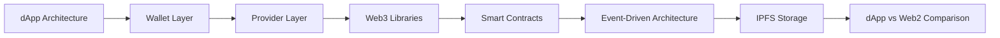
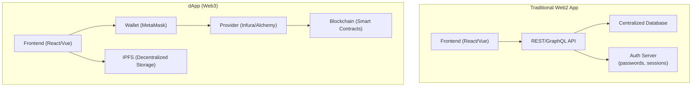
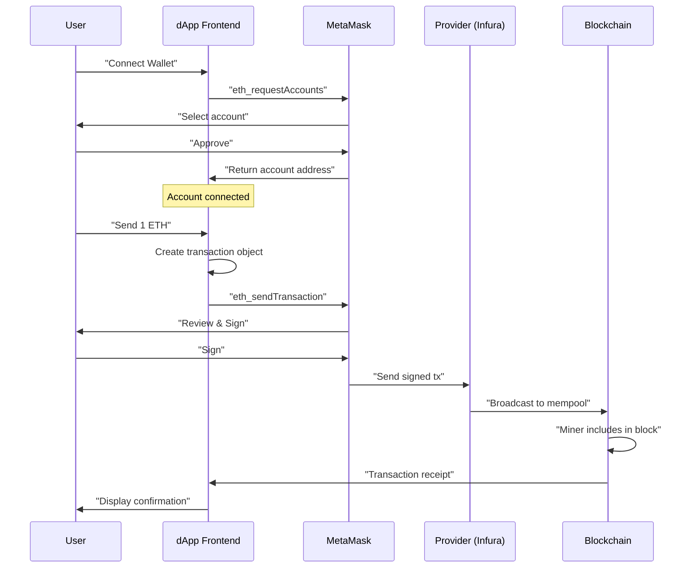
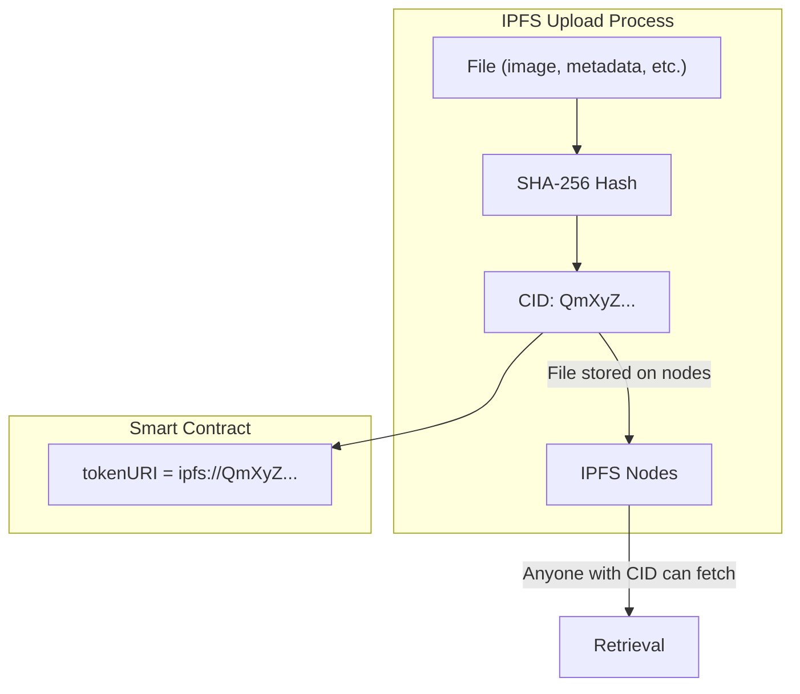

# Chapter 7: Decentralized Applications (dApps)

> **Previous:** [Chapter 6: Smart Contract Development](./06-solidity.md) | **Next:** [Chapter 8: Decentralized Finance (DeFi)](./08-defi.md)

---

## Learning Objectives

- Define the architecture of a Decentralized Application (dApp)
- Explain the role of wallets (MetaMask), providers (Infura), and web3 libraries
- Build a frontend that interacts with smart contracts using ethers.js
- Understand event-driven architecture and how dApps listen to on-chain events
- Implement IPFS for decentralized file and metadata storage
- Differentiate the dApp architecture from traditional client-server models
- Understand the MetaMask interaction flow (connect, sign, send)

<!-- Image Gallery -->
<div style="display:flex;flex-wrap:wrap;gap:4px;margin:16px 0;padding:12px;background:#f8fafc;border-radius:8px;border:1px solid #e2e8f0;">
<a href="../../../assets/images/lessons/blockchain/07-dapps/hero.svg" target="_blank" rel="noopener">
  
</a>
<a href="../../../assets/images/lessons/blockchain/07-dapps/handwritten-notes.svg" target="_blank" rel="noopener">
  
</a>
<a href="../../../assets/images/lessons/blockchain/07-dapps/sticky-notes.svg" target="_blank" rel="noopener">
  
</a>
<a href="../../../assets/images/lessons/blockchain/07-dapps/visual-explanation.svg" target="_blank" rel="noopener">
  
</a>
<a href="../../../assets/images/lessons/blockchain/07-dapps/architecture.svg" target="_blank" rel="noopener">
  
</a>
<a href="../../../assets/images/lessons/blockchain/07-dapps/workflow.svg" target="_blank" rel="noopener">
  
</a>
<a href="../../../assets/images/lessons/blockchain/07-dapps/mindmap.svg" target="_blank" rel="noopener">
  
</a>
<a href="../../../assets/images/lessons/blockchain/07-dapps/comparison.svg" target="_blank" rel="noopener">
  
</a>
<a href="../../../assets/images/lessons/blockchain/07-dapps/cheatsheet.svg" target="_blank" rel="noopener">
  
</a>
<a href="../../../assets/images/lessons/blockchain/07-dapps/interview-quiz.svg" target="_blank" rel="noopener">
  
</a>
<a href="../../../assets/images/lessons/blockchain/07-dapps/social-card.svg" target="_blank" rel="noopener">
  
</a>
</div>
<!-- End Image Gallery -->

## Chapter at a Glance

| Topic | Key Insight | Practical Takeaway |
|-------|-------------|--------------------|
| dApp Stack | Frontend + Wallet + Provider + Blockchain | Wallet replaces server-side auth |
| Providers | Infura, Alchemy connect frontend to blockchain | No need to run your own node |
| Web3 Libraries | ethers.js / web3.js for contract interaction | Read is free, write costs gas |
| IPFS | Content-addressed decentralized storage | Files accessed by hash, not location |
| Events | Smart contract events enable reactive UIs | Listen for Transfer, Swap, etc. |
| MetaMask | Browser extension wallet | Injects window.ethereum provider |
| SSI | Wallet address = user identity | No passwords, no central database |

## Chapter Roadmap



---

## Theory

### The dApp Stack

A traditional app uses: `Frontend ? API ? Centralized Database`.
A dApp uses: `Frontend ? Provider/Wallet ? Blockchain (Smart Contracts)`.



**Key components:**
1. **Frontend:** React, Vue, or Angular — same as Web2.
2. **Wallet (e.g., MetaMask):** Manages private keys and signs transactions. Injects `window.ethereum` into the browser.
3. **Provider (e.g., Infura, Alchemy):** JSON-RPC interface to blockchain nodes — enables reading data and sending transactions.
4. **Smart Contracts:** On-chain logic deployed on the blockchain.
5. **Decentralized Storage (IPFS):** Content-addressed P2P storage for files that are too expensive to store on-chain.

### MetaMask Interaction Flow



### Web3 Libraries: ethers.js

`ethers.js` (preferred over `web3.js` for its smaller size and better TypeScript support) provides:

- **Provider:** Connection to the blockchain (read operations).
- **Signer:** Represents an account that can sign transactions (write operations).
- **Contract:** ABI-bound interface to interact with deployed contracts.

```typescript
import { ethers } from "ethers";

// 1. Connect to provider
const provider = new ethers.JsonRpcProvider(
    "https://mainnet.infura.io/v3/YOUR_PROJECT_ID"
);

// 2. Connect wallet (MetaMask)
async function connectWallet(): Promise<string> {
    if (!window.ethereum) {
        throw new Error("MetaMask not installed");
    }
    const accounts = await window.ethereum.request({
        method: "eth_requestAccounts",
    });
    return accounts[0];
}

// 3. Create signer from wallet
const provider = new ethers.BrowserProvider(window.ethereum);
const signer = await provider.getSigner();

// 4. Create contract instance
const contract = new ethers.Contract(
    "0xContractAddress",
    ["function balanceOf(address) view returns (uint256)"],
    signer
);

// 5. Read (free)
const balance = await contract.balanceOf("0xUserAddress");

// 6. Write (costs gas)
const tx = await contract.transfer("0xRecipient", ethers.parseEther("1.0"));
await tx.wait();  // Wait for confirmation
console.log("Transaction confirmed:", tx.hash);
```

### DApp vs Traditional App Comparison

| Aspect | Traditional App (Web2) | dApp (Web3) |
|--------|----------------------|-------------|
| **Backend** | Centralized server | Smart contracts on blockchain |
| **Database** | Centralized DB (Postgres, MySQL) | Blockchain state + IPFS |
| **Authentication** | Username/Password + session | Wallet signature (public key) |
| **Authorization** | Server-side permissions | Smart contract access control |
| **User Identity** | Email, OAuth (Google, Apple) | Wallet address (0x...) |
| **Hosting** | AWS, Heroku, Vercel | IPFS + ENS + decentralized hosting |
| **Fees** | Server costs paid by company | Gas fees paid by user |
| **Censorship** | Server can block/delete | Censorship-resistant (in principle) |
| **Upgrades** | Backend deploy (instant) | Smart contract upgrade (proxy) |
| **Data ownership** | Service provider owns data | User controls keys = user owns data |
| **Uptime** | Server-dependent | Blockchain is always running |
| **Speed** | Milliseconds | Seconds to minutes (block time) |

### Event-Driven Architecture

Smart contracts emit events that dApps can listen to in real-time:

```solidity
// Smart contract emits events
contract Token {
    event Transfer(address indexed from, address indexed to, uint256 value);
    event Approval(address indexed owner, address indexed spender, uint256 value);

    function transfer(address to, uint256 amount) external {
        // ... transfer logic
        emit Transfer(msg.sender, to, amount);
    }
}
```

```typescript
// Frontend listens for events
import { ethers } from "ethers";

const provider = new ethers.WebSocketProvider(
    "wss://mainnet.infura.io/ws/v3/YOUR_PROJECT_ID"
);

const contract = new ethers.Contract(address, abi, provider);

// Real-time event listener
contract.on("Transfer", (from, to, value, event) => {
    console.log(`Transfer: ${from} ? ${to} = ${ethers.formatEther(value)} ETH`);
    // Update UI in real-time
    updateTransactionList({ from, to, value, txHash: event.log.transactionHash });
});

// Query historical events
const events = await contract.queryFilter(
    contract.filters.Transfer(null, "0xUserAddress"),  // All transfers to user
    0,  // From block 0
    "latest"  // To latest
);
```

### IPFS (InterPlanetary File System)

IPFS is a peer-to-peer, content-addressed file system. Files are addressed by their **CID (Content Identifier)** — a hash of the content itself, not a location URL.



**Why IPFS for dApps?**
- **Content addressing:** URL never changes if content doesn't change
- **Deduplication:** Same content = same CID
- **Offline-first:** Can share files within local network without internet
- **Persistence risk:** Content is only available if someone pins it

```typescript
// IPFS upload example (using web3.storage or Pinata)
interface NFTMetadata {
    name: string;
    description: string;
    image: string;  // IPFS CID
    attributes: { trait_type: string; value: string }[];
}

async function uploadToIPFS(metadata: NFTMetadata): Promise<string> {
    // In production, use Pinata SDK or web3.storage
    const response = await fetch("https://api.pinata.cloud/pinning/pinJSONToIPFS", {
        method: "POST",
        headers: {
            "Content-Type": "application/json",
            Authorization: `Bearer ${PINATA_JWT}`,
        },
        body: JSON.stringify(metadata),
    });
    const result = await response.json();
    return `ipfs://${result.IpfsHash}`;  // CID
}
```

### Provider Comparison

| Provider | Free Tier | Paid Tier | WebSocket | Special Features |
|----------|-----------|-----------|-----------|------------------|
| Infura | 100K req/day | $50+/mo | Yes | Most mature, ETH/L2 support |
| Alchemy | 300M compute units/mo | $49+/mo | Yes | Enhanced APIs, NFT, WebSocket |
| QuickNode | 25K req/mo | $9+/mo | Yes | Multi-chain, dedicated nodes |
| Moralis | 40K tx/mo | $49+/mo | Yes | Cross-chain, webhooks |
| Public RPC | Unlimited (rate limited) | Free | Limited | ethers.providers.JsonRpcProvider |

### ENS (Ethereum Name Service)

ENS maps human-readable names (e.g., `vitalik.eth`) to Ethereum addresses:

```typescript
async function resolveENS(name: string, provider: ethers.Provider): Promise<string | null> {
    try {
        const address = await provider.resolveName(name);
        return address;
    } catch {
        return null;
    }
}

async function lookupENS(address: string, provider: ethers.Provider): Promise<string | null> {
    try {
        const name = await provider.lookupAddress(address);
        return name;  // e.g., "vitalik.eth"
    } catch {
        return null;
    }
}
```

---

## Examples

### Example 1: Complete dApp Frontend (React + ethers.js)

```typescript
import { useState, useEffect } from "react";
import { ethers } from "ethers";

// Contract ABI (interface)
const TOKEN_ABI = [
    "function balanceOf(address) view returns (uint256)",
    "function transfer(address to, uint256 amount) returns (bool)",
    "function totalSupply() view returns (uint256)",
    "event Transfer(address indexed from, address indexed to, uint256 value)",
];

export function TokenDApp() {
    const [account, setAccount] = useState<string>("");
    const [balance, setBalance] = useState<string>("0");
    const [loading, setLoading] = useState<boolean>(false);

    const contractAddress = "0xYourTokenAddress";

    async function connect() {
        if (!window.ethereum) {
            alert("Please install MetaMask");
            return;
        }
        const accounts = await window.ethereum.request({
            method: "eth_requestAccounts",
        });
        setAccount(accounts[0]);

        // Listen for account changes
        window.ethereum.on("accountsChanged", (accounts: string[]) => {
            setAccount(accounts[0] || "");
        });
    }

    async function fetchBalance() {
        if (!account) return;
        const provider = new ethers.BrowserProvider(window.ethereum);
        const contract = new ethers.Contract(contractAddress, TOKEN_ABI, provider);
        const bal = await contract.balanceOf(account);
        setBalance(ethers.formatEther(bal));
    }

    async function transfer(to: string, amount: string) {
        if (!account) return;
        setLoading(true);
        const provider = new ethers.BrowserProvider(window.ethereum);
        const signer = await provider.getSigner();
        const contract = new ethers.Contract(contractAddress, TOKEN_ABI, signer);

        try {
            const tx = await contract.transfer(to, ethers.parseEther(amount));
            await tx.wait();  // Wait for block confirmation
            alert("Transfer successful!");
            fetchBalance();  // Refresh balance
        } catch (error: any) {
            alert(`Transfer failed: ${error.message}`);
        } finally {
            setLoading(false);
        }
    }

    // Listen for Transfer events
    useEffect(() => {
        if (!account) return;
        const provider = new ethers.BrowserProvider(window.ethereum);
        const contract = new ethers.Contract(contractAddress, TOKEN_ABI, provider);

        contract.on("Transfer", (from, to, value) => {
            if (from === account || to === account) {
                fetchBalance();
            }
        });

        return () => {
            contract.removeAllListeners("Transfer");
        };
    }, [account]);

    return (
        <div>
            {!account ? (
                <button onClick={connect}>Connect Wallet</button>
            ) : (
                <div>
                    <p>Account: {account}</p>
                    <p>Balance: {balance} TOKEN</p>
                    <button onClick={fetchBalance}>Refresh</button>
                    {/* Transfer form */}
                </div>
            )}
        </div>
    );
}
```

### Example 2: Event Listener for Real-Time Updates

```typescript
class MempoolWatcher {
    private provider: ethers.WebSocketProvider;
    private pendingTxs: Map<string, ethers.TransactionResponse>;

    constructor(wsUrl: string) {
        this.provider = new ethers.WebSocketProvider(wsUrl);
        this.pendingTxs = new Map();
    }

    async watchPending() {
        this.provider.on("pending", (txHash: string) => {
            console.log(`New pending tx: ${txHash}`);
            this.trackTransaction(txHash);
        });
    }

    private async trackTransaction(txHash: string) {
        const tx = await this.provider.getTransaction(txHash);
        if (tx && tx.to === "0xTargetContract") {
            this.pendingTxs.set(txHash, tx);
            
            // Wait for confirmation
            const receipt = await this.provider.waitForTransaction(txHash, 1);
            console.log(`Transaction confirmed in block ${receipt.blockNumber}`);
            this.pendingTxs.delete(txHash);
            
            // Parse events from receipt
            this.parseEvents(receipt);
        }
    }

    private parseEvents(receipt: ethers.TransactionReceipt) {
        for (const log of receipt.logs) {
            const event = new ethers.utils.LogDescription(
                { /* ABI */ },
                log
            );
            console.log(`Event: ${event.name}`, event.args);
        }
    }
}
```

### Example 3: IPFS-CID-based NFT Store

```typescript
interface NFT {
    tokenId: number;
    tokenURI: string;
    metadata?: NFTMetadata;
}

async function fetchNFTMetadata(tokenURI: string): Promise<NFTMetadata> {
    // Convert ipfs:// to HTTP gateway
    const httpUrl = tokenURI.replace("ipfs://", "https://ipfs.io/ipfs/");
    const response = await fetch(httpUrl);
    return response.json();
}

async function loadAllNFTs(
    contract: ethers.Contract,
    owner: string
): Promise<NFT[]> {
    // Get all tokens owned by address
    const balance = await contract.balanceOf(owner);
    const nfts: NFT[] = [];

    for (let i = 0; i < Number(balance); i++) {
        const tokenId = await contract.tokenOfOwnerByIndex(owner, i);
        const tokenURI = await contract.tokenURI(tokenId);
        const metadata = await fetchNFTMetadata(tokenURI);
        nfts.push({ tokenId: Number(tokenId), tokenURI, metadata });
    }

    return nfts;
}
```

> **One-Sentence Takeaway:** In a dApp, the user's wallet is both their identity (authentication) and their signing key (authorization) — there is no backend session, no password reset, and no central authority controlling access.

> **Pro Tip:** When building a dApp frontend, handle the "no wallet" and "wrong network" states explicitly. A blank screen when MetaMask isn't installed is the #1 UX failure in new dApps.

> **Warning:** IPFS does not guarantee availability — content is only accessible if at least one node is pinning the data. Use a pinning service (Pinata, web3.storage) to ensure your dApp's data persists.

---

## Concept Comparison Table

| Concept | Definition | Key Distinction | Use Case |
|---------|-----------|-----------------|----------|
| Web2 Architecture | Frontend ? API ? Centralized DB | Server controls data and identity | Social media, banking |
| dApp Architecture | Frontend ? Provider ? Blockchain | User controls keys and data | DeFi, NFTs |
| MetaMask | Browser wallet extension | Injects window.ethereum provider | Transaction signing, identity |
| Infura/Alchemy | Node-as-a-Service providers | No need to sync full blockchain | dApp backend connectivity |
| IPFS | Content-addressed P2P file system | Files addressed by CID, not URL | NFT metadata, dApp content |
| ENS | Ethereum Name Service | Maps names to addresses | Human-readable addresses |
| Provider | JSON-RPC interface | Read/write access to blockchain | All dApp transactions |
| Event | Smart contract log entry | Real-time data streaming | Price feed updates, transfers |

## Quick Reference

| Category | Key Concepts | Notes |
|----------|-------------|-------|
| **dApp Stack** | Frontend + Wallet + Provider + Blockchain | No backend server needed |
| **Wallet** | MetaMask, WalletConnect, Coinbase Wallet | Manages private keys, signs txs |
| **Provider** | JSON-RPC (Infura, Alchemy, QuickNode) | Read operations are free |
| **IPFS** | CID (Qm...), Gateway (ipfs.io), Pinning | Content addressing, not location addressing |
| **ENS** | john.eth ? 0xabc... | Human-readable addresses |
| **Events** | Emitted by contracts, captured by frontend | Real-time UI updates |
| **ethers.js** | Provider, Signer, Contract | Main API for blockchain interaction |
| **WebSocket** | Real-time event streaming | Lower latency than polling |

## Cross-Application Matrix

| Technique | DeFi | Smart Contracts | Enterprise Blockchain | Research |
|-----------|------|-----------------|----------------------|----------|
| Wallet Integration | Swap UI | Contract interaction | Identity management | Account abstraction |
| Provider | Price feeds | Event listening | Node-as-a-Service | Decentralized RPC |
| IPFS | NFT metadata | Contract verification | Audit trails | Permanence studies |
| ENS | dApp domains | Contract naming | Enterprise identity | Domain squating prevention |
| ethers.js | Balance display | Contract reads | Chaincode SDK | Library benchmarks |
| Events | Trade execution | State changes | Audit logging | Event indexing performance |
| WebSocket | Real-time prices | Live updates | Private network sync | Scaling event consumers |

## Chapter Quiz

1. Why does a dApp use a "Provider" like Infura instead of running its own blockchain node?
   - A) Infura is more secure than running a node
   - B) Running a full node is resource-intensive; Infura provides API access without syncing the chain
   - C) Infura provides free ETH
   - D) A node cannot read smart contract data

<details>
<summary>Answer&lt;/summary&gt;
**B) Running a full node is resource-intensive; Infura provides API access without syncing the chain.** A full Ethereum node requires terabytes of storage and constant synchronization. Providers abstract this away with simple REST API access.
</details>

2. How does a dApp authenticate a user without a centralized login system?
   - A) By asking for a username and password
   - B) By having the user sign a message with their wallet's private key
   - C) By storing the user's email in the blockchain
   - D) By using cookies

<details>
<summary>Answer&lt;/summary&gt;
**B) By having the user sign a message with their wallet's private key.** The dApp requests a cryptographic signature (EIP-4361 / Sign in with Ethereum), which proves the user controls the claimed address without revealing their private key.
</details>

3. What happens if the only node pinning your IPFS content goes offline?
   - A) The content becomes permanently lost
   - B) The content is inaccessible until a node with that CID comes back online
   - C) The content automatically replicates to other nodes
   - D) IPFS returns a 404 error

<details>
<summary>Answer&lt;/summary&gt;
**B) The content is inaccessible until a node with that CID comes back online.** IPFS does not guarantee persistence — content availability depends on at least one node hosting it. This is why pinning services exist.
</details>

4. What is the difference between a Provider and a Signer in ethers.js?
   - A) They are the same thing
   - B) Provider can only read data; Signer can sign and send transactions
   - C) Provider is faster than Signer
   - D) Signer can only read data

<details>
<summary>Answer&lt;/summary&gt;
**B) Provider can only read data; Signer can sign and send transactions.** The Provider connects to the blockchain for read-only operations. The Signer wraps a private key (via MetaMask or other wallet) and can sign transactions, which costs gas.
</details>

5. Why is content addressing important for decentralized applications?
   - A) It makes URLs shorter
   - B) Content is addressable by its hash, not its location — links never break if content doesn't change
   - C) It's faster than location addressing
   - D) It uses less bandwidth

<details>
<summary>Answer&lt;/summary&gt;
**B) Content is addressable by its hash, not its location — links never break if content doesn't change.** In IPFS, the CID (content hash) uniquely identifies the content. As long as the content is the same, the CID is the same, and anyone hosting that CID can serve it.
</details>

### TypeScript: Multi-Sig Wallet Logic

```typescript
interface MultiSigTx {
  id: string; to: string; value: bigint; data: string; confirmations: Set<string>; executed: boolean;
}

class MultiSigWallet {
  owners: string[];
  required: number;
  transactions: Map<string, MultiSigTx> = new Map();
  nonce = 0;

  constructor(owners: string[], required: number) {
    this.owners = owners;
    this.required = required;
  }

  submit(to: string, value: bigint, data: string): string {
    const id = sha256(to + value.toString() + data + this.nonce++);
    this.transactions.set(id, { id, to, value, data, confirmations: new Set(), executed: false });
    return id;
  }

  confirm(txId: string, owner: string): boolean {
    if (!this.owners.includes(owner)) return false;
    const tx = this.transactions.get(txId);
    if (!tx || tx.executed) return false;
    tx.confirmations.add(owner);
    if (tx.confirmations.size >= this.required) {
      tx.executed = true;
    }
    return tx.executed;
  }

  revoke(txId: string, owner: string): void {
    this.transactions.get(txId)?.confirmations.delete(owner);
  }

  getQueue(): MultiSigTx[] {
    return [...this.transactions.values()].filter(tx => !tx.executed);
  }
}
```

### TypeScript: Event Listener Framework

```typescript
type EventCallback = (event: unknown) => void;

class EventListener {
  private listeners: Map<string, EventCallback[]> = new Map();
  private polling = false;

  on(eventName: string, callback: EventCallback): void {
    if (!this.listeners.has(eventName)) this.listeners.set(eventName, []);
    this.listeners.get(eventName)!.push(callback);
  }

  off(eventName: string, callback: EventCallback): void {
    const cbs = this.listeners.get(eventName);
    if (cbs) this.listeners.set(eventName, cbs.filter(c => c !== callback));
  }

  emit(eventName: string, data: unknown): void {
    this.listeners.get(eventName)?.forEach(cb => cb(data));
  }

  async poll(fetchFn: () => Promise<{ event: string; data: unknown }[]>, intervalMs = 5000): Promise<void> {
    this.polling = true;
    while (this.polling) {
      const events = await fetchFn();
      for (const ev of events) this.emit(ev.event, ev.data);
      await new Promise(r => setTimeout(r, intervalMs));
    }
  }

  stop(): void { this.polling = false; }
}
```

### TypeScript: Smart Contract Interaction Wrapper

```typescript
interface ContractABI {
  name: string; type: string; inputs: { name: string; type: string }[];
  outputs?: { name: string; type: string }[];
}

class ContractWrapper {
  private abi: ContractABI[];
  private address: string;

  constructor(address: string, abi: ContractABI[]) {
    this.address = address;
    this.abi = abi;
  }

  estimateGas(functionName: string, args: unknown[]): number {
    const fn = this.abi.find(a => a.name === functionName && a.type === "function");
    if (!fn) throw new Error(`Function ${functionName} not found`);
    let gas = 21000;
    gas += args.length * 5000;
    return gas;
  }

  parseError(data: string): string {
    if (data.startsWith("0x08c379a0")) return "Revert: " + Buffer.from(data.slice(10), "hex").toString();
    if (data.startsWith("0x4e487b71")) return "Panic: arithmetic error";
    return "Unknown error: " + data;
  }
}
```

## TypeScript Implementations

```typescript
// === Multi-Sig Wallet (N-of-M) ===
class MultiSigWallet {
    private owners: string[];
    private required: number;
    private nonce = 0;
    private pending = new Map<number, { to: string; value: bigint; data: string; confirmations: Set<string> }>();

    constructor(owners: string[], required: number) {
        this.owners = owners; this.required = required;
    }
    submitTransaction(to: string, value: bigint, data: string, submitter: string): number | null {
        if (!this.owners.includes(submitter)) return null;
        const txId = ++this.nonce;
        this.pending.set(txId, { to, value, data, confirmations: new Set([submitter]) });
        return txId;
    }
    confirmTransaction(txId: number, owner: string): { executed: boolean; tx?: { to: string; value: bigint; data: string } } {
        const tx = this.pending.get(txId);
        if (!tx || !this.owners.includes(owner)) return { executed: false };
        tx.confirmations.add(owner);
        if (tx.confirmations.size >= this.required) {
            const executed = { to: tx.to, value: tx.value, data: tx.data };
            this.pending.delete(txId);
            return { executed: true, tx: executed };
        }
        return { executed: false };
    }
    getConfirmations(txId: number): string[] { return Array.from(this.pending.get(txId)?.confirmations ?? []); }
}

// === Timelock Transaction ===
class TimelockTx {
    private lockTime: number;
    constructor(private unlockTime: number, private to: string, private value: bigint) { this.lockTime = unlockTime; }
    execute(currentTime: number): { success: boolean; reason: string } {
        if (currentTime < this.lockTime) return { success: false, reason: `locked until ${new Date(this.lockTime).toISOString()}` };
        return { success: true, reason: `sent ${this.value} to ${this.to}` };
    }
    timeRemaining(now: number): number { return Math.max(0, this.lockTime - now); }
}

// === Escrow Contract ===
class EscrowContract {
    private buyer: string;
    private seller: string;
    private arbiter: string;
    private amount: bigint;
    private state: 'AWAITING_PAYMENT' | 'AWAITING_DELIVERY' | 'AWAITING_APPROVAL' | 'COMPLETE' | 'DISPUTED' = 'AWAITING_PAYMENT';

    constructor(buyer: string, seller: string, arbiter: string) { this.buyer = buyer; this.seller = seller; this.arbiter = arbiter; this.amount = BigInt(0); }
    deposit(from: string, amount: bigint): boolean {
        if (from !== this.buyer || this.state !== 'AWAITING_PAYMENT') return false;
        this.amount = amount; this.state = 'AWAITING_DELIVERY'; return true;
    }
    confirmDelivery(from: string): boolean {
        if (from !== this.buyer || this.state !== 'AWAITING_APPROVAL') return false;
        this.state = 'COMPLETE'; return true;
    }
    markShipped(from: string): boolean {
        if (from !== this.seller || this.state !== 'AWAITING_DELIVERY') return false;
        this.state = 'AWAITING_APPROVAL'; return true;
    }
    raiseDispute(from: string): boolean {
        if (![this.buyer, this.seller].includes(from)) return false;
        this.state = 'DISPUTED'; return true;
    }
    resolveDispute(from: string, awardTo: string): { success: boolean; reason: string } {
        if (from !== this.arbiter || this.state !== 'DISPUTED') return { success: false, reason: 'unauthorized or not disputed' };
        this.state = 'COMPLETE';
        return { success: true, reason: `${this.amount} awarded to ${awardTo}` };
    }
    getState(): string { return this.state; }
}

// === IPFS Content Hash Simulator ===
class IPFSSim {
    static add(content: string): string {
        let h = 0;
        for (let i = 0; i < content.length; i++) h = ((h << 5) - h) + content.charCodeAt(i);
        return `Qm${Math.abs(h).toString(36).padStart(44, '0')}`;
    }
}

// === Wallet Connection Manager ===
class WalletManager {
    private accounts: string[] = [];
    private connected = false;
    connect(accounts: string[]): void { this.accounts = accounts; this.connected = true; }
    isConnected(): boolean { return this.connected; }
    getAccount(): string | undefined { return this.accounts[0]; }
    signMessage(msg: string): string {
        let h = 0;
        for (let i = 0; i < msg.length; i++) h = ((h << 5) - h) + msg.charCodeAt(i);
        return `0x${Math.abs(h).toString(16).padStart(128, '0')}`;
    }
}

// === Demo ===
const msw = new MultiSigWallet(['alice', 'bob', 'carol'], 2);
const txId = msw.submitTransaction('0xdave', BigInt(100), '0x', 'alice');
console.log(`Tx submitted: ${txId}`);
let execResult = msw.confirmTransaction(txId!, 'bob');
console.log(`Bob confirms (executed: ${execResult.executed}):`, execResult.tx?.to);

const timelock = new TimelockTx(Date.now() + 3600000, '0xbob', BigInt(10));
console.log(`Timelock remaining: ${timelock.timeRemaining(Date.now())}ms`);
console.log(`Early exec: ${timelock.execute(Date.now()).reason}`);
console.log(`After unlock: ${timelock.execute(Date.now() + 3600001).reason}`);

const escrow = new EscrowContract('alice', 'bob', 'carol');
escrow.deposit('alice', BigInt(50));
escrow.markShipped('bob');
escrow.confirmDelivery('alice');
console.log(`Escrow state: ${escrow.getState()}`);

const ipfs = new IPFSSim();
console.log(`IPFS hash: ${ipfs.add('hello world')}`);
```

// dapps
// distributed-ledger-crypto implementation

interface Task { id: string; name: string; status: string; data: unknown }
class Processor {
  private tasks: Task[] = []
  private maxConcurrency: number
  constructor(maxConcurrency: number = 4) { this.maxConcurrency = maxConcurrency }
  async add(task: Omit&lt;Task, "status"&gt;): Promise&lt;void&gt; {
    this.tasks.push({ ...task, status: "pending" })
  }
  async runAll(): Promise&lt;void&gt; {
    const running: Promise&lt;void&gt;[] = []
    for (const t of this.tasks) {
      if (running.length >= this.maxConcurrency) { await Promise.race(running) }
      const p = this.execute(t).finally(() => { const i = running.indexOf(p); if (i >= 0) running.splice(i, 1) })
      running.push(p)
    }
    await Promise.all(running)
  }
  private async execute(t: Task): Promise&lt;void&gt; {
    t.status = "running"
    await new Promise(r => setTimeout(r, 10))
    t.status = "done"
  }
  getResults(): Task[] { return this.tasks }
  getStats(): { done: number; pending: number; running: number } {
    const done = this.tasks.filter(t => t.status === "done").length
    const pending = this.tasks.filter(t => t.status === "pending").length
    const running = this.tasks.filter(t => t.status === "running").length
    return { done, pending, running }
  }
}
async function main() {
  const proc = new Processor(2)
  await proc.add({ id: '1', name: 'dapps', data: { topic: 'distributed-ledger-crypto' } })
  await proc.runAll()
  console.log('Stats:', proc.getStats())
}
main().catch(console.error)
export { Processor, Task }
## Summary

- dApps remove central points of control and failure by utilizing blockchain and P2P storage.
- The wallet is the gateway for user authentication and transaction signing.
- Web3 libraries (ethers.js) provide the necessary bridge between standard web technologies and blockchain protocols.
- IPFS is a critical component for storing large-scale data that cannot fit on-chain.
- Events enable real-time reactive UIs without polling the blockchain constantly.
- The shift from Web2 to Web3 is characterized by user ownership of identity and assets.
- Providers abstract away the complexity of running blockchain nodes.
- ENS makes addresses human-readable, improving user experience.

## Practical Takeaways

1. Always handle "wallet not installed" and "wrong network" states in your dApp UI.
2. Use ethers.js over web3.js — it's smaller, better typed, and more actively maintained.
3. Listen to smart contract events via WebSocket for real-time updates rather than polling.
4. Use a pinning service (Pinata, web3.storage) to ensure IPFS content availability.
5. Implement Sign-in with Ethereum (EIP-4361 / SIWE) for session-based authentication.
6. Test your dApp on a testnet (Sepolia, Goerli) before deploying to mainnet.

---

## Exercises

### Review Questions

1. Why is a wallet like MetaMask necessary for a dApp?
2. What is a "JSON-RPC Provider"?
3. Explain "Content Addressing" in the context of IPFS.
4. How does a dApp handle "User Sign-up"?
5. What is the difference between reading from and writing to a blockchain from a dApp perspective?

### Application Problems

1. Diagram the flow of data when a user buys an NFT in a dApp.
2. Compare the cost and performance of storing 1MB of data on Ethereum vs. IPFS.
3. Describe how you would implement "Access Control" in a dApp frontend using a user's wallet address.
4. Implement a React component that listens for `Transfer` events from an ERC-20 contract and displays recent transfers in real-time.

### Challenge Problem

1. Evaluate the "User Onboarding" problem in dApps and propose a solution that maintains decentralization while improving UX for non-technical users.
2. Build a complete dApp architecture diagram for a decentralized Twitter (posts stored on IPFS, interactions on-chain via events). Describe the trade-offs of storing content fully on-chain versus on IPFS.
