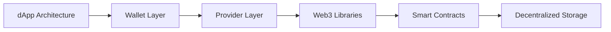

# Chapter 7: Decentralized Applications (dApps)

> **Previous:** [Chapter 6: Smart Contract Development](./06-solidity.md) | **Next:** [Chapter 8: Decentralized Finance (DeFi)](./08-defi.md)

---

## Learning Objectives

- Define the architecture of a Decentralized Application (dApp)
- Explain the role of a "Provider" and a "Wallet" in the user experience
- Describe the front-end interaction with smart contracts using `ethers.js` or `web3.js`
- Understand decentralized storage solutions like IPFS
- Contrast the dApp architecture with traditional client-server models

## Chapter at a Glance

| Topic | Key Insight | Practical Takeaway |
|-------|-------------|--------------------|
| dApp Stack | Frontend + Wallet + Provider + Blockchain | Wallet replaces server-side auth |
| Providers | Infura, Alchemy connect frontend to blockchain | No need to run your own node |
| Web3 Libraries | ethers.js / web3.js for contract interaction | Read is free, write costs gas |
| IPFS | Content-addressed decentralized storage | Files accessed by hash, not location |
| SSI | Wallet address = user identity | No passwords, no central database |

## Chapter Roadmap



---

## Theory

### The dApp Stack
A traditional app uses: `Frontend -> API -> Centralized Database`.
A dApp uses: `Frontend -> Provider/Wallet -> Blockchain (Smart Contracts)`.
Key components:
1. **Frontend:** React, Vue, or Angular.
2. **Wallet (e.g., MetaMask):** Manages private keys and signs transactions.
3. **Provider (e.g., Infura, Alchemy):** An interface to talk to the blockchain nodes.
4. **Decentralized Storage:** Since storing files on a blockchain is too expensive, metadata and assets are stored on systems like **IPFS (InterPlanetary File System)**.


### Web3 Libraries
Libraries like `ethers.js` or `web3.js` allow the frontend to:
- Connect to a wallet.
- Read data from smart contracts (Free).
- Send transactions to smart contracts (Requires Gas).

### Decentralized Identifiers (DID)
In dApps, the user's "Login" is their wallet address. This is the foundation of **Self-Sovereign Identity (SSI)**. The user owns their data and their session.

---

## Examples

### Example 1: Reading Contract State
```javascript
import { ethers } from "ethers";

const provider = new ethers.providers.Web3Provider(window.ethereum);
const contractAddress = "0x...";
const abi = [...]; // Contract interface
const contract = new ethers.Contract(contractAddress, abi, provider);

async function getBalance() {
    const balance = await contract.balanceOf("0xAliceAddress");
    console.log("Balance:", ethers.utils.formatEther(balance));
}
```
This example shows how a frontend can fetch a user's token balance without needing a centralized backend.

### Example 2: Uploading to IPFS
1. A user uploads an image.
2. The image is hashed. The hash (CID) looks like `Qm...`.
3. The CID is stored in a smart contract.
4. Anyone with the CID can retrieve the image from the IPFS network.
This ensures that the image is **content-addressed**, meaning the link never changes as long as the content is the same.

> **One-Sentence Takeaway:** In a dApp, the user's wallet is both their identity (authentication) and their signing key (authorization) — there is no backend session, no password reset, and no central authority controlling access.

> **Pro Tip:** When building a dApp frontend, handle the "no wallet" and "wrong network" states explicitly. A blank screen when MetaMask isn't installed is the #1 UX failure in new dApps.

> **Warning:** IPFS does not guarantee availability — content is only accessible if at least one node is pinning the data. Use a pinning service (Pinata, web3.storage) to ensure your dApp's data persists.

---

## Concept Comparison Table

| Concept | Definition | Key Distinction | Use Case |
|---------|-----------|-----------------|----------|
| Web2 Architecture | Frontend → API → Centralized DB | Server controls data and identity | Social media, banking |
| dApp Architecture | Frontend → Provider → Blockchain | User controls keys and data | DeFi, NFTs |
| MetaMask | Browser wallet extension | Injects window.ethereum provider | Transaction signing, identity |
| Infura/Alchemy | Node-as-a-Service providers | No need to sync full blockchain | dApp backend connectivity |
| IPFS | Content-addressed P2P file system | Files addressed by CID, not URL | NFT metadata, dApp content |

## Quick Reference

| Category | Key Concepts | Notes |
|----------|-------------|-------|
| **dApp Stack** | Frontend + Wallet + Provider + Blockchain | No backend server needed |
| **Wallet** | MetaMask, WalletConnect, Coinbase Wallet | Manages private keys, signs txs |
| **Provider** | JSON-RPC (Infura, Alchemy, QuickNode) | Read operations are free |
| **IPFS** | CID (Qm...), Gateway (ipfs.io), Pinning | Content addressing, not location addressing |
| **ENS** | john.eth → 0xabc... | Human-readable addresses |

## Cross-Application Matrix

| Technique | DeFi | Smart Contracts | Enterprise Blockchain | Research |
|-----------|------|-----------------|----------------------|----------|
| Wallet Integration | Swap UI | Contract interaction | Identity management | Account abstraction |
| Provider | Price feeds | Event listening | Node-as-a-Service | Decentralized RPC |
| IPFS | NFT metadata | Contract verification audit trails | Document storage | Permanence studies |
| ENS | dApp domains | Contract naming | Enterprise identity | Domain squating prevention |
| ethers.js | Balance display | Contract reads | Chaincode SDK | Library benchmarks |

## Chapter Quiz

1. Why does a dApp use a "Provider" like Infura instead of running its own blockchain node?
   - A) Infura is more secure than running a node
   - B) Running a full node is resource-intensive; Infura provides API access without syncing the chain
   - C) Infura provides free ETH
   - D) A node cannot read smart contract data

<details>
<summary>Answer</summary>
**B) Running a full node is resource-intensive; Infura provides API access without syncing the chain.** A full Ethereum node requires terabytes of storage and constant synchronization. Providers abstract this away with simple REST API access.
</details>

2. How does a dApp authenticate a user without a centralized login system?
   - A) By asking for a username and password
   - B) By having the user sign a message with their wallet's private key
   - C) By storing the user's email in the blockchain
   - D) By using cookies

<details>
<summary>Answer</summary>
**B) By having the user sign a message with their wallet's private key.** The dApp requests a cryptographic signature (EIP-4361 / Sign in with Ethereum), which proves the user controls the claimed address without revealing their private key.
</details>

3. What happens if the only node pinning your IPFS content goes offline?
   - A) The content becomes permanently lost
   - B) The content is inaccessible until a node with that CID comes back online
   - C) The content automatically replicates to other nodes
   - D) IPFS returns a 404 error

<details>
<summary>Answer</summary>
**B) The content is inaccessible until a node with that CID comes back online.** IPFS does not guarantee persistence — content availability depends on at least one node hosting it. This is why pinning services exist.
</details>

## Summary

## Summary

- dApps remove central points of control and failure by utilizing blockchain and P2P storage.
- The wallet is the gateway for user authentication and transaction signing.
- Web3 libraries provide the necessary bridge between standard web technologies and blockchain protocols.
- IPFS is a critical component for storing large-scale data that cannot fit on-chain.
- The shift from Web2 to Web3 is characterized by user ownership of identity and assets.

---

## Exercises

### Review Questions
1. Why is a wallet like MetaMask necessary for a dApp?
2. What is a "JSON-RPC Provider"?
3. Explain "Content Addressing" in the context of IPFS.
4. How does a dApp handle "User Sign-up"?

### Application Problems
1. Diagram the flow of data when a user buys an NFT in a dApp.
2. Compare the cost and performance of storing 1MB of data on Ethereum vs. IPFS.
3. Describe how you would implement "Access Control" in a dApp frontend using a user's wallet address.

### Challenge Problem
1. Evaluate the "User Onboarding" problem in dApps and propose a solution that maintains decentralization while improving UX for non-technical users.
