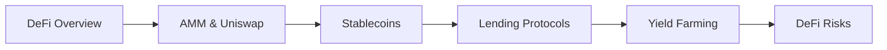

# Chapter 8: Decentralized Finance (DeFi)

> **Previous:** [Chapter 7: Decentralized Applications (dApps)](./07-dapps.md) | **Next:** [Chapter 9: Enterprise Blockchain](./09-enterprise.md)

---

## Learning Objectives

- Explain the core components of the DeFi ecosystem
- Understand the mechanics of Automated Market Makers (AMM) like Uniswap
- Describe the role of Stablecoins (Fiat-backed vs. Algorithmic)
- Analyze the concepts of Yield Farming and Liquidity Provision
- Identify the risks associated with DeFi, including "Impermanent Loss" and "Flash Loan" attacks

## Chapter at a Glance

| Topic | Key Insight | Practical Takeaway |
|-------|-------------|--------------------|
| DeFi Ecosystem | Financial services without intermediaries | Built entirely on smart contracts |
| AMMs | x × y = k constant product formula | No order book needed, but price slippage |
| Stablecoins | Fiat-backed, crypto-collateralized, algorithmic | Each type has different trust assumptions |
| Yield Farming | Moving assets across protocols for returns | High risk, potential impermanent loss |
| Flash Loans | Uncollateralized loans within one transaction | Powerful tool; also exploited in attacks |

## Chapter Roadmap

---

## Theory

### What is DeFi?
DeFi is an ecosystem of financial applications built on top of blockchain networks. It aims to recreate traditional financial services (Lending, Borrowing, Trading, Insurance) in a decentralized, permissionless, and transparent manner.

### Automated Market Makers (AMM)
AMMs replace traditional order books. Instead of matching buyers and sellers, users trade against a **Liquidity Pool**.
- **Constant Product Formula:** $x \times y = k$.
- $x$ and $y$ are the quantities of two tokens in the pool.
- $k$ must remain constant. If you buy $x$, its price increases because its quantity in the pool decreases.

### Stablecoins
Stablecoins provide a price-stable asset in a volatile market.
1. **Fiat-Backed (e.g., USDC, USDT):** Centralized companies hold USD in a bank for every token issued.
2. **Crypto-Collateralized (e.g., DAI):** Over-collateralized by other crypto assets.
3. **Algorithmic:** Use supply/demand mechanisms to maintain a peg (High risk).

### Yield and Liquidity
- **Liquidity Providers (LPs):** Users who add funds to a pool. They earn a share of the transaction fees.
- **Yield Farming:** The process of moving assets across different protocols to maximize returns.

---

## Examples

### Example 1: Trading on Uniswap
A pool has 10 ETH and 10,000 USDC. $k = 10 \times 10,000 = 100,000$.
Alice wants to sell 1 ETH.
1. New ETH quantity = 11.
2. New USDC quantity = $100,000 / 11 \approx 9,090.9$.
3. Alice receives $10,000 - 9,090.9 = 909.1$ USDC.
The price of ETH "slipped" during the trade.

### Example 2: Collateralized Debt Position (CDP)
1. Alice locks 1 ETH (Price: $2,000) as collateral in a protocol like MakerDAO.
2. The protocol requires a 150% collateral ratio.
3. Alice can borrow a maximum of $2,000 / 1.5 = 1,333$ DAI.
4. If the price of ETH drops to $1,500, Alice's position is **Liquidated** to ensure the protocol remains solvent.

> **One-Sentence Takeaway:** DeFi composability means any protocol can plug into any other like Lego bricks — but this also means a vulnerability in one contract can cascade across the entire ecosystem.

> **Pro Tip:** When providing liquidity to an AMM, use a calculator to estimate impermanent loss before depositing. For a 2x price change, impermanent loss is ~5.7%; for 5x, it's ~25.5%.

> **Warning:** Algorithmic stablecoins are experimental and have repeatedly proven unstable. The collapse of UST ($40B+ loss) demonstrated that algorithm-only pegs without sufficient collateral are fragile.

---

## Concept Comparison Table

| Concept | Definition | Key Distinction | Use Case |
|---------|-----------|-----------------|----------|
| AMM (Uniswap) | x × y = k constant product | No order book, infinite liquidity | Token swaps |
| Order Book (CEX) | Buy/sell limit orders | Better price discovery | Professional trading |
| DAI | Crypto-collateralized stablecoin | Over-collateralized, decentralized | Lending, stable savings |
| USDC | Fiat-backed stablecoin | Centralized, audited reserves | Payments, trading pairs |
| Yield Farming | Moving liquidity for rewards | High APY but high risk | Liquidity incentives |
| Flash Loan | Borrow/repay in same block | Uncollateralized, atomic | Arbitrage, liquidations |

## Quick Reference

| Category | Key Concepts | Notes |
|----------|-------------|-------|
| **AMM Formula** | x × y = k | Larger pools = less slippage |
| **Impermanent Loss** | Loss vs holding during price divergence | 2x change = 5.7% IL |
| **Stablecoin Types** | Fiat-backed, crypto-collateralized, algorithmic | Different trust and risk profiles |
| **Lending** | Over-collateralization, liquidation, health factor | Typically 120-150% collateral ratio |
| **DeFi Risks** | Smart contract bugs, oracle manipulation, IL, liquidation | Composable risk = systemic risk |

## Cross-Application Matrix

| Technique | DeFi | Smart Contracts | Enterprise Blockchain | Research |
|-----------|------|-----------------|----------------------|----------|
| AMM | Token swaps | N/A | Settlement channels | AMM efficiency models |
| Lending | Compound, Aave | Collateral contracts | B2B lending | Risk models |
| Stablecoins | Trading pairs, yield | Payment contracts | Cross-border settlement | Peg stability research |
| Flash Loans | Arbitrage, liquidations | Atomic execution | N/A | MEV analysis |
| Yield Farming | LP incentives | Reward distribution | N/A | Tokenomics design |

## Chapter Quiz

1. What is the impermanent loss if a token pair price ratio changes by 4x from the time of deposit?
   - A) 0%
   - B) ~20%
   - C) ~25.5%
   - D) ~50%

Answer

**B) ~20%.** The formula for impermanent loss is (2√r)/(1+r) - 1 where r is the price ratio. For r=4, IL ≈ 20%. For comparison, 2x → 5.7%, 3x → 13.4%, 5x → 25.5%.

2. Why must flash loans be repaid in the same transaction?
   - A) Because interest is calculated per block
   - B) Because Ethereum atomicity guarantees the entire tx succeeds or reverts
   - C) Because flash lenders don't trust borrowers
   - D) Because each block has a gas limit

Answer

**B) Because Ethereum atomicity guarantees the entire tx succeeds or reverts.** If the flash loan isn't repaid by the end of the transaction, the entire transaction reverts — including the loan. This makes them trustless.

3. What is the primary risk of an algorithmic stablecoin?
   - A) The company behind it can steal funds
   - B) A death spiral where price depeg triggers further selling
   - C) High transaction fees
   - D) Regulatory compliance

Answer

**B) A death spiral where price depeg triggers further selling.** Algorithmic stablecoins rely on arbitrage to maintain their peg. If confidence breaks, the arbitrage mechanism can reverse, causing a cascading devaluation (as seen with UST/LUNA).

## Summary

## Summary

- DeFi provides financial services without intermediaries through smart contracts.
- AMMs enable permissionless trading through liquidity pools and mathematical formulas.
- Stablecoins are the "Liquidity" of the DeFi ecosystem, bridging the gap with fiat.
- LPs earn fees but face the risk of Impermanent Loss when token prices diverge.
- DeFi protocols are "Composable" (Money Legos), allowing complex financial structures to be built.

---

## Exercises

### Review Questions
1. Explain the constant product formula ($x \times y = k$).
2. What is "Impermanent Loss"?
3. Define "Over-collateralization".
4. How do decentralized Oracles (like Chainlink) help DeFi protocols?

### Application Problems
1. If an ETH/USDC pool has 100 ETH and 200,000 USDC, calculate the price of 1 ETH.
2. A protocol has a 120% collateral requirement. If you have $500 worth of collateral, how much can you borrow?
3. Discuss the impact of a "Flash Loan" where an attacker borrows $100M, manipulates a price, and repays the loan in a single transaction.

### Challenge Problem
1. Evaluate the sustainability of high-yield farming protocols (APY > 1000%) and identify the characteristics of a "Ponzi" structure in DeFi.
