# Chapter 8: Decentralized Finance (DeFi)

> **Previous:** [Chapter 7: Decentralized Applications (dApps)](./07-dapps.md) | **Next:** [Chapter 9: Enterprise Blockchain](./09-enterprise.md)

---

## Learning Objectives

- Explain the core components of the DeFi ecosystem (AMMs, lending, yield farming)
- Understand Automated Market Makers and the constant product formula
- Describe stablecoin types and their risk profiles
- Analyze yield farming strategies and impermanent loss
- Explain flash loan mechanics and their dual nature (tool vs weapon)
- Understand DAO governance models and treasury management
- Describe NFT standards, marketplaces, and use cases
- Identify DeFi risks including oracle manipulation, liquidation, and smart contract bugs

## Chapter at a Glance

| Topic | Key Insight | Practical Takeaway |
|-------|-------------|--------------------|
| DeFi Ecosystem | Financial services without intermediaries | Built entirely on smart contracts |
| AMMs | x × y = k constant product formula | No order book needed, but price slippage |
| Stablecoins | Fiat-backed, crypto-collateralized, algorithmic | Each type has different trust assumptions |
| Yield Farming | Moving assets across protocols for returns | High APY but high risk, impermanent loss |
| Flash Loans | Uncollateralized loans within one transaction | Powerful tool; also exploited in attacks |
| DAOs | Decentralized autonomous organizations | Token-based governance and voting |
| NFTs | Non-fungible tokens for digital ownership | Art, music, gaming, real-world assets |

## Chapter Roadmap

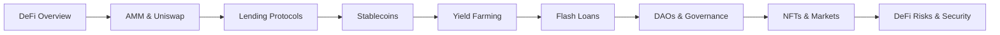

---

## Theory

### What is DeFi?

<a href="../../assets/images/diagrams/blockchain/08-defi/what-is-defi-handwritten.svg" target="_blank" rel="noopener">
  
</a>
<a href="../../assets/images/diagrams/blockchain/08-defi/what-is-defi-diagram.svg" target="_blank" rel="noopener">
  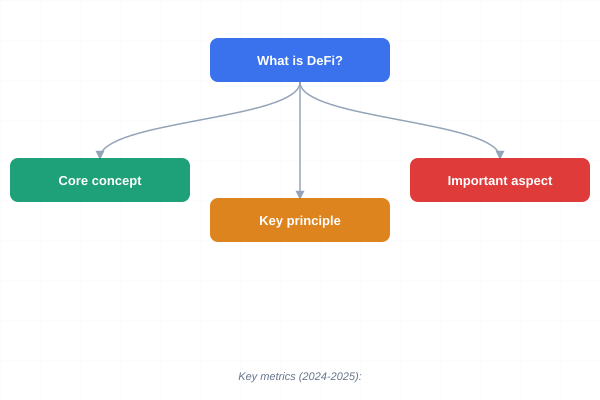
</a>
<a href="../../assets/images/diagrams/blockchain/08-defi/what-is-defi-sticky.svg" target="_blank" rel="noopener">
  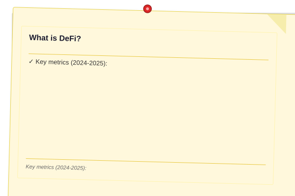
</a>


<a href="../../assets/images/diagrams/blockchain/08-defi/what-is-defi-handwritten.svg" target="_blank" rel="noopener">
  
</a>
<a href="../../assets/images/diagrams/blockchain/08-defi/what-is-defi-diagram.svg" target="_blank" rel="noopener">
  
</a>
<a href="../../assets/images/diagrams/blockchain/08-defi/what-is-defi-sticky.svg" target="_blank" rel="noopener">
  
</a>


<a href="../../assets/images/diagrams/blockchain/08-defi/what-is-defi-handwritten.svg" target="_blank" rel="noopener">
  
</a>
<a href="../../assets/images/diagrams/blockchain/08-defi/what-is-defi-diagram.svg" target="_blank" rel="noopener">
  
</a>
<a href="../../assets/images/diagrams/blockchain/08-defi/what-is-defi-sticky.svg" target="_blank" rel="noopener">
  
</a>


DeFi is an ecosystem of financial applications built on top of blockchain networks. It aims to recreate traditional financial services (Lending, Borrowing, Trading, Insurance) in a decentralized, permissionless, and transparent manner.

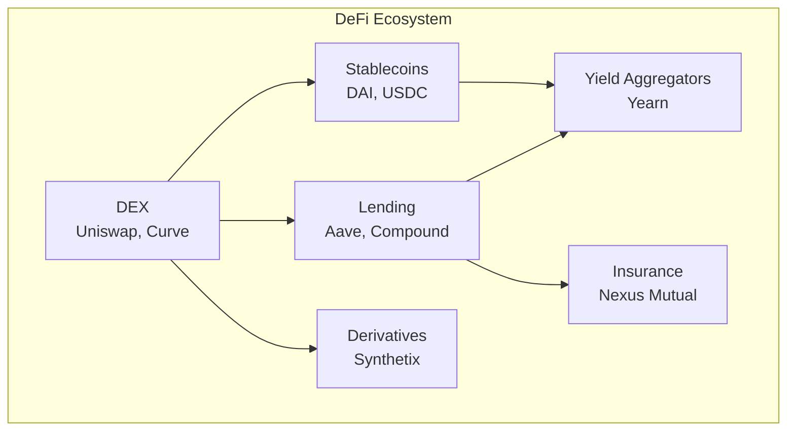

**Key metrics (2024-2025):**
- Total Value Locked (TVL): $50-100B+
- Daily DEX volume: $5-15B
- Active DeFi users: 5-10M+
- Major chains: Ethereum, Solana, Arbitrum, Optimism, Base

### Automated Market Makers (AMM)

<a href="../../assets/images/diagrams/blockchain/08-defi/automated-market-makers-amm-handwritten.svg" target="_blank" rel="noopener">
  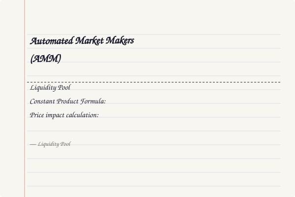
</a>
<a href="../../assets/images/diagrams/blockchain/08-defi/automated-market-makers-amm-diagram.svg" target="_blank" rel="noopener">
  
</a>
<a href="../../assets/images/diagrams/blockchain/08-defi/automated-market-makers-amm-sticky.svg" target="_blank" rel="noopener">
  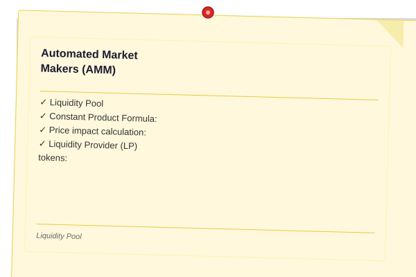
</a>


<a href="../../assets/images/diagrams/blockchain/08-defi/automated-market-makers-amm-handwritten.svg" target="_blank" rel="noopener">
  
</a>
<a href="../../assets/images/diagrams/blockchain/08-defi/automated-market-makers-amm-diagram.svg" target="_blank" rel="noopener">
  
</a>
<a href="../../assets/images/diagrams/blockchain/08-defi/automated-market-makers-amm-sticky.svg" target="_blank" rel="noopener">
  
</a>


<a href="../../assets/images/diagrams/blockchain/08-defi/automated-market-makers-amm-handwritten.svg" target="_blank" rel="noopener">
  
</a>
<a href="../../assets/images/diagrams/blockchain/08-defi/automated-market-makers-amm-diagram.svg" target="_blank" rel="noopener">
  
</a>
<a href="../../assets/images/diagrams/blockchain/08-defi/automated-market-makers-amm-sticky.svg" target="_blank" rel="noopener">
  
</a>


AMMs replace traditional order books. Instead of matching buyers and sellers, users trade against a **Liquidity Pool**.

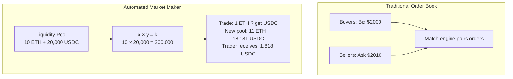

**Constant Product Formula:** `x × y = k`
- `x` and `y` are the quantities of two tokens in the pool
- `k` must remain constant
- If you buy `x`, its price increases (because its quantity in the pool decreases)

**Price impact calculation:**
```typescript
function calculateOutput(
    inputAmount: number,
    inputReserve: number,
    outputReserve: number
): number {
    // Constant product: x * y = k
    // New input reserve: inputReserve + inputAmount
    // New output reserve: k / (inputReserve + inputAmount)
    // Output = outputReserve - new output reserve
    const inputWithFee = inputAmount * 0.997;  // 0.3% fee
    const k = inputReserve * outputReserve;
    const newInputReserve = inputReserve + inputWithFee;
    const newOutputReserve = k / newInputReserve;
    return outputReserve - newOutputReserve;
}

// Example: ETH/USDC pool (10 ETH, 20,000 USDC)
const output = calculateOutput(1, 10, 20000);
console.log(`1 ETH ? ${output.toFixed(2)} USDC`);  // ~1,818 USDC (slippage of ~9%)
```

**Liquidity Provider (LP) tokens:** When you deposit tokens into a pool, you receive LP tokens representing your share. You earn fees from trades.

### Impermanent Loss

<a href="../../assets/images/diagrams/blockchain/08-defi/impermanent-loss-handwritten.svg" target="_blank" rel="noopener">
  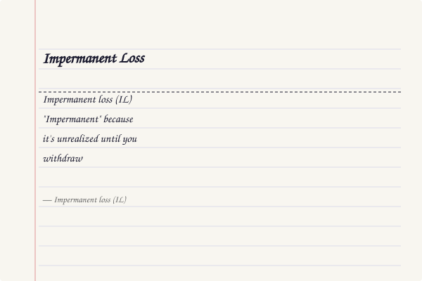
</a>
<a href="../../assets/images/diagrams/blockchain/08-defi/impermanent-loss-diagram.svg" target="_blank" rel="noopener">
  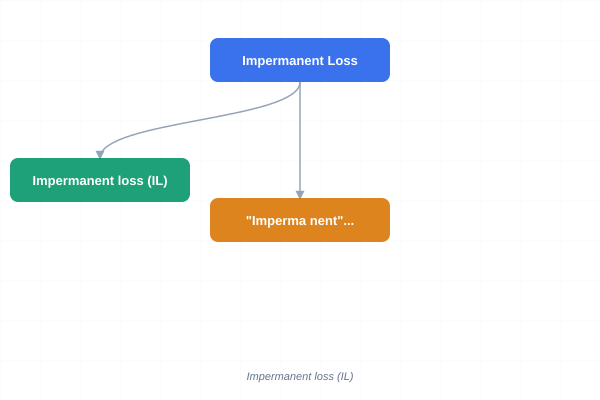
</a>
<a href="../../assets/images/diagrams/blockchain/08-defi/impermanent-loss-sticky.svg" target="_blank" rel="noopener">
  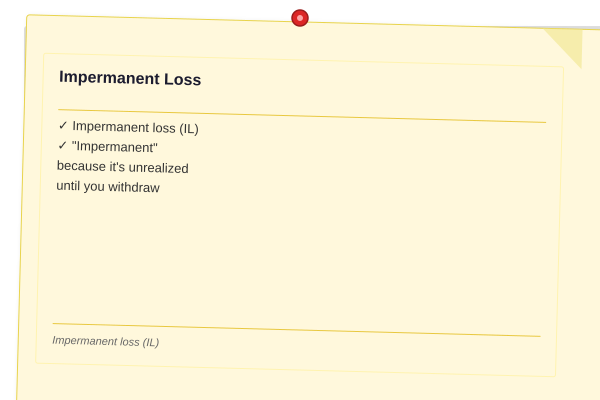
</a>


<a href="../../assets/images/diagrams/blockchain/08-defi/impermanent-loss-handwritten.svg" target="_blank" rel="noopener">
  
</a>
<a href="../../assets/images/diagrams/blockchain/08-defi/impermanent-loss-diagram.svg" target="_blank" rel="noopener">
  
</a>
<a href="../../assets/images/diagrams/blockchain/08-defi/impermanent-loss-sticky.svg" target="_blank" rel="noopener">
  
</a>


<a href="../../assets/images/diagrams/blockchain/08-defi/impermanent-loss-handwritten.svg" target="_blank" rel="noopener">
  
</a>
<a href="../../assets/images/diagrams/blockchain/08-defi/impermanent-loss-diagram.svg" target="_blank" rel="noopener">
  
</a>
<a href="../../assets/images/diagrams/blockchain/08-defi/impermanent-loss-sticky.svg" target="_blank" rel="noopener">
  
</a>


**Impermanent loss (IL)** occurs when the price ratio of deposited tokens changes compared to when you deposited them. "Impermanent" because it's unrealized until you withdraw.

```typescript
function calculateImpermanentLoss(priceRatio: number): number {
    // priceRatio = current price / initial price
    // IL = 2*sqrt(r)/(1+r) - 1
    const sqrtR = Math.sqrt(priceRatio);
    return (2 * sqrtR) / (1 + priceRatio) - 1;
}

const losses = [1, 1.25, 1.5, 2, 3, 4, 5];
for (const r of losses) {
    const il = calculateImpermanentLoss(r);
    console.log(`${r}x price change ? IL: ${(il * 100).toFixed(2)}%`);
}
// 1x  ? IL: 0%
// 1.25x ? IL: ~0.6%
// 1.5x ? IL: ~2.0%
// 2x  ? IL: ~5.7%
// 3x  ? IL: ~13.4%
// 4x  ? IL: ~20.0%
// 5x  ? IL: ~25.5%
```

### Lending Protocols

<a href="../../assets/images/diagrams/blockchain/08-defi/lending-protocols-handwritten.svg" target="_blank" rel="noopener">
  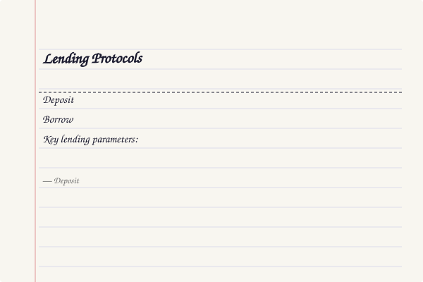
</a>
<a href="../../assets/images/diagrams/blockchain/08-defi/lending-protocols-diagram.svg" target="_blank" rel="noopener">
  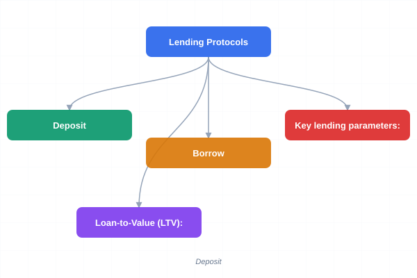
</a>
<a href="../../assets/images/diagrams/blockchain/08-defi/lending-protocols-sticky.svg" target="_blank" rel="noopener">
  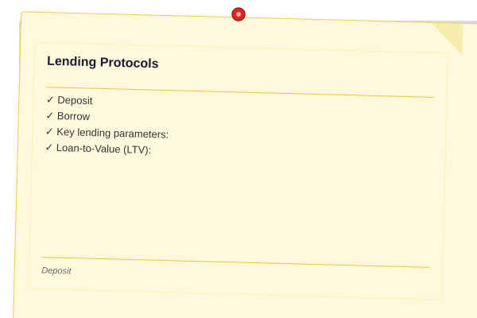
</a>


<a href="../../assets/images/diagrams/blockchain/08-defi/lending-protocols-handwritten.svg" target="_blank" rel="noopener">
  
</a>
<a href="../../assets/images/diagrams/blockchain/08-defi/lending-protocols-diagram.svg" target="_blank" rel="noopener">
  
</a>
<a href="../../assets/images/diagrams/blockchain/08-defi/lending-protocols-sticky.svg" target="_blank" rel="noopener">
  
</a>


<a href="../../assets/images/diagrams/blockchain/08-defi/lending-protocols-handwritten.svg" target="_blank" rel="noopener">
  
</a>
<a href="../../assets/images/diagrams/blockchain/08-defi/lending-protocols-diagram.svg" target="_blank" rel="noopener">
  
</a>
<a href="../../assets/images/diagrams/blockchain/08-defi/lending-protocols-sticky.svg" target="_blank" rel="noopener">
  
</a>


Protocols like Aave and Compound allow users to:
- **Deposit** assets to earn interest (supply side)
- **Borrow** assets by over-collateralizing (borrow side)

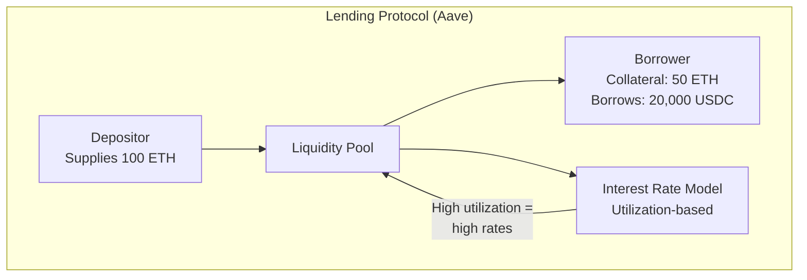

**Key lending parameters:**
- **Loan-to-Value (LTV):** Maximum % you can borrow (e.g., 75% for ETH)
- **Liquidation Threshold:** Price level at which position is liquidated (e.g., 82.5%)
- **Health Factor:** `collateral * price / (borrowed * liquidationThreshold)`
- **Liquidation Penalty:** Extra fee paid to liquidators (e.g., 5-10%)

```typescript
interface LendingPosition {
    collateral: { token: string; amount: number; price: number };
    borrowed: { token: string; amount: number; price: number };
    ltv: number;         // e.g., 0.75 (75%)
    liquidationThreshold: number;  // e.g., 0.825 (82.5%)
}

function calculateHealthFactor(position: LendingPosition): number {
    const collateralValue = position.collateral.amount * position.collateral.price;
    const borrowedValue = position.borrowed.amount * position.borrowed.price;
    return (collateralValue * position.liquidationThreshold) / borrowedValue;
}

// Example: Alice deposits $100K ETH, borrows $60K USDC
const alicePosition: LendingPosition = {
    collateral: { token: "ETH", amount: 50, price: 2000 },
    borrowed: { token: "USDC", amount: 60000, price: 1 },
    ltv: 0.75,
    liquidationThreshold: 0.825,
};

console.log(calculateHealthFactor(alicePosition));  // 1.375
// If ETH drops to $1,500:
// collat.value = $75K, HF = (75K * 0.825) / 60K = 1.03 — close to liquidation!
```

### Stablecoin Types

<a href="../../assets/images/diagrams/blockchain/08-defi/stablecoin-types-handwritten.svg" target="_blank" rel="noopener">
  
</a>
<a href="../../assets/images/diagrams/blockchain/08-defi/stablecoin-types-diagram.svg" target="_blank" rel="noopener">
  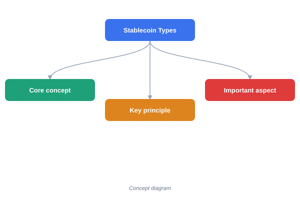
</a>
<a href="../../assets/images/diagrams/blockchain/08-defi/stablecoin-types-sticky.svg" target="_blank" rel="noopener">
  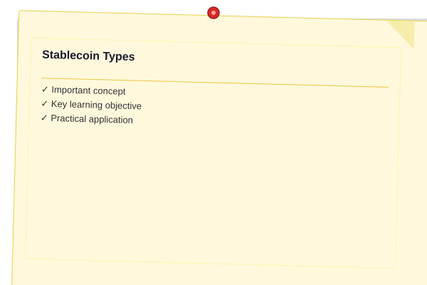
</a>


<a href="../../assets/images/diagrams/blockchain/08-defi/stablecoin-types-handwritten.svg" target="_blank" rel="noopener">
  
</a>
<a href="../../assets/images/diagrams/blockchain/08-defi/stablecoin-types-diagram.svg" target="_blank" rel="noopener">
  
</a>
<a href="../../assets/images/diagrams/blockchain/08-defi/stablecoin-types-sticky.svg" target="_blank" rel="noopener">
  
</a>


<a href="../../assets/images/diagrams/blockchain/08-defi/stablecoin-types-handwritten.svg" target="_blank" rel="noopener">
  
</a>
<a href="../../assets/images/diagrams/blockchain/08-defi/stablecoin-types-diagram.svg" target="_blank" rel="noopener">
  
</a>
<a href="../../assets/images/diagrams/blockchain/08-defi/stablecoin-types-sticky.svg" target="_blank" rel="noopener">
  
</a>


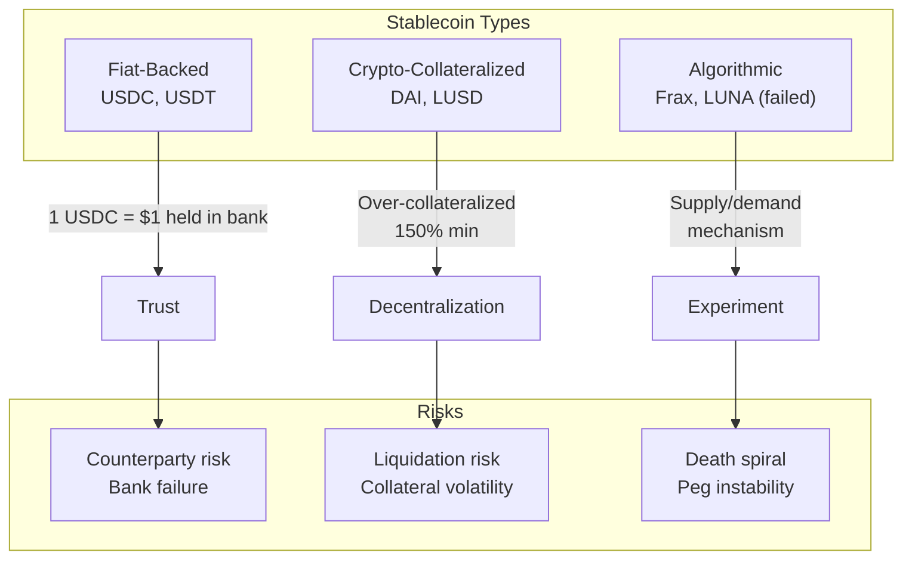

| Type | Example | Collateral | Peg Mechanism | Risk |
|------|---------|-----------|---------------|------|
| Fiat-backed | USDC, USDT | USD reserves in bank | 1:1 redemption | Bank failure, regulatory |
| Crypto-collateralized | DAI | ETH, stETH over-collateralized | CDP + arbitrage | Collateral volatility |
| Algorithmic | FRAX | Partial + algorithm | AMO + arbitrage | Death spiral |
| Commodity-backed | PAXG | Gold | 1:1 gold redemption | Custody, audit |

### Yield Farming

<a href="../../assets/images/diagrams/blockchain/08-defi/yield-farming-handwritten.svg" target="_blank" rel="noopener">
  
</a>
<a href="../../assets/images/diagrams/blockchain/08-defi/yield-farming-diagram.svg" target="_blank" rel="noopener">
  
</a>
<a href="../../assets/images/diagrams/blockchain/08-defi/yield-farming-sticky.svg" target="_blank" rel="noopener">
  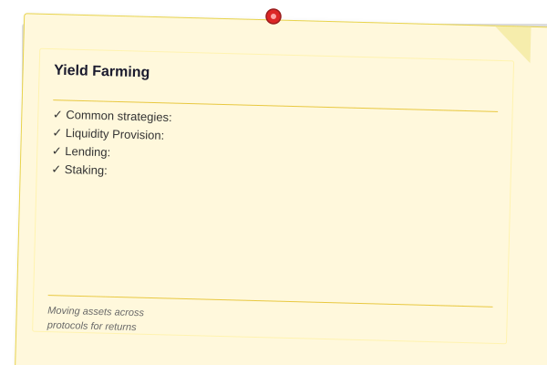
</a>


<a href="../../assets/images/diagrams/blockchain/08-defi/yield-farming-handwritten.svg" target="_blank" rel="noopener">
  
</a>
<a href="../../assets/images/diagrams/blockchain/08-defi/yield-farming-diagram.svg" target="_blank" rel="noopener">
  
</a>
<a href="../../assets/images/diagrams/blockchain/08-defi/yield-farming-sticky.svg" target="_blank" rel="noopener">
  
</a>


<a href="../../assets/images/diagrams/blockchain/08-defi/yield-farming-handwritten.svg" target="_blank" rel="noopener">
  
</a>
<a href="../../assets/images/diagrams/blockchain/08-defi/yield-farming-diagram.svg" target="_blank" rel="noopener">
  
</a>
<a href="../../assets/images/diagrams/blockchain/08-defi/yield-farming-sticky.svg" target="_blank" rel="noopener">
  
</a>


Yield farming is the practice of moving assets across DeFi protocols to maximize returns.

**Common strategies:**
1. **Liquidity Provision:** Deposit tokens into AMM pools ? earn trading fees + incentives
2. **Lending:** Supply assets to lending protocols ? earn interest + token rewards
3. **Staking:** Lock tokens in a protocol ? earn protocol fees + inflation rewards
4. **Auto-compounding:** Use vaults (Yearn) that automatically reinvest rewards

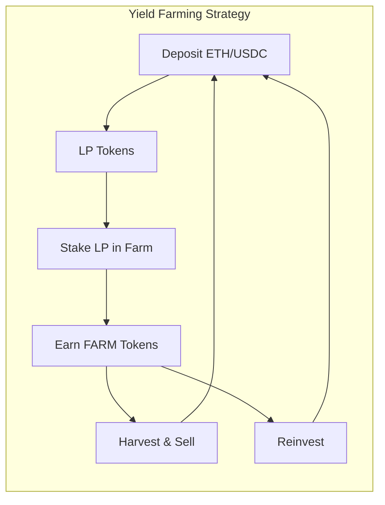

**Risks:**
- **Impermanent loss** (for AMM positions)
- **Smart contract risk** (hacks, bugs)
- **Protocol risk** (governance attacks, oracle manipulation)
- **Token price risk** (reward token value drops)
- **Rug pull** (developers drain liquidity)

### Flash Loans

<a href="../../assets/images/diagrams/blockchain/08-defi/flash-loans-handwritten.svg" target="_blank" rel="noopener">
  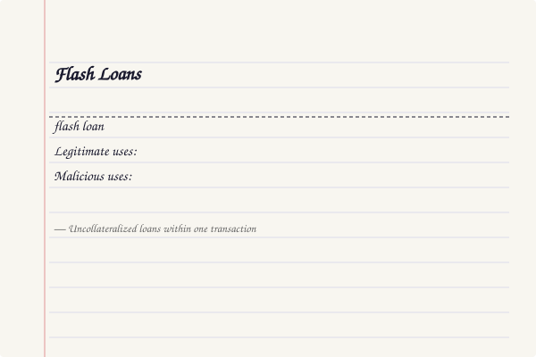
</a>
<a href="../../assets/images/diagrams/blockchain/08-defi/flash-loans-diagram.svg" target="_blank" rel="noopener">
  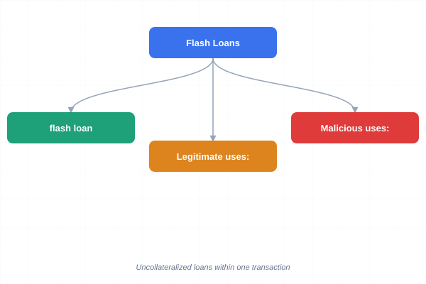
</a>
<a href="../../assets/images/diagrams/blockchain/08-defi/flash-loans-sticky.svg" target="_blank" rel="noopener">
  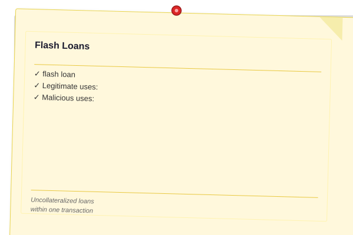
</a>


<a href="../../assets/images/diagrams/blockchain/08-defi/flash-loans-handwritten.svg" target="_blank" rel="noopener">
  
</a>
<a href="../../assets/images/diagrams/blockchain/08-defi/flash-loans-diagram.svg" target="_blank" rel="noopener">
  
</a>
<a href="../../assets/images/diagrams/blockchain/08-defi/flash-loans-sticky.svg" target="_blank" rel="noopener">
  
</a>


<a href="../../assets/images/diagrams/blockchain/08-defi/flash-loans-handwritten.svg" target="_blank" rel="noopener">
  
</a>
<a href="../../assets/images/diagrams/blockchain/08-defi/flash-loans-diagram.svg" target="_blank" rel="noopener">
  
</a>
<a href="../../assets/images/diagrams/blockchain/08-defi/flash-loans-sticky.svg" target="_blank" rel="noopener">
  
</a>


A **flash loan** allows borrowing any amount of cryptocurrency without collateral, as long as it's repaid within the same transaction. If not repaid, the entire transaction reverts (atomicity).

```typescript
interface FlashLoanCallback {
    executeOperation(
        assets: string[],
        amounts: bigint[],
        premiums: bigint[],
        initiator: address,
        params: bytes
    ): Promise<boolean>;
}

// Flash loan arbitrage example
async function executeFlashLoanArbitrage() {
    // 1. Borrow $10M USDC via flash loan
    // 2. Swap USDC ? ETH on DEX A (price: $2000)
    // 3. Swap ETH ? USDC on DEX B (price: $2020)
    // 4. Profit = 0.99% (minus fees)
    // 5. Repay flash loan + fee (~0.09%)
    // 6. Keep profit (~$90,000)
}
```

**Legitimate uses:**
- Arbitrage between DEXes (price differences)
- Liquidations (repay debt, seize collateral)
- Collateral swaps (change collateral type without closing position)
- Self-liquidation (avoid liquidation penalties)

**Malicious uses:**
- Price oracle manipulation
- Governance attacks
- Protocol draining (reentrancy + flash loans)

### DeFi Composability (Money Legos)

<a href="../../assets/images/diagrams/blockchain/08-defi/defi-composability-money-legos-handwritten.svg" target="_blank" rel="noopener">
  
</a>
<a href="../../assets/images/diagrams/blockchain/08-defi/defi-composability-money-legos-diagram.svg" target="_blank" rel="noopener">
  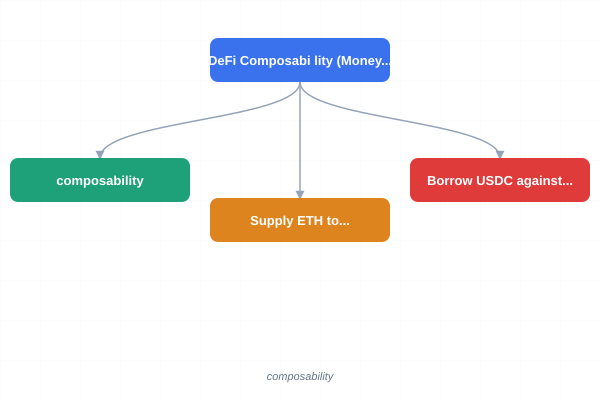
</a>
<a href="../../assets/images/diagrams/blockchain/08-defi/defi-composability-money-legos-sticky.svg" target="_blank" rel="noopener">
  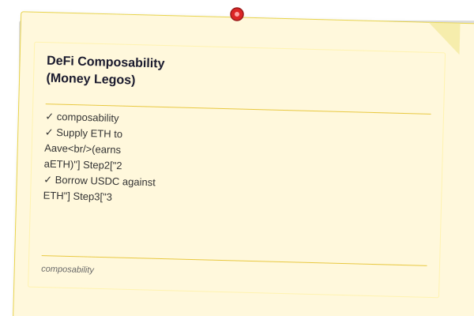
</a>


<a href="../../assets/images/diagrams/blockchain/08-defi/defi-composability-money-legos-handwritten.svg" target="_blank" rel="noopener">
  
</a>
<a href="../../assets/images/diagrams/blockchain/08-defi/defi-composability-money-legos-diagram.svg" target="_blank" rel="noopener">
  
</a>
<a href="../../assets/images/diagrams/blockchain/08-defi/defi-composability-money-legos-sticky.svg" target="_blank" rel="noopener">
  
</a>


<a href="../../assets/images/diagrams/blockchain/08-defi/defi-composability-money-legos-handwritten.svg" target="_blank" rel="noopener">
  
</a>
<a href="../../assets/images/diagrams/blockchain/08-defi/defi-composability-money-legos-diagram.svg" target="_blank" rel="noopener">
  
</a>
<a href="../../assets/images/diagrams/blockchain/08-defi/defi-composability-money-legos-sticky.svg" target="_blank" rel="noopener">
  
</a>


DeFi's power comes from **composability** — protocols can be combined like Lego bricks:

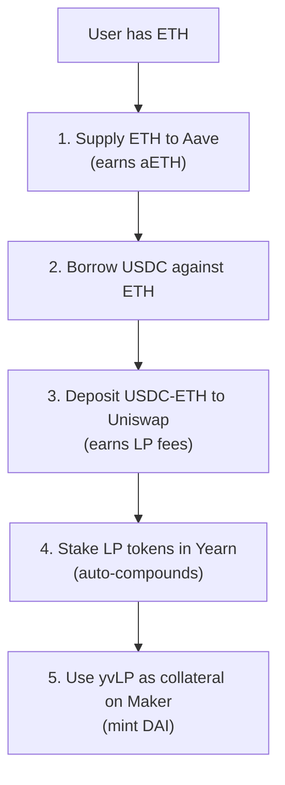

### DAO Governance

<a href="../../assets/images/diagrams/blockchain/08-defi/dao-governance-handwritten.svg" target="_blank" rel="noopener">
  
</a>
<a href="../../assets/images/diagrams/blockchain/08-defi/dao-governance-diagram.svg" target="_blank" rel="noopener">
  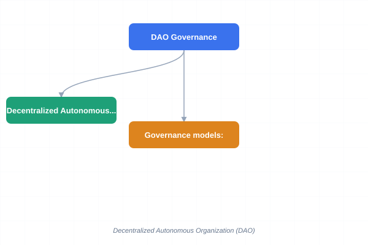
</a>
<a href="../../assets/images/diagrams/blockchain/08-defi/dao-governance-sticky.svg" target="_blank" rel="noopener">
  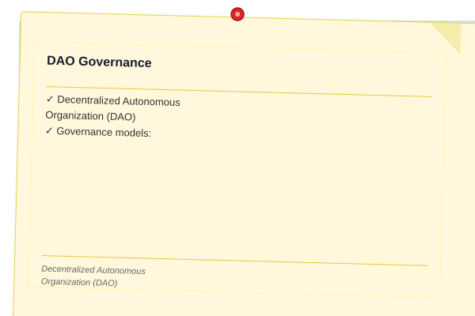
</a>


<a href="../../assets/images/diagrams/blockchain/08-defi/dao-governance-handwritten.svg" target="_blank" rel="noopener">
  
</a>
<a href="../../assets/images/diagrams/blockchain/08-defi/dao-governance-diagram.svg" target="_blank" rel="noopener">
  
</a>
<a href="../../assets/images/diagrams/blockchain/08-defi/dao-governance-sticky.svg" target="_blank" rel="noopener">
  
</a>


<a href="../../assets/images/diagrams/blockchain/08-defi/dao-governance-handwritten.svg" target="_blank" rel="noopener">
  
</a>
<a href="../../assets/images/diagrams/blockchain/08-defi/dao-governance-diagram.svg" target="_blank" rel="noopener">
  
</a>
<a href="../../assets/images/diagrams/blockchain/08-defi/dao-governance-sticky.svg" target="_blank" rel="noopener">
  
</a>


A **Decentralized Autonomous Organization (DAO)** is an organization governed by smart contracts and token voting.

**Governance models:**

| Model | Description | Example | Pros | Cons |
|-------|-------------|---------|------|------|
| Token-based | 1 token = 1 vote | Uniswap | Simple, aligned with economic stake | Plutocracy, whale dominance |
| Quadratic | Cost = votes² | Gitcoin | Better minority representation | Complex, Sybil-prone |
| Delegated | Delegate voting power | Compound | More informed voting | Potential delegate centralization |
| Multisig | M-of-N signers | Gnosis Safe | Fast execution | Trusted signers needed |

```typescript
interface Proposal {
    id: number;
    title: string;
    description: string;
    targets: string[];
    values: bigint[];
    calldatas: string[];
    proposer: string;
    startBlock: number;
    endBlock: number;
    forVotes: bigint;
    againstVotes: bigint;
    executed: boolean;
    canceled: boolean;
}

function calculateQuorum(
    forVotes: bigint,
    againstVotes: bigint,
    totalSupply: bigint
): boolean {
    const totalVotes = forVotes + againstVotes;
    const participation = Number(totalVotes) / Number(totalSupply);
    return participation >= 0.04;  // 4% quorum
}
```

### NFTs and Marketplaces

<a href="../../assets/images/diagrams/blockchain/08-defi/nfts-and-marketplaces-handwritten.svg" target="_blank" rel="noopener">
  
</a>
<a href="../../assets/images/diagrams/blockchain/08-defi/nfts-and-marketplaces-diagram.svg" target="_blank" rel="noopener">
  
</a>
<a href="../../assets/images/diagrams/blockchain/08-defi/nfts-and-marketplaces-sticky.svg" target="_blank" rel="noopener">
  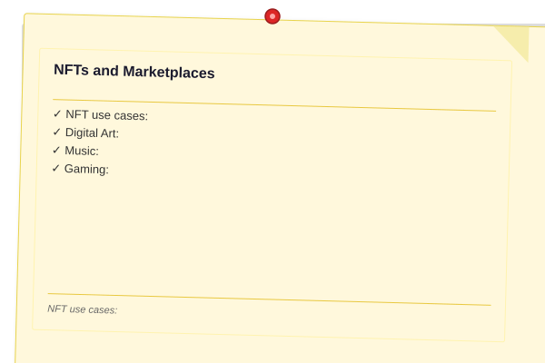
</a>


<a href="../../assets/images/diagrams/blockchain/08-defi/nfts-and-marketplaces-handwritten.svg" target="_blank" rel="noopener">
  
</a>
<a href="../../assets/images/diagrams/blockchain/08-defi/nfts-and-marketplaces-diagram.svg" target="_blank" rel="noopener">
  
</a>
<a href="../../assets/images/diagrams/blockchain/08-defi/nfts-and-marketplaces-sticky.svg" target="_blank" rel="noopener">
  
</a>


<a href="../../assets/images/diagrams/blockchain/08-defi/nfts-and-marketplaces-handwritten.svg" target="_blank" rel="noopener">
  
</a>
<a href="../../assets/images/diagrams/blockchain/08-defi/nfts-and-marketplaces-diagram.svg" target="_blank" rel="noopener">
  
</a>
<a href="../../assets/images/diagrams/blockchain/08-defi/nfts-and-marketplaces-sticky.svg" target="_blank" rel="noopener">
  
</a>


NFTs (Non-Fungible Tokens) represent unique digital assets on the blockchain.

**NFT use cases:**
- **Digital Art:** Beeple ($69M), Bored Ape Yacht Club
- **Music:** Royalty splits, concert tickets
- **Gaming:** In-game items, characters, land
- **Real World Assets:** Real estate deeds, luxury goods authentication
- **Identity:** POAPs (Proof of Attendance Protocol), reputation badges

**Marketplace mechanics:**
- List NFT for sale at fixed price
- Auction (English, Dutch)
- Royalty enforcement (creator gets % of secondary sales)
- Lazy minting (mint on first purchase to save gas)

### DeFi Risks

<a href="../../assets/images/diagrams/blockchain/08-defi/defi-risks-handwritten.svg" target="_blank" rel="noopener">
  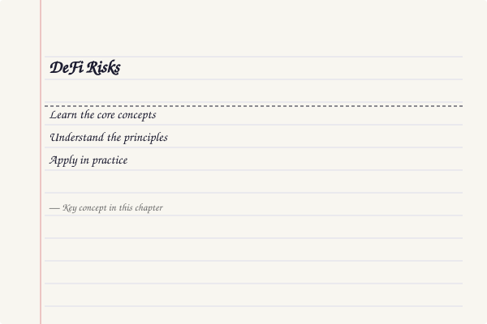
</a>
<a href="../../assets/images/diagrams/blockchain/08-defi/defi-risks-diagram.svg" target="_blank" rel="noopener">
  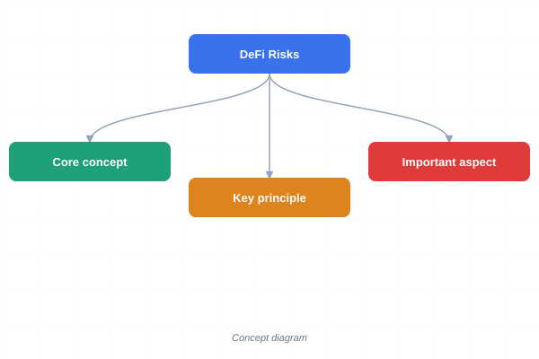
</a>
<a href="../../assets/images/diagrams/blockchain/08-defi/defi-risks-sticky.svg" target="_blank" rel="noopener">
  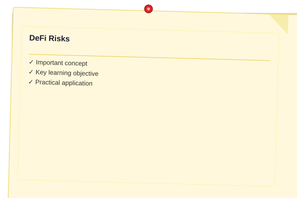
</a>


<a href="../../assets/images/diagrams/blockchain/08-defi/defi-risks-handwritten.svg" target="_blank" rel="noopener">
  
</a>
<a href="../../assets/images/diagrams/blockchain/08-defi/defi-risks-diagram.svg" target="_blank" rel="noopener">
  
</a>
<a href="../../assets/images/diagrams/blockchain/08-defi/defi-risks-sticky.svg" target="_blank" rel="noopener">
  
</a>


<a href="../../assets/images/diagrams/blockchain/08-defi/defi-risks-handwritten.svg" target="_blank" rel="noopener">
  
</a>
<a href="../../assets/images/diagrams/blockchain/08-defi/defi-risks-diagram.svg" target="_blank" rel="noopener">
  
</a>
<a href="../../assets/images/diagrams/blockchain/08-defi/defi-risks-sticky.svg" target="_blank" rel="noopener">
  
</a>


| Risk | Description | Example | Mitigation |
|------|-------------|---------|------------|
| Smart Contract Bug | Code vulnerability | The DAO hack ($60M) | Audits, formal verification, bug bounties |
| Oracle Manipulation | Manipulated price feed | Mango Markets ($115M) | TWAP oracles, multiple sources |
| Flash Loan Attack | Unc collateralized manipulation | Cream Finance ($130M) | Manipulation-resistant pricing |
| Impermanent Loss | Divergent token prices | All AMM LPs | Concentrated liquidity, single-sided staking |
| Liquidation | Collateral value drops | 3AC, Celsius | Conservative LTV, monitoring |
| Governance Attack | Malicious proposal | Beanstalk Farms ($182M) | Timelocks, emergency brakes |
| Regulatory | Legal action against protocol | Tornado Cash sanctions | Legal compliance, jurisdictional strategy |
| MEV | Front-running, sandwich attacks | All DEX users | Slippage protection, private mempools |

---

## Examples

### Example 1: Trading on Uniswap

A pool has 10 ETH and 20,000 USDC. `k = 10 × 20,000 = 200,000`.

Alice wants to sell 1 ETH.

1. New ETH quantity = 11 (10 + 1).
2. New USDC quantity = 200,000 / 11 ˜ 18,181.8.
3. With fee: `?y = y - (k / (x + ?x))` where ?x includes 0.3% fee.
4. With 0.997 multiplier: Alice receives ~1,818 USDC.
5. Price impact: Without AMM, 1 ETH = $2,000. Alice receives $1,818 — a slippage of ~9%.

```typescript
function uniswapTrade(
    inputAmount: number,
    inputReserve: number,
    outputReserve: number
): { output: number; slippage: number } {
    const fee = 0.003;  // 0.3%
    const inputWithFee = inputAmount * (1 - fee);
    const k = inputReserve * outputReserve;
    const newInputReserve = inputReserve + inputWithFee;
    const newOutputReserve = k / newInputReserve;
    const output = outputReserve - newOutputReserve;
    
    const effectivePrice = inputAmount / output;
    const spotPrice = inputReserve / outputReserve;
    const slippage = (effectivePrice - spotPrice) / spotPrice * 100;
    
    return { output, slippage };
}

const result = uniswapTrade(1, 10, 20000);
console.log(`Output: ${result.output.toFixed(2)} USDC`);
console.log(`Slippage: ${result.slippage.toFixed(2)}%`);
```

### Example 2: Collateralized Debt Position (CDP)

1. Alice locks 1 ETH (Price: $2,000) as collateral in MakerDAO.
2. The protocol requires a 150% collateral ratio.
3. Alice can borrow a maximum of $2,000 / 1.5 = $1,333 DAI.
4. If ETH drops to $1,500: health ratio = $1,500 / $1,333 = 1.125 = 112.5%.
5. At 110% ratio (liquidation threshold at ~$1,466), Alice's position is **liquidated**.
6. Liquidation fee (~13%) means Alice loses ~$190 of her ETH.

```typescript
function calculateCollateralRatio(
    collateralAmount: number,
    collateralPrice: number,
    borrowedAmount: number
): number {
    const collateralValue = collateralAmount * collateralPrice;
    return (collateralValue / borrowedAmount) * 100;
}

const ethPrice = 2000;
const ratio = calculateCollateralRatio(1, ethPrice, 1333);
console.log(`Collateral Ratio: ${ratio.toFixed(1)}%`);  // 150%
```

### Example 3: Impermanent Loss Simulation

```typescript
function simulateImpermanentLoss(
    initialEth: number,
    initialUsdc: number,
    ethPriceChange: number
): { hodl: number; lp: number; ilPercent: number } {
    const initialUsdcValue = initialUsdc;
    const initialEthValue = initialEth * (initialUsdc / initialEth) / 2;
    
    // HODL value = initial value × price change
    const hodlEthValue = initialEth * ethPriceChange;
    const hodlTotal = hodlEthValue + initialUsdcValue;
    
    // LP value at new ratio
    const sqrtR = Math.sqrt(ethPriceChange);
    const lpEthPortion = initialEth * sqrtR;
    const lpUsdcPortion = initialUsdc / sqrtR;
    const lpTotal = lpEthPortion + lpUsdcPortion;
    
    const ilPercent = ((lpTotal - hodlTotal) / hodlTotal) * 100;
    
    return { hodl: hodlTotal, lp: lpTotal, ilPercent };
}

// ETH doubles in price
const result = simulateImpermanentLoss(10, 20000, 2);
console.log(`HODL: $${result.hodl.toFixed(2)}`);
console.log(`LP: $${result.lp.toFixed(2)}`);
console.log(`IL: ${result.ilPercent.toFixed(2)}%`);  // ~-5.7%
```

> **One-Sentence Takeaway:** DeFi composability means any protocol can plug into any other like Lego bricks — but this also means a vulnerability in one contract can cascade across the entire ecosystem.

> **Pro Tip:** When providing liquidity to an AMM, use a calculator to estimate impermanent loss before depositing. For a 2x price change, impermanent loss is ~5.7%; for 5x, it's ~25.5%.

> **Warning:** Algorithmic stablecoins are experimental and have repeatedly proven unstable. The collapse of UST ($40B+ loss) demonstrated that algorithm-only pegs without sufficient collateral are fragile.

---

## Concept Comparison Table

| Concept | Definition | Key Distinction | Use Case |
|---------|-----------|-----------------|----------|
| AMM (Uniswap) | x × y = k constant product | No order book, infinite liquidity | Token swaps |
| Order Book (CEX) | Buy/sell limit orders | Better price discovery | Professional trading |
| DAI | Crypto-collateralized stablecoin | Over-collateralized, decentralized | Lending, stable savings |
| USDC | Fiat-backed stablecoin | Centralized, audited reserves | Payments, trading pairs |
| Yield Farming | Moving liquidity for rewards | High APY but high risk | Liquidity incentives |
| Flash Loan | Borrow/repay in same block | Uncollateralized, atomic | Arbitrage, liquidations |
| DAO | Token-governed organization | No central authority | Protocol governance |
| NFT | Non-fungible token | Unique digital asset | Art, collectibles, gaming |

## Quick Reference

| Category | Key Concepts | Notes |
|----------|-------------|-------|
| **AMM Formula** | x × y = k | Larger pools = less slippage |
| **Impermanent Loss** | Loss vs holding during price divergence | 2x change = 5.7% IL |
| **Stablecoin Types** | Fiat-backed, crypto-collateralized, algorithmic | Different trust and risk profiles |
| **Lending** | Over-collateralization, liquidation, health factor | Typically 120-150% collateral ratio |
| **DeFi Risks** | Smart contract bugs, oracle manipulation, IL, liquidation | Composable risk = systemic risk |
| **Flash Loan** | Atomic borrow/repay | Must repay in same transaction |
| **TVL** | Total Value Locked | Measures DeFi ecosystem health |
| **Governance** | Token voting, timelocks, multisig | Protects protocol from attacks |

## Cross-Application Matrix

| Technique | DeFi | Smart Contracts | Enterprise Blockchain | Research |
|-----------|------|-----------------|----------------------|----------|
| AMM | Token swaps | N/A | Settlement channels | AMM efficiency models |
| Lending | Compound, Aave | Collateral contracts | B2B lending | Risk models |
| Stablecoins | Trading pairs, yield | Payment contracts | Cross-border settlement | Peg stability research |
| Flash Loans | Arbitrage, liquidations | Atomic execution | N/A | MEV analysis |
| Yield Farming | LP incentives | Reward distribution | N/A | Tokenomics design |
| DAO Governance | Protocol control | Voting contracts | Consortium governance | Voting mechanism design |
| NFTs | Digital ownership | Tokenization standards | Asset tracking | Metadata standards |

## Chapter Quiz

1. What is the impermanent loss if a token pair price ratio changes by 4x from the time of deposit?
   - A) 0%
   - B) ~20%
   - C) ~25.5%
   - D) ~50%

<details>
<summary>Answer&lt;/summary&gt;
**B) ~20%.** The formula for impermanent loss is (2vr)/(1+r) - 1 where r is the price ratio. For r=4, IL ˜ 20%. For comparison, 2x ? 5.7%, 3x ? 13.4%, 5x ? 25.5%.
</details>

2. Why must flash loans be repaid in the same transaction?
   - A) Because interest is calculated per block
   - B) Because Ethereum atomicity guarantees the entire tx succeeds or reverts
   - C) Because flash lenders don't trust borrowers
   - D) Because each block has a gas limit

<details>
<summary>Answer&lt;/summary&gt;
**B) Because Ethereum atomicity guarantees the entire tx succeeds or reverts.** If the flash loan isn't repaid by the end of the transaction, the entire transaction reverts — including the loan. This makes them trustless.
</details>

3. What is the primary risk of an algorithmic stablecoin?
   - A) The company behind it can steal funds
   - B) A death spiral where price depeg triggers further selling
   - C) High transaction fees
   - D) Regulatory compliance

<details>
<summary>Answer&lt;/summary&gt;
**B) A death spiral where price depeg triggers further selling.** Algorithmic stablecoins rely on arbitrage to maintain their peg. If confidence breaks, the arbitrage mechanism can reverse, causing a cascading devaluation (as seen with UST/LUNA).
</details>

4. What does TVL measure in DeFi?
   - A) Transaction Volume Location
   - B) Total Value Locked — the amount of assets deposited in a protocol
   - C) Token Velocity Limit
   - D) Total Verified Loans

<details>
<summary>Answer&lt;/summary&gt;
**B) Total Value Locked — the amount of assets deposited in a protocol.** TVL measures the sum of all assets deposited in a DeFi protocol's smart contracts. It's a key metric for protocol adoption and ecosystem health.
</details>

5. What is a key difference between a DAO and a traditional company?
   - A) DAOs cannot hold funds
   - B) DAO governance is transparent and executed through on-chain voting
   - C) DAOs have no treasury
   - D) DAOs are illegal

<details>
<summary>Answer&lt;/summary&gt;
**B) DAO governance is transparent and executed through on-chain voting.** In a DAO, all proposals, votes, and treasury movements are recorded on-chain. This makes governance transparent and auditable, unlike traditional corporate governance which often happens behind closed doors.
</details>

### TypeScript: AMM Constant Product Simulator

```typescript
class AMMPool {
  reserveA: number; reserveB: number; fee = 0.003; k: number;

  constructor(reserveA: number, reserveB: number) {
    this.reserveA = reserveA;
    this.reserveB = reserveB;
    this.k = reserveA * reserveB;
  }

  swap(inputIsA: boolean, inputAmount: number): number {
    const inputWithFee = inputAmount * (1 - this.fee);
    if (inputIsA) {
      const newA = this.reserveA + inputWithFee;
      const newB = this.k / newA;
      const output = this.reserveB - newB;
      this.reserveA = newA;
      this.reserveB = newB;
      return output;
    } else {
      const newB = this.reserveB + inputWithFee;
      const newA = this.k / newB;
      const output = this.reserveA - newA;
      this.reserveB = newB;
      this.reserveA = newA;
      return output;
    }
  }

  getPrice(inputIsA: boolean): number {
    return inputIsA ? this.reserveB / this.reserveA : this.reserveA / this.reserveB;
  }

  getSlippage(inputIsA: boolean, inputAmount: number): number {
    const spotPrice = this.getPrice(inputIsA);
    const output = this.swap(inputIsA, inputAmount);
    this.reverseSwap(inputIsA, inputAmount, output);
    const effectivePrice = inputAmount / output;
    return Math.abs(effectivePrice - spotPrice) / spotPrice;
  }

  private reverseSwap(inputIsA: boolean, inputAmount: number, output: number): void {
    if (inputIsA) {
      this.reserveA -= inputAmount * (1 - this.fee);
      this.reserveB += output;
    } else {
      this.reserveB -= inputAmount * (1 - this.fee);
      this.reserveA += output;
    }
  }

  addLiquidity(amountA: number, amountB: number): number {
    const shares = Math.min(amountA / this.reserveA, amountB / this.reserveB);
    this.reserveA += amountA;
    this.reserveB += amountB;
    this.k = this.reserveA * this.reserveB;
    return shares;
  }
}
```

### TypeScript: Liquidity Pool Simulator

```typescript
class LiquidityPoolSimulator {
  private pool: AMMPool;
  private lpShares: number;

  constructor(initialA: number, initialB: number) {
    this.pool = new AMMPool(initialA, initialB);
    this.lpShares = Math.sqrt(initialA * initialB);
  }

  provide(amountA: number, amountB: number): number {
    const shares = this.pool.addLiquidity(amountA, amountB);
    this.lpShares += shares * this.lpShares;
    return this.lpShares;
  }

  remove(shares: number): { amountA: number; amountB: number } {
    const ratio = shares / this.lpShares;
    const amountA = this.pool.reserveA * ratio;
    const amountB = this.pool.reserveB * ratio;
    this.pool.reserveA -= amountA;
    this.pool.reserveB -= amountB;
    this.pool.k = this.pool.reserveA * this.pool.reserveB;
    this.lpShares -= shares;
    return { amountA, amountB };
  }

  simulateTrades(trades: { isA: boolean; amount: number }[]): void {
    for (const trade of trades) this.pool.swap(trade.isA, trade.amount);
  }

  getLPValue(tokenAPrice: number, tokenBPrice: number): number {
    return this.pool.reserveA * tokenAPrice + this.pool.reserveB * tokenBPrice;
  }
}
```

### TypeScript: Impermanent Loss Calculator

```typescript
class ImpermanentLossCalculator {
  static calculate(priceRatio: number): number {
    const sqrtR = Math.sqrt(priceRatio);
    return ((2 * sqrtR) / (1 + priceRatio) - 1) * 100;
  }

  static compareStrategies(
    initialA: number,
    initialB: number,
    priceA: number,
    finalPriceA: number
  ): { hodlValue: number; lpValue: number; ilPercent: number; feesEarned: number } {
    const initialValue = initialA * priceA + initialB * 1;
    const priceRatio = finalPriceA / priceA;
    const hodlValue = initialA * finalPriceA + initialB * 1;
    const sqrtR = Math.sqrt(priceRatio);
    const lpAValue = initialA * sqrtR * finalPriceA;
    const lpBValue = (initialB / sqrtR) * 1;
    const lpValue = lpAValue + lpBValue;
    const ilPercent = ((lpValue - hodlValue) / hodlValue) * 100;
    const volumeSimulated = Math.abs(initialA * finalPriceA - initialB) * 0.1;
    const feesEarned = volumeSimulated * 0.003;
    return { hodlValue, lpValue, ilPercent, feesEarned };
  }

  static breakEvenVolume(priceRatio: number, poolTVL: number, fee: number): number {
    const il = this.calculate(priceRatio);
    const ilAmount = (Math.abs(il) / 100) * poolTVL;
    return ilAmount / fee;
  }
}
```

## TypeScript Implementations

```typescript
// === AMM Constant Product Formula ===
class ConstantProductAMM {
    private reserveA: number;
    private reserveB: number;

    constructor(initialA: number, initialB: number) { this.reserveA = initialA; this.reserveB = initialB; }
    
    swap(amountIn: number, isTokenA: boolean): { amountOut: number; newReserveA: number; newReserveB: number } {
        const k = this.reserveA * this.reserveB;
        if (isTokenA) {
            const newA = this.reserveA + amountIn;
            const newB = k / newA;
            this.reserveA = newA; this.reserveB = newB;
            return { amountOut: Math.floor(newB), newReserveA: this.reserveA, newReserveB: this.reserveB };
        } else {
            const newB = this.reserveB + amountIn;
            const newA = k / newB;
            this.reserveB = newB; this.reserveA = newA;
            return { amountOut: Math.floor(newA), newReserveA: this.reserveA, newReserveB: this.reserveB };
        }
    }
    addLiquidity(amountA: number, amountB: number): { shares: number; newReserveA: number; newReserveB: number } {
        const shares = Math.sqrt(amountA * amountB);
        this.reserveA += amountA; this.reserveB += amountB;
        return { shares: Math.floor(shares), newReserveA: this.reserveA, newReserveB: this.reserveB };
    }
    removeLiquidity(shares: number, totalShares: number): { amountA: number; amountB: number } {
        const pct = shares / totalShares;
        const a = Math.floor(this.reserveA * pct);
        const b = Math.floor(this.reserveB * pct);
        this.reserveA -= a; this.reserveB -= b;
        return { amountA: a, amountB: b };
    }
    getPrice(): number { return this.reserveB / this.reserveA; }
    getReserves(): { reserveA: number; reserveB: number } { return { reserveA: this.reserveA, reserveB: this.reserveB }; }
}

// === Impermanent Loss Calculator ===
class ImpermanentLoss {
    static calculate(priceRatio: number): number {
        const sqrtR = Math.sqrt(priceRatio);
        const lpValue = 2 * sqrtR / (1 + priceRatio);
        return (lpValue - 1) * 100;
    }
    static lossTable(): { ratio: number; lossPercent: number }[] {
        return [1.25, 1.5, 1.75, 2, 3, 4, 5, 10].map(r => ({ ratio: r, lossPercent: this.calculate(r) }));
    }
    static breakEvenVolume(priceChangePct: number, fee: number, poolValue: number): number {
        const loss = Math.abs(this.calculate(1 + priceChangePct / 100) / 100) * poolValue;
        return loss / fee;
    }
}

// === Liquidity Pool Simulator ===
class LiquidityPool {
    private providers = new Map<string, number>();
    
    constructor(private amm: ConstantProductAMM) {}
    
    provide(address: string, amountA: number, amountB: number): number {
        const result = this.amm.addLiquidity(amountA, amountB);
        this.providers.set(address, (this.providers.get(address) ?? 0) + result.shares);
        return result.shares;
    }
    withdraw(address: string, shares: number): { amountA: number; amountB: number } | null {
        const owned = this.providers.get(address) ?? 0;
        if (shares > owned) return null;
        const result = this.amm.removeLiquidity(shares, owned);
        this.providers.set(address, owned - shares);
        return result;
    }
    getShare(address: string): number { return this.providers.get(address) ?? 0; }
}

// === Yield Farming Simulator ===
class YieldFarm {
    private stakers = new Map<string, { amount: number; since: number }>();
    private rewardRate: number;

    constructor(private totalReward: number, private duration: number) { this.rewardRate = totalReward / duration; }
    
    stake(address: string, amount: number): void {
        this.stakers.set(address, { amount, since: Date.now() });
    }
    unstake(address: string): { principal: number; reward: number } {
        const s = this.stakers.get(address);
        if (!s) return { principal: 0, reward: 0 };
        const elapsed = (Date.now() - s.since) / 1000;
        const totalStaked = Array.from(this.stakers.values()).reduce((a, s) => a + s.amount, 0);
        const reward = totalStaked > 0 ? (s.amount / totalStaked) * this.rewardRate * elapsed : 0;
        this.stakers.delete(address);
        return { principal: s.amount, reward };
    }
}

// === Stablecoin Collateralization Checker ===
class StablecoinEngine {
    private collateral: Map<string, { deposited: number; minted: number }> = new Map();
    constructor(private minCollateralRatio: number) {}

    deposit(address: string, amount: number): void {
        const pos = this.collateral.get(address) ?? { deposited: 0, minted: 0 };
        pos.deposited += amount;
        this.collateral.set(address, pos);
    }
    mint(address: string, amount: number): boolean {
        const pos = this.collateral.get(address);
        if (!pos) return false;
        const ratio = pos.deposited / (pos.minted + amount);
        if (ratio < this.minCollateralRatio) return false;
        pos.minted += amount;
        return true;
    }
    isSafe(address: string): boolean {
        const pos = this.collateral.get(address);
        return pos ? (pos.deposited / pos.minted) >= this.minCollateralRatio : true;
    }
}

// === Demo ===
const amm = new ConstantProductAMM(100, 100);
console.log('AMM initial price:', amm.getPrice());
const swap = amm.swap(10, true);
console.log(`Swap 10 A -> ${swap.amountOut} B`);
console.log(`New price: ${amm.getPrice().toFixed(4)}`);
console.log(`IL @ 2x price change: ${ImpermanentLoss.calculate(2).toFixed(2)}%`);
console.log('IL table:', ImpermanentLoss.lossTable().map(r => `${r.ratio}x: ${r.lossPercent.toFixed(2)}%`).join(', '));

const pool = new LiquidityPool(amm);
pool.provide('alice', 50, 50);
console.log(`Alice LP shares: ${pool.getShare('alice')}`);

const farm = new YieldFarm(1000, 86400);
farm.stake('alice', 100);
console.log(`Farm staked`);

const se = new StablecoinEngine(1.5);
se.deposit('alice', 150);
console.log(`Mint 100 stablecoins: ${se.mint('alice', 100)}`);
console.log(`Position safe: ${se.isSafe('alice')}`);
```


// defi
// distributed-ledger-crypto implementation

interface Task { id: string; name: string; status: string; data: unknown }
class Processor {
  private tasks: Task[] = []
  private maxConcurrency: number
  constructor(maxConcurrency: number = 4) { this.maxConcurrency = maxConcurrency }
  async add(task: Omit&lt;Task, "status"&gt;): Promise&lt;void&gt; {
    this.tasks.push({ ...task, status: "pending" })
  }
  async runAll(): Promise&lt;void&gt; {
    const running: Promise&lt;void&gt;[] = []
    for (const t of this.tasks) {
      if (running.length >= this.maxConcurrency) { await Promise.race(running) }
      const p = this.execute(t).finally(() => { const i = running.indexOf(p); if (i >= 0) running.splice(i, 1) })
      running.push(p)
    }
    await Promise.all(running)
  }
  private async execute(t: Task): Promise&lt;void&gt; {
    t.status = "running"
    await new Promise(r => setTimeout(r, 10))
    t.status = "done"
  }
  getResults(): Task[] { return this.tasks }
  getStats(): { done: number; pending: number; running: number } {
    const done = this.tasks.filter(t => t.status === "done").length
    const pending = this.tasks.filter(t => t.status === "pending").length
    const running = this.tasks.filter(t => t.status === "running").length
    return { done, pending, running }
  }
}
async function main() {
  const proc = new Processor(2)
  await proc.add({ id: '1', name: 'defi', data: { topic: 'distributed-ledger-crypto' } })
  await proc.runAll()
  console.log('Stats:', proc.getStats())
}
main().catch(console.error)
export { Processor, Task }
## Summary

- DeFi provides financial services without intermediaries through smart contracts.
- AMMs enable permissionless trading through liquidity pools and mathematical formulas.
- Stablecoins are the "Liquidity" of the DeFi ecosystem, bridging the gap with fiat.
- LPs earn fees but face the risk of Impermanent Loss when token prices diverge.
- DeFi protocols are "Composable" (Money Legos), allowing complex financial structures.
- Flash loans enable uncollateralized borrowing within atomic transactions.
- DAOs provide transparent, on-chain governance for protocol decisions.
- NFTs represent unique digital ownership across art, gaming, and real-world assets.
- DeFi risks include smart contract bugs, oracle manipulation, and systemic composability risks.

## Practical Takeaways

1. Use a calculator to estimate impermanent loss before providing AMM liquidity.
2. Monitor health factors on lending positions — set alerts for liquidation thresholds.
3. Prefer crypto-collateralized stablecoins (DAI) over algorithmic ones for safety.
4. Verify contract audits and TVL distribution before depositing in any protocol.
5. Use slippage protection (minOut) when trading on AMMs.
6. Consider using private mempools (Flashbots) to avoid MEV on large trades.

---

## Exercises

### Review Questions

1. Explain the constant product formula (x × y = k).
2. What is "Impermanent Loss"?
3. Define "Over-collateralization".
4. How do decentralized Oracles (like Chainlink) help DeFi protocols?
5. What is a flash loan and how does atomicity make it possible?

### Application Problems

1. If an ETH/USDC pool has 100 ETH and 200,000 USDC, calculate the price of 1 ETH.
2. A protocol has a 120% collateral requirement. If you have $500 worth of collateral, how much can you borrow?
3. Discuss the impact of a "Flash Loan" where an attacker borrows $100M, manipulates a price, and repays the loan in a single transaction.
4. Calculate the impermanent loss for a 3x price change in one direction.

### Challenge Problem

1. Evaluate the sustainability of high-yield farming protocols (APY > 1000%) and identify the characteristics of a "Ponzi" structure in DeFi.
2. Research the Curve Wars phenomenon. Explain how veTokenomics (vote-escrowed tokens) create flywheels for protocol governance and how protocols like Convex and Stake DAO aggregate voting power.
