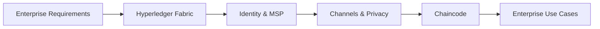

# Chapter 9: Enterprise Blockchain

> **Previous:** [Chapter 8: Decentralized Finance (DeFi)](./08-defi.md) | **Next:** [Chapter 10: Security and Scalability](./10-security-scalability.md)

---

## Learning Objectives

- Distinguish between Enterprise Blockchains and Public Blockchains
- Understand the architecture of Hyperledger Fabric (Peers, Orderers, Channels)
- Explain the concept of "Permissioned" access and Identity Management
- Analyze the role of "Chaincode" in enterprise environments
- Identify business use cases for blockchain in Supply Chain, Healthcare, and Finance

## Chapter at a Glance

| Topic | Key Insight | Practical Takeaway |
|-------|-------------|--------------------|
| Enterprise vs Public | Privacy, performance, governance | Permissioned = known participants |
| Hyperledger Fabric | Modular, pluggable architecture | Peers + Orderers + Channels + MSP |
| Channels | Private sub-networks | Only authorized members see data |
| Chaincode | Smart contracts in Go/Java/Node.js | Standard languages, no Solidity needed |
| Enterprise Consensus | BFT / Raft instead of PoW/PoS | Fast finality, low energy |

## Chapter Roadmap



---

## Theory

### The Enterprise Need
Public blockchains like Bitcoin are designed for total transparency and anonymity. Enterprises often require:
1. **Privacy:** Only specific parties should see transaction details.
2. **Performance:** Higher throughput and lower latency than public chains.
3. **Governance:** A known set of participants with clear legal responsibilities.


### Hyperledger Fabric
Hyperledger Fabric is a modular, permissioned blockchain framework.
- **Identity (MSP):** All participants have a known identity (X.509 certificates).
- **Peers:** Nodes that execute chaincode and maintain the ledger.
- **Orderers:** Collect transactions and create blocks, ensuring consistent ordering across the network.
- **Channels:** Private "sub-networks" where only authorized members can interact.

### Chaincode
Enterprise smart contracts are often called "Chaincode." In Fabric, they can be written in standard languages like Go, Java, or Node.js.

### Consensus in Enterprise
Unlike PoW, enterprise consensus is usually BFT or Crash Fault Tolerant (CFT) (e.g., Raft). It is designed for high efficiency among a small group of trusted nodes.

---

## Examples

### Example 1: A Confidential Supply Chain Channel
Company A (Supplier), Company B (Manufacturer), and Bank C (Financier) are on a Fabric network.
- A and B create a **Private Channel** to discuss pricing. Only A and B see these transactions.
- A, B, and C are on a **General Channel** for tracking the movement of goods. All three see these logs.
This demonstrates **Granular Privacy**.

### Example 2: Asset Tracking with Chaincode
```javascript
async createAsset(ctx, id, color, size, owner) {
    const asset = {
        ID: id,
        Color: color,
        Size: size,
        Owner: owner,
    };
    await ctx.stub.putState(id, Buffer.from(JSON.stringify(asset)));
}
```
This simplified chaincode snippet shows how an asset's state is stored in the "World State" database (CouchDB/LevelDB) in a Hyperledger Fabric network.

> **One-Sentence Takeaway:** Enterprise blockchains trade open, permissionless participation for privacy, throughput, and finality — making them suitable for regulated industries but fundamentally different from public chains.

> **Pro Tip:** When designing a Hyperledger Fabric network, structure channels around natural business confidentiality boundaries. Every channel is a separate ledger — use them to enforce data isolation between competitors.

> **Warning:** Permissioned blockchains reduce but do not eliminate the need for trust. The ordering service is a trusted component — if orderers collude, they can censor or reorder transactions.

---

## Concept Comparison Table

| Concept | Definition | Key Distinction | Use Case |
|---------|-----------|-----------------|----------|
| Public Blockchain | Open participation, anonymous | No identity, PoW/PoS | Cryptocurrency |
| Consortium | Permissioned, multi-org governance | Known identities, shared control | Supply chain |
| Private | Single organization control | Full control, limited trust benefit | Internal audit trials |
| Hyperledger Fabric | Modular enterprise framework | Pluggable consensus, channels | Multi-party business networks |
| Channel | Private ledger subset | Data visible only to authorized members | Confidential pricing |

## Quick Reference

| Category | Key Concepts | Notes |
|----------|-------------|-------|
| **Fabric Nodes** | Peer, Orderer, CA | Each has distinct role |
| **MSP** | Membership Service Provider | X.509 certificate-based identity |
| **Consensus** | Raft (CFT), Kafka (old), PBFT (planned) | No mining — fast finality |
| **Chaincode** | Go, Java, Node.js | Smart contract in familiar languages |
| **World State** | CouchDB or LevelDB | Current state of all assets (key-value) |

## Cross-Application Matrix

| Technique | DeFi | Smart Contracts | Enterprise Blockchain | Research |
|-----------|------|-----------------|----------------------|----------|
| Channels | N/A | N/A | Private trade data | Channel topology |
| MSP | N/A | N/A | Identity verification | PKI integration |
| Private Data | N/A | N/A | Confidential contracts | Zero-knowledge on Fabric |
| Chaincode | Token contracts | EVM equivalence | Asset lifecycle | Parallel execution |
| BFT Consensus | N/A | N/A | Orderer fault tolerance | BFT optimization |

## Chapter Quiz

1. What is the primary purpose of a "Channel" in Hyperledger Fabric?
   - A) To connect Fabric to the internet
   - B) To create a private sub-network where only authorized members see transactions
   - C) To mine new tokens
   - D) To store chaincode in a database

<details>
<summary>Answer</summary>
**B) To create a private sub-network where only authorized members see transactions.** Channels provide data isolation — members on different channels cannot see each other's transactions, enabling competing organizations to share only necessary data.
</details>

2. How does Hyperledger Fabric's consensus differ from Bitcoin's PoW?
   - A) It uses more energy
   - B) It is faster because it assumes a known, trusted participant set with crash-fault or Byzantine tolerance
   - C) It requires mining hardware
   - D) It is less secure

<details>
<summary>Answer</summary>
**B) It is faster because it assumes a known, trusted participant set with crash-fault or Byzantine tolerance.** Fabric's ordering service establishes transaction order without energy-intensive competition, achieving near-instant finality suitable for business throughput needs.
</details>

3. Why would a pharmaceutical supply chain choose Hyperledger Fabric over Ethereum?
   - A) Ethereum is too slow for their needs
   - B) Fabric provides privacy (competitors see different data), identity management (X.509), and higher throughput
   - C) Fabric is cheaper to develop on
   - D) Ethereum cannot track physical assets

<details>
<summary>Answer</summary>
**B) Fabric provides privacy (competitors see different data), identity management (X.509), and higher throughput.** Supply chains need confidential pricing between partners while maintaining an audit trail — Fabric's channel architecture and MSP identity model are designed for this.
</details>

## Summary

## Summary

- Enterprise blockchains prioritize privacy, performance, and controlled access.
- Hyperledger Fabric uses a modular architecture to support diverse business requirements.
- Identity is a first-class citizen in permissioned ledgers.
- Channels allow for confidential communication between subsets of network participants.
- The use of BFT/CFT consensus mechanisms allows for near-instant finality and high throughput.

---

## Exercises

### Review Questions
1. Why would a company use Hyperledger Fabric instead of Ethereum?
2. What is the role of an "Orderer" in Fabric?
3. Define a "Permissioned" blockchain.
4. How do "Channels" provide privacy?

### Application Problems
1. Design a blockchain-based system for tracking pharmaceutical drugs from factory to pharmacy.
2. Compare the "Cost of Operation" for an enterprise running its own nodes versus using a public network.
3. Explain how a MSP (Membership Service Provider) works in a consortium.

### Challenge Problem
1. Evaluate the "Interoperability" challenge: How can a private Fabric network communicate with a public Ethereum network to settle payments?
