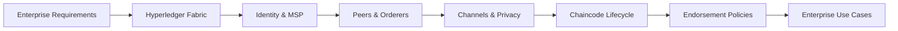
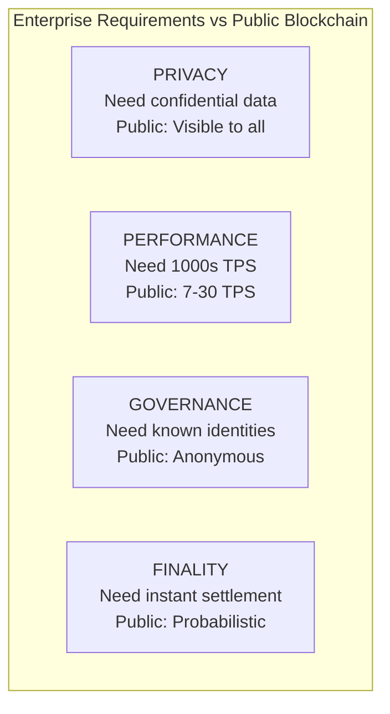
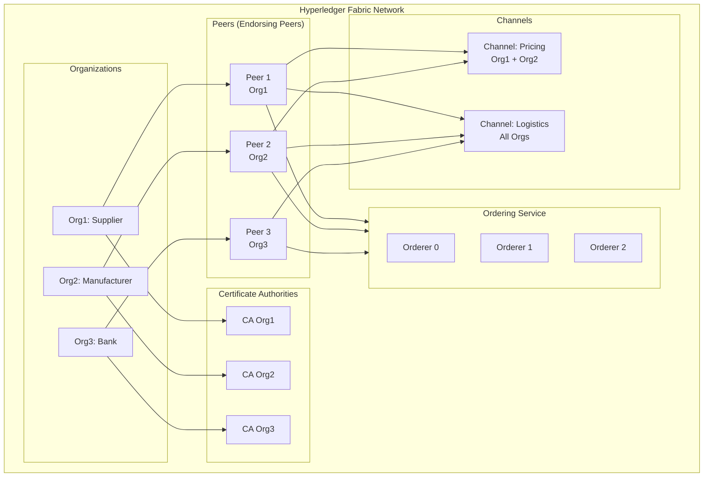
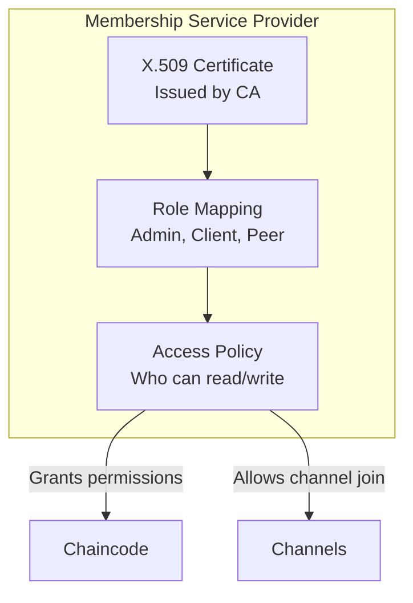
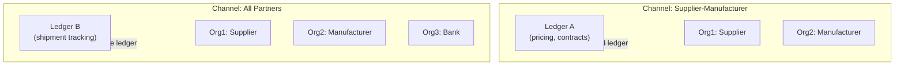
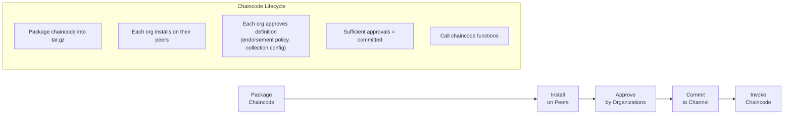
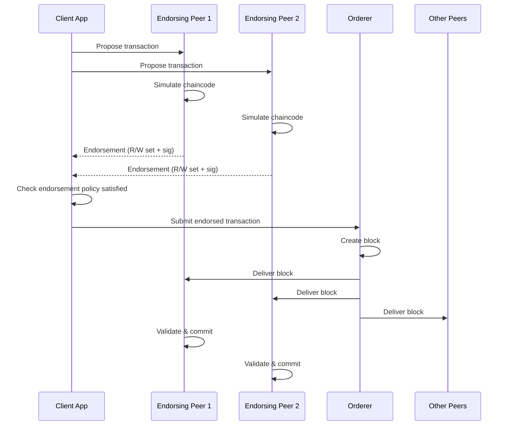
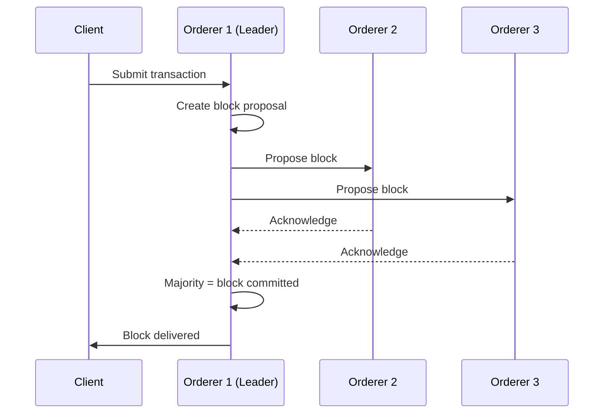

# Chapter 9: Enterprise Blockchain

> **Previous:** [Chapter 8: Decentralized Finance (DeFi)](./08-defi.md) | **Next:** [Chapter 10: Security and Scalability](./10-security-scalability.md)

---

## Learning Objectives

- Distinguish between Enterprise Blockchains and Public Blockchains
- Understand the architecture of Hyperledger Fabric (Peers, Orderers, Certificate Authorities)
- Explain channels, private data collections, and endorsement policies
- Analyze the chaincode lifecycle (install, approve, commit, invoke)
- Compare enterprise consensus (Raft, Kafka) with public chain consensus
- Describe use cases for enterprise blockchain in supply chain, healthcare, and finance
- Understand the role of Membership Service Providers (MSP) and X.509 certificates
- Evaluate when to choose permissioned vs public blockchain

## Chapter at a Glance

| Topic | Key Insight | Practical Takeaway |
|-------|-------------|--------------------|
| Enterprise vs Public | Privacy, performance, governance | Permissioned = known participants |
| Hyperledger Fabric | Modular, pluggable architecture | Peers + Orderers + Channels + MSP |
| Channels | Private sub-networks | Only authorized members see data |
| Private Data Collections | Confidential data within a channel | Even channel members can be restricted |
| Chaincode | Smart contracts in Go/Java/Node.js | Standard languages, no Solidity needed |
| Endorsement Policy | Specifies which peers must validate | Customizable trust per transaction |
| Enterprise Consensus | Raft (CFT) instead of PoW/PoS | Fast finality, low energy |

## Chapter Roadmap



---

## Theory

### The Enterprise Need

Public blockchains like Bitcoin are designed for total transparency and anonymity. Enterprises often require:

1. **Privacy:** Only specific parties should see transaction details.
2. **Performance:** Higher throughput and lower latency than public chains.
3. **Governance:** A known set of participants with clear legal responsibilities.
4. **Regulatory Compliance:** Know Your Customer (KYC), Anti-Money Laundering (AML).
5. **Finality:** No probabilistic settlement — transactions settle instantly.



### Hyperledger Fabric Architecture

Hyperledger Fabric is a modular, permissioned blockchain framework hosted by the Linux Foundation.



**Core components:**

| Component | Role | Description |
|-----------|------|-------------|
| **Peer** | Ledger & Chaincode | Maintains ledger, executes chaincode, stores world state |
| **Orderer** | Transaction ordering | Orders transactions into blocks, enforces channel config |
| **CA (Certificate Authority)** | Identity management | Issues X.509 certificates to members |
| **MSP (Membership Service Provider)** | Identity validation | Maps certificates to roles and permissions |
| **Channel** | Private communication | Isolated subnet with its own ledger |
| **Chaincode** | Smart contract | Business logic (Go, Java, Node.js) |

### Identity and MSP (Membership Service Provider)

Every participant in a Fabric network has a known identity (X.509 certificate). The MSP defines which identities are trusted:



**MSP levels:**
- **Channel MSP:** Defines which organizations are channel members.
- **Local MSP (Peer/Orderer):** Defines which admins can manage the node.
- **Admin MSP:** Privileged users who can install chaincode, create channels.

### Channels

Channels are private sub-networks where only authorized members can interact. Each channel has its own:
- **Ledger:** Isolated from other channels
- **Chaincode:** Can have different business logic
- **Members:** Only authorized organizations
- **Policy:** Separate endorsement and access policies



### Private Data Collections (PDC)

Even within a channel, you can restrict data to specific members using Private Data Collections:

```typescript
interface PrivateDataCollection {
    name: string;           // Collection name
    policy: string;         // Who can access (e.g., "OR('Org1.member', 'Org2.member')")
    requiredPeerCount: number;  // How many peers must endorse
    maxPeerCount: number;       // Maximum peers for dissemination
    blockToLive: number;        // Blocks before purging from private state
    memberOnlyRead: boolean;    // Only collection members can read
}
```

This enables scenarios where:
- Two suppliers share pricing data that the manufacturer cannot see
- A bank sees transaction values but not the goods details
- Regulators have special read-only access

### Chaincode Lifecycle

Fabric v2.x introduced a decentralized chaincode lifecycle:



**Lifecycle steps:**
1. **Package:** Developer packages chaincode (Go, Node.js, Java) into a deployable tar.gz.
2. **Install:** Each organization installs the package on their endorsing peers.
3. **Approve:** Each organization's admin approves the chaincode definition (including endorsement policy).
4. **Commit:** When enough organizations approve (per channel policy), the chaincode is committed and activated.
5. **Invoke:** Client applications call chaincode functions through the Gateway SDK.

### Endorsement Policies

Endorsement policies specify which peers must validate a transaction:

```
# Examples:
# Any single org
AND('Org1.member')

# Both orgs must endorse
AND('Org1.member', 'Org2.member')

# Either org
OR('Org1.member', 'Org2.member')

# Majority of channel orgs
OUTOF(2, 'Org1.member', 'Org2.member', 'Org3.member')
```

**Transaction flow with endorsement:**
1. Client sends transaction proposal to endorsing peers.
2. Each peer simulates the chaincode and returns a read-write set + endorsement signature.
3. Client collects endorsements and submits to the orderer.
4. Orderer creates a block and delivers to all peers.
5. Each peer validates endorsements and applies the transaction.



### Chaincode Example (Node.js)

```typescript
// asset-transfer/chaincode/src/index.ts
import { Context, Contract } from "fabric-contract-api";

interface Asset {
    ID: string;
    Color: string;
    Size: number;
    Owner: string;
    AppraisedValue: number;
}

export class AssetTransfer extends Contract {
    public async InitLedger(ctx: Context): Promise<void> {
        const assets: Asset[] = [
            { ID: "asset1", Color: "blue", Size: 5, Owner: "Tom", AppraisedValue: 100 },
        ];
        for (const asset of assets) {
            await ctx.stub.putState(
                asset.ID,
                Buffer.from(JSON.stringify(asset))
            );
        }
    }

    public async CreateAsset(
        ctx: Context,
        id: string,
        color: string,
        size: number,
        owner: string,
        value: number
    ): Promise<void> {
        const exists = await this.AssetExists(ctx, id);
        if (exists) {
            throw new Error(`Asset ${id} already exists`);
        }
        const asset: Asset = { ID: id, Color: color, Size: size, Owner: owner, AppraisedValue: value };
        await ctx.stub.putState(id, Buffer.from(JSON.stringify(asset)));
    }

    public async ReadAsset(ctx: Context, id: string): Promise<string> {
        const assetBytes = await ctx.stub.getState(id);
        if (!assetBytes || assetBytes.length === 0) {
            throw new Error(`Asset ${id} does not exist`);
        }
        return assetBytes.toString();
    }

    public async TransferAsset(ctx: Context, id: string, newOwner: string): Promise<void> {
        const assetBytes = await ctx.stub.getState(id);
        if (!assetBytes || assetBytes.length === 0) {
            throw new Error(`Asset ${id} does not exist`);
        }
        const asset = JSON.parse(assetBytes.toString()) as Asset;
        asset.Owner = newOwner;
        await ctx.stub.putState(id, Buffer.from(JSON.stringify(asset)));
    }

    public async GetAssetsByRange(ctx: Context, startKey: string, endKey: string): Promise<string> {
        const iterator = await ctx.stub.getStateByRange(startKey, endKey);
        const results: Asset[] = [];
        while (true) {
            const result = await iterator.next();
            if (result.value) {
                results.push(JSON.parse(result.value.value.toString()));
            }
            if (result.done) {
                await iterator.close();
                break;
            }
        }
        return JSON.stringify(results);
    }

    private async AssetExists(ctx: Context, id: string): Promise<boolean> {
        const assetBytes = await ctx.stub.getState(id);
        return assetBytes && assetBytes.length > 0;
    }
}
```

### Consensus in Enterprise (Raft)

Enterprise consensus is typically **Crash Fault Tolerant (CFT)** rather than Byzantine Fault Tolerant:



**Raft properties:**
- **Crash tolerance:** Survives node crashes (not Byzantine attacks)
- **Leader-based:** One leader, multiple followers
- **Fast finality:** Blocks commit immediately
- **Not for public chains:** Requires trusted participants

### Enterprise Use Cases

| Industry | Use Case | How Blockchain Helps | Example |
|----------|----------|---------------------|---------|
| **Supply Chain** | Track goods from source to store | Immutable provenance, automated customs | IBM Food Trust |
| **Healthcare** | Patient records across providers | Interoperable, patient-consented access | MediLedger |
| **Finance** | Trade finance, letter of credit | Instant settlement, shared truth | we.trade |
| **Insurance** | Claims processing | Automated verification, fraud reduction | B3i |
| **Government** | Land registry, identity | Tamper-proof records, reduced corruption | Sweden Lantmäteriet |
| **Pharma** | Drug supply chain security | Counterfeit detection (DSCSA compliance) | MediLedger |
| **Energy** | Grid management, carbon credits | Transparent trading, certificate tracking | Energy Web Foundation |
| **Maritime** | Shipping documents, bills of lading | Digital documents, reduced delays | TradeLens |

### Public vs Enterprise Comparison

| Feature | Public Blockchain (Ethereum) | Enterprise (Hyperledger Fabric) |
|---------|------------------------------|--------------------------------|
| Access | Permissionless | Permissioned |
| Identity | Pseudonymous | X.509 certificates |
| Consensus | PoW/PoS (energy intensive) | Raft/Kafka (energy efficient) |
| Throughput | 15-30 TPS (Ethereum L1), 2000+ (L2) | 1000-10000+ TPS |
| Finality | Probabilistic (Minutes) | Instant (Seconds) |
| Privacy | All transactions visible | Channels + PDC |
| Smart Contracts | Solidity (limited languages) | Go, Java, Node.js |
| Governance | Community / Foundation | Consortium of organizations |
| Cost | Gas fees (volatile) | Fixed infrastructure cost |
| Upgrades | Hard forks (contentious) | Consensus-driven upgrades |
| Data Storage | State (expensive) + events | World state (CouchDB/LevelDB) |

### When to Use Each

**Use public blockchain when:**
- You need permissionless participation
- Full transparency is desired (not a bug)
- Censorship resistance is critical
- You need global, borderless value transfer

**Use enterprise blockchain when:**
- Participants are known (consortium)
- Transaction data must remain private
- Regulatory compliance requires identity
- High throughput is needed
- Instant finality is required

---

## Examples

### Example 1: Confidential Supply Chain Channel

Company A (Supplier), Company B (Manufacturer), and Bank C (Financier) are on a Fabric network.

- A and B create a **Private Channel** to discuss pricing. Only A and B see these transactions.
- A, B, and C are on a **General Channel** for tracking the movement of goods. All three see these logs.
- Within the General Channel, A uses a **Private Data Collection** to share inspection documents only with B.

This demonstrates **Granular Privacy**.

### Example 2: Asset Transfer Chaincode Flow

```typescript
// Client application
import { Gateway, Wallets } from "fabric-network";

async function transferAsset() {
    const wallet = await Wallets.newFileSystemWallet("./wallet");
    const gateway = new Gateway();
    
    await gateway.connect(connectionProfile, {
        wallet,
        identity: "user1",
        discovery: { enabled: true, asLocalhost: true },
    });

    const network = await gateway.getNetwork("mychannel");
    const contract = network.getContract("asset-transfer");

    // Submit transaction
    const result = await contract.submitTransaction(
        "TransferAsset",
        "asset1",
        "newOwner"
    );
    console.log("Transaction submitted:", result.toString());

    // Evaluate (read-only query)
    const asset = await contract.evaluateTransaction("ReadAsset", "asset1");
    console.log("Asset state:", JSON.parse(asset.toString()));

    await gateway.disconnect();
}
```

### Example 3: Endorsement Policy Configuration

```typescript
// Collection config for private data
const collectionConfig = [
    {
        name: "supplierPricing",
        policy: "OR('SupplierMSP.member', 'ManufacturerMSP.member')",
        requiredPeerCount: 1,
        maxPeerCount: 2,
        blockToLive: 0,  // Don't purge
        memberOnlyRead: true,
        memberOnlyWrite: true,
    },
    {
        name: "inspectionDocs",
        policy: "OR('SupplierMSP.member')",
        requiredPeerCount: 0,
        maxPeerCount: 1,
        blockToLive: 100,  // Purge after 100 blocks
        memberOnlyRead: true,
        memberOnlyWrite: true,
    },
];
```

> **One-Sentence Takeaway:** Enterprise blockchains trade open, permissionless participation for privacy, throughput, and finality — making them suitable for regulated industries but fundamentally different from public chains.

> **Pro Tip:** When designing a Hyperledger Fabric network, structure channels around natural business confidentiality boundaries. Every channel is a separate ledger — use them to enforce data isolation between competitors.

> **Warning:** Permissioned blockchains reduce but do not eliminate the need for trust. The ordering service is a trusted component — if orderers collude, they can censor or reorder transactions.

---

## Concept Comparison Table

| Concept | Definition | Key Distinction | Use Case |
|---------|-----------|-----------------|----------|
| Public Blockchain | Open participation, anonymous | No identity, PoW/PoS | Cryptocurrency |
| Consortium | Permissioned, multi-org governance | Known identities, shared control | Supply chain |
| Private | Single organization control | Full control, limited trust benefit | Internal audit trials |
| Hyperledger Fabric | Modular enterprise framework | Pluggable consensus, channels | Multi-party business networks |
| Channel | Private ledger subset | Data visible only to authorized members | Confidential pricing |
| Private Data Collection | Data restriction within channel | Even channel members restricted | Selective disclosure |
| MSP | Membership Service Provider | X.509 certificate-based identity | All network interactions |
| Chaincode | Smart contract | Go/Java/Node.js | Business logic execution |

## Quick Reference

| Category | Key Concepts | Notes |
|----------|-------------|-------|
| **Fabric Nodes** | Peer, Orderer, CA | Each has distinct role |
| **MSP** | Membership Service Provider | X.509 certificate-based identity |
| **Consensus** | Raft (CFT), Kafka (old), PBFT (planned) | No mining — fast finality |
| **Chaincode** | Go, Java, Node.js | Smart contract in familiar languages |
| **World State** | CouchDB or LevelDB | Current state of all assets (key-value) |
| **Channel** | Private subnet with own ledger | Data isolation between groups |
| **PDC** | Private Data Collection | Even finer-grained privacy |
| **Endorsement** | Policy-based validation | Flexible trust model |

## Cross-Application Matrix

| Technique | DeFi | Smart Contracts | Enterprise Blockchain | Research |
|-----------|------|-----------------|----------------------|----------|
| Channels | N/A | N/A | Private trade data | Channel topology |
| MSP | N/A | N/A | Identity verification | PKI integration |
| Private Data | N/A | N/A | Confidential contracts | Zero-knowledge on Fabric |
| Chaincode | Token contracts | EVM equivalence | Asset lifecycle | Parallel execution |
| Endorsement Policy | N/A | N/A | Multi-org validation | Policy optimization |
| Raft Consensus | N/A | N/A | Orderer fault tolerance | BFT optimization |

## Chapter Quiz

1. What is the primary purpose of a "Channel" in Hyperledger Fabric?
   - A) To connect Fabric to the internet
   - B) To create a private sub-network where only authorized members see transactions
   - C) To mine new tokens
   - D) To store chaincode in a database

<details>
<summary>Answer</summary>
**B) To create a private sub-network where only authorized members see transactions.** Channels provide data isolation — members on different channels cannot see each other's transactions, enabling competing organizations to share only necessary data.
</details>

2. How does Hyperledger Fabric's consensus differ from Bitcoin's PoW?
   - A) It uses more energy
   - B) It is faster because it assumes a known, trusted participant set with crash-fault or Byzantine tolerance
   - C) It requires mining hardware
   - D) It is less secure

<details>
<summary>Answer</summary>
**B) It is faster because it assumes a known, trusted participant set with crash-fault or Byzantine tolerance.** Fabric's ordering service establishes transaction order without energy-intensive competition, achieving near-instant finality suitable for business throughput needs.
</details>

3. Why would a pharmaceutical supply chain choose Hyperledger Fabric over Ethereum?
   - A) Ethereum is too slow for their needs
   - B) Fabric provides privacy (competitors see different data), identity management (X.509), and higher throughput
   - C) Fabric is cheaper to develop on
   - D) Ethereum cannot track physical assets

<details>
<summary>Answer</summary>
**B) Fabric provides privacy (competitors see different data), identity management (X.509), and higher throughput.** Supply chains need confidential pricing between partners while maintaining an audit trail — Fabric's channel architecture and MSP identity model are designed for this.
</details>

4. What is the role of the Endorsing Peer in Hyperledger Fabric?
   - A) To store the blockchain ledger
   - B) To simulate and endorse transactions before they are ordered
   - C) To mine new blocks
   - D) To issue identities

<details>
<summary>Answer</summary>
**B) To simulate and endorse transactions before they are ordered.** Endorsing peers receive transaction proposals, simulate chaincode execution, and return read-write sets with their endorsement signature. The client must collect enough endorsements to satisfy the endorsement policy before submitting to the orderer.
</details>

5. What is a Private Data Collection (PDC) in Hyperledger Fabric?
   - A) A way to create a new channel
   - B) A method for restricting data visibility to specific members within a channel
   - C) A database for storing private keys
   - D) A collection of private blockchains

<details>
<summary>Answer</summary>
**B) A method for restricting data visibility to specific members within a channel.** PDCs allow certain data to be shared only with specific organization peers, even within the same channel. Data is stored in a private state database and is not visible to all channel members.
</details>

## Summary

- Enterprise blockchains prioritize privacy, performance, and controlled access over openness.
- Hyperledger Fabric uses a modular architecture with distinct node roles (peer, orderer, CA).
- Identity is a first-class citizen in permissioned ledgers (X.509 certificates via MSP).
- Channels allow for confidential communication between subsets of network participants.
- Private Data Collections provide even finer-grained data isolation within channels.
- Endorsement policies define flexible trust models per chaincode.
- Raft consensus provides crash fault tolerance with instant finality.
- Chaincode can be written in standard programming languages (Go, Java, Node.js).
- Enterprise blockchains are not replacements for public chains — they serve different needs.

## Practical Takeaways

1. Design your channel topology based on natural business confidentiality boundaries.
2. Use Private Data Collections for data that needs even finer granularity than channels provide.
3. Choose endorsement policies that balance security (more endorsers) with performance (fewer endorsers).
4. Use CouchDB for the world state if you need rich queries (vs LevelDB for simple key-value).
5. For production, run at least 3-5 orderer nodes for high availability.
6. Always use a Hardware Security Module (HSM) for CA private keys in production.

---

## Exercises

### Review Questions

1. Why would a company use Hyperledger Fabric instead of Ethereum?
2. What is the role of an "Orderer" in Fabric?
3. Define a "Permissioned" blockchain.
4. How do "Channels" provide privacy?
5. What is the difference between a channel and a Private Data Collection?

### Application Problems

1. Design a blockchain-based system for tracking pharmaceutical drugs from factory to pharmacy.
2. Compare the "Cost of Operation" for an enterprise running its own nodes versus using a public network.
3. Explain how a MSP (Membership Service Provider) works in a consortium.
4. Design an endorsement policy for a 5-organization consortium where at least 3 organizations must endorse, including at least 1 of 2 competing organizations.

### Challenge Problem

1. Evaluate the "Interoperability" challenge: How can a private Fabric network communicate with a public Ethereum network to settle payments?
2. Research the BFT alternatives for Hyperledger Fabric (like SmartBFT). Explain why BFT might be necessary for some enterprise consortia and how it differs from the default Raft consensus.
