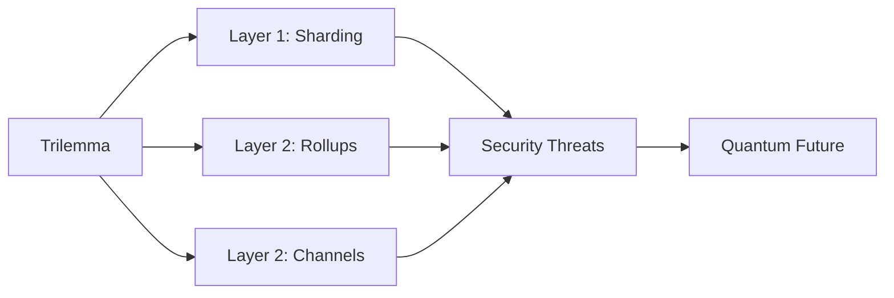

# Chapter 10: Security and Scalability

> **Previous:** [Chapter 9: Enterprise Blockchain](./09-enterprise.md) | **Next:** [Chapter 1: Introduction to Blockchain](./01-introduction.md)

---

## Learning Objectives

- Identify common blockchain vulnerabilities (51% Attack, Sybil Attack, Long Range Attack)
- Explain Layer 2 scaling solutions (State Channels, Sidechains, Rollups)
- Understand the concept of "Sharding" and its role in Ethereum 2.0
- Describe the risks of Zero-Knowledge Proofs (ZKP) in privacy-preserving blockchains
- Analyze the impact of Quantum Computing on current cryptographic standards

## Chapter at a Glance

| Topic | Key Insight | Practical Takeaway |
|-------|-------------|--------------------|
| Scalability Bottleneck | Every node processes every transaction | Trilemma: pick two of Security, Scalability, Decentralization |
| Layer 1 Scaling | Sharding splits the blockchain into parallel segments | Each shard is its own mini-blockchain |
| Layer 2 Scaling | State Channels, Sidechains, Rollups | Computation moves off-chain, security remains on L1 |
| Rollups | Optimistic (fraud proofs) vs ZK (validity proofs) | ZK-Rollups provide instant finality |
| Smart Contract Security | Reentrancy, overflow, oracle manipulation | Largest source of real-world losses |

## Chapter Roadmap

---

## Theory

### The Scalability Bottleneck
Public blockchains face the "Trilemma": they can only optimize two out of three: **Decentralization, Security, Scalability**. Most chains struggle with throughput (Transactions Per Second - TPS) because every node must process every transaction.

### Scaling Solutions
1. **On-Chain (Layer 1):**
   - **Sharding:** Splitting the database into multiple segments (shards) so nodes only process a subset of transactions.
2. **Off-Chain (Layer 2):**
   - **State Channels (e.g., Lightning Network):** Opening a private channel for multiple transactions and only settling the final state on-chain.
   - **Rollups (Optimistic vs. ZK):** Bundling hundreds of transactions into a single batch and submitting a summary/proof to Layer 1.

### Blockchain Security
- **51% Attack:** An entity gains majority control of consensus and can double-spend or censor transactions.
- **Sybil Attack:** An attacker creates a large number of pseudonymous identities to gain disproportionate influence.
- **Smart Contract Bugs:** Logical errors (e.g., Reentrancy, Arithmetic Overflow) can lead to total fund loss.

### Zero-Knowledge Proofs (ZKP)
ZKP allows one party (the prover) to prove to another (the verifier) that a statement is true without revealing any information beyond the validity of the statement. This is used for privacy (Zcash) and scalability (ZK-Rollups).

---

## Examples

### Example 1: Lightning Network Payment
Alice and Bob open a channel with 0.1 BTC each.
1. Alice sends Bob 0.01 BTC. (Balance: A: 0.09, B: 0.11)
2. Bob sends Alice 0.02 BTC. (Balance: A: 0.11, B: 0.09)
3. They close the channel.
Only **one** transaction is recorded on the main Bitcoin blockchain, but thousands of micro-payments could have happened off-chain.

### Example 2: ZK-Rollup Proof
A sequencer collects 1,000 transactions. Instead of sending all 1,000 to Ethereum, it generates a **Validity Proof** (SNARK/STARK). Ethereum only verifies the proof, which is much cheaper and faster than verifying 1,000 individual signatures.

> **One-Sentence Takeaway:** Every scaling solution involves a trade-off — Rollups inherit L1 security but add latency, sidechains have their own security models, and sharding increases complexity while maintaining full security.

> **Pro Tip:** For most applications, ZK-Rollups are the preferred scaling path: they offer instant finality, lower fees than Optimistic Rollups (no 7-day withdrawal delay), and strong privacy guarantees.

> **Warning:** A 51% attack on a shard requires only 51% of that shard's hash power, not the whole network — sharding introduces cross-shard communication complexity and reduces the cost of attacking a single shard.

---

## Concept Comparison Table

| Concept | Definition | Key Distinction | Use Case |
|---------|-----------|-----------------|----------|
| Sharding | Split blockchain into parallel segments | L1 scaling, complex cross-shard communication | Ethereum Danksharding |
| State Channels | Off-chain private payment channels | Instant finality, requires liquidity lock | Lightning Network |
| Optimistic Rollup | Assume valid, challenge with fraud proof | 7-day withdrawal delay | Arbitrum, Optimism |
| ZK-Rollup | Validity proof via SNARK/STARK | Instant finality, computationally intensive | zkSync, StarkNet |
| Sidechain | Separate chain with own consensus model | Independent security, bridge risk | Polygon (PoS) |
| Plasma | Child chains submit Merkle roots to L1 | Limited computation, exit game complexity | Early Ethereum scaling |

## Quick Reference

| Category | Key Concepts | Notes |
|----------|-------------|-------|
| **L1 Scaling** | Sharding, Block size, DAG-based | Changes base layer protocol |
| **L2 Scaling** | Rollups, Channels, Sidechains | Layer on top of L1 for throughput |
| **51% Attack** | Majority hash/stake control | Double-spend, reorg, censorship |
| **Reentrancy** | External call re-enters contract | Update state before external calls |
| **ZK Proofs** | zk-SNARK (trusted setup), zk-STARK (transparent) | STARKs need no trusted setup |

## Cross-Application Matrix

| Technique | DeFi | Smart Contracts | Enterprise Blockchain | Research |
|-----------|------|-----------------|----------------------|----------|
| ZK-Rollups | Scalable DEX | Gas-efficient contracts | Private transactions | ZK proof optimization |
| Optimistic Rollups | Low-fee trading | Arbitrum contracts | Enterprise rollups | Fraud proof game theory |
| Sharding | Cross-shard DeFi | Shared state complexity | Not enterprise-relevant | Data availability sampling |
| Lightning Network | Bitcoin micro-payments | N/A | Enterprise payments | Routing optimization |
| ZK Proofs | Privacy DEX | zk-rollup settlement | Private enterprise data | Post-quantum ZK |

## Chapter Quiz

1. What is the main disadvantage of Optimistic Rollups compared to ZK-Rollups?
   - A) They support fewer transactions
   - B) They require a 7-day challenge window for withdrawals
   - C) They are less decentralized
   - D) They cannot process smart contracts

Answer

**B) They require a 7-day challenge window for withdrawals.** Optimistic Rollups assume transactions are valid unless challenged. This challenge period means users must wait ~7 days to withdraw funds to L1. ZK-Rollups have no such delay because validity proofs are verified immediately.

2. Why does sharding reduce the cost of a 51% attack compared to a non-sharded blockchain?
   - A) Shards are more secure
   - B) An attacker only needs to compromise one shard, not the entire network
   - C) Sharding uses PoS which is more attack-resistant
   - D) Shards don't have monetary value

Answer

**B) An attacker only needs to compromise one shard, not the entire network.** Each shard has its own validator set and block production. Acquiring 51% of a single shard's stake or hash power is cheaper than acquiring 51% of the whole network.

3. What distinguishes a ZK-STARK from a ZK-SNARK?
   - A) STARKs are smaller
   - B) STARKs require no trusted setup ceremony
   - C) STARKs are faster to verify
   - D) STARKs work on mobile devices

Answer

**B) STARKs require no trusted setup ceremony.** SNARKs require an initial trusted setup — if the setup's toxic waste is leaked, false proofs can be generated. STARKs use only publicly verifiable randomness, making them fully transparent.

## Summary

## Summary

- Scalability is the primary hurdle for mainstream blockchain adoption.
- Layer 2 solutions move the computation off-chain while inheriting the security of Layer 1.
- Sharding increases throughput by distributing the workload among nodes.
- Security remains a moving target, with risks evolving from basic consensus attacks to complex smart contract exploits.
- ZKPs represent the frontier of both privacy and scaling technology.

---

## Exercises

### Review Questions
1. Define the "Blockchain Trilemma."
2. What is the difference between an Optimistic Rollup and a ZK-Rollup?
3. Explain the "Data Availability" problem.
4. How does Sharding improve TPS?

### Application Problems
1. If a blockchain has 10 shards and each shard can process 15 TPS, what is the total theoretical TPS?
2. Discuss the security trade-off of using a Sidechain versus a Rollup.
3. Analyze how a "Front-running" attack works in a decentralized exchange.

### Challenge Problem
1. Evaluate the threat of Shor's Algorithm (Quantum Computing) to ECDSA and research "Post-Quantum Cryptography" (PQC) candidates for blockchain.
