# Chapter 10: Security and Scalability

> **Previous:** [Chapter 9: Enterprise Blockchain](./09-enterprise.md) | **Next:** [Chapter 1: Introduction to Blockchain](./01-introduction.md)

---

## Learning Objectives

- Identify common blockchain vulnerabilities (51% Attack, Sybil Attack, Long Range Attack)
- Analyze Layer 2 scaling solutions (State Channels, Sidechains, Rollups)
- Understand sharding and data availability in Ethereum's scaling roadmap
- Compare Optimistic Rollups vs ZK-Rollups with detailed trade-off analysis
- Describe Plasma architecture and its limitations
- Understand zk-SNARKs vs zk-STARKs differences
- Identify the data availability problem and its solutions
- Analyze the impact of quantum computing on current cryptographic standards

## Chapter at a Glance

| Topic | Key Insight | Practical Takeaway |
|-------|-------------|--------------------|
| Scalability Bottleneck | Every node processes every transaction | Trilemma: pick two of Security, Scalability, Decentralization |
| Layer 1 Scaling | Sharding splits the blockchain into parallel segments | Each shard is its own mini-blockchain |
| Layer 2 Scaling | State Channels, Sidechains, Rollups | Computation moves off-chain, security remains on L1 |
| Rollups | Optimistic (fraud proofs) vs ZK (validity proofs) | ZK-Rollups provide instant finality |
| Data Availability | L2 must publish data so anyone can reconstruct state | Key bottleneck for scaling |
| Lightning Network | Bitcoin payment channels | Instant, low-fee micro-transactions |
| Quantum Threat | Shor's algorithm breaks ECDSA | Post-quantum cryptography needed |

## Chapter Roadmap

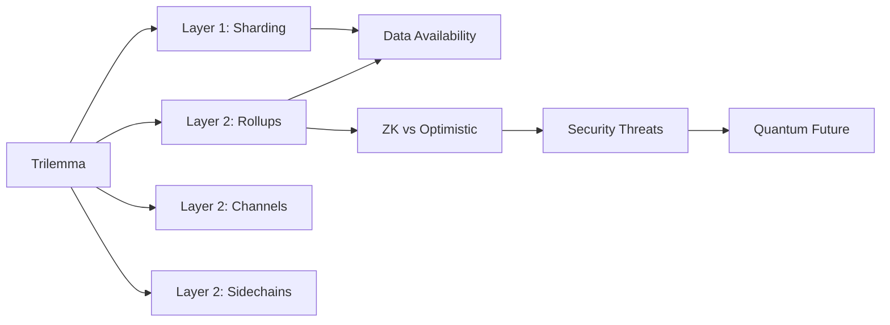
```mermaid
flowchart LR
    A[Trilemma] --> B[Layer 1: Sharding]
    A --> C[Layer 2: Rollups]
    A --> D[Layer 2: Channels]
    A --> E[Layer 2: Sidechains]
    B --> F[Data Availability]
    C --> F
    C --> G[ZK vs Optimistic]
    G --> H[Security Threats]
    H --> I[Quantum Future]
```

---

## Theory

### The Scalability Bottleneck

<a href="../../assets/images/diagrams/blockchain/10-security-scalability/the-scalability-bottleneck-handwritten.svg" target="_blank" rel="noopener">
  
</a>
<a href="../../assets/images/diagrams/blockchain/10-security-scalability/the-scalability-bottleneck-diagram.svg" target="_blank" rel="noopener">
  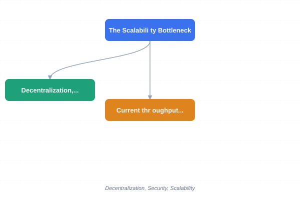
</a>
<a href="../../assets/images/diagrams/blockchain/10-security-scalability/the-scalability-bottleneck-sticky.svg" target="_blank" rel="noopener">
  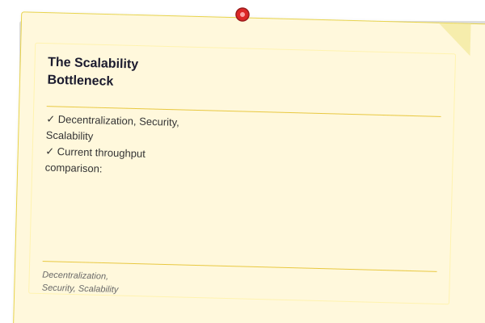
</a>


<a href="../../assets/images/diagrams/blockchain/10-security-scalability/the-scalability-bottleneck-handwritten.svg" target="_blank" rel="noopener">
  
</a>
<a href="../../assets/images/diagrams/blockchain/10-security-scalability/the-scalability-bottleneck-diagram.svg" target="_blank" rel="noopener">
  
</a>
<a href="../../assets/images/diagrams/blockchain/10-security-scalability/the-scalability-bottleneck-sticky.svg" target="_blank" rel="noopener">
  
</a>


<a href="../../assets/images/diagrams/blockchain/10-security-scalability/the-scalability-bottleneck-handwritten.svg" target="_blank" rel="noopener">
  
</a>
<a href="../../assets/images/diagrams/blockchain/10-security-scalability/the-scalability-bottleneck-diagram.svg" target="_blank" rel="noopener">
  
</a>
<a href="../../assets/images/diagrams/blockchain/10-security-scalability/the-scalability-bottleneck-sticky.svg" target="_blank" rel="noopener">
  
</a>


Public blockchains face the "Trilemma": they can only optimize two out of three: **Decentralization, Security, Scalability**. Most chains struggle with throughput because every node must process every transaction.

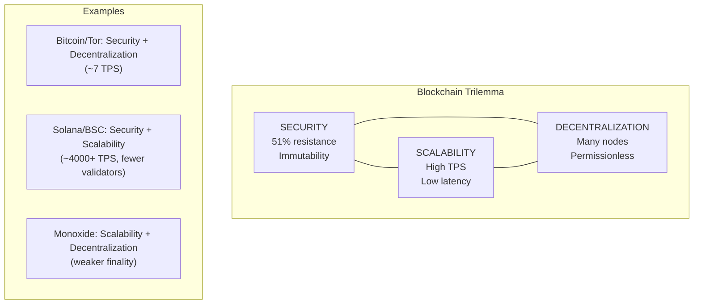
```mermaid
flowchart TB
    subgraph Trilemma2["Blockchain Trilemma"]
        S1["SECURITY<br/>51% resistance<br/>Immutability"]
        S2["SCALABILITY<br/>High TPS<br/>Low latency"]
        D1["DECENTRALIZATION<br/>Many nodes<br/>Permissionless"]
    end
    
    S1 --- S2
    S1 --- D1
    S2 --- D1
    
    subgraph Examples["Examples"]
        B["Bitcoin/Tor: Security + Decentralization<br/>(~7 TPS)"]
        S["Solana/BSC: Security + Scalability<br/>(~4000+ TPS, fewer validators)"]
        M["Monoxide: Scalability + Decentralization<br/>(weaker finality)"]
    end
```

**Current throughput comparison:**

| Blockchain | TPS | Block Time | Finality | Notes |
|------------|-----|------------|----------|-------|
| Bitcoin | 7 | 10 min | ~60 min (6 blocks) | Most secure, slowest |
| Ethereum L1 | 15 | 12 sec | ~15 min (64 blocks) | Post-Merge |
| Solana | 4000+ | 400ms | ~12 sec | Higher hardware requirements |
| Polygon PoS | 7000+ | 2 sec | ~2 min | Sidechain |
| Arbitrum (L2) | 40000+ | ~1 sec | ~15 min | Optimistic rollup |
| zkSync (L2) | 10000+ | ~1 sec | ~10 min | ZK-rollup |
| Lightning Network | 1M+ | Instant | Instant | Payment channels |

### Layer 1 Scaling: Sharding

<a href="../../assets/images/diagrams/blockchain/10-security-scalability/layer-1-scaling-sharding-handwritten.svg" target="_blank" rel="noopener">
  
</a>
<a href="../../assets/images/diagrams/blockchain/10-security-scalability/layer-1-scaling-sharding-diagram.svg" target="_blank" rel="noopener">
  
</a>
<a href="../../assets/images/diagrams/blockchain/10-security-scalability/layer-1-scaling-sharding-sticky.svg" target="_blank" rel="noopener">
  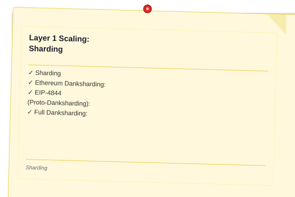
</a>


<a href="../../assets/images/diagrams/blockchain/10-security-scalability/layer-1-scaling-sharding-handwritten.svg" target="_blank" rel="noopener">
  
</a>
<a href="../../assets/images/diagrams/blockchain/10-security-scalability/layer-1-scaling-sharding-diagram.svg" target="_blank" rel="noopener">
  
</a>
<a href="../../assets/images/diagrams/blockchain/10-security-scalability/layer-1-scaling-sharding-sticky.svg" target="_blank" rel="noopener">
  
</a>


<a href="../../assets/images/diagrams/blockchain/10-security-scalability/layer-1-scaling-sharding-handwritten.svg" target="_blank" rel="noopener">
  
</a>
<a href="../../assets/images/diagrams/blockchain/10-security-scalability/layer-1-scaling-sharding-diagram.svg" target="_blank" rel="noopener">
  
</a>
<a href="../../assets/images/diagrams/blockchain/10-security-scalability/layer-1-scaling-sharding-sticky.svg" target="_blank" rel="noopener">
  
</a>


**Sharding** splits the blockchain database into multiple segments (shards) so nodes only process a subset of transactions. Ethereum's Danksharding is the most advanced sharding design.

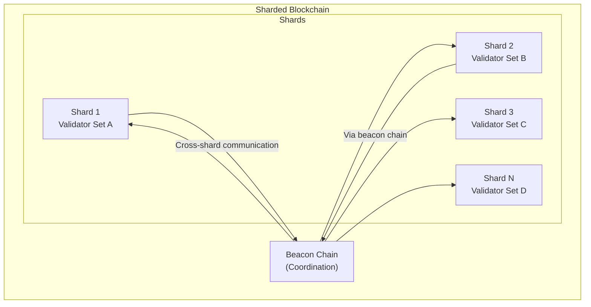
```mermaid
flowchart TB
    subgraph Sharding["Sharded Blockchain"]
        Beacon["Beacon Chain<br/>(Coordination)"]
        
        subgraph Shards["Shards"]
            Shard1["Shard 1<br/>Validator Set A"]
            Shard2["Shard 2<br/>Validator Set B"]
            Shard3["Shard 3<br/>Validator Set C"]
            ShardN["Shard N<br/>Validator Set D"]
        end
        
        Beacon --> Shard1
        Beacon --> Shard2
        Beacon --> Shard3
        Beacon --> ShardN
        
        Shard1 -->|"Cross-shard communication"| Beacon
        Shard2 -->|"Via beacon chain"| Beacon
    end
```

**Ethereum Danksharding:**
- **EIP-4844 (Proto-Danksharding):** Already live (Dencun, March 2024). Introduces blob transactions for L2 data.
- **Full Danksharding:** Future upgrade. Full validator set randomly sampled to attest to shard blobs.
- **Data Availability Sampling (DAS):** Light nodes can verify data availability without downloading everything.
- **Key metric:** Blob count per block (currently 3-6, planned to scale to 64+).

### Layer 2: State Channels (Lightning Network)

<a href="../../assets/images/diagrams/blockchain/10-security-scalability/layer-2-state-channels-lightning-network-handwritten.svg" target="_blank" rel="noopener">
  
</a>
<a href="../../assets/images/diagrams/blockchain/10-security-scalability/layer-2-state-channels-lightning-network-diagram.svg" target="_blank" rel="noopener">
  
</a>
<a href="../../assets/images/diagrams/blockchain/10-security-scalability/layer-2-state-channels-lightning-network-sticky.svg" target="_blank" rel="noopener">
  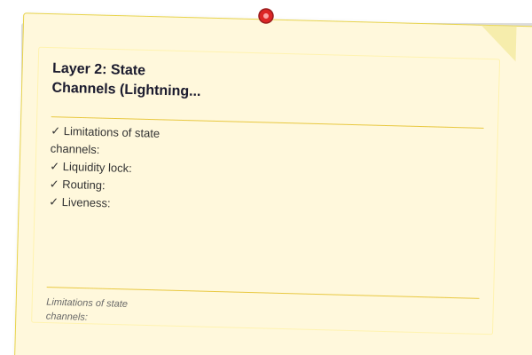
</a>


<a href="../../assets/images/diagrams/blockchain/10-security-scalability/layer-2-state-channels-lightning-network-handwritten.svg" target="_blank" rel="noopener">
  
</a>
<a href="../../assets/images/diagrams/blockchain/10-security-scalability/layer-2-state-channels-lightning-network-diagram.svg" target="_blank" rel="noopener">
  
</a>
<a href="../../assets/images/diagrams/blockchain/10-security-scalability/layer-2-state-channels-lightning-network-sticky.svg" target="_blank" rel="noopener">
  
</a>


<a href="../../assets/images/diagrams/blockchain/10-security-scalability/layer-2-state-channels-lightning-network-handwritten.svg" target="_blank" rel="noopener">
  
</a>
<a href="../../assets/images/diagrams/blockchain/10-security-scalability/layer-2-state-channels-lightning-network-diagram.svg" target="_blank" rel="noopener">
  
</a>
<a href="../../assets/images/diagrams/blockchain/10-security-scalability/layer-2-state-channels-lightning-network-sticky.svg" target="_blank" rel="noopener">
  
</a>


State channels allow participants to transact off-chain while only settling the final state on-chain.

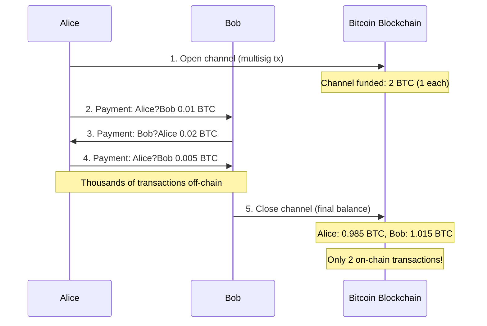
```mermaid
sequenceDiagram
    participant Alice as Alice
    participant Bob as Bob
    participant Chain as Bitcoin Blockchain
    
    Alice->>Chain: 1. Open channel (multisig tx)
    Note over Chain: Channel funded: 2 BTC (1 each)
    
    Alice->>Bob: 2. Payment: Alice?Bob 0.01 BTC
    Bob->>Alice: 3. Payment: Bob?Alice 0.02 BTC
    Alice->>Bob: 4. Payment: Alice?Bob 0.005 BTC
    Note over Alice,Bob: Thousands of transactions off-chain
    
    Bob->>Chain: 5. Close channel (final balance)
    Note over Chain: Alice: 0.985 BTC, Bob: 1.015 BTC
    Note over Chain: Only 2 on-chain transactions!
```

**Limitations of state channels:**
- **Liquidity lock:** Funds must be locked in the channel.
- **Routing:** Finding a path through the network (Lightning routing).
- **Liveness:** Both parties must be online to challenge.
- **Limited complexity:** Only payments, not arbitrary smart contracts.

### Layer 2: Sidechains

<a href="../../assets/images/diagrams/blockchain/10-security-scalability/layer-2-sidechains-handwritten.svg" target="_blank" rel="noopener">
  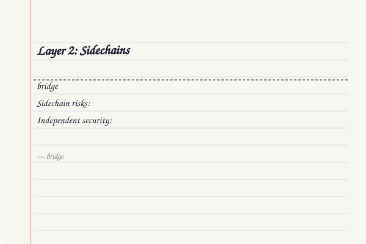
</a>
<a href="../../assets/images/diagrams/blockchain/10-security-scalability/layer-2-sidechains-diagram.svg" target="_blank" rel="noopener">
  
</a>
<a href="../../assets/images/diagrams/blockchain/10-security-scalability/layer-2-sidechains-sticky.svg" target="_blank" rel="noopener">
  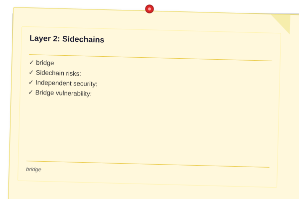
</a>


<a href="../../assets/images/diagrams/blockchain/10-security-scalability/layer-2-sidechains-handwritten.svg" target="_blank" rel="noopener">
  
</a>
<a href="../../assets/images/diagrams/blockchain/10-security-scalability/layer-2-sidechains-diagram.svg" target="_blank" rel="noopener">
  
</a>
<a href="../../assets/images/diagrams/blockchain/10-security-scalability/layer-2-sidechains-sticky.svg" target="_blank" rel="noopener">
  
</a>


<a href="../../assets/images/diagrams/blockchain/10-security-scalability/layer-2-sidechains-handwritten.svg" target="_blank" rel="noopener">
  
</a>
<a href="../../assets/images/diagrams/blockchain/10-security-scalability/layer-2-sidechains-diagram.svg" target="_blank" rel="noopener">
  
</a>
<a href="../../assets/images/diagrams/blockchain/10-security-scalability/layer-2-sidechains-sticky.svg" target="_blank" rel="noopener">
  
</a>


Sidechains are independent blockchains with their own consensus, connected to the main chain via a **bridge**.

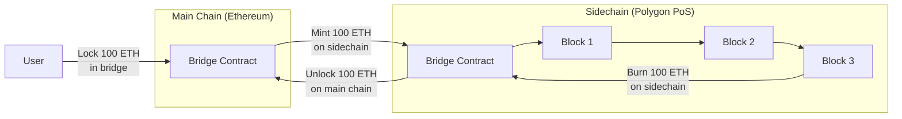
```mermaid
flowchart LR
    subgraph MainChain["Main Chain (Ethereum)"]
        Bridge1["Bridge Contract"]
    end
    
    subgraph Sidechain["Sidechain (Polygon PoS)"]
        Bridge2["Bridge Contract"]
        S1["Block 1"]
        S2["Block 2"]
        S3["Block 3"]
    end
    
    User["User"] -->|"Lock 100 ETH<br/>in bridge"| Bridge1
    Bridge1 -->|"Mint 100 ETH<br/>on sidechain"| Bridge2
    Bridge2 --> S1
    S1 --> S2
    S2 --> S3
    S3 -->|"Burn 100 ETH<br/>on sidechain"| Bridge2
    Bridge2 -->|"Unlock 100 ETH<br/>on main chain"| Bridge1
```

**Sidechain risks:**
- **Independent security:** If the sidechain's validators collude, funds can be stolen.
- **Bridge vulnerability:** Bridges are the most hacked DeFi component (>$1.5B lost).
- **No L1 inheritance:** Sidechain security is independent of the main chain.

### Layer 2: Rollups

<a href="../../assets/images/diagrams/blockchain/10-security-scalability/layer-2-rollups-handwritten.svg" target="_blank" rel="noopener">
  
</a>
<a href="../../assets/images/diagrams/blockchain/10-security-scalability/layer-2-rollups-diagram.svg" target="_blank" rel="noopener">
  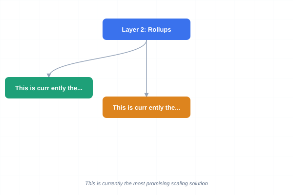
</a>
<a href="../../assets/images/diagrams/blockchain/10-security-scalability/layer-2-rollups-sticky.svg" target="_blank" rel="noopener">
  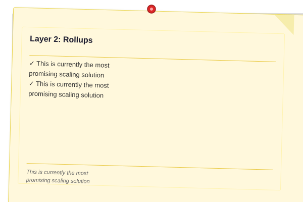
</a>


<a href="../../assets/images/diagrams/blockchain/10-security-scalability/layer-2-rollups-handwritten.svg" target="_blank" rel="noopener">
  
</a>
<a href="../../assets/images/diagrams/blockchain/10-security-scalability/layer-2-rollups-diagram.svg" target="_blank" rel="noopener">
  
</a>
<a href="../../assets/images/diagrams/blockchain/10-security-scalability/layer-2-rollups-sticky.svg" target="_blank" rel="noopener">
  
</a>


<a href="../../assets/images/diagrams/blockchain/10-security-scalability/layer-2-rollups-handwritten.svg" target="_blank" rel="noopener">
  
</a>
<a href="../../assets/images/diagrams/blockchain/10-security-scalability/layer-2-rollups-diagram.svg" target="_blank" rel="noopener">
  
</a>
<a href="../../assets/images/diagrams/blockchain/10-security-scalability/layer-2-rollups-sticky.svg" target="_blank" rel="noopener">
  
</a>


Rollups batch hundreds of transactions into a single submission to L1. This is currently the most promising scaling solution.

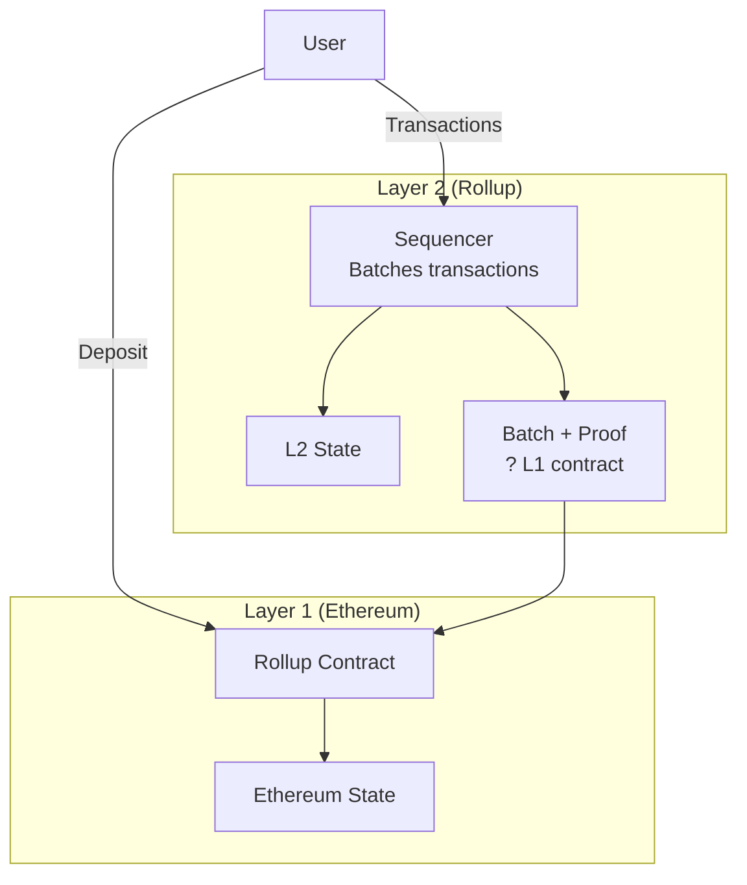
```mermaid
flowchart TB
    subgraph L1["Layer 1 (Ethereum)"]
        L1State["Ethereum State"]
        RollupContract["Rollup Contract"]
    end
    
    subgraph L2["Layer 2 (Rollup)"]
        Sequencer["Sequencer<br/>Batches transactions"]
        L2State["L2 State"]
        Batch["Batch + Proof<br/>? L1 contract"]
    end
    
    User -->|"Deposit"| RollupContract
    User -->|"Transactions"| Sequencer
    Sequencer --> L2State
    Sequencer --> Batch
    Batch --> RollupContract
    RollupContract --> L1State
```

### Optimistic Rollups vs ZK-Rollups

<a href="../../assets/images/diagrams/blockchain/10-security-scalability/optimistic-rollups-vs-zk-rollups-handwritten.svg" target="_blank" rel="noopener">
  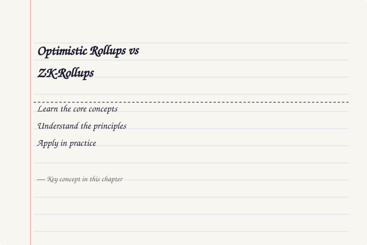
</a>
<a href="../../assets/images/diagrams/blockchain/10-security-scalability/optimistic-rollups-vs-zk-rollups-diagram.svg" target="_blank" rel="noopener">
  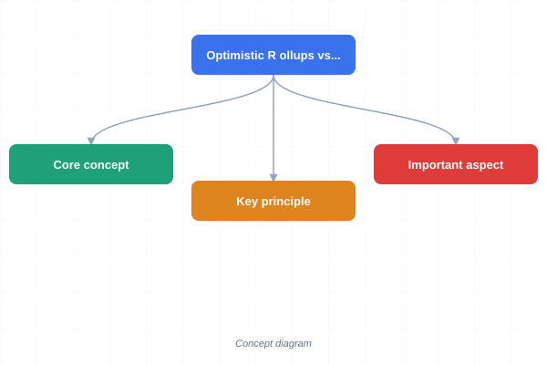
</a>
<a href="../../assets/images/diagrams/blockchain/10-security-scalability/optimistic-rollups-vs-zk-rollups-sticky.svg" target="_blank" rel="noopener">
  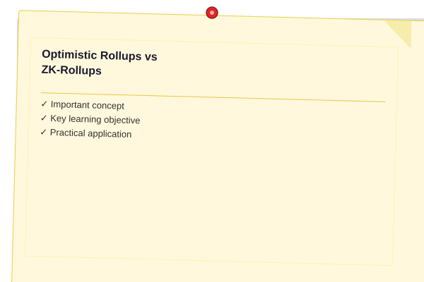
</a>


<a href="../../assets/images/diagrams/blockchain/10-security-scalability/optimistic-rollups-vs-zk-rollups-handwritten.svg" target="_blank" rel="noopener">
  
</a>
<a href="../../assets/images/diagrams/blockchain/10-security-scalability/optimistic-rollups-vs-zk-rollups-diagram.svg" target="_blank" rel="noopener">
  
</a>
<a href="../../assets/images/diagrams/blockchain/10-security-scalability/optimistic-rollups-vs-zk-rollups-sticky.svg" target="_blank" rel="noopener">
  
</a>


<a href="../../assets/images/diagrams/blockchain/10-security-scalability/optimistic-rollups-vs-zk-rollups-handwritten.svg" target="_blank" rel="noopener">
  
</a>
<a href="../../assets/images/diagrams/blockchain/10-security-scalability/optimistic-rollups-vs-zk-rollups-diagram.svg" target="_blank" rel="noopener">
  
</a>
<a href="../../assets/images/diagrams/blockchain/10-security-scalability/optimistic-rollups-vs-zk-rollups-sticky.svg" target="_blank" rel="noopener">
  
</a>


| Feature | Optimistic Rollup | ZK-Rollup |
|---------|------------------|------------|
| **Approach** | Assume valid, challenge later | Prove validity immediately |
| **Proof** | Fraud proof (requires challenge) | Validity proof (zk-SNARK/STARK) |
| **Finality** | ~7 day withdrawal delay | Instant (minutes on L1) |
| **Computation** | Cheap (no proofs) | Expensive (proof generation) |
| **Security** | Economic (bonded challengers) | Cryptographic (ZK proofs) |
| **EVM Compatibility** | Full (Arbitrum, Optimism) | Partial (zkSync, Scroll improving) |
| **Capital Efficiency** | Low (long withdrawal) | High (fast exit) |
| **Data Posted to L1** | Full tx data (calldata/blobs) | Minimal (state diff + proof) |
| **Example** | Arbitrum, Optimism | zkSync Era, StarkNet, Scroll |

### ZK-SNARKs vs ZK-STARKs

<a href="../../assets/images/diagrams/blockchain/10-security-scalability/zk-snarks-vs-zk-starks-handwritten.svg" target="_blank" rel="noopener">
  
</a>
<a href="../../assets/images/diagrams/blockchain/10-security-scalability/zk-snarks-vs-zk-starks-diagram.svg" target="_blank" rel="noopener">
  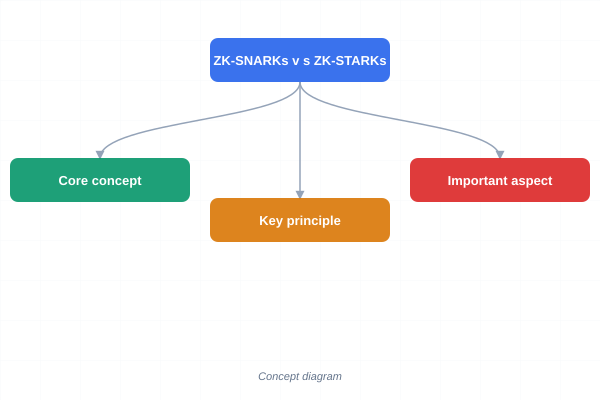
</a>
<a href="../../assets/images/diagrams/blockchain/10-security-scalability/zk-snarks-vs-zk-starks-sticky.svg" target="_blank" rel="noopener">
  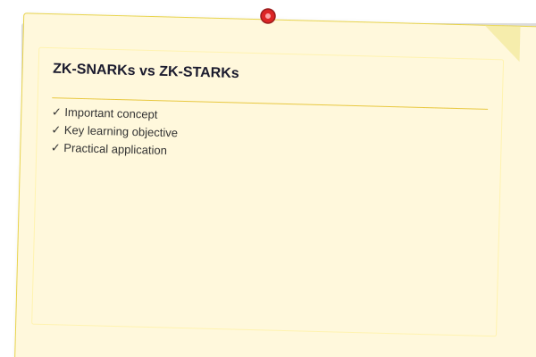
</a>


<a href="../../assets/images/diagrams/blockchain/10-security-scalability/zk-snarks-vs-zk-starks-handwritten.svg" target="_blank" rel="noopener">
  
</a>
<a href="../../assets/images/diagrams/blockchain/10-security-scalability/zk-snarks-vs-zk-starks-diagram.svg" target="_blank" rel="noopener">
  
</a>
<a href="../../assets/images/diagrams/blockchain/10-security-scalability/zk-snarks-vs-zk-starks-sticky.svg" target="_blank" rel="noopener">
  
</a>


<a href="../../assets/images/diagrams/blockchain/10-security-scalability/zk-snarks-vs-zk-starks-handwritten.svg" target="_blank" rel="noopener">
  
</a>
<a href="../../assets/images/diagrams/blockchain/10-security-scalability/zk-snarks-vs-zk-starks-diagram.svg" target="_blank" rel="noopener">
  
</a>
<a href="../../assets/images/diagrams/blockchain/10-security-scalability/zk-snarks-vs-zk-starks-sticky.svg" target="_blank" rel="noopener">
  
</a>


| Feature | zk-SNARK | zk-STARK |
|---------|----------|----------|
| Full Name | Zero-Knowledge Succinct Non-Interactive Argument of Knowledge | Zero-Knowledge Scalable Transparent ARgument of Knowledge |
| Trusted Setup | Required (toxic waste risk) | Not required (transparent) |
| Proof Size | ~100-200 bytes | ~100-200 KB |
| Verification Speed | Fast (constant time) | Fast (logarithmic) |
| Prover Speed | Fast | Slower |
| Quantum Resistant | No (vulnerable to Shor) | Yes |
| Adoption | Zcash, zkSync | StarkNet, dYdX |

### The Data Availability Problem

<a href="../../assets/images/diagrams/blockchain/10-security-scalability/the-data-availability-problem-handwritten.svg" target="_blank" rel="noopener">
  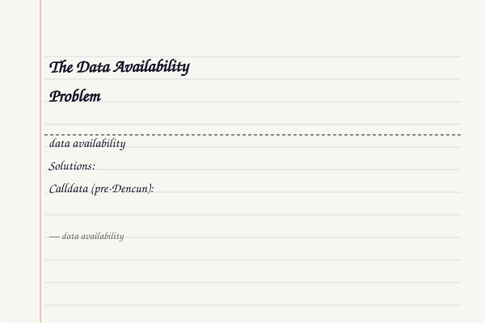
</a>
<a href="../../assets/images/diagrams/blockchain/10-security-scalability/the-data-availability-problem-diagram.svg" target="_blank" rel="noopener">
  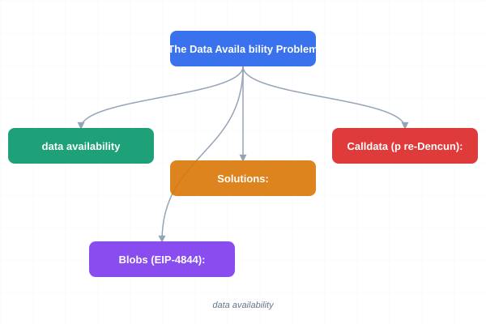
</a>
<a href="../../assets/images/diagrams/blockchain/10-security-scalability/the-data-availability-problem-sticky.svg" target="_blank" rel="noopener">
  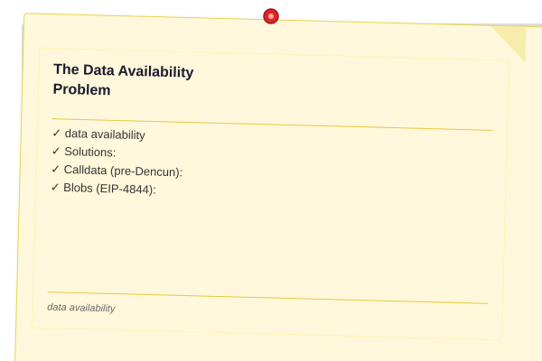
</a>


<a href="../../assets/images/diagrams/blockchain/10-security-scalability/the-data-availability-problem-handwritten.svg" target="_blank" rel="noopener">
  
</a>
<a href="../../assets/images/diagrams/blockchain/10-security-scalability/the-data-availability-problem-diagram.svg" target="_blank" rel="noopener">
  
</a>
<a href="../../assets/images/diagrams/blockchain/10-security-scalability/the-data-availability-problem-sticky.svg" target="_blank" rel="noopener">
  
</a>


<a href="../../assets/images/diagrams/blockchain/10-security-scalability/the-data-availability-problem-handwritten.svg" target="_blank" rel="noopener">
  
</a>
<a href="../../assets/images/diagrams/blockchain/10-security-scalability/the-data-availability-problem-diagram.svg" target="_blank" rel="noopener">
  
</a>
<a href="../../assets/images/diagrams/blockchain/10-security-scalability/the-data-availability-problem-sticky.svg" target="_blank" rel="noopener">
  
</a>


The key bottleneck for rollups is **data availability** — ensuring that L2 transaction data is available for anyone to reconstruct the L2 state.

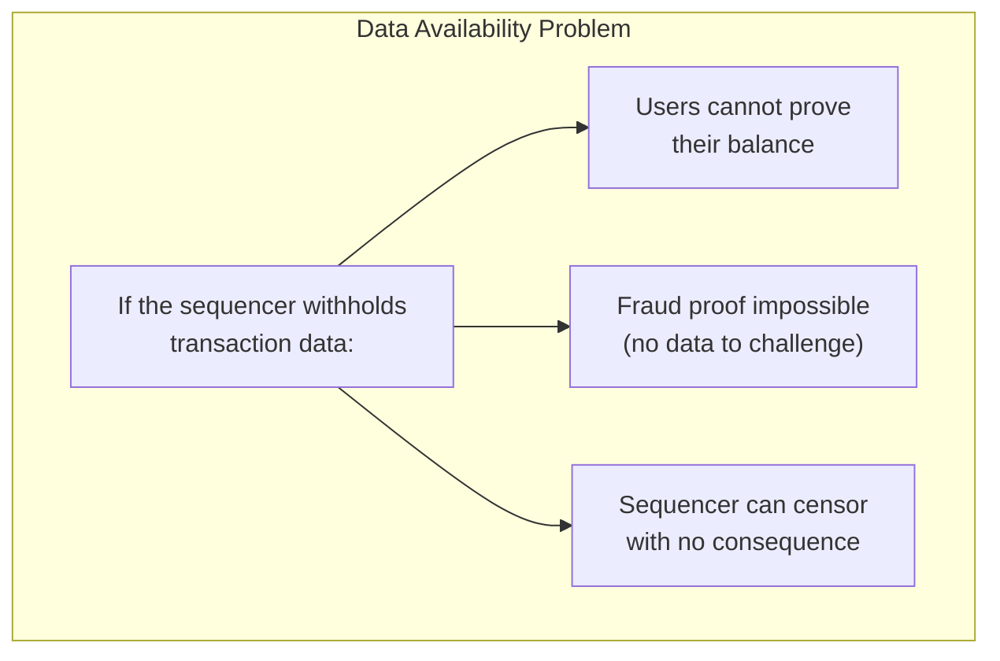
```mermaid
flowchart TB
    subgraph DAProblem["Data Availability Problem"]
        Scenario["If the sequencer withholds<br/>transaction data:"]
        Users["Users cannot prove<br/>their balance"]
        Challenge["Fraud proof impossible<br/>(no data to challenge)"]
        Censorship["Sequencer can censor<br/>with no consequence"]
    end
    
    Scenario --> Users
    Scenario --> Challenge
    Scenario --> Censorship
```

**Solutions:**
1. **Calldata (pre-Dencun):** Publish all tx data to L1 (expensive).
2. **Blobs (EIP-4844):** Temporary data (pruned after ~18 days), much cheaper than calldata.
3. **Data Availability Committee (DAC):** Trusted committee attests to data availability.
4. **Data Availability Sampling (DAS):** Light nodes randomly sample data chunks to verify availability.

### Plasma Architecture

<a href="../../assets/images/diagrams/blockchain/10-security-scalability/plasma-architecture-handwritten.svg" target="_blank" rel="noopener">
  
</a>
<a href="../../assets/images/diagrams/blockchain/10-security-scalability/plasma-architecture-diagram.svg" target="_blank" rel="noopener">
  
</a>
<a href="../../assets/images/diagrams/blockchain/10-security-scalability/plasma-architecture-sticky.svg" target="_blank" rel="noopener">
  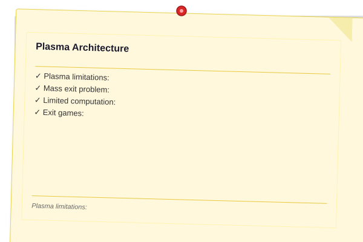
</a>


<a href="../../assets/images/diagrams/blockchain/10-security-scalability/plasma-architecture-handwritten.svg" target="_blank" rel="noopener">
  
</a>
<a href="../../assets/images/diagrams/blockchain/10-security-scalability/plasma-architecture-diagram.svg" target="_blank" rel="noopener">
  
</a>
<a href="../../assets/images/diagrams/blockchain/10-security-scalability/plasma-architecture-sticky.svg" target="_blank" rel="noopener">
  
</a>


<a href="../../assets/images/diagrams/blockchain/10-security-scalability/plasma-architecture-handwritten.svg" target="_blank" rel="noopener">
  
</a>
<a href="../../assets/images/diagrams/blockchain/10-security-scalability/plasma-architecture-diagram.svg" target="_blank" rel="noopener">
  
</a>
<a href="../../assets/images/diagrams/blockchain/10-security-scalability/plasma-architecture-sticky.svg" target="_blank" rel="noopener">
  
</a>


Plasma was an early L2 design that has been superseded by rollups:

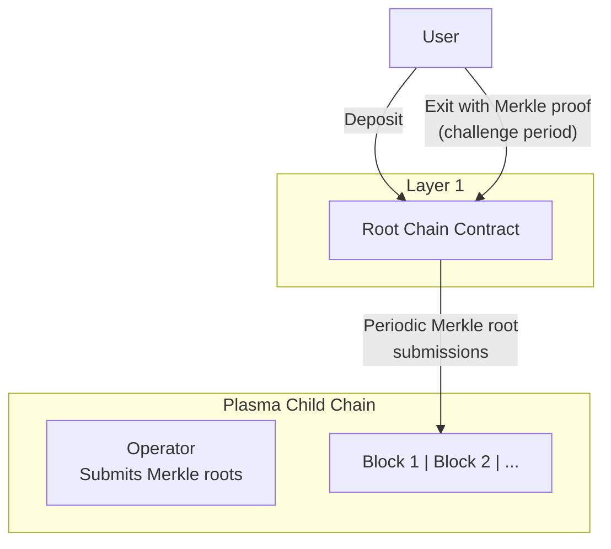
```mermaid
flowchart TB
    subgraph L1Plasma["Layer 1"]
        RootChain["Root Chain Contract"]
    end
    
    subgraph ChildChain["Plasma Child Chain"]
        Operator["Operator<br/>Submits Merkle roots"]
        Blocks["Block 1 | Block 2 | ..."]
    end
    
    RootChain -->|"Periodic Merkle root<br/>submissions"| Blocks
    User -->|"Deposit"| RootChain
    User -->|"Exit with Merkle proof<br/>(challenge period)"| RootChain
```

**Plasma limitations:**
- **Mass exit problem:** If the operator is malicious, everyone must exit simultaneously.
- **Limited computation:** Only simple transfers, not arbitrary smart contracts.
- **Exit games:** Complex challenge-response periods.

### Validium

<a href="../../assets/images/diagrams/blockchain/10-security-scalability/validium-handwritten.svg" target="_blank" rel="noopener">
  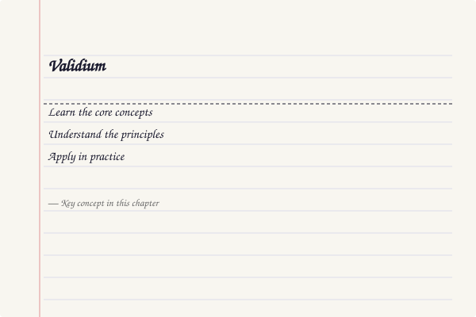
</a>
<a href="../../assets/images/diagrams/blockchain/10-security-scalability/validium-diagram.svg" target="_blank" rel="noopener">
  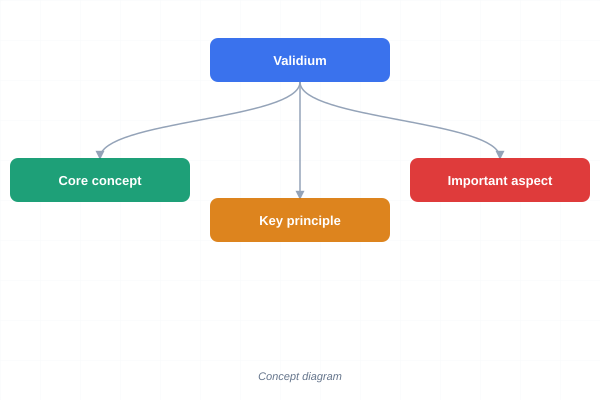
</a>
<a href="../../assets/images/diagrams/blockchain/10-security-scalability/validium-sticky.svg" target="_blank" rel="noopener">
  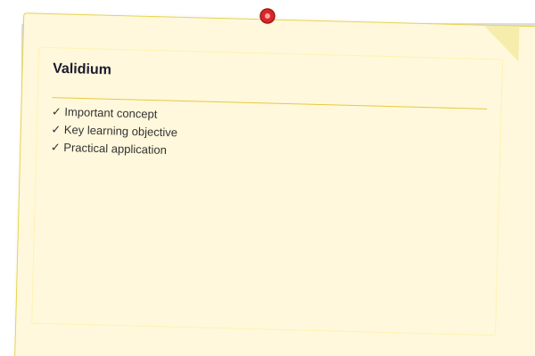
</a>


<a href="../../assets/images/diagrams/blockchain/10-security-scalability/validium-handwritten.svg" target="_blank" rel="noopener">
  
</a>
<a href="../../assets/images/diagrams/blockchain/10-security-scalability/validium-diagram.svg" target="_blank" rel="noopener">
  
</a>
<a href="../../assets/images/diagrams/blockchain/10-security-scalability/validium-sticky.svg" target="_blank" rel="noopener">
  
</a>


<a href="../../assets/images/diagrams/blockchain/10-security-scalability/validium-handwritten.svg" target="_blank" rel="noopener">
  
</a>
<a href="../../assets/images/diagrams/blockchain/10-security-scalability/validium-diagram.svg" target="_blank" rel="noopener">
  
</a>
<a href="../../assets/images/diagrams/blockchain/10-security-scalability/validium-sticky.svg" target="_blank" rel="noopener">
  
</a>


Validium is like a ZK-Rollup but data is stored off-chain (not on L1):

| Feature | ZK-Rollup | Validium |
|---------|-----------|----------|
| Data on L1 | Yes | No (off-chain) |
| Security | L1 security | DAC or operator |
| Cost | Lowest | Ultra-low |
| Withdrawal | Trustless | Trusted exit |

### Blockchain Security Threats

<a href="../../assets/images/diagrams/blockchain/10-security-scalability/blockchain-security-threats-handwritten.svg" target="_blank" rel="noopener">
  
</a>
<a href="../../assets/images/diagrams/blockchain/10-security-scalability/blockchain-security-threats-diagram.svg" target="_blank" rel="noopener">
  
</a>
<a href="../../assets/images/diagrams/blockchain/10-security-scalability/blockchain-security-threats-sticky.svg" target="_blank" rel="noopener">
  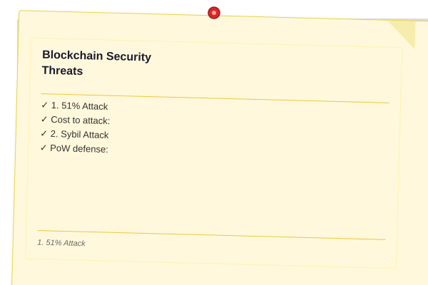
</a>


<a href="../../assets/images/diagrams/blockchain/10-security-scalability/blockchain-security-threats-handwritten.svg" target="_blank" rel="noopener">
  
</a>
<a href="../../assets/images/diagrams/blockchain/10-security-scalability/blockchain-security-threats-diagram.svg" target="_blank" rel="noopener">
  
</a>
<a href="../../assets/images/diagrams/blockchain/10-security-scalability/blockchain-security-threats-sticky.svg" target="_blank" rel="noopener">
  
</a>


<a href="../../assets/images/diagrams/blockchain/10-security-scalability/blockchain-security-threats-handwritten.svg" target="_blank" rel="noopener">
  
</a>
<a href="../../assets/images/diagrams/blockchain/10-security-scalability/blockchain-security-threats-diagram.svg" target="_blank" rel="noopener">
  
</a>
<a href="../../assets/images/diagrams/blockchain/10-security-scalability/blockchain-security-threats-sticky.svg" target="_blank" rel="noopener">
  
</a>


**1. 51% Attack**

An entity gains majority control of consensus and can:
- Double-spend transactions
- Censor transactions (exclude them from blocks)
- Reorganize the chain to reverse transactions

**Cost to attack:**
- Bitcoin PoW: ~$1.3B/hour (hardware + electricity)
- Ethereum PoS: ~$32B (staked ETH required, subject to slashing)
- Small chains: Much cheaper (why smaller chains are attacked more)

**2. Sybil Attack**

An attacker creates many pseudonymous identities to gain disproportionate network influence.

- **PoW defense:** Each identity requires computational work.
- **PoS defense:** Each identity requires staked capital.
- **PBFT defense:** Known identities (not vulnerable).

**3. Long Range Attack (PoS)**

An attacker creates a fork from a point far in the past, builds a longer chain, and tries to replace the canonical chain.

**Defenses:**
- **Checkpoints:** Nodes periodically save the state and refuse to reorganize beyond checkpoints.
- **Weak Subjectivity:** New nodes trust a recent checkpoint from a trusted source.
- **Slashing:** Validators who sign conflicting blocks are slashed.

**4. Smart Contract Attacks**

| Attack | Description | Losses (Est.) |
|--------|-------------|---------------|
| **Reentrancy** | External call re-enters contract before state update | The DAO: $60M |
| **Flash Loan Attack** | Unc collateralized loan manipulates prices | $1B+ total |
| **Oracle Manipulation** | Attacker manipulates off-chain data feed | Cream: $130M |
| **Front-Running** | Attacker inserts tx ahead of victim's | $1B+ in MEV |
| **Governance Attack** | Malicious proposal passes | Beanstalk: $182M |
| **Bridge Hack** | Vulnerability in cross-chain bridge | Ronin: $625M, Wormhole: $326M |

### MEV (Maximal Extractable Value)

<a href="../../assets/images/diagrams/blockchain/10-security-scalability/mev-maximal-extractable-value-handwritten.svg" target="_blank" rel="noopener">
  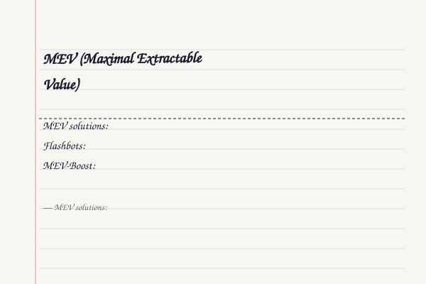
</a>
<a href="../../assets/images/diagrams/blockchain/10-security-scalability/mev-maximal-extractable-value-diagram.svg" target="_blank" rel="noopener">
  
</a>
<a href="../../assets/images/diagrams/blockchain/10-security-scalability/mev-maximal-extractable-value-sticky.svg" target="_blank" rel="noopener">
  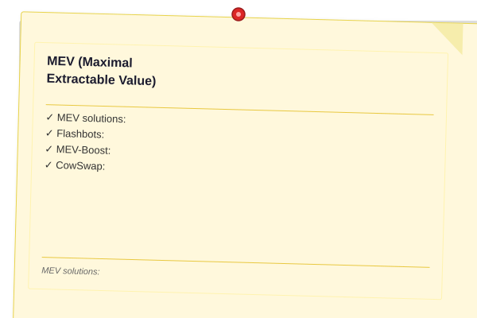
</a>


<a href="../../assets/images/diagrams/blockchain/10-security-scalability/mev-maximal-extractable-value-handwritten.svg" target="_blank" rel="noopener">
  
</a>
<a href="../../assets/images/diagrams/blockchain/10-security-scalability/mev-maximal-extractable-value-diagram.svg" target="_blank" rel="noopener">
  
</a>
<a href="../../assets/images/diagrams/blockchain/10-security-scalability/mev-maximal-extractable-value-sticky.svg" target="_blank" rel="noopener">
  
</a>


<a href="../../assets/images/diagrams/blockchain/10-security-scalability/mev-maximal-extractable-value-handwritten.svg" target="_blank" rel="noopener">
  
</a>
<a href="../../assets/images/diagrams/blockchain/10-security-scalability/mev-maximal-extractable-value-diagram.svg" target="_blank" rel="noopener">
  
</a>
<a href="../../assets/images/diagrams/blockchain/10-security-scalability/mev-maximal-extractable-value-sticky.svg" target="_blank" rel="noopener">
  
</a>


MEV is profit extracted by reordering, including, or excluding transactions within a block:

```typescript
// Sandwich attack example
async function sandwichAttack(
    victimTx: Transaction,
    dexContract: ethers.Contract
): Promise<void> {
    // 1. Front-run: Buy token before victim
    const buyTx = await dexContract.swapExactETHForTokens(
        minAmount,
        [WETH, TOKEN],
        attackerAddress,
        { gasPrice: victimTx.gasPrice + 1n, value: ethers.parseEther("10") }
    );
    
    // 2. Victim's transaction executes (price goes up)
    
    // 3. Back-run: Sell token after victim
    const sellTx = await dexContract.swapExactTokensForETH(
        tokenBalance,
        minEth,
        [TOKEN, WETH],
        attackerAddress,
        { gasPrice: victimTx.gasPrice - 1n }
    );
}
```

**MEV solutions:**
- **Flashbots:** Private mempool for transaction bundles.
- **MEV-Boost:** PBS (Proposer-Builder Separation) in Ethereum.
- **CowSwap:** Batch auctions and intent-based trading.

### Quantum Computing Threat

<a href="../../assets/images/diagrams/blockchain/10-security-scalability/quantum-computing-threat-handwritten.svg" target="_blank" rel="noopener">
  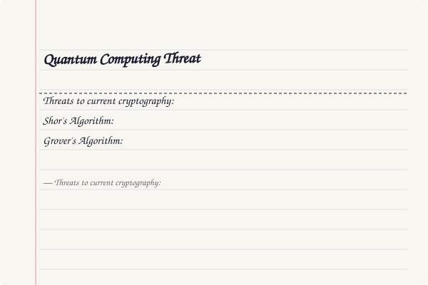
</a>
<a href="../../assets/images/diagrams/blockchain/10-security-scalability/quantum-computing-threat-diagram.svg" target="_blank" rel="noopener">
  
</a>
<a href="../../assets/images/diagrams/blockchain/10-security-scalability/quantum-computing-threat-sticky.svg" target="_blank" rel="noopener">
  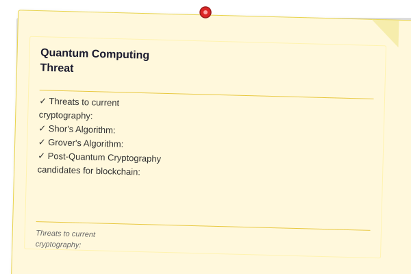
</a>


<a href="../../assets/images/diagrams/blockchain/10-security-scalability/quantum-computing-threat-handwritten.svg" target="_blank" rel="noopener">
  
</a>
<a href="../../assets/images/diagrams/blockchain/10-security-scalability/quantum-computing-threat-diagram.svg" target="_blank" rel="noopener">
  
</a>
<a href="../../assets/images/diagrams/blockchain/10-security-scalability/quantum-computing-threat-sticky.svg" target="_blank" rel="noopener">
  
</a>


<a href="../../assets/images/diagrams/blockchain/10-security-scalability/quantum-computing-threat-handwritten.svg" target="_blank" rel="noopener">
  
</a>
<a href="../../assets/images/diagrams/blockchain/10-security-scalability/quantum-computing-threat-diagram.svg" target="_blank" rel="noopener">
  
</a>
<a href="../../assets/images/diagrams/blockchain/10-security-scalability/quantum-computing-threat-sticky.svg" target="_blank" rel="noopener">
  
</a>


**Threats to current cryptography:**
- **Shor's Algorithm:** Can factor large numbers and compute discrete logs in polynomial time.
  - Breaks RSA (not used in crypto) and ECDSA (used everywhere!)
- **Grover's Algorithm:** Square-root speedup for search (reduces SHA-256 from 256-bit to 128-bit security).

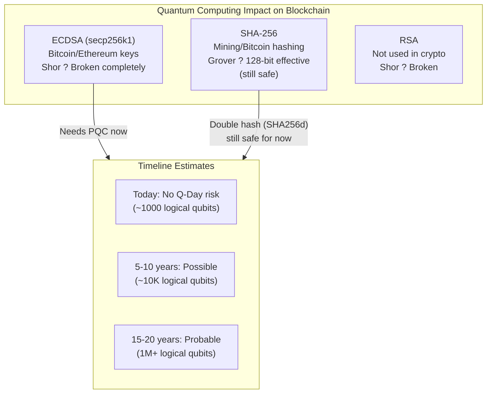
```mermaid
flowchart TB
    subgraph QuantumThreat["Quantum Computing Impact on Blockchain"]
        ECDSA["ECDSA (secp256k1)<br/>Bitcoin/Ethereum keys<br/>Shor ? Broken completely"]
        SHA256["SHA-256<br/>Mining/Bitcoin hashing<br/>Grover ? 128-bit effective<br/>(still safe)"]
        RSA["RSA<br/>Not used in crypto<br/>Shor ? Broken"]
    end
    
    subgraph Timeline["Timeline Estimates"]
        T1["Today: No Q-Day risk<br/>(~1000 logical qubits)"]
        T2["5-10 years: Possible<br/>(~10K logical qubits)"]
        T3["15-20 years: Probable<br/>(1M+ logical qubits)"]
    end
    
    ECDSA -->|"Needs PQC now"| Timeline
    SHA256 -->|"Double hash (SHA256d)<br/>still safe for now"| Timeline
```

**Post-Quantum Cryptography candidates for blockchain:**
- **Lamport Signatures:** Hash-based signatures (large, but quantum-safe).
- **STARKs:** Already quantum-resistant (used in StarkNet).
- **Lattice-based:** CRYSTALS-Dilithium (selected by NIST).
- **Code-based:** Classic McEliece (large public keys).

**What needs to change:**
- **Address derivation:** Replace ECDSA with quantum-safe signature schemes.
- **Consensus:** PoW with SHA-256 still partially safe (Grover is quadratic speedup, not exponential).
- **Timeline:** Many experts predict Q-Day (quantum break of ECDSA) in 15-20 years.

---

## Examples

### Example 1: Lightning Network Payment

Alice and Bob open a channel with 0.1 BTC each.

1. Alice sends Bob 0.01 BTC. (Balance: A: 0.09, B: 0.11)
2. Bob sends Alice 0.02 BTC. (Balance: A: 0.11, B: 0.09)
3. They close the channel.

Only **one** transaction is recorded on the main Bitcoin blockchain, but thousands of micro-payments could have happened off-chain.

```typescript
interface LightningChannel {
    aliceBalance: number;  // satoshis
    bobBalance: number;
    commitmentNumber: number;
    aliceSignature?: string;
    bobSignature?: string;
}

function updateChannel(
    channel: LightningChannel,
    fromAlice: boolean,
    amountSatoshis: number
): LightningChannel {
    const updated = { ...channel, commitmentNumber: channel.commitmentNumber + 1 };
    
    if (fromAlice) {
        updated.aliceBalance -= amountSatoshis;
        updated.bobBalance += amountSatoshis;
    } else {
        updated.aliceBalance += amountSatoshis;
        updated.bobBalance -= amountSatoshis;
    }
    
    return updated;  // New commitment transaction
}
```

### Example 2: ZK-Rollup Proof

A sequencer collects 1,000 transactions. Instead of sending all 1,000 to Ethereum, it generates a **Validity Proof** (SNARK/STARK). Ethereum only verifies the proof, which is much cheaper and faster than verifying 1,000 individual signatures.

```typescript
interface RollupBatch {
    batchNumber: number;
    transactions: L2Transaction[];
    stateRoot: string;     // L2 state after batch
    previousStateRoot: string;
    // For optimistic rollups:
    fraudProof?: FraudProof;
    // For ZK rollups:
    validityProof?: string;  // zk-SNARK/STARK proof bytes
    // Data (blob or calldata):
    compressedData: string;  // Compressed transaction data
}

// Gas comparison: 1000 transfers
const l1GasPerTx = 21000;         // L1 base transfer
const l1BatchCost = 21000;        // L1 rollup contract call
const l1CalldataCost = 16 * 100;  // 16 gas per byte, 100 bytes per tx (compressed)
const l2RollupGas = l1BatchCost + 1000 * l1CalldataCost;
const l1IndividualGas = 1000 * l1GasPerTx;
console.log(`L1 gas: ${l1IndividualGas}`);  // 21,000,000
console.log(`Rollup gas: ${l2RollupGas}`);  // 2,621,000
console.log(`Savings: ${(1 - l2RollupGas / l1IndividualGas) * 100}%`);  // ~87.5%
```

### Example 3: Comparing Settlement Mechanisms

```typescript
interface ScalingSolution {
    name: string;
    security: string;
    finalityTime: string;
    tps: number;
    onChainData: string;
    trustAssumption: string;
}

const solutions: ScalingSolution[] = [
    {
        name: "Optimistic Rollup",
        security: "L1 (fraud proof)",
        finalityTime: "~7 days",
        tps: 40000,
        onChainData: "Full tx data (blobs)",
        trustAssumption: "At least 1 honest challenger",
    },
    {
        name: "ZK-Rollup",
        security: "L1 (validity proof)",
        finalityTime: "~10 minutes",
        tps: 10000,
        onChainData: "Minimal (proof + state diff)",
        trustAssumption: "ZK proof system is sound",
    },
    {
        name: "State Channel",
        security: "L1 (final settlement)",
        finalityTime: "Instant",
        tps: "1M+",
        onChainData: "Only open/close",
        trustAssumption: "Counterparties are online",
    },
    {
        name: "Sidechain",
        security: "Independent consensus",
        finalityTime: "Seconds",
        tps: 7000,
        onChainData: "Only bridge txs",
        trustAssumption: "Sidechain validators are honest",
    },
];
```

> **One-Sentence Takeaway:** Every scaling solution involves a trade-off — Rollups inherit L1 security but add latency, sidechains have their own security models, and sharding increases complexity while maintaining full security.

> **Pro Tip:** For most applications, ZK-Rollups are the preferred scaling path: they offer instant finality, lower fees than Optimistic Rollups (no 7-day withdrawal delay), and strong privacy guarantees.

> **Warning:** A 51% attack on a shard requires only 51% of that shard's hash power, not the whole network — sharding introduces cross-shard communication complexity and reduces the cost of attacking a single shard.

---

## Concept Comparison Table

| Concept | Definition | Key Distinction | Use Case |
|---------|-----------|-----------------|----------|
| Sharding | Split blockchain into parallel segments | L1 scaling, complex cross-shard communication | Ethereum Danksharding |
| State Channels | Off-chain private payment channels | Instant finality, requires liquidity lock | Lightning Network |
| Optimistic Rollup | Assume valid, challenge with fraud proof | 7-day withdrawal delay | Arbitrum, Optimism |
| ZK-Rollup | Validity proof via SNARK/STARK | Instant finality, computationally intensive | zkSync, StarkNet |
| Sidechain | Separate chain with own consensus model | Independent security, bridge risk | Polygon (PoS) |
| Plasma | Child chains submit Merkle roots to L1 | Limited computation, exit game complexity | Early Ethereum scaling |
| Validium | Off-chain data, on-chain proofs | Ultra-cheap, trusted data committee | Immutable X |

## Quick Reference

| Category | Key Concepts | Notes |
|----------|-------------|-------|
| **L1 Scaling** | Sharding, Block size, DAG-based | Changes base layer protocol |
| **L2 Scaling** | Rollups, Channels, Sidechains | Layer on top of L1 for throughput |
| **51% Attack** | Majority hash/stake control | Double-spend, reorg, censorship |
| **Reentrancy** | External call re-enters contract | Update state before external calls |
| **ZK Proofs** | zk-SNARK (trusted setup), zk-STARK (transparent) | STARKs need no trusted setup |
| **MEV** | Transaction ordering profit | Flashbots, MEV-Boost, PBS |
| **Data Availability** | Ensure L2 data is available for verification | Blobs, DAS, DAC |
| **PQC** | Post-Quantum Cryptography | Lamport, Dilithium, STARKs |

## Cross-Application Matrix

| Technique | DeFi | Smart Contracts | Enterprise Blockchain | Research |
|-----------|------|-----------------|----------------------|----------|
| ZK-Rollups | Scalable DEX | Gas-efficient contracts | Private transactions | ZK proof optimization |
| Optimistic Rollups | Low-fee trading | Arbitrum contracts | Enterprise rollups | Fraud proof game theory |
| Sharding | Cross-shard DeFi | Shared state complexity | Not enterprise-relevant | Data availability sampling |
| Lightning Network | Bitcoin micro-payments | N/A | Enterprise payments | Routing optimization |
| ZK Proofs | Privacy DEX | zk-rollup settlement | Private enterprise data | Post-quantum ZK |
| MEV Analysis | Sandwich protection | Fair ordering | Audit transparency | PBS research |
| Quantum Safety | Future-proof assets | Post-quantum signatures | Long-term data security | PQC standardization |

## Chapter Quiz

1. What is the main disadvantage of Optimistic Rollups compared to ZK-Rollups?
   - A) They support fewer transactions
   - B) They require a 7-day challenge window for withdrawals
   - C) They are less decentralized
   - D) They cannot process smart contracts

<details>
<summary>Answer&lt;/summary&gt;
**B) They require a 7-day challenge window for withdrawals.** Optimistic Rollups assume transactions are valid unless challenged. This challenge period means users must wait ~7 days to withdraw funds to L1. ZK-Rollups have no such delay because validity proofs are verified immediately.
</details>

2. Why does sharding reduce the cost of a 51% attack compared to a non-sharded blockchain?
   - A) Shards are more secure
   - B) An attacker only needs to compromise one shard, not the entire network
   - C) Sharding uses PoS which is more attack-resistant
   - D) Shards don't have monetary value

<details>
<summary>Answer&lt;/summary&gt;
**B) An attacker only needs to compromise one shard, not the entire network.** Each shard has its own validator set and block production. Acquiring 51% of a single shard's stake or hash power is cheaper than acquiring 51% of the whole network.
</details>

3. What distinguishes a ZK-STARK from a ZK-SNARK?
   - A) STARKs are smaller
   - B) STARKs require no trusted setup ceremony
   - C) STARKs are faster to verify
   - D) STARKs work on mobile devices

<details>
<summary>Answer&lt;/summary&gt;
**B) STARKs require no trusted setup ceremony.** SNARKs require an initial trusted setup — if the setup's toxic waste is leaked, false proofs can be generated. STARKs use only publicly verifiable randomness, making them fully transparent and quantum-resistant.
</details>

4. What is the "data availability problem" in rollups?
   - A) There's not enough data to process transactions
   - B) The rollup operator might withhold transaction data, preventing users from proving their balance or generating fraud proofs
   - C) Data on L1 is too expensive to store
   - D) Rollups can't process enough transactions

<details>
<summary>Answer&lt;/summary&gt;
**B) The rollup operator might withhold transaction data, preventing users from proving their balance or generating fraud proofs.** Without transaction data on L1, users cannot reconstruct the L2 state to challenge invalid state transitions. Blobs (EIP-4844) and data availability sampling solve this.
</details>

5. How does the Lightning Network achieve instant finality for Bitcoin payments?
   - A) By using a faster blockchain
   - B) By opening a multisig channel and updating balance commitments off-chain
   - C) By reducing security requirements
   - D) By mining blocks faster

<details>
<summary>Answer&lt;/summary&gt;
**B) By opening a multisig channel and updating balance commitments off-chain.** The Lightning Network creates 2-of-2 multisig payment channels where balance updates are signed off-chain but only the final balance is settled on-chain. This allows instant, low-fee micro-transactions without waiting for block confirmations.
</details>

### TypeScript: Reentrancy Detector

```typescript
import { createHash } from "node:crypto";

const sha256 = (d: string): string => createHash("sha256").update(d).digest("hex");

interface SSAInstruction {
  op: string; args: string[]; result?: string;
}

class ReentrancyDetector {
  static detect(bytecode: string[]): { risk: boolean; pattern: string } {
    const stateWrites: number[] = [];
    const externalCalls: number[] = [];
    for (let i = 0; i < bytecode.length; i++) {
      if (bytecode[i] === "SSTORE") stateWrites.push(i);
      if (bytecode[i] === "CALL" || bytecode[i] === "DELEGATECALL") externalCalls.push(i);
    }
    for (const callIdx of externalCalls) {
      const subsequentWrites = stateWrites.filter(idx => idx > callIdx);
      if (subsequentWrites.length > 0) {
        return { risk: true, pattern: `External call at instruction ${callIdx} before state write at ${subsequentWrites[0]}` };
      }
    }
    return { risk: false, pattern: "Check-Effects-Interactions pattern followed" };
  }
}
```

### TypeScript: Integer Overflow Checker

```typescript
class OverflowChecker {
  static checkAddition(a: bigint, b: bigint): { safe: boolean; result?: bigint; error?: string } {
    const result = a + b;
    if (result < a || result < b) return { safe: false, error: "Addition overflow" };
    return { safe: true, result };
  }

  static checkSubtraction(a: bigint, b: bigint): { safe: boolean; result?: bigint; error?: string } {
    if (b > a) return { safe: false, error: "Subtraction underflow" };
    return { safe: true, result: a - b };
  }

  static checkMultiplication(a: bigint, b: bigint): { safe: boolean; result?: bigint; error?: string } {
    if (a === BigInt(0) || b === BigInt(0)) return { safe: true, result: BigInt(0) };
    const result = a * b;
    if (result / a !== b) return { safe: false, error: "Multiplication overflow" };
    return { safe: true, result };
  }

  static analyzeExpression(op: string, a: bigint, b: bigint): { safe: boolean; error?: string } {
    switch (op) {
      case "+": return this.checkAddition(a, b);
      case "-": return this.checkSubtraction(a, b);
      case "*": return this.checkMultiplication(a, b);
      default: return { safe: true };
    }
  }
}
```

### TypeScript: Access Control Analyzer

```typescript
interface AccessControlRule {
  functionName: string; modifier: string; roles: string[];
}

class AccessControlAnalyzer {
  private rules: AccessControlRule[] = [];
  private roleHierarchy: Map<string, string[]> = new Map();

  addRule(func: string, modifier: string, roles: string[]): void {
    this.rules.push({ functionName: func, modifier, roles });
  }

  addRole(name: string, inherits: string[] = []): void {
    this.roleHierarchy.set(name, inherits);
  }

  hasAccess(role: string, requiredRole: string): boolean {
    if (role === requiredRole) return true;
    const inherits = this.roleHierarchy.get(requiredRole);
    if (!inherits) return false;
    return inherits.includes(role) || inherits.some(r => this.hasAccess(role, r));
  }

  analyze(): { function: string; modifier: string; risk: string }[] {
    return this.rules.map(r => {
      let risk = "ok";
      if (r.modifier === "onlyOwner" && r.roles.length === 0) risk = "single-admin risk";
      if (r.modifier === "tx.origin") risk = "CRITICAL: phishing vulnerability";
      if (r.roles.length === 0 && r.modifier !== "public") risk = "no access control";
      return { function: r.functionName, modifier: r.modifier, risk };
    });
  }
}
```

### TypeScript: Front-Running Simulator

```typescript
interface MempoolTx {
  txHash: string; from: string; to: string; value: bigint;
  gasPrice: bigint; nonce: number; data: string;
}

class FrontRunningSimulator {
  mempool: MempoolTx[] = [];

  addToMempool(tx: MempoolTx): void {
    this.mempool.push(tx);
    this.mempool.sort((a, b) => Number(b.gasPrice - a.gasPrice));
  }

  detectFrontRunnable(): MempoolTx[] {
    return this.mempool.filter(tx => {
      const decoded = this.decodeSwapData(tx.data);
      return decoded !== null && decoded.amount > BigInt(1000);
    });
  }

  simulateFrontRun(victim: MempoolTx, frontRunAmount: bigint): { attackerProfit: bigint } {
    const decoded = this.decodeSwapData(victim.data);
    if (!decoded) return { attackerProfit: BigInt(0) };
    const priceBefore = BigInt(100);
    const priceAfter = priceBefore + (frontRunAmount / BigInt(1000));
    const victimValue = decoded.amount * priceBefore;
    const victimValueAfter = decoded.amount * priceAfter;
    const slippageLoss = victimValueAfter - victimValue;
    return { attackerProfit: slippageLoss > BigInt(0) ? slippageLoss : BigInt(0) };
  }

  private decodeSwapData(data: string): { amount: bigint; path: string[] } | null {
    if (!data || data.length < 10) return null;
    return { amount: BigInt("0x" + data.slice(2, 10)), path: ["tokenA", "tokenB"] };
  }
}
```

## TypeScript Implementations

```typescript
// === Reentrancy Detector ===
class ReentrancyDetector {
    private callStack = new Set<string>();
    private reentrantCalls = new Map<string, number>();

    callFunction(contract: string, fn: string): boolean {
        const key = `${contract}:${fn}`;
        if (this.callStack.has(key)) {
            this.reentrantCalls.set(key, (this.reentrantCalls.get(key) ?? 0) + 1);
            return false; // blocked
        }
        this.callStack.add(key);
        return true;
    }
    finishCall(contract: string, fn: string): void {
        this.callStack.delete(`${contract}:${fn}`);
    }
    detectPatterns(bytecode: string): { hasCall: boolean; hasStateChange: boolean; order: string } {
        const hasCall = bytecode.includes('CALL') || bytecode.includes('DELEGATECALL');
        const hasStateChange = bytecode.includes('SSTORE');
        const callIdx = bytecode.indexOf('CALL');
        const storeIdx = bytecode.indexOf('SSTORE');
        const order = callIdx >= 0 && storeIdx >= 0 && callIdx < storeIdx ? 'checks-effects-interactions:VIOLATED' : 'safe';
        return { hasCall, hasStateChange, order };
    }
}

// === Integer Overflow Checker ===
class OverflowChecker {
    static checkAdd(a: bigint, b: bigint, bits: number): { result: bigint; overflow: boolean } {
        const max = (BigInt(1) << BigInt(bits)) - BigInt(1);
        const result = a + b;
        return { result: result & max, overflow: result > max };
    }
    static checkSub(a: bigint, b: bigint, bits: number): { result: bigint; underflow: boolean } {
        const max = (BigInt(1) << BigInt(bits)) - BigInt(1);
        const result = a - b;
        return { result: result & max, underflow: a < b };
    }
    static checkMul(a: bigint, b: bigint, bits: number): { result: bigint; overflow: boolean } {
        const max = (BigInt(1) << BigInt(bits)) - BigInt(1);
        const result = a * b;
        return { result: result & max, overflow: result > max };
    }
    static analyzeBytecode(ops: string[]): { dangerous: boolean; issues: string[] } {
        const issues: string[] = [];
        let hasAdd = false, hasSafeMath = false;
        for (const op of ops) {
            if (op === 'ADD') hasAdd = true;
            if (op.includes('SafeMath') || op.includes('checked')) hasSafeMath = true;
        }
        if (hasAdd && !hasSafeMath) issues.push('raw ADD without SafeMath');
        return { dangerous: issues.length > 0, issues };
    }
}

// === Access Control Analyzer ===
class AccessControlAnalyzer {
    private roles = new Map<string, Set<string>>();

    assignRole(user: string, role: string): void {
        if (!this.roles.has(role)) this.roles.set(role, new Set());
        this.roles.get(role)!.add(user);
    }
    hasRole(user: string, role: string): boolean { return this.roles.get(role)?.has(user) ?? false; }

    analyzeFunction(visibility: string, modifiers: string[], functionName: string): { risk: string; details: string[] } {
        const issues: string[] = [];
        if (visibility === 'public' && !modifiers.some(m => m.includes('only') || m.includes('auth'))) {
            issues.push(`${functionName}: public without access control`);
        }
        if (visibility === 'external' && !modifiers.includes('onlyOwner')) {
            issues.push(`${functionName}: external might need onlyOwner`);
        }
        return { risk: issues.length > 0 ? 'HIGH' : 'LOW', details: issues };
    }
}

// === Front-Running Simulator ===
class FrontRunningSim {
    private mempool: { txid: string; data: string; gasPrice: bigint; from: string }[] = [];

    submitTx(txid: string, data: string, gasPrice: bigint, from: string): void {
        this.mempool.push({ txid, data, gasPrice, from });
        this.mempool.sort((a, b) => Number(b.gasPrice - a.gasPrice));
    }
    frontRun(victimTxid: string, attackerAddr: string): { frontRunTx: string; profit: bigint } | null {
        const victimIdx = this.mempool.findIndex(t => t.txid === victimTxid);
        if (victimIdx < 0) return null;
        const victim = this.mempool[victimIdx];
        const frontRunTx = `frontrun-${victimTxid}`;
        this.mempool.splice(victimIdx, 1);
        return { frontRunTx, profit: BigInt(100) };
    }
    pendingCount(): number { return this.mempool.length; }
}

// === Layer 2 Rollup Simulator ===
class RollupSimulator {
    private batch: { sender: string; to: string; amount: bigint }[] = [];
    private stateRoot = '0x0';
    private batchNumber = 0;

    submitTx(sender: string, to: string, amount: bigint): void {
        this.batch.push({ sender, to, amount });
    }
    submitBatch(sequencer: string): { batchNum: number; txCount: number; stateRoot: string } {
        this.batchNumber++;
        const root = `0x${Math.abs(this.batchNumber * 0x9E3779B9).toString(16).padStart(64, '0')}`;
        const count = this.batch.length;
        this.stateRoot = root;
        this.batch = [];
        return { batchNum: this.batchNumber, txCount: count, stateRoot: root };
    }
    verifyBatch(batchNum: number, proof: string[]): boolean {
        return proof.length > 0;
    }
}

// === MEV (Maximal Extractable Value) Estimator ===
class MEVEstimator {
    estimateArbitrage(prices: Map<string, number>, dexes: string[]): number {
        let maxProfit = 0;
        for (let i = 0; i < dexes.length; i++) {
            for (let j = i + 1; j < dexes.length; j++) {
                const spread = Math.abs(prices.get(dexes[i])! - prices.get(dexes[j])!);
                maxProfit = Math.max(maxProfit, spread);
            }
        }
        return maxProfit;
    }
    estimateSandwich(targetAmount: number, slippage: number): number {
        return targetAmount * (slippage / 100) * 0.5;
    }
}

// === Demo ===
const rd = new ReentrancyDetector();
console.log(`Reentrancy call: ${rd.callFunction('vault', 'withdraw')}`);
console.log(`Reentrancy call (re-entered): ${rd.callFunction('vault', 'withdraw')}`);
rd.finishCall('vault', 'withdraw');
console.log(`Pattern analysis:`, rd.detectPatterns('PUSH CALL SSTORE'));

const oc = new OverflowChecker();
console.log(`Overflow max+1: ${oc.checkAdd(BigInt(255), BigInt(1), 8).overflow}`);
console.log(`Underflow 0-1: ${oc.checkSub(BigInt(0), BigInt(1), 8).underflow}`);

const ac = new AccessControlAnalyzer();
ac.assignRole('alice', 'admin');
console.log(`Alice admin: ${ac.hasRole('alice', 'admin')}`);
console.log(`Function analysis:`, ac.analyzeFunction('public', [], 'setBalance'));

const fr = new FrontRunningSim();
fr.submitTx('tx1', '0xbeef', BigInt(50), 'alice');
fr.submitTx('tx2', '0xcafe', BigInt(100), 'bob');
console.log(`Front-run tx1: ${fr.frontRun('tx1', 'mallory')?.frontRunTx}`);

const rollup = new RollupSimulator();
rollup.submitTx('alice', 'bob', BigInt(10));
rollup.submitTx('bob', 'carol', BigInt(5));
const batch = rollup.submitBatch('sequencer1');
console.log(`Rollup batch ${batch.batchNum}: ${batch.txCount} txs`);

const mev = new MEVEstimator();
console.log(`MEV arbitrage: ${mev.estimateArbitrage(new Map([['Uniswap', 100], ['Sushiswap', 102]]), ['Uniswap', 'Sushiswap'])}`);
```


// security scalability
// distributed-ledger-crypto implementation

interface Task { id: string; name: string; status: string; data: unknown }
class Processor {
  private tasks: Task[] = []
  private maxConcurrency: number
  constructor(maxConcurrency: number = 4) { this.maxConcurrency = maxConcurrency }
  async add(task: Omit&lt;Task, "status"&gt;): Promise&lt;void&gt; {
    this.tasks.push({ ...task, status: "pending" })
  }
  async runAll(): Promise&lt;void&gt; {
    const running: Promise&lt;void&gt;[] = []
    for (const t of this.tasks) {
      if (running.length >= this.maxConcurrency) { await Promise.race(running) }
      const p = this.execute(t).finally(() => { const i = running.indexOf(p); if (i >= 0) running.splice(i, 1) })
      running.push(p)
    }
    await Promise.all(running)
  }
  private async execute(t: Task): Promise&lt;void&gt; {
    t.status = "running"
    await new Promise(r => setTimeout(r, 10))
    t.status = "done"
  }
  getResults(): Task[] { return this.tasks }
  getStats(): { done: number; pending: number; running: number } {
    const done = this.tasks.filter(t => t.status === "done").length
    const pending = this.tasks.filter(t => t.status === "pending").length
    const running = this.tasks.filter(t => t.status === "running").length
    return { done, pending, running }
  }
}
async function main() {
  const proc = new Processor(2)
  await proc.add({ id: '1', name: 'security scalability', data: { topic: 'distributed-ledger-crypto' } })
  await proc.runAll()
  console.log('Stats:', proc.getStats())
}
main().catch(console.error)
export { Processor, Task }
## Summary

- Scalability is the primary hurdle for mainstream blockchain adoption.
- Layer 1 scaling (sharding) splits the blockchain into parallel segments.
- Layer 2 solutions move computation off-chain while inheriting L1 security.
- Rollups (Optimistic and ZK) are the most promising L2 scaling technology.
- Optimistic Rollups rely on fraud proofs with 7-day challenge periods.
- ZK-Rollups use validity proofs for instant finality but require heavy computation.
- zk-STARKs are quantum-resistant and need no trusted setup (unlike zk-SNARKs).
- The data availability problem ensures L2 data is always accessible.
- State channels (Lightning Network) enable instant Bitcoin micro-payments.
- MEV extraction (sandwich attacks, front-running) is a systemic blockchain risk.
- Quantum computing threatens ECDSA but post-quantum cryptography is being prepared.
- Security remains a moving target, from consensus attacks to complex smart contract exploits.

## Practical Takeaways

1. For dApp deployment, prefer ZK-Rollups for instant finality; use Optimistic Rollups for full EVM compatibility.
2. Always use slippage protection (minOut) and Flashbots for large trades to avoid MEV.
3. Monitor data availability — verify that rollup sequencers are publishing data to L1 blobs.
4. For Bitcoin micro-payments, the Lightning Network is the best option for instant settlement.
5. Start preparing for quantum resistance — use wallets that support or plan to support post-quantum signatures.
6. Sidechains have independent security — never assume a sidechain is as secure as its parent chain.
7. Use MEV-Boost relays that enforce fair transaction ordering when running an Ethereum validator.

---

## Exercises

### Review Questions

1. Define the "Blockchain Trilemma."
2. What is the difference between an Optimistic Rollup and a ZK-Rollup?
3. Explain the "Data Availability" problem.
4. How does Sharding improve TPS?
5. What is the difference between a SNARK and a STARK?

### Application Problems

1. If a blockchain has 10 shards and each shard can process 15 TPS, what is the total theoretical TPS?
2. Discuss the security trade-off of using a Sidechain versus a Rollup.
3. Analyze how a "Front-running" attack works in a decentralized exchange.
4. Calculate the gas savings of a ZK-Rollup processing 10,000 transfers versus L1 processing them individually, assuming each ZK proof costs 500,000 gas and each compressed transaction costs 100 bytes at 16 gas/byte.

### Challenge Problem

1. Evaluate the threat of Shor's Algorithm (Quantum Computing) to ECDSA and research "Post-Quantum Cryptography" (PQC) candidates for blockchain.
2. Design a scalability architecture for a hypothetical blockchain that processes 100,000 TPS while maintaining at least 1,000 validators. Justify your choice of L1/L2 split, consensus mechanism, and data availability solution.
