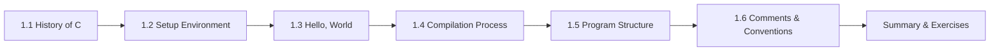

# Chapter 1: Introduction to C


> **Next:** [Variables and Data Types](./02-variables-datatypes.md)
## Learning Objectives

- Understand the historical context and significance of the C language
- Set up a C development environment with GCC or Clang
- Write, compile, and execute a first C program
- Describe the four stages of compilation
- Identify the structural elements of a C program

### Chapter at a Glance

| Topic | Key Insight | Practical Takeaway |
|-------|-------------|-------------------|
| History of C | Created by Dennis Ritchie (1972) for Unix | Understanding C's origins explains its design philosophy of portability and efficiency |
| Development Environment | GCC and Clang are the primary C compilers | Install build-essential (Linux) or Xcode CLT (macOS) and verify with gcc --version |
| Hello World | Every C program needs a main function returning int | Master this skeleton — it is the foundation of every C program you will write |
| Compilation Pipeline | Four stages: preprocessor → compiler → assembler → linker | Use -E, -S, -c flags to inspect each stage's output |
| Program Structure | Comments, directives, globals, main, and function definitions | Organize code in this order for consistency and readability |




## 1.1 History of C

C was developed between 1969 and 1973 by Dennis Ritchie at Bell Telephone Laboratories. It evolved from an earlier language called B, which itself was derived from BCPL. Ritchie designed C to implement the Unix operating system kernel, which had previously been written in assembly language.

**Key milestones:**

| Year | Event |
|------|-------|
| 1972 | Dennis Ritchie creates C for Unix development |
| 1978 | Kernighan and Ritchie publish *The C Programming Language* (K&R C) |
| 1989 | ANSI standardizes C (C89 / ANSI C) |
| 1990 | ISO adopts ANSI C as ISO/IEC 9899:1990 (C90) |
| 1999 | C99 standard introduces inline functions, variable-length arrays, `//` comments |
| 2011 | C11 standard adds multithreading support, anonymous structures, `_Static_assert` |
| 2018 | C17 / C18 — bug-fix release with no new language features |

C remains one of the most influential languages in computing. Its design philosophy — trust the programmer, provide low-level access, and keep the language small — has shaped C++, C#, Java, Go, Rust, and many others.

> **One-Sentence Takeaway:** C was born at Bell Labs to write Unix and its influence is seen in nearly every modern language
> **Remember:** C was developed at Bell Labs by Dennis Ritchie between 1969 and 1973.

## 1.2 Setting Up a C Development Environment

### GCC (GNU Compiler Collection)

**Linux:**
```bash
sudo apt install build-essential    # Debian/Ubuntu
sudo dnf install gcc                # Fedora
```

**macOS:**
```bash
xcode-select --install              # installs Clang
```

**Windows (MinGW-w64):**
Download from https://www.mingw-w64.org/ or use a package manager:
```bash
# Using Scoop
scoop install gcc
```

### Clang

```bash
# Linux
sudo apt install clang              # Debian/Ubuntu

# macOS — already installed via Xcode Command Line Tools
```

### Verify Installation

```bash
gcc --version
```

A successful installation displays version information. If the command is not found, ensure the compiler's bin directory is in your system PATH.

> **One-Sentence Takeaway:** GCC and Clang are free, production-quality compilers available on every major platform

## 1.3 Hello, World

**File: hello.c**
```c
#include <stdio.h>

int main(void)
{
    printf("Hello, World!\n");
    return 0;
}
```

**Compile and run:**
```bash
gcc -std=c11 -Wall -Wextra -o hello hello.c
./hello
```

**Output:**
```
Hello, World!
```

**Explanation of each line:**

- `#include <stdio.h>` — The preprocessor directive that includes the Standard Input/Output header, which declares `printf`.
- `int main(void)` — Every C program must have exactly one `main` function. It is the entry point. The keyword `int` indicates it returns an integer to the operating system.
- `printf("Hello, World!\n");` — Calls the formatted print function. The `\n` is an escape sequence representing a newline character.
- `return 0;` — Returns zero to the OS, conventionally indicating success.

> **One-Sentence Takeaway:** The printf + return 0 pattern is the canonical entry point for every C program

> **Pro Tip:** Compile with -std=c11 -Wall -Wextra to catch common mistakes early. Treat warnings as errors with -Werror.
## 1.4 The Compilation Process


A C source file passes through four distinct stages before becoming an executable:

```
Source (.c)  →  Preprocessor  →  Compiler  →  Assembler  →  Linker  →  Executable
```

### Stage 1: Preprocessing

The preprocessor handles directives that begin with `#`. It:
- Expands `#include` directives by pasting the contents of the referenced header file
- Expands `#define` macros
- Conditionally compiles code based on `#ifdef`, `#ifndef`, etc.
- Strips comments

View the preprocessed output:
```bash
gcc -E hello.c -o hello.i
```

### Stage 2: Compilation

The compiler translates the preprocessed C code into assembly language specific to the target processor architecture.

```bash
gcc -S hello.c -o hello.s      # produces hello.s (assembly)
```

### Stage 3: Assembly

The assembler converts assembly code into machine code (object code) — binary instructions the CPU can execute directly.

```bash
gcc -c hello.c -o hello.o      # produces hello.o (object file)
```

### Stage 4: Linking

The linker combines one or more object files with libraries (such as the C standard library) to produce a single executable. It resolves references to functions like `printf` by linking them to their implementations.

```bash
gcc hello.o -o hello            # links object file into executable
```

> **One-Sentence Takeaway:** Preprocessing expands directives, compilation generates assembly, assembly produces machine code, linking resolves library references

> **Remember:** Use gcc -E to see what the preprocessor produces — it is invaluable for debugging macro expansions.
## 1.5 Structure of a C Program

Every C program follows a consistent structural pattern:

```c
/*
 * File:   program.c
 * Author: Your Name
 * Description: Demonstrates the structure of a C program
 */

#include <stdio.h>    /* preprocessor directives */
#include <stdlib.h>

#define PI 3.14159    /* constant definition */

/* Function prototype (declaration) */
double area_of_circle(double radius);

/* Main function — program entry point */
int main(void)
{
    double r = 5.0;
    double a = area_of_circle(r);
    printf("Radius: %.2f, Area: %.2f\n", r, a);
    return 0;
}

/* Function definition */
double area_of_circle(double radius)
{
    return PI * radius * radius;
}
```

**Anatomy of a C source file:**

| Element | Description |
|---------|-------------|
| Comments | `/* ... */` (multi-line) or `//` (single-line, C99+) |
| Preprocessor directives | Lines beginning with `#`, processed before compilation |
| Global declarations | Variables and functions accessible throughout the file |
| `main` function | Required entry point; execution begins here |
| Function definitions | Reusable blocks of code called from `main` or elsewhere |

> **One-Sentence Takeaway:** Every C file follows a consistent layout: directives, declarations, main function, then other definitions

## 1.6 Comments

Comments are ignored by the compiler. They exist solely for human readers.

```c
/* This is a multi-line comment.
   It can span several lines. */

// This is a single-line comment (C99 and later).
```

**Important:** Comments may not be nested. The sequence `/*` ends a comment, so writing `/* outer /* inner */ outer */` produces a compiler error.

> **One-Sentence Takeaway:** Comments are for humans — the compiler ignores them entirely

> **Warning:** C comments do not nest. A single /* ends any previous /*, even inside another comment.
## 1.7 Basic Program Layout Conventions

While C is free-form (whitespace is ignored except for separating tokens), established conventions improve readability:

- Use **4 spaces** per indentation level (tabs are also common — be consistent).
- Place the opening brace `{` on the same line as the function header (K&R style) or on the next line (Allman style).
- Insert a blank line between logical sections.
- Use descriptive variable names.

```c
/* K&R brace style */
int main(void) {
    printf("Hello\n");
    return 0;
}

/* Allman brace style */
int main(void)
{
    printf("Hello\n");
    return 0;
}
```

> **One-Sentence Takeaway:** Consistent indentation and brace style make code maintainable across teams
> **Warning:** A missing semicolon is the most common syntax error in C programs.

## Concept Comparison Table

| Feature | C | C++ | Java |
|---------|---|-----|------|
| Compilation | Compiled to machine code | Compiled to machine code | Compiled to bytecode (JVM) |
| Memory management | Manual (malloc/free) | Manual (new/delete) | Automatic (GC) |
| Paradigm | Procedural | Multi-paradigm | OOP-centric |
| Pointers | Full support | Full support | No raw pointers |
| Standard | ISO C (C17) | ISO C++ (C++20) | JLS (Java 22) |

## Quick Reference

| Task | Command / Tool | Purpose |
|------|----------------|---------|
| Compile with warnings | gcc -std=c11 -Wall -Wextra -o prog prog.c | Standard compilation with diagnostics |
| Preprocess only | gcc -E prog.c -o prog.i | View macro expansions |
| Compile to assembly | gcc -S prog.c -o prog.s | Read human-readable assembly |
| Compile only (no link) | gcc -c prog.c -o prog.o | Produce object file |
| Check version | gcc --version | Verify compiler installation |

## Cross-Application Matrix

| Area | Application of C |
|------|------------------|
| Operating systems | Linux kernel, Windows kernel components |
| Embedded systems | Microcontrollers, firmware, IoT devices |
| Game engines | Unreal Engine, Godot (core runtime) |
| Databases | SQLite, PostgreSQL (storage engine) |
| Compilers | GCC, Clang, LLVM core — C is used to compile most languages |


## Chapter Quiz

1. What does the linker do in the compilation process?
   A) Expands #include directives
   B) Converts assembly to machine code
   C) Combines object files and resolves library references
   D) Optimizes the code for performance

<details><summary>Answer</summary>**C)** The linker combines object files with libraries to produce the final executable.</details>

2. Which of the following is NOT a valid C comment style?
   A) `/* comment */`
   B) `// comment`
   C) `# comment`
   D) `/* multi-line /* nested */ comment */`

<details><summary>Answer</summary>**C)** `#` starts a preprocessor directive, not a comment. **D)** is invalid because comments do not nest.</details>

3. What does `gcc -c hello.c` produce?
   A) Preprocessed source (.i)
   B) Assembly code (.s)
   C) Object code (.o)
   D) Executable

<details><summary>Answer</summary>**C)** The `-c` flag compiles and assembles but does not link, producing an object file.</details>


## Summary

- C was created by Dennis Ritchie at Bell Labs (1969–1973) and remains foundational to modern systems programming.
- GCC and Clang are the two primary C compilers; use `-std=c11 -Wall -Wextra` for robust compilation.
- The compilation pipeline consists of preprocessing, compilation, assembly, and linking.
- Every C program must contain exactly one `main` function, which returns an integer.
- Preprocessor directives (starting with `#`) are processed before the compiler runs.
- Comments, proper indentation, and consistent brace style make programs more maintainable.

## Exercises

### Review Questions

1. What is the purpose of the `#include <stdio.h>` directive at the top of most C programs?
2. List the four stages of compilation and briefly describe what happens at each stage.
3. Why does the `main` function return an integer? What does the return value signify?
4. Explain the difference between a comment and a preprocessor directive.
5. What is the minimum set of elements required for a valid C program?

### Application Problems

1. Write a program that prints your name, your birth year, and your favorite color on three separate lines.
2. Modify the hello.c program to use a `#define` for the greeting message: `#define GREETING "Hello, C!"`. Print the constant.
3. Write a program that displays the ASCII art of a simple shape (e.g., a rectangle made of asterisks). Compile it with `-Wall -Wextra` and fix any warnings.

### Challenge Problem

Write a program that prints the sizes of the C compilation stages by generating the preprocessed output (`.i`), assembly (`.s`), and object (`.o`) files for a small program. Use the C standard library's `system()` function (from `stdlib.h`) to execute the compiler commands from within your program and output the file sizes using `printf`. Research `system()` in your documentation.
