# Chapter 1: Introduction to C

> **Next:** [Variables and Data Types](./02-variables-datatypes.md)

## Learning Objectives

By the end of this chapter, you will be able to:

<!-- Image Gallery -->
<div style="display:flex;flex-wrap:wrap;gap:4px;margin:16px 0;padding:12px;background:#f8fafc;border-radius:8px;border:1px solid #e2e8f0;">
<a href="../../../assets/images/lessons/c-programming/01-introduction/hero.svg" target="_blank" rel="noopener">
  
</a>
<a href="../../../assets/images/lessons/c-programming/01-introduction/handwritten-notes.svg" target="_blank" rel="noopener">
  
</a>
<a href="../../../assets/images/lessons/c-programming/01-introduction/sticky-notes.svg" target="_blank" rel="noopener">
  
</a>
<a href="../../../assets/images/lessons/c-programming/01-introduction/visual-explanation.svg" target="_blank" rel="noopener">
  
</a>
<a href="../../../assets/images/lessons/c-programming/01-introduction/architecture.svg" target="_blank" rel="noopener">
  
</a>
<a href="../../../assets/images/lessons/c-programming/01-introduction/workflow.svg" target="_blank" rel="noopener">
  
</a>
<a href="../../../assets/images/lessons/c-programming/01-introduction/mindmap.svg" target="_blank" rel="noopener">
  
</a>
<a href="../../../assets/images/lessons/c-programming/01-introduction/comparison.svg" target="_blank" rel="noopener">
  
</a>
<a href="../../../assets/images/lessons/c-programming/01-introduction/cheatsheet.svg" target="_blank" rel="noopener">
  
</a>
<a href="../../../assets/images/lessons/c-programming/01-introduction/interview-quiz.svg" target="_blank" rel="noopener">
  
</a>
<a href="../../../assets/images/lessons/c-programming/01-introduction/social-card.svg" target="_blank" rel="noopener">
  
</a>
</div>
<!-- End Image Gallery -->


- Trace the historical evolution of C from BCPL to C23
- List and explain 10+ features that make C a unique systems programming language
- Set up a C development environment with GCC or Clang
- Write, compile, and execute a first C program
- Describe the four stages of compilation with a real-world analogy
- Identify tokens, identifiers, keywords, and constants
- Distinguish between C standards (C89 through C23)
- Use printf and scanf for basic I/O
- Answer common interview questions about C fundamentals

## Chapter at a Glance

| Topic | Key Insight | Practical Takeaway | Interview Weight |
|-------|-------------|-------------------|------------------|
| History of C | Created by Dennis Ritchie (1972) for Unix | Understanding C's origins explains its design philosophy | ★★ |
| Features of C | Mid-level, procedural, portable, efficient | C gives you power and control —” use it wisely | ★★★ |
| Structure of a C Program | Every program needs a `main` function | Master this skeleton —” it is the foundation | ★★★★ |
| Hello, World | First program teaches you the toolchain | Write, compile, run —” the developer's loop | ★★★ |
| Compilation Pipeline | Preprocessor → Compiler → Assembler → Linker | Use -E, -S, -c flags to inspect each stage | ★★★★★ |
| Comments | `/* */` and `//` —” ignored by compiler | Comments are for humans, not machines | ★ |
| Tokens in C | Smallest meaningful units: keywords, identifiers, constants, strings, operators | Everything in C is built from tokens | ★★★ |
| Identifiers & Keywords | 32 reserved keywords, user-defined names | You cannot use keywords as identifiers | ★★ |
| Constants | Fixed values: integer, float, char, string, symbolic (#define) | Constants make code readable and maintainable | ★★★ |
| Basic I/O | printf outputs, scanf inputs | Format specifiers match types —” mismatch causes UB | ★★★★ |
| C Standards | C89 → C99 → C11 → C17 → C23 | Newer standards add safety and features | ★★★ |



```mermaid
flowchart LR
    A["1.1 History & Features"] --> B["1.2 Setup Environment"]
    B --> C["1.3 Structure of C Program"]
    C --> D["1.4 Hello, World"]
    D --> E["1.5 Compilation Process"]
    E --> F["1.6 Compilation vs Interpretation"]
    F --> G["1.7 Comments"]
    G --> H["1.8 Tokens"]
    H --> I["1.9 Identifiers & 1.10 Keywords"]
    I --> J["1.11 Constants"]
    J --> K["1.12 Basic I/O"]
    K --> L["1.13 C Standards"]
    L --> M["1.14 Interview Corner"]
```

## 1.1 History and Features of C

### 1.1.1 The History of C

<a href="../../../assets/images/diagrams/c-programming/01-introduction/1-1-1-the-history-of-c-handwritten.svg" target="_blank" rel="noopener">
  
</a>
<a href="../../../assets/images/diagrams/c-programming/01-introduction/1-1-1-the-history-of-c-diagram.svg" target="_blank" rel="noopener">
  
</a>
<a href="../../../assets/images/diagrams/c-programming/01-introduction/1-1-1-the-history-of-c-sticky.svg" target="_blank" rel="noopener">
  
</a>


C was developed between 1969 and 1973 by **Dennis Ritchie** at Bell Telephone Laboratories. It evolved from an earlier language called **B** (created by Ken Thompson), which itself was derived from **BCPL** (Basic Combined Programming Language, by Martin Richards). Ritchie designed C to implement the Unix operating system kernel, which had previously been written in assembly language.

**Key Milestones:**

| Year | Event | Significance |
|------|-------|-------------|
| 1969 | Ken Thompson creates B language | Precursor to C, used for early Unix |
| 1972 | Dennis Ritchie creates C | Designed for systems programming on PDP-11 |
| 1973 | Unix rewritten in C | First OS written in a high-level language —” portability breakthrough |
| 1978 | Kernighan & Ritchie publish *The C Programming Language* | "K&R C" becomes the informal standard |
| 1989 | ANSI standardizes C (C89 / ANSI X3.159-1989) | First official standard —” function prototypes, `void`, `const` |
| 1990 | ISO adopts as ISO/IEC 9899:1990 (C90) | Minor editorial changes from C89 |
| 1999 | C99 standard | Inline functions, variable-length arrays, `//` comments, `long long`, designated initializers |
| 2011 | C11 standard | Multithreading (`<thread.h>`), anonymous structs/unions, `_Static_assert`, `_Generic`, `noreturn` |
| 2018 | C17 / C18 | Bug-fix release —” no new language features, just defect fixes |
| 2024 | C23 standard | `bool` becomes a keyword, `typeof`, `#elifdef`, `#elifndef`, `constexpr`, `nullptr`, improved Unicode support |

**Real-World Analogy: Evolution of Transportation**

Just as transportation evolved from walking (assembly) → horse (BCPL) → steam engine (B) → modern car (C), the C language inherited the best ideas from its predecessors while adding new capabilities. BCPL was typeless like a horse-drawn cart —” functional but limited. B added some structure like early automobiles. C became the "modern sedan" —” powerful, reliable, and still the standard for getting real work done.

### 1.1.2 Features of C

<a href="../../../assets/images/diagrams/c-programming/01-introduction/1-1-2-features-of-c-handwritten.svg" target="_blank" rel="noopener">
  
</a>
<a href="../../../assets/images/diagrams/c-programming/01-introduction/1-1-2-features-of-c-diagram.svg" target="_blank" rel="noopener">
  
</a>
<a href="../../../assets/images/diagrams/c-programming/01-introduction/1-1-2-features-of-c-sticky.svg" target="_blank" rel="noopener">
  
</a>


C is often called a **mid-level language** because it combines high-level language features (functions, loops, structures) with low-level capabilities (pointers, bit manipulation, memory addresses).

| # | Feature | Description | Benefit |
|---|---------|-------------|---------|
| 1 | **Procedural** | Programs are organized as functions | Modular, reusable code |
| 2 | **Fast & Efficient** | Compiled to native machine code | Near-assembly performance |
| 3 | **Portable** | C compilers exist for virtually every platform | Write once, compile anywhere |
| 4 | **Rich Set of Operators** | 45+ operators: arithmetic, logical, bitwise, assignment, ternary | Expressive, concise code |
| 5 | **Pointer Support** | Direct memory access via addresses | Systems programming, dynamic memory |
| 6 | **Memory Management** | Manual control with `malloc`/`free` | Predictable performance, no GC pauses |
| 7 | **Statically Typed** | Types checked at compile time | Early error detection, optimized code |
| 8 | **Structured Programming** | Functions, blocks, control flow (`if`, `switch`, loops) | Clear, maintainable code |
| 9 | **Extensive Library** | Standard library: I/O, string, math, time, memory | Rich built-in functionality |
| 10 | **Low-Level Access** | Bit manipulation, register hints, inline assembly | Hardware control, OS development |
| 11 | **Recursion** | Functions can call themselves | Elegant solutions for divide-and-conquer |
| 12 | **Preprocessor** | Text processing before compilation | Conditional compilation, macros, file inclusion |

**Real-World Analogy: Swiss Army Knife**

C is the Swiss Army Knife of programming languages. Other languages are like specialized tools —” Java is a power drill (great for large construction projects), Python is a paintbrush (perfect for quick artistic work). But C is the knife you carry everywhere: it cuts (low-level), it screws (pointers), it files (bit manipulation), it opens bottles (I/O). It does everything adequately and some things exceptionally well. Every programmer should own one.

### 1.1.3 Why C is Still Relevant in 2024+

<a href="../../../assets/images/diagrams/c-programming/01-introduction/1-1-3-why-c-is-still-relevant-in-2024-handwritten.svg" target="_blank" rel="noopener">
  
</a>
<a href="../../../assets/images/diagrams/c-programming/01-introduction/1-1-3-why-c-is-still-relevant-in-2024-diagram.svg" target="_blank" rel="noopener">
  
</a>
<a href="../../../assets/images/diagrams/c-programming/01-introduction/1-1-3-why-c-is-still-relevant-in-2024-sticky.svg" target="_blank" rel="noopener">
  
</a>


1. **Operating Systems**: Linux (≈95% C), Windows kernel, macOS kernel (XNU)
2. **Embedded Systems**: Microcontrollers, firmware, IoT —” billions of devices run C
3. **Language Foundation**: C syntax influenced C++, C#, Java, JavaScript, Go, Rust, Swift
4. **Performance-Critical Code**: Game engines, databases, compilers, real-time systems
5. **Portability**: The C standard library is available everywhere
6. **Career Demand**: Embedded, automotive, aerospace, and IoT engineers are in high demand

## 1.2 Setting Up a C Development Environment

### GCC (GNU Compiler Collection)

<a href="../../../assets/images/diagrams/c-programming/01-introduction/gcc-gnu-compiler-collection-handwritten.svg" target="_blank" rel="noopener">
  
</a>
<a href="../../../assets/images/diagrams/c-programming/01-introduction/gcc-gnu-compiler-collection-diagram.svg" target="_blank" rel="noopener">
  
</a>
<a href="../../../assets/images/diagrams/c-programming/01-introduction/gcc-gnu-compiler-collection-sticky.svg" target="_blank" rel="noopener">
  
</a>


**Linux:**
```bash
sudo apt install build-essential    # Debian/Ubuntu
sudo dnf install gcc                # Fedora
```

**macOS:**
```bash
xcode-select --install              # installs Clang
```

**Windows (MinGW-w64):**
```bash
# Using Scoop
scoop install gcc
```

### Clang

<a href="../../../assets/images/diagrams/c-programming/01-introduction/clang-handwritten.svg" target="_blank" rel="noopener">
  
</a>
<a href="../../../assets/images/diagrams/c-programming/01-introduction/clang-diagram.svg" target="_blank" rel="noopener">
  
</a>
<a href="../../../assets/images/diagrams/c-programming/01-introduction/clang-sticky.svg" target="_blank" rel="noopener">
  
</a>


```bash
# Linux
sudo apt install clang              # Debian/Ubuntu

# macOS —” already installed via Xcode Command Line Tools
```

### Verify Installation

<a href="../../../assets/images/diagrams/c-programming/01-introduction/verify-installation-handwritten.svg" target="_blank" rel="noopener">
  
</a>
<a href="../../../assets/images/diagrams/c-programming/01-introduction/verify-installation-diagram.svg" target="_blank" rel="noopener">
  
</a>
<a href="../../../assets/images/diagrams/c-programming/01-introduction/verify-installation-sticky.svg" target="_blank" rel="noopener">
  
</a>


```bash
gcc --version
```

A successful installation displays version information. If the command is not found, ensure the compiler's bin directory is in your system PATH.

## 1.3 Structure of a C Program

### Real-World Analogy: House Blueprint

<a href="../../../assets/images/diagrams/c-programming/01-introduction/real-world-analogy-house-blueprint-handwritten.svg" target="_blank" rel="noopener">
  
</a>
<a href="../../../assets/images/diagrams/c-programming/01-introduction/real-world-analogy-house-blueprint-diagram.svg" target="_blank" rel="noopener">
  
</a>
<a href="../../../assets/images/diagrams/c-programming/01-introduction/real-world-analogy-house-blueprint-sticky.svg" target="_blank" rel="noopener">
  
</a>


A C program is like a house blueprint:
- **Comments = Annotations on the blueprint**: Notes for the builder, ignored by the construction crew
- **Preprocessor Directives = Building permits and material lists**: `#include <stdio.h>` is like ordering standard materials (windows, doors) from a catalog
- **Global Declarations = Foundation and framing specifications**: These define the overall structure accessible to every room
- **main() Function = The front door**: Every house needs an entrance —” every C program needs a `main()` entry point
- **Function Definitions = Individual rooms**: Each room (function) has a specific purpose and can be reused

### Anatomy of a C Program

<a href="../../../assets/images/diagrams/c-programming/01-introduction/anatomy-of-a-c-program-handwritten.svg" target="_blank" rel="noopener">
  
</a>
<a href="../../../assets/images/diagrams/c-programming/01-introduction/anatomy-of-a-c-program-diagram.svg" target="_blank" rel="noopener">
  
</a>
<a href="../../../assets/images/diagrams/c-programming/01-introduction/anatomy-of-a-c-program-sticky.svg" target="_blank" rel="noopener">
  
</a>


```
┌─────────────────────────────────────────────────────────────────┐
│  /* File: program.c                                             │  ← Comments (annotations)
│   * Purpose: Demonstrate C program structure                    │
│   */                                                            │
├─────────────────────────────────────────────────────────────────┤
│  #include <stdio.h>    /* Standard I/O header */                │  ← Preprocessor Directives
│  #include <stdlib.h>   /* Standard library header */            │     (permits & materials)
│  #define PI 3.14159    /* Macro constant */                     │
├─────────────────────────────────────────────────────────────────┤
│  double area_of_circle(double radius);  /* Function prototype */│  ← Global Declarations
├─────────────────────────────────────────────────────────────────┤
│  int main(void)                                                 │  ← main() —” entry point
│  {                                                              │     (front door)
│      double r = 5.0;                                            │
│      double a = area_of_circle(r);                              │
│      printf("Area: %.2f\n", a);                                 │
│      return 0;                                                  │
│  }                                                              │
├─────────────────────────────────────────────────────────────────┤
│  double area_of_circle(double radius)  /* Function definition */│  ← Other Functions
│  {                                                              │     (rooms)
│      return PI * radius * radius;                               │
│  }                                                              │
└─────────────────────────────────────────────────────────────────┘
```

### Complete Example

<a href="../../../assets/images/diagrams/c-programming/01-introduction/complete-example-handwritten.svg" target="_blank" rel="noopener">
  
</a>
<a href="../../../assets/images/diagrams/c-programming/01-introduction/complete-example-diagram.svg" target="_blank" rel="noopener">
  
</a>
<a href="../../../assets/images/diagrams/c-programming/01-introduction/complete-example-sticky.svg" target="_blank" rel="noopener">
  
</a>


```c
/*
 * File:   structure.c
 * Author: Demo
 * Description: Shows the complete structure of a C program
 */

#include <stdio.h>    /* Standard I/O —” for printf */
#include <stdlib.h>   /* Standard library —” for EXIT_SUCCESS */

#define GREETING "Welcome to C Programming!"

/* Function prototype */
void print_greeting(void);

/* Main function —” entry point */
int main(void)
{
    print_greeting();
    printf("PI = %.4f\n", 3.14159);
    return 0;
}

/* Function definition */
void print_greeting(void)
{
    printf("%s\n", GREETING);
}
```

**Output:**
```
Welcome to C Programming!
PI = 3.1416
```

**Mandatory Elements of a Valid C Program:**

1. At least one function named `main`
2. `main` must return `int`
3. Either no parameters: `int main(void)` —” or two parameters: `int main(int argc, char *argv[])`

### Edge Cases: Structure Violations

<a href="../../../assets/images/diagrams/c-programming/01-introduction/edge-cases-structure-violations-handwritten.svg" target="_blank" rel="noopener">
  
</a>
<a href="../../../assets/images/diagrams/c-programming/01-introduction/edge-cases-structure-violations-diagram.svg" target="_blank" rel="noopener">
  
</a>
<a href="../../../assets/images/diagrams/c-programming/01-introduction/edge-cases-structure-violations-sticky.svg" target="_blank" rel="noopener">
  
</a>


| Violation | Code | Error Message |
|-----------|------|---------------|
| Missing `main` | (no main function) | `undefined reference to 'main'` |
| `main` returns `void` | `void main()` | `'main' must return 'int'` (warning in C89, error in C99+) |
| Missing semicolon | `printf("hello")` | `expected ';' before '}' token` |
| Unmatched brace | `int main() {` | `expected declaration specifiers before '}'` |

## 1.4 Writing Your First C Program: Hello, World!

### Step-by-Step: Creating and Running hello.c

<a href="../../../assets/images/diagrams/c-programming/01-introduction/step-by-step-creating-and-running-hello-c-handwritten.svg" target="_blank" rel="noopener">
  
</a>
<a href="../../../assets/images/diagrams/c-programming/01-introduction/step-by-step-creating-and-running-hello-c-diagram.svg" target="_blank" rel="noopener">
  
</a>
<a href="../../../assets/images/diagrams/c-programming/01-introduction/step-by-step-creating-and-running-hello-c-sticky.svg" target="_blank" rel="noopener">
  
</a>


**File: hello.c**
```c
#include <stdio.h>

int main(void)
{
    printf("Hello, World!\n");
    return 0;
}
```

**Numbered Steps:**

| Step | Action | Command | What Happens |
|------|--------|---------|-------------|
| 1 | Create source file | Create `hello.c` with the code above | Text file with .c extension |
| 2 | Preprocess | `gcc -E hello.c -o hello.i` | `#include` expanded, comments stripped |
| 3 | Compile to assembly | `gcc -S hello.c -o hello.s` | C → assembly language |
| 4 | Assemble | `gcc -c hello.c -o hello.o` | Assembly → machine code (object file) |
| 5 | Link | `gcc hello.o -o hello` | Object + libraries → executable |
| 6 | Run | `./hello` (Linux/macOS) or `hello.exe` (Windows) | Execute the program |

### Dry Run: What Happens Inside the Computer

<a href="../../../assets/images/diagrams/c-programming/01-introduction/dry-run-what-happens-inside-the-computer-handwritten.svg" target="_blank" rel="noopener">
  
</a>
<a href="../../../assets/images/diagrams/c-programming/01-introduction/dry-run-what-happens-inside-the-computer-diagram.svg" target="_blank" rel="noopener">
  
</a>
<a href="../../../assets/images/diagrams/c-programming/01-introduction/dry-run-what-happens-inside-the-computer-sticky.svg" target="_blank" rel="noopener">
  
</a>


| Stage | Input | Process | Output | Key Action |
|-------|-------|---------|--------|------------|
| **Edit** | Ideas in your head | Type code in editor | `hello.c` | Save with .c extension |
| **Preprocess** | `hello.c` | Expand `#include <stdio.h>` → ~800 lines of stdio declarations + your 5 lines | `hello.i` (~805 lines) | `#include` replaced by actual header content |
| **Compile** | `hello.i` | Parse C syntax → generate assembly for your CPU | `hello.s` (~50 lines) | `printf(...)` → `call printf` (assembly) |
| **Assemble** | `hello.s` | Convert mnemonics to binary opcodes | `hello.o` (binary) | `mov` → `b8 04 00 00 00` (x86-64) |
| **Link** | `hello.o` + `libc.a` | Resolve `printf` → link to libc's implementation | `hello` (executable) | `call printf` now points to actual code |
| **Run** | `hello` | OS loads binary into memory, starts execution | **"Hello, World!"** on screen | `printf` writes to stdout |

### Explanation of Each Line

<a href="../../../assets/images/diagrams/c-programming/01-introduction/explanation-of-each-line-handwritten.svg" target="_blank" rel="noopener">
  
</a>
<a href="../../../assets/images/diagrams/c-programming/01-introduction/explanation-of-each-line-diagram.svg" target="_blank" rel="noopener">
  
</a>
<a href="../../../assets/images/diagrams/c-programming/01-introduction/explanation-of-each-line-sticky.svg" target="_blank" rel="noopener">
  
</a>


```c
#include <stdio.h>      // Line 1: Preprocessor directive —” includes Standard I/O header
                        //         Without this, printf() would be undeclared (compiler warning/error)

int main(void)          // Line 3: Entry point. 'int' = returns integer. 'void' = no parameters
{                       // Line 4: Opening brace marks start of function body
    printf("Hello, World!\n");  // Line 5: Calls printf with format string. \n = newline
    return 0;           // Line 6: Returns 0 to OS —” convention for success
}                       // Line 7: Closing brace marks end of function body
```

### Common Compilation and Edge Cases

<a href="../../../assets/images/diagrams/c-programming/01-introduction/common-compilation-and-edge-cases-handwritten.svg" target="_blank" rel="noopener">
  
</a>
<a href="../../../assets/images/diagrams/c-programming/01-introduction/common-compilation-and-edge-cases-diagram.svg" target="_blank" rel="noopener">
  
</a>
<a href="../../../assets/images/diagrams/c-programming/01-introduction/common-compilation-and-edge-cases-sticky.svg" target="_blank" rel="noopener">
  
</a>


**Edge Case 1: Missing semicolon**
```c
int main(void)
{
    printf("Hello, World!\n")  // ← missing semicolon!
    return 0;
}
```
**Compiler Error:**
```
error: expected ';' before 'return'
```

**Resolution:** Every statement in C must end with `;`. Think of it like a period ending a sentence.

**Edge Case 2: Missing `return 0`**
```c
int main(void)
{
    printf("Hello, World!\n");
    // No return statement
}
```
**Behavior:** In C99+, `main()` implicitly returns 0 if control reaches the closing `}`. In C89, this causes undefined behavior (garbage return value).

**Edge Case 3: Wrong parameter list**
```c
int main()          // ← '()' means "unspecified parameters" in C, NOT "no parameters"
{
    return 0;
}
```
**Best practice:** Always use `int main(void)` to explicitly say "takes no arguments."

**Edge Case 4: Missing newline**
```c
printf("Hello, World!");  // No \n
```
**Result:** The output might not appear immediately (buffered stdout), or the shell prompt may appear on the same line.

## 1.5 The Compilation Process

### Real-World Analogy: Building a House

<a href="../../../assets/images/diagrams/c-programming/01-introduction/real-world-analogy-building-a-house-handwritten.svg" target="_blank" rel="noopener">
  
</a>
<a href="../../../assets/images/diagrams/c-programming/01-introduction/real-world-analogy-building-a-house-diagram.svg" target="_blank" rel="noopener">
  
</a>
<a href="../../../assets/images/diagrams/c-programming/01-introduction/real-world-analogy-building-a-house-sticky.svg" target="_blank" rel="noopener">
  
</a>


The C compilation process is like building a house from an architectural plan:

| Compilation Stage | House Construction Analogy |
|-------------------|---------------------------|
| **Source Code (.c)** | Raw architectural blueprint |
| **Preprocessor** | Surveyor interprets the blueprint: marks where doors (headers) go, adds standard specifications (macros), removes notes (comments) |
| **Compiler** | Architect converts the marked-up blueprint into detailed construction drawings (assembly language) —” specific to the building style |
| **Assembler** | Construction crew turns drawings into physical components —” bricks, beams, pipes (machine code object file) |
| **Linker** | General contractor combines all components: your house frame + pre-built windows (libraries) + plumbing modules → finished house (executable) |
| **Loader** | Real estate agent places the family (program) in the house (memory) and opens the front door (starts execution) |

### Stage-by-Stage Breakdown

<a href="../../../assets/images/diagrams/c-programming/01-introduction/stage-by-stage-breakdown-handwritten.svg" target="_blank" rel="noopener">
  
</a>
<a href="../../../assets/images/diagrams/c-programming/01-introduction/stage-by-stage-breakdown-diagram.svg" target="_blank" rel="noopener">
  
</a>
<a href="../../../assets/images/diagrams/c-programming/01-introduction/stage-by-stage-breakdown-sticky.svg" target="_blank" rel="noopener">
  
</a>


#### Stage 1: Preprocessing (`.c` → `.i`)

The preprocessor (`cpp` —” C Preprocessor) handles all directives starting with `#`.

**What it does:**
1. Removes all comments (replaces them with a single space)
2. Expands `#include` —” pastes the entire contents of the referenced file
3. Expands `#define` macros —” replaces `PI` with `3.14159` everywhere
4. Processes conditional compilation —” `#ifdef`, `#ifndef`, `#if`, `#endif`
5. Expands `_Pragma` operators

**View it:**
```bash
gcc -E hello.c -o hello.i
```

**Example: Before and After Preprocessing**

Before (`hello.c`):
```c
#include <stdio.h>
#define MSG "Hello"

int main(void) {
    printf("%s, World!\n", MSG);
    return 0;
}
```

After (`hello.i` —” showing just the expansion of our lines, actual file contains hundreds more from `<stdio.h>`):
```c
# 1 "hello.c"
# 1 "<built-in>"
# 1 "<command-line>"
# 1 "hello.c"
# 1 "c:\\mingw\\include\\stdio.h" 1 3
// ... ~800 lines of stdio.h declarations ...
# 4 "hello.c" 2

int main(void) {
    printf("%s, World!\n", "Hello");
    return 0;
}
```

Notice: `#include <stdio.h>` is gone (replaced by its content), `MSG` is replaced by `"Hello"`, and comments are removed.

#### Stage 2: Compilation (`.i` → `.s`)

The compiler translates preprocessed C code into **assembly language** for the target CPU architecture.

**What it does:**
1. Lexical analysis —” tokenizes the input (breaks into tokens)
2. Syntax analysis —” builds an Abstract Syntax Tree (AST)
3. Semantic analysis —” checks type correctness
4. Intermediate code generation —” produces a platform-independent representation
5. Optimization —” applies transformations for speed, size, or power
6. Code generation —” produces assembly instructions specific to the target CPU

**View it:**
```bash
gcc -S hello.c -o hello.s
```

#### Stage 3: Assembly (`.s` → `.o`)

The assembler (`as`) converts human-readable assembly mnemonics into **machine code** (binary) and produces a **relocatable object file** (`.o` on Linux, `.obj` on Windows).

**What it does:**
1. Parses assembly instructions (e.g., `mov`, `add`, `call`)
2. Converts each mnemonic to its binary opcode (e.g., `mov` → `0xB8`)
3. Resolves labels within the file (jump targets, variable addresses)
4. Produces an object file containing machine code + symbol table + relocation entries

**View it:**
```bash
gcc -c hello.c -o hello.o
```

Use `objdump -d hello.o` to see the machine code:
```bash
objdump -d hello.o
```
```
hello.o:     file format elf64-x86-64

Disassembly of section .text:

0000000000000000 <main>:
   0:   55                      push   %rbp
   1:   48 89 e5                mov    %rsp,%rbp
   4:   bf 00 00 00 00          mov    $0x0,%edi
   9:   b8 00 00 00 00          mov    $0x0,%eax
   e:   e8 00 00 00 00          callq  13 <main+0x13>
  13:   b8 00 00 00 00          mov    $0x0,%eax
  18:   5d                      pop    %rbp
  19:   c3                      retq
```

Notice the `callq` at address `0xe` —” the target address is `0x00000000` (placeholder). The linker will fill this in.

#### Stage 4: Linking (`.o` → executable)

The linker (`ld`) combines one or more object files with libraries to produce a single executable.

**What it does:**
1. Resolves external references —” finds `printf` in the C standard library (`libc.a`)
2. Relocates code —” adjusts addresses in each object file so they don't overlap
3. Combines sections —” merges `.text`, `.data`, `.bss` sections from all inputs
4. Produces the final executable format (ELF on Linux, PE on Windows, Mach-O on macOS)

**View it:**
```bash
gcc hello.o -o hello
```

#### Stage 5: Loading (post-compilation)

When you run `./hello`, the OS **loader**:
1. Reads the executable file from disk
2. Allocates memory for code, data, stack, and heap
3. Copies the program into memory
4. Performs any final relocations (dynamic linking if using `.so`/`.dll`)
5. Sets up the stack, initializes registers
6. Jumps to the entry point (`main`)

### Dry Run: Compilation of `hello.c` with Trace Table

<a href="../../../assets/images/diagrams/c-programming/01-introduction/dry-run-compilation-of-hello-c-with-trace-table-handwritten.svg" target="_blank" rel="noopener">
  
</a>
<a href="../../../assets/images/diagrams/c-programming/01-introduction/dry-run-compilation-of-hello-c-with-trace-table-diagram.svg" target="_blank" rel="noopener">
  
</a>
<a href="../../../assets/images/diagrams/c-programming/01-introduction/dry-run-compilation-of-hello-c-with-trace-table-sticky.svg" target="_blank" rel="noopener">
  
</a>


Let's trace a minimal `hello.c` through all four stages:

**Input:** `hello.c` (6 lines)
```c
#include <stdio.h>
int main(void) {
    printf("Hello, World!\n");
    return 0;
}
```

| Stage | Input Size | Tool | Output | Output Size | Actions Performed |
|-------|-----------|------|--------|-------------|-------------------|
| 1. Preprocess | 94 bytes | `cpp` | `hello.i` | ~28 KB | Expand `#include <stdio.h>` (~800 lines), strip comments |
| 2. Compile | ~28 KB | `cc1` | `hello.s` | ~1.5 KB | Tokenize, parse, generate assembly (x86-64: ~35 instructions) |
| 3. Assemble | ~1.5 KB | `as` | `hello.o` | ~2 KB | Convert mnemonics to binary, create relocation table |
| 4. Link | 2 KB + libc | `ld` | `hello` | ~16 KB | Resolve `printf`, set entry point, create executable header |

### Pseudocode: The Compiler's Internal Phases

<a href="../../../assets/images/diagrams/c-programming/01-introduction/pseudocode-the-compiler-s-internal-phases-handwritten.svg" target="_blank" rel="noopener">
  
</a>
<a href="../../../assets/images/diagrams/c-programming/01-introduction/pseudocode-the-compiler-s-internal-phases-diagram.svg" target="_blank" rel="noopener">
  
</a>
<a href="../../../assets/images/diagrams/c-programming/01-introduction/pseudocode-the-compiler-s-internal-phases-sticky.svg" target="_blank" rel="noopener">
  
</a>


```
PHASE 1: Lexical Analysis (Scanning)
    INPUT:  stream of characters
    OUTPUT: stream of tokens
    ALGORITHM:
        while (not end of file):
            if char is letter or underscore:
                read identifier/keyword → emit IDENTIFIER or KEYWORD token
            if char is digit:
                read number → emit CONSTANT token
            if char is '"':
                read string literal → emit STRING_LITERAL token
            if char is one of { }, ;, (, ), etc:
                emit appropriate PUNCTUATOR token
            if char is '+' or '-' or '*' or '/' etc:
                emit appropriate OPERATOR token
            skip whitespace and comments

PHASE 2: Syntax Analysis (Parsing)
    INPUT:  stream of tokens
    OUTPUT: Abstract Syntax Tree (AST)
    ALGORITHM:
        root = translation_unit()
        function translation_unit():
            while (token != EOF):
                external_declaration()
        function external_declaration():
            if token is KEYWORD(int|void|char|...):
                return function_definition() or declaration()
            else:
                error("expected declaration specifiers")

PHASE 3: Semantic Analysis
    INPUT:  AST
    OUTPUT: Annotated AST (with types)
    ALGORITHM:
        walk AST:
            for each expression node:
                check types of operands match operator expectations
                insert implicit type conversions if needed
                error on type mismatch (e.g., assigning float* to int*)
            for each function call:
                verify number and types of arguments match prototype

PHASE 4: Intermediate Code Generation
    INPUT:  Annotated AST
    OUTPUT: Three-Address Code (TAC)
    EXAMPLE:   printf("Hello\n") → t1 = &"Hello\n"; call printf(t1)
               return 0        → ret 0

PHASE 5: Optimization
    INPUT:  TAC
    OUTPUT: Optimized TAC
    EXAMPLE:   constant folding: 2 + 3 → 5
               dead code elimination: remove unreachable code
               loop unrolling, inlining, etc.

PHASE 6: Code Generation
    INPUT:  Optimized TAC
    OUTPUT: Assembly code
    EXAMPLE:   call printf → mov edi, offset .LC0; xor eax, eax; call printf
               ret 0       → xor eax, eax; ret
```

### Complexity Analysis of Compilation Stages

<a href="../../../assets/images/diagrams/c-programming/01-introduction/complexity-analysis-of-compilation-stages-handwritten.svg" target="_blank" rel="noopener">
  
</a>
<a href="../../../assets/images/diagrams/c-programming/01-introduction/complexity-analysis-of-compilation-stages-diagram.svg" target="_blank" rel="noopener">
  
</a>
<a href="../../../assets/images/diagrams/c-programming/01-introduction/complexity-analysis-of-compilation-stages-sticky.svg" target="_blank" rel="noopener">
  
</a>


| Stage | Time Complexity | Space Complexity | Why? |
|-------|----------------|-----------------|------|
| **Lexical Analysis** | O(n) | O(n) | Scans each character exactly once; stores tokens linearly |
| **Syntax Analysis** | O(n) | O(n) | Recursive descent parsers run in linear time for LL(k) grammars; AST size is proportional to token count |
| **Semantic Analysis** | O(n) | O(n) | Walks the AST once; symbol table size proportional to declarations |
| **Optimization** | O(n log n) to O(n²) | O(n) | Some optimizations (register allocation) use graph coloring —” NP-hard in general, but heuristics run near-linear |
| **Code Generation** | O(n) | O(n) | Linear traversal of optimized IR; instruction selection is pattern matching |
| **Overall** | O(n log n) typical | O(n) | Modern compilers use multi-pass architecture where each pass is linear or near-linear |

**Why O(n log n) overall?** The "log n" comes from table lookups (balanced BST or hash-table operations) during symbol resolution and optimization passes. In practice, for typical programs, compilation time scales linearly with source size.

### Advantages and Disadvantages of the Compilation Process

<a href="../../../assets/images/diagrams/c-programming/01-introduction/advantages-and-disadvantages-of-the-compilation-process-handwritten.svg" target="_blank" rel="noopener">
  
</a>
<a href="../../../assets/images/diagrams/c-programming/01-introduction/advantages-and-disadvantages-of-the-compilation-process-diagram.svg" target="_blank" rel="noopener">
  
</a>
<a href="../../../assets/images/diagrams/c-programming/01-introduction/advantages-and-disadvantages-of-the-compilation-process-sticky.svg" target="_blank" rel="noopener">
  
</a>


| Advantage | Disadvantage |
|-----------|-------------|
| **Fast execution** —” compiled code runs directly on hardware | **Longer edit-compile-debug cycle** —” must recompile after every change |
| **Early error detection** —” syntax and type errors caught at compile time | **Platform-specific** —” executables don't cross OS/CPU boundaries |
| **Optimization opportunities** —” compiler can optimize across the entire program | **Takes more disk space** —” executables are larger than source code |
| **No runtime dependency** —” no interpreter or VM needed | **Complex build process** —” multi-stage pipeline, Makefiles required for large projects |
| **Full hardware access** —” can generate any CPU instruction | **Less portable source** —” some features are platform-dependent (e.g., `#pragma`) |
| **Smaller memory footprint** —” no VM overhead | **Harder debugging** —” need debug info (-g flag) to map binary back to source |

### Common Compilation Errors and What They Mean

<a href="../../../assets/images/diagrams/c-programming/01-introduction/common-compilation-errors-and-what-they-mean-handwritten.svg" target="_blank" rel="noopener">
  
</a>
<a href="../../../assets/images/diagrams/c-programming/01-introduction/common-compilation-errors-and-what-they-mean-diagram.svg" target="_blank" rel="noopener">
  
</a>
<a href="../../../assets/images/diagrams/c-programming/01-introduction/common-compilation-errors-and-what-they-mean-sticky.svg" target="_blank" rel="noopener">
  
</a>


| Error | Stage | Cause | Fix |
|-------|-------|-------|-----|
| `undefined reference to 'main'` | Linker | No main function, or misspelled `mian` | Create `int main(void)` or check spelling |
| `expected ';' before '...'` | Compiler | Missing semicolon | Add `;` at end of statement |
| `implicit declaration of function 'printf'` | Compiler (C89) | Missing `#include <stdio.h>` | Add `#include <stdio.h>` |
| `conflicting types for '...'` | Compiler | Function defined twice with different signatures | Check function declarations |
| `segmentation fault` | Runtime | Null pointer dereference, buffer overflow | Check pointers, array bounds |
| `multiple definition of '...'` | Linker | Same function defined in multiple source files | Use `static` or header guards |

## 1.6 Compilation vs Interpretation: A Detailed Comparison

| Aspect | Compiled Languages (C, C++, Rust, Go) | Interpreted Languages (Python, JavaScript, Ruby, PHP) |
|--------|--------------------------------------|------------------------------------------------------|
| **Process** | Source → Compiler → Machine code → Execute | Source → Interpreter → Execute (line by line) |
| **Translation** | Entire program translated at once | Translated line by line at runtime |
| **Execution Speed** | Fast (native machine code) | Slower (translation overhead at runtime) |
| **Startup Time** | Instant (binary is ready) | Slower (interpreter must initialize) |
| **Memory Usage** | Lower (binary is direct machine code) | Higher (interpreter + runtime objects) |
| **Error Detection** | All errors at compile time | Error at first offending line during execution |
| **Portability of Source** | Recompile for each platform | Source runs anywhere with interpreter |
| **Distribution** | Binary executables (platform-specific) | Source code (must have interpreter) | 
| **Dynamic Features** | Limited (static typing, fixed at compile time) | Extensive (eval, dynamic typing, runtime code gen) |
| **Debugging** | Harder (machine code is far from source) | Easier (interpreter provides rich tracebacks) |
| **Optimization** | Extensive (whole-program optimization) | Limited (just-in-time compilation helps) |
| **Security** | Harder to reverse-engineer | Source visible to user |
| **Examples** | C, C++, Rust, Go, Fortran | Python, JavaScript, Ruby, Perl, PHP |

### Hybrid Approaches

<a href="../../../assets/images/diagrams/c-programming/01-introduction/hybrid-approaches-handwritten.svg" target="_blank" rel="noopener">
  
</a>
<a href="../../../assets/images/diagrams/c-programming/01-introduction/hybrid-approaches-diagram.svg" target="_blank" rel="noopener">
  
</a>
<a href="../../../assets/images/diagrams/c-programming/01-introduction/hybrid-approaches-sticky.svg" target="_blank" rel="noopener">
  
</a>


| Approach | How It Works | Examples |
|----------|-------------|----------|
| **Just-In-Time Compilation** | Interprets initially, then compiles hot paths | Java (JIT), JavaScript (V8), C# |
| **Bytecode Compilation** | Compiles to platform-independent bytecode, then interprets/JIT-compiles | Java (JVM bytecode), Python (.pyc) |
| **Transpilation** | Compiles one high-level language to another | TypeScript → JavaScript, C → WebAssembly |

## 1.7 Comments in C

### Types of Comments

<a href="../../../assets/images/diagrams/c-programming/01-introduction/types-of-comments-handwritten.svg" target="_blank" rel="noopener">
  
</a>
<a href="../../../assets/images/diagrams/c-programming/01-introduction/types-of-comments-diagram.svg" target="_blank" rel="noopener">
  
</a>
<a href="../../../assets/images/diagrams/c-programming/01-introduction/types-of-comments-sticky.svg" target="_blank" rel="noopener">
  
</a>


```c
/* This is a multi-line comment.
   It can span several lines.
   Everything between /* and */ is ignored. */

// This is a single-line comment (introduced in C99).
// Everything from // to the end of the line is ignored.
```

### Rules and Important Notes

<a href="../../../assets/images/diagrams/c-programming/01-introduction/rules-and-important-notes-handwritten.svg" target="_blank" rel="noopener">
  
</a>
<a href="../../../assets/images/diagrams/c-programming/01-introduction/rules-and-important-notes-diagram.svg" target="_blank" rel="noopener">
  
</a>
<a href="../../../assets/images/diagrams/c-programming/01-introduction/rules-and-important-notes-sticky.svg" target="_blank" rel="noopener">
  
</a>


1. **Comments are removed by the preprocessor** —” replaced with a single space
2. **Multi-line comments do NOT nest** —” `/* outer /* inner */ outer */` causes an error
3. **Single-line comments (`//`) require C99 or later** —” use `-std=c99` or higher
4. **Comments can appear anywhere whitespace is allowed**
5. **Do not put comments inside strings** —” `printf("/* not a comment */\n");` prints the text

### Edge Cases

<a href="../../../assets/images/diagrams/c-programming/01-introduction/edge-cases-handwritten.svg" target="_blank" rel="noopener">
  
</a>
<a href="../../../assets/images/diagrams/c-programming/01-introduction/edge-cases-diagram.svg" target="_blank" rel="noopener">
  
</a>
<a href="../../../assets/images/diagrams/c-programming/01-introduction/edge-cases-sticky.svg" target="_blank" rel="noopener">
  
</a>


```c
/* Valid: comment between tokens */
int x /* counter */ = 5;

/* Valid: comment inside a macro */
#define MAX(a, b) /* find max */ ((a) > (b) ? (a) : (b))

/* INVALID: nested comments */
/* outer /* inner */ ← this */  /* ← ERROR: this "ends" a comment that wasn't opened */

/* Tricky: trigraph issue (C89 only —” removed in C23) */
// ??/    ← trigraph for backslash, continues comment to next line!

/* The single-line comment // can contain multi-line comment delimiters: */
// /* this is just text inside a single-line comment */
```

### Best Practices

<a href="../../../assets/images/diagrams/c-programming/01-introduction/best-practices-handwritten.svg" target="_blank" rel="noopener">
  
</a>
<a href="../../../assets/images/diagrams/c-programming/01-introduction/best-practices-diagram.svg" target="_blank" rel="noopener">
  
</a>
<a href="../../../assets/images/diagrams/c-programming/01-introduction/best-practices-sticky.svg" target="_blank" rel="noopener">
  
</a>


```c
/* Use block comments for:
 *   1. File headers (author, date, purpose)
 *   2. Function descriptions
 *   3. Complex algorithm explanations
 */

// Use single-line comments for:
//   1. Short explanations of a single line
//   2. Inline code annotations
//   3. TODO and FIXME notes: // TODO: optimize this loop
```

## 1.8 Tokens in C

### Real-World Analogy: A Library

<a href="../../../assets/images/diagrams/c-programming/01-introduction/real-world-analogy-a-library-handwritten.svg" target="_blank" rel="noopener">
  
</a>
<a href="../../../assets/images/diagrams/c-programming/01-introduction/real-world-analogy-a-library-diagram.svg" target="_blank" rel="noopener">
  
</a>
<a href="../../../assets/images/diagrams/c-programming/01-introduction/real-world-analogy-a-library-sticky.svg" target="_blank" rel="noopener">
  
</a>


A C program is like a library:
- **Keywords** = Library rules (no food, quiet hours) —” fixed, unchangeable, predefined
- **Identifiers** = Book titles —” you choose them, but they must follow naming conventions
- **Constants** = Static exhibits (the displayed artifacts) —” their values don't change
- **String Literals** = Quoted text in books —” sequences of characters
- **Operators** = Library equipment (scanners, carts) —” they perform actions on objects
- **Punctuators/Separators** = Shelf dividers, catalog cards —” they organize and separate items

A **token** is the smallest individual element of a C program that has meaning to the compiler. The compiler breaks your source code into tokens during the lexical analysis phase.

### Classification of Tokens

<a href="../../../assets/images/diagrams/c-programming/01-introduction/classification-of-tokens-handwritten.svg" target="_blank" rel="noopener">
  
</a>
<a href="../../../assets/images/diagrams/c-programming/01-introduction/classification-of-tokens-diagram.svg" target="_blank" rel="noopener">
  
</a>
<a href="../../../assets/images/diagrams/c-programming/01-introduction/classification-of-tokens-sticky.svg" target="_blank" rel="noopener">
  
</a>


```
                          ┌─────────────────────────┐
                          │       TOKENS             │
                          └─────────────────────────┘
                                   │
            ┌──────────────────────┼──────────────────────┐
            │              │               │              │
     ┌──────┴──────┐ ┌─────┴──────┐ ┌──────┴───────┐ ┌───┴────┐
     │  Keywords   │ │ Identifiers│ │  Constants   │ │String  │
     │ (32 total)  │ │ (names)    │ │  (literals)  │ │Literals│
     └─────────────┘ └────────────┘ └──────────────┘ └────────┘
            │
     ┌──────┴──────┐
     │  Operators  │
     │ (45+ total) │
     └─────────────┘
```

### Example: Tokenizing a Line of Code

**Code:**
```c
int count = 10 + 2 * 3;
```

**Tokenization (what the compiler sees):**

| # | Token | Class | Lexeme |
|---|-------|-------|--------|
| 1 | `int` | Keyword | int |
| 2 | `count` | Identifier | count |
| 3 | `=` | Operator | Assignment |
| 4 | `10` | Constant | Integer literal |
| 5 | `+` | Operator | Addition |
| 6 | `2` | Constant | Integer literal |
| 7 | `*` | Operator | Multiplication |
| 8 | `3` | Constant | Integer literal |
| 9 | `;` | Punctuator | Statement terminator |

### 1.8.1 Keywords

<a href="../../../assets/images/diagrams/c-programming/01-introduction/1-8-1-keywords-handwritten.svg" target="_blank" rel="noopener">
  
</a>
<a href="../../../assets/images/diagrams/c-programming/01-introduction/1-8-1-keywords-diagram.svg" target="_blank" rel="noopener">
  
</a>
<a href="../../../assets/images/diagrams/c-programming/01-introduction/1-8-1-keywords-sticky.svg" target="_blank" rel="noopener">
  
</a>


**Keywords** are reserved words that have special meaning to the C compiler. They cannot be used as identifiers (variable names, function names, etc.).

**C89/C90 Keywords (32 total):**

| Category | Keywords |
|----------|----------|
| **Data Types** | `int`, `char`, `float`, `double`, `void`, `struct`, `union`, `enum` |
| **Type Modifiers** | `short`, `long`, `signed`, `unsigned` |
| **Storage Classes** | `auto`, `static`, `extern`, `register` |
| **Type Qualifiers** | `const`, `volatile` |
| **Control Flow** | `if`, `else`, `switch`, `case`, `default`, `for`, `while`, `do`, `break`, `continue`, `goto`, `return` |
| **Other** | `sizeof`, `typedef` |

**C99 added (5):** `inline`, `restrict`, `_Bool`, `_Complex`, `_Imaginary`

**C11 added (7):** `_Alignas`, `_Alignof`, `_Atomic`, `_Static_assert`, `_Noreturn`, `_Thread_local`, `_Generic`

**C23 added:** `bool`, `true`, `false`, `static_assert`, `thread_local`, `alignas`, `alignof`, `typeof`, `typeof_unqual`, `nullptr`, `constexpr` (some were macros in C23, promoted to keywords)

### 1.8.2 Identifiers

<a href="../../../assets/images/diagrams/c-programming/01-introduction/1-8-2-identifiers-handwritten.svg" target="_blank" rel="noopener">
  
</a>
<a href="../../../assets/images/diagrams/c-programming/01-introduction/1-8-2-identifiers-diagram.svg" target="_blank" rel="noopener">
  
</a>
<a href="../../../assets/images/diagrams/c-programming/01-introduction/1-8-2-identifiers-sticky.svg" target="_blank" rel="noopener">
  
</a>


**Identifiers** are names given to variables, functions, structures, unions, and labels.

**Rules for Identifiers:**
1. Must begin with a letter (a-z, A-Z) or underscore (_)
2. Subsequent characters may be letters, digits (0-9), or underscores
3. Case-sensitive: `count`, `Count`, and `COUNT` are three different identifiers
4. Keywords cannot be used as identifiers
5. Length: C99 guarantees 63 significant characters for internal identifiers, 31 for external

**Valid identifiers:**
```c
x              // single letter
count          // descriptive name
total_sum      // underscore separator
node1          // letter + digit
_private       // underscore prefix (reserved for implementation)
camelCaseVar   // camelCase convention
MAX_SIZE       // UPPER_CASE convention for constants
```

**Invalid identifiers:**
```c
1st            // starts with digit
my-var         // hyphen is not allowed
int            // keyword —” reserved
float value    // space is not allowed in identifiers
$money         // $ is not allowed (allowed in C23 via <cuchar> but not in identifiers)
```

### 1.8.3 Constants

<a href="../../../assets/images/diagrams/c-programming/01-introduction/1-8-3-constants-handwritten.svg" target="_blank" rel="noopener">
  
</a>
<a href="../../../assets/images/diagrams/c-programming/01-introduction/1-8-3-constants-diagram.svg" target="_blank" rel="noopener">
  
</a>
<a href="../../../assets/images/diagrams/c-programming/01-introduction/1-8-3-constants-sticky.svg" target="_blank" rel="noopener">
  
</a>


Constants are fixed values that do not change during program execution. (Covered in detail in Section 1.11.)

### 1.8.4 String Literals

<a href="../../../assets/images/diagrams/c-programming/01-introduction/1-8-4-string-literals-handwritten.svg" target="_blank" rel="noopener">
  
</a>
<a href="../../../assets/images/diagrams/c-programming/01-introduction/1-8-4-string-literals-diagram.svg" target="_blank" rel="noopener">
  
</a>
<a href="../../../assets/images/diagrams/c-programming/01-introduction/1-8-4-string-literals-sticky.svg" target="_blank" rel="noopener">
  
</a>


A **string literal** is a sequence of characters enclosed in double quotes.

```c
"Hello, World!"   // string literal
""                // empty string
"Line 1\nLine 2"  // string with escape sequence
```

**Important:** String literals are automatically terminated with a null character (`\0`). `"Hello"` is actually stored as `{'H','e','l','l','o','\0'}` —” 6 bytes, not 5.

### 1.8.5 Operators

<a href="../../../assets/images/diagrams/c-programming/01-introduction/1-8-5-operators-handwritten.svg" target="_blank" rel="noopener">
  
</a>
<a href="../../../assets/images/diagrams/c-programming/01-introduction/1-8-5-operators-diagram.svg" target="_blank" rel="noopener">
  
</a>
<a href="../../../assets/images/diagrams/c-programming/01-introduction/1-8-5-operators-sticky.svg" target="_blank" rel="noopener">
  
</a>


Operators are symbols that perform operations on operands. (45+ operators in C.)

**Categories:** Arithmetic, Relational, Logical, Bitwise, Assignment, Increment/Decrement, Conditional, Pointer, Cast, sizeof, Comma

```c
+  -  *  /  %        // Arithmetic
==  !=  <  >  <=  >=  // Relational
&&  ||  !             // Logical
&  |  ^  ~  <<  >>   // Bitwise
=  +=  -=  *=  ...    // Assignment
++  --                // Increment/Decrement
? :                   // Ternary/Conditional
*  &  ->  .           // Pointer/Structure
sizeof                // Size-of operator
```

## 1.9 Identifiers —” Naming Conventions

### Identifier Length and Scope

<a href="../../../assets/images/diagrams/c-programming/01-introduction/identifier-length-and-scope-handwritten.svg" target="_blank" rel="noopener">
  
</a>
<a href="../../../assets/images/diagrams/c-programming/01-introduction/identifier-length-and-scope-diagram.svg" target="_blank" rel="noopener">
  
</a>
<a href="../../../assets/images/diagrams/c-programming/01-introduction/identifier-length-and-scope-sticky.svg" target="_blank" rel="noopener">
  
</a>


```c
#include <stdio.h>

int global_count = 0;       // Global identifier —” visible everywhere

void process_data(void) {
    int local_temp = 5;     // Local identifier —” visible only inside this function
    {
        int block_var = 10; // Block scope —” visible only inside this block
        printf("%d\n", block_var);
    }
    // printf("%d\n", block_var);  // ERROR: block_var not in scope
}

int main(void) {
    process_data();
    return 0;
}
```

### Naming Conventions

<a href="../../../assets/images/diagrams/c-programming/01-introduction/naming-conventions-handwritten.svg" target="_blank" rel="noopener">
  
</a>
<a href="../../../assets/images/diagrams/c-programming/01-introduction/naming-conventions-diagram.svg" target="_blank" rel="noopener">
  
</a>
<a href="../../../assets/images/diagrams/c-programming/01-introduction/naming-conventions-sticky.svg" target="_blank" rel="noopener">
  
</a>


| Convention | Example | Usage |
|-----------|---------|-------|
| snake_case | `total_sum` | Variables, functions —” most common in C |
| UPPER_CASE | `MAX_BUFFER_SIZE` | Constants (#define macros) |
| CamelCase | `LinkedListNode` | Struct types (used in some projects) |
| _leading_underscore | `_internal` | Reserved for implementation —” DO NOT USE |
| trailing_underscore_ | `name_` | Sometimes used to avoid conflicts |

## 1.10 Keywords —” Complete Reference

### All 32 C89/C90 Keywords

<a href="../../../assets/images/diagrams/c-programming/01-introduction/all-32-c89-c90-keywords-handwritten.svg" target="_blank" rel="noopener">
  
</a>
<a href="../../../assets/images/diagrams/c-programming/01-introduction/all-32-c89-c90-keywords-diagram.svg" target="_blank" rel="noopener">
  
</a>
<a href="../../../assets/images/diagrams/c-programming/01-introduction/all-32-c89-c90-keywords-sticky.svg" target="_blank" rel="noopener">
  
</a>


```c
// Data Types
int       // integer type (at least 16 bits)
char      // character type (1 byte)
float     // floating-point type (single precision)
double    // floating-point type (double precision)
void      // no type / empty parameter list
struct    // structure (aggregate type)
union     // union (overlapping type)
enum      // enumeration (named integer constants)

// Type Modifiers
short     // short integer (at least 16 bits, may be smaller than int)
long      // long integer (at least 32 bits, may be larger than int)
signed    // signed integer (default for int and char)
unsigned  // unsigned integer (no negative values)

// Storage Classes
auto      // automatic storage duration (default for local variables)
static    // static storage duration / internal linkage
extern    // external linkage (declared but defined elsewhere)
register  // hint to store variable in CPU register (deprecated)

// Type Qualifiers
const     // read-only —” value cannot be modified
volatile  // may change unexpectedly (for hardware registers, signal handlers)

// Control Flow
if        // conditional execution
else      // alternative branch
switch    // multi-way branch
case      // branch label in switch
default   // default branch in switch
for       // counted loop
while     // entry-controlled loop
do        // exit-controlled loop (used with while)
break     // exit loop or switch
continue  // skip to next iteration
goto      // unconditional jump (avoid in modern code)
return    // return from function with optional value

// Other
sizeof    // compile-time unary operator returning size in bytes
typedef   // create type aliases
```

## 1.11 Constants in C

A **constant** is a fixed value that does not change during program execution.

### Types of Constants

<a href="../../../assets/images/diagrams/c-programming/01-introduction/types-of-constants-handwritten.svg" target="_blank" rel="noopener">
  
</a>
<a href="../../../assets/images/diagrams/c-programming/01-introduction/types-of-constants-diagram.svg" target="_blank" rel="noopener">
  
</a>
<a href="../../../assets/images/diagrams/c-programming/01-introduction/types-of-constants-sticky.svg" target="_blank" rel="noopener">
  
</a>


```
                    ┌──────────────────────┐
                    │     CONSTANTS          │
                    └──────────────────────┘
                           │
         ┌─────────────────┼─────────────────┐
         │                 │                 │
   ┌─────┴─────┐   ┌──────┴──────┐   ┌──────┴──────┐
   │  Numeric  │   │ Character  │   │  Symbolic   │
   │ Constants │   │ Constants  │   │  Constants  │
   └───────────┘   └────────────┘   └─────────────┘
         │                │
   ┌─────┴─────┐    ┌─────┴──────┐
   │ Integer   │    │ Single     │
   │ Constants │    │ Character  │
   │ Float/Dbl │    │ String     │
   └───────────┘    └────────────┘
```

### 1.11.1 Integer Constants

<a href="../../../assets/images/diagrams/c-programming/01-introduction/1-11-1-integer-constants-handwritten.svg" target="_blank" rel="noopener">
  
</a>
<a href="../../../assets/images/diagrams/c-programming/01-introduction/1-11-1-integer-constants-diagram.svg" target="_blank" rel="noopener">
  
</a>
<a href="../../../assets/images/diagrams/c-programming/01-introduction/1-11-1-integer-constants-sticky.svg" target="_blank" rel="noopener">
  
</a>


```c
42          // Decimal (base 10)
052         // Octal (base 8) —” starts with 0 —” value is 42 in decimal
0x2A        // Hexadecimal (base 16) —” starts with 0x or 0X —” value is 42
0b101010    // Binary (C23) —” starts with 0b or 0B —” value is 42
42U         // Unsigned suffix
42L         // Long suffix
42LL        // Long long suffix (C99)
42UL        // Unsigned long
42ULL       // Unsigned long long
```

### 1.11.2 Floating-Point Constants

<a href="../../../assets/images/diagrams/c-programming/01-introduction/1-11-2-floating-point-constants-handwritten.svg" target="_blank" rel="noopener">
  
</a>
<a href="../../../assets/images/diagrams/c-programming/01-introduction/1-11-2-floating-point-constants-diagram.svg" target="_blank" rel="noopener">
  
</a>
<a href="../../../assets/images/diagrams/c-programming/01-introduction/1-11-2-floating-point-constants-sticky.svg" target="_blank" rel="noopener">
  
</a>


```c
3.14159     // Double (default)
3.14F       // Float suffix
3.14L       // Long double suffix
2.5e-3      // Scientific notation = 0.0025
1.6E+10     // Scientific notation = 16,000,000,000
.5          // = 0.5
5.          // = 5.0
```

### 1.11.3 Character Constants

<a href="../../../assets/images/diagrams/c-programming/01-introduction/1-11-3-character-constants-handwritten.svg" target="_blank" rel="noopener">
  
</a>
<a href="../../../assets/images/diagrams/c-programming/01-introduction/1-11-3-character-constants-diagram.svg" target="_blank" rel="noopener">
  
</a>
<a href="../../../assets/images/diagrams/c-programming/01-introduction/1-11-3-character-constants-sticky.svg" target="_blank" rel="noopener">
  
</a>


```c
'A'         // Character constant —” value 65 in ASCII
'a'         // Character constant —” value 97 in ASCII
'0'         // Character constant —” value 48 in ASCII
'\n'        // Escape sequence —” newline (value 10)
'\t'        // Escape sequence —” tab (value 9)
'\''        // Escape sequence —” single quote (value 39)
'\\'        // Escape sequence —” backslash (value 92)
'\x41'      // Hexadecimal escape —” character 'A' (ASCII 0x41)
'\101'      // Octal escape —” character 'A' (ASCII 101 octal = 65 decimal)
```

### 1.11.4 String Constants (String Literals)

<a href="../../../assets/images/diagrams/c-programming/01-introduction/1-11-4-string-constants-string-literals-handwritten.svg" target="_blank" rel="noopener">
  
</a>
<a href="../../../assets/images/diagrams/c-programming/01-introduction/1-11-4-string-constants-string-literals-diagram.svg" target="_blank" rel="noopener">
  
</a>
<a href="../../../assets/images/diagrams/c-programming/01-introduction/1-11-4-string-constants-string-literals-sticky.svg" target="_blank" rel="noopener">
  
</a>


```c
"Hello"         // String of 5 characters + null terminator = 6 bytes
""              // Empty string = 1 byte (just null terminator)
"Line 1\nLine 2"  // String with embedded newline
"c:\\path\\file" // String with escaped backslashes
```

### 1.11.5 Symbolic Constants (`#define`)

<a href="../../../assets/images/diagrams/c-programming/01-introduction/1-11-5-symbolic-constants-define-handwritten.svg" target="_blank" rel="noopener">
  
</a>
<a href="../../../assets/images/diagrams/c-programming/01-introduction/1-11-5-symbolic-constants-define-diagram.svg" target="_blank" rel="noopener">
  
</a>
<a href="../../../assets/images/diagrams/c-programming/01-introduction/1-11-5-symbolic-constants-define-sticky.svg" target="_blank" rel="noopener">
  
</a>


```c
#include <stdio.h>

#define PI 3.14159
#define MAX_SIZE 100
#define GREETING "Welcome!"
#define AREA(r) (PI * (r) * (r))  // Macro with parameter

int main(void) {
    printf("PI = %f\n", PI);
    printf("Area = %f\n", AREA(5));
    return 0;
}
```

### 1.11.6 The `const` Keyword

<a href="../../../assets/images/diagrams/c-programming/01-introduction/1-11-6-the-const-keyword-handwritten.svg" target="_blank" rel="noopener">
  
</a>
<a href="../../../assets/images/diagrams/c-programming/01-introduction/1-11-6-the-const-keyword-diagram.svg" target="_blank" rel="noopener">
  
</a>
<a href="../../../assets/images/diagrams/c-programming/01-introduction/1-11-6-the-const-keyword-sticky.svg" target="_blank" rel="noopener">
  
</a>


```c
const int DAYS_IN_WEEK = 7;      // Read-only variable
const float GRAVITY = 9.81;      // Cannot be modified after initialization

// DAYS_IN_WEEK = 8;    // ERROR: assignment of read-only variable

const int *ptr;                  // Pointer to a const int (data is const)
int * const ptr2;                // Const pointer to int (address is const)
const int * const ptr3;          // Both pointer and data are const
```

### Difference: `#define` vs `const`

<a href="../../../assets/images/diagrams/c-programming/01-introduction/difference-define-vs-const-handwritten.svg" target="_blank" rel="noopener">
  
</a>
<a href="../../../assets/images/diagrams/c-programming/01-introduction/difference-define-vs-const-diagram.svg" target="_blank" rel="noopener">
  
</a>
<a href="../../../assets/images/diagrams/c-programming/01-introduction/difference-define-vs-const-sticky.svg" target="_blank" rel="noopener">
  
</a>


| Aspect | `#define` | `const` |
|--------|-----------|---------|
| **Handled by** | Preprocessor | Compiler |
| **Type safety** | None (text replacement) | Full type checking |
| **Memory** | No memory allocated | Memory allocated |
| **Scope** | File scope from point of definition | Block scope (follows normal scoping) |
| **Debugging** | Cannot be inspected in debugger | Visible in debugger |
| **Pointer to** | Not applicable | Can have const pointers |

### Edge Cases with Constants

<a href="../../../assets/images/diagrams/c-programming/01-introduction/edge-cases-with-constants-handwritten.svg" target="_blank" rel="noopener">
  
</a>
<a href="../../../assets/images/diagrams/c-programming/01-introduction/edge-cases-with-constants-diagram.svg" target="_blank" rel="noopener">
  
</a>
<a href="../../../assets/images/diagrams/c-programming/01-introduction/edge-cases-with-constants-sticky.svg" target="_blank" rel="noopener">
  
</a>


```c
/* Integer literal overflow */
int x = 2147483648;       // UB if INT_MAX = 2147483647

/* Octal misinterpretation */
int y = 010;              // This is 8 in decimal, NOT 10!

/* String literal modification —” UB! */
char *s = "hello";
s[0] = 'H';               // Undefined behavior —” modifying string literal

/* const-qualified through a pointer —” UB! */
const int c = 10;
int *p = (int *)&c;       // Casting away const
*p = 20;                  // Undefined behavior
```

## 1.12 Basic Input and Output

### 1.12.1 `printf()` —” Formatted Output

<a href="../../../assets/images/diagrams/c-programming/01-introduction/1-12-1-printf-formatted-output-handwritten.svg" target="_blank" rel="noopener">
  
</a>
<a href="../../../assets/images/diagrams/c-programming/01-introduction/1-12-1-printf-formatted-output-diagram.svg" target="_blank" rel="noopener">
  
</a>
<a href="../../../assets/images/diagrams/c-programming/01-introduction/1-12-1-printf-formatted-output-sticky.svg" target="_blank" rel="noopener">
  
</a>


```c
int printf(const char *format, ...);
```

`printf()` writes a formatted string to the standard output (stdout). It returns the number of characters printed on success, or a negative value on error.

### Complete Format Specifier Table

<a href="../../../assets/images/diagrams/c-programming/01-introduction/complete-format-specifier-table-handwritten.svg" target="_blank" rel="noopener">
  
</a>
<a href="../../../assets/images/diagrams/c-programming/01-introduction/complete-format-specifier-table-diagram.svg" target="_blank" rel="noopener">
  
</a>
<a href="../../../assets/images/diagrams/c-programming/01-introduction/complete-format-specifier-table-sticky.svg" target="_blank" rel="noopener">
  
</a>


| Specifier | Type | Example Usage | Output |
|-----------|------|--------------|--------|
| `%d` or `%i` | `int` (signed decimal) | `printf("%d", 42)` | `42` |
| `%u` | `unsigned int` | `printf("%u", 42U)` | `42` |
| `%f` | `double` (decimal) | `printf("%f", 3.14)` | `3.140000` |
| `%lf` | `double` (scanf) / `double` (printf, C99) | `printf("%lf", 3.14)` | `3.140000` |
| `%.2f` | `double` with 2 decimal places | `printf("%.2f", 3.14159)` | `3.14` |
| `%e` or `%E` | `double` (scientific) | `printf("%e", 3.14)` | `3.140000e+00` |
| `%g` or `%G` | `double` (shortest of %f/%e) | `printf("%g", 3.14)` | `3.14` |
| `%c` | `char` (single character) | `printf("%c", 'A')` | `A` |
| `%s` | `char*` (string) | `printf("%s", "hello")` | `hello` |
| `%p` | `void*` (pointer address) | `printf("%p", &x)` | `0x7ffeea3b4c` |
| `%x` or `%X` | `unsigned int` (hex) | `printf("%x", 255)` | `ff` / `FF` |
| `%o` | `unsigned int` (octal) | `printf("%o", 8)` | `10` |
| `%%` | Literal percent sign | `printf("%%")` | `%` |
| `%ld` | `long int` | `printf("%ld", 100000L)` | `100000` |
| `%lld` | `long long int` | `printf("%lld", 100LL)` | `100` |
| `%lu` | `unsigned long` | `printf("%lu", 100UL)` | `100` |
| `%zu` | `size_t` | `printf("%zu", sizeof(int))` | `4` |

### Width and Precision Specifiers

<a href="../../../assets/images/diagrams/c-programming/01-introduction/width-and-precision-specifiers-handwritten.svg" target="_blank" rel="noopener">
  
</a>
<a href="../../../assets/images/diagrams/c-programming/01-introduction/width-and-precision-specifiers-diagram.svg" target="_blank" rel="noopener">
  
</a>
<a href="../../../assets/images/diagrams/c-programming/01-introduction/width-and-precision-specifiers-sticky.svg" target="_blank" rel="noopener">
  
</a>


```c
printf("%10d", 42);       // Right-justified in field width 10: "        42"
printf("%-10d", 42);      // Left-justified in field width 10: "42        "
printf("%010d", 42);      // Zero-padded width 10: "0000000042"
printf("%.5d", 42);       // Minimum 5 digits: "00042"
printf("%10.3f", 3.14);   // Width 10, precision 3: "     3.140"
printf("%-10.3f", 3.14);  // Left-justified, width 10, precision 3: "3.140     "
```

### 1.12.2 `scanf()` —” Formatted Input

<a href="../../../assets/images/diagrams/c-programming/01-introduction/1-12-2-scanf-formatted-input-handwritten.svg" target="_blank" rel="noopener">
  
</a>
<a href="../../../assets/images/diagrams/c-programming/01-introduction/1-12-2-scanf-formatted-input-diagram.svg" target="_blank" rel="noopener">
  
</a>
<a href="../../../assets/images/diagrams/c-programming/01-introduction/1-12-2-scanf-formatted-input-sticky.svg" target="_blank" rel="noopener">
  
</a>


```c
int scanf(const char *format, ...);
```

`scanf()` reads formatted input from the standard input (stdin). It returns the number of input items successfully matched and assigned, or `EOF` on failure.

**CRITICAL:** Always pass the ADDRESS of variables (using `&`) to `scanf`, not the variables themselves.

```c
#include <stdio.h>

int main(void) {
    int age;
    double salary;
    char name[50];

    printf("Enter your name: ");
    scanf("%49s", name);          // No & for arrays —” name decays to pointer

    printf("Enter your age: ");
    scanf("%d", &age);            // &age —” address of age

    printf("Enter your salary: ");
    scanf("%lf", &salary);        // &salary —” address of salary

    printf("Name: %s, Age: %d, Salary: %.2f\n", name, age, salary);
    return 0;
}
```

### Scanf Format Specifiers

<a href="../../../assets/images/diagrams/c-programming/01-introduction/scanf-format-specifiers-handwritten.svg" target="_blank" rel="noopener">
  
</a>
<a href="../../../assets/images/diagrams/c-programming/01-introduction/scanf-format-specifiers-diagram.svg" target="_blank" rel="noopener">
  
</a>
<a href="../../../assets/images/diagrams/c-programming/01-introduction/scanf-format-specifiers-sticky.svg" target="_blank" rel="noopener">
  
</a>


| Specifier | Reads | Example |
|-----------|-------|---------|
| `%d` | Signed decimal integer | `scanf("%d", &x)` |
| `%i` | Signed integer (auto-detect octal/hex) | `scanf("%i", &x)` —” `010` reads as 8 |
| `%u` | Unsigned decimal integer | `scanf("%u", &x)` |
| `%f` | Float | `scanf("%f", &f)` —” for `float` (not double!) |
| `%lf` | Double | `scanf("%lf", &d)` —” for `double` |
| `%c` | Single character | `scanf(" %c", &ch)` —” note space before %c to skip whitespace |
| `%s` | String (whitespace-terminated) | `scanf("%49s", buffer)` —” no & needed for arrays |
| `%x` | Hexadecimal integer | `scanf("%x", &x)` |
| `%o` | Octal integer | `scanf("%o", &x)` |
| `%[...]` | Scanset | `scanf("%[a-zA-Z]", str)` —” read only letters |
| `%*d` | Suppress assignment | `scanf("%*d %d", &x)` —” read and discard first integer |

### Escape Sequences Table

<a href="../../../assets/images/diagrams/c-programming/01-introduction/escape-sequences-table-handwritten.svg" target="_blank" rel="noopener">
  
</a>
<a href="../../../assets/images/diagrams/c-programming/01-introduction/escape-sequences-table-diagram.svg" target="_blank" rel="noopener">
  
</a>
<a href="../../../assets/images/diagrams/c-programming/01-introduction/escape-sequences-table-sticky.svg" target="_blank" rel="noopener">
  
</a>


| Sequence | ASCII Value | Meaning |
|----------|-------------|---------|
| `\n` | 10 (0x0A) | Newline / Line Feed |
| `\t` | 9 (0x09) | Horizontal Tab |
| `\r` | 13 (0x0D) | Carriage Return |
| `\\` | 92 (0x5C) | Backslash |
| `\'` | 39 (0x27) | Single Quote |
| `\"` | 34 (0x22) | Double Quote |
| `\0` | 0 (0x00) | Null (string terminator) |
| `\a` | 7 (0x07) | Bell / Alert |
| `\b` | 8 (0x08) | Backspace |
| `\f` | 12 (0x0C) | Form Feed / Page Break |
| `\v` | 11 (0x0B) | Vertical Tab |
| `\xHH` | 0xHH | Hexadecimal character |
| `\OOO` | OOO (octal) | Octal character |

### Complete I/O Examples

<a href="../../../assets/images/diagrams/c-programming/01-introduction/complete-i-o-examples-handwritten.svg" target="_blank" rel="noopener">
  
</a>
<a href="../../../assets/images/diagrams/c-programming/01-introduction/complete-i-o-examples-diagram.svg" target="_blank" rel="noopener">
  
</a>
<a href="../../../assets/images/diagrams/c-programming/01-introduction/complete-i-o-examples-sticky.svg" target="_blank" rel="noopener">
  
</a>


```c
#include <stdio.h>

int main(void) {
    /* Example 1: Basic output */
    printf("Hello, World!\n");

    /* Example 2: Multiple format specifiers */
    int age = 25;
    double height = 5.9;
    printf("Age: %d, Height: %.1f feet\n", age, height);

    /* Example 3: Field width and alignment */
    printf("|%10s|%10s|\n", "Name", "Score");
    printf("|%10s|%10d|\n", "Alice", 95);
    printf("|%10s|%10d|\n", "Bob", 87);

    /* Example 4: scanf with validation */
    int num;
    printf("Enter a number: ");
    if (scanf("%d", &num) == 1) {
        printf("You entered: %d\n", num);
    } else {
        printf("Invalid input!\n");
    }

    /* Example 5: Printf returns character count */
    int chars = printf("Test\n");
    printf("Previous printf printed %d characters\n", chars);  // 5 (T,e,s,t,\n)

    return 0;
}
```

**Output:**
```
Hello, World!
Age: 25, Height: 5.9 feet
|      Name|     Score|
|     Alice|        95|
|       Bob|        87|
Enter a number: 42
You entered: 42
Test
Previous printf printed 5 characters
```

### Common scanf Pitfalls

<a href="../../../assets/images/diagrams/c-programming/01-introduction/common-scanf-pitfalls-handwritten.svg" target="_blank" rel="noopener">
  
</a>
<a href="../../../assets/images/diagrams/c-programming/01-introduction/common-scanf-pitfalls-diagram.svg" target="_blank" rel="noopener">
  
</a>
<a href="../../../assets/images/diagrams/c-programming/01-introduction/common-scanf-pitfalls-sticky.svg" target="_blank" rel="noopener">
  
</a>


```c
/* Pitfall 1: Trailing newline */
int x;
char ch;
scanf("%d", &x);           // User types 42 and presses Enter —” "42\n" in buffer
scanf("%c", &ch);          // Reads '\n' (leftover), not the next character!
/* Fix: Add space before %c */
scanf(" %c", &ch);         // Space skips whitespace before %c

/* Pitfall 2: Buffer overflow with %s */
char buf[5];
scanf("%s", buf);          // If user types "HelloWorld", buffer overflow!
/* Fix: Use field width */
scanf("%4s", buf);         // Reads at most 4 chars + null terminator

/* Pitfall 3: %f vs %lf in scanf */
float f;
double d;
scanf("%f", &f);           // %f for float —” CORRECT
scanf("%lf", &d);          // %lf for double —” CORRECT (NOT %f!)
/* Note: In printf, %f works for BOTH float and double (float promotes to double) */
```

## 1.13 C Standards: From K&R to C23

### Timeline and Feature Comparison

<a href="../../../assets/images/diagrams/c-programming/01-introduction/timeline-and-feature-comparison-handwritten.svg" target="_blank" rel="noopener">
  
</a>
<a href="../../../assets/images/diagrams/c-programming/01-introduction/timeline-and-feature-comparison-diagram.svg" target="_blank" rel="noopener">
  
</a>
<a href="../../../assets/images/diagrams/c-programming/01-introduction/timeline-and-feature-comparison-sticky.svg" target="_blank" rel="noopener">
  
</a>


| Feature | K&R (1978) | C89/C90 | C99 | C11 | C17 | C23 |
|---------|-----------|---------|-----|-----|-----|-----|
| **Year** | 1978 | 1989/1990 | 1999 | 2011 | 2018 | 2024 |
| **Function prototypes** | ❌ | ✅ | ✅ | ✅ | ✅ | ✅ |
| **`//` comments** | ❌ | ❌ | ✅ | ✅ | ✅ | ✅ |
| **`long long` type** | ❌ | ❌ | ✅ | ✅ | ✅ | ✅ |
| **`_Bool` / `bool`** | ❌ | ❌ | `_Bool` | `_Bool` | `_Bool` | ✅ keyword |
| **Inline functions** | ❌ | ❌ | ✅ | ✅ | ✅ | ✅ |
| **Variable-length arrays** | ❌ | ❌ | ✅ | optional | optional | ✅ (mandatory) |
| **Designated initializers** | ❌ | ❌ | ✅ | ✅ | ✅ | ✅ |
| **Compound literals** | ❌ | ❌ | ✅ | ✅ | ✅ | ✅ |
| **`restrict` keyword** | ❌ | ❌ | ✅ | ✅ | ✅ | ✅ |
| **Anonymous structs/unions** | ❌ | ❌ | ❌ | ✅ | ✅ | ✅ |
| **`_Static_assert`** | ❌ | ❌ | ❌ | ✅ | ✅ | ✅ (keyword) |
| **`_Generic`** | ❌ | ❌ | ❌ | ✅ | ✅ | ✅ |
| **Multithreading** | ❌ | ❌ | ❌ | `_Thread_local`, `<threads.h>` | same | enhanced |
| **`noreturn`** | ❌ | ❌ | ❌ | `_Noreturn` | `_Noreturn` | `[[noreturn]]` |
| **`alignas` / `alignof`** | ❌ | ❌ | ❌ | `_Alignas`, `_Alignof` | same | keywords |
| **`constexpr`** | ❌ | ❌ | ❌ | ❌ | ❌ | ✅ |
| **`typeof`** | ❌ | ❌ | ❌ | ❌ | ❌ | ✅ |
| **`nullptr`** | ❌ | ❌ | ❌ | ❌ | ❌ | ✅ |
| **`#elifdef` / `#elifndef`** | ❌ | ❌ | ❌ | ❌ | ❌ | ✅ |
| **`bool` as keyword** | ❌ | ❌ | ❌ | ❌ | ❌ | ✅ |
| **True/false as keywords** | ❌ | ❌ | ❌ | ❌ | ❌ | ✅ |
| **Binary literals (0b...)** | ❌ | ❌ | ❌ | ❌ | ❌ | ✅ |
| **`memset_s`** | ❌ | ❌ | ❌ | ❌ | ❌ | ✅ |
| **Digit separators (`'`)** | ❌ | ❌ | ❌ | ❌ | ❌ | ✅ |
| **`[[deprecated]]`** | ❌ | ❌ | ❌ | ❌ | ❌ | ✅ |
| **Trigraphs** | ❌ | ✅ | ✅ | ✅ | ✅ | ❌ removed |

### Why C Standards Matter

<a href="../../../assets/images/diagrams/c-programming/01-introduction/why-c-standards-matter-handwritten.svg" target="_blank" rel="noopener">
  
</a>
<a href="../../../assets/images/diagrams/c-programming/01-introduction/why-c-standards-matter-diagram.svg" target="_blank" rel="noopener">
  
</a>
<a href="../../../assets/images/diagrams/c-programming/01-introduction/why-c-standards-matter-sticky.svg" target="_blank" rel="noopener">
  
</a>


```c
// This code compiles in C99+ but NOT in C89:
#include <stdio.h>
int main(void) {
    // Single-line comment —” C99 feature
    for (int i = 0; i < 5; i++) {  // Declare in for —” C99 feature
        printf("%d\n", i);
    }
    return 0;
}
```

```c
// This code compiles in C11+ but NOT in C99:
#include <stdio.h>
#include <threads.h>  // C11 threading

int main(void) {
    printf("C11 or later required\n");
    return 0;
}
```

```c
// C23 features:
#include <stdio.h>
int main(void) {
    bool flag = true;               // bool is now a keyword (was _Bool in C99/C11/C17)
    int x = 0b101010;               // Binary literal —” C23 only
    typeof(x) y = 42;               // typeof operator —” C23 only
    int arr[3] = { [0] = 1, [1] = 2, [2] = 3 };  // Designated initializers
    nullptr_t n = nullptr;          // nullptr —” C23 only

    printf("flag = %d, x = %d, y = %d\n", flag, x, y);
    return 0;
}
```

## 1.14 Interview Corner

### Q1: What is the difference between C and C++?

<a href="../../../assets/images/diagrams/c-programming/01-introduction/what-is-the-difference-between-c-and-c-handwritten.svg" target="_blank" rel="noopener">
  
</a>
<a href="../../../assets/images/diagrams/c-programming/01-introduction/what-is-the-difference-between-c-and-c-diagram.svg" target="_blank" rel="noopener">
  
</a>
<a href="../../../assets/images/diagrams/c-programming/01-introduction/what-is-the-difference-between-c-and-c-sticky.svg" target="_blank" rel="noopener">
  
</a>


| Aspect | C | C++ |
|--------|---|-----|
| **Paradigm** | Procedural (structured) | Multi-paradigm: OOP, procedural, generic, functional |
| **Classes & Objects** | No classes (structs only) | Full OOP with classes, inheritance, polymorphism |
| **Exception Handling** | No built-in exceptions (errno, longjmp) | `try`/`catch`/`throw` |
| **Function Overloading** | Not supported | Supported |
| **Operator Overloading** | Not supported | Supported |
| **Templates** | Not supported (macros instead) | Full template support |
| **References** | No references (pointers only) | References (`&`) in addition to pointers |
| **`new`/`delete`** | `malloc()`/`free()` | `new`/`delete` operators |
| **Virtual Functions** | Not supported | Virtual function tables (vtables) |
| **Standard Library** | Small (stdio, stdlib, string, math) | Large (STL: containers, algorithms, iterators) |
| **C++ Compatibility** | —” | C++ is (mostly) a superset of C |
| **Use Cases** | Embedded, OS kernels, firmware | Game engines, GUI applications, systems software |

### Q2: Explain the four stages of compilation in detail.

<a href="../../../assets/images/diagrams/c-programming/01-introduction/explain-the-four-stages-of-compilation-in-detail-handwritten.svg" target="_blank" rel="noopener">
  
</a>
<a href="../../../assets/images/diagrams/c-programming/01-introduction/explain-the-four-stages-of-compilation-in-detail-diagram.svg" target="_blank" rel="noopener">
  
</a>
<a href="../../../assets/images/diagrams/c-programming/01-introduction/explain-the-four-stages-of-compilation-in-detail-sticky.svg" target="_blank" rel="noopener">
  
</a>


**Answer:** See Section 1.5. Key interview points:
1. **Preprocessor**: Text processing —” `#include`, `#define`, conditional compilation
2. **Compiler**: C → assembly —” lexical analysis, parsing, optimization, code generation
3. **Assembler**: Assembly → machine code (relocatable object file)
4. **Linker**: Object files + libraries → executable

**Follow-up:** "What is the difference between static and dynamic linking?"
- **Static linking** (`-static`): Library code is copied into the executable at link time. Larger binary, but no runtime dependency.
- **Dynamic linking** (default on most systems): References to shared libraries (`.so` / `.dll` / `.dylib`) are resolved at load time. Smaller binary, but requires libraries present at runtime.

### Q3: What does `printf()` return?

<a href="../../../assets/images/diagrams/c-programming/01-introduction/what-does-printf-return-handwritten.svg" target="_blank" rel="noopener">
  
</a>
<a href="../../../assets/images/diagrams/c-programming/01-introduction/what-does-printf-return-diagram.svg" target="_blank" rel="noopener">
  
</a>
<a href="../../../assets/images/diagrams/c-programming/01-introduction/what-does-printf-return-sticky.svg" target="_blank" rel="noopener">
  
</a>


```c
int printf(const char *format, ...);
```

`printf()` returns the **number of characters printed** (including newlines, spaces, etc.) on success, or a **negative value** on error.

```c
#include <stdio.h>
int main(void) {
    int n = printf("Hello\n");   // Prints "Hello\n" (6 characters)
    printf("%d\n", n);           // Output: 6
    return 0;
}
```

**Interview tip:** Many developers don't realize `printf` has a return value. Mentioning it shows deep understanding.

### Q4: What does `main()` return and why?

<a href="../../../assets/images/diagrams/c-programming/01-introduction/what-does-main-return-and-why-handwritten.svg" target="_blank" rel="noopener">
  
</a>
<a href="../../../assets/images/diagrams/c-programming/01-introduction/what-does-main-return-and-why-diagram.svg" target="_blank" rel="noopener">
  
</a>
<a href="../../../assets/images/diagrams/c-programming/01-introduction/what-does-main-return-and-why-sticky.svg" target="_blank" rel="noopener">
  
</a>


```c
int main(void)       // Returns int —” conventional
```

`main()` returns an **integer status code** to the operating system:
- `0` or `EXIT_SUCCESS` —” program succeeded
- Non-zero or `EXIT_FAILURE` —” program failed

The return value is captured by the shell:
```bash
./myprogram
echo $?    # On Linux/macOS —” prints the return value
```

**Why `int`?** Historical convention from Unix: every process has an exit status. `0` = success, non-zero = error code. This allows shell scripts to chain commands with `&&` and `||`.

### Q5: What is the difference between `int main()` and `int main(void)`?

<a href="../../../assets/images/diagrams/c-programming/01-introduction/what-is-the-difference-between-int-main-and-int-main-void-handwritten.svg" target="_blank" rel="noopener">
  
</a>
<a href="../../../assets/images/diagrams/c-programming/01-introduction/what-is-the-difference-between-int-main-and-int-main-void-diagram.svg" target="_blank" rel="noopener">
  
</a>
<a href="../../../assets/images/diagrams/c-programming/01-introduction/what-is-the-difference-between-int-main-and-int-main-void-sticky.svg" target="_blank" rel="noopener">
  
</a>


```c
int main()       // In C: accepts any number of arguments (unspecified)
int main(void)   // In C: accepts exactly zero arguments
```

**Best practice:** Always use `int main(void)` in C. In C++, both mean "no parameters."

### Q6: Is `sizeof` a function or an operator?

<a href="../../../assets/images/diagrams/c-programming/01-introduction/is-sizeof-a-function-or-an-operator-handwritten.svg" target="_blank" rel="noopener">
  
</a>
<a href="../../../assets/images/diagrams/c-programming/01-introduction/is-sizeof-a-function-or-an-operator-diagram.svg" target="_blank" rel="noopener">
  
</a>
<a href="../../../assets/images/diagrams/c-programming/01-introduction/is-sizeof-a-function-or-an-operator-sticky.svg" target="_blank" rel="noopener">
  
</a>


`sizeof` is a **compile-time unary operator**, not a function. Parentheses are only needed when the operand is a type name:

```c
sizeof(int)       // ✔ Parentheses required for types
sizeof x          // ✔ Parentheses optional for expressions
sizeof(x + y)     // ✔ Parentheses optional but common
sizeof int        // ❌ Syntax error: parentheses required for type names
```

### Q7: What is undefined behavior (UB) in C?

<a href="../../../assets/images/diagrams/c-programming/01-introduction/what-is-undefined-behavior-ub-in-c-handwritten.svg" target="_blank" rel="noopener">
  
</a>
<a href="../../../assets/images/diagrams/c-programming/01-introduction/what-is-undefined-behavior-ub-in-c-diagram.svg" target="_blank" rel="noopener">
  
</a>
<a href="../../../assets/images/diagrams/c-programming/01-introduction/what-is-undefined-behavior-ub-in-c-sticky.svg" target="_blank" rel="noopener">
  
</a>


**Undefined behavior** means the C standard imposes no requirements on what happens. The program may crash, produce wrong results, or appear to work correctly —” until it doesn't.

**Common UB examples:**
```c
int a = 5 / 0;          // UB: integer division by zero
int arr[5]; arr[10] = 3; // UB: array index out of bounds
int *p = NULL; *p = 5;  // UB: dereferencing NULL pointer
int x = x;              // UB: using uninitialized variable
int y = 5; y = y++;     // UB: multiple side effects on same variable between sequence points
```

### Q8: Explain sequence points in C.

<a href="../../../assets/images/diagrams/c-programming/01-introduction/explain-sequence-points-in-c-handwritten.svg" target="_blank" rel="noopener">
  
</a>
<a href="../../../assets/images/diagrams/c-programming/01-introduction/explain-sequence-points-in-c-diagram.svg" target="_blank" rel="noopener">
  
</a>
<a href="../../../assets/images/diagrams/c-programming/01-introduction/explain-sequence-points-in-c-sticky.svg" target="_blank" rel="noopener">
  
</a>


A **sequence point** is a point in the execution where all side effects of previous evaluations are complete. Between sequence points, you can modify a variable at most once.

```c
int i = 0;
i = i++;        // UB: i is modified twice between sequence points
printf("%d %d", ++i, ++i);  // UB: parameters evaluated in unspecified order
i = ++i + 1;    // UB in C (ok in C++11+)

// Sequence points occur at:
// 1. Semicolons (end of full expression)
// 2. Short-circuit operators: && ||
// 3. Ternary operator: ? :
// 4. Comma operator: ,
// 5. Function call (after arguments are evaluated, before function body)
```

### Q9: Can you compile a C program without `main()`?

<a href="../../../assets/images/diagrams/c-programming/01-introduction/can-you-compile-a-c-program-without-main-handwritten.svg" target="_blank" rel="noopener">
  
</a>
<a href="../../../assets/images/diagrams/c-programming/01-introduction/can-you-compile-a-c-program-without-main-diagram.svg" target="_blank" rel="noopener">
  
</a>
<a href="../../../assets/images/diagrams/c-programming/01-introduction/can-you-compile-a-c-program-without-main-sticky.svg" target="_blank" rel="noopener">
  
</a>


**No** for executables —” the linker will report `undefined reference to 'main'`. **Yes** for libraries, kernel modules, and object files:
```bash
gcc -c library.c -o library.o    # Compiles without main
gcc -shared library.c -o lib.so   # Shared library —” no main needed
```

### Q10: What is the difference between `#include "file"` and `#include <file>`?

<a href="../../../assets/images/diagrams/c-programming/01-introduction/what-is-the-difference-between-include-file-and-include-file-handwritten.svg" target="_blank" rel="noopener">
  `?" width="30%">
</a>
<a href="../../../assets/images/diagrams/c-programming/01-introduction/what-is-the-difference-between-include-file-and-include-file-diagram.svg" target="_blank" rel="noopener">
  `?" width="30%">
</a>
<a href="../../../assets/images/diagrams/c-programming/01-introduction/what-is-the-difference-between-include-file-and-include-file-sticky.svg" target="_blank" rel="noopener">
  `?" width="30%">
</a>


| Form | Search Path | Usage |
|------|-------------|-------|
| `#include <file>` | System include directories | Standard library headers |
| `#include "file"` | Current directory first, then system paths | User-defined headers |

## 1.15 Applications of C in Real Systems

### Operating Systems

<a href="../../../assets/images/diagrams/c-programming/01-introduction/operating-systems-handwritten.svg" target="_blank" rel="noopener">
  
</a>
<a href="../../../assets/images/diagrams/c-programming/01-introduction/operating-systems-diagram.svg" target="_blank" rel="noopener">
  
</a>
<a href="../../../assets/images/diagrams/c-programming/01-introduction/operating-systems-sticky.svg" target="_blank" rel="noopener">
  
</a>


| System | Written In | C's Role |
|--------|-----------|----------|
| **Linux kernel** | ~95% C, ~3% assembly | Process scheduler, memory manager, device drivers, file systems |
| **Windows NT kernel** | C (primarily) | Executive, HAL, kernel, drivers |
| **macOS / iOS (XNU)** | C + C++ | Mach microkernel, BSD subsystem |
| **FreeBSD** | C | Full kernel and userland |

```c
// Simplified example: kernel memory allocation
// Linux kernel source: mm/slab.c (simplified)
struct kmem_cache {
    unsigned int size;         // Object size
    unsigned int align;        // Alignment
    unsigned long flags;       // Allocation flags
    const char *name;          // Cache name for debugging
    void (*ctor)(void *);      // Constructor
};
```

### Embedded Systems

<a href="../../../assets/images/diagrams/c-programming/01-introduction/embedded-systems-handwritten.svg" target="_blank" rel="noopener">
  
</a>
<a href="../../../assets/images/diagrams/c-programming/01-introduction/embedded-systems-diagram.svg" target="_blank" rel="noopener">
  
</a>
<a href="../../../assets/images/diagrams/c-programming/01-introduction/embedded-systems-sticky.svg" target="_blank" rel="noopener">
  
</a>


C dominates embedded programming due to its efficiency, low memory footprint, and direct hardware access:

```c
// Embedded example: blinking an LED on a microcontroller (AVR)
#include <avr/io.h>
#include <util/delay.h>

int main(void) {
    DDRB |= (1 << PB0);        // Set PB0 as output
    while (1) {
        PORTB |= (1 << PB0);   // LED on
        _delay_ms(500);        // Wait 500ms
        PORTB &= ~(1 << PB0);  // LED off
        _delay_ms(500);        // Wait 500ms
    }
    return 0;
}
```

### Databases

<a href="../../../assets/images/diagrams/c-programming/01-introduction/databases-handwritten.svg" target="_blank" rel="noopener">
  
</a>
<a href="../../../assets/images/diagrams/c-programming/01-introduction/databases-diagram.svg" target="_blank" rel="noopener">
  
</a>
<a href="../../../assets/images/diagrams/c-programming/01-introduction/databases-sticky.svg" target="_blank" rel="noopener">
  
</a>


| Database | C Usage | Key Component |
|----------|---------|---------------|
| **SQLite** | Entirely in C (~150K lines) | B-tree storage engine, virtual machine for bytecode |
| **PostgreSQL** | C | Storage engine, query executor, buffer manager |
| **Redis** | C | In-memory data store, event loop, network layer |

### Compilers and Interpreters

<a href="../../../assets/images/diagrams/c-programming/01-introduction/compilers-and-interpreters-handwritten.svg" target="_blank" rel="noopener">
  
</a>
<a href="../../../assets/images/diagrams/c-programming/01-introduction/compilers-and-interpreters-diagram.svg" target="_blank" rel="noopener">
  
</a>
<a href="../../../assets/images/diagrams/c-programming/01-introduction/compilers-and-interpreters-sticky.svg" target="_blank" rel="noopener">
  
</a>


| Tool | Written In | Role |
|------|-----------|------|
| **GCC** | C (originally) + C++ | C frontend, code generation |
| **CPython** | C | Python interpreter, standard library |
| **Lua** | C | Full interpreter and bytecode VM (~25K lines) |
| **Node.js (V8)** | C++ | JavaScript engine (core data structures) |

### Game Engines

<a href="../../../assets/images/diagrams/c-programming/01-introduction/game-engines-handwritten.svg" target="_blank" rel="noopener">
  
</a>
<a href="../../../assets/images/diagrams/c-programming/01-introduction/game-engines-diagram.svg" target="_blank" rel="noopener">
  
</a>
<a href="../../../assets/images/diagrams/c-programming/01-introduction/game-engines-sticky.svg" target="_blank" rel="noopener">
  
</a>


```c
// Simplified game loop in C
#include <stdio.h>
#include <stdbool.h>

int main(void) {
    bool running = true;
    double delta_time = 0.016;     // ~60 FPS

    printf("Game initialized\n");

    while (running) {
        // 1. Process input
        printf("Processing input...\n");

        // 2. Update game state
        printf("Updating (dt=%.3f)...\n", delta_time);

        // 3. Render frame
        printf("Rendering...\n");

        // 4. Check exit condition (simplified)
        static int frames = 0;
        if (++frames >= 3) running = false;
    }

    printf("Game shutdown\n");
    return 0;
}
```

**Output:**
```
Game initialized
Processing input...
Updating (dt=0.016)...
Rendering...
Processing input...
Updating (dt=0.016)...
Rendering...
Processing input...
Updating (dt=0.016)...
Rendering...
Game shutdown
```

## Concept Comparison Table

| Feature | C | C++ | Java | Python |
|---------|---|-----|------|--------|
| **Compilation** | Compiled to machine code | Compiled to machine code | Compiled to bytecode (JVM) | Interpreted (or JIT-compiled, CPython) |
| **Memory management** | Manual (malloc/free) | Manual (new/delete) | Automatic (GC) | Automatic (GC) |
| **Paradigm** | Procedural | Multi-paradigm | OOP-centric | Multi-paradigm |
| **Pointers** | Full support | Full support | No raw pointers | No raw pointers |
| **Type system** | Static, weak | Static, strong | Static, strong | Dynamic, strong |
| **Standard** | ISO C (C17/C23) | ISO C++ (C++20) | JLS (Java 22) | PEP (Python 3.x) |
| **Performance** | Highest | High | Medium | Low |
| **Learning curve** | Moderate | Hard | Moderate | Easy |

## Quick Reference

| Task | Command / Tool | Purpose |
|------|----------------|---------|
| Compile with warnings | `gcc -std=c17 -Wall -Wextra -o prog prog.c` | Standard compilation with diagnostics |
| Strict C11 compilation | `gcc -std=c11 -Wall -Wextra -Werror -pedantic -o prog prog.c` | Catch every non-standard construct |
| Preprocess only | `gcc -E prog.c -o prog.i` | View macro expansions |
| Compile to assembly | `gcc -S prog.c -o prog.s` | Read human-readable assembly |
| Compile only (no link) | `gcc -c prog.c -o prog.o` | Produce object file |
| Generate debug symbols | `gcc -g -o prog prog.c` | Enable debugging with GDB |
| Check version | `gcc --version` | Verify compiler installation |
| List include paths | `echo 'main(){}' | gcc -E -v -x c -` | Show where headers are searched |

## Cross-Application Matrix

| Area | Application of C | Example |
|------|------------------|---------|
| Operating systems | Linux kernel, Windows kernel components | Linux ~28M lines of C |
| Embedded systems | Microcontrollers, firmware, IoT devices | Arduino, ESP32, ARM Cortex-M |
| Databases | SQLite, PostgreSQL (storage engine) | SQLite ~150K lines of C |
| Compilers | GCC, Clang, LLVM core | GCC ~15M lines (C/C++) |
| Game engines | Unreal Engine, Godot (core runtime) | Id Tech engines (Doom, Quake) |
| Networking | Network drivers, TCP/IP stacks | Linux networking stack |
| Automotive | ECU firmware, CAN bus controllers | AUTOSAR standard —” C-based |
| Aerospace | Flight control systems, avionics | DO-178C certifiable code written in C |

## Chapter Quiz

1. Who created the C language and for what purpose?
   A) Bjarne Stroustrup, for OOP
   B) Dennis Ritchie, for writing Unix
   C) Ken Thompson, for writing B
   D) Martin Richards, for writing BCPL

<details><summary>Answer&lt;/summary&gt;**B)** Dennis Ritchie created C at Bell Labs (1972) to implement the Unix operating system.</details>

2. What does the linker do in the compilation process?
   A) Expands #include directives
   B) Converts assembly to machine code
   C) Combines object files and resolves library references
   D) Optimizes the code for performance

<details><summary>Answer&lt;/summary&gt;**C)** The linker combines object files with libraries to produce the final executable.</details>

3. Which of the following is NOT a valid C comment style?
   A) `/* comment */`
   B) `// comment`
   C) `# comment`
   D) `/* multi-line /* nested */ comment */`

<details><summary>Answer&lt;/summary&gt;**C)** `#` starts a preprocessor directive, not a comment. **D)** is invalid because comments do not nest.</details>

4. What does `gcc -c hello.c` produce?
   A) Preprocessed source (.i)
   B) Assembly code (.s)
   C) Object code (.o)
   D) Executable

<details><summary>Answer&lt;/summary&gt;**C)** The `-c` flag compiles and assembles but does not link, producing an object file.</details>

5. Which C standard introduced `//` comments and `long long`?
   A) K&R C
   B) C89
   C) C99
   D) C11

<details><summary>Answer&lt;/summary&gt;**C)** C99 added single-line comments (`//`), `long long`, inline functions, and variable-length arrays.</details>

6. What is the output of `printf("%d", printf("Hi"))`?
   A) Hi
   B) Hi2
   C) 2
   D) Compiler error

<details><summary>Answer&lt;/summary&gt;**B)** Inner `printf("Hi")` prints "Hi" and returns 2 (two characters). Outer `printf` takes this 2 and prints it with `%d`. Result: "Hi2".</details>

7. Is `sizeof` a function or an operator?
   A) Function
   B) Operator
   C) Macro
   D) It depends on the context

<details><summary>Answer&lt;/summary&gt;**B)** `sizeof` is a compile-time unary operator. Parentheses are only required for type names (e.g., `sizeof(int)`), not expressions (`sizeof x`).</details>

8. Which of the following is NOT a valid identifier in C?
   A) `_count`
   B) `myVar`
   C) `1stPlace`
   D) `MAX_SIZE`

<details><summary>Answer&lt;/summary&gt;**C)** Identifiers cannot start with a digit.</details>

9. In the compilation pipeline, which stage converts assembly to machine code?
   A) Preprocessor
   B) Compiler
   C) Assembler
   D) Linker

<details><summary>Answer&lt;/summary&gt;**C)** The assembler converts assembly language mnemonics into binary machine code (object file).</details>

10. What is the correct format specifier to read a `double` with `scanf`?
    A) `%f`
    B) `%lf`
    C) `%d`
    D) `%Lf`

<details><summary>Answer&lt;/summary&gt;**B)** `%lf` is used for `double` in `scanf`. `%f` is for `float` in `scanf` (though both work for `printf` due to default promotion).</details>

11. What happens when you compile `void main() { }` in C99 or later?
    A) It compiles without errors
    B) It produces a warning or error —” `main` must return `int`
    C) It prints "Hello"
    D) It causes a segmentation fault

<details><summary>Answer&lt;/summary&gt;**B)** In C99+, `main` must return `int`. `void main()` is non-standard and produces a warning or error.</details>

12. What does the following program print? `printf("Hello\n"); printf("World");`
    A) HelloWorld
    B) Hello\nWorld
    C) Hello World
    D) Hello (newline) World

<details><summary>Answer&lt;/summary&gt;**D)** The `\n` creates a newline after "Hello", so output is:
    Hello
    World&lt;/details&gt;

13. Which of the following causes undefined behavior?
    A) `int x = 5; x = x + 1;`
    B) `int arr[5]; arr[0] = 1;`
    C) `int x = 5 / 0;`
    D) `printf("Hello");`

<details><summary>Answer&lt;/summary&gt;**C)** Integer division by zero is undefined behavior. The program may crash or produce unexpected results.</details>

14. What is the minimum number of elements required for a valid C program?
    A) A function called `main` that returns `int`
    B) `#include <stdio.h>` and `int main(void)`
    C) A variable declaration
    D) A comment

<details><summary>Answer&lt;/summary&gt;**A)** The minimum valid C program is a function named `main` that returns `int`. `#include` and header files are not strictly required if you don't use library functions.</details>

15. In which C standard was `_Bool` introduced?
    A) C89
    B) C99
    C) C11
    D) C17

<details><summary>Answer&lt;/summary&gt;**B)** `_Bool` was introduced in C99. The `bool` macro is defined in `<stdbool.h>`. In C23, `bool` became a keyword.</details>

## Summary

- **C was created by Dennis Ritchie at Bell Labs (1969—“1973)** and remains foundational to modern systems programming
- **C is a mid-level language** —” combines high-level constructs with low-level memory access
- **GCC and Clang** are the two primary C compilers; use `-std=c11 -Wall -Wextra` for robust compilation
- **The compilation pipeline** consists of preprocessing (handles directives), compilation (C → assembly), assembly (→ machine code), and linking (resolves library references)
- **Compilation differs from interpretation** —” C is fully compiled to native code for speed and efficiency, while interpreted languages trade speed for portability and dynamic features
- **C programs follow a consistent structure**: comments → preprocessor directives → global declarations → main function → other function definitions
- **Every C program must contain exactly one `main` function**, which returns an integer status code
- **Tokens are the building blocks** of C programs: keywords (32 reserved words), identifiers (user-defined names), constants (fixed values), string literals, and operators (45+)
- **The C language has evolved through multiple standards**: K&R → C89 → C99 → C11 → C17 → C23, each adding features while maintaining backward compatibility
- **printf and scanf** are the primary I/O functions —” format specifiers must match the variable types or undefined behavior occurs
- **Undefined behavior (UB)** is a critical concept in C —” operations like division by zero, buffer overflow, and uninitialized variable access have no guaranteed outcome
- **C powers most of the digital world** —” from operating systems (Linux, Windows) to databases (SQLite, PostgreSQL) to embedded systems (Arduino, automotive ECUs)

## Exercises

### Review Questions

1. What is the purpose of the `#include <stdio.h>` directive at the top of most C programs?
2. List the four stages of compilation and briefly describe what happens at each stage.
3. Why does the `main` function return an integer? What does the return value signify?
4. Explain the difference between a comment and a preprocessor directive.
5. What is the minimum set of elements required for a valid C program?
6. List five C keywords and explain what each one does.
7. What is a token? Give three examples of different token types.
8. What is undefined behavior and why is it dangerous?
9. Compare `#define` and `const` —” which one should you use and when?
10. What is the difference between `%f` and `%lf` in `scanf`?

### Application Problems

1. **Hello, Yourself:** Write a program that prints your name, your birth year, and your favorite color on three separate lines using a single `printf` call.
2. **Macro Greeting:** Modify the hello world program to use a `#define` for the greeting message: `#define GREETING "Hello, C!"`. Print the constant.
3. **ASCII Art:** Write a program that displays the ASCII art of a simple shape (e.g., a rectangle made of asterisks). Compile it with `-Wall -Wextra` and fix any warnings.
4. **Printf Return Value:** Write a program that stores the return value of `printf` and prints it. Explain what the number represents.
5. **Input and Output:** Write a program that asks for the user's name and age using `printf`/`scanf`, then prints a personalized greeting. Handle the trailing newline issue.
6. **Compilation Stage Inspector:** Use `gcc -E`, `gcc -S`, and `gcc -c` to generate `.i`, `.s`, and `.o` files for a simple program. Use `file` or `ls -la` to compare the sizes.

### Challenge Problems

1. **Printf Chain:** Write a program that uses nested `printf` calls to print a number. Example: `printf("%d", printf("Test"))`. Predict the output before running.
2. **Mini Preprocessor:** Write a C program (without using the standard preprocessor) that reads a C source file, strips all `/* */` and `//` comments, and outputs the result. This simulates what the preprocessor's comment removal phase does. (Hint: Handle both comment styles, including strings that contain comment-like text.)
3. **Standard Detector:** Write a program that detects at compile time which C standard is being used (C89, C99, C11, C17, or C23) using the `__STDC_VERSION__` macro, and prints the detected standard.
4. **Token Counter:** Write a program that reads a C source file and counts how many tokens it contains. At minimum, count identifiers, keywords, constants, and operators. (You don't need a full parser —” simple heuristics are sufficient.)

