# Chapter 2: Variables and Data Types

> **Previous:** [Introduction to C](./01-introduction.md) | **Next:** [Operators](./03-operators.md)

## Learning Objectives

- Distinguish between variable declaration, definition, and initialization
- Declare and initialize variables of all fundamental C types with correct format specifiers
- Understand type modifiers (short, long, signed, unsigned) and their combinatorial matrix
- Master implicit type promotion rules and explicit casting with precision-aware strategies
- Compare storage classes (auto, register, static, extern, typedef) by lifetime, scope, and use case
- Differentiate const, #define, and enum with type safety analysis
- Use sizeof for portable code and diagnose common edge cases (overflow, underflow, truncation)

<!-- Image Gallery -->
<div style="display:flex;flex-wrap:wrap;gap:4px;margin:16px 0;padding:12px;background:#f8fafc;border-radius:8px;border:1px solid #e2e8f0;">
<a href="../../../assets/images/lessons/c-programming/02-variables-datatypes/hero.svg" target="_blank" rel="noopener">
  
</a>
<a href="../../../assets/images/lessons/c-programming/02-variables-datatypes/handwritten-notes.svg" target="_blank" rel="noopener">
  
</a>
<a href="../../../assets/images/lessons/c-programming/02-variables-datatypes/sticky-notes.svg" target="_blank" rel="noopener">
  
</a>
<a href="../../../assets/images/lessons/c-programming/02-variables-datatypes/visual-explanation.svg" target="_blank" rel="noopener">
  
</a>
<a href="../../../assets/images/lessons/c-programming/02-variables-datatypes/architecture.svg" target="_blank" rel="noopener">
  
</a>
<a href="../../../assets/images/lessons/c-programming/02-variables-datatypes/workflow.svg" target="_blank" rel="noopener">
  
</a>
<a href="../../../assets/images/lessons/c-programming/02-variables-datatypes/mindmap.svg" target="_blank" rel="noopener">
  
</a>
<a href="../../../assets/images/lessons/c-programming/02-variables-datatypes/comparison.svg" target="_blank" rel="noopener">
  
</a>
<a href="../../../assets/images/lessons/c-programming/02-variables-datatypes/cheatsheet.svg" target="_blank" rel="noopener">
  
</a>
<a href="../../../assets/images/lessons/c-programming/02-variables-datatypes/interview-quiz.svg" target="_blank" rel="noopener">
  
</a>
<a href="../../../assets/images/lessons/c-programming/02-variables-datatypes/social-card.svg" target="_blank" rel="noopener">
  
</a>
</div>
<!-- End Image Gallery -->


### Chapter at a Glance


| Topic | Key Insight | Practical Takeaway |
|-------|-------------|-------------------|
| Variable Declarations | Must declare type before use; identifiers are case-sensitive | Use descriptive names like `student_count` over cryptic `n` |
| Fundamental Types | char, int, float, double with short/long/unsigned modifiers | Match type to data range — `int` for integers, `double` for decimals |
| Type Modifiers | short/long/signed/unsigned combine with integer types in a matrix | Choose combination that fits your value domain exactly |
| sizeof Operator | Evaluated at compile time, returns size in bytes | Use `sizeof(type)` not hardcoded byte counts for portability |
| Storage Classes | auto/register/static/extern/typedef control lifetime, scope, linkage | Static local preserves state; extern shares across files |
| Constants | const vs #define vs enum — type-checked, textual, or integral | Prefer const for type safety; enum for related integer constants |
| I/O Formatting | printf and scanf use format specifiers (%d, %f, %c) | Mismatched specifiers cause UB — always match type to specifier |
| Type Conversion | Implicit promotion and explicit casting follow strict rules | Cast explicitly when mixing types to avoid precision loss |
| Scope and Lifetime | Block, file, function, and prototype scope govern visibility | Declare variables in the narrowest scope possible |

```mermaid
flowchart LR
    A["2.1 Variables"] --> B["2.2 Naming Rules"]
    B --> C["2.3 Data Types"]
    C --> D["2.4 Type Modifiers"]
    D --> E["2.5 sizeof"]
    E --> F["2.6 Storage Classes"]
    F --> G["2.7 Constants"]
    G --> H["2.8 printf"]
    H --> I["2.9 scanf"]
    I --> J["2.10 Type Conversion"]
    J --> K["2.11 Scope & Lifetime"]
    K --> L["Comparison Tables"]
    L --> M["Interview Corner"]
    M --> N["Applications"]
    N --> O["Summary & Exercises"]
```



---

## 2.1 Variables in C


A **variable** is a named storage location in memory that holds a value of a specific type. Think of it as a labeled box on a shelf — the label is the variable name, the box size is determined by the type, and the contents are the value.

### Real-World Analogy — Parking Lot


| Concept | Parking Lot Analogy |
|---------|---------------------|
| Variable name | Parking spot number (A7, B12) |
| Type | Spot size (compact, sedan, SUV, truck) |
| Value | Vehicle parked in the spot |
| Declaration | Reserving a spot with a specific size |
| Definition | Actually constructing the spot with concrete lines |
| Initialization | Parking the first vehicle in the spot |
| Uninitialized variable | Empty spot with unknown debris — using it is dangerous |

### 2.1.1 Declaration vs Definition vs Initialization


These three terms are often conflated but are technically distinct in C:

| Concept | What Happens | Memory Allocated? | Example |
|---------|-------------|-------------------|---------|
| **Declaration** | Introduces name and type to compiler | No (tentative) | `extern int x;` |
| **Definition** | Allocates storage for the variable | Yes | `int x;` |
| **Initialization** | Assigns first value at definition time | Yes (with value) | `int x = 10;` |

**Step-by-step process:**

1. **Declaration**: The compiler learns about the variable's name and type. For `extern` declarations, no storage is allocated.
2. **Definition**: Storage is reserved in memory (on stack for locals, in data segment for globals/statics).
3. **Initialization**: The memory location is filled with a specific value at the moment of definition.

```c
#include <stdio.h>

extern int global_x;    // Declaration only — no storage (definition elsewhere)

int global_y = 42;      // Definition + initialization

int global_z;           // Definition (tentative — zero-initialized)

int main(void)
{
    int a;              // Definition (automatic storage — NOT initialized)
    int b = 10;         // Definition + initialization
    static int c;       // Definition (static storage — zero-initialized)

    // printf("%d\n", a);  // UB — 'a' is uninitialized (contains garbage)
    printf("%d\n", b);     // 10
    printf("%d\n", c);     // 0  (static variables are zero-initialized)
    printf("%d\n", global_z); // 0 (tentative definition → zero)

    return 0;
}
```

**Output:**
```
10
0
0
```

### 2.1.2 Initialization Strategies


| Strategy | Syntax | Behavior |
|----------|--------|----------|
| Copy initialization | `int x = 5;` | Classic C style |
| Assignment after definition | `int x; x = 5;` | Two steps — value may be indeterminate between them |
| Multiple declarations | `int a = 1, b = 2, c = 3;` | All initialized in one statement |
| Uninitialized (DANGER) | `int x;` | Contains garbage — reading is undefined behavior |

**Dry Run — Variable Lifecycle:**

```
Step  | Variable | Operation        | Stack Address | Value    | Notes
------+----------+------------------+---------------+----------+-----------------------
1     | x        | int x;           | 0x7FFD0010   | [garbage]| Definition, no init
2     | x        | x = 5;           | 0x7FFD0010   | 5        | Assignment
3     | y        | int y = 10;      | 0x7FFD0014   | 10       | Definition + init
4     | x        | x = x + y;       | 0x7FFD0010   | 15       | Read x(5)+y(10), write
5     | z        | { int z = 20; }  | 0x7FFD0018   | 20       | Block scope, then destroyed
6     | x        | return x;        | 0x7FFD0010   | 15       | After z is gone
```

**Complexity:** Variable declaration, definition, and initialization all operate in O(1) time — they are compile-time or single-instruction operations at runtime.

### 2.1.3 Edge Cases in Variable Usage


| Edge Case | Example | Behavior |
|-----------|---------|----------|
| Uninitialized read | `int x; printf("%d", x);` | **Undefined behavior** — may print garbage, crash, or appear to work |
| Tentative definition | `int x; int x;` | Allowed in file scope (merged into one definition) |
| Redeclaration conflict | `int x; double x;` | Compiler error — conflicting types |
| Shadowing | `int x; { int x = 5; }` | Inner x shadows outer x; outer is inaccessible inside block |
| Missing semicolon | `int x` | Compiler error (expected ';') |

```c
#include <stdio.h>

int shadow_demo(void)
{
    int x = 10;
    printf("Outer x: %d\n", x);     // 10

    {
        int x = 20;                  // shadows outer x
        printf("Inner x: %d\n", x);  // 20
    }
    // inner x is destroyed here

    printf("Outer x again: %d\n", x); // 10

    return 0;
}
```

**Output:**
```
Outer x: 10
Inner x: 20
Outer x again: 10
```

> **One-Sentence Takeaway:** A variable is a named memory location — declare its type, define its storage, initialize before use.
> **Remember:** Declaration ≠ Definition. Declaration tells the compiler the type; definition allocates storage. Uninitialized variables are undefined behavior.

---

## 2.2 Variable Naming Rules

### Real-World Analogy — License Plates


Just as license plates must follow DMV rules (letters, numbers, no special characters, unique within the system), C identifiers must follow grammatical rules enforced by the compiler.

### 2.2.1 The Rules


**Rule 1:** May contain letters (a–z, A–Z), digits (0–9), and underscores (`_`).
**Rule 2:** Must begin with a letter or underscore (not a digit).
**Rule 3:** Are case-sensitive — `count`, `Count`, and `COUNT` are three distinct variables.
**Rule 4:** Must not be a C keyword (`int`, `return`, `if`, `while`, `for`, etc.).
**Rule 5:** Must not reuse the same name in the same scope with conflicting type.
**Rule 6:** Implementation reserves identifiers beginning with underscore + capital letter or double underscore.

### 2.2.2 Valid vs Invalid Identifiers


| Identifier | Valid? | Reason |
|------------|--------|--------|
| `student_age` | Yes | Letters and underscore |
| `_temperature` | Valid but reserved | Leading underscore conventionally reserved for library implementations |
| `count2` | Yes | Letter followed by digit |
| `2nd_place` | **No** | Begins with a digit |
| `my-var` | **No** | Hyphen is not allowed (minus operator) |
| `int` | **No** | Reserved keyword |
| `total$amount` | **No** | Dollar sign not allowed |
| `__internal` | Technically yes | But reserved for compiler — undefined behavior to use |
| `snake_case_name` | Yes | Convention for C variables |
| `camelCaseName` | Yes | Less common in C |

### 2.2.3 C Keywords (Cannot Be Used as Identifiers)


```
auto        double      int         struct      break       else
long        switch      case        enum        register    typedef
char        extern      return      union       const       float
short       unsigned    continue    for         signed      void
default     goto        sizeof      volatile    do          if
while       static      inline      restrict   _Bool       _Complex
_Imaginary  _Atomic     _Alignas    _Alignof    _Static_assert
_Noreturn   _Thread_local
```

### 2.2.4 Naming Conventions


| Convention | Example | Where Used |
|------------|---------|-----------|
| snake_case | `student_count`, `max_value` | Most C code (Linux kernel, glibc) |
| UPPER_SNAKE_CASE | `MAX_BUFFER_SIZE`, `PI` | Macro constants (#define) |
| Hungarian notation | `iCount`, `szName` | Legacy Windows code (avoid in modern C) |
| Single letters | `i`, `j`, `k` | Loop counters only |
| Descriptive short | `fd`, `len`, `buf` | Accepted for well-known abbreviations |

**Best Practice:** Prefer `snake_case` for variables and functions. Use `UPPER_SNAKE_CASE` only for macros.

```c
#include <stdio.h>

int main(void)
{
    int student_count = 30;          // descriptive snake_case
    int i;                           // acceptable for loop counter

    for (i = 0; i < student_count; i++)
        printf("Student %d\n", i + 1);

    return 0;
}
```

> **One-Sentence Takeaway:** Identifiers follow letter/underscore/digit rules, are case-sensitive, and must not collide with keywords.
> **Complexity:** N/A (compile-time enforcement).

---

## 2.3 Fundamental Data Types

### Real-World Analogy — Parking Lot Spot Sizes


| Type | Analogy |
|------|---------|
| `char` | Motorcycle spot — 1 byte, small footprint |
| `short` | Compact car spot — 2 bytes |
| `int` | Sedan spot — 4 bytes, the standard |
| `long` | SUV spot — 4 or 8 bytes (platform dependent) |
| `long long` | Extended truck spot — 8 bytes, guaranteed large |
| `float` | Compact with rounded edges — 4 bytes, less precise |
| `double` | Premium sedan — 8 bytes, high precision |
| `long double` | Luxury extended — 10/16 bytes, maximum precision |
| `void` | Empty lot — no vehicles, used for structure only |

C provides a small set of fundamental (built-in) types:

### 2.3.1 Complete Data Type Reference


| Type | Keyword | Size (typical) | Format Specifier | Range (typical) | Precision |
|------|---------|----------------|------------------|-----------------|-----------|
| Character | `char` | 1 byte | `%c` | −128 to 127 or 0 to 255 | N/A |
| Short int | `short` | 2 bytes | `%hd` | −32,768 to 32,767 | Exact |
| Integer | `int` | 4 bytes | `%d` / `%i` | −2³¹ to 2³¹−1 | Exact |
| Long int | `long` | 4 or 8 bytes | `%ld` | −2³¹ to 2³¹−1 or −2⁶³ to 2⁶³−1 | Exact |
| Long long | `long long` | 8 bytes | `%lld` | −2⁶³ to 2⁶³−1 | Exact |
| Float | `float` | 4 bytes | `%f` | ±1.2×10⁻³⁸ to ±3.4×10³⁸ | ~7 decimal digits |
| Double | `double` | 8 bytes | `%lf` | ±2.3×10⁻³⁰⁸ to ±1.7×10³⁰⁸ | ~15 decimal digits |
| Long double | `long double` | 10/16 bytes | `%Lf` | Platform-dependent | ~18+ decimal digits |
| Void | `void` | 0 bytes (incomplete) | N/A | N/A | N/A |

### 2.3.2 The `void` Type


`void` is a special type with several distinct uses:

| Use | Syntax | Meaning |
|-----|--------|---------|
| Function returning nothing | `void func(void)` | No return value |
| Function with no parameters | `int main(void)` | Explicitly no parameters |
| Generic pointer | `void *ptr` | Pointer to untyped memory |
| Discarded expression result | `(void)expr` | Explicitly ignore the value |

```c
#include <stdio.h>

void print_message(void)      // returns nothing, takes no parameters
{
    printf("Hello from void function\n");
}

int main(void)
{
    print_message();

    int x = 42;
    (void)x;                  // suppress "unused variable" warning

    void *generic = &x;       // void pointer can hold any address
    int *ip = (int *)generic; // must cast back to use
    printf("Value via void*: %d\n", *ip);

    return 0;
}
```

**Output:**
```
Hello from void function
Value via void*: 42
```

> **Note:** You cannot declare a `void` variable (`void v;` is a compiler error) — `void` is an incomplete type.

### 2.3.3 The `char` Type in Depth


Characters in C are **integers** under the hood. Each character maps to an ASCII value:

```c
#include <stdio.h>

int main(void)
{
    char letter = 'A';
    printf("'%c' has ASCII value %d\n", letter, letter);   // 'A' = 65

    // Characters can participate in arithmetic:
    char next = letter + 1;    // 'B' = 66
    printf("Next: %c (%d)\n", next, next);

    // Lowercase conversion via arithmetic:
    char upper = 'M';
    char lower = upper + 32;   // ASCII 'a' - 'A' = 97 - 65 = 32
    printf("Lowercase of %c is %c\n", upper, lower);       // m

    // Digit character to integer:
    char digit_char = '7';
    int digit_value = digit_char - '0';                     // 7
    printf("Digit '%c' as integer: %d\n", digit_char, digit_value);

    return 0;
}
```

**Output:**
```
'A' has ASCII value 65
Next: B (66)
Lowercase of M is m
Digit '7' as integer: 7
```

### 2.3.4 Signed vs Unsigned char


`char` can be signed or unsigned depending on the platform. For explicit intent:

```c
#include <stdio.h>

int main(void)
{
    signed char sc = -50;      // guaranteed range: -128 to 127
    unsigned char uc = 200;    // guaranteed range: 0 to 255

    printf("signed char: %d\n", sc);    // -50
    printf("unsigned char: %u\n", uc);  // 200

    // Common pitfall: assigning out-of-range value
    signed char overflow = 200;          // implementation-defined (likely wraps to -56)
    printf("Overflow: %d\n", overflow);  // -56 (on two's complement systems)

    return 0;
}
```

**Output:**
```
signed char: -50
unsigned char: 200
Overflow: -56
```

### 2.3.5 Edge Cases for Data Types


| Edge Case | Example | Behavior |
|-----------|---------|----------|
| char signedness | `char c = 200;` | Implementation-defined if char is signed (wraps) |
| int overflow (signed) | `int x = INT_MAX + 1;` | Undefined behavior |
| int overflow (unsigned) | `unsigned x = UINT_MAX + 1;` | Well-defined: wraps to 0 |
| float precision | `float f = 3.14159265358979;` | Truncated to ~7 significant digits |
| double to float truncation | `float f = 3.14159265358979;` | Precision loss from 15 to ~7 digits |
| Division by zero | `int x = 1 / 0;` | Undefined behavior (may crash) |
| void declaration | `void v;` | Compiler error |

> **One-Sentence Takeaway:** Choose the smallest type that can represent your data range; use signed for general math, unsigned for bit patterns and sizes.

### 2.3.6 Advantages and Disadvantages of Data Types


| Aspect | Advantage | Disadvantage |
|--------|-----------|--------------|
| Strong typing | Catches type mismatches at compile time | Verbose declarations |
| Fixed sizes | Predictable memory layout | Platform-dependent sizes (except char) |
| Multiple integer sizes | Memory-efficient code | Must track range limits |
| Floating-point options | Precision choice | Float is easy to lose precision with |
| void* | Generic programming without templates | No type safety, must cast manually |

### 2.3.7 Complexity


All fundamental type operations (load, store, arithmetic) are **O(1)** — single CPU instructions. Type checking happens at compile time with zero runtime cost.

---

## 2.4 Type Modifiers

### Real-World Analogy — Parking Lot Modifier Signs


| Modifier | Analogy |
|----------|---------|
| `short` | "Compact only" — smaller spot, limits vehicle size |
| `long` | "Oversize vehicle" — extended spot for larger vehicles |
| `signed` | "Any vehicle allowed" — includes positive and negative |
| `unsigned` | "Positive only" — doubles capacity in one direction |
| `short long` | Invalid — cannot be both (you cannot be compact and extended) |

### 2.4.1 Modifier Combinations


Type modifiers `short`, `long`, `signed`, `unsigned` can be combined with integer types in specific ways:

| Declaration | Equivalent | Size | Range |
|-------------|-----------|------|-------|
| `short` | `short int` | 2 bytes | −32,768 to 32,767 |
| `short int` | `short` | 2 bytes | −32,768 to 32,767 |
| `signed short` | `signed short int` | 2 bytes | −32,768 to 32,767 |
| `unsigned short` | `unsigned short int` | 2 bytes | 0 to 65,535 |
| `int` | `signed int` | 4 bytes | −2³¹ to 2³¹−1 |
| `signed` | `signed int` | 4 bytes | −2³¹ to 2³¹−1 |
| `unsigned` | `unsigned int` | 4 bytes | 0 to 4,294,967,295 |
| `unsigned int` | `unsigned` | 4 bytes | 0 to 4,294,967,295 |
| `long` | `long int` | 4 or 8 bytes | Platform-dependent |
| `signed long` | `signed long int` | 4 or 8 bytes | Platform-dependent |
| `unsigned long` | `unsigned long int` | 4 or 8 bytes | 0 to platform max |
| `long long` | `long long int` | 8 bytes | −2⁶³ to 2⁶³−1 |
| `unsigned long long` | `unsigned long long int` | 8 bytes | 0 to 2⁶⁴−1 |

### 2.4.2 Valid and Invalid Combinations


```c
#include <stdio.h>

int main(void)
{
    short s = 100;               // valid: short int
    long l = 100000L;            // valid: long int
    long long ll = 10000000000LL; // valid: 8 bytes guaranteed
    unsigned u = 4000000000U;    // valid: unsigned int
    unsigned long ul = 4000000000UL; // valid
    unsigned long long ull = 100000000000ULL; // valid

    // long short x;             // INVALID: cannot combine short and long
    // signed unsigned y;        // INVALID: cannot combine signed and unsigned
    // short long z;             // INVALID: conflicting modifiers

    printf("short:        %hd\n", s);
    printf("long:         %ld\n", l);
    printf("long long:    %lld\n", ll);
    printf("unsigned:     %u\n", u);
    printf("unsigned long:%lu\n", ul);
    printf("unsigned LL:  %llu\n", ull);

    return 0;
}
```

**Output:**
```
short:        100
long:         100000
long long:    10000000000
unsigned:     4000000000
unsigned long:4000000000
unsigned LL:  100000000000
```

### 2.4.3 Type Modifier Comparison Table


| Modifier | Applies To | Effect on Size | Effect on Range |
|----------|-----------|----------------|-----------------|
| `short` | int | Minimizes (≥2 bytes) | Smaller range |
| `long` | int, double | Increases (≥4 bytes) | Larger range |
| `long long` | int | Guarantees ≥8 bytes | Largest integer range |
| `signed` | char, int types | No change | Both negative and positive |
| `unsigned` | char, int types | No change | Doubles positive max, no negative |

### 2.4.4 long double


`long double` is available on some platforms with extended precision:

```c
#include <stdio.h>

int main(void)
{
    long double ld = 3.14159265358979323846L; // L suffix for long double
    printf("long double value: %.20Lf\n", ld);
    printf("sizeof(long double): %zu bytes\n", sizeof(long double));

    return 0;
}
```

**Output (x86 with 80-bit extended precision):**
```
long double value: 3.14159265358979323846
sizeof(long double): 10 bytes (or 16 with padding)
```

### 2.4.5 Edge Cases for Type Modifiers


| Edge Case | Example | Behavior |
|-----------|---------|----------|
| short overflow | `short s = 32767 + 1;` | Undefined behavior (signed overflow) |
| unsigned wrap | `unsigned u = 0; u--;` | Well-defined: wraps to UINT_MAX |
| long long overflow | `long long ll = LLONG_MAX + 1;` | Undefined behavior |
| Unsigned underflow in loop | `for (unsigned i = 5; i >= 0; i--)` | Infinite loop! `i >= 0` is always true |
| Implicit sign change | `if (-1 < (unsigned)1)` | False! −1 converts to UINT_MAX |

**The Infinite Unsigned Loop — Classic Bug:**

```c
#include <stdio.h>

int main(void)
{
    // BUG: unsigned loop variable with >= 0 condition
    for (unsigned i = 5; i >= 0; i--)   // INFINITE LOOP
    {
        printf("%u ", i);
        if (i == 0) break;              // forced exit
    }
    printf("\n");

    // CORRECT: use signed or different condition
    for (int i = 5; i >= 0; i--)
        printf("%d ", i);
    printf("\n");

    return 0;
}
```

**Output:**
```
5 4 3 2 1 0
5 4 3 2 1 0
```

> **One-Sentence Takeaway:** Type modifiers customize integer range — short saves memory, long extends range, unsigned doubles positive capacity.
> **Complexity:** O(1) — modifiers only affect compile-time type selection, not runtime performance.

---

## 2.5 The `sizeof` Operator

`sizeof` yields the size (in bytes) of a type or expression. It is evaluated at **compile time** (except for variable-length arrays).

```c
#include <stdio.h>

int main(void)
{
    printf("char:        %zu byte\n", sizeof(char));
    printf("short:       %zu bytes\n", sizeof(short));
    printf("int:         %zu bytes\n", sizeof(int));
    printf("long:        %zu bytes\n", sizeof(long));
    printf("long long:   %zu bytes\n", sizeof(long long));
    printf("float:       %zu bytes\n", sizeof(float));
    printf("double:      %zu bytes\n", sizeof(double));
    printf("long double: %zu bytes\n", sizeof(long double));

    int x = 42;
    printf("Variable x:  %zu bytes\n", sizeof x);   // parentheses optional for variables

    return 0;
}
```

**Output (64-bit system):**
```
char:        1 byte
short:       2 bytes
int:         4 bytes
long:        8 bytes
long long:   8 bytes
float:       4 bytes
double:      8 bytes
long double: 16 bytes
Variable x:  4 bytes
```

**Key points:**
- `sizeof` returns `size_t` (unsigned integer type), printed with `%zu`.
- `sizeof(char)` is always 1 by definition in the C standard.
- `sizeof` on an expression does not evaluate the expression.
- For arrays, `sizeof` returns total bytes (= element count × element size).

```c
#include <stdio.h>

int main(void)
{
    int arr[10];
    printf("sizeof(arr):  %zu bytes\n", sizeof(arr));      // 40 (10 * 4)
    printf("sizeof(arr[0]): %zu bytes\n", sizeof(arr[0])); // 4
    printf("Array length: %zu\n", sizeof(arr) / sizeof(arr[0])); // 10

    // sizeof does NOT evaluate its operand:
    int x = 5;
    size_t sz = sizeof(x++);   // x++ is NOT evaluated
    printf("x = %d (still 5!)\n", x);   // 5, not 6

    return 0;
}
```

**Output:**
```
sizeof(arr):  40 bytes
sizeof(arr[0]): 4 bytes
Array length: 10
x = 5 (still 5!)
```

> **One-Sentence Takeaway:** `sizeof` is a compile-time operator that returns type size in bytes; use it for portable code.
> **Pro Tip:** Use `sizeof(array) / sizeof(array[0])` to get element count — but this breaks when the array decays to a pointer.

---

## 2.6 Storage Classes

### Real-World Analogy — Storage Lockers


| Storage Class | Analogy |
|---------------|---------|
| `auto` | Temporary rental locker — created on entry, destroyed on exit |
| `register` | Valet key holder — fast access but limited capacity (hint only) |
| `static` (local) | Personal permanent locker — retains contents between visits, but only you see it |
| `static` (global) | Company filing cabinet — visible to everyone in the department (file) |
| `extern` | Department-shared folder — defined in one file, visible in others |
| `typedef` | Label maker — creates a new nickname for an existing type |

### 2.6.1 Storage Class Comparison


| Class | Keyword | Lifetime | Scope | Default Initialization | Storage Location |
|-------|---------|----------|-------|----------------------|------------------|
| Automatic | `auto` | Block duration | Block | Garbage (uninitialized) | Stack |
| Register | `register` | Block duration | Block | Garbage (uninitialized) | CPU register (hint) |
| Static (local) | `static` | Program duration | Block (file for globals) | Zero-initialized | Data segment |
| Static (global) | `static` | Program duration | File (internal linkage) | Zero-initialized | Data segment |
| External | `extern` | Program duration | Program (external linkage) | Zero-initialized | Data segment |
| Typedef | `typedef` | N/A (compile-time alias) | Scope of definition | N/A | N/A |

### 2.6.2 `auto` — The Default


Every local variable is `auto` by default. Explicit use of `auto` is rare in modern C.

```c
#include <stdio.h>

int main(void)
{
    auto int x = 42;    // 'auto' is redundant here
    int y = 100;         // same as auto int y = 100

    printf("x = %d, y = %d\n", x, y);
    return 0;
}
```

**Output:**
```
x = 42, y = 100
```

### 2.6.3 `register` — Hint to the Compiler


Suggests the variable be stored in a CPU register for fast access. Modern compilers largely ignore this hint.

```c
#include <stdio.h>

int main(void)
{
    register int counter;
    // int *p = &counter;   // ERROR: cannot take address of register variable

    for (counter = 0; counter < 1000; counter++)
        printf("%d ", counter);

    return 0;
}
```

**Key constraints:**
- Cannot take address of `register` variable (`&` operator not allowed).
- Compiler may or may not honor the hint (usually ignores it with modern optimizers).
- Primarily useful in embedded systems with limited registers.

### 2.6.4 `static` — Persistent Lifetime, Controlled Scope


**Local static:** Variable persists across function calls but is visible only inside the function.

```c
#include <stdio.h>

int counter(void)
{
    static int count = 0;   // initialized once, retains value across calls
    return ++count;
}

int main(void)
{
    printf("%d\n", counter());  // 1
    printf("%d\n", counter());  // 2
    printf("%d\n", counter());  // 3
    return 0;
}
```

**Output:**
```
1
2
3
```

**Dry Run — Static Local Variable:**

```
Call  | Access | count (before) | Operation | count (after) | Return
------+--------+----------------+-----------+---------------+--------
1     | Read   | 0              | ++count   | 1             | 1
2     | Read   | 1              | ++count   | 2             | 2
3     | Read   | 2              | ++count   | 3             | 3
4     | Read   | 3              | ++count   | 4             | 4
```

**File-static (internal linkage):** Limits visibility to the current translation unit.

```c
// File: helper.c
static int internal_counter = 0;   // visible only in this file

static void helper_function(void)  // visible only in this file
{
    internal_counter++;
}
```

### 2.6.5 `extern` — Cross-File Visibility


Declares a variable or function defined in another file.

```c
// File: global.h  (declaration)
extern int shared_counter;
extern void increment(void);

// File: global.c  (definition)
#include "global.h"
int shared_counter = 0;     // actual storage allocated here

void increment(void)
{
    shared_counter++;
}

// File: main.c
#include <stdio.h>
#include "global.h"

int main(void)
{
    printf("Initial: %d\n", shared_counter);  // 0
    increment();
    increment();
    printf("After 2 increments: %d\n", shared_counter);  // 2
    return 0;
}
```

**Output:**
```
Initial: 0
After 2 increments: 2
```

**Dry Run — extern variable sharing:**

```
Step | File      | Operation              | shared_counter Value
-----+-----------+------------------------+---------------------
1    | global.c  | int shared_counter = 0 | 0
2    | main.c    | printf reads           | 0
3    | main.c    | increment()            | 1
4    | main.c    | increment()            | 2
5    | main.c    | printf reads           | 2
```

### 2.6.6 `typedef` — Type Aliases


Creates an alias for an existing type. Improves readability and portability.

```c
#include <stdio.h>

typedef unsigned long ulong;      // alias: ulong = unsigned long
typedef unsigned char byte;       // alias: byte = unsigned char
typedef int* int_ptr;             // alias: int_ptr = int*

int main(void)
{
    ulong big = 4000000000UL;
    byte data = 0xFF;
    int x = 42;
    int_ptr p = &x;

    printf("ulong: %lu\n", big);
    printf("byte: %u\n", data);
    printf("pointer value: %d\n", *p);

    return 0;
}
```

**Output:**
```
ulong: 4000000000
byte: 255
pointer value: 42
```

### 2.6.7 Advantages and Disadvantages of Storage Classes


| Aspect | Advantage | Disadvantage |
|--------|-----------|--------------|
| auto | Simple default, automatic cleanup | No persistence, uninitialized by default |
| register | Potential speed (hint) | Cannot take address, often ignored |
| static (local) | Preserves state, encapsulates | Consumes memory for program duration |
| static (file) | Information hiding, reduces namespace pollution | Less flexible than dynamic linking |
| extern | Enables modular programming across files | Global state — harder to reason about threading |
| typedef | Improves readability, platform abstraction | Can obscure the underlying type |

### 2.6.8 Edge Cases


| Edge Case | Example | Behavior |
|-----------|---------|----------|
| static in header | `static int x;` in header | Each .c file gets its own copy — usually wrong |
| extern with definition | `extern int x = 5;` | Treated as definition despite extern |
| Multiple extern declarations | `extern int x; extern int x;` | Allowed — declarations can repeat |
| register int* | `register int *p;` | Allowed, but cannot take p's address either |
| typedef inside block | `void f() { typedef int T; }` | Typedef scoped to the block |

```c
#include <stdio.h>

// DANGER: static in header — each file gets its own copy
// static int file_specific = 0;

int main(void)
{
    // extern with initializer = definition
    // extern int trouble = 5;  // This actually defines `trouble`
    // int trouble = 10;        // ERROR: redefinition

    printf("Storage classes control visibility and lifetime\n");
    return 0;
}
```

> **One-Sentence Takeaway:** Storage classes define a variable's lifetime (how long it lives) and scope (who can see it).
> **Complexity:** O(1) — storage class is a compile-time attribute, no runtime cost for auto/static/extern.

---

## 2.7 Constants

### Real-World Analogy — Unchangeable Signs


| Constant Type | Analogy |
|---------------|---------|
| `const` variable | Painted sign on a building — cannot be changed, but is physically present |
| `#define` macro | Billboard template — replaced textually before construction |
| `enum` constant | Parking lot section numbers — sequential, related, integral |
| Integer literal | Speed limit sign — value written directly in the code |

### 2.7.1 The `const` Qualifier


A `const`-qualified variable cannot be modified after initialization. The compiler enforces this.

```c
#include <stdio.h>

int main(void)
{
    const double PI = 3.14159265358979;
    const int MAX_USERS = 1000;

    // PI = 3.0;                // COMPILER ERROR: cannot modify const
    // MAX_USERS = 500;        // COMPILER ERROR

    printf("PI = %.15f\n", PI);
    printf("Max users = %d\n", MAX_USERS);

    // const must be initialized at definition
    // const int UNINIT;        // COMPILER ERROR

    return 0;
}
```

**Properties of `const`:**
- Type-checked by the compiler.
- Has a memory address (can use `&const_var`).
- Must be initialized when defined.
- Can be used with pointers: `const int *p` (pointer to const int) vs `int * const p` (const pointer to int).

### 2.7.2 `#define` Constants (Symbolic/Macro Constants)


`#define` is a preprocessor directive — it performs textual substitution before compilation.

```c
#include <stdio.h>

#define PI 3.14159
#define MAX_STUDENTS 100
#define SQUARE(x) ((x) * (x))     // function-like macro
#define AREA_OF_CIRCLE(r) (PI * (r) * (r))

int main(void)
{
    printf("PI = %.5f\n", PI);                    // 3.14159
    printf("Max students = %d\n", MAX_STUDENTS);  // 100
    printf("Square of 5 = %d\n", SQUARE(5));      // 25
    printf("Area r=3 = %.5f\n", AREA_OF_CIRCLE(3)); // 28.27431

    return 0;
}
```

**Output:**
```
PI = 3.14159
Max students = 100
Square of 5 = 25
Area r=3 = 28.27431
```

**Properties of `#define`:**
- No type checking (textual substitution).
- No memory address (preprocessor replaces before compiler sees it).
- No scope — effective from point of definition to end of file (or `#undef`).
- Can define macros with parameters (function-like macros).
- Caution: Parenthesize macro parameters to avoid operator precedence bugs.

```c
#define BAD_SQUARE(x) x * x     // WITHOUT parentheses
// BAD_SQUARE(1+2) expands to 1+2 * 1+2 = 1+2+2 = 5 (not 9!)
```

### 2.7.3 `enum` Constants


`enum` defines a set of named integer constants, typically used for related values.

```c
#include <stdio.h>

enum weekdays {
    MONDAY,       // 0 (default, increments by 1)
    TUESDAY,      // 1
    WEDNESDAY,    // 2
    THURSDAY,     // 3
    FRIDAY,       // 4
    SATURDAY,     // 5
    SUNDAY        // 6
};

enum status {
    SUCCESS = 0,
    ERR_NOT_FOUND = -1,
    ERR_PERMISSION = -2,
    ERR_TIMEOUT = -3
};

int main(void)
{
    enum weekdays today = WEDNESDAY;
    printf("Today is day %d\n", today);           // 2

    enum status result = SUCCESS;
    printf("Status: %d\n", result);                // 0

    enum weekdays next = (today + 1) % 7;
    printf("Next day number: %d\n", next);         // 3

    return 0;
}
```

**Output:**
```
Today is day 2
Status: 0
Next day number: 3
```

### 2.7.4 const vs #define vs enum — Comparison


| Feature | `const` | `#define` | `enum` |
|---------|---------|-----------|--------|
| Type checking | Yes (compiler) | No (preprocessor) | Yes (int type) |
| Storage allocated | Yes | No (textual replacement) | Yes (compile-time constant) |
| Can take address | Yes (& operator) | No | No |
| Scope | Block scope | File scope (until #undef) | Enclosing scope |
| Debugger visibility | Visible | Not visible (replaced) | Visible |
| Suitable for | Typed constants | Macros, conditional compilation | Related integer constants |
| Memory usage | Static or stack | None (inlined) | Compile-time literal |
| Can be used in switch | Yes | Yes (if integer expression) | Yes |
| Array size | No (C89), Yes (C99+) | Yes | Yes (C only) |

```c
#include <stdio.h>

#define DEBUG 1

enum error_codes { OK = 0, WARN = 1, ERROR = 2, FATAL = 3 };

const double TAX_RATE = 0.08;

int main(void)
{
#if DEBUG
    printf("Debug mode active\n");
#endif

    enum error_codes code = WARN;
    printf("Error code: %d\n", code);
    printf("Tax rate: %.2f\n", TAX_RATE);

    return 0;
}
```

### 2.7.5 Integer Literal Suffixes


```c
#include <stdio.h>

int main(void)
{
    int x = 42;
    unsigned u = 42U;
    long l = 42L;
    unsigned long ul = 42UL;
    long long ll = 42LL;
    unsigned long long ull = 42ULL;

    printf("int:          %d\n", x);
    printf("unsigned:     %u\n", u);
    printf("long:         %ld\n", l);
    printf("unsigned long:%lu\n", ul);
    printf("long long:    %lld\n", ll);
    printf("unsigned LL:  %llu\n", ull);

    return 0;
}
```

### 2.7.6 Edge Cases for Constants


| Edge Case | Example | Behavior |
|-----------|---------|----------|
| const pointer to const | `const int * const p = &x;` | Neither pointer nor value can change |
| #define without value | `#define FLAG` | Defined empty — used with #ifdef |
| enum without name | `enum { A, B, C };` | Anonymous enum — just the constants |
| const with union | `const union { int x; float f; } u;` | Entire union is const |
| Integer literal overflow | `int x = 2147483648;` | Implementation-defined (wraps or warns) |

> **One-Sentence Takeaway:** Use `const` for type-checked immutability, `#define` for macros and conditional compilation, `enum` for related integer constant sets.
> **Complexity:** O(1) — constants are resolved at compile time.

---

## 2.8 Formatted Output with `printf`

### Real-World Analogy — Label Maker


printf is like a label maker that takes objects and prints them onto labels according to your format template. The format string specifies the layout, and each argument fills a slot.

### 2.8.1 Format Specifier Reference


| Specifier | Output Type | Example | Output |
|-----------|-------------|---------|--------|
| `%d` / `%i` | Signed decimal int | `printf("%d", -42)` | `-42` |
| `%u` | Unsigned decimal | `printf("%u", 42U)` | `42` |
| `%f` | float/double | `printf("%f", 3.14)` | `3.140000` |
| `%.2f` | 2 decimal places | `printf("%.2f", 3.14)` | `3.14` |
| `%e` / `%E` | Scientific notation | `printf("%e", 314.0)` | `3.140000e+02` |
| `%g` / `%G` | Shorter of %f/%e | `printf("%g", 3.14)` | `3.14` |
| `%c` | Single character | `printf("%c", 65)` | `A` |
| `%s` | String (null-terminated) | `printf("%s", "hello")` | `hello` |
| `%p` | Pointer address | `printf("%p", &x)` | `0x7ffd1234` |
| `%x` / `%X` | Unsigned hex (lower/upper) | `printf("%x", 255)` | `ff` |
| `%o` | Unsigned octal | `printf("%o", 8)` | `10` |
| `%zu` | size_t | `printf("%zu", sizeof(int))` | `4` |
| `%ld` | long int | `printf("%ld", 42L)` | `42` |
| `%lld` | long long int | `printf("%lld", 42LL)` | `42` |
| `%Lf` | long double | `printf("%Lf", 3.14L)` | `3.140000` |

### 2.8.2 Width, Precision, and Flags


```c
#include <stdio.h>

int main(void)
{
    int n = 42;
    double pi = 3.1415926535;

    printf("Default:      '%d'\n", n);
    printf("Width 10:     '%10d'\n", n);
    printf("Left-align:   '%-10d'\n", n);
    printf("Zero-padded:  '%010d'\n", n);
    printf("Plus sign:    '%+d'\n", n);
    printf("Space:        '% d'\n", n);

    printf("\nPrecision:\n");
    printf("3 decimals:   '%.3f'\n", pi);
    printf("10 width, 3:  '%10.3f'\n", pi);
    printf("String width: '%10s'\n", "hi");

    return 0;
}
```

**Output:**
```
Default:      '42'
Width 10:     '        42'
Left-align:   '42        '
Zero-padded:  '0000000042'
Plus sign:    '+42'
Space:        ' 42'

Precision:
3 decimals:   '3.142'
10 width, 3:  '     3.142'
String width: '        hi'
```

### 2.8.3 Common printf Pitfalls


| Pitfall | Example | Consequence |
|---------|---------|-------------|
| Wrong specifier | `printf("%f", 42)` | Undefined behavior |
| Missing arguments | `printf("%d %d", 1)` | Undefined behavior |
| Extra arguments | `printf("%d", 1, 2, 3)` | Extra args ignored (but wasteful) |
| %s with non-string | `printf("%s", 42)` | Crash (dereferences address 42) |
| %% to print % | `printf("%")` | Incomplete specifier — may crash |

> **One-Sentence Takeaway:** printf format specifiers control output layout; always match the specifier to the argument type.
> **Complexity:** O(n) where n is output length.

---

## 2.9 Formatted Input with `scanf`

### Real-World Analogy — Barcode Scanner


scanf is like a barcode scanner that reads formatted input and decodes it into typed variables. It needs to know the target location (address) to write the result.

### 2.9.1 scanf Basics


```c
#include <stdio.h>

int main(void)
{
    int age;
    float height;
    char initial;

    printf("Enter age, height, first initial: ");
    int items = scanf("%d %f %c", &age, &height, &initial);

    if (items == 3)
        printf("Read: Age=%d, Height=%.1f, Initial=%c\n", age, height, initial);
    else
        printf("Failed to read all 3 items (got %d)\n", items);

    return 0;
}
```

**Key points:**
- Always pass the **address** of the variable (`&var`) for non-array types.
- Returns the number of items successfully read (important for error checking).
- Input whitespace (spaces, tabs, newlines) is automatically skipped for most specifiers.

### 2.9.2 The Newline Gotcha with `%c`


The `%c` specifier reads any character, including whitespace. This causes a common issue:

```c
#include <stdio.h>

int main(void)
{
    int number;
    char letter;

    printf("Enter a number: ");
    scanf("%d", &number);

    printf("Enter a letter: ");
    scanf("%c", &letter);    // BUG: reads the newline left from previous input

    printf("Number: %d, Letter: '%c' (ASCII %d)\n", number, letter, letter);

    return 0;
}
```

**Fix:** Add a space before `%c` to skip whitespace:

```c
    scanf(" %c", &letter);   // space before %c skips any whitespace
```

### 2.9.3 Input Validation


```c
#include <stdio.h>

int main(void)
{
    int value;
    int result;

    printf("Enter an integer: ");
    result = scanf("%d", &value);

    if (result == 1)
        printf("You entered: %d\n", value);
    else if (result == 0)
        printf("Invalid input — not an integer\n");
    else
        printf("End of file reached\n");

    return 0;
}
```

> **One-Sentence Takeaway:** scanf reads formatted input using addresses; always check the return value and watch for the newline-char gotcha.
> **Complexity:** O(n) where n is input length.

---

## 2.10 Type Conversion

### Real-World Analogy — Currency Exchange


| Conversion Type | Analogy |
|-----------------|---------|
| Implicit promotion | Exchanging USD to EUR — the bank automatically converts the smaller denomination |
| Explicit cast | Force-converting a violin case into a suitcase — you override the system |
| Integer promotion | $1.50 -> 150 cents — converting to a more precise unit |
| Truncation | Cutting a 2x4 board to 1.8m — you lose the fractional part |

### 2.10.1 Implicit Conversion (Type Promotion)


When operands of different types appear in an expression, C promotes the smaller type to the larger type using the **usual arithmetic conversions**.

```c
#include <stdio.h>

int main(void)
{
    int a = 5;
    double b = 2.5;
    double result = a + b;   // a (int) is promoted to 5.0 (double)
    printf("5 + 2.5 = %.1f\n", result);   // 7.5

    int i = 3;
    double d = 1.5;
    double r = i / 2;        // integer division first! 3/2 = 1 (NOT 1.5)
    printf("3/2 = %.1f\n", r);             // 1.0 (wrong if you expected 1.5)

    double r2 = i / 2.0;     // 2.0 is double -> i promoted to double -> 1.5
    printf("3/2.0 = %.1f\n", r2);          // 1.5

    return 0;
}
```

**Output:**
```
5 + 2.5 = 7.5
3/2 = 1.0
3/2.0 = 1.5
```

### 2.10.2 Integer Promotion Rules


In any expression, types smaller than `int` (`char`, `short`, `_Bool`) are promoted to `int`.

```c
#include <stdio.h>

int main(void)
{
    char c1 = 100, c2 = 100;
    char result_char = c1 + c2;   // c1 and c2 are promoted to int, sum = 200
    // 200 is out of range for signed char (-128..127) -> wraps to -56

    printf("c1 + c2 = %d\n", c1 + c2);        // 200 (int)
    printf("result_char = %d\n", result_char); // -56 if char is signed

    return 0;
}
```

**Output (signed char system):**
```
c1 + c2 = 200
result_char = -56
```

### 2.10.3 Usual Arithmetic Conversions (Step-by-Step)


When binary operators have different types, this decision tree is followed:

1. If either operand is `long double`, the other converts to `long double`.
2. Else if either is `double`, the other converts to `double`.
3. Else if either is `float`, the other converts to `float`.
4. Else — **integer promotion** is performed on both operands, then:
   a. If both have same type after promotion, no further conversion.
   b. If one is `unsigned long long`, the other converts to `unsigned long long`.
   c. If one is `long long`, the other converts to `long long`.
   d. If one is `unsigned long`, the other converts to `unsigned long`.
   e. If one is `long`, the other converts to `long`.
   f. If one is `unsigned int`, the other converts to `unsigned int`.
   g. Otherwise, both are `int`.

**Dry Run — Usual Arithmetic Conversion:**

```
Expression: int a + unsigned int b
  Step 1: Not float/double -> go to integer promotion
  Step 2: Both already int/unsigned
  Step 3: int vs unsigned int -> int converts to unsigned int (rule f)
  Result: unsigned int

Expression: int a * double b
  Step 1: Not long double
  Step 2: double found -> int a converts to double
  Result: double

Expression: short s + char c
  Step 1: Not float/double -> go to integer promotion
  Step 2: short -> int, char -> int
  Step 3: Both int -> no further conversion
  Result: int

Expression: long l + unsigned int ui
  Step 1: Not float/double -> integer promotion
  Step 2: long + unsigned int
  Step 3: If long can represent all unsigned int values -> ui converts to long
          Otherwise -> both convert to unsigned long
  Result: long or unsigned long (platform-dependent)
```

### 2.10.4 Explicit Conversion (Casting)


```c
#include <stdio.h>

int main(void)
{
    double x = 10.8;
    int truncated = (int)x;               // 10 — fractional part discarded
    int rounded = (int)(x + 0.5);         // 11 — manual rounding

    int numerator = 7;
    int denominator = 3;
    double q1 = (double)numerator / denominator;   // 2.333333
    double q2 = (double)(numerator / denominator); // 2.0 (cast happens AFTER division)

    printf("Truncated: %d\n", truncated);
    printf("Rounded: %d\n", rounded);
    printf("Cast before division: %f\n", q1);
    printf("Cast after division: %f\n", q2);

    return 0;
}
```

**Output:**
```
Truncated: 10
Rounded: 11
Cast before division: 2.333333
Cast after division: 2.000000
```

### 2.10.5 Implicit vs Explicit Conversion Comparison


| Aspect | Implicit Conversion | Explicit Cast |
|--------|-------------------|---------------|
| Syntax | Automatic by compiler | `(type)expression` |
| Intent | May be unintentional | Explicit programmer intent |
| Safety | Can lose data silently | Warning when narrowing |
| Readability | Hidden | Clearly visible |
| When to use | Safe promotions (int to double) | When data loss is intended |
| Risk | Unexpected truncation | Still possible to misuse |

### 2.10.6 Surprising Conversion Edge Cases


| Edge Case | Code | Result |
|-----------|------|--------|
| Signed to unsigned | `(unsigned int)-1` | 4294967295 (UINT_MAX) |
| Unsigned to signed | `(int)4000000000U` | Implementation-defined |
| Float to int truncation | `(int)3.999` | 3 (truncated, not rounded) |
| Double to float | `(float)3.14159265358979` | Precision loss |
| Negative to unsigned | `-1 < 1U` | 0 (false!) |
| char to int (signed) | `char c = 200; int i = c;` | i = -56 if char is signed |
| Division before cast | `(double)(3/2)` | 2.0 (integer division first) |

**The `-1 < 1U` Trap:**

```c
#include <stdio.h>

int main(void)
{
    int signed_val = -1;
    unsigned int unsigned_val = 1;

    if (signed_val < unsigned_val)
        printf("-1 < 1U is TRUE\n");
    else
        printf("-1 < 1U is FALSE (surprise!)\n");

    // Fix: cast explicitly
    if (signed_val < (int)unsigned_val)
        printf("After cast: -1 < 1 is TRUE\n");

    return 0;
}
```

**Output:**
```
-1 < 1U is FALSE (surprise!)
After cast: -1 < 1 is TRUE
```

### 2.10.7 Precision Loss Examples


```c
#include <stdio.h>

int main(void)
{
    double precise = 3.14159265358979323846;
    float approximate = (float)precise;
    printf("double: %.15f\n", precise);      // 3.141592653589793
    printf("float:  %.15f\n", approximate);  // 3.141592741012573 (loss!)

    int big = 123456789;
    float f = (float)big;
    printf("int:    %d\n", big);              // 123456789
    printf("float:  %.0f\n", f);             // 123456792 (different!)

    return 0;
}
```

**Output:**
```
double: 3.141592653589793
float:  3.141592741012573
int:    123456789
float:  123456792
```

> **One-Sentence Takeaway:** Implicit conversion promotes smaller to larger types; explicit cast forces conversion but watch for truncation and signed-to-unsigned surprises.
> **Complexity:** O(1) — conversions are single CPU instructions.

---

## 2.11 Scope and Lifetime

### Real-World Analogy — Building Access


| Scope Type | Analogy |
|------------|---------|
| Block scope | Hotel room — accessible only inside that room, destroyed on checkout |
| File scope | Building lobby — accessible anywhere in the building |
| Function scope | Meeting room — only during the meeting (goto labels) |
| Prototype scope | Directory listing — valid only during the function declaration |

### 2.11.1 Scope Types


```c
#include <stdio.h>

int file_scope_var = 10;        // File scope — visible from here to end of file

static int file_static_var = 20; // File scope but internal linkage

void example_function(int param)  // param has function prototype scope
{
    auto int block_var = 30;     // Block scope (function body)

    if (param > 0)
    {
        int inner_block = 40;    // Block scope (inside if)
        printf("Inner: %d\n", inner_block);
    }

    for (int i = 0; i < 5; i++)  // i has block scope (C99+)
    {
        printf("%d ", i);
    }
}

int main(void)
{
    printf("File scope: %d\n", file_scope_var);
    example_function(1);
    return 0;
}
```

### 2.11.2 Scope Comparison Table


| Scope Type | Keyword / Context | Visibility | Lifetime | Example |
|------------|-------------------|------------|----------|---------|
| Block scope | `{ }` | Inside the enclosing braces | Until `}` | `int x = 5;` inside a function |
| File scope | Outside any function | From declaration to file end | Program duration | `int global;` at top level |
| Function scope | Labels only (goto) | Inside the whole function | Function duration | `label:` anywhere in function |
| Prototype scope | Parameter list | Inside the prototype only | Prototype evaluation | `void f(int x);` — x matters only here |

### 2.11.3 Lifetime Types


| Lifetime | Duration | Variables |
|----------|----------|-----------|
| Automatic | From block entry to block exit | Local variables (auto) |
| Static | Program start to program end | Global, static local, file-static |
| Allocated | From malloc() to free() | Heap memory (future chapters) |
| Thread (C11) | Thread creation to thread destruction | `_Thread_local` variables |

```c
#include <stdio.h>

int global;                     // Static lifetime, file scope

void demo_lifetime(void)
{
    static int static_local = 0;  // Static lifetime, block scope
    int auto_local = 0;           // Automatic lifetime, block scope

    static_local++;
    auto_local++;

    printf("static: %d, auto: %d\n", static_local, auto_local);
}

int main(void)
{
    demo_lifetime();  // static: 1, auto: 1
    demo_lifetime();  // static: 2, auto: 1
    demo_lifetime();  // static: 3, auto: 1
    return 0;
}
```

**Output:**
```
static: 1, auto: 1
static: 2, auto: 1
static: 3, auto: 1
```

> **One-Sentence Takeaway:** Scope determines where a name is visible; lifetime determines how long the storage exists.
> **Complexity:** O(1) — scope and lifetime are compile-time attributes.

---

## Comparison Tables

### A. Data Types — Complete Reference


| Type | Size (bytes) | Min | Max | Format Specifier | Use Case |
|------|-------------|-----|-----|-----------------|----------|
| `char` | 1 | -128 or 0 | 127 or 255 | `%c` / `%hhd` | Characters, small counters |
| `signed char` | 1 | -128 | 127 | `%hhd` | Small signed values |
| `unsigned char` | 1 | 0 | 255 | `%hhu` | Bytes, RGB channels (0-255) |
| `short` | 2 | -32,768 | 32,767 | `%hd` | Small integers, memory-critical |
| `unsigned short` | 2 | 0 | 65,535 | `%hu` | Small positive values |
| `int` | 4 | -2^31 | 2^31-1 | `%d` | General-purpose integer |
| `unsigned int` | 4 | 0 | 2^32-1 | `%u` | Bit masks, sizes, indices |
| `long` | 4 or 8 | varies | varies | `%ld` | Large integers (platform-dependent) |
| `unsigned long` | 4 or 8 | 0 | varies | `%lu` | Large unsigned values |
| `long long` | 8 | -2^63 | 2^63-1 | `%lld` | Very large integers |
| `unsigned long long` | 8 | 0 | 2^64-1 | `%llu` | Max range unsigned |
| `float` | 4 | +/-1.2e-38 | +/-3.4e+38 | `%f` | ~7 digits precision |
| `double` | 8 | +/-2.3e-308 | +/-1.7e+308 | `%lf` | ~15 digits precision |
| `long double` | 10/16 | varies | varies | `%Lf` | Maximum precision |

### B. Type Modifiers Comparison


| Modifier | Base Types | Effect | Rank (small to large) |
|----------|-----------|--------|-----------------------|
| `short` | int, char (C99+) | Reduced size (>=2 bytes for short) | short int &lt; int |
| `long` | int, double | Increased size (>=4 bytes for long) | int &lt; long < long long |
| `long long` | int | Increased size (>=8 bytes) | - |
| `signed` | char, int types | Allow negative values | - |
| `unsigned` | char, int types | Only non-negative, double top range | - |

**Combinatorial Validity Matrix:**

| | int | char | double | float |
|--|-----|------|--------|-------|
| short | Yes | - | - | - |
| long | Yes | - | Yes | - |
| long long | Yes | - | - | - |
| signed | Yes | Yes | - | - |
| unsigned | Yes | Yes | - | - |
| short signed | Yes | - | - | - |
| long unsigned | Yes | - | - | - |

### C. Storage Classes Comparison


| Class | Keyword | Lifetime | Scope | Linkage | Default Init | Address Available? |
|-------|---------|----------|-------|---------|-------------|-------------------|
| Automatic | `auto` | Block | Block | None | Garbage | Yes |
| Register | `register` | Block | Block | None | Garbage | No |
| Static (local) | `static` | Program | Block | None | Zero | Yes |
| Static (file) | `static` | Program | File | Internal | Zero | Yes |
| External | `extern` | Program | File (visible everywhere) | External | Zero | Yes |
| Typedef | `typedef` | N/A | Where defined | N/A | N/A | N/A |

### D. Implicit vs Explicit Conversion


| Criterion | Implicit Conversion | Explicit Cast |
|-----------|-------------------|---------------|
| Trigger | Compiler automatically | Programmer writes `(type)` |
| Safety warning | Silence (compiler assumes intentional) | May generate warning on narrowing |
| Direction | Smaller -> larger (safe) | Any direction (potentially unsafe) |
| Precision loss | Possible but silent | Compiler may warn for narrowing |
| Code clarity | Hidden | Explicitly visible |
| Recommendation | Accept for safe promotions | Use for all narrowing conversions |

### E. const vs #define vs enum


| Feature | `const` | `#define` | `enum` |
|---------|---------|-----------|--------|
| Introduced in | C89 | C89 (K&R) | C89 |
| Type checking | Full | None (textual) | Integer type |
| Storage | Yes (data section) | No (preprocessor) | No (compile-time) |
| Scope | Block | File (until #undef) | Enclosing |
| Debugger symbol | Yes | No | Yes |
| Pointer possible | Yes (&const_var) | No | No |
| Can initialize array | C99+ | Always | Yes |
| Switches | Yes | Yes (int expression) | Yes |

### F. Scope Comparison


| Scope Type | Where Declared | Visible In | Duration |
|------------|---------------|------------|----------|
| Block | Inside `{ }` | Within those braces | Block duration |
| File | Outside any function | Current file from declaration | Program duration |
| Function | Function body | Entire function (labels only) | Function duration |
| Prototype | Function param list | Within prototype parentheses | Prototype evaluation |

---

## Interview Corner

### Q1: What does sizeof return? Is it a function or an operator?


**Answer:** sizeof is an **operator**, not a function. It is evaluated at compile time (except VLA) and returns `size_t` (unsigned integer type). Parentheses are required for types (`sizeof(int)`) but optional for expressions (`sizeof x`).

```c
int x = 5;
printf("%zu\n", sizeof x);     // OK: sizeof operator on expression
printf("%zu\n", sizeof int);   // ERROR: parentheses required for type
printf("%zu\n", sizeof(int));  // OK
```

### Q2: Explain the difference between static and global variables.


**Answer:**

| Aspect | Global Variable | Static (File-scope) |
|--------|----------------|---------------------|
| Scope | Entire program (all files) | Current file only |
| Linkage | External | Internal |
| Declaration | `int x;` at file scope | `static int x;` at file scope |
| Use | Shared state across files | Module-private state |

```c
// file1.c
int global = 1;          // visible in file2.c with 'extern int global;'
static int hidden = 2;   // visible ONLY in file1.c
```

### Q3: What is the difference between auto and register storage classes?


**Answer:** Both have block scope and automatic lifetime. Key differences:
- `register` suggests storage in a CPU register for faster access.
- You **cannot take the address** of a `register` variable.
- Modern compilers largely ignore `register` (they are smarter about register allocation).

```c
void example(void)
{
    register int fast = 100;   // hint (usually ignored)
    // int *p = &fast;         // COMPILER ERROR

    auto int normal = 100;     // same as 'int normal = 100;'
    int *q = &normal;          // OK
}
```

### Q4: When should I use const vs #define?


**Answer:**

| Use Case | Choose |
|----------|--------|
| Type-checked constants | `const` |
| Array sizes (C89) | `#define` or `enum` |
| Macros with parameters | `#define` (but prefer inline functions) |
| Related integer constants | `enum` |
| Conditional compilation | `#define` (with #ifdef) |
| Floating-point constants | `const` (type-safe) |
| Debugger visibility needed | `const` or `enum` |

### Q5: Explain extern usage in multi-file projects.


**Answer:** `extern` declares a variable or function defined in another file. It does NOT allocate storage.

```c
// File: config.h
extern int debug_level;       // declaration — no storage
extern void set_debug(int);   // function declaration

// File: config.c
#include "config.h"
int debug_level = 0;           // definition — storage allocated
void set_debug(int level) {    // definition
    debug_level = level;
}

// File: main.c
#include "config.h"
int main(void) {
    set_debug(3);
    printf("Debug: %d\n", debug_level);
    return 0;
}
```

### Q6: What is the output of sizeof(void)?


**Answer:** `sizeof(void)` is a **compiler error** in standard C. `void` is an incomplete type that cannot be completed — it has no size. However, GCC as an extension defines `sizeof(void) == 1`.

### Q7: Explain integer promotion with an example.


**Answer:** When a `char` or `short` is used in an expression, it is promoted to `int`:

```c
char c = 200;     // assuming signed char: actual value is -56
if (c == 200)     // false! c is promoted to int(-56) before comparison
    printf("This won't print if char is signed\n");

// Fix:
unsigned char uc = 200;
if (uc == 200)    // true — uc is promoted to int(200)
    printf("This will print\n");
```

### Q8: Difference between int and long on 32-bit vs 64-bit.


**Answer:**

| System | int | long | pointer |
|--------|-----|------|---------|
| 32-bit (Windows/Linux) | 4 bytes | 4 bytes | 4 bytes |
| 64-bit (Linux/Unix) | 4 bytes | 8 bytes | 8 bytes |
| 64-bit (Windows) | 4 bytes | 4 bytes | 8 bytes |

Use `long long` for guaranteed 8 bytes across all platforms.

### Q9: What happens when unsigned int wraps past zero?


**Answer:** Unsigned arithmetic wraps around modulo 2^n. This is **well-defined**:

```c
unsigned int u = 0;
u--;                    // u becomes UINT_MAX (4294967295)
printf("%u\n", u);      // 4294967295

u = UINT_MAX;
u++;                    // u becomes 0
printf("%u\n", u);      // 0
```

Signed integer overflow is **undefined behavior**.

### Q10: Can const variables be used as array sizes?


**Answer:** In C89, no — array sizes must be compile-time constant expressions. In C99+, yes (VLA or const-qualified types):

```c
const int SIZE = 10;
int arr[SIZE];           // VLA in C99 (may be rejected in strict C89)
// Better alternative for C89:
#define SIZE 10
int arr2[SIZE];          // works in all C standards
```

---

## Applications in Real Systems

### Linux Kernel Coding Style


The Linux kernel has strict type guidelines:

```c
// Linux kernel coding style examples:
// Use size_t for sizes and counts
size_t num_pages = total_size >> PAGE_SHIFT;

// Use ssize_t for signed return values (error-capable)
ssize_t bytes_read = read_file(fd, buf, len);

// Use unsigned for bit flags
unsigned int flags = GFP_KERNEL;

// Use u8, u16, u32, u64 for fixed-width types
u32 ip_address;
u64 timestamp_ns;

// Use bool for boolean values
bool is_valid = true;

// Avoid plain int for hardware-defined widths
// WRONG: int reg_value = readl(REG_ADDR);
u32 reg_value = readl(REG_ADDR);  // hardware register is exactly 32 bits
```

### Embedded Systems Type Choices


```c
#include <stdint.h>
#include <stdio.h>

int main(void)
{
    // Fixed-width types from <stdint.h>
    uint8_t  byte_val;         // exactly 8 bits, unsigned
    int16_t  sensor_reading;   // exactly 16 bits, signed
    uint32_t timestamp_ms;     // exactly 32 bits for timing
    uint64_t mac_address;      // exactly 64 bits

    // When memory is at a premium:
    uint8_t led_status;        // 0 or 1
    uint8_t menu_selection;    // 0-255 items

    // When precision matters (no floating point):
    int32_t accum;             // sensor accumulator
    int32_t average = accum / 100;  // integer arithmetic only

    printf("Use stdint.h types for portable embedded code\n");
    return 0;
}
```

### Financial Applications


```c
#include <stdio.h>

int main(void)
{
    // NEVER use float for money — use double or integer cents
    // float has only ~7 digits of precision

    double account_balance = 1234567.89;   // ~15 digits
    long long cents = 123456789LL;         // exact integer cents

    long long dollars = 12345;
    int cents_part = 67;
    double total = dollars + cents_part / 100.0;

    printf("Balance: $%.2f\n", total);
    printf("Cents: %lld\n", cents);

    return 0;
}
```

### Network Protocols


```c
#include <stdio.h>
#include <stdint.h>

struct ipv4_header {
    uint8_t  version_ihl;
    uint8_t  dscp_ecn;
    uint16_t total_length;
    uint16_t identification;
    uint16_t flags_fragment_offset;
    uint8_t  ttl;
    uint8_t  protocol;
    uint16_t header_checksum;
    uint32_t source_address;
    uint32_t destination_address;
};

int main(void)
{
    struct ipv4_header hdr;
    printf("IPv4 header size: %zu bytes\n", sizeof(hdr));

    return 0;
}
```

### Graphics Programming


```c
#include <stdio.h>

struct pixel {
    unsigned char r;  // red
    unsigned char g;  // green
    unsigned char b;  // blue
    unsigned char a;  // alpha (transparency)
};

int main(void)
{
    struct pixel p = { 255, 128, 64, 255 };
    printf("RGBA: (%u, %u, %u, %u)\n", p.r, p.g, p.b, p.a);

    unsigned int packed = (p.r << 24) | (p.g << 16) | (p.b << 8) | p.a;
    printf("Packed: 0x%08X\n", packed);

    return 0;
}
```

---

## Quick Reference

| Operation | Syntax | Example |
|-----------|--------|---------|
| Declare variable | `type name;` | `int age;` |
| Declare + initialize | `type name = value;` | `double pi = 3.14;` |
| Constant | `const type name = value;` | `const int MAX = 100;` |
| Symbolic constant | `#define NAME value` | `#define PI 3.14159` |
| Enum constant | `enum { A, B, C };` | `enum { MON, TUE };` |
| Type cast | `(type)expression` | `(double)a / b` |
| Storage class | `static type name;` | `static int counter;` |
| Print variable | `printf("%spec", var)` | `printf("%d", x)` |
| Read variable | `scanf("%spec", &var)` | `scanf("%d", &x)` |
| sizeof | `sizeof(type)` or `sizeof expr` | `sizeof(int)` |

## Cross-Application Matrix

| Domain | C Type Usage | Rationale |
|--------|-------------|-----------|
| Embedded sensors | `unsigned char` for 8-bit ADC readings | Exact match to hardware register width |
| Financial calculations | `double` for high-precision currency | ~15 decimal digits sufficient |
| Database IDs | `unsigned long long` for primary keys | 64-bit range for billions of records |
| Graphics (RGB) | `unsigned char` for color channels | 0-255 per channel |
| System timestamps | `long` or `long long` for epoch time | Platform-dependent range |
| Network protocols | `uint32_t`, `uint16_t` from &lt;stdint.h&gt; | Exact-width, platform-independent |
| Linux kernel | `size_t`, `ssize_t`, `u32`, `u64` | Convention, portability, clarity |
| Loop counters | `int` or `size_t` | Fastest native type |
| Flags/bitmasks | `unsigned int` or `uint32_t` | Bitwise operations |
| Strings | `char *` or `char[]` | Null-terminated by convention |

---

## Chapter Quiz

1. What does `sizeof(char)` return on any standards-compliant C implementation?
   A) 1 byte
   B) 2 bytes
   C) 4 bytes
   D) Implementation-defined

<details><summary>Answer&lt;/summary&gt;**A)** `sizeof(char)` is always 1 byte by definition.</details>

2. What is the output of `printf("%d", (int)3.9)`?
   A) 3
   B) 4
   C) 3.9
   D) Undefined behavior

<details><summary>Answer&lt;/summary&gt;**A)** The cast truncates the fractional part, producing 3.</details>

3. Which format specifier is correct for `size_t`?
   A) `%d`
   B) `%u`
   C) `%zu`
   D) `%ld`

<details><summary>Answer&lt;/summary&gt;**C)** `%zu` is the correct format specifier for size_t.</details>

4. What is the output of `int x; printf("%d", x);`?
   A) 0
   B) Garbage value
   C) Undefined behavior (anything may happen)
   D) Compiler error

<details><summary>Answer&lt;/summary&gt;**C)** Undefined behavior — uninitialized local variable.</details>

5. What does `unsigned u = 0; u--; printf("%u", u);` print?
   A) -1
   B) 0
   C) 4294967295
   D) Undefined behavior

<details><summary>Answer&lt;/summary&gt;**C)** 4294967295 (UINT_MAX). Unsigned wrap is well-defined.</details>

6. What is the difference between `const int x = 5;` and `#define x 5`?
   A) No difference
   B) const has type checking; #define is textual substitution
   C) #define is faster
   D) const uses less memory

<details><summary>Answer&lt;/summary&gt;**B)** const provides type-checked immutability; #define is preprocessor text substitution.</details>

7. What does `-1 < 1U` evaluate to?
   A) True (1)
   B) False (0)
   C) Undefined behavior
   D) Depends on platform

<details><summary>Answer&lt;/summary&gt;**B)** False (0). The -1 is converted to unsigned, becoming UINT_MAX (4294967295), so 4294967295 &lt; 1 is false.</details&gt;

8. Which storage class preserves a variable's value across function calls?
   A) auto
   B) register
   C) static
   D) extern

<details><summary>Answer&lt;/summary&gt;**C)** static local variables retain their value between function invocations.</details>

9. What is the output of `printf("%zu", sizeof(void));`?
   A) 0
   B) 1
   C) 4
   D) Compiler error in standard C

<details><summary>Answer&lt;/summary&gt;**D)** Compiler error — void is an incomplete type (GCC extension gives 1).</details>

10. After `char c = 200;` (signed char system), what is the value of c?
    A) 200
    B) -56
    C) Implementation-defined
    D) Undefined behavior

<details><summary>Answer&lt;/summary&gt;**B)** -56, because 200 - 256 = -56. Implementation-defined behavior (wrapping on two's complement).</details>

---

## Summary

- C variables must be declared with a type before use; identifiers follow specific naming rules and are case-sensitive.
- **Declaration** introduces the name; **definition** allocates storage; **initialization** assigns the first value.
- Fundamental types include `char`, `int`, `float`, `double`, and `void` with `short`, `long`, `unsigned` modifiers.
- **Type modifiers** (short/long/signed/unsigned) adjust range and size, combining in a specific matrix.
- **Storage classes** (auto/register/static/extern/typedef) control lifetime, scope, and linkage.
- `const`, `#define`, and `enum` provide three different mechanisms for constants with different trade-offs.
- `sizeof` returns the byte size of a type or expression (compile-time, result type is `size_t`, printed with `%zu`).
- `printf` and `scanf` use format specifiers (`%d`, `%f`, `%c`, etc.) for formatted output and input.
- C performs **implicit type promotion** (smaller -> larger) and allows **explicit casting** with the `(type)` syntax.
- Mixed-type comparisons can have surprising results (e.g., -1 &lt; 1U is false).
- **Scope** (block/file/function/prototype) and **lifetime** (automatic/static/allocated) govern variable accessibility.
- Using uninitialized variables invokes **undefined behavior**.
- Unsigned integer wrap is well-defined; signed integer overflow is undefined behavior.

## Exercises

### Review Questions

1. What is the difference between `int` and `long`? When would you choose one over the other?
2. Explain the output of: `char c = 'A'; printf("%d", c + 3);`
3. What happens if you use `%f` to print an `int` value? Why?
4. What is the difference between `const int MAX = 100;` and `#define MAX 100`? When would you use each?
5. Why must `scanf` use the `&` operator for `int` and `float` variables but not for strings?
6. What is the difference between `auto` and `static` local variables?
7. What does the `register` keyword do? Can you take its address?
8. What is integer promotion and why does it matter?
9. What is the output of `printf("%d", (int)(3.9 + 0.5));`? Why?
10. Explain why `-1 < 1U` evaluates to false.

### Application Problems

1. **Type Sizes**: Write a program that declares `short`, `int`, `long`, `long long`, `float`, `double`, and `long double` variables, initializes them with appropriate values, and prints each using the correct format specifier and `sizeof`.

2. **Temperature Conversion**: Write a program that reads a temperature in Fahrenheit from the user and converts it to Celsius: `C = (F - 32) * 5 / 9`. Ensure the division uses floating-point arithmetic.

3. **Digit Separator**: Write a program that reads a five-digit integer from the user and prints each digit separated by three spaces. (Hint: use division and modulus.)

4. **Overflow Demonstration**: Write a program that demonstrates implicit integer overflow by adding 1 to the maximum value of an `unsigned int` and printing the result. Then do the same with a signed `int` and observe the difference.

5. **Storage Class Counter**: Write a function that uses a `static` local variable to count how many times it has been called. Call it 10 times and print the counter each time.

6. **Character Arithmetic**: Write a program that reads a lowercase letter and prints the corresponding uppercase letter using ASCII arithmetic (not toupper).

### Challenge Problems

1. **Change Calculator**: Write a program that reads an amount in cents (integer) and breaks it down into dollars, quarters, dimes, nickels, and pennies. Use only integer arithmetic. Example: 267 cents -> 2 dollars, 2 quarters, 1 dime, 1 nickel, 2 pennies. Use `const` or `#define` for the coin values.

2. **Implicit Conversion Explorer**: Write a program that tests every combination of `char`, `short`, `int`, `long`, `long long`, `float`, and `double` in arithmetic operations. Print the resulting type and value for each combination. Identify which conversions lose precision.

3. **Type Sizes Across Systems**: Write a program that prints `sizeof` all fundamental types. Compare the output when compiled as 32-bit vs 64-bit. Document which sizes change.

