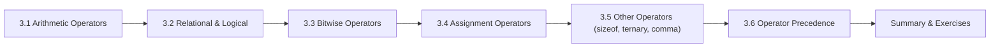

# Chapter 3: Operators

> **Previous:** [Introduction to C](./01-introduction.md) | **Next:** [Control Flow](./04-control-flow.md)


## Learning Objectives

- Apply arithmetic, relational, logical, and bitwise operators correctly
- Understand operator precedence and associativity
- Distinguish between prefix and postfix increment/decrement
- Use the ternary conditional operator
- Avoid common pitfalls with assignment and equality


### Chapter at a Glance

| Topic | Key Insight | Practical Takeaway |
|-------|-------------|-------------------|
| Arithmetic Operators | C provides `+`, `-`, `*`, `/`, `%` for numeric computation | Integer division truncates; use `%` for remainders |
| Relational Operators | `<`, `>`, `<=`, `>=`, `==`, `!=` compare values | Comparisons yield 0 (false) or 1 (true) |
| Logical Operators | `&&`, `||`, `!` combine boolean expressions | Short-circuit evaluation stops early when result is determined |
| Bitwise Operators | `&`, `|`, `^`, `~`, `<<`, `>>` operate on individual bits | Use bitwise for flags, masks, and low-level hardware access |
| Assignment Operators | `=` and compound forms like `+=`, `&=` | Compound operators modify a variable and assign in one step |
| Operator Precedence | Expressions evaluate in a defined order (PEMDAS-like) | Use parentheses to make intent explicit, even when precedence is correct |





## 3.1 Classification of Operators

C provides operators grouped by function:

| Category | Operators |
|----------|-----------|
| Arithmetic | `+` `-` `*` `/` `%` `++` `--` |
| Relational | `<` `>` `<=` `>=` `==` `!=` |
| Logical | `&&` `||` `!` |
| Bitwise | `&` `|` `^` `~` `<<` `>>` |
| Assignment | `=` `+=` `-=` `*=` `/=` `%=` `&=` `|=` `^=` `<<=` `>>=` |
| Ternary | `?:` |
| Other | `sizeof` `&` `*` `.` `->` `[]` `()` `,` |

> **One-Sentence Takeaway:** C operators are grouped by function: arithmetic, relational, logical, bitwise, and assignment

> **Warning:** Division by zero at runtime crashes the program — always validate divisors before dividing.
## 3.2 Arithmetic Operators

```c
int a = 15, b = 4;
printf("a + b = %d\n", a + b);   /* 19 */
printf("a - b = %d\n", a - b);   /* 11 */
printf("a * b = %d\n", a * b);   /* 60 */
printf("a / b = %d\n", a / b);   /* 3  (integer division truncates) */
printf("a %% b = %d\n", a % b);  /* 3  (modulus — remainder) */
```

**Important rules:**

- Integer division truncates toward zero: `7 / 3` yields `2`, `-7 / 3` yields `-2`.
- The modulus operator `%` requires integer operands.
- Division by zero produces undefined behavior.

**Floating-point division:**
```c
double x = 7.0 / 3.0;     /* 2.333333 */
double y = 7 / 3;         /* 2.0 — integer division first, then conversion */
double z = (double)7 / 3;  /* 2.333333 — explicit cast */
```

### 3.2.1 Increment and Decrement

| Expression | Equivalent | Result |
|------------|------------|--------|
| `x++` (postfix) | use `x` then increment | value of `x` before increment |
| `++x` (prefix) | increment then use `x` | value of `x` after increment |
| `x--` (postfix) | use `x` then decrement | value of `x` before decrement |
| `--x` (prefix) | decrement then use `x` | value of `x` after decrement |

```c
#include <stdio.h>

int main(void)
{
    int x = 5;
    int y = x++;       /* y = 5, x = 6 */
    printf("x = %d, y = %d\n", x, y);

    x = 5;
    y = ++x;           /* y = 6, x = 6 */
    printf("x = %d, y = %d\n", x, y);

    return 0;
}
```

**Output:**
```
x = 6, y = 5
x = 6, y = 6
```


> **One-Sentence Takeaway:** Arithmetic operators perform mathematical computations on numeric operands
## 3.3 Relational Operators

These operators compare two values and yield an `int` result: `1` (true) or `0` (false).

| Operator | Meaning |
|----------|---------|
| `==` | Equal to |
| `!=` | Not equal to |
| `<` | Less than |
| `>` | Greater than |
| `<=` | Less than or equal to |
| `>=` | Greater than or equal to |

```c
int a = 5, b = 10, c = 5;
printf("%d\n", a == c);   /* 1 (true) */
printf("%d\n", a == b);   /* 0 (false) */
printf("%d\n", a < b);    /* 1 */
printf("%d\n", a != b);   /* 1 */
```

**Common mistake:** Using `=` instead of `==`:
```c
if (x = 5)   /* assigns 5 to x, then evaluates 5 (true) — ALWAYS true! */
if (x == 5)  /* correct: compares x to 5 */
```


> **One-Sentence Takeaway:** Relational operators compare values and produce a boolean result true or false
## 3.4 Logical Operators

| Operator | Meaning | Example |
|----------|---------|---------|
| `&&` | Logical AND — true if both operands are true | `(a > 0 && b > 0)` |
| `||` | Logical OR — true if at least one operand is true | `(a > 0 || b > 0)` |
| `!` | Logical NOT — inverts truth value | `!(a > 0)` |

**Short-circuit evaluation:**

In expressions using `&&` and `||`, evaluation stops as soon as the result is determined:

```c
int a = 0, b = 5;

if (a != 0 && b / a > 1)   /* short-circuit: b/a is NEVER evaluated */
    printf("OK");           /* division by zero avoided */
```


> **One-Sentence Takeaway:** Logical operators combine boolean expressions for complex conditional logic
## 3.5 Bitwise Operators

Bitwise operators manipulate individual bits in integer operands.

| Operator | Name | Example |
|----------|------|---------|
| `&` | AND | `x & y` |
| `|` | OR | `x | y` |
| `^` | XOR | `x ^ y` |
| `~` | Ones complement (NOT) | `~x` |
| `<<` | Left shift | `x << n` |
| `>>` | Right shift | `x >> n` |

```c
#include <stdio.h>

int main(void)
{
    unsigned char a = 0x6D;   /* 0110 1101 */
    unsigned char b = 0xB7;   /* 1011 0111 */

    printf("a & b  = 0x%02X\n", a & b);   /* 0010 0101 = 0x25 */
    printf("a | b  = 0x%02X\n", a | b);   /* 1111 1111 = 0xFF */
    printf("a ^ b  = 0x%02X\n", a ^ b);   /* 1101 1010 = 0xDA */
    printf("~a     = 0x%02X\n", ~a);      /* 1001 0010 = 0x92 */
    printf("a << 2 = 0x%02X\n", a << 2);  /* 1011 0100 = 0xB4 */
    printf("a >> 3 = 0x%02X\n", a >> 3);  /* 0000 1101 = 0x0D */

    return 0;
}
```

**Output:**
```
a & b  = 0x25
a | b  = 0xFF
a ^ b  = 0xDA
~a     = 0x92
a << 2 = 0xB4
a >> 3 = 0x0D
```

**Common use cases:**
```c
/* Check if bit n is set */
if (flags & (1 << n)) { /* bit n is set */ }

/* Set bit n */
flags |= (1 << n);

/* Clear bit n */
flags &= ~(1 << n);

/* Toggle bit n */
flags ^= (1 << n);
```


> **One-Sentence Takeaway:** Bitwise operators manipulate individual bits for low-level and systems programming
> **Pro Tip:** Bitwise operators are essential for low-level hardware control and flags manipulation.
## 3.6 Assignment Operators

Simple assignment assigns the value of the right operand to the left operand. Compound assignment combines an operation with assignment.

```c
int x = 10;

x += 5;      /* x = x + 5, now 15 */
x -= 3;      /* x = x - 3, now 12 */
x *= 2;      /* x = x * 2, now 24 */
x /= 4;      /* x = x / 4, now 6 */
x %= 4;      /* x = x % 4, now 2 */
x &= 0xFF;   /* x = x & 0xFF */
x |= 0x0F;   /* x = x | 0x0F */
x ^= 0xAA;   /* x = x ^ 0xAA */
x <<= 1;     /* x = x << 1 */
x >>= 2;     /* x = x >> 2 */
```


> **One-Sentence Takeaway:** Assignment operators store values and compound forms combine operation with assignment
## 3.7 Ternary Conditional Operator

The ternary operator `?:` is a compact form of `if-else` that yields a value.

```c
condition ? expression_if_true : expression_if_false;
```

```c
#include <stdio.h>

int main(void)
{
    int a = 10, b = 20;
    int max = (a > b) ? a : b;     /* max = 20 */

    printf("The larger value is %d\n", max);
    return 0;
}
```

**Ternary operators can be nested (use sparingly — readability suffers):**
```c
int largest = (a > b) ? ((a > c) ? a : c) : ((b > c) ? b : c);
```


> **One-Sentence Takeaway:** The ternary conditional operator provides a compact inline if-else expression
> **Remember:** The ternary operator ?: is an expression not a statement and returns a value.
## 3.8 Operator Precedence and Associativity

When multiple operators appear in an expression, precedence determines the order of evaluation. Associativity determines the order when operators of equal precedence appear together.

| Level | Operators | Associativity |
|-------|-----------|---------------|
| 1 (highest) | `()` `[]` `.` `->` `++` `--` (postfix) | left-to-right |
| 2 | `++` `--` (prefix) `+` `-` (unary) `!` `~` `&` `*` `sizeof` | right-to-left |
| 3 | `*` `/` `%` | left-to-right |
| 4 | `+` `-` | left-to-right |
| 5 | `<<` `>>` | left-to-right |
| 6 | `<` `<=` `>` `>=` | left-to-right |
| 7 | `==` `!=` | left-to-right |
| 8 | `&` (bitwise AND) | left-to-right |
| 9 | `^` (bitwise XOR) | left-to-right |
| 10 | `|` (bitwise OR) | left-to-right |
| 11 | `&&` | left-to-right |
| 12 | `||` | left-to-right |
| 13 | `?:` | right-to-left |
| 14 | `=` `+=` `-=` etc. | right-to-left |
| 15 | `,` | left-to-right |

**When in doubt, use parentheses:**

```c
int x = 5 + 3 * 4;        /* 17 — multiplication first */
int y = (5 + 3) * 4;      /* 32 — parentheses override */
```


> **One-Sentence Takeaway:** Operator precedence and associativity determine the order of evaluation in expressions
> **Warning:** Operator precedence can produce unintuitive results always use parentheses for clarity.
## 3.9 The Comma Operator

The comma operator `,` evaluates both operands and yields the value of the right operand.

```c
int x = (5, 10, 15);       /* x = 15 */

int a = 1, b = 2, c = 3;
int result = (a += 2, b += 3, a + b);  /* result = 8 (a=3, b=5, sum=8) */
```

Commonly used in `for` loops to initialize or update multiple variables.


> **One-Sentence Takeaway:** The comma operator evaluates multiple expressions and returns the last value
## 3.10 `sizeof` as an Operator

`sizeof` can be applied to a type or an expression:

```c
size_t s1 = sizeof(int);         /* type */
int x;
size_t s2 = sizeof x;            /* variable */
size_t s3 = sizeof(x + 1);       /* expression — not evaluated */
```

## Concept Comparison Table

| Category | Operators | Associativity | Example |
|----------|-----------|---------------|---------|
| Arithmetic | `+  -  *  /  %` | Left to right | `a + b * c` evaluates `*` first |
| Relational | `<  >  <=  >=  ==  !=` | Left to right | `a < b == c` is `(a < b) == c` |
| Logical | `&&  \|\|  !` | Left (`&&`/`\|\|`), Right (`!`) | `a && b \|\| c` is `(a && b) \|\| c` |
| Bitwise | `&  \|  ^  ~  <<  >>` | Left to right | `a & b \| c` applies `&` first |
| Assignment | `=  +=  -=  *=  /=  %=  <<=  >>=  &=  \|=  ^=` | Right to left | `a = b = c` is `a = (b = c)` |
| Ternary | `?:` | Right to left | `a ? b : c ? d : e` groups rightmost first |

## Quick Reference

| Expression | Result | Notes |
|------------|--------|-------|
| `5 / 2` | `2` | Integer division truncates |
| `5.0 / 2` | `2.5` | Float promotion |
| `5 % 2` | `1` | Modulus (remainder) |
| `1 << 4` | `16` | Left-shift = multiply by 2⁴ |
| `0xFF >> 2` | `0x3F` | Right-shift divide by 4 |
| `~0` | `-1` | Bitwise NOT (two's complement) |
| `3 ^ 5` | `6` | XOR: 011 ^ 101 = 110 |
| `x ? a : b` | `a` or `b` | Ternary expression value |

## Cross-Application Matrix

| Domain | Operator Usage |
|--------|---------------|
| Embedded GPIO | `PORT |= (1 << 3)` to set bit 3 high |
| Graphics/color | `(r << 16) | (g << 8) | b` to pack RGB |
| Permission masks | `(mode & 0444) != 0` to check read permission |
| Networking checksum | `sum = (sum >> 16) + (sum & 0xFFFF)` |
| Game collision | `!(a.x > b.x + b.w || a.x + a.w < b.x)` bounding-box check |

## Chapter Quiz

1. What is the value of `10 & 6`?
   A) 0
   B) 2
   C) 6
   D) 10

<details><summary>Answer</summary>**B)** 10 decimal = 1010 binary, 6 = 0110 binary. 1010 & 0110 = 0010 = 2 decimal.</details>

2. Why does `if (x = 5)` compile without error but behave unexpectedly?
   A) It is a syntax error in C
   B) Assignment returns the assigned value, which is nonzero (truthy)
   C) The compiler automatically converts to `x == 5`
   D) It causes undefined behavior

<details><summary>Answer</summary>**B)** `x = 5` assigns 5 and returns 5, which is truthy. This is a common typo for `x == 5`. Enable `-Wall` to get a warning.</details>

3. Which operator has the highest precedence?
   A) `+`
   B) `*`
   C) `()`
   D) `&&`

<details><summary>Answer</summary>**C)** Parentheses `()` have the highest precedence — use them to override default ordering.</details>


## Summary

- Arithmetic operators: `+` `-` `*` `/` `%`. Integer division truncates; modulus works only on integers.
- Increment `++` and decrement `--` have prefix and postfix forms with different semantics.
- Relational and logical operators yield `1` (true) or `0` (false).
- Logical operators `&&` and `||` short-circuit.
- Bitwise operators (`&`, `|`, `^`, `~`, `<<`, `>>`) manipulate individual bits in integer types.
- Assignment operators include `=` and compound forms like `+=`, `&=`, etc.
- The ternary `?:` operator selects between two expressions based on a condition.
- Operator precedence determines evaluation order; parentheses override it.
- The comma operator evaluates both operands and returns the right operand's value.

## Exercises

### Review Questions

1. What is the value of `7 / 2` in C? What about `7.0 / 2`? Explain the difference.
2. What does `x++` do differently from `++x`? Give an example where the distinction matters.
3. Explain short-circuit evaluation. Why is it useful in practice?
4. What is the value of `5 & 3`? Of `5 | 3`? Of `5 ^ 3`?
5. Why does `if (x = 0)` always evaluate to false, and why is this considered a common bug?

### Application Problems

1. Write a program that reads an integer and prints whether it is even or odd using only bitwise operators (no `%`).
2. Write a program that reads three integers and prints the largest using only the ternary operator (no `if` statements).
3. Write a program that takes an unsigned integer and prints its binary representation (32 bits) using bitwise operators and shifts.
4. Write a program that demonstrates short-circuit evaluation by attempting a division by zero inside a logical expression and proving it never executes.

### Challenge Problem

Write a program that reverses the bits of an 8-bit unsigned integer. For example, `0b11001010` (202) becomes `0b01010011` (83). Do not use arrays — use only bitwise operators and loops. Print both the original and reversed values in hexadecimal and binary.

> **One-Sentence Takeaway:** sizeof is a compile-time operator that returns the size in bytes of a type or expression
