# Chapter 3: Operators in C --- In-Depth Reference

> **Previous:** [Introduction to C](./01-introduction.md) | **Next:** [Control Flow](./04-control-flow.md)

## Learning Objectives

- Apply arithmetic, relational, logical, and bitwise operators correctly in any expression
- Understand operator precedence (15 levels) and associativity (L-to-R / R-to-L)
- Distinguish prefix vs. postfix increment/decrement with sequence-point awareness
- Use ternary, comma, sizeof, pointer, member-access, and cast operators fluently
- Predict short-circuit evaluation, overflow, and signed/unsigned shift behavior
- Recognize real-world applications: embedded GPIO, kernel macros, networking, graphics

### Chapter at a Glance

| Topic | Key Insight | Practical Takeaway |
|-------|-------------|-------------------|
| Arithmetic Operators | `+ - * / %` for numeric computation | Integer division truncates; `%` requires integers |
| Relational Operators | `< > <= >= == !=` compare values | Result is `int`: 1 (true) or 0 (false) |
| Logical Operators | `&& || !` combine boolean expressions | Short-circuit: second operand may not evaluate |
| Bitwise Operators | `& | ^ ~ << >>` operate on bits | Essential for flags, masks, low-level hardware |
| Assignment Operators | `=` and compound forms (`+=`, `&=`) | Compound forms read, compute, and write in one op |
| Increment / Decrement | `++x` vs `x++` | Prefix returns new value; postfix returns old value |
| Ternary / Conditional | `? :` | Compact inline if-else that yields a value |
| Comma Operator | `,` | Evaluates both operands, returns rightmost |
| `sizeof` | Compile-time operator | Returns `size_t` byte count; expression not evaluated |
| Pointer Operators | `&` (address-of), `*` (dereference) | Core of C memory model |
| Member Access | `.` (direct), `->` (indirect) | Access struct/union members |
| Cast Operator | `(type)` | Explicit type conversion; may lose data |
| Precedence & Associativity | 15-level table | When in doubt: use parentheses |

```mermaid
flowchart LR
    A["3.1 Operator Categories"] --> B["3.2 Arithmetic"]
    B --> C["3.3 Relational"]
    C --> D["3.4 Logical & Short-Circuit"]
    D --> E["3.5 Bitwise"]
    E --> F["3.6 Assignment"]
    F --> G["3.7 Inc/Dec (Prefix vs Postfix)"]
    G --> H["3.8 Ternary"]
    H --> I["3.9 Comma"]
    I --> J["3.10 sizeof"]
    J --> K["3.11 Pointer (&, *)"]
    K --> L["3.12 Member Access (., ->)"]
    L --> M["3.13 Cast"]
    M --> N["3.14 Precedence & Associativity"]
    N --> O["3.15 Interview Corner & Applications"]
    O --> P["Summary & Exercises"]
```



---

## 3.1 Operator Categories --- Comparison Table

C operators fall into distinct categories. This table shows every category, its operators, associativity, operand count, and a quick example.

| # | Category | Operators | Operands | Associativity | Example |
|---|----------|-----------|----------|---------------|---------|
| 1 | Arithmetic (binary) | `+ - * / %` | 2 | L R | `a + b` |
| 2 | Arithmetic (unary) | `+ -` | 1 | R L | `-x` |
| 3 | Increment / Decrement | `++ --` | 1 (prefix/postfix) | RL (prefix), LR (postfix) | `++x`, `x--` |
| 4 | Relational | `< > <= >= == !=` | 2 | L R | `a < b` |
| 5 | Logical | `&& || !` | 2 (except `!`: 1) | LR (bin), RL (un) | `a && b`, `!x` |
| 6 | Bitwise | `& | ^ ~ << >>` | 2 (except `~`: 1) | L R | `a & b`, `~x` |
| 7 | Assignment | `= += -= *= /= %= &= |= ^= <<= >>=` | 2 | **R L** | `a += 5` |
| 8 | Ternary / Conditional | `? :` | 3 | **R L** | `a ? b : c` |
| 9 | Comma | `,` | 2 | L R | `a, b` |
| 10 | `sizeof` | `sizeof` | 1 (type or expr) | R L | `sizeof(int)` |
| 11 | Pointer (address-of) | `&` | 1 | R L | `&x` |
| 12 | Pointer (dereference) | `*` | 1 | R L | `*ptr` |
| 13 | Member access (direct) | `.` | 2 | L R | `s.field` |
| 14 | Member access (indirect) | `->` | 2 | L R | `p->field` |
| 15 | Cast | `(type)` | 1 | R L | `(double)a` |
| 16 | Subscript | `[]` | 2 | L R | `arr[i]` |
| 17 | Function call | `()` | varies | L R | `f(a,b)` |

> **Takeaway:** Know the category to predict behavior. Assignment and ternary are the only right-to-left binary categories.

---

## 3.2 Arithmetic Operators

### 3.2.1 Real-World Analogy

Think of arithmetic operators like a **cash register**. You put in two numbers (operands), press an operation button (operator), and the register displays a result. The `+` button adds item prices, the `*` button calculates 3 items x 4 each = 12, the `%` button gives the remainder when splitting a bill unevenly.

- `+` --- combining two piles of coins
- `-` --- removing coins from a pile
- `*` --- repeated addition (3 rows of 5 chairs = 15 chairs)
- `/` --- splitting a pizza into equal slices
- `%` --- what's left after splitting evenly

### 3.2.2 Syntax and Numbered Steps

```
result = operand1  operator  operand2
```

**Execution steps:**
1. Evaluate `operand1` to its numeric value (left-to-right evaluation)
2. Evaluate `operand2` to its numeric value
3. Apply the operator
4. If both operands are `int`, perform **integer arithmetic**
5. If either operand is floating-point, perform **floating-point arithmetic** (usual arithmetic conversion)
6. Store or use the result

### 3.2.3 Pseudocode

```
FUNCTION apply_arithmetic(op1, op2, operator):
    IF operator IS '+': RETURN op1 + op2
    IF operator IS '-': RETURN op1 - op2
    IF operator IS '*': RETURN op1 * op2
    IF operator IS '/':
        IF op2 == 0: SIGNAL "division by zero" (undefined behavior)
        IF both operands are integers: RETURN op1 / op2
        ELSE: RETURN op1 / op2
    IF operator IS '%':
        IF op2 == 0: SIGNAL "division by zero" (undefined behavior)
        IF op1 or op2 is negative: implementation-defined before C99, defined in C99+
        RETURN op1 % op2
END
```

### 3.2.4 Dry Run --- Integer Division and Modulus

| Step | Expression | Operation | Intermediate | Final Result |
|------|-----------|-----------|-------------|--------------|
| 1 | `int a = 15, b = 4;` | declaration | --- | a=15, b=4 |
| 2 | `a + b` | `15 + 4` | 19 | 19 |
| 3 | `a - b` | `15 - 4` | 11 | 11 |
| 4 | `a * b` | `15 * 4` | 60 | 60 |
| 5 | `a / b` | `15 / 4` | 3 (truncated) | 3 |
| 6 | `a % b` | `15 % 4` | 15 - (3x4) = 3 | 3 |
| 7 | `-7 / 3` | integer division | floor toward zero = -2 | -2 |
| 8 | `7.0 / 3.0` | float division | 2.333... | 2.333333 |
| 9 | `7 / 3` (both int) | int division first | 2, then if assigned to double -> 2.0 | 2.0 |

### 3.2.5 C Code Examples

```c
#include <stdio.h>

int main(void)
{
    int a = 15, b = 4;

    printf("a + b = %d\n", a + b);   /* 19 */
    printf("a - b = %d\n", a - b);   /* 11 */
    printf("a * b = %d\n", a * b);   /* 60 */
    printf("a / b = %d\n", a / b);   /* 3  (integer division truncates) */
    printf("a %% b = %d\n", a % b);  /* 3  (modulus = remainder) */

    double x = 7.0 / 3.0;
    double y = 7 / 3;
    double z = (double)7 / 3;
    printf("x = %f, y = %f, z = %f\n", x, y, z);

    printf("-7 %% 3 = %d\n", -7 % 3);
    printf("7 %% -3 = %d\n",  7 % -3);

    return 0;
}
```

**Output:**
```
a + b = 19
a - b = 11
a * b = 60
a / b = 3
a % b = 3
x = 2.333333, y = 2.000000, z = 2.333333
-7 % 3 = -1
7 % -3 = 1
```

### 3.2.6 Complexity Analysis

| Operation | Time | Space | Reason |
|-----------|------|-------|--------|
| All arithmetic operators | **O(1)** | **O(1)** | Single CPU instruction (or a few) |

### 3.2.7 Advantages and Disadvantages

| Advantage | Disadvantage |
|-----------|-------------|
| Directly maps to CPU instructions | Integer division truncates silently |
| `%` useful for cyclic behavior (wrap-around) | `%` doesn't work on floats |
| Mixed-type arithmetic via implicit conversion | Implicit conversion can lose precision (double to int) |
| Fast --- single cycle on modern CPUs | Division and modulus are slower (10-30 cycles) |

### 3.2.8 Edge Cases

1. **Division by zero** -> undefined behavior (program may crash or produce garbage)
2. **INT_MIN / -1** -> undefined behavior (two's complement overflow)
3. **INT_MIN % -1** -> undefined behavior in C99+
4. **Overflow in signed addition/multiplication** -> undefined behavior
5. **Unsigned overflow** -> wraps around (well-defined modulo 2^n)
6. **Negative modulus before C99** -> implementation-defined; C99+ specifies remainder follows dividend sign
7. **Floating-point division by 0.0** -> yields `+inf` or `-inf` (well-defined in IEEE 754)

---
## 3.3 Relational Operators

### 3.3.1 Real-World Analogy

Relational operators are like a **height comparison at a theme park**. You compare two heights: "Is the child tall enough for this ride?" ( `>=` ), "Is this person shorter than that one?" ( `<` ). The answer is always a clear **yes** (1) or **no** (0).

### 3.3.2 Numbered Steps

1. Evaluate `operand1` to its value
2. Evaluate `operand2` to its value
3. Perform the comparison
4. Return `int` --- `1` if true, `0` if false

### 3.3.3 Pseudocode

```
FUNCTION compare(op1, op2, operator):
    IF operator IS '<': RETURN op1 < op2 ? 1 : 0
    IF operator IS '>': RETURN op1 > op2 ? 1 : 0
    IF operator IS '<=': RETURN op1 <= op2 ? 1 : 0
    IF operator IS '>=': RETURN op1 >= op2 ? 1 : 0
    IF operator IS '==': RETURN op1 == op2 ? 1 : 0
    IF operator IS '!=': RETURN op1 != op2 ? 1 : 0
END
```

### 3.3.4 Dry Run --- Trace Table

| Expression | a | b | c | Operation | Result |
|------------|---|---|---|-----------|--------|
| `a == c` | 5 | 10 | 5 | `5 == 5` | 1 |
| `a == b` | 5 | 10 | 5 | `5 == 10` | 0 |
| `a < b` | 5 | 10 | 5 | `5 < 10` | 1 |
| `a != b` | 5 | 10 | 5 | `5 != 10` | 1 |
| `b < a` | 5 | 10 | 5 | `10 < 5` | 0 |
| `b >= c` | 5 | 10 | 5 | `10 >= 5` | 1 |

### 3.3.5 C Code Examples

```c
#include <stdio.h>

int main(void)
{
    int a = 5, b = 10, c = 5;

    printf("a == c : %d\n", a == c);   /* 1 */
    printf("a == b : %d\n", a == b);   /* 0 */
    printf("a < b  : %d\n", a < b);    /* 1 */
    printf("a != b : %d\n", a != b);   /* 1 */
    printf("b < a  : %d\n", b < a);    /* 0 */
    printf("b >= c : %d\n", b >= c);   /* 1 */

    /* Chained comparison trap: a < b < c */
    /* Evaluates as: (a < b) < c => (1) < c => 1 < 5 => 1 */
    printf("a < b < c : %d (WRONG for math comparison!)\n", a < b < c);

    return 0;
}
```

**Output:**
```
a == c : 1
a == b : 0
a < b  : 1
a != b : 1
b < a  : 0
b >= c : 1
a < b < c : 1 (WRONG for math comparison!)
```

### 3.3.6 Complexity

| Operation | Time | Space |
|-----------|------|-------|
| All relational operators | **O(1)** | **O(1)** |

### 3.3.7 A&D Table

| Advantage | Disadvantage |
|-----------|-------------|
| Simple, compile to single CMP instruction | Chaining `a < b < c` doesn't work as expected |
| Return `int` (0/1) for easy use in conditions | Comparing floating-point for equality is unreliable |
| Work with any arithmetic type | `==` on structs is not allowed (must compare field-by-field) |

### 3.3.8 Edge Cases

1. **`=` vs `==`** --- most common C bug: `if (x = 5)` assigns 5, always true
2. **Chained comparisons** --- `a < b < c` evaluates left-to-right: `(a < b) < c` (compares 0/1 to c)
3. **Floating-point equality** --- avoid `f1 == f2` due to rounding; use `fabs(f1 - f2) < EPSILON`
4. **NaN comparisons** --- every comparison with NaN returns false (including `NaN == NaN`)

---

## 3.4 Logical Operators

### 3.4.1 Real-World Analogy

Logical operators are like **security checkpoint gates**:
- `&&` (AND) --- Two guards must both approve entry; if the first says "no", the second never speaks (short-circuit)
- `||` (OR) --- Either guard can approve entry; if the first says "yes", the second never speaks (short-circuit)
- `!` (NOT) --- A gate that opens when the guard is NOT present

### 3.4.2 Syntax and Truth Table

| A | B | A && B | A || B | !A |
|---|---|--------|---------|-----|
| 0 (false) | 0 (false) | 0 | 0 | 1 |
| 0 (false) | 1 (true)  | 0 | 1 | 1 |
| 1 (true)  | 0 (false) | 0 | 1 | 0 |
| 1 (true)  | 1 (true)  | 1 | 1 | 0 |

### 3.4.3 Short-Circuit Evaluation --- Dry Run

Short-circuit means: for `A && B`, if `A` is false, `B` is never evaluated. For `A || B`, if `A` is true, `B` is never evaluated.

**Dry run: `a != 0 && b / a > 1` when `a = 0`:**

| Step | Expression | Evaluates To | Next Action |
|------|-----------|-------------|-------------|
| 1 | `a != 0` | `0 != 0` -> **0 (false)** | Short-circuit: skip RHS |
| 2 | `b / a > 1` | **NOT EVALUATED** | Division by zero avoided |

**Dry run: `a != 0 && b / a > 1` when `a = 2, b = 10`:**

| Step | Expression | Evaluates To | Next Action |
|------|-----------|-------------|-------------|
| 1 | `a != 0` | `2 != 0` -> **1 (true)** | Continue evaluating RHS |
| 2 | `b / a > 1` | `10 / 2 = 5 > 1` -> **1 (true)** | Entire expression is true |

### 3.4.4 C Code Examples

```c
#include <stdio.h>

int main(void)
{
    int a = 0, b = 5;
    int side_effect = 0;

    /* Short-circuit prevents division by zero */
    if (a != 0 && b / a > 1)
        printf("This won't print\n");
    else
        printf("Short-circuit saved us from division by zero\n");

    /* Side-effect demonstration */
    int x = 1;
    if (x == 1 || (side_effect = 99))
        printf("Side-effect variable: %d (NOT 99 --- short-circuited!)\n", side_effect);

    /* Logical NOT */
    int flag = 0;
    if (!flag)
        printf("flag is false (zero), so !flag is true\n");

    return 0;
}
```

**Output:**
```
Short-circuit saved us from division by zero
Side-effect variable: 0 (NOT 99 --- short-circuited!)
flag is false (zero), so !flag is true
```

### 3.4.5 Complexity

| Operation | Time | Space |
|-----------|------|-------|
| `&&`, `||`, `!` | **O(1)** | **O(1)** |

### 3.4.6 A&D Table

| Advantage | Disadvantage |
|-----------|-------------|
| Short-circuit avoids expensive/complex side computations | Can skip side-effects you intended (subtle bugs) |
| Natural boolean algebra for conditions | Result is `int` (0/1), not a distinct bool type (C89) |
| `!` works on any scalar: zero = false, non-zero = true | Double `!!` idiom needed to normalize to 0/1 |

### 3.4.7 Edge Cases

1. **Side effects in RHS** --- code in the right operand may never execute
2. **`!` on non-boolean** --- `!100` = 0 (any non-zero is truthy)
3. **`&&` vs `&`** --- `&&` short-circuits, `&` always evaluates both
4. **`||` vs `|`** --- `||` short-circuits, `|` always evaluates both
5. **Short-circuit in function call arguments** --- NOT guaranteed (argument evaluation order is unspecified)

---

## 3.5 Bitwise Operators

### 3.5.1 Real-World Analogy

Bitwise operators are like a **bank of light switches**. Each bit is one switch:
- `&` (AND) --- Two switches in series; current flows only if BOTH are on
- `|` (OR) --- Two switches in parallel; current flows if AT LEAST one is on
- `^` (XOR) --- A 3-way switch; current flows if the switches are in DIFFERENT positions
- `~` (NOT) --- Flips every switch in the panel
- `<<` (LEFT SHIFT) --- Moving every switch one position to the left, discarding the leftmost
- `>>` (RIGHT SHIFT) --- Moving every switch one position to the right

### 3.5.2 Truth Tables for All Bitwise Operators

**AND (`&`):** Result bit is 1 only if BOTH operand bits are 1

| A | B | A & B |
|---|---|-------|
| 0 | 0 | 0 |
| 0 | 1 | 0 |
| 1 | 0 | 0 |
| 1 | 1 | 1 |

**OR (`|`):** Result bit is 1 if AT LEAST ONE operand bit is 1

| A | B | A | B |
|---|---|--------|
| 0 | 0 | 0 |
| 0 | 1 | 1 |
| 1 | 0 | 1 |
| 1 | 1 | 1 |

**XOR (`^`):** Result bit is 1 if operand bits are DIFFERENT

| A | B | A ^ B |
|---|---|-------|
| 0 | 0 | 0 |
| 0 | 1 | 1 |
| 1 | 0 | 1 |
| 1 | 1 | 0 |

**NOT (`~`):** Flips every bit (ones' complement)

| A | ~A |
|---|----|
| 0 | 1 |
| 1 | 0 |

**Left Shift (`<<`):** Shifts bits left, fills right with 0, discards left overflow; equivalent to multiply by 2^n (for values that don't overflow)

| Expression | Binary (8-bit) | Decimal |
|-----------|---------------|---------|
| `3 << 1` | `0000 0011` -> `0000 0110` | 6 |
| `3 << 2` | `0000 0011` -> `0000 1100` | 12 |
| `3 << 4` | `0000 0011` -> `0011 0000` | 48 |
| `128 << 1` (unsigned) | `1000 0000` -> `0000 0000` (overflow) | 0 |

**Right Shift (`>>`):** Shifts bits right. For **unsigned** types: logical shift (fills with 0). For **signed** types: implementation-defined (usually arithmetic shift --- fills with sign bit).

| Expression | Binary (8-bit signed) | Decimal |
|-----------|----------------------|---------|
| `16 >> 1` | `0001 0000` -> `0000 1000` | 8 |
| `16 >> 3` | `0001 0000` -> `0000 0010` | 2 |
| `-16 >> 1` (arithmetic) | `1111 0000` -> `1111 1000` (sign-extended) | -8 |
| `-16 >> 1` (logical) | `1111 0000` -> `0111 1000` | 120 |

### 3.5.3 Dry Run --- Bitwise on 8-bit Values

**Operands: a = 0x6D (0110 1101), b = 0xB7 (1011 0111)**

| Expression | Binary Calculation | Result (Hex) | Result (Decimal) |
|-----------|-------------------|-------------|-----------------|
| `a & b` | 0110 1101 & 1011 0111 = **0010 0101** | 0x25 | 37 |
| `a | b` | 0110 1101 | 1011 0111 = **1111 1111** | 0xFF | 255 |
| `a ^ b` | 0110 1101 ^ 1011 0111 = **1101 1010** | 0xDA | 218 |
| `~a` | ~0110 1101 = **1001 0010** | 0x92 | 146 |
| `a << 2` | 0110 1101 << 2 = **1011 0100** | 0xB4 | 180 |
| `a >> 3` | 0110 1101 >> 3 = **0000 1101** | 0x0D | 13 |

### 3.5.4 C Code Examples

```c
#include <stdio.h>

int main(void)
{
    unsigned char a = 0x6D;   /* 0110 1101 */
    unsigned char b = 0xB7;   /* 1011 0111 */

    printf("a & b  = 0x%02X  (binary: 0010 0101)\n", a & b);
    printf("a | b  = 0x%02X  (binary: 1111 1111)\n", a | b);
    printf("a ^ b  = 0x%02X  (binary: 1101 1010)\n", a ^ b);
    printf("~a     = 0x%02X  (binary: 1001 0010)\n", (unsigned char)~a);
    printf("a << 2 = 0x%02X  (binary: 1011 0100)\n", a << 2);
    printf("a >> 3 = 0x%02X  (binary: 0000 1101)\n", a >> 3);

    unsigned char flags = 0x00;
    flags |= (1 << 3);
    printf("After setting bit 3: 0x%02X\n", flags);
    flags &= ~(1 << 3);
    printf("After clearing bit 3: 0x%02X\n", flags);
    flags ^= (1 << 5);
    printf("After toggling bit 5: 0x%02X\n", flags);
    if (flags & (1 << 5))
        printf("Bit 5 is SET\n");

    signed char s = -16;
    unsigned char u = 240;
    printf("signed   -16 >> 1 = %d\n", s >> 1);
    printf("unsigned 240 >> 1 = %u\n", u >> 1);

    return 0;
}
```

**Output:**
```
a & b  = 0x25  (binary: 0010 0101)
a | b  = 0xFF  (binary: 1111 1111)
a ^ b  = 0xDA  (binary: 1101 1010)
~a     = 0x92  (binary: 1001 0010)
a << 2 = 0xB4  (binary: 1011 0100)
a >> 3 = 0x0D  (binary: 0000 1101)
After setting bit 3: 0x08
After clearing bit 3: 0x00
After toggling bit 5: 0x20
Bit 5 is SET
signed   -16 >> 1 = -8
unsigned 240 >> 1 = 120
```

### 3.5.5 Complexity

| Operation | Time | Space |
|-----------|------|-------|
| All bitwise operators | **O(1)** | **O(1)** |

### 3.5.6 A&D Table

| Advantage | Disadvantage |
|-----------|-------------|
| Extremely fast (single CPU cycle) | Readability suffers --- code looks cryptic |
| Essential for hardware/embedded programming | Signed right shift is implementation-defined |
| Compact flags/masks (one int = 32 flags) | Can't operate on floats/doubles |
| XOR swap trick avoids temporary variable | Shift count >= width is undefined behavior |

### 3.5.7 Edge Cases

1. **Shift count >= type width** -> undefined behavior (e.g., `1 << 32` on 32-bit int)
2. **Negative shift count** -> undefined behavior
3. **Signed right shift** -> implementation-defined (arithmetic on most compilers)
4. **Left shift of signed negative value** -> undefined behavior (before C99)
5. **`~` on a small integer** -> integer promotion applies: `~0x6D` promotes to `int` first
6. **`&` vs `&&` confusion** --- `5 & 3` = 1 (bitwise), `5 && 3` = 1 (logical) --- same result here, but different operations

---
## 3.6 Assignment Operators

### 3.6.1 Real-World Analogy

Assignment is like **labeling a storage box**: `x = 5` means "take the number 5 and put it in the box labeled x". Compound assignment `x += 3` means "open box x, add 3 to what's inside, put the result back in box x".

### 3.6.2 Numbered Steps

**Simple assignment (`x = expr`):**
1. Evaluate the right-hand side `expr` to a value
2. Store that value into the memory location of `x`
3. The expression yields the assigned value

**Compound assignment (`x += expr`):**
1. Read the current value of `x`
2. Evaluate `expr`
3. Apply operator (`+` for `+=`)
4. Store result back into `x`
5. The expression yields the new value

### 3.6.3 Dry Run --- Compound Assignment Chain

| Code | Step | x Before | Operation | x After | Expression Value |
|------|------|---------|-----------|---------|-----------------|
| `x = 10` | 1 | (uninit) | --- | 10 | 10 |
| `x += 5` | 2 | 10 | `x = 10 + 5` | 15 | 15 |
| `x -= 3` | 3 | 15 | `x = 15 - 3` | 12 | 12 |
| `x *= 2` | 4 | 12 | `x = 12 * 2` | 24 | 24 |
| `x /= 4` | 5 | 24 | `x = 24 / 4` | 6 | 6 |
| `x %= 4` | 6 | 6 | `x = 6 % 4` | 2 | 2 |
| `x <<= 1` | 7 | 2 | `x = 2 << 1` | 4 | 4 |
| `x &= 0xF` | 8 | 4 | `x = 4 & 15` | 4 | 4 |

### 3.6.4 C Code Examples

```c
#include <stdio.h>

int main(void)
{
    int x = 10;
    printf("Initial x = %d\n", x);

    x += 5;      printf("After += 5:  x = %d\n", x);   /* 15 */
    x -= 3;      printf("After -= 3:  x = %d\n", x);   /* 12 */
    x *= 2;      printf("After *= 2:  x = %d\n", x);   /* 24 */
    x /= 4;      printf("After /= 4:  x = %d\n", x);   /* 6  */
    x %= 4;      printf("After %%= 4:  x = %d\n", x);  /* 2  */

    unsigned int f = 0x0F;
    f &= 0xAA;   printf("After &= 0xAA: 0x%X\n", f);   /* 0x0A */
    f |= 0x50;   printf("After |= 0x50: 0x%X\n", f);   /* 0x5A */
    f ^= 0xFF;   printf("After ^= 0xFF: 0x%X\n", f);   /* 0xA5 */
    f <<= 2;     printf("After <<= 2:   0x%X\n", f);   /* 0x94 */

    int y;
    printf("Value of (y = 42) is: %d\n", y = 42);

    int a, b, c;
    a = b = c = 10;
    printf("a=%d, b=%d, c=%d\n", a, b, c);             /* 10, 10, 10 */

    return 0;
}
```

**Output:**
```
Initial x = 10
After += 5:  x = 15
After -= 3:  x = 12
After *= 2:  x = 24
After /= 4:  x = 6
After %= 4:  x = 2
After &= 0xAA: 0x0A
After |= 0x50: 0x5A
After ^= 0xFF: 0xA5
After <<= 2:   0x94
Value of (y = 42) is: 42
a=10, b=10, c=10
```

### 3.6.5 Complexity

| Operation | Time | Space |
|-----------|------|-------|
| All assignment operators | **O(1)** | **O(1)** |

### 3.6.6 A&D Table

| Advantage | Disadvantage |
|-----------|-------------|
| Concise: `x += 2` vs `x = x + 2` | Can hide intent if overused |
| `x = y = z = 0` chains naturally | Assignment inside condition (`if (x = 5)`) is usually a bug |
| Compound forms reduce redundancy | `x = x + y` vs `x += y` --- identical after optimization |
| Right-to-left associativity enables useful patterns | Prevents `a = (b = 4) + 2` style (works but odd) |

### 3.6.7 Edge Cases

1. **Assignment in `if` condition** --- `if (x = 5)` is always true; use `-Wparentheses` in GCC to warn
2. **Unsigned underflow** --- `unsigned u = 0; u -= 1;` wraps to `UINT_MAX` (well-defined)
3. **Signed overflow** --- `int x = INT_MAX; x += 1;` is undefined behavior
4. **Assignment returns value** --- enables chaining, but also enables `if (x = func())` patterns

---

## 3.7 Increment and Decrement (Prefix vs Postfix)

### 3.7.1 Real-World Analogy

**Prefix (`++x`)** --- "Eat your dinner, then go outside." Action first, then the result is available.

**Postfix (`x++`)** --- "Go outside, then do your homework." The current value is used first, then the change happens.

### 3.7.2 Numbered Steps

**Postfix `x++`:**
1. Read the current value of `x`
2. Save this current value as the result of the expression
3. Increment `x` by 1
4. Return the saved (old) value

**Prefix `++x`:**
1. Read the current value of `x`
2. Increment `x` by 1
3. Return the new value of `x`

### 3.7.3 Dry Run --- Postfix vs Prefix

| Code | Step | x (before) | Operation | Expression Value | x (after) |
|------|------|-----------|-----------|-----------------|-----------|
| `y = x++` where x=5 | 1 | 5 | Save current value | --- | 5 |
| (cont) | 2 | 5 | `y = saved = 5` | 5 | 5 |
| (cont) | 3 | 5 | `x++` (increment) | --- | 6 |
| `y = ++x` where x=5 | 1 | 5 | Increment x to 6 | --- | 6 |
| (cont) | 2 | 6 | `y = new = 6` | 6 | 6 |

### 3.7.4 C Code Examples

```c
#include <stdio.h>

int main(void)
{
    int x = 5;
    int y = x++;       /* y = 5, x = 6 */
    printf("Postfix: x = %d, y = %d\n", x, y);

    x = 5;
    y = ++x;           /* y = 6, x = 6 */
    printf("Prefix:  x = %d, y = %d\n", x, y);

    x = 5;
    printf("x++ = %d, now x = %d\n", x++, x);

    x = 5;
    printf("++x = %d, now x = %d\n", ++x, x);

    printf("For loop with i++: ");
    for (int i = 0; i < 3; i++)
        printf("%d ", i);
    printf("\n");

    return 0;
}
```

**Output:**
```
Postfix: x = 6, y = 5
Prefix:  x = 6, y = 6
x++ = 5, now x = 6
++x = 6, now x = 6
For loop with i++: 0 1 2
```

### 3.7.5 Complexity

| Operation | Time | Space |
|-----------|------|-------|
| `++x`, `x++`, `--x`, `x--` | **O(1)** | **O(1)** |

### 3.7.6 A&D Table

| Advantage | Disadvantage |
|-----------|-------------|
| Compact loop control (`for(i=0;i<n;i++)`) | Postfix may create a temporary (pre-C optimizers) |
| Elegant pointer traversal (`*p++`) | Overuse in expressions creates unreadable code |
| Two forms give precise control of timing | `++x` and `x++` in same expression -> undefined behavior |

### 3.7.7 Edge Cases --- Sequence Points

Between two sequence points, a variable may be modified at most once. Violating this is **undefined behavior**.

```c
int i = 5;
i = i++;               /* UB: i modified twice between sequence points */
i++ + i++;             /* UB: i modified twice */
printf("%d %d", ++i, i++);   /* UB: no sequence point between arguments */
*(p++) = *(p++);       /* UB: p modified twice */
```

**Well-defined examples:**
```c
for (int i = 0; i < 10; i++)   /* OK: i++ at end of each iteration */
while (*p++ = *q++);           /* OK: each ++ on different variable */
if (a[i++] > 5) continue;     /* OK if i not used elsewhere in same statement */
```

---

## 3.8 Conditional (Ternary) Operator

### 3.8.1 Real-World Analogy

The ternary operator is like a **vending machine** that asks one question: "Do you have enough money?" If yes -> dispense soda. If no -> show "insufficient funds". The result is whatever was produced (the soda or the message).

### 3.8.2 Syntax

```
condition ? expression_if_true : expression_if_false
```

### 3.8.3 Numbered Steps

1. Evaluate `condition` (which must be scalar --- any non-zero is true)
2. If condition is true (non-zero), evaluate `expression_if_true`; skip the false branch
3. If condition is false (zero), evaluate `expression_if_false`; skip the true branch
4. The result of whichever branch was evaluated becomes the value of the whole expression

### 3.8.4 Dry Run

| Condition | True Expr | False Expr | What Evaluates | Result |
|-----------|-----------|------------|----------------|--------|
| `a > b` (10 > 20 -> 0) | `a` (10) | `b` (20) | False branch: `b` | 20 |
| `a > b` (20 > 10 -> 1) | `a` (20) | `b` (10) | True branch: `a` | 20 |

### 3.8.5 C Code Examples

```c
#include <stdio.h>

int main(void)
{
    int a = 10, b = 20;
    int max = (a > b) ? a : b;
    printf("Max of %d and %d is %d\n", a, b, max);

    int c = 15;
    int largest = (a > b) ? ((a > c) ? a : c) : ((b > c) ? b : c);
    printf("Largest of %d, %d, %d is %d\n", a, b, c, largest);

    int temperature = 30;
    printf("Weather: %s\n", (temperature > 25) ? "Hot" : "Cool");

    int x = 0;
    int result = (x != 0) ? (100 / x) : 0;  /* Safe: 100/x never evaluated */
    printf("Result: %d\n", result);

    int side = 0;
    int val = (side == 0) ? (side = 99) : (side = -1);
    printf("side = %d, val = %d\n", side, val);

    return 0;
}
```

**Output:**
```
Max of 10 and 20 is 20
Largest of 10, 20, 15 is 20
Weather: Hot
Result: 0
side = 99, val = 99
```

### 3.8.6 Complexity

| Operation | Time | Space |
|-----------|------|-------|
| `?:` | **O(1)** | **O(1)** |

### 3.8.7 A&D Table

| Advantage | Disadvantage |
|-----------|-------------|
| Concise inline conditional | Readability suffers when nested |
| Can be used inside expressions (`printf("%s", cond ? "A" : "B")`) | Both branches must have compatible types |
| Only evaluates chosen branch (short-circuit like `||`) | Easy to hide side effects |

### 3.8.8 Edge Cases

1. **Type compatibility** --- both branches must have compatible types (or one is `void*`)
2. **Nesting reduces readability** --- avoid more than one level deep
3. **Ternary is not a full `if-else`** --- it's an expression, not a statement
4. **Side effects in unselected branch** --- never execute, making them safe for division-by-zero guards

---

## 3.9 Comma Operator

### 3.9.1 Real-World Analogy

The comma operator is like an **assembly line with two stations**: the product passes through station 1 (first expression), then station 2 (second expression). The final product is whatever came out of station 2. What happened at station 1 is a side effect.

### 3.9.2 Numbered Steps

1. Evaluate the left operand (including all side effects)
2. Discard the left operand's value
3. Evaluate the right operand
4. The value of the right operand becomes the result of the comma expression

### 3.9.3 Dry Run

| Expression | Step | Evaluates To | Side Effects | Final Value |
|-----------|------|-------------|-------------|-------------|
| `(5, 10, 15)` | 1: `5` | 5 | none | --- |
| (cont) | 2: `10` | 10 | none | --- |
| (cont) | 3: `15` | 15 | none | **15** |
| `(a += 2, b += 3, a + b)` where a=1,b=2 | 1: `a += 2` | 3 | a=3 | --- |
| (cont) | 2: `b += 3` | 5 | b=5 | --- |
| (cont) | 3: `a + b = 3 + 5` | 8 | --- | **8** |

### 3.9.4 C Code Examples

```c
#include <stdio.h>

int main(void)
{
    int x = (5, 10, 15);
    printf("x = %d\n", x);           /* 15 */

    for (int i = 0, j = 10; i < j; i++, j--)
        printf("i=%d, j=%d\n", i, j);

    int a = 1, b = 2;
    int result = (a += 2, b += 3, a + b);
    printf("result = %d (a=%d, b=%d)\n", result, a, b);

    printf("Without parens: %d\n", (1, 2, 3));
    printf("With parens:    %d %d %d\n", 1, 2, 3);

    return 0;
}
```

**Output:**
```
x = 15
i=0, j=10
i=1, j=9
i=2, j=8
i=3, j=7
i=4, j=6
result = 8 (a=3, b=5)
Without parens: 3
With parens:    1 2 3
```

### 3.9.5 Complexity

| Operation | Time | Space |
|-----------|------|-------|
| `,` | **O(1)** | **O(1)** |

### 3.9.6 A&D Table

| Advantage | Disadvantage |
|-----------|-------------|
| Multiple expressions in `for` loop headers | Overused, reduces readability |
| Sequence point: left operand fully evaluated before right | Easy to confuse with function argument separator |

### 3.9.7 Edge Cases

1. **Comma vs argument separator** --- `f((1, 2))` passes `2`; `f(1, 2)` passes two arguments
2. **Comma operator in `return`** --- `return x++, x + 5;` increments x then returns x+5 (not x++)
3. **Lowest precedence** --- `a = b, c` means `(a = b), c` (not `a = (b, c)`)

---

## 3.10 `sizeof` Operator

### 3.10.1 Real-World Analogy

`sizeof` is like a **tape measure for data types**. Ask "how long is this couch?" and it tells you in feet (bytes). Importantly, measuring doesn't change the couch --- the couch stays exactly where it is. Similarly, `sizeof(expr)` never evaluates `expr`.

### 3.10.2 Syntax

```c
sizeof(type)         /* parentheses required with type */
sizeof expression    /* parentheses optional with expression */
```

### 3.10.3 Numbered Steps

1. Determine the type of the operand (at compile time)
2. Return the size in bytes as `size_t` (an unsigned integer type)
3. If the operand is an expression, it is **not evaluated** at runtime

### 3.10.4 C Code Examples

```c
#include <stdio.h>

int main(void)
{
    printf("sizeof(char)      = %zu byte(s)\n", sizeof(char));
    printf("sizeof(short)     = %zu byte(s)\n", sizeof(short));
    printf("sizeof(int)       = %zu byte(s)\n", sizeof(int));
    printf("sizeof(long)      = %zu byte(s)\n", sizeof(long));
    printf("sizeof(float)     = %zu byte(s)\n", sizeof(float));
    printf("sizeof(double)    = %zu byte(s)\n", sizeof(double));
    printf("sizeof(void*)     = %zu byte(s)\n", sizeof(void*));
    printf("sizeof(size_t)    = %zu byte(s)\n", sizeof(size_t));

    int x = 5;
    size_t s = sizeof(x++);     /* x++ is NOT executed */
    printf("sizeof(x++) = %zu, x = %d (x was NOT incremented!)\n", s, x);

    int arr[10];
    int *ptr = arr;
    printf("sizeof(arr)  = %zu bytes (%d elements)\n", sizeof(arr),
           (int)(sizeof(arr)/sizeof(arr[0])));
    printf("sizeof(ptr)  = %zu bytes (just the pointer)\n", sizeof(ptr));

    struct Packed { char c; int i; };
    printf("sizeof(struct Packed) = %zu (includes padding)\n", sizeof(struct Packed));

    return 0;
}
```

**Output (64-bit system):**
```
sizeof(char)      = 1 byte(s)
sizeof(short)     = 2 byte(s)
sizeof(int)       = 4 byte(s)
sizeof(long)      = 8 byte(s)
sizeof(float)     = 4 byte(s)
sizeof(double)    = 8 byte(s)
sizeof(void*)     = 8 byte(s)
sizeof(size_t)    = 8 byte(s)
sizeof(x++) = 4, x = 5 (x was NOT incremented!)
sizeof(arr)  = 40 bytes (10 elements)
sizeof(ptr)  = 8 bytes (just the pointer)
sizeof(struct Packed) = 8 (includes padding)
```

### 3.10.5 Complexity

| Operation | Time | Space |
|-----------|------|-------|
| `sizeof` | **Compile-time O(1)** | **O(1)** --- no runtime cost |

### 3.10.6 A&D Table

| Advantage | Disadvantage |
|-----------|-------------|
| Compile-time, zero runtime cost | Result depends on platform (32-bit vs 64-bit) |
| Works on types, variables, expressions | On arrays passed to functions, decays to pointer size |
| Essential for `malloc(sizeof(T))` | Struct size includes padding --- may be larger than field sum |

### 3.10.7 Edge Cases

1. **Array vs pointer decay** --- `sizeof(arr)` in the declaring scope gives total array size; after decay to pointer parameter, gives pointer size
2. **Expression not evaluated** --- `sizeof(*NULL)` is well-defined (no dereference happens); `sizeof(1/0)` compiles fine
3. **VLA (variable-length arrays)** --- `sizeof` on a VLA is evaluated at runtime
4. **Empty struct** --- C doesn't allow zero-sized structs (GCC extension may produce 0)

---
## 3.11 Pointer Operators (`&` and `*`)

### 3.11.1 Real-World Analogy

- `&x` (address-of) --- Like getting the **street address** of a house. Instead of the contents, you get the location.
- `*ptr` (dereference) --- Like going to that street address and **opening the front door** to see what's inside.

### 3.11.2 Numbered Steps

**Address-of (`&x`):**
1. Determine the memory address where variable `x` is stored
2. Return that address as a pointer value

**Dereference (`*ptr`):**
1. Read the address stored in `ptr`
2. Access the memory at that address
3. The expression `*ptr` acts as an lvalue --- you can read or write through it

### 3.11.3 C Code Examples

```c
#include <stdio.h>

int main(void)
{
    int x = 42;
    int *ptr = &x;

    printf("Value of x:        %d\n", x);
    printf("Address of x:      %p\n", (void*)&x);
    printf("Value of ptr:      %p\n", (void*)ptr);
    printf("Dereferenced ptr:  %d\n", *ptr);

    *ptr = 100;
    printf("After *ptr = 100, x = %d\n", x);

    int arr[3] = {10, 20, 30};
    printf("arr = %p, &arr[0] = %p (same address)\n",
           (void*)arr, (void*)&arr[0]);

    return 0;
}
```

**Output (addresses vary by run):**
```
Value of x:        42
Address of x:      0x7ffd12345678
Value of ptr:      0x7ffd12345678
Dereferenced ptr:  42
After *ptr = 100, x = 100
arr = 0x7ffd12345690, &arr[0] = 0x7ffd12345690 (same address)
```

### 3.11.4 Complexity

| Operation | Time | Space |
|-----------|------|-------|
| `&x` | **O(1)** | **O(1)** |
| `*ptr` | **O(1)** | **O(1)** |

### 3.11.5 A&D Table

| Advantage | Disadvantage |
|-----------|-------------|
| Enables direct memory access and modification | Dereferencing NULL or invalid pointer crashes |
| Foundation for dynamic allocation, arrays, strings | Pointer arithmetic is error-prone |
| Allows pass-by-reference semantics in C | Requires careful initialization and bounds checking |

### 3.11.6 Edge Cases

1. **Dereferencing NULL pointer** -> undefined behavior (segmentation fault on most systems)
2. **Dereferencing uninitialized pointer** -> undefined behavior
3. **`&` on register-stored variable** -> not allowed (C forbids `&` on register variables)
4. **`&` on bit-field** -> not allowed (bit-fields don't have individual addresses)
5. **`void*` dereference** -> must cast to complete type first

---

## 3.12 Member Access Operators (`.` and `->`)

### 3.12.1 Real-World Analogy

- `.` (dot) --- Direct access: like opening a **person's file folder** that's right in front of you
- `->` (arrow) --- Indirect access: like following a **reference number** to a filing cabinet, then opening the folder

### 3.12.2 C Code Examples

```c
#include <stdio.h>

struct Point { int x; int y; };

int main(void)
{
    struct Point p1;
    p1.x = 10;
    p1.y = 20;
    printf("p1: (%d, %d)\n", p1.x, p1.y);

    struct Point p2;
    struct Point *ptr = &p2;
    ptr->x = 30;
    ptr->y = 40;
    printf("p2 via ptr: (%d, %d)\n", ptr->x, ptr->y);

    /* Arrow is syntactic sugar: ptr->x is same as (*ptr).x */
    printf("p2 via deref: (%d, %d)\n", (*ptr).x, (*ptr).y);

    struct Rectangle {
        struct Point top_left;
        struct Point bottom_right;
    };
    struct Rectangle rect = {{0, 0}, {100, 80}};
    struct Rectangle *rptr = &rect;
    printf("Area: %d\n", (rptr->bottom_right.x - rptr->top_left.x) *
                         (rptr->bottom_right.y - rptr->top_left.y));

    return 0;
}
```

**Output:**
```
p1: (10, 20)
p2 via ptr: (30, 40)
p2 via deref: (30, 40)
Area: 8000
```

### 3.12.3 Complexity

| Operation | Time | Space |
|-----------|------|-------|
| `.` | **O(1)** | **O(1)** --- compile-time offset |
| `->` | **O(1)** | **O(1)** --- pointer + offset |

### 3.12.4 A&D Table

| Advantage | Disadvantage |
|-----------|-------------|
| `.` provides direct, readable field access | `.` on pointer causes compilation error |
| `->` cleanly accesses struct members through pointer | `->` with NULL pointer crashes |
| Both are compile-time resolved, zero overhead | Nested access chains can be verbose |

### 3.12.5 Edge Cases

1. **`->` with NULL pointer** -> undefined behavior (dereferences NULL)
2. **`.` precedence** --- `.` has higher precedence than `*`: `*sp.x` means `*(sp.x)`
3. **`->` self-cancellation** --- `p->x` is exactly equivalent to `(*p).x`

---

## 3.13 Cast Operator

### 3.13.1 Real-World Analogy

Casting is like **repurposing a container**. You have a large box (double) and you need to fit its contents into a small box (int). You can force it, but you might lose some packing material (precision). Or you have a signed container and need to view its contents as unsigned --- the bits don't change, just how you interpret them.

### 3.13.2 C Code Examples

```c
#include <stdio.h>

int main(void)
{
    double pi = 3.14159;
    int approx = (int)pi;
    printf("(int)%.5f = %d\n", pi, approx);

    int a = 7, b = 3;
    double result1 = a / b;
    double result2 = (double)a / b;
    printf("Without cast: %f, With cast: %f\n", result1, result2);

    int val = 0x12345678;
    unsigned char *bytes = (unsigned char*)&val;
    printf("Bytes of 0x%X (little-endian): ", val);
    for (int i = 0; i < (int)sizeof(val); i++)
        printf("%02X ", bytes[i]);
    printf("\n");

    signed char s = -1;
    unsigned char u = (unsigned char)s;
    printf("(unsigned char)(-1) = %u\n", u);

    return 0;
}
```

**Output:**
```
(int)3.14159 = 3
Without cast: 2.000000, With cast: 2.333333
Bytes of 0x12345678 (little-endian): 78 56 34 12
(unsigned char)(-1) = 255
```

### 3.13.3 Complexity

| Operation | Time | Space |
|-----------|------|-------|
| Numeric cast | **O(1)** | **O(1)** |
| Pointer cast | **O(1)** | **O(1)** --- no bits change |

### 3.13.4 A&D Table

| Advantage | Disadvantage |
|-----------|-------------|
| Explicit type conversion when needed | Narrowing cast may lose data silently |
| Pointer reinterpretation for low-level access | Casting away const/volatile is dangerous |
| Enables mixed-type arithmetic safely | Incorrect pointer casts break aliasing rules (strict aliasing) |

### 3.13.5 Edge Cases

1. **Narrowing cast** --- converting `double` to `int` loses fractional part; undefined if value out of range
2. **Pointer cast and alignment** --- casting `char*` to `int*` on misaligned address may cause bus error
3. **Signed <-> unsigned cast** --- bits are preserved, interpretation changes (e.g., -1 becomes UINT_MAX)
4. **`void*` cast** --- implicit conversion to/from `void*` is allowed in C (no cast needed)

---

## 3.14 Operator Precedence and Associativity

### 3.14.1 Real-World Analogy

Precedence is like **order of operations in math** (PEMDAS/BODMAS): multiplication before addition. Associativity is like a **tiebreaker** --- when two operators have equal precedence, do we go left-to-right (addition and subtraction) or right-to-left (assignment)?

### 3.14.2 Full 15-Level Precedence Table

| Level | Category | Operators | Associativity | Example |
|-------|----------|-----------|---------------|---------|
| 1 (Highest) | Postfix | `() [] . -> ++ --` (postfix) | **L -> R** | `a[3]`, `f(x)`, `s.m`, `p->m` |
| 2 | Unary (prefix) | `++ -- + - ! ~ * & sizeof` | **R -> L** | `*p`, `&x`, `-a`, `!flag` |
| 3 | Multiplicative | `* / %` | L -> R | `a * b / c` |
| 4 | Additive | `+ -` | L -> R | `a + b - c` |
| 5 | Shift | `<< >>` | L -> R | `a << 2 >> 1` |
| 6 | Relational (lt, leq, gt, geq) | `< <= > >=` | L -> R | `a < b <= c` |
| 7 | Equality | `== !=` | L -> R | `a == b != c` |
| 8 | Bitwise AND | `&` | L -> R | `a & b & c` |
| 9 | Bitwise XOR | `^` | L -> R | `a ^ b ^ c` |
| 10 | Bitwise OR | `|` | L -> R | `a | b | c` |
| 11 | Logical AND | `&&` | L -> R | `a && b && c` |
| 12 | Logical OR | `||` | L -> R | `a || b || c` |
| 13 | Conditional | `?:` | **R -> L** | `a ? b : c ? d : e` |
| 14 | Assignment | `= += -= *= /= %= ...` | **R -> L** | `a = b = c`, `x += 5` |
| 15 (Lowest) | Comma | `,` | L -> R | `a, b, c` |

### 3.14.3 Dry Run --- Complex Expression Evaluation

**Expression: `int result = ++x * 3 + (y = 5) > 10 ? a : b;`**
Assume: `int x = 2, y = 0, a = 1, b = 0;`

| Step | Operation | Rule | Intermediate |
|------|-----------|------|-------------|
| 1 | `++x` | Prefix ++ has level 2, R->L | x=3, value=3 |
| 2 | `3 * 3` | * has level 3, L->R | 9 |
| 3 | `y = 5` | Parentheses + assignment level 14 | y=5, value=5 |
| 4 | `9 + 5` | + has level 4, L->R | 14 |
| 5 | `14 > 10` | > has level 6, L->R | 1 (true) |
| 6 | `1 ? a : b` | ?: level 13, R->L | a=1 |
| 7 | `result = 1` | = level 14, R->L | result=1 |

### 3.14.4 Common Precedence Traps

```c
#include <stdio.h>

int main(void)
{
    int arr[] = {10, 20, 30};
    int *p = arr;
    int v = *p++;       /* *(p++) --- dereferences old p, then increments */
    printf("*p++ = %d, now points to %d\n", v, *p);

    struct S { int x; } s = {42};
    int *ptr = &s.x;        /* . binds tighter than & */

    int r = 1 << 2 + 3;     /* 1 << (2+3) = 1 << 5 = 32 */
    printf("1 << 2 + 3 = %d (+ binds tighter than <<)\n", r);

    int flag = 0;
    if (flag = 1)
        printf("BUG: assignment inside if is always true!\n");

    int a = 5, b = 5;
    int cmp = a & b == 5;     /* a & (b == 5) = 5 & 1 = 1 */
    printf("a & b == 5 = %d (== binds tighter than &!)\n", cmp);

    return 0;
}
```

**Output:**
```
*p++ = 10, now points to 20
1 << 2 + 3 = 32 (+ binds tighter than <<)
BUG: assignment inside if is always true!
a & b == 5 = 1 (== binds tighter than &!)
```

### 3.14.5 Golden Rule

**When in doubt, use parentheses.** They are free (zero runtime cost) and make intent explicit:

```c
// Unclear:
if (a & b == c) ...

// Clear:
if ((a & b) == c) ...
```

---

## 3.15 Short-Circuit Evaluation --- In Depth

### 3.15.1 Definition

Short-circuit evaluation means the second operand of `&&` or `||` is evaluated only if necessary to determine the overall result.

| Operator | Evaluates RHS When | Short-circuits When |
|----------|-------------------|---------------------|
| `&&` | LHS is **true** (non-zero) | LHS is **false** (zero) |
| `||` | LHS is **false** (zero) | LHS is **true** (non-zero) |

### 3.15.2 Dry Run --- Short-Circuit Scenarios

**Scenario 1: `int a = 0, b = 5; if (a != 0 && b / a > 1)`**

| Step | Expression | Result | What Happens |
|------|-----------|--------|-------------|
| 1 | `a != 0` | `false` (0) | Short-circuit: RHS NOT evaluated |
| 2 | `b / a > 1` | --- | Division by zero AVOIDED |
| 3 | Whole expression | `false` | Safe! |

**Scenario 2: `int a = 1, b = 5; if (a == 1 || (b = 0))`**

| Step | Expression | Result | What Happens |
|------|-----------|--------|-------------|
| 1 | `a == 1` | `true` (1) | Short-circuit: RHS NOT evaluated |
| 2 | `(b = 0)` | --- | Side effect AVOIDED |
| 3 | b remains | 5 | Surprising if you expected b=0 |

### 3.15.3 Common Short-Circuit Patterns

```c
/* Guard against NULL pointer dereference */
if (ptr != NULL && ptr->value > 0)  /* safe */

/* Guard against division by zero */
if (denominator != 0 && numerator / denominator > threshold)  /* safe */

/* Default value with short-circuit */
int value = (pointer) ? *pointer : 0;  /* ternary also short-circuits! */

/* Lazy initialization (avoid expensive computation if not needed) */
int compute_expensive(void);
int result = (cache_valid) ? cache : compute_expensive();
```
---

## 3.16 Interview Corner

### Q1: What is the difference between `++i` and `i++`? Which is faster?

**Answer:** `++i` (prefix) increments and returns the new value. `i++` (postfix) saves the old value, increments, and returns the old value. For built-in types, modern compilers optimize both identically. For user-defined types (C++ iterators), prefix is faster because postfix needs to make a copy. In C with `int`, they are equivalent after optimization.

### Q2: What are sequence points? Give examples of undefined behavior.

**Answer:** A sequence point is a point in execution where all side effects of previous evaluations are guaranteed to be complete. Between two sequence points, a variable may be modified at most once. Violations:

```c
i = i++;              /* UB: i modified twice */
a[i++] = i++;         /* UB: i modified twice */
printf("%d %d", ++i, i++);  /* UB: no sequence point between args */
f(i++, i++);          /* UB: i modified twice */
```

Sequence points occur at: `;` end of statement, `&&`, `||`, `?:`, `,` operator, and function call (after all arguments evaluated, before the function body).

### Q3: When would you use bitwise AND (`&`) vs logical AND (`&&`)?

**Answer:** Use `&` when you need to operate on individual bits (mask testing, flag extraction). Use `&&` for boolean logic with short-circuit. Example:

```c
unsigned int flags = 0x0F;
if (flags & 0x01)           /* bitwise: check if bit 0 is set */
if (is_ready() && can_write())  /* logical: both must be true, short-circuit safe */
```

**Critical difference:** `&` always evaluates both operands; `&&` may skip the second.

### Q4: Explain `sizeof` on an array vs a pointer.

**Answer:**

```c
int arr[10];          /* array of 10 ints */
int *ptr = arr;       /* pointer to int */

sizeof(arr);   /* = 10 * sizeof(int) = 40 (on 32-bit int system) */
sizeof(ptr);   /* = sizeof(int*) = 8 (on 64-bit system) */

void func(int param[]) {
    sizeof(param);    /* = sizeof(int*) --- param decayed to pointer! */
}
```

**Key insight:** Arrays are not pointers, but they decay to pointers when passed to functions. This is why you must pass the size separately.

### Q5: What is the comma operator and when is it useful?

**Answer:** The comma operator evaluates both operands left-to-right, has a sequence point between them, and yields the value of the right operand. Useful in `for` loops and macros:

```c
for (int i = 0, j = 10; i < j; i++, j--)   /* comma to update both */

#define SWAP(a, b)  ((a) ^= (b), (b) ^= (a), (a) ^= (b))
```

But beware: `f((a, b))` passes `b`; `f(a, b)` passes two arguments.

### Q6: Explain the ternary operator. Can it replace `if-else`?

**Answer:** The ternary operator `?:` is an expression that yields a value, while `if-else` is a statement. Ternary can be used inside larger expressions:

```c
int max = (a > b) ? a : b;
printf("Status: %s", (err) ? "ERROR" : "OK");

const char *grade = (score >= 90) ? "A" :
                    (score >= 80) ? "B" :
                    (score >= 70) ? "C" : "F";
```

Do NOT use ternary for complex branching --- readability suffers.

### Q7: What happens when you shift by a negative count or by the bit width?

**Answer:** Both are undefined behavior:

```c
int x = 5;
x << -1;              /* UB: negative shift count */
x << 32;              /* UB: shift >= width of int (on 32-bit system) */
```

### Q8: Signed vs unsigned right shift --- what's the difference?

**Answer:** For unsigned types, right shift is **logical** (fills with 0). For signed types, right shift is **implementation-defined** but almost always **arithmetic** (fills with sign bit).

```c
signed char s = -16;       /* 1111 0000 */
s >> 1;                    /* 1111 1000 = -8 (arithmetic) */

unsigned char u = 240;     /* 1111 0000 */
u >> 1;                    /* 0111 1000 = 120 (logical) */
```

### Q9: How do you swap two integers without a temporary variable?

**Answer:** Using XOR swap (works with integers only):

```c
int a = 5, b = 10;
a = a ^ b;    /* a = 5 ^ 10 = 15 */
b = a ^ b;    /* b = 15 ^ 10 = 5 */
a = a ^ b;    /* a = 15 ^ 5 = 10 */
```

**Warning:** Fails if `a` and `b` refer to the same memory location (both become 0). Also slower than temp-variable swap on modern CPUs.

### Q10: What is operator precedence? Give an example where it matters.

**Answer:** Precedence determines which operator is evaluated first in an expression without parentheses. Example:

```c
int x = 1 << 2 + 3;     /* 1 << (2+3) = 1 << 5 = 32 (addition binds tighter) */
int y = (1 << 2) + 3;   /* 4 + 3 = 7 */
```

Without knowing that `+` has higher precedence than `<<`, you'd guess `x = (1 << 2) + 3 = 7`. The actual result is 32. Always parenthesize when mixing different operator categories.

---

## 3.17 Applications in Real Systems

### 3.17.1 Embedded Systems / GPIO

```c
/* Set pin 3 high on a microcontroller port */
#define SET_PIN(port, pin)   ((port) |= (1 << (pin)))
#define CLEAR_PIN(port, pin) ((port) &= ~(1 << (pin)))
#define TOGGLE_PIN(port, pin) ((port) ^= (1 << (pin)))
#define READ_PIN(port, pin)  (((port) >> (pin)) & 1)

/* Usage: Set bit 3 on PORTB */
/* SET_PIN(PORTB, 3); */
```

### 3.17.2 Linux Kernel Macros

```c
/* Container_of --- get enclosing struct from member pointer */
#define container_of(ptr, type, member) ({                      \
    const typeof(((type *)0)->member) *__mptr = (ptr);          \
    (type *)((char *)__mptr - offsetof(type, member)); })

/* ARRAY_SIZE --- get element count of static array */
#define ARRAY_SIZE(arr) (sizeof(arr) / sizeof((arr)[0]))

/* Round up to nearest power of 2 */
#define ROUND_UP_POW2(x) (--(x), (x) |= (x) >> 1, (x) |= (x) >> 2, \
                          (x) |= (x) >> 4, (x) |= (x) >> 8, \
                          (x) |= (x) >> 16, ++(x))

/* Bit manipulation in kernel */
#define BIT(n)       (1UL << (n))
#define BIT_MASK(n)  (BIT(n) - 1UL)
```

### 3.17.3 Graphics / Color Packing

```c
/* Pack RGBA into a 32-bit integer */
#define RGBA(r, g, b, a) (((r) << 24) | ((g) << 16) | ((b) << 8) | (a))

/* Extract channels */
#define GET_RED(pixel)   ((pixel) >> 24 & 0xFF)
#define GET_GREEN(pixel) ((pixel) >> 16 & 0xFF)
#define GET_BLUE(pixel)  ((pixel) >> 8  & 0xFF)
#define GET_ALPHA(pixel) ((pixel)       & 0xFF)
```

### 3.17.4 Networking / Checksum

```c
/* IP header checksum computation */
unsigned short ip_checksum(unsigned short *buf, int len)
{
    unsigned long sum = 0;
    while (len > 1) {
        sum += *buf++;
        len -= 2;
    }
    if (len) sum += *(unsigned char*)buf;
    while (sum >> 16)
        sum = (sum & 0xFFFF) + (sum >> 16);
    return (unsigned short)~sum;
}
```

### 3.17.5 Permission Masks (Unix-style)

```c
#define IS_READABLE(mode)  ((mode) & S_IRUSR)
#define IS_WRITABLE(mode)  ((mode) & S_IWUSR)
#define ADD_READ(mode)     ((mode) | S_IRUSR)
#define REMOVE_READ(mode)  ((mode) & ~S_IRUSR)

unsigned int mode = 0644;  /* rw-r--r-- */
if (IS_READABLE(mode)) printf("Owner can read\n");
```

### 3.17.6 Game Development / Collision Detection

```c
/* AABB collision test using relational operators */
int aabb_collide(int ax, int ay, int aw, int ah,
                 int bx, int by, int bw, int bh)
{
    return !(ax > bx + bw || ax + aw < bx ||
             ay > by + bh || ay + ah < by);
}

/* Flag-based entity state using bitwise */
enum {
    ENTITY_ALIVE   = 1 << 0,
    ENTITY_VISIBLE = 1 << 1,
    ENTITY_SOLID   = 1 << 2,
    ENTITY_MOVING  = 1 << 3
};

unsigned int state = ENTITY_ALIVE | ENTITY_VISIBLE;
state |= ENTITY_MOVING;      /* set moving */
state &= ~ENTITY_VISIBLE;    /* make invisible */
if (state & ENTITY_ALIVE)    /* check alive */
    update(entity);
```

---

## Chapter Quiz

1. **What is the value of `10 & 6`?**
   A) 0 &emsp; B) 2 &emsp; C) 6 &emsp; D) 10

<details><summary>Answer</summary>**B)** 10 decimal = 1010 binary, 6 = 0110 binary. 1010 & 0110 = 0010 = 2 decimal.</details>

2. **Why does `if (x = 5)` compile without error but behave unexpectedly?**
   A) It is a syntax error in C
   B) Assignment returns the assigned value, which is nonzero (truthy)
   C) The compiler automatically converts to `x == 5`
   D) It causes undefined behavior

<details><summary>Answer</summary>**B)** `x = 5` assigns 5 to x and returns 5, which is truthy. This is a common typo for `x == 5`.</details>

3. **Which operator has the highest precedence?**
   A) `+` &emsp; B) `*` &emsp; C) `()` &emsp; D) `&&`

<details><summary>Answer</summary>**C)** Parentheses `()` have the highest precedence, followed by postfix operators.</details>

4. **What does `1 << 2 + 3` evaluate to?**
   A) 7 &emsp; B) 10 &emsp; C) 32 &emsp; D) Undefined behavior

<details><summary>Answer</summary>**C)** `+` has higher precedence than `<<`, so it's `1 << 5 = 32`.</details>

5. **What is the value of `-7 % 3` in C99+?**
   A) -1 &emsp; B) 1 &emsp; C) -2 &emsp; D) Undefined

<details><summary>Answer</summary>**A)** In C99+, the remainder sign follows the dividend, so `-7 % 3 = -1`.</details>

6. **If `int a = 0, b = 5;`, what does `a && (b = 99)` do to `b`?**
   A) Sets b to 99 &emsp; B) Leaves b as 5 &emsp; C) Undefined &emsp; D) Compiler error

<details><summary>Answer</summary>**B)** Short-circuit: since `a` is 0 (false), `b = 99` is never evaluated.</details>

7. **What is `sizeof(arr)` for `int arr[10];` on a 64-bit system with 4-byte ints?**
   A) 8 &emsp; B) 10 &emsp; C) 40 &emsp; D) 80

<details><summary>Answer</summary>**C)** `sizeof(arr) = 10 * sizeof(int) = 10 * 4 = 40`.</details>

8. **Which of these is undefined behavior?** (Select all that apply.)
   A) `i = i++` &emsp; B) `i++ + ++i` &emsp; C) `i = 5, i = 10` &emsp; D) `a[i++] = i`

<details><summary>Answer</summary>**A, B, D.** A and B modify `i` twice between sequence points. D violates the same rule. C is fine (comma creates a sequence point).</details>

---

## Summary

| Operator Group | Key Point | Common Pitfall |
|---------------|-----------|----------------|
| Arithmetic (`+ - * / %`) | Integer division truncates; `%` on ints only | Division by zero = UB |
| Relational (`< > <= >= == !=`) | Result is 0 or 1 | `a < b < c` is `(a < b) < c` |
| Logical (`&& || !`) | Short-circuit evaluation | Side effects in RHS may not execute |
| Bitwise (`& | ^ ~ << >>`) | Each bit independent | `&` vs `&&`, signed vs unsigned shift |
| Assignment (`= += -= ...`) | Right-to-left associativity | `if (x = 5)` bug |
| Inc/Dec (`++ --`) | Prefix: new value; Postfix: old value | `i++ + i++` = UB (sequence point) |
| Ternary (`?:`) | Expression, not statement | Nested ternaries are unreadable |
| Comma (`,`) | Left-to-right, returns rightmost | Confused with argument separator |
| `sizeof` | Compile-time (VLA excepted) | Array-to-pointer decay in functions |
| Pointer (`& *`) | `&` = address, `*` = dereference | Dereferencing NULL = UB |
| Member (`.` `->`) | `.` direct, `->` indirect | `*s.x` = `*(s.x)` (precedence trap) |
| Cast (`(type)`) | Explicit conversion | Narrowing may lose data |

---

## Exercises

### Review Questions

1. What is the value of `7 / 2` in C? What about `7.0 / 2`? Explain the difference.
2. What does `x++` do differently from `++x`? Give an example where the distinction matters.
3. Explain short-circuit evaluation. Why is it useful in practice?
4. What is the value of `5 & 3`? Of `5 | 3`? Of `5 ^ 3`?
5. Why does `if (x = 0)` always evaluate to false, and why is this considered a common bug?
6. What is the difference between the bitwise `|` and the logical `||` operators?
7. List all 15 levels of operator precedence. Which operators have right-to-left associativity?
8. What does `1 << 2 + 3 * 2` evaluate to? Show your reasoning with precedence.
9. What is a sequence point? Give three examples of undefined behavior involving sequence points.
10. Explain array-to-pointer decay. What is `sizeof(arr)` vs `sizeof(ptr)`?

### Application Problems

1. **Even or odd (bitwise):** Write a program that reads an integer and prints whether it is even or odd using only bitwise operators (no `%`).
2. **Maximum of three (ternary):** Write a program that reads three integers and prints the largest using only the ternary operator (no `if` statements).
3. **Binary printer:** Write a program that takes an unsigned integer and prints its binary representation (32 bits) using bitwise operators and shifts.
4. **Short-circuit demo:** Write a program that demonstrates short-circuit evaluation by attempting a division by zero inside a logical expression and proving it never executes.
5. **XOR encryption:** Write a program that XOR-encrypts a small string with a key byte and decrypts it back. Print both states.

### Challenge Problem

**Bit reversal:** Write a program that reverses the bits of an 8-bit unsigned integer. For example, `0b11001010` (202) becomes `0b01010011` (83). Do not use arrays --- use only bitwise operators and loops. Print both the original and reversed values in hexadecimal and binary.

**Advanced challenge --- implement `container_of`:** Reimplement the Linux kernel `container_of` macro in standard C. Create a struct with two fields, get a pointer to the second field, and use your macro to recover a pointer to the enclosing struct. Verify you can access the first field through the recovered pointer.

---

> **One-Sentence Takeaway:** C operators range from arithmetic to pointer access; knowing precedence, associativity, sequence points, and short-circuit evaluation separates competent C programmers from experts.

---

### Additional Interview Questions

**Q11: What is the output of `printf("%d", (1, 2, 3));` vs `printf("%d %d %d", 1, 2, 3);`?**

**Answer:** `printf("%d", (1, 2, 3));` prints `3` (the comma operator returns the rightmost value). `printf("%d %d %d", 1, 2, 3);` prints `1 2 3` (commas separate function arguments, not the comma operator). The parentheses make all the difference.

**Q12: Explain how `*p++` is parsed according to precedence rules.**

**Answer:** Postfix `++` has higher precedence (level 1) than dereference `*` (level 2). So `*p++` is parsed as `*(p++)`. The expression:
1. Saves the current pointer value
2. Increments the pointer (now points to next element)
3. Dereferences the saved (old) pointer value

This is the idiomatic way to traverse an array: `while (*p++ = *q++);` copies strings.

**Q13: What does `-1 >> 1` produce? Why does it matter?**

**Answer:** For signed `-1` (binary `1111...1111`), right shift is **implementation-defined**. On nearly all compilers, it's arithmetic shift: `-1 >> 1 = -1` (the sign bit propagates, keeping the value negative). This is why unsigned types should be used for bit manipulation --- they always use logical shift (fill with 0).

```
signed int:   -1 >> 1 = -1   (arithmetic: fills with sign bit)
unsigned int: UINT_MAX >> 1 = 2147483647 (logical: fills with 0)
```

**Q14: Can the ternary operator be used as an lvalue? Explain.**

**Answer:** In C, the ternary operator **cannot** be used as an lvalue directly (C++ allows this). However, both branches must yield compatible types. You can use it in an assignment context:

```c
int a = 10, b = 20;
/* This compiles: */
int result = (a > b) ? a : b;
/* This does NOT compile in C (but works in C++): */
/* (a > b) ? a : b = 30;  // ERROR in C */
```

You must assign through a pointer or use an if-else for lvalue behavior in C.

**Q15: What is the `!!` idiom in C?**

**Answer:** Double negation `!!expr` normalizes any scalar value to exactly 0 or 1:
- If `expr` is 0: `!0` = 1, `!1` = 0 -> result: 0
- If `expr` is non-zero: `!expr` = 0, `!0` = 1 -> result: 1

```c
int x = 42;
int normalized = !!x;   /* 1 */

int flags = 0x0F;
int has_bits = !!flags; /* 1 */

int zero = 0;
int is_zero = !!zero;   /* 0 */
```

This is useful when you need to guarantee a 0 or 1 result (e.g., for mathematical operations or strict boolean contexts).

### Common Mistakes and Anti-Patterns

**Mistake 1: Assignment in conditions**
```c
if (x = 5) { /* always true --- meant x == 5 */ }
// Fix: compile with -Wall to get warnings, or use:
if (5 == x) { /* if you accidentally write 5 = x, compiler errors */ }
```

**Mistake 2: Confusing bitwise and logical operators**
```c
if (flags & MASK && condition)  /* Danger: & and && have different precedence! */
// This is parsed as: if (flags & (MASK && condition))
// Intended: if ((flags & MASK) && condition)
```

**Mistake 3: Assuming chained comparisons work mathematically**
```c
if (10 < x < 20) { /* always true for any x! */ }
// This is (10 < x) which is 0 or 1, then < 20 which is always true
// Fix: if (x > 10 && x < 20)
```

**Mistake 4: Not accounting for integer division**
```c
int half = 1/2;  /* 0, not 0.5 */
double avg = (a + b) / 2;  /* integer division if a and b are ints */
// Fix: double avg = (a + b) / 2.0;
```

**Mistake 5: side effects in macro arguments**
```c
#define SQUARE(x) ((x) * (x))
int y = SQUARE(++x);  /* expands to ((++x) * (++x)) --- UB! */
// Fix: don't pass expressions with side effects to macros
```

### Advanced Topics

**Strict Aliasing Rule**

The strict aliasing rule says you cannot access an object through an incompatible pointer type (with exceptions for `char*`). Violating this is undefined behavior.

```c
int x = 42;
float *p = (float*)&x;   /* violates strict aliasing --- UB */
float val = *p;          /* undefined behavior! */

// Exception: char* can alias anything
char *c = (char*)&x;     /* OK */
```

**Integer Promotion in Expressions**

When a smaller integer type (like `char`, `short`) is used in an expression, it's promoted to `int` before the operation:

```c
unsigned char a = 0xFF;
unsigned char b = 0x01;
int result = (a + b);     /* a and b promoted to int, result = 256 */

/* The ~ operator promotes first: */
unsigned char c = 0x6D;
unsigned int d = ~c;      /* ~0x0000006D = 0xFFFFFF92, NOT 0x92 */
unsigned char e = (unsigned char)~c;  /* 0x92 --- cast back */
```

**Volatile and Side Effects**

The `volatile` keyword tells the compiler that a variable may change outside the normal flow (hardware register, signal handler). It prevents the compiler from optimizing away reads:

```c
volatile int *status_reg = (volatile int*)0x40001000;
while (!(*status_reg & 0x80));   /* compiler must re-read each time */
// Without volatile, the compiler might read once and loop forever
```

### Operator Overloading (not in C)

Unlike C++, C does **not** support operator overloading. In C, `+` always means addition --- you cannot define `+` for struct types. All operators in C work only on built-in types (integers, floats, pointers). This is a key difference from C++ where operator overloading is a central feature.

### Memory-Mapped Register Access (Real-World Embedded)

```c
/* STM32 microcontroller GPIO register layout */
typedef struct {
    volatile uint32_t MODER;    /* 0x00 */
    volatile uint32_t OTYPER;   /* 0x04 */
    volatile uint32_t OSPEEDR;  /* 0x08 */
    volatile uint32_t PUPDR;    /* 0x0C */
    volatile uint32_t IDR;      /* 0x10 */
    volatile uint32_t ODR;      /* 0x14 */
    volatile uint32_t BSRR;     /* 0x18 */
    volatile uint32_t LCKR;     /* 0x1C */
    volatile uint32_t AFR[2];   /* 0x20, 0x24 */
} GPIO_TypeDef;

#define GPIOA ((GPIO_TypeDef*)0x40020000)

/* Set PA5 as output (MODER bits 10:11 = 01) */
GPIOA->MODER &= ~(3 << 10);
GPIOA->MODER |= (1 << 10);

/* Set PA5 high */
GPIOA->ODR |= (1 << 5);
```

### XOR Linked List (Memory-Efficient Data Structure)

```c
/* XOR linked list uses ^ to store prev^next in one pointer */
#include <stdio.h>
#include <stdlib.h>
#include <inttypes.h>

struct XOR_Node {
    int data;
    uintptr_t xor_ptr;  /* XOR of prev and next addresses */
};

struct XOR_Node* xor_add(struct XOR_Node *prev, struct XOR_Node *next) {
    return (struct XOR_Node*)((uintptr_t)prev ^ (uintptr_t)next);
}

void traverse(struct XOR_Node *head) {
    struct XOR_Node *curr = head;
    struct XOR_Node *prev = NULL;
    struct XOR_Node *next;

    while (curr) {
        printf("%d ", curr->data);
        next = xor_add(prev, curr->xor_ptr);
        prev = curr;
        curr = next;
    }
}
```

### Compiler Built-ins for Bit Operations

Modern compilers provide built-in functions for efficient bit manipulation:

```c
#include <stdio.h>

int main(void)
{
    unsigned int x = 0x0F00;

    /* GCC/Clang built-ins (if available): */
    /* int count = __builtin_popcount(x);     // count set bits */
    /* int leading = __builtin_clz(x);        // count leading zeros */
    /* int trailing = __builtin_ctz(x);       // count trailing zeros */

    /* Manual popcount (Kernighan's method): */
    int count = 0;
    unsigned int y = x;
    while (y) { y &= y - 1; count++; }
    printf("Popcount of 0x%X = %d\n", x, count);

    /* Check if power of 2 */
    unsigned int n = 256;
    int is_pow2 = (n & (n - 1)) == 0;
    printf("%u is %s power of 2\n", n, is_pow2 ? "a" : "not a");

    /* Round up to next power of 2 */
    unsigned int v = 300;
    v--;
    v |= v >> 1; v |= v >> 2;
    v |= v >> 4; v |= v >> 8; v |= v >> 16;
    v++;
    printf("Next power of 2 after 300 is %u\n", v);

    return 0;
}
```

### Cheat Sheet Quick Reference

| Expression | Result | Notes |
|------------|--------|-------|
| `5 / 2` | `2` | Integer division truncates toward zero |
| `5.0 / 2` | `2.5` | Float promotion |
| `5 % 2` | `1` | Modulus (remainder) |
| `1 << 4` | `16` | Left-shift = multiply by 2^4 |
| `0xFF >> 2` | `0x3F` | Right-shift divide by 4 (unsigned) |
| `~0` | `-1` | Bitwise NOT (two's complement) |
| `3 ^ 5` | `6` | XOR: 011 ^ 101 = 110 |
| `x ? a : b` | `a` or `b` | Ternary expression value |
| `sizeof(int)` | `4` (usually) | Platform-dependent |
| `*&x` | `x` | Address-of then dereference = identity |
| `!!x` | `0` or `1` | Normalize to boolean |

### Cross-Application Matrix

| Domain | Operator Usage |
|--------|---------------|
| Embedded GPIO | `PORT |= (1 << 3)` to set bit 3 high |
| Graphics/color | `(r << 16) | (g << 8) | b` to pack RGB |
| Permission masks | `(mode & 0444) != 0` to check read permission |
| Networking checksum | `sum = (sum >> 16) + (sum & 0xFFFF)` |
| Game collision | `!(a.x > b.x + b.w || a.x + a.w < b.x)` AABB check |
| OS kernel | `container_of`, `ARRAY_SIZE`, `BIT()` macros |
| Cryptography | XOR cipher: `plain ^ key = cipher`, `cipher ^ key = plain` |
| Serialization | `val = (b0 << 24) | (b1 << 16) | (b2 << 8) | b3` to pack bytes |
| Memory allocators | `size = (size + align - 1) & ~(align - 1)` to align |
| Checksum/CRC | `byte ^= byte << 4; byte ^= byte >> 5;` (simple CRC step) |

### Additional Quiz Questions

**9. What is the output of `int x = 5; printf("%d", x++ + ++x);`?**
   A) 10 &emsp; B) 11 &emsp; C) 12 &emsp; D) Undefined behavior

<details><summary>Answer</summary>**D)** This is undefined behavior because `x` is modified twice between sequence points (both `x++` and `++x` modify `x`). The compiler may produce any result.</details>

**10. Which operators have right-to-left associativity?**
    A) Assignment, ternary, unary &emsp; B) Arithmetic, relational &emsp; C) Bitwise, logical &emsp; D) Comma, postfix

<details><summary>Answer</summary>**A)** Assignment (`=`, `+=`, etc.), ternary (`?:`), and unary operators (`++`, `--`, `!`, `~`, `*`, `&`, `sizeof`, `+`, `-`) have right-to-left associativity.</details>

**11. What does `(x += 2) += 3` do?**
    A) Adds 5 to x &emsp; B) Adds 2 then 3 to x &emsp; C) Compiler error &emsp; D) Undefined behavior

<details><summary>Answer</summary>**C)** `(x += 2)` is not an lvalue in C (it yields an rvalue). You cannot chain compound assignments this way. `x += 2; x += 3;` or `x += 5;` would work.</details>

**12. On a 64-bit system with 4-byte `int`, what is `sizeof("Hello")`?**
    A) 5 &emsp; B) 6 &emsp; C) 8 &emsp; D) 4

<details><summary>Answer</summary>**B)** `"Hello"` is a `char[6]` array (5 characters + null terminator). `sizeof("Hello")` returns `6`, regardless of pointer size. This is a common interview question about arrays vs pointers.</details>

**13. What is the value of `(unsigned)(-1)`?**
    A) -1 &emsp; B) 1 &emsp; C) UINT_MAX &emsp; D) Implementation-defined

<details><summary>Answer</summary>**C)** Converting `-1` (all bits set in two's complement) to unsigned gives the maximum unsigned value (`UINT_MAX`). For a 32-bit `unsigned int`, this is `4294967295` (0xFFFFFFFF).</details>

**14. What does `3 * 4 + 5 * 6` evaluate to after operator precedence?**
    A) 42 &emsp; B) 120 &emsp; C) 102 &emsp; D) 57

<details><summary>Answer</summary>**A)** Multiplication has higher precedence than addition: `(3 * 4) + (5 * 6) = 12 + 30 = 42`. This is the "Answer to the Ultimate Question of Life, the Universe, and Everything" according to Douglas Adams.</details>

**15. Which is guaranteed to be a sequence point?**
    A) Between the `++` and the value in `x++` &emsp; B) After the first operand of `&&`
    C) Between the arguments of a function call &emsp; D) Before the `?` in `?:`

<details><summary>Answer</summary>**B)** The `&&` operator is a sequence point: the left operand is fully evaluated before the right operand. C is wrong --- argument evaluation order is unspecified and there's no sequence point between arguments. A is wrong --- the increment happens sometime before the next sequence point, not immediately.</details>

### Complete Mini-Reference: Operator Precedence Hand-Rule

```
Postfix:       () [] . -> ++ --
Unary:         ++ -- + - ! ~ * & sizeof  (R-to-L)
Multiplicative: * / %
Additive:       + -
Shift:          << >>
Relational:     < <= > >=
Equality:       == !=
Bitwise AND:    &
Bitwise XOR:    ^
Bitwise OR:     |
Logical AND:    &&
Logical OR:     ||
Ternary:        ?: (R-to-L)
Assignment:     = += -= ... (R-to-L)
Comma:          ,
```

Remember: **PUMARSEBLATAC** (Postfix, Unary, Mult, Add, Rel/Shift, Equality, Bitwise/Logical, Assignment, Ternary, Comma). Or just remember that only assignment and ternary go right-to-left.

### Quick Memory Aid: `++*p++`

```c
int arr[] = {10, 20, 30};
int *p = arr;
int val = ++*p++;  /* What does this do? */

/* Parsed as: ++(*(p++))
 * Step 1: p++ returns p, then p advances (postfix ++ has highest precedence)
 * Step 2: *(p_old) dereferences arr[0] = 10
 * Step 3: ++10 increments to 11
 * Result: val = 11, arr = {11, 20, 30}, p points to arr[1]
 */
```

**Output:**
```
val = 11, arr[0] = 11, p points to arr[1]
```
