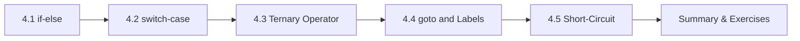

# Chapter 4: Control Flow

> **Previous:** [Operators](./03-operators.md) | **Next:** [Loops](./05-loops.md)

## Learning Objectives

- Make decisions using `if`, `else if`, and `else` statements
- Use `switch` for multi-way branching
- Apply the ternary operator as a compact conditional
- Understand when and why `goto` is used
- Write decision-making code that is clear and maintainable


### Chapter at a Glance

| Topic | Key Insight | Practical Takeaway |
|-------|-------------|-------------------|
| if-else Statements | Conditional branching based on boolean expressions | Always use braces even for single-line bodies to avoid bugs |
| switch-case | Multi-way branch on integer expressions | Every non-empty case needs a `break` or explicit fall-through comment |
| Ternary Operator | Inline conditional expression `condition ? true : false` | Use for simple assignments, not complex logic |
| goto Statement | Unconditional jump to a labeled statement | Use sparingly — typically only for error cleanup in nested contexts |
| Short-Circuit Evaluation | `&&` and `||` stop evaluating once result is known | Rely on this for safe null-pointer checks before dereferencing |





## 4.1 The `if` Statement

The `if` statement executes a block of code only when a condition evaluates to true (non-zero).

```c
if (condition) {
    /* executed when condition is non-zero */
}
```

```c
#include <stdio.h>

int main(void)
{
    int temperature = 30;

    if (temperature > 25) {
        printf("It is a warm day.\n");
    }

    return 0;
}
```

**Output:**
```
It is a warm day.
```


> **One-Sentence Takeaway:** Use if for binary branching based on a condition that evaluates to true or false
> **Pro Tip:** Always use braces {} even for single-statement bodies to prevent bugs when adding later lines.
## 4.2 The `if-else` Statement

```c
if (condition) {
    /* executed when condition is true */
} else {
    /* executed when condition is false */
}
```

```c
#include <stdio.h>

int main(void)
{
    int number = 7;

    if (number % 2 == 0) {
        printf("%d is even.\n", number);
    } else {
        printf("%d is odd.\n", number);
    }

    return 0;
}
```

**Output:**
```
7 is odd.
```


> **One-Sentence Takeaway:** The if-else statement provides two mutually exclusive code paths
## 4.3 The `if-else if` Chain

For multiple mutually exclusive conditions:

```c
#include <stdio.h>

int main(void)
{
    int score = 85;

    if (score >= 90) {
        printf("Grade: A\n");
    } else if (score >= 80) {
        printf("Grade: B\n");
    } else if (score >= 70) {
        printf("Grade: C\n");
    } else if (score >= 60) {
        printf("Grade: D\n");
    } else {
        printf("Grade: F\n");
    }

    return 0;
}
```

**Output:**
```
Grade: B
```

**Important:** Conditions are evaluated top-down. Once a condition is true, the rest are skipped. Order conditions from most specific (or most restrictive) to least.


> **One-Sentence Takeaway:** An if-else if chain tests multiple conditions in order until one matches
## 4.4 Dangling Else

Every `else` binds to the nearest preceding unmatched `else`. Proper indentation prevents confusion:

```c
/* BAD — misleading indentation */
if (x > 0)
    if (y > 0)
        printf("both positive\n");
else
    printf("x is not positive\n");   /* binds to inner if! */

/* CORRECT — braces clarify intent */
if (x > 0) {
    if (y > 0) {
        printf("both positive\n");
    }
} else {
    printf("x is not positive\n");
}
```

**Rule:** Always use braces `{}` for `if`, `else`, `while`, `for`, and `do` bodies, even when they contain a single statement.


> **One-Sentence Takeaway:** The dangling else problem: an else binds to the nearest unmatched if
> **Warning:** Always use braces {} even for single-line bodies to avoid the dangling else ambiguity.
## 4.5 The `switch` Statement

`switch` provides a multi-way branch based on an integer expression.

```c
switch (expression) {
    case constant1:
        statements;
        break;
    case constant2:
        statements;
        break;
    default:
        statements;
        break;
}
```

```c
#include <stdio.h>

int main(void)
{
    int day = 3;

    switch (day) {
        case 1:
            printf("Monday\n");
            break;
        case 2:
            printf("Tuesday\n");
            break;
        case 3:
            printf("Wednesday\n");
            break;
        case 4:
            printf("Thursday\n");
            break;
        case 5:
            printf("Friday\n");
            break;
        case 6:
            printf("Saturday\n");
            break;
        case 7:
            printf("Sunday\n");
            break;
        default:
            printf("Invalid day\n");
            break;
    }

    return 0;
}
```

**Output:**
```
Wednesday
```

### 4.5.1 Fall-Through

Omitting `break` causes execution to "fall through" to the next case. This is sometimes intentional:

```c
#include <stdio.h>

int main(void)
{
    char grade = 'B';

    switch (grade) {
        case 'A':
            printf("Excellent!\n");
            break;
        case 'B':
        case 'C':
            printf("Good\n");
            break;
        case 'D':
            printf("Passing\n");
            break;
        case 'F':
            printf("Failing\n");
            break;
        default:
            printf("Invalid grade\n");
            break;
    }

    return 0;
}
```

**Output:**
```
Good
```

### 4.5.2 Switch Rules and Limitations

- The controlling expression must be integer type (`int`, `char`, `enum`, etc.) — **not** `float` or `double` or string.
- Case labels must be compile-time constants.
- No two case labels may have the same value.
- The `default` case is optional; it executes when no other case matches.


> **One-Sentence Takeaway:** Switch provides efficient multi-way branching on an integral expression
> **Remember:** Each case in a switch needs a break statement or explicit fall-through annotation.
## 4.6 Conditional Expression (Ternary Operator)

Introduced in Chapter 3, the ternary operator is an expression (it yields a value), making it useful inside `printf` and assignments:

```c
#include <stdio.h>

int main(void)
{
    int x = 10, y = 20;
    int max = (x > y) ? x : y;

    printf("The maximum is %d\n", max);

    /* Embedded in printf */
    printf("%d is %s\n", x, (x % 2 == 0) ? "even" : "odd");

    return 0;
}
```

**Output:**
```
The maximum is 20
10 is even
```


> **One-Sentence Takeaway:** The ternary operator ?: is an expression that returns one of two values
## 4.7 The `goto` Statement

`goto` transfers control unconditionally to a labeled statement. It is widely criticized for creating "spaghetti code" but has legitimate uses:

```c
#include <stdio.h>

int main(void)
{
    int i = 0;

start:
    printf("i = %d\n", i);
    i++;

    if (i < 5) {
        goto start;
    }

    return 0;
}
```

**Output:**
```
i = 0
i = 1
i = 2
i = 3
i = 4
```

**Legitimate uses of `goto`:**

1. **Breaking out of deeply nested loops** (when `break` cannot reach all levels):
```c
for (i = 0; i < N; i++) {
    for (j = 0; j < M; j++) {
        if (matrix[i][j] == target) {
            goto found;
        }
    }
}
found:
    printf("Found at [%d][%d]\n", i, j);
```

2. **Single-point cleanup in functions**:
```c
char *buffer = malloc(1024);
FILE *fp = fopen("file.txt", "r");
if (!fp) goto cleanup_buffer;
/* ... use resources ... */

cleanup_buffer:
    free(buffer);
    return;
```


> **One-Sentence Takeaway:** Goto should be reserved for error cleanup in deeply nested code
## 4.8 Boolean Values in C

C does not have a native boolean type (before C99). Any non-zero value is truthy; zero is falsy.

```c
int done = 0;

if (!done) {      /* equivalent to if (done == 0) */
    /* ... */
}

if (done) {       /* equivalent to if (done != 0) */
    /* ... */
}
```

C99 introduced `_Bool` and the header `stdbool.h` which defines `bool`, `true`, and `false`:

```c
#include <stdbool.h>

bool is_valid = true;

if (is_valid) {
    printf("Valid\n");
}
```


> **One-Sentence Takeaway:** In C, any nonzero value is truthy and zero is falsy
## 4.9 Common Patterns

### Guard Clause Pattern

Check error conditions early and exit:

```c
if (ptr == NULL) {
    return -1;
}
if (count <= 0) {
    return -1;
}
/* main logic follows */
```

### Range Checking

```c
if (x >= 0 && x <= 100) {
    printf("In range\n");
}

int c = getchar();
if (c == 'y' || c == 'Y') {
    printf("Confirmed\n");
}
```

## Concept Comparison Table

| Construct | Use Case | Default Behavior | Common Pitfall |
|-----------|----------|-----------------|----------------|
| `if-else` | Binary / multi-condition branching | Skip else if condition is false | Dangling else binds to nearest `if` |
| `switch` | Multi-way branch on integral value | Falls through to next case | Missing `break` causes unintended fall-through |
| `?:` | Simple inline conditional | Returns one of two values | Nesting reduces readability |
| `goto` | Deeply nested error cleanup | Unconditional jump | Can create spaghetti code |

## Quick Reference

| Pattern | Code |
|---------|------|
| Simple if | `if (x > 0) { ... }` |
| if-else | `if (cond) { ... } else { ... }` |
| else-if chain | `if (a) { ... } else if (b) { ... } else { ... }` |
| switch with defaults | `switch(x) { case 1: ... break; default: ... }` |
| Ternary | `int max = a > b ? a : b;` |
| goto cleanup | `if (error) goto cleanup; ... cleanup: free(p); return err;` |

## Cross-Application Matrix

| Scenario | Construct |
|----------|-----------|
| Input validation guard clause | `if (!valid) return -1;` |
| Multi-option command parser | `switch (cmd) { case 'a': ... break; }` |
| Clamp value to range | `val = val < 0 ? 0 : val > 255 ? 255 : val;` |
| Resource cleanup on error | `if (err) goto cleanup;` |
| Safe pointer access | `if (ptr && ptr->active) { ... }` |

## Chapter Quiz

1. What prints? `int x=0; if(x=1) printf("A"); else printf("B");`
   A) A
   B) B
   C) Compiler error
   D) Undefined behavior

<details><summary>Answer</summary>**A)** `x=1` assigns 1 (truthy), so the `if` branch executes.</details>

2. In `switch(x)`, `x` must be which type?
   A) Any type including float
   B) Integer type only (char, short, int, long, enum)
   C) String
   D) Pointer

<details><summary>Answer</summary>**B)** `switch` works only with integral types and enums.</details>

3. What does `if (a && b++)` guarantee?
   A) `b` is always incremented
   B) `b++` executes only if `a` is truthy
   C) Compiler error
   D) `b` is incremented before `a` is evaluated

<details><summary>Answer</summary>**B)** Short-circuit `&&` stops if `a` is false, so `b++` never runs.</details>

## Summary

- `if-else` chains evaluate conditions top-down; only the first true branch executes.
- Always use braces for control structures to avoid dangling-else ambiguity.
- `switch` selects among multiple integer constant cases; `break` prevents fall-through.
- The ternary operator `?:` is a conditional expression that yields a value.
- `goto` is rarely used but valuable for breaking from deep nesting and for cleanup patterns.
- C treats zero as false and any non-zero as true; `stdbool.h` provides `bool`, `true`, `false`.

## Exercises

### Review Questions

1. What is the dangling-else problem and how does proper brace usage solve it?
2. What types can a `switch` expression have? Why can you not use `switch` on a string?
3. What happens when you omit `break` in a `switch` case? Give an intentional use of fall-through.
4. Why is `goto` considered harmful in most situations? When is it acceptable?
5. How does C represent boolean values? What does `stdbool.h` provide?

### Application Problems

1. Write a program that reads an integer month number (1–12) and prints the number of days in that month. Use a `switch` statement. Account for February having 28 days (ignore leap years).
2. Write a program that reads three sides of a triangle and determines whether it is equilateral, isosceles, or scalene. Use `if-else` chains.
3. Write a program that reads a character and determines whether it is a vowel, consonant, digit, or other. Use `switch` with fall-through for the vowels (both uppercase and lowercase).
4. Write a program that simulates a simple calculator: read two numbers and an operator (`+`, `-`, `*`, `/`) and display the result. Use `switch` for the operator selection. Handle division by zero.

### Challenge Problem

Write a program that reads a year and a month (1–12) and prints the calendar for that month. Use `switch` to determine the number of days. To determine the starting day of the month, use Zeller's congruence (research the formula). Print the calendar in the format:
```
     March 2025
Su Mo Tu We Th Fr Sa
                    1
 2  3  4  5  6  7  8
 9 10 11 12 13 14 15
16 17 18 19 20 21 22
23 24 25 26 27 28 29
30 31
```

> **One-Sentence Takeaway:** Recognizing common control flow patterns helps write cleaner more maintainable code
