# Chapter 4: Control Flow

> **Previous:** [Operators](./03-operators.md) | **Next:** [Loops](./05-loops.md)

## Learning Objectives

- Understand the decision-making process in C programming
- Make decisions using `if`, `else if`, and `else` statements
- Use `switch` for multi-way branching
- Apply the ternary operator as a compact conditional
- Understand when and why `goto` is used
- Distinguish `break` vs `continue` vs `return` vs `exit()`
- Write decision-making code that is clear and maintainable

### Chapter at a Glance

<a href="../../assets/images/diagrams/c-programming/04-control-flow/chapter-at-a-glance-handwritten.svg" target="_blank" rel="noopener">
  
</a>
<a href="../../assets/images/diagrams/c-programming/04-control-flow/chapter-at-a-glance-diagram.svg" target="_blank" rel="noopener">
  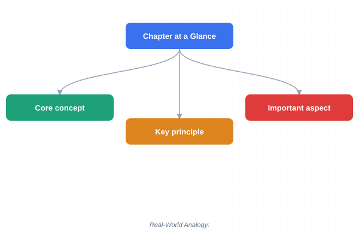
</a>
<a href="../../assets/images/diagrams/c-programming/04-control-flow/chapter-at-a-glance-sticky.svg" target="_blank" rel="noopener">
  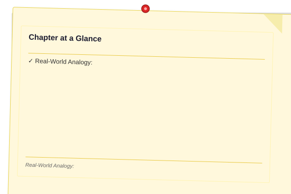
</a>


| Topic | Key Insight | Practical Takeaway |
|-------|-------------|-------------------|
| if-else Statements | Conditional branching based on boolean expressions | Always use braces even for single-line bodies to avoid bugs |
| switch-case | Multi-way branch on integer expressions | Every non-empty case needs a `break` or explicit fall-through comment |
| Ternary Operator | Inline conditional expression `condition ? true : false` | Use for simple assignments, not complex logic |
| goto Statement | Unconditional jump to a labeled statement | Use sparingly — typically only for error cleanup in nested contexts |
| break vs continue | Loop control vs skip iteration | break exits the loop; continue skips to next iteration |
| return vs exit() | Function return vs program termination | return cleans up local scope; exit() terminates immediately |
| Short-Circuit Evaluation | `&&` and `||` stop evaluating once result is known | Rely on this for safe null-pointer checks before dereferencing |


```mermaid
flowchart LR
    A["4.1 if"] --> B["4.2 if-else"]
    B --> C["4.3 if-else-if Ladder"]
    C --> D["4.4 Nested if-else"]
    D --> E["4.5 Dangling Else"]
    E --> F["4.6 switch-case"]
    F --> G["4.7 Ternary"]
    G --> H["4.8 goto"]
    H --> I["4.9 break vs continue"]
    I --> J["4.10 return"]
    J --> K["4.11 exit()"]
    K --> L["4.12 Boolean"]
    L --> M["Comparisons & Interview Corner"]
```


---

## Decision Making in C

**Real-World Analogy:** Decision-making in C is like a traffic light controller at a busy intersection. The controller evaluates conditions (is it red? green? yellow? pedestrian crossing?) and directs traffic down the appropriate path. Just as a traffic light prevents collisions by enforcing which path gets the green signal, control flow statements direct program execution down the correct code path based on evaluated conditions.

### Numbered Steps of Decision Making

<a href="../../assets/images/diagrams/c-programming/04-control-flow/numbered-steps-of-decision-making-handwritten.svg" target="_blank" rel="noopener">
  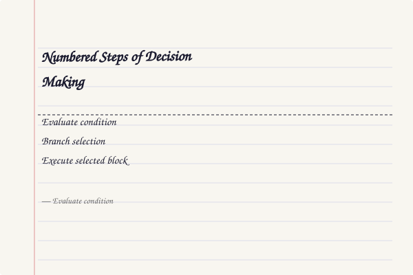
</a>
<a href="../../assets/images/diagrams/c-programming/04-control-flow/numbered-steps-of-decision-making-diagram.svg" target="_blank" rel="noopener">
  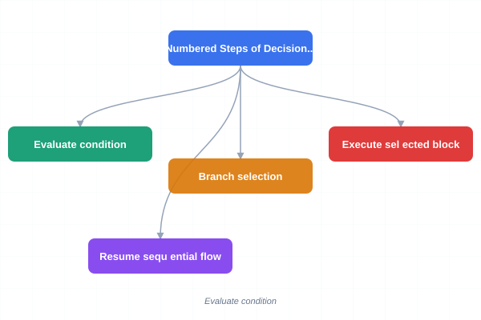
</a>
<a href="../../assets/images/diagrams/c-programming/04-control-flow/numbered-steps-of-decision-making-sticky.svg" target="_blank" rel="noopener">
  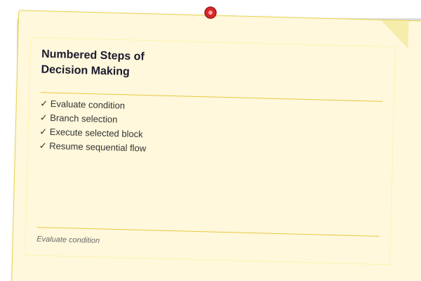
</a>


1. **Evaluate condition** — The program evaluates a boolean expression (any expression yielding zero/non-zero)
2. **Branch selection** — Based on the truth value, the corresponding code block is selected for execution
3. **Execute selected block** — The statements inside the selected branch run
4. **Resume sequential flow** — After the branch completes, execution continues with the next statement after the construct

### Pseudocode

<a href="../../assets/images/diagrams/c-programming/04-control-flow/pseudocode-handwritten.svg" target="_blank" rel="noopener">
  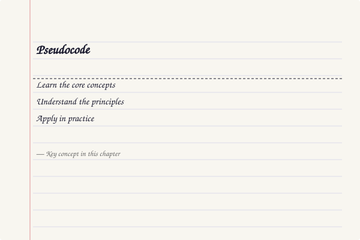
</a>
<a href="../../assets/images/diagrams/c-programming/04-control-flow/pseudocode-diagram.svg" target="_blank" rel="noopener">
  
</a>
<a href="../../assets/images/diagrams/c-programming/04-control-flow/pseudocode-sticky.svg" target="_blank" rel="noopener">
  
</a>

```
INPUT decision_expression
IF expression IS non-zero THEN
    EXECUTE true_block
ELSE IF another_expression IS non-zero THEN
    EXECUTE second_block
ELSE
    EXECUTE default_block
END IF
CONTINUE with rest of program
```

### Decision Making Constructs in C

<a href="../../assets/images/diagrams/c-programming/04-control-flow/decision-making-constructs-in-c-handwritten.svg" target="_blank" rel="noopener">
  
</a>
<a href="../../assets/images/diagrams/c-programming/04-control-flow/decision-making-constructs-in-c-diagram.svg" target="_blank" rel="noopener">
  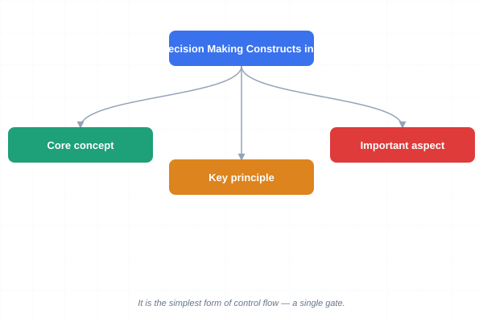
</a>
<a href="../../assets/images/diagrams/c-programming/04-control-flow/decision-making-constructs-in-c-sticky.svg" target="_blank" rel="noopener">
  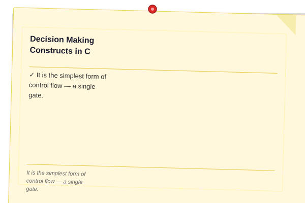
</a>


| Construct | Type | Evaluates | Use Case |
|-----------|------|-----------|----------|
| `if` | Selection | Single condition | Optional execution |
| `if-else` | Selection | Single condition | Two-way branch |
| `if-else if-else` | Selection | Multiple conditions | Multi-way branch (range-based) |
| `switch-case` | Selection | Integral expression | Multi-way branch (value-based) |
| `?:` (ternary) | Expression | Single condition | Inline conditional value |
| `goto` | Unconditional jump | Label | Arbitrary transfer |

---

## 4.1 The `if` Statement

The `if` statement executes a block of code only when a condition evaluates to true (non-zero). It is the simplest form of control flow — a single gate.

### Real-World Analogy

<a href="../../assets/images/diagrams/c-programming/04-control-flow/real-world-analogy-handwritten.svg" target="_blank" rel="noopener">
  
</a>
<a href="../../assets/images/diagrams/c-programming/04-control-flow/real-world-analogy-diagram.svg" target="_blank" rel="noopener">
  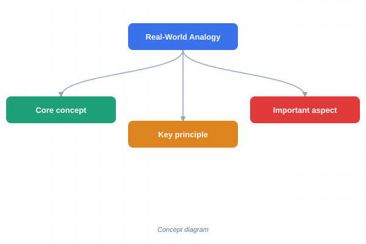
</a>
<a href="../../assets/images/diagrams/c-programming/04-control-flow/real-world-analogy-sticky.svg" target="_blank" rel="noopener">
  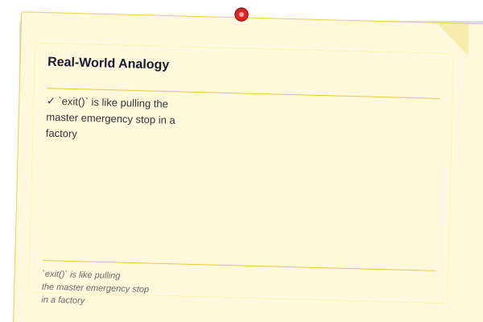
</a>


The `if` statement works like a security turnstile at a subway station. The turnstile checks: "Do you have a valid ticket?" If yes (condition is true), it rotates and lets you through (executes the block). If no (condition is false), it stays locked and you skip the gate entirely. The program continues walking after the turnstile either way.

### Syntax

<a href="../../assets/images/diagrams/c-programming/04-control-flow/syntax-handwritten.svg" target="_blank" rel="noopener">
  
</a>
<a href="../../assets/images/diagrams/c-programming/04-control-flow/syntax-diagram.svg" target="_blank" rel="noopener">
  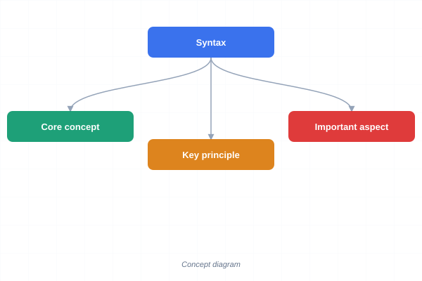
</a>
<a href="../../assets/images/diagrams/c-programming/04-control-flow/syntax-sticky.svg" target="_blank" rel="noopener">
  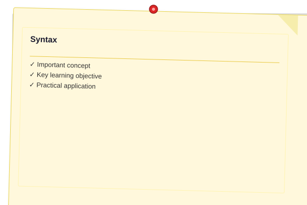
</a>


```c
if (condition) {
    /* executed when condition is non-zero (true) */
}
```

### Numbered Execution Steps

<a href="../../assets/images/diagrams/c-programming/04-control-flow/numbered-execution-steps-handwritten.svg" target="_blank" rel="noopener">
  
</a>
<a href="../../assets/images/diagrams/c-programming/04-control-flow/numbered-execution-steps-diagram.svg" target="_blank" rel="noopener">
  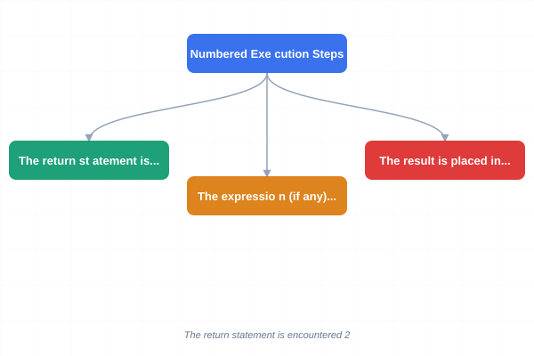
</a>
<a href="../../assets/images/diagrams/c-programming/04-control-flow/numbered-execution-steps-sticky.svg" target="_blank" rel="noopener">
  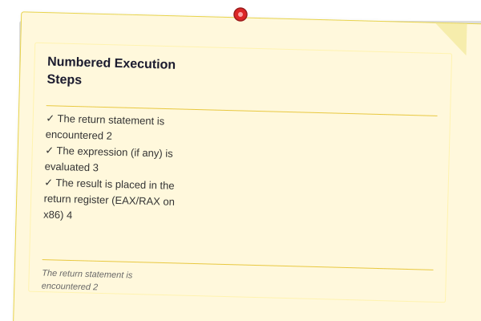
</a>


1. The condition expression inside parentheses is evaluated
2. If the result is **non-zero** (true), the body (block or single statement) executes
3. If the result is **zero** (false), the body is **skipped** entirely
4. Execution resumes at the first statement after the `if` construct

### Pseudocode

<a href="../../assets/images/diagrams/c-programming/04-control-flow/pseudocode-handwritten.svg" target="_blank" rel="noopener">
  
</a>
<a href="../../assets/images/diagrams/c-programming/04-control-flow/pseudocode-diagram.svg" target="_blank" rel="noopener">
  
</a>
<a href="../../assets/images/diagrams/c-programming/04-control-flow/pseudocode-sticky.svg" target="_blank" rel="noopener">
  
</a>

```
IF condition THEN
    execute statement(s)
END IF
```

### Dry Run / Trace Table

<a href="../../assets/images/diagrams/c-programming/04-control-flow/dry-run-trace-table-handwritten.svg" target="_blank" rel="noopener">
  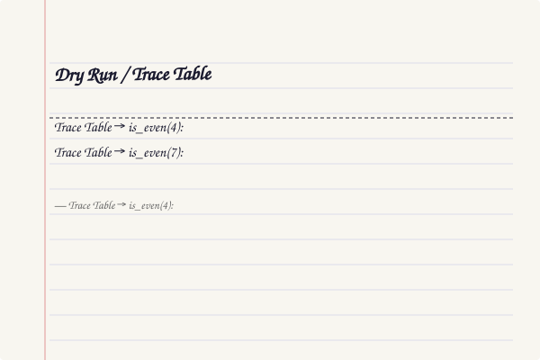
</a>
<a href="../../assets/images/diagrams/c-programming/04-control-flow/dry-run-trace-table-diagram.svg" target="_blank" rel="noopener">
  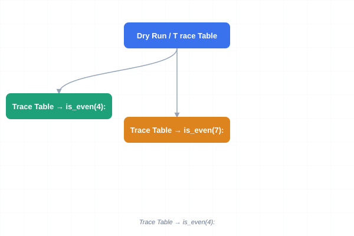
</a>
<a href="../../assets/images/diagrams/c-programming/04-control-flow/dry-run-trace-table-sticky.svg" target="_blank" rel="noopener">
  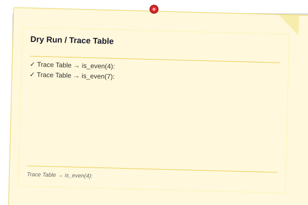
</a>


**Program:** Check if temperature indicates a warm day

```c
#include <stdio.h>

int main(void)
{
    int temperature = 30;

    if (temperature > 25) {
        printf("It is a warm day.\n");
    }

    return 0;
}
```

**Trace Table (temperature = 30):**

| Step | Line | Code | temperature | Condition (temp > 25) | Action |
|------|------|------|-------------|----------------------|--------|
| 1 | 5 | `int temperature = 30;` | 30 | — | Variable initialized |
| 2 | 7 | `if (temperature > 25)` | 30 | `30 > 25` → **true** (1) | Enter if block |
| 3 | 8 | `printf(...)` | 30 | — | Output: "It is a warm day." |
| 4 | 10 | `return 0;` | 30 | — | Program ends |

**Trace Table (temperature = 10):**

| Step | Line | Code | temperature | Condition (temp > 25) | Action |
|------|------|------|-------------|----------------------|--------|
| 1 | 5 | `int temperature = 10;` | 10 | — | Variable initialized |
| 2 | 7 | `if (temperature > 25)` | 10 | `10 > 25` → **false** (0) | Skip if block |
| 3 | 10 | `return 0;` | 10 | — | Program ends |

### C Code Examples

<a href="../../assets/images/diagrams/c-programming/04-control-flow/c-code-examples-handwritten.svg" target="_blank" rel="noopener">
  
</a>
<a href="../../assets/images/diagrams/c-programming/04-control-flow/c-code-examples-diagram.svg" target="_blank" rel="noopener">
  
</a>
<a href="../../assets/images/diagrams/c-programming/04-control-flow/c-code-examples-sticky.svg" target="_blank" rel="noopener">
  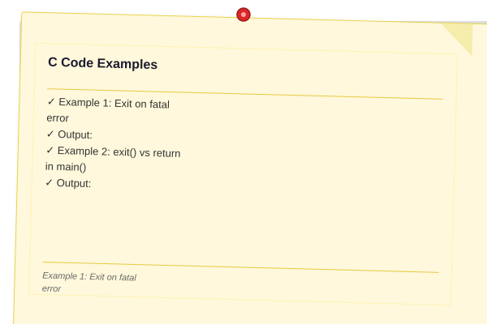
</a>


**Example 1: Basic if**

```c
#include <stdio.h>

int main(void)
{
    int temperature = 30;

    if (temperature > 25) {
        printf("It is a warm day.\n");
    }

    if (temperature < 10) {
        printf("It is a cold day.\n");
    }

    return 0;
}
```

**Output:**
```
It is a warm day.
```

**Example 2: if with assignment bug (common trap)**

```c
#include <stdio.h>

int main(void)
{
    int x = 0;

    /* BUG: assignment instead of comparison — always true */
    if (x = 5) {
        printf("This ALWAYS prints because x = 5 evaluates to 5 (true)\n");
    }

    /* CORRECT: comparison */
    if (x == 5) {
        printf("x is 5\n");
    }

    return 0;
}
```

**Output:**
```
This ALWAYS prints because x = 5 evaluates to 5 (true)
x is 5
```

> **Compiler Warning:** Modern compilers warn on `if (x = 5)`. Use `if (5 == x)` (Yoda condition) to catch accidental assignment because `if (5 = x)` is a compile error.

### Complexity Analysis

<a href="../../assets/images/diagrams/c-programming/04-control-flow/complexity-analysis-handwritten.svg" target="_blank" rel="noopener">
  
</a>
<a href="../../assets/images/diagrams/c-programming/04-control-flow/complexity-analysis-diagram.svg" target="_blank" rel="noopener">
  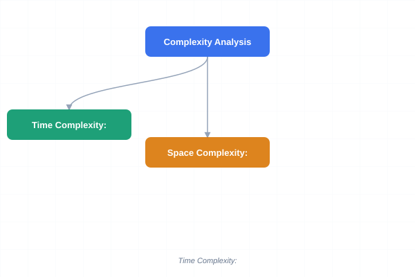
</a>
<a href="../../assets/images/diagrams/c-programming/04-control-flow/complexity-analysis-sticky.svg" target="_blank" rel="noopener">
  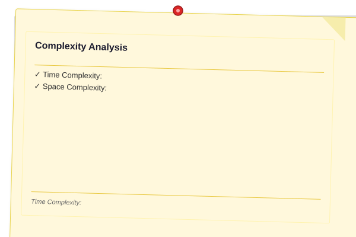
</a>


- **Time Complexity:** O(1) — The condition expression is evaluated once in constant time regardless of input size
- **Space Complexity:** O(1) — No additional memory is allocated beyond the condition evaluation

### Advantages & Disadvantages

<a href="../../assets/images/diagrams/c-programming/04-control-flow/advantages-disadvantages-handwritten.svg" target="_blank" rel="noopener">
  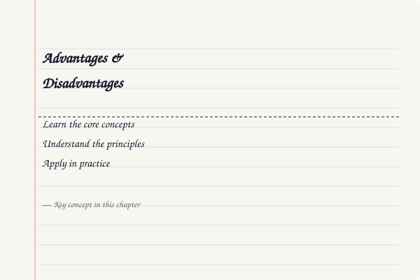
</a>
<a href="../../assets/images/diagrams/c-programming/04-control-flow/advantages-disadvantages-diagram.svg" target="_blank" rel="noopener">
  
</a>
<a href="../../assets/images/diagrams/c-programming/04-control-flow/advantages-disadvantages-sticky.svg" target="_blank" rel="noopener">
  
</a>


| Advantages | Disadvantages |
|------------|---------------|
| Simplest control flow construct | Only handles a single condition |
| Easy to read and understand | No else path for false case |
| Fast — single branch prediction | Can lead to many separate if statements |
| No fall-through issues (unlike switch) | Repeated condition evaluation if naive |

### Edge Cases

<a href="../../assets/images/diagrams/c-programming/04-control-flow/edge-cases-handwritten.svg" target="_blank" rel="noopener">
  
</a>
<a href="../../assets/images/diagrams/c-programming/04-control-flow/edge-cases-diagram.svg" target="_blank" rel="noopener">
  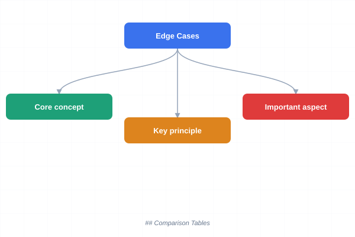
</a>
<a href="../../assets/images/diagrams/c-programming/04-control-flow/edge-cases-sticky.svg" target="_blank" rel="noopener">
  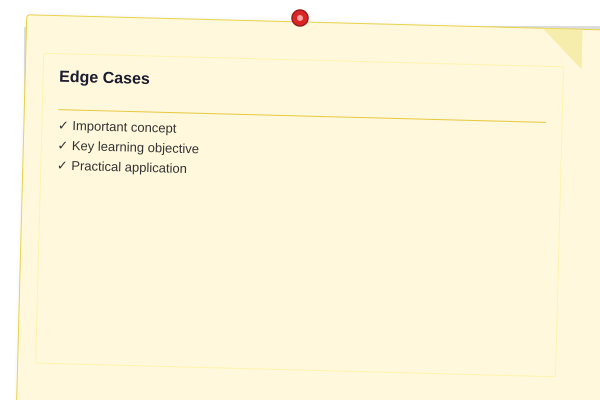
</a>


| Edge Case | Example | Explanation |
|-----------|---------|-------------|
| **Empty body** | `if (x > 0);` | Semicolon immediately after `if` creates an empty body; the next statement always executes |
| **Assignment trap** | `if (x = 5)` | Assignment expression `x = 5` yields 5 (true); almost always a bug |
| **Float comparison** | `if (f == 0.1)` | Floating-point precision may cause unexpected false; use epsilon comparison |
| **Null pointer dereference** | `if (ptr->field)` when ptr is NULL | Dereference before check causes undefined behavior |
| **Side effects in condition** | `if (x++ > 0)` | Condition has side effect; x changes regardless of truth value |

---

## 4.2 The `if-else` Statement

The `if-else` statement provides two mutually exclusive code paths — one for when the condition is true, another for when it is false.

### Real-World Analogy

<a href="../../assets/images/diagrams/c-programming/04-control-flow/real-world-analogy-handwritten.svg" target="_blank" rel="noopener">
  
</a>
<a href="../../assets/images/diagrams/c-programming/04-control-flow/real-world-analogy-diagram.svg" target="_blank" rel="noopener">
  
</a>
<a href="../../assets/images/diagrams/c-programming/04-control-flow/real-world-analogy-sticky.svg" target="_blank" rel="noopener">
  
</a>


An `if-else` is like a fork in a hiking trail. A signpost asks: "Is the bridge ahead safe?" If yes (true), take the short path across the bridge. If no (false), take the longer detour around the ravine. You must take exactly one path — never both, never neither.

### Syntax

<a href="../../assets/images/diagrams/c-programming/04-control-flow/syntax-handwritten.svg" target="_blank" rel="noopener">
  
</a>
<a href="../../assets/images/diagrams/c-programming/04-control-flow/syntax-diagram.svg" target="_blank" rel="noopener">
  
</a>
<a href="../../assets/images/diagrams/c-programming/04-control-flow/syntax-sticky.svg" target="_blank" rel="noopener">
  
</a>


```c
if (condition) {
    /* executed when condition is true (non-zero) */
} else {
    /* executed when condition is false (zero) */
}
```

### Numbered Execution Steps

<a href="../../assets/images/diagrams/c-programming/04-control-flow/numbered-execution-steps-handwritten.svg" target="_blank" rel="noopener">
  
</a>
<a href="../../assets/images/diagrams/c-programming/04-control-flow/numbered-execution-steps-diagram.svg" target="_blank" rel="noopener">
  
</a>
<a href="../../assets/images/diagrams/c-programming/04-control-flow/numbered-execution-steps-sticky.svg" target="_blank" rel="noopener">
  
</a>


1. Evaluate the condition expression
2. If the result is **non-zero** (true), execute the `if` block, then skip the `else` block
3. If the result is **zero** (false), **skip** the `if` block and execute the `else` block
4. Resume execution at the statement after the `if-else` construct

### Pseudocode

<a href="../../assets/images/diagrams/c-programming/04-control-flow/pseudocode-handwritten.svg" target="_blank" rel="noopener">
  
</a>
<a href="../../assets/images/diagrams/c-programming/04-control-flow/pseudocode-diagram.svg" target="_blank" rel="noopener">
  
</a>
<a href="../../assets/images/diagrams/c-programming/04-control-flow/pseudocode-sticky.svg" target="_blank" rel="noopener">
  
</a>

```
IF condition THEN
    execute true_block
ELSE
    execute false_block
END IF
```

### Dry Run / Trace Table

<a href="../../assets/images/diagrams/c-programming/04-control-flow/dry-run-trace-table-handwritten.svg" target="_blank" rel="noopener">
  
</a>
<a href="../../assets/images/diagrams/c-programming/04-control-flow/dry-run-trace-table-diagram.svg" target="_blank" rel="noopener">
  
</a>
<a href="../../assets/images/diagrams/c-programming/04-control-flow/dry-run-trace-table-sticky.svg" target="_blank" rel="noopener">
  
</a>


**Program:** Check if a number is even or odd

```c
#include <stdio.h>

int main(void)
{
    int number = 7;

    if (number % 2 == 0) {
        printf("%d is even.\n", number);
    } else {
        printf("%d is odd.\n", number);
    }

    return 0;
}
```

**Trace Table (number = 7):**

| Step | Line | Code | number | number % 2 | Condition (== 0) | Action |
|------|------|------|--------|------------|------------------|--------|
| 1 | 5 | `int number = 7;` | 7 | — | — | Variable initialized |
| 2 | 7 | `if (number % 2 == 0)` | 7 | 1 | `1 == 0` → **false** (0) | Skip if block, enter else |
| 3 | 10 | `printf(...)` | 7 | — | — | Output: "7 is odd." |
| 4 | 12 | `return 0;` | 7 | — | — | Program ends |

**Trace Table (number = 8):**

| Step | Line | Code | number | number % 2 | Condition (== 0) | Action |
|------|------|------|--------|------------|------------------|--------|
| 1 | 5 | `int number = 8;` | 8 | — | — | Variable initialized |
| 2 | 7 | `if (number % 2 == 0)` | 8 | 0 | `0 == 0` → **true** (1) | Enter if block |
| 3 | 8 | `printf(...)` | 8 | — | — | Output: "8 is even." |
| 4 | 12 | `return 0;` | 8 | — | — | Program ends |

### C Code Examples

<a href="../../assets/images/diagrams/c-programming/04-control-flow/c-code-examples-handwritten.svg" target="_blank" rel="noopener">
  
</a>
<a href="../../assets/images/diagrams/c-programming/04-control-flow/c-code-examples-diagram.svg" target="_blank" rel="noopener">
  
</a>
<a href="../../assets/images/diagrams/c-programming/04-control-flow/c-code-examples-sticky.svg" target="_blank" rel="noopener">
  
</a>


**Example 1: Even or Odd**

```c
#include <stdio.h>

int main(void)
{
    int number = 7;

    if (number % 2 == 0) {
        printf("%d is even.\n", number);
    } else {
        printf("%d is odd.\n", number);
    }

    return 0;
}
```

**Output:**
```
7 is odd.
```

**Example 2: Pass or Fail**

```c
#include <stdio.h>

int main(void)
{
    int marks = 65;

    if (marks >= 40) {
        printf("Result: PASS\n");
        printf("Marks: %d\n", marks);
    } else {
        printf("Result: FAIL\n");
        printf("Marks: %d — Need %d more\n", marks, 40 - marks);
    }

    return 0;
}
```

**Output:**
```
Result: PASS
Marks: 65
```

**Example 3: Single statement without braces (risky)**

```c
#include <stdio.h>

int main(void)
{
    int x = 0;

    /* Without braces — only first statement is in the else branch */
    if (x > 0)
        printf("Positive\n");
    else
        printf("Non-positive\n");
        printf("This ALWAYS prints — not part of else!\n");

    /* Same logic WITH braces — correct */
    if (x > 0) {
        printf("Positive\n");
    } else {
        printf("Non-positive\n");
        printf("This prints only when x <= 0\n");
    }

    return 0;
}
```

**Output:**
```
Non-positive
This ALWAYS prints — not part of else!
Non-positive
This prints only when x <= 0
```

### Complexity Analysis

<a href="../../assets/images/diagrams/c-programming/04-control-flow/complexity-analysis-handwritten.svg" target="_blank" rel="noopener">
  
</a>
<a href="../../assets/images/diagrams/c-programming/04-control-flow/complexity-analysis-diagram.svg" target="_blank" rel="noopener">
  
</a>
<a href="../../assets/images/diagrams/c-programming/04-control-flow/complexity-analysis-sticky.svg" target="_blank" rel="noopener">
  
</a>


- **Time Complexity:** O(1) — The condition is evaluated once; exactly one branch executes
- **Space Complexity:** O(1) — No additional memory allocation

### Advantages & Disadvantages

<a href="../../assets/images/diagrams/c-programming/04-control-flow/advantages-disadvantages-handwritten.svg" target="_blank" rel="noopener">
  
</a>
<a href="../../assets/images/diagrams/c-programming/04-control-flow/advantages-disadvantages-diagram.svg" target="_blank" rel="noopener">
  
</a>
<a href="../../assets/images/diagrams/c-programming/04-control-flow/advantages-disadvantages-sticky.svg" target="_blank" rel="noopener">
  
</a>


| Advantages | Disadvantages |
|------------|---------------|
| Covers both true and false paths explicitly | Only two possible outcomes |
| Mutually exclusive — guarantees exactly one path | Cannot express multi-way branching directly |
| Clear, readable logic | Nested if-else reduces readability |
| Compiler optimizes with conditional jumps | Expression evaluated even when false branch is trivial |

### Edge Cases

<a href="../../assets/images/diagrams/c-programming/04-control-flow/edge-cases-handwritten.svg" target="_blank" rel="noopener">
  
</a>
<a href="../../assets/images/diagrams/c-programming/04-control-flow/edge-cases-diagram.svg" target="_blank" rel="noopener">
  
</a>
<a href="../../assets/images/diagrams/c-programming/04-control-flow/edge-cases-sticky.svg" target="_blank" rel="noopener">
  
</a>


| Edge Case | Example | Explanation |
|-----------|---------|-------------|
| **Empty else** | `if (x) doThis(); else ;` | Empty else statement (semicolon) is legal but pointless |
| **Dangling else ambiguity** | Nested if without braces | The `else` binds to the nearest `if` |
| **Single statement illusion** | Missing braces with multiple statements | Only the first statement after `if`/`else` belongs to the branch |
| **Nested if-else deep** | 4+ levels of nesting | Readability suffers; consider refactoring |
| **Side effects in condition** | `if (scanf("%d", &n) == 1)` | Condition has side effect of reading input |

---

## 4.3 The `if-else if` Ladder

The `if-else if` ladder tests multiple conditions in sequence and executes the block belonging to the first true condition. If none match, an optional final `else` block runs.

### Real-World Analogy

<a href="../../assets/images/diagrams/c-programming/04-control-flow/real-world-analogy-handwritten.svg" target="_blank" rel="noopener">
  
</a>
<a href="../../assets/images/diagrams/c-programming/04-control-flow/real-world-analogy-diagram.svg" target="_blank" rel="noopener">
  
</a>
<a href="../../assets/images/diagrams/c-programming/04-control-flow/real-world-analogy-sticky.svg" target="_blank" rel="noopener">
  
</a>


The `if-else if` ladder is like a medical triage system in an emergency room. A nurse evaluates patients one at a time: "Is this patient critical?" → "Is this patient serious?" → "Is this patient stable?" → "Is this patient minor?" The first category that matches determines the treatment path. Once a patient is categorized, no further checks occur.

### Syntax

<a href="../../assets/images/diagrams/c-programming/04-control-flow/syntax-handwritten.svg" target="_blank" rel="noopener">
  
</a>
<a href="../../assets/images/diagrams/c-programming/04-control-flow/syntax-diagram.svg" target="_blank" rel="noopener">
  
</a>
<a href="../../assets/images/diagrams/c-programming/04-control-flow/syntax-sticky.svg" target="_blank" rel="noopener">
  
</a>


```c
if (condition1) {
    /* executed when condition1 is true */
} else if (condition2) {
    /* executed when condition1 is false AND condition2 is true */
} else if (condition3) {
    /* executed when condition1, condition2 are false AND condition3 is true */
} else {
    /* executed when ALL conditions are false */
}
```

### Numbered Execution Steps

<a href="../../assets/images/diagrams/c-programming/04-control-flow/numbered-execution-steps-handwritten.svg" target="_blank" rel="noopener">
  
</a>
<a href="../../assets/images/diagrams/c-programming/04-control-flow/numbered-execution-steps-diagram.svg" target="_blank" rel="noopener">
  
</a>
<a href="../../assets/images/diagrams/c-programming/04-control-flow/numbered-execution-steps-sticky.svg" target="_blank" rel="noopener">
  
</a>


1. Evaluate `condition1` — if true, execute block 1 and jump to step 5
2. Evaluate `condition2` — if true, execute block 2 and jump to step 5
3. Evaluate `condition3` — if true, execute block 3 and jump to step 5
4. If **no** condition was true, execute the `else` block (if present)
5. Continue with the next statement after the ladder

### Pseudocode

<a href="../../assets/images/diagrams/c-programming/04-control-flow/pseudocode-handwritten.svg" target="_blank" rel="noopener">
  
</a>
<a href="../../assets/images/diagrams/c-programming/04-control-flow/pseudocode-diagram.svg" target="_blank" rel="noopener">
  
</a>
<a href="../../assets/images/diagrams/c-programming/04-control-flow/pseudocode-sticky.svg" target="_blank" rel="noopener">
  
</a>

```
IF condition1 THEN
    execute block1
ELSE IF condition2 THEN
    execute block2
ELSE IF condition3 THEN
    execute block3
ELSE
    execute default_block
END IF
```

### Dry Run / Trace Table

<a href="../../assets/images/diagrams/c-programming/04-control-flow/dry-run-trace-table-handwritten.svg" target="_blank" rel="noopener">
  
</a>
<a href="../../assets/images/diagrams/c-programming/04-control-flow/dry-run-trace-table-diagram.svg" target="_blank" rel="noopener">
  
</a>
<a href="../../assets/images/diagrams/c-programming/04-control-flow/dry-run-trace-table-sticky.svg" target="_blank" rel="noopener">
  
</a>


**Program:** Grade assignment based on score

```c
#include <stdio.h>

int main(void)
{
    int score = 85;

    if (score >= 90) {
        printf("Grade: A\n");
    } else if (score >= 80) {
        printf("Grade: B\n");
    } else if (score >= 70) {
        printf("Grade: C\n");
    } else if (score >= 60) {
        printf("Grade: D\n");
    } else {
        printf("Grade: F\n");
    }

    return 0;
}
```

**Trace Table (score = 85):**

| Step | Line | Code | score | Condition | Result | Action |
|------|------|------|-------|-----------|--------|--------|
| 1 | 5 | `int score = 85;` | 85 | — | — | Variable initialized |
| 2 | 7 | `if (score >= 90)` | 85 | `85 >= 90` | **false** | Move to next else-if |
| 3 | 9 | `else if (score >= 80)` | 85 | `85 >= 80` | **true** | Enter this block |
| 4 | 10 | `printf("Grade: B\n")` | 85 | — | — | **Output:** Grade: B |
| 5 | 11 | End of this else-if | 85 | — | — | Skip remaining else-if/else |

**Trace Table (score = 45):**

| Step | Line | Code | score | Condition | Result | Action |
|------|------|------|-------|-----------|--------|--------|
| 1 | 5 | `int score = 45;` | 45 | — | — | Variable initialized |
| 2 | 7 | `if (score >= 90)` | 45 | `45 >= 90` | **false** | Next |
| 3 | 9 | `else if (score >= 80)` | 45 | `45 >= 80` | **false** | Next |
| 4 | 11 | `else if (score >= 70)` | 45 | `45 >= 70` | **false** | Next |
| 5 | 13 | `else if (score >= 60)` | 45 | `45 >= 60` | **false** | Next |
| 6 | 15 | `else` | 45 | — | — | Enter default else |
| 7 | 16 | `printf("Grade: F\n")` | 45 | — | — | **Output:** Grade: F |

### C Code Examples

<a href="../../assets/images/diagrams/c-programming/04-control-flow/c-code-examples-handwritten.svg" target="_blank" rel="noopener">
  
</a>
<a href="../../assets/images/diagrams/c-programming/04-control-flow/c-code-examples-diagram.svg" target="_blank" rel="noopener">
  
</a>
<a href="../../assets/images/diagrams/c-programming/04-control-flow/c-code-examples-sticky.svg" target="_blank" rel="noopener">
  
</a>


**Example 1: Grade calculator (above)**

**Example 2: Number classification**

```c
#include <stdio.h>

int main(void)
{
    int num = 0;

    if (num > 0) {
        printf("%d is positive\n", num);
    } else if (num < 0) {
        printf("%d is negative\n", num);
    } else {
        printf("%d is zero\n", num);
    }

    return 0;
}
```

**Output:**
```
0 is zero
```

### Complexity Analysis

<a href="../../assets/images/diagrams/c-programming/04-control-flow/complexity-analysis-handwritten.svg" target="_blank" rel="noopener">
  
</a>
<a href="../../assets/images/diagrams/c-programming/04-control-flow/complexity-analysis-diagram.svg" target="_blank" rel="noopener">
  
</a>
<a href="../../assets/images/diagrams/c-programming/04-control-flow/complexity-analysis-sticky.svg" target="_blank" rel="noopener">
  
</a>


- **Time Complexity:** O(n) where n is the number of conditions — in the worst case, all conditions are evaluated before finding a match (or reaching the else)
- **Space Complexity:** O(1) — No additional memory allocation

### Advantages & Disadvantages

<a href="../../assets/images/diagrams/c-programming/04-control-flow/advantages-disadvantages-handwritten.svg" target="_blank" rel="noopener">
  
</a>
<a href="../../assets/images/diagrams/c-programming/04-control-flow/advantages-disadvantages-diagram.svg" target="_blank" rel="noopener">
  
</a>
<a href="../../assets/images/diagrams/c-programming/04-control-flow/advantages-disadvantages-sticky.svg" target="_blank" rel="noopener">
  
</a>


| Advantages | Disadvantages |
|------------|---------------|
| Handles multiple mutually exclusive conditions | Worst case evaluates all conditions (O(n)) |
| Conditions can be arbitrary boolean expressions | Less readable than switch for value-based dispatch |
| Conditions checked top-down (priority order) | Not suitable for value-based dispatch (use switch) |
| Flexible — each condition can test different variables | Can encourage deeply nested logic |

### Important Rule: Order Matters

<a href="../../assets/images/diagrams/c-programming/04-control-flow/important-rule-order-matters-handwritten.svg" target="_blank" rel="noopener">
  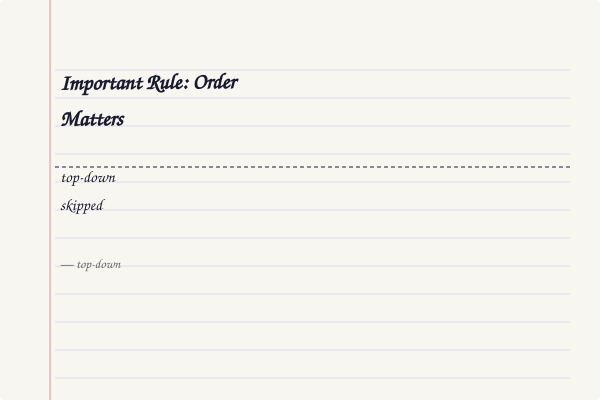
</a>
<a href="../../assets/images/diagrams/c-programming/04-control-flow/important-rule-order-matters-diagram.svg" target="_blank" rel="noopener">
  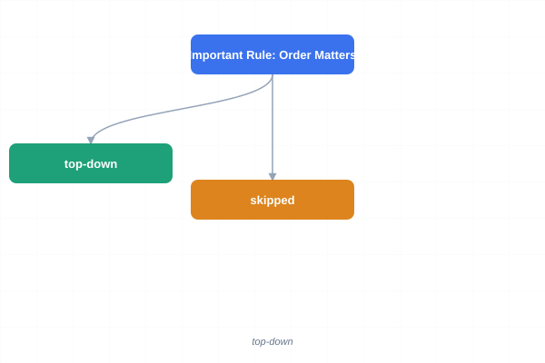
</a>
<a href="../../assets/images/diagrams/c-programming/04-control-flow/important-rule-order-matters-sticky.svg" target="_blank" rel="noopener">
  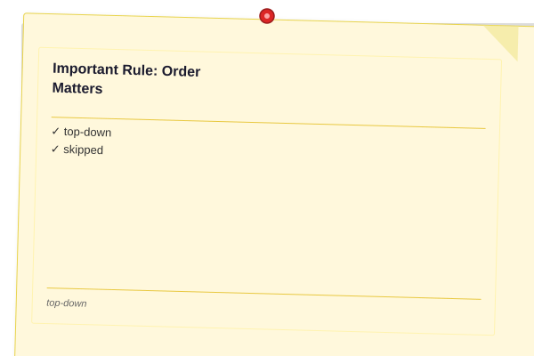
</a>


Conditions are evaluated **top-down**. Once a condition is true, the rest are **skipped**. Order conditions from most specific (or most restrictive) to least.

```c
/* WRONG — the >= 60 condition catches everything >= 60,
   so the >= 70, >= 80, >= 90 branches NEVER execute */
if (score >= 60) {
    printf("Grade D");
} else if (score >= 70) {
    printf("Grade C");  /* NEVER REACHED */
} else if (score >= 80) {
    printf("Grade B");  /* NEVER REACHED */
} else if (score >= 90) {
    printf("Grade A");  /* NEVER REACHED */
}
```

### Edge Cases

<a href="../../assets/images/diagrams/c-programming/04-control-flow/edge-cases-handwritten.svg" target="_blank" rel="noopener">
  
</a>
<a href="../../assets/images/diagrams/c-programming/04-control-flow/edge-cases-diagram.svg" target="_blank" rel="noopener">
  
</a>
<a href="../../assets/images/diagrams/c-programming/04-control-flow/edge-cases-sticky.svg" target="_blank" rel="noopener">
  
</a>


| Edge Case | Example | Explanation |
|-----------|---------|-------------|
| **Overlapping conditions** | `if (x > 0)` then `else if (x > 10)` | Second condition never true if first is true |
| **Missing final else** | Omission of final `else` block | No action taken when all conditions are false |
| **Empty condition body** | `if (x > 0); else if (y > 0);` | Semicolons create empty bodies — no code runs |
| **Deep ladder (8+ conditions)** | 10+ else-if branches | Consider switch-case or function pointer array |

---

## 4.4 Nested `if-else` Statements

A nested `if-else` is an `if-else` statement placed inside another `if` or `else` block. This allows testing multiple conditions in a hierarchical manner.

### Real-World Analogy

<a href="../../assets/images/diagrams/c-programming/04-control-flow/real-world-analogy-handwritten.svg" target="_blank" rel="noopener">
  
</a>
<a href="../../assets/images/diagrams/c-programming/04-control-flow/real-world-analogy-diagram.svg" target="_blank" rel="noopener">
  
</a>
<a href="../../assets/images/diagrams/c-programming/04-control-flow/real-world-analogy-sticky.svg" target="_blank" rel="noopener">
  
</a>


Nested `if-else` is like airport security screening. First check: "Do you have a boarding pass?" (outer if). If yes, then check: "Does your ID match the pass?" (inner if). If yes, then check: "Do you have any liquids over 100ml?" (deeper inner if). Each level adds more granularity.

### Syntax

<a href="../../assets/images/diagrams/c-programming/04-control-flow/syntax-handwritten.svg" target="_blank" rel="noopener">
  
</a>
<a href="../../assets/images/diagrams/c-programming/04-control-flow/syntax-diagram.svg" target="_blank" rel="noopener">
  
</a>
<a href="../../assets/images/diagrams/c-programming/04-control-flow/syntax-sticky.svg" target="_blank" rel="noopener">
  
</a>


```c
if (outer_condition) {
    if (inner_condition1) {
        /* both outer and inner1 are true */
    } else {
        /* outer true, inner1 false */
    }
} else {
    if (inner_condition2) {
        /* outer false, inner2 true */
    }
}
```

### Dry Run / Trace Table

<a href="../../assets/images/diagrams/c-programming/04-control-flow/dry-run-trace-table-handwritten.svg" target="_blank" rel="noopener">
  
</a>
<a href="../../assets/images/diagrams/c-programming/04-control-flow/dry-run-trace-table-diagram.svg" target="_blank" rel="noopener">
  
</a>
<a href="../../assets/images/diagrams/c-programming/04-control-flow/dry-run-trace-table-sticky.svg" target="_blank" rel="noopener">
  
</a>


**Program:** Find the largest of three numbers

```c
#include <stdio.h>

int main(void)
{
    int a = 10, b = 25, c = 15;

    if (a >= b) {
        if (a >= c) {
            printf("Largest: %d\n", a);
        } else {
            printf("Largest: %d\n", c);
        }
    } else {
        if (b >= c) {
            printf("Largest: %d\n", b);
        } else {
            printf("Largest: %d\n", c);
        }
    }

    return 0;
}
```

**Trace Table (a=10, b=25, c=15):**

| Step | Code | a | b | c | Condition | Result | Action |
|------|------|---|---|---|-----------|--------|--------|
| 1 | `int a=10, b=25, c=15` | 10 | 25 | 15 | — | — | Variables initialized |
| 2 | `if (a >= b)` | 10 | 25 | 15 | `10 >= 25` | **false** | Enter outer else |
| 3 | `if (b >= c)` | 10 | 25 | 15 | `25 >= 15` | **true** | Enter inner if |
| 4 | `printf("Largest: %d", b)` | 10 | 25 | 15 | — | — | **Output:** Largest: 25 |

### Code Example

<a href="../../assets/images/diagrams/c-programming/04-control-flow/code-example-handwritten.svg" target="_blank" rel="noopener">
  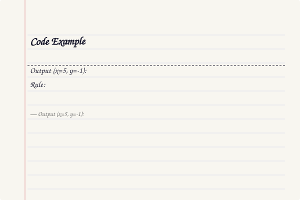
</a>
<a href="../../assets/images/diagrams/c-programming/04-control-flow/code-example-diagram.svg" target="_blank" rel="noopener">
  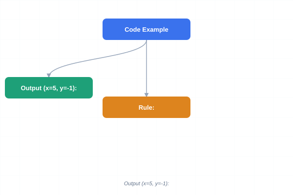
</a>
<a href="../../assets/images/diagrams/c-programming/04-control-flow/code-example-sticky.svg" target="_blank" rel="noopener">
  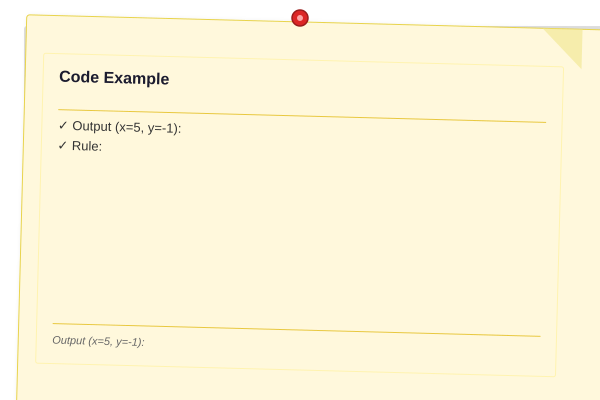
</a>


```c
#include <stdio.h>

int main(void)
{
    int a = 10, b = 25, c = 15;

    if (a >= b) {
        if (a >= c) {
            printf("Largest: %d\n", a);
        } else {
            printf("Largest: %d\n", c);
        }
    } else {
        if (b >= c) {
            printf("Largest: %d\n", b);
        } else {
            printf("Largest: %d\n", c);
        }
    }

    return 0;
}
```

**Output:**
```
Largest: 25
```

### Complexity Analysis

<a href="../../assets/images/diagrams/c-programming/04-control-flow/complexity-analysis-handwritten.svg" target="_blank" rel="noopener">
  
</a>
<a href="../../assets/images/diagrams/c-programming/04-control-flow/complexity-analysis-diagram.svg" target="_blank" rel="noopener">
  
</a>
<a href="../../assets/images/diagrams/c-programming/04-control-flow/complexity-analysis-sticky.svg" target="_blank" rel="noopener">
  
</a>


- **Time Complexity:** O(d) where d is the nesting depth — at most d comparisons in the worst case
- **Space Complexity:** O(1) — No additional memory

### Advantages & Disadvantages

<a href="../../assets/images/diagrams/c-programming/04-control-flow/advantages-disadvantages-handwritten.svg" target="_blank" rel="noopener">
  
</a>
<a href="../../assets/images/diagrams/c-programming/04-control-flow/advantages-disadvantages-diagram.svg" target="_blank" rel="noopener">
  
</a>
<a href="../../assets/images/diagrams/c-programming/04-control-flow/advantages-disadvantages-sticky.svg" target="_blank" rel="noopener">
  
</a>


| Advantages | Disadvantages |
|------------|---------------|
| Models hierarchical decision logic | Reduced readability at depth ≥ 3 |
| All conditions available at each level | Increased cyclomatic complexity |
| No redundant condition re-evaluation | Easy to introduce logic errors |

### Edge Cases

<a href="../../assets/images/diagrams/c-programming/04-control-flow/edge-cases-handwritten.svg" target="_blank" rel="noopener">
  
</a>
<a href="../../assets/images/diagrams/c-programming/04-control-flow/edge-cases-diagram.svg" target="_blank" rel="noopener">
  
</a>
<a href="../../assets/images/diagrams/c-programming/04-control-flow/edge-cases-sticky.svg" target="_blank" rel="noopener">
  
</a>


| Edge Case | Explanation |
|-----------|-------------|
| **Deep nesting (4+ levels)** | Code becomes pyramid of doom — refactor into functions |
| **Missing braces** | Inner else binds ambiguously to nearest unmatched if |
| **Incomplete branch coverage** | Forgetting to handle all combinations |

**Guideline:** If nesting exceeds 3 levels, extract inner logic into a separate function or restructure.

---

## 4.5 Dangling Else

The dangling else is a classic ambiguity in C: when `if` statements are nested without braces, an `else` binds to the **nearest preceding unmatched `if`**, regardless of indentation.

### Real-World Analogy

<a href="../../assets/images/diagrams/c-programming/04-control-flow/real-world-analogy-handwritten.svg" target="_blank" rel="noopener">
  
</a>
<a href="../../assets/images/diagrams/c-programming/04-control-flow/real-world-analogy-diagram.svg" target="_blank" rel="noopener">
  
</a>
<a href="../../assets/images/diagrams/c-programming/04-control-flow/real-world-analogy-sticky.svg" target="_blank" rel="noopener">
  
</a>


The dangling else is like a sign in a building that says "If you see the reception desk, turn left. If you see the elevator, turn right. Else go straight." The "else" is ambiguous — does it attach to the first "if" or the second? In C, it always attaches to the nearest `if`.

### The Problem

<a href="../../assets/images/diagrams/c-programming/04-control-flow/the-problem-handwritten.svg" target="_blank" rel="noopener">
  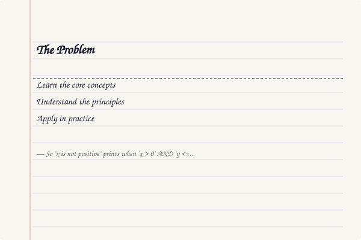
</a>
<a href="../../assets/images/diagrams/c-programming/04-control-flow/the-problem-diagram.svg" target="_blank" rel="noopener">
  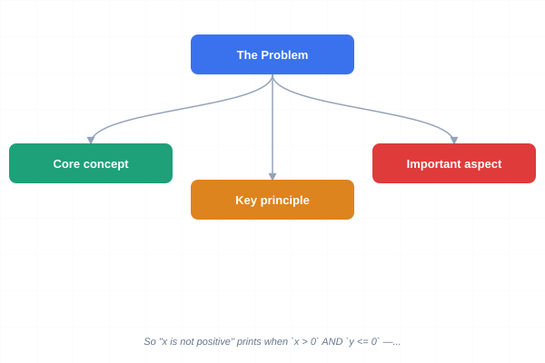
</a>
<a href="../../assets/images/diagrams/c-programming/04-control-flow/the-problem-sticky.svg" target="_blank" rel="noopener">
  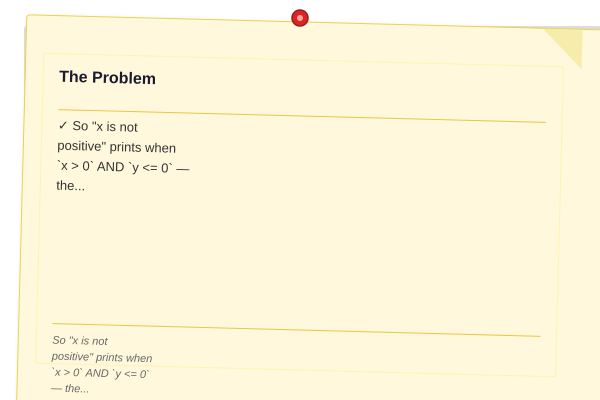
</a>


```c
/* BAD — misleading indentation */
if (x > 0)
    if (y > 0)
        printf("both positive\n");
else
    printf("x is not positive\n");   /* binds to inner if! */
```

Despite the indentation suggesting `else` belongs to `if (x > 0)`, the compiler binds it to `if (y > 0)`. So "x is not positive" prints when `x > 0` AND `y <= 0` — the opposite of what the indentation suggests.

### The Fix

<a href="../../assets/images/diagrams/c-programming/04-control-flow/the-fix-handwritten.svg" target="_blank" rel="noopener">
  
</a>
<a href="../../assets/images/diagrams/c-programming/04-control-flow/the-fix-diagram.svg" target="_blank" rel="noopener">
  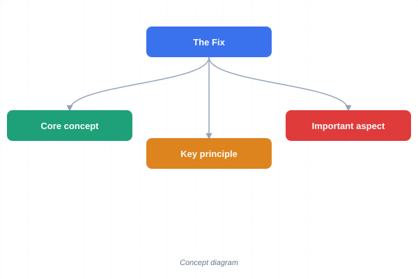
</a>
<a href="../../assets/images/diagrams/c-programming/04-control-flow/the-fix-sticky.svg" target="_blank" rel="noopener">
  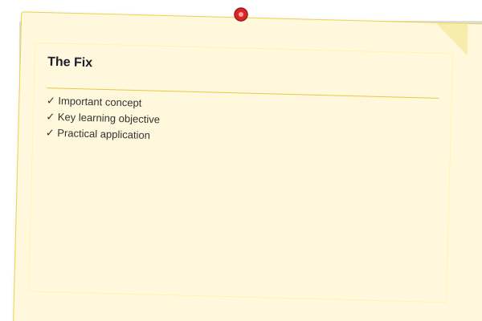
</a>


```c
/* CORRECT — braces clarify intent */
if (x > 0) {
    if (y > 0) {
        printf("both positive\n");
    }
} else {
    printf("x is not positive\n");
}
```

### Dry Run / Trace Table

<a href="../../assets/images/diagrams/c-programming/04-control-flow/dry-run-trace-table-handwritten.svg" target="_blank" rel="noopener">
  
</a>
<a href="../../assets/images/diagrams/c-programming/04-control-flow/dry-run-trace-table-diagram.svg" target="_blank" rel="noopener">
  
</a>
<a href="../../assets/images/diagrams/c-programming/04-control-flow/dry-run-trace-table-sticky.svg" target="_blank" rel="noopener">
  
</a>


**Buggy version:** `x = 5, y = -1`

| Step | Condition | Evaluates To | Action |
|------|-----------|-------------|--------|
| 1 | `x > 0` (5 > 0) | **true** | Enter outer if |
| 2 | `y > 0` (-1 > 0) | **false** | Skip inner if body |
| 3 | `else` clause | — | **Executes!** "x is not positive" printed — WRONG! |

### Code Example

<a href="../../assets/images/diagrams/c-programming/04-control-flow/code-example-handwritten.svg" target="_blank" rel="noopener">
  
</a>
<a href="../../assets/images/diagrams/c-programming/04-control-flow/code-example-diagram.svg" target="_blank" rel="noopener">
  
</a>
<a href="../../assets/images/diagrams/c-programming/04-control-flow/code-example-sticky.svg" target="_blank" rel="noopener">
  
</a>


```c
#include <stdio.h>

int main(void)
{
    int x = 5, y = -1;

    /* MISLEADING INDENTATION — buggy */
    if (x > 0)
        if (y > 0)
            printf("both positive\n");
    else
        printf("x is not positive\n");  /* This prints incorrectly! */

    return 0;
}
```

**Output (x=5, y=-1):**
```
x is not positive
```

**Rule:** Always use braces `{}` for all `if`, `else`, `while`, `for`, and `do` bodies, even single-statement ones.

### Complexity Analysis

<a href="../../assets/images/diagrams/c-programming/04-control-flow/complexity-analysis-handwritten.svg" target="_blank" rel="noopener">
  
</a>
<a href="../../assets/images/diagrams/c-programming/04-control-flow/complexity-analysis-diagram.svg" target="_blank" rel="noopener">
  
</a>
<a href="../../assets/images/diagrams/c-programming/04-control-flow/complexity-analysis-sticky.svg" target="_blank" rel="noopener">
  
</a>


- **Time Complexity:** O(1) — No additional overhead for using braces
- **Space Complexity:** O(1) — Braces do not affect memory

### Edge Cases

<a href="../../assets/images/diagrams/c-programming/04-control-flow/edge-cases-handwritten.svg" target="_blank" rel="noopener">
  
</a>
<a href="../../assets/images/diagrams/c-programming/04-control-flow/edge-cases-diagram.svg" target="_blank" rel="noopener">
  
</a>
<a href="../../assets/images/diagrams/c-programming/04-control-flow/edge-cases-sticky.svg" target="_blank" rel="noopener">
  
</a>


| Edge Case | Explanation |
|-----------|-------------|
| **Deep nesting without braces** | Each additional level doubles ambiguity potential |
| **Mixed bracing** | Some if blocks braced, others not — inconsistent and error-prone |

---

## 4.6 The `switch` Statement

`switch` provides a multi-way branch based on an **integral expression**. It is often more efficient and readable than long `if-else if` chains when dispatching on a single integer/character value.

### Real-World Analogy

<a href="../../assets/images/diagrams/c-programming/04-control-flow/real-world-analogy-handwritten.svg" target="_blank" rel="noopener">
  
</a>
<a href="../../assets/images/diagrams/c-programming/04-control-flow/real-world-analogy-diagram.svg" target="_blank" rel="noopener">
  
</a>
<a href="../../assets/images/diagrams/c-programming/04-control-flow/real-world-analogy-sticky.svg" target="_blank" rel="noopener">
  
</a>


A `switch` statement is like a vending machine. You press a button (the expression). The machine checks: "Is button 1 pressed? 2? 3? ..." Instead of asking each question sequentially, the vending machine directly routes to the correct column based on the button number. This is exactly how `switch` works — it jumps directly to the matching case.

### Syntax

<a href="../../assets/images/diagrams/c-programming/04-control-flow/syntax-handwritten.svg" target="_blank" rel="noopener">
  
</a>
<a href="../../assets/images/diagrams/c-programming/04-control-flow/syntax-diagram.svg" target="_blank" rel="noopener">
  
</a>
<a href="../../assets/images/diagrams/c-programming/04-control-flow/syntax-sticky.svg" target="_blank" rel="noopener">
  
</a>


```c
switch (expression) {
    case constant1:
        statements;
        break;
    case constant2:
        statements;
        break;
    default:
        statements;
        break;
}
```

### Numbered Execution Steps

<a href="../../assets/images/diagrams/c-programming/04-control-flow/numbered-execution-steps-handwritten.svg" target="_blank" rel="noopener">
  
</a>
<a href="../../assets/images/diagrams/c-programming/04-control-flow/numbered-execution-steps-diagram.svg" target="_blank" rel="noopener">
  
</a>
<a href="../../assets/images/diagrams/c-programming/04-control-flow/numbered-execution-steps-sticky.svg" target="_blank" rel="noopener">
  
</a>


1. Evaluate the controlling expression (must yield an integer type: `int`, `char`, `enum`, etc.)
2. Compare the value against each `case` label (compile-time constants)
3. If a match is found, execution **jumps** to that case label
4. Execution continues sequentially through subsequent cases unless a `break` is encountered
5. If no case matches and `default` is present, execution jumps to `default`
6. If no case matches and `default` is absent, the entire switch body is skipped

### Pseudocode

<a href="../../assets/images/diagrams/c-programming/04-control-flow/pseudocode-handwritten.svg" target="_blank" rel="noopener">
  
</a>
<a href="../../assets/images/diagrams/c-programming/04-control-flow/pseudocode-diagram.svg" target="_blank" rel="noopener">
  
</a>
<a href="../../assets/images/diagrams/c-programming/04-control-flow/pseudocode-sticky.svg" target="_blank" rel="noopener">
  
</a>

```
SWITCH expression
    CASE value1:
        execute block1
        BREAK
    CASE value2:
        execute block2
        BREAK
    CASE value3:
        execute block3
        BREAK
    DEFAULT:
        execute default_block
        BREAK
END SWITCH
```

### Dry Run / Trace Table

<a href="../../assets/images/diagrams/c-programming/04-control-flow/dry-run-trace-table-handwritten.svg" target="_blank" rel="noopener">
  
</a>
<a href="../../assets/images/diagrams/c-programming/04-control-flow/dry-run-trace-table-diagram.svg" target="_blank" rel="noopener">
  
</a>
<a href="../../assets/images/diagrams/c-programming/04-control-flow/dry-run-trace-table-sticky.svg" target="_blank" rel="noopener">
  
</a>


**Program:** Print day name from number

```c
#include <stdio.h>

int main(void)
{
    int day = 3;

    switch (day) {
        case 1: printf("Monday\n"); break;
        case 2: printf("Tuesday\n"); break;
        case 3: printf("Wednesday\n"); break;
        case 4: printf("Thursday\n"); break;
        case 5: printf("Friday\n"); break;
        case 6: printf("Saturday\n"); break;
        case 7: printf("Sunday\n"); break;
        default: printf("Invalid day\n"); break;
    }

    return 0;
}
```

**Trace Table (day = 3):**

| Step | Code | day | Action |
|------|------|-----|--------|
| 1 | `int day = 3;` | 3 | Variable initialized |
| 2 | `switch (day)` | 3 | Evaluate expression → value is 3 |
| 3 | `case 1:` | 3 | No match — skip |
| 4 | `case 2:` | 3 | No match — skip |
| 5 | `case 3:` | 3 | **Match!** Jump to this case |
| 6 | `printf("Wednesday\n")` | 3 | **Output:** Wednesday |
| 7 | `break;` | 3 | Exit switch |
| 8 | End of switch | 3 | Continue after switch |

**Trace Table (day = 9, with fall-through detail for case 2):**

If `day = 2` and we artificially remove `break` from case 2:

| Step | Code | Action |
|------|------|--------|
| 1 | `switch (day)` | value = 2 |
| 2 | `case 1:` | No match |
| 3 | `case 2:` | **Match!** Jump here |
| 4 | `printf("Tuesday\n")` | Output: Tuesday |
| 5 | *(no break)* | Falls through to case 3! |
| 6 | `case 3: printf("Wednesday\n"); break;` | Output: Wednesday, then break exits |

### C Code Examples

<a href="../../assets/images/diagrams/c-programming/04-control-flow/c-code-examples-handwritten.svg" target="_blank" rel="noopener">
  
</a>
<a href="../../assets/images/diagrams/c-programming/04-control-flow/c-code-examples-diagram.svg" target="_blank" rel="noopener">
  
</a>
<a href="../../assets/images/diagrams/c-programming/04-control-flow/c-code-examples-sticky.svg" target="_blank" rel="noopener">
  
</a>


**Example 1: Day of week (above)**

**Example 2: Fall-through for shared logic**

```c
#include <stdio.h>

int main(void)
{
    char grade = 'B';

    switch (grade) {
        case 'A':
            printf("Excellent!\n");
            break;
        case 'B':
        case 'C':
            printf("Good\n");
            break;
        case 'D':
            printf("Passing\n");
            break;
        case 'F':
            printf("Failing\n");
            break;
        default:
            printf("Invalid grade\n");
            break;
    }

    return 0;
}
```

**Output:**
```
Good
```

**Example 3: Calculator using switch**

```c
#include <stdio.h>

int main(void)
{
    char op = '+';
    int a = 10, b = 3;

    switch (op) {
        case '+':
            printf("%d + %d = %d\n", a, b, a + b);
            break;
        case '-':
            printf("%d - %d = %d\n", a, b, a - b);
            break;
        case '*':
            printf("%d * %d = %d\n", a, b, a * b);
            break;
        case '/':
            if (b != 0)
                printf("%d / %d = %d\n", a, b, a / b);
            else
                printf("Division by zero!\n");
            break;
        default:
            printf("Invalid operator\n");
            break;
    }

    return 0;
}
```

**Output:**
```
10 + 3 = 13
```

### Complexity Analysis

<a href="../../assets/images/diagrams/c-programming/04-control-flow/complexity-analysis-handwritten.svg" target="_blank" rel="noopener">
  
</a>
<a href="../../assets/images/diagrams/c-programming/04-control-flow/complexity-analysis-diagram.svg" target="_blank" rel="noopener">
  
</a>
<a href="../../assets/images/diagrams/c-programming/04-control-flow/complexity-analysis-sticky.svg" target="_blank" rel="noopener">
  
</a>


- **Time Complexity:** 
  - **Without jump table:** O(n) — linear search through cases (compiler falls back to if-else chain)
  - **With jump table:** O(1) — direct jump to the matching case (typical for compact range of values)
  - Compiler typically implements `switch` as a **jump table** (lookup table of addresses) for compact case ranges, making it faster than an `if-else if` chain
- **Space Complexity:** O(k) where k is the number of cases (for the jump table)

### Advantages & Disadvantages

<a href="../../assets/images/diagrams/c-programming/04-control-flow/advantages-disadvantages-handwritten.svg" target="_blank" rel="noopener">
  
</a>
<a href="../../assets/images/diagrams/c-programming/04-control-flow/advantages-disadvantages-diagram.svg" target="_blank" rel="noopener">
  
</a>
<a href="../../assets/images/diagrams/c-programming/04-control-flow/advantages-disadvantages-sticky.svg" target="_blank" rel="noopener">
  
</a>


| Advantages | Disadvantages |
|------------|---------------|
| More efficient than if-else for many cases (jump table) | Only works with **integral types** (no float/string) |
| Cleaner readability for value-based dispatch | Case labels must be **compile-time constants** |
| Fall-through enables shared logic across cases | Missing break causes unintended fall-through |
| Single expression evaluated once | No range checking (`case 1..5:` not allowed in C) |
| Default case handles unexpected values | Cannot declare variables inside case without braces |

### Switch Rules and Limitations

<a href="../../assets/images/diagrams/c-programming/04-control-flow/switch-rules-and-limitations-handwritten.svg" target="_blank" rel="noopener">
  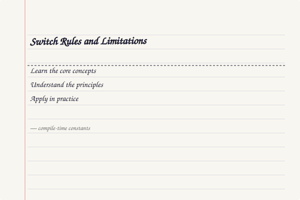
</a>
<a href="../../assets/images/diagrams/c-programming/04-control-flow/switch-rules-and-limitations-diagram.svg" target="_blank" rel="noopener">
  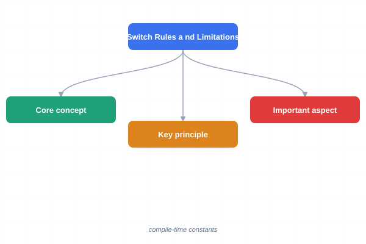
</a>
<a href="../../assets/images/diagrams/c-programming/04-control-flow/switch-rules-and-limitations-sticky.svg" target="_blank" rel="noopener">
  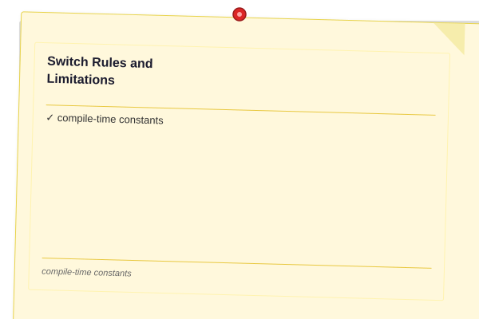
</a>


- The controlling expression must be integer type (`int`, `char`, `enum`, etc.) — **not** `float`, `double`, or string
- Case labels must be **compile-time constants** (`const int` variables not allowed in C89/C99; use `#define` or literals)
- No two case labels may have the same value
- The `default` case is optional; if present, it can be placed anywhere in the switch body
- Variables declared inside a case require braces to limit scope

### Edge Cases

<a href="../../assets/images/diagrams/c-programming/04-control-flow/edge-cases-handwritten.svg" target="_blank" rel="noopener">
  
</a>
<a href="../../assets/images/diagrams/c-programming/04-control-flow/edge-cases-diagram.svg" target="_blank" rel="noopener">
  
</a>
<a href="../../assets/images/diagrams/c-programming/04-control-flow/edge-cases-sticky.svg" target="_blank" rel="noopener">
  
</a>


| Edge Case | Example | Explanation |
|-----------|---------|-------------|
| **Missing break (unintended fall-through)** | No `break` at end of case | Execution continues into next case |
| **No default case** | Omit `default:` | Unmatched values silently skip switch entirely |
| **Duplicate case values** | `case 1:` and `case 1:` | Compiler error |
| **Non-integral expression** | `switch (f)` where f is float | Compiler error |
| **Empty case** | `case 5:` with no body | Legal: does nothing and falls through |
| **default not last** | `default:` in middle | Legal but unusual; explicit break still needed |

### 4.6.1 Intentional Fall-Through

<a href="../../assets/images/diagrams/c-programming/04-control-flow/4-6-1-intentional-fall-through-handwritten.svg" target="_blank" rel="noopener">
  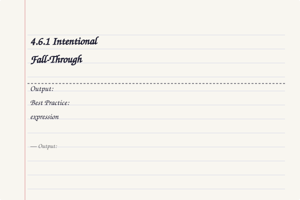
</a>
<a href="../../assets/images/diagrams/c-programming/04-control-flow/4-6-1-intentional-fall-through-diagram.svg" target="_blank" rel="noopener">
  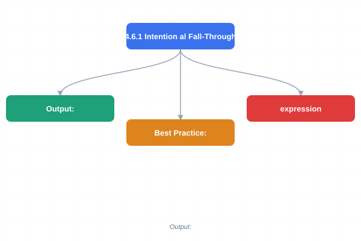
</a>
<a href="../../assets/images/diagrams/c-programming/04-control-flow/4-6-1-intentional-fall-through-sticky.svg" target="_blank" rel="noopener">
  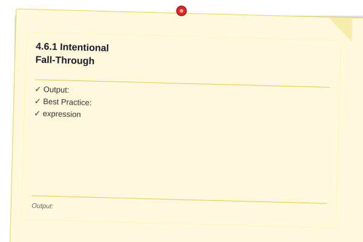
</a>


Omitting `break` causes execution to "fall through" to the next case. This is sometimes intentional:

```c
#include <stdio.h>

int main(void)
{
    int month = 2;
    int year = 2024;
    int days;

    switch (month) {
        case 1: case 3: case 5: case 7:
        case 8: case 10: case 12:
            days = 31;
            break;
        case 4: case 6: case 9: case 11:
            days = 30;
            break;
        case 2:
            if ((year % 4 == 0 && year % 100 != 0) || (year % 400 == 0))
                days = 29;
            else
                days = 28;
            break;
        default:
            days = -1; /* invalid month */
            break;
    }

    if (days > 0)
        printf("Month %d has %d days\n", month, days);
    else
        printf("Invalid month\n");

    return 0;
}
```

**Output:**
```
Month 2 has 29 days
```

> **Best Practice:** When using intentional fall-through, add a comment `/* fall through */` to document intent and suppress compiler warnings.
---

## 4.7 Conditional Expression (Ternary Operator)

The ternary operator `?:` is an **expression** (it yields a value). It is the only C operator that takes three operands, making it useful inside `printf`, assignments, and initializations.

### Real-World Analogy

<a href="../../assets/images/diagrams/c-programming/04-control-flow/real-world-analogy-handwritten.svg" target="_blank" rel="noopener">
  
</a>
<a href="../../assets/images/diagrams/c-programming/04-control-flow/real-world-analogy-diagram.svg" target="_blank" rel="noopener">
  
</a>
<a href="../../assets/images/diagrams/c-programming/04-control-flow/real-world-analogy-sticky.svg" target="_blank" rel="noopener">
  
</a>


The ternary operator is like a coin flip decision at a crossroads: "Heads? Go left. Tails? Go right." The coin flip (condition) immediately determines the outcome with no further branching. You get a value directly → left path or right path → and continue moving.

### Syntax

<a href="../../assets/images/diagrams/c-programming/04-control-flow/syntax-handwritten.svg" target="_blank" rel="noopener">
  
</a>
<a href="../../assets/images/diagrams/c-programming/04-control-flow/syntax-diagram.svg" target="_blank" rel="noopener">
  
</a>
<a href="../../assets/images/diagrams/c-programming/04-control-flow/syntax-sticky.svg" target="_blank" rel="noopener">
  
</a>


```c
condition ? value_if_true : value_if_false
```

### Numbered Execution Steps

<a href="../../assets/images/diagrams/c-programming/04-control-flow/numbered-execution-steps-handwritten.svg" target="_blank" rel="noopener">
  
</a>
<a href="../../assets/images/diagrams/c-programming/04-control-flow/numbered-execution-steps-diagram.svg" target="_blank" rel="noopener">
  
</a>
<a href="../../assets/images/diagrams/c-programming/04-control-flow/numbered-execution-steps-sticky.svg" target="_blank" rel="noopener">
  
</a>


1. The condition expression is evaluated
2. If the condition is **non-zero** (true), the entire expression evaluates to `value_if_true`
3. If the condition is **zero** (false), the entire expression evaluates to `value_if_false`
4. The result is used as a value in the surrounding expression

### Pseudocode

<a href="../../assets/images/diagrams/c-programming/04-control-flow/pseudocode-handwritten.svg" target="_blank" rel="noopener">
  
</a>
<a href="../../assets/images/diagrams/c-programming/04-control-flow/pseudocode-diagram.svg" target="_blank" rel="noopener">
  
</a>
<a href="../../assets/images/diagrams/c-programming/04-control-flow/pseudocode-sticky.svg" target="_blank" rel="noopener">
  
</a>

```
result = IF condition THEN true_value ELSE false_value
```

### Dry Run / Trace Table

<a href="../../assets/images/diagrams/c-programming/04-control-flow/dry-run-trace-table-handwritten.svg" target="_blank" rel="noopener">
  
</a>
<a href="../../assets/images/diagrams/c-programming/04-control-flow/dry-run-trace-table-diagram.svg" target="_blank" rel="noopener">
  
</a>
<a href="../../assets/images/diagrams/c-programming/04-control-flow/dry-run-trace-table-sticky.svg" target="_blank" rel="noopener">
  
</a>


```c
#include <stdio.h>

int main(void)
{
    int x = 10, y = 20;
    int max = (x > y) ? x : y;

    printf("The maximum is %d\n", max);

    printf("%d is %s\n", x, (x % 2 == 0) ? "even" : "odd");

    return 0;
}
```

**Trace Table:**

| Step | Code | x | y | Condition (x > y) | Result | Action |
|------|------|---|---|-------------------|--------|--------|
| 1 | `int x=10, y=20` | 10 | 20 | → | → | Vars initialized |
| 2 | `(x > y) ? x : y` | 10 | 20 | `10 > 20` → **false** | 20 | max = 20 |
| 3 | `printf("The maximum is %d", max)` | 10 | 20 | → | → | Output: The maximum is 20 |
| 4 | `(x % 2 == 0) ? "even" : "odd"` | 10 | 20 | `10 % 2 == 0` → **true** | "even" | Output: 10 is even |

### C Code Examples

<a href="../../assets/images/diagrams/c-programming/04-control-flow/c-code-examples-handwritten.svg" target="_blank" rel="noopener">
  
</a>
<a href="../../assets/images/diagrams/c-programming/04-control-flow/c-code-examples-diagram.svg" target="_blank" rel="noopener">
  
</a>
<a href="../../assets/images/diagrams/c-programming/04-control-flow/c-code-examples-sticky.svg" target="_blank" rel="noopener">
  
</a>


**Example 1: Maximum of two values**

```c
#include <stdio.h>

int main(void)
{
    int x = 10, y = 20;
    int max = (x > y) ? x : y;

    printf("The maximum is %d\n", max);

    /* Embedded in printf */
    printf("%d is %s\n", x, (x % 2 == 0) ? "even" : "odd");

    return 0;
}
```

**Output:**
```
The maximum is 20
10 is even
```

**Example 2: Nested ternary (use sparingly)**

```c
#include <stdio.h>

int main(void)
{
    int score = 75;
    char *grade = (score >= 90) ? "A" :
                  (score >= 80) ? "B" :
                  (score >= 70) ? "C" :
                  (score >= 60) ? "D" : "F";

    printf("Grade: %s\n", grade);
    return 0;
}
```

**Output:**
```
Grade: C
```

**Example 3: Ternary vs if-else**

```c
/* Ternary: concise, use for simple assignment */
int max = (a > b) ? a : b;

/* Equivalent if-else: clearer for complex logic */
int max;
if (a > b) {
    max = a;
} else {
    max = b;
}
```

### Complexity Analysis

<a href="../../assets/images/diagrams/c-programming/04-control-flow/complexity-analysis-handwritten.svg" target="_blank" rel="noopener">
  
</a>
<a href="../../assets/images/diagrams/c-programming/04-control-flow/complexity-analysis-diagram.svg" target="_blank" rel="noopener">
  
</a>
<a href="../../assets/images/diagrams/c-programming/04-control-flow/complexity-analysis-sticky.svg" target="_blank" rel="noopener">
  
</a>


- **Time Complexity:** O(1) → Condition evaluated once; one of two values is selected
- **Space Complexity:** O(1) → No additional memory

### Advantages & Disadvantages

<a href="../../assets/images/diagrams/c-programming/04-control-flow/advantages-disadvantages-handwritten.svg" target="_blank" rel="noopener">
  
</a>
<a href="../../assets/images/diagrams/c-programming/04-control-flow/advantages-disadvantages-diagram.svg" target="_blank" rel="noopener">
  
</a>
<a href="../../assets/images/diagrams/c-programming/04-control-flow/advantages-disadvantages-sticky.svg" target="_blank" rel="noopener">
  
</a>


| Advantages | Disadvantages |
|------------|---------------|
| Concise for simple conditional assignments | Reduces readability when nested or complex |
| Can be embedded inside expressions | Cannot contain statements (only expressions) |
| Useful in function arguments and printf | Overuse creates hard-to-read code |
| Compiler optimizes to conditional move instruction | Debugging is harder than equivalent if-else |

### Edge Cases

<a href="../../assets/images/diagrams/c-programming/04-control-flow/edge-cases-handwritten.svg" target="_blank" rel="noopener">
  
</a>
<a href="../../assets/images/diagrams/c-programming/04-control-flow/edge-cases-diagram.svg" target="_blank" rel="noopener">
  
</a>
<a href="../../assets/images/diagrams/c-programming/04-control-flow/edge-cases-sticky.svg" target="_blank" rel="noopener">
  
</a>


| Edge Case | Example | Explanation |
|-----------|---------|-------------|
| **Side effects** | `(a > b) ? a++ : b++` | Only the selected branch evaluates; other side effect is lost |
| **Type mismatch** | `(x) ? 1 : "two"` | Both branches must have compatible types (or results are coerced) |
| **Deep nesting** | `a ? b ? c ? d : e : f : g` | Extremely hard to read; use if-else |
| **Void expressions** | `(x) ? printf("A") : printf("B")` | Works with void functions but confusing |

> **Best Practice:** Use ternary for simple conditional assignments only. If logic spans multiple lines or has side effects beyond assignment, use `if-else`.

---

## 4.8 The `goto` Statement

`goto` transfers control unconditionally to a labeled statement. It is widely criticized for creating "spaghetti code" but has legitimate uses in kernel-style error cleanup and breaking out of deeply nested loops.

### Real-World Analogy

<a href="../../assets/images/diagrams/c-programming/04-control-flow/real-world-analogy-handwritten.svg" target="_blank" rel="noopener">
  
</a>
<a href="../../assets/images/diagrams/c-programming/04-control-flow/real-world-analogy-diagram.svg" target="_blank" rel="noopener">
  
</a>
<a href="../../assets/images/diagrams/c-programming/04-control-flow/real-world-analogy-sticky.svg" target="_blank" rel="noopener">
  
</a>


`goto` is like an emergency exit slide on an airplane. Under normal operation, you follow the structured flow (boarding, taxiing, flying). But in an emergency, you pull the handle and go directly to the exit → bypassing all normal procedure. You use it rarely, only when the structured path would be slower or unsafe.

### Syntax

<a href="../../assets/images/diagrams/c-programming/04-control-flow/syntax-handwritten.svg" target="_blank" rel="noopener">
  
</a>
<a href="../../assets/images/diagrams/c-programming/04-control-flow/syntax-diagram.svg" target="_blank" rel="noopener">
  
</a>
<a href="../../assets/images/diagrams/c-programming/04-control-flow/syntax-sticky.svg" target="_blank" rel="noopener">
  
</a>


```c
label_name:
    statement;

goto label_name;
```

### Numbered Execution Steps

<a href="../../assets/images/diagrams/c-programming/04-control-flow/numbered-execution-steps-handwritten.svg" target="_blank" rel="noopener">
  
</a>
<a href="../../assets/images/diagrams/c-programming/04-control-flow/numbered-execution-steps-diagram.svg" target="_blank" rel="noopener">
  
</a>
<a href="../../assets/images/diagrams/c-programming/04-control-flow/numbered-execution-steps-sticky.svg" target="_blank" rel="noopener">
  
</a>


1. The `goto` statement is encountered
2. Control **immediately** transfers to the statement marked by the matching label
3. The label must be in the same function
4. Execution continues from the label

### Pseudocode

<a href="../../assets/images/diagrams/c-programming/04-control-flow/pseudocode-handwritten.svg" target="_blank" rel="noopener">
  
</a>
<a href="../../assets/images/diagrams/c-programming/04-control-flow/pseudocode-diagram.svg" target="_blank" rel="noopener">
  
</a>
<a href="../../assets/images/diagrams/c-programming/04-control-flow/pseudocode-sticky.svg" target="_blank" rel="noopener">
  
</a>

```
GOTO label_name
...
label_name:
    statement
```

### Dry Run / Trace Table

<a href="../../assets/images/diagrams/c-programming/04-control-flow/dry-run-trace-table-handwritten.svg" target="_blank" rel="noopener">
  
</a>
<a href="../../assets/images/diagrams/c-programming/04-control-flow/dry-run-trace-table-diagram.svg" target="_blank" rel="noopener">
  
</a>
<a href="../../assets/images/diagrams/c-programming/04-control-flow/dry-run-trace-table-sticky.svg" target="_blank" rel="noopener">
  
</a>


```c
#include <stdio.h>

int main(void)
{
    int i = 0;

start:
    printf("i = %d\n", i);
    i++;

    if (i < 5) {
        goto start;
    }

    return 0;
}
```

**Trace Table:**

| Step | Code | i | Condition (i &lt; 5) | Action |
|------|------|---|-------------------|--------|
| 1 | `int i = 0;` | 0 | → | Var initialized |
| 2 | `start:` | 0 | → | Label reached |
| 3 | `printf("i = %d", i)` | 0 | → | Output: i = 0 |
| 4 | `i++` | 1 | → | Increment |
| 5 | `if (i < 5)` | 1 | `1 < 5` → **true** | goto start |
| 6 | `start:` | 1 | → | Jump back |
| 7 | `printf("i = %d", i)` | 1 | → | Output: i = 1 |
| 8 | ... iterates until i = 5 | | | |
| 9 | `if (i < 5)` | 5 | `5 < 5` → **false** | Skip goto |
| 10 | `return 0;` | 5 | → | Program ends |

### C Code Examples

<a href="../../assets/images/diagrams/c-programming/04-control-flow/c-code-examples-handwritten.svg" target="_blank" rel="noopener">
  
</a>
<a href="../../assets/images/diagrams/c-programming/04-control-flow/c-code-examples-diagram.svg" target="_blank" rel="noopener">
  
</a>
<a href="../../assets/images/diagrams/c-programming/04-control-flow/c-code-examples-sticky.svg" target="_blank" rel="noopener">
  
</a>


**Example 1: Emulating a loop with goto (not recommended for real code)**

```c
#include <stdio.h>

int main(void)
{
    int i = 0;

start:
    printf("i = %d\n", i);
    i++;

    if (i < 5) {
        goto start;
    }

    return 0;
}
```

**Output:**
```
i = 0
i = 1
i = 2
i = 3
i = 4
```

**Example 2: Breaking out of deeply nested loops**

```c
#include <stdio.h>

int main(void)
{
    int matrix[3][3] = {
        {1, 2, 3},
        {4, 5, 6},
        {7, 8, 9}
    };
    int target = 5;
    int i, j;

    for (i = 0; i < 3; i++) {
        for (j = 0; j < 3; j++) {
            if (matrix[i][j] == target) {
                goto found;
            }
        }
    }

found:
    printf("Found %d at [%d][%d]\n", target, i, j);

    return 0;
}
```

**Output:**
```
Found 5 at [1][1]
```

**Example 3: Centralized error cleanup (kernel pattern)**

```c
#include <stdio.h>
#include <stdlib.h>

int main(void)
{
    char *buffer = NULL;
    FILE *fp = NULL;
    int err = 0;

    buffer = (char *)malloc(1024);
    if (!buffer) {
        err = 1;
        goto cleanup;
    }

    fp = fopen("file.txt", "r");
    if (!fp) {
        err = 2;
        goto cleanup_buffer;
    }

    /* ... use resources ... */

cleanup_file:
    fclose(fp);
cleanup_buffer:
    free(buffer);
cleanup:
    return err;
}
```

### Complexity Analysis

<a href="../../assets/images/diagrams/c-programming/04-control-flow/complexity-analysis-handwritten.svg" target="_blank" rel="noopener">
  
</a>
<a href="../../assets/images/diagrams/c-programming/04-control-flow/complexity-analysis-diagram.svg" target="_blank" rel="noopener">
  
</a>
<a href="../../assets/images/diagrams/c-programming/04-control-flow/complexity-analysis-sticky.svg" target="_blank" rel="noopener">
  
</a>


- **Time Complexity:** O(1) → Single unconditional jump
- **Space Complexity:** O(1) → No additional memory

### Advantages & Disadvantages

<a href="../../assets/images/diagrams/c-programming/04-control-flow/advantages-disadvantages-handwritten.svg" target="_blank" rel="noopener">
  
</a>
<a href="../../assets/images/diagrams/c-programming/04-control-flow/advantages-disadvantages-diagram.svg" target="_blank" rel="noopener">
  
</a>
<a href="../../assets/images/diagrams/c-programming/04-control-flow/advantages-disadvantages-sticky.svg" target="_blank" rel="noopener">
  
</a>


| Advantages | Disadvantages |
|------------|---------------|
| Cleanly exits deeply nested structures | Creates spaghetti code when overused |
| Centralizes error cleanup (kernel pattern) | Skips destructor/cleanup code |
| Simple implementation | Makes control flow hard to trace |
| Often most readable for error handling | Can jump over variable initializations (UB) |

### Legitimate Uses of `goto`

<a href="../../assets/images/diagrams/c-programming/04-control-flow/legitimate-uses-of-goto-handwritten.svg" target="_blank" rel="noopener">
  
</a>
<a href="../../assets/images/diagrams/c-programming/04-control-flow/legitimate-uses-of-goto-diagram.svg" target="_blank" rel="noopener">
  
</a>
<a href="../../assets/images/diagrams/c-programming/04-control-flow/legitimate-uses-of-goto-sticky.svg" target="_blank" rel="noopener">
  
</a>


1. **Breaking out of deeply nested loops** → when `break` cannot reach all levels:
```c
for (i = 0; i < N; i++) {
    for (j = 0; j < M; j++) {
        for (k = 0; k < L; k++) {
            if (condition) {
                goto exit_all;
            }
        }
    }
}
exit_all:
    /* clean up */
```

2. **Single-point cleanup in functions** → the classic Linux kernel pattern:
```c
char *buffer = malloc(1024);
FILE *fp = fopen("file.txt", "r");
if (!fp) goto cleanup_buffer;
/* ... use resources ... */

cleanup_buffer:
    free(buffer);
    return;
```

### Edge Cases

<a href="../../assets/images/diagrams/c-programming/04-control-flow/edge-cases-handwritten.svg" target="_blank" rel="noopener">
  
</a>
<a href="../../assets/images/diagrams/c-programming/04-control-flow/edge-cases-diagram.svg" target="_blank" rel="noopener">
  
</a>
<a href="../../assets/images/diagrams/c-programming/04-control-flow/edge-cases-sticky.svg" target="_blank" rel="noopener">
  
</a>


| Edge Case | Example | Explanation |
|-----------|---------|-------------|
| **Jumping over initialization** | `goto skip; int x = 5; skip: printf("%d", x);` | Undefined behavior → x is uninitialized |
| **Jumping into a block** | `goto inside; { inside: ; }` | Legal but confusing → avoid |
| **goto out of scope** | Cannot jump between functions | Labels are function-scoped |
| **goto in macros** | Macros containing goto | Creates confusing control flow |

> **One-Sentence Takeaway:** Goto should be reserved for error cleanup in deeply nested code

---

## 4.9 `break` vs `continue`

`break` and `continue` are loop control statements. `break` **terminates** the loop entirely; `continue` **skips the rest** of the current iteration and proceeds to the next.

### Real-World Analogy

<a href="../../assets/images/diagrams/c-programming/04-control-flow/real-world-analogy-handwritten.svg" target="_blank" rel="noopener">
  
</a>
<a href="../../assets/images/diagrams/c-programming/04-control-flow/real-world-analogy-diagram.svg" target="_blank" rel="noopener">
  
</a>
<a href="../../assets/images/diagrams/c-programming/04-control-flow/real-world-analogy-sticky.svg" target="_blank" rel="noopener">
  
</a>


- **break** is like a fire alarm in a movie theater. No matter what scene is playing, everyone exits immediately → the "loop" of watching the movie terminates entirely.
- **continue** is like skipping a song on a playlist. You don't stop listening to music; you just skip to the next song, continuing the overall listening experience.

### Syntax

<a href="../../assets/images/diagrams/c-programming/04-control-flow/syntax-handwritten.svg" target="_blank" rel="noopener">
  
</a>
<a href="../../assets/images/diagrams/c-programming/04-control-flow/syntax-diagram.svg" target="_blank" rel="noopener">
  
</a>
<a href="../../assets/images/diagrams/c-programming/04-control-flow/syntax-sticky.svg" target="_blank" rel="noopener">
  
</a>


```c
/* break → exit the loop */
while (condition) {
    if (exit_early) {
        break;
    }
}

/* continue → skip to next iteration */
for (int i = 0; i < 10; i++) {
    if (should_skip) {
        continue;
    }
}
```

### Numbered Execution Steps

<a href="../../assets/images/diagrams/c-programming/04-control-flow/numbered-execution-steps-handwritten.svg" target="_blank" rel="noopener">
  
</a>
<a href="../../assets/images/diagrams/c-programming/04-control-flow/numbered-execution-steps-diagram.svg" target="_blank" rel="noopener">
  
</a>
<a href="../../assets/images/diagrams/c-programming/04-control-flow/numbered-execution-steps-sticky.svg" target="_blank" rel="noopener">
  
</a>


**break:**
1. The `break` statement is encountered inside a loop or switch
2. Control immediately exits the innermost enclosing loop or switch
3. Execution resumes at the first statement after the loop/switch

**continue:**
1. The `continue` statement is encountered inside a loop
2. Control jumps to the loop's update expression (for) or condition check (while/do-while)
3. The remainder of the current iteration is skipped

### Pseudocode

<a href="../../assets/images/diagrams/c-programming/04-control-flow/pseudocode-handwritten.svg" target="_blank" rel="noopener">
  
</a>
<a href="../../assets/images/diagrams/c-programming/04-control-flow/pseudocode-diagram.svg" target="_blank" rel="noopener">
  
</a>
<a href="../../assets/images/diagrams/c-programming/04-control-flow/pseudocode-sticky.svg" target="_blank" rel="noopener">
  
</a>

```
FOR each iteration:
    IF exit_condition THEN
        BREAK    → exit loop entirely
    END IF
    IF skip_condition THEN
        CONTINUE → skip to next iteration
    END IF
    normal_processing()
END FOR
```

### Dry Run / Trace Table

<a href="../../assets/images/diagrams/c-programming/04-control-flow/dry-run-trace-table-handwritten.svg" target="_blank" rel="noopener">
  
</a>
<a href="../../assets/images/diagrams/c-programming/04-control-flow/dry-run-trace-table-diagram.svg" target="_blank" rel="noopener">
  
</a>
<a href="../../assets/images/diagrams/c-programming/04-control-flow/dry-run-trace-table-sticky.svg" target="_blank" rel="noopener">
  
</a>


**Program:** Demonstrate break and continue

```c
#include <stdio.h>

int main(void)
{
    printf("--- break example ---\n");
    for (int i = 1; i <= 5; i++) {
        if (i == 3) {
            break;
        }
        printf("%d ", i);
    }
    printf("\n");

    printf("--- continue example ---\n");
    for (int i = 1; i <= 5; i++) {
        if (i == 3) {
            continue;
        }
        printf("%d ", i);
    }
    printf("\n");

    return 0;
}
```

**Output:**
```
--- break example ---
1 2
--- continue example ---
1 2 4 5
```

**Trace Table → break (i == 3 triggers break):**

| Step | i | i &lt;= 5 | i == 3 | Action |
|------|---|--------|--------|--------|
| 1 | 1 | true | false | Print "1 " |
| 2 | 2 | true | false | Print "2 " |
| 3 | 3 | true | **true** | **break** → exit loop |
| 4 | → | → | → | Loop terminated, continue after loop |

**Trace Table → continue (i == 3 triggers continue):**

| Step | i | i &lt;= 5 | i == 3 | Action |
|------|---|--------|--------|--------|
| 1 | 1 | true | false | Print "1 " |
| 2 | 2 | true | false | Print "2 " |
| 3 | 3 | true | **true** | **continue** → skip to i++ |
| 4 | 4 | true | false | Print "4 " |
| 5 | 5 | true | false | Print "5 " |
| 6 | 6 | false | → | Loop ends naturally |

### C Code Examples

<a href="../../assets/images/diagrams/c-programming/04-control-flow/c-code-examples-handwritten.svg" target="_blank" rel="noopener">
  
</a>
<a href="../../assets/images/diagrams/c-programming/04-control-flow/c-code-examples-diagram.svg" target="_blank" rel="noopener">
  
</a>
<a href="../../assets/images/diagrams/c-programming/04-control-flow/c-code-examples-sticky.svg" target="_blank" rel="noopener">
  
</a>


**Example 1: break vs continue**

```c
#include <stdio.h>

int main(void)
{
    printf("break:  ");
    for (int i = 1; i <= 5; i++) {
        if (i == 3) { break; }
        printf("%d ", i);
    }

    printf("\ncontinue: ");
    for (int i = 1; i <= 5; i++) {
        if (i == 3) { continue; }
        printf("%d ", i);
    }
    printf("\n");

    return 0;
}
```

**Output:**
```
break:  1 2
continue: 1 2 4 5
```

**Example 2: break in switch vs break in loop**

```c
#include <stdio.h>

int main(void)
{
    /* break in switch */
    int x = 2;
    switch (x) {
        case 1: printf("One\n"); break;
        case 2: printf("Two\n"); break;  /* break exits switch, not loop */
        case 3: printf("Three\n"); break;
    }

    /* break in loop */
    for (int i = 0; i < 10; i++) {
        if (i == 4) break;
        printf("%d ", i);
    }

    return 0;
}
```

**Output:**
```
Two
0 1 2 3
```

**Example 3: continue with while loop (caution!)**

```c
#include <stdio.h>

int main(void)
{
    int i = 0;

    while (i < 10) {
        if (i == 5) {
            continue;  /* BUG: loops forever! i never incremented */
        }
        printf("%d ", i);
        i++;
    }

    return 0;
}
```

In this example, when `i == 5`, `continue` jumps to the condition check without incrementing `i`. The loop runs forever printing "0 1 2 3 4 ".

### Complexity Analysis

<a href="../../assets/images/diagrams/c-programming/04-control-flow/complexity-analysis-handwritten.svg" target="_blank" rel="noopener">
  
</a>
<a href="../../assets/images/diagrams/c-programming/04-control-flow/complexity-analysis-diagram.svg" target="_blank" rel="noopener">
  
</a>
<a href="../../assets/images/diagrams/c-programming/04-control-flow/complexity-analysis-sticky.svg" target="_blank" rel="noopener">
  
</a>


- **Time Complexity:** O(1) → Single branch instruction for both break and continue
- **Space Complexity:** O(1) → No additional memory

### break vs continue → Comparison Table

<a href="../../assets/images/diagrams/c-programming/04-control-flow/break-vs-continue-comparison-table-handwritten.svg" target="_blank" rel="noopener">
  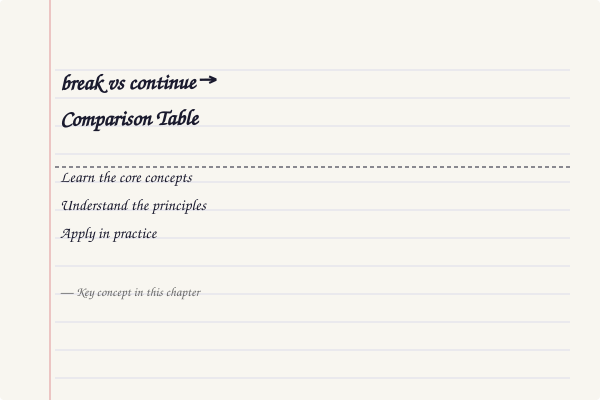
</a>
<a href="../../assets/images/diagrams/c-programming/04-control-flow/break-vs-continue-comparison-table-diagram.svg" target="_blank" rel="noopener">
  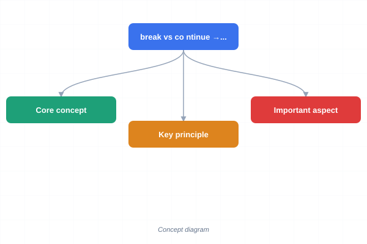
</a>
<a href="../../assets/images/diagrams/c-programming/04-control-flow/break-vs-continue-comparison-table-sticky.svg" target="_blank" rel="noopener">
  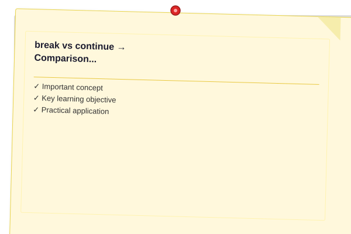
</a>


| Aspect | `break` | `continue` |
|--------|---------|------------|
| **Effect** | Terminates loop entirely | Skips remaining body of current iteration |
| **In for loop** | Jumps past loop end | Jumps to increment + condition |
| **In while loop** | Jumps past loop end | Jumps to condition check |
| **In switch** | Exits switch block | Not applicable |
| **In nested loops** | Breaks only innermost loop | Continues only innermost loop |
| **Use case** | Early exit when goal is found | Skip invalid items |
| **Analogy** | Fire alarm → everyone leaves | Skip song → playlist continues |

### Edge Cases

<a href="../../assets/images/diagrams/c-programming/04-control-flow/edge-cases-handwritten.svg" target="_blank" rel="noopener">
  
</a>
<a href="../../assets/images/diagrams/c-programming/04-control-flow/edge-cases-diagram.svg" target="_blank" rel="noopener">
  
</a>
<a href="../../assets/images/diagrams/c-programming/04-control-flow/edge-cases-sticky.svg" target="_blank" rel="noopener">
  
</a>


| Edge Case | Example | Explanation |
|-----------|---------|-------------|
| **Nested loops** | `break` inside inner loop | Only exits the inner loop, not outer |
| **continue in while with increment after** | `while(i<10){if(i==5)continue; i++;}` | Infinite loop → i never reaches 6 |
| **break in switch inside loop** | `for(...){switch(x){case 1: break;}}` | break exits switch, not the loop |
| **continue not in switch** | N/A | continue is not used within switch |

---

## 4.10 The `return` Statement

The `return` statement terminates the current function and optionally returns a value to the caller.

### Real-World Analogy

<a href="../../assets/images/diagrams/c-programming/04-control-flow/real-world-analogy-handwritten.svg" target="_blank" rel="noopener">
  
</a>
<a href="../../assets/images/diagrams/c-programming/04-control-flow/real-world-analogy-diagram.svg" target="_blank" rel="noopener">
  
</a>
<a href="../../assets/images/diagrams/c-programming/04-control-flow/real-world-analogy-sticky.svg" target="_blank" rel="noopener">
  
</a>


The `return` statement is like a cashier handing you your change and receipt after a purchase. The transaction (function) is complete, and you walk away with the result (return value). If the function is `void`, it is like a doorman saying "have a nice day" with nothing in hand → the interaction is simply over.

### Syntax

<a href="../../assets/images/diagrams/c-programming/04-control-flow/syntax-handwritten.svg" target="_blank" rel="noopener">
  
</a>
<a href="../../assets/images/diagrams/c-programming/04-control-flow/syntax-diagram.svg" target="_blank" rel="noopener">
  
</a>
<a href="../../assets/images/diagrams/c-programming/04-control-flow/syntax-sticky.svg" target="_blank" rel="noopener">
  
</a>


```c
return;           /* void function → no value */
return expression; /* returns the value of expression */
```

### Numbered Execution Steps

<a href="../../assets/images/diagrams/c-programming/04-control-flow/numbered-execution-steps-handwritten.svg" target="_blank" rel="noopener">
  
</a>
<a href="../../assets/images/diagrams/c-programming/04-control-flow/numbered-execution-steps-diagram.svg" target="_blank" rel="noopener">
  
</a>
<a href="../../assets/images/diagrams/c-programming/04-control-flow/numbered-execution-steps-sticky.svg" target="_blank" rel="noopener">
  
</a>


1. The return statement is encountered
2. The expression (if any) is evaluated
3. The result is placed in the return register (EAX/RAX on x86)
4. Local variables are destroyed (stack is cleaned)
5. Control returns to the caller at the point after the function call

### Dry Run / Trace Table

<a href="../../assets/images/diagrams/c-programming/04-control-flow/dry-run-trace-table-handwritten.svg" target="_blank" rel="noopener">
  
</a>
<a href="../../assets/images/diagrams/c-programming/04-control-flow/dry-run-trace-table-diagram.svg" target="_blank" rel="noopener">
  
</a>
<a href="../../assets/images/diagrams/c-programming/04-control-flow/dry-run-trace-table-sticky.svg" target="_blank" rel="noopener">
  
</a>


```c
#include <stdio.h>

int is_even(int n)
{
    if (n % 2 == 0) {
        return 1;   /* early return: even */
    }
    return 0;       /* odd */
}

int main(void)
{
    printf("%d\n", is_even(4));
    printf("%d\n", is_even(7));
    return 0;
}
```

**Trace Table → is_even(4):**

| Step | Function | n | n % 2 | Condition (== 0) | Action |
|------|----------|---|-------|------------------|--------|
| 1 | `is_even(4)` | 4 | → | → | Function called |
| 2 | `if (n % 2 == 0)` | 4 | 0 | `0 == 0` → true | Enter if block |
| 3 | `return 1;` | 4 | 0 | → | **Returns 1**, function exits |

**Trace Table → is_even(7):**

| Step | Function | n | n % 2 | Condition (== 0) | Action |
|------|----------|---|-------|------------------|--------|
| 1 | `is_even(7)` | 7 | → | → | Function called |
| 2 | `if (n % 2 == 0)` | 7 | 1 | `1 == 0` → false | Skip if block |
| 3 | `return 0;` | 7 | 1 | → | **Returns 0**, function exits |

### C Code Examples

<a href="../../assets/images/diagrams/c-programming/04-control-flow/c-code-examples-handwritten.svg" target="_blank" rel="noopener">
  
</a>
<a href="../../assets/images/diagrams/c-programming/04-control-flow/c-code-examples-diagram.svg" target="_blank" rel="noopener">
  
</a>
<a href="../../assets/images/diagrams/c-programming/04-control-flow/c-code-examples-sticky.svg" target="_blank" rel="noopener">
  
</a>


**Example 1: Early return for validation (guard clause)**

```c
#include <stdio.h>

double divide(int a, int b)
{
    if (b == 0) {
        return 0.0;   /* early return on error */
    }
    return (double)a / b;
}

int main(void)
{
    printf("%.2f\n", divide(10, 3));
    printf("%.2f\n", divide(10, 0));
    return 0;
}
```

**Output:**
```
3.33
0.00
```

**Example 2: return in void functions**

```c
#include <stdio.h>

void greet(const char *name)
{
    if (name == NULL) {
        return;  /* early exit, no value returned */
    }
    printf("Hello, %s!\n", name);
}

int main(void)
{
    greet("Alice");
    greet(NULL);
    return 0;
}
```

**Output:**
```
Hello, Alice!
```

### Complexity Analysis

<a href="../../assets/images/diagrams/c-programming/04-control-flow/complexity-analysis-handwritten.svg" target="_blank" rel="noopener">
  
</a>
<a href="../../assets/images/diagrams/c-programming/04-control-flow/complexity-analysis-diagram.svg" target="_blank" rel="noopener">
  
</a>
<a href="../../assets/images/diagrams/c-programming/04-control-flow/complexity-analysis-sticky.svg" target="_blank" rel="noopener">
  
</a>


- **Time Complexity:** O(1) → Single jump instruction
- **Space Complexity:** O(1) → Return value passed in register

### Advantages & Disadvantages

<a href="../../assets/images/diagrams/c-programming/04-control-flow/advantages-disadvantages-handwritten.svg" target="_blank" rel="noopener">
  
</a>
<a href="../../assets/images/diagrams/c-programming/04-control-flow/advantages-disadvantages-diagram.svg" target="_blank" rel="noopener">
  
</a>
<a href="../../assets/images/diagrams/c-programming/04-control-flow/advantages-disadvantages-sticky.svg" target="_blank" rel="noopener">
  
</a>


| Advantages | Disadvantages |
|------------|---------------|
| Cleanly exits function from anywhere | Multiple return points reduce readability |
| Enables guard clause pattern | Skips cleanup code if not careful |
| Returns computed value to caller | Requires caller to check for error returns |

### Edge Cases

<a href="../../assets/images/diagrams/c-programming/04-control-flow/edge-cases-handwritten.svg" target="_blank" rel="noopener">
  
</a>
<a href="../../assets/images/diagrams/c-programming/04-control-flow/edge-cases-diagram.svg" target="_blank" rel="noopener">
  
</a>
<a href="../../assets/images/diagrams/c-programming/04-control-flow/edge-cases-sticky.svg" target="_blank" rel="noopener">
  
</a>


| Edge Case | Example | Explanation |
|-----------|---------|-------------|
| **Missing return in non-void** | `int f(){ /* no return */ }` | Undefined behavior if caller uses return value |
| **return in void function** | `void f(){ return 5; }` | Compiler error |
| **Multiple return paths** | Several `return` statements | Ensure all paths return a value |
| **return with expression** | `return x++;` | Returns value of x, then increments (postfix) |

---

## 4.11 The `exit()` Function

`exit()` is a standard library function that terminates the program immediately, performing cleanup (flushing buffers, closing files) before exiting.

### Real-World Analogy

<a href="../../assets/images/diagrams/c-programming/04-control-flow/real-world-analogy-handwritten.svg" target="_blank" rel="noopener">
  
</a>
<a href="../../assets/images/diagrams/c-programming/04-control-flow/real-world-analogy-diagram.svg" target="_blank" rel="noopener">
  
</a>
<a href="../../assets/images/diagrams/c-programming/04-control-flow/real-world-analogy-sticky.svg" target="_blank" rel="noopener">
  
</a>


`exit()` is like pulling the master emergency stop in a factory. Everything stops immediately → all machines (buffers) are safely powered down, all processes are recorded, and the facility shuts down in a controlled manner.

### Syntax

<a href="../../assets/images/diagrams/c-programming/04-control-flow/syntax-handwritten.svg" target="_blank" rel="noopener">
  
</a>
<a href="../../assets/images/diagrams/c-programming/04-control-flow/syntax-diagram.svg" target="_blank" rel="noopener">
  
</a>
<a href="../../assets/images/diagrams/c-programming/04-control-flow/syntax-sticky.svg" target="_blank" rel="noopener">
  
</a>


```c
#include <stdlib.h>

exit(int status);
```

- `EXIT_SUCCESS` (0) → normal termination
- `EXIT_FAILURE` (1) → abnormal termination

### C Code Examples

<a href="../../assets/images/diagrams/c-programming/04-control-flow/c-code-examples-handwritten.svg" target="_blank" rel="noopener">
  
</a>
<a href="../../assets/images/diagrams/c-programming/04-control-flow/c-code-examples-diagram.svg" target="_blank" rel="noopener">
  
</a>
<a href="../../assets/images/diagrams/c-programming/04-control-flow/c-code-examples-sticky.svg" target="_blank" rel="noopener">
  
</a>


**Example 1: Exit on fatal error**

```c
#include <stdio.h>
#include <stdlib.h>

int main(void)
{
    FILE *fp = fopen("nonexistent.txt", "r");

    if (fp == NULL) {
        printf("Fatal error: file not found\n");
        exit(EXIT_FAILURE);
    }

    /* ... process file ... */
    fclose(fp);
    return EXIT_SUCCESS;
}
```

**Output:**
```
Fatal error: file not found
```

**Example 2: exit() vs return in main()**

```c
#include <stdio.h>
#include <stdlib.h>

void cleanup_func(void)
{
    printf("Cleanup: atexit handler called\n");
}

int main(void)
{
    atexit(cleanup_func);

    printf("Program starting...\n");

    exit(0);  /* calls atexit handlers, then terminates */

    printf("This will never print\n");
    return 0;
}
```

**Output:**
```
Program starting...
Cleanup: atexit handler called
```

### `return` vs `exit()` → Comparison

<a href="../../assets/images/diagrams/c-programming/04-control-flow/return-vs-exit-comparison-handwritten.svg" target="_blank" rel="noopener">
  
</a>
<a href="../../assets/images/diagrams/c-programming/04-control-flow/return-vs-exit-comparison-diagram.svg" target="_blank" rel="noopener">
  
</a>
<a href="../../assets/images/diagrams/c-programming/04-control-flow/return-vs-exit-comparison-sticky.svg" target="_blank" rel="noopener">
  
</a>


| Aspect | `return` | `exit()` |
|--------|----------|----------|
| **Scope** | Exits current function | Terminates entire program |
| **Stack unwinding** | Local variables destroyed normally | All memory reclaimed by OS |
| **atexit handlers** | Called only when return in main() | Always called |
| **Buffers flushed** | Yes (on return from main) | Yes (before termination) |
| **From any function** | Exits only that function | Terminates entire program from anywhere |
| **Header needed** | None (built-in keyword) | `#include <stdlib.h>` |
| **Use case** | Normal function completion | Fatal error, abnormal termination |

### Edge Cases

<a href="../../assets/images/diagrams/c-programming/04-control-flow/edge-cases-handwritten.svg" target="_blank" rel="noopener">
  
</a>
<a href="../../assets/images/diagrams/c-programming/04-control-flow/edge-cases-diagram.svg" target="_blank" rel="noopener">
  
</a>
<a href="../../assets/images/diagrams/c-programming/04-control-flow/edge-cases-sticky.svg" target="_blank" rel="noopener">
  
</a>


| Edge Case | Explanation |
|-----------|-------------|
| **exit() from deep in call stack** | Program terminates immediately; no unwind of local frames |
| **exit(0) vs return 0 in main()** | Both return 0 to OS; exit() is called implicitly on return from main |
| **exit() without stdlib.h** | Compiler warning; implicit declaration may cause UB |

---

## 4.12 Boolean Values in C

C does not have a native boolean type (before C99). Any non-zero value is truthy; zero is falsy.

### Truthiness Rules

<a href="../../assets/images/diagrams/c-programming/04-control-flow/truthiness-rules-handwritten.svg" target="_blank" rel="noopener">
  
</a>
<a href="../../assets/images/diagrams/c-programming/04-control-flow/truthiness-rules-diagram.svg" target="_blank" rel="noopener">
  
</a>
<a href="../../assets/images/diagrams/c-programming/04-control-flow/truthiness-rules-sticky.svg" target="_blank" rel="noopener">
  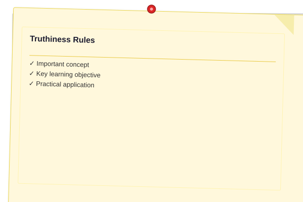
</a>


```c
int done = 0;

if (!done) {      /* equivalent to if (done == 0) */
    /* executes when done is 0 */
}

if (done) {       /* equivalent to if (done != 0) */
    /* executes when done is non-zero */
}
```

### C99 Boolean Type

<a href="../../assets/images/diagrams/c-programming/04-control-flow/c99-boolean-type-handwritten.svg" target="_blank" rel="noopener">
  
</a>
<a href="../../assets/images/diagrams/c-programming/04-control-flow/c99-boolean-type-diagram.svg" target="_blank" rel="noopener">
  
</a>
<a href="../../assets/images/diagrams/c-programming/04-control-flow/c99-boolean-type-sticky.svg" target="_blank" rel="noopener">
  
</a>


C99 introduced `_Bool` and the header `stdbool.h` which defines `bool`, `true`, and `false`:

```c
#include <stdbool.h>

bool is_valid = true;

if (is_valid) {
    printf("Valid\n");
}
```

### Integer to Boolean Conversion

<a href="../../assets/images/diagrams/c-programming/04-control-flow/integer-to-boolean-conversion-handwritten.svg" target="_blank" rel="noopener">
  
</a>
<a href="../../assets/images/diagrams/c-programming/04-control-flow/integer-to-boolean-conversion-diagram.svg" target="_blank" rel="noopener">
  
</a>
<a href="../../assets/images/diagrams/c-programming/04-control-flow/integer-to-boolean-conversion-sticky.svg" target="_blank" rel="noopener">
  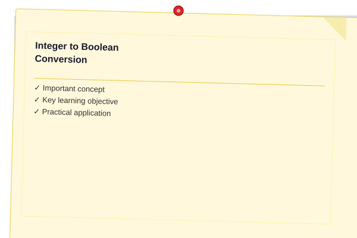
</a>


```c
int count = 5;
if (count) {      /* true because count != 0 */
    printf("Count is non-zero\n");
}

/* Explicit comparison (preferred for readability) */
if (count != 0) {
    printf("Count is non-zero\n");
}
```

### Edge Cases

<a href="../../assets/images/diagrams/c-programming/04-control-flow/edge-cases-handwritten.svg" target="_blank" rel="noopener">
  
</a>
<a href="../../assets/images/diagrams/c-programming/04-control-flow/edge-cases-diagram.svg" target="_blank" rel="noopener">
  
</a>
<a href="../../assets/images/diagrams/c-programming/04-control-flow/edge-cases-sticky.svg" target="_blank" rel="noopener">
  
</a>


| Expression | Truth Value | Explanation |
|------------|-------------|-------------|
| `0` | **false** | Zero is the only false integer |
| `1`, `-1`, `42` | **true** | Any non-zero integer is true |
| `NULL` (0) | **false** | Null pointer is zero |
| `'\0'` (null char) | **false** | Null character has ASCII value 0 |
| `"false"` | **true** | String pointer is non-NULL, so true |

---
---

## Comparison Tables

### 4.13.1 `if` vs `switch`

<a href="../../assets/images/diagrams/c-programming/04-control-flow/4-13-1-if-vs-switch-handwritten.svg" target="_blank" rel="noopener">
  
</a>
<a href="../../assets/images/diagrams/c-programming/04-control-flow/4-13-1-if-vs-switch-diagram.svg" target="_blank" rel="noopener">
  
</a>
<a href="../../assets/images/diagrams/c-programming/04-control-flow/4-13-1-if-vs-switch-sticky.svg" target="_blank" rel="noopener">
  
</a>


| Feature | `if-else if` chain | `switch-case` |
|---------|-------------------|---------------|
| **Expression type** | Any boolean expression | Only integral types (int, char, enum) |
| **Case values** | Arbitrary conditions (ranges, comparisons) | Compile-time integral constants only |
| **Range checking** | Yes: `if (x >= 10 && x <= 20)` | No: cannot express ranges (use if) |
| **String comparison** | Yes: `strcmp(a, b) == 0` | No |
| **Float comparison** | Yes (with epsilon) | No |
| **Execution** | Sequential checks O(n) | Jump table O(1) possible |
| **Default behavior** | Last else (optional) | default case (optional) |
| **Readability** | Better for complex conditions | Better for value-based dispatch |
| **Fall-through** | Not applicable | Cases fall through without break |
| **When to use** | Range checks, complex conditions, floats, strings | Single integer/char value, 3+ discrete values |

### 4.13.2 `break` vs `continue`

<a href="../../assets/images/diagrams/c-programming/04-control-flow/4-13-2-break-vs-continue-handwritten.svg" target="_blank" rel="noopener">
  
</a>
<a href="../../assets/images/diagrams/c-programming/04-control-flow/4-13-2-break-vs-continue-diagram.svg" target="_blank" rel="noopener">
  
</a>
<a href="../../assets/images/diagrams/c-programming/04-control-flow/4-13-2-break-vs-continue-sticky.svg" target="_blank" rel="noopener">
  
</a>


| Aspect | `break` | `continue` |
|--------|---------|------------|
| **Effect** | Terminates loop entirely | Skips remaining body of current iteration |
| **In for loop** | Jumps past loop end | Jumps to increment + condition |
| **In while loop** | Jumps past loop end | Jumps to condition check |
| **In switch** | Exits switch block | Not applicable |
| **In nested loops** | Breaks only innermost loop | Continues only innermost loop |
| **Use case** | Early exit when goal is found | Skip invalid items |
| **Analogy** | Fire alarm → everyone leaves | Skip song → playlist continues |

### 4.13.3 `goto` vs Structured Jumps

<a href="../../assets/images/diagrams/c-programming/04-control-flow/4-13-3-goto-vs-structured-jumps-handwritten.svg" target="_blank" rel="noopener">
  
</a>
<a href="../../assets/images/diagrams/c-programming/04-control-flow/4-13-3-goto-vs-structured-jumps-diagram.svg" target="_blank" rel="noopener">
  
</a>
<a href="../../assets/images/diagrams/c-programming/04-control-flow/4-13-3-goto-vs-structured-jumps-sticky.svg" target="_blank" rel="noopener">
  
</a>


| Aspect | `goto` | `break` | `continue` | `return` |
|--------|--------|---------|------------|----------|
| **Direction** | Forward or backward | Forward only (out of loop) | Backward (to loop top) | Out of function |
| **Scope** | Function-wide | Innermost loop only | Innermost loop only | Current function |
| **Abuse potential** | High (spaghetti code) | Low | Low | Moderate |
| **Legitimate use** | Error cleanup, deep exit | Normal loop termination | Skip iteration | Function completion |
| **Readability impact** | Severe if overused | None | None | Moderate if many paths |

### 4.13.4 Conditional Control Constructs

<a href="../../assets/images/diagrams/c-programming/04-control-flow/4-13-4-conditional-control-constructs-handwritten.svg" target="_blank" rel="noopener">
  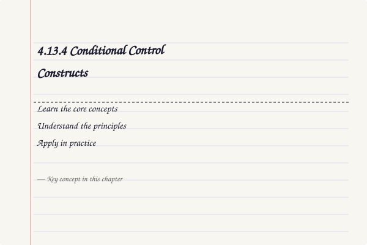
</a>
<a href="../../assets/images/diagrams/c-programming/04-control-flow/4-13-4-conditional-control-constructs-diagram.svg" target="_blank" rel="noopener">
  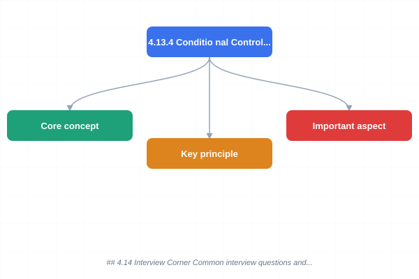
</a>
<a href="../../assets/images/diagrams/c-programming/04-control-flow/4-13-4-conditional-control-constructs-sticky.svg" target="_blank" rel="noopener">
  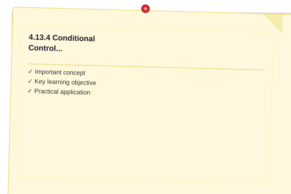
</a>


| Construct | Type | Returns Value? | Can Nest? | Readability | Performance |
|-----------|------|---------------|-----------|-------------|-------------|
| `if` | Statement | No | Yes | High | O(1) per condition |
| `switch` | Statement | No | Yes (limited) | High for value dispatch | O(1) jump table |
| `?:` (ternary) | Expression | **Yes** | Yes but risky | Low when nested | O(1) |
| `goto` | Statement | No | N/A | Very low | O(1) |

---

## 4.14 Interview Corner

Common interview questions and tricky concepts related to C control flow.

### 4.14.1 Dangling Else Ambiguity

<a href="../../assets/images/diagrams/c-programming/04-control-flow/4-14-1-dangling-else-ambiguity-handwritten.svg" target="_blank" rel="noopener">
  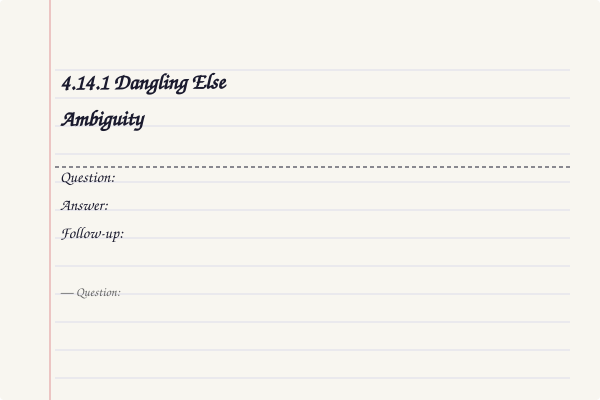
</a>
<a href="../../assets/images/diagrams/c-programming/04-control-flow/4-14-1-dangling-else-ambiguity-diagram.svg" target="_blank" rel="noopener">
  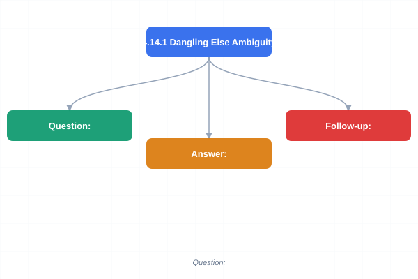
</a>
<a href="../../assets/images/diagrams/c-programming/04-control-flow/4-14-1-dangling-else-ambiguity-sticky.svg" target="_blank" rel="noopener">
  
</a>


**Question:** What does the following code print?

```c
int x = 0, y = 1;
if (x)
    if (y)
        printf("A");
    else
        printf("B");
```

**Answer:** Nothing. The `else` binds to the inner `if (y)`. Since `x` is 0, the outer `if (x)` is false, so the entire inner `if-else` is skipped. Nothing prints.

**Follow-up:** How to make the `else` bind to the outer `if`? Use braces:
```c
if (x) {
    if (y) {
        printf("A");
    }
} else {
    printf("B");  /* Now binds to outer if */
}
```

### 4.14.2 switch vs if-else Chain Performance

<a href="../../assets/images/diagrams/c-programming/04-control-flow/4-14-2-switch-vs-if-else-chain-performance-handwritten.svg" target="_blank" rel="noopener">
  
</a>
<a href="../../assets/images/diagrams/c-programming/04-control-flow/4-14-2-switch-vs-if-else-chain-performance-diagram.svg" target="_blank" rel="noopener">
  
</a>
<a href="../../assets/images/diagrams/c-programming/04-control-flow/4-14-2-switch-vs-if-else-chain-performance-sticky.svg" target="_blank" rel="noopener">
  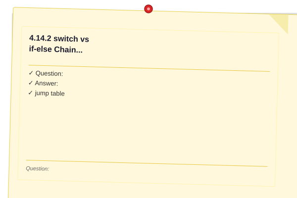
</a>


**Question:** When should you use `switch` instead of `if-else if`?

**Answer:** Use `switch` when:
- The condition is a single integral expression (int, char, enum)
- There are 3 or more discrete constant values to match
- Performance matters → compilers can implement switch as a **jump table** (O(1)) while if-else if chains are O(n)

Use `if-else if` when:
- Conditions involve ranges, comparisons, or complex boolean logic
- The expression is a float, double, or string
- Case values are not compile-time constants

### 4.14.3 Duff's Device

<a href="../../assets/images/diagrams/c-programming/04-control-flow/4-14-3-duff-s-device-handwritten.svg" target="_blank" rel="noopener">
  
</a>
<a href="../../assets/images/diagrams/c-programming/04-control-flow/4-14-3-duff-s-device-diagram.svg" target="_blank" rel="noopener">
  
</a>
<a href="../../assets/images/diagrams/c-programming/04-control-flow/4-14-3-duff-s-device-sticky.svg" target="_blank" rel="noopener">
  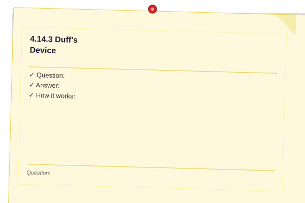
</a>


**Question:** What is Duff's Device and how does it work?

**Answer:** Duff's Device is a famous optimized loop-unrolling technique using intentional switch fall-through. It interleaves a switch statement with a do-while loop:

```c
void send(char *to, char *from, int count)
{
    int n = (count + 7) / 8;
    switch (count % 8) {
        case 0: do { *to++ = *from++;
        case 7:      *to++ = *from++;
        case 6:      *to++ = *from++;
        case 5:      *to++ = *from++;
        case 4:      *to++ = *from++;
        case 3:      *to++ = *from++;
        case 2:      *to++ = *from++;
        case 1:      *to++ = *from++;
                } while (--n > 0);
    }
}
```

**How it works:** The switch jumps into the middle of the loop based on `count % 8`. Each case falls through to execute 8 copies of the transfer, reducing loop overhead by 87.5%. Modern compilers auto-unroll, so this is now mostly of historical interest.

### 4.14.4 goto in the Linux Kernel

<a href="../../assets/images/diagrams/c-programming/04-control-flow/4-14-4-goto-in-the-linux-kernel-handwritten.svg" target="_blank" rel="noopener">
  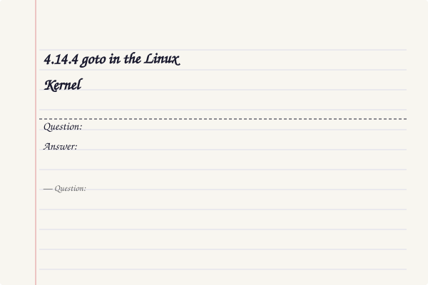
</a>
<a href="../../assets/images/diagrams/c-programming/04-control-flow/4-14-4-goto-in-the-linux-kernel-diagram.svg" target="_blank" rel="noopener">
  
</a>
<a href="../../assets/images/diagrams/c-programming/04-control-flow/4-14-4-goto-in-the-linux-kernel-sticky.svg" target="_blank" rel="noopener">
  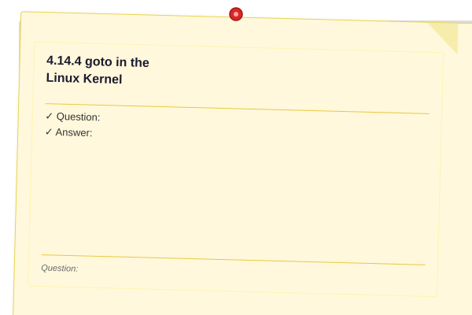
</a>


**Question:** Why does the Linux kernel use `goto` extensively?

**Answer:** The Linux kernel uses a specific `goto` pattern for centralized error cleanup. This is considered best practice in C (kernel coding style):

```c
static int __init some_init_function(void)
{
    int ret = 0;

    ret = allocate_resource_a();
    if (ret)
        goto out;

    ret = allocate_resource_b();
    if (ret)
        goto err_a;

    ret = register_handler();
    if (ret)
        goto err_b;

    return 0;  /* success */

err_b:
    free_resource_b();
err_a:
    free_resource_a();
out:
    return ret;
}
```

This pattern avoids deeply nested error handling and ensures cleanup happens exactly once per allocated resource. Without `goto`, the same code would require nested `if-else` pyramids or duplicated cleanup calls.

### 4.14.5 Comma Operator in Conditions

<a href="../../assets/images/diagrams/c-programming/04-control-flow/4-14-5-comma-operator-in-conditions-handwritten.svg" target="_blank" rel="noopener">
  
</a>
<a href="../../assets/images/diagrams/c-programming/04-control-flow/4-14-5-comma-operator-in-conditions-diagram.svg" target="_blank" rel="noopener">
  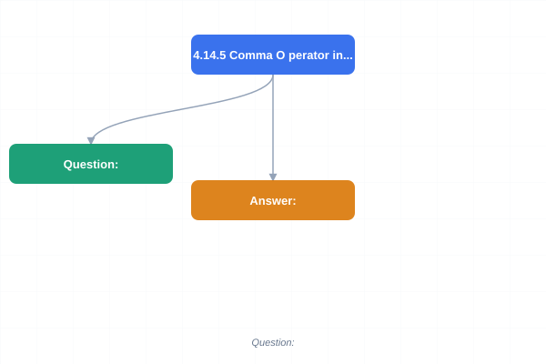
</a>
<a href="../../assets/images/diagrams/c-programming/04-control-flow/4-14-5-comma-operator-in-conditions-sticky.svg" target="_blank" rel="noopener">
  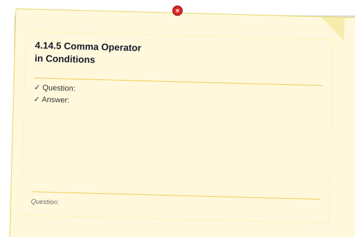
</a>


**Question:** What prints?
```c
int x = 0;
if (x = 1, 0) printf("A"); else printf("B");
```

**Answer:** B. The comma operator evaluates `x = 1` (assigns 1 to x) then yields `0` (the rightmost operand). The condition is 0 (false), so the `else` branch executes.

### 4.14.6 Short-Circuit Evaluation Trick

<a href="../../assets/images/diagrams/c-programming/04-control-flow/4-14-6-short-circuit-evaluation-trick-handwritten.svg" target="_blank" rel="noopener">
  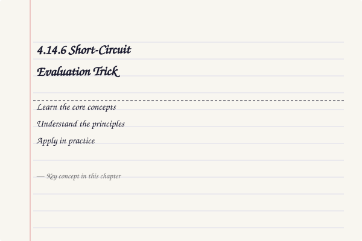
</a>
<a href="../../assets/images/diagrams/c-programming/04-control-flow/4-14-6-short-circuit-evaluation-trick-diagram.svg" target="_blank" rel="noopener">
  
</a>
<a href="../../assets/images/diagrams/c-programming/04-control-flow/4-14-6-short-circuit-evaluation-trick-sticky.svg" target="_blank" rel="noopener">
  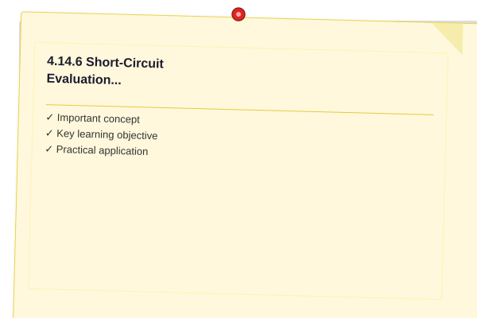
</a>


```c
int arr[5] = {1, 2, 3, 4, 5};
int i = 0;

/* Safe: short-circuit prevents out-of-bounds access */
while (i < 5 && arr[i] > 0) {
    printf("%d ", arr[i++]);
}
```

If `i` reaches 5, `i < 5` is false and `arr[i]` is never evaluated → preventing undefined behavior.

### 4.14.7 The `==` vs `=` Trap

<a href="../../assets/images/diagrams/c-programming/04-control-flow/4-14-7-the-vs-trap-handwritten.svg" target="_blank" rel="noopener">
  
</a>
<a href="../../assets/images/diagrams/c-programming/04-control-flow/4-14-7-the-vs-trap-diagram.svg" target="_blank" rel="noopener">
  
</a>
<a href="../../assets/images/diagrams/c-programming/04-control-flow/4-14-7-the-vs-trap-sticky.svg" target="_blank" rel="noopener">
  
</a>


**Question:** What does this code do?
```c
int x = 0;
if (x = 0) {
    printf("Never prints");
}
```

**Answer:** `x = 0` is an assignment, not comparison. It assigns 0 to x and the expression evaluates to 0 (false). The printf never executes. Modern compilers warn: "suggest parentheses around assignment used as truth value."

**Defense:** Write `if (0 == x)` → Yoda conditions. If you accidentally write `if (0 = x)`, the compiler gives an error because you cannot assign to a literal.

### 4.14.8 Nested switch

<a href="../../assets/images/diagrams/c-programming/04-control-flow/4-14-8-nested-switch-handwritten.svg" target="_blank" rel="noopener">
  
</a>
<a href="../../assets/images/diagrams/c-programming/04-control-flow/4-14-8-nested-switch-diagram.svg" target="_blank" rel="noopener">
  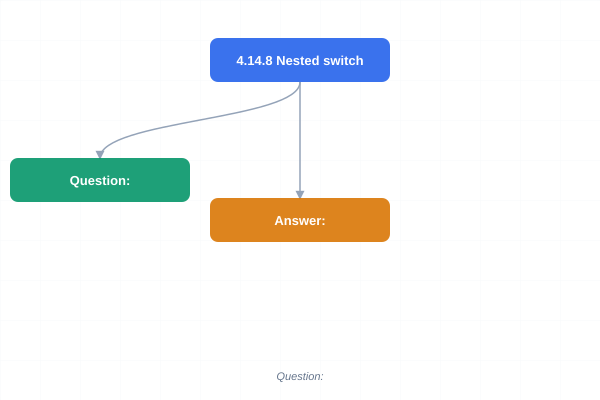
</a>
<a href="../../assets/images/diagrams/c-programming/04-control-flow/4-14-8-nested-switch-sticky.svg" target="_blank" rel="noopener">
  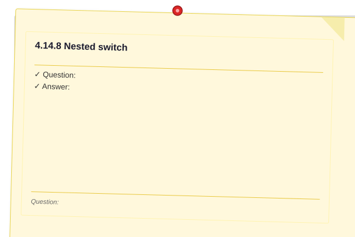
</a>


**Question:** Can you nest switch statements?

**Answer:** Yes:
```c
switch (outer) {
    case 1:
        switch (inner) {
            case 'a': break;
            case 'b': break;
        }
        break;
    case 2:
        /* ... */
        break;
}
```

Use with caution → deeply nested switches are hard to read.

---

## 4.15 Applications in Real Systems

### 4.15.1 Linux Kernel: goto for Error Handling

<a href="../../assets/images/diagrams/c-programming/04-control-flow/4-15-1-linux-kernel-goto-for-error-handling-handwritten.svg" target="_blank" rel="noopener">
  
</a>
<a href="../../assets/images/diagrams/c-programming/04-control-flow/4-15-1-linux-kernel-goto-for-error-handling-diagram.svg" target="_blank" rel="noopener">
  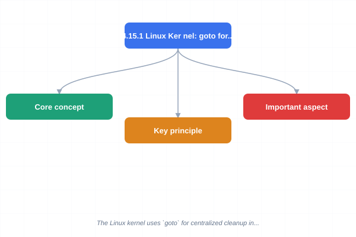
</a>
<a href="../../assets/images/diagrams/c-programming/04-control-flow/4-15-1-linux-kernel-goto-for-error-handling-sticky.svg" target="_blank" rel="noopener">
  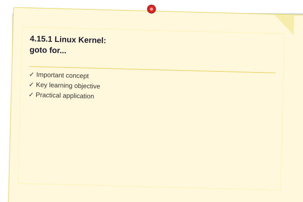
</a>


The Linux kernel uses `goto` for centralized cleanup in ~95% of functions that allocate multiple resources. This is a deliberate design decision documented in `Documentation/process/coding-style.rst`:

```c
/* From kernel/sched/core.c (simplified) */
static int sched_cpu_activate(unsigned int cpu)
{
    struct rq *rq = cpu_rq(cpu);
    int ret;

    ret = sched_domain_debug_one();
    if (ret)
        goto out;

    ret = update_runtime_enabled();
    if (ret)
        goto out;

    set_cpu_active(cpu, true);
    return 0;

out:
    /* cleanup */
    return ret;
}
```

### 4.15.2 Embedded Systems: switch-case State Machines

<a href="../../assets/images/diagrams/c-programming/04-control-flow/4-15-2-embedded-systems-switch-case-state-machines-handwritten.svg" target="_blank" rel="noopener">
  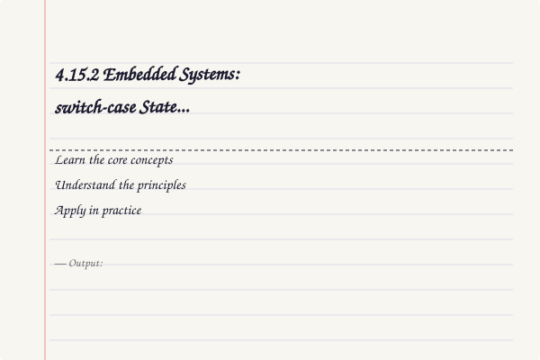
</a>
<a href="../../assets/images/diagrams/c-programming/04-control-flow/4-15-2-embedded-systems-switch-case-state-machines-diagram.svg" target="_blank" rel="noopener">
  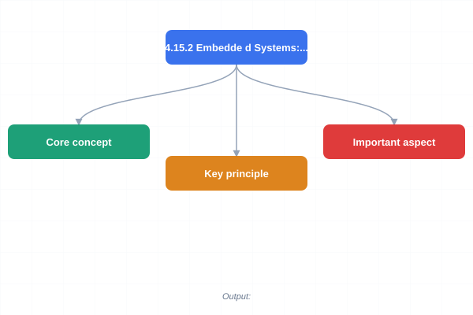
</a>
<a href="../../assets/images/diagrams/c-programming/04-control-flow/4-15-2-embedded-systems-switch-case-state-machines-sticky.svg" target="_blank" rel="noopener">
  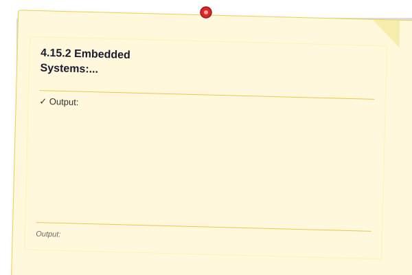
</a>


Embedded systems use `switch` inside a loop to implement finite state machines (FSMs):

```c
#include <stdio.h>

typedef enum {
    STATE_IDLE,
    STATE_RUNNING,
    STATE_PAUSED,
    STATE_ERROR,
    STATE_COUNT
} state_t;

int main(void)
{
    state_t state = STATE_IDLE;
    int command = 0;

    printf("State Machine Demo\n");
    printf("Commands: 0=start, 1=pause, 2=resume, 3=stop, 4=error\n\n");

    while (state != STATE_COUNT) {
        switch (state) {
            case STATE_IDLE:
                printf("[IDLE] Waiting for start...\n");
                if (command == 0) state = STATE_RUNNING;
                break;

            case STATE_RUNNING:
                printf("[RUNNING] Processing...\n");
                if (command == 1) state = STATE_PAUSED;
                if (command == 3) state = STATE_IDLE;
                if (command == 4) state = STATE_ERROR;
                break;

            case STATE_PAUSED:
                printf("[PAUSED] Suspended\n");
                if (command == 2) state = STATE_RUNNING;
                if (command == 3) state = STATE_IDLE;
                break;

            case STATE_ERROR:
                printf("[ERROR] Fault detected!\n");
                state = STATE_COUNT;  /* exit */
                break;

            default:
                break;
        }
        command = 0;
        break; /* single iteration for demo */
    }

    return 0;
}
```

**Output:**
```
State Machine Demo
Commands: 0=start, 1=pause, 2=resume, 3=stop, 4=error

[IDLE] Waiting for start...
```

### 4.15.3 Network Protocol Parsing

<a href="../../assets/images/diagrams/c-programming/04-control-flow/4-15-3-network-protocol-parsing-handwritten.svg" target="_blank" rel="noopener">
  
</a>
<a href="../../assets/images/diagrams/c-programming/04-control-flow/4-15-3-network-protocol-parsing-diagram.svg" target="_blank" rel="noopener">
  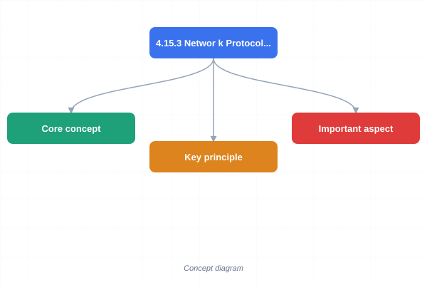
</a>
<a href="../../assets/images/diagrams/c-programming/04-control-flow/4-15-3-network-protocol-parsing-sticky.svg" target="_blank" rel="noopener">
  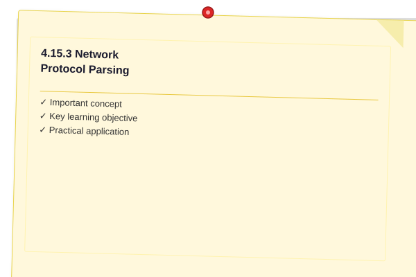
</a>


Network parsers use `switch` to decode protocol fields:

```c
void parse_packet(unsigned char *packet)
{
    unsigned char version = (packet[0] >> 4) & 0x0F;
    unsigned char type = packet[1];

    switch (version) {
        case 4:
            /* IPv4 handling */
            switch (type) {
                case 1:  /* ICMP */ break;
                case 6:  /* TCP */  break;
                case 17: /* UDP */  break;
            }
            break;
        case 6:
            /* IPv6 handling */
            break;
        default:
            /* Unknown version */
            break;
    }
}
```

### 4.15.4 Compiler Optimizations: Jump Tables

<a href="../../assets/images/diagrams/c-programming/04-control-flow/4-15-4-compiler-optimizations-jump-tables-handwritten.svg" target="_blank" rel="noopener">
  
</a>
<a href="../../assets/images/diagrams/c-programming/04-control-flow/4-15-4-compiler-optimizations-jump-tables-diagram.svg" target="_blank" rel="noopener">
  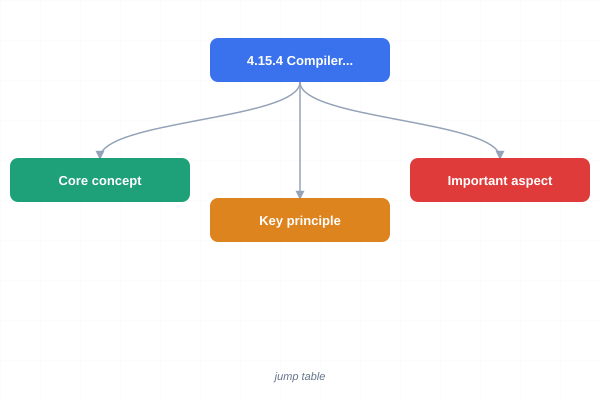
</a>
<a href="../../assets/images/diagrams/c-programming/04-control-flow/4-15-4-compiler-optimizations-jump-tables-sticky.svg" target="_blank" rel="noopener">
  
</a>


For a compact range of case values (e.g., 0–255), compilers generate a **jump table** → an array of code addresses indexed by the switch expression:

```asm
; Pseudocode for switch(x) with cases 0-3
; Jump table at address JUMP_TABLE
    mov eax, x
    jmp [JUMP_TABLE + eax*4]  ; Direct jump → O(1)

JUMP_TABLE:
    dd case0_addr
    dd case1_addr
    dd case2_addr
    dd case3_addr
```

This is why `switch` with many cases can be faster than `if-else if` chains.

### 4.15.5 Flight Control Systems

<a href="../../assets/images/diagrams/c-programming/04-control-flow/4-15-5-flight-control-systems-handwritten.svg" target="_blank" rel="noopener">
  
</a>
<a href="../../assets/images/diagrams/c-programming/04-control-flow/4-15-5-flight-control-systems-diagram.svg" target="_blank" rel="noopener">
  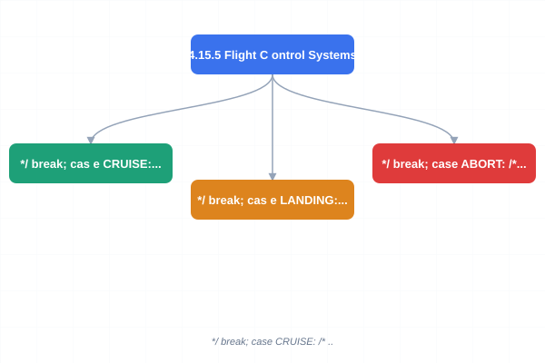
</a>
<a href="../../assets/images/diagrams/c-programming/04-control-flow/4-15-5-flight-control-systems-sticky.svg" target="_blank" rel="noopener">
  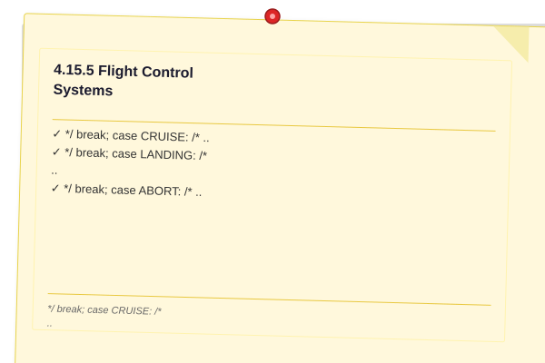
</a>


Safety-critical avionics software uses if-else chains with rigorous verification:

```c
switch (flight_phase) {
    case PREFLIGHT:
        run_system_checks();
        if (all_checks_pass) {
            flight_phase = TAKEOFF;
        } else {
            flight_phase = ABORT;
        }
        break;

    case TAKEOFF:
        /* ... */
        break;

    case CRUISE:
        /* ... */
        break;

    case LANDING:
        /* ... */
        break;

    case ABORT:
        /* ... */
        break;
}
```

### 4.15.6 Database Query Execution

<a href="../../assets/images/diagrams/c-programming/04-control-flow/4-15-6-database-query-execution-handwritten.svg" target="_blank" rel="noopener">
  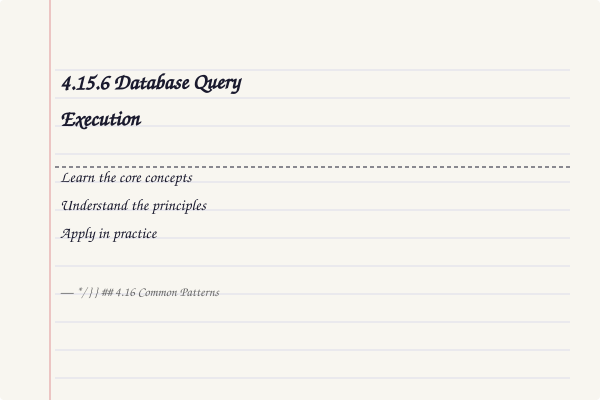
</a>
<a href="../../assets/images/diagrams/c-programming/04-control-flow/4-15-6-database-query-execution-diagram.svg" target="_blank" rel="noopener">
  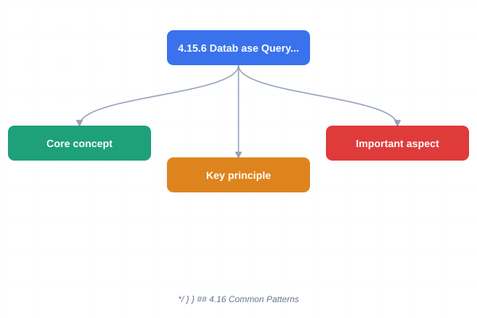
</a>
<a href="../../assets/images/diagrams/c-programming/04-control-flow/4-15-6-database-query-execution-sticky.svg" target="_blank" rel="noopener">
  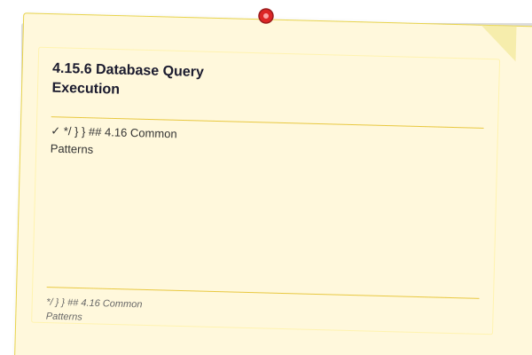
</a>


Query planners use switch for operator dispatch:

```c
typedef enum {
    OP_SCAN, OP_FILTER, OP_JOIN, OP_SORT, OP_AGGREGATE
} op_type_t;

void execute_operator(plan_node_t *node)
{
    switch (node->type) {
        case OP_SCAN:
            if (node->has_index) {
                /* index scan path */
            } else {
                /* full table scan path */
            }
            break;
        case OP_FILTER:
            evaluate_predicate(node->predicate);
            break;
        case OP_JOIN:
            if (node->join_type == HASH_JOIN) {
                build_hash_table(node->left);
            }
            break;
        /* ... */
    }
}
```

---

## 4.16 Common Patterns

### Guard Clause Pattern

<a href="../../assets/images/diagrams/c-programming/04-control-flow/guard-clause-pattern-handwritten.svg" target="_blank" rel="noopener">
  
</a>
<a href="../../assets/images/diagrams/c-programming/04-control-flow/guard-clause-pattern-diagram.svg" target="_blank" rel="noopener">
  
</a>
<a href="../../assets/images/diagrams/c-programming/04-control-flow/guard-clause-pattern-sticky.svg" target="_blank" rel="noopener">
  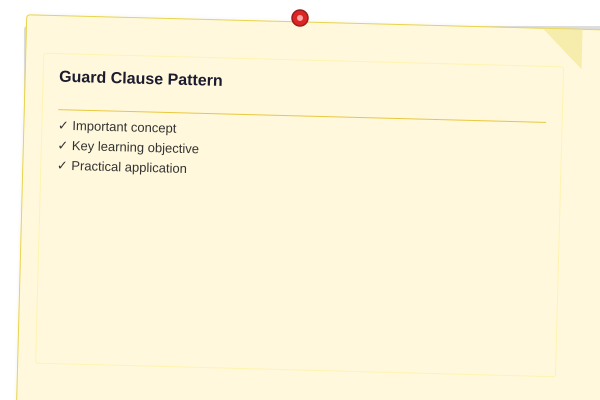
</a>


Check error conditions early and exit:

```c
if (ptr == NULL) {
    return -1;
}
if (count <= 0) {
    return -1;
}
/* main logic follows */
```

### Range Checking

<a href="../../assets/images/diagrams/c-programming/04-control-flow/range-checking-handwritten.svg" target="_blank" rel="noopener">
  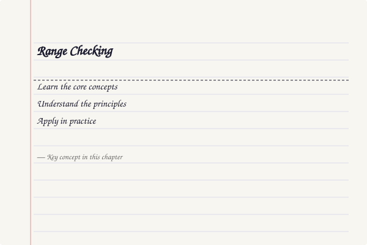
</a>
<a href="../../assets/images/diagrams/c-programming/04-control-flow/range-checking-diagram.svg" target="_blank" rel="noopener">
  
</a>
<a href="../../assets/images/diagrams/c-programming/04-control-flow/range-checking-sticky.svg" target="_blank" rel="noopener">
  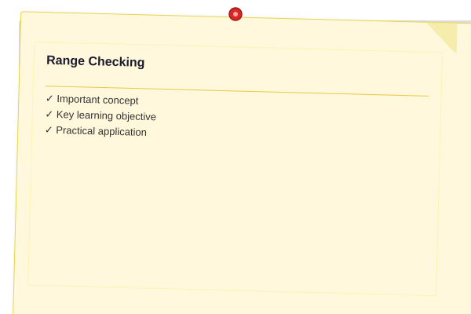
</a>


```c
if (x >= 0 && x <= 100) {
    printf("In range\n");
}

int c = getchar();
if (c == 'y' || c == 'Y') {
    printf("Confirmed\n");
}
```

### Short-Circuit Safe Access

<a href="../../assets/images/diagrams/c-programming/04-control-flow/short-circuit-safe-access-handwritten.svg" target="_blank" rel="noopener">
  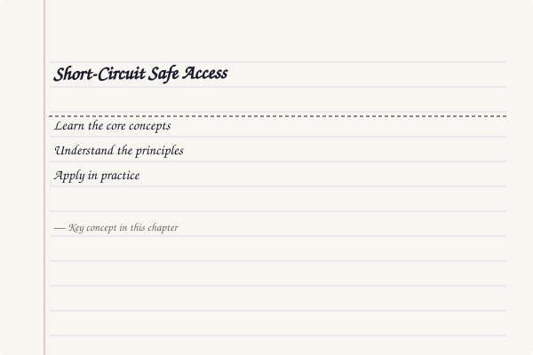
</a>
<a href="../../assets/images/diagrams/c-programming/04-control-flow/short-circuit-safe-access-diagram.svg" target="_blank" rel="noopener">
  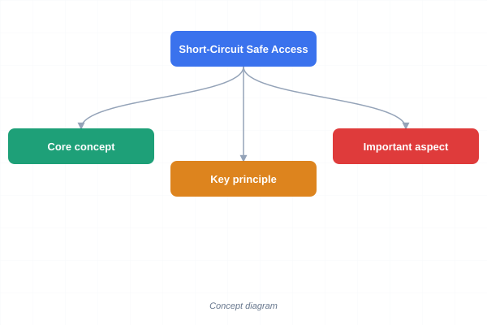
</a>
<a href="../../assets/images/diagrams/c-programming/04-control-flow/short-circuit-safe-access-sticky.svg" target="_blank" rel="noopener">
  
</a>


```c
/* Safe: short-circuit prevents dereferencing NULL */
int *ptr = NULL;
if (ptr && *ptr == 42) {
    /* ptr is NULL, so *ptr is never evaluated */
    /* ... */
}

/* Multi-resource allocation with short-circuit */
FILE *f1 = fopen("a.txt", "r");
FILE *f2 = fopen("b.txt", "r");
if (f1 && f2) {
    /* both opened successfully → use them */
}
```

### Chained Ternary for Simple Mapping

<a href="../../assets/images/diagrams/c-programming/04-control-flow/chained-ternary-for-simple-mapping-handwritten.svg" target="_blank" rel="noopener">
  
</a>
<a href="../../assets/images/diagrams/c-programming/04-control-flow/chained-ternary-for-simple-mapping-diagram.svg" target="_blank" rel="noopener">
  
</a>
<a href="../../assets/images/diagrams/c-programming/04-control-flow/chained-ternary-for-simple-mapping-sticky.svg" target="_blank" rel="noopener">
  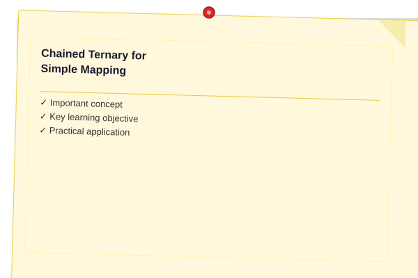
</a>


```c
/* Map integer to string → concise alternative to switch for simple cases */
const char *name = (n == 1) ? "One" :
                   (n == 2) ? "Two" :
                   (n == 3) ? "Three" : "Unknown";
```

### Flag-based Control

<a href="../../assets/images/diagrams/c-programming/04-control-flow/flag-based-control-handwritten.svg" target="_blank" rel="noopener">
  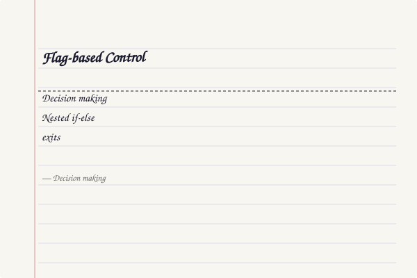
</a>
<a href="../../assets/images/diagrams/c-programming/04-control-flow/flag-based-control-diagram.svg" target="_blank" rel="noopener">
  
</a>
<a href="../../assets/images/diagrams/c-programming/04-control-flow/flag-based-control-sticky.svg" target="_blank" rel="noopener">
  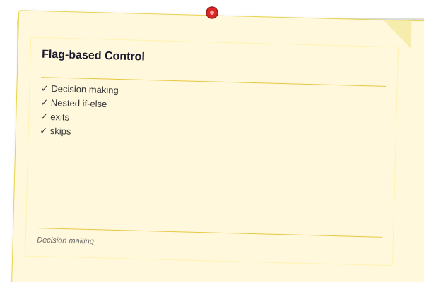
</a>


```c
int done = 0;
int error = 0;

while (!done && !error) {
    /* ... process ... */
    if (fatal) error = 1;
    if (complete) done = 1;
}
```

---

## Concept Comparison Table

| Construct | Use Case | Default Behavior | Common Pitfall |
|-----------|----------|-----------------|----------------|
| `if-else` | Binary / multi-condition branching | Skip else if condition is false | Dangling else binds to nearest `if` |
| `switch` | Multi-way branch on integral value | Falls through to next case | Missing `break` causes unintended fall-through |
| `?:` | Simple inline conditional | Returns one of two values | Nesting reduces readability |
| `goto` | Deeply nested error cleanup | Unconditional jump | Can create spaghetti code |
| `break` | Exit loop or switch | Exits innermost loop | Forgetting it breaks only inner loop |
| `continue` | Skip to next iteration | Jumps to loop condition/test | Infinite loop if increment is after continue |
| `return` | Exit function | Returns to caller | Missing return in non-void function |
| `exit()` | Terminate program | Cleans up and exits | No stack unwinding for local variables |

---

## Quick Reference

| Pattern | Code |
|---------|------|
| Simple if | `if (x > 0) { ... }` |
| if-else | `if (cond) { ... } else { ... }` |
| else-if chain | `if (a) { ... } else if (b) { ... } else { ... }` |
| switch with defaults | `switch(x) { case 1: ... break; default: ... }` |
| Ternary | `int max = a > b ? a : b;` |
| goto cleanup | `if (error) goto cleanup; ... cleanup: free(p); return err;` |
| break | `while(1) { if(done) break; }` |
| continue | `for(...) { if(skip) continue; ... }` |
| return early | `if (!valid) return -1;` |
| exit on fatal | `if (!fp) exit(EXIT_FAILURE);` |

---

## Cross-Application Matrix

| Scenario | Construct |
|----------|-----------|
| Input validation guard clause | `if (!valid) return -1;` |
| Multi-option command parser | `switch (cmd) { case 'a': ... break; }` |
| Clamp value to range | `val = val < 0 ? 0 : val > 255 ? 255 : val;` |
| Resource cleanup on error | `if (err) goto cleanup;` |
| Safe pointer access | `if (ptr && ptr->active) { ... }` |
| Skip invalid array elements | `if (!valid) continue;` |
| Search and exit early | `if (found) break;` |
| Fatal unrecoverable error | `if (critical) exit(EXIT_FAILURE);` |

---

## Chapter Quiz

1. What prints? `int x=0; if(x=1) printf("A"); else printf("B");`
   A) A
   B) B
   C) Compiler error
   D) Undefined behavior

<details><summary>Answer&lt;/summary&gt;**A)** `x=1` assigns 1 (truthy), so the `if` branch executes.</details>

2. In `switch(x)`, `x` must be which type?
   A) Any type including float
   B) Integer type only (char, short, int, long, enum)
   C) String
   D) Pointer

<details><summary>Answer&lt;/summary&gt;**B)** `switch` works only with integral types and enums.</details>

3. What does `if (a && b++)` guarantee?
   A) `b` is always incremented
   B) `b++` executes only if `a` is truthy
   C) Compiler error
   D) `b` is incremented before `a` is evaluated

<details><summary>Answer&lt;/summary&gt;**B)** Short-circuit `&&` stops if `a` is false, so `b++` never runs.</details>

4. What is the output of `break` vs `continue` in a loop?
   A) break continues, continue stops
   B) break exits the loop, continue skips to next iteration
   C) Both do the same thing
   D) Neither works inside for loops

<details><summary>Answer&lt;/summary&gt;**B)** `break` terminates the loop; `continue` skips to the next iteration.</details>

5. What does Duff's Device demonstrate?
   A) How to use goto safely
   B) Optimized loop unrolling via switch fall-through
   C) How to implement recursion
   D) String manipulation in C

<details><summary>Answer&lt;/summary&gt;**B)** Duff's Device uses switch with intentional fall-through for loop unrolling.</details>

6. In the Linux kernel, where is `goto` commonly used?
   A) Loop constructs
   B) Centralized error cleanup after resource allocation
   C) String processing
   D) Function declarations

<details><summary>Answer&lt;/summary&gt;**B)** The kernel uses goto for single-point cleanup after multiple resource allocations.</details>

7. What does `if (x=0)` evaluate to?
   A) true
   B) false
   C) Compiler error
   D) Undefined behavior

<details><summary>Answer&lt;/summary&gt;**B)** `x=0` assigns 0 (falsy), so the condition is false. Most compilers warn about this.</details>

8. When should `switch` be preferred over `if-else if`?
   A) When comparing floating-point values
   B) When dispatching on a single integral expression with 3+ constant values
   C) When comparing strings
   D) When conditions involve ranges

<details><summary>Answer&lt;/summary&gt;**B)** Use switch for integer/enum value dispatch; compilers can generate O(1) jump tables.</details>

9. What does the `continue` statement do in a `for` loop?
   A) Exits the loop
   B) Jumps to the increment expression, then checks the condition
   C) Restarts the loop from the beginning
   D) Causes a compiler error

<details><summary>Answer&lt;/summary&gt;**B)** `continue` jumps to the increment expression (step 3 of for loop), then the condition is rechecked.</details>

10. What is the difference between `return` and `exit()`?
    A) They are identical
    B) `return` exits the function; `exit()` terminates the whole program
    C) `return` terminates the program; `exit()` exits the function
    D) `exit()` is only used in loops

<details><summary>Answer&lt;/summary&gt;**B)** `return` returns control to the caller; `exit()` terminates the entire process.</details>

---

## Summary

- **Decision making** in C uses conditions evaluated as zero (false) or non-zero (true)
- `if-else` chains evaluate conditions top-down; only the first true branch executes
- Always use braces for control structures to avoid dangling-else ambiguity
- `switch` selects among multiple integer constant cases; `break` prevents fall-through
- **Nested if-else** models hierarchical decisions but depth beyond 3 hurts readability
- The ternary operator `?:` is a conditional expression that yields a value
- `goto` is rarely used but valuable for breaking from deep nesting and for cleanup patterns
- `break` **exits** a loop; `continue` **skips** to the next iteration
- `return` exits the current function; `exit()` terminates the entire program
- C treats zero as false and any non-zero as true; `stdbool.h` provides `bool`, `true`, `false`
- **Duff's Device** and **jump tables** are advanced switch optimizations
- The Linux kernel uses `goto` for centralized error handling
- State machines in embedded systems rely on `switch` inside loops
- **Interview topics:** dangling else, switch vs if-else, Duff's Device, kernel goto patterns

---

## Exercises

### Review Questions

1. What is the dangling-else problem and how does proper brace usage solve it?
2. What types can a `switch` expression have? Why can you not use `switch` on a string?
3. What happens when you omit `break` in a `switch` case? Give an intentional use of fall-through.
4. Why is `goto` considered harmful in most situations? When is it acceptable?
5. How does C represent boolean values? What does `stdbool.h` provide?
6. What is the difference between `break` and `continue` in loops?
7. How does `return` differ from `exit()` in terms of program termination?
8. Why does the Linux kernel style favor `goto` for error cleanup?
9. What is the advantage of a jump table over an if-else chain?
10. What is Duff's Device and why was it important?

### Application Problems

1. **Days in Month:** Write a program that reads an integer month number (1–12) and prints the number of days in that month. Use a `switch` statement. Account for February having 28 days (ignore leap years).

2. **Triangle Type:** Write a program that reads three sides of a triangle and determines whether it is equilateral, isosceles, or scalene. Use `if-else` chains.

3. **Character Classifier:** Write a program that reads a character and determines whether it is a vowel, consonant, digit, or other. Use `switch` with fall-through for the vowels (both uppercase and lowercase).

4. **Simple Calculator:** Write a program that reads two numbers and an operator (`+`, `-`, `*`, `/`) and displays the result. Use `switch` for the operator selection. Handle division by zero.

5. **Leap Year Checker:** Write a program using nested if-else to determine if a given year is a leap year. A year is a leap year if divisible by 400, or divisible by 4 but not by 100.

6. **Break vs Continue:** Write a program that prints numbers from 1 to 20 but:
   - Uses `break` to stop at 15
   - Uses `continue` to skip multiples of 3

7. **State Machine:** Implement a traffic light state machine using `switch` with states: RED, GREEN, YELLOW. Each state transitions to the next on a timer.

8. **Cleanup Pattern:** Write a function that allocates three resources (using malloc) and uses `goto` for centralized cleanup if any allocation fails.

9. **Menu System:** Write a program that displays a text menu (1. Add, 2. Delete, 3. Search, 4. Quit) and uses `switch` to handle each option. Loop until the user chooses Quit.

10. **Digit to Word:** Write a program that reads a digit (0-9) and prints its word form using `switch`. Handle invalid input with `default`.

### Challenge Problem

**Calendar Printer:** Write a program that reads a year and a month (1–12) and prints the calendar for that month. Use `switch` to determine the number of days. To determine the starting day of the month, use Zeller's congruence (research the formula). Print the calendar in the format:
```
     March 2025
Su Mo Tu We Th Fr Sa
                    1
 2  3  4  5  6  7  8
 9 10 11 12 13 14 15
16 17 18 19 20 21 22
23 24 25 26 27 28 29
30 31
```

---

> **One-Sentence Takeaway:** Recognizing common control flow patterns helps write cleaner more maintainable code
