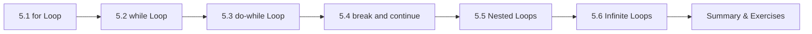

# Chapter 5: Loops

> **Previous:** [Control Flow](./04-control-flow.md) | **Next:** [Arrays](./06-arrays.md)

## Learning Objectives

- Write iterative code using `for`, `while`, and `do-while` loops
- Choose the appropriate loop construct for a given problem
- Control loop execution with `break` and `continue`
- Construct nested loops
- Avoid common loop errors including off-by-one and infinite loops


### Chapter at a Glance

| Topic | Key Insight | Practical Takeaway |
|-------|-------------|-------------------|
| for Loop | Iterate with init, condition, and increment in one line | Use `for` when the number of iterations is known |
| while Loop | Repeat while a condition holds | Use `while` when iterating until a condition changes |
| do-while Loop | Executes body at least once before checking condition | Use when the body must run before the first check |
| break and continue | `break` exits the loop; `continue` skips to the next iteration | `break` exits the innermost loop only |
| Nested Loops | Loops inside loops for multi-dimensional traversal | Inner loops reset completely on each outer iteration |





## 5.1 The `while` Loop

The `while` loop repeats a block of code as long as a condition remains true (non-zero). The condition is evaluated **before** each iteration.

```c
while (condition) {
    /* loop body */
}
```

```c
#include <stdio.h>

int main(void)
{
    int count = 1;

    while (count <= 5) {
        printf("Count: %d\n", count);
        count++;
    }

    return 0;
}
```

**Output:**
```
Count: 1
Count: 2
Count: 3
Count: 4
Count: 5
```

**Common pattern — reading until end of file:**
```c
int ch;
while ((ch = getchar()) != EOF) {
    putchar(ch);
}
```


> **One-Sentence Takeaway:** The for loop is best when the number of iterations is known in advance
> **Pro Tip:** Declare loop variables in the for init expression for C99+ scoped local variables.
## 5.2 The `do-while` Loop

The `do-while` loop is similar to `while`, but the condition is evaluated **after** each iteration. This guarantees the loop body executes at least once.

```c
do {
    /* loop body */
} while (condition);
```

```c
#include <stdio.h>

int main(void)
{
    int number;
    int sum = 0;

    do {
        printf("Enter a positive number (0 to stop): ");
        scanf("%d", &number);
        sum += number;
    } while (number > 0);

    printf("Sum of entered numbers: %d\n", sum);
    return 0;
}
```

**When to use `do-while`:** When the loop body must run at least once regardless of the condition — input validation loops, menu-driven programs.


> **One-Sentence Takeaway:** The while loop checks the condition before each iteration and may never execute
## 5.3 The `for` Loop

The `for` loop collects initialization, condition-checking, and update in one line.

```c
for (initialization; condition; update) {
    /* loop body */
}
```

```c
#include <stdio.h>

int main(void)
{
    for (int i = 1; i <= 5; i++) {
        printf("i = %d\n", i);
    }
    return 0;
}
```

**Output:**
```
i = 1
i = 2
i = 3
i = 4
i = 5
```

**Execution order:**

1. Initialization (`int i = 1`) — runs once before the loop begins.
2. Condition check (`i <= 5`) — evaluated before each iteration. If false, loop exits.
3. Loop body — executes if condition is true.
4. Update (`i++`) — runs after each iteration.
5. Go to step 2.

**Variations:**

```c
/* Multiple initializations and updates */
for (int i = 0, j = 10; i < j; i++, j--) {
    printf("i=%d j=%d\n", i, j);
}

/* Infinite loop */
for (;;) {
    /* runs forever unless break or return */
}

/* Empty body — for advancing a pointer */
char *p = str;
while (*p++ != '\0')
    ;
```


> **One-Sentence Takeaway:** The do-while loop guarantees at least one execution of the body
## 5.4 `break` and `continue`

### `break`

`break` exits the innermost loop immediately.

```c
#include <stdio.h>

int main(void)
{
    for (int i = 1; i <= 10; i++) {
        if (i == 5) {
            break;
        }
        printf("%d ", i);
    }
    printf("\n");
    return 0;
}
```

**Output:**
```
1 2 3 4
```

### `continue`

`continue` skips the remainder of the current iteration and proceeds to the next iteration.

```c
#include <stdio.h>

int main(void)
{
    for (int i = 1; i <= 10; i++) {
        if (i % 3 == 0) {
            continue;
        }
        printf("%d ", i);
    }
    printf("\n");
    return 0;
}
```

**Output:**
```
1 2 4 5 7 8 10
```

**Important for `while` loops:** With `continue` in a `while` loop, the update statement must appear before the `continue`, or you will create an infinite loop:

```c
/* BAD — infinite loop */
int i = 0;
while (i < 10) {
    if (i % 2 == 0) {
        continue;
    }
    i++;   /* never reached for even i */
}

/* CORRECT */
int i = 0;
while (i < 10) {
    if (i % 2 == 0) {
        i++;      /* update before continue */
        continue;
    }
    i++;
}
```


> **One-Sentence Takeaway:** Break exits the loop immediately; continue skips to the next iteration
> **Warning:** Break exits only the innermost loop in nested loop constructs.
## 5.5 Nested Loops

A loop inside another loop is a nested loop. The inner loop completes all its iterations for each iteration of the outer loop.

```c
#include <stdio.h>

int main(void)
{
    for (int i = 1; i <= 3; i++) {
        for (int j = 1; j <= 4; j++) {
            printf("(%d,%d) ", i, j);
        }
        printf("\n");
    }
    return 0;
}
```

**Output:**
```
(1,1) (1,2) (1,3) (1,4)
(2,1) (2,2) (2,3) (2,4)
(3,1) (3,2) (3,3) (3,4)
```

**Practical example — multiplication table:**
```c
#include <stdio.h>

int main(void)
{
    for (int i = 1; i <= 10; i++) {
        for (int j = 1; j <= 10; j++) {
            printf("%4d", i * j);
        }
        printf("\n");
    }
    return 0;
}
```

**Output:**
```
   1   2   3   4   5   6   7   8   9  10
   2   4   6   8  10  12  14  16  18  20
   3   6   9  12  15  18  21  24  27  30
   ...
  10  20  30  40  50  60  70  80  90 100
```

> **One-Sentence Takeaway:** Each level of nesting multiplies iterations — O(n × m) total complexity

## 5.6 Infinite Loops

An infinite loop runs indefinitely. Some are bugs; others are intentional.

**Intentional infinite loops:**
```c
/* Event loop in embedded systems */
while (1) {
    /* process events */
}

/* Server main loop */
for (;;) {
    /* accept connections */
}
```

**Bug — off-by-one in condition:**
```c
int i = 0;
while (i < 10);   /* <-- semicolon! infinite loop */
{
    printf("%d\n", i);
    i++;
}
```

The trailing semicolon creates a loop with an empty body. The `{...}` block is outside the loop entirely.


> **One-Sentence Takeaway:** Common loop patterns include sentinel controlled counter controlled and event driven
> **Remember:** while(1) is idiomatic for event loops as long as a break path exists.
## 5.7 Loop Selection Guide

| When to use | Construct |
|-------------|-----------|
| Known number of iterations | `for` |
| Unknown number of iterations, condition before | `while` |
| Must execute at least once | `do-while` |
| Iterating over an array | `for` with index |
| Iterating over a linked list | `while (ptr != NULL)` |
| Reading until EOF | `while ((c = getchar()) != EOF)` |

## 5.8 Common Loop Patterns

### Summation
```c
int sum = 0;
for (int i = 1; i <= n; i++) {
    sum += i;
}
```

### Counting
```c
int positive_count = 0;
for (int i = 0; i < size; i++) {
    if (arr[i] > 0) {
        positive_count++;
    }
}
```

### Searching
```c
int found_index = -1;
for (int i = 0; i < size; i++) {
    if (arr[i] == target) {
        found_index = i;
        break;
    }
}
```

### Input Validation Loop
```c
int age;
do {
    printf("Enter age (0-150): ");
    scanf("%d", &age);
} while (age < 0 || age > 150);
```

## Concept Comparison Table

| Loop Type | Condition Check | Minimum Executions | Use Case |
|-----------|----------------|-------------------|----------|
| `for` | Before each iteration | 0 | Known iteration count |
| `while` | Before each iteration | 0 | Condition-controlled repetition |
| `do-while` | After each iteration | 1 | Menu display / input validation |
| `for(;;)` | None (no condition) | Infinite | Event loops, servers |

## Quick Reference

| Loop | Syntax Snippet | Example |
|------|---------------|---------|
| for | `for(int i=0; i<n; i++)` | `for(int i=0; i<5; i++) printf("%d", i);` |
| while | `while(cond)` | `while(n > 0) { sum += n--; }` |
| do-while | `do { } while(cond);` | `do { c=getchar(); } while(c != '\n');` |
| Break | `if(cond) break;` | Exits loop when `cond` is true |
| Continue | `if(cond) continue;` | Skips to next iteration |

## Cross-Application Matrix

| Real-World Task | Loop Pattern |
|-----------------|-------------|
| Sum array elements | `for (int i = 0; i < len; i++)` |
| Read file until EOF | `while ((c = fgetc(f)) != EOF)` |
| Process command input | `do { prompt(); get_input(); } while (cmd != 'q');` |
| Matrix multiplication | `for(i...) for(j...) for(k...)` (nested 3 deep) |
| Network server accept loop | `for(;;) { client = accept(srv); handle(client); }` |

## Chapter Quiz

1. How many times does `for(int i=0; i<0; i++)` execute?
   A) 0
   B) 1
   C) Infinite
   D) Compiler error

<details><summary>Answer</summary>**A)** The condition `i < 0` is false immediately, so the body never executes.</details>

2. What does `while (1) { break; }` do?
   A) Runs forever
   B) Runs once, then breaks
   C) Compiler error
   D) Undefined behavior

<details><summary>Answer</summary>**B)** The `while (1)` creates an infinite loop, but `break` immediately exits.</details>

3. Which loop guarantees at least one execution of the body?
   A) `for`
   B) `while`
   C) `do-while`
   D) All of the above

<details><summary>Answer</summary>**C)** `do-while` checks the condition after the body runs, guaranteeing at least one execution.</details>

## Summary

- `while` loops check the condition before each iteration; `do-while` checks after.
- `for` loops consolidate initialization, condition, and update in one line — ideal for counted iteration.
- `break` exits the innermost loop immediately; `continue` skips to the next iteration.
- Nested loops execute the inner loop fully for each outer-loop iteration.
- Infinite loops are written with `while (1)` or `for (;;)`; accidental infinite loops are common bugs.
- Off-by-one errors occur when loop bounds are incorrect by exactly one iteration.

## Exercises

### Review Questions

1. Describe the execution order of the three clauses in a `for` loop: initialization, condition, update.
2. What is the difference between `break` and `continue`? Give an example where each is appropriate.
3. Why might you choose `while` over `for`? Why might you choose `do-while` over `while`?
4. What happens if you accidentally place a semicolon after the condition in a `while` loop?
5. How many times does `printf` execute in: `for (int i = 0; i < 5; i++) for (int j = 0; j < 3; j++) printf("*");`

### Application Problems

1. Write a program that prints all prime numbers between 2 and 100. Use nested loops.
2. Write a program that reads integers from the user until a negative number is entered, then prints the sum, count, and average of the positive numbers entered.
3. Write a program that prints the following diamond pattern for a user-specified size `n`:
```
    *
   ***
  *****
 *******
*********
 *******
  *****
   ***
    *
```
4. Write a program that performs a linear search: read 10 integers into an array, then read a target value and print its index (or `-1` if not found). Use `break` when found.

### Challenge Problem

Write a program that implements the Collatz conjecture. Read a positive integer `n` from the user. For each step: if `n` is even, `n = n / 2`; if `n` is odd, `n = 3 * n + 1`. Print each value until `n` reaches 1. Count and display the number of steps taken. The program should use a `while` loop and handle any starting value up to 2,000,000.
